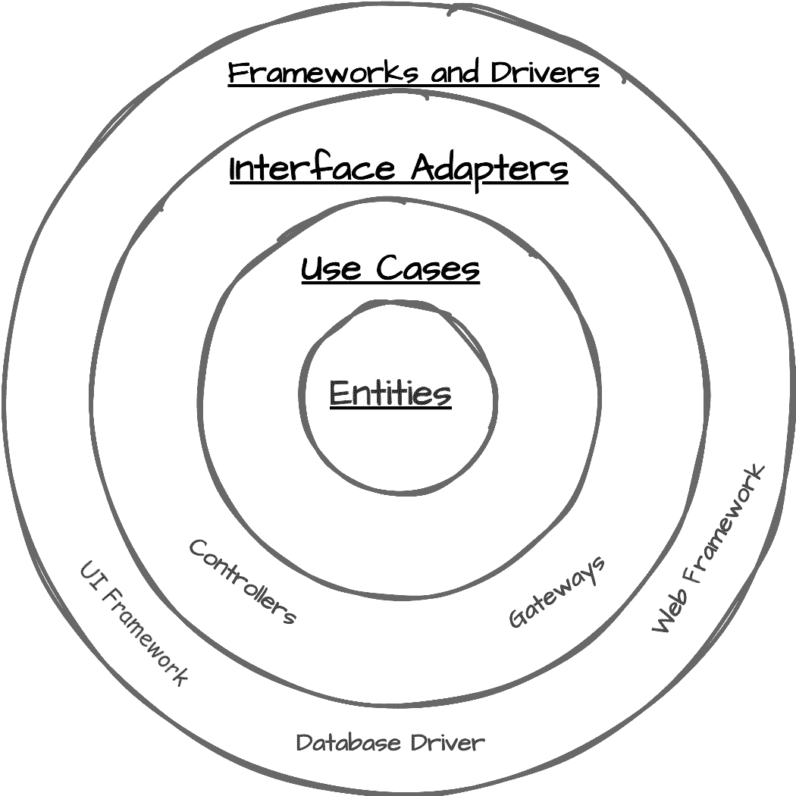
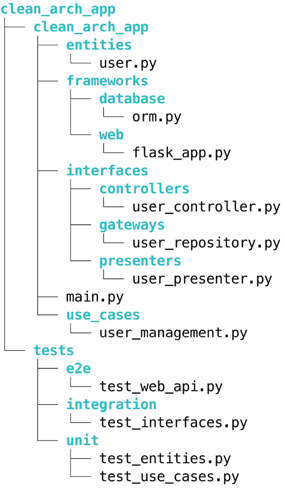
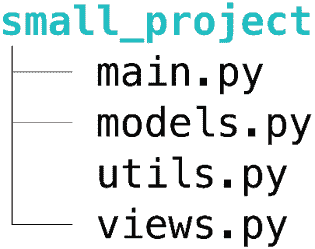

# 1

# 清洁架构要素：转型 Python 开发

作为 Python 开发者，我们应用最佳实践，如编写干净的函数、使用描述性变量名和追求模块化。然而，随着我们的应用程序增长，我们常常难以在规模上保持这种清晰性和适应性。Python 的简洁性和多功能性使其在从 Web 开发到数据科学等众多项目中变得流行，但这些优势在应用程序变得更加复杂时可能成为挑战。我们发现自己在缺乏一个总体规划，一个指导我们决策并保持项目在演变过程中可维护的总体架构。这就是**清洁架构**发挥作用的地方，它提供了一种构建 Python 应用程序的结构化方法，平衡了规划和敏捷性，为我们提供了可持续、大规模开发的架构指导。

清洁架构，由罗伯特·C·马丁于 2012 年提出([`blog.cleancoder.com/uncle-bob/2012/08/13/the-clean-architecture.html`](https://blog.cleancoder.com/uncle-bob/2012/08/13/the-clean-architecture.html))，将数十年的软件设计智慧综合成一套连贯的原则。它解决了软件开发中的一些持续挑战，如管理复杂性和适应变化。通过将清洁架构原则应用于 Python 项目，开发者可以创建不仅功能性强，而且随着时间的推移可维护、可测试和可适应的系统。

在本章中，我们将探讨清洁架构的本质及其与 Python 开发的关联。我们将研究清洁架构原则如何与 Python 的简洁性和可读性哲学相一致，从而创造一种自然协同效应，增强 Python 的优势。您将了解清洁架构如何帮助您构建易于理解、修改和扩展的 Python 应用程序，即使它们在复杂性增加的情况下也是如此。

到本章结束时，您将了解清洁架构原则及其对 Python 开发的潜在益处。您将了解这种方法如何解决软件开发中的常见挑战，尤其是在 Python 项目规模和复杂性增长时。这种对清洁架构的基础理解将是我们深入探讨其在 Python 中的实现和最佳实践的基础。

在本章中，我们将探讨以下主要主题：

+   为什么在 Python 中使用清洁架构：平衡规划和敏捷性的好处

+   什么是清洁架构？

+   清洁架构与 Python：天作之合

# 技术要求

本章中的代码片段仅用于演示目的，展示了一些章节中提到的主题和实践的应用。未来的章节将包含更复杂的代码示例，并注明具体要求。所有章节的代码都可以在本书配套的 GitHub 仓库中找到：[`github.com/PacktPublishing/Clean-Architecture-with-Python`](https://github.com/PacktPublishing/Clean-Architecture-with-Python)。

# 为什么 Python 中的 Clean Architecture：平衡规划和敏捷的好处

在本节中，我们将探讨 Python 开发中规划和敏捷之间的关键平衡，以及 Clean Architecture 如何帮助实现这种平衡。我们将研究现代 Python 应用程序日益增加的复杂性带来的挑战，以及当今快节奏商业环境中敏捷性的必要性。然后，我们将讨论规划和灵活性之间的权衡，以及架构思维如何为管理这些权衡提供一个框架。最后，我们将探讨架构在管理复杂性和为长期成功奠定基础中的作用。通过这些讨论，你将深入了解为什么 Clean Architecture 对于努力创建可维护、可适应和高效应用的 Python 开发者尤其有价值。

让我们从研究现代 Python 开发面临的复杂挑战开始。

## 现代 Python 开发中的复杂性挑战

随着 Python 的流行度飙升，用它构建的应用程序规模和复杂性也在增加。从网络服务到数据科学管道，Python 项目正在变得更大、更复杂。这种增长带来了重大的挑战，每个 Python 开发者都必须应对。

系统的日益复杂使得它们更难理解、修改和维护。这种复杂性可能会严重限制你添加新功能或应对变化需求的能力。复杂 Python 系统的维护负担可能会压垮开发团队，减缓进步和创新。即使是大型复杂系统中的微小变化也可能产生深远的影响，使得修改变得昂贵且风险高。

考虑一个虚构的大型基于 Python 的电子商务网站：PyShop。业务决定实施一个看似简单的功能：在订单中添加包装选项。然而，这个简单的添加很快就会演变成一个复杂的项目：

+   订单处理模块需要更新以包含包装选项

+   库存系统需要修改以跟踪包装材料

+   定价引擎需要调整以计算额外成本

+   用户界面（UI）必须更新以展示包装选项

+   配送系统需要更改以包含包装说明

原本估计为两周的任务延长成了多个月的项目。每一次变更都可能影响其他系统部分：订单处理的调整会影响报告，库存的变更会影响供应链管理，而用户界面修改需要广泛的用户体验测试。

这个例子突出了在复杂系统中相互关联的模块如何将简单的功能添加转变为一个重大的任务，强调了需要一个允许进行更独立变更和更容易测试过程的架构。

此外，随着 Python 项目的增长，开发者经常在抽象上遇到困难，这是 Clean Architecture 帮助解决的问题的一个关键方面。没有适当的指导，代码库可能会出现极端情况：要么变成难以理解和修改的深度嵌套类层次结构的混乱，要么退化成缺乏任何有意义抽象的“万能”类。在前一种情况下，开发者可能会创建过于复杂的继承结构以最大化代码重用，导致一个脆弱的系统，其中一处的变化会在其他地方产生不可预见的后果。在后一种情况下，缺乏抽象会导致庞大、难以驾驭的类和代码重复泛滥，几乎不可能保持一致性或进行系统性的变更。这两种情况都导致代码库难以理解、维护和扩展，这正是精心规划的架构有助于预防的问题。

此外，在当今快速发展的技术环境中，复杂且紧密耦合的系统难以利用新技术。这种限制可能会严重影响你在技术敏捷性至关重要的领域保持竞争力的能力。

## 敏捷性强制

在我们快节奏的商业环境中，敏捷性不仅仅是一个优势——它是一个必需品。随着每家公司本质上都成为一家科技公司，快速交付的压力从未如此之高。Python 的简单性和广泛的生态系统使其成为快速开发的绝佳选择。

然而，可持续的敏捷性不仅仅需要初始速度，它需要支持持续演化的架构决策。这就像建造一辆高性能的赛车：如果没有适当的设计基础，最初令人印象深刻的加速很快就会受到糟糕的操控和维护挑战的限制。

在快速发展的 Python 应用中，这一原则变得尤为明显。如果没有一个统一的架构，快速添加功能可能会造成错综复杂的依赖关系网。一开始灵活的代码库，几个月后可能会变得僵化且脆弱。开发者发现自己花更多的时间去解析现有代码，而不是编写新功能。当新代码应该添加在哪里或如何与现有组件交互并不立即清晰时，在压力下的开发者可能会做出仓促的决定，导致次优实现并引入错误。这些快速修复进一步复杂化了代码库，使得未来的更改更加困难。初始速度变得不可持续，不是因为速度本身，而是因为缺乏一个坚固的架构基础，这个基础可以引导快速变化并为新功能的集成提供清晰的路径。

需求经常变化，往往不可预测。您的 Python 项目需要以允许轻松适应这些变化的方式进行结构化。这种适应性对于软件开发的长远成功至关重要。

## 寻找规划与敏捷之间的平衡：规划-敏捷权衡

在规划与敏捷之间找到正确的平衡在 Python 开发中至关重要。正如 Dave Thomas 明智地说：“*一开始就进行大规模设计是愚蠢的。一开始就不进行设计则更愚蠢。*”关键在于找到既能提供结构又能提供灵活性的中间地带。

良好的架构可以帮助您推迟决策。它为您提供了灵活性，可以在拥有更多信息时将决策推迟到更晚的阶段，以便做出正确的选择。这种方法在 Python 开发中尤其有价值，因为该语言的灵活性有时会导致决策瘫痪。

在 Python 开发中引入架构思维意味着从一开始就考虑项目的长期结构，而不进行过度设计。这是关于创建一个指导开发同时又能适应变化的框架。

## 架构在管理复杂性中的作用

有效的架构是您在 Python 系统中管理复杂性的最佳工具。良好的架构通过提供清晰的结构和**关注点分离**（**SoC**）来简化复杂的系统。构建新系统的第一步之一是确定如何划分它，将因相同原因而改变的事物放在一起，将因不同原因而改变的事物分开。

考虑两个面向媒体公司的基于 Python 的**内容管理系统**（**CMS**），它们都被赋予了实施一个新的人工智能内容标记功能。在一个设计良好的系统中，这个功能被实现为一个独立的模块，具有清晰的接口。它通过定义良好的 API 与现有的内容创建和搜索模块无缝集成。开发者可以独立构建和测试 AI 标记服务，然后以最小的干扰将其连接到内容数据库和 UI。相反，在一个结构不佳的系统中，添加这个功能需要在整个堆栈中进行更改——从数据库模式到前端代码——导致意外的错误和性能问题。在良好架构的系统中所花费的冲刺时间，在结构不佳的系统中可能变成几个月的重构项目，这展示了深思熟虑的初始架构如何显著提高开发效率和系统适应性。

你在早期做出的架构决策将对 Python 项目的长期开发成本和灵活性产生深远影响。一个设计良好的系统可以显著降低随时间变化的成本，使你的团队能够更快地响应新的需求或技术变化。

## 准备清洁架构

当我们转向讨论清洁架构时，重要的是要理解它为 Python 项目提供了一个平衡规划和敏捷的系统方法。架构原则为你提供了管理并减少 Python 系统中复杂性的强大工具。

在其核心，清洁架构是关于在 Python 应用程序中进行战略性的 SoC（分离关注点）。它提倡一种结构，其中基本业务逻辑被隔离于外部因素，如 UI（用户界面）、数据库和第三方集成。这种分离在应用程序的不同部分之间创建了清晰的边界，每个部分都有其自己的职责。通过这样做，清洁架构允许你的核心业务规则保持纯净，不受**输入/输出**（**I/O**）机制或**数据管理系统**（**DMS**）的实现细节的影响。

通过理解这些挑战和原则，你将更好地准备去欣赏清洁架构（Clean Architecture）能为你的 Python 项目带来的好处。在接下来的章节中，我们将深入探讨清洁架构是什么，以及它如何具体应用于 Python 开发，为你提供对抗复杂性并降低软件系统变更成本的工具。

# 什么是清洁架构？

在探索了在 Python 开发中管理复杂性的挑战以及平衡规划与敏捷性的需求之后，本节的目标是为你提供一个关于 Clean Architecture 的高级概述。我们将快速连续地介绍几个关键概念和原则，以提供广泛的理解。如果你不能立即掌握所有细节，请不要担心。这仅仅是我们的旅程的开始。在接下来的章节中，我们将对这些主题进行深入探讨，其中我们将深入研究实际的 Python 实现和现实世界场景。

Clean Architecture 综合了许多来自先前架构风格的想法，但它围绕一个基本概念构建：将软件元素分离成环级别，并有一个严格的规则，即代码依赖只能从外部级别向内移动。这个原则正式称为**依赖规则**，它是 Clean Architecture 最关键方面之一。依赖规则指出，源代码依赖必须仅指向内部，即指向更高层次的策略。内圈必须对外圈一无所知，而外圈必须依赖并适应内圈。这确保了外部元素（如数据库、UI 或框架）的变化不会影响核心业务逻辑。目标是创建不仅功能强大，而且随着时间的推移可维护和可适应的软件系统。为了说明这一点，让我们考虑一个简单的用于图书馆管理系统的 Python 应用程序：

1.  在核心部分，我们有`Book`类，代表基本的数据结构。

1.  向外扩展，我们有`BookInventory`类，它管理书籍的操作。

1.  在外环中，我们有`BookInterface`类，它处理与书籍相关的用户交互。

在这个结构中，`Book`类对`BookInventory`或`BookInterface`类一无所知。`BookInventory`类可能会使用`Book`类，但不知道关于接口的信息。这种分离确保了核心逻辑不受外部关注的影响。

关键的是，这种结构允许我们修改或甚至替换外部层，而不会影响内部层。例如，我们可以通过修改`BookInterface`类将 UI 从命令行界面（CLI）更改为 Web 界面，而不需要修改`Book`或`BookInventory`类。这种灵活性是 Clean Architecture 方法的关键优势。

这种结构旨在产生体现我们之前介绍的关键原则的系统：

+   SoC（分离关注点）

+   外部细节的独立性

+   **可测试性**和**可维护性**

让我们进一步探讨 Clean Architecture 如何实现这些目标以及它为软件开发带来的好处。

## 洋葱架构概念

让我们可视化之前提到的环形层级，并添加另一个层级细节，以说明每个环的目的。清洁架构通常被描绘成一系列同心圆，就像洋葱一样。每个圆代表软件的不同层，我们讨论的依赖规则确保依赖只在这些边界内向内流动。核心层包含业务逻辑（实体），而外部层包含接口和实现细节（*见图 1.1*）：



图 1.1：清洁架构：一系列同心层

*图 1.1*展示了从内部核心业务逻辑向外到外部接口的分离：

+   **实体**：在中心是实体，它们封装企业级业务规则。在这个上下文中，实体是产品的主要**名词**，即使没有软件也存在的基本业务对象。例如，在电子商务系统中，实体可能包括*客户*、*产品*和*订单*。在任务管理应用程序中，它们可能是*用户*、*任务*和*项目*。这些实体包含关于这些对象如何行为和交互的最基本、最通用的规则。

+   **用例**：下一层包含用例，它们协调数据在实体之间流动。用例代表系统被使用的特定方式。它本质上是对系统在特定场景下应该如何行为的描述。例如，在任务管理应用程序中，用例可能包括*创建新任务*、*完成任务*或*分配任务*。用例包含特定于应用程序的业务规则，并控制如何以及何时使用实体来实现应用程序的目标。

+   **接口适配器**：进一步向外，我们发现接口适配器，它们在用例和外部机构之间转换数据。这一层充当内部层（实体和用例）和外部层之间的一组翻译器。它可能包括处理 HTTP 请求的控制器、格式化数据以供显示的演示者以及转换数据以进行持久化的网关。在 Python Web 应用程序中，这可能包括处理路由和请求处理的视图函数或类。这一层的关键点是它允许我们与框架解耦。

+   **框架和驱动程序**：最外层包含框架和驱动程序，其中驻留着**外部机构**。我们所说的**驱动程序**是指用于运行系统但不是业务逻辑核心的具体工具、框架和交付机制。在 Python 环境中，可能包括以下示例：

    +   Web 框架，如 Django 或 Flask

    +   数据库驱动程序，例如用于 PostgreSQL 的`psycopg2`或用于 MongoDB 的`pymongo`

    +   用于发送电子邮件（例如，`smtplib`）或处理支付等任务的外部库

    +   如果你在构建桌面或移动应用程序（例如，PyQt），则包含 UI 框架

    +   系统工具，用于执行诸如日志记录或配置管理之类的任务

最外层是最不稳定的，因为它是我们与外部世界互动的地方，也是技术最有可能随时间变化的地方。通过将其与我们的核心业务逻辑分开，我们可以更容易地更换这些外部工具，而不会影响我们应用程序的核心。

清洁架构的这种分层结构促进了 SoC（分离关注点），为软件系统建立了一个清晰的组织框架。现在我们已经了解了清洁架构的基本结构，让我们进一步探讨其更广泛的好处。

## 清洁架构的好处

清洁架构的一个主要优点是它专注于保护和隔离你的核心业务逻辑，即代表你业务基础的领域对象。虽然外部细节，如 Web 框架和持久化引擎，来来去去，但对你业务真正的价值在于在设计实现这些核心领域对象上投入的时间。清洁架构认识到这一点，并提供了一种结构，可以隔离这些关键组件，使其免受外部技术的波动性影响。

这种架构方法保护了你在领域逻辑上的投资，使其免于需要从一个给定的框架或技术迁移。例如，如果你正在使用的框架从开源模式迁移到专有模式，清洁架构允许你替换它，而无需重写你的核心业务逻辑。这种分离显著降低了随时间变化的风险和成本，使你的系统更容易随着需求的变化或需要适应新技术而进化。本质上，清洁架构确保了应用程序中最有价值且最稳定的部分，即你的业务逻辑，不受外部技术和框架经常动荡世界的影响。

另一个关键好处是增强了应用程序所有层的可测试性。核心业务逻辑与外部细节的独立性使得编写全面的单元测试变得容易得多。你可以在隔离的情况下测试业务规则，无需启动数据库或 Web 服务器或构建复杂的模拟。这导致了更彻底的测试，从而产生了更健壮的软件。这也鼓励开发者编写更多的测试，因为这个过程变得简单直接。

清洁架构还在技术选择上提供了灵活性。因为应用程序的核心不依赖于外部框架或工具，所以你可以根据需要自由替换这些元素。这在技术快速发展的世界中尤其有价值，因为今天流行的框架明天可能就过时了。同样，你可能从 CLI（命令行界面）用于内部使用开始，然后添加 Web 界面以实现更广泛的可访问性，所有这些都不需要改变你的核心业务规则代码。你的核心业务逻辑保持稳定，同时你有灵活性在出现时在外层采用新技术。最后，清洁架构促进了长期的发展敏捷性，并导致了罗伯特·C·马丁所说的*尖叫架构*([`blog.cleancoder.com/uncle-bob/2011/09/30/Screaming-Architecture.html`](https://blog.cleancoder.com/uncle-bob/2011/09/30/Screaming-Architecture.html))。它关注于分离关注点和管理依赖，结果是一个更容易理解和修改的代码库。尖叫架构的概念表明，当你查看系统的结构时，它应该大声喊出其目的和用例，而不是其框架或工具。例如，你的架构应该大声喊出*在线书店*，而不是*Django 应用程序*。这种清晰、以目的为导向的结构使得新团队成员能够快速理解系统的意图并做出贡献。架构本身成为了一种文档形式，一眼就能揭示系统的核心目的和功能。这种清晰性和灵活性在长期内转化为开发速度的提高，即使系统变得更加复杂。它还确保了你的系统始终专注于其核心业务逻辑，而不是被特定的技术实现所束缚。

## 清洁架构的背景

要充分欣赏清洁架构的价值，了解它在更广泛的软件开发实践和方法论背景中的位置是很重要的。

清洁架构代表了从传统分层架构的演变。虽然它建立在层概念的基础上，但它更加强调 SoC（关注点分离），并且比传统架构更严格地执行依赖规则。与传统分层架构不同，其中底层通常依赖于持久性或基础设施问题，清洁架构保持内部层纯净且专注于业务逻辑。这种关注点的转变使得架构具有更大的灵活性和对变化的适应性。

Clean Architecture 补充了现代开发实践，如 Agile 和 DevOps。它通过促进 **持续交付**（**CD**）和更容易应对变化而很好地与 Agile 方法论相吻合。清晰的 SoC 支持迭代开发，并使得根据不断变化的需求修改或扩展功能变得更加容易。在 DevOps 方面，Clean Architecture 通过使系统更易于测试和模块化来支持诸如 **持续集成和部署**（**CI/CD**）等实践。组件之间的清晰边界还可以帮助跨团队扩展开发，因为不同的团队可以以最小的干扰在不同的层或组件上工作。

总结来说，Clean Architecture 为构建可扩展、可维护且能够适应变化的软件系统提供了一种强大的方法。通过关注 SoC 并管理依赖关系，它提供了一种能够经受时间考验和适应技术及业务需求变化的压力的结构。随着我们进入下一节，我们将探讨这些原则如何特别适合 Python 开发实践。

# Clean Architecture 和 Python：天作之合

在我们探讨了 Clean Architecture 的原则和好处之后，你可能想知道这些概念与 Python 开发之间的契合度如何。在本节中，我们将发现 Clean Architecture 和 Python 具有天然的亲和力，使得 Python 成为实现 Clean Architecture 原则的绝佳语言。

Python 的哲学，体现在 *Python 的禅意*（[`peps.python.org/pep-0020/`](https://peps.python.org/pep-0020/)) 中，与 Clean Architecture 原则惊人地吻合。两者都强调简单性、可读性和良好结构代码的重要性。Python 专注于创建清晰、可维护和可适应的代码，为实施 Clean Architecture 提供了坚实的基础。随着我们深入本节，我们将探讨如何利用 Python 语言特性来创建符合 Clean Architecture 原则的健壮、可维护的系统。

## 在 Python 中实现 Clean Architecture

Python 的动态特性，结合其对 **面向对象编程**（**OOP**）和函数式编程范式的强大支持，使得开发者能够以比许多其他语言更少的样板代码和更高的清晰度来实现 Clean Architecture 的概念。

**关于代码示例的说明**

在本书中，你会在我们的代码示例中注意到类型注解（例如，`def function(parameter: type) -> return_type)`）。这些类型提示增强了代码的清晰度，并有助于强制执行 Clean Architecture 边界。我们将在 *第三章* 中深入探讨这一强大功能。

清洁架构的一个关键原则是依赖抽象而不是具体实现。这一原则直接支持我们之前讨论的依赖规则：依赖关系应仅指向内部。让我们看看如何使用 Python 的**抽象基类**（**ABCs**）在实践中实现这一点。

考虑以下示例，它模拟了一个通知系统：

```py
from abc import ABC, abstractmethod
class Notifier(ABC):
    @abstractmethod
    def send_notification(self, message: str) -> None:
        pass
class EmailNotifier(Notifier):
    def send_notification(self, message: str) -> None:
        print(f"Sending email: {message}")
class SMSNotifier(Notifier):
    def send_notification(self, message: str) -> None:
        print(f"Sending SMS: {message}")
class NotificationService:
    def __init__(self, notifier: Notifier):
        self.notifier = notifier
    def notify(self, message: str) -> None:
        self.notifier.send_notification(message)
# Usage
email_notifier = EmailNotifier()
email_service = NotificationService(email_notifier)
email_service.notify("Hello via email") 
```

这个例子展示了使用 Python 的 ABCs 实现清洁架构的关键概念：

1.  **ABC**：`Notifier`类是一个 ABC，定义了一个所有通知类都必须遵循的接口。这代表了我们清洁架构结构中的内环。

1.  **抽象方法**：`Notifier`中的`send_notification`方法用`@abstractmethod`标记，强制在子类中实现。

1.  **具体实现**：`EmailNotifier`和`SMSNotifier`是外环中的具体类。它们继承自`Notifier`并提供特定的实现。

1.  **依赖倒置**：`NotificationService`类依赖于抽象的`Notifier`类，而不是具体实现。这遵循了依赖规则，因为抽象的`Notifier`类（内环）不依赖于具体的通知类（外环）。我们将在下一章更深入地探讨依赖倒置。

这种结构体现了我们讨论过的清洁架构原则：

+   **它尊重依赖规则**：抽象的`Notifier`类（内环）对具体的通知类或`NotificationService`类（外环）一无所知

+   **它允许轻松扩展**：我们可以在不修改`NotificationService`类的情况下添加新的通知类型（例如`PushNotifier`）

+   **它促进灵活性和可维护性**：核心业务逻辑（发送通知）与实现细节（如何发送通知）分离

通过这种方式组织我们的代码，我们创建了一个既灵活又易于维护的系统，同时遵循清洁架构的基本原则。抽象的`Notifier`类代表我们的核心业务规则，而具体的通知类和`NotificationService`类代表更易变的外层。这种分离使我们能够轻松地交换或添加新的通知方法，而不会影响我们应用程序的核心逻辑。

因此，我们已经看到了一个简单的 ABC 示例，但这是 Python 真正发光的地方。我们可以不使用类层次结构来实现相同的清洁架构原则，而是依赖 Python 对**鸭子类型**（[`en.wikipedia.org/wiki/Duck_typing`](https://en.wikipedia.org/wiki/Duck_typing)）的支持。这种灵活性是 Python 的强大之处，允许开发者选择最适合他们项目需求的方法，同时仍然遵循清洁架构原则。

鸭式编程是一种编程概念，其中对象的适用性由某些方法或属性的存在来决定，而不是其显式类型。这个名字来源于谚语，“如果它像鸭子走路，像鸭子嘎嘎叫，那么它一定是一只鸭子。”在鸭式编程中，我们不在乎对象类型；我们关心的是它是否能做我们需要它做的事情。

这种方法与清洁架构强调的抽象和接口很好地对齐。如果你希望避免僵化的类层次结构，Python 3.8 中引入的`Protocol`功能（[`peps.python.org/pep-0544/`](https://peps.python.org/pep-0544/)）提供了两全其美的解决方案：鸭式编程与类型提示。以下是一个使用协议实现相同通知系统的示例：

```py
from typing import Protocol
class Notifier(Protocol):
    def send_notification(self, message: str) -> None:
        ...
class EmailNotifier: # Note: no explicit inheritance
    def send_notification(self, message: str) -> None:
        print(f"Sending email: {message}")
class SMSNotifier: # Note: no explicit inheritance
    def send_notification(self, message: str) -> None:
        print(f"Sending SMS: {message}")
class NotificationService:
    # Still able to use type hinting
    def __init__(self, notifier: Notifier):
        self.notifier = notifier
    def notify(self, message: str) -> None:
        self.notifier.send_notification(message)
# Usage
sms_notifier = SMSNotifier()
sms_service = NotificationService(sms_notifier)
sms_service.notify("Hello via SMS") 
```

这个例子演示了与之前相同的通知系统，但使用 Python 的`Protocol`功能而不是 ABC。让我们分析一下关键差异及其对清洁架构的影响：

+   **协议与 ABC 的比较**：`Notifier`类现在是一个`Protocol`类，而不是`ABC`类。它定义了一个结构化子类型接口，而不是要求显式继承。

+   **隐式遵从**：`EmailNotifier`和`SMSNotifier`类并没有显式地从`Notifier`类继承，但它们通过实现`send_notification`方法来符合其接口。

+   **带类型提示的鸭式编程**：这种方法结合了 Python 的鸭式编程灵活性以及静态类型检查的好处，与清洁架构强调的松耦合对齐。

+   **具体实现**：`NotificationService`类仍然依赖于抽象的`Notifier`协议，而不是具体实现，遵循清洁架构原则。

这种基于协议的方法提供了灵活的 Pythonic 清洁架构概念的实现，在类型安全与减少类层次结构刚性之间取得平衡。它展示了如何将清洁架构原则与 Python 的哲学相结合，促进可适应和可维护的代码。

我们强烈推荐在实现清洁架构时使用通过 ABC 或协议进行的类型提示。与简单隐式接口不进行类型提示的方法相比，这种方法提供了显著的优势：

+   提高代码可读性

+   增强 IDE 支持并提前错误检测

+   更好地与清洁架构目标对齐

在本书的剩余部分，我们将主要在我们的示例中使用 ABC，因为它们在现有的 Python 代码库中应用得更广泛。然而，讨论的原则同样适用于基于协议的实现，读者可以根据个人喜好将示例调整为使用协议。

## 实际示例：在 Python 项目中一瞥清洁架构

为了说明我们讨论的概念，让我们检查 Clean Architecture Python 项目的结构。这种结构体现了我们讨论过的原则，并展示了它们如何转化为实际的文件组织。在这里我们将保持高层次；后面的章节将详细介绍真实世界的例子：



图 1.2：Clean Architecture Python Web 应用程序的潜在布局

*图 1.2*中的这种文件结构展示了我们讨论过的 Clean Architecture 原则：

1.  **SoC**：每个目录代表应用程序的一个独立层，与我们在*图 1.1*中看到的同心圆相一致。

1.  **依赖规则**：该结构强制执行我们之前讨论过的依赖规则。如果我们调查内层（`entities`和`use_cases`），我们将不会看到来自外部层的任何导入。

1.  **实体层**：`entities`目录包含核心业务对象，如`user.py`。这些是我们 Clean Architecture 图中的中心，对外层没有依赖。

1.  **用例层**：`use_cases`目录包含应用程序特定的业务规则。它依赖于实体，但独立于外部层。

1.  **接口适配层**：`interfaces` 目录包含控制器、演示者和网关。这些适配器在用例和外部机构（如 Web 框架或数据库）之间转换数据。

1.  **框架层**：最外层的`frameworks`目录包含外部接口的实现，如数据库**对象关系映射器**（ORMs）或 Web 框架。

1.  **简单测试**：`tests`目录结构与应用程序结构相匹配，允许在所有级别进行全面的测试。

这种结构支持我们讨论过的 Clean Architecture 的关键好处：

+   **可维护性**：对`frameworks`目录中外部组件的更改不会影响实体和用例中的核心业务逻辑。

+   **灵活性**：我们可以轻松地替换`frameworks`目录中的数据库或 Web 框架，而不需要触及业务逻辑。

+   **可测试性**：清晰的分离允许轻松地对核心组件进行单元测试，并对接口进行集成测试。

记得我们关于抽象的讨论吗？`interfaces`目录是我们实现我们讨论的 ABCs 或协议的地方。例如，`user_repository.py`可能定义一个抽象的`UserRepository`类，然后在`frameworks/database/orm.py`文件中具体实现。

这种结构也促进了我们之前提到的*总体规划*。它为新代码提供清晰的路线图，帮助开发者即使在项目增长和演变过程中也能做出一致的决策。

通过以这种方式组织我们的 Python 项目，我们正在为长期成功打下基础，创建一个不仅功能性强而且可维护、灵活且与 Clean Architecture 原则一致的代码库。

## Python 特定的考虑因素和潜在陷阱

虽然 Clean Architecture 和 Python 非常兼容，但在 Python 项目中实施这些原则时，有一些重要的考虑因素需要注意。在本书中，我们将引导您缓解这些担忧，提供实用的解决方案和最佳实践。

### 平衡 Python 代码与架构原则

Python 的 *batteries included* 哲学和广泛的标准库有时会诱使开发者为了方便而绕过架构边界。然而，保持干净的架构通常涉及在标准库函数周围创建抽象，以维护 SoC。例如，在您的用例中，您可以考虑创建一个用于发送通知的抽象层，而不是直接使用 Python 的 `smtplib` 库。

随着我们通过本书的进展，我们将展示创建抽象的努力如何在可维护性、灵活性和可测试性方面带来回报。您将看到对 Clean Architecture 原则的初始投资带来了显著的长远利益。

Python 的导入便捷性有时会导致混乱的依赖结构，因为所有包实际上都是公开的。我们将向您展示如何保持对依赖规则的警觉，确保内层不依赖于外层。在 *第二章* 中，我们将探讨技术和工具，以帮助您在 Python 项目中维护干净的依赖结构。

### 在 Python 项目中扩展 Clean Architecture

应根据您 Python 项目的规模和复杂性来定制 Clean Architecture 原则的应用。

例如，在小项目或快速原型中，拥有一个简单、单一架构是完全可行的。然而，即使在这些情况下，以深思熟虑、模块化的方式构建也可以为未来的增长奠定基础。您可能从以下简单结构开始：



图 1.3：快速原型 Python 项目

在这个小型项目中，您仍然可以通过以下方式应用 Clean Architecture 原则：

+   将业务逻辑（实体和用例）与 `views.py` 中的展示逻辑分开，放在 `models.py` 中

+   使用 **依赖注入**（**DI**）使组件更模块化和可测试

+   在模块之间定义清晰的接口

随着您的项目增长，您可以逐步向更全面的 Clean Architecture 结构发展。这种演变可能包括以下内容：

1.  将核心业务逻辑（实体和用例）分离到它们自己的模块中

1.  引入接口以抽象化框架特定的代码

1.  将测试组织与架构层对齐

本书采用动手实践的方法，从基本应用程序和清洁架构原则的实用应用开始。随着我们的进展，示例应用程序的复杂性将增加，展示如何随着代码库的增长而演进清洁架构方法。

清洁架构是一个连续体，而不是一个二元选择。我们将探讨的模式代表了一个全面的实现，旨在展示清洁架构的全部功能，但在实践中，你可能会选择只实现那些为你特定环境提供明确价值的模式。一个小型 API 可能从清洁控制器模式中受益，而不需要完整的展示器抽象，而数据处理脚本可能采用领域实体，而完全跳过接口适配器。你将学会如何明智地应用这些原则，避免在小项目中过度设计，同时在大型系统中充分利用清洁架构的全部力量。关键是理解每个模式提供的内容，以便你可以就哪些架构边界对你的项目最重要做出明智的决定。

### 适当利用 Python 的动态特性

虽然 Python 的动态特性很强大，但如果使用不当也可能导致问题。*第三章*致力于 Python 动态特性的各个方面，包括鸭子类型、类型提示的使用以及像协议这样的新特性。到本章结束时，你将有一个坚实的基础，了解如何最好地利用这些语言特性来支持清洁架构方法，平衡 Python 的灵活性与架构的严谨性。

### 测试注意事项

这本书，就像清洁架构本身一样，强烈推崇测试的使用。测试本质上是你应用程序代码的一等客户，使用代码库并对结果进行断言。适用于你的主要代码库的相同架构考虑因素也适用于你的 Python 测试。

我们将指导你编写尊重架构边界的测试。你将学会识别你的测试何时表明你的架构中存在潜在问题，例如当它们需要过多的设置或模拟时。在每个章节的代码示例的测试用例中，最终在第*第八章*中，我们将深入探讨这些概念，展示如何使用测试不仅用于验证，而且作为维护和改进你的架构的工具。

通过意识到这些考虑因素和潜在陷阱，并遵循本书中提供的指导，你可以创建既清洁又实用的 Python 系统，利用清洁架构和 Python 的优势。记住，关键是深思熟虑地应用这些原则，始终着眼于创建可维护、可测试和灵活的 Python 代码。

# 摘要

在本章中，我们从高层次介绍了清晰架构及其与 Python 开发的关联。通过探讨软件架构的演变，从瀑布到敏捷，突出了在管理复杂性、适应变化和维护长期生产力方面存在的持续挑战。

我们介绍了清晰架构的核心原则：

+   关注点分离（SoC）

+   外部细节的独立性

+   可测试性和可维护性

我们考察了清晰架构的一般结构，从核心实体和用例到外层的接口适配器、框架和驱动器，强调了这种结构如何促进可维护性和灵活性。我们讨论了清晰架构的好处，包括提高适应性、增强可测试性和长期开发敏捷性，以及它是如何与现代开发实践如敏捷和 DevOps 相辅相成的。

此外，我们探讨了清晰架构与 Python 之间的自然契合度，讨论了如何利用 Python 的特性有效地实现清晰架构。我们还强调了 Python 特定的考虑因素和潜在陷阱，强调需要在 Python 代码的优雅性与架构原则之间取得平衡，并适应不同规模的项目。

在本章中，我们介绍了清晰架构的主要目标，并探讨了它与 Python 开发的自然契合度。我们看到了如何利用 Python 的特性，如 ABCs 和协议，来实现清晰架构原则，为创建可维护和灵活的软件系统奠定基础。

在下一章中，我们将在此基础上深入探讨 SOLID 原则。这些原则是清晰架构的基石，将通过实际的 Python 示例进行深入探讨，展示它们如何有助于构建健壮和可扩展的应用程序设计。

# 进一步阅读

要了解更多关于本章涵盖的主题，请查看以下资源：

+   《清晰架构：软件结构和设计的工匠指南》由罗伯特·C·马丁所著。这本书全面地审视了清晰架构的起源。

+   《领域驱动设计：软件核心的复杂性处理》由埃里克·埃文斯所著。虽然这本书并非专门针对清晰架构，但它提供了关于围绕业务领域设计软件的宝贵见解。

+   《敏捷软件开发：原则、模式和实践》由罗伯特·C·马丁所著。这本书涵盖了在敏捷开发背景下支撑清晰架构的许多原则。

+   《程序员修炼之道：从小工到专家》由安德鲁·亨特和戴维·托马斯所著。这本经典书籍提供了与清晰架构原则相吻合的软件设计和开发实用建议。
