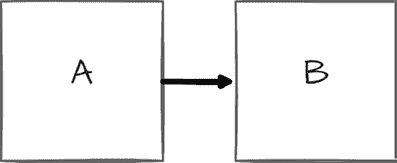
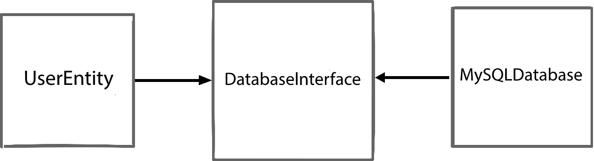
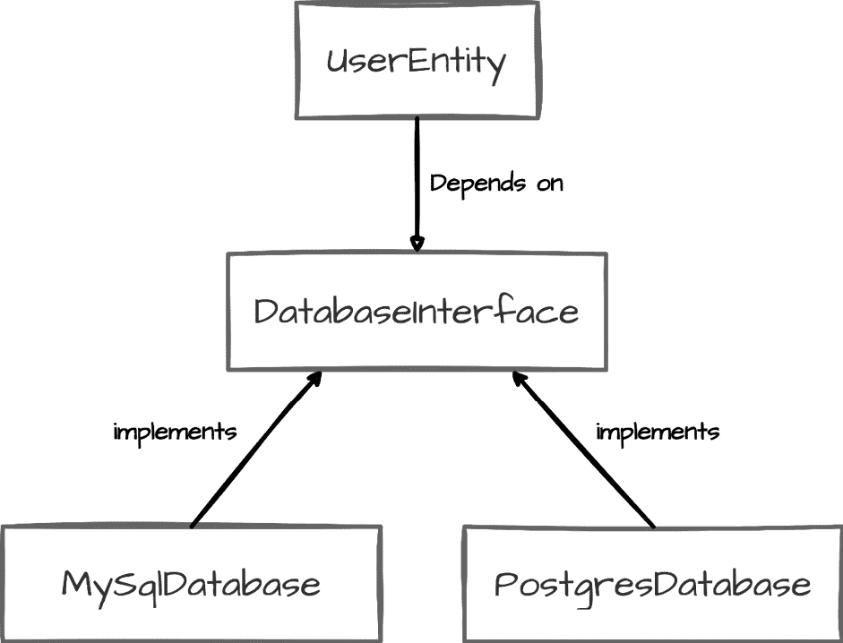

# 第二章：SOLID 基础：构建稳健的 Python 应用程序

在上一章中，我们探讨了清洁架构，这是一种构建可维护、灵活和可扩展的 Python 应用程序的强大方法。我们学习了它是如何将关注点分离到不同的层中，从核心业务逻辑到外部接口，促进独立性和可测试性。现在，我们将更深入地探讨构成清洁架构基础的一系列原则。这些被称为**SOLID 原则**。

缩写 SOLID（[`en.wikipedia.org/wiki/SOLID`](https://en.wikipedia.org/wiki/SOLID)）代表了面向对象编程和设计的五个关键原则。当正确应用时，这些原则有助于开发者创建更易于理解、灵活和可维护的软件结构。在本章中，我们将深入探讨这些原则的每个方面，重点关注它们在 Python 中的应用以及它们如何支持我们之前讨论的清洁架构目标。

到本章结束时，你将清楚地理解以下方面：

+   **单一职责原则**（**SRP**）及其在创建专注、可维护的代码中的作用

+   **开闭原则**（**OCP**）及其如何使构建可扩展的系统成为可能

+   **接口隔离原则**（**ISP**）及其在 Python 的鸭子类型中的应用

+   环境

+   **里氏替换原则**（**LSP**）及其在设计稳健抽象中的重要性

+   **依赖倒置原则**（**DIP**）及其在支持清洁架构依赖规则中的关键作用

我们将通过 Python 开发的视角来审视每个原则，提供实际示例和最佳实践。你将学习如何应用这些原则，以便能够编写更干净、更易于维护的 Python 代码，为在你的项目中实施清洁架构打下坚实的基础。

# 技术要求

本章和本书其余部分提供的代码示例均使用 Python 3.13 进行测试。为了简洁，章节中的代码示例可能只部分实现。所有示例的完整版本可以在本书配套的 GitHub 仓库[`github.com/PacktPublishing/Clean-Architecture-with-Python`](https://github.com/PacktPublishing/Clean-Architecture-with-Python)中找到。

**关于我们将如何介绍 SOLID 原则的顺序的说明**

虽然 SOLID 原则传统上按照其首字母缩写的顺序介绍，但本书采用了一种更战略性的顺序。我们将从 SRP 开始，然后是 OCP，接着是 ISP，然后是 LSP，最后是 DIP。每个部分的开始将详细说明其主题与之前主题之间的关系。这种顺序从编写干净的、模块化的代码到设计灵活、可维护的系统，直接支持清洁架构的目标。

# 精心打造专注、可维护的代码：单一职责的力量

在软件设计的层次结构中，我们顶部有高级架构，然后是组件、模块、类，最后是函数。SOLID 原则主要在模块级别起作用，为创建结构良好、易于维护的代码提供指导。这些模块级实践构成了良好架构的基础，包括 Clean Architecture。通过应用 SOLID 原则，我们可以创建松散耦合、高度内聚的组件，这些组件更容易进行测试、修改和扩展。这些品质是 Clean Architecture 的基本属性。

## 理解单一职责

单一职责原则（SRP）指出，每个软件模块应该只有一个且仅有一个变更的理由（[`blog.cleancoder.com/uncle-bob/2014/05/08/SingleReponsibilityPrinciple.html`](https://blog.cleancoder.com/uncle-bob/2014/05/08/SingleReponsibilityPrinciple.html)）。

初看，*单一职责*的概念可能看起来很简单。然而，在实践中，定义和实现它可能具有挑战性。让我们考虑一个简单的例子来说明这个原则。

让我们考虑一个旨在在社交媒体应用程序中作为实体的`User`类。回想一下，Clean Architecture 中的实体应该代表具有最一般规则的核心业务对象：

```py
class User:
    def __init__(self, user_id: str, username: str, email: str):
        self.user_id = user_id
        self.username = username
        self.email = email
        self.posts = []
    def create_post(self, content: str) -> dict:
        post = {
            "id": len(self.posts) + 1,
            "content": content,
            "likes": 0         }
        self.posts.append(post)
        return post
    def get_timeline(self) -> list:
        # Fetch and return the user's timeline
        # This might involve complex logic to fetch and
        # sort posts from followed users
        pass
    def update_profile(self, new_username: str = None,
                       new_email: str = None):
        if new_username:
            self.username = new_username
        if new_email:
            self.email = new_email 
```

初始时，这个`User`类可能看起来合理。它封装了用户数据，并为社交媒体应用程序中的常见用户操作提供了方法。然而，尽管旨在成为一个实体，但它与在*第一章*中引入的 Clean Architecture 概念有显著偏差。记住，实体应该代表封装最一般和最高级规则的核心业务对象，独立于特定的应用行为或外部关注点。我们当前的`User`类通过承担过多的职责违反了这些原则：

+   用户数据管理（处理`user_id`、`username`和`email`）

+   创建后和管理工作

+   时间线生成

+   个人资料更新

这种结构将核心用户数据与应用特定的行为相结合，违反了 SRP 和实体概念。随着产品的增长，这个类可能会成为瓶颈，导致开发挑战、合并冲突和意外的副作用。

在识别和分离职责时，请考虑以下建议：

+   寻找对类数据的不同子集进行操作的多个方法组

+   考虑不同类型的变更或需求会影响哪些方面

+   使用*变更理由*启发式方法：如果你能想到一个类变更的多个理由，考虑将其拆分

让我们重构我们的`User`类，使其遵循 SRP 和实体概念：

```py
class User:
    def __init__(self, user_id: str, username: str, email: str):
        self.user_id = user_id
        self.username = username
        self.email = email
class PostManager:
    def create_post(self, user: User, content: str):
        post = {
            "id": self.generate_post_id(),
            "user_id": user.user_id,
            "content": content,
            "likes": 0
        }
        # Logic to save the post
        return post
    def generate_post_id(self):
        # Logic to generate a unique post ID
        pass
class TimelineService:
    def get_timeline(self, user: User) -> list:
        # Fetch and return the user's timeline
        # This might involve complex logic to fetch and
        # sort posts from followed users
        pass
class ProfileManager:
    def update_profile(self, user: User, new_username: str = None,
                       new_email: str = None):
        if new_username:
            user.username = new_username
        if new_email:
            user.email = new_email
        # Additional logic for profile updates,
        # like triggering email verification 
```

这个重构版本不仅更紧密地遵循 SRP，而且与 Clean Architecture 中的实体概念相一致。让我们分析这些更改及其影响：

+   `User`: 现在简化到其本质，用户类真正体现了一个实体。它封装了最通用和最高级的规则，独立于特定应用行为。它只有一个职责：管理核心用户数据。

+   `PostManager`: 这承担了创建和管理帖子的专注职责。

+   `TimelineService`: 这处理时间线生成逻辑的独立部分。

+   `ProfileManager`: 这管理个人资料更新，进一步减少 `User` 类的职责。

这些类现在都有一个清晰、专注的角色，遵循 SRP 并促进关注点的分离。这次重构带来了几个好处：

+   **提高可维护性和可测试性**：每个类都有一个单一、明确的目的，这使得它更容易理解、修改和独立测试

+   **更大的灵活性和减少耦合**：我们可以扩展或修改系统的一个方面，而不会影响其他方面，这使得我们的代码库更能适应变化

这种模块化和灵活的设计与清洁架构原则相吻合，为我们的系统不同组件之间创造了清晰的边界。虽然对于小型应用程序来说可能有些过度，但它为更可维护和可扩展的系统奠定了基础。

记住，我们中的大多数人都在开发我们希望成功的应用程序。随着成功而来的是功能请求、转型和扩展挑战。从一开始就通过明智地应用 SRP 为这种增长做准备，可以在以后节省大量的重构工作，创建一个随着系统发展既灵活又可理解的架构。

## SRP 和测试

具有单一职责的类通常更容易测试，因为它们有更少的依赖和边缘情况。这促进了可测试系统的创建，这是清洁架构的一个关键原则。例如，测试 `PostManager` 变得简单：

```py
import unittest
from post_manager import PostManager
from user import User
class TestPostManager(unittest.TestCase):
    def test_create_post(self):
        user = User("123", "testuser", "test@example.com")
        post_manager = PostManager()
        post = post_manager.create_post(user, "Hello, world!")

        self.assertEqual(post["user_id"], "123")
        self.assertEqual(post["content"], "Hello, world!")
        self.assertEqual(post["likes"], 0)
        self.assertIn("id", post) 
```

这个测试案例展示了 SRP 为单元测试带来的清晰性。在这里，具有单一职责的 `PostManager` 可以在隔离状态下轻松测试，无需复杂的设置或模拟。我们可以直接验证创建帖子后的所有基本方面。这种测试的简单性是 SRP 的直接好处，并与清洁架构原则相符。随着系统的日益复杂，独立测试单个职责的能力变得至关重要。它使我们能够保持高代码质量，早期发现问题，并随着系统的发展，与测试套件一起进化，确保每个专注组件的正确性，而无需依赖复杂的集成测试。

## 平衡 SRP

虽然 SRP 是一个强大的原则，但重要的是不要将其推向极端。过度应用 SRP 可能导致大量微小类和函数的爆炸式增长，这可能会使整个系统更难以理解和导航。错误地将 SRP 理解为“应该只做一件事的类或模块”可能会导致创建过多的微小类。这个原则是关于单一变更原因，而不是严格关于单一执行动作。

关键是要找到一个平衡点，其中每个代码单元（无论是类、函数还是模块）都有一个清晰、一致的目的，而不会变得过于细分以至于整体结构变得碎片化。记住，SRP 的目标是使你的代码更易于维护和理解。如果拆分一个类或函数使整个系统更难以理解，可能不是正确的做法。运用你的判断力，并始终考虑你特定应用的上下文。

总结来说，SRP 为创建可维护和灵活的代码提供了一个强大的基础。通过确保每个模块或类都有一个单一、明确的目的，我们可以为易于理解、修改和扩展的系统奠定基础。正如我们所看到的，关键是找到适合你特定上下文的正确平衡，以避免过度复杂的类或微小、碎片化组件的爆炸式增长。

这种平衡应用的原则贯穿于整洁架构的始终。我们探索的每个模式和抽象层都提供了特定的好处，如提高可测试性、易于维护和增强灵活性，但也增加了复杂性。随着你阅读本书的进展，请通过你具体的需求来审视每个模式。一个构建最小可行产品（MVP）的初创公司可能会推迟一些抽象，直到增长需求出现，而一个企业级系统可能从第一天起就受益于完整的架构方法。以单一职责原则（SRP）作为我们的起点，我们现在准备探索开放封闭原则（OCP）是如何在这个基础上构建的。

# 构建可扩展系统：在 Python 中拥抱开放封闭设计

在探索了 SRP 及其在创建专注、可维护的类中的作用后，我们将把注意力转向稳健软件设计的另一个关键方面：可扩展性。开放封闭原则（OCP）由伯特兰·迈耶于 1988 年提出（[`en.wikipedia.org/wiki/Open%E2%80%93closed_principle`](https://en.wikipedia.org/wiki/Open%E2%80%93closed_principle)），它建立在 SRP 的基础上。它指导我们创建所谓的“对扩展开放但对修改封闭”的系统。这意味着我们应该能够添加新功能而不改变现有代码，本质上是通过新代码扩展我们的系统行为，而不是修改现有的内容。

OCP 是我们 SOLID 原则工具箱中的一个强大工具，因为它与 SRP 协同工作，创建模块化、灵活的代码。它解决了软件开发中一个常见的挑战：如何在不改变现有、经过测试的代码的情况下添加新功能或行为。通过遵循 OCP，我们可以设计我们的 Python 类和模块，以便它们可以轻松扩展，降低在添加新功能时引入错误的风险。

在 Clean Architecture 的背景下，OCP 在创建能够随着时间的推移适应变化的系统中起着至关重要的作用。它支持创建稳定的核心业务逻辑，在添加新功能或适应新技术时保持不变。当我们探索 Python 中的 OCP 时，我们将看到它如何有助于构建符合 Clean Architecture 原则的易于维护、可扩展的应用程序。

让我们通过一个不同形状面积计算器的实际例子来探讨这个原则。考虑以下初始实现：

```py
class Rectangle:
    def __init__(self, width, height):
        self.width = width
        self.height = height
class Circle:
    def __init__(self, radius):
        self.radius = radius
class AreaCalculator:
    def calculate_area(self, shape):
        if isinstance(shape, Rectangle):
            return shape.width * shape.height
        elif isinstance(shape, Circle):
            return 3.14 * shape.radius ** 2
        else:
            raise ValueError("Unsupported shape")
# Usage
rectangle = Rectangle(5, 4)
circle = Circle(3)
calculator = AreaCalculator()
print(f"Rectangle area: {calculator.calculate_area(rectangle)}")
print(f"Circle area: {calculator.calculate_area(circle)}") 
```

这里，我们有一个简单的`AreaCalculator`类，它可以计算矩形和圆的面积。然而，这种设计违反了 OCP 原则。如果我们想添加对新形状的支持，例如三角形，我们就需要修改`AreaCalculator`类的`calculate_area`方法。这种修改可能会在现有正常工作的代码中引入错误。

为了遵循 OCP 原则，我们需要重构我们的代码，以便在不修改现有的`AreaCalculator`类的情况下添加新的形状。以下是我们可以如何重构这段代码以实现 OCP 原则：

```py
from abc import ABC, abstractmethod
import math
class Shape(ABC):
    @abstractmethod
    def area(self):
        pass
class Rectangle(Shape):
    def __init__(self, width, height):
        self.width = width
        self.height = height

    def area(self):
        return self.width * self.height
class Circle(Shape):
    def __init__(self, radius):
        self.radius = radius

    def area(self):
        return math.pi * self.radius ** 2
class AreaCalculator:
    def calculate_area(self, shape: Shape):
        return shape.area()
# Usage
rectangle = Rectangle(5, 4)
circle = Circle(3)
calculator = AreaCalculator()
print(f"Rectangle area: {calculator.calculate_area(rectangle)}")
print(f"Circle area: {calculator.calculate_area(circle)}")
# Adding a new shape without modifying AreaCalculator
class Triangle(Shape):
    def __init__(self, base, height):
        self.base = base
        self.height = height

    def area(self):
        return 0.5 * self.base * self.height
triangle = Triangle(6, 4)
print(f"Triangle area: {calculator.calculate_area(triangle)}") 
```

在这个重构版本中，我们为了遵循 OCP 的概念进行了几个关键更改：

+   我们引入了一个具有`area`方法的抽象`Shape`类。这作为所有形状必须实现的接口。

+   每个具体形状（`Rectangle`、`Circle`和现在的`Triangle`）都从`Shape`继承，并实现了自己的`area`方法。

+   `AreaCalculator`类现在依赖于抽象的`Shape`类，而不是具体的实现。它对任何接收到的形状对象调用`area`方法，而无需知道具体的形状类型。

+   我们现在可以添加新的形状（如`Triangle`），而不需要修改`AreaCalculator`类。系统对扩展是开放的，但对修改是封闭的。

这种重构设计展示了 OCP 的实际应用，同时也保持了遵循 SRP。让我们检查关键方面：

+   **对扩展开放**：我们可以添加新的形状（如`Triangle`），而不需要修改现有代码。每个形状类都有单一的责任，即定义其属性并计算其自身的面积。

+   **对修改封闭**：在添加新形状时，核心的`AreaCalculator`类保持不变，这展示了对其修改的封闭性。

+   **多态性**：通过使用抽象的`Shape`类，我们可以统一处理不同的形状对象。这使得`AreaCalculator`可以通过一个公共接口与任何形状一起工作，而无需了解具体的实现。

这种设计完美符合 Clean Architecture 的目标：

+   **可扩展性**：在不干扰现有已测试代码的情况下，可以满足新的需求（如添加形状）

+   **核心逻辑的隔离**：每个形状的面积计算受到外部变化的保护

+   **可测试性**：职责的清晰分离促进了直接的单元测试

通过结合 OCP（开闭原则）和 SRP，我们为构建更大、更复杂的系统奠定了基础，这些系统可以在不变得脆弱的情况下进行演化。这个例子虽然很小，但展示了如何在 Python 中有效地应用 Clean Architecture 原则来创建组织良好、可维护且能够适应变化需求的系统。

# ISP：根据客户端定制接口

随着我们深入探讨 SOLID 原则，我们已经看到 SRP 如何促进专注的类和 OCP 如何实现可扩展性。现在，我们将把注意力转向这些类向世界暴露的接口。接口分离原则（ISP）([`en.wikipedia.org/wiki/Interface_segregation_principle`](https://en.wikipedia.org/wiki/Interface_segregation_principle)）指导我们创建精简、目的特定的接口，以满足其客户端的精确需求。这个原则对于开发灵活、模块化的 Python 代码至关重要，这些代码易于理解且易于维护。

ISP 不仅建立在 SRP（单一职责原则）引入的单一职责概念之上，而且在接口级别上应用它。它主张设计专注于特定任务的接口，而不是试图包含过多职责的接口。这种方法导致更灵活、可维护的系统，因为客户端只依赖于它们实际使用的那些方法。

为了说明 ISP 的重要性以及它与过度承担职责的类之间的关系，让我们考虑一个多媒体播放器系统的例子：

```py
from abc import ABC, abstractmethod
class MultimediaPlayer(ABC):
    @abstractmethod
    def play_media(self, file: str) -> None:
        pass
    @abstractmethod
    def stop_media(self) -> None:
        pass
    @abstractmethod
    def display_lyrics(self, file: str) -> None:
        pass
    @abstractmethod
    def apply_video_filter(self, filter: str) -> None:
        pass
class MusicPlayer(MultimediaPlayer):
    def play_media(self, file: str) -> None:
        # Implementation for playing music
        print(f"Playing music: {file}")
    def stop_media(self) -> None:
        # Implementation for stopping music
        print("Stopping music")
    def display_lyrics(self, file: str) -> None:
        # Implementation for displaying lyrics
        print(f"Displaying lyrics for: {file}")
    def apply_video_filter(self, filter: str) -> None:
        # This method doesn't make sense for a MusicPlayer
        raise NotImplementedError(
            "MusicPlayer does not support video filters")
class VideoPlayer(MultimediaPlayer):
    # Implementation for video player
    ... 
```

这种设计违反了 ISP，试图做太多（方法过多）。让我们检查由此产生的问题：

+   **不必要的方法和混乱的 API**：在这里，`MusicPlayer`被迫实现`apply_video_filter`，这对于一个仅播放音频的播放器来说是没有意义的。这导致尴尬的实现和潜在的运行时错误。此外，`MusicPlayer`类的用户在接口中看到`apply_video_filter`这样的方法，这可能导致对类实际能做什么的困惑。这种缺乏清晰性使得类更难正确使用，并增加了误用的风险。

+   **缺乏模块化**：接口不允许轻松创建专门的播放器。例如，我们无法轻松创建一个仅显示歌词的显示，而不需要实现媒体播放方法。这种僵化的结构限制了可扩展性和重用性，使得适应新的需求或用例变得困难。

+   **增加维护负担**：如果我们以后想向`MultimediaPlayer`接口添加更多视频特定功能，每次都需要更新所有实现类，即使这些功能对其中一些类并不相关。这使得系统更难进化，并增加了在更改时引入错误的风险。

这些问题展示了违反 ISP 如何导致代码不灵活、混乱且难以维护。通过解决这些问题，我们可以创建一个更模块化、灵活且易于使用的架构。

让我们重构这个设计，使其符合 ISP：

```py
from abc import ABC, abstractmethod
class MediaPlayable(ABC):
    @abstractmethod
    def play_media(self, file: str) -> None:
        pass
    @abstractmethod
    def stop_media(self) -> None:
        pass
class LyricsDisplayable(ABC):
    @abstractmethod
    def display_lyrics(self, file: str) -> None:
        pass
class VideoFilterable(ABC):
    @abstractmethod
    def apply_video_filter(self, filter: str) -> None:
        pass
class MusicPlayer(MediaPlayable, LyricsDisplayable):
    def play_media(self, file: str) -> None:
        print(f"Playing music: {file}")
    def stop_media(self) -> None:
        print("Stopping music")
    def display_lyrics(self, file: str) -> None:
        print(f"Displaying lyrics for: {file}")
class VideoPlayer(MediaPlayable, VideoFilterable):
    def play_media(self, file: str) -> None:
        print(f"Playing video: {file}")
    def stop_media(self) -> None:
        print("Stopping video")
    def apply_video_filter(self, filter: str) -> None:
        print(f"Applying video filter: {filter}")
class BasicAudioPlayer(MediaPlayable):
    def play_media(self, file: str) -> None:
        print(f"Playing audio: {file}")
    def stop_media(self) -> None:
        print("Stopping audio") 
```

在这个重构设计中，我们利用 Python 的**抽象基类**（**ABCs**）创建了一组专注的接口。这种方法允许我们为不同的功能定义清晰的合同，而无需强迫类实现它们不需要的方法。通过将原始的单个接口分解成更小、更具体的接口，我们创建了一个符合 ISP 的灵活结构。让我们来检查这个重构设计的关键组件：

+   `MediaPlayable`：这个接口专注于播放和停止媒体，这是所有媒体播放器共享的核心功能

+   `LyricsDisplayable`：通过将歌词显示分离到其自己的接口中，我们确保了不支持歌词的类（如`VideoPlayer`）不会被强迫实现不必要的方法

+   `VideoFilterable`：这个接口隔离了视频特定功能，防止仅支持音频的播放器实现不相关的功能

现在具体的类（`MusicPlayer`、`VideoPlayer`和`BasicAudioPlayer`）仅实现与其功能相关的接口。这种设计使得创建和使用不同类型的媒体播放器变得简单。例如，`MusicPlayer`可以播放媒体并显示歌词，而`BasicAudioPlayer`只需实现媒体播放功能。这种灵活性使得通过组合相关接口创建新类型的播放器变得简单，无需承担实现不必要方法的负担。

让我们总结 ISP 的整体好处：

+   **降低耦合**：类只依赖于它们实际使用的功能

+   **提高可维护性**：对某一方面的更改（例如，视频过滤）不会影响无关的类

+   **增强灵活性**：我们可以轻松地通过组合相关接口创建新类型的播放器

+   **更好的可测试性**：我们可以通过将测试集中在特定功能上来更容易地模拟接口

这种由 ISP 驱动的设计通过创建与特定用例一致的清晰、专注的接口来支持 Clean Architecture。回想一下第一章，在 Clean Architecture 中，用例代表特定于应用程序的业务规则，描述系统如何以及何时使用实体来实现其目标。ISP 通过允许我们为每个用例定义精确的接口来促进这一点。例如，`LyricsDisplayable` 接口直接支持*显示歌词*用例，而不会给其他播放器类型带来负担。这种方法允许构建更模块化的系统，其中组件可以独立发展，使得实现新的用例或修改现有用例而不会影响系统的不相关部分变得更加容易。因此，我们的应用程序可以更容易地适应变化的需求，同时保持其核心业务逻辑的完整性。

总结来说，ISP 通过鼓励设计专注、具体的接口，引导我们创建更灵活、可维护的系统。通过将 ISP 与 SRP 和 OCP 结合使用，我们可以创建易于理解、测试和扩展的 Python 代码。ISP 帮助我们避免类试图*做太多*的陷阱，正如 OCP 帮助我们避免类试图*成为太多事物*的陷阱。这些原则共同支持了 Clean Architecture 的目标，帮助我们创建能够适应变化需求同时保持清晰、模块化结构的系统。

# 从僵化到灵活：在 Python 中重新思考继承和接口

在我们探讨了单一职责、开闭和接口分离原则之后，我们为创建模块化、可扩展和专注的代码奠定了基础。这些原则指导我们构建类和接口的结构，使其更易于维护和适应。现在，我们将注意力转向 Liskov 替换原则（LSP），它补充并加强了我们所讨论的原则。

虽然 SRP 引导我们创建专注、内聚的类，OCP 允许我们在不修改现有组件的情况下扩展我们的代码，而 ISP 促进创建特定、客户定制的接口。LSP 确保我们的抽象是良好形成的，并且我们的组件确实是可互换的。这一原则对于通过确保我们的继承层次结构具有可预测的行为来创建健壮、灵活的系统至关重要。

在 Clean Architecture 的背景下，LSP 在支持 OCP 承诺的灵活性和 SRP 及 ISP 鼓励的专注设计方面发挥着至关重要的作用。当我们深入研究 LSP 时，我们将看到它是如何与其他 SOLID 原则协同工作，以创建一个不仅模块化，而且可靠且易于使用和扩展的系统。

## 理解 LSP

Liskov 替换原则（LSP）是由 Barbara Liskov 在 1987 年提出的（[`en.wikipedia.org/wiki/Liskov_substitution_principle`](https://en.wikipedia.org/wiki/Liskov_substitution_principle)），为创建行为可预测且直观的继承层次结构提供了指导。在其核心，LSP 是关于在整个继承层次结构中维护基类合约的完整性。

这里是 LSP 告诉我们的内容：

+   基类定义了一个用户可以依赖的合约。这个合约由一系列行为和属性组成。

+   子类不应更改或破坏这个合约。它们必须遵守基类做出的承诺。

+   子类可以扩展或细化合约，使其更具体，但它们不能减少或违反原始合约。

换句话说，如果我们有一个基类，那么它的任何子类都应该能够代替这个基类，而不会破坏程序或违反基类设定的期望。

这个原则有几个关键原因：

+   **可预测性**：当遵循 LSP 时，基类的用户可以信任所有派生类将以与基类一致的方式行为。这使得系统更具可预测性，更容易推理。

+   **灵活性**：LSP 允许我们有效地使用多态。我们可以编写与基类一起工作的代码，并相信它将正确地与任何子类一起工作。

+   **可扩展性**：通过确保子类遵守基类合约，我们创建了一个更容易扩展的系统。可以添加新的子类，而不用担心会破坏依赖于基类的现有代码。

然而，遵循 LSP（里氏替换原则）并不总是直截了当的。它需要我们仔细思考如何建模我们的对象及其关系。让我们通过一个例子来看看违反 LSP 可能导致的问题，以及我们如何重构我们的代码来遵循这一原则。

## 刻板层次结构的陷阱

考虑一个用于管理不同车辆类型及其燃料消耗的系统：

```py
class Vehicle:
    def __init__(self, fuel_capacity: float):
        self._fuel_capacity = fuel_capacity
        self._fuel_level = fuel_capacity
    def fuel_level(self) -> float:
        return self._fuel_level
    def consume_fuel(self, distance: float) -> None:
        # Assume 10 km per liter for simplicity:
        fuel_consumed = distance / 10
        if self._fuel_level - fuel_consumed < 0:
            raise ValueError("Not enough fuel to cover the distance")
        self._fuel_level -= fuel_consumed 
```

这个`Vehicle`类代表了一个典型的基于燃料的车辆。现在，让我们引入一个继承自`Vehicle`的`ElectricCar`类：

```py
class ElectricCar(Vehicle):
    def __init__(self, battery_capacity: float):
        super().__init__(battery_capacity)
    def consume_fuel(self, distance: float) -> None:
        # Assume 5 km per kWh for simplicity:
        energy_consumed = distance / 5
        if self._fuel_level - energy_consumed < 0:
            raise ValueError("Not enough charge to cover the distance")
        self._fuel_level -= energy_consumed 
```

初看之下，这可能会被认为是一个合理的做法。然而，它导致了一些问题：

+   它违反了 LSP，因为`ElectricCar`不能替代`Vehicle`而不引起不正确的行为

+   `ElectricCar`类改变了*燃料消耗*的含义，违反了`Vehicle`类建立的合约

+   它创建了一个脆弱的设计，其中与`Vehicle`一起工作的函数可能会在`ElectricCar`上默默地产生不正确的结果

为了说明这一点，考虑以下函数：

```py
def drive_vehicle(vehicle: Vehicle, distance: float) -> None:
    initial_fuel = vehicle.fuel_level()
    vehicle.consume_fuel(distance)
    fuel_consumed = initial_fuel - vehicle.fuel_level()
    print(f"Fuel consumed: {fuel_consumed:.2f} liters")
# Usage
car = Vehicle(50)  # 50 liter tank
drive_vehicle(car, 100)  # Works fine
electric_car = ElectricCar(50)  # 50 kWh battery
drive_vehicle(electric_car, 100) # This prints incorrect fuel consumption 
```

这个`drive_vehicle`函数对`Vehicle`类工作正常，但对`ElectricCar`类产生误导性的输出。这些问题源于将`ElectricCar`强制与`Vehicle`建立继承关系，尽管电动汽车的能量消耗与基于燃料的车辆不同。这是在建模“是”关系时过于字面化的一种常见陷阱。

## 采用 LSP（里氏替换原则）的灵活性

让我们重构它，使其符合 LSP（里氏替换原则）。我们首先定义一个电源的抽象基类：

```py
from abc import ABC, abstractmethod
class PowerSource(ABC):
    def __init__(self, capacity: float):
        self._capacity = capacity
        self._level = capacity
    def level(self) -> float:
        return self._level
    @abstractmethod
    def consume(self, distance: float) -> float:
        pass 
```

现在，我们可以为不同类型的电源创建具体的实现：

```py
class FuelTank(PowerSource):
    def consume(self, distance: float) -> float:
        # Assume 10 km per liter for simplicity:
        fuel_consumed = distance / 10
        if self._level - fuel_consumed < 0:
            raise ValueError("Not enough fuel to cover the distance")
        self._level -= fuel_consumed
        return fuel_consumed
class Battery(PowerSource):
    def consume(self, distance: float) -> float:
        # Assume 5 km per kWh for simplicity:
        energy_consumed = distance / 5
        if self._level – energy_consumed < 0:
            raise ValueError("Not enough charge to cover the distance")
        self._level -= energy_consumed
        return energy_consumed 
```

定义了这些电源后，我们可以创建一个更灵活的`Vehicle`类：

```py
class Vehicle:
    def __init__(self, power_source: PowerSource):
        self._power_source = power_source
    def power_level(self) -> float:
        return self._power_source.level()
    def drive(self, distance: float) -> float:
        return self._power_source.consume(distance) 
```

最后，我们可以更新我们的`drive_vehicle`函数，使其与这个新设计兼容：

```py
def drive_vehicle(vehicle: Vehicle, distance: float) -> None:
    try:
        energy_consumed = vehicle.drive(distance)
        print(f"Energy consumed: {energy_consumed:.2f} units")
    except ValueError as e:
        print(f"Unable to complete journey: {e}")
# Usage
fuel_car = Vehicle(FuelTank(50))  # 50 liter tank
drive_vehicle(fuel_car, 100)  # Prints: Energy consumed: 10.00 units
electric_car = Vehicle(Battery(50))  # 50 kWh battery
drive_vehicle(electric_car, 100)  # Prints: Energy consumed: 20.00 units 
```

这个重构的设计展示了 LSP（里氏替换原则）的实际应用。关键变化是引入了抽象和关注点的分离。我们将电源的概念与车辆本身解耦，允许不同类型的电源可以互换使用。这种抽象是通过`PowerSource`基类实现的，它为所有类型的能源源定义了一个通用接口。

让我们分解这个新设计的核心组件：

+   **“**`PowerSource`**”抽象基类**：这定义了一个所有电源都必须满足的`level`和`consume`方法的合同。它为不同类型的能源源建立了通用接口。

+   **具体实现（**`FuelTank`和`Battery`**）**：这些类从`PowerSource`继承，并提供了`consume`方法的具体实现。关键的是，它们维护了由`PowerSource`定义的行为合同。

+   **“**`Vehicle`**”类**：这个类依赖于抽象的`PowerSource`基类，而不是具体的实现。这种对 LSP（里氏替换原则）的遵守允许任何`PowerSource`的子类可以互换使用，而不会影响`Vehicle`的行为。

+   **“**`drive_vehicle`**”函数**：这个函数展示了 LSP（里氏替换原则）如何实现多态。它可以与任何`Vehicle`类一起工作，无论其具体的电源是什么，而无需修改。

LSP（里氏替换原则）对这个设计的影响是多方面的。它确保了行为一致性，允许所有电源都能被`Vehicle`类统一处理。这种多态灵活性使得像`drive_vehicle`这样的函数可以与任何车辆类型一起工作，而无需了解具体的实现细节。该设计提高了可扩展性，因为可以通过实现`PowerSource`接口来添加新的电源（如氢燃料电池），而无需更改现有代码。它还通过允许我们创建用于测试`Vehicle`行为的模拟电源来增强可测试性。

通过遵循 LSP（里氏替换原则），我们创建了一个灵活的系统，其中核心业务逻辑免受特定电源实现变化的影响。这种分离是 Clean Architecture 的关键方面，它促进了长期稳定性，同时使扩展变得容易。LSP 与其他 SOLID 原则和谐共存：它通过确保接口具有明确的目的而建立在 SRP（单一职责原则）之上，通过允许在不修改的情况下进行扩展而支持 OCP（开闭原则），并通过促进专注的、可替换的接口来补充 ISP（接口隔离原则）。

这种一致性增强了模块化，这是 Clean Architecture 的基石。像 `FuelTank` 和 `Battery` 这样的组件可以在不影响系统其他部分的情况下进行交换，使我们的应用程序能够以最小的干扰进行演变。清晰的接口，如 `PowerSource`，使系统更容易理解和导航，无论开发者是新加入项目还是几个月后返回，都可作为指南。

总之，LSP 指导我们创建既灵活又可靠的层次结构。通过确保派生类可以真正替换其基类，我们构建了更健壮、可扩展的 Python 应用程序，与 Clean Architecture 的目标保持一致。当我们继续探索 DIP 时，请记住 LSP 如何与其他 SOLID 原则一起形成一个强大的工具包，用于创建持久的应用程序。

# 为了灵活性而解耦：在 Python 中反转依赖关系

在探索 LSP 及其在创建健壮抽象中的作用后，我们看到了它如何有助于我们 Python 代码的灵活性和可维护性。现在让我们将注意力转向 SOLID 谜题的最后一部分：依赖倒置原则（DIP）。

DIP（依赖倒置原则）作为 SOLID 原则的基石，将我们之前原则中探讨的概念联系起来并加强。它为我们系统不同组件之间的关系提供了一个强大的结构化机制，进一步增强了我们在通过 SOLID 的旅程中构建的灵活性和可维护性。

虽然 LSP 确保我们的抽象结构良好且可替换，但 DIP 关注这些抽象应该如何相互关联。它指导我们创建一个结构，其中高级模块不依赖于低级模块，但两者都依赖于抽象。这种传统依赖结构的反转对于在 Python 中实现 Clean Architecture 至关重要，因为它允许我们创建真正解耦且能够适应变化的系统。

当我们深入研究 DIP（依赖倒置原则）时，我们将看到它如何提供一种实现依赖规则的实际方法，这是我们在 *第一章* 中介绍的 Clean Architecture 的基石。回忆一下，依赖规则指出源代码依赖应仅指向内部，内部圈包含高级策略，外部圈包含实现细节。DIP 提供了一种具体策略来遵守这一规则，使我们能够构建代码结构，使高级模块独立于低级模块。让我们探讨如何反转我们的依赖关系，以创建更灵活、可维护的 Python 系统，真正体现 Clean Architecture 的原则并尊重依赖规则。

## 理解 DIP

在我们深入 DIP 的复杂性之前，让我们明确在软件设计上下文中我们所说的 *依赖于* 是什么意思。考虑这个简单的代码示例：

```py
class A:
    def __init__(self):
        self.b = B()
class B:
    def __init__(self):
        pass 
```

在这种情况下，我们说 `A` 依赖于 `B`。这种依赖关系体现在 `A` 知道 `B`。这在创建 `B` 实例的行中很明显：`self.b = B()`。然而，`B` 对 `A` 一无所知。我们通常用从 `A` 指向 `B` 的箭头来表示这种依赖关系，如图 *图 2.1* 所示：



图 2.1：A 依赖于 B

这个简单的例子为理解 DIP 旨在解决的问题奠定了基础。在许多软件系统中，高级模块（包含核心业务逻辑）通常依赖于低级模块（处理特定细节或实现）。这可能导致难以修改和维护的不灵活设计。

为了说明这一点，让我们考虑一个更具体的例子，它涉及一个依赖于底层细节的 `UserEntity` 类：

```py
class UserEntity:
    def __init__(self, user_id: str):
        self.user_id = user_id
        # Direct dependency on a low-level module:
        self.database = MySQLDatabase()
    def save(self):
        self.database.insert("users", {"id": self.user_id})
class MySQLDatabase:
    def insert(self, table: str, data: dict):
        print(f"Inserting {data} into {table} table in MySQL") 
```

在这个例子中，`UserEntity` 直接依赖于低级模块 `MySQLDatabase`。现在，假设我们收到一个支持多个数据库系统的功能请求。按照当前的设计，我们需要修改 `UserEntity` 以适应这一变化，这违反了 OCP（开闭原则），并可能将错误引入我们的核心业务逻辑。以下是一些与这种设计相关的问题：

+   `UserEntity` 类与 `MySQLDatabase` 紧密耦合，这使得未来更改数据库系统变得困难

+   测试 `UserEntity` 变得具有挑战性，因为我们不能轻易地用一个模拟数据库来替换测试目的

+   核心业务逻辑（`UserEntity`）被基础设施关注点（数据库操作）所污染

## 使用 DIP 修复设计

由罗伯特·C·马丁（[`en.wikipedia.org/wiki/Dependency_inversion_principle`](https://en.wikipedia.org/wiki/Dependency_inversion_principle)）提出的 DIP，为前面例子中看到的问题提供了一个解决方案。它陈述如下：

+   高级模块不应该依赖于低级模块。两者都应依赖于抽象。

+   抽象不应当依赖于细节。细节应当依赖于抽象。

这两个要点从根本上改变了我们构建代码的方式。我们不再让高层和低层模块之间有直接的依赖关系，而是引入了两者都依赖的抽象。然而，DIP 的关键洞察力实际上在于什么被**反转**了：

+   传统上，低层模块定义抽象，高层模块使用这些抽象。

+   根据 DIP，高层模块定义抽象，低层模块实现这些抽象

这种抽象所有权的反转是 DIP 名称的由来，而不仅仅是模块间依赖方向的简单反转。现在，高层模块控制抽象，而低层模块则遵循它。这种控制权的转变使得高层模块可以独立于低层实现细节，从而促进系统设计的灵活性和可维护性。

让我们看看这是如何改变我们的依赖图的：



图 2.2：A 和 B 依赖于一个接口

如*图 2.2*所示，依赖现在指向抽象，反转了传统的流向。高层模块（`A`）和低层模块（`B`）都依赖于一个抽象（接口），而不是直接依赖于对方。这种变化是深刻的：`A`不再*知道*`B`；而是知道一个*类似*`B`的东西将遵守的契约。

这种从具体知识到抽象契约的转变具有深远的影响：

+   **解耦** **和灵活性**：现在，`A`与`B`的具体实现细节解耦，只知道它必须满足的契约。这使我们能够轻松地交换或升级组件，而不会影响系统的其余部分，使其更能适应未来的需求。

+   **提高可测试性**：我们可以创建实现接口的模拟对象，用于测试目的，这样我们就可以在无需复杂设置的情况下单独测试组件。

+   **清晰性和封装性**：接口清楚地定义了组件之间的交互，使代码更具自文档性。实现上的变化被限制在内部，减少了系统中的连锁反应。

+   **设计由契约驱动**：这种方法鼓励以接口而不是具体实现来思考，从而促进设计更优、更模块化的系统，这些系统更容易理解和维护。

通过遵循 DIP，我们不仅仅是改变依赖的方向；我们从根本上改变了系统不同部分之间的交互方式。这创造了一个更松散耦合、灵活且可维护的架构，能够更好地经受时间的考验和不断变化的需求。

为了使我们的`UserEntity`代码与 DIP（依赖倒置原则）保持一致，我们需要引入一个高层和低层模块都可以依赖的抽象。这种抽象通常以接口的形式出现。让我们重构我们的代码，使其遵循 DIP：

```py
from abc import ABC, abstractmethod
class DatabaseInterface(ABC):
    @abstractmethod
    def insert(self, table: str, data: dict):
        pass
class UserEntity:
    def __init__(self, user_id: str, database: DatabaseInterface):
        self.user_id = user_id
        self.database = database
    def save(self):
        self.database.insert("users", {"id": self.user_id})
class MySQLDatabase(DatabaseInterface):
    def insert(self, table: str, data: dict):
        print(f"Inserting {data} into {table} table in MySQL")
class PostgreSQLDatabase(DatabaseInterface):
    def insert(self, table: str, data: dict):
        print(f"Inserting {data} into {table} table in PostgreSQL")
# Usage
mysql_db = MySQLDatabase()
user = UserEntity("123", mysql_db)
user.save()
postgres_db = PostgreSQLDatabase()
another_user = UserEntity("456", postgres_db)
another_user.save() 
```

在这个重构版本中，我们做了以下操作：

+   我们引入了一个抽象（`DatabaseInterface`），它既被高级模块（`UserEntity`）也被低级模块（`MySQLDatabase`，`PostgreSQLDatabase`）所依赖。

+   `UserEntity`类不再创建其数据库依赖，而是通过构造函数接收它。这种技术被称为依赖注入，它是实现 DIP 的关键实践。

+   我们可以通过创建实现`DatabaseInterface`的新类来轻松添加对新数据库系统的支持。

*图 2.3* 表示这些组件之间新关系的状态：



图 2.3：UserEntity 与具体存储类解耦

此图表的重要性体现在几个关键方面：

+   **反转依赖和抽象作为契约**：`UserEntity`类依赖于`DatabaseInterface`抽象，而不是具体的实现。该接口作为任何数据库实现的契约。

+   **关注点分离**：`UserEntity`类与特定的数据库操作解耦，只知道`DatabaseInterface`中定义的抽象操作。

+   **可扩展性和灵活性**：这种设计使我们能够轻松添加新的数据库实现，并在它们之间进行交换，而不会影响`UserEntity`。

通过应用 DIP，我们创建了一个灵活、可维护的系统，其中我们的核心业务逻辑（`UserEntity`）免受外部细节（数据库实现）变化的影响。这种分离是 Clean Architecture 的基石，它促进了长期系统的稳定性和适应性。前面的图表显示了多个实现（`MySQLDatabase`和`PostgreSQLDatabase`）如何共存，展示了这种基于抽象方法的力量。我们可以轻松添加更多实现，例如`OracleDatabase`或`MongoDBAdapter`，而无需修改`UserEntity`，进一步说明了 DIP 的可扩展性优势。

## DIP 对测试的影响

正如我们通过其他 SOLID 原则所看到的，依赖注入的使用显著有助于测试。我们现在可以轻松地为测试创建一个模拟数据库`UserEntity`：

```py
class MockDatabase(DatabaseInterface):
    def __init__(self):
        self.inserted_data = []
    def insert(self, table: str, data: dict):
        self.inserted_data.append((table, data))
# In a test
mock_db = MockDatabase()
user = UserEntity("test_user", mock_db)
user.save()
assert mock_db.inserted_data == [("users", {"id": "test_user"})] 
```

这种轻松替换依赖的能力使我们的代码更容易测试，允许我们在与任何实际数据库实现隔离的情况下验证`UserEntity`的行为。

## DIP 在 SOLID 和 Clean Architecture 中的上下文

DIP 在 SOLID 原则和 Clean Architecture 中都起着基石的作用。它通过使接口定义与实现分离，并支持系统行为的轻松扩展，补充了其他 SOLID 原则。在 Clean Architecture 中，DIP 对于实施依赖规则至关重要，它允许内部层定义外部层必须遵守的接口。这种反转将业务逻辑与实现细节分离，创建出更灵活、可维护和可测试的系统，与 Clean Architecture 的目标完美契合。

# 摘要

在本章中，我们探讨了 SOLID 原则及其在 Python 中的应用，以创建干净、可维护和灵活的架构。我们学习了每个原则如何有助于稳健的软件设计：

+   SRP 用于创建专注、一致的类

+   OCP 用于在不修改行为的情况下扩展行为

+   LSP 用于确保良好的、可替换的抽象

+   ISP 用于设计针对特定客户端的接口

+   DIP 用于构建依赖关系以最大化灵活性

这些原则对于开发能够随着需求变化而演变的 Python 应用程序至关重要，可以抵抗软件熵，并在系统复杂性增加时保持清晰。它们是 Clean Architecture 的基础，使我们能够创建更模块化、可测试和可适应的代码。

在下一章中，我们将探讨如何利用 Python 的类型系统进一步增强我们的 Clean Architecture 设计的稳健性和清晰度。您将看到类型提示如何加强我们刚刚覆盖的几个 SOLID 原则：为 ISP 创建更明确的接口，为 DIP 定义更清晰的契约，以及使 LSP 的可替换性更加明显。这些类型功能将帮助我们创建更易于维护和自文档化的代码，同时保持 Python 的灵活性。

# 进一步阅读

+   *SOLID 原则* ([`realpython.com/solid-principles-python/`](https://realpython.com/solid-principles-python/)). 这是一个全面的教程，通过 Python 特定的示例逐一讲解每个 SOLID 原则。

+   *敏捷软件开发：原则、模式和实践* 由 Robert C. Martin 编著。

+   *Python 设计模式* 由 Brandon Rhodes 编著 ([`python-patterns.guide/`](https://python-patterns.guide/)). 虽然不是专门关于 SOLID 的，但这个资源涵盖了与 Python 中的 SOLID 原则相辅相成的许多设计模式。

+   *SOLID：面向对象设计的五大原则* ([`www.digitalocean.com/community/conceptual-articles/s-o-l-i-d-the-first-five-principles-of-object-oriented-design`](https://www.digitalocean.com/community/conceptual-articles/s-o-l-i-d-the-first-five-principles-of-object-oriented-design)). 这篇文章全面地解释了每个 SOLID 原则，并提供了实用的代码示例。虽然示例使用的是 PHP，但概念是普遍适用的，并且可以轻松地转换为 Python，使其成为深化你对面向对象设计中 SOLID 原则理解的宝贵资源。
