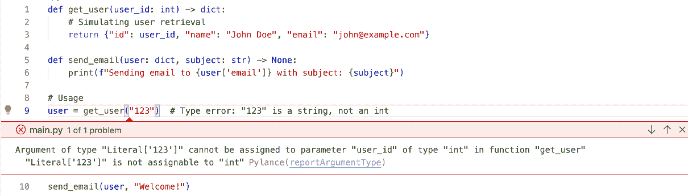
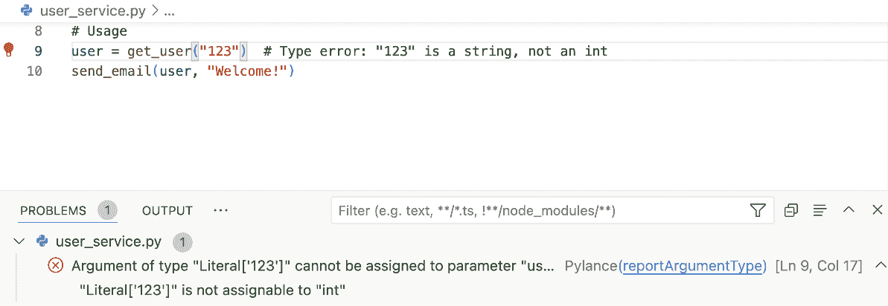

# 3

# 类型增强的 Python：加强清洁架构

在*第二章*中，我们探讨了 SOLID 原则及其在 Python 中的应用，为可维护和灵活的代码奠定了基础。在此基础上，我们现在转向 Python 中的一个强大功能：**类型提示**。

虽然 Python 的动态类型提供了灵活性，但它有时会导致复杂项目中的意外错误。类型提示提供了一个解决方案，结合了动态类型的好处和静态类型检查的健壮性。

本章探讨了类型提示如何增强清洁架构的实现，使代码更具自文档性和更少错误。我们将看到类型提示如何支持 SOLID 原则，特别是在创建清晰的接口和加强依赖倒置原则方面。

我们将从类型意识在 Python 动态环境中的作用开始，然后深入探讨 Python 类型系统的实际方面。最后，我们将探索用于早期问题检测的自动静态类型检查工具。

到本章结束时，你将了解如何在 Python 项目中有效地使用类型提示，编写更健壮、可维护且与清洁架构原则一致的代码。随着我们进入后续章节构建复杂、可扩展的系统，这种知识将至关重要。

在本章中，我们将涵盖以下主要主题：

+   理解 Python 动态环境中的类型意识

+   利用 Python 的类型系统

+   利用自动静态类型检查工具

让我们开始探索 Python 类型提示及其在加强清洁架构实现中的作用。

# 技术要求

本章和本书其余部分提供的代码示例均使用 Python 3.13 进行测试。所有示例均可在本书配套的 GitHub 仓库中找到，网址为 [`github.com/PacktPublishing/Clean-Architecture-with-Python`](https://github.com/PacktPublishing/Clean-Architecture-with-Python)。本章还提到了 **Visual Studio Code** （**VS Code**）。VS Code 可从 [`code.visualstudio.com/download`](https://code.visualstudio.com/download) 下载。

# 理解 Python 动态环境中的类型意识

要充分欣赏 Python 的类型系统，区分动态类型语言（如 Python）和静态类型语言（如 Java 或 C++）非常重要。在静态类型语言中，变量在编译时有一个固定的类型。Python 作为一种动态类型语言，允许变量在运行时改变类型，提供了极大的灵活性，但也引入了潜在的挑战。这种动态类型在实现 Clean Architecture 时既是祝福也是挑战。虽然它提供了灵活性和快速开发，但也可能导致接口不明确和隐藏的依赖，这些问题正是 Clean Architecture 旨在解决的。在本节中，我们将探讨如何通过类型意识来增强我们的 Clean Architecture 实现，而不会牺牲 Python 的动态特性。

## Python 中打字的发展

Python 对类型的方法随着时间的推移发生了显著变化。虽然最初是一种纯动态类型语言，但 Python 通过在 Python 3.5（2015 年）中添加类型提示语法（PEP 484）引入了可选的静态类型。这种引入是由 Python 应用程序日益增长的复杂性所推动的，特别是在大规模项目中，Clean Architecture 原则最有益。

通过 PEP 484 对类型提示的标准化标志着 Python 发展的一个重要里程碑，为向 Python 代码添加类型信息提供了一种统一的方法。它为 Python 生态系统中静态类型检查的更广泛采用以及各种工具和 IDE 的开发铺平了道路，这些工具和 IDE 利用了这种类型提示信息。

Python 对类型提示的方法是动态语言中更广泛趋势的一部分。例如，JavaScript 看到了 TypeScript 的兴起，它是 JavaScript 的一个类型超集，编译成纯 JavaScript。虽然 Python 和 TypeScript 都旨在将静态类型的好处带给动态语言，但它们的方法不同：

+   **集成**：Python 的类型提示是内置于语言本身的，而 TypeScript 是一种独立语言，它编译成 JavaScript

+   **可选性**：Python 的类型提示完全是可选的，可以逐步采用，而 TypeScript 则更严格地执行类型检查

TypeScript 在 JavaScript 生态系统中的成功进一步验证了在动态语言中添加类型信息的价值。Python 的类型提示和 TypeScript 都展示了如何将动态类型灵活性结合到静态类型健壮性中，从而实现更易于维护和可扩展的代码库。

Python 中类型提示的演变是由几个重要因素驱动的。它显著提高了代码的可读性，并作为一种自我文档化的形式，使开发者更容易理解变量和函数的预期用途。这种增强的清晰度在维护 Clean Architecture 的关注点分离方面特别有价值。类型提示还使集成开发环境（**IDE**）和工具支持更好，促进了更准确的代码补全和错误检测。当处理复杂架构时，这种改进的工具支持至关重要，它帮助开发者更有效地在不同层和组件之间导航。

此外，类型提示使重构和维护大型代码库变得容易得多。在 Clean Architecture 的背景下，我们努力创建能够适应变化的系统，这种好处尤其显著。

类型提示在大型重构努力中充当安全网，有助于确保系统某一部分的更改不会无意中破坏另一部分的接口或期望。

对于我们实现 Clean Architecture 来说，最重要的是，类型提示允许我们在开发过程的早期阶段捕捉到某些类型的错误。通过通过类型注解明确我们的意图，我们可以在设计时间或静态分析期间识别潜在问题，而不是在运行时遇到它们。这种早期错误检测与 Clean Architecture 创建健壮、可维护系统的目标完美契合。

在以下章节深入探讨类型提示的具体细节时，请记住，这些功能是增强我们 Python 实现 Clean Architecture 的工具。它们提供了一种使我们的架构边界更明确、代码更自我文档化的方法，同时保留了使 Python 成为软件开发如此强大语言的灵活性和表达性。

## 动态类型与类型提示的比较

要理解类型提示在 Python 中的重要性，区分 Python 的基本动态类型和类型提示的作用至关重要。这两个概念服务于不同的目的，并在开发过程的不同阶段运行。

### 动态类型

在像 Python 这样的动态类型语言中，变量可以持有任何类型的值，并且这些类型可以在运行时改变。这种灵活性是 Python 的核心特性。让我们来看一个例子：

```py
x = 5        # x is an integer
x = "hello"  # Now x is a string 
```

这种灵活性允许快速开发和表达性代码，但如果不小心管理，可能会导致运行时错误。考虑以下示例：

```py
def add_numbers(a, b):
    return a + b
# Works fine, result is 8:
result = add_numbers(5, 3)
# Raises TypeError: unsupported operand type(s) for +: 'int' and 'str':  
result = add_numbers(5, "3") 
```

在这种情况下，`add_numbers` 函数在给定两个整数时按预期工作，但在给定一个整数和一个字符串时引发 `TypeError`。这种错误仅在运行时发生，如果在应用程序的关键部分发生或未通过测试过程捕获，可能会成为问题。

### 类型提示

类型提示允许开发者除了返回值外，还可以用它们期望的类型来注释变量和函数参数。关于类型提示，让我们重新审视我们简单的加法函数：

```py
def add_numbers(a: int, b: int) -> int:
    return a + b
# Works fine, result is 8:
result = add_numbers(5, 3)
# IDE or type checker would flag this as an error:
result = add_numbers(5, "3") 
```

让我们分解这个函数中使用的类型提示语法：

+   `a: int` 和 `b: int`：这些注解表明`a`和`b`都预期为整数。冒号（`:`）用于将参数名与其类型分开。

+   `-> int:` 函数参数列表之后的这个箭头符号指定了返回类型。在这种情况下，它表示`add_numbers`函数预期返回一个整数。

这些类型注解提供了关于函数预期输入和输出的清晰信息，使代码更具自文档性和易于理解。

关于类型提示的关键点包括以下内容：

+   它们不会影响 Python 的运行时行为。Python 仍然是动态类型的。

+   它们作为文档，使代码意图更加清晰。

+   它们使静态分析工具能够在运行时之前捕获潜在的与类型相关的错误。

+   它们提高了 IDE 对代码补全和重构的支持。

类型提示解锁了静态分析工具在运行时之前捕获潜在错误的能力。虽然 Python 本身提供了类型提示的语法，但它不会在运行时强制执行。Python 解释器将类型提示视为装饰性元数据。是像*mypy*或*pyright*这样的第三方工具执行实际的静态类型检查。这些工具在不执行代码的情况下分析你的代码，使用类型提示推断和检查整个代码库中的类型。它们可以作为独立命令运行，集成到 IDE 中以提供实时反馈，或纳入持续集成管道，允许在开发的不同阶段进行类型检查。

在本章的*利用自动化静态类型检查工具*部分，我们将更深入地探讨如何使用这些工具，在开发工作流程的关键点上对整个代码库进行静态类型检查。

## 清洁架构中的类型意识

类型提示的引入对于 Clean Architecture 尤其相关。在前一章中，我们讨论了清晰接口和依赖倒置的重要性。类型提示可以在实现这些目标中发挥关键作用，使我们的架构边界更加明确且易于维护。

考虑一下类型提示如何增强我们在*第二章*中引入的`Shape`示例，这里使用类型提示的更完整利用：

```py
from abc import ABC, abstractmethod
import math
class Shape(ABC):
    @abstractmethod
    def area(self) -> float:
        pass
class Rectangle(Shape):
    def __init__(self, width: float, height: float) -> None:
        self.width = width
        self.height = height
    def area(self) -> float:
        return self.width * self.height
class Circle(Shape):
    def __init__(self, radius: float) -> None:
        self.radius = radius
    def area(self) -> float:
        return math.pi * self.radius ** 2
class AreaCalculator:
    def calculate_area(self, shape: Shape) -> float:
        return shape.area() 
```

让我们更仔细地看看这个例子：

+   `Shape`类中的`area`方法被注解为返回一个`float`，清楚地传达了所有形状实现预期的返回类型。

+   `Rectangle`和`Circle`类指定它们的构造函数期望`float`参数并返回`None`。这个`-> None`注解明确指出构造函数不返回任何值，这在 Python 中是隐含的，但通过类型提示变得明确。

+   `Rectangle`和`Circle`中的具体`area`方法被注解为返回`float`，遵循在`Shape`抽象基类中定义的合同。

+   `AreaCalculator`类明确指出其`calculate_area`方法期望一个`Shape`对象作为参数并返回一个`float`。

这些类型提示使接口更明确，有助于维护清洁架构组件之间的边界。需要注意的是，这些类型提示在运行时并不强制执行任何事情。相反，它们作为文档，并使静态分析工具能够在执行前捕获潜在的类型错误。

在清洁架构的上下文中，它们提供了几个好处：

+   **清晰的接口**：类型提示使架构不同层之间的合同明确。在我们的例子中，很明显任何`Shape`都必须有一个返回`float`的`area`方法。

+   **依赖反转**：它们通过明确定义高层模块所依赖的抽象接口来帮助执行依赖规则。《AreaCalculator》依赖于抽象的`Shape`，而不是具体的实现。

+   **可测试性**：类型提示使创建和使用符合预期接口的模拟对象变得更容易。对于测试，我们可以轻松创建一个符合记录接口要求的模拟`Shape`。

+   **可维护性**：随着项目的增长，类型提示作为活文档，使开发者更容易理解和修改代码。它们提供了对方法参数和返回值预期类型的即时洞察。

通过这种方式利用类型提示，我们创建了一个更健壮的清洁架构实现。明确记录的接口和清晰的依赖关系使我们的代码更具自文档性，并通过静态分析在早期捕获类型相关的问题。随着我们构建更复杂的系统，这些好处会累积，导致代码库更容易理解、修改和扩展。在下一节中，我们将探讨在将类型提示集成到您的清洁架构设计中时需要考虑的一些挑战和注意事项。

## 挑战和考虑因素

在您的 Python 项目中利用类型提示时，重要的是要意识到几个关键考虑因素：

+   它们并不取代对适当测试和错误处理的必要性

+   对于新接触静态类型概念的开发者来说，存在一个学习曲线。

+   计划将其纳入团队的开发工作流程和**持续集成，持续部署**（**CI/CD**）管道对于成功采用至关重要。

在接下来的章节和本书的剩余部分，我们将深入探讨如何利用这些特性来创建更健壮、可维护和自文档化的 Clean Architecture 实现。我们将看到类型意识如何帮助我们创建更清晰的架构层边界，使我们的依赖关系更明确，并在开发过程中早期捕捉潜在问题。

记住，目标不是将 Python 转变为静态类型语言，而是将类型意识作为一个工具来增强我们的 Clean Architecture 设计。到本章结束时，你将牢固地理解如何平衡 Python 的动态特性与 Clean Architecture 实现中类型意识的好处。

# 利用 Python 的类型系统

在 Clean Architecture 的领域内，强大类型系统的角色远远超出了简单的错误预防。它作为表达和强制架构边界的强大工具，支持诸如抽象、多态和依赖倒置等关键原则。当有效地利用时，Python 的类型系统成为实现这些关键概念的无价资产。

当我们开始考虑 Python 类型系统的更高级特性时，我们将看到它们如何显著增强我们的 Clean Architecture 实现。这些特性允许我们在应用程序的不同层之间创建更表达性和精确的接口，从而产生不仅更健壮，而且更自文档化和可维护的代码。

在本节中，我们将探讨一系列类型特性，从类型别名和联合类型到字面量和 `TypedDict` 类型。然后我们将看到这些如何应用于支持 Clean Architecture 设计中的 SOLID 原则。到本节结束时，你将全面理解如何使用 Python 的类型系统来创建更干净、更可维护的架构边界。

我们将从基本类型提示的回顾开始，然后深入探讨更高级的特性，最后我们将看到这些特性如何在 Clean Architecture 的背景下支持 SOLID 原则。

## 基本类型提示：从简单类型到容器

我们已经看到了如何为简单类型使用基本类型提示。让我们快速回顾一下语法：

+   对于整数：`count: int`

+   对于浮点数：`price: float`

+   对于字符串：`name: str`

+   对于布尔值：`is_active: bool`

+   对于函数注解：遵循 `def function_name(parameter: type) -> return_type:` 模式

现在，让我们看看如何使用类型提示与容器类型，如列表和字典一起使用：

```py
def process_order(items: list[str],
                  quantities: list[int]) -> dict[str, int]:
    return {item: quantity for item,
            quantity in zip(items, quantities)}
# Usage
order = process_order(['apple', 'banana', 'orange'], [2, 3, 1])
print(order)
# Output: {'apple': 2, 'banana': 3, 'orange': 1} 
```

让我们更仔细地看看这个例子：

+   `list[str]` 表示项目应该是一个字符串列表

+   `list[int]` 表示数量应该是一个整数列表

+   `-> dict[str, int]` 告诉我们该函数返回一个具有字符串键和整数值的字典

这些类型提示提供了关于输入和输出数据预期结构的清晰信息，这在 Clean Architecture 中尤其有价值，因为在 Clean Architecture 中，我们经常处理在不同应用层之间传递的复杂数据结构。

**为什么我有时会看到** `list` **而有时会看到** `List` **在 Python 代码中？**

你可能会注意到，一些 Python 代码使用`list`（小写）而其他代码使用`List`（大写）进行类型注解。这是因为 Python 3.9 引入了对内置泛型类型的支持。在此之前，你需要从`typing`包中导入`List`占位符类型。对于 Python 3.9+的代码，你可以简单地使用内置的集合名称，如`list`和`dict`。

在 Clean Architecture 中，这种类型提示在定义应用不同层之间的接口时特别有用。它们为领域层、用例和外部接口之间的数据传递提供了清晰的合同，有助于保持清晰的边界并降低数据不一致的风险。

随着我们继续前进，我们将看到更高级的类型功能如何进一步增强我们表达复杂关系和约束的能力，支持健壮的 Python Clean Architecture 实现。

## Sequence：集合类型的灵活性

`typing`模块中的`Sequence`类型提示是一个强大的工具，可以以与 SOLID 原则（特别是 Liskov 替换原则和开放-封闭原则）良好对齐的方式表达集合。

下面是一个演示其使用的例子：

```py
from typing import Sequence
def calculate_total(items: Sequence[float]) -> float:
    return sum(items)
# Usage
print(calculate_total([1.0, 2.0, 3.0]))  # Works with list
print(calculate_total((4.0, 5.0, 6.0)))  # Also works with tuple 
```

使用`Sequence`而不是特定的类型，如`List`或`Tuple`，具有几个优点：

+   **Liskov 替换原则**：`Sequence`允许函数与任何序列类型（列表、元组和自定义序列类）一起工作，而不会破坏合同

+   **开放-封闭原则**：`calculate_total`函数对扩展是开放的（它可以与新的序列类型一起工作），但对修改是封闭的（我们不需要更改函数以支持新类型）

+   **接口隔离原则**：通过使用`Sequence`，我们只要求所需的最小接口（元素迭代），而不是承诺使用可能不必要的特定集合类型

在 Clean Architecture 中，`Sequence`类型提示在各个层之间都非常有价值。在用例层，它简化了实体或值对象的集合处理。在接口适配器层，它实现了与各种集合类型协同工作的灵活 API。在领域层，`Sequence`表达了需要集合的需求，但没有指定其实施，保持了关注点的分离。这种多功能性使`Sequence`成为在 Python 中创建适应性强且可维护的 Clean Architecture 实现的强大工具。

## 联合和可选类型

在 Clean Architecture 中，我们经常需要处理多个可能类型或可选值，尤其是在层之间的边界。**联合类型**和**可选类型**非常适合这些场景：

```py
from typing import Union, Optional
def process_input(data: Union[str, int]) -> str:
    return str(data)
def find_user(user_id: Optional[int] = None) -> Optional[str]:
    if user_id is None:
        return None
    # ... logic to find user ...
    return "User found"
# Usage
result1 = process_input("Hello")  # Works with str
result2 = process_input(42)       # Works with int
user = find_user()                # Optional parameter 
```

`Union` 类型允许一个值是几种类型之一，而 `Optional` 是 `Union[Some_Type, None]` 的简写。这些结构在 Clean Architecture 中创建灵活的层之间接口的同时保持类型安全性特别有用。

应注意，在 Python 3.10+ 中，联合语法被简化为简洁的管道字符（`|`）的文本使用：

```py
def process_input(data: Union[str, int]) -> str: 
```

前一行可以简化为以下形式：

```py
def process_input(data: str | int) -> str: 
```

## 文字类型

**文字类型**允许我们指定变量可以取的确切值。这在 Clean Architecture 中强制在接口边界上执行特定值时特别有用：

```py
from typing import Literal
LogLevel = Literal["DEBUG", "INFO", "WARNING", "ERROR"]
def set_log_level(level: LogLevel) -> None:
    print(f"Setting log level to {level}")
# Usage
set_log_level("DEBUG")  # Valid
set_log_level("CRITICAL")  # Type checker would flag this as an error 
```

`Literal` 类型有助于创建更精确的接口，减少无效数据通过系统的可能性。这与 Clean Architecture 强调的层之间清晰的边界和契约相吻合。

## 类型别名

**类型别名** 有助于简化复杂的类型注解，使我们的代码更易于阅读和维护。这在 Clean Architecture 中处理复杂的领域模型或数据传输对象时特别有用。

考虑以下示例：

```py
# Type aliases
UserDict = dict[str, str]
UserList = list[UserDict]
def process_users(users: UserList) -> None:
    for user in users:
        print(f"Processing user: {user['name']}")
# Usage
users: UserList = [{"name": "Alice"}, {"name": "Bob"}]
process_users(users) 
```

让我们更仔细地看看这段代码：

+   `UserDict` 是 `dict[str, str]` 的类型别名，表示具有字符串键和值的用户对象

+   `UserList` 是 `list[UserDict]` 的类型别名，表示用户字典的列表

类型别名提供了更易于阅读的复杂类型名称，提高了代码的清晰度，而没有创建新类型。它们使我们能够编写既具有表达性又与 Clean Architecture 原则一致、促进关注点分离、可维护性和清晰性的代码。

## NewType

**NewType** 创建独特的类型，提供额外的类型安全性。这在 Clean Architecture 中定义清晰的领域概念时非常有价值：

```py
from typing import NewType
UserId = NewType('UserId', int)
ProductId = NewType('ProductId', int)
def process_order(user_id: UserId,
                  product_id: ProductId) -> None:
    print(f"Processing order for User {user_id} and Product {product_id}")
# Usage
user_id = UserId(1)
product_id = ProductId(1)  # Same underlying int, but distinct type
process_order(user_id, product_id)
# This would raise a type error:
# process_order(product_id, user_id) 
```

`NewType` 创建独特的类型，这些类型被静态类型检查器识别，防止类似但概念上不同的值的意外混合。这有助于在开发早期阶段捕获潜在的错误，并增强 Clean Architecture 实现的整体类型安全性。

类型别名和 `NewType` 都很好地与 Clean Architecture 原则相吻合，通过提高代码可读性，确保层之间的类型安全性，并清晰地定义领域概念。这导致在 Python 中实现更具表达性、类型安全和可维护的 Clean Architecture。

## 任意类型

**任意类型**是一个特殊的类型提示，它本质上告诉类型检查器允许任何类型。当您想表示一个变量可以是任何类型，或者当您处理类型真正未知或可能广泛变化的代码时，会用到它。我们可以在以下通用日志示例中看到它的用法：

```py
from typing import Any
def log_data(data: Any) -> None:
    print(f"Logged: {data}")
# Usage
log_data("A string")
log_data(42)
log_data({"key": "value"}) 
```

在 Clean Architecture 中，我们通常力求尽可能具体地指定类型，尤其是在层边界处。`Any`类型应被视为最后的手段，通常表明需要重构或更具体的类型定义。它最适用于与外部系统接口，那里的类型真正未知或高度可变。在你的代码内部，将`Any`的使用视为重构代码到使用特定类型而不是使用通用的`Any`类型的信号。

这些高级类型功能为在 Python 中实现 Clean Architecture 提供了强大的工具。它们允许我们在应用程序的不同层之间创建更具有表达性、精确性和自文档化的接口。随着我们继续前进，我们将探讨这些功能如何应用于支持 Clean Architecture 设计中的 SOLID 原则。

# 利用自动化静态类型检查工具

如我们所探讨的，Python 的类型系统和它在 Clean Architecture 中的好处，了解如何在实践中有效地应用这些类型提示至关重要。Python 作为一个动态类型语言，在运行时不强制执行类型检查。这就是自动化静态类型检查工具发挥作用的地方，它弥合了 Python 的动态特性和静态类型的好处之间的差距。这种方法提供了几个关键的好处：

+   **早期错误检测**：在运行时之前捕获类型相关的问题，降低生产中出现 bug 的可能性

+   **提高代码质量**：在整个项目中强制使用类型的一致性，从而产生更健壮和自文档化的代码

+   **增强重构**：在更大规模的代码更改中更有信心，因为类型检查器可以识别许多需要更新的地方

+   **更好的 IDE 支持**：在你的开发环境中启用更精确的代码补全、导航和重构工具

这些好处在 Clean Architecture 的实现中尤其有价值，在保持层之间的清晰边界和确保数据流的正确性方面至关重要。

在本节中，我们将重点介绍如何利用这些自动化工具来强制类型一致性、早期捕获错误并提高整体开发体验。我们将使用`mypy`的命令行界面（CLI），但随后将使用另一个工具作为 VS Code IDE 的扩展。

## mypy 命令行界面

Mypy 是一个强大的静态类型检查器，可以直接从命令行运行。这使得它很容易集成到你的开发工作流程和部署管道中。让我们一步步了解如何使用`mypy`并解释其输出。

首先，你需要安装`mypy`。由于它是一个 Python 模块，你可以使用`pip`轻松安装它：

```py
$ pip install mypy 
```

安装完成后，你可以使用`mypy`检查你的 Python 文件中的类型错误。让我们看看一个简单的例子。假设你有一个名为`user_service.py`的 Python 文件，其内容如下：

```py
def get_user(user_id: int) -> dict:
    # Simulating user retrieval
    return {"id": user_id,
            "name": "John Doe",
            "email": "john@example.com"}
def send_email(user: dict, subject: str) -> None:
    print(f"Sending email to {user['email']} with subject: {subject}")
# Usage
user = get_user("123")
send_email(user, "Welcome!") 
```

要使用`mypy`检查此文件，请运行以下命令：

```py
$ mypy user_service.py
user_service.py:9: error: Argument 1 to "get_user" has incompatible type "str"; expected "int"  [arg-type]
Found 1 error in 1 file (checked 1 source file) 
```

让我们分析一下`mypy`告诉我们什么：

+   它识别出发生错误的文件（`user_service.py`）和行号（`9`）

+   它描述了错误：我们向 `get_user` 函数传递了一个字符串（`"123"`），但该函数期望一个整数

+   它将错误分类为 `[arg-type]` 问题，表明存在参数类型问题

此输出非常有价值。它捕捉到可能导致运行时错误的类型不匹配，使我们能够在代码执行之前修复它。

我们可以通过将 `user = get_user("123")` 更改为 `user = get_user(123)` 然后重新运行 mypy 来纠正错误：

```py
$ mypy user_service.py
Success: no issues found in 1 source file 
```

现在，`mypy` 没有报告任何问题，确认我们的类型注解与我们使用函数的方式一致。

## 配置 mypy

虽然 `mypy` 默认工作良好，但您可以使用配置文件自定义其行为。这对于大型项目或您想逐步采用类型检查时特别有用。

在您的项目根目录中创建一个名为 `mypy.ini` 的文件：

```py
[mypy]
ignore_missing_imports = True
strict_optional = True
warn_redundant_casts = True
warn_unused_ignores = True
warn_return_any = True
warn_unreachable = True 
```

此配置执行以下操作：

+   忽略缺失的导入，这在处理没有类型存根的第三方库时非常有用

+   启用对 `Optional` 类型的严格检查

+   警告关于冗余的类型转换和未使用的 `type: ignore` 注释

+   当一个函数隐式返回 `Any` 时发出警告

+   警告不可达的代码

使用此配置，`mypy` 将提供更全面的检查，帮助您在 Clean Architecture 实现中捕捉到更广泛的潜在问题。

通过定期将 `mypy` 作为开发过程的一部分运行，您可以早期捕捉到与类型相关的问题，确保您的 Clean Architecture 层能够正确交互并保持其预期的边界。

`mypy` 的配置选项非常广泛，可以根据您特定项目的需求进行定制。有关可用选项及其描述的完整列表，请参阅官方 `mypy` 文档[`mypy.readthedocs.io/en/stable/config_file.html`](https://mypy.readthedocs.io/en/stable/config_file.html)。

## 部署管道中的 Mypy

将 `mypy` 集成到您的部署管道中是确保项目类型一致性至关重要的步骤，尤其是在 Clean Architecture 的背景下，保持层之间的清晰边界至关重要。

虽然具体实现细节可能因您选择的 CI/CD 工具而异，但基本概念保持不变：在部署代码之前，将 `mypy` 作为自动化检查的一部分运行。鉴于 `mypy` 通过简单的 CLI 运行，将其纳入大多数部署管道相对简单。

例如，您可能在这些情况下运行 `mypy` 检查：

+   在每次提交推送之后

+   作为拉取请求验证的一部分

+   在合并到主分支之前

+   在部署到预发布或生产环境之前

这种方法有助于在开发过程中早期捕捉到与类型相关的问题，降低类型错误进入生产的风险。

例如，以下是一个简单的 GitHub Actions 工作流程，它运行`mypy`然后是单元测试：

```py
name: Python Type Check and Test
on: [push, pull_request]
jobs:
  build:
    runs-on: ubuntu-latest
    steps:
    - uses: actions/checkout@v2
    - name: Set up Python
      uses: actions/setup-python@v2
      with:
        python-version: '3.13'
    - name: Install dependencies
      run: |
        python -m pip install --upgrade pip
        pip install mypy pytest
    - name: Run mypy
      run: mypy .
    - name: Run tests
      run: pytest 
```

此工作流程执行以下操作：

+   在推送或拉取请求事件时触发

+   设置 Python 环境

+   安装必要的依赖项（包括`mypy`和`pytest`）

+   在整个项目中运行`mypy`

+   运行项目的单元测试

通过在部署管道中包含`mypy`，您确保所有代码更改在集成之前都经过类型检查，有助于维护 Clean Architecture 实现的完整性。

记住，虽然此示例使用 GitHub Actions，但原则适用于任何 CI/CD 工具。关键是运行 mypy 作为您自动化检查的一部分，利用其 CLI 来无缝集成到现有的部署流程中。

## 在 IDE 中使用类型提示以改善开发体验

虽然拥有带有类型检查的部署管道对于维护代码质量至关重要，但最有效的方法是在编写代码时实时捕捉类型问题。这种即时反馈允许开发者立即解决类型不一致，减少在开发后期修复问题的时间和精力。

现代集成开发环境（IDEs）已经采纳了这种方法，利用类型提示来提供带有即时类型检查反馈的增强编码体验。虽然这种功能在大多数流行的 Python IDEs 中都有提供，但我们将重点关注 VS Code，因为它被广泛使用，并且对 Python 的支持非常强大。

在 VS Code 中，**Pylance**扩展已成为 Python 类型检查的首选工具。Pylance 使用`pyright`作为其类型检查引擎，无缝集成到 VS Code 中，提供实时类型检查以及其他显著改善 Python 开发体验的高级功能。

在 VS Code 中安装了 Pylance 后，开发者会立即收到有关任何类型问题的视觉提示：



图 3.1：安装了 Pylance 扩展的 VS Code

在*图 3.1*中，我们看到在 IDE 编辑器中，期望整数的地方使用了字符串，并且对问题进行了精确的解释。

这种实时反馈与我们在 Clean Architecture 实现中集成的类型提示产生了强大的协同作用。它允许开发者在编码时维护严格的类型一致性，而不是仅仅依赖开发后的检查。

您可以从 VS Code 市场（[`marketplace.visualstudio.com/items?itemName=ms-python.vscode-pylance`](https://marketplace.visualstudio.com/items?itemName=ms-python.vscode-pylance)）安装 Pylance 扩展，同时阅读更多关于其功能和配置的信息。

## 额外的类型检查功能

虽然实时反馈和部署管道检查至关重要，但还有一些额外的功能可以增强您的类型检查工作流程。

### VS Code 中的“问题”标签页

VS Code 提供了一个**问题**标签页，它汇总了你的代码中的所有问题，包括由 Pylance 检测到的类型错误。此标签页提供了项目类型不一致的全面概述。



图 3.2：VS Code 问题标签页

在*图 3.2*中，我们看到的是我们之前内联看到的类型检查的汇总。开发者可以使用此标签页作为提交代码前的最终检查，确保没有遗漏任何类型问题。

### Git 预提交钩子

Git 支持预提交钩子，允许你在每次提交前自动运行检查。你可以配置这些钩子来运行`mypy`和单元测试，防止引入类型错误或破坏现有功能的提交。

有关设置 Git 钩子的更多信息，请参阅官方 Git 文档：[`git-scm.com/book/en/v2/Customizing-Git-Git-Hooks`](https://git-scm.com/book/en/v2/Customizing-Git-Git-Hooks)

通过将这些附加功能纳入你的工作流程，你在开发过程中创建了多个类型检查层。这种全面的方法有助于维护 Clean Architecture 实现的完整性，从编写代码到提交更改的每个阶段都能捕捉到类型不一致。

## 渐进式采用策略

在 Python 项目中引入静态类型检查有时会遇到阻力，尤其是来自习惯于 Python 动态特性的开发者。为了确保平稳过渡，与团队协作并清楚地传达类型提示的理由和好处至关重要。

这里有一个逐步采用策略：

1.  举行团队会议，讨论并制定一个纳入类型检查的计划。

1.  实施一项政策，要求所有新代码都必须有类型提示。

1.  通过配置`mypy`以忽略特定模块或包来最小化初始干扰。这可以在`mypy`配置文件中完成：

    ```py
    [mypy.unwanted_module]
    ignore_errors = True
    [mypy.some_package.*]
    ignore_errors = True 
    ```

1.  创建计划维护任务，逐步向现有代码添加类型提示，优先考虑关键路径。

通过采用这些工具和策略，你可以显著提高你的 Clean Architecture 实现的健壮性和可维护性。最有效的方法是在各个阶段进行检查：IDE 中的实时反馈、预提交钩子和部署管道中的验证。这种多层次策略确保了早期错误检测，增强了代码导航，并在整个开发周期中保持类型检查的一致性。最终，这种全面的方法导致更可靠、可维护和可扩展的 Python 应用程序，充分利用 Python 类型系统在 Clean Architecture 项目中的力量。

# 摘要

在本章中，我们探讨了 Python 动态环境中的类型意识及其在加强 Clean Architecture 实现中的作用。我们学习了如何利用 Python 的类型系统和类型提示来创建更健壮、自文档化的代码，并发现了自动化静态类型检查工具在早期捕获错误的价值。

您掌握了在函数、类和变量中实现类型提示的技能，提高了代码的清晰度和可靠性。您还学习了如何设置和使用静态类型检查工具，如 `mypy`，以验证项目中的类型一致性。这些技能对于在 Python 中创建可维护和可扩展的 Clean Architecture 实现至关重要，可以提升代码质量并与 Clean Architecture 原则保持一致。

在下一章中，*领域驱动设计：构建核心业务逻辑*，我们将基于增强类型的 Python 和来自 *第二章* 的 SOLID 原则进行探讨。我们将探索 Clean Architecture 的领域层，学习如何建模和实现独立于外部关注的核心业务逻辑。以个人任务管理应用为例，我们将应用类型意识技术和 SOLID 原则来创建一个健壮、结构良好的领域模型，为真正清洁和可维护的架构奠定基础。

# 进一步阅读

+   *Python 类型检查（指南）* ([`realpython.com/python-type-checking/`](https://realpython.com/python-type-checking/))

+   *类型提示速查表* ([`mypy.readthedocs.io/en/stable/cheat_sheet_py3.html`](https://mypy.readthedocs.io/en/stable/cheat_sheet_py3.html))

+   *使用 Python 进行持续集成：入门指南* ([`realpython.com/python-continuous-integration/`](https://realpython.com/python-continuous-integration/))
