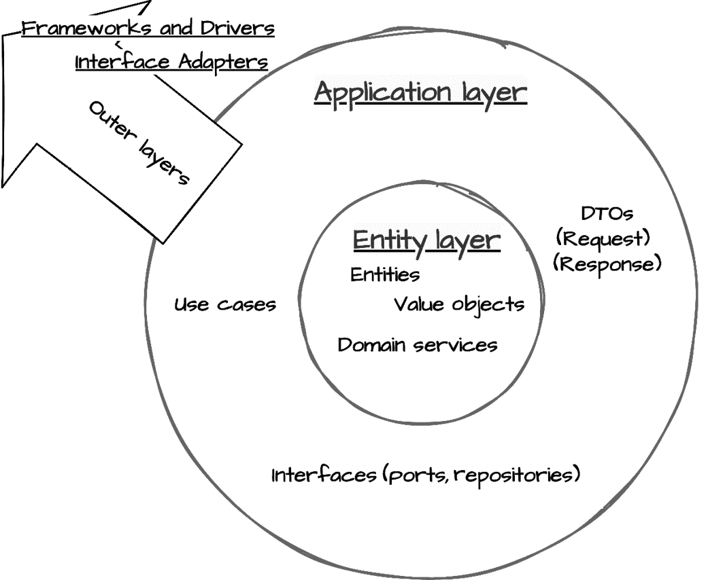
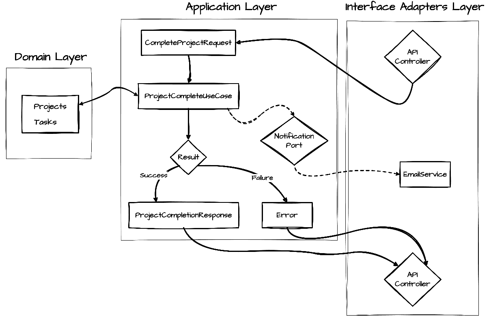

# 5

# 应用层：编排用例

在*第四章*中，我们开发了任务管理系统的领域层，并实现了封装核心业务规则的实体、值对象和领域服务。虽然这为我们提供了一个坚实的基础，但仅有业务规则并不能构成一个可用的应用程序。我们需要一种协调这些领域对象以满足创建任务、管理项目和处理通知等用户需求的方法。这正是应用层发挥作用的地方。

应用层在我们干净的架构交响乐中扮演着指挥家的角色。它协调领域对象和外部服务以完成特定的用例，同时保持我们业务规则与外部世界之间的严格边界。通过正确实现这一层，我们创建的应用不仅功能强大，而且易于维护和适应变化。

在本章中，我们将以任务管理系统为例，探讨如何实现有效的应用层。我们将看到如何创建编排领域对象的用例，同时保持清晰的架构边界。您将学习如何实现请求和响应模型，以明确定义用例边界，以及如何管理对外部服务的依赖，而不会损害架构的完整性。

在本章中，我们将涵盖以下主要主题：

+   理解应用层的角色

+   实现用例交互器

+   定义请求和响应模型

+   保持对外部关注点的分离

# 技术要求

本章和本书其余部分展示的代码示例均使用 Python 3.13 进行测试。为了简洁，除了缺少日志语句外，本章的一些代码示例仅部分实现。所有示例的完整版本可以在本书配套的 GitHub 仓库[`github.com/PacktPublishing/Clean-Architecture-with-Python`](https://github.com/PacktPublishing/Clean-Architecture-with-Python)中找到。

# 理解应用层的角色

应用层作为一个薄层，协调我们的领域对象和服务以完成有意义的用户任务。虽然我们的领域模型提供了构建块，如任务、项目、截止日期，但将这些部件组装成有用功能的正是应用层。

应用层还承担另一个关键功能：信息隐藏。在*第四章*中，我们看到了领域实体如何隐藏它们的内部状态和实现细节。应用层将这一原则扩展到架构边界，从领域隐藏基础设施细节，从外部接口隐藏领域复杂性。这种有意的隐藏信息使得创建端口、适配器和请求/响应模型所付出的额外努力变得值得。通过通过精心设计的接口仅暴露必要的信息，我们创建了一个组件可以独立进化但又能无缝协作的系统。



图 5.1：应用层和任务管理

在*图 5.1*中，我们说明了应用层如何在 Clean Architecture 的同心层中定位。它充当领域层（我们的核心业务实体如任务和项目所在）和系统外层之间的调解者。通过封装编排领域实体的用例，应用层维护了依赖规则：外层依赖于内层，内层不受外层变化的影响。

应用层有几个不同的职责：

+   **用例编排**：

    +   协调领域对象以完成用户任务

    +   管理操作序列

    +   确保业务规则得到正确应用

+   **错误处理和验证**：

    +   在输入到达领域对象之前进行验证

    +   捕获和翻译领域错误

    +   提供一致的错误响应

+   **事务管理**：

    +   确保在需要时操作是原子的

    +   维护数据一致性

    +   处理失败时的回滚

+   **边界转换**：

    +   将外部数据格式转换为领域格式

    +   将领域对象转换为外部展示格式

    +   管理跨边界通信

这些责任共同工作，创建一个健壮的编排层，在保持清晰的边界的同时确保可靠的应用行为。

## 使用结果类型的错误处理

在深入我们的实现模式之前，理解我们应用层的一个基本概念至关重要：**结果类型**的使用。这个模式构成了我们错误处理策略的骨干，提供了对成功和失败的明确处理，而不是仅仅依赖于异常。这种方法提供了几个好处：

+   在函数签名中使成功/失败路径明确

+   在整个应用中提供一致的错误处理

+   通过翻译领域错误来维护清晰的架构边界

+   提高可测试性和错误处理的可预测性

首先，我们定义一个标准化的`Error`类来表示所有应用层错误：

```py
class ErrorCode(Enum):
    NOT_FOUND = "NOT_FOUND"
    VALIDATION_ERROR = "VALIDATION_ERROR"
    # Add other error codes as needed
@dataclass(frozen=True)
class Error:
    """Standardized error information"""
    code: ErrorCode
    message: str
    details: Optional[dict[str, Any]] = None
    @classmethod
    def not_found(cls, entity: str, entity_id: str) -> Self:
        return cls(
            code=ErrorCode.NOT_FOUND,
            message=f"{entity} with id {entity_id} not found"
        )

    @classmethod
    def validation_error(cls, message: str) -> Self:
        return cls(
            code=ErrorCode.VALIDATION_ERROR,
            message=message
        ) 
```

接下来，我们定义一个`Result`类，它封装了成功值或错误：

```py
@dataclass(frozen=True)
class Result:
    """Represents success or failure of a use case execution"""
    value: Any = None 
    error: Optional[Error] = None

    @property
    def is_success(self) -> bool:
        return self.error is None
    @classmethod
    def success(cls, value: Any) -> Self:
        return cls(value=value)

    @classmethod
    def failure(cls, error: Error) -> Self:
        return cls(error=error) 
```

使用结果类型可以干净地协调领域操作，如下面的使用示例所示：

```py
try:
    project = find_project(project_id)
    task = create_task(task_details)
    project.add_task(task)
    notify_stakeholders(task)
    return Result.success(TaskResponse.from_entity(task))
except ProjectNotFoundError:
    return Result.failure(Error.not_found("Project", str(project_id)))
except ValidationError as e:
    return Result.failure(Error.validation_error(str(e))) 
```

上面的使用示例展示了结果模式的一些关键优势：

+   **清晰的错误路径**：注意错误情况是如何通过`Result.failure()`统一处理的，无论底层错误类型如何，都提供了一个一致的接口。

+   **显式领域转换**：从领域特定错误（`ProjectNotFoundError`）到应用级错误的转换在边界处干净地发生。

+   **自包含上下文**：`Result`对象封装了结果和任何错误上下文，使得函数的行为从其返回值完全清晰。

+   **测试清晰度**：该示例通过检查结果的状态而不是尝试捕获异常，使得测试成功和失败情况变得容易。

**Clean Architecture 中的错误处理边界**

在实现应用层的错误处理时，我们明确地只捕获和转换预期的领域和业务错误为结果。因此，我们没有与预期错误配对的`except Exception:`子句。这种分离保持了清晰的架构边界。如全局错误处理等问题仍保留在外层。

## 应用层模式

要了解应用层如何管理其职责，让我们考察数据是如何通过我们的架构流动的：



图 5.2：Clean Architecture 中的请求/响应流程

如*图 5.2*所示，该流程演示了几个关键模式协同工作。一个请求通过接口适配器层进入，并由我们应用层的**数据传输对象**（**DTOs**）处理，这些对象验证并转换输入为领域可以处理的格式。用例随后协调领域操作，与这些验证后的输入一起与领域对象交互，并通过端口与外部服务协调。用例返回的结果封装了成功（带有响应 DTO）或失败（带有错误），接口适配器层可以将其直接映射到适当的 HTTP 响应。现在不必担心理解*图 5.2*中的所有离散组件；我们将在本章的其余部分详细讨论它们。

这种编排的交互依赖于三个基础模式协同工作，以保持清晰的架构边界：

+   **用例交互器**：这些作为主要协调者，在管理事务和协调领域对象的同时，实现特定的业务操作。它们确保每个操作都集中精力，其执行是一致的。

+   **接口边界**：在我们的应用层及其依赖的服务之间建立清晰的合同。

+   **依赖反转**：通过这些边界实现灵活的实现和简单的测试，确保我们的核心业务逻辑与外部关注点解耦。

初始时，我们的用例将使用简单的参数并返回基本的数据结构。随着我们的应用程序增长，我们将引入更复杂的模式来处理跨越我们架构边界的跨层数据。这种进化帮助我们保持层之间的清晰分离，同时使我们的代码能够适应变化。

这些模式与我们在*第二章*中探讨的 SOLID 原则自然一致。用例通过将每个操作集中在特定的目标上体现了单一职责原则。接口定义通过定义专注的、客户端特定的合同支持接口分离。

## 为进化做准备

应用程序很少保持静态——成功者不可避免地会扩大范围和复杂性。最初可能只是一个简单的任务管理系统，可能需要进化以支持多个团队，与各种外部服务集成，或处理复杂的流程自动化。我们探索的应用层模式以最小的摩擦实现了这种进化。

让我们通过实际场景来考察我们的任务管理系统如何成长：

+   **用例可扩展性**：

    +   将任务通知从电子邮件扩展到包括 Slack 或类似的通信平台

    +   将单个用例，如**分配任务**和**设置截止日期**，组合成更高级的操作，例如**冲刺计划**

+   **清理依赖**：

    +   从本地文件存储附件开始，然后无缝添加通过相同界面的 S3 支持

    +   在不修改用例代码的情况下，将数据库引擎从 SQLite 切换到 PostgreSQL

+   **一致的边界**：

    +   在新的 API 版本（v1 与 v2）之间处理请求对象中的数据转换，同时重用相同的底层用例代码

    +   为不同的客户端（移动、Web、CLI）实现不同的响应转换器，同时共享相同的核心业务逻辑

这个架构基础让我们有信心地进化我们的系统。当营销团队要求 Salesforce 集成，或者当合规性要求审计日志时，这些功能可以添加而不会破坏现有功能或损害架构完整性。

在下一节中，我们将探讨如何在 Python 中实现这些概念，创建遵守清洁架构原则的健壮用例交互器。

# 实现用例交互器

在探讨了应用层的理论基础之后，我们现在转向实际实施。用例交互器是实现特定业务规则的实体类。术语*交互器*强调了它们在与系统各个部分交互和协调中的作用。虽然领域层定义了业务规则是什么，但交互器定义了如何以及何时根据特定的应用需求应用这些规则。在 Python 中，我们可以以既清晰又富有表现力的方式实现这些交互器。

## 使用案例的结构化

一个设计良好的用例交互器在协调领域对象的同时，保持清晰的架构边界。让我们看看这是如何实现的：

```py
@dataclass(frozen=True)
class CompleteTaskUseCase:
    """Use case for marking a task as complete and notifying 
    stakeholders"""
    task_repository: TaskRepository
def execute(
        self,
        task_id: UUID,
        completion_notes: Optional[str] = None
    ) -> Result:
... 
```

首先，从用例的外部结构来看，我们可以看到一些关键组件。依赖接口被注入，并且类有一个公开的`execute`方法，该方法返回一个`Result`对象。

接下来，让我们检查`execute`方法：

```py
def execute(
        self,
        task_id: UUID,
        completion_notes: Optional[str] = None
    ) -> Result:
        try:
            # Input validation
            task = self.task_repository.get(task_id)
            task.complete(
                notes=completion_notes
            )
            self.task_repository.save(task)

            # Return simplified task data
            return Result.success({
                "id": str(task.id),
                "status": "completed",
                "completion_date": task.completed_at.isoformat()
            })

        except TaskNotFoundError:
            return Result.failure(Error.not_found("Task", str(task_id)))
        except ValidationError as e:
            return Result.failure(Error.validation_error(str(e))) 
```

在这里，我们可以看到业务规则在`Task`领域对象上的编排，以实现用例的离散目标：完成任务。

此实现体现了几个关键架构原则：

+   **封装**：用例类为特定的业务操作提供了一个清晰的边界。

+   **接口定义**：`execute`方法通过使用结果类型提供了一个清晰、专注的接口。结果模式确保我们的接口中成功和失败路径都是明确的，使错误处理成为一等关注点。

+   **错误处理**：领域错误被捕获并转换为应用级错误。

+   **依赖注入**：依赖项通过构造函数传入，遵循在*第二章*中引入的依赖倒置原则。

在这些原则中，依赖注入值得特别注意，因为它使我们的架构灵活性成为可能。

## 依赖注入

之前我们看到了依赖注入如何帮助在我们的用例中保持清晰的架构边界。让我们通过检查如何结构化我们的接口来进一步探讨这一点，以最大化依赖注入的好处，同时确保我们的用例保持灵活和可测试。在 Python 中，我们可以使用抽象基类优雅地实现这一点：

```py
class TaskRepository(ABC):
    """Repository interface defined by the Application Layer"""
    @abstractmethod
    def get(self, task_id: UUID) -> Task:
        """Retrieve a task by its ID"""
        pass

    @abstractmethod
    def save(self, task: Task) -> None:
        """Save a task to the repository"""
        pass

    @abstractmethod
    def delete(self, task_id: UUID) -> None:
        """Delete a task from the repository"""
        pass
class NotificationService(ABC):
    """Service interface for sending notifications"""
    @abstractmethod
    def notify_task_assigned(self, task_id: UUID) -> None:
        """Notify when a task is assigned"""
        pass
    @abstractmethod
    def notify_task_completed(self, task: Task) -> None:
        """Notify when a task is completed"""
        Pass 
```

通过在应用层定义这些接口，我们加强了我们的架构边界，同时为外部层提供了清晰的实现合同。这种方法提供了超越基本依赖注入的几个高级好处：

+   接口定义精确表达了应用层所需的内容，不多也不少

+   抽象方法通过清晰的方法签名和文档字符串来记录预期的行为

+   应用层在保持对其依赖项控制的同时，保持对其实现的独立性

+   测试实现可以专注于每个用例的确切需求

遵守此合同的实体实现可能具有如下形式：

```py
class MongoDbTaskRepository(TaskRepository):
    """MongoDB implementation of the TaskRepository interface"""
    def __init__(self, client: MongoClient):
        self.client = client
        self.db = client.task_management
        self.tasks = self.db.tasks

    def get(self, task_id: UUID) -> Task:
        """Retrieve a task by its ID"""
        document = self.tasks.find_one({"_id": str(task_id)})
        if not document:
            raise TaskNotFoundError(task_id)
        # ... remainder of method implementation

    # Other interface methods implemented ... 
```

此示例演示了外层如何实现由我们的应用层定义的接口，同时处理数据持久化的具体细节，并遵守业务逻辑预期的合同。

## 处理复杂操作

实际应用场景通常涉及多个步骤和潜在的故障点。让我们看看如何在保持清晰架构原则的同时管理这种复杂性。考虑一个需要协调多个任务的项目完成场景。

`CompleteProjectUseCase`遵循我们建立的模式：

```py
@dataclass(frozen=True)
class CompleteProjectUseCase:
    project_repository: ProjectRepository
    task_repository: TaskRepository
    notification_service: NotificationService
    def execute(
        self,
        project_id: UUID,
        completion_notes: Optional[str] = None
    ) -> Result:
        ... 
```

现在，让我们来检查它的`execute`方法：

```py
def execute(
        self,
        project_id: UUID,
        completion_notes: Optional[str] = None
    ) -> Result:
        try:
            # Validate project exists
            project = self.project_repository.get(project_id)

            # Complete all outstanding tasks
            for task in project.incomplete_tasks:
                task.complete()
                self.task_repository.save(task)
                self.notification_service.notify_task_completed(task)
            # Complete the project itself
            project.mark_completed(
                notes=completion_notes
            )
            self.project_repository.save(project)

            return Result.success({
                "id": str(project.id),
                "status": project.status,
                "completion_date": project.completed_at,
                "task_count": len(project.tasks),
                "completion_notes": project.completion_notes,
            })

        except ProjectNotFoundError:
            return Result.failure(Error.not_found(
                "Project", str(project_id)))
        except ValidationError as e:
            return Result.failure(Error.validation_error(str(e))) 
```

此实现展示了管理复杂性的几种模式：

+   **协调操作**：用例将多个相关操作作为一个单一逻辑单元管理：

    +   完成所有未完成的任务

    +   更新项目状态

    +   通知利益相关者

+   **错误管理**：用例提供了全面的错误处理：

    +   捕获并转换特定领域的错误。

    +   考虑每个操作的潜在失败情况。在更复杂的示例中，如果项目更新或保存失败，可能会看到`Task`保存的回滚。

    +   错误响应一致且信息丰富。

+   **明确依赖**：所需服务被明确定义：

    +   定义数据访问的存储库

    +   提供外部通信的通告服务

    +   注入依赖以实现灵活性和测试

+   **输入验证**：在处理之前验证参数：

    +   检查所需 ID 是否存在

    +   适当处理可选参数

    +   执行领域规则

+   **事务完整性**：对任务和项目的更改被作为一个整体操作处理：

    +   通过仅捕获起始状态并在我们的某个语句失败时回滚，代码示例可以扩展以支持真正的事务性。请参阅书中随附的 GitHub 存储库中的`CompleteProjectUseCase`代码示例。

通过在应用层持续应用这些模式，我们创建了一个健壮的系统，它优雅地处理复杂操作，同时保持清晰的架构边界和关注点的清晰分离。

# 定义请求和响应模型

在上一节中，我们的用例直接与原始类型和字典交互。虽然这种方法对于简单情况可能有效，但随着我们应用的扩展，我们需要更多结构化的方式来处理跨越架构边界的跨数据。请求和响应模型服务于这个目的，提供专门的数据传输对象（DTOs），以处理外部层和我们的应用核心之间的数据转换。基于我们之前引入的信息隐藏原则，这些模型将这一概念扩展到架构边界，具体来说，保护我们的领域逻辑免受外部格式细节的影响，同时屏蔽外部接口免受领域实现细节的影响。这种相互的边界保护对于不同接口以不同速度发展尤为重要。

## 请求模型

**请求模型**在数据到达我们的应用层用例之前捕获和验证传入的数据。它们为输入数据提供清晰的架构，并执行初步验证：

```py
@dataclass(frozen=True)
class CompleteProjectRequest:
    """Data structure for project completion requests"""
    project_id: str  # From API (will be converted to UUID)
    completion_notes: Optional[str] = None
    def __post_init__(self) -> None:
        """Validate request data"""
        if not self.project_id.strip():
            raise ValidationError("Project ID is required")
        if self.completion_notes and len(self.completion_notes) > 1000:
            raise ValidationError(
                "Completion notes cannot exceed 1000 characters")
    def to_execution_params(self) -> dict:
        """Convert validated request data to use case parameters"""
        return {
            'project_id': UUID(self.project_id),
            'completion_notes': self.completion_notes
        } 
```

请求模型通过建立外部层和内部层之间清晰的边界，服务于多个架构目的。通过输入验证和`to_execution_params`方法，它们确保用例仅关注业务逻辑。验证步骤可以提前捕获格式错误的数据，而`to_execution_params`将 API 友好的格式（如字符串 ID）转换为我们的业务逻辑期望的正确领域类型（如 UUID）。

这种转换能力特别强大，因为它：

+   保持用例简洁和专注，仅与领域类型交互

+   将数据转换逻辑集中在一个单一、可预测的位置

+   允许 API 格式演变而不影响核心业务逻辑

+   通过提供清晰的格式边界来提高可测试性

当数据通过请求模型流过并到达我们的用例时，它已经被验证并转换为我们的领域逻辑期望的精确格式。这保持了清洁架构的关注点分离，确保外部层实现细节（如 HTTP 请求中 ID 的格式）永远不会泄露到我们的核心业务规则中。

## 响应模型

**响应模型**负责将领域对象转换为适合外部消费的结构。它们通过明确控制暴露的领域数据及其格式来维护我们清晰的架构边界：

```py
@dataclass(frozen=True)
class CompleteProjectResponse:
    """Data structure for project completion responses"""
    id: str
    status: str
    completion_date: str
    task_count: int
    completion_notes: Optional[str]
    @classmethod
    def from_entity(cls,
                    project: Project,
                    user_service: UserService
    ) -> 'CompleteProjectResponse':
        """Create response from domain entities"""
        return cls(
            id=str(project.id),
            status=project.status,
            completion_date=project.completed_at,
            task_count=len(project.tasks),
            completion_notes=project.completion_notes,
        ) 
```

虽然`to_execution_params`将请求模型中的传入数据转换为符合领域期望的格式，但`from_entity`通过将领域对象转换为适合跨越边界到适配器层的格式来处理输出旅程。这种对称模式意味着我们的用例可以仅与领域对象交互，同时输入和输出都会自动适应外部需求。

`from_entity`方法具有几个关键用途：

+   保护领域对象免受外部层的暴露

+   精确控制暴露的数据以及数据格式（例如，将 UUID 转换回字符串）

+   为所有外部接口提供一致的序列化点

+   允许计算或派生字段（如`task_count`），而无需修改域对象

+   包括在基本实体中不存在的不包含计算或聚合数据

+   通过省略大量无关数据来优化性能

+   包括特定操作元数据

让我们回顾一下`CompleteProjectUseCase`的演变版本，以展示请求模型、域逻辑和响应模型是如何协同工作的：

```py
@dataclass(frozen=True)
class CompleteProjectUseCase:
    project_repository: ProjectRepository
    task_repository: TaskRepository
    notification_service: NotificationService
    # Using CompleteProjectRequest vs discreet parameters
    def execute(self, request: CompleteProjectRequest) -> Result:
        try:
            params = request.to_execution_params()
            project = self.project_repository.get(params["project_id"])
            project.mark_completed(notes=params["completion_notes"])
            # Complete all outstanding tasks
            # ... Truncated for brevity 
            self.project_repository.save(project)
            # using CompleteProjectResponse vs handbuilt dict
            response = CompleteProjectResponse.from_entity(project)
            return Result.success(response)
        except ProjectNotFoundError:
            return Result.failure(
                Error.not_found("Project", str(params["project_id"]))
            )
        except ValidationError as e:
            return Result.failure(Error.validation_error(str(e))) 
```

此示例演示了我们的用例如何纯粹专注于编排域逻辑，而请求和响应模型则处理在架构边界处必要的转换。用例接收一个已经验证的请求，在其执行过程中使用适当的域类型，并返回一个包含在`Result`对象中的响应模型，该对象可以被任何外层实现消费。

在接口适配器层，这些响应模型可以被各种组件消费，包括处理 HTTP 请求的控制器、命令行界面命令处理器或消息队列处理器。每个适配器都可以根据其特定的传输机制适当地转换响应数据，将其转换为 HTTP 上的 JSON、控制台输出或所需的消息有效负载。

# 保持与外部服务的分离

虽然请求和响应模型处理 API 表面的数据转换，但我们的应用程序还必须与外部服务（如电子邮件系统、文件存储和第三方 API）交互。应用程序层通过**端口**与这些服务保持分离——端口定义了应用程序所需的确切功能，而不指定实现细节。在我们的任务管理系统，外部服务可能包括：

+   用于发送通知的电子邮件服务（例如 SendGrid 或 AWS SES）

+   用于附件的文件存储系统（例如 AWS S3 或 Google Cloud Storage）

+   认证服务（例如 Auth0 或 Okta）

+   日历集成服务（例如 Google 日历或 Microsoft Outlook）

+   外部消息系统（例如 Slack 或 Microsoft Teams）

虽然请求/响应模型和端口都旨在维护清晰的架构边界，但它们处理系统与外部世界交互的不同方面。请求/响应模型处理 API 边界的数据转换，遵循所有用例之间的一致接口（例如，`from_entity`和`to_execution_params`），以确保统一的数据处理。

相比之下，端口定义了应用程序层依赖的服务接口，每个端口都是专门设计来表示特定外部服务功能的。这种双重方法确保我们的核心业务逻辑独立于数据格式细节和外部实现的具体细节。

## 接口边界

端口允许应用层精确指定它需要从外部服务中获取哪些功能，而不需要与特定实现绑定。让我们看看这些边界机制是如何协同工作的：

```py
# Port: Defines capability needed by Application Layer
class NotificationPort(ABC):

    @abstractmethod
    def notify_task_completed(self, task: Task) -> None:
        """Notify when a task is completed"""
        pass
    # other capabilities as needed 
```

此接口体现了在架构边界处的信息隐藏。它只揭示了应用层需要的操作，而隐藏了所有实现细节——通知是通过电子邮件、短信还是其他机制发送，对我们核心业务逻辑来说完全隐藏。

然后，在每一个用例中，我们可能会像这样利用定义的端口：

```py
@dataclass
class SetTaskPriorityUseCase:
    task_repository: TaskRepository
    notification_service: NotificationPort # Depends on 
                                           # capability interface
    def execute(self, request: SetTaskPriorityRequest) -> Result:
        try:
            params = request.to_execution_params()

            task = self.task_repository.get(params['task_id'])
            task.priority = params['priority']

            self.task_repository.save(task)

            if task.priority == Priority.HIGH:
                self.notification_service.notify_task_high_priority(task)

            return Result.success(TaskResponse.from_entity(task))
        except ValidationError as e:
            return Result.failure(Error.validation_error(str(e))) 
```

这种方法展示了我们的边界机制的不同角色：

+   请求/响应模型处理 API 边界处的数据转换

+   端口定义了用例需要的服务能力

+   应用层使用这两个依赖关系来保持清晰的分离，同时协调整体流程

你可能还记得在我们之前的例子中，在*处理复杂操作*部分，我们引用了一个具体的`NotificationService`；在这里，我们通过定义一个抽象接口或端口（`NotificationPort`）来成熟我们的设计。这种从实现到接口的转变更好地符合依赖规则，并提供了更清晰的架构边界。

通过仅依赖于抽象能力接口而不是具体实现，我们的用例在两个方向上保持了信息隐藏：用例对通知实现细节一无所知，而通知服务对用例内部（除通过接口提供的参数外）一无所知。

现在，我们可以探讨如何有效地管理这些边界帮助我们控制的对外部依赖。

## 支持不断变化的服务需求

随着系统的演变，我们需要允许我们添加新功能并适应不断变化的服务实现的模式。让我们看看管理这种演变的关键模式。

### 支持可选集成

随着应用程序的增长，我们经常希望将某些服务集成设置为可选或特定于环境。可选服务模式有助于管理这一点：

```py
@dataclass(frozen=True)
class TaskManagementUseCase:
    task_repository: TaskRepository
    notification_service: NotificationPort
    _optional_services: dict[str, Any] = field(default_factory=dict)
    def register_service(self, name: str, service: Any) -> None:
        """Register an optional service"""
        self._optional_services[name] = service

    def complete_task(self, task_id: UUID) -> Result:
        try:
            task = self.task_repository.get(task_id)
            task.complete()
            self.task_repository.save(task)

            # Required notification
            self.notification_service.notify_task_completed(task)

            # Optional integrations
            if analytics := self._optional_services.get('analytics'):
                analytics.track_task_completion(task.id)
            if audit := self._optional_services.get('audit'):
                audit.log_task_completion(task.id)

            return Result.success(TaskResponse.from_entity(task))
        except ValidationError as e:
            return Result.failure(Error.validation_error(str(e))) 
```

这种方法提供了几个优点：

+   通过主要的`task_repository`和`notification_service`依赖关系，核心业务操作保持专注和稳定

+   可以使用灵活的`_optional_services`字典在不修改现有代码的情况下添加新功能

+   可选服务可以通过`register_service`方法根据部署需求进行配置

+   测试保持简单，因为依赖关系在构造函数中是明确的，可选服务与核心需求明显分离

使用字典存储可选服务并结合条件执行（例如，`if analytics := self._optional_services.get('analytics')`）为优雅地处理可能或可能不在任何给定部署中存在的功能提供了一个干净的模式。

### 适应服务变更

当与第三方服务集成或管理系统升级时，我们经常需要在不同的接口之间切换。适配器模式帮助我们管理这一点：

```py
class ModernNotificationService:
    """Third-party service with a different interface"""
    def send_notification(self, payload: dict) -> None:
        # Modern service implementation
        pass
class ModernNotificationAdapter(NotificationPort):
    """Adapts modern notification service to work with our interface"""
    def __init__(self, modern_service: ModernNotificationService):
        self._service = modern_service

    def notify_task_completed(self, task: Task) -> None:
        self._service.send_notification({
            "type": "TASK_COMPLETED",
            "taskId": str(task.id)
        }) 
```

适配器模式在几个场景中特别有价值：

+   **与第三方服务集成**：`ModernNotificationService`可以被包装而不修改其接口

+   **管理系统升级**：适配器的转换层（`send_notification`到特定的通知方法）隔离了服务实现中的变化

+   **支持多种实现**：不同的服务可以被适配到相同的`NotificationPort`接口

+   **在服务版本之间过渡**：`notify_task_completed`中结构化有效载荷的映射允许协议演变，同时保持向后兼容性

通过结合使用这些模式，我们可以创建能够优雅地处理可选功能和不断变化的服务实现，同时保持清晰架构边界的系统。

# 摘要

在本章中，我们探讨了 Clean Architecture 的应用层，重点关注它是如何编排领域对象并与外部服务协调以满足用户需求的。我们学习了如何实现使用案例，在保持清晰架构边界的同时提供有意义的函数。

通过我们的任务管理系统示例，我们发现了如何创建使用案例交互器，在尊重在*第一章*中引入的依赖规则的同时协调领域对象。我们基于*第二章*中的 SOLID 原则和*第三章*中的类型感知模式创建了健壮、可维护的实现。我们的使用案例有效地编排了我们在*第四章*中开发的领域对象和服务，展示了 Clean Architecture 层如何和谐地协同工作。

我们实现了几个关键模式和概念：

+   用于编排领域操作的使用案例交互器

+   创建清晰边界的请求和响应模型

+   维护架构分离的错误处理模式

+   保持外部关注点隔离的接口定义

这些实现展示了如何在处理现实世界需求的同时保持我们架构的完整性。我们看到了适当的边界如何使我们的应用程序能够进化并适应不断变化的需求，而不会损害其核心设计。

在*第六章*中，我们将探讨我们的清晰边界如何使创建有效的适配器成为可能，这些适配器可以在我们的应用层和外部世界之间进行转换。我们将看到我们与请求/响应模型和端口建立的模式如何自然地扩展到实现控制器、网关和演示者。

# 进一步阅读

+   《构建微服务：设计细粒度系统》由山姆·纽曼所著。尽管本书专注于微服务，但其关于服务边界、服务间通信和数据处理的章节为创建应用层中定义明确的边界提供了宝贵的见解，并且这些内容同样适用于单体应用。

+   《六边形架构》由阿利斯泰尔·科克本所著（[`alistair.cockburn.us/hexagonal-architecture/`](https://alistair.cockburn.us/hexagonal-architecture/)）。这篇文章解释了端口和适配器（或六边形架构）模式，该模式与清洁架构原则高度互补。它提供了对管理依赖和边界转换的清晰理解，这些是实施应用层的关键。
