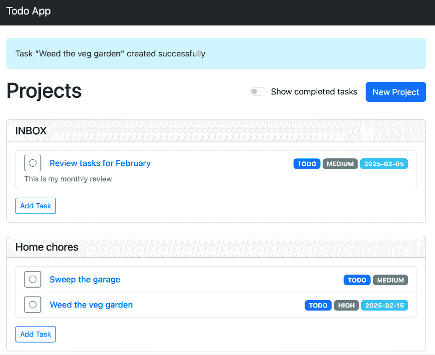
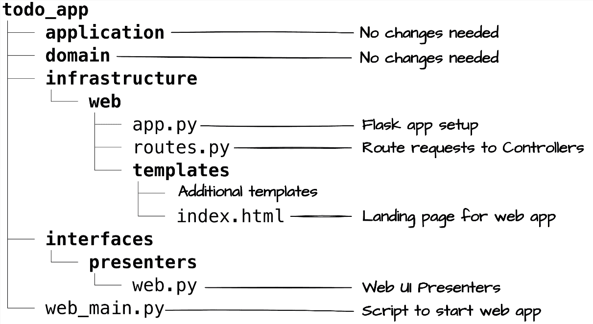
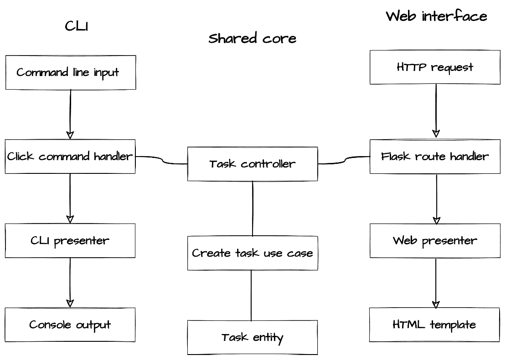
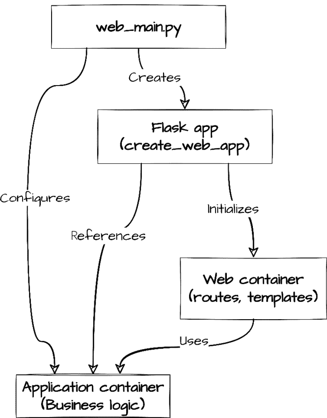
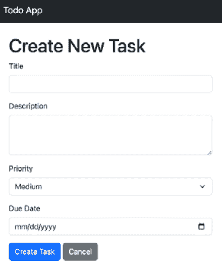

# 第九章：添加 Web UI：纯净架构的接口灵活性

在前面的章节中，我们通过任务管理系统建立了纯净架构的基础模式。我们构建了领域实体，实现了用例，并创建了一个命令行界面（CLI），展示了纯净架构的边界如何使我们的核心业务逻辑和用户界面之间的分离变得清晰。虽然 CLI 提供了一个功能接口，但许多应用程序需要基于 Web 的访问。这为我们展示了纯净架构的原则如何在不损害架构完整性的情况下实现接口进化提供了极好的机会。

通过我们的任务管理系统，我们将展示纯净架构的关键优势之一：在不修改现有代码的情况下添加新接口的能力。因为我们的领域逻辑、用例和控制器都是基于适当的架构边界构建的，添加一个网络接口就变成了一项纯粹的增加性练习。不需要对现有组件进行重构。这个使得添加网络用户界面变得简单的相同原则，也使得长期维护多个接口成为可能，因为每个接口都可以独立进化，同时共享相同的强大核心。

到本章结束时，你将了解如何在保持架构边界的同时实现额外的接口。你将能够将这些模式应用到自己的项目中，确保你的应用程序在接口需求进化时保持适应性。

本章，我们将涵盖以下主要主题：

+   在纯净架构中理解接口灵活性

+   纯净架构中的 Web 展示模式

+   将 Flask 与纯净架构集成

# 技术要求

本章和本书其余部分展示的代码示例已在 Python 3.13 上进行了测试。为了简洁，本章中的大多数代码示例仅部分实现。所有示例的完整版本可以在本书配套的 GitHub 存储库[`github.com/PacktPublishing/Clean-Architecture-with-Python`](https://github.com/PacktPublishing/Clean-Architecture-with-Python)中找到。

# 在纯净架构中理解接口灵活性

我们的任务管理系统 CLI（在*第七章*中实现），展示了纯净架构在核心业务逻辑和用户界面之间的谨慎分离。这种分离不仅是一种良好的实践，而且是为我们将在本章中完成的具体任务进行的战略准备：在保留现有功能的同时添加一个全新的用户界面。

## 理解我们的 Web 实现

为了实现我们的网页界面，我们将使用**Flask**——一个轻量级且灵活的 Python 网页框架。Flask 的明确请求处理和直接的应用程序结构使其非常适合展示清洁架构的边界。其最小核心和广泛的可选扩展生态系统与清洁架构对显式依赖的偏好相吻合。虽然我们将探索的图案同样适用于 Django、FastAPI 或其他网页框架，但 Flask 的简单性有助于我们将重点放在架构原则而不是框架特定功能上。

通过基于浏览器的界面，用户现在可以使用熟悉的、由网页特定功能增强的工作流程来管理他们的项目和任务。当用户访问应用程序时，他们会看到一个干净、分层的视图，展示他们的项目和相关的任务：



图 9.1：Web UI 列表页面，显示项目和它们相关的任务

网页界面通过即时视觉反馈和直观的导航增强了我们现有的任务管理功能。用户可以创建新的任务，更新它们的状态，并在项目中组织它们。界面将我们的现有业务逻辑适配到网页惯例，使用标准模式，如表单提交用于任务创建和闪存消息用于用户反馈。

为了在保持我们的架构边界的同时实现此界面，我们的网页实现被组织成不同的组件：



图 9.2：Web UI 实现的相关文件

这种结构展示了清洁架构在实际操作中的关注点分离。在我们的适配器和接口(`interfaces`)层，网页展示者知道如何通过创建 HTML 友好的字符串和为模板结构化数据来格式化数据以供网页显示，但完全不了解 Flask 或任何特定的网页框架。这些展示者可以同样好地与 Django、FastAPI 或任何其他网页框架一起工作。

这种分离与没有明确架构边界的应用程序形成鲜明对比。在一个结构较松散的应用程序中，对*添加网页界面*的请求往往会触发代码库中的连锁反应。业务逻辑与展示关注点的混合需要大量的重构。嵌入在展示逻辑中的数据库查询需要重新构建。即使是像为网页显示格式化日期这样的看似简单的更改，也可能需要在多个组件中进行修改。在极端情况下，团队发现自己实际上在重写他们的应用程序以适应新的界面。

相比之下，我们的任务管理系统将 Web 界面视为纯粹的增加性变化。不需要修改现有代码：既不是我们的业务规则，也不是我们的用例，甚至不是我们的 CLI。这种在不干扰现有功能的情况下添加主要功能的能力，展示了 Clean Architecture 在系统演变中的实际价值。

框架特定的代码位于它所属的位置——在我们的框架和驱动层中的`infrastructure/web`目录内。在这里，Flask 特定的关注点，如路由处理、模板配置和 HTTP 会话管理，保持在我们系统边缘的隔离。这种分离意味着我们可以在不触及我们的接口适配器或核心业务逻辑的情况下切换 Web 框架。

## 并行接口实现

在深入研究我们的 Web 实现细节之前，让我们检查我们的 CLI 和 Web 界面如何在 Clean Architecture 系统中共存。虽然这些界面通过非常不同的机制（命令行与 HTTP）为用户提供服务，但它们共享相同的核心组件并遵循相同的建筑模式。



图 9.3：请求流比较

此图说明了我们的架构如何在支持多个接口的同时保持清晰的边界：

+   **CLI**通过 Click 命令处理器转换命令行输入

+   **Web 界面**通过 Flask 路由处理器处理 HTTP 请求

+   **共享核心**包含我们的任务控制器、用例和实体

Clean Architecture 通过严格的依赖规则实现了这种共存。两个接口处理器连接到同一个任务控制器，但核心组件完全不知道它们是如何被使用的。这种隔离意味着我们的核心业务逻辑可以专注于任务创建规则，而每个接口处理其特定的关注点，无论是解析命令行参数还是处理表单提交。

为了实现这种分离，我们通过应用程序容器使用实用的依赖注入方法：

```py
# todo_app/infrastructure/configuration/container.py
@dataclass
class Application:
    """Container which wires together all components."""
    task_repository: TaskRepository
    project_repository: ProjectRepository
    notification_service: NotificationPort
    task_presenter: TaskPresenter
    project_presenter: ProjectPresenter 
```

注意每个组件是如何使用抽象接口（`TaskRepository`、`NotificationPort`等）声明的。这使每个接口实现能够提供其自己的特定依赖，而我们的应用程序核心仍然不知道它将接收的具体实现。应用程序工厂展示了这种灵活性在实际中的工作方式。

我们的应用程序工厂实现了 Clean Architecture 的组成根模式，它作为唯一的点，将我们的接口无关的核心与接口特定的实现组合在一起。工厂展示了两个关键的建筑原则：

```py
# todo_app/infrastructure/configuration/container.py
def create_application(
    notification_service: NotificationPort,
    task_presenter: TaskPresenter,
    project_presenter: ProjectPresenter,
) -> "Application":
    """Factory function for the Application container."""
    task_repository, project_repository = create_repositories()

    return Application(
        task_repository=task_repository,
        project_repository=project_repository,
        notification_service=notification_service,
        task_presenter=task_presenter,
        project_presenter=project_presenter,
    ) 
```

首先，工厂展示了清洁架构的依赖倒置原则在实际中的应用：接口特定的组件（展示者）作为参数传递，而核心基础设施（存储库）是内部构建的。这种分离意味着接口实现可以提供自己的展示者，而工厂确保一切都能正确连接到我们的共享业务核心。

其次，工厂作为组合根，是抽象接口与其具体实现相遇的唯一点。

我们的 CLI 应用程序展示了这种对不同接口的适应性。在应用程序边界，我们将共享的核心与 CLI 特定的组件连接起来：

```py
# cli_main.py
def main() -> int:
    """Main entry point for the CLI application."""
    app = create_application(
        notification_service=NotificationRecorder(),
        task_presenter=CliTaskPresenter(),
        project_presenter=CliProjectPresenter(),
    )
    cli = ClickCli(app)
    return cli.run() 
```

注意`main()`如何通过提供接口特定的实现（`CliTaskPresenter`，`CliProjectPresenter`）到我们的通用应用程序容器来配置 CLI 特定的应用程序实例。然后`ClickCli`类包装这个核心应用程序，处理命令行交互与我们的应用程序接口无关的操作。围绕我们的核心应用程序包装接口特定代码的模式是清洁架构的基本实践，我们将在 Web 实现中看到其镜像。

通过以这种方式设置我们的应用程序，我们建立了一个清晰的模式，说明新的接口如何连接到我们的核心应用程序。要添加我们的 Web 接口，我们需要实现类似的角色，但针对 Web 特定的关注点：

+   **展示层**：为 HTML 模板实现`WebTaskPresenter`

+   **请求处理**：处理表单提交和 URL 参数

+   **会话状态**：管理请求之间的持久性

+   **用户反馈**：实现 Web 特定的错误展示

关键的洞见在于所有与接口相关的关注点都保持在我们的系统边缘。每个接口处理其独特的需求，例如 Web 会话管理或 CLI 参数解析，而我们的核心业务逻辑保持专注且清晰。

在下一节中，我们将探讨特定于 Web 界面的展示模式，看看这些保持了 CLI 实现清洁的相同原则如何指导我们创建可维护的特定于 Web 的组件。

## 常见的接口边界违规

清洁架构的有效性取决于在层之间保持清晰的边界。一个常见的违规行为是当开发者允许接口特定的格式渗透到控制器中，从而产生错误的方向依赖。考虑以下反模式：

```py
# Anti-pattern: Interface-specific logic in controller
def handle_create(self, request_data: dict) -> dict:
    """DON'T: Mixing CLI formatting in controller."""
    try:
        result = self.create_use_case.execute(request_data)
        if result.is_success:
            # Wrong: CLI-specific formatting doesn't belong here
            return {
                "message": click.style(
                    f"Created task: {result.value.title}",
                    fg="green"
                )
            }
    except ValueError as e:
        # Wrong: CLI-specific error formatting
        return {"error": click.style(str(e), fg="red")} 
```

这种实现方式在微妙但重要的方式上违反了清洁架构的依赖规则。控制器位于我们的接口适配器层，直接引用 Click（一个应该限制在我们最外层框架的框架）。这造成了一个问题耦合，因为我们的控制器现在既依赖于应用层（内部）又依赖于框架层（外部），违反了清洁架构的基本规则，即依赖关系应该只指向内部。除了架构违规之外，这种耦合还有实际后果：我们无法重用这个控制器来处理我们的 Web 界面，而且即使更新到 Click 的新版本，也需要在我们的接口适配器层进行更改。

相反，我们的任务管理系统正确地将所有格式化问题委托给特定于接口的展示者。注意我们的控制器只依赖于抽象的`展示者`接口。它不知道它是在与命令行界面（CLI）、Web 界面还是任何其他具体的展示者实现工作：

```py
# Correct: Interface-agnostic controller
def handle_create(self, title: str, description: str) -> OperationResult:
    """DO: Keep controllers interface-agnostic."""
    try:
        request = CreateTaskRequest(title=title, description=description)
        result = self.create_use_case.execute(request)
        if result.is_success:
            view_model = self.presenter.present_task(result.value)
            return OperationResult.succeed(view_model)
        error_vm = self.presenter.present_error(
            result.error.message, str(result.error.code.name)
        )
        return OperationResult.fail(error_vm.message, error_vm.code)
    except ValueError as e:
        error_vm = self.presenter.present_error(
            str(e), "VALIDATION_ERROR")
        return OperationResult.fail(error_vm.message, error_vm.code) 
```

这种修正后的实现展示了几个清洁架构的原则：

+   控制器接受简单类型（`str`）而不是特定于框架的结构

+   错误处理产生无框架的`OperationResult`实例

+   所有格式化都委托给抽象的`presenter`接口

+   控制器始终专注于协调用例和展示层之间的工作

这种方法带来了显著的实际效益。在我们的清洁实现中，框架更改只会影响最外层。我们可以通过简单地实现新的适配器来替换 Click，而不必触及我们的控制器、用例或领域逻辑。相同的控制器可以以相同的方式处理请求，无论这些请求是从我们的 CLI、Web 界面还是我们可能添加的任何未来界面发起。

接口适配器层充当保护边界，在领域核心和外部接口之间转换数据。这个架构边界使我们能够在不破坏现有组件的情况下添加 Web 界面。我们的领域实体专注于业务规则，而特定于接口的关注点则被适当地隔离在系统边缘。

既然我们已经确定了清洁架构的边界如何使接口具有灵活性，那么让我们来检查为 Web 界面所需的特定展示模式以及它们如何保持相同的架构原则。

# 清洁架构中的 Web 展示模式

在确立了 Clean Architecture 如何实现界面灵活性之后，我们现在转向网络展示所需的具体模式。虽然我们的 CLI 直接格式化数据以供控制台输出，但网络界面必须处理更复杂的展示需求：为 HTML 模板格式化数据、跨多个请求管理状态，以及通过表单验证和闪存消息（在页面顶部显示的临时通知横幅，如*图 9.1*中显示的绿色成功消息）提供用户反馈。本节将探讨这些特定于网络的挑战，并展示 Clean Architecture 的边界如何指导我们的实现选择。

我们将检查特定于网络的演示者如何格式化域数据以供 HTML 显示，确保我们的模板接收适当结构化的信息。我们将看到如何跨请求的状态管理可以尊重 Clean Architecture 的边界，以及如何表单处理可以保持网络关注点和业务规则之间的分离。通过这些模式，我们将展示尽管网络界面复杂，但它们可以干净地与我们的现有架构集成。

## 实现特定于网络的演示者

为了连接我们的域逻辑和网络展示需求，我们需要理解网络约定的演示者。为了了解我们的网络演示者应该如何工作，让我们首先检查*第七章*中的 CLI 演示者。注意它如何封装所有 CLI 特定的格式化决策（括号中的状态、彩色优先级）同时通过`TaskViewModel`保持一个干净的界面。这种将域对象转换为适合界面的视图模型的模式将指导我们的网络实现：

```py
# CLI Presenter from *Chapter 7*
def present_task(self, task_response: TaskResponse) -> TaskViewModel:
    """Format task for CLI display."""
    return TaskViewModel(
        id=task_response.id,
        title=task_response.title,
        # CLI-specific bracketed format:
        status_display=f"[{task_response.status.value}]", 
        # CLI-specific coloring:
        priority_display=self._format_priority(task_response.priority)
    ) 
```

我们的网络演示者遵循相同的模式，但适应 HTML 显示的格式化：

```py
class WebTaskPresenter(TaskPresenter):
    def present_task(self, task_response: TaskResponse) -> TaskViewModel:
        """Format task for web display."""
        return TaskViewModel(
            id=task_response.id,
            title=task_response.title,
            description=task_response.description,
            status_display=task_response.status.value,
            priority_display=task_response.priority.name,
            due_date_display=self._format_due_date(
                task_response.due_date),
            project_display=task_response.project_id,
            completion_info=self._format_completion_info(
                task_response.completion_date,
                task_response.completion_notes
            ),
        ) 
```

注意`WebTaskPresenter`类如何提供针对网络显示需求额外的字段和格式：HTML 友好的状态值、浏览器显示的日期格式，以及用于模板渲染的结构化完成信息。这种实现展示了 Clean Architecture 的演示者如何作为域概念和展示需求之间的系统化翻译层：

+   将域对象转换为适合界面的格式，同时保留其业务意义

+   将所有展示决策集中在一个单一、可测试的组件中

+   使每个接口能够根据其特定需求适应域数据

+   在域逻辑和展示关注点之间保持清晰的分离

演示者不仅格式化数据；它作为域概念在界面中呈现的权威解释者。考虑我们的日期格式化方法：

```py
def _format_due_date(self, due_date: Optional[datetime]) -> str:
    """Format due date for web display."""
    if not due_date:
        return ""
    is_overdue = due_date < datetime.now(timezone.utc)
    date_str = due_date.strftime("%Y-%m-%d")
    return f"Overdue: {date_str}" if is_overdue else date_str 
```

`_format_due_date`方法封装了所有与日期相关的格式化决策：时区处理、日期格式字符串和逾期状态检查。通过将这些决策包含在演讲者中，我们确保我们的领域实体保持专注于业务规则（何时完成任务）同时，展示关注点（如何显示到期日期）保持在适当的架构层。

这个翻译层允许我们的模板保持简单，同时仍然提供丰富、上下文相关的信息：

```py
<span class="badge
    bg-danger
    bg-info
    ">
    {{ task.due_date_display }}
</span> 
```

模板展示了 Clean Architecture 在操作中的关注点分离：它纯粹关注 HTML 结构和基于预格式化值的样式决策。所有业务逻辑（`datetime`比较）和数据格式化都保留在适当的架构层。模板只是简单地调整演讲者的输出以进行视觉显示，使用简单的字符串检查来应用适当的 CSS 类。

正如在第*第八章*中一样，我们可以通过集中的单元测试来验证这个格式化逻辑。这个测试展示了 Clean Architecture 关注点分离的关键好处：我们可以独立验证我们的展示逻辑，而不需要任何 Web 框架依赖。通过直接针对演讲者进行测试，我们可以确保我们的日期格式化逻辑正确无误，而无需设置完整的 Web 环境。测试纯粹关注从领域数据到展示格式的转换：

```py
def test_web_presenter_formats_overdue_date():
    """Test that presenter properly formats overdue dates."""
    # Arrange
    past_date = datetime.now(timezone.utc) - timedelta(days=1)
    task_response = TaskResponse(
        id="123",
        title="Test Task",
        description="Test Description",
        status=TaskStatus.TODO,
        priority=Priority.MEDIUM,
        project_id="456",
        due_date=past_date
    )
    presenter = WebTaskPresenter()
    # Act
    view_model = presenter.present_task(task_response)
    # Assert
    assert "Overdue" in view_model.due_date_display
    assert past_date.strftime("%Y-%m-%d") in view_model.due_date_display 
```

这个测试展示了 Clean Architecture 的关注点分离如何使我们能够精确验证我们的 Web 格式化逻辑。我们可以测试复杂的场景，如逾期日期，而无需任何 Web 框架设置。相同的模式适用于未来日期：

```py
def test_web_presenter_formats_future_date():
    """Test that presenter properly formats future dates."""
    # Arrange
    future_date = datetime.now(timezone.utc) + timedelta(days=1)
    task_response = TaskResponse(
        id="123",
        title="Test Task",
        description="Test Description",
        status=TaskStatus.TODO,
        priority=Priority.MEDIUM,
        project_id="456",
        due_date=future_date
    )
    presenter = WebTaskPresenter()
    # Act
    view_model = presenter.present_task(task_response)
    # Assert
    assert "Overdue" not in view_model.due_date_display
    assert future_date.strftime("%Y-%m-%d") in view_model.due_date_display 
```

这个互补的测试确保我们的演讲者适当地处理未来日期，完成了我们对日期格式化逻辑的验证。与之前的测试一起，我们确认了“逾期”指示器的存在和不存在，所有这些都不需要接触任何 Web 框架代码。

这些测试突出了 Clean Architecture 的演讲者模式的优点。我们的格式化逻辑可以在不复杂的网络设置下得到验证。无需 Flask 测试客户端、模拟数据库或 HTML 解析。日期格式的更改可以快速、精确地测试，同时我们的模板仍然专注于显示问题。

这种模式跨越了所有领域概念，从任务状态到优先级级别，确保业务对象到展示格式的持续转换。我们系统中的任何模板都可以显示任务到期日期，而无需知道这些日期是如何格式化的。更重要的是，随着我们的格式化逻辑随着时区支持或新的显示格式等添加而发展，我们只需要更新演讲者和其测试。我们的模板、控制器和领域逻辑保持不变。

## 演讲者与基于模板的格式化

熟悉现代 Web 框架（如 React、Vue）或 Flask/Django 中的模板导向模式的开发者可能会质疑我们将格式化逻辑分离到展示器中的做法。许多应用程序直接在模板中嵌入格式化：

```py
<!-- Common pattern in many web frameworks -->
<span class="badge bg-dangerbg-info">
    {{ task.due_date.strftime("%Y-%m-%d") }}
    (Overdue)
</span> 
```

虽然这种模式很普遍，但它模糊了展示决策和显示结构之间的界限。在清洁架构中，我们将格式化视为属于接口适配器层的翻译关注点，而不是模板本身。

即使在与模板导向框架一起工作时，清洁架构的原则仍然可以通过以下方式指导实现决策：

+   认识到业务决策是如何泄漏到模板中的

+   将格式化逻辑提取到专用组件中

+   将模板纯粹视为显示结构

基本架构原则保持不变：在层之间保持清晰的边界。无论是通过我们的显式展示器模式还是通过模板辅助程序和组件来实现，目标都是确保在它们达到最外层的显示层之前，领域概念得到适当的转换。

## 管理 Web 特定的状态

会话数据和表单状态为维护清洁架构的边界带来了独特的挑战。让我们看看我们的系统是如何在保持核心领域逻辑纯净的同时处理这些特定的 Web 关注点的。考虑以下反模式，其中领域实体直接访问 Web 会话数据：

```py
# Anti-pattern: Domain entity accessing web state
class Task:
    def complete(self, web_app_contatiner):
        # Wrong: Task shouldn't know about web sessions
        self.completed_by = web_app_contatiner.user.id
        self.completed_at = datetime.now() 
```

这展示了将 Web 关注点混合到领域实体中如何创造多个维护挑战：

+   测试需要模拟基本的领域逻辑的 Web 会话数据

+   添加新接口意味着更新实体代码，而不仅仅是添加适配器

+   会话处理错误可能会在整个领域层中传播

+   实体行为变得依赖于 Web 框架的实现细节

我们的 Flask 路由处理程序充当了架构边界，在这里管理 Web 特定的关注点。它们将 HTTP 概念转换为领域无关的操作，同时保持 Web 状态管理在其所属的位置：

```py
# todo_app/infrastructure/web/routes.py
@bp.route("/")
def index():
    """List all projects with their tasks."""
    app = current_app.config["APP_CONTAINER"]
    show_completed = (
        request.args.get("show_completed", "false")
        .lower() == "true"
    )
    result = app.project_controller.handle_list()
    if not result.is_success:
        error = project_presenter.present_error(result.error.message)
        flash(error.message, "error")
        return redirect(url_for("todo.index"))
    return render_template(
        "index.html",
        projects=result.success,
        show_completed=show_completed
    ) 
```

此处理程序展示了清洁架构边界管理的实际应用。在我们系统的这个外围边缘，路由捕获并处理 Web 特定的状态，如`show_completed`偏好，将 HTTP 概念转换为领域无关的操作。而不是允许领域实体直接访问会话数据，处理程序在传递给我们的核心业务逻辑之前只提取必要的信息。Web 特定的关注点，如通过闪存消息的用户反馈和模板渲染，保持在这一外围层，而我们的领域逻辑则专注于其核心职责。

## 表单处理和验证

在 Web 应用程序中，表单提交提出了一个架构挑战。一个常见的反模式是在模板、控制器和领域实体之间分散验证逻辑，这使得维护和演进验证规则变得困难。让我们看看 Clean Architecture 如何指导我们适当地处理表单，以一个简单的项目创建表单为例：

```py
# todo_app/infrastructure/web/routes.py
@bp.route("/projects/new", methods=["GET", "POST"])
def new_project():
    """Create a new project."""
    if request.method == "POST":
        name = request.form["name"]
        app = current_app.config["APP_CONTAINER"]
        result = app.project_controller.handle_create(name)
        if not result.is_success:
            error = project_presenter.present_error(result.error.message)
            flash(error.message, "error")
            return redirect(url_for("todo.index"))
        project = result.success
        flash(f'Project "{project.name}" created successfully', "success")
        return redirect(url_for("todo.index"))
    return render_template("project_form.html") 
```

路由处理程序展示了 Clean Architecture 的验证流程：

1.  路由提取 Web 特定的输入：

    +   URL 参数（`project_id`）

    +   表单字段（`request.form["title"]` 等）

    +   具有默认值的可选字段（`due_date`）

1.  任务控制器接收标准的 Python 类型：

    +   文本字段使用字符串

    +   对于空的可选字段使用 `None`

    +   来自 URL 的 `project_id`

1.  领域验证通过既定的层进行：

    +   实体中的业务规则

    +   用例协调

    +   通过我们的 Result 类型返回的结果

1.  Web 特定响应：

    +   使用 flash 消息的成功重定向

    +   通过 flash 消息和重定向进行错误处理

**同步客户端和领域验证**

虽然我们的领域验证提供了最终的真实来源，但现代 Web 应用程序通常需要立即的用户反馈。Flask 提供了像 WTForms 这样的机制，可以在视图层中反映领域验证规则，从而实现响应式 UX 而不重复验证逻辑。关键是确保这些视图层验证只是我们核心领域规则的外层包装，而不是引入并行验证逻辑。

这种分离确保我们的验证规则留在它们所属的领域逻辑中，而 Web 层则专注于收集输入和呈现反馈。

# 将 Flask 与 Clean Architecture 集成

在确立了我们的展示模式和状态管理方法之后，我们现在转向将 Flask 实际集成到我们的 Clean Architecture 系统中。在 *理解 Clean Architecture 中的接口灵活性* 中看到的先前应用程序容器结构的基础上，我们将关注 Web 接口的 Flask 特定方面：

+   配置 Flask 的应用程序工厂模式

+   管理 Flask 特定的设置和依赖项

+   将 Flask 路由连接到我们的核心应用程序逻辑

这就是我们的 Flask 应用程序工厂如何与我们的现有架构集成：

```py
# todo_app/infrastructure/web/app.py
def create_web_app(app_container: Application) -> Flask:
    """Create and configure Flask application."""
    flask_app = Flask(__name__)
    # Change this in production:
    flask_app.config["SECRET_KEY"] = "dev" 
    # Store container in config:
    flask_app.config["APP_CONTAINER"] = app_container 
    # Register blueprints
    from . import routes
    flask_app.register_blueprint(routes.bp)
    return flask_app 
```

让我们检查这个设置的要点组件。如图 *图 9.4* 所示，`web_main.py` 作为我们应用程序的入口点，通过 Flask 协调创建和配置我们的业务逻辑（应用程序容器）和 Web 接口（Web 容器）。应用程序容器持有我们的核心业务逻辑，而 Web 容器则管理 Flask 特定的关注点，如路由和模板。



图 9.4：显示容器关系的 Flask 应用程序引导

这种结构在几个关键方面遵循 Clean Architecture 的原则：

+   将 Flask 特定代码隔离在 Web 容器中

+   维持我们的核心应用程序容器的独立性，不受 Web 关注的影响

+   通过定义良好的接口，在容器之间启用清晰的通信路径

在这些容器正确配置和连接后，我们就可以实现我们的路由和模板了。这些组件将建立在已建立的展示模式之上，展示 Clean Architecture 如何使我们能够创建一个功能齐全的 Web 界面，同时保持清晰的架构边界。

## 实现路由和模板

在本章早期，我们从数据流的角度检查了路由：它们如何代表我们系统的入口点，以及如何将 HTTP 请求转换为我们的核心领域。现在让我们更仔细地看看它们的实现，以了解它们如何在提供特定于 Web 的功能的同时维护 Clean Architecture 的边界。

正如我们的 CLI 实现将命令行参数转换为用例输入一样，我们的 Web 路由将 HTTP 请求转换为我们的核心应用程序可以理解的操作。虽然交付机制不同（HTTP 请求而不是命令行参数），但架构模式保持不变：外部输入通过我们的接口适配器流动，然后到达我们的应用程序核心。

考虑我们的 CLI 如何处理任务创建：

```py
# todo_app/infrastructure/cli/click_cli_app.py
def _create_task(self):
    """CLI task creation."""
    title = click.prompt("Task title", type=str)
    description = click.prompt("Description", type=str)
    result = self.app.task_controller.handle_create(
        title=title,
        description=description
    ) 
```

我们的 Web 路由实现了与 CLI 相同的架构模式，尽管是为 HTTP 的请求-响应周期进行了调整。正如 CLI 处理程序将命令行参数转换为领域操作一样，这个路由处理程序作为 HTTP 概念和我们的领域逻辑之间的清晰边界：

```py
@bp.route("/projects/<project_id>/tasks/new", methods=["GET", "POST"])
def new_task(project_id):
    """Create a new task in a project."""
    if request.method == "POST":
        app = current_app.config["APP_CONTAINER"]
        result = app.task_controller.handle_create(
            project_id=project_id,
            title=request.form["title"],
            description=request.form["description"],
            priority=request.form["priority"],
            due_date=(
                request.form["due_date"]
                if request.form["due_date"] else None
            ),
        )
        if not result.is_success:
            error = task_presenter.present_error(result.error.message)
            flash(error.message, "error")
            return redirect(url_for("todo.index"))
        task = result.success
        flash(f'Task "{task.title}" created successfully', "success")
        return redirect(url_for("todo.index"))
    return render_template("task_form.html", project_id=project_id) 
```

注意这两种实现：

+   以接口特定的方式收集输入（CLI 提示与表单数据）

+   将该输入转换为我们的控制器标准参数

+   适当地处理它们的界面中的成功和错误响应（CLI 输出与 HTTP 重定向）

这种一致的模式展示了 Clean Architecture 如何使多个接口成为可能，同时保持我们的核心应用程序专注于业务逻辑。

路由处理不仅限于简单的表单处理。`project_id`参数来自 URL 本身（`/projects/<project_id>/tasks/new`），而表单字段包含任务详情。我们的 Clean Architecture 层自然地处理这一点：

+   路由层管理所有 Web 特定内容：

    +   提取 URL 参数

    +   表单数据收集

    +   用于用户反馈的闪存消息（在重定向后显示的临时 UI 消息）

    +   模板选择和渲染

+   控制器层处理：

    +   将 URL 和表单数据合并为单一操作

    +   协调适当的用例

    +   返回我们的 Web 层可以解释的结果

模板代表我们 Clean Architecture 系统的最外层，作为领域概念与用户界面之间的最终转换点。虽然我们的展示者处理领域数据到视图模型的逻辑转换，但模板专注于数据的视觉表示：

```py


    
    <div class="card mb-4">
        <div class="card-header">
            <h2 class="card-title h5 mb-0">{{ project.name }}</h2>
        </div>
        <!-- Template focuses purely on structure and display -->
    </div>
    
 
```

此模板展示了我们在实际操作中如何清晰地区分关注点。它仅与我们的演示者提供的`ProjectViewModel`一起工作。注意它如何简单地引用`project.name`，而不需要了解这些数据是如何检索或处理的。模板对存储库、用例或甚至 HTTP 层都没有意识，而是专注于以用户友好的格式渲染提供的视图模型。这反映了我们的 CLI 演示者如何格式化数据以供控制台输出，每个接口只处理其特定的显示要求。

这种分离意味着我们可以完全重新设计我们的模板，无论是更改布局、添加新的 UI 组件，甚至切换模板引擎，而无需触及我们的核心应用程序逻辑。

## 运行你的 Clean Architecture Web 应用程序

在实现了我们的 Web 界面组件之后，让我们来看看如何引导我们的 Clean Architecture 应用程序。`web_main.py`脚本作为我们的组合根——抽象接口与具体实现相遇的唯一点。此入口点协调组件的创建和连接，同时保持 Clean Architecture 的依赖规则：

```py
def main():
    """Create and run the Flask web application."""
    app_container = create_application(
        notification_service=create_notification_service(),
        task_presenter=WebTaskPresenter(),
        project_presenter=WebProjectPresenter(),
    )
    web_app = create_web_app(app_container)
    web_app.run(debug=True)
if __name__ == "__main__":
    main() 
```

依赖倒置原则允许通过环境变量在运行时配置具体实现。正如我们的 CLI 应用程序可以在不更改代码的情况下切换组件一样，我们的 Web 界面保持了这种灵活性：

```py
# Repository Configuration
export TODO_REPOSITORY_TYPE="memory"  # or "file"
export TODO_DATA_DIR="repo_data"      # used with file repository
# Optional: Email Notification Configuration
export TODO_SENDGRID_API_KEY="your_api_key"
export TODO_NOTIFICATION_EMAIL="recipient@example.com" 
```

这种配置灵活性展示了 Clean Architecture 的关键优势：能够轻松切换组件。例如，将`TODO_REPOSITORY_TYPE`从“memory”更改为“file”，可以切换我们的整个存储实现，而无需进行任何代码更改。使我们能够添加 Web 界面的相同模式也使得以下操作成为可能：

+   添加新的存储后端（如 PostgreSQL 或 MongoDB）

+   实现额外的通知服务

+   创建新的接口（例如桌面或移动应用）

+   支持替代认证方法

这些增强功能都可以独立实现和测试，然后通过我们的清洁架构边界进行集成。这种能力使开发团队能够在保持系统稳定性的同时，对新功能和新技术进行实验。而不是冒险的“大爆炸”代码部署，团队可以在 Clean Architecture 的保护边界内，逐步通过添加和测试新组件来演进他们的应用程序。

要启动 Web 应用程序，运行主脚本：

```py
> python web_main.py
 * Serving Flask app 'todo_app.infrastructure.web.app'
 * Debug mode: on
 * Running on http://127.0.0.1:5000
Press CTRL+C to quit
 * Restarting with stat
 * Debugger is active!
 * Debugger PIN: 954-447-204
127.0.0.1 - - [05/Feb/2025 13:58:57] "GET / HTTP/1.1" 200 - 
```

在你的浏览器中访问`http://127.0.0.1:5000`将呈现一个 Web 界面，虽然其形式与我们的 CLI 截然不同，但它运行在完全相同的核心组件上。我们的 CLI 解释命令行参数，而我们的 Web 界面现在处理表单提交和 URL 参数。之前响应 CLI 命令的任务创建用例现在处理 HTTP POST 请求：



图 9.5：任务创建表单显示 Web 特定的输入处理

这种双重性展示了 Clean Architecture 的实际应用。我们的简单命令行应用程序现在与完整的 Web 界面共存，包括表单、动态更新和视觉反馈。这两个接口独立运行但共享相同的内核组件。之前处理 CLI 命令的相同任务创建用例现在无缝处理 Web 表单提交。我们的存储库维护一致的数据，无论哪个接口创建或更新记录。错误处理自然适应，对于 CLI 用户是命令行错误消息，对于 Web 用户是闪存消息和表单验证。

这些不仅仅是两个使用类似代码的独立应用程序：它们是访问相同应用程序核心的两个接口，每个接口都以适合其环境的方式展示其功能。团队成员可以通过 CLI 创建任务，而另一位成员可以通过 Web 界面更新它，这两个操作都通过相同的用例和存储库进行，展示了 Clean Architecture 边界规则的实用力量。

# 摘要

我们从 CLI 到 Web 界面的转变突出了 Clean Architecture 在使系统演进而不损害架构完整性方面的力量。这种能力不仅限于 Web 界面，而是一个更广泛的原则：精心设计的架构边界创建的系统可以适应不断变化的接口需求，同时保持稳定的内核。

我们所探讨的这些模式为未来的系统演进提供了一个模板。这些模式从特定于接口的演示者到系统边界的状态管理。无论是添加移动界面、API 端点还是全新的交互模型，这些相同的原理确保我们的核心业务逻辑保持专注和保护。

这种灵活性并不会牺牲可维护性。通过保持我们的领域实体专注于业务规则，以及我们的用例与纯领域概念协同工作，我们创建了一个系统，其中每个层都可以独立演进。新的接口需求可以通过额外的适配器来满足，而我们的核心业务逻辑保持稳定且未受影响。

在*第十章*中，我们将探讨如何向 Clean Architecture 系统添加日志记录和监控，确保我们的应用程序在生产环境中保持可观察性和可维护性。

# 进一步阅读

+   *Flask 文档* ([`flask.palletsprojects.com/en/stable/`](https://flask.palletsprojects.com/en/stable/))。Flask 框架的完整文档。

+   *WTForms* ([`wtforms.readthedocs.io/en/3.2.x/`](https://wtforms.readthedocs.io/en/3.2.x/))。Python Web 开发的灵活表单验证和渲染库。
