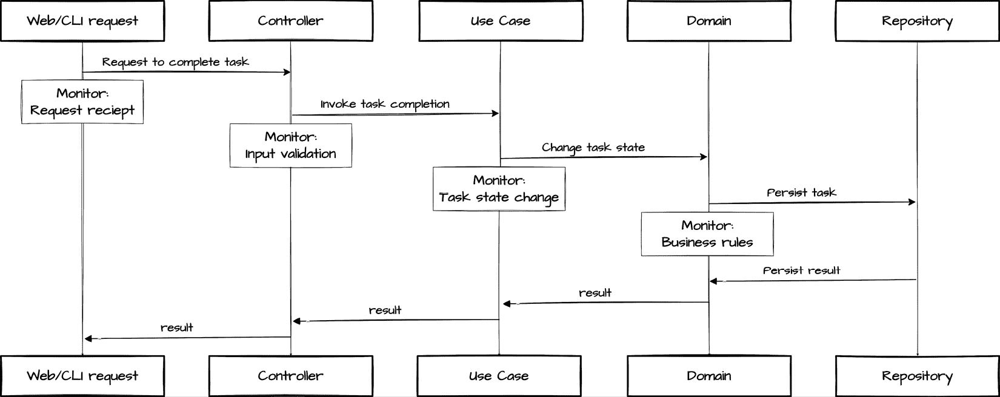
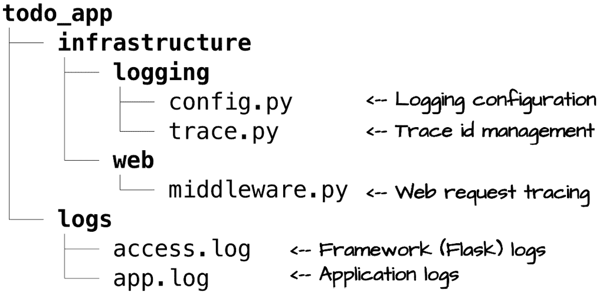
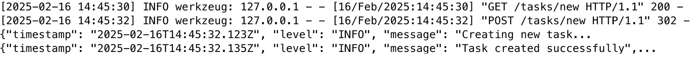
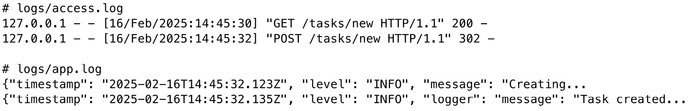
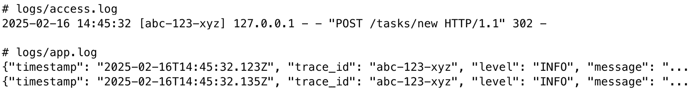
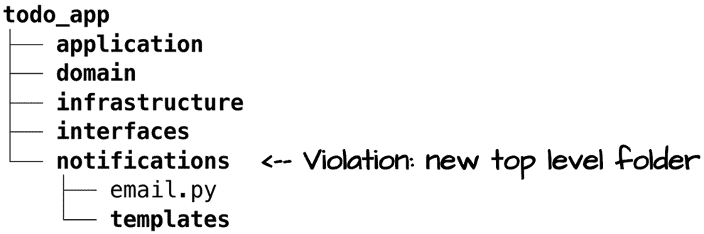
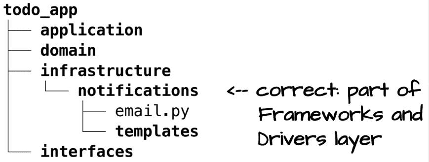

# 10

# 实现可观察性：监控和验证

在前面的章节中，我们通过任务管理系统确立了 Clean Architecture 的核心原则。我们构建了领域实体，实现了用例，并创建了 CLI 和网络接口，展示了 Clean Architecture 的边界如何使我们的核心业务逻辑与外部关注点之间实现清晰的分离。虽然这些边界使我们的系统更易于维护，但它们还服务于另一个关键目的。它们使我们的系统更可观察，其架构完整性更可验证。

通过我们的任务管理系统，我们将展示如何通过 Clean Architecture 将系统可观察性从横切关注点转变为结构化能力。由于我们的系统是用清晰的架构层和明确的接口构建的，因此监控成为我们现有结构的自然扩展。这种简化监控的组织结构同样也使得持续验证成为可能，有助于确保我们的系统在演变过程中保持其架构完整性。

到本章结束时，你将了解如何在 Clean Architecture 系统中实现有效的可观察性，以及如何验证架构边界在时间上保持完整。你将学习检测和预防架构漂移的实用技术，帮助确保你的系统即使在需求团队演变的情况下也能保持其清晰的架构结构。

在本章中，我们将涵盖以下主要主题：

+   理解 Clean Architecture 中的可观察性

+   实现跨边界仪表化

+   通过监控维护架构完整性

# 技术要求

本章和本书其余部分展示的代码示例均使用 Python 3.13 进行测试。为了简洁，本章中的大多数代码示例仅部分实现。所有示例的完整版本可以在本书配套的 GitHub 仓库中找到，网址为 [`github.com/PacktPublishing/Clean-Architecture-with-Python`](https://github.com/PacktPublishing/Clean-Architecture-with-Python)。

# 理解 Clean Architecture 中的可观察性边界

Clean Architecture 的明确层边界提供了系统观察的自然点，这是许多团队忽视的显著优势。虽然分层架构可能会引入复杂性，但这些有助于管理依赖关系的相同划分也使得系统监控和可观察性成为可能。让我们首先探讨 Clean Architecture 的基本原则如何为更好的系统仪表化创造机会，为我们稍后将要探讨的实际实现奠定基础。通过理解这些概念，你将看到 Clean Architecture 如何使系统不仅更易于维护，而且更可观察。

## Clean Architecture 中的自然观察点

清洁架构的分层结构自然地创造了系统观察的战略点。在探索这些观察点之前，让我们了解我们在软件系统中所说的可观察性是什么。现代可观察性结合了日志、指标和请求跟踪，以提供系统行为的完整视图。在传统系统中，这些关注点跨越所有组件，实现全面的监控通常成为解决错综复杂依赖关系的练习。

清洁架构通过在每个层转换处提供一致的观察点，将这种复杂性转化为清晰性。考虑信息如何通过我们的任务管理系统流动：当用户通过网页界面创建任务时，我们可以观察请求如何穿过我们的架构层，从最初的 HTTP 处理，通过业务操作，到最终的持久化。每个层边界都提供了特定的洞察：

+   我们的网页界面跟踪传入请求及其转换。

+   用例监控业务操作及其结果。

+   领域实体捕获状态变化和业务规则应用。

+   基础设施组件测量资源利用和外部交互。

这种系统化方法确保我们能够了解系统行为的每一个关键方面，同时在技术和业务关注点之间保持清晰的分离。这不仅改变了监控方式，也改变了我们对系统维护的整体方法。在调查问题或分析性能时，我们知道确切的位置去寻找相关信息。正如我们将在以下章节中看到的，这种相同的结构化方法不仅使监控成为可能，也为验证我们的架构完整性提供了基础。

## 理解清洁架构中的可观察性

在看到清洁架构如何提供自然的观察点后，让我们探索如何在实践中有效地利用这些点。虽然前面的章节侧重于建立核心架构原则，但现实世界的系统从一开始就需要可观察性。早期的仪表化证明至关重要。没有它，调试变得更加困难，性能问题无法被发现，理解不同环境下的系统行为几乎成为不可能。

考虑这在我们的任务管理系统中的应用。*图 10.1*展示了看似简单的任务完成操作如何涉及多个架构转换，每个转换都提供了不同的可观察性需求：



图 10.1：带有观察点的任务完成流程

图表展示了监控关注点如何自然地与我们的架构层对齐。在每次转换中，我们捕捉系统行为的特定方面，从外部边界的技术指标到核心层中的业务操作。这种系统性的方法确保我们在尊重 Clean Architecture 的关注点分离的同时，保持全面的可见性。

分层监控方法提供了明显的优势。在调查问题时，我们可以精确地追踪系统中的操作。如果客户报告间歇性任务完成失败，我们可以从 Web 请求通过业务逻辑追踪操作，以确定问题出在哪里。由于我们知道哪个层处理操作的每个方面，性能瓶颈变得更容易定位。

每一层都贡献它最擅长的。Web 接口跟踪请求处理，用例监控业务操作，而基础设施捕获技术指标。通过尊重这些自然划分，我们保持业务和技术关注点之间的清晰分离，同时确保全面了解系统行为。

这些监控原则直接转化为实现模式。在我们的任务管理系统，我们将使用 Python 的标准日志框架来实现这种分层可观察性。我们将看到 Clean Architecture 的边界如何引导我们走向简单而有效的监控解决方案，在保持架构完整性的同时，提供系统所需的洞察力。

# 实现跨边界监控

让我们将对 Clean Architecture 可观察性优势的理解转化为实际实施。现代 Web 框架，如 Flask，提供了它们自己的日志基础设施，这可能诱使开发者将业务操作与框架特定日志紧密耦合。我们将看到如何有效地与这些框架机制合作，同时保持我们的核心业务逻辑框架独立。通过精心实施结构化日志和请求跟踪，我们将展示保持 Clean Architecture 边界的同时，提供全面系统可观察性的模式。

## 避免日志中的框架耦合

正如我们提到的，Web 框架通常提供它们自己的日志基础设施。例如，Flask 鼓励直接使用其应用程序日志记录器 (`app.logger`)：

```py
@app.route('/tasks/new', methods=['POST'])
def create_task():
    task = create_task_from_request(request.form)
    # Framework-specific logging:
    app.logger.info('Created task %s', task.id) 
    return redirect(url_for('index')) 
```

虽然这种方法很方便，但它会在我们的业务操作和框架特定日志之间创建问题性的耦合。使用 Flask 的 `app.logger` 需要使 Flask 应用程序对象在整个代码库中可访问，这是 Clean Architecture 的依赖规则的一个严重违反。内层需要向框架层伸出援手，仅仅是为了执行日志记录，这正是不想看到的对外依赖。

相反，清洁架构引导我们走向框架无关的日志，它尊重架构边界。考虑我们的任务创建用例应该如何记录操作：

```py
# todo_app/application/use_cases/task_use_cases.py
import logging
logger = logging.getLogger(__name__)
@dataclass
class CreateTaskUseCase:
    task_repository: TaskRepository
    project_repository: ProjectRepository
    def execute(self, request: CreateTaskRequest) -> Result:
        try:
            logger.info(
                "Creating new task",
                extra={"context": {
                    "title": request.title,
                    "project_id": request.project_id
                }},
            )
            # ... implementation continues ... 
```

这种方法提供了几个清洁架构的好处：

+   用例对日志实现细节一无所知

+   日志语句自然地记录业务操作

+   我们可以更改日志基础设施，而无需修改业务逻辑

+   框架特定的日志保持在系统边缘，它应该属于的地方

让我们系统地实现这种清洁日志方法，从正确分离框架和应用日志关注点开始。

## 实现结构化日志模式

正如我们所看到的，清洁架构要求基础设施关注点，包括日志实现细节，保持在外层隔离。

对于我们的实现，我们选择了结构化 JSON 日志。这是一种常见的做法，它使精确的日志处理和分析成为可能。每个日志条目都成为一个具有一致字段的 JSON 对象，这使得程序化搜索、过滤和分析日志数据变得更加容易。虽然我们将演示 JSON 格式化，但我们建立的模式也可以同样适用于其他日志格式：你可以调整格式化器的实现，而不必触及内层代码。

我们组织我们的日志基础设施以保持清洁的架构边界：



图 10.2：框架和驱动层中的日志文件

这种组织将日志配置放在它应该属于的地方：在框架和驱动层。框架日志（`access.log`）和应用日志（`app.log`）之间的分离展示了我们如何在日志输出中保持清晰的边界。

这种分离服务于两个关键的清洁架构目标：

+   **关注点分离**：每一层记录它最擅长的内容。Flask 以其标准格式处理 HTTP 请求日志，而我们的应用程序以结构化 JSON 捕获业务操作。这种清洁的分离意味着每种类型的日志可以独立发展，使用适合其目的的格式和字段。

+   **框架独立性**：我们的核心应用程序日志对 Flask 或任何其他 Web 框架一无所知。我们可以切换到不同的框架，甚至添加新的接口，如 REST API，而我们的业务操作日志保持不变。

我们需要一个方法来格式化我们的应用程序日志，它支持结构化数据，同时保持对任何框架意见的独立性。我们的`JsonFormatter`处理这个责任：

```py
# todo_app/infrastructure/logging/config.py
class JsonFormatter(logging.Formatter):
    """Formats log records as JSON."""
    def __init__(self, app_context: str):
        super().__init__()
        self.app_context = app_context
        # Custom encoder handles datetime, UUID, sets, and exceptions
        self.encoder = JsonLogEncoder()
    def format(self, record: logging.LogRecord) -> str:
        """Format log record as JSON."""
        log_data = {
            "timestamp": datetime.now(timezone.utc),
            "level": record.levelname,
            "logger": record.name,
            "message": record.getMessage(),
            "app_context": self.app_context,
        }
        # `extra` in the log statement, places `context`
        # on the LogRecord so seek and extract
        context = {}
        for key, value in record.__dict__.items():
            if key == "context":
                context = value
                break
        if context:
            log_data["context"] = context
        return self.encoder.encode(log_data) 
```

格式化器将所有 JSON 格式化逻辑封装在一个组件中，展示了单一责任原则的实际应用。每个日志条目都包含基本上下文，如`时间戳`和日志`级别`，同时完全不了解 Web 框架或其他外部问题。

由于 Python 的日志机制直接将额外的参数键附加到 `LogRecord` 实例，我们使用一个专门的 `context` 命名空间来防止与 `LogRecord` 的内置属性（如 `name`、`args`）冲突。这种简单的命名空间策略让我们能够安全地包含结构化数据在每个日志消息中。

在我们的格式化器处理单个日志消息的结构后，我们现在需要配置这些消息如何通过我们的系统流动。此配置确定哪些日志流向何方，保持我们在框架和应用程序日志之间的清晰分离。为了清晰起见，我们将使用 Python 记录器的 `dictConfig` 来建立这些路径，从我们的格式化器开始：

```py
# todo_app/infrastructure/logging/config.py
def configure_logging(app_context: Literal["CLI", "WEB"]) -> None:
    """Configure application logging with sensible defaults."""
    log_dir = Path("logs")
    log_dir.mkdir(exist_ok=True)
    config = {
        "formatters": {
            "json": {"()": JsonFormatter, "app_context": app_context},
            "standard": {"format": "%(message)s"},
        },
        ... 
```

在这里，我们定义了两种格式化器：我们的自定义 JSON 格式化器用于应用程序日志，以及一个简单的格式用于框架日志。这种分离让每种类型的日志保持其适当的结构。

接下来，我们配置处理程序，将日志引导到适当的目的地：

```py
...
        },
        "handlers" = {
            "app_file": {
                "class": "logging.FileHandler",
                "filename": log_dir / "app.log",
                "formatter": "json",
            },
            "access_file": {
                "class": "logging.FileHandler",
                "filename": log_dir / "access.log",
                "formatter": "standard",
            },
        },
        ... 
```

每个处理程序将日志目的地与其适当的格式化器连接起来，保持我们在框架和应用程序关注点之间的清晰分离。

最后，我们通过记录器配置将所有东西连接在一起：

```py
...
        },   
        "loggers" = {
            # Application logger
            "todo_app": {
                "handlers": ["app_file"],
                "level": "INFO",
            },
            # Flask's werkzeug logger
            "werkzeug": {
                "handlers": ["access_file"],
                "level": "INFO",
                "propagate": False,
            },
        },
    } // end configure_logging() 
```

`todo_app` 记录器通过我们的 JSON 格式化器捕获所有应用程序级别的操作，并将它们写入 `app.log` 文件。同时，Flask 内置的 Werkzeug 记录器保持不变，以标准格式记录 HTTP 请求到 `access.log` 文件。通过保持这些日志流分离，我们保持了框架和业务关注点之间的清晰边界。

此配置在应用程序启动的早期阶段被激活：

```py
# web_main.py
def main():
    """Configure logging early"""
    configure_logging(app_context="WEB")
    # ... 
```

在这里，我们看到 Web 应用程序的主要文件；CLI 将与 `app_context="CLI"` 之外相同。

最重要的是，此配置意味着我们应用程序中的任何代码都可以简单地使用 Python 的标准日志模块，而无需了解 JSON 格式化、文件处理程序或任何其他实现细节。这些关注点仍然被适当地包含在我们的基础设施层中。

在我们的日志基础设施到位后，让我们看看 Clean Architecture 的关注点分离如何转化为实际的好处。我们的任务创建用例展示了业务操作如何在没有了解框架具体细节的情况下被清晰地记录：

```py
import logging
logger = logging.getLogger(__name__)
@dataclass
class CreateTaskUseCase:
    task_repository: TaskRepository
    project_repository: ProjectRepository
    def execute(self, request: CreateTaskRequest) -> Result:
        try:
            logger.info(
                "Creating new task",
                extra={"title": request.title,
                       "project_id": request.project_id},
            )
            # ... task creation logic ...
            logger.info(
                "Task created successfully",
                extra={"context":{
                    "task_id": str(task.id),
                    "project_id": str(project_id),
                    "priority": task.priority.name}}
            ) 
```

当我们运行应用程序时，我们在控制台看到以下内容：



虽然我们为了开发方便选择了在控制台显示两种日志流，但每种类型的日志都正确地分离到指定的文件中：



如果我们查看格式化的 *创建新任务* 日志语句，我们会看到日志语句的 `context` 属性被注入：

```py
{
  "timestamp": "2025-02-22T20:10:03.800373+00:00",
  "level": "INFO",
  "logger":
  "todo_app.application.use_cases.task_use_cases",
  "message": "Creating new task",
  "app_context": "WEB",
  "trace_id": "19d386aa-5537-45ac-9da6-3a0ce8717660",
  "context": {
    "title": "New Task",
    "project_id": "e587f1d5-5f6e-4da5-8d6b-155b39bbe8a9"
  }
} 
```

通过这次实现，我们看到了清晰架构如何引导我们找到针对常见基础设施问题的实用解决方案。通过在我们的最外层隔离日志配置，我们使系统的每个部分都能适当地记录日志，同时保持适当的架构边界。框架日志和业务操作保持清晰分离，但两者共同构成了对系统行为的全面视图。

## 构建跨边界可观察性

在整本书中，我们看到了清晰架构的明确边界如何提供关键的好处，从隔离业务逻辑和保持可测试性到实现接口灵活性和框架独立性。然而，这些保持我们的系统可维护的相同边界，也可能使得追踪操作在通过我们的层流动时变得具有挑战性。

虽然结构化日志提供了对单个操作的洞察，但要跨这些架构边界跟踪请求需要额外的基础设施。让我们扩展我们的任务管理系统，以实现跨边界跟踪，同时保持这些清晰的分离。

考虑当用户通过我们的 Web 界面创建任务时会发生什么，这是一个跨越多个架构边界的操作：

1.  一个 Web 请求到达我们的 Flask 路由处理器

1.  请求通过我们的任务控制器流动

1.  控制器调用我们的用例

1.  用例与存储库协调

1.  最后，结果通过这些层流回

如果这些事件之间没有关联，调试和监控将变得具有挑战性。我们的解决方案简单但强大：我们将为每个请求生成一个唯一的标识符（跟踪 ID），并将此 ID 包含在所有与该请求相关的日志语句中。这使我们能够跟踪请求在我们系统所有层中的旅程，从最初的 Web 请求到数据库操作，然后再返回。

为了实现这种跟踪，我们需要做的是：

1.  创建`infrastructure/logging/trace.py`来管理跟踪 ID 的生成和存储

1.  在`infrastructure/logging/config.py`中扩展我们的日志配置，以包括跟踪 ID 在日志格式中

1.  在`infrastructure/web/middleware.py`中添加 Flask 中间件以设置传入请求的跟踪 ID

由于我们根据清晰架构原则构建了我们的日志基础设施，因此不需要对应用程序代码进行任何更改。跟踪 ID 将自动通过我们现有的日志调用流动。

在我们的方法规划出来后，让我们从基础开始：跟踪 ID 管理本身。这个基础设施，虽然完全存在于我们的外层，将使我们在所有架构边界之间具有可见性：

```py
# todo_app/infrastructure/logging/trace.py
# Thread-safe context variable to hold trace ID
trace_id_var: ContextVar[Optional[str]] = ContextVar("trace_id", 
                                                     default=None)
def get_trace_id() -> str:
    """Get current trace ID or generate new one if not set."""
    current = trace_id_var.get()
    if current is None:
        current = str(uuid4())
        trace_id_var.set(current)
    return current
def set_trace_id(trace_id: Optional[str] = None) -> str:
    """Set trace ID for current context."""
    new_id = trace_id or str(uuid4())
    trace_id_var.set(new_id)
    return new_id 
```

`set_trace_id` 函数为我们的系统中每个请求建立一个唯一的标识符。虽然它接受一个可选的现有 ID 参数（主要用于测试或特殊集成），但在正常操作中，每个请求都会收到一个新的 `UUID`。这确保了我们的系统中每个操作都可以独立追踪，无论它是否源自我们的 CLI、web UI 或其他入口点。

**为什么** 使用 `ContextVar`**？**

我们使用 Python 的 `ContextVar`，因为它提供了跨异步边界的安全存储。虽然具体的实现机制对 Clean Architecture 不是至关重要，但选择正确的工具有助于保持清晰的边界。有关上下文变量的更多详细信息，请参阅 Python 的文档：[`docs.python.org/3/library/contextvars.html`](https://docs.python.org/3/library/contextvars.html)

在设置好跟踪 ID 管理之后，我们接下来需要确保我们的日志配置包括日志格式中的跟踪 ID：

```py
# todo_app/infrastructure/logging/config.py
def configure_logging(app_context: Literal["CLI", "WEB"]) -> None:
    config = {
        "formatters": {
            "json": {"()": JsonFormatter, "app_context": app_context},
            "standard": {
                "format": "%(asctime)s [%(trace_id)s] %(message)s",
                "datefmt": "%Y-%m-%d %H:%M:%S"
            },
        },
        # ... rest of configuration
    } 
```

我们的日志配置确保无论日志格式如何，都会将跟踪 ID 包含在每个日志消息中。对于框架日志，我们使用 Python 内置的日志模式语法 `(%(trace_id)s)` 将跟踪 ID 添加到标准格式中。我们的 JSON 格式化程序会自动在结构化输出中包含跟踪 ID。这种一致性意味着我们可以跨所有日志源跟踪操作，同时每个日志流保持其适当的格式。

最后，我们的 web 中间件确保每个请求都获得一个跟踪 ID：

```py
# todo_app/infrastructure/web/middleware.py
def trace_requests(flask_app):
    """Add trace ID to all requests."""
    @flask_app.before_request
    def before_request():
        trace_id = request.headers.get("X-Trace-ID") or None
        # pull trace id from globals
        g.trace_id = set_trace_id(trace_id)
    @flask_app.after_request
    def after_request(response):
        response.headers["X-Trace-ID"] = g.trace_id
        return response 
```

此中间件确保每个 web 请求都收到一个唯一的跟踪 ID。虽然它可以通过 `X-Trace-ID` 标头接受现有的 ID（对测试很有用），但它通常为每个请求生成一个新的 `UUID`。

要激活此跟踪，我们在创建 Flask 应用程序时集成中间件：

```py
# todo_app/infrastructure/web/app.py
def create_web_app(app_container: Application) -> Flask:
    """Create and configure Flask application."""
    flask_app = Flask(__name__)
    flask_app.config["SECRET_KEY"] = "dev"
    flask_app.config["APP_CONTAINER"] = app_container
    # Add trace ID middleware
    trace_requests(flask_app)
    # ... 
```

回想一下，`web_main.py` 调用 `create_web_app`，因此此设置确保通过我们的系统流动的每个请求都得到追踪。然后，在整个请求处理过程中，此 ID 都是可用的，并包含在响应头中，用于调试目的。跟踪 ID 连接与处理该特定请求相关的所有日志条目，从初始接收到最后响应。



通过我们的系统每个请求都被分配一个唯一的跟踪 ID，这使得我们能够跨架构边界跟踪特定的操作。如上图所示，跟踪 ID `abc-123-xyz` 出现在框架和应用程序日志中，连接与该单个任务创建请求相关的所有事件。这种跟踪使我们能够确切了解在任意给定请求期间发生了什么，从初始 HTTP 处理到业务操作再到最终响应。

我们的日志和跟踪实现展示了 Clean Architecture 的边界如何使系统具有全面的可观察性，同时不损害架构原则。然而，实现这些模式只是挑战的一半；我们还必须确保这些边界在我们系统演变过程中保持完整。接下来，我们将探讨如何通过自动检查和适应性函数积极验证我们的架构完整性。

# 通过适应性函数验证架构完整性

随着系统的演变，保持架构完整性变得越来越具有挑战性。即使承诺遵循 Clean Architecture 原则的团队也可能无意中引入改变，从而损害他们系统精心设计的边界。这种风险导致架构师开发了*适应性函数*，这些是自动测试，用于验证架构原则是否正确实施，并检测随着时间的推移是否偏离了这些原则。

Neal Ford、Rebecca Parsons 和 Patrick Kua 在他们所著的《构建可演化架构》一书中提出的架构适应性函数的概念，提供了一种维护架构完整性的系统方法。正如单元测试验证代码行为一样，适应性函数验证架构特征。通过在开发早期阶段（称为*左移*）检测违规行为，这些测试有助于团队以自动化的方式维护 Clean Architecture 的原则。

虽然存在全面的架构验证框架，但 Python 使我们能够利用语言的内置功能以更简单、更实际的方式实施有效的验证。通过我们的架构验证方法，我们将关注两个关键方面：确保我们的源结构保持 Clean Architecture 的分层组织，并检测任何违反基本依赖规则的行为，该规则要求依赖关系只能向内流动。这些互补的检查有助于团队在系统演变过程中保持架构完整性。

## 验证层结构

让我们先定义我们期望的架构结构。虽然每个团队对 Clean Architecture 的具体实现可能略有不同，但显式分层组织的核心原则保持不变。我们可以在一个简单的配置中捕捉我们的特定解释：

```py
class ArchitectureConfig:
    """Defines Clean Architecture structure and rules."""

    # Ordered from innermost to outermost layer
    LAYER_HIERARCHY = [
        "domain",
        "application",
        "interfaces",
        "infrastructure"
    ] 
```

此配置作为我们的架构合同，通过定义我们期望我们的代码库目录如何组织。您的团队可能选择不同的层名称或添加额外的组织规则，但原则保持不变：Clean Architecture 需要明确的、定义良好的层以及明确的职责。

在我们的结构定义完成后，我们可以实施验证测试，以确保我们的代码库保持这种组织结构：

```py
def test_source_folders(self):
    """Verify todo_app contains only Clean Architecture layer folders."""
    src_path = Path("todo_app")
    folders = {f.name for f in src_path.iterdir() if f.is_dir()}

    # All layer folders must exist
    for layer in ArchitectureConfig.LAYER_HIERARCHY:
        self.assertIn(
            layer,
            folders,
            f"Missing {layer} layer folder"
        )

    # No unexpected folders
    unexpected = folders - set(ArchitectureConfig.LAYER_HIERARCHY)
    self.assertEqual(
        unexpected,
        set(),
        f"Source should only contain Clean Architecture layers.\n"
        f"Unexpected folders found: {unexpected}"
    ) 
```

这个简单的检查强制执行了 Clean Architecture 的一个基本原则：我们的源代码必须明确组织到定义良好的层中。`ArchitectureConfig`类允许我们根据您的特定偏好自定义这些测试。我们特别检查`todo_app`中的顶级文件夹，确保它们符合我们预期的架构结构。这并不是关于这些文件夹的内容（我们将通过依赖检查来处理这一点），而是验证我们 Clean Architecture 实现的组织基础。

考虑一个常见的场景：一个团队正在向任务管理系统添加电子邮件通知功能。一位新开发者，还不熟悉 Clean Architecture，在根级别创建了一个新的通知文件夹：



这个看似无辜的组织选择标志着架构漂移的开始。通知代码应该位于基础设施层，因为它是一个外部关注点。通过创建一个新的顶级文件夹，我们：

+   关于通知相关代码属于哪里的混淆

+   开始绕过 Clean Architecture 的明确分层

+   当开发者不确定适当的放置位置时，为创建新的顶级文件夹设定先例

我们简单的结构检查可以早期捕捉到这一点（如果测试在开发者的机器上运行，实际上是在几秒钟内）：

```py
❯ pytest tests/architecture
========== test session starts ==================
tests/architecture/test_source_structure.py F
E    AssertionError: Items in the first set but not the second:
E    'notifications' : Source should only contain Clean Architecture layers.
E    Unexpected folders found: {'notifications'} 
```

这个警告提示新开发者正确地将通知代码集成到基础设施层：



这些简单的结构检查可以在架构漂移损害系统可维护性之前捕捉到它。然而，适当的结构只是 Clean Architecture 要求的一部分。我们还必须确保这些层之间的依赖关系流向正确的方向。让我们看看如何验证 Clean Architecture 的基本依赖规则。

## 强制执行依赖规则

在验证了层结构之后，我们必须确保这些层根据 Clean Architecture 的原则正确交互。其中最基本的是依赖规则，它规定依赖关系必须只指向更中心的层。即使是对这个规则的小小违反也可能损害我们精心构建的架构完整性。

在我们的结构验证基础上，让我们看看如何检测依赖规则的违规行为。这个规则对于保持关注点的清晰分离至关重要，但在开发过程中可能会被微妙地违反。

我们的依赖规则验证采取直接的方法，检查 Python 导入语句以确保它们只通过我们的架构层向内流动。尽管存在更复杂的静态分析工具（见*进一步阅读*），但这种简单的实现可以捕捉到最常见的违规行为：

```py
def test_domain_layer_dependencies(self):
    """Verify domain layer has no outward dependencies."""
    domain_path = Path("todo_app/domain")
    violations = []

    for py_file in domain_path.rglob("*.py"):
        with open(py_file) as f:
            tree = ast.parse(f.read())

        for node in ast.walk(tree):
            if isinstance(node, ast.Import) or isinstance(
               node, ast.ImportFrom
            ):
                module = node.names[0].name
                if module.startswith("todo_app."):
                    layer = module.split(".")[1]
                    if layer in [
                        "infrastructure",
                        "interfaces",
                        "application"
                    ]:
                        violations.append(
                            f"{py_file.relative_to(domain_path)}: "
                            f"Domain layer cannot import from "
                            f"{layer} layer"
                        )
    self.assertEqual(
        violations,
        [],
        "\nDependency Rule Violations:\n" + "\n".join(violations)
    ) 
```

这个测试实现利用 Python 内置的`ast`模块分析我们的领域层代码中的导入语句。它是通过以下方式工作的：

1.  递归地找到领域层中的所有 Python 文件

1.  将每个文件解析为抽象语法树（AST）

1.  遍历 AST 以找到导入和 `ImportFrom` 节点

1.  检查每个导入以确保它不引用外部层

虽然可以进行更复杂的静态分析，但这种专注的检查有效地捕捉了最关键的依赖违规行为，这些违规行为可能会损害我们核心领域层的独立性。

考虑一个现实场景：一位开发者正在实现任务完成通知。他们注意到基础设施层中的 `NotificationService` 已经有了他们需要的逻辑。他们没有遵循清洁架构的模式，而是采取了一个捷径，违反了我们的基本依赖规则：

```py
# todo_app/domain/entities/task.py
# Dependency Rule Violation!
from todo_app.infrastructure.notifications.recorder import NotificationRecorder
class Task:
    def complete(self):
        self.status = TaskStatus.DONE
        self.completed_at = datetime.now()

        # Direct dependency on infrastructure –
        # violates Clean Architecture
        notification = NotificationRecorder()
        notification.notify_task_completed(self) 
```

这种变化可能看起来很无害，因为它完成了工作。然而，它创造了清洁架构禁止的外向依赖。我们的领域实体现在直接依赖于一个基础设施组件，这意味着：

+   没有使用 `NotificationService`，任务实体将无法进行测试

+   我们不能在不修改领域代码的情况下更改通知实现

+   我们为将基础设施关注点与领域逻辑混合创造了先例

我们的依赖性检查在测试期间立即捕捉到这种违规行为：

```py
❯ pytest tests/architecture
====================== test session starts ==========
...
E    'entities/task.py: Domain layer cannot import from infrastructure layer'
E    Dependency Rule Violations:
E    entities/task.py: Domain layer cannot import from infrastructure layer
====================== 2 passed in 0.01s ============ 
```

错误信息清楚地标识：

+   包含违规行为的文件

+   哪个架构规则被违反

+   如何修复它（领域层不能从基础设施导入）

这些简单但强大的验证有助于团队在系统演变过程中保持与清洁架构原则的一致性。虽然我们专注于两项基本检查（结构组织和依赖规则），但团队可以将这种方法扩展到验证其他架构特征：

+   **接口一致性**：验证接口适配器是否正确实现了其声明的合约

+   **存储库实现**：确认存储库实现是否正确扩展了它们的抽象基类

+   **层特定规则**：为每个层添加自定义规则，说明如何构建和公开其组件

关键是从专注、高影响力的检查开始，验证您最重要的架构边界。然后，您可以随着架构的发展而发展这些适应性函数，在系统增长时添加对新模式和约束的验证。

通过早期捕捉结构和依赖违规，我们防止了在快速开发过程中可能发生的架构边界的逐渐侵蚀。虽然这些检查不能取代架构理解，但当违反架构规则时，它们提供即时的、可操作的反馈，从而帮助团队构建和保持干净、可维护的系统。

# 摘要

在本章中，我们探讨了 Clean Architecture 的明确边界如何使我们的系统能够进行系统性的监控和验证。通过我们的任务管理系统，我们展示了如何在保持架构完整性的同时实现有效的可观察性。我们看到了 Clean Architecture 如何将监控从横切关注点转变为我们系统结构的自然部分。

我们实现了几个关键的观察性模式，展示了 Clean Architecture 的好处：

+   适用于框架无关的日志记录，在尊重架构边界的同时，实现全面的系统可见性

+   跨边界请求跟踪，保持技术关注点和业务关注点之间的清晰分离

+   自动化的架构验证，帮助团队在系统演变过程中维护 Clean Architecture 的原则

最重要的是，我们看到了 Clean Architecture 对边界的精心关注如何使我们的系统不仅易于维护，而且易于观察和验证。通过根据 Clean Architecture 原则组织我们的日志和监控基础设施，我们创建了易于理解、调试和维护的系统。

在*第十一章*中，我们将探讨如何将 Clean Architecture 的原则应用于现有系统，展示这些相同的边界和模式如何指导将遗留代码库转换为干净、可维护的架构。

# 进一步阅读

+   *《Python 日志烹饪书》* ([`docs.python.org/3/howto/logging-cookbook.html`](https://docs.python.org/3/howto/logging-cookbook.html)). 一系列与日志相关的代码食谱集合。

+   *《构建进化式架构》* ([`www.oreilly.com/library/view/building-evolutionary-architectures/9781491986356/`](https://www.oreilly.com/library/view/building-evolutionary-architectures/9781491986356/)). 一本优秀的软件架构书籍，其中首次提出了*适应函数*这一术语。

+   *PyTestArch* ([`github.com/zyskarch/pytestarch`](https://github.com/zyskarch/pytestarch)). 一个开源框架，允许你在代码中定义架构规则并作为测试运行。
