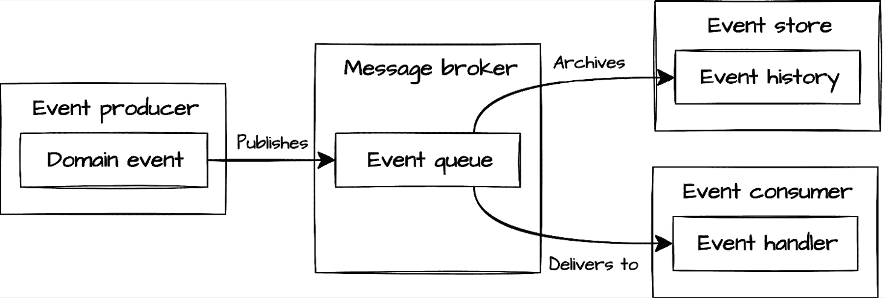

# 第十二章：你的 Clean Architecture 之旅：下一步

随着我们探索的结束，是时候超越我们的任务管理实现，转向 Clean Architecture 原则的更广泛应用了。在整个旅程中，我们看到了 Clean Architecture 如何创建出适应性强、易于维护且对变化具有弹性的系统。现在，我们将探讨这些相同的原理如何应用于不同的架构环境中，以及你如何在你的团队和组织中领导这一应用。

Clean Architecture 不是一个僵化的公式，而是一套灵活的原则，可以适应各种系统类型和组织环境。这些原则的真正力量不是在盲目遵循时显现，而是在深思熟虑地应用于解决你系统面临的特定挑战时。

在本章的最后，我们将从三个角度来审视 Clean Architecture：作为一个超越特定实现的统一整体，作为一个适应不同架构风格的灵活方法，以及作为技术领导的基础。这些视角将帮助你有效地在你的独特环境中应用 Clean Architecture 原则。

在本章中，我们将涵盖以下主要主题：

+   回顾 Clean Architecture：整体视角

+   在不同系统类型中适应 Clean Architecture

+   架构领导和社区参与

# 回顾 Clean Architecture：整体视角

在与任务管理系统相伴的整个旅程中，我们逐步构建了一个全面的 Clean Architecture 实现。每一章都是在前一章的基础上建立的，增加了新的层次和能力，同时保持了核心的架构原则。当我们从高层次、整体的角度回顾 Clean Architecture 时，让我们来看看是什么使得这种架构方法如此强大和适应性强。

## 通过架构层的旅程

我们的旅程始于 SOLID 原则和类型增强的 Python，为可维护、可适应的代码奠定了基础。然后，我们通过架构层从内到外进行移动：从封装核心业务概念的领域实体，到协调业务操作的使用案例，再到在核心和外部关注点之间进行转换的接口适配器，最后到连接我们的系统与外部世界的框架。

使这种分层方法强大的不仅仅是它提供的关注点分离，还有它如何通过定义良好的接口实现层之间的受控通信。在整个实现过程中，我们看到了这些架构边界如何创建一个既灵活又能够适应变化的系统。当我们添加了网络界面在*第九章*时，我们的核心业务逻辑保持未受影响。当我们实现了可观察性在*第十章*时，我们的监控能力与现有组件干净地集成，而没有干扰它们的职责。

这种架构的弹性源于我们对依赖规则的一致应用。这确保了依赖始终指向更稳定的抽象。通过通过接口和依赖注入反转传统依赖，我们创建了一个系统，其中外部变化不会影响我们的核心业务逻辑。虽然我们将在本章后面探讨一些可能需要灵活应用此规则的现实情况，但基本原理已经为我们服务得很好。这种保护并非理论上的；我们通过在多个接口和存储机制上的实际实现来证明了这一点。

## Python 与 Clean Architecture 的天然契合

Python 已被证明是实现 Clean Architecture 的理想语言。其动态特性与类型提示的结合为我们提供了灵活性与结构之间的完美平衡。在整个实现过程中，我们利用了与 Clean Architecture 原则自然吻合的 Python 特定功能：

+   **鸭子类型**允许我们创建关注行为而非严格继承层次结构的灵活接口

+   **类型提示**在架构边界提供清晰性，同时不牺牲 Python 的动态特性

+   **抽象基类**和**协议**在层之间建立了清晰的合同

+   **数据类**简化了实体实现，同时保持了适当的封装

Python 的简单哲学与 Clean Architecture 对清晰性的强调之间的这种协同作用，创建了既可维护又具有表现力的系统。Python 的可读性自然与 Clean Architecture 的目标相一致，即使系统意图清晰，同时其灵活性使得能够不使用过多的样板代码来实现架构模式。

我们旅程中最有价值的见解可能是，Clean Architecture 并非关于僵化的结构规则，而是关于创建组件可以独立进化但又能协同工作的系统。我们确立的边界不仅分离了关注点，而且积极管理不同上下文需求之间的转换，确保每一层都能专注于其特定的责任。

当我们探索 Clean Architecture 在任务管理示例之外的更广泛应用时，请记住，我们已实施的模式和原则是您架构工具箱中的工具。虽然具体结构可能因上下文而异，但关注点分离、依赖倒置和清晰的边界等核心原则在多种系统类型中仍然很有价值。在这本书中，我们已经展示了这些原则的全面实现，以展示其全部潜力，但团队应选择对其特定上下文和约束最有价值的边界和抽象。

# 在不同系统类型中适应 Clean Architecture

通过我们的任务管理系统实现，Clean Architecture 已经证明了其价值。现在让我们探索这些相同的原理如何适应不同的架构上下文。而不是僵化地应用模式，我们将关注 Clean Architecture 的核心原则——依赖规则、清晰的边界和关注点分离——如何根据这些专业领域进行调整，同时保持架构的完整性。

## API 系统中的 Clean Architecture

与我们的任务管理应用程序相比，纯 API 系统呈现了一种基本的架构转变。在我们之前对任务应用程序的实现中，我们通过控制器和请求/响应模型创建了一个*内部 API*，但这些只被我们完全控制的表示层（CLI 和 Web UI）消费。这给了我们很大的自由度来修改这些接口，因为我们能够同时更新交互的双方。

API-first 系统通过直接将这些接口暴露给外部客户端（我们不一定控制）来移除了这个安全网。这就像是我们从任务管理系统取出了控制器和请求/响应模型，并将它们公开，允许其他开发者构建直接依赖于其结构和行为的应用程序。

这种转变从根本上改变了我们必须如何处理我们的架构边界。考虑以下来自我们任务管理系统的例子：

```py
# Task management Request model - internal only
class CreateTaskRequest:
    """Data structure for task creation requests."""
    title: str
    description: str
    project_id: Optional[str] = None

    def to_execution_params(self) -> dict:
        """Convert validated request data to use case parameters."""
        return {
            'title': self.title.strip(),
            'project_id': UUID(self.project_id)
            if self.project_id else None,
            'description': self.description.strip()
        } 
```

在我们的任务管理系统中，这个模型被安全地隐藏在我们的表示层后面。当我们需要更改它以更好地与领域演变保持一致时，我们只需更新我们的 CLI 或 Web UI 以匹配。外部系统不受影响，因为它们与我们的表示层交互，而不是直接与这些模型交互。

然而，在以 API 为第一的系统里，这些模型直接暴露为公共契约：

```py
# API Request DTO - now a public contract
class CreateTaskRequest:
    title: str
    description: str
    project_id: Optional[str] = None 
```

注意到 API 系统版本的`CreateTaskRequest`类看起来更简单。`to_execution_params`方法特别缺失。这种差异反映了 UI 中心和 API 系统之间的基本区别。在我们的原始任务管理应用程序中，这个方法处理了用户界面格式和领域概念之间的复杂转换。它需要处理表单数据，处理字符串到 UUID 的转换，并在领域处理开始之前进行验证。

在 API 系统中，许多这些展示方面的关注点完全消失。客户端处理 UI 渲染和初始输入格式化，提交的数据已经根据我们的 API 合约进行了结构化。这把责任从我们的系统转移出去，使得请求模型可以专注于定义有效输入的结构，而不是转换它们。API 合约和领域对象之间的实际转换仍然发生，但通常是通过 API 框架提供的更简单、更标准化的机制来实现的。

清洁架构的接口适配器层正是在这个具有挑战性的背景下证明了其价值。在这个层中，控制器继续履行其基本的转换角色，但具有针对 API 上下文的具体适应。他们现在进行一项关键的平衡行为，保持将领域与外部关注点隔离的基本责任，同时确保外部消费者 API 合约的稳定性。

在 API 系统中，这些外部关注点的性质发生了显著变化。而不是管理像表单处理或模板渲染这样的展示细节，控制器现在专注于维护边界，以确保：

+   我们的领域模型可以适应不断变化的企业需求，而不会破坏 API 合约

+   我们可以在不重构整个领域的情况下对我们的 API 合约进行版本控制

+   我们可以为不同的客户端需求提供多个接口变体，同时共享相同的核心逻辑

同时，外层的框架和驱动层也适应了这种以 API 为中心的上下文。它不再管理多个展示技术，如 CLI 和 Web 界面，现在它专注于处理 HTTP 协议、请求路由和内容协商。这一最外层继续处理框架特定的关注点，但更加关注 API 交付机制而不是用户界面技术。

在适当的架构边界内，纯 API 系统利用了我们在整本书中应用的基本清洁架构原则。关注点的分离、依赖反转和显式接口在这个上下文中同样有效，尽管有不同的重点。所有层继续其基本角色，现在适应了公共 API 合约的独特要求。

现代 API 框架提供了专门的工具来支持这些架构模式，提供可以简化实现同时保持清晰边界的功能。让我们来看看这些框架如何补充我们的 Clean Architecture 方法。

### FastAPI 的框架考虑

正如我们在*第九章*中利用 Flask 为我们的任务管理网络界面提供支持一样，Python 生态系统提供了用于构建 API 的专用框架。**FastAPI** 是一个流行的例子，因其性能、自动文档生成和强类型集成而获得了显著的吸引力。

虽然 Flask 专注于通用网络开发，包括模板渲染和会话管理，但 FastAPI 专注于构建高性能 API，并具有自动 OpenAPI 文档功能。**Pydantic** 是 FastAPI 的核心组件，它通过 Python 类型注解提供数据验证、序列化和文档，从概念上类似于我们在任务管理实现中使用的 dataclasses，但具有额外的验证功能。

API 系统通常利用这些专用框架，这为我们提供了一个有趣的架构决策，即它们在我们 Clean Architecture 实现中的作用。它们提供的强大验证、序列化和文档功能为我们提供了一个机会，与我们的原始任务管理实现相比，可以简化我们的架构。

请求和响应模型中的数据处理变得更加流畅。在我们的原始任务管理系统，我们创建了具有手动验证的独立请求和响应模型，以管理层之间的边界：

```py
# Task management - manual validation
class CreateTaskRequest:
    """Request data for creating a new task."""
    title: str
    description: str

    def __post_init__(self):
        if not self.title.strip():
            raise ValueError("Title cannot be empty")

    def to_execution_params(self) -> dict:
        return {"title": self.title.strip(),
                "description": self.description.strip()} 
```

这种手动验证方法需要在我们的任务管理系统中进行显式的检查和转换方法。相比之下，Pydantic 直接将这些功能集成到模型定义中：

```py
# FastAPI/Pydantic - automatic validation
from pydantic import BaseModel, Field
class CreateTaskRequest(BaseModel):
    title: str = Field(..., min_length=1)
    description: str 
```

在这里 `CreateTaskRequest` 扩展了 Pydantic 的 `BaseModel`。这一变化不仅消除了验证样板代码，而且通过字段约束（如 `min_length=1`）自动处理验证。

当使用此模型与 FastAPI 结合时，验证会自动发生：

```py
# How validation works with FastAPI/Pydantic
@app.post("/tasks/")
def create_task(task_data: CreateTaskRequest):
    # FastAPI has already validated all fields
    # Invalid requests are rejected with 422 Unprocessable Entity

    result = task_controller.handle_create(
        title=task_data.title,
        description=task_data.description
    )
    return result.success 
```

假设客户端发送了无效数据，例如一个空标题：

```py
{
  "title": "",
  "description": "Test description"
} 
```

FastAPI 会自动响应验证错误：

```py
{
  "detail": [
    {
      "loc": ["body", "title"],
      "msg": "ensure this value has at least 1 characters",
      "type": "value_error.any_str.min_length",
      "ctx": {"limit_value": 1}
    }
  ]
} 
```

这种验证发生在你的路由处理程序执行之前，消除了手动验证代码的需要。

这种声明式方法显著减少了我们在任务管理系统中所需的样板代码。然而，它提出了一个重要的架构问题：我们应该允许第三方库 Pydantic 渗透到我们的内部层吗？Clean Architecture 的依赖规则警告我们不要这样做。

为了保持对 Clean Architecture 原则的严格遵循，我们需要这样做：

```py
# Pure Clean Architecture approach with FastAPI
@app.post("/tasks/")
def create_task(task_data: CreateTaskRequest):  # Using Pydantic here is fine - we're in the Frameworks layer
    # Transform the Pydantic model to our internal domain model
    # to avoid letting Pydantic penetrate inner layers
    request = InternalCreateTaskRequest(
        title=task_data.title.strip(),
        description=task_data.description.strip()
    )

    # Pass our internal model to the controller
    result = task_controller.handle_create(request)
    return result.success 
```

这种方法保持了 Clean Architecture 的依赖规则，但引入了显著的重复。我们需要做的是：

+   定义用于外部验证的 Pydantic 模型（FastAPI 层）

+   为我们的应用层定义几乎相同的内部模型

+   在这些并行模型之间创建转换

+   随着 API 的发展，维护这两种模型类型

这种重复会违反**不要重复自己**（**DRY**）原则，并会引入维护负担，要求在需求变更时同步更新这两组模型。

一个务实的替代方案是将 Pydantic 视为 Python 核心能力的稳定扩展，而不是一个易变的第三方库。它的广泛采用、稳定性和专注的目的使其不太可能经历破坏性的变化，这将对我们的领域逻辑产生重大影响。

最终，每个团队都必须根据他们特定的背景权衡这些考虑：

+   严格的架构纯洁性对你的项目目标有多重要？

+   在你的特定领域，重复模型的维护成本是多少？

+   相关的外部依赖有多稳定和成熟？

+   这个决定为其他架构边界设定了什么先例？

没有普遍正确的答案。一些团队将优先考虑严格遵循清洁架构原则，接受额外的维护负担以确保关注点的完全分离。其他团队将为了特定且有充分理由的情况（如 Pydantic）做出权衡，将其视为类似于 Python 标准库的基础依赖项。

关键在于明确做出这个决定，并在你的架构决策记录中记录下来，确保团队理解这个推理。无论你选择严格的分离还是务实的折衷，最重要的是这个决定是有意的、一致的，并且与你的项目具体需求和约束相一致。这种明确的决策即使在实际考虑导致对规则的受控例外时也能保持架构的完整性。

### 在 FastAPI 中应用清洁架构

为了说明这些架构原则如何转化为 API 系统，让我们看看使用 FastAPI 的简洁实现。这个例子演示了我们在 Flask 中使用的相同的清洁架构模式如何在 API 环境中应用：

```py
# Framework layer (infrastructure/api/routes.py)
@app.post("/tasks/", response_model=TaskResponse, status_code=201)
def create_task(task_data: CreateTaskRequest):
    """Create a new task."""
    # The controller handles translation between API and domain
    result = task_controller.handle_create(
        title=task_data.title,
        description=task_data.description,
        project_id=task_data.project_id
    )

    if not result.is_success:
        # Error handling at the framework boundary
        raise HTTPException(status_code=400, detail=result.error.message)

    return result.success  # Automatic serialization to TaskResponse 
```

这个路由处理程序遵循与我们的 Flask 路由相同的清洁架构原则，来自*第九章*，但进行了 API 特定的调整。两种实现：

1.  将框架特定的代码保留在系统边缘

1.  将业务操作委托给控制器

1.  在外部和内部格式之间进行转换

1.  在适当的边界处理错误

主要的区别在于框架如何处理请求处理和响应格式化。在 Flask 中，路由处理程序提取表单数据并渲染模板，而在 FastAPI 中，路由处理程序利用 Pydantic 模型进行验证和序列化。然而，在这两种情况下，架构边界仍然保持完整。路由处理程序充当框架和我们的应用程序核心之间的薄适配器。

这种在不同接口类型之间的统一性展示了清洁架构的适应性。无论是实现 Web UI、CLI 还是 API，相同的架构原则指导我们的设计决策。每种接口类型都带来其自身的特定关注点和优化，但保持业务逻辑独立于交付机制的基本模式保持不变。

## 事件驱动架构和清洁架构

事件驱动架构代表了从我们的任务管理系统请求/响应模型到另一种范式转变。虽然我们的原始任务管理应用程序处理直接命令，如“创建任务”或“完成任务”，但事件驱动系统则是对事件做出反应——已经发生的事实，如“任务创建”或“截止日期临近”。

这种交互模式的根本性变化引入了新的架构挑战，清洁架构恰好能够解决这些挑战。虽然对事件驱动架构的全面探索需要一本自己的书，但我们将关注如何在此背景下应用清洁架构原则，突出关键模式和考虑因素，以保持事件驱动系统中的架构边界。

### 事件驱动架构的核心概念

在事件驱动系统中，中心组织原则是事件，这是一个系统要么生成要么消费的重要发生。事件驱动范式引入了几个在任务管理系统中所不具备的架构元素：

+   **事件生产者**在发生重要状态变化时生成事件

+   **事件消费者**通过执行适当的操作对事件做出反应

+   **消息代理**促进生产者和消费者之间可靠的事件交付

+   **事件存储**用于维护事件历史记录，以便回放和审计

这些元素创建了新的架构边界，必须在保持清洁架构的依赖规则和关注点分离的同时进行管理。

### 将清洁架构应用于事件驱动系统

当将清洁架构应用于事件驱动系统时，领域层基本保持不变，我们的业务实体和核心规则保持相同。主要的调整主要发生在应用和接口层。



图 12.1：事件驱动系统的组件

事件驱动系统中的应用层通常会演变，包括：

+   **事件处理器**对传入的事件做出反应，类似于用例，但由事件触发而不是直接命令

+   **事件生成器**在发生重要状态变化时产生领域事件

接口适配器层转变为包括：

+   **事件序列化器**在领域事件和消息代理使用的消息格式之间进行转换

+   **消息代理适配器**从应用程序核心抽象出特定的消息技术

在我们的任务管理背景下，事件驱动的实现可能会对诸如 *TaskCreated*、*DeadlineApproaching* 或 *ProjectCompleted* 等事件做出反应。这些事件将通过系统流动，触发适当的处理逻辑，同时保持清洁架构的边界。

### 领域事件在清洁架构中作为一等公民

在事件驱动清洁架构中最显著的适应之一是将领域事件提升为架构中的一等公民。在我们的原始任务管理系统，事件可能存在隐式地，比如当任务完成时触发通知，但它们并不是核心架构组件。

在事件驱动架构中，领域事件成为明确的、命名的对象，代表有意义的业务事件。这些事件不仅仅是消息；它们是您通用语言和领域模型的一部分。它们以业务术语捕捉发生的事情，作为边界上下文之间的通信机制，同时保持清洁架构的边界。

让我们看看清洁架构如何通过提供清晰的边界和责任来帮助驯服事件驱动系统的复杂性。以下反模式演示了没有这些边界会发生什么：

```py
# Anti-pattern: Domain entity directly publishing events
class Task:
    def complete(self, user_id: UUID):
        self.status = TaskStatus.DONE
        self.completed_at = datetime.now()
        self.completed_by = user_id

        # Direct dependency on messaging system –
        # violates Clean Architecture
        kafka_producer = KafkaProducer(bootstrap_servers='kafka:9092')
        event_data = {
            "task_id": str(self.id),
            "completed_by": str(user_id),
            "completed_at": self.completed_at.isoformat()
        }
        kafka_producer.send(
            'task_events',
            json.dumps(event_data).encode()
        ) 
```

这种反模式违反了清洁架构原则，因为它直接将领域实体与基础设施关注点（Kafka 消息传递）耦合。这使得领域层依赖于外部技术，损害了可测试性和灵活性。

清洁的实现方式确保了所有架构层之间关注点的适当分离。让我们逐个检查每一层。

首先，领域实体仅专注于业务逻辑，没有意识到事件发布的存在：

```py
# Clean domain entity - no messaging dependencies
class Task:
    def complete(self, user_id: UUID) -> None:
        if self.status == TaskStatus.DONE:
            raise ValueError("Task is already completed")
        self.status = TaskStatus.DONE
        self.completed_at = datetime.now()
        self.completed_by = user_id 
```

注意 `Task` 实体如何仅处理任务完成的业务逻辑。它执行其状态变化和验证，但没有关于事件或消息的知识。这保持了纯领域逻辑，可以独立进行测试。

转到应用层，用例负责协调领域操作和事件创建：

```py
# Application layer handles event creation
@dataclass
class CompleteTaskUseCase:
    task_repository: TaskRepository
    # Abstract interface, not implementation:
    event_publisher: EventPublisher

    def execute(self, task_id: UUID, user_id: UUID) -> Result:
        try:
            task = self.task_repository.get_by_id(task_id)
            task.complete(user_id)
            self.task_repository.save(task)

            # Create domain event and publish through abstract interface
            event = TaskCompletedEvent.from_task(task, user_id)
            self.event_publisher.publish(event)

            return Result.success(task)
        except ValueError as e:
            return Result.failure(Error(str(e))) 
```

用例协调多个操作：检索任务、执行领域操作、持久化更新后的状态，并发布事件。关键的是，它只依赖于抽象的 `EventPublisher` 接口，而不是任何特定实现。

最后，在接口适配器层，像 `KafkaEventPublisher` 类这样的具体实现将处理事件交付的技术细节。类似于我们在前面的章节中如何实现 `SQLiteTaskRepository` 类的抽象 `TaskRepository` 接口，这些事件发布者实现抽象的 `EventPublisher` 接口，同时封装所有消息特定的细节。这保持了清洁架构在保持基础设施实现在外层，而应用程序核心仅与抽象交互的一致模式。

这种清洁的实现为事件驱动系统提供了几个关键好处：

+   **可测试性**：可以在不使用消息代理或事件基础设施的情况下测试领域逻辑

+   **灵活性**：可以更改消息技术，而无需修改领域或应用逻辑

+   **清晰性**：事件流通过明确的边界变得明确且可追踪

+   **进化**：可以添加新的事件类型和处理程序，而不会破坏现有组件

此外，在更广泛的意义上，清洁架构为我们系统中每个与事件相关的关注点提供了明确的指导。领域事件在领域层找到其自然家园，作为表示重要业务事件的价值对象。事件发布逻辑位于应用层，作为用例协调的一部分，而事件序列化属于接口适配器层，它在领域概念和技术格式之间进行转换。最后，所有消息基础设施都保留在最外层的框架和驱动器层，确保这些技术细节完全与核心业务逻辑隔离。这种清晰的分离为事件驱动系统的潜在复杂性带来了秩序，同时使这种架构风格所需的特定交互模式得以实现。

通过保持这些清洁的分离，尽管事件驱动系统具有固有的复杂性，但它们变得更加易于管理。领域模型始终关注业务概念，应用层协调操作和事件流，外层处理技术问题而不污染核心。

这证明了清洁架构对不同架构风格的适应性。无论是构建请求/响应 API 还是事件驱动的反应式系统，核心原则始终保持一致，保持业务逻辑纯净并从技术关注点中隔离出来，同时使每种风格所需的特定交互模式得以实现。

# 架构领导和社区参与

在整本书中，我们一直专注于在 Python 中实现清洁架构的技术实现。仅凭技术知识是不够的，以创造持久的架构影响。成功的架构采用需要领导力、沟通和社区建设。

清洁架构不仅仅是一组技术模式；它是一种挑战传统软件设计方法的哲学。有效地实施它通常需要组织变革、团队对齐和文化转变。随着您掌握清洁架构的技术方面，您影响这些更广泛因素的能力变得越来越重要。

在本节中，我们将探讨如何领导架构变革，为更广泛的社区做出贡献，并在您的组织中建立可持续的架构实践。这些技能将补充您的技术知识，使您能够超越个人实现，产生持久的影响。

## 领导架构变革

架构领导很少伴随着正式的权力。无论你是高级开发者、技术负责人还是架构师，实施清洁架构通常需要影响跨团队和部门的决策。这种基于影响力的领导既带来挑战也带来机遇。

### 构建清洁架构的案例

领导架构变革的第一步是提出清洁架构原则的令人信服的案例。正如我们在*第十一章*中讨论遗留系统转型时探索的那样，这需要将技术益处转化为利益相关者关心的商业价值：

| **清洁架构的益处** | **商业价值** |
| --- | --- |
| 关注点分离 | 初始投资后更快的功能交付 |
| 清晰的边界 | 减少回归问题，更稳定的发布 |
| 框架独立性 | 更长的系统生命周期，减少重写必要性 |
| 可测试性 | 更高的质量，更少的生产事件 |

在向不同的利益相关者介绍清洁架构时，调整你的信息以适应他们的具体关注点：

+   对于产品经理来说，强调架构清晰度如何支持初始投资后的快速功能迭代

+   对于工程经理来说，强调清洁架构如何提高可维护性并减少技术债务

+   对于开发者来说，关注清晰的边界如何简化工作并减少意外的副作用

+   对于高管来说，将技术益处转化为市场时间缩短和适应市场驱动因素变化的能力等商业指标

记住，清洁架构代表了一个重大的投资。在强调长期益处的同时，诚实地讨论前期成本。来自你组织的具体例子，例如变得难以维护的先前项目，可以使你的案例比抽象原则更有说服力。

### 从小做起：典范的力量

尝试一次性在整个组织中实施清洁架构很少会成功。相反，通过小型、可见的成功来展示其价值：

+   确定一个界限清晰的组件，其中清洁架构可以提供明显的益处

+   通过适当的关注点分离和清晰的边界彻底实施

+   记录过程和结果以与他人分享

+   通过开发速度、缺陷率或入职时间等指标衡量改进

这些示例除了仅仅展示架构概念之外，还有多重作用。通过展示清洁架构的实际应用，它们提供了抽象讨论无法比拟的实质性证据。它们还创建了有价值的参考实现，其他团队可以研究和适应他们自己的环境。随着你成功实施这些示例，你将在组织内部建立架构领导者的信誉，从而对未来决策产生更大的影响力。也许最重要的是，这些实现为通过协作工作和代码审查指导他人学习架构原则创造了自然的机会，在整个组织中传播知识。

示例方法在绿地项目和现有系统中都有效。虽然从头开始构建新的应用程序提供了最干净的实现路径，但大多数组织都有大量的现有代码库，这些代码库不能立即替换。在这些环境中，你可能会使用清洁架构原则在现有系统中实现一个新功能，明确地将领域逻辑与框架关注点分开。由于这个组件比其他组件更容易测试、扩展和维护，它成为更广泛采用的有力论据。这种有针对性的方法展示了清洁架构的价值，而不需要全面系统改造，为渐进式改进创造了动力。

### 克服对架构变更的阻力

架构变更通常会遇到阻力，这通常遵循可预测的模式。了解这些常见的反对意见有助于你有效地应对它们。

**“太抽象了”**：人们常常难以看到架构原则如何应用于他们的日常工作。这些概念可能看起来是理论性的，与实际的编码任务脱节。通过创建使用贵组织实际代码的具体示例来解决这个问题。展示清洁架构原则如何解决团队遇到的具体问题，将抽象概念转化为他们可以立即识别的实质性改进。

**“开销太大”**：团队经常认为架构纪律的前期成本与即时收益相比过高。对于那些专注于短期交付的人来说，额外的接口和分离可能看起来是不必要的。通过展示通过指标和以前项目的例子来证明长期效率收益，来反驳这种看法。分享架构投资如何降低维护成本并加速后期阶段的功能开发的案例。

**“我们没有时间”**：交付压力不断推动团队寻求便利的解决方案，而不是架构改进。这种时间限制通常是真实的，而不仅仅是借口。承认这一现实，同时展示架构边界实际上在初始投资之后如何加速开发。从小的、渐进的改进开始，这些改进能带来即时的好处，而不会破坏关键的最后期限。

**“这在这里行不通”**：组织往往认为他们的问题与像 Clean Architecture 这样的既定方法格格不入。这种例外主义源于对内部复杂性和挑战的深入了解。通过确定可以成功应用原则的小区域来解决这个问题，证明 Clean Architecture 可以适应你的特定环境。这些有针对性的成功逐渐克服了“不是这里发明的”的阻力。

最重要的是，认识到阻力通常来自有效的担忧，而不是简单的固执。仔细倾听具体的反对意见，承认其合法性，并直接解决它们，而不是将其置之不理。

### 平衡实用主义和原则

在前面的章节中，我们强调 Clean Architecture 是一套原则，而不是僵化的规则。正如我们在本章前面讨论 API 首先系统和事件驱动架构时所指出的，实际实施通常需要针对特定环境进行深思熟虑的调整。这种灵活性在领导架构变革时尤为重要。坚持在任何情况下都要求架构纯洁性的教条方法通常都会失败，而完全不一致的方法则不会提供任何架构上的好处。

中庸之道，原则上的实用主义，提供了最佳的成功机会：

+   保持对不应妥协的核心原则的清晰认识

+   认识到可能需要作出实际妥协的领域

+   记录文档架构决策及其理由，包括妥协

+   明确界定不同标准适用的范围

例如，你可能会在核心业务逻辑中严格保持领域和基础设施之间的分离，而在不那么关键的区域接受更多的耦合。或者，你可能会在领域层接受对稳定库的受控依赖，同时严格禁止框架依赖。

这些架构边界和决策应明确记录和传达，理想情况下是通过**架构决策记录**（**ADRs**）来捕捉决策及其背景。这种文档构建了共享的理解，并防止随着时间的推移团队变化导致的架构漂移。以下是一个简洁的 ADR 模板，用于记录 Clean Architecture 决策：

```py
# ADR-001: Use of Pydantic Models in Domain Layer
## Status
Accepted
## Context
Our API-first system requires extensive validation and serialization. Implementing these capabilities manually would require significant effort and potentially introduce bugs. Pydantic provides robust validation, serialization, and documentation through type annotations.
## Decision
We will allow Pydantic models in our domain layer, treating it as a stable extension to Python's type system rather than a volatile third-party dependency.
## Consequences
* Positive: Reduced boilerplate, improved validation, better documentation
* Positive: Consistent validation across system boundaries
* Negative: Creates dependency on external library in inner layers
* Negative: May complicate testing of domain entities
## Compliance
When using Pydantic in domain entities:
* Keep models focused on data structure, not behavior
* Avoid Pydantic-specific features that don't relate to validation
* Include comprehensive tests to verify domain rules still apply 
```

关于创建有效 ADR 的更多信息，请参阅 ADR GitHub 组织：[`adr.github.io/`](https://adr.github.io/)

此示例演示了如何通过 ADR（架构决策记录）形式化架构决策，特别是在允许某些依赖进入内层等实用妥协方面。模板展示了如何以结构化格式记录上下文、决策和后果，这有助于未来的开发者不仅理解已做出的决策，还理解决策的原因。

你可以通过结合技术知识和领导技能来成功地领导你组织的架构变革：提出有说服力的案例、创建典范、应对阻力，并在原则与实用主义之间取得平衡。这种基于影响力的领导将 Clean Architecture 的影响扩展到个人实现之外，以创造持久的组织变革。

## 缩小实现差距

尽管 Clean Architecture 广受欢迎且普遍认知，但在理论理解和实际应用之间仍存在显著的差距。许多开发者熟悉这些概念，但在现实世界的代码库中难以有效应用。这种实现差距既是一个挑战，也是架构领导者的一次机会。

### 贡献 Clean Architecture 示例

作为架构领导者，你可以做出的最有价值的贡献之一就是与更广泛的社区分享你的实际应用实现。这并不一定意味着开源整个应用程序，而是创建其他人可以从中学习的示例、模式和参考。除了帮助他人之外，这个过程——教授和记录你的实现方法——为你提供了显著的个人益处。向他人解释架构概念可以验证你自己的理解，并经常揭示你知识中的微妙差距。正如俗话所说，*教学相长*。当你清晰地阐述 Clean Architecture 原则，使他人能够理解时，你巩固并加深了对这些概念的理解。

考虑通过以下方式做出贡献：

+   **开源参考实现**，展示特定领域的 Clean Architecture

+   **文章或博客文章**，解释你如何将 Clean Architecture 应用于解决实际问题

+   **模板或入门套件**，为 Python 的 Clean Architecture 提供基础

+   **代码片段**，展示如何处理特定的架构挑战

+   **架构模式库**，为常见问题提供可重用解决方案

这些贡献有助于弥合理论与实践之间的差距，使 Clean Architecture 对更广泛的开发社区更加易于接近。它们还确立了你在架构设计方面的思想领袖地位，创造了进一步影响和学习的机会。

在创建这些示例时，关注那些最容易被误解或难以实施的部分：

+   维护适当抽象的存储库模式实现

+   有效地协调领域操作的使用案例设计

+   清晰地在各层之间进行转换的接口适配器

+   支持测试和灵活性的依赖注入方法

+   架构层之间的边界维护

通过具体的代码示例解决这些具体挑战，您可以显著加快他人的清洁架构采用。

### 从多个视角学习

在贡献自己的实现的同时，同样重要的是从他人那里学习。清洁架构，就像任何架构方法一样，随着从业者将其应用于新的领域和技术而不断演变。通过与不同的视角互动，您可以完善您的理解和方法。

通过以下方式寻求不同的观点：

+   阅读其他语言的实现，以识别语言无关的模式

+   检查对清洁架构的不同解释，以了解权衡

+   参与架构论坛和讨论，听取不同的经验

+   研究相关的架构风格，如六边形架构或洋葱架构

+   指导他人并接受指导，因为教学可以加强理解，而从经验丰富的从业者那里学习可以加速成长

记住，这本书代表了 Python 中清洁架构的一个视角。其他同样有效的途径也存在，而*正确*的实现往往取决于特定的环境和限制。对这些不同视角的开放态度可以加强您的架构思维，并使原则的应用更加细腻。

通过对更广泛社区的贡献和学习，您有助于缩小实施差距，同时继续自己的架构成长。这种双向参与创造了一个良性循环，既推进了个人对清洁架构原则的理解，也推进了集体理解。

## 建立您的架构社区

虽然个人的建筑领导力很强大，但持续的架构卓越通常需要社区的支持。无论是在您的组织内部还是在更广泛的开发生态系统中建立架构社区，都能创造个人努力无法比拟的动力。

### 创建实践社区

在组织中，**实践社区**为架构学习和一致性提供了强大的结构。这些自愿的跨团队小组将致力于架构卓越的开发者聚集在一起，分享知识、制定标准并解决共同问题。

要建立一个架构实践社区：

+   **非正式地开始**，通过午餐学习或讨论小组来衡量兴趣

+   **明确一个以架构学习和改进为中心的明确目标**

+   **建立定期的接触点**，如每周会议或每月深度探讨

+   **轮换领导权**，以包括不同的观点并分担工作量

+   **产生有形的输出**，如指南、模式或参考实现

这些社区服务于多个目的：

+   它们为架构讨论创造了空间，没有立即交付的压力

+   它们在团队之间建立共享的词汇和理解

+   它们识别并解决常见的架构挑战

+   它们为经验较少的开发者提供指导机会

最重要的是，它们将架构知识传播到个人专家之外，即使在团队成员随时间变化的情况下，也能创造组织弹性和连续性。

通过在您的组织中建立实践社区，您创建了一个生态系统，它超越了个人努力，维持了建筑卓越性。这种社区方法将清洁架构从个人兴趣转变为组织能力，确保我们在本书中探讨的好处可以跨团队扩展并持久存在。

清洁架构的持久影响不仅来自技术实现，还来自围绕它形成的社区和文化。通过领导架构变革、关闭实施差距和建立可持续社区，您将清洁架构的好处扩展到个人系统之外，从而在软件设计和构建方面创造持久的积极变化。

# 摘要

在本章的最后，我们将清洁架构的视野从我们的任务管理系统扩展到其更广泛的应用和适应。

我们回顾了我们的清洁架构之旅，看到定义良好的架构层如何创建灵活、有弹性的系统。Python 的特性，如鸭子类型、类型提示和抽象基类，使我们能够构建无需过多样板代码的可维护系统。

然后，我们探讨了针对不同系统类型的清洁架构适应。在 API 首选系统中，像 FastAPI 这样的框架增强了实现，同时要求对架构边界做出深思熟虑的决定。对于事件驱动架构，清洁架构为事件流带来秩序，同时保持纯业务逻辑。

我们还讨论了架构领导和社区参与，探讨了倡导清洁架构、应对阻力以及建立能够维持长期架构卓越性的实践社区的战略。

当您结束本书并继续您的清洁架构之旅时，请记住，我们探讨的原则是深思熟虑后应用的工具，而不是盲目遵循的教条。依赖规则、清晰的边界和关注点的分离为创建随着需求演变而保持适应性和可维护性的系统提供了基础。您应用这些原则的方式应反映您的具体环境、限制和目标。

清洁架构的真正力量在于其创建系统的能力，其中业务逻辑保持清晰和专注，无论技术或交付机制如何变化。通过建立适当的架构边界并保持尊重它们的纪律，您创建的系统不仅今天能工作，而且可以优雅地适应明天的挑战。

感谢您与我一起探索使用 Python 的 Clean Architecture。我希望本书中分享的模式、原则和实践能够帮助您创建经得起时间考验的系统。

# 进一步阅读

+   *FastAPI* ([`fastapi.tiangolo.com/`](https://fastapi.tiangolo.com/))). 这是一个用于使用 Python 构建 API 的现代、高性能 Web 框架，利用标准的 Python 类型提示。

+   *Pydantic* ([`docs.pydantic.dev/latest/`](https://docs.pydantic.dev/latest/))). Pydantic 是一个用于数据验证和设置管理的 Python 库，使用 Python 类型注解。

+   *构建事件驱动的微服务：利用数据流实现可扩展性和弹性* ([`www.oreilly.com/library/view/building-event-driven-microservices/9781492057888/`](https://www.oreilly.com/library/view/building-event-driven-microservices/9781492057888/))). 一本实用的指南，介绍和实现使用事件驱动架构和数据流构建可扩展和弹性的微服务。

+   *实践社区：组织的边缘* ([`hbr.org/2000/01/communities-of-practice-the-organizational-frontier`](https://hbr.org/2000/01/communities-of-practice-the-organizational-frontier))). 这篇文章介绍了并解释了实践社区的概念，并通过来自各个行业的例子突出了它们在知识共享、问题解决和组织改进中的作用。


[packtpub.com](http://packtpub.com)

订阅我们的在线数字图书馆，全面访问超过 7,000 本书籍和视频，以及领先的工具，帮助您规划个人发展并推进您的职业生涯。更多信息，请访问我们的网站。

# 为什么订阅？

+   通过来自 4,000 多名行业专业人士的实用电子书和视频，减少学习时间，增加编码时间

+   通过为您量身定制的技能计划提高您的学习效果

+   每月免费获得一本电子书或视频

+   完全可搜索，便于轻松访问关键信息

+   复制粘贴、打印和收藏内容

在[www.packtpub.com](http://www.packtpub.com)，您还可以阅读一系列免费的技术文章，订阅各种免费通讯，并享受 Packt 书籍和电子书的独家折扣和优惠。

# 您可能还会喜欢的其他书籍

如果您喜欢这本书，您可能对 Packt 的其他书籍也感兴趣：


**《Python 编程，第四版**》

Fabrizio Romano, Heinrich Kruger

ISBN: 978-1-83588-294-8

+   在 Windows、Mac 和 Linux 上安装和设置 Python

+   编写优雅、可重用和高效的代码

+   避免常见的陷阱，如重复和过度设计

+   适当地使用函数式和面向对象编程方法

+   使用 FastAPI 构建 API 并编写 CLI 应用程序

+   理解数据持久性和加密，以构建安全的应用程序

+   使用 Python 的内置数据结构高效地操作数据

+   将您的应用程序打包并通过 Python 包索引 (PyPI) 进行分发

+   使用 Python 解决竞技编程问题


**《Python 清洁代码 第二版》**

Mariano Anaya

ISBN: 978-1-80056-021-5

+   通过利用自动工具设置高效的开发环境

+   利用 Python 的魔法方法编写更好的代码，将复杂性抽象出来并封装细节

+   使用 Python 的独特功能，如描述符，创建高级面向对象设计

+   通过使用面向对象设计的软件工程原则创建强大的抽象来消除重复的代码

+   使用装饰器和描述符创建特定于 Python 的解决方案

+   在单元测试的帮助下有效地重构代码

+   以干净的代码库为基础，构建坚实的架构基础


**《Python 面向对象编程 第四版》**

Steven F. Lott, Dusty Phillips

ISBN: 978-1-80107-726-2

+   通过创建类和定义方法在 Python 中实现对象

+   通过继承扩展类功能

+   使用异常来干净地处理异常情况

+   理解何时使用面向对象功能，更重要的是，何时不使用它们

+   发现几个广泛使用的设计模式以及它们在 Python 中的实现方式

+   揭示单元和集成测试的简单性，并了解为什么它们如此重要

+   学习如何静态类型检查动态代码

+   通过 asyncio 理解并发以及它是如何加快程序速度的

# Packt 正在寻找像你这样的作者

如果你对成为 Packt 的作者感兴趣，请访问 [authors.packtpub.com](https://authors.packtpub.com) 并今天申请。我们已与成千上万的开发者和技术专业人士合作，就像你一样，帮助他们将见解分享给全球技术社区。你可以提交一般申请，申请我们正在招募作者的特定热门话题，或者提交你自己的想法。

# 分享你的想法

现在你已经完成了 *《使用 Python 的清洁架构》*，我们非常想听听你的想法！扫描下面的二维码直接进入这本书的亚马逊评论页面，分享你的反馈或在你购买的地方留下评论。

[`packt.link/r/183664289X`](https://packt.link/r/183664289X)

你的评论对我们和整个技术社区都很重要，并将帮助我们确保我们提供高质量的内容。
