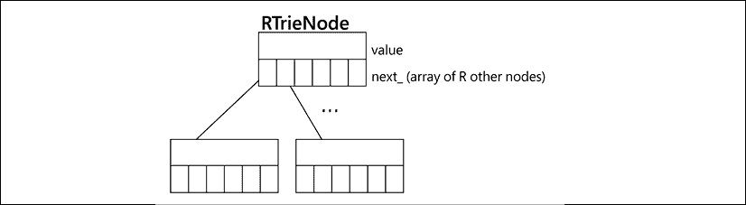

# 第二章：Pythonic 代码

在本章中，我们将探讨 Python 中思想表达的方式，以及其独特的特性。如果你熟悉编程中完成某些任务的标准方式（例如获取列表的最后一个元素、迭代和搜索），或者如果你来自其他编程语言（如 C、C++和 Java），那么你会发现，总的来说，Python 为大多数常见任务提供了自己的机制。

在编程中，习语是执行特定任务的一种特定的代码编写方式。它是某种常见且每次都遵循相同结构的东西。有些人甚至可以争论并称它们为模式，但请注意，它们不是设计模式（我们将在稍后探讨）。主要区别在于设计模式是高级思想，独立于语言（某种程度上），但它们不能立即转化为代码。另一方面，习语实际上是编码的。这是我们想要执行特定任务时应该编写的方式。

习语是代码，它们是语言相关的。每种语言都会有自己的习语，这意味着在该特定语言中做事的方式（例如，如何在 C 或 C++中打开和写入文件）。当代码遵循这些习语时，它被称为是 idiomatic 的，在 Python 中通常被称为 Pythonic。

有多个原因需要遵循这些建议并首先编写 Pythonic 代码（正如我们将看到和分析的那样），因为以习惯的方式编写代码通常性能更好。它也更紧凑，更容易理解。这些是我们总希望在代码中实现的特性，以便它能够有效工作。

其次，正如前一章所介绍的，整个开发团队能够习惯相同的代码模式和结构是很重要的，因为这将帮助他们专注于问题的真正本质，并帮助他们避免犯错误。

本章的目标如下：

+   理解索引和切片，并正确实现可索引的对象

+   实现序列和其他可迭代对象

+   了解上下文管理器的良好用例以及如何编写有效的上下文管理器。

+   通过魔术方法实现更符合习惯的代码

+   避免导致不期望副作用在 Python 中的常见错误

我们将在下一节中探索列表上的第一个项目（索引和切片）。

# 索引和切片

在 Python 中，和其他语言一样，一些数据结构或类型支持通过索引访问其元素。它与其他大多数编程语言的另一个共同点是，第一个元素被放置在索引号`0`。然而，与这些语言不同，当我们想以不同于常规的顺序访问元素时，Python 提供了额外的功能。

例如，您如何在 C 中访问数组的最后一个元素？这是我第一次尝试 Python 时做的事情。像在 C 中一样思考，我会获取数组长度减一的元素位置。在 Python 中，这也会起作用，但我们也可以使用负索引号，它将从最后一个元素开始计数，如下面的命令所示：

```py
>>> my_numbers = (4, 5, 3, 9)
>>> my_numbers[-1]
9
>>> my_numbers[-3]
5 
```

这是一种首选的（Pythonic）做事方式。

除了获取单个元素之外，我们还可以通过使用 `slice` 来获取多个元素，如下面的命令所示：

```py
>>> my_numbers = (1, 1, 2, 3, 5, 8, 13, 21)
>>> my_numbers[2:5]
(2, 3, 5) 
```

在这种情况下，方括号上的语法意味着我们从第一个数字（包含）的索引开始获取元组上的所有元素，直到第二个数字的索引（不包含）。Python 中的切片就是这样工作的，通过排除所选区间的结束。

您可以排除任一区间，即起始或结束，在这种情况下，它将分别从序列的开始或结束处开始，如下面的命令所示：

```py
>>> my_numbers[:3]
(1, 1, 2)
>>> my_numbers[3:]
(3, 5, 8, 13, 21)
>>> my_numbers[::]  # also my_numbers[:], returns a copy
(1, 1, 2, 3, 5, 8, 13, 21)
>>> my_numbers[1:7:2]
(1, 3, 8) 
```

在第一个例子中，它将获取到位置编号 `3` 的所有内容。在第二个例子中，它将获取从位置 `3`（包含）开始的所有数字，直到末尾。在倒数第二个例子中，当两端都排除时，实际上是在创建原始元组的副本。

最后一个例子包括一个第三个参数，即步长。这表示在迭代区间时跳过的元素数量。在这种情况下，这意味着获取位置一和七之间的元素，每次跳过两个。

在所有这些情况下，当我们向一个序列传递区间时，实际上我们传递的是 `slice`。请注意，`slice` 是 Python 中的一个内置对象，您可以自己构建并直接传递：

```py
>>> interval = slice(1, 7, 2)
>>> my_numbers[interval]
(1, 3, 8)
>>> interval = slice(None, 3)
>>> my_numbers[interval] == my_numbers[:3]
True 
```

注意，当一个元素缺失（起始、结束或步长）时，它被视为 `None`。

您应该始终优先使用这种内置的切片语法，而不是手动在 `for` 循环中迭代元组、字符串或列表，并手动排除元素。

## 创建自己的序列

我们刚才讨论的功能之所以有效，是因为一个名为 `__getitem__` 的魔法方法（魔法方法是 Python 用来保留特殊行为的双下划线包围的方法）。这是当调用类似 `myobject[key]` 的内容时调用的方法，将 `key`（方括号内的值）作为参数传递。特别是，序列是一个实现了 `__getitem__` 和 `__len__` 的对象，因此它可以被迭代。列表、元组和字符串是标准库中的序列对象示例。

在本节中，我们更关注通过键从一个对象中获取特定元素，而不是构建序列或可迭代对象，这是在 *第七章*，*生成器、迭代器和异步编程* 中探讨的主题。

如果你打算在你的领域中的自定义类中实现 `__getitem__`，你必须考虑到一些因素，以便遵循 Pythonic 方法。

在你的类是标准库对象包装器的情况下，你可以尽可能地将行为委托给底层对象。这意味着如果你的类实际上是列表的包装器，那么在列表上调用所有相同的方法，以确保它保持兼容。在下面的列表中，我们可以看到一个对象如何包装列表的例子，并且对于我们感兴趣的方法，我们只是委托给 `list` 对象的相应版本：

```py
from collections.abc import Sequence
class Items(Sequence):
    def __init__(self, *values):
        self._values = list(values)
    def __len__(self):
        return len(self._values)
    def __getitem__(self, item):
        return self._values.__getitem__(item) 
```

为了声明我们的类是一个序列，它实现了 `collections.abc` 模块中的 `Sequence` 接口（[`docs.python.org/3/library/collections.abc.html`](https://docs.python.org/3/library/collections.abc.html)）。对于你编写的旨在作为标准类型对象（容器、映射等）行为的类，实现此模块中的接口是一个好主意，因为这揭示了该类意图成为什么，并且因为使用接口将迫使你实现所需的方法。

这个例子使用了组合（因为它包含一个内部协作者，即列表，而不是从列表类继承）。另一种方法是通过类继承来实现，在这种情况下，我们将不得不扩展 `collections.UserList` 基类，考虑到本章最后部分提到的考虑事项和警告。

然而，如果你正在实现自己的序列，它不是一个包装器或者不依赖于任何内置对象，那么请记住以下要点：

+   当通过范围索引时，结果应该是与类相同类型的实例

+   在 `slice` 提供的范围内，尊重 Python 使用的语义，不包括末尾的元素

第一个要点是一个微妙的错误。想想看——当你从列表中获取一个切片时，结果是列表；当你在一个元组中请求一个范围时，结果是元组；当你请求一个子字符串时，结果是字符串。在每种情况下，结果与原始对象相同类型是有意义的。如果你创建的是代表日期区间的对象，比如说，并且你请求该区间的范围，返回列表或元组或其他东西将是一个错误。相反，它应该返回一个新的具有新区间设置的相同类的实例。标准库中的最佳例子是 `range` 函数。如果你用区间调用 `range`，它将构造一个知道如何产生选定范围内值的可迭代对象。当你为 `range` 指定区间时，你得到一个新的范围（这是有意义的），而不是列表：

```py
>>> range(1, 100)[25:50]
range(26, 51) 
```

第二条规则也是关于一致性——如果你的代码与 Python 本身保持一致，那么用户会发现它更加熟悉且易于使用。作为 Python 开发者，我们已经习惯了切片的工作方式，`range`函数的工作方式等等。在自定义类上创建异常将会造成混淆，这意味着它将更难记住，并可能导致错误。

现在我们已经了解了索引和切片，以及如何创建自己的，在下一节中，我们将采取相同的方法，但针对上下文管理器。首先，我们将看到标准库中的上下文管理器是如何工作的，然后我们将进一步深入，创建自己的上下文管理器。

# 上下文管理器

上下文管理器是 Python 提供的一个独特且非常有用的特性。它们之所以如此有用，是因为它们正确地响应了一个模式。在许多情况下，我们想要运行一些具有前置条件和后置条件的代码，这意味着我们希望在某个主要操作之前和之后运行某些事情。上下文管理器是处理这些情况时的优秀工具。

大多数时候，我们看到上下文管理器都与资源管理相关。例如，在打开文件的情况下，我们想要确保在处理完毕后关闭它们（这样我们就不泄漏文件描述符）。或者，如果我们打开到服务的连接（甚至是一个套接字），我们也想要确保相应地关闭它，或者处理临时文件等情况。

在所有这些情况下，你通常都需要记住释放所有已分配的资源，这只是在考虑最佳情况——但是关于异常和错误处理呢？考虑到处理我们程序的所有可能的组合和执行路径会使调试变得更加困难，解决这个问题的最常见方式是将清理代码放在`finally`块中，这样我们就可以确保不会遗漏它。例如，一个非常简单的例子可能如下所示：

```py
fd = open(filename)
try:
    process_file(fd)
finally:
    fd.close() 
```

尽管如此，有一种更加优雅且 Python 风格的实现相同功能的方法：

```py
with open(filename) as fd:
    process_file(fd) 
```

`with`语句（PEP-343）进入上下文管理器。在这种情况下，`open`函数实现了上下文管理器协议，这意味着当块执行完毕时，文件将被自动关闭，即使发生了异常。

上下文管理器由两个魔法方法组成：`__enter__`和`__exit__`。在上下文管理器的第一行，`with`语句将调用第一个方法`__enter__`，并且这个方法返回的任何内容都将被分配给`as`后面的变量。这是可选的——我们实际上并不需要在`__enter__`方法上返回任何特定内容，即使我们返回了，如果没有必要，也没有严格理由将其分配给变量。

执行这一行后，代码进入一个新的上下文，其中可以运行任何其他 Python 代码。在该块的最后一个语句完成后，上下文将退出，这意味着 Python 将调用最初调用的原始上下文管理器对象的`__exit__`方法。

如果上下文管理器块内部有异常或错误，`__exit__`方法仍然会被调用，这使得安全地管理清理条件变得方便。实际上，该方法接收在块上触发的异常，以防我们想要以自定义方式处理它。

尽管上下文管理器在处理资源（如我们提到的文件、连接等）时非常常见，但这并不是它们唯一的用途。我们可以实现自己的上下文管理器来处理我们需要的特定逻辑。

上下文管理器是一种很好的分离关注点和隔离应该保持独立的代码部分的方法，因为如果我们混合它们，逻辑将变得难以维护。

例如，考虑一种情况，我们想要使用脚本运行数据库的备份。需要注意的是，备份是离线的，这意味着我们只能在数据库不运行时进行备份，为此我们必须停止它。在运行备份后，我们想要确保无论备份本身的过程如何，我们都重新启动这个过程。

现在，第一种方法可能是创建一个巨大的单体函数，试图在同一个地方做所有的事情，停止服务，执行备份任务，处理异常和所有可能的边缘情况，然后再次尝试重新启动服务。你可以想象这样的函数，因此，我将省略细节，直接提出一个使用上下文管理器处理这个问题的可能方法：

```py
def stop_database():
    run("systemctl stop postgresql.service")
def start_database():
    run("systemctl start postgresql.service")
class DBHandler:
    def __enter__(self):
        stop_database()
        return self
    def __exit__(self, exc_type, ex_value, ex_traceback):
        start_database()
def db_backup():
    run("pg_dump database")
def main():
    with DBHandler():
        db_backup() 
```

在这个例子中，我们不需要在块内部上下文管理器的结果，这就是为什么我们可以认为，至少在这个特定情况下，`__enter__`的返回值是不相关的。在设计上下文管理器时，这是需要考虑的——一旦块开始，我们需要什么？作为一个一般规则，始终在`__enter__`上返回某些内容应该是一个好的实践（尽管不是强制性的）。

在这个块中，我们只运行备份任务，独立于之前看到的维护任务。我们还提到，即使备份任务有错误，`__exit__`仍然会被调用。

注意`__exit__`方法的签名。它接收在块上引发的异常的值。如果没有在块上引发异常，它们都是 none。

`__exit__` 的返回值是值得考虑的。通常情况下，我们希望方法保持原样，不返回任何特定内容。如果这个方法返回 `True`，这意味着可能抛出的异常将不会传播到调用者，并在这里停止。有时，这可能是一个期望的效果，甚至可能取决于抛出的异常类型，但总的来说，吞下异常并不是一个好主意。记住：错误永远不应该无声无息地通过。

请记住，不要意外地在 `__exit__` 上返回 `True`。如果你这样做，请确保这正是你想要的，并且有充分的理由。

## 实现上下文管理器

通常，我们可以像上一个示例那样实现上下文管理器。我们需要的只是一个实现了 `__enter__` 和 `__exit__` 魔法方法的类，然后那个对象将能够支持上下文管理器协议。虽然这是上下文管理器实现的最常见方式，但并非唯一方式。

在本节中，我们将看到不同的（有时更紧凑的）实现上下文管理器的方法，以及如何通过使用标准库充分利用它们，特别是使用 `contextlib` 模块。

`contextlib` 模块包含许多辅助函数和对象，用于实现上下文管理器或使用已提供的上下文管理器，这可以帮助我们编写更紧凑的代码。

让我们先看看 `contextmanager` 装饰器。

当 `contextlib.contextmanager` 装饰器应用于一个函数时，它将那个函数上的代码转换为一个上下文管理器。所涉及的函数必须是一种特定的函数，称为 `generator` 函数，它将语句分别分离到 `__enter__` 和 `__exit__` 魔法方法上。

如果到目前为止你对装饰器和生成器还不熟悉，这不是问题，因为我们将要查看的示例将是自包含的，无论这些主题是否被讨论，都可以应用和理解的。这些主题在 *第七章*，*生成器、迭代器和异步编程* 中有详细讨论。

上一个示例的等效代码可以用 `contextmanager` 装饰器重写，如下所示：

```py
import contextlib
@contextlib.contextmanager
def db_handler():
    try:
        stop_database()
        yield
    finally:
       start_database()
with db_handler():
    db_backup() 
```

在这里，我们定义了 `generator` 函数，并将其应用于 `@contextlib.contextmanager` 装饰器。该函数包含一个 `yield` 语句，这使得它成为一个生成器函数。再次强调，在这种情况下，生成器的细节并不相关。我们只需要知道，当这个装饰器被应用时，`yield` 语句之前的所有内容都将像它是 `__enter__` 方法的一部分一样运行。然后，产生的值将是上下文管理器评估的结果（`__enter__` 会返回什么），以及如果我们选择像 `as x` 一样赋值，将会被分配给变量的值：在这种情况下，没有产生任何内容（这意味着产生的值将是隐式的 none），但如果我们想的话，我们可以产生一个语句，该语句将成为我们可能在上下文管理器块内部使用的某个东西。

在这一点上，`generator` 函数被挂起，上下文管理器被进入，在那里，我们再次运行数据库的备份代码。完成此操作后，执行将继续，因此我们可以认为在 `yield` 语句之后的每一行都将作为 `__exit__` 逻辑的一部分。

以这种方式编写上下文管理器的好处是，它更容易重构现有函数，重用代码，并且在需要不属于任何特定对象的上下文管理器时，通常是一个好主意（否则，你会在面向对象的意义上创建一个“虚假”类，没有任何实际目的）。

添加额外的魔法方法会使我们领域的另一个对象更加耦合，承担更多的责任，并支持它可能不应该支持的东西。当我们只需要一个不保留许多状态的上下文管理器函数，并且完全独立于其他类时，这可能是一个不错的选择。

然而，我们还有更多实现上下文管理器的方法，而且答案再次在标准库的 `contextlib` 包中。

我们还可以使用另一个辅助工具 `contextlib.ContextDecorator`。这是一个基类，它提供了将装饰器应用于函数的逻辑，使得该函数可以在上下文管理器中运行。上下文管理器本身的逻辑必须通过实现上述魔法方法来提供。结果是，一个既可以作为函数装饰器使用，也可以混合到其他类的类层次结构中，使它们表现得像上下文管理器的类。

为了使用它，我们必须扩展这个类并在所需的方法上实现逻辑：

```py
class dbhandler_decorator(contextlib.ContextDecorator):
    def __enter__(self):
        stop_database()
        return self
    def __exit__(self, ext_type, ex_value, ex_traceback):
        start_database()
@dbhandler_decorator()
def offline_backup():
    run("pg_dump database") 
```

你是否注意到与前面的例子有什么不同？没有 `with` 语句。我们只需要调用函数，`offline_backup()` 将会自动在上下文管理器中运行。这正是基类提供的逻辑，以便将其用作装饰器，将原始函数包装起来，使其在上下文管理器中运行。

这种方法的唯一缺点是，由于对象的工作方式，它们是完全独立的（这是一个好的特性）——装饰器不知道被装饰的函数，反之亦然。然而，这虽然好，意味着`offline_backup`函数无法访问装饰器对象，如果需要的话。然而，这并没有阻止我们在函数内部调用这个装饰器来访问对象。

这可以通过以下形式完成：

```py
def offline_backup():
    with dbhandler_decorator() as handler: ... 
```

作为装饰器，这也具有优势，即逻辑只定义一次，我们可以通过简单地将装饰器应用于需要相同不变逻辑的其他函数来重复使用它任意多次。

让我们探索`contextlib`的一个最后特性，看看我们可以期待从上下文管理器中得到什么，以及我们可以用它们做什么。

在这个库中，我们可以找到`contextlib.suppress`，这是一个在已知可以安全忽略异常的情况下避免某些异常的实用工具。它与在`try/except`块中运行相同代码并传递异常或只是记录日志类似，但不同之处在于调用`suppress`方法使得那些异常作为我们逻辑的一部分被控制得更加明确。

例如，考虑以下代码：

```py
import contextlib
with contextlib.suppress(DataConversionException):
    parse_data(input_json_or_dict) 
```

在这里，异常的存在意味着输入数据已经处于预期的格式，因此不需要转换，因此可以安全地忽略它。

上下文管理器是 Python 的一个相当独特的特性，它区分了 Python。因此，使用上下文管理器可以被认为是惯用的。在下一节中，我们将探讨 Python 的另一个有趣特性，这将帮助我们编写更简洁的代码；理解表达式和赋值表达式。

# 理解和赋值表达式

在整本书中，我们会多次看到理解表达式。这是因为它们通常是一种更简洁的编写代码的方式，而且一般来说，以这种方式编写的代码更容易阅读。我这么说是因为有时如果我们需要对收集到的数据进行一些转换，使用理解可能会导致一些更复杂的代码。在这些情况下，编写一个简单的`for`循环应该更受欢迎。

然而，我们还有一个最后的手段可以尝试来挽救情况：赋值表达式。在本节中，我们将讨论这些替代方案。

推荐使用理解来在单个指令中创建数据结构，而不是多个操作。例如，如果我们想创建一个包含某些数字计算的列表，而不是像这样编写：

```py
numbers = []  
for i in range(10):  
    numbers.append(run_calculation(i)) 
```

我们将直接创建列表：

```py
numbers = [run_calculation(i) for i in range(10)] 
```

以这种形式编写的代码通常性能更好，因为它使用单个 Python 操作，而不是反复调用`list.append`。如果你对代码的内部结构或不同版本之间的差异感兴趣，可以查看`dis`模块，并用这些示例调用它。

让我们看看一个函数的例子，该函数将接受一些表示云计算环境中资源（例如 ARN）的字符串，并返回包含在其中的账户 ID 的集合。这样的函数可能会写成最简单的方式：

```py
from typing import Iterable, Set
def collect_account_ids_from_arns(arns: Iterable[str]) -> Set[str]:
    """Given several ARNs in the form
        arn:partition:service:region:account-id:resource-id
    Collect the unique account IDs found on those strings, and return them.
    """
    collected_account_ids = set()
    for arn in arns:
        matched = re.match(ARN_REGEX, arn)
        if matched is not None:
            account_id = matched.groupdict()["account_id"]
            collected_account_ids.add(account_id)
    return collected_account_ids 
```

显然，代码有很多行，并且执行的是相对简单的事情。阅读此代码的读者可能会被这些多个语句搞糊涂，并且在处理该代码时可能会无意中犯错。如果我们能简化它，那就更好了。我们可以通过使用几个类似于函数式编程的推导式来在更少的行中实现相同的功能：

```py
def collect_account_ids_from_arns(arns):
    matched_arns = filter(None, (re.match(ARN_REGEX, arn) for arn in arns))
    return {m.groupdict()["account_id"] for m in matched_arns} 
```

函数的第一行看起来类似于应用 `map` 和 `filter`：首先，我们将尝试匹配正则表达式的结果应用于提供的所有字符串，然后过滤掉那些不是 `None` 的字符串。结果是我们将后来用于在集合推导式中提取账户 ID 的一个迭代器。

之前的功能应该比我们的第一个例子更容易维护，但仍然需要两个语句。在 Python 3.8 之前，无法实现更紧凑的版本。但是，随着 PEP-572（[`www.python.org/dev/peps/pep-0572/`](https://www.python.org/dev/peps/pep-0572/））中引入赋值表达式，我们可以用单个语句重写它：

```py
def collect_account_ids_from_arns(arns: Iterable[str]) -> Set[str]:
    return {
        matched.groupdict()["account_id"]
        for arn in arns
        if (matched := re.match(ARN_REGEX, arn)) is not None
    } 
```

注意在列表推导式中的第三行语法。这在该作用域内设置了一个临时标识符，它是将正则表达式应用于字符串的结果，并且可以在同一作用域内的更多部分重复使用。

在这个特定的例子中，关于第三个例子是否比第二个例子更好（但应该没有疑问，这两个例子都比第一个例子好！）是有争议的。我相信这个最后的例子更具有表达性，因为它在代码中具有更少的间接引用，而且读者需要了解的关于值是如何被收集的信息都属于同一个作用域。

请记住，代码更加紧凑并不总是意味着代码更好。如果我们为了写一行代码而不得不创建一个复杂的表达式，那么这就不值得了，我们还不如采用简单的方法。这与我们在下一章将要讨论的“保持简单”原则有关。

考虑推导式的可读性，如果这样一行代码实际上不会更容易理解，就不要强迫你的代码成为一行。

使用赋值表达式的一般好处（而不仅仅是推导式）还包括性能考虑。如果我们必须将函数作为我们的转换逻辑的一部分，我们不希望调用它比必要的次数更多。将函数的结果分配给一个临时标识符（正如新作用域中的赋值表达式所做的那样）将是一种很好的优化技术，同时也能使代码更具可读性。

评估使用赋值表达式所能带来的性能提升。

在下一节中，我们将回顾 Python 的另一个惯用特性：`属性`。此外，我们还将讨论在 Python 对象中暴露或隐藏数据的不同方式。

# 对象的属性、属性和不同类型的方法

在 Python 中，一个对象的所有属性和函数都是`公开`的，这与其他语言不同，在其他语言中属性可以是`公开`的、`私有`的或`受保护`的。也就是说，阻止调用者对象调用对象的任何属性是没有意义的。这是与其他编程语言相比的另一个区别，在其他编程语言中，你可以将一些属性标记为`私有`或`受保护`。

虽然没有严格的强制执行，但也有一些约定。以下划线开头的属性意味着它是该对象的`私有`属性，我们期望没有外部代理调用它（但同样，没有任何东西阻止这样做）。

在深入`属性`的细节之前，值得提一下 Python 中下划线的某些特性，理解约定和属性的范畴。

## Python 中的下划线

在 Python 中，有一些约定和实现细节涉及到下划线的使用，这是一个值得分析的有趣话题。

正如我们之前提到的，默认情况下，一个对象的所有属性都是`公开`的。考虑以下示例来阐述这一点：

```py
>>> class Connector:
...     def __init__(self, source):
...         self.source = source
...         self._timeout = 60
... 
>>> conn = Connector("postgresql://localhost")
>>> conn.source
'postgresql://localhost'
>>> conn._timeout
60
>>> conn.__dict__
{'source': 'postgresql://localhost', '_timeout': 60} 
```

在这里，我们创建了一个带有`source`的`Connector`对象，它开始时有两个属性——前面提到的`source`和`timeout`。前者是`公开`的，后者是`私有`的。然而，正如我们从以下行中可以看到的，当我们创建这样的对象时，我们实际上可以访问它们。

这段代码的解释是，`_timeout`应该只在该`connector`内部访问，永远不要从调用者那里访问。这意味着你应该以这种方式组织代码，以便在需要时安全地重构超时，依赖于它不会被从对象外部调用（只内部调用），从而保持与之前相同的接口。遵守这些规则使得代码更容易维护和更健壮，因为我们不必担心重构代码时的连锁反应，如果我们保持对象的接口。同样的原则也适用于方法。

类应该只暴露与外部调用者对象相关的属性和方法，即其接口。不属于对象接口的任何内容都应该以单个下划线为前缀。

以下划线开头的属性必须被视为`私有`的，并且不能从外部调用。另一方面，作为这个规则的例外，我们可以说在单元测试中，如果这样做可以使测试更容易进行，那么允许访问内部属性可能是允许的（但请注意，即使遵循这种实用方法，在决定重构主类时，维护成本仍然存在）。然而，请记住以下建议：

使用过多的内部方法和属性可能是类承担太多任务且不符合单一职责原则的标志。这可能表明你需要将其部分职责提取到更多协作的类中。

使用单个下划线作为前缀是 Pythonic 的方式，可以清楚地界定一个对象接口。然而，有一个常见的误解，即某些属性和方法实际上可以被设置为`私有`。这同样是一个误解。让我们假设现在`timeout`属性是以双下划线开头的：

```py
>>> class Connector:
...     def __init__(self, source):
...         self.source = source
...         self.__timeout = 60
...
...      def connect(self):
...         print("connecting with {0}s".format(self.__timeout))
...         # ...
... 
>>> conn = Connector("postgresql://localhost")
>>> conn.connect()
connecting with 60s
>>> conn.__timeout
Traceback (most recent call last):
  File "<stdin>", line 1, in <module>
AttributeError: 'Connector' object has no attribute '__timeout' 
```

一些开发者使用这种方法来隐藏一些属性，认为，就像这个例子一样，`timeout`现在是`私有`的，并且没有其他对象可以修改它。现在，看看尝试访问`__timeout`时引发的异常。它是`AttributeError`，表示它不存在。它不会说“这是私有的”或“不能访问”等。它只是说它不存在。这应该给我们一个提示，实际上正在发生的是，实际上发生了不同的事情，这种行为只是副作用，而不是我们真正想要的效果。

实际上发生的情况是，使用双下划线，Python 为属性创建了一个不同的名字（这被称为名称混淆）。它所做的就是用以下名字创建属性：`"_<类名>__<属性名>"`。在这种情况下，将创建一个名为`'_Connector__timeout'`的属性，并且这个属性可以被访问（并修改）如下：

```py
>>> vars(conn)
{'source': 'postgresql://localhost', '_Connector__timeout': 60}
>>> conn._Connector__timeout
60
>>> conn._Connector__timeout = 30
>>> conn.connect()
connecting with 30s 
```

注意我们之前提到的副作用——属性仍然存在，只是名字不同，因此在我们第一次尝试访问它时引发了`AttributeError`。

Python 中双下划线的概念完全不同。它是作为一种手段被创建的，用于覆盖将要多次扩展的类的不同方法，而不会与方法名发生冲突。即使这个用例也过于牵强，不足以证明使用这种机制是合理的。

双下划线不是 Pythonic 的方法。如果你需要将属性定义为`私有`，请使用单个下划线，并遵守 Pythonic 约定，即它是一个`私有`属性。

不要定义以双下划线开头属性的属性。

同样地，不要定义自己的“双下划线”方法（方法名被双下划线包围）

现在我们来探讨相反的情况，即当我们确实想要访问对象的一些旨在为`public`的属性时。通常，我们会使用`properties`来做这件事，我们将在下一节中探讨。

## 属性

通常，在面向对象设计中，我们创建对象来表示领域问题实体上的抽象。从这个意义上说，对象可以封装行为或数据。而且，很多时候，数据的准确性决定了对象是否可以创建。也就是说，某些实体只能存在于数据的一定值中，而不正确的值不应被允许。

正是因为这个原因，我们创建了验证方法，通常用于`setter`操作。然而，在 Python 中，有时我们可以通过使用`properties`来更紧凑地封装这些`setter`和`getter`方法。

考虑一个需要处理坐标的地理系统示例。纬度和经度只有一定范围内的值是有意义的。超出这些值，坐标将无法存在。我们可以创建一个对象来表示坐标，但在这样做的时候，我们必须确保纬度的值始终在可接受的范围内。为此，我们可以使用`properties`：

```py
class Coordinate:
    def __init__(self, lat: float, long: float) -> None:
        self._latitude = self._longitude = None
        self.latitude = lat
        self.longitude = long
    @property
    def latitude(self) -> float:
        return self._latitude
    @latitude.setter
    def latitude(self, lat_value: float) -> None:
        if lat_value not in range(-90, 90 + 1):
            raise ValueError(f"{lat_value} is an invalid value for latitude")
        self._latitude = lat_value
    @property
    def longitude(self) -> float:
        return self._longitude
    @longitude.setter
    def longitude(self, long_value: float) -> None:
        if long_value not in range(-180, 180 + 1):
            raise ValueError(f"{long_value} is an invalid value for longitude")
        self._longitude = long_value 
```

在这里，我们使用一个属性来定义纬度和经度。这样做，我们确立了一个原则，即检索这些属性中的任何一个都将返回内部`private`变量中持有的值。更重要的是，当任何用户想要以下形式修改这些`properties`的值时：

```py
coordinate.latitude = <new-latitude-value>  # similar for longitude 
```

使用`@latitude.setter`装饰器声明的验证方法将被自动（且透明地）调用，并将语句右侧的值（在前面代码中命名为`lat_value`）作为参数传递。

不要为你的对象上的所有属性都编写自定义的`get_*`和`set_*`方法。大多数时候，将它们作为常规属性就足够了。如果你需要修改属性检索或修改的逻辑，那么请使用`properties`。

我们已经看到了当对象需要持有值时的情况，以及`properties`如何帮助我们以一致和透明的方式管理它们的内部数据，但有时，我们也可能需要根据对象的状态及其内部数据进行一些计算。大多数时候，属性是这一选择的好选择。

例如，如果你有一个需要以特定格式或数据类型返回值的对象，可以使用属性来完成这个计算。在先前的例子中，如果我们决定想要以最多四位小数的精度返回坐标（无论原始数字提供了多少位小数），我们可以在读取值的`@property`方法中进行四舍五入的计算。

你可能会发现属性是实现命令和查询分离（`CC08`）的好方法。命令和查询分离原则指出，一个对象的方法应该要么回答某个问题，要么执行某个操作，但不能两者兼而有之。如果一个方法在执行某个操作的同时返回一个状态，回答该操作如何进行，那么它就做了多于一件事情，明显违反了函数应该只做一件事情的原则。

根据方法名称，这可能会造成更多的混淆，使读者更难理解代码的实际意图。例如，如果方法名为`set_email`，并且我们将其用作`if self.set_email("a@j.com"): ...`，那么这段代码在做什么？它是将电子邮件设置为`a@j.com`吗？它是检查电子邮件是否已经设置为该值吗？两者都是（设置并检查状态是否正确）？

使用`properties`，我们可以避免这种混淆。`@property`装饰器是查询，将回答某个问题，而`@<property_name>.setter`是执行某个操作的命令。

从这个例子中得到的另一条有益的建议如下——不要在一个方法中做超过一件事情。如果你想分配某个值然后检查其值，请将其分解为两个或更多个语句。

为了说明这意味着什么，使用之前的例子，我们可能需要一个`setter`或`getter`方法来设置用户的电子邮件，然后另一个属性来简单地请求电子邮件。这是因为，一般来说，任何时间我们询问一个对象关于其当前状态，它都应该返回它而不产生副作用（不改变其内部表示）。或许我能想到的唯一例外是在懒属性的情况下：我们只想预先计算一次，然后使用计算出的值。对于其他情况，尽量使属性幂等，然后是允许改变对象内部表示的方法，但不要混合两者。

方法应该只做一件事情。如果你必须执行一个动作然后检查状态，请在由不同语句调用的不同方法中执行。

## 使用更紧凑的语法创建类

继续探讨有时我们需要对象来存储值的思想，在 Python 中初始化对象时有一个常见的模板，即在`__init__`方法中声明对象将拥有的所有属性，然后将其设置为内部变量，通常如下所示：

```py
def __init__(self, x, y, … ):
    self.x = x
    self.y = y 
```

自 Python 3.7 以来，我们可以通过使用`dataclasses`模块来简化这一点。这个模块是在 PEP-557 中引入的。我们在上一章中已经看到了这个模块，在代码使用注解的上下文中，在这里我们将简要回顾它，从它如何帮助我们编写更紧凑的代码的角度来看。

此模块提供了一个`@dataclass`装饰器，当应用于一个类时，它会获取所有带有注释的类属性，并将它们视为实例属性，就像它们在初始化方法中声明一样。当使用此装饰器时，它将自动在类上生成`__init__`方法，因此我们不需要手动编写。

此外，此模块提供了一个`field`对象，它将帮助我们定义一些属性的特定特征。例如，如果我们需要的某个属性需要是可变的（例如一个`list`），我们将在本章后面的部分（在避免 Python 中陷阱的部分）看到，我们不能在`__init__`方法中传递这个默认空列表，而应该传递`None`，并在`__init__`内部将其设置为默认列表，如果提供了`None`。

当使用`field`对象时，我们通常会使用`default_factory`参数，并将`list`类传递给它。这个参数是用来与不接受任何参数的可调用对象一起使用的，当该属性的值没有提供时，它将被调用以构造对象。

因为没有需要实现的`__init__`方法，如果我们需要运行验证或者想要有一些属性是从之前的属性计算或派生出来的，会发生什么？为了回答后者，我们可以依赖`properties`，正如我们在上一节中所探讨的。至于前者，数据类允许我们有一个`__post_init__`方法，它将在`__init__`自动调用，所以这是一个编写初始化后逻辑的好地方。

为了将这些内容付诸实践，让我们考虑一个例子，即建模 R-Trie 数据结构（其中 R 代表*基数*，这意味着它是在某个基数 R 上的索引树）的节点。这个数据结构及其相关算法超出了本书的范围，但为了本例的目的，我将提到这是一个设计用来回答关于文本或字符串的查询（如前缀和查找相似或相关单词）的数据结构。在非常基本的形式中，这个数据结构包含一个值（它保存一个字符，例如它的整数表示），然后是一个长度为 R 的数组或引用下一个节点（它是一个递归数据结构，与`linked list`或`tree`等类似）。其想法是数组的每个位置隐式地定义了对下一个节点的引用。例如，假设值`0`映射到字符`'a'`，那么如果下一个节点在其`0`位置包含一个不同于`None`的值，那么这意味着有一个对`'a'`的引用，并且它指向另一个 R-Trie 节点。

从图形上看，数据结构可能看起来像这样：



图 2.1：R-Trie 节点的通用结构

我们可以编写如下代码块来表示它。在下面的代码中，名为`next_`的属性包含一个尾随下划线，这仅仅是为了将其与内置的`next`函数区分开来。我们可以争论说在这种情况下没有冲突，但如果我们需要在`RTrieNode`类中使用`next()`函数，那可能会出现问题（这些通常是难以捕捉的微妙错误）：

```py
from typing import List
from dataclasses import dataclass, field
R = 26
@dataclass
class RTrieNode:
    size = R
    value: int
    next_: List["RTrieNode"] = field(
        default_factory=lambda: [None] * R)

    def __post_init__(self):
        if len(self.next_) != self.size:
            raise ValueError(f"Invalid length provided for next list") 
```

前面的例子包含了几种不同的组合。首先，我们定义了一个`R=26`的 R-Trie 来表示英语字母表中的字符（这本身对于理解代码并不重要，但它提供了更多的上下文）。其想法是，如果我们想存储一个单词，我们为每个字母创建一个节点，从第一个字母开始。当有指向下一个字符的链接时，我们将它存储在对应字符的`next_`数组位置，为该字符创建另一个节点，依此类推。

注意类中的第一个属性：`size`。这个属性没有注释，所以它是一个常规类属性（为所有节点对象共享），而不是仅属于对象的某些东西。或者，我们也可以通过设置`field(init=False)`来定义它，但这个形式更紧凑。然而，如果我们想注释变量，但不将其视为`__init__`的一部分，那么这种语法是唯一可行的替代方案。

然后是另外两个属性，它们都有注释，但考虑不同。第一个属性`value`是一个整数，但它没有默认参数，因此当我们创建一个新的节点时，我们必须始终提供一个值作为第一个参数。第二个属性是一个可变参数（它自己的`list`），它确实有一个默认工厂：在这种情况下是一个`lambda`函数，它将创建一个大小为 R 的新列表，所有槽位都初始化为`None`。注意，如果我们使用`field(default_factory=list)`来处理这个问题，我们仍然会在创建每个对象时构造一个新的列表，但这会失去对该列表长度的控制。最后，我们希望验证我们不会创建具有错误长度的下一个节点列表的节点，因此在`__post_init__`方法中进行了验证。任何尝试创建此类列表的尝试都会在初始化时通过`ValueError`被阻止。

数据类提供了一种更紧凑的方式来编写类，无需在`__init__`方法中设置所有具有相同名称的变量，从而避免了样板代码。

当你拥有不进行许多复杂验证或数据转换的对象时，考虑这个替代方案。记住这个最后一点。注解很棒，但它们不强制数据转换。这意味着例如，如果你声明了一个需要是`float`或`integer`的属性，那么你必须在这个`__init__`方法中执行这个转换。将这个作为数据类是不会做到的，这可能会隐藏微妙的错误。这是在验证不是严格必需且可以进行类型转换的情况下。例如，定义一个可以从多个其他类型创建的对象是完全可以的，比如将一个数字字符串转换为`float`（毕竟，这利用了 Python 的动态类型特性），只要在`__init__`方法中正确转换为所需的数据类型即可。

数据类可能是一个很好的用例，所有那些我们需要使用对象作为数据容器或包装器的地方，即我们使用命名元组或简单命名空间的情况。当你评估代码中的选项时，将数据类视为命名元组或命名空间的另一种替代方案。

## 可迭代对象

在 Python 中，我们有默认可迭代的对象。例如，列表、元组、集合和字典不仅可以以我们想要的结构存储数据，还可以通过`for`循环迭代以重复获取这些值。

然而，内置的可迭代对象并不是我们在`for`循环中唯一可以拥有的类型。我们也可以创建自己的可迭代对象，使用我们定义的迭代逻辑。

为了实现这一点，我们再次依赖于魔法方法。

在 Python 中，迭代是通过其自身的协议（即迭代器协议）来工作的。当你尝试以`for e in myobject:`的形式迭代一个对象时，Python 在非常高的层面上检查以下两个事情，按顺序：

+   如果对象包含迭代器方法之一——`__next__`或`__iter__`

+   如果对象是一个序列并且具有`__len__`和`__getitem__`

因此，作为一个后备机制，序列可以被迭代，因此有两种方式可以自定义我们的对象，使其能够工作在`for`循环中。

### 创建可迭代对象

当我们尝试迭代一个对象时，Python 会调用该对象的`iter()`函数。这个函数首先检查该对象上是否存在`__iter__`方法，如果存在，则会被执行。

以下代码创建了一个对象，允许迭代一系列日期，在每次循环迭代中产生一天：

```py
from datetime import timedelta
class DateRangeIterable:
    """An iterable that contains its own iterator object."""
    def __init__(self, start_date, end_date):
        self.start_date = start_date
        self.end_date = end_date
        self._present_day = start_date
    def __iter__(self):
        return self
    def __next__(self):
        if self._present_day >= self.end_date:
            raise StopIteration()
        today = self._present_day
        self._present_day += timedelta(days=1)
        return today 
```

这个对象被设计成用一对日期创建，当迭代时，它将产生指定日期间隔中的每一天，如下面的代码所示：

```py
>>> from datetime import date
>>> for day in DateRangeIterable(date(2018, 1, 1), date(2018, 1, 5)):
...     print(day)
... 
2018-01-01
2018-01-02
2018-01-03
2018-01-04
>>> 
```

在这里，`for`循环开始在我们的对象上启动新的迭代。在这个点上，Python 将调用`iter()`函数，然后它反过来调用`__iter__`魔法方法。在这个方法中，它被定义为返回`self`，这表明对象本身就是一个`iterable`，所以在这个点上，循环的每一步都会调用该对象的`next()`函数，它委托给`__next__`方法。在这个方法中，我们决定如何产生元素，并逐个返回。当没有其他东西可以产生时，我们必须通过引发`StopIteration`异常来向 Python 发出信号。

这意味着实际上发生的情况类似于 Python 每次在我们的对象上调用`next()`，直到出现`StopIteration`异常，这时它知道它必须停止`for`循环：

```py
>>> r = DateRangeIterable(date(2018, 1, 1), date(2018, 1, 5))
>>> next(r)
datetime.date(2018, 1, 1)
>>> next(r)
datetime.date(2018, 1, 2)
>>> next(r)
datetime.date(2018, 1, 3)
>>> next(r)
datetime.date(2018, 1, 4)
>>> next(r)
Traceback (most recent call last):
  File "<stdin>", line 1, in <module>
  File ... __next__
    raise StopIteration
StopIteration
>>> 
```

这个例子是可行的，但它有一个小问题——一旦耗尽，`iterable`将继续为空，因此引发`StopIteration`。这意味着如果我们连续使用两个或更多的`for`循环，只有第一个会工作，而第二个将是空的：

```py
>>> r1 = DateRangeIterable(date(2018, 1, 1), date(2018, 1, 5))
>>> ", ".join(map(str, r1))
'2018-01-01, 2018-01-02, 2018-01-03, 2018-01-04'
>>> max(r1)
Traceback (most recent call last):
  File "<stdin>", line 1, in <module>
ValueError: max() arg is an empty sequence
>>> 
```

这是因为迭代协议的工作方式——一个`iterable`构建一个迭代器，这个迭代器就是正在迭代的。在我们的例子中，`__iter__`只是返回了`self`，但我们可以让它每次被调用时都创建一个新的迭代器。一种修复方法就是创建`DateRangeIterable`的新实例，这并不是一个严重的问题，但我们可以让`__iter__`使用生成器（它们是迭代器对象），每次调用时都会创建：

```py
class DateRangeContainerIterable:
    def __init__(self, start_date, end_date):
        self.start_date = start_date
        self.end_date = end_date
    def __iter__(self):
        current_day = self.start_date
        while current_day < self.end_date:
            yield current_day
            current_day += timedelta(days=1) 
```

而这次它工作了：

```py
>>> r1 = DateRangeContainerIterable(date(2018, 1, 1), date(2018, 1, 5))
>>> ", ".join(map(str, r1))
'2018-01-01, 2018-01-02, 2018-01-03, 2018-01-04'
>>> max(r1)
datetime.date(2018, 1, 4)
>>> 
```

差别在于每个`for`循环都会再次调用`__iter__`，而每一个都会再次创建生成器。

这被称为容器`iterable`。

通常，在处理生成器时，与容器`iterable`一起工作是一个好主意。

关于生成器的详细信息将在*第七章*，*生成器、迭代器和异步编程*中更详细地解释。

### 创建序列

也许我们的对象没有定义`__iter__()`方法，但我们仍然希望能够迭代它。如果`__iter__`在对象上没有定义，`iter()`函数将寻找`__getitem__`的存在，如果没有找到，它将引发`TypeError`。

序列是一个实现了`__len__`和`__getitem__`的对象，并期望能够按顺序逐个获取它包含的元素，从零开始作为第一个索引。这意味着你需要在逻辑上小心，以确保正确实现`__getitem__`以期望这种类型的索引，否则迭代将不会工作。

上一个章节的例子有一个优点，那就是它使用的内存更少。这意味着它一次只保留一个日期，并且知道如何逐个产生日期。然而，它有一个缺点，那就是如果我们想获取第 n 个元素，我们无法直接获取，只能迭代 n 次直到达到它。这是计算机科学中内存和 CPU 使用之间的典型权衡。

使用`iterable`的实现将占用更少的内存，但获取一个元素可能需要到*O(n)*的时间，而实现一个序列将占用更多的内存（因为我们必须一次性保存所有内容），但支持常数时间的索引，*O(1)*。

前面的符号（例如，*O(n)*）被称为渐近符号（或“大 O”符号），它描述了算法的复杂度阶数。在非常高的层面上，这意味着算法作为输入大小（*n*）的函数需要执行多少操作。关于这方面的更多信息，你可以查看章节末尾列出的（ALGO01），其中包含对渐近符号的详细研究。

新的实现可能看起来是这样的：

```py
class DateRangeSequence:
    def __init__(self, start_date, end_date):
        self.start_date = start_date
        self.end_date = end_date
        self._range = self._create_range()
    def _create_range(self):
        days = []
        current_day = self.start_date
        while current_day < self.end_date:
            days.append(current_day)
            current_day += timedelta(days=1)
        return days
    def __getitem__(self, day_no):
        return self._range[day_no]
    def __len__(self):
        return len(self._range) 
```

下面是这个对象的行为：

```py
>>> s1 = DateRangeSequence(date(2018, 1, 1), date(2018, 1, 5))
>>> for day in s1:
...     print(day)
... 
2018-01-01
2018-01-02
2018-01-03
2018-01-04
>>> s1[0]
datetime.date(2018, 1, 1)
>>> s1[3]
datetime.date(2018, 1, 4)
>>> s1[-1]
datetime.date(2018, 1, 4) 
```

在前面的代码中，我们可以看到负索引也有效。这是因为`DateRangeSequence`对象将所有操作委托给其包装对象（一个`list`），这是保持兼容性和一致行为的最优方式。

评估在决定使用两种可能实现中的哪一个时，内存和 CPU 使用之间的权衡。一般来说，迭代是首选的（生成器甚至更好），但要注意每个案例的具体要求。

## 容器对象

容器是实现了`__contains__`方法的对象（通常返回一个`Boolean`值）。这个方法在 Python 的`in`关键字存在时被调用。

犹如以下内容：

```py
element in container 
```

当在 Python 中使用时，变为如下：

```py
container.__contains__(element) 
```

你可以想象，当这个方法得到适当实现时，代码将多么易于阅读（并且更符合 Python 风格）！

假设我们必须在具有二维坐标的游戏地图上标记一些点。我们可能会期望找到一个如下所示的功能：

```py
def mark_coordinate(grid, coord):
    if 0 <= coord.x < grid.width and 0 <= coord.y < grid.height:
        grid[coord] = MARKED 
```

现在，检查第一个`if`语句条件的部分似乎很复杂；它没有揭示代码的意图，它不够表达，最糟糕的是它需要代码重复（在需要检查边界条件再继续的代码的每个部分都将重复那个`if`语句）。

如果地图本身（在代码中称为`grid`）能回答这个问题呢？甚至更好，如果地图能将这个动作委托给一个更小（因此更内聚）的对象呢？

我们可以用面向对象设计和魔法方法来更优雅地解决这个问题。在这种情况下，我们可以创建一个新的抽象来表示网格的界限，这可以成为一个对象本身。*图 2.2*有助于说明这一点：


图 2.2：使用组合、在不同类中分配责任以及使用容器魔法方法的示例

顺便提一下，确实，在一般情况下，类名指的是名词，并且通常是单数。所以，有一个名为`Boundaries`的类可能听起来有些奇怪，但如果我们仔细想想，也许对于这个特定的情况，说我们有一个表示网格所有边界的对象是有意义的，尤其是在它被使用的方式（在这种情况下，我们使用它来验证特定坐标是否在这些边界内）。

使用这种设计，我们可以询问`map`是否包含一个坐标，并且`map`本身可以有关其限制的信息，并将查询传递给其内部合作者：

```py
class Boundaries:
    def __init__(self, width, height):
        self.width = width
        self.height = height
    def __contains__(self, coord):
        x, y = coord
        return 0 <= x < self.width and 0 <= y < self.height
class Grid:
    def __init__(self, width, height):
        self.width = width
        self.height = height
        self.limits = Boundaries(width, height)
    def __contains__(self, coord):
        return coord in self.limits 
```

这段代码本身是一个更好的实现。首先，它正在进行简单的组合，并且使用代理来解决该问题。两个对象都非常内聚，具有尽可能少的逻辑；方法简短，逻辑不言自明——`coord in self.limits`几乎就是解决问题的声明，表达了代码的意图。

从外部看，我们也能看到好处。几乎就像是 Python 在为我们解决问题：

```py
def mark_coordinate(grid, coord):
    if coord in grid:
        grid[coord] = MARKED 
```

## 对象的动态属性

我们可以通过`__getattr__`魔法方法来控制从对象中获取属性的方式。当我们调用类似`<myobject>.<myattribute>`的东西时，Python 会在对象的字典中查找`<myattribute>`，并对其调用`__getattribute__`。如果找不到（即，对象没有我们正在寻找的属性），那么额外的`__getattr__`方法会被调用，传递属性名（myattribute）作为参数。

通过接收这个值，我们可以控制事物返回给我们的对象的方式。我们甚至可以创建新的属性，等等。

在下面的列表中，演示了`__getattr__`方法：

```py
class DynamicAttributes:
    def __init__(self, attribute):
        self.attribute = attribute
    def __getattr__(self, attr):
        if attr.startswith("fallback_"):
            name = attr.replace("fallback_", "")
            return f"[fallback resolved] {name}"
        raise AttributeError(
            f"{self.__class__.__name__} has no attribute {attr}"
        ) 
```

这里有一些对这个类对象的调用：

```py
>>> dyn = DynamicAttributes("value")
>>> dyn.attribute
'value'
>>> dyn.fallback_test
'[fallback resolved] test'
>>> dyn.__dict__["fallback_new"] = "new value"
>>> dyn.fallback_new
'new value'
>>> getattr(dyn, "something", "default")
'default' 
```

第一次调用很简单——我们只是请求对象具有的属性，并得到其值作为结果。第二次调用是这个方法发挥作用的地方，因为对象没有名为`fallback_test`的东西，所以`__getattr__`会运行并带有那个值。在那个方法内部，我们放置了返回字符串的代码，我们得到的是那个转换的结果。

第三个例子很有趣，因为它创建了一个名为`fallback_new`的新属性（实际上，这个调用将与运行`dyn.fallback_new = "new value"`相同）,所以当我们请求这个属性时，请注意，我们在`__getattr__`中放入的逻辑不适用，仅仅是因为那段代码从未被调用。

现在，最后一个例子是最有趣的。这里有一个细微的细节，它产生了巨大的差异。再次看看`__getattr__`方法中的代码。注意当值不可检索时它抛出的异常`AttributeError`。这不仅是为了一致性（以及异常中的消息），也是由内置的`getattr()`函数要求的。如果这个异常是任何其他类型，它都会引发异常，并且不会返回默认值。

在实现像`__getattr__`这样动态的方法时要小心，并且要谨慎使用。在实现`__getattr__`时，抛出`AttributeError`。

`__getattr__`魔法方法在许多情况下都很有用。它可以用来创建另一个对象的代理。例如，如果你通过组合在另一个对象之上创建一个包装对象，并且想要将大多数方法委托给包装对象，而不是复制并定义所有这些方法，你可以实现`__getattr__`，它将内部调用包装对象上的相同方法。

另一个例子是当你知道你需要动态计算属性时。我在一个过去的项目中使用了`GraphQL` ([`graphql.org/`](https://graphql.org/)) 和 `Graphene` ([`graphene-python.org/`](https://graphene-python.org/))，在这个项目中。该库的工作方式是通过使用解析器方法。基本上，每当请求属性`X`时，都会使用名为`resolve_X`的方法。由于已经存在可以解析`Graphene`对象类中每个属性`X`的域对象，因此实现了`__getattr__`来知道从哪里获取每个属性，而不必编写大量的样板代码。

当你看到避免大量重复代码和样板代码的机会时，使用`__getattr__`魔法方法，但不要滥用这个方法，因为它会使代码更难以理解和推理。记住，具有未显式声明且仅动态出现的属性会使代码更难以理解。使用此方法时，你总是在代码紧凑性和可维护性之间权衡。

## 可调用对象

定义可以充当函数的对象是可能的（并且通常很方便）。这种用法最常见的一个应用是创建更好的装饰器，但这并不局限于这一点。

当我们尝试将对象作为普通函数执行时，将调用魔法方法`__call__`。传递给它的每个参数都将传递给`__call__`方法。

以这种方式通过对象实现函数的主要优势是对象具有状态，因此我们可以在调用之间保存和维护信息。这意味着，如果我们需要在不同的调用之间维护内部状态，使用可调用对象可能是一种更方便的实现函数的方法。这种用法的例子包括我们希望实现记忆化的函数或内部缓存。

当我们有一个对象时，像这样的语句`object(*args, **kwargs)`在 Python 中会被翻译为`object.__call__(*args, **kwargs)`。

当我们想要创建作为参数化函数工作的可调用对象，或者在某些情况下具有记忆功能的函数时，这个方法非常有用。

下面的列表使用这种方法构建一个对象，当用参数调用时，返回它被用相同的值调用的次数：

```py
from collections import defaultdict
class CallCount:
    def __init__(self):
        self._counts = defaultdict(int)
    def __call__(self, argument):
        self._counts[argument] += 1
        return self._counts[argument] 
```

下面是这个类在实际应用中的几个例子：

```py
>>> cc = CallCount()
>>> cc(1)
1
>>> cc(2)
1
>>> cc(1)
2
>>> cc(1)
3
>>> cc("something")
1
>>> callable(cc)
    True 
```

在本书的后面部分，我们将发现这个方法在创建装饰器时非常有用。

## 魔法方法总结

我们可以将前几节中描述的概念总结成如下形式的速查表。对于 Python 中的每个操作，都展示了相关的魔法方法以及它所代表的概念：

| 语句 | 魔法方法 | 行为 |
| --- | --- | --- |
| `obj[key]` `obj[i:j]` `obj[i:j:k]` | `__getitem__(key)` | 可索引对象 |
| `with obj: ...` | `__enter__ / __exit__` | 上下文管理器 |
| `for i in obj: ...` | `__iter__ / __next__ / __len__ / __getitem__` | 可迭代对象序列 |
| `obj.<属性>` | `__getattr__` | 动态属性检索 |
| `obj(*args, **kwargs)` | `__call__(*args, **kwargs)` | 可调用对象 |

表 2.1：魔法方法和它们在 Python 中的行为

正确实现这些方法（以及知道需要一起实现的方法集）的最佳方式是，将我们的类声明为实现`collections.abc`模块中定义的相应抽象基类。这些接口提供了需要实现的方法，这将使你更容易正确地定义类，并且它还会负责正确创建类型（当在对象上调用`isinstance()`函数时，这会工作得很好）。（[`docs.python.org/3/library/collections.abc.html#collections-abstract-base-classes`](https://docs.python.org/3/library/collections.abc.html#collections-abstract-base-classes)）

我们已经看到了 Python 在特殊语法方面的主要特点。通过我们学到的特性（上下文管理器、可调用对象、创建自己的序列等），我们现在能够编写与 Python 保留字很好地融合的代码（例如，我们可以使用自己的上下文管理器与`with`语句一起使用，或者使用`in`运算符与自己的容器一起使用。）

通过实践和经验，你会更加熟练地掌握 Python 的这些特性，直到它们成为你自然的行为，即用良好且小巧的接口将你正在编写的逻辑封装在抽象中。给它足够的时间，反向效果就会发生：Python 将开始为你编程。也就是说，你会在程序中自然地想到拥有小巧、干净的接口，即使你用不同的语言创建软件，你也会尝试使用这些概念。例如，如果你发现自己正在用，比如说，Java 或 C（甚至 Bash）编程，你可能会发现一个上下文管理器可能有用的场景。现在，语言本身可能不支持这一点，但这可能不会阻止你编写自己的抽象，提供类似的保证。这是一件好事。这意味着你已经在特定语言之外内化了良好的概念，并且可以在不同的情境中应用它们。

所有编程语言都有它们的注意事项，Python 也不例外，因此为了更全面地理解 Python，我们将在下一节中回顾一些注意事项。

# Python 的注意事项

除了理解语言的主要特性之外，能够编写惯用代码还意味着要意识到某些惯用语的潜在问题以及如何避免它们。在本节中，我们将探讨一些可能在你没有防备的情况下导致长时间调试会话的常见问题。

本节讨论的大部分内容都是应该完全避免的事项，我甚至敢说几乎没有任何可能的情况可以证明这种反模式（或成语，在这种情况下）的存在是合理的。因此，如果你在你正在工作的代码库中发现了这种情况，请随意按照建议的方式进行重构。如果你在代码审查过程中发现了这些特征，这是一个明确的迹象，表明某些东西需要改变。

## 可变默认参数

简而言之，不要将可变对象用作函数的默认参数。如果你使用可变对象作为默认参数，你将得到非预期的结果。

考虑以下有误的函数定义：

```py
def wrong_user_display(user_metadata: dict = {"name": "John", "age": 30}):
    name = user_metadata.pop("name")
    age = user_metadata.pop("age")
    return f"{name} ({age})" 
```

实际上，这有两个问题。除了默认的可变参数之外，函数体正在修改一个可变对象，从而产生副作用。但主要问题是 `user_metadata` 的默认参数。

实际上，这只有在第一次调用时不带参数时才会起作用。第二次调用时，我们没有明确传递任何内容给 `user_metadata`。它将失败并抛出 `KeyError`，如下所示：

```py
>>> wrong_user_display()
'John (30)'
>>> wrong_user_display({"name": "Jane", "age": 25})
'Jane (25)'
>>> wrong_user_display()
Traceback (most recent call last):
  File "<stdin>", line 1, in <module>
  File ... in wrong_user_display
    name = user_metadata.pop("name")
KeyError: 'name' 
```

解释很简单——通过在函数定义中将默认数据字典分配给 `user_metadata`，这个字典实际上只创建一次，而 `user_metadata` 变量指向它。当 Python 解释器解析文件时，它会读取函数，并找到一个创建字典并将其分配给参数的语句。从那时起，字典只创建一次，在整个程序的生命周期中都是相同的。

然后，函数体修改了这个对象，只要程序在运行，这个对象就会保留在内存中。当我们向它传递一个值时，这个值将取代我们刚刚创建的默认参数。当我们不想要这个对象时，它会再次被调用，并且自从上次运行以来已经被修改；下次我们运行它时，将不会包含键，因为它们在上一次调用中被删除了。

修复方法也很简单——我们需要使用 `None` 作为默认哨兵值，并在函数体中分配默认值。因为每个函数都有自己的作用域和生命周期，所以每次 `None` 出现时，`user_metadata` 都会被分配到字典中：

```py
def user_display(user_metadata: dict = None):
    user_metadata = user_metadata or {"name": "John", "age": 30}
    name = user_metadata.pop("name")
    age = user_metadata.pop("age")
    return f"{name} ({age})" 
```

让我们通过理解扩展内置类型的怪癖来结束本节。

## 扩展内置类型

正确扩展内置类型（如列表、字符串和字典）的方法是通过 `collections` 模块。

如果你创建了一个直接扩展 `dict` 的类，例如，你可能会得到你预期之外的结果。这是因为 CPython（一种 C 优化）中的类方法不会相互调用（正如它们应该的那样），所以如果你覆盖了其中之一，这不会反映在其他方法中，从而导致意外的结果。例如，你可能想覆盖 `__getitem__` 方法，然后当你使用 `for` 循环迭代对象时，你会注意到你放在那个方法上的逻辑没有被应用。

这一切都可以通过使用 `collections.UserDict` 来解决，例如，它提供了一个对实际字典的透明接口，并且更健壮。

假设我们想要一个列表，它最初是由数字创建的，将值转换为字符串，并添加一个前缀。第一种方法看起来可以解决问题，但实际上是错误的：

```py
class BadList(list):
    def __getitem__(self, index):
        value = super().__getitem__(index)
        if index % 2 == 0:
            prefix = "even"
        else:
            prefix = "odd"
        return f"[{prefix}] {value}" 
```

初看起来，这个对象的行为似乎是我们想要的。但是，如果我们尝试迭代它（毕竟，它是一个 `list`），我们会发现我们没有得到我们想要的结果：

```py
>>> bl = BadList((0, 1, 2, 3, 4, 5))
>>> bl[0]
'[even] 0'
>>> bl[1]
'[odd] 1'
>>> "".join(bl)
Traceback (most recent call last):
...
TypeError: sequence item 0: expected str instance, int found 
```

`join` 函数会尝试迭代（在 `list` 上运行一个 `for` 循环），但期望值是 `string` 类型。我们可能会期望这会工作，因为我们修改了 `__getitem__` 方法，使其总是返回一个 `string`。然而，根据结果，我们可以得出结论，我们的 `__getitem__` 修改版本没有被调用。

这个问题实际上是 CPython 的实现细节，而在其他平台如 PyPy 中则不会发生这种情况（参见本章末尾参考文献中 PyPy 和 CPython 之间的差异）。

尽管如此，我们应该编写可移植且与所有实现兼容的代码，因此我们将通过扩展`UserList`而不是`list`来修复它：

```py
from collections import UserList
class GoodList(UserList):
    def __getitem__(self, index):
        value = super().__getitem__(index)
        if index % 2 == 0:
            prefix = "even"
        else:
            prefix = "odd"
        return f"[{prefix}] {value}" 
```

现在事情看起来要好多了：

```py
>>> gl = GoodList((0, 1, 2))
>>> gl[0]
'[even] 0'
>>> gl[1]
'[odd] 1'
>>> "; ".join(gl)
'[even] 0; [odd] 1; [even] 2' 
```

不要直接从`dict`扩展；请使用`collections.UserDict`。对于列表，使用`collections.UserList`，对于字符串，使用`collections.UserString`。

到目前为止，我们已经了解了 Python 的所有主要概念。不仅要知道如何编写与 Python 本身很好地融合的惯用代码，还要避免某些陷阱。下一节是补充。

在结束本章之前，我想快速介绍一下异步编程，因为虽然它与代码整洁性本身没有严格的关系，但异步代码已经变得越来越流行，这符合这样一个观点：为了有效地与代码工作，我们必须能够阅读它并理解它，因为能够阅读异步代码是很重要的。

# 异步代码简介

异步编程与代码整洁性无关。因此，本节中描述的 Python 特性不会使代码库更容易维护。本节介绍了 Python 中与协程一起工作的语法，因为这对读者可能有用，书中可能会出现带有协程的示例。

异步编程背后的思想是让我们的代码中的一部分能够挂起，以便其他部分可以运行。通常，当我们运行 I/O 操作时，我们非常希望保持代码运行，并在那段时间内使用 CPU 做其他事情。

这改变了编程模型。我们不再以同步方式调用，而是以事件循环调用的方式编写我们的代码，事件循环负责调度协程，以便在同一个进程和线程中运行所有协程。

思想是我们创建一系列协程，并将它们添加到事件循环中。当事件循环开始时，它会在其拥有的协程中挑选，并安排它们运行。在某个时刻，当我们的协程需要执行 I/O 操作时，我们可以触发它，并通知事件循环再次接管控制权，然后安排另一个协程在这次操作保持运行的同时运行。在某个时刻，事件循环将从上次停止的地方恢复我们的协程，并从那里继续。记住，异步编程的优势是不在 I/O 操作上阻塞。这意味着代码可以在 I/O 操作进行时跳转到其他地方，然后再回来处理它，但这并不意味着有多个进程同时运行。执行模型仍然是单线程的。

为了在 Python 中实现这一点，曾经（现在仍然有）许多框架可用。但在 Python 的旧版本中，并没有特定的语法允许这样做，因此框架的工作方式在最初可能有些复杂，或者不太明显。从 Python 3.5 开始，语言中添加了用于声明协程的特定语法，这改变了我们在 Python 中编写异步代码的方式。在这之前，标准库中引入了一个默认的事件循环模块`asyncio`。有了这两个 Python 的里程碑，异步编程变得更加出色。

虽然本节使用`asyncio`作为异步处理的模块，但这并非唯一的选择。您可以使用任何库来编写异步代码（标准库之外有许多可用的库，例如`trio` ([`github.com/python-trio/trio`](https://github.com/python-trio/trio)) 和 `curio` ([`github.com/dabeaz/curio`](https://github.com/dabeaz/curio))，仅举几个例子）。Python 提供的用于编写协程的语法可以被视为一个 API。只要您选择的库符合该 API，您应该能够使用它，而无需更改协程的声明方式。

与异步编程相比，语法上的差异在于协程就像函数一样，但在其名称之前使用`async def`进行定义。当在协程内部并且我们想要调用另一个协程（这可能是我们自己的，或者定义在第三方库中）时，我们通常会使用`await`关键字在其调用之前。当`await`被调用时，这会向事件循环发出信号以重新获取控制权。此时，事件循环将恢复其执行，协程将留在那里等待其非阻塞操作继续，同时，代码的另一个部分将运行（事件循环将调用另一个协程）。在某个时刻，事件循环将再次调用我们的原始协程，并且它将从离开的地方继续执行（紧随`await`语句之后的行）。

我们在代码中定义的典型协程具有以下结构：

```py
async def mycoro(*args, **kwargs):
    # … logic
    await third_party.coroutine(…)
    # … more of our logic 
```

如前所述，定义协程有新的语法。这种语法引入的一个不同之处在于，与常规函数不同，当我们调用这个定义时，它不会运行其中的代码。相反，它将创建一个协程对象。该对象将被包含在事件循环中，在某个时刻，必须等待它（否则定义内部的代码将永远不会运行）：

```py
result = await mycoro(…)   #  doing result = mycoro() would be erroneous 
```

不要忘记等待您的协程，否则它们的代码将永远不会运行。注意`asyncio`给出的警告。

如前所述，Python 中有几个用于异步编程的库，具有可以运行前面定义的协程的事件循环。特别是对于`asyncio`，有一个内置函数可以运行一个协程直到其完成：

```py
import asyncio
asyncio.run(mycoro(…)) 
```

Python 中协程的工作原理超出了本书的范围，但这个介绍应该能让读者更熟悉其语法。话虽如此，协程在技术上是在生成器之上实现的，我们将在第七章“生成器、迭代器和异步编程”中详细探讨。

# 摘要

在本章中，我们探讨了 Python 的主要特性，目标是理解其最独特的特性，这些特性使 Python 与其它语言相比显得独特。沿着这条路径，我们探讨了 Python 的不同方法、协议及其内部机制。

与上一章相比，这一章更侧重于 Python。本书主题的一个关键收获是，干净的代码不仅仅是遵循格式化规则（当然，这对于良好的代码库是至关重要的）。它们是一个必要条件，但不是充分条件。在接下来的几章中，我们将探讨更多与代码相关的想法和原则，目标是实现我们软件解决方案的更好设计和实现。

通过本章的概念和想法，我们探索了 Python 的核心：其协议和魔法方法。现在应该很清楚，编写 Pythonic、惯用代码的最佳方式不仅仅是遵循格式化约定，而且要充分利用 Python 提供的一切功能。这意味着您可以通过使用特定的魔法方法、上下文管理器，或者通过使用列表推导和赋值表达式来编写更简洁的语句，从而编写出更易于维护的代码。

我们还熟悉了异步编程，现在我们应该能够舒适地阅读 Python 中的异步代码。这很重要，因为异步编程越来越受欢迎，对于书中稍后探讨的主题将非常有用。

在下一章中，我们将把这些概念付诸实践，将软件工程的一般概念与它们在 Python 中的编写方式联系起来。

# 参考资料

读者可以在以下参考资料中找到关于本章所涉及的一些主题的更多信息。Python 中索引如何工作的决定基于(EWD831)，它分析了数学和编程语言中范围的一些替代方案：

+   *EWD831*: *为什么编号应该从零开始* ([`www.cs.utexas.edu/users/EWD/transcriptions/EWD08xx/EWD831.html`](https://www.cs.utexas.edu/users/EWD/transcriptions/EWD08xx/EWD831.html))

+   *PEP-343*: *with 语句* ([`www.python.org/dev/peps/pep-0343/`](https://www.python.org/dev/peps/pep-0343/))

+   *CC08*: 由*罗伯特·C·马丁*所著的《Clean Code: A Handbook of Agile Software Craftsmanship》一书

+   *iter()函数*: [`docs.python.org/3/library/functions.html#iter`](https://docs.python.org/3/library/functions.html#iter)

+   *PyPy 与 CPython 的区别*: [`pypy.readthedocs.io/en/latest/cpython_differences.html#subclasses-of-built-in-types`](https://pypy.readthedocs.io/en/latest/cpython_differences.html#subclasses-of-built-in-types)

+   *《调试的艺术》*: [`media.pragprog.com/articles/jan_03_enbug.pdf`](http://media.pragprog.com/articles/jan_03_enbug.pdf)

+   *ALGO01*: 由 *托马斯·H·科尔曼*、*查尔斯·E·利瑟森*、*罗纳德·L·里维斯特* 和 *克利福德·斯坦* 撰写的书籍，书名为 *《算法导论》*，第三版（麻省理工学院出版社）
