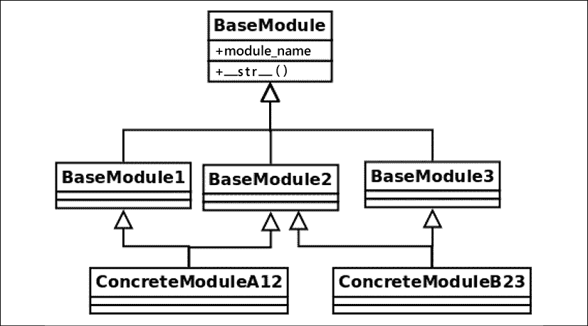

# 3

# 优秀代码的一般特性

这是一本关于使用 Python 进行软件构建的书。优秀的软件是由良好的设计构建的。通过说诸如“干净代码”之类的话，你可能认为我们将探讨仅与软件实现细节相关的良好实践，而不是其设计。然而，这种假设是错误的，因为代码并不是与设计不同的东西——代码*就是*设计。

代码可能是设计最详细的表示。在前两章中，我们讨论了为什么以一致的方式结构化代码很重要，并看到了编写更紧凑和惯用代码的惯用语。现在，我们需要理解干净代码就是那样，而且更多——最终目标是使代码尽可能稳健，并以最小化缺陷或使缺陷显而易见的方式编写，如果它们发生的话。

本章以及下一章将专注于更高层次的抽象设计原则。我将介绍在 Python 中应用的软件工程的一般原则。

尤其是对于本章，我们将回顾不同的原则，这些原则有助于良好的软件设计。高质量的软件应该围绕这些想法构建，并将作为设计工具。这并不意味着它们应该始终应用；实际上，其中一些代表不同的观点（例如，与**设计由合同**（**DbC**）方法相比，防御性编程）。其中一些取决于上下文，并不总是适用。

高质量代码是一个具有多个维度的概念。我们可以将其与我们思考软件架构质量属性的方式类似。例如，我们希望我们的软件是安全的，并且具有良好的性能、可靠性、可维护性，仅举几个属性。

本章的目标如下：

+   理解稳健软件背后的概念

+   学习如何在应用程序的工作流程中处理错误数据

+   设计可维护的软件，使其易于扩展和适应新的需求

+   设计可重用的软件

+   编写有效的代码，以保持开发团队的生产力

# 设计由合同

我们正在开发的软件的一些部分并不是直接由用户调用的，而是由代码的其他部分调用。当我们将应用程序的责任划分为不同的组件或层时，这种情况就会发生，我们必须考虑它们之间的交互。

我们必须在每个组件后面封装一些功能，并向将使用该功能的客户端公开接口，即**应用程序编程接口**（**API**）。我们为该组件编写的函数、类或方法在特定考虑下有特定的工作方式，如果这些考虑不满足，将使我们的代码崩溃。相反，调用该代码的客户端期望得到特定的响应，而我们函数未能提供这种响应的任何失败都代表了一个缺陷。

换句话说，如果我们有一个期望与一系列整数类型的参数一起工作的函数，而另一个函数通过传递字符串来调用我们的函数，那么很明显，它不应该按预期工作，但事实上，该函数根本不应该运行，因为它被错误地调用了（客户端犯了错误）。这种错误不应该无声地通过。

当然，在设计 API 时，应该记录预期的输入、输出和副作用。但文档不能强制软件在运行时的行为。这些规则，即代码的每个部分为了正常工作所期望的内容以及调用者从它们期望得到的内容，应该是设计的一部分，这就是**合同**概念发挥作用的地方。

DbC（Design by Contract）方法背后的理念是，我们不是隐式地在代码中放置各方期望的内容，而是双方同意一个合同，如果违反该合同，将引发异常，并清楚地说明为什么它不能继续。

在我们的上下文中，合同是一种强制执行某些规则的结构，这些规则必须在软件组件的通信过程中得到遵守。合同主要涉及先决条件和后置条件，但在某些情况下，也会描述不变性和副作用：

+   **先决条件**：我们可以将这些检查称为代码在运行之前将执行的所有检查。它将检查在函数可以继续之前必须满足的所有条件。通常，这是通过验证在参数中提供的数据集来实现的，但如果我们认为这些验证的副作用被这种验证的重要性所掩盖，那么我们不应该停止运行各种验证（例如，验证数据库中的集合、文件或之前调用的其他方法）。请注意，这会对调用者施加约束。

+   **后置条件**：与先决条件相反，在这里，验证是在函数调用返回后进行的。后置条件验证是运行以验证调用者从这个组件期望得到的内容。

+   **不变性**：在函数的文档字符串中，记录不变性是一个好主意，即函数运行期间保持不变的事物，这可以作为函数逻辑正确性的表达。

+   **副作用**：在文档字符串中，我们可以选择提及我们代码的任何副作用。

虽然从概念上讲，所有这些项目都是软件组件合同的一部分，这也是应该写入此类组件文档的内容，但只有前两个（预设条件和后置条件）需要在低级别（代码）强制执行。

我们之所以会按合同设计，是因为如果出现错误，它们必须容易发现（通过注意到是预设条件还是后置条件失败，我们将更容易找到罪魁祸首），以便它们可以迅速纠正。更重要的是，我们希望代码的关键部分避免在错误假设下执行。这应该有助于清楚地标记责任和错误的界限，如果发生错误，而不是说这个应用程序的部分失败了。但是，调用代码提供了错误的参数，那么我们应该在哪里应用修复？

理念是，预设条件将客户端（如果它们想要运行代码的某些部分，就有义务满足它们），而后置条件将组件与客户端可以验证和执行的某些保证联系起来。

这样，我们就可以快速识别责任。如果预设条件失败，我们知道这是由于客户端的缺陷造成的。另一方面，如果后置条件检查失败，我们知道问题在于程序或类（供应商）本身。

具体来说，关于预设条件，重要的是要强调它们可以在运行时进行检查，如果它们发生，被调用的代码根本不应该运行（因为它的条件不成立，这样做可能会使事情变得更糟）。

## 预设条件

预设条件是函数或方法为了正确工作而期望接收的所有保证。在一般编程术语中，这通常意味着提供正确形成的数据，例如，初始化的对象、非空值等等。对于 Python 来说，特别是动态类型，这也意味着有时我们需要检查提供的数据的确切类型。这并不完全等同于类型检查，`mypy`这样的工具会做这种检查，而是验证所需的精确值。

这些检查的一部分可以通过使用静态分析工具（如`mypy`）在早期检测到，我们在*第一章*，*介绍、代码格式化和工具*中已经介绍了它，但这些检查是不够的。一个函数应该对其将要处理的信息进行适当的验证。

现在，这提出了一个问题，即验证逻辑应该放在哪里，这取决于我们是否让客户端在调用函数之前验证所有数据，或者允许它在运行自己的逻辑之前验证它所接收到的所有内容。前者等同于宽容的方法（因为函数本身仍然允许任何数据，包括潜在的不规范数据），而后者等同于严格的方法。

在本次分析中，我们倾向于对 DbC 采用严格的方法，因为它在稳健性方面通常是最佳选择，并且在行业中通常是最常见的实践。

无论我们决定采取哪种方法，我们都应该始终牢记非冗余原则，该原则指出，对于函数的每个先决条件的执行，应由合同的任一部分而不是两部分来完成。这意味着我们将验证逻辑放在客户端，或者将其留给函数本身，但在任何情况下都不应该重复它（这也与 DRY 原则相关，我们将在本章后面讨论）。

## 后置条件

后置条件是合同的一部分，负责在方法或函数返回后强制执行状态。

假设函数或方法已经以正确的属性（即，满足其先决条件）被调用，那么后置条件将保证某些属性得到保留。

策略是使用后置条件来检查和验证客户端可能需要的所有内容。如果方法执行得当，后置条件验证通过，那么任何调用该代码的客户端都应该能够无问题地与返回的对象一起工作，因为合同已经得到履行。

## Pythonic contracts

在撰写本书时，一个名为 PEP-316 的名为 *Programming by Contract for Python* 的提案已被推迟。这并不意味着我们不能在 Python 中实现它，因为，如本章开头所述，这是一个通用设计原则。

可能最好的强制执行方式是在我们的方法、函数和类中添加控制机制，如果它们失败，则抛出 `RuntimeError` 异常或 `ValueError`。很难制定一个关于正确异常类型的通用规则，因为这很大程度上取决于特定的应用程序。前面提到的异常是最常见的异常类型，但如果它们与问题不精确匹配，创建一个自定义异常将是最佳选择。

我们还希望尽可能地将代码隔离。也就是说，前置条件的代码在一个部分，后置条件的代码在另一个部分，函数的核心分开。我们可以通过创建更小的函数来实现这种分离，但在某些情况下，实现一个装饰器可能是一个有趣的替代方案。

## 设计原则——结论

这种设计原则的主要价值是有效地识别问题所在。通过定义合同，当运行时出现问题时，将清楚地知道是代码的哪个部分出了问题，以及是什么破坏了合同。

遵循这一原则的结果是代码将更加稳健。每个组件都在执行自己的约束并保持一些不变性，只要这些不变性得到保持，程序就可以被证明是正确的。

它还起到了更好地阐明程序结构的作用。而不是尝试运行临时的验证，或者尝试克服所有可能的失败场景，合约明确指定了每个函数或方法期望正常工作的内容，以及期望从它们那里得到的内容。

当然，遵循这些原则也会增加额外的工作，因为我们不仅正在编写主应用程序的核心逻辑，还在编写合约。此外，我们可能还想考虑为这些合约添加单元测试。然而，这种方法获得的质量在长期来看是值得的；因此，为应用程序的关键组件实现这一原则是一个好主意。

然而，为了使这种方法有效，我们应该仔细思考我们愿意验证的内容，这必须是一个有意义的值。例如，定义仅检查传递给函数的参数的正确数据类型的合约并没有太多意义。许多程序员会认为这就像试图将 Python 变成一种静态类型语言。不管怎样，结合使用注解的工具，如`mypy`，将更好地实现这一目的，并且更加省力。考虑到这一点，设计合约，以便它们确实具有价值，例如检查传递和返回的对象的性质，它们必须遵守的条件，等等。

# 防御性编程

防御性编程遵循与 DbC 略有不同的方法。它不是在合约中声明所有必须满足的条件，如果未满足，将引发异常并使程序失败，而是更多地使代码的各个部分（对象、函数或方法）能够保护自己免受无效输入的影响。

防御性编程是一种具有多个方面的技术，如果与其他设计原则相结合（这意味着它遵循与 DbC 不同的哲学并不意味着它只能是其中之一——它可能意味着它们可能相互补充）特别有用。

防御性编程的主要思想是如何处理我们可能预期发生的场景的错误，以及如何处理不应该发生的错误（当不可能的条件发生时）。前者将落入错误处理程序，而后者将是断言的情况。这两个主题将在以下章节中探讨。

## 错误处理

在我们的程序中，我们求助于错误处理程序来处理我们预期可能导致错误的场景。这通常适用于数据输入。

错误处理的理念是在尝试继续我们的程序执行或决定失败的情况下优雅地响应这些预期的错误。

我们可以通过不同的方法来处理程序中的错误，但并非所有方法都总是适用。以下是一些方法：

+   值替换

+   错误记录

+   异常处理

在接下来的两个部分中，我们将重点关注值替换和异常处理，因为这些形式的错误处理提供了更有趣的分析。错误记录是一种补充实践（而且是一个好的实践；我们应该始终记录错误），但大多数时候我们只有在没有其他事情可做时才记录，所以其他方法提供了更有趣的替代方案。

### 值替换

在某些场景中，当出现错误并且有软件产生不正确值或完全失败的风险时，我们可能能够用另一个更安全的值替换结果。我们称之为值替换，因为我们实际上是在用要考虑为非破坏性的值（它可能是一个默认值、一个已知的常量、一个哨兵值，或者简单地是根本不影响结果的东西，例如在结果打算应用于求和的情况下返回零）来替换实际错误的结果。

值替换并不总是可行的。然而，对于替换的值是安全选项的情况，这种策略必须谨慎选择。做出这个决定是在鲁棒性和正确性之间进行权衡。一个软件程序在存在错误场景的情况下不会失败，这就是它的鲁棒性。但这也不完全正确。

对于某些类型的软件，这可能是不被接受的。如果应用程序是关键的，或者处理的数据过于敏感，这不是一个选择，因为我们无法承担向用户提供（或应用程序的其他部分）错误结果的风险。在这些情况下，我们选择正确性，而不是让程序在产生错误结果时崩溃。

一个稍微不同且更安全的决策版本是为未提供的数据使用默认值。这可能适用于可以与默认行为一起工作的代码部分，例如，未设置的环境变量的默认值、配置文件中的缺失条目或函数的参数。

我们可以在 Python 的 API 的不同方法中找到支持这一点的例子，例如，字典有一个`get`方法，它的（可选的）第二个参数允许你指定一个默认值：

```py
>>> configuration = {"dbport": 5432}
>>> configuration.get("dbhost", "localhost")
'localhost'
>>> configuration.get("dbport")
5432 
```

环境变量有类似的 API：

```py
>>> import os
>>> os.getenv("DBHOST")
'localhost'
>>> os.getenv("DPORT", 5432)
5432 
```

在前两个例子中，如果第二个参数没有提供，`None`将被返回，因为这是这些函数定义时的默认值。我们也可以为我们的函数参数定义默认值：

```py
>>> def connect_database(host="localhost", port=5432):
...     logger.info("connecting to database server at %s:%i", host, port) 
```

通常，用默认值替换缺失的参数是可以接受的，但用合法的近似值替换错误数据更危险，可能会掩盖一些错误。在决定采用这种方法时，请考虑这一标准。

### 异常处理

在存在不正确或缺失的输入数据的情况下，有时可以通过一些示例来纠正这种情况，例如前一个章节中提到的。然而，在其他情况下，停止程序继续运行以避免使用错误数据，而不是让它基于错误假设进行计算，可能更好。在这些情况下，失败并通知调用者有问题是一个好的方法，正如我们在 DbC 中看到的那样。

然而，错误输入数据并不是函数出错的可能方式中唯一的一种。毕竟，函数不仅仅是关于传递数据；它们还有副作用并连接到外部组件。

函数调用中的错误可能是由这些外部组件中的一个出现问题造成的，而不是我们自己的函数本身。如果是这种情况，我们的函数应该适当地传达这一点。这将使调试更容易。函数应该明确且无歧义地通知应用程序的其他部分有关无法忽略的错误，以便它们可以相应地处理。

实现这一机制的是异常。重要的是要强调，这就是异常应该被用于——明确宣布一个异常情况，而不是根据业务逻辑改变程序的流程。

如果代码试图使用异常来处理预期的场景或业务逻辑，程序的流程将变得难以阅读。这会导致异常被用作一种“跳转”语句，这（更糟糕的是）可能会跨越调用栈的多个级别（直到调用函数），违反了逻辑封装到正确抽象级别的原则。如果这些`except`块将业务逻辑与代码试图防御的真正异常情况混合在一起，情况可能会变得更糟；在这种情况下，将难以区分我们必须维护的核心逻辑和要处理的问题。

不要将异常作为业务逻辑的“万能”机制。当代码出现调用者需要了解的问题时，才抛出异常。

这个最后的概念非常重要；异常通常是为了通知调用者出现了某些问题。这意味着异常应该谨慎使用，因为它们会削弱封装性。一个函数拥有的异常越多，调用函数就需要越多的预期，因此需要了解它所调用的函数。如果一个函数抛出了太多的异常，这意味着它不是那么上下文无关的，因为每次我们想要调用它时，我们都需要记住它所有的可能副作用。

这可以用作一种启发式方法来判断一个函数是否不够内聚并且承担了过多的职责。如果它抛出了太多的异常，这可能是一个信号，表明它需要被分解成多个更小的部分。

这里有一些与 Python 中的异常相关的建议。

#### 在适当的抽象级别处理异常

异常也是那些只做一件事的主要函数的一部分。函数处理（或引发）的异常必须与封装在其上的逻辑一致。

在下面的示例中，我们可以看到我们所说的不同抽象层次混合的含义。想象一个对象，它在我们的应用程序中充当某些数据传输的角色。它连接到外部组件，数据在解码后将被发送。在下面的列表中，我们将关注 `deliver_event` 方法：

```py
class DataTransport:
    """An example of an object handling exceptions of different levels."""
    _RETRY_BACKOFF: int = 5
    _RETRY_TIMES: int = 3
    def __init__(self, connector: Connector) -> None:
        self._connector = connector
        self.connection = None
    def deliver_event(self, event: Event):
        try:
            self.connect()
            data = event.decode()
            self.send(data)
        except ConnectionError as e:
            logger.info("connection error detected: %s", e)
            raise
        except ValueError as e:
            logger.error("%r contains incorrect data: %s", event, e)
            raise
    def connect(self):
        for _ in range(self._RETRY_TIMES):
            try:
                self.connection = self._connector.connect()
            except ConnectionError as e:
                logger.info(
                    "%s: attempting new connection in %is", e, self._RETRY_BACKOFF,
                )
                time.sleep(self._RETRY_BACKOFF)
            else:
                return self.connection
        raise ConnectionError(f"Couldn't connect after {self._RETRY_TIMES} times")
    def send(self, data: bytes):
        return self.connection.send(data) 
```

对于我们的分析，让我们聚焦于 `deliver_event()` 方法如何处理异常。

`ValueError` 与 `ConnectionError` 有什么关系？不多。通过观察这两种高度不同的错误类型，我们可以了解责任应该如何划分。

`ConnectionError` 应该在 `connect` 方法内部处理。这允许行为有清晰的分离。例如，如果这个方法需要支持重试，那么处理这个异常就是一种实现方式。

相反，`ValueError` 属于事件的 `decode` 方法。在这个新的实现（在下一个示例中展示）中，这个方法不需要捕获任何异常——我们之前担心的异常要么被内部方法处理，要么被故意留下以引发。

我们应该将这些片段分离成不同的方法或函数。对于连接管理，一个小函数就足够了。这个函数将负责尝试建立连接，捕获异常（如果发生），并相应地记录：

```py
def connect_with_retry(connector: Connector, retry_n_times: int, retry_backoff: int = 5):
    """Tries to establish the connection of <connector> retrying
    <retry_n_times>, and waiting <retry_backoff> seconds between attempts.
    If it can connect, returns the connection object.
    If it's not possible to connect after the retries have been exhausted, raises ``ConnectionError``.
    :param connector:         An object with a ``.connect()`` method.
    :param retry_n_times int: The number of times to try to call
                              ``connector.connect()``.
    :param retry_backoff int: The time lapse between retry calls.
    """
    for _ in range(retry_n_times):
        try:
            return connector.connect()
        except ConnectionError as e:
            logger.info("%s: attempting new connection in %is", e, retry_backoff)
            time.sleep(retry_backoff)
    exc = ConnectionError(f"Couldn't connect after {retry_n_times} times")
    logger.exception(exc)
    raise exc 
```

然后，我们将在我们的方法中调用这个函数。至于事件上的 `ValueError` 异常，我们可以通过一个新的对象将其分离，并进行组合，但在这个有限的案例中，这将是过度设计，所以只需将逻辑移动到单独的方法就足够了。有了这两个考虑因素，方法的新版本看起来更加紧凑，更容易阅读：

```py
class DataTransport:
    """An example of an object that separates the exception handling by
    abstraction levels.
    """
    _RETRY_BACKOFF: int = 5
    _RETRY_TIMES: int = 3
    def __init__(self, connector: Connector) -> None:
        self._connector = connector
        self.connection = None
    def deliver_event(self, event: Event):
        self.connection = connect_with_retry(self._connector, self._RETRY_TIMES, self._RETRY_BACKOFF)
        self.send(event)
    def send(self, event: Event):
        try:
            return self.connection.send(event.decode())
        except ValueError as e:
            logger.error("%r contains incorrect data: %s", event, e)
            raise 
```

现在看看异常类的分离如何也界定了责任的分离。在第一个示例中，一切都被混合在一起，没有明确的关注点分离。然后我们决定将连接作为一个单独的关注点，所以在下一个示例中，创建了 `connect_with_retry` 函数，并且 `ConnectionError` 作为这个函数的一部分被处理，如果我们需要修改这个函数（就像我们做的那样）。另一方面，`ValueError` 不属于那个相同的逻辑，所以它被留在了 `send` 方法中，那里才是它应该存在的地方。

异常具有意义。因此，处理每种类型的异常都应在适当的抽象级别上进行（这意味着，根据它们属于我们应用程序的哪一层）。但它们有时也可能携带重要信息。由于这些信息可能敏感，我们不希望它们落入错误的手中，因此在下节中，我们将讨论异常的安全影响。

#### 不要向最终用户暴露回溯信息

这是一个安全考虑。在处理异常时，如果错误非常重要，可能甚至允许程序在这种情况下失败，因为正确性被优先于鲁棒性。

当存在表示问题的异常时，重要的是尽可能详细地记录（包括回溯信息、消息以及我们能收集到的所有信息），以便可以有效地纠正问题。同时，我们希望尽可能详细地记录给自己——我们不希望任何这些信息对用户可见。

在 Python 中，异常的回溯包含非常丰富和有用的调试信息。不幸的是，这些信息对攻击者或恶意用户来说也非常有用，他们试图尝试并损害应用程序，更不用说这种泄露会代表重要的信息泄露，危害你组织的知识产权（因为代码的一部分将被暴露）。

如果你选择让异常传播，确保不要泄露任何敏感信息。另外，如果你必须通知用户有关问题，请选择通用的消息（例如“出了点问题”，或“页面未找到”）。这是在发生 HTTP 错误时，显示通用信息性消息的 Web 应用程序中常用的一种技术。

#### 避免空异常块

这甚至被称为最邪恶的 Python 反模式（REAL 01）。虽然预测并防御程序中的某些错误是好的，但过于防御可能会带来更糟糕的问题。特别是，过于防御的唯一问题是存在一个空的`except`块，它默默地通过而不做任何事情。

Python 非常灵活，允许我们编写即使有缺陷也不会引发错误的代码，如下所示：

```py
try:
    process_data()
except:
    pass 
```

这个问题在于它永远不会失败，即使它应该失败。如果你还记得 Python 的禅宗，错误永远不应该默默通过，这也是非 Pythonic 的。

配置你的持续集成环境（通过使用在*第一章*、*简介、代码格式化和工具*中探讨的工具），以自动报告空异常块。

在发生异常的情况下，这段代码将不会失败，这可能正是我们最初想要的。但如果有缺陷呢？当`process_data()`函数运行时可能会发生实际失败，我们希望知道我们的逻辑中是否存在错误，以便能够纠正它。编写这样的代码块将掩盖问题，使维护变得更加困难。

有两种替代方案：

+   捕获更具体的异常（不要太宽泛，例如`Exception`）。实际上，在某些情况下，一些代码检查工具和 IDE 会警告你代码处理了过于宽泛的异常。

+   在`except`块上执行一些实际的错误处理。

最好的做法是应用这两项建议。处理更具体的异常（例如，`AttributeError`或`KeyError`）将使程序更易于维护，因为读者将知道期望什么，并且可以了解其*原因*。它还将使其他异常能够被引发，如果发生这种情况，这通常意味着一个错误，但这次可以被发现。

处理异常本身可能意味着多种情况。在其最简单的形式中，它可能只是关于记录异常（确保使用`logger.exception`或`logger.error`来提供发生事件的完整上下文）。其他替代方案可能包括返回默认值（替换，只是在检测到错误后，而不是在引发错误之前），或者引发不同的异常。

如果你选择引发不同的异常，包括导致问题的原始异常（参见下一节）。

避免使用空的`except`块（使用`pass`）的另一个原因是它的隐含性：它没有告诉代码的读者我们实际上期望忽略该异常。一个更明确的方法是使用`contextlib.suppress`函数，它可以接受所有要忽略的异常作为参数，并且可以用作上下文管理器。

在我们的示例中，它可能看起来像这样：

```py
import contextlib
with contextlib.suppress(KeyError):
    process_data() 
```

同样，正如前一个案例一样，尽量避免将通用的`Exception`传递给这个上下文管理器，因为效果将是相同的。

#### 包含原始异常

作为我们错误处理逻辑的一部分，我们可能会决定引发不同的异常，甚至可能更改其消息。如果是这种情况，建议包括导致该异常的原始异常。

我们可以使用`raise <e> from <original_exception>`语法（PEP-3134）。当使用这种结构时，原始的堆栈跟踪将被嵌入到新的异常中，原始异常将被设置在结果异常的`__cause__`属性中。

例如，如果我们希望将默认异常包装成我们项目内部的定制异常，我们仍然可以这样做，同时包括关于根异常的信息：

```py
class InternalDataError(Exception):
    """An exception with the data of our domain problem."""
def process(data_dictionary, record_id):
    try:
        return data_dictionary[record_id]
    except KeyError as e:
        raise InternalDataError("Record not present") from e 
```

在更改异常类型时，始终使用`raise <e> from <o>`语法。

使用这种语法将使回溯包含更多关于刚刚发生的异常或错误的信息，这将在调试时非常有帮助。

## 在 Python 中使用断言

断言应该用于那些永远不会发生的情况，因此`assert`语句上的表达式必须意味着一个不可能的条件。如果这个条件发生，这意味着软件中存在缺陷。

与错误处理方法相反，有些情况下我们不希望程序在发生特定错误时继续执行。这是因为，在某些情况下，错误无法克服，我们的程序无法纠正其执行路径（或自我修复），因此最好是快速失败，让错误被注意到，以便在下一个版本升级时得到纠正。

使用断言的目的是防止程序在出现此类无效场景时造成进一步损害。有时，停止程序并让它崩溃比让它基于错误假设继续处理要好。

根据定义，断言是代码中的一个布尔条件，程序必须为真才能正确运行。如果程序因`AssertionError`而失败，这意味着刚刚发现了一个缺陷。

因此，断言不应该与业务逻辑混合，或者用作软件的控制流机制。以下是一个坏主意：

```py
try:
    assert condition.holds(), "Condition is not satisfied"
except AssertionError:
    alternative_procedure() 
```

不要捕获`AssertionError`异常，因为这可能会让代码的读者感到困惑。如果你期望代码的某个部分抛出异常，尝试使用更具体的一个。

之前关于捕获`AssertionError`的建议是不要让你的程序无声失败。但它可以优雅地失败。所以，与其让应用程序硬崩溃，不如捕获`AssertionError`并显示一个通用的错误消息，同时仍然将所有内部错误细节记录到公司的日志平台。关键不在于是否捕获这个异常，而在于断言错误是宝贵的信息来源，这将帮助你提高软件的质量。

确保断言失败时程序终止。这意味着断言通常被放在代码中以识别程序中的错误部分。在许多编程语言中存在一种趋势，认为当程序在生产环境中运行时可以抑制断言，但这违背了其目的，因为它们的目的正是让我们确切地知道那些需要修复的程序部分。

在 Python 中，特别是，使用`–O`标志将抑制`assert`语句，但出于上述原因，这被劝阻。

不要使用`python –O`运行你的生产程序，因为你想利用代码中的断言来纠正缺陷。

在断言语句中包含一个描述性的错误消息，并将错误记录下来，以确保你可以正确地调试和纠正问题。

另一个重要的原因是，之前的代码方案不好，除了捕获`AssertionError`之外，断言中的语句还是一个函数调用。函数调用可能会有副作用，并且它们并不总是可重复的（我们不知道再次调用`condition.holds()`是否会得到相同的结果）。此外，如果我们在这个语句处停止调试器，我们可能无法方便地看到导致错误的那个结果，而且，即使我们再次调用该函数，我们也不知道那个值是否是导致错误的原因。

一个更好的替代方案需要更多的代码行，但提供了更有用的信息：

```py
result = condition.holds()
assert result > 0, f"Error with {result}" 
```

在使用断言时，尽量避免直接使用函数调用，而是用局部变量的形式来编写表达式。

断言和异常处理之间有什么关系？有些人可能会问，在异常处理的光照下，断言是否已经没有意义了。如果我们可以用`if`语句检查并抛出异常，为什么还要断言一个条件呢？尽管如此，这里有一个细微的区别。一般来说，异常是用来处理与程序业务逻辑相关的意外情况，而断言则像是代码中的自我检查机制，用来验证（断言）其正确性。

因此，抛出异常会比使用`assert`语句更为常见。`assert`的典型用途是在算法维护一个必须始终保持的不变量逻辑的情况下：在这种情况下，你可能想要断言该不变量。如果这一点在某些地方被破坏，这意味着算法是错误的或者实现得不好。

我们已经探讨了 Python 中的防御性编程，以及一些与异常处理相关的话题。现在，我们继续讨论下一个重要主题，因为下一节将讨论关注点的分离。

# 关注点的分离

这是一个在多个层面上应用的设计原则。它不仅关乎低级设计（代码），而且在更高层次上的抽象也很相关，因此我们将在讨论架构时再次提到它。

不同的职责应该分配到应用程序的不同组件、层或模块中。程序的每一部分只应负责其功能的一部分（我们称之为关注点），并且对其他部分一无所知。

软件中分离关注点的目标是通过对最小化涟漪效应来提高可维护性。涟漪效应意味着软件中从起点传播的变化。这可能是一个错误或异常触发一系列其他异常，导致在应用程序的远程部分产生缺陷的情况。也可能是因为我们对函数定义的简单更改，我们必须在代码库的多个部分中更改大量的代码。

显然，我们不希望出现这些场景。软件必须易于更改。如果我们必须修改或重构代码的一部分，这必须对应用程序的其他部分产生最小的影响，而实现这一点的方法是通过适当的封装。

以类似的方式，我们希望任何潜在的错误都被包含起来，以免造成重大损害。

这个概念与 DbC 原则相关，因为每个关注点都可以通过合同强制执行。当合同被违反，并因此引发异常时，我们知道程序中的哪个部分出现了故障，以及哪些责任未能满足。

尽管有这种相似性，关注点的分离更进一步。我们通常认为函数、方法或类之间的合同，虽然这也适用于必须分离的责任，但关注点分离的概念也适用于 Python 模块、包以及基本上任何软件组件。

## 凝聚力和耦合

这些是良好软件设计的重要概念。

一方面，`凝聚力`意味着对象应该有一个小而明确的目的，并且它们应该尽可能少地做事情。它遵循与 Unix 命令类似的哲学，这些命令只做一件事情，并且做得很好。我们的对象越具有凝聚力，它们就越有用和可重用，从而使我们的设计更佳。

另一方面，`耦合`指的是两个或多个对象相互依赖的想法。这种依赖关系提出了一个限制。如果代码的两个部分（对象或方法）过于依赖彼此，它们会带来一些不希望的结果：

+   **无代码重用**：如果一个函数过多地依赖于某个特定对象，或者接受太多的参数，它就与这个对象耦合在一起，这意味着在另一个上下文中使用该函数将非常困难（为了这样做，我们必须找到一个符合非常严格接口的合适参数）。

+   **涟漪效应**：两个部分中的任何一个部分的更改肯定会影响另一个部分，因为它们太接近了。

+   **低抽象级别**：当两个函数关系非常紧密时，很难将它们视为在不同抽象级别上解决不同关注点的不同问题。

经验法则：定义良好的软件将实现高凝聚力和低耦合。

# 生存的缩写词

在本节中，我们将回顾一些产生良好设计思路的原则。目的是通过易于记忆的缩写词快速关联到良好的软件实践，作为一种记忆规则。如果你记住这些词，你将能够更容易地将它们与良好实践联系起来，并且查找你正在查看的特定代码行背后的正确想法将会更快。

这些绝对不是正式或学术定义，而更像是从多年在软件行业工作过程中产生的经验性想法。其中一些确实出现在书中，因为它们是由重要作者提出的（参见参考文献以更详细地调查它们），而另一些可能起源于博客文章、论文或会议演讲。

## DRY/OAOO

“不要重复自己”（DRY）和“一次且仅一次”（OAOO）的想法密切相关，因此它们在这里一起被包括。它们是自我解释的，你应该不惜一切代价避免重复。

代码中的事物，即知识，必须只定义一次，并且在一个地方。当你需要更改代码时，应该只有一个合适的地点进行修改。未能做到这一点是设计不良系统的标志。

代码重复是一个直接影响可维护性的问题。由于它的许多负面影响，代码重复是非常不希望的：

+   **易于出错**：当某些逻辑在代码中多次重复，并且需要更改时，这意味着我们必须高效地纠正所有这些实例，不能遗漏任何一个，因为在那种情况下会出现错误。

+   **成本高昂**：与前面的点相关，在多个地方进行更改比只定义一次需要更多的时间（开发和测试工作量）。这将减慢团队的工作进度。

+   **不可靠**：这也与第一个点相关，当需要更改多个地方以进行单个更改时，你依赖于编写代码的人记住所有需要进行修改的实例。没有单一的真实来源。

重复通常是由于忽略了（或忘记了）代码代表知识。通过给代码的某些部分赋予意义，我们正在识别和标记这种知识。

让我们通过一个例子来看看这意味着什么。想象在一个学习中心，学生根据以下标准进行排名：每通过一次考试获得 11 分，每失败一次考试减去 5 分，每在机构待一年减去 2 分。以下代码并非实际代码，而只是表示这种可能在实际代码库中分散的方式：

```py
def process_students_list(students):
    # do some processing...
    students_ranking = sorted(
        students, key=lambda s: s.passed * 11 - s.failed * 5 - s.years * 2
    )
    # more processing
    for student in students_ranking:
        print(
            "Name: {0}, Score: {1}".format(
                student.name,
                (student.passed * 11 - student.failed * 5 - student.years * 2),
            )
        ) 
```

注意到 lambda 表达式，它在排序函数的键中，代表了领域问题中的一些有效知识，但它并没有反映出来（它没有名字，没有合适的位置，这段代码没有赋予任何意义，什么都没有）。这种代码中的意义缺失导致了在列出排名时打印分数时出现的重复。

我们应该在代码中反映我们对领域问题的了解，这样我们的代码就很少会遭受重复，并且更容易理解：

```py
def score_for_student(student):
    return student.passed * 11 - student.failed * 5 - student.years * 2
def process_students_list(students):
    # do some processing...
    students_ranking = sorted(students, key=score_for_student)
    # more processing
    for student in students_ranking:
        print(
            "Name: {0}, Score: {1}".format(
                student.name, score_for_student(student)
            )
        ) 
```

一个公正的免责声明：这仅仅是对代码重复的一个特性的分析。实际上，还有更多的情况、类型和代码重复的分类。可以专门用整章来讨论这个话题，但在这里我们专注于一个特定的方面，以使缩写的含义清晰。

在这个例子中，我们采取了可能是消除重复最简单的方法：创建一个函数。根据具体情况，最佳解决方案可能会有所不同。在某些情况下，可能需要创建一个全新的对象（可能整个抽象都缺失）。在其他情况下，我们可以通过上下文管理器来消除重复。迭代器或生成器（在第七章*生成器、迭代器和异步编程*中描述）也可以帮助避免代码中的重复，装饰器（在第五章*使用装饰器改进我们的代码*中解释）也将有所帮助。

不幸的是，没有普遍的规则或模式可以告诉你 Python 中哪些特性在解决代码重复问题时最为合适，但希望读者在阅读本书中的示例以及 Python 元素的使用方式后，能够发展出自己的直觉。

## YAGNI

**YAGNI**（缩写为**You Ain't Gonna Need It**）是一个你可能在编写解决方案时经常需要记住的想法，如果你不想过度设计它的话。

我们希望能够轻松修改我们的程序，因此我们希望使它们具有前瞻性。与此一致，许多开发者认为他们必须预测所有未来的需求，并创建非常复杂的解决方案，从而创建难以阅读、维护和理解的抽象。后来，发现那些预期的需求并没有出现，或者它们出现了，但以不同的方式（惊喜！），而原本应该处理这种情况的原始代码却不起作用。

问题在于现在甚至更难重构和扩展我们的程序。发生的事情是原始解决方案没有正确处理原始需求，当前解决方案也没有，仅仅是因为这是一个错误的抽象。

拥有可维护的软件并不是关于预测未来需求（不要做未来学！），而是编写只解决当前需求的软件，这样将来修改起来既可能又容易。换句话说，在设计时，确保你的决策不会限制你，并且你将能够继续构建，但不要构建超过必要性的东西。

通常情况下，我们可能会在某些情况下不遵循这个理念，因为我们知道一些我们认为可能适用或为我们节省时间的原则。例如，在本书的后面，我们将回顾设计模式，它们是面向对象设计典型情况下的常见解决方案。虽然研究设计模式很重要，但我们必须拒绝过早应用它们的诱惑，因为这可能会违反 YAGNI 原则。

例如，想象你正在创建一个类来封装组件的行为。你知道它是必要的，但后来你想到将来可能会有更多（和类似的）需求，所以可能会有创建一个基类的诱惑（为了定义必须实现的方法的接口），然后使你刚刚创建的类成为实现该接口的子类。这会有几个错误的原因。首先，你现在需要的只是最初创建的那个类（在我们不知道是否需要的情况下，投入更多时间来过度泛化解决方案并不是管理资源的好方法）。然后，那个基类被当前需求所偏颇，所以它可能不是正确的抽象。

最佳的方法是只编写现在需要的，同时不阻碍未来的改进。如果将来有更多需求，我们可以考虑创建一个基类，抽象一些方法，也许我们会发现为我们的解决方案出现的某种设计模式。这也是面向对象设计应该工作的方式：自下而上。

最后，我想强调 YAGNI 这个理念也适用于软件架构（而不仅仅是详细代码）。

## KIS

**KIS**（代表**保持简单**）与前面的观点非常相关。当你设计一个软件组件时，避免过度设计。问问自己你的解决方案是否是满足问题的最小方案。

实现最小功能，正确解决问题，并且不会使你的解决方案比必要的更复杂。记住，设计越简单，可维护性就越高。

这个设计原则是我们希望在所有抽象级别都牢记在心的一个理念，无论是思考高级设计，还是处理特定的代码行。

在高层次上，考虑我们正在创建的组件。我们真的需要所有这些吗？这个模块现在真的需要完全可扩展吗？强调最后一点——也许我们想要使该组件可扩展，但现在不是做这件事的正确时间，或者由于我们还没有足够的信息来创建适当的抽象，尝试在这个阶段提出通用接口只会导致更糟糕的问题。

在代码方面，保持简单通常意味着使用最适合问题的最小数据结构。你很可能会在标准库中找到它。

有时候，我们可能会过度复杂化代码，创建比必要的更多函数或方法。以下类从一个提供的关键字参数集合中创建一个命名空间，但它有一个相当复杂的代码接口：

```py
class ComplicatedNamespace:
    """A convoluted example of initializing an object with some properties."""
    ACCEPTED_VALUES = ("id_", "user", "location")
    @classmethod
    def init_with_data(cls, **data):
        instance = cls()
        for key, value in data.items():
            if key in cls.ACCEPTED_VALUES:
                setattr(instance, key, value)
        return instance 
```

为初始化对象添加一个额外的类方法似乎并不必要。然后，其中的迭代和 `setattr` 调用使得事情变得更加奇怪，提供给用户的接口也不是很清晰：

```py
>>> cn = ComplicatedNamespace.init_with_data(
...     id_=42, user="root", location="127.0.0.1", extra="excluded"
... )
>>> cn.id_, cn.user, cn.location
(42, 'root', '127.0.0.1')
>>> hasattr(cn, "extra")
False 
```

用户必须知道存在这种其他方法，这并不方便。最好是保持简单，就像我们在 Python 中初始化任何其他对象一样（毕竟，有这样一个方法），使用 `__init__` 方法来初始化对象：

```py
class Namespace:
    """Create an object from keyword arguments."""

    ACCEPTED_VALUES = ("id_", "user", "location")

    def __init__(self, **data):
        for attr_name, attr_value in data.items():
            if attr_name in self.ACCEPTED_VALUES:
                setattr(self, attr_name, attr_value) 
```

记住 Python 的禅意：简单胜于复杂。

在 Python 中有许多场景，我们希望保持代码的简单性。其中之一与我们之前探讨过的问题相关：代码重复。在 Python 中抽象代码的常见方法是通过使用装饰器（我们将在第五章 *使用装饰器改进我们的代码* 中看到）。但如果我们在尝试避免一小段代码的重复，比如说三行代码呢？在这种情况下，编写装饰器可能需要更多的行数，并且对于我们要解决的简单重复行来说，可能更加麻烦。在这种情况下，运用常识和实用主义。接受一小部分重复可能比一个复杂的函数（当然，除非你找到了一个更简单的方法来消除重复并保持代码简单）要好。

作为保持代码简单的一部分，我建议避免使用 Python 的高级特性，如元类（或与元编程相关的一切），因为这些特性几乎很少需要（它们的使用有非常特殊的理由！），而且它们使得代码的阅读和维护变得更加复杂。

## EAFP/LBYL

**EAFP** 代表 **Easier to Ask Forgiveness than Permission**（请求原谅比请求许可更容易），而 **LBYL** 代表 **Look Before You Leap**（三思而后行）。

EAFP 的思想是，我们编写代码使其直接执行一个操作，然后如果它不起作用，我们稍后处理后果。通常这意味着尝试运行一些代码，期望它能工作，但如果它不起作用，就捕获异常，然后在`except`块中处理纠正代码。

这与 LBYL 相反。正如其名所示，在“先检查后跳”方法中，我们首先检查我们即将使用的内容。例如，我们可能想在尝试操作文件之前检查文件是否可用：

```py
if os.path.exists(filename):
    with open(filename) as f:
        ... 
```

之前代码的 EAFP 版本看起来会是这样：

```py
try:
    with open(filename) as f:
        ...
except FileNotFoundError as e:
    logger.error(e) 
```

如果你来自没有异常处理的语言，例如 C 语言，那么发现 LBYL（先检查后执行）方法更有用是合乎逻辑的。在其他语言，如 C++中，由于性能考虑，对异常的使用存在一些反对意见，但在 Python 中这通常并不成立。

当然，特定情况可能适用，但大多数时候，你会发现 EAFP 版本更能揭示意图。这样编写的代码更容易阅读，因为它直接进行所需任务，而不是预防性地检查条件。换句话说，在最后一个例子中，你会看到尝试打开文件并处理它的代码部分。如果文件不存在，我们将处理这种情况。在第一个例子中，我们会看到一个检查文件是否存在并尝试做某事的函数。你可能认为这也是清晰的，但我们不能确定。也许被询问的文件是另一个文件，或者是一个属于程序不同层的函数，或者是一个遗留的文件，等等。当你第一次看代码时，第二种方法更不容易出错。

你可以根据你的代码需要应用这两种思想，但一般来说，以 EAFP（先做后检查）风格编写的代码在第一眼看起来会更易于理解，所以如果有疑问，我建议你选择这个变体。

# Python 中的继承

在面向对象的软件开发设计中，经常会有关于如何通过使用范式的主要思想（多态性、继承和封装）来解决某些问题的讨论。

这些想法中最常用的是继承——开发者通常会从创建所需的类层次结构开始，并决定每个类应该实现的方法。

尽管继承是一个强大的概念，但它确实有其风险。主要的风险是，每次我们扩展基类时，我们都在创建一个新的类，它与父类紧密耦合。正如我们已经讨论过的，耦合是我们设计软件时希望减少到最小的事情之一。

开发者将继承与代码重用联系起来的主要场景之一是。虽然我们应该始终欢迎代码重用，但仅仅因为我们可以免费从父类获得方法，就强迫我们的设计使用继承来重用代码并不是一个好主意。正确重用代码的方式是拥有高度内聚的对象，它们可以轻松组合，并且可以在多个上下文中工作。

## 当继承是一个好的决定时

在创建派生类时，我们必须小心，因为这把双刃剑——一方面，它有优势，我们可以免费获得父类中所有方法的代码，但另一方面，我们将它们全部带到新的类中，这意味着我们可能在新的定义中放置了过多的功能。

当创建一个新的子类时，我们必须考虑它是否真的会使用它刚刚继承的所有方法，作为一个启发式方法来查看类是否定义正确。如果我们发现我们不需要大多数方法，并且必须覆盖或替换它们，那么这是一个由多种原因造成的设计错误：

+   超类定义得比较模糊，并且承担了过多的责任，而不是一个明确的接口

+   子类并不是它试图扩展的超类的适当专门化

使用继承的一个好例子是，当你有一个类定义了某些组件及其行为（由这个类的接口定义，即其`public`方法和属性），然后你需要专门化这个类以创建执行相同操作但添加了其他内容或改变了某些行为特定部分的对象。

你可以在 Python 标准库本身中找到继承的好用例。例如，在`http.server`包（[`docs.python.org/3/library/http.server.html#http.server.BaseHTTPRequestHandler`](https://docs.python.org/3/library/http.server.html#http.server.BaseHTTPRequestHandler)）中，我们可以找到一个基类，如`BaseHTTPRequestHandler`，以及扩展这个基类的子类，如`SimpleHTTPRequestHandler`，通过添加或改变其部分基接口来实现。

谈到接口定义，这也是继承的另一个好用途。当我们想要强制某些对象的接口时，我们可以创建一个不实现行为本身但仅定义接口的抽象基类——每个扩展这个基类的类都必须实现这些接口才能成为适当的子类型。

最后，继承的另一个好例子是异常。我们可以看到，Python 中的标准异常`Exception`是继承自`Exception`的。这就是允许你有一个通用的子句，如`except Exception`，它可以捕获每一个可能的错误。重要的是概念上的一个点；它们是继承自`Exception`的类，因为它们是更具体的异常。这在像`requests`这样的知名库中也同样适用，例如，其中的`HTTPError`是`RequestException`，而`RequestException`又是`IOError`。

## 继承的反模式

如果将前面的部分总结成一个词，那将是*专业化*。正确使用继承是为了使对象专业化，并从基类创建更详细的抽象。

父类（或基类）是新派生类`public`定义的一部分。这是因为继承的方法将成为这个新类接口的一部分。因此，当我们阅读一个类的`public`方法时，它们必须与父类定义的内容保持一致。

例如，如果我们看到从`BaseHTTPRequestHandler`派生的类实现了一个名为`handle()`的方法，那么这是有意义的，因为它覆盖了父类中的一个方法。如果它有任何其他与 HTTP 请求相关的动作名称相关的方法，那么我们也可以认为它是正确放置的（但如果我们在该类中找到名为`process_purchase()`的方法，我们不会这样认为）。

前面的说明可能看起来很明显，但它是非常常见的事情，尤其是在开发者试图仅为了重用代码而使用继承时。在下一个例子中，我们将看到一个典型的场景，它代表了 Python 中常见的反模式——有一个需要表示的领域问题，为此设计了一个合适的数据结构，但不是创建一个使用这种数据结构的对象，而是使对象本身成为数据结构。

让我们通过一个例子更具体地看看这些问题。想象我们有一个管理保险的系统，其中有一个模块负责将政策应用于不同的客户。我们需要在内存中保持一组正在处理的客户，以便在进一步处理或持久化之前应用这些更改。我们需要的基本操作包括存储带有其记录的新客户作为卫星数据，对政策进行更改，或编辑一些数据，仅举几例。我们还需要支持批量操作。也就是说，当政策本身发生变化（这个模块目前正在处理的政策）时，我们必须将这些更改整体应用于当前事务中的客户。

从我们需要的数据结构的角度思考，我们意识到以恒定时间访问特定客户的记录是一个很好的特性。因此，像`policy_transaction[customer_id]`这样的接口看起来很合理。从这个角度来看，我们可能会认为一个`subscriptable`对象是一个好主意，并且进一步地，我们可能会陷入认为我们需要的对象是一个字典的思考中：

```py
class TransactionalPolicy(collections.UserDict):
    """Example of an incorrect use of inheritance."""
    def change_in_policy(self, customer_id, **new_policy_data):
        self[customer_id].update(**new_policy_data) 
```

使用这段代码，我们可以通过标识符获取关于客户政策的详细信息：

```py
>>> policy = TransactionalPolicy({
...     "client001": { 
...         "fee": 1000.0, 
...         "expiration_date": datetime(2020, 1, 3), 
...     } 
... }) 
>>> policy["client001"]
{'fee': 1000.0, 'expiration_date': datetime.datetime(2020, 1, 3, 0, 0)}
>>> policy.change_in_policy("client001", expiration_date=datetime(2020, 1, 4))
>>> policy["client001"]
{'fee': 1000.0, 'expiration_date': datetime.datetime(2020, 1, 4, 0, 0)} 
```

当然，我们最初实现了我们想要的接口，但代价是什么？现在，这个类因为执行了一些不必要的操作而拥有很多额外的行为：

```py
>>> dir(policy)
[ # all magic and special method have been omitted for brevity...
 'change_in_policy', 'clear', 'copy', 'data', 'fromkeys', 'get', 'items', 'keys', 'pop', 'popitem', 'setdefault', 'update', 'values'] 
```

这种设计至少有两个主要问题。一方面，层级结构是错误的。从一个基类创建一个新的类在概念上意味着它是它所扩展的类的更具体版本（因此得名）。那么，一个`TransactionalPolicy`怎么是一个字典呢？这有意义吗？记住，这是对象公共接口的一部分，所以用户会看到这个类及其层级结构，并会注意到这种异常的专门化以及其公共方法。

这导致我们面临第二个问题——耦合。事务策略的接口现在包括了字典的所有方法。事务策略真的需要像`pop()`或`items()`这样的方法吗？然而，它们就在那里。它们也是`public`的，所以任何使用这个接口的用户都有权调用它们，无论它们可能带来什么不期望的副作用。关于这一点，我们通过扩展字典实际上并没有获得太多好处。实际上需要更新的唯一方法是针对所有受当前策略变化影响（`change_in_policy()`）的客户的基础类，所以无论如何我们都需要自己定义它。

这是一个将实现对象与领域对象混合的问题。字典是一个实现对象，一种数据结构，适用于某些类型的操作，并且像所有数据结构一样有其权衡。事务策略应该代表领域问题中的某个东西，一个是我们试图解决的问题的组成部分。

不要在同一层级中将实现数据结构与业务领域类混合。

这样的层级结构是不正确的，仅仅因为从基类中获取了一些魔法方法（通过扩展字典来使对象可索引）并不足以成为创建这种扩展的理由。实现类应该仅在创建其他更具体的实现类时进行扩展。换句话说，如果你想创建另一个（更具体或略有修改的）字典，就扩展一个字典。同样的规则也适用于领域问题的类。

这里的正确解决方案是使用组合。`TransactionalPolicy`不是一个字典——它使用一个字典。它应该在`private`属性中存储一个字典，并通过代理从该字典实现`__getitem__()`，然后只实现它需要的其余`public`方法：

```py
class TransactionalPolicy:
    """Example refactored to use composition."""
    def __init__(self, policy_data, **extra_data):
        self._data = {**policy_data, **extra_data}
    def change_in_policy(self, customer_id, **new_policy_data):
        self._data[customer_id].update(**new_policy_data)
    def __getitem__(self, customer_id):
        return self._data[customer_id]
    def __len__(self):
        return len(self._data) 
```

这种方法不仅在概念上是正确的，而且更具可扩展性。如果底层数据结构（目前是字典）在未来发生变化，只要接口保持不变，调用此对象的人就不会受到影响。这减少了耦合，最小化了连锁反应，允许更好的重构（单元测试不应该改变），并使代码更易于维护。

## Python 中的多重继承

Python 支持多重继承。正如继承在不正确使用时会导致设计问题一样，你也可以预期，如果多重继承没有被正确实现，它将产生更大的问题。

因此，多重继承是一把双刃剑。在某些情况下，它也可能非常有益。为了明确起见，多重继承本身并没有错——它的问题仅仅在于当它没有被正确实现时，它将放大问题。

多重继承在正确使用时是一个完全有效的解决方案，这开辟了新的模式（例如我们在*第九章*，*常见设计模式*中讨论的适配器模式）和混入。

多重继承最强大的应用之一可能是它能够创建混入。在探索混入之前，我们需要了解多重继承是如何工作的，以及方法在复杂层次结构中是如何解析的。

### 方法解析顺序（MRO）

有些人不喜欢多重继承，因为它在其他编程语言中存在约束，例如所谓的菱形问题。当一个类从两个或更多类扩展，并且所有这些类也扩展自其他基类时，底层类将有多种方式解析来自顶层类的方法。问题是：这些实现中的哪一个将被使用？

考虑以下具有多重继承结构的图，顶层类有一个类属性并实现了`__str__`方法。想想任何具体的类，例如，`ConcreteModuleA12`——它从`BaseModule1`和`BaseModule2`扩展，并且它们中的每一个都将从`BaseModule`获取`__str__`的实现。这两个方法中的哪一个将被用于`ConcreteModuleA12`？



图 3.1：方法解析顺序

通过类的属性值，这一点将变得明显：

```py
class BaseModule:
    module_name = "top"
    def __init__(self, module_name):
        self.name = module_name
    def __str__(self):
        return f"{self.module_name}:{self.name}"
class BaseModule1(BaseModule):
    module_name = "module-1"
class BaseModule2(BaseModule):
    module_name = "module-2"
class BaseModule3(BaseModule):
    module_name = "module-3"
class ConcreteModuleA12(BaseModule1, BaseModule2):
    """Extend 1 & 2"""
class ConcreteModuleB23(BaseModule2, BaseModule3):
    """Extend 2 & 3""" 
```

现在，让我们测试一下看看调用的是哪个方法：

```py
>>> str(ConcreteModuleA12("test"))
'module-1:test' 
```

没有冲突。Python 通过使用称为 C3 线性化或 MRO 的算法来解决冲突，该算法定义了方法调用的确定性方式。

实际上，我们可以具体询问类的解析顺序：

```py
>>> [cls.__name__ for cls in ConcreteModuleA12.mro()]
['ConcreteModuleA', 'BaseModule1', 'BaseModule2', 'BaseModule', 'object'] 
```

了解方法在层次结构中如何被解决，在设计类时可以为我们带来好处，因为我们可以利用混入。

### 混入

混入（mixin）是一个封装了一些常见行为的基础类，目的是为了重用代码。通常，混入类本身并不有用，仅仅扩展这个类肯定不会起作用，因为大多数时候它依赖于定义在其他类中的方法和属性。想法是使用混入类与其他类一起，通过多重继承，这样混入类上使用的方 法或属性将可用。

假设我们有一个简单的解析器，它接受一个`string`并通过其由连字符（`-`）分隔的值提供迭代：

```py
class BaseTokenizer:
    def __init__(self, str_token):
        self.str_token = str_token
    def __iter__(self):
        yield from self.str_token.split("-") 
```

这相当直接：

```py
>>> tk = BaseTokenizer("28a2320b-fd3f-4627-9792-a2b38e3c46b0")
>>> list(tk)
['28a2320b', 'fd3f', '4627', '9792', 'a2b38e3c46b0'] 
```

但现在我们希望值以大写形式发送，而不改变基类。对于这个简单的例子，我们可能只需要创建一个新的类，但想象一下，有很多类已经从`BaseTokenizer`扩展出来，我们不想替换它们中的所有类。我们可以将一个新的类混合到处理这种转换的层次结构中：

```py
class UpperIterableMixin:
    def __iter__(self):
        return map(str.upper, super().__iter__())
class Tokenizer(UpperIterableMixin, BaseTokenizer):
    pass 
```

新的`Tokenizer`类非常简单。它不需要任何代码，因为它利用了混入。这种类型的混入充当了一种装饰器。基于我们刚才看到的，`Tokenizer`将从混入中获取`__iter__`，然后这个混入，反过来，通过调用`super()`将任务委托给行上的下一个类（即`BaseTokenizer`），但它将值转换为大写，从而产生预期的效果。

正如我们在 Python 中讨论了继承，我们已经看到了诸如内聚性和耦合性这样的主题，这些主题对于我们的软件设计非常重要。这些概念在软件设计中反复出现，并且也可以从函数及其参数的角度进行分析，我们将在下一节中探讨这一点。

# 函数和方法中的参数

在 Python 中，函数可以定义为以几种不同的方式接收参数，并且这些参数也可以以多种方式由调用者提供。

在软件工程中，定义接口有一套行业通用的实践，这与函数中参数的定义密切相关。

在本节中，我们将首先探讨 Python 函数中参数的机制，然后回顾与该主题相关的软件工程的一般原则，最后将这两个概念联系起来。

## Python 中函数参数的工作原理

首先，让我们回顾一下在 Python 中如何将参数传递给函数的特定之处。

通过首先了解 Python 提供的处理参数的可能性，我们将能够更容易地吸收一般规则，并且想法是，在这样做之后，我们可以轻松地得出关于处理参数时哪些是良好模式或习惯用法的结论。然后，我们可以确定在哪些场景下 Python 方法学是正确的，在哪些情况下我们可能会滥用语言的功能。

### 参数是如何传递给函数的

Python 的第一条规则是所有参数都是通过值传递的。总是这样。这意味着当将值传递给函数时，它们被分配给函数签名定义中的变量，以便稍后使用。

你会注意到，一个函数可能会也可能不会根据其类型修改它接收的参数。如果我们传递的是`可变`对象，并且函数体修改了它，那么当然，我们会有副作用，即它们在函数返回时已经被改变。

在以下内容中，我们可以看到差异：

```py
>>> def function(argument):
...     argument += " in function"
...     print(argument)
... 
>>> immutable = "hello"
>>> function(immutable)
hello in function
>>> mutable = list("hello")
>>> immutable
'hello'
>>> function(mutable)
['h', 'e', 'l', 'l', 'o', ' ', 'i', 'n', ' ', 'f', 'u', 'n', 'c', 't', 'i', 'o', 'n']
>>> mutable
['h', 'e', 'l', 'l', 'o', ' ', 'i', 'n', ' ', 'f', 'u', 'n', 'c', 't', 'i', 'o', 'n']
>>> 
```

这可能看起来像是不一致性，但实际上并不是。当我们传递第一个参数，一个`字符串`时，它被分配给`函数`上的参数。由于`字符串`对象是不可变的，一个如`argument += <expression>`的语句实际上会创建新的对象`argument + <expression>`，并将其分配回参数。在那个点上，参数只是函数作用域内的一个局部变量，与调用者中的原始参数无关。

另一方面，当我们传递`列表`，这是一个`可变`对象时，这个语句有不同的含义（它相当于在`列表`上调用`.extend()`）。这个操作符通过修改一个持有原始`列表`对象引用的变量来就地修改`列表`。在这个第二种情况下，`列表`的引用是通过值传递给函数的。但由于它是一个引用，它正在修改原始`列表`对象，所以我们看到函数完成后发生了修改。这大致相当于这样：

```py
>>> a = list(range(5))
>>> b = a  # the function call is doing something like this
>>> b.append(99)
>>> b
[0, 1, 2, 3, 4, 99]
>>> a
[0, 1, 2, 3, 4, 99] 
```

在处理`可变`对象时，我们必须小心，因为它可能导致意外的副作用。除非你绝对确定以这种方式操作`可变`参数是正确的，否则我建议避免这样做，寻找没有这些问题的替代方案。

不要修改函数参数。一般来说，尽可能避免在函数中产生不必要的副作用。

Python 中的参数可以通过位置传递，就像许多其他编程语言一样，也可以通过关键字传递。这意味着我们可以明确地告诉函数我们想要哪些参数值。唯一的注意事项是，在通过关键字传递一个参数之后，接下来的参数也必须以这种方式传递，否则将引发`SyntaxError`。

### 可变数量的参数

Python，以及其他语言，都有内置的函数和构造，可以接受可变数量的参数。例如，考虑`字符串插值`函数（无论是使用`%`运算符还是字符串的`format`方法），它们的结构类似于 C 语言中的`printf`函数，第一个位置参数是`字符串`格式，后面跟着任意数量的将被放置在该格式化字符串标记上的参数。

除了利用 Python 中可用的这些函数外，我们还可以创建自己的函数，它们将以类似的方式工作。在本节中，我们将介绍具有可变数量参数的函数的基本原则，以及一些建议，以便在下一节中，我们可以探索如何利用这些特性来处理函数可能遇到的常见问题、问题和约束，如果函数有太多参数的话。

对于可变数量的`位置参数`，使用星号符号（`*`），在变量名之前，该变量将打包这些参数。这是通过 Python 的打包机制实现的。

假设有一个函数接受三个位置参数。在代码的一部分中，我们方便地发现我们想要传递给函数的参数在一个`列表`中，并且按照函数期望的顺序排列。

而不是逐个按位置传递（即`list[0]`到第一个元素，`list[1]`到第二个，以此类推），这会非常不符合 Python 风格，我们可以使用打包机制，并在一个指令中一起传递所有这些参数：

```py
>>> def f(first, second, third):
...     print(first)
...     print(second)
...     print(third)
... 
>>> l = [1, 2, 3]
>>> f(*l)
1
2
3 
```

打包机制的好处在于它也可以反过来工作。如果我们想根据各自的`位置`提取`列表`的值到变量中，我们可以这样赋值：

```py
>>> a, b, c = [1, 2, 3]
>>> a
1
>>> b
2
>>> c
3 
```

部分解包也是可能的。假设我们只对序列（这可以是`列表`、`元组`或其他东西）的第一个值感兴趣，并且从某个点开始，我们只想将剩余的部分一起保留。我们可以赋值所需的变量，并将剩余的值放在一个打包的`列表`下。我们解包的顺序不受限制。如果没有东西可以放在解包的子部分中，结果将是一个空的`列表`。在 Python 终端上尝试以下示例，并探索解包与生成器一起工作的情况：

```py
>>> def show(e, rest):
...     print("Element: {0} - Rest: {1}".format(e, rest))
... 
>>> first, *rest = [1, 2, 3, 4, 5]
>>> show(first, rest)
Element: 1 - Rest: [2, 3, 4, 5]
>>> *rest, last = range(6)
>>> show(last, rest)
Element: 5 - Rest: [0, 1, 2, 3, 4]
>>> first, *middle, last = range(6)
>>> first
0
>>> middle
[1, 2, 3, 4]
>>> last
5
>>> first, last, *empty = 1, 2
>>> first
1
>>> last
2
>>> empty
[] 
```

解包变量的最佳用途之一可以在迭代中找到。当我们必须遍历一个元素序列时，并且每个元素本身也是一个序列，同时解包每个正在遍历的元素是一个好主意。为了展示这个例子，我们将假装我们有一个接收数据库行`列表`的函数，并且它负责从这些数据中创建用户。第一个实现从每行的列位置中获取构建用户的值，这根本不符合习惯。第二个实现使用解包进行迭代：

```py
from dataclasses import dataclass

USERS = [
    (i, f"first_name_{i}", f"last_name_{i}")
    for i in range(1_000)
]

@dataclass
class User:
    user_id: int
    first_name: str
    last_name: str
def bad_users_from_rows(dbrows) -> list:
    """A bad case (non-pythonic) of creating ``User``s from DB rows."""
    return [User(row[0], row[1], row[2]) for row in dbrows]
def users_from_rows(dbrows) -> list:
    """Create ``User``s from DB rows."""
    return [
        User(user_id, first_name, last_name)
        for (user_id, first_name, last_name) in dbrows
    ] 
```

注意，第二种版本更容易阅读。在函数的第一个版本（`bad_users_from_rows`）中，我们以`row[0]`、`row[1]`和`row[2]`的形式表达数据，这并没有告诉我们它们是什么。另一方面，像`user_id`、`first_name`和`last_name`这样的变量则不言自明。

我们也可以使用星号运算符在构造`User`对象时传递所有`positional`参数：

```py
[User(*row) for row in dbrows] 
```

我们可以利用这种功能来设计我们自己的函数。

我们可以在标准库中找到一个这样的例子，那就是`max`函数，它定义如下：

```py
max(...)
    max(iterable, *[, default=obj, key=func]) -> value
    max(arg1, arg2, *args, *[, key=func]) -> value

    With a single iterable argument, return its biggest item. The
    default keyword-only argument specifies an object to return if
    the provided iterable is empty.
    With two or more arguments, return the largest argument. 
```

有一个类似的表示法，用于关键字参数，有两个星号（`**`）。如果我们有一个字典，并且用双星号将其传递给一个函数，它将执行的操作是选择键作为参数的名称，并将该`key`的`value`作为该函数中该参数的`value`传递。

例如，看看这个：

```py
function(**{"key": "value"}) 
```

这与以下内容相同：

```py
function(key="value") 
```

相反，如果我们定义一个以两个星号符号开始的参数的函数，则会发生相反的情况——关键字提供的参数将被打包到一个字典中：

```py
>>> def function(**kwargs):
...     print(kwargs)
... 
>>> function(key="value")
{'key': 'value'} 
```

Python 的这个特性真的很强大，因为它让我们可以动态地选择我们想要传递给函数的值。然而，过度使用这个功能，将使代码更难以理解。

当我们像上一个例子那样定义一个函数，其中一个参数带有双星号，这意味着允许任意关键字参数时，Python 会将它们放置在一个我们可以随意访问的字典中。从之前定义的函数来看，`kwargs`参数是一个字典。一个好的建议是不要使用这个字典来从中提取特定的值。

也就是说，不要寻找字典的特定键。相反，直接在函数定义中提取这些参数。

例如，我们不必这样做：

```py
def function(**kwargs):  # wrong
    timeout = kwargs.get("timeout", DEFAULT_TIMEOUT)
    ... 
```

让 Python 进行解包，并在签名处设置默认参数：

```py
def function(timeout=DEFAULT_TIMEOUT, **kwargs):  # better
    ... 
```

在这个例子中，timeout 不是严格的位置唯一。我们将在接下来的几个部分中看到如何创建关键字唯一参数，但应该占主导地位的想法是不要操作`kwargs`字典，而是在签名级别执行适当的解包。

在深入探讨关键字唯一参数之前，让我们先从位置唯一参数开始。

### 位置唯一参数

正如我们已经看到的，位置参数（可变或不可变）是那些首先提供给 Python 函数的参数。这些参数的值根据它们提供给函数的位置来解释，这意味着它们分别分配给函数定义中的参数。

如果我们在定义函数参数时不使用任何特殊语法，默认情况下，它们可以通过位置或关键字传递。例如，在以下函数中，对函数的所有调用都是等效的：

```py
>>> def my_function(x, y):
...     print(f"{x=}, {y=}")
...
>>> my_function(1, 2) 
x=1, y=2 
>>> my_function(x=1, y=2) 
x=1, y=2
>>> my_function(y=2, x=1) 
x=1, y=2
>>> my_function(1, y=2)
x=1, y=2 
```

这意味着，在第一种情况下，我们传递值`1`和`2`，根据它们的位置，分别分配给参数`x`和`y`。使用这种语法，没有任何阻止我们以关键字（甚至以相反的顺序）传递相同的参数，如果需要的话（例如，为了更明确）。这里的唯一约束是，如果我们以关键字传递一个参数，所有后续的参数也必须以关键字提供（最后一个例子不能使用参数的相反顺序）。

然而，从 Python 3.8（PEP-570）版本开始，引入了新的语法，允许定义严格的位置参数（这意味着在通过传递值时我们不能提供它们的名称）。要使用这个功能，必须在最后一个仅位置参数的末尾添加一个斜杠（/）。例如：

```py
>>> def my_function(x, y, /):
...     print(f"{x=}, {y=}")
...
>>> my_function(1, 2)
x=1, y=2
>>> my_function(x=1, y=2)
Traceback (most recent call last):
 File "<stdin>", line 1, in <module>
TypeError: my_function() got some positional-only arguments passed as keyword arguments: 'x, y' 
```

注意函数的第一个调用是如何工作的（就像之前一样），但从现在开始，任何尝试传递关键字参数的尝试都将失败。抛出的异常将在其消息中告诉我们尝试以关键字参数传递的位置参数。一般来说，使用关键字参数使代码更易读，因为你可以随时知道哪些值是为哪些参数提供的，但可能存在某些情况下这种语法是有用的，例如，在参数名称没有意义的情况下（因为它们不能有意义，不是因为我们在命名时做得不好！），尝试使用它们的名称将是徒劳的。

以一个非常简单的例子来说明，想象一个检查两个单词是否为同音异义词的函数。该函数接受两个字符串并执行一些处理。我们实际上并不关心这两个字符串的命名（坦白地说，它们的顺序也不重要，它们只是第一词和第二词）。试图为这些参数想出好的名称并没有太多意义，在调用函数时分配它们的关键字值也没有意义。

对于其他情况，应避免使用。

不要强迫有意义的参数仅作为位置参数。

在非常特殊的情况下，仅位置参数可能是个好主意，但大多数时候这并不是必需的。但一般来说，这不是你希望多次使用的功能，因为我们可以利用传递关键字参数的优势，因为这将使理解传递给哪个参数的值变得更容易。因此，相反的情况是你更愿意经常做的，即只使用关键字参数，正如我们将在下一节讨论的。

### 仅关键字参数

与之前的功能类似，还有可能使一些参数仅作为关键字使用。这更有意义，因为当我们在一个函数调用中分配关键字参数时，我们可以找到其含义，现在我们可以强制执行这种明确性。

在这种情况下（与上一个情况相反），我们使用`*`符号来表示关键字参数的开始。在函数签名中，所有在可变数量的位置参数（`*args`）之后的内容都将被定义为关键字参数。

例如，以下定义接受两个位置参数，然后是任意数量的位置参数，最后是两个最终参数，这些参数需要作为关键字参数传递。最后一个参数有一个默认值（尽管这不是强制性的，就像第三个例子一样）：

```py
>>> def my_function(x, y, *args, kw1, kw2=0):
...     print(f"{x=}, {y=}, {kw1=}, {kw2=}")
...
>>> my_function(1, 2, kw1=3, kw2=4)
x=1, y=2, kw1=3, kw2=4
>>> my_function(1, 2, kw1=3)
x=1, y=2, kw1=3, kw2=0 
```

函数调用清楚地说明了这种行为。如果我们不想在第一个两个参数之后有任何数量的位置参数，我们只需简单地用`*`代替`*args`。

这个功能对于以向后兼容的方式扩展已经定义（并且正在使用）的函数或类非常有用。例如，如果你有一个接受两个参数的函数，它在代码中多次被调用（有时按位置传递参数，有时按关键字传递），而你又想添加一个第三个参数，那么你需要为它设置一个默认值，这样当前的调用才能继续工作。但更好的做法是将最后一个参数设置为关键字参数，这样新的调用就必须明确表示它们打算使用新的定义。

同样，当重构并保持兼容性时，这个功能也非常有用。想象一下，你有一个函数，你正在用新的实现来替换它，但你保留原始函数作为包装器，以保持兼容性。让我们分析以下函数调用之间的差异：

```py
result = my_function(1, 2, True) 
```

另一个调用如下：

```py
result = my_function(1, 2, use_new_implementation=True) 
```

很明显，第二个例子更加明确，你只需瞥一眼函数调用就能清楚地了解正在发生的事情。因此，将新参数（确定使用哪个实现）设置为关键字参数是有意义的。

在这种情况下，如果确实需要上下文才能理解某个参数，将其参数设置为关键字参数是一个好主意。

这些是关于 Python 函数中参数和参数如何工作的基础知识。现在我们可以利用这些知识来讨论良好的设计理念。

## 函数中的参数数量

在本节中，我们同意这样一个观点：拥有接受过多参数的函数或方法是设计不良（代码异味）的标志。然后，我们提出处理这个问题的方法。

第一个替代方案是一个更通用的软件设计原则——具体化（为所有传递的参数创建一个新对象，这可能是我们缺少的抽象）。将多个参数压缩到一个新对象中并不是 Python 特有的解决方案，而是一种我们可以应用于任何编程语言的解决方案。

另一个选择是使用我们在上一节中看到的 Python 特定功能，利用变量位置和关键字参数创建具有动态签名的函数。虽然这可能是一种 Python 风格的方法，但我们必须小心不要滥用这个特性，因为我们可能会创建出过于动态以至于难以维护的东西。在这种情况下，我们应该查看函数的主体。无论签名如何，无论参数看起来是否正确，如果函数正在执行太多不同的事情以响应参数的值，那么这是一个迹象，表明它必须被分解成多个更小的函数（记住，函数应该只做一件事，而且只做一件事！）。

### 函数参数和耦合

函数签名中的参数越多，它与调用函数的耦合性就越强。

假设我们有两个函数，`f1`和`f2`，后者需要五个参数。`f2`的参数越多，尝试调用该函数的人就越难收集所有这些信息并传递它们，以便它能够正常工作。

现在，`f1`似乎拥有所有这些信息，因为它可以正确地调用它。由此，我们可以得出两个结论。首先，`f2`可能是一个有缺陷的抽象，这意味着由于`f1`知道`f2`所需的所有信息，它几乎可以自己推断出内部操作，并且能够独立完成。

因此，总的来说，`f2`并没有进行太多的抽象。其次，看起来`f2`只对`f1`有用，很难想象在另一个上下文中使用这个函数，这使得它更难以重用。

当函数具有更通用的接口并且能够与更高级的抽象一起工作时，它们变得更加可重用。

这适用于所有类型的函数和对象方法，包括类的`__init__`方法。这样的方法的存在通常（但不总是）意味着应该传递一个新的更高级的抽象，或者可能缺少一个对象。

如果一个函数需要太多的参数才能正常工作，那么将其视为代码异味。

事实上，这是一个如此的设计问题，以至于静态分析工具，如`pylint`（在第一章的*介绍、代码格式化和工具*中讨论），默认情况下，在遇到这种情况时会发出警告。当这种情况发生时，不要抑制警告——而是重构它。

### 过于紧凑的函数签名，参数过多

假设我们找到一个需要太多参数的函数。我们知道我们不能让代码库保持原样，重构过程是必不可少的。但有哪些选择呢？

根据具体情况，以下的一些规则可能适用。这绝非详尽无遗，但它确实提供了一种解决一些经常出现的场景的方法的思路。

有时，如果我们能看出大多数参数属于一个共同的对象，我们可以很容易地更改参数。例如，考虑一个这样的函数调用：

```py
track_request(request.headers, request.ip_addr, request.request_id) 
```

现在，函数可能或可能不接收额外的参数，但这里有一个非常明显的事实：所有参数都依赖于`request`，那么为什么不传递`request`对象呢？这是一个简单的改动，但它显著提高了代码质量。正确的函数调用应该是`track_request(request)`——更不用说，从语义上讲，这也更有意义。

虽然传递这类参数是被鼓励的，但在所有我们将`可变`对象传递给函数的情况下，我们必须非常小心副作用。我们调用的函数不应该对我们传递的对象进行任何修改，因为这将会改变对象，产生不期望的副作用。除非这确实是期望的效果（在这种情况下，它必须明确表示），否则这种做法是不被推荐的。即使我们实际上想要改变我们处理的对象上的某些内容，更好的选择是复制它并返回其（新的）修改版本。

尽可能地与不可变对象一起工作，并尽量避免副作用。

这使我们来到了一个类似的话题——参数分组。在前面的例子中，参数已经被分组，但这个组（在这种情况下，`request`对象）没有被使用。但其他情况并不像那个那么明显，我们可能想要将所有参数中的数据分组到一个充当`容器`的单个对象中。不言而喻，这种分组必须是有意义的。这里的想法是*具体化*：创建我们设计中缺失的抽象。

如果前面的策略不起作用，作为最后的手段，我们可以更改函数的签名以接受可变数量的参数。如果参数的数量太多，使用`*args`或`**kwargs`会使事情更难以追踪，因此我们必须确保接口得到适当的文档记录和正确使用，但在某些情况下，这样做是值得的。

事实确实如此，使用`*args`和`**kwargs`定义的函数非常灵活和适应性强，但缺点是它失去了其签名，以及与之相关的部分意义和几乎所有的可读性。我们已经看到了变量名（包括函数参数）如何使代码更容易阅读的例子。如果一个函数将接受任意数量的参数（位置或关键字），我们可能会发现，当我们将来想要查看该函数时，我们可能不知道它原本打算如何处理其参数，除非它有一个非常好的文档字符串。

当你想完美地包装另一个函数（例如，将调用`super()`的方法或装饰器）时，尽量只定义具有最通用参数（`*args`，`**kwargs`）的函数。

# 关于软件设计良好实践的最终评论

良好的软件设计涉及结合遵循软件工程的良好实践和利用语言的大部分功能。充分利用 Python 提供的一切具有很大的价值，但同时也存在着滥用这种能力并试图将复杂特性纳入简单设计的巨大风险。

除了这个一般原则之外，添加一些最终的建议会更好。

## 软件中的正交性

这个词非常通用，可以有多个含义或解释。在数学中，正交意味着两个元素是独立的。如果两个向量是正交的，它们的标量积为零。这也意味着它们之间没有任何关系。其中一个的变化根本不影响另一个。这就是我们应该思考我们软件的方式。

修改模块、类或函数不应该对该组件的外部世界产生影响。这当然是高度期望的，但并不总是可能的。但即使在不可能的案例中，良好的设计也会尽可能地最小化影响。我们已经看到了一些想法，比如关注点的分离、内聚和组件的隔离。

在软件的运行时结构方面，正交性可以解释为使更改（或副作用）局部化的过程。这意味着，例如，调用一个对象上的方法不应该改变其他（无关）对象的内部状态。我们已经在本书中（并将继续这样做）强调了最小化代码中副作用的重要性。

在混入类示例中，我们创建了一个返回`iterable`的标记化对象。`__iter__`方法返回一个新的生成器的事实增加了所有三个类（基类、混入类和具体类）正交的可能性。如果这返回了具体的东西（比如一个`list`），这将导致对其他类的依赖，因为当我们把`list`改为其他东西时，我们可能需要更新代码的其他部分，揭示出这些类并不像它们应该的那样独立。

让我们给你一个快速示例。Python 允许通过参数传递函数，因为它们只是常规对象。我们可以利用这个特性来实现一些正交性。我们有一个计算价格（包括税费和折扣）的函数，但之后我们想要格式化最终得到的价格：

```py
def calculate_price(base_price: float, tax: float, discount: float) -> float:
    return (base_price * (1 + tax)) * (1 - discount)
def show_price(price: float) -> str:
    return "$ {0:,.2f}".format(price)
def str_final_price(
    base_price: float, tax: float, discount: float, fmt_function=str
) -> str:
    return fmt_function(calculate_price(base_price, tax, discount)) 
```

注意，顶级函数是由两个正交函数组成的。值得注意的是我们如何计算`price`，这是另一个将要如何表示的方式。改变一个不会改变另一个。如果我们不传递任何特定内容，它将使用`string`转换作为默认表示函数，如果我们选择传递一个自定义函数，生成的`string`将改变。然而，`show_price`中的更改不会影响`calculate_price`。我们可以对任一函数进行更改，知道另一个将保持原样：

```py
>>> str_final_price(10, 0.2, 0.5)
'6.0'
>>> str_final_price(1000, 0.2, 0)
'1200.0'
>>> str_final_price(1000, 0.2, 0.1, fmt_function=show_price)
'$ 1,080.00' 
```

与正交性相关的一个有趣的质量方面是，如果代码的两个部分是正交的，这意味着一个可以改变而不影响另一个。这暗示了更改的部分具有与整个应用程序的其他单元测试正交的单元测试。在这个假设下，如果那些测试通过，我们可以假设（在一定范围内）应用程序是正确的，而无需进行全面回归测试。

更广泛地说，正交性可以用特征来考虑。应用程序的两个功能可以完全独立，以至于它们可以在不担心一个可能会破坏另一个（或者代码的其余部分）的情况下进行测试和发布。想象一下，项目需要一个新的认证机制（例如`oauth2`，但只是为了举例），同时另一个团队也在进行一个新的报告。

除非系统中存在根本性的错误，否则这两个功能都不应该影响对方。无论哪个先合并，另一个都不应该受到影响。

## 代码结构

代码的组织方式也会影响团队的表现和其可维护性。

特别是，拥有包含大量定义（类、函数、常量等）的大文件是一种不良做法，应该被劝阻。这并不意味着将每个定义放在一个文件中，但一个好的代码库将根据相似性对组件进行结构和排列。

幸运的是，在 Python 中，将大文件拆分成小文件通常不是一个困难的任务。即使代码的其他多个部分依赖于该文件上的定义，也可以将其拆分为一个包，并保持完全兼容性。想法是创建一个新的目录，并在其中创建一个`__init__.py`文件（这将使其成为一个 Python 包）。与该文件并行，我们将拥有多个文件，每个文件都包含每个文件所需的特定定义（根据某些标准将少量函数和类分组）。然后，`__init__.py`文件将从所有其他文件中导入它之前拥有的定义（这保证了其兼容性）。此外，这些定义可以在模块的`__all__`变量中提及，以便它们可以被导出。

这有很多优点。除了每个文件更容易导航，事情更容易找到之外，我们还可以从以下原因来论证它将更加高效：

+   当模块被导入时，它包含的解析和加载到内存中的对象更少。

+   该模块本身可能导入的模块更少，因为它需要的依赖更少，就像之前一样。

对于项目来说，有一个约定也很有帮助。例如，我们可以在所有文件中放置`常量`，而不是创建一个专门用于项目中要使用的常量值的文件，并从那里导入：

```py
from myproject.constants import CONNECTION_TIMEOUT 
```

以这种方式集中信息使得代码重用更容易，并有助于避免无意中的重复。

更多关于分离模块和创建 Python 包的细节将在第十章“干净的架构”中讨论，当我们从软件架构的角度探讨这一主题时。

# 摘要

在本章中，我们探讨了几个实现清晰设计的原则。理解代码是设计的一部分是实现高质量软件的关键。这一章和下一章正是专注于这一点。

基于这些想法，我们现在可以构建更健壮的代码。例如，通过应用 DbC，我们可以创建在约束内保证工作的组件。更重要的是，如果发生错误，这不会突然发生，而是我们将清楚地知道是谁违反了规则以及代码的哪个部分破坏了合同。这种模块化对于有效的调试至关重要。

沿着类似的思路，如果每个组件能够防御恶意意图或错误的输入，它就可以变得更加健壮。尽管这个想法与 DbC 的方向不同，但它可能与之很好地互补。防御性编程是一个好主意，特别是对于应用程序的关键部分。

对于这两种方法（DbC 和防御性编程），正确处理断言非常重要。记住它们在 Python 中的使用方式，并且不要将断言用作程序控制流逻辑的一部分。也不要捕获这个异常。

谈到异常，了解何时以及如何使用它们很重要，这里最重要的概念是避免将异常用作控制流（`goto`）类型的结构。

我们已经探讨了面向对象设计中一个反复出现的话题——在继承和组合之间做出选择。这里的主要教训不是使用一个而放弃另一个，而是使用更好的选项；我们还应该避免一些常见的反模式，这些模式我们在 Python 中可能会经常看到（尤其是在考虑到其高度动态的特性）。

最后，我们讨论了函数中的参数数量，以及考虑 Python 特定性的清晰设计启发式方法。

这些概念是基本的设计理念，为下一章的内容奠定了基础。我们需要首先理解这些理念，以便我们能够继续学习更高级的主题，例如 SOLID 原则。

# 参考文献

这里有一份您可以参考的信息列表：

+   *PEP-570*：*Python 位置只参数*：[`www.python.org/dev/peps/pep-0570/`](https://www.python.org/dev/peps/pep-0570/)

+   *PEP-3102*：*关键字仅参数*：[`www.python.org/dev/peps/pep-3102/`](https://www.python.org/dev/peps/pep-3102/)

+   *《面向对象软件构造》*，第二版，作者：*伯特朗·迈耶*

+   *《程序员修炼之道：从小工到大师》*，作者：*安德鲁·亨特* 和 *大卫·托马斯*，出版社：*Addison-Wesley*，2000 年出版。

+   *PEP-316*：*Python 的契约式编程*：[`www.python.org/dev/peps/pep-0316/`](https://www.python.org/dev/peps/pep-0316/)

+   *REAL 01*：*最狡猾的 Python 反模式*：[`realpython.com/blog/python/the-most-diabolical-python-antipattern/`](https://realpython.com/blog/python/the-most-diabolical-python-antipattern/)

+   *PEP-3134*：*异常链和嵌套回溯*：[`www.python.org/dev/peps/pep-3134/`](https://www.python.org/dev/peps/pep-3134/)

+   *Python 的惯用表达：EAFP 与 LBYL*：[`blogs.msdn.microsoft.com/pythonengineering/2016/06/29/idiomatic-python-eafp-versus-lbyl/`](https://blogs.msdn.microsoft.com/pythonengineering/2016/06/29/idiomatic-python-eafp-versus-lbyl/)

+   *组合与继承：如何选择？*：[`www.thoughtworks.com/insights/blog/composition-vs-inheritance-how-choose`](https://www.thoughtworks.com/insights/blog/composition-vs-inheritance-how-choose)

+   *Python HTTP*：[`docs.python.org/3/library/http.server.html#http.server.BaseHTTPRequestHandler`](https://docs.python.org/3/library/http.server.html#http.server.BaseHTTPRequestHandler)

+   请求库中异常的来源参考：[`docs.python-requests.org/en/master/_modules/requests/exceptions/`](http://docs.python-requests.org/en/master/_modules/requests/exceptions/)

+   *《代码大全：软件构造实用手册》*，第二版，作者：*史蒂夫·麦克康奈尔*
