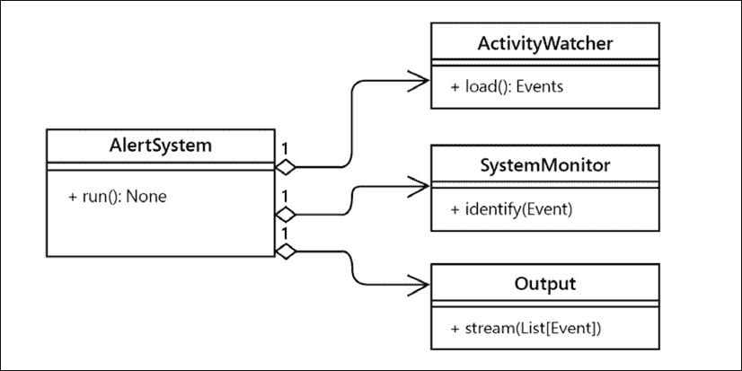
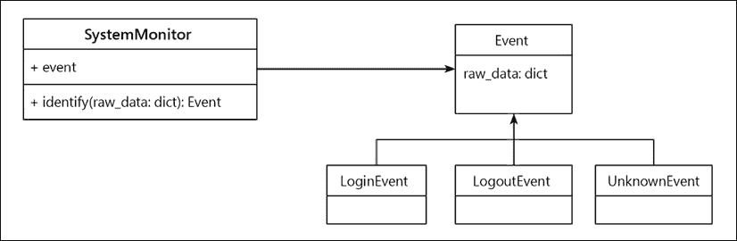
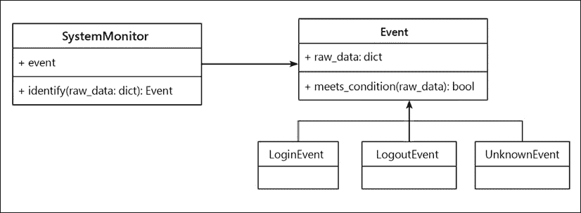
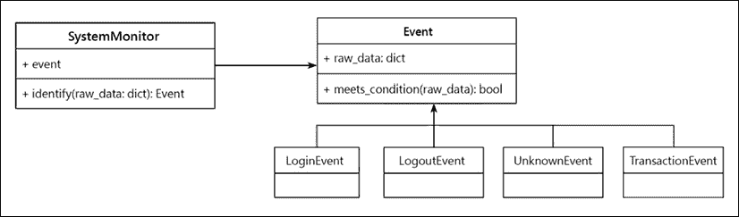
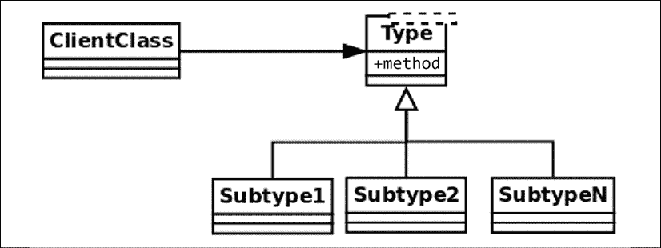
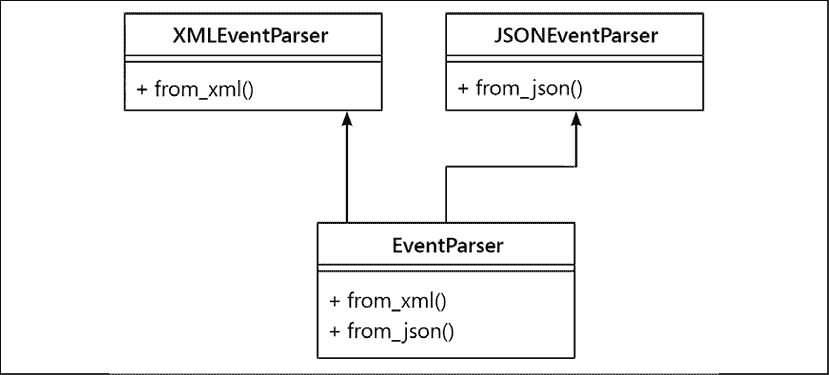
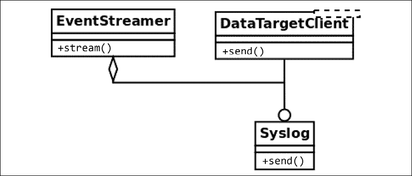

# 4

# SOLID 原则

在本章中，我们将继续探讨应用于 Python 的清洁设计概念。特别是，我们将回顾**SOLID**原则以及如何在 Python 中以 Pythonic 的方式实现它们。这些原则包含一系列良好的实践，以实现更高质量的软件。如果有些人不知道 SOLID 代表什么，这里就是：

+   **S**: 单一职责原则

+   **O**: 开放/封闭原则

+   **L**: Liskov 替换原则

+   **I**: 接口隔离原则

+   **D**: 依赖倒置原则

本章的目标如下：

+   了解软件设计的 SOLID 原则

+   设计遵循单一职责原则的软件组件

+   通过开放/封闭原则实现更易于维护的代码

+   通过遵守 Liskov 替换原则在面向对象设计中实现适当的类层次结构

+   通过接口隔离和依赖倒置进行设计

# 单一职责原则

**单一职责原则**（**SRP**）指出，软件组件（通常，一个类）必须只有一个职责。类只有一个职责的事实意味着它只负责做一件具体的事情，因此我们可以得出结论，它必须只有一个改变的理由。

只有当领域问题中的某个事物发生变化时，类才需要更新。如果我们必须因为不同原因对类进行修改，这意味着抽象是不正确的，并且该类有太多的职责。这可能是至少缺少一个抽象的迹象：需要创建更多的对象来处理当前类所承受的额外职责。

如在第二章*Pythonic 代码*中所述，这个设计原则帮助我们构建更内聚的抽象——只做一件事，并且做得很好，遵循 Unix 哲学。我们希望避免所有情况下都有多个职责的对象（通常称为**上帝对象**，因为它们知道太多，或者比应该知道的还多）。这些对象组合了不同的（大多数是无关的）行为，这使得它们更难维护。

再次强调，类越小越好。

SRP 与软件设计中的内聚性概念密切相关，我们已经在*第三章*，*良好代码的一般特性*中探讨了软件的关注点分离。我们在这里努力实现的是，类的设计方式使得它们的大部分属性和属性通常由其方法使用。当这种情况发生时，我们知道它们是相关概念，因此将它们归入同一抽象之下是有意义的。

从某种意义上说，这个想法与关系数据库设计中的规范化概念有些类似。当我们检测到对象的属性或方法接口上有分区时，它们可能最好被移动到其他地方——这是它们被混合成一个的多个不同抽象的迹象。

有另一种看待这个原则的方法。如果我们查看一个类时发现方法相互排斥且彼此不相关，那么它们就是需要分解成更小类的不同职责。

## 职责过多的类

在这个例子中，我们将为负责从源（这可能是日志文件、数据库或许多其他源）读取事件信息的应用程序创建一个案例，并确定每个特定日志对应的行为。

一个未能符合 SRP（单一职责原则）的设计可能看起来像这样：


图 4.1：职责过多的类

不考虑实现，类的代码可能看起来如下所示：

```py
# srp_1.py
class SystemMonitor:
    def load_activity(self):
        """Get the events from a source, to be processed."""
    def identify_events(self):
        """Parse the source raw data into events (domain objects)."""
    def stream_events(self):
        """Send the parsed events to an external agent.""" 
```

这个类的问题在于它定义了一个接口，其中包含一组对应于正交操作的方法：每个操作都可以独立于其他操作完成。

这种设计缺陷使类变得僵化、不灵活且易于出错，因为它难以维护。在这个例子中，每个方法代表类的职责。每个职责都包含一个可能需要修改类的原因。在这种情况下，每个方法代表类需要修改的多种原因之一。

考虑加载方法，它从特定的源检索信息。无论这是如何完成的（我们在这里可以抽象实现细节），它将有自己的步骤序列，例如，连接到数据源、加载数据、将其解析成期望的格式等。如果我们需要更改某些内容（例如，我们想要更改用于存储数据的结构），`SystemMonitor`类将需要更改。问问自己这是否有意义。系统监控对象是否必须因为改变了数据的表示而改变？不是。

同样的推理也适用于其他两个方法。如果我们更改事件指纹的方法，或者将它们传递给另一个数据源的方式，我们最终会对同一个类进行更改。

到现在为止，应该很清楚这个类相当脆弱，且不易维护。有很多不同的原因会影响这个类的变更。相反，我们希望外部因素尽可能少地影响我们的代码。解决方案，再次强调，是创建更小、更紧密的抽象。

## 分配职责

为了使解决方案更易于维护，我们将每个方法分离到不同的类中。这样，每个类将只有一个职责：



图 4.2：在类之间分配职责

通过使用与这些新类的实例交互的对象，使用这些对象作为协作者，实现了相同的行为，但理念仍然是每个类封装了一组独立于其他类的特定方法。现在的想法是，对任何这些类的更改都不会影响其他类，并且它们都具有清晰和具体的意义。如果我们需要更改从数据源加载数据的方式，警报系统甚至都不会意识到这些更改，所以我们不需要在系统监控器上做任何修改（只要合同仍然保持不变），数据目标也没有被修改。

现在的变化是局部的，影响最小，每个类都更容易维护。

新的类定义了不仅更易于维护而且可重用的接口。想象一下，现在在应用程序的另一个部分，我们也需要从日志中读取活动，但出于不同的目的。在这个设计中，我们可以简单地使用`ActivityWatcher`类型的对象（实际上这将是一个接口，但为了本节的目的，这个细节并不重要，将在下一个原则中解释）。这将是合理的，而在之前的设计中则不会，因为尝试重用我们定义的唯一类也会携带一些额外的方法（如`identify_events()`或`stream_events()`），而这些方法根本不需要。

一个重要的澄清是，这个原则根本不意味着每个类都必须有一个单独的方法。任何新的类都可能有多余的方法，只要它们对应于该类负责处理相同的逻辑。

在本章中，我们探索的大多数（如果不是所有）原则的一个有趣观察是，我们不应该试图从一开始的设计就使其完全正确。想法是设计出易于扩展和更改的软件，并且能够向更稳定的版本进化。

尤其是你可以将 SRP（单一职责原则）作为一个思考过程。例如，如果你正在设计一个组件（比如说一个类），并且有很多不同的事情需要完成（就像之前的例子那样），从一开始你就可以预见到这不会有一个好的结果，你需要分离职责。这是一个好的开始，但接下来问题是：如何正确地划分职责的边界？为了理解这一点，你可以从编写一个单体类开始，以便理解内部协作以及职责是如何分配的。这将帮助你更清晰地了解需要创建的新抽象。

# 开放/封闭原则

**开放/封闭原则**（OCP）表明，一个模块应该是开放的和封闭的（但针对不同的方面）。

例如，在设计一个类时，我们应该仔细封装实现细节，以便它具有良好的可维护性，这意味着我们希望它易于扩展但不易修改。

简单来说，这意味着我们当然希望我们的代码是可扩展的，以适应新的需求或领域问题的变化。这意味着当领域问题中出现新事物时，我们只想向我们的模型中添加新事物，而不是改变任何现有的、不易修改的部分。

如果因为某种原因，当我们需要添加新事物时，发现自己需要修改代码，那么这个逻辑可能设计得不好。理想情况下，当需求变化时，我们只想通过扩展模块来添加新的行为，而不需要显著改变当前的逻辑。

这个原则适用于多个软件抽象。这可能是一个类，甚至是一个模块，但我们讨论的想法是相同的。在接下来的两个小节中，我们将看到每个的示例。

## 不遵循 OCP 原则的可维护性风险示例

让我们从这样一个系统的例子开始，这个系统设计得并不遵循 OCP 原则，以便看到它带来的可维护性问题以及这种设计的僵化性。

想法是这样的：我们有一个系统的一部分，负责识别在另一个被监控的系统发生的事件。在每一个点上，我们希望这个组件能够根据之前收集到的数据值（为了简单起见，我们假设它被包装到一个字典中，并且之前通过日志、查询等多种方式检索到）正确地识别事件类型。我们有一个基于这些数据的类，它将检索事件，这是一个具有自己层次结构的新类型。

从*图 4.3*的类图中，我们看到一个与接口（一个基类，有多个可以多态使用的子类）一起工作的对象：



图 4.3：一个不封闭修改的设计

初看这似乎像是一个可扩展的设计：添加一个新事件大概就是创建一个新的`Event`子类，然后系统监控器应该能够处理它们。然而，这并不完全准确，因为这完全取决于系统监控器类中使用的方法的实际实现。

解决这个问题的第一次尝试可能看起来像这样：

```py
# openclosed_1.py
@dataclass
class Event:
    raw_data: dict 
class UnknownEvent(Event):
    """A type of event that cannot be identified from its data."""
class LoginEvent(Event):
    """A event representing a user that has just entered the system."""
class LogoutEvent(Event):
    """An event representing a user that has just left the system."""
class SystemMonitor:
    """Identify events that occurred in the system."""
    def __init__(self, event_data):
        self.event_data = event_data
    def identify_event(self):
        if (
            self.event_data["before"]["session"] == 0
            and self.event_data["after"]["session"] == 1
        ):
            return LoginEvent(self.event_data)
        elif (
            self.event_data["before"]["session"] == 1
            and self.event_data["after"]["session"] == 0
        ):
            return LogoutEvent(self.event_data)
        return UnknownEvent(self.event_data) 
```

以下是对前面代码预期行为的描述：

```py
>>> l1 = SystemMonitor({"before": {"session": 0}, "after": {"session": 1}})
>>> l1.identify_event().__class__.__name__
'LoginEvent'
>>> l2 = SystemMonitor({"before": {"session": 1}, "after": {"session": 0}})
>>> l2.identify_event().__class__.__name__
'LogoutEvent'
>>> l3 = SystemMonitor({"before": {"session": 1}, "after": {"session": 1}})
>>> l3.identify_event().__class__.__name__
'UnknownEvent' 
```

注意事件类型的层次结构以及一些构建它们的业务逻辑。例如，当会话没有之前的标志，但现在有标志时，我们将其识别为登录事件。相反，当情况相反时，这意味着它是注销事件。如果无法识别事件，则返回未知类型的事件。这是通过遵循`null`对象模式来保持多态性的（而不是返回`None`，它检索具有一些默认逻辑的相应类型的对象）。`null`对象模式在*第九章*，*常见设计模式*中描述。

此设计存在一些问题。第一个问题是确定事件类型的逻辑集中在一个单体方法中。随着我们想要支持的事件数量的增加，此方法也将增加，最终可能成为一个非常长的方法，这是不好的，因为我们已经讨论过，它将不会只做一件事并且做得很好。

同样，我们可以看到此方法不是对修改封闭的。每次我们想要向系统中添加新类型的事件时，我们都需要更改此方法中的某些内容（更不用说`elif`语句链将是一个噩梦般的阅读体验了！）。

我们希望能够在不改变此方法的情况下添加新类型的事件（对修改封闭）。我们还希望能够支持新类型的事件（对扩展开放），这样当添加新事件时，我们只需要添加代码，而不需要更改现有的代码。

## 重新设计事件系统以实现可扩展性

之前示例的问题在于`SystemMonitor`类直接与它将要检索的具体类进行交互。

为了实现一个符合开放/封闭原则的设计，我们必须面向抽象进行设计。

一种可能的替代方案是将此类视为它与事件协作，然后我们将每个特定类型事件的逻辑委托给其对应的类：



图 4.4：遵循 OCP 的设计

然后，我们必须为每种事件类型添加一个新的（多态的）方法，该方法的单一职责是确定它是否对应于传递的数据，并且我们还需要更改逻辑以遍历所有事件，找到正确的一个。

新代码应该看起来像这样：

```py
# openclosed_2.py
class Event:
    def __init__(self, raw_data):
        self.raw_data = raw_data
    @staticmethod
    def meets_condition(event_data: dict) -> bool:
        return False
class UnknownEvent(Event):
    """A type of event that cannot be identified from its data"""
class LoginEvent(Event):
    @staticmethod
    def meets_condition(event_data: dict):
        return (
            event_data["before"]["session"] == 0
            and event_data["after"]["session"] == 1
        )
class LogoutEvent(Event):
    @staticmethod
    def meets_condition(event_data: dict):
        return (
            event_data["before"]["session"] == 1
            and event_data["after"]["session"] == 0
        )
class SystemMonitor:
    """Identify events that occurred in the system."""
    def __init__(self, event_data):
        self.event_data = event_data
    def identify_event(self):
        for event_cls in Event.__subclasses__():
            try:
                if event_cls.meets_condition(self.event_data):
                    return event_cls(self.event_data)
            except KeyError:
                continue
        return UnknownEvent(self.event_data) 
```

注意现在交互是如何面向抽象的（在这种情况下，将是通用的基类`Event`，它甚至可能是一个抽象基类或接口，但为了本例的目的，有一个具体的基类就足够了）。该方法不再与特定类型的事件一起工作，而是与遵循通用接口的通用事件一起工作——它们在`meets_condition`方法上都是多态的。

注意事件是如何通过 `__subclasses__()` 方法被发现的。支持新类型的事件现在只需要为该事件创建一个新的类，这个类必须扩展 `Event` 并实现它自己的 `meets_condition()` 方法，根据其特定的标准。

这个例子依赖于 `__subclasses__()` 方法，因为它足以说明可扩展设计的理念。也可以使用其他替代方案，例如使用 `abc` 模块注册类，或者创建我们自己的注册表，但主要思想是相同的，对象之间的关系不会改变。

在这个设计中，原始的 `identify_event` 方法是封闭的：当我们向我们的领域添加新类型的事件时，它不需要被修改。相反，事件层次结构对新类型的扩展是开放的：当领域中出现新事件时，我们只需要创建一个新的实体，并定义其根据接口实现的准则。

## 扩展事件系统

现在，让我们证明这个设计实际上是我们想要的那么可扩展。想象一下，出现了一个新的需求，我们还需要支持用户在监控系统中执行的事务对应的事件。

设计的类图必须包括这个新的事件类型，如图 *4.5* 所示：

图 4.5：设计扩展

我们创建新的类，在它的 `meets_condition` 方法上实现准则，其余的逻辑应该继续按之前的方式工作（包括新的行为）。

假设之前的所有定义都没有改变，以下是新类的代码：

```py
# openclosed_3.py
class TransactionEvent(Event):
    """Represents a transaction that has just occurred on the system."""
    @staticmethod
    def meets_condition(event_data: dict):
        return event_data["after"].get("transaction") is not None 
```

我们可以验证之前的案例仍然按预期工作，并且新的事件也被正确识别：

```py
>>> l1 = SystemMonitor({"before": {"session": 0}, "after": {"session": 1}})
>>> l1.identify_event().__class__.__name__
'LoginEvent'
>>> l2 = SystemMonitor({"before": {"session": 1}, "after": {"session": 0}})
>>> l2.identify_event().__class__.__name__
'LogoutEvent'
>>> l3 = SystemMonitor({"before": {"session": 1}, "after": {"session": 1}})
>>> l3.identify_event().__class__.__name__
'UnknownEvent'
>>> l4 = SystemMonitor({"after": {"transaction": "Tx001"}})
>>> l4.identify_event().__class__.__name__
'TransactionEvent' 
```

注意到当我们添加新的事件类型时，`SystemMonitor.identify_event()` 方法完全没有改变。因此，我们说这个方法对新类型的事件是封闭的。

相反，当需要添加新类型的事件时，`Event` 类允许我们这样做。因此，我们说事件对新类型的扩展是开放的。

这是这个原则的真正本质——当领域问题中出现新事物时，我们只想添加新代码，而不是修改任何现有代码。

## 关于 OCP 的最后思考

如您可能已经注意到的，这个原则与多态的有效使用密切相关。我们希望致力于设计遵守多态契约的抽象，该契约客户端可以使用，以一个足够通用的结构，只要保持多态关系，扩展模型就是可能的。

这个原则解决了一个重要的软件工程问题：可维护性。不遵循 OCP 的危险是连锁反应和软件中的问题，其中单个更改会触发整个代码库中的更改，或者有破坏代码其他部分的风险。

最后，一个重要的注意事项是，为了实现这种设计，我们不需要更改代码来扩展行为，我们需要能够创建适当的封闭来保护我们想要保护的抽象（在这个例子中，是新的事件类型）。在所有程序中，这并不总是可能的，因为一些抽象可能会冲突（例如，我们可能有一个提供对要求封闭的正确抽象，但不适用于其他类型的要求）。在这些情况下，我们需要有选择性，并应用一种策略，为需要最可扩展的类型提供最佳的封闭。

# Liskov 替换原则

**Liskov 替换原则**（**LSP**）表明，一个对象类型必须保持一系列属性以保持其设计的可靠性。

LSP 背后的主要思想是，对于任何类，客户端都应该能够无差别地使用其任何子类型，甚至没有注意到，因此不会在运行时破坏预期的行为。这意味着客户端完全隔离并且对类层次结构的变化一无所知。

更正式地说，这是 LSP 的原始定义（LISKOV 01）：如果*S*是*T*的子类型，那么*T*类型的对象可以被*S*类型的对象替换，而不会破坏程序。

这可以通过以下通用图表来理解。想象有一个客户端类需要（包含）另一个类型的对象。一般来说，我们希望这个客户端与某些类型的对象交互，也就是说，它将通过接口工作。

现在，这个类型可能只是一个通用的接口定义，一个抽象类或一个接口，而不是具有行为本身的类。可能有几个子类扩展这个类型（如*图 4.6*中名为`Subtype`的描述，直到`N`）。这个原则背后的思想是，如果层次结构实现正确，客户端类必须能够与任何子类的实例一起工作，甚至没有注意到。这些对象应该是可互换的，如*图 4.6*所示：



图 4.6：一个通用的子类型层次结构

这与其他我们已经探讨过的设计原则相关，如面向接口的设计。一个好的类必须定义一个清晰简洁的接口，只要子类遵守这个接口，程序就会保持正确。

由于这个原因，这个原则也与设计合同背后的思想相关。给定类型和客户端之间存在一个合同。通过遵循 LSP 的规则，设计将确保子类尊重由父类定义的合同。

## 使用工具检测 LSP 问题

有些场景与 LSP 的关系非常明显是错误的，以至于我们可以通过我们在*第一章*，“介绍、代码格式化和工具”中学习到的工具轻松识别（主要是`mypy`和`pylint`）。

### 使用 mypy 检测不正确的方法签名

通过使用类型注解（如之前在*第一章*，*介绍、代码格式化和工具*中推荐的那样），并在整个代码中配置`mypy`，我们可以快速检测到一些基本错误，并免费检查对 LSP 的基本合规性。

如果`Event`类的某个子类以不兼容的方式覆盖了一个方法，`mypy`将通过检查注解来注意到这一点：

```py
class Event:
    ...
    def meets_condition(self, event_data: dict) -> bool:
        return False
class LoginEvent(Event):
    def meets_condition(self, event_data: list) -> bool:
        return bool(event_data) 
```

当我们在该文件上运行`mypy`时，我们将得到一个错误消息，如下所示：

```py
error: Argument 1 of "meets_condition" incompatible with supertype "Event" 
```

对 LSP 的违反是明显的——因为派生类为`event_data`参数使用了一个与基类定义不同的类型，我们无法期望它们能够同等工作。记住，根据这个原则，任何调用这个层次结构的调用者都必须能够透明地与`Event`或`LoginEvent`一起工作，而不会注意到任何差异。交换这两种类型的对象不应该使应用程序失败。未能做到这一点将破坏层次结构上的多态性。

如果将返回类型更改为除布尔值`Boolean`以外的其他类型，同样会出现相同的错误。其理由是，使用此代码的客户端期望得到一个`Boolean`值来工作。如果其中一个派生类更改了此返回类型，这将破坏契约，再次，我们无法期望程序能正常工作。

关于不同但共享公共接口的类型的一个快速说明：尽管这只是一个简单的示例来展示错误，但确实，字典和列表都有一些共同点；它们都是可迭代的。这意味着在某些情况下，可能有一个期望接收字典的方法和另一个期望接收列表的方法是有效的，只要两者都通过迭代器接口处理参数。在这种情况下，问题不在于逻辑本身（LSP 可能仍然适用），而在于签名类型的定义，它应该读取既不是`list`也不是`dict`，而是两者的联合。无论哪种情况，都必须进行修改，无论是方法的代码、整个设计还是类型注解，但无论如何都不应该忽略由`mypy`给出的警告和错误。

不要通过使用`# type: ignore`或类似的方式来忽略此类错误。重构或更改代码以解决真正的问题。工具正在报告一个实际的设计缺陷，这是有充分理由的。

这个原则从面向对象设计的角度来看也是合理的。记住，子类化应该创建更具体的类型，但每个子类都必须是父类声明的。以上一节中的例子为例，系统监控器希望能够与任何事件类型交互使用。但每个这些事件类型都是一个事件（一个`LoginEvent`必须是一个`Event`，其他子类也是如此）。如果这些对象中的任何一个通过没有实现基类`Event`的消息、实现这个类中没有声明的另一个公共方法或更改方法的签名来破坏层次结构，那么`identify_event`方法可能就不再起作用。

### 使用`pylint`检测不兼容的签名

LSP 的另一个强烈违反情况是，当不是通过改变层次结构中参数的类型，而是方法签名完全不同时。这看起来可能相当明显，但检测它可能并不总是那么容易记住；Python 是解释型语言，所以没有编译器在早期检测这些类型的错误，因此它们直到运行时才会被发现。幸运的是，我们有像`mypy`和`pylint`这样的静态代码分析器来早期捕获这类错误。

虽然`mypy`也会捕获这些类型的错误，但运行`pylint`以获得更多见解是个好主意。

在存在破坏层次结构兼容性的类（例如，通过更改方法的签名、添加额外的参数等）的情况下，如下所示：

```py
# lsp_1.py
class LogoutEvent(Event):
    def meets_condition(self, event_data: dict, override: bool) -> bool:
        if override:
            return True
        ... 
```

`pylint`会检测到它，并打印出有信息的错误：

```py
Parameters differ from overridden 'meets_condition' method (arguments-differ) 
```

再次强调，就像在先前的案例中一样，不要抑制这些错误。注意工具给出的警告和错误，并相应地调整代码。

## LSP 违规的更微妙情况

然而，在其他情况下，LSP 被破坏的方式并不那么清晰或明显，以至于工具可以自动为我们识别它，我们必须在代码审查时依靠仔细的代码检查。

合约被修改的情况尤其难以自动检测。鉴于 LSP 的整个想法是子类可以被客户像父类一样使用，这也必须意味着合约在层次结构中得到了正确保留。

记住来自**第三章**，**良好代码的一般特性**，在设计合约时，客户和供应商之间的合约设定了一些规则——客户必须向方法提供前置条件，供应商可能会验证这些条件，并返回一些结果给客户，客户将以后置条件的形式进行检查。

父类定义了一个与客户的合约。这个父类的子类必须遵守这样的合约。这意味着例如：

+   子类永远不能使前置条件比在父类中定义的更严格

+   子类永远不能使后置条件比在父类中定义的更弱

考虑到上一节中定义的事件层次结构示例，但现在有一个变化来展示 LSP 和 DbC 之间的关系。

这次，我们将假设一个基于数据检查标准的方法的先决条件，即提供的参数必须是一个包含 `"before"` 和 `"after"` 两个键的字典，并且它们的值也是嵌套字典。这允许我们进一步封装，因为现在客户端不需要捕获 `KeyError` 异常，而是只需调用先决条件方法（假设如果系统在错误的假设下运行，失败是可以接受的）。

作为旁注，我们能够从客户端移除这部分内容是好事，因为现在 `SystemMonitor` 不需要知道协作类的方法可能会抛出哪些类型的异常（记住，异常会削弱封装性，因为它们要求调用者了解关于被调用对象的一些额外信息）。

这样的设计可以通过以下代码中的以下更改来表示：

```py
# lsp_2.py
from collections.abc import Mapping

class Event:
    def __init__(self, raw_data):
        self.raw_data = raw_data

    @staticmethod
    def meets_condition(event_data: dict) -> bool:
        return False

    @staticmethod
    def validate_precondition(event_data: dict):
        """Precondition of the contract of this interface.

        Validate that the ``event_data`` parameter is properly formed.
        """
        if not isinstance(event_data, Mapping):
            raise ValueError(f"{event_data!r} is not a dict")
        for moment in ("before", "after"):
            if moment not in event_data:
                raise ValueError(f"{moment} not in {event_data}")
            if not isinstance(event_data[moment], Mapping):
                raise ValueError(f"event_data[{moment!r}] is not a dict") 
```

现在尝试检测正确事件类型的代码只是检查一次先决条件，然后继续寻找正确的事件类型：

```py
# lsp_2.py
class SystemMonitor:
    """Identify events that occurred in the system."""
    def __init__(self, event_data):
        self.event_data = event_data
    def identify_event(self):
        Event.validate_precondition(self.event_data)
        event_cls = next(
            (
                event_cls
                for event_cls in Event.__subclasses__()
                if event_cls.meets_condition(self.event_data)
            ),
            UnknownEvent,
        )
        return event_cls(self.event_data) 
```

合同仅声明顶级键 `"before"` 和 `"after"` 是必需的，并且它们的值也应该是字典。任何在子类中尝试要求更严格参数的尝试都将失败。

事务事件的类最初设计得正确。看看代码是如何不对内部键 `"transaction"` 施加限制的；它只有在存在时才使用其值，但这不是必需的：

```py
# lsp_2.py
class TransactionEvent(Event):
    """Represents a transaction that has just occurred on the system."""
    @staticmethod
    def meets_condition(event_data: dict) -> bool:
        return event_data["after"].get("transaction") is not None 
```

然而，原始的两个方法是不正确的，因为它们要求存在一个名为 `"session"` 的键，而这个键不是原始合同的一部分。这违反了合同，现在客户端不能像使用其他类一样使用这些类，因为它将引发 `KeyError`。

在修复了这个问题（将 `.get()` 方法的方括号更改为正确形式）之后，LSP 上的顺序已经重新建立，多态性占主导地位：

```py
>>> l1 = SystemMonitor({"before": {"session": 0}, "after": {"session": 1}})
>>> l1.identify_event().__class__.__name__
'LoginEvent'
>>> l2 = SystemMonitor({"before": {"session": 1}, "after": {"session": 0}})
>>> l2.identify_event().__class__.__name__
'LogoutEvent'
>>> l3 = SystemMonitor({"before": {"session": 1}, "after": {"session": 1}})
>>> l3.identify_event().__class__.__name__'UnknownEvent'
>>> l4 = SystemMonitor({"before": {}, "after": {"transaction": "Tx001"}})
>>> l4.identify_event().__class__.__name__
'TransactionEvent' 
```

期望自动化工具（无论它们多么好和有帮助）检测此类情况是不合理的。在设计类时，我们必须小心，不要意外地更改方法输入或输出，使其与客户端最初期望的不兼容。

## 关于 LSP 的备注

LSP 对于良好的面向对象软件设计至关重要，因为它强调了其核心特性之一——多态性。它关乎创建正确的层次结构，使得从基类派生的类在父类中具有多态性，相对于它们接口上的方法。

也很有趣地注意到这个原则如何与先前的原则相关联——如果我们尝试用一个与之不兼容的新类扩展一个类，它将失败，与客户端的合同将被破坏，因此这样的扩展将不可能实现（或者，为了使其可能，我们不得不打破原则的另一端，并修改客户端应该关闭修改的代码，这是完全不可接受和不接受的）。

按照 LSP 建议的方式仔细思考新的类，有助于我们正确地扩展层次结构。然后我们可以说 LSP 有助于 OCP。

# 接口分离

**接口分离原则**（**ISP**）为我们已经反复思考过的一个观点提供了一些指导：即接口应该是小的。

在面向对象术语中，一个**接口**由对象公开的方法和属性集表示。也就是说，一个对象能够接收或解释的所有消息构成了它的接口，这也是其他客户端可以请求的。接口将类的公开行为定义与其实现分离。

在 Python 中，接口根据其方法隐式地由一个类定义。这是因为 Python 遵循所谓的**鸭子类型**原则。

传统上，鸭子类型背后的想法是，任何对象实际上都由它拥有的方法和它能够做什么来表示。这意味着，无论类的类型、名称、文档字符串、类属性还是实例属性如何，最终定义对象本质的是它拥有的方法。在类中定义的方法（它知道如何做）决定了那个对象将是什么。它被称为鸭子类型，因为有一个想法：“如果它像鸭子走路，像鸭子嘎嘎叫，那么它一定是一只鸭子。”

很长一段时间里，鸭子类型是 Python 中定义接口的唯一方式。后来，PEP-3119 引入了抽象基类的概念，作为以不同方式定义接口的方法。抽象基类的基本思想是，它们定义了一个基本行为或接口，一些派生类负责实现。这在我们要确保某些关键方法实际上被重写的情况下很有用，它也作为重写或扩展如`isinstance()`等方法功能的一种机制。

引入抽象基类是为了为开发者提供一个有用的强大工具，以指示必须实际实现的事情。例如，考虑到之前提出的原理（LSP），如果我们有一个通用的 `Event` 类，我们不希望直接使用这个类（因为它本身并没有什么意义），所以我们可能想处理实际的事件之一（例如 `LoginEvent` 这样的子类）。在这种情况下，我们可以将 `Event` 定义为一个抽象基类，以使这一点明确。然后系统监控器与事件类型一起工作，而 `Event` 类则充当接口（作为一种表示“任何具有这种行为的对象”）的方式。我们可以更进一步，并决定 `meets_condition` 方法的默认实现不够（或者有时，接口无法提供实现），并强制每个派生类实现它。为此，我们将使用 `@abstractmethod` 装饰器。

`abc` 模块还包含一种将某些类型注册为层次结构一部分的方法，这被称为虚拟子类。这个想法是通过添加一个新的标准——像鸭子一样走路，像鸭子一样嘎嘎叫，或者……它说它是鸭子，来进一步扩展鸭子类型的概念。

这些关于 Python 如何解释接口的概念对于理解这个原则和下一个原则非常重要。

抽象地说，ISP 声明，当我们定义一个提供多个方法的接口时，最好是将其分解成多个接口，每个接口包含较少的方法（最好是只有一个），具有非常具体和准确的范围。通过将接口分解成尽可能小的单元，以促进代码重用，每个想要实现这些接口的类很可能具有高度的内聚性，因为它们具有相当明确的行为和责任集。

## 提供过多功能的界面

现在，我们希望能够从多个数据源中解析事件，这些数据源有不同的格式（例如 XML 和 JSON）。遵循良好的实践，我们决定将接口作为我们的依赖项，而不是一个具体的类，并设计出如下内容：


图 4.7：提供过多不相关功能的接口

为了在 Python 中创建这个接口，我们将使用抽象基类，并将方法（`from_xml()` 和 `from_json()`）定义为抽象的，以强制派生类实现它们。从这个抽象基类派生并实现这些方法的实体将能够与它们对应类型一起工作。

但是，如果某个特定的类不需要 XML 方法，而只能从 JSON 中构建呢？它仍然会携带接口中的 `from_xml()` 方法，由于它不需要它，它将不得不跳过。这并不灵活，因为它创建了耦合，并迫使接口的客户端使用他们不需要的方法。

## 接口越小越好

将其分为两个不同的接口，每个方法一个接口会更好。我们仍然可以通过让我们的事件解析器类实现这两个接口来达到相同的功能（因为接口或抽象基类只是具有一些增强约束的常规类，Python 支持多重继承）。现在的不同之处在于，我们可以在更具体的接口中声明每个方法，如果我们需要在代码的其他地方重用它：



图 4.8：通过单独的接口实现相同的功能

在这种设计中，从`XMLEventParser`派生并实现`from_xml()`方法的对象将知道如何从 XML 构建，对于 JSON 文件也是如此，但最重要的是，我们保持了两个独立函数的正交性，并保留了系统的灵活性，而没有失去任何可以通过组合新的较小对象实现的功能。

这就是代码可能看起来像代表*图 4.8*的方式：

```py
from abc import ABCMeta, abstractmethod
class XMLEventParser(metaclass=ABCMeta):
    @abstractmethod
    def from_xml(xml_data: str):
        """Parse an event from a source in XML representation."""

class JSONEventParser(metaclass=ABCMeta):
    @abstractmethod
    def from_json(json_data: str):
        """Parse an event from a source in JSON format."""

class EventParser(XMLEventParser, JSONEventParser):
    """An event parser that can create an event from source data either in XML or JSON format.
    """

    def from_xml(xml_data):
        pass

    def from_json(json_data: str):
        pass 
```

注意，接口所需的抽象方法必须在具体类中实现（尽管实际实现对于本例来说并不相关）。如果我们不实现它们，就会触发运行时错误，例如：

```py
>>> from src.isp import EventParser
>>> EventParser()
Traceback (most recent call last):
  File "<stdin>", line 1, in <module>
TypeError: Can't instantiate abstract class EventParser with abstract methods from_json, from_xml 
```

这与 SRP（单一责任原则）有些相似，但主要区别在于这里我们谈论的是接口，因此这是一个行为的抽象定义。没有理由改变，因为直到接口实际实现之前，那里什么都没有。然而，未能遵守这一原则将创建一个与正交功能耦合的接口，并且这个派生类也将未能遵守 SRP（它将有多于一个的理由去改变）。

## 接口应该有多小？

上一节中提到的观点是有效的，但同时也需要警告——如果被误解或走向极端，会是一条危险的道路。

基类（抽象或不抽象）为所有其他类定义了一个扩展它的接口。这个接口应该尽可能小，这一点必须从内聚性的角度来理解——它应该做一件事。这并不意味着它必须必然只有一个方法。在先前的例子中，两个方法都是做不相关的事情，因此将它们分开到不同的类中是有意义的。

但也可能存在多个方法合理地属于同一个类。想象一下，你想要提供一个混合类，该类抽象了上下文管理器中的某些逻辑，以便所有从该混合类派生的类都能免费获得上下文管理器逻辑。正如我们已经知道的，上下文管理器涉及两个方法：`__enter__`和`__exit__`。它们必须一起使用，否则结果将根本不是一个有效的上下文管理器！

如果没有将这两种方法放在同一个类中，会导致一个损坏的组件，不仅无用，而且危险。希望这个夸张的例子可以作为前一个章节中例子的平衡，这样你们可以更准确地了解设计接口。

# 依赖倒置

这是一个非常强大的想法，我们将在第九章“常见设计模式”和第十章“整洁架构”中再次探讨一些设计模式时再次提到。

**依赖倒置原则**（**DIP**）通过提出一种有趣的设计原则，通过使我们的代码独立于脆弱、易变或不受我们控制的事物来保护我们的代码。依赖倒置的想法是，我们的代码不应该适应细节或具体实现，而应该是相反的：我们希望强制任何实现或细节通过某种 API 来适应我们的代码。

抽象必须以这种方式组织，它们不依赖于细节，而应该是相反的——细节（具体实现）应该依赖于抽象。

假设我们的设计中需要两个对象协作，*A* 和 *B*。*A* 与 *B* 的一个实例一起工作，但结果是我们的模块并没有直接控制 *B*（它可能是一个外部库，或者由另一个团队维护的模块等）。如果我们的代码高度依赖于 *B*，当 *B* 发生变化时，代码就会崩溃。为了防止这种情况，我们必须倒置依赖：让 *B* 适应 *A*。这是通过提供一个接口并强制我们的代码不依赖于 *B* 的具体实现，而是依赖于我们定义的接口来实现的。然后，*B* 就有责任遵守该接口。

与前几节中探讨的概念一致，抽象也可以以接口（或 Python 中的抽象基类）的形式出现。

通常，我们预计具体实现比抽象组件变化得更频繁。正因为如此，我们将抽象（接口）放在我们期望系统变化、修改或扩展的地方，而无需改变抽象本身。

## 严格依赖的案例

我们事件监控系统最后一部分的任务是将识别出的事件发送到数据收集器进行进一步分析。这种想法的一个简单实现可能包括一个事件流类与数据目的地交互，例如，`Syslog`：


图 4.9：一个对另一个有强依赖的类

然而，这种设计并不很好，因为我们有一个高级类（`EventStreamer`）依赖于一个低级类（`Syslog`是一个实现细节）。如果我们想要以我们想要的方式向`Syslog`发送数据的方式发生变化，`EventStreamer`将需要被修改。如果我们想在运行时更改数据目标或添加新的目标，我们也会遇到麻烦，因为我们将发现自己需要不断修改`stream()`方法以适应这些要求。

## 反转依赖关系

解决这些问题的方法是让`EventStreamer`与一个接口而不是一个具体类一起工作。这样，实现这个接口的责任就交给了包含实现细节的低级类：



图 4.10：通过反转依赖关系重构的功能。

现在有一个表示通用数据目标的界面，数据将发送到这个目标。注意，由于`EventStreamer`不依赖于特定数据目标的实现，因此它的依赖关系已经反转，它不需要随着这个目标的改变而改变，并且每个特定的数据目标都必须正确实现接口并在必要时适应变化。

换句话说，第一个实现中的原始`EventStreamer`只与`Syslog`类型的对象一起工作，这并不灵活。然后我们意识到它可以与任何可以响应`.send()`消息的对象一起工作，并确定这个方法是需要遵守的接口。现在，在这个版本中，`Syslog`实际上扩展了名为`DataTargetClient`的抽象基类，该类定义了`send()`方法。从现在起，每个新的数据目标类型（例如电子邮件）都必须扩展这个抽象基类并实现`send()`方法。

我们甚至可以在运行时修改这个属性，对于任何实现了`send()`方法的其它对象，它仍然可以正常工作。这就是为什么它通常被称为**依赖注入**：因为依赖关系可以动态提供（注入）。

聪明的读者可能会想知道为什么这是必要的。Python 足够灵活（有时过于灵活），它允许我们向`EventStreamer`对象提供任何特定的数据目标对象，而无需这个对象遵守任何接口，因为它具有动态类型。问题是这样的：当我们可以直接传递一个具有`send()`方法的对象时，为什么我们还需要定义抽象基类（接口）呢？

公平地说，这是真的；实际上没有必要这样做，程序将正常工作。毕竟，多态并不意味着（或要求）继承必须工作。然而，定义抽象基类是一种良好的实践，它带来了一些优势，首先是鸭子类型。与鸭子类型一起，我们可以提到模型变得更加可读——记住，继承遵循“是”的规则，因此通过声明抽象基类并从它扩展，我们是在说，例如，`Syslog`是`DataTargetClient`，这是你的代码的用户可以阅读和理解的东西（再次强调，这是鸭子类型）。

总的来说，定义抽象基类并不是强制性的，但为了实现更干净的设计，这是可取的。这正是本书的目的之一——帮助程序员避免因为 Python 过于灵活而容易犯的错误，并且我们可以侥幸逃脱。

## 依赖注入

在上一节中探讨的概念给我们提供了一个强大的想法：而不是让我们的代码依赖于特定的具体实现，让我们创建一个强大的抽象，它作为中间层。在示例中，我们讨论了依赖于`Syslog`会导致设计僵化，因此我们为所有客户端创建了一个接口，并决定`Syslog`恰好是其中之一，因为它实现了`DataTargetClient`接口。这为未来想要添加的更多客户端打开了大门：只需创建一个新的实现该接口并定义`send`方法的类。现在，设计是可扩展的，对修改是封闭的（我们开始看到这些原则是如何相互关联的）。

现在，这些对象之间的协作将如何进行？在本部分，我们探讨如何将依赖提供给真正需要它的对象。

实现它的一个方法就是直接声明事件流器通过直接创建它需要的对象来工作，在这种情况下是一个`Syslog`对象：

```py
class EventStreamer:
    def __init__(self):
        self._target = Syslog()
    def stream(self, events: list[Event]) -> None:
        for event in events:
            self._target.send(event.serialise()) 
```

然而，这种设计并不灵活，并且没有充分利用我们创建的接口。请注意，这种设计也难以测试：如果你要为这个类编写单元测试，你将不得不修补`Syslog`对象的创建，或者在它刚刚创建之后覆盖它。如果`Syslog`在创建时具有副作用（通常不是好的做法，但在某些情况下是可以接受的，例如，当你可能想要建立连接时），那么这些副作用也会带到这个初始化中。确实，这可以通过使用延迟属性来克服，但实际上控制我们提供的对象的不灵活性仍然存在。

一个更好的设计将使用依赖注入，并让目标提供给事件流器：

```py
class EventStreamer:
    def __init__(self, target: DataTargetClient):
        self._target = target
    def stream(self, events: list[Event]) -> None:
        for event in events:
            self._target.send(event.serialise()) 
```

这利用了接口并实现了多态。现在我们可以在初始化时传递任何实现了这个接口的对象，这也更明确地表明事件流器与这类对象一起工作。

与前一种情况相反，这个版本也更容易测试。如果我们不想在我们的单元测试中处理`Syslog`，我们可以提供一个测试替身（只是一个符合接口的新类，对我们需要测试的内容有用）。

不要在初始化方法中强制创建依赖关系。相反，让你的用户通过在`__init__`方法中使用参数以更灵活的方式定义依赖关系。

在某些情况下，当对象有更复杂的初始化（更多参数）或有很多对象时，在依赖图中声明你的对象之间的交互可能是个好主意，然后让库为你实际创建对象（即，移除绑定不同对象的粘合代码的样板）。

这样的库的一个例子是`pinject` ([`github.com/google/pinject`](https://github.com/google/pinject))，它允许你声明对象之间的交互方式。在我们的简单示例中，一种可能的做法是编写如下代码：

```py
class EventStreamer:
    def __init__(self, target: DataTargetClient):
        self.target = target
    def stream(self, events: list[Event]) -> None:
        for event in events:
            self.target.send(event.serialise())
class _EventStreamerBindingSpec(pinject.BindingSpec):
    def provide_target(self):
        return Syslog()
object_graph = pinject.new_object_graph(
    binding_specs=[_EventStreamerBindingSpec()]) 
```

与我们之前对类的定义相同，我们可以定义一个绑定规范，这是一个知道如何注入依赖关系的对象。在这个对象中，任何命名为`provide_<dependency>`的方法都应该返回具有该名称后缀的依赖关系（在我们的简单示例中，我们选择了`Syslog`）。

然后我们创建`graph`对象，我们将使用它来获取已经提供依赖关系的对象；例如

```py
event_streamer = object_graph.provide(EventStreamer) 
```

将给我们一个`event_streamer`对象，其目标是`Syslog`的一个实例。

当你有多重依赖关系或对象之间的相互关系时，将它们声明化并让工具为你处理初始化可能是个好主意。在这种情况下，我们的想法是，对于这类对象，我们在一个地方定义它们是如何被创建的，然后让工具为我们完成这个工作（从这个意义上讲，它类似于一个工厂对象）。

请记住，这并不会失去我们从设计中获得的原始灵活性。对象图是一个知道如何根据定义构建其他实体的对象，但我们仍然完全控制着我们创建的`EventStreamer`类，并且可以像以前一样使用它，通过在初始化方法中传递任何符合所需接口的对象。

# 摘要

SOLID 原则是良好面向对象软件设计的核心指导原则。

构建软件是一项极其困难的任务——代码的逻辑复杂，其运行时的行为难以预测（有时甚至不可能），需求不断变化，环境也在变化，而且有多个可能出错的地方。

此外，还有多种不同的技术、范式或工具构建软件的方法，它们可以协同工作，以特定方式解决特定问题。然而，随着时间的推移，并非所有这些方法都会证明是正确的，因为需求会变化或发展。然而，到那时，对于错误的设计，已经太晚去做出改变了，因为它是僵化的、缺乏弹性的，因此很难将其重构为正确的解决方案。

这意味着，如果我们设计错误，将来会付出很大的代价。那么我们如何才能实现一个最终会带来回报的良好设计呢？答案是，我们并不确定。我们正在处理未来，未来是不确定的——没有办法确定我们的设计是否正确，我们的软件是否将在未来几年内保持灵活和适应性强。正是出于这个原因，我们必须坚持原则。

正是在这里，SOLID 原则发挥了作用。它们不是一条魔法规则（毕竟，在软件工程中没有银弹），但它们提供了良好的指导方针，这些方针在过去的项目中已被证明是有效的，并将使我们的软件更有可能成功。我们的目标不是从第一个版本就完全正确地满足所有需求，而是实现一个可扩展和灵活的设计，足以适应变化，这样我们就可以根据需要对其进行调整。

在本章中，我们探讨了 SOLID 原则，目的是为了理解清晰的设计。在接下来的章节中，我们将继续探讨语言的具体细节，并在某些情况下看看这些工具和特性如何与这些原则结合使用。

*第五章*，*利用装饰器改进我们的代码*，探讨了如何通过利用装饰器来改进我们的代码。与本章更侧重于软件工程的抽象概念不同，*第五章*，*利用装饰器改进我们的代码*将更侧重于 Python，但我们仍将使用我们刚刚学到的原则。

# 参考文献

这里有一份你可能需要参考的信息列表：

+   *SRP 01*：*单一职责原则*([`8thlight.com/blog/uncle-bob/2014/05/08/SingleReponsibilityPrinciple.html`](https://8thlight.com/blog/uncle-bob/2014/05/08/SingleReponsibilityPrinciple.html))

+   *PEP-3119*：*引入抽象基类*([`www.python.org/dev/peps/pep-3119/`](https://www.python.org/dev/peps/pep-3119/))

+   *面向对象软件构造*，*第二版*，由*伯特兰·迈耶*编写

+   *LISKOV 01*：由*芭芭拉·利斯科夫*撰写的论文*数据抽象与层次结构*([`www.cs.tufts.edu/~nr/cs257/archive/barbara-liskov/data-abstraction-and-hierarchy.pdf`](https://www.cs.tufts.edu/~nr/cs257/archive/barbara-liskov/data-abstraction-and-hierarchy.pdf))
