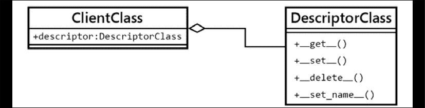

# 6

# 通过描述符让我们的对象更有价值。

本章介绍了一个在 Python 开发中更高级的新概念，因为它具有描述符功能。此外，描述符不是其他语言的程序员熟悉的东西，因此没有简单的类比或平行关系可以做出。

描述符是 Python 的另一个独特特性，它将面向对象编程提升到了另一个层次，它们的潜力允许用户构建更强大、更可重用的抽象。大多数情况下，描述符的完整潜力在库或框架中观察到。

在本章中，我们将实现与描述符相关的一些目标：

+   理解描述符是什么，它们是如何工作的，以及如何有效地实现它们。

+   从概念差异和实现细节分析两种类型的描述符（数据描述符和非数据描述符）。

+   通过描述符有效地重用代码。

+   分析描述符的良好使用示例，以及如何利用它们为我们自己的 API 库提供更多价值。

# 描述符的第一眼观察。

首先，我们将探索描述符背后的主要思想，以了解它们的机制和内部工作原理。一旦这一点清楚，就会更容易吸收不同类型描述符的工作方式，我们将在下一节中探讨。

一旦我们了解了描述符背后的概念，我们就会看看一个例子，其中描述符的使用给我们带来了更干净、更 Pythonic 的实现。

## 描述符背后的机制。

描述符的工作方式并不复杂，但问题在于它们有很多需要注意的注意事项，因此实现细节在这里至关重要。

要实现描述符，我们需要至少两个类。在这个通用示例中，`client`类将利用我们想在`descriptor`中实现的功能（这通常只是一个领域模型类，我们为解决方案创建的常规抽象），而`descriptor`类将实现描述符本身的逻辑。

因此，描述符只是一个实现了描述符协议的类的实例。这意味着这个类的接口必须包含以下至少一种魔法方法（Python 3.6+描述符协议的一部分）：

+   `__get__`

+   `__set__`

+   `__delete__`

+   `__set_name__`

为了这个初始的高级介绍，将使用以下命名约定：

| 名称 | 含义 |
| --- | --- |
| `ClientClass` | 将利用描述符要实现的功能的领域级抽象。这个类被称为描述符的客户。这个类包含一个类属性（按照惯例命名为`descriptor`），它是`DescriptorClass`的一个实例。 |
| `DescriptorClass` | 实现描述符本身的类。此类应实现一些上述涉及描述符协议的魔法方法。 |
| `client` | `ClientClass`的实例。`client = ClientClass()`。 |
| `descriptor` | `DescriptorClass`的实例。`descriptor = DescriptorClass()`。此对象是一个放置在`ClientClass`中的类属性。 |

表 6.1：本章中使用的描述符命名约定

这种关系在*图 6.1*中得到了说明：



图 6.1：ClientClass 和 DescriptorClass 之间的关系

需要记住的一个非常重要的观察结果是，为了使此协议正常工作，`descriptor`对象必须被定义为`class`属性。将其作为实例属性创建将不起作用，因此它必须位于类的主体中，而不是在`__init__`方法中。

总是将`descriptor`对象作为类属性放置！

在一个稍微更关键的观点上，读者还可以注意到，可以部分实现描述符协议——不是所有方法都必须始终定义；相反，我们可以只实现我们需要的那些，正如我们很快将看到的。

因此，现在我们已经建立了结构——我们知道哪些元素被设置以及它们如何交互。我们需要一个用于`descriptor`的类，另一个将消费`descriptor`逻辑的类，这个类反过来将有一个`descriptor`对象（`DescriptorClass`的实例）作为类属性，以及当调用名为`descriptor`的属性时将遵循描述符协议的`ClientClass`的实例。但现在是怎样的情况？所有这些如何在运行时结合起来？

通常，当我们有一个常规类并访问其属性时，我们简单地获得我们期望的对象，甚至它们的属性，如下面的例子所示：

```py
>>> class Attribute:
...     value = 42
... 
>>> class Client:
...     attribute = Attribute()
... 
>>> Client().attribute
<__main__.Attribute object at 0x...>
>>> Client().attribute.value
42 
```

但是，在描述符的情况下，发生了一些不同的事情。当一个对象被定义为`class`属性（并且这个是一个描述符），当`client`请求这个属性时，而不是得到对象本身（正如我们从前面的例子中期望的那样），我们得到调用`__get__`魔法方法的结果。

让我们从一些简单的代码开始，这些代码只记录关于上下文的信息，并返回相同的`client`对象：

```py
class DescriptorClass:
    def __get__(self, instance, owner):
        if instance is None:
            return self
        logger.info(
            "Call: %s.__get__(%r, %r)",
            self.__class__.__name__,
            instance,
            owner
        )
        return instance
class ClientClass:
    descriptor = DescriptorClass() 
```

当运行此代码并请求`ClientClass`实例的`descriptor`属性时，我们将发现，实际上我们并没有得到`DescriptorClass`的实例，而是得到了其`__get__()`方法返回的内容：

```py
>>> client = ClientClass()
>>> client.descriptor
INFO:Call: DescriptorClass.__get__(<ClientClass object at 0x...>, <class 'ClientClass'>)
<ClientClass object at 0x...>
>>> client.descriptor is client
INFO:Call: DescriptorClass.__get__(ClientClass object at 0x...>, <class 'ClientClass'>)
True 
```

注意到放置在`__get__`方法下的日志行被调用了，而不是仅仅返回我们创建的对象。在这种情况下，我们使该方法返回`client`本身，从而真正比较了最后一条语句。这个方法的参数将在以下子节中更详细地解释，所以现在不用担心它们。这个例子关键是要理解，当其中一个属性是描述符（在这种情况下，因为它有`__get__`方法）时，属性查找的行为会有所不同。

从这个简单但具有说明性的例子开始，我们可以开始创建更复杂的抽象和更好的装饰器，因为这里的重要提示是我们有一个新的（强大的）工具可以用来工作。注意这种方式如何完全不同地改变程序的流程控制。有了这个工具，我们可以将所有各种逻辑抽象到`__get__`方法之后，并使`descriptor`透明地执行各种转换，而客户端甚至都没有察觉。这把封装提升到了一个新的水平。

## 探索描述符协议的每个方法

到目前为止，我们已经看到了许多描述符在实际应用中的例子，并了解了它们是如何工作的。这些例子让我们首次领略了描述符的强大之处，但你可能还在思考一些实现细节和惯用法，这些细节我们未能详细解释。

由于描述符只是对象，这些方法将`self`作为第一个参数。对于所有这些方法，这仅仅意味着`descriptor`对象本身。

在本节中，我们将详细探讨描述符协议的每个方法，解释每个参数的含义以及它们的使用意图。

### 获取方法

这个魔法方法的签名如下：

```py
__get__(self, instance, owner) 
```

第一个参数`instance`指的是调用`descriptor`的对象。在我们的第一个例子中，这意味着`client`对象。

`owner`参数是指该对象的类，根据我们的例子（来自*图 6.1*），这将是指`ClientClass`。

从上一段中，我们可以得出结论，`__get__`方法签名中的参数`instance`是指`descriptor`正在对其采取行动的对象，而`owner`是`instance`的类。敏锐的读者可能会想知道为什么签名是这样定义的。毕竟，类可以直接从`instance`中获取（`owner = instance.__class__`）。存在一个边缘情况——当`descriptor`是从类（`ClientClass`）而不是从实例（`client`）调用时，`instance`的值是`None`，但我们在那种情况下可能仍然想做一些处理。这就是为什么 Python 选择将类作为不同的参数传递。

通过以下简单的代码，我们可以展示从`class`或`instance`调用`descriptor`之间的区别。在这种情况下，`__get__`方法为每种情况执行两个不同的操作：

```py
# descriptors_methods_1.py
class DescriptorClass:
    def __get__(self, instance, owner):
        if instance is None:
            return f"{self.__class__.__name__}.{owner.__name__}"
        return f"value for {instance}"
class ClientClass:
    descriptor = DescriptorClass() 
```

当我们从 `ClientClass` 直接调用它时，它将执行一项操作，即组合类的名称空间：

```py
>>> ClientClass.descriptor
'DescriptorClass.ClientClass' 
```

然后，如果我们从一个我们创建的对象中调用它，它将返回其他消息：

```py
>>> ClientClass().descriptor
'value for <descriptors_methods_1.ClientClass object at 0x...>' 
```

通常，除非我们真的需要使用 `owner` 参数，否则最常见的习惯用法是在 `instance` 为 `None` 时只返回描述符本身。这是因为当用户从类中调用描述符时，他们可能期望得到描述符本身，所以这样做是有意义的。但当然，这完全取决于示例（在本章后面的示例中，我们将看到不同的用法及其解释）。

### 设置方法

此方法的签名如下：

```py
__set__(self, instance, value) 
```

当我们尝试将某个值赋给 `descriptor` 时，会调用此方法。它通过以下语句激活，其中 `descriptor` 是实现了 `__set__ ()` 的对象。在这种情况下，`instance` 参数将是 `client`，而 `value` 将是 `"value"` 字符串：

```py
client.descriptor = "value" 
```

你可以注意到这种行为与之前章节中的 `@property.setter` 装饰器之间的一些相似性，其中设置函数的参数是语句右侧的值（在这种情况下是字符串 `"value"`）。我们将在本章后面重新讨论这个问题。

如果 `client.descriptor` 没有实现 `__set__()`，那么 `"value"`（语句右侧的任何对象）将完全覆盖描述符。

在将值赋给属性时，请小心。确保它实现了 `__set__` 方法，并且我们没有引起不期望的副作用。

默认情况下，此方法最常见的用途只是将数据存储在对象中。尽管如此，我们迄今为止已经看到了描述符是多么强大，我们可以利用它们，例如，如果我们创建通用的验证对象，这些对象可以多次应用（再次强调，如果我们不进行抽象，我们可能会在属性的设置方法中多次重复）。

以下列表展示了我们如何利用此方法来创建用于属性的通用 `validation` 对象，这些对象可以通过验证函数动态创建，并在将它们赋给对象之前进行验证：

```py
class Validation:
    def __init__(
        self, validation_function: Callable[[Any], bool], error_msg: str
    ) -> None:
        self.validation_function = validation_function
        self.error_msg = error_msg
    def __call__(self, value):
        if not self.validation_function(value):
            raise ValueError(f"{value!r} {self.error_msg}")
class Field:
    def __init__(self, *validations):
        self._name = None
        self.validations = validations
    def __set_name__(self, owner, name):
        self._name = name
    def __get__(self, instance, owner):
        if instance is None:
            return self
        return instance.__dict__[self._name]
    def validate(self, value):
        for validation in self.validations:
            validation(value)
    def __set__(self, instance, value):
        self.validate(value)
        instance.__dict__[self._name] = value
class ClientClass:
    descriptor = Field(
        Validation(lambda x: isinstance(x, (int, float)), "is not a 
        number"),
        Validation(lambda x: x >= 0, "is not >= 0"),
    ) 
```

我们可以在以下列表中看到此对象的作用：

```py
>>> client = ClientClass()
>>> client.descriptor = 42
>>> client.descriptor
42
>>> client.descriptor = -42
Traceback (most recent call last):
   ...
ValueError: -42 is not >= 0
>>> client.descriptor = "invalid value"
...
ValueError: 'invalid value' is not a number 
```

理念是，我们通常放在属性中的内容可以被抽象成 `descriptor`，并且可以多次重用。在这种情况下，`__set__()` 方法将执行 `@property.setter` 会执行的操作。

这比使用属性更通用，因为，正如我们稍后将看到的，属性是描述符的一个特例。

### 删除方法

`delete` 方法的签名更简单，如下所示：

```py
__delete__(self, instance) 
```

这个方法是通过以下语句调用的，其中`self`将是`descriptor`属性，而`instance`将是本例中的`client`对象：

```py
>>> del client.descriptor 
```

在以下示例中，我们使用这个方法创建一个`descriptor`，目的是防止您在没有必要的行政权限的情况下从对象中删除属性。注意，在这种情况下，`descriptor`具有用于与使用它的对象的值进行预测的逻辑，而不是与不同相关对象：

```py
# descriptors_methods_3.py
class ProtectedAttribute:
    def __init__(self, requires_role=None) -> None: 
        self.permission_required = requires_role
        self._name = None
    def __set_name__(self, owner, name):
        self._name = name
    def __set__(self, user, value):
        if value is None:
            raise ValueError(f"{self._name} can't be set to None")
        user.__dict__[self._name] = value
    def __delete__(self, user):
        if self.permission_required in user.permissions:
            user.__dict__[self._name] = None
        else:
            raise ValueError(
                f"User {user!s} doesn't have {self.permission_required} "
                "permission"
            )
class User:
    """Only users with "admin" privileges can remove their email address."""
    email = ProtectedAttribute(requires_role="admin")
    def __init__(self, username: str, email: str, permission_list: list = None) -> None:
        self.username = username
        self.email = email
        self.permissions = permission_list or []
    def __str__(self):
        return self.username 
```

在看到这个对象的工作示例之前，重要的是要强调这个`descriptor`的一些标准。注意`User`类需要`username`和`email`作为强制参数。根据其`__init__`方法，如果没有`email`属性，它就不能成为用户。如果我们删除该属性并从对象中完全提取它，我们将创建一个不一致的对象，它具有与`User`类定义的接口不对应的某些无效中间状态。这样的细节非常重要，以避免问题。其他对象期望与这个`User`一起工作，并且它也期望它有一个`email`属性。

因此，决定将“删除”电子邮件的操作简单地设置为`None`，这正是代码列表中加粗的部分。同样地，我们必须禁止有人尝试将`None`值设置给它，因为这会绕过我们在`__delete__`方法中设置的机制。

在这里，我们可以看到它的实际应用，假设只有具有"`admin`"权限的用户可以删除他们的电子邮件地址：

```py
>>> admin = User("root", "root@d.com", ["admin"])
>>> user = User("user", "user1@d.com", ["email", "helpdesk"]) 
>>> admin.email
'root@d.com'
>>> del admin.email
>>> admin.email is None
True
>>> user.email
'user1@d.com'
>>> user.email = None
...
ValueError: email can't be set to None
>>> del user.email
...
ValueError: User user doesn't have admin permission 
```

在这个简单的`descriptor`中，我们可以看到我们可以从只有具有"`admin`"权限的用户那里删除电子邮件。至于其他情况，当我们尝试在该属性上调用`del`时，我们将得到一个`ValueError`异常。

通常，这个`descriptor`的方法不像前两个那样常用，但在这里展示它是为了完整性。

### 集合名称方法

这是一个相对较新的方法，它在 Python 3.6 中被添加，具有以下结构：

```py
__set_name__(self, owner, name) 
```

当我们在将要使用它的类中创建`descriptor`对象时，我们通常需要`descriptor`知道它将要处理的属性名称。

这个属性名称是我们用于在`__get__`和`__set__`方法中从`__dict__`中读取和写入的。

在 Python 3.6 之前，`descriptor`不能自动获取这个名称，所以最通用的方法是在初始化对象时明确传递它。这没问题，但它有一个问题，即每次我们想要为新属性使用`descriptor`时，都需要重复名称。

如果我们没有这个方法，一个典型的`descriptor`将看起来像这样：

```py
class DescriptorWithName:
    def __init__(self, name):
        self.name = name
    def __get__(self, instance, value):
        if instance is None:
            return self
        logger.info("getting %r attribute from %r", self.name, instance)
        return instance.__dict__[self.name]
    def __set__(self, instance, value):
        instance.__dict__[self.name] = value
class ClientClass:
    descriptor = DescriptorWithName("descriptor") 
```

我们可以看到`descriptor`是如何使用这个值的：

```py
>>> client = ClientClass()
>>> client.descriptor = "value"
>>> client.descriptor
INFO:getting 'descriptor' attribute from <ClientClass object at 0x...>
'value' 
```

现在，如果我们想避免将属性名称写两次（一次是在类内部分配的变量，一次是作为`descriptor`的第一个参数的名称），我们就必须求助于一些技巧，比如使用类装饰器，或者（更糟糕的是）使用元类。

在 Python 3.6 中，添加了新的方法`__set_name__`，它接收创建该描述符的类以及分配给该`descriptor`的名称。最常用的习惯用法是使用这个方法来存储所需的名称。

为了兼容性，通常在`__init__`方法中保留一个默认值是一个好主意，但仍然要利用`__set_name__`。

使用这种方法，我们可以将之前的`descriptor`重写如下：

```py
class DescriptorWithName:
    def __init__(self, name=None):
        self.name = name
    def __set_name__(self, owner, name):
        self.name = name
    ... 
```

`__set_name__`对于获取`descriptor`被分配的属性名称很有用，但如果我们要覆盖值，`__init__`方法仍然会优先考虑，因此我们保留了灵活性。

尽管我们可以自由地命名我们的描述符，但我们通常使用描述符的名称（属性名称）作为客户端对象`__dict__`的键，这意味着它将被解释为属性。因此，请尽量使用有效的 Python 标识符来命名你使用的描述符。

如果你为你的`descriptor`设置了一个特定的名称，请使用有效的 Python 标识符。

# 描述符类型

基于我们刚刚探索的方法，我们可以在`descriptor`的工作方式上做出一个重要的区分。理解这个区分对于有效地使用`descriptor`以及避免运行时常见的陷阱或错误都起着重要作用。

如果一个描述符实现了`__set__`或`__delete__`方法，它被称为**数据描述符**。否则，仅实现`__get__`的描述符是**非数据描述符**。请注意，`__set_name__`根本不影响这种分类。

当尝试解析对象的属性时，数据描述符将始终优先于对象的字典，而非数据描述符则不会。这意味着在非数据描述符中，如果对象在其字典中有一个与描述符相同的键，那么它将始终被调用，而描述符本身将永远不会运行。

相反，在数据描述符中，即使字典中有一个与描述符相同的键，这个键也永远不会被使用，因为描述符本身总是会最终被调用。

以下两个部分将更详细地解释这一点，包括示例，以获得对每种类型`descriptor`的期望有更深入的了解。

## 非数据描述符

我们将从只实现`__get__`方法的`descriptor`开始，看看它是如何被使用的：

```py
class NonDataDescriptor:
    def __get__(self, instance, owner):
        if instance is None:
            return self
        return 42
class ClientClass:
    descriptor = NonDataDescriptor() 
```

如同往常，如果我们请求`descriptor`，我们得到的是其`__get__`方法的结果：

```py
>>> client = ClientClass()
>>> client.descriptor
42 
```

但是如果我们更改 `descriptor` 属性，我们将失去对这个值的访问，并得到分配给它的值：

```py
>>> client.descriptor = 43
>>> client.descriptor
43 
```

现在，如果我们删除 `descriptor` 并再次请求它，让我们看看我们会得到什么：

```py
>>> del client.descriptor
>>> client.descriptor
42 
```

让我们回顾一下刚才发生的事情。当我们最初创建 `client` 对象时，`descriptor` 属性位于类中，而不是实例中，所以如果我们请求 `client` 对象的字典，它将是空的：

```py
>>> vars(client)
{} 
```

然后，当我们请求 `.descriptor` 属性时，它没有在 `client.__dict__` 中找到任何名为 `"descriptor"` 的键，所以它转到类中，在那里它会找到它……但只作为描述符，这就是为什么它返回 `__get__` 方法的结果。

然后，我们将 `.descriptor` 属性的值更改为其他值，这样做的作用是将值 `99` 设置到 `instance` 的字典中，这意味着这次它不会为空：

```py
>>> client.descriptor = 99
>>> vars(client)
{'descriptor': 99} 
```

因此，当我们在这里请求 `.descriptor` 属性时，它将在对象中查找它（这次它会找到，因为对象的 `__dict__` 属性中有一个名为 `descriptor` 的键，正如 `vars` 的结果所显示的），并且不需要在类中查找就返回它。因此，描述符协议永远不会被调用，下次我们请求这个属性时，它将返回我们覆盖的值（`99`）。

之后，我们通过调用 `del` 来删除这个属性，这样做的作用是从对象的字典中移除名为 `"descriptor"` 的键，使我们回到第一个场景，其中它将默认到触发描述符协议的类：

```py
>>> del client.descriptor
>>> vars(client)
{}
>>> client.descriptor
42 
```

这意味着如果我们将 `descriptor` 的属性设置为其他值，我们可能会意外地破坏它。为什么？因为 `descriptor` 不处理删除操作（其中一些不需要）。

这被称为非数据描述符，因为它没有实现 `__set__` 魔法方法，正如我们将在下一个示例中看到的那样。

## 数据描述符

现在，让我们看看使用数据描述符的差异。为此，我们将创建另一个简单的 `descriptor`，它实现了 `__set__` 方法：

```py
class DataDescriptor:
    def __get__(self, instance, owner):
        if instance is None:
            return self
        return 42
    def __set__(self, instance, value):
        logger.debug("setting %s.descriptor to %s", instance, value)
        instance.__dict__["descriptor"] = value
class ClientClass:
    descriptor = DataDescriptor() 
```

让我们看看 `descriptor` 的值返回什么：

```py
>>> client = ClientClass()
>>> client.descriptor
42 
```

现在，让我们尝试将这个值更改为其他值，看看它返回什么：

```py
>>> client.descriptor = 99
>>> client.descriptor
42 
```

`descriptor` 返回的值没有改变。但是当我们给它赋一个不同的值时，它必须设置为对象的字典（就像之前一样）：

```py
>>> vars(client)
{'descriptor': 99}
>>> client.__dict__["descriptor"]
99 
```

因此，调用了 `__set__()` 方法，并且确实将值设置到了对象的字典中，只是这次，当我们请求这个属性时，不是使用字典的 `__dict__` 属性，而是 `descriptor` 优先（因为它是一个覆盖描述符）。

还有一件事——删除属性将不再起作用：

```py
>>> del client.descriptor
Traceback (most recent call last):
   ...
AttributeError: __delete__ 
```

原因如下——鉴于现在`descriptor`总是优先，对对象调用`del`时不会尝试从其字典（`__dict__`）中删除属性，而是尝试调用`descriptor`的`__delete__()`方法（在这个例子中没有实现，因此引发了属性错误）。

这就是数据和非数据描述符之间的区别。如果描述符实现了`__set__()`，那么它将始终优先，无论对象字典中存在哪些属性。如果没有实现此方法，则首先查找字典，然后运行描述符。

你可能已经注意到的有趣观察是`set`方法中的这一行：

```py
instance.__dict__["descriptor"] = value 
```

有很多事情值得质疑，但让我们将其分解成几个部分。

首先，为什么它只修改了`"descriptor"`属性的名称？这只是这个例子中的一个简化，但事实上，描述符此时并不知道它被分配的属性名称，所以我们只是使用了例子中的名称，知道它将是`"descriptor"`。这是一个简化，使得示例使用更少的代码，但可以通过使用我们在上一节中学习的`__set_name__`方法轻松解决。

在实际例子中，你会做两件事之一——要么将名称作为参数接收并在`init`方法中内部存储，这样这个方法就会只使用内部属性，或者，更好的是，使用`__set_name__`方法。

为什么它会直接访问实例的`__dict__`属性？另一个很好的问题是，这至少有两个解释。首先，你可能想知道为什么不直接这样做？

```py
setattr(instance, "descriptor", value) 
```

记住，当我们尝试将某个值赋给属性且该属性是`descriptor`时，会调用这个方法`(__set__)`。所以，使用`setattr()`会再次调用这个`descriptor`，然后它又会再次调用，如此循环。这最终会导致无限递归。

不要在`__set__`方法中直接使用`setattr()`或赋值表达式在`descriptor`内部，因为这会触发无限递归。

那么，为什么描述符不能为所有对象记录属性的值呢？

`client`类已经有一个对`descriptor`的引用。如果我们从`descriptor`反向引用到`client`对象，我们就会创建循环依赖，这些对象将永远不会被垃圾回收。由于它们相互指向，它们的引用计数将永远不会低于移除的阈值，这将在我们的程序中造成内存泄漏。

当处理描述符（或一般对象）时，要小心潜在的内存泄漏。确保你没有创建循环依赖。

在这里，一个可能的替代方案是使用弱引用，通过`weakref`模块，如果我们想那样做，可以创建一个弱引用键字典。这种实现将在本章稍后解释，但就本书中的实现而言，我们更喜欢使用这种惯用（而不是`weakref`）方法，因为它在编写描述符时相当常见且被接受。

到目前为止，我们已经研究了不同类型的描述符，它们是什么，以及它们是如何工作的，我们甚至对如何利用它们有了初步的了解。下一节将重点介绍最后一点：我们将看到描述符的实际应用。从现在开始，我们将采取更实际的方法，看看我们如何使用描述符来编写更好的代码。之后，我们甚至将探索优秀描述符的示例。

# 描述符的实际应用

现在我们已经了解了描述符是什么，它们是如何工作的，以及它们背后的主要思想，我们可以看到它们在实际中的应用。在本节中，我们将探讨一些可以通过描述符优雅解决的问题。

在这里，我们将查看一些使用描述符的示例，我们还将涵盖它们的实现考虑因素（创建它们的不同方式，以及它们的优缺点），最后，我们将讨论描述符最合适的场景是什么。

## 描述符的应用

我们将从一个非常简单的例子开始，这个例子可以工作，但会导致一些代码重复。稍后，我们将设计一种方法将重复的逻辑抽象成一个描述符，这将解决重复问题，我们还将观察到我们的客户端类上的代码将大大减少。

### 不使用描述符的第一次尝试

我们现在想要解决的问题是我们有一个具有一些属性的常规类，但我们希望跟踪特定属性随时间变化的所有不同值，例如，在一个`列表`中。首先想到的解决方案是使用一个属性，并且每次在属性的 setter 方法中更改该属性的值时，我们都会将其添加到一个内部列表中，这样我们就可以按照我们想要的方式保留这个跟踪。

假设我们的类代表应用程序中的一个旅行者，该旅行者有一个当前城市，并且我们希望在程序运行期间跟踪用户访问过的所有城市。以下是一个可能的实现，它解决了这些要求：

```py
class Traveler:
    def __init__(self, name, current_city):
        self.name = name
        self._current_city = current_city
        self._cities_visited = [current_city]
    @property
    def current_city(self):
        return self._current_city
    @current_city.setter
    def current_city(self, new_city):
        if new_city != self._current_city:
            self._cities_visited.append(new_city)
        self._current_city = new_city
    @property
    def cities_visited(self):
        return self._cities_visited 
```

我们可以轻松地检查这段代码是否符合我们的要求：

```py
>>> alice = Traveler("Alice", "Barcelona")
>>> alice.current_city = "Paris"
>>> alice.current_city = "Brussels"
>>> alice.current_city = "Amsterdam"
>>> alice.cities_visited
['Barcelona', 'Paris', 'Brussels', 'Amsterdam'] 
```

到目前为止，这就是我们所需要的，不需要实现其他任何内容。对于这个问题的目的，属性将绰绰有余。如果我们需要在应用程序的多个地方实现完全相同的逻辑会发生什么？这意味着这实际上是一个更通用问题的实例——追踪另一个属性的所有值。如果我们想对其他属性做同样的事情，比如跟踪爱丽丝买过的所有票，或者她访问过的所有国家，会发生什么？我们就需要在所有这些地方重复逻辑。

此外，如果我们需要在不同的类中实现相同的行为会发生什么？我们可能需要重复代码或者想出一个通用解决方案（可能是一个装饰器、属性构建器或描述符）。由于属性构建器是描述符的一个特定（且更复杂）的情况，它们超出了本书的范围，因此建议使用描述符作为更干净的处理方式。

作为解决这个问题的一个另一种方案，我们可以使用在*第二章*，*Pythonic Code*中引入的`__setattr__`魔法方法。在上一章讨论将`__getattr__`作为替代方案时，我们已经看到了这类解决方案。这些解决方案的考虑因素是相似的：我们需要创建一个新的基类来实现这个通用方法，然后定义一些类属性来指示需要追踪的属性，最后在方法中实现这个逻辑。这个类将是一个混入类，可以被添加到类的层次结构中，但它也具有之前讨论过的问题（更强的耦合和概念上不正确的层次结构问题）。

正如我们在上一章所看到的，我们分析了差异，并看到了类装饰器在基类中使用这个魔法方法时的优越性；在这里，我也假设描述符将提供一个更干净的解决方案，因此我们将避免使用魔法方法，并在下一节中探讨如何使用描述符解决这个问题。话虽如此，读者完全欢迎实现使用`__setattr__`的解决方案，并进行类似的比较分析。

### 习惯性实现

现在，我们将通过使用足够通用的描述符来解决上一节提出的问题，这个描述符可以应用于任何类。再次强调，这个例子实际上并不是必需的，因为要求并没有指定这种通用行为（我们甚至没有遵循创建抽象的类似模式的三实例规则），但它被展示出来是为了展示描述符的实际应用。

除非有实际证据表明我们正在尝试解决的问题存在重复，并且复杂性已被证明是值得的，否则不要实现描述符。

现在，我们将创建一个通用的描述符，给定一个用于存储另一个属性跟踪的名称，它将在列表中存储该属性的不同值。

如前所述，代码超出了我们解决问题的需要，但其意图只是展示描述符如何帮助我们在这个案例中。鉴于描述符的通用性，读者会注意到其上的逻辑（方法名称和属性）与当前的实际问题（旅行者对象）无关。这是因为描述符的理念是能够在任何类型的类中使用，可能在不同的项目中，以相同的结果。

为了解决这个问题，代码的一些部分被注释，每个部分（它做什么，以及它与原始问题的关系）的相应解释将在以下代码中描述：

```py
class HistoryTracedAttribute:
    def __init__(self, trace_attribute_name: str) -> None:
        self.trace_attribute_name = trace_attribute_name  # [1]
        self._name = None
    def __set_name__(self, owner, name):
        self._name = name
    def __get__(self, instance, owner):
        if instance is None:
            return self
        return instance.__dict__[self._name]
    def __set__(self, instance, value):
        self._track_change_in_value_for_instance(instance, value)
        instance.__dict__[self._name] = value
    def _track_change_in_value_for_instance(self, instance, value):
        self._set_default(instance)   # [2]
        if self._needs_to_track_change(instance, value):
            instance.__dict__[self.trace_attribute_name].append(value)
    def _needs_to_track_change(self, instance, value) -> bool:
        try:
            current_value = instance.__dict__[self._name]
        except KeyError:   # [3]
            return True
        return value != current_value  # [4]
    def _set_default(self, instance):
        instance.__dict__.setdefault(self.trace_attribute_name, [])  # [6]
class Traveler:
    current_city = HistoryTracedAttribute("cities_visited")  # [1]
    def __init__(self, name: str, current_city: str) -> None:
        self.name = name
        self.current_city = current_city  # [5] 
```

描述符背后的理念是它将创建一个新的属性，负责跟踪某些其他属性所发生的变化。为了解释的目的，我们可以分别称它们为跟踪属性和被跟踪属性。

以下是对代码的一些注释和说明（列表中的数字对应于先前列表中的注释编号）：

1.  属性的名称是分配给`descriptor`的变量之一，在这种情况下，`current_city`（被跟踪的属性）。我们向`descriptor`传递它将存储跟踪变量的变量的名称。在这个例子中，我们告诉我们的对象跟踪所有`current_city`在名为`cities_visited`（跟踪器）的属性中曾经有的值。

1.  第一次调用描述符时，在`__init__`中，用于跟踪值的属性将不存在，在这种情况下，我们将其初始化为空列表，以便稍后追加值。

1.  在`__init__`方法中，属性`current_city`的名称也不存在，因此我们希望跟踪这种变化。这相当于在先前的例子中用第一个值初始化列表。

1.  只有当新值与当前设置的值不同时，才跟踪变化。

1.  在`__init__`方法中，`descriptor`已经存在，这个赋值指令触发了从*步骤 2*（创建空列表以开始跟踪其值）到*步骤 3*（将值追加到这个列表中，并将其设置为对象的键以供以后检索）的动作。

1.  字典中的`setdefault`方法用于避免`KeyError`。在这种情况下，对于尚未可用的属性，将返回空列表（参见[`docs.python.org/3/library/stdtypes.html#dict.setdefault`](https://docs.python.org/3/library/stdtypes.html#dict.setdefault)以获取参考）。

诚然，`descriptor` 中的代码相当复杂。另一方面，`client` 类中的代码相对简单。当然，这种平衡只有在我们将多次使用这个 `descriptor` 时才会得到回报，这是我们之前已经讨论过的问题。

在这一点上可能还不那么清楚的是，描述符确实完全独立于 `client` 类。其中没有任何内容暗示任何关于业务逻辑的信息。这使得它在任何其他类中应用都是完美的；即使它做的是完全不同的事情，描述符也会产生相同的效果。

这就是描述符的真正 Python 特性。它们更适合定义库、框架和内部 API，但不太适合业务逻辑。

现在我们已经看到了一些描述符的实现，我们可以看看不同的编写描述符的方法。到目前为止，示例使用了单一的形式，但正如我们在本章前面所预料的，我们可以以不同的方式实现描述符，正如我们将要看到的。

## 描述符的不同实现形式

在考虑实现它们的方法之前，我们必须首先理解一个与描述符本质相关的问题。首先，我们将讨论全局共享状态的问题，然后我们将继续探讨在考虑这一点的情况下，描述符可以以不同的方式实现。

### 共享状态的问题

正如我们已经提到的，描述符需要被设置为类属性才能工作。这通常不会成为问题，但它确实带来了一些需要考虑的警告。

类属性的问题在于它们在类的所有实例之间是共享的。描述符在这里也不例外，所以如果我们试图在 `descriptor` 对象中保持数据，请记住，所有这些都将能够访问相同的值。

让我们看看当我们错误地定义一个将数据本身保留下来而不是在每个对象中存储的 `descriptor` 时会发生什么：

```py
class SharedDataDescriptor:
    def __init__(self, initial_value):
        self.value = initial_value
    def __get__(self, instance, owner):
        if instance is None:
            return self
        return self.value
    def __set__(self, instance, value):
        self.value = value
class ClientClass:
    descriptor = SharedDataDescriptor("first value") 
```

在这个例子中，`descriptor` 对象存储了数据本身。这带来了不便，因为当我们修改一个 `instance` 的值时，同一类的所有其他实例也会使用这个值进行修改。下面的代码示例将这个理论付诸实践：

```py
>>> client1 = ClientClass()
>>> client1.descriptor
'first value'
>>> client2 = ClientClass()
>>> client2.descriptor
'first value'
>>> client2.descriptor = "value for client 2"
>>> client2.descriptor
'value for client 2'
>>> client1.descriptor
'value for client 2' 
```

注意我们如何改变一个对象，突然之间所有对象都来自同一个类，并且我们可以看到这个值是如何反映出来的。这是因为 `ClientClass.descriptor` 是唯一的；对于所有这些对象来说，它都是同一个对象。

在某些情况下，这可能是我们真正想要的（例如，如果我们想要创建一种类似博格模式（Borg pattern）的实现，我们希望在类的所有对象之间共享状态），但通常情况下并非如此，我们需要区分对象。这种模式在 *第九章*，*常见设计模式* 中有更详细的讨论。

为了实现这一点，描述符需要知道每个 `instance` 的值并相应地返回它。这就是为什么我们一直在操作每个 `instance` 的字典，并从那里设置和检索值。

这是最常见的方法。我们已经解释了为什么不能在那些方法上使用 `getattr()` 和 `setattr()`，所以修改 `__dict__` 属性是最后一个可行的选项，在这种情况下是可接受的。

### 访问对象字典

我们在这本书中实现描述符的方式是让 `descriptor` 对象存储在对象的字典 `__dict__` 中，并从那里检索参数。

总是存储和从实例的 `__dict__` 属性返回数据。

我们迄今为止看到的所有示例都使用了这种方法，但在下一节中，我们将探讨一些替代方案。

### 使用弱引用

另一个替代方案（如果我们不想使用 `__dict__`）是让 `descriptor` 对象跟踪每个实例自身的值，在一个内部映射中，并从这个映射中返回值。

但是有一个注意事项。这个映射不能是任何字典。由于 `client` 类有一个对描述符的引用，而现在描述符将保持对使用它的对象的引用，这将创建循环依赖，结果，这些对象将永远不会被垃圾回收，因为它们正在互相指向。

为了解决这个问题，字典必须是弱键字典，如 `weakref`（WEAKREF 01）模块中定义的那样。

在这个例子中，`descriptor` 的代码可能看起来像以下这样：

```py
from weakref import WeakKeyDictionary
class DescriptorClass:
    def __init__(self, initial_value):
        self.value = initial_value
        self.mapping = WeakKeyDictionary()
    def __get__(self, instance, owner):
        if instance is None:
            return self
        return self.mapping.get(instance, self.value)
    def __set__(self, instance, value):
        self.mapping[instance] = value 
```

这解决了问题，但也带来了一些考虑：

+   对象不再持有它们的属性——而是由描述符来持有。这在某种程度上是有争议的，并且从概念上讲可能并不完全准确。如果我们忘记这个细节，我们可能会通过检查对象的字典来寻找根本不存在的东西（例如，调用 `vars(client)` 不会返回完整的数据）。

+   它提出了一个要求，即对象必须是可哈希的。如果不是，它们就不能成为映射的一部分。这可能对某些应用程序来说要求过于苛刻（或者可能迫使我们实现自定义的 `__hash__` 和 `__eq__` 魔法方法）。

由于这些原因，我们更喜欢这本书中已经展示的实现方式，它使用每个实例的字典。然而，为了完整性，我们也展示了这个替代方案。

## 关于描述符的更多考虑

在这里，我们将讨论关于描述符的一般性考虑，包括我们可以如何使用它们，何时使用它们是明智的，以及我们最初可能认为通过另一种方法解决的问题如何通过描述符得到改进。然后，我们将分析原始实现与使用描述符后的实现的优缺点。

### 代码重用

描述符是一个通用的工具，也是一个强大的抽象，我们可以用它来避免代码重复。

描述符可能有用的情况之一是，如果我们发现自己处于需要编写属性（如在用`@property @<property>.setter`或`@<property>.deleter`装饰的方法中）但需要多次执行相同的属性逻辑的情况下。也就是说，如果我们需要像泛型属性这样的东西，否则我们会发现自己正在编写具有相同逻辑的多个属性，并重复样板代码。属性只是描述符的一个特例（`@property`装饰器是一个实现了完整描述符协议的描述符，用于定义其`get`、`set`和`delete`操作），这意味着我们甚至可以使用描述符来完成更复杂的任务。

我们在*第五章*，*使用装饰器改进我们的代码*中解释了另一种强大的代码重用类型，即装饰器。描述符可以帮助我们创建更好的装饰器，确保它们能够正确地为类方法工作。

当谈到装饰器时，我们可以说，始终在它们上实现`__get__()`方法是安全的，并且也可以将其作为描述符。在尝试决定是否创建装饰器时，考虑我们在*第五章*，*使用装饰器改进我们的代码*中提出的三个问题规则，但请注意，对于描述符没有额外的考虑。

对于泛型描述符而言，除了适用于装饰器（以及一般可重用组件）的上述三个实例规则外，还建议记住，你应该在需要定义内部 API 的情况下使用描述符，即一些将被客户端消费的代码。这个特性更多地面向设计库和框架，而不是一次性解决方案。

除非有非常好的理由，或者代码看起来会显著更好，否则我们应该避免在描述符中放置业务逻辑。相反，描述符的代码将包含更多实现代码而不是业务代码。它更类似于定义一个新的数据结构或对象，其他部分的业务逻辑将使用它作为工具。

通常，描述符将包含实现逻辑，而不是业务逻辑。

### 类装饰器的替代方案

如果我们回忆一下在*第五章*中使用的类装饰器，*使用装饰器改进我们的代码*，以确定事件对象将被如何序列化，我们最终得到一个实现，该实现（对于 Python 3.7+）依赖于两个类装饰器：

```py
@Serialization(
    username=show_original,
    password=hide_field,
    ip=show_original,
    timestamp=format_time,
)
@dataclass
class LoginEvent:
    username: str
    password: str
    ip: str
    timestamp: datetime 
```

第一个装饰器从注解中获取属性以声明变量，而第二个装饰器定义了如何处理每个文件。让我们看看我们是否可以将这两个装饰器改为描述符。

理念是创建一个描述符，它将对每个属性的值应用转换，根据我们的要求返回修改后的版本（例如，隐藏敏感信息，并正确格式化日期）：

```py
from dataclasses import dataclass
from datetime import datetime
from functools import partial
from typing import Callable
class BaseFieldTransformation:
    def __init__(self, transformation: Callable[[], str]) -> None:
        self._name = None
        self.transformation = transformation
    def __get__(self, instance, owner):
        if instance is None:
            return self
        raw_value = instance.__dict__[self._name]
        return self.transformation(raw_value)
    def __set_name__(self, owner, name):
        self._name = name
    def __set__(self, instance, value):
        instance.__dict__[self._name] = value
ShowOriginal = partial(BaseFieldTransformation, transformation=lambda x: x)
HideField = partial(
    BaseFieldTransformation, transformation=lambda x: "**redacted**"
)
FormatTime = partial(
    BaseFieldTransformation,
    transformation=lambda ft: ft.strftime("%Y-%m-%d %H:%M"),
) 
```

这个`descriptor`很有趣。它是通过一个接受一个参数并返回一个值的函数创建的。这个函数将是我们要应用到字段上的转换。从定义其将如何通用的基本定义，其他`descriptor`类通过简单地更改每个类需要的特定函数来定义。

示例使用`functools.partial` ([`docs.python.org/3/library/functools.html#functools.partial`](https://docs.python.org/3/library/functools.html#functools.partial)) 作为模拟子类的一种方式，通过对该类转换函数的部分应用，留下一个可以直接实例化的新可调用对象。

为了使示例简单，我们将实现`__init__()`和`serialize()`方法，尽管它们也可以被抽象化。在这些考虑下，事件类现在将定义如下：

```py
@dataclass
class LoginEvent:
    username: str = ShowOriginal()
    password: str = HideField()
    ip: str = ShowOriginal()
    timestamp: datetime = FormatTime()
    def serialize(self) -> dict:
        return {
            "username": self.username,
            "password": self.password,
            "ip": self.ip,
            "timestamp": self.timestamp,
        } 
```

我们可以看到对象在运行时的行为：

```py
>>> le = LoginEvent("john", "secret password", "1.1.1.1", datetime.utcnow())
>>> vars(le)
{'username': 'john', 'password': 'secret password', 'ip': '1.1.1.1', 'timestamp': ...}
>>> le.serialize()
{'username': 'john', 'password': '**redacted**', 'ip': '1.1.1.1', 'timestamp': '...'}
>>> le.password
'**redacted**' 
```

与之前使用装饰器的实现相比，有一些不同。此示例添加了`serialize()`方法，并在将其呈现给结果字典之前隐藏了字段，但如果在任何时候从内存中的事件实例请求这些属性中的任何一个，它仍然会给我们原始值，而没有任何转换应用到它上面（我们本可以选择在设置值时应用转换，并在`__get__()`上直接返回它）。

根据应用程序的敏感性，这可能或可能不被接受，但在这个情况下，当我们要求对象提供其`public`属性时，描述符会在呈现结果之前应用转换。仍然可以通过请求对象的字典（通过访问`__dict__`）来访问原始值，但当我们请求值时，默认情况下，它将返回转换后的值。

在这个例子中，所有描述符都遵循一个共同的逻辑，该逻辑在基类中定义。描述符应该将值存储在对象中，然后请求它，应用它定义的转换。我们可以创建一个类的层次结构，每个类定义自己的转换函数，这样模板方法设计模式就可以工作。在这种情况下，由于派生类的变化相对较小（只有一个函数），我们选择将派生类作为基类的部分应用来创建。创建任何新的转换字段应该像定义一个新的类一样简单，该类将成为基类，并部分应用所需的功能。这甚至可以临时完成，因此可能不需要为它设置名称。

无论这种实现如何，关键点是，由于描述符是对象，我们可以创建模型，并将面向对象编程的所有规则应用于它们。设计模式也适用于描述符。我们可以定义我们的层次结构，设置自定义行为，等等。这个例子遵循了我们在*第四章*，*SOLID 原则*中介绍的**开放/封闭原则**（**OCP**），因为添加新的转换方法只需创建一个新的类，该类从基类派生，并具有所需的功能，而不需要修改基类本身（公平地说，之前的用装饰器的实现也符合 OCP，但没有涉及每个转换机制的类）。

让我们以一个例子来说明，我们创建一个基类，该基类实现了`__init__()`和`serialize()`方法，这样我们就可以通过从它派生来简单地定义`LoginEvent`类，如下所示：

```py
class LoginEvent(BaseEvent):
    username = ShowOriginal()
    password = HideField()
    ip = ShowOriginal()
    timestamp = FormatTime() 
```

一旦我们实现了这段代码，类看起来更简洁。它只定义了它需要的属性，并且可以通过查看每个属性的类来快速分析其逻辑。基类将只抽象出公共方法，每个事件的类看起来会更简单、更紧凑。

不仅每个事件的类看起来更简单，而且描述符本身也非常紧凑，比类装饰器简单得多。原始的用类装饰器的实现是好的，但描述符使它变得更好。

# 描述符分析

我们已经看到了描述符是如何工作的，并探索了一些有趣的场景，在这些场景中，它们通过简化逻辑和利用更紧凑的类来促进清洁的设计。

到目前为止，我们知道通过使用描述符，我们可以实现更干净的代码，抽象出重复的逻辑和实现细节。但我们如何知道我们的描述符实现是干净和正确的？什么使一个好的描述符？我们是否正确地使用了这个工具，或者是否过度设计？

在本节中，我们将分析描述符以回答这些问题。

## Python 如何内部使用描述符

*什么使一个好的描述符？* 一个简单的答案可能是，一个好的描述符几乎就像任何其他好的 Python 对象一样。它与 Python 本身保持一致。遵循这个前提的想法是，分析 Python 如何使用描述符将给我们一个很好的想法，了解良好的实现，以便我们知道我们编写的描述符可以期待什么。

我们将看到 Python 自身使用描述符来解决其内部逻辑的常见场景，我们还将发现那些一直就在我们眼前的优雅描述符。

### 函数和方法

描述符对象最引人注目的例子可能是函数。函数实现了 `__get__` 方法，因此当在类内部定义时，它们可以作为方法工作。

在 Python 中，方法只是常规函数，只是它们多了一个额外的参数。按照惯例，方法的第一个参数被命名为 `self`，它代表定义该方法的类的一个实例。然后，方法对 `self` 所做的任何操作都与其他接收对象并对其应用修改的函数相同。

换句话说，当我们定义如下内容时：

```py
class MyClass:
    def method(self, ...):
        self.x = 1 
```

实际上，这就像我们定义了这个：

```py
class MyClass: pass
def method(myclass_instance: MyClass, ...):
    myclass_instance.x = 1
 method(MyClass()) 
```

因此，它只是一个修改对象的函数，只是它是在类内部定义的，并且说它是绑定到对象的。

当我们以这种形式调用某个东西时：

```py
instance = MyClass()
instance.method(...) 
```

实际上，Python 正在执行与此等效的操作：

```py
instance = MyClass()
MyClass.method(instance, ...) 
```

注意，这只是 Python 内部处理的语法转换。它是通过描述符来实现的。

由于函数在调用方法之前实现了描述符协议（参见以下列表），因此首先调用 `__get__()` 方法（正如我们在本章开头所看到的，这是描述符协议的一部分：当被检索的对象实现了 `__set__`，则调用它并返回其结果）。然后在这个 `__get__` 方法中，在运行内部可调用对象的代码之前，会发生一些转换：

```py
>>> def function(): pass
...
>>> function.__get__
<method-wrapper '__get__' of function object at 0x...> 
```

在 `instance.method(...)` 语句中，在处理括号内可调用对象的全部参数之前，会评估 `"instance.method"` 部分。

由于 `method` 是作为类属性定义的对象，并且它有一个 `__get__` 方法，因此会调用这个方法。这个方法所做的就是将函数转换为方法，这意味着将可调用对象绑定到它将要与之一起工作的对象实例。

让我们通过一个例子来看看，这样我们就可以了解 Python 可能在内部做什么。

我们将在类内部定义一个可调用对象，它将充当一种函数或方法，我们希望定义并从外部调用。`Method` 类的一个实例应该是一个函数或方法，用于在另一个类内部使用。这个函数将只打印它的三个参数——它接收到的 `instance`（这将是定义在其中的类的 `self` 参数），以及另外两个参数。在 `__call__()` 方法中，`self` 参数并不代表 `MyClass` 的一个实例，而是一个 `Method` 的实例。名为 `instance` 的参数意味着它应该是一个 `MyClass` 类型的对象：

```py
class Method:
    def __init__(self, name):
        self.name = name
    def __call__(self, instance, arg1, arg2):
        print(f"{self.name}: {instance} called with {arg1} and {arg2}")
class MyClass:
    method = Method("Internal call") 
```

在这些考虑因素下，创建对象之后，根据前面的定义，以下两个调用应该是等效的：

```py
instance = MyClass()
Method("External call")(instance, "first", "second")
instance.method("first", "second") 
```

然而，只有第一个按预期工作，因为第二个会引发错误：

```py
Traceback (most recent call last):
File "file", line , in <module>
    instance.method("first", "second")
TypeError: __call__() missing 1 required positional argument: 'arg2' 
```

我们遇到了与第五章 *使用装饰器改进我们的代码* 中遇到的相同错误。参数被向左移动了一个位置：`instance` 取代了 `self` 的位置，`"first"` 被传递到 `instance` 的位置，而 `"second"` 被传递到 `arg1` 的位置。没有为 `arg2` 提供任何内容。

为了解决这个问题，我们需要将 `Method` 定义为一个描述符。

这样，当我们首先调用 `instance.method` 时，我们将调用它的 `__get__()`，我们将这个可调用对象绑定到对象上（绕过对象作为第一个参数），然后继续：

```py
from types import MethodType
class Method:
    def __init__(self, name):
        self.name = name
    def __call__(self, instance, arg1, arg2):
        print(f"{self.name}: {instance} called with {arg1} and {arg2}")
    def __get__(self, instance, owner):
        if instance is None:
            return self
        return MethodType(self, instance) 
```

现在，这两个调用都按预期工作：

```py
External call: <MyClass object at 0x...> called with first and second
Internal call: <MyClass object at 0x...> called with first and second 
```

我们所做的是使用 `types` 模块中的 `MethodType` 将 `function`（实际上是定义的可调用对象）转换为一个方法。这个类的第一个参数应该是一个可调用对象（在这个例子中，`self` 是一个可调用对象，因为根据定义它实现了 `__call__`），第二个参数是将此函数绑定到的对象。

类似于此的是 Python 中函数对象使用的，这样它们可以在类内部定义时作为方法工作。在这个例子中，`MyClass` 抽象试图模拟一个函数对象，因为在实际的解释器中，这是用 C 实现的，所以实验起来会更困难，但通过这个说明，我们可以了解 Python 在调用我们的对象的方法时内部做了什么。

由于这是一个非常优雅的解决方案，值得探索并记住，当定义我们自己的对象时，这是一个 Pythonic 的方法。例如，如果我们定义自己的可调用对象，那么将其也定义为一个描述符是一个好主意，这样我们就可以将其用作类属性。

### 方法的内置装饰器

如您从查看官方文档（PYDESCR-02）中可能已经知道的那样，所有 `@property`、`@classmethod` 和 `@staticmethod` 装饰器都是描述符。

我们已经多次提到，这种习惯用法使得描述符在直接从类中调用时返回自身。由于属性实际上是描述符，这就是为什么当我们从类中请求它时，我们不会得到计算属性的结果，而是整个`property`对象：

```py
>>> class MyClass:
... @property
... def prop(self): pass
...
>>> MyClass.prop
<property object at 0x...> 
```

对于类方法，描述符中的`__get__`函数将确保类是传递给被装饰函数的第一个参数，无论它是直接从类中调用还是从实例中调用。对于静态方法，它将确保除了函数定义的参数之外没有其他参数被绑定，即取消由`__get__()`在将`self`作为该函数的第一个参数的函数上所做的绑定。

让我们举一个例子；我们创建一个`@classproperty`装饰器，它就像常规的`@property`装饰器一样工作，但用于类。使用这样的装饰器，以下代码应该能够解决我们的用例：

```py
class TableEvent:
    schema = "public"
    table = "user"
    @classproperty
    def topic(cls):
        prefix = read_prefix_from_config()
        return f"{prefix}{cls.schema}.{cls.table}" 
```

```py
>>> TableEvent.topic
'public.user'
>>> TableEvent().topic 'public.user' 
```

使其工作的代码紧凑且相对简单：

```py
class classproperty:
    def __init__(self, fget):
        self.fget = fget

    def __get__(self, instance, owner):
        return self.fget(owner) 
```

正如我们在上一章中看到的，初始化方法在装饰器语法中使用时，会接受将要被装饰的函数。这里有趣的是，我们利用`__get__`魔法方法在它被调用时以类作为参数来调用该函数。

你可以欣赏这个例子与从类中调用`__get__`方法的一般样板代码的不同之处：在这些情况下，大多数时候，我们会询问`instance`是否为`None`，并返回`self`，但这里不是这样。在这种情况下，我们实际上期望实例为`None`（因为它是从类中而不是从对象中调用的），所以我们确实需要所有者参数（即被操作的类）。

### 插槽

`__slots__`是一个类属性，用于定义该类对象可以拥有的固定字段集。

从到目前为止给出的例子中，读者可能已经注意到，在 Python 中，对象的内部表示是通过字典来完成的。这就是为什么对象的属性存储在其`__dict__`属性中的字符串形式。这也是为什么我们可以动态地向对象添加新属性或删除现有属性的原因。对于对象要声明的属性，没有所谓的“冻结”定义。我们还可以动态地注入方法（我们已经在之前的例子中这样做过）。

所有这些都随着`__slots__`类属性的改变而改变。在这个属性中，我们定义了一个字符串，表示允许在类中使用的属性名称。从那时起，我们将无法动态地向这个类的实例添加任何新属性。尝试向定义了`__slots__`的类动态添加额外属性将导致`AttributeError`。通过定义这个属性，类变成了静态的，因此它将没有`__dict__`属性，你可以在其中动态添加更多对象。

那么，如果不从对象的字典中检索，它的属性是如何被检索的呢？通过使用描述符。在槽中定义的每个名称都将有自己的描述符，它将存储用于以后检索的值：

```py
from dataclasses import dataclass

@dataclass
class Coordinate2D:
    __slots__ = ("lat", "long")
    lat: float
    long: float

    def __repr__(self):
        return f"{self.__class__.__name__}({self.lat}, {self.long})" 
```

使用`__slots__`，Python 将只为在创建新对象时定义的属性保留足够的内存。这将使对象没有`__dict__`属性，因此它们不能被动态更改，并且任何尝试使用其字典（例如，通过使用`function vars(...)`）的操作都将导致`TypeError`。

由于没有`__dict__`属性来存储实例变量的值，Python 取而代之的是为每个槽创建一个描述符，并将值存储在那里。这有一个副作用，即我们无法将类属性与实例属性混合（例如，如果我们常用的惯用用法是将类属性用作实例属性的默认值，则使用这种方法，我们将无法这样做，因为值将被覆盖）。

虽然这是一个有趣的功能，但必须谨慎使用，因为它会剥夺 Python 的动态特性。一般来说，这应该仅限于我们知道是静态的对象，并且如果我们绝对确信我们不会在其他代码部分动态地向它们添加任何属性。

作为这种方法的优点之一，使用槽定义的对象占用的内存更少，因为它们只需要一组固定的字段来存储值，而不是整个字典。

## 在装饰器中实现描述符

我们现在理解了 Python 如何在函数中使用描述符，使其在类内部定义时作为方法工作。我们还看到了一些例子，说明我们可以通过使用接口的`__get__()`方法使装饰器符合描述符协议，从而使其工作。这以与 Python 解决对象中函数作为方法的问题相同的方式解决了我们装饰器的问题。

以这种方式适应装饰器的一般方法是在其上实现`__get__()`方法，并使用`types.MethodType`将可调用对象（装饰器本身）转换为绑定到接收到的对象（`__get__`接收到的`instance`参数）的方法。

为了使这起作用，我们必须将装饰器实现为一个对象，因为否则，如果我们使用一个函数，它已经有一个`__get__()`方法，这将执行不同的操作，除非我们对其进行适配，否则将不起作用。更干净的方法是定义一个装饰器类。

当我们想要将装饰器应用于类方法时，使用装饰器类，并在其上实现`__get__()`方法。

# 关于描述符的最终评论

为了总结我们对描述符的分析，我想分享一些关于干净代码和良好实践或经验建议的想法。

## 描述符接口

当我们在*第四章*中回顾接口隔离原则时，*SOLID 原则*（SOLID 中的"I”），我们说保持接口小是一个好的实践，因此我们可能想要将它们分成更小的部分。

这个想法再次出现，不是指作为抽象基类中的接口，而是指描述符本身将呈现的接口。

如前所述，描述符协议包含四种方法，但允许部分实现。这意味着你不必总是实现所有方法。实际上，如果你只实现所需的最小方法，那会更好。

大多数时候，你会发现你只需实现`__get__`方法就能满足你的需求。

不要实现比必要的更多方法。你可以实现的描述符协议方法越少，越好。

此外，你会发现`__delete__`方法很少需要。

## 描述符的面向对象设计

我并不是说我们仅仅通过使用描述符就能提高我们的面向对象设计能力（我们已经讨论过这一点）。但既然描述符只是普通对象，面向对象设计的规则也适用于它们。例如，我们可以有描述符的基类，利用继承来创建更具体的类等。

请记住，所有良好的规则和实践建议也适用。例如，如果你有一个只实现`__get__`方法的描述符基类，那么创建一个也实现`__set__`方法的子类可能不是个好主意，因为它不会符合 Liskov 替换原则（因为我们会有一个更具体的类型，它实现了父类没有提供的一个增强接口）。

## 描述符上的类型注释

在描述符上应用类型注释可能大多数时候都很复杂。

可能存在循环依赖问题（这意味着包含描述符定义的 Python 文件将不得不读取消费者的文件以获取类型，但随后客户端需要读取包含描述符对象定义的文件来使用它）。即使你通过使用字符串而不是实际类型来克服这些问题，还有一个问题。

如果你知道确切类型来注释描述符方法，这意味着描述符可能只对一种类型的类有用。这通常违背了描述符的目的：本书的建议是使用描述符来处理我们知道可以从中受益于泛化和大量代码重用的场景。如果我们不重用代码，拥有描述符的复杂性就不再值得了。

由于这个原因，尽管始终添加注释到我们的定义通常是一个好的实践，但对于描述符的情况，可能简单地不添加注释会更简单。相反，将其视为编写有用文档字符串的好机会，这些文档字符串准确地记录了描述符的行为。

# 摘要

描述符是 Python 中一个更高级的特性，它将元编程的边界推向了更近的地方。它们最有趣的一个方面是它们清楚地表明 Python 中的类只是普通的对象，并且作为这样的对象，它们具有我们可以与之交互的属性。在这个意义上，描述符是类可以拥有的最有趣的属性类型，因为它们的协议促进了更高级、面向对象的可能性。

我们已经看到了描述符的机制、它们的方法以及所有这些是如何结合在一起，从而形成一个更有趣的对象式软件设计图景。通过理解描述符，我们能够创建出强大且简洁的抽象类。我们看到了如何修复我们想要应用于函数和方法的装饰器，并且我们对 Python 的内部工作原理以及描述符在语言实现中扮演的核心和关键角色有了更深入的了解。

这项研究如何在内部使用描述符的 Python 方法应该作为一个参考，以识别我们自己的代码中描述符的良好使用，目标是实现惯用的解决方案。

尽管描述符为我们提供了强大的选项，但我们必须记住何时恰当地使用它们，避免过度设计。在这方面，我们建议我们应该只为真正通用的情况保留描述符的功能，例如内部开发 API、库或框架的设计。与此相关的一个重要考虑是，通常我们不应该在描述符中放置业务逻辑，而应该放置实现技术功能以供包含业务逻辑的其他组件使用的逻辑。

谈到高级功能，下一章也涵盖了一个有趣且深入的主题：生成器。表面上，生成器相当简单（而且大多数读者可能已经熟悉它们），但它们与描述符的共同之处在于它们也可以很复杂，产生更高级和优雅的设计，并使 Python 成为一个独特的编程语言。

# 参考文献

这里有一些你可以参考以获取更多信息的事项：

+   Python 官方文档关于描述符的说明：[`docs.python.org/3/reference/datamodel.html#implementing-descriptors`](https://docs.python.org/3/reference/datamodel.html#implementing-descriptors)

+   *WEAKREF 01: Python 的 weakref 模块* ([`docs.python.org/3/library/weakref.html`](https://docs.python.org/3/library/weakref.html))

+   *PYDESCR-02: 作为描述符的内置装饰器* ([`docs.python.org/3/howto/descriptor.html#static-methods-and-class-methods`](https://docs.python.org/3/howto/descriptor.html#static-methods-and-class-methods))
