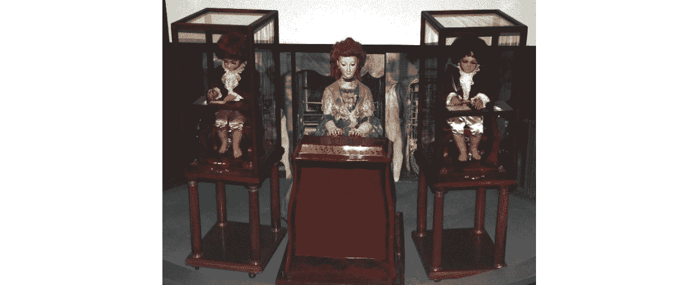
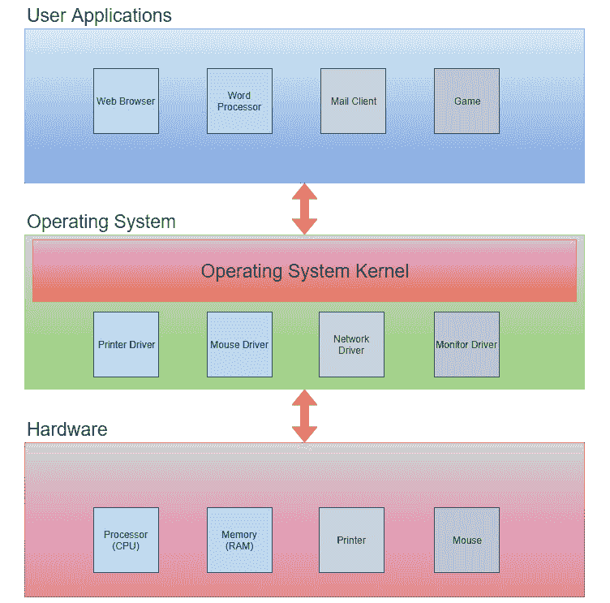
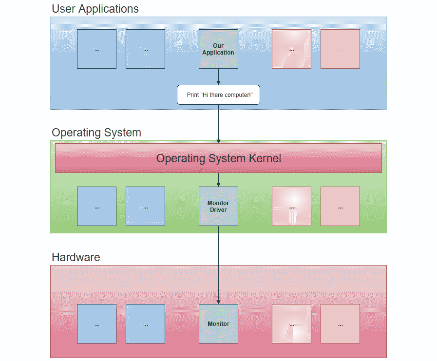
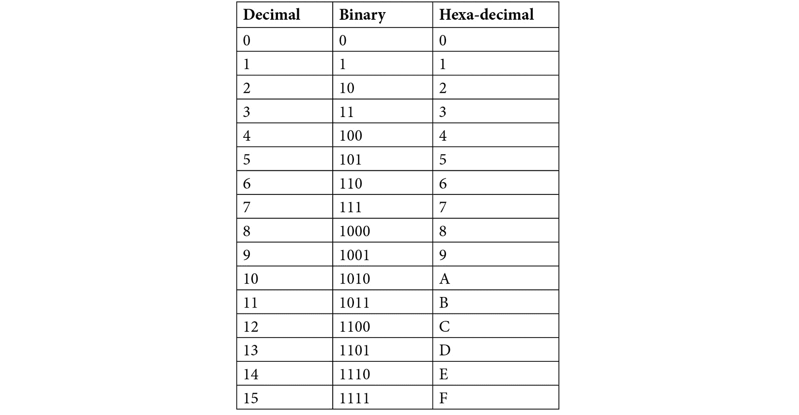
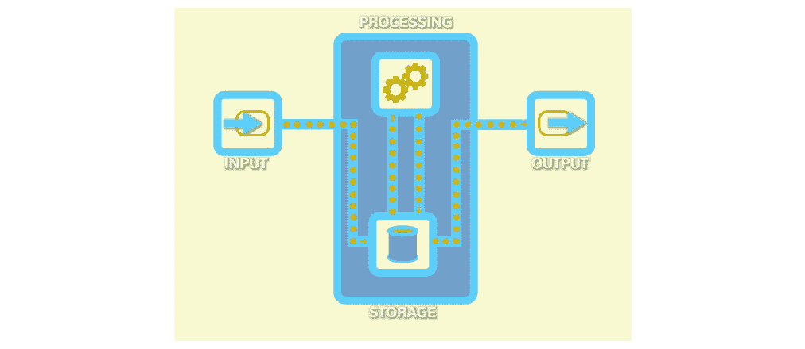
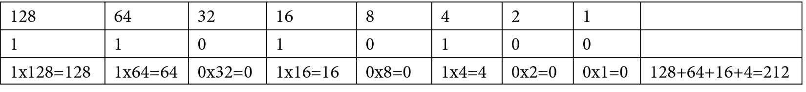

# *第一章*：计算机程序简介

编程是编写计算机可以遵循以完成任务的艺术和科学。这项任务可以是玩游戏、执行计算或浏览网页，例如。然而，在我们学习如何编写程序之前，我们应该了解什么是程序，以及计算机如何理解并执行我们给出的指令。在本章中，我们将更详细地研究这一点，以及计算机的基本知识、工作原理及其历史。

即使对这些主题有基本的理解，也会在以后我们讨论编写程序的不同方面时有所帮助，因为那时我们可以将计算机如何处理我们编写的代码联系起来。

在本章中，我们将涵盖以下主题：

+   对计算机的历史和起源的视角

+   编程背后原始想法的背景知识

+   理解什么是计算机程序

+   学习计算机程序的工作原理

+   理解什么是机器码

# 计算机简史

人类一直都在制造工具和进行创新，以使生活更加舒适，并使我们能够更快、更有效地做更多的事情。我们需要回顾几百年前，才能看到第一个试图建造类似计算机的工具的尝试。然而，在我们这样做之前，我们可能想要定义什么是计算机。维基百科提供了以下定义：

计算机是一种可以通过计算机编程自动执行一系列算术或逻辑运算的机器。

因此，计算机是一种可编程的机器，它执行算术或逻辑运算。让我们回顾一下过去的几项发明，使用这个定义来确定哪些可以被认为是计算机。

首先，我们可以排除雅克德罗机，这是一种在 19 世纪初发明的自动化织布机。这些织布机可以使用穿孔卡片编程，但它们生产的是丝绸，当然，这不是算术或逻辑运算的结果。使用穿孔卡片进行可编程性的想法在计算机时代一直存在，但这些织布机不是计算机。

如果我们再往回追溯时间，我们会发现像算盘这样的工具帮助我们得到算术运算的结果；然而，它们是不可编程的。

在 1770 年代，瑞士钟表匠皮埃尔·雅克·德罗兹（Pierre Jaquet-Droz）创造了一些他称之为自动机的机械娃娃。这些娃娃能够读取指令，因此可以被认为是可编程的，但它们不执行算术或逻辑运算。相反，他创造了一个能演奏音乐的娃娃，一个能画画的娃娃，以及一个能写字的娃娃（它们被称为音乐家、绘图家和作家）：



图 1.1：Jaquet-Droz 自动机（Rama 拍摄，维基媒体共享；Cc-by-sa-2.0-fr）

为了看到类似计算机的东西，我们需要看看查尔斯·巴贝奇的发明。他通过为一种称为差分机的机器的想法，以及后来称为分析机的更高级版本，提出了可编程计算机的概念。在这两个中，分析机尤其具有开创性，因为它可以编程，这意味着它可以用来解决不同的问题。他在 19 世纪上半叶展示了他的工作，即使这些机器从未完成，我们也可以同意巴贝奇是可编程计算机基本概念背后的一个非常重要的人物。

在 20 世纪上半叶，我们见证了某些模拟计算机，但直到第二次世界大战以及随后的年份，我们才看到了真正的数字计算机的诞生。模拟计算机和数字计算机之间的区别在于，前者是一种使用模拟输入（如电压、温度或压力）的机械机器。相比之下，数字计算机使用的是可以用数字表示的输入。

许多人认为，由 J. Presper Eckert 和 John Mauchly 于 1943 年至 1946 年之间构建的**电子数值积分计算机**（**ENIAC**）是第一台数字计算机，因为它是最先完成且完全功能性的：

![图 1.2：Betty Jean Jennings 和 Fran Bilas，两位程序员，操作 ENIAC 的主控制面板 – 美国陆军照片（公有领域 [PD]）](img/B15554_01_02.jpg)

图 1.2：Betty Jean Jennings 和 Fran Bilas，两位程序员，操作 ENIAC 的主控制面板 – 美国陆军照片（公有领域 [PD]）

从那时起，我们见证了直到今天为止的巨大发展。然而，尽管我们的现代计算机可以做得更多，并且速度比这些早期发明快得多，但它们运作的基本原理仍然相同。

# 编程简史

一个可编程计算机需要被编程。因此，当然，编程的历史与计算机的演变是紧密相连的。

1833 年，查尔斯·巴贝奇遇到了诗人拜伦勋爵的女儿 Ada Lovelace。她对巴贝奇的可编程机器计划印象深刻，并产生了浓厚的兴趣，他们的合作就此开始。除了其他事情外，她还写了一些笔记，概述了她关于如何编程巴贝加分析机的想法。我们可以称她为编程的发明者，即使我们不得不等待超过 100 年，直到我们有了能够实现她想法的机器。她今天的地位在 2017 年 James Essinger 的*历史额外*文章中得到了总结：

现在，Ada 完全正确地被视为女性科学成就的象征，一个思想英雄，以及计算机早期历史中最早的先知之一。

在她的笔记中，洛芙莱斯做了几件引人注目的事情。首先，她写了一个算法，说明了如何通过分析引擎计算伯努利数，这是一个在数论中经常使用的有理数序列。这个算法被许多人认为是第一个计算机程序。其次，她概述了这些机器未来的用途，在她的设想中，她看到它们可以用来绘制图片和创作音乐。事实上，当我们最终能够建造计算机时，它们的编程方式受到了她的想法的极大影响：


图 1.3：17 岁的阿达·洛芙莱斯（Joan Baum 的肖像；PD-Art）

第一台数字计算机使用机器码进行编程——这是计算机唯一能理解的东西。在本章的后面部分，我们将更多地讨论机器码，并探讨它是什么。你会发现，它只是一串数字的序列。

1949 年，约翰·莫奇利提出了一个名为 Brief Code 的东西，后来被更名为 Short Code。Short Code 可以被认为是第一种高级编程语言之一。高级编程语言是我们用更易于人类理解的方式向计算机发出指令的方法，这比机器码要好。然后，Short Code 程序被翻译成机器码，而计算机执行的就是这种代码。

1954 年，在 IBM，由约翰·巴科斯发明了 Fortran 语言，这可以被认为是第一个广泛使用的高级通用编程语言。实际上，Fortran 仍然在使用中。

20 世纪 50 年代见证了其他一些语言的诞生，这些语言也得以幸存，例如 Lisp 和 COBOL。从那时起，我们已经有了超过 2,300 种新的编程语言。在下一章中，我们将探讨编程语言的演变及其相互关系，但也会探讨为什么人们不断发明新的编程语言。

# 程序是什么？

从某种意义上说，计算机是愚蠢的，因为没有程序，它什么也不能做。计算机程序是一组计算机可以执行的指令，作为程序员，我们的任务是使用一种或多种编程语言编写这些程序。

我们运行的大多数应用程序，例如网页浏览器、文字处理软件或邮件客户端，都不能直接与计算机硬件通信。它们需要一个介于其间的层来处理这个问题。这个层被称为 **操作系统**。Windows 和 Linux 是两个著名的操作系统例子。操作系统的主要目的是处理我们使用的应用程序与硬件（如处理器、内存、硬盘、键盘和打印机）之间的直接通信。为了能够执行这种通信，操作系统需要特殊程序，这些程序被设计用来与特定设备通信。这些程序被称为 **设备驱动程序**。下面是一个简化的示意图，展示了这个过程：



图 1.4：系统架构

程序员将编写用户应用程序、操作系统和设备驱动程序，但用户应用程序类别无疑是最常见的。我们编写的程序将与系统内核通信，系统内核是操作系统的核心。操作系统将负责与底层硬件的直接通信。这种结构的优点是我们只需要与操作系统通信，因此我们不需要考虑用户有什么样的鼠标或者如何将一行文本发送到特定的打印机型号。操作系统将与鼠标和打印机的设备驱动程序通信，驱动程序将确切知道如何与该设备通信。

如果我们编写一个程序，并且这个程序想要将文本 **Hi there computer!** 打印到屏幕上，那么这个请求将会发送到操作系统。操作系统会将这个请求传递给连接到这台计算机的显示器设备驱动程序，而这个驱动程序将知道如何将这个信息发送到显示器：



虽然输入的文本不会神奇地出现在屏幕上。它将通过计算机内部的几个层。1945 年，匈牙利裔美国数学家和物理学家约翰·冯·诺伊曼（John Von Neumann）和其他人创建了一份名为 *First Draft of a Report to the EDVAC* 的文件。在这 101 页的文件中，提出了使用存储程序概念的第一台计算机的逻辑设计。此外，还描述了电子数字计算机的设计。这种设计今天被称为冯·诺伊曼架构，它定义了可以用来构建计算机的四个不同组件。这些组件如下：

+   一个包含算术逻辑单元和用于处理单元的寄存器的处理单元。

+   一个包含指令寄存器和程序计数器的控制单元。这些用于执行程序。

+   存储数据和指令的内存。这种内存是易失性的，这意味着当电源关闭或计算机重启时，其内容将被清除。

+   外部大容量存储。这是程序和数据的长期存储，计算机重启后也可以保留。

+   输入和输出机制。今天，这通常是键盘、鼠标和显示器。

除了外部大容量存储外，所有这些组件在键盘输入文本并在屏幕上显示时都会发挥作用。

如前所述，计算机只能理解一种东西，那就是机器码。机器码是一组数值，计算机将其解释为不同的指令。计算机只处理二进制形式的数字，也称为基数 2，这就是为什么我们经常听说计算机只理解 0 和 1。

要理解不同的基数，让我们考虑它们有多少位数字。在我们的日常生活中，我们使用十进制系统，称为基数 10，因为我们有 10 个数字，从 0 到 9（我们假设这是因为我们开始用手指计数）。在基 2 的二进制系统中，我们只有两个数字，0 和 1。在基 16 的十六进制系统中，我们有 16 个数字。因为我们只有 0 到 9 的数字，所以在十六进制系统中，我们必须使用一些字母来表示 10 到 15 之间的值。这些字母是 A 到 F。我们这样做是因为我们必须理解数字和数之间的区别：一个数字是一个代表值的单个符号，而一个数是一系列一个或多个数字。所以，例如，我们可以谈论数字 7，但不能谈论数字 12（因为它是由两个数字组成的数）。在十六进制系统中，我们需要表示 16 个值；因此，我们需要 16 个数字。由于我们的十进制系统中只有 10 个数字，我们需要使用其他东西。在这种情况下，就是字母 A 到 F。

请参考以下表格，比较十进制、二进制和十六进制数字：



表 1.1：十进制、二进制和十六进制格式中的数字 1-15

## 计算机程序是如何工作的？

我们作为人类所创造的所有工具都帮助我们减轻了体力劳动。最终，我们达到了一个可以发明一个帮助我们进行脑力劳动的工具：计算机。

在设计此类机器时，发明者发现它必须执行四个不同的任务。计算机需要接受数据作为输入，存储这些数据，处理数据，然后输出结果。

这四个任务是我们所构建的所有计算机的共同点。让我们更详细地看看这些任务：

1.  我们可以通过多种方式向计算机提供输入，例如使用键盘、鼠标、语音命令和触摸屏。

1.  输入数据被发送到计算机的存储：内部内存。

1.  **CPU**（中央处理单元）从存储中检索数据并对其进行操作。

1.  这些操作的结果随后被发送回存储在内存中，然后再作为输出发送出去。

正如不同的设备可以用来向计算机发送输入一样，输出也可以以不同的形式存在，我们可以使用各种设备来展示结果，例如将文本打印到打印机上，通过扬声器播放音乐，或将视频显示在屏幕上。一台计算机的输出甚至可以被输入到另一台计算机中：



图 1.6：计算机的四个任务

所有四个步骤——输入、存储、处理和输出——都处理数据。让我们来探讨一下这些数据是什么以及它采取的形式。

# 理解二进制系统

为什么计算机只处理零和一呢？为什么它们不能直接处理文本或图像，例如？答案是，构建可以表示两种状态的电路相当容易。如果你有一根电线，你可以选择通过它通电或不通电。电流的流动或不流动可以代表几件事情，例如开或关、真或假、或零或一。现在让我们把这些两种状态暂时看作零和一，其中零代表没有电流流动，一表示确实有电流流动。如果我们能够处理这两种状态，我们就可以添加更多的电线，通过这样做，我们就有更多的零和一。

但我们究竟能用这些零和一做什么呢？嗯，答案是我们可以几乎做任何事情。例如，仅使用零和一，我们可以通过二进制数制来表示任何整数。让我们演示一下这是如何工作的。

要理解二进制数，我们必须首先看看十进制数制。在十进制系统中，我们使用 10 个数字，从 0 到 9。当我们计数时，我们通过这些数字直到我们达到 9。现在我们用完了数字，所以我们从零开始，并在前面加一个一，形成数字 10。然后，我们继续计数直到我们达到 19，然后我们再次这样做；从零开始，并在零的前面增加一个一，所以我们得到 20。

另一种思考不同数制的方法是考虑一个位置所代表的值。让我们来看一个例子。数字 212 有两个位置上有数字 2，但它们的位置使它们具有不同的值。如果我们从右边开始向左移动，我们可以这样说：我们取第一个数字，2，乘以 1。然后，我们取第二个数字，1，乘以 10。最后，我们取最后一个数字，2，乘以 100。如果我们从右向左移动，每一步的价值是前一步的 10 倍。看看以下表格中所示的计算：


表 1.2：十进制数的位值

当使用二进制系统时，我们做的是同样的事情，但只使用数字 0 和 1。我们从 0 开始计数，然后是 1。在这个点上，我们用完了数字，所以我们从 0 重新开始，在其前面加一个 1。

二进制计数看起来是这样的：

0, 1, 10, 11, 100, 101, 110, 111, 1000, 1001, 1010, 1011, 1100, 1101, 1110, 1111，等等

当涉及到二进制数中每个位置所具有的值时，它的工作方式与十进制数一样。然而，每个位置的值不是乘以 10，而是乘以 2。我们将第一个数字乘以 1，第二个数字乘以 2，第三个数字乘以 4，依此类推。为了使事情更简单，我们可以说，在特定位置上的 1 表示该位置的数字应该是最终值的一部分，而 0 表示它不应该。看看这个表，以了解二进制数 11010100：



表 1.3：解释二进制数 11010100

在这里，我们有 128、64、16 和 4 位置上的 1，因此现在我们可以将它们相加（我们可以忽略带有 0 的位置，因为将 0 加到某物上不会产生任何影响），以得到二进制数 11010100 的十进制形式，即 212。

如果我们要将一个十进制数，比如 27，转换为二进制，我们首先思考我们可以通过位置值序列走多远：1, 2, 4, 8, 16，等等。这些中哪一个是我们能找到的最大的小于或等于 27 的值？答案是 16，所以这个二进制数中的第一个 1 将在这个位置。在 16 之前的所有位置上，我们可以插入 0：


图 1.7：找到小于或等于 27 的第一个位置

然后我们从 27 中减去 16，得到 11，并使用这个值重复这个过程。小于或等于 11 的最大值是 8：


图 1.8：找到小于或等于 8 的第一个位置

我们从 11 中减去 8，得到 3。下一个值，4，大于 3，所以我们在这个位置插入一个 0：


图 1.9：我们遇到一个大于 3 的位置，所以我们插入一个 0

由于我们还没有插入一个 1，我们保持 3 的值，并尝试找到一个适合它的值。下一个值，2，小于或等于 3，所以我们在这里插入一个 1，然后从 3 中减去 2，得到 1：


图 1.10：2 小于 3，所以我们在这个位置插入一个 1

我们重复这个过程，直到达到 0：


图 1.11：当我们到达末尾时，我们已经到达了完整的二进制数

我们现在知道 27 在二进制中将是 11011。我们可以忽略前面的零。

当我们只有一个二进制位时，我们称它为**位**，如果我们将它们分成 8 位的组，我们称它们为**字节**。一个字节可以存储介于 0 到 255 之间的值。这是因为所有位置上的 1（11111111）将是 128 + 64 + 32 + 16 + 8 + 4 + 2 + 1 = 255。

通过使用大量的 0 和 1，计算机可以以二进制形式表示任何数字，如果它可以表示数字，它也可以表示其他事物，例如文本。

## 理解 ASCII 和 Unicode

如果你给英语字母表的每个字母一个数值，你可以用数字来表示文本。例如，我们可以说 A=1，B=2，以此类推。计算机不使用这些值来表示字母，而是可以使用称为 ASCII 表的东西（发音为 *as-key*）或另一种称为 Unicode 的表示。我们不需要完全理解它们是如何工作的；我们只需要理解的是，一个数字可以表示每个字符。然后，我们可以使用 ASCII 表或 Unicode 来查找这个数字。

ASCII 表使用一个字节来表示不同的字符。表从不可打印的字符开始。最终，它达到了英语字母表中的字符。所以，例如，A 是 65，B 是 66，以此类推。255 个字符并不能带我们走得太远，因为我们周围有大量的不同字母表，我们还想表示其他符号。这就是为什么我们还有 Unicode。它对单个字符的映射不像 ASCII 表那样直接，但我们现在需要知道的是，有了它，我们可以使用数字来表示字符。

注意

不可打印的字符是那些不用于视觉表示的符号；例如，当我们需要一种表示制表符或换行符的方法时，或者如果将文本打印到打印机上，我们希望打印机继续到下一页。

## 表示其他形式的数据

我们已经学会了如何用二进制表示文本，但除了文本和数字之外的东西怎么办？图像、视频和声音怎么办？

图像由像素组成，三个值，RGB，代表每个像素。这些值告诉计算机一个像素有多少红色、绿色和蓝色：


图 1.12：三个值代表一个像素，指示它有多少红色、绿色和蓝色

视频不过是许多图像的组合，所以每一帧都是一个图像；因此，它可以以相同的方式表示。

波形可以表示声音。每个峰值和谷值都可以是一个数字：


图 1.13：音频以波形表示

既然我们已经知道了计算机如何表示数据，我们就必须找出它是如何处理数据的。为了理解这一点，我们必须首先深入了解一个被称为布尔代数的数学领域。

## 布尔代数

乔治·布尔（George Boole），生活在 1815 年至 1864 年之间，是一位自学成才的英国数学家，也是布尔逻辑的发明者，这是所有计算机工作的基础。

布尔逻辑，有时也称为布尔代数，是一种仅使用两个值：**true**（真）和**false**（假）进行工作的数学形式。它还定义了三种我们可以对这些两个值执行的操作：**AND**（与）、**OR**（或）和**NOT**（非）。

**NOT** 是这些操作中最简单的，因为它所做的只是切换值，所以非真即为假，非假即为真。例如，如果我这么说，“今天在下雨”，这个陈述可以是真也可以是假。如果下雨，它就是真的；如果不下雨，它就是假的。如果我改为说，“今天 **NOT** 在下雨”，那么这个陈述将在不下雨时为真，在下雨时为假。

**AND** 取两个可以是真或假的陈述，并将它们评估为一个单一值。如果两个输入值都为真，结果将为真，在其他所有情况下都为假。如果我这么说，“今天在下雨，**AND** 我有一把蓝色雨伞”，这个陈述只有在两部分都为真时才是真的，也就是说，如果实际上在下雨，我的雨伞实际上是蓝色的。然而，如果下雨但我的雨伞是粉色的，我所说的将是假的，尽管其中一半是真的。

**OR** 操作作用于两个部分，就像 **AND** 一样，但现在只需要其中一个为真即可使语句为真。如果我这么说，“今天我会去海滩 **OR** 我会去镇上，”那么无论我是否去海滩或镇上，这个语句都会是真的，而且如果我同时做到了这两件事，这个语句也是真的。

我们可以通过一种称为真值表的东西来说明这三个操作是如何工作的。真值表是一种描述输入的 **true** 和 **false** 值如何被一个操作转换的方法。如果只有一个输入值，我们通常将其称为 **P**；如果有两个，我们将其称为 **P** 和 **Q**。结果显示在最后一列。

如果 **P** 是输入值，**NOT** 的真值表将如下所示：


表 1.4：NOT 的真值表

对于 **AND**，如果 **P** 和 **Q** 是输入值，其真值表如下：


表 1.5：AND 的真值表

对于 **OR**，真值表如下所示：


表 1.6：OR 的真值表

如您所见，**AND** 操作只有在两个部分都为真时才能为真，而 **OR** 只有在两个部分都为假时才能为假。

当美国数学家和电气工程师克劳德·香农在 1937 年发表了其硕士学位论文《继电器和开关电路的符号分析》时，他基于布尔的思想。从香农的思想中，布尔逻辑进入了我们的现代计算机，因为借助布尔定义的简单操作，我们可以将任何可以处于两种状态之一（真或假，开或关，或者，在二进制数字的情况下，一或零）的值转换。

我们可以用晶体管来完成这些操作。我们不需要深入了解晶体管的工作原理——只需知道它可以用来表示真/假、开/关或 0/1 就足够了。然后我们可以将几个晶体管连接成不同的配置来完成**AND**、**OR**和**NOT**等操作。这些组合被称为**门**，因此我们将有一组被称为**AND 门**的晶体管，一个被称为**OR 门**的，一个被称为**NOT 门**的。然后这些门可以进一步连接来构建可以进行加、减、乘、除的电路。我们现在已经构建了一台可以表示数字和这些基本操作的机器。我们只使用数字做到了这一点，并且所有这些数字都将以二进制形式存在，因此我们有一个只使用零和一的机器：计算机。

## 机器码 – 计算机的原生语言

现在我们有了可以执行一些基本数字操作的电路，并且我们有以数字形式的数据，我们可以开始编写将执行数据操作的程序。我们可以用计算机唯一理解的东西来做这件事：机器码。因为数字可以代表一切，我们给计算机的指令将是——是的，没错——只是数字。

每种处理器类型都有其特定的指令集。这就是为什么为 Mac 编写的程序不能在运行 Windows 的 PC 上运行，例如。因此，指令可以是机器码。机器码有几种操作，称为**操作码**。操作可以是**AND**、**OR**、**ADD**等。每个操作码都有一个唯一的数字。例如，**AND**可能有一个操作码值为 1，而**OR**可能有一个操作码值为 9。

处理器还将拥有几个寄存器。寄存器是一个小区域，有时被称为数据存储位置，处理器可以在其中存储它当前正在处理的数据。在执行操作之前，我们需要将作为操作输入的数据从内存移动到这些寄存器之一。操作的结果，即输出，也存储在寄存器中。实际上，事情比这要复杂得多，但在这里我们不需要深入所有细节。

我们现在可以回忆起所有计算机都常见的四种操作：输入、存储、处理和输出。我们首先进行一些**输入**，然后它将进入计算机的内存进行**存储**。处理器然后将它从其寄存器中检索出来，并对其进行操作，这就是**处理**部分。当我们得到操作的结果时，它将返回到内存中，以便稍后可以将其发送到**输出**。

编写这些指令的一种方法是用一种叫做*汇编*的东西。这是一种编写程序的方式，我们使用操作码的三字母缩写，并为寄存器命名。通过这样做，我们将更容易阅读和理解我们给出的指令。然后我们可以使用一个程序将汇编代码翻译成机器码。

汇编语言是我们遇到的第一种编程语言。汇编语言可能看起来像这样：

```py
mov     eax, 14
mov     ebx, 10
add     eax, ebx
```

在这里，我们将值 14 移动到名为`eax`的一个寄存器中，然后我们将值 10 移动到另一个名为`ebx`的寄存器中。然后我们对这两个寄存器的内容执行`add`操作。结果将写回到一个寄存器中；也许`eax`会再次被用于这个操作。

如果**移动**操作的操作码为 136，而**加法**操作的操作码为 1，我们可以使用这些值以及寄存器的数值表示，将所有这些信息都只用数字格式表示。而且，正如我们所知，所有数字都可以用二进制形式表示，即用 0 和 1。

现在我们有了所有这些，我们需要查看一些机器码。

## 示例机器码

记住，我们给出的指令将取决于我们使用的处理器和操作系统。以下是一个示例，展示了在 Linux 操作系统上运行的一个程序将文本**Hello, World!**打印到屏幕上的机器码：

```py
b8    21 0a 00 00   
a3    0c 10 00 06   
b8    6f 72 6c 64   
a3    08 10 00 06   
b8    6f 2c 20 57   
a3    04 10 00 06   
b8    48 65 6c 6c   
a3    00 10 00 06   
b9    00 10 00 06   
ba    10 00 00 00   
bb    01 00 00 00   
b8    04 00 00 00   
cd    80            
b8    01 00 00 00   
cd    80            
```

在查看这个程序时，如果我们想的话，可以用二进制或十进制格式来写这些数字。然而，为了便于阅读，我们通常使用十六进制数字，因为这样我们可以使用更少的数字。例如，十进制中的 15（两位数字）在二进制中是 1111（四位数字），但在十六进制中只有 F（一位数字）。这仅仅更紧凑——这就是我们这样做的原因。

如果你对机器码程序不理解，不要担心。它并不打算对人类可读；然而，对于计算机来说，这一切都是有意义的。

在机器码中编写代码容易出错。一个数字放错位置可能会导致成功与灾难的区别。因此，下一步自然的步骤就是创建一些对人类来说更易于阅读和编写的代码，然后计算机可以将这些代码翻译成机器码。我们之前提到的汇编语言就是这样一种措施。

这里是相同的程序，用汇编语言编写的：

```py
section     .text
global      _start                               
_start:                                         
    mov     edx,len                             
    mov     ecx,msg                             
    mov     ebx,1                               
    mov     eax,4                               
    int     0x80                                
    mov     eax,1                               
    int     0x80                                
section     .data
msg     db  'Hello, world!',0xa                 
len     equ $ - msg                             
```

如您所见，这仍然不是那么容易理解。在下一章中，我们将学习如何使用更接近人类语言的编程语言来编写相同的程序。

# 摘要

在本章中，我们回顾了历史，探讨了计算机的发展。计算机的历史是一个庞大的主题，但我们触及了一些重要事件，这些事件使得计算机成为了我们今天所知道的神奇机器。

要使计算机变得有用，它需要程序，而要能够编写程序，我们需要编程语言。我们了解到编程的发展与计算机的发展密切相关，即使阿达·洛芙莱斯女士设法在第一台计算机建造大约 100 年前就写出了被认为是第一个计算机程序。

在了解了计算机的历史之后，我们接着关注了计算机程序是什么，以及计算机如何使用程序中给出的指令来完成程序员的意图。为了做到这一点，我们考察了计算机可以处理的最小数据单元，即比特，它们是数字的二进制表示中的零和一。我们了解到乔治·布尔及其布尔逻辑的理念是计算机如何转换数据的核心。布尔的理念将在后面的章节中再次出现，因为我们在编写程序时也会用到它们。

最后，我们更深入地研究了计算机的语言，即机器代码。我们看到了我们阅读和理解它的难度，正因为如此，我们将更加欣赏下一章，在那里我们将学习我们可以做些什么来避免直接与这种困难的代码打交道。
