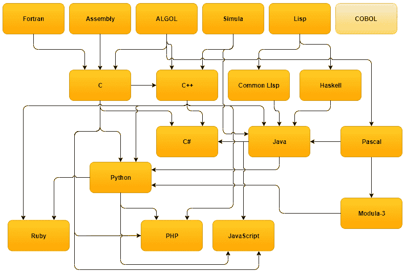
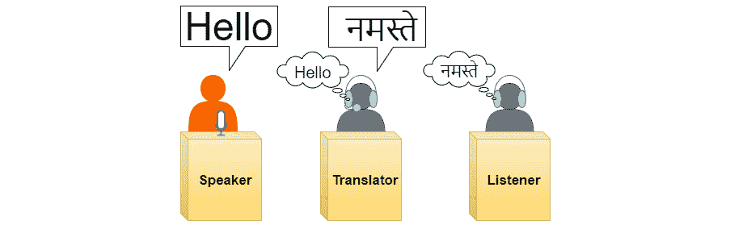
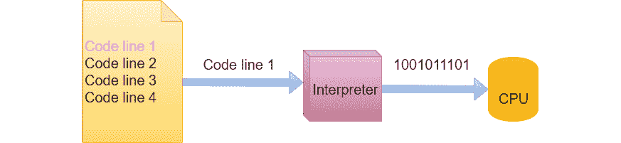
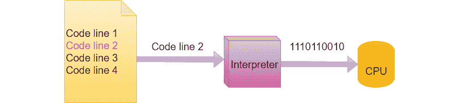
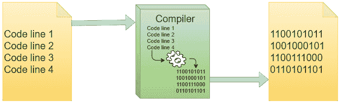
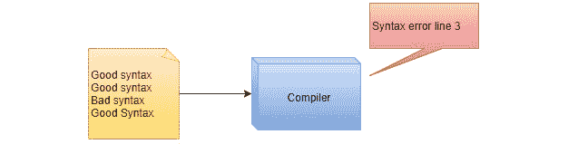
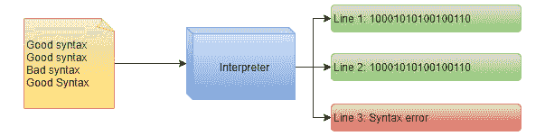
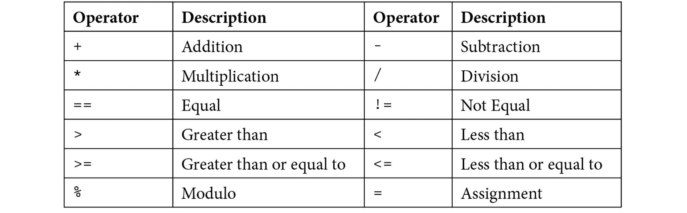

# 第二章：*第二章：* 编程语言简介

要能够编写计算机程序，我们需要一种编程语言。然而，我们并没有只有一两种可供选择；我们有数千种不同的语言可供选择。在本章中，我们将讨论什么是编程语言，为什么有这么多语言可供选择，所有这些语言是如何相互关联的，以及计算机是如何理解我们编写的代码的。在结尾部分，我们将讨论编程语言的语法，也称为其语法。

到本章结束时，你将能够做到以下事情：

+   理解为什么我们有编程语言

+   理解编程语言是如何从一种语言演变到另一种语言的

+   理解编程语言是如何相互关联的

+   理解解释型和编译型语言之间的区别

+   理解编程语言中的语法、关键字和保留字的概念

# 为什么我们有编程语言？

汇编语言非常难以理解。正如我们在上一章中看到的，汇编语言并不是为我们人类设计的。它非常适合计算机，但我们需要更易于阅读、编写和理解的东西。

编写程序、在代码中查找错误和缺陷以及更新程序以添加新功能所需的时间都会产生费用。如果我们使用的语言可以帮助我们减少在代码中引入错误的机会，它将降低成本。如果它帮助我们阅读代码时理解代码，它将使我们能够更快地添加新功能，从而降低成本。编程语言的一个目标就是它必须帮助我们编写程序时更有效率。

正是在这一点上，高级编程语言登上了舞台。它们使我们能够用一种常常至少在某种程度上类似于英语的东西来编写我们的代码。在*第一章*《计算机程序简介》中，我们看到了一个尝试这样做的方法：汇编语言。这种语言的介绍有所帮助，但仍然不够好。我们需要的是更接近人类语言的东西。

看看下面的代码片段：

```py
.data
    msgEqual db "Equal","$"
    msgNotEqual  db "Not Equal","$"
.code
main proc

    mov bl,"Alice"                  
    mov bh,"Bob"                  
    cmp bh,bl                   
    jne NotEqual                
    mov ax, seg msgEqual        
    mov ds, ax                 
    mov ah, 09h                 
    lea dx, msgEqual            
    int 21h                     
    mov ah, 4Ch                 
    int 21h                     

NotEqual:
    mov ax, seg msgNotEqual
    mov ds, ax
    mov ah, 09h
    lea dx, msgNotEqual
    int 21h

    mov ah, 4Ch   
    int 21h   

main endp
end main
```

现在，再比较以下代码：

```py
IF "Alice" == "Bob" THEN
    print "Equal"
ELSE
   print "Not Equal"
ENDIF
```

信不信由你，它们都做了同样的事情。第一个是用汇编语言编写的，第二个则类似于一种高级语言。即使你以前从未见过代码，理解这个程序在做什么也不难。它比较两个文本字符串`Alice`和`Bob`，如果它们相等，则将此结果打印到屏幕上，如果不相等，则打印**不相等**。当然，它们不相等，所以这里的输出是**不相等**。

这两个例子所展示的是，如果我们比较机器代码和汇编代码，代码可以变得多么简单。

在*第一章*，*计算机程序简介*中，我们看到了一个最初用机器码编写，然后汇编的程序，该程序将文本**Hello, World**打印到屏幕上。那么，这个程序在我们今天使用的某些高级语言中会是什么样子？让我们看看一些例子。

在 Python 中，它看起来如下所示：

```py
print("Hello, World")
```

在 C 中，它看起来如下所示：

```py
#include <stdio.h>
int main(void)
{
  printf("Hello, World");
  return 0;
}
```

在 C++中，我们有以下内容：

```py
#include <iostream.h>
int main()
{
    std::cout << "Hello, World" << std::endl;
    return 0;
}
```

在 Java 中，我们会看到以下内容：

```py
class HelloWorld {
  static public void main( String args[] ) {
    System.out.println("Hello, World");
  }
}
```

在 C#中，我们有以下内容：

```py
class HelloWorld
{
    static void Main()
    {
        System.Console.WriteLine("Hello, World");
    }
}
```

最后，在 JavaScript 中，我们会观察到以下内容：

```py
console.log("Hello, World");
```

我们可以看到它们都是不同的，有些在打印文本的部分周围有一些额外的东西，但这个比较清楚地表明，从机器码到高级语言的转变是巨大的。

这一步为组织代码和结构代码的几种不同方式铺平了道路，并且自从 20 世纪 50 年代出现第一种高级编程语言以来，我们已经看到了巨大的发展。直到今天，已经开发出了大量的语言。

# 编程语言是如何演变的？

在 1943 年至 1945 年之间，德国土木工程师康拉德·祖塞（Konrad Zuse）开发了一种名为 Plankalkül 的编程语言。尽管这种语言当时并未实现，但它为我们现在称之为高级编程语言的基础，并为后来的其他语言提供了灵感。

在 1953 年底，约翰·W·巴克斯特（John W. Backus），一位在 IBM 工作的美国计算机科学家，向他的上级提交了一份提案，提议开发一种替代汇编语言的方案。1954 年，巴克斯特和他的团队发布了这种语言的第一个草案规范，并在 1957 年 4 月，发布了 FORTRAN（后来将全大写命名标准改为 Fortran）编程语言的第一版。最初，这种语言遭到了一些怀疑，因为它无法产生像汇编语言编写的程序那样运行得快的程序。然而，用这种新语言编写的程序行数远少于汇编程序，编写和理解起来更加舒适，这些优点很快就超过了它比手写汇编程序运行慢的事实。

Fortran 取得了成功，并且至今仍在使用，即使它只用于一些非常专业的应用，例如如何衡量超级计算机的性能。

Fortran 很快就被一些其他编程语言所跟随，这些语言影响了我们今天编写程序的方式。

1958 年，由麻省理工学院（MIT）工作的美国计算机科学家约翰·麦卡锡（John McCarty）创建了一种名为 Lisp 的编程语言。Lisp 提出了许多后来被其他编程语言采纳的概念。在*第十章*，*编程范式*中，我们将讨论编程中使用的不同范式，Lisp 引入了一种称为函数式编程的范式。Lisp 今天通过几种语言继续存在，通常被称为 Lisp 方言。其中，我们发现了一些语言，如 Clojure、Common Lisp 和 Scheme。

在 1958 年，另一种重要的语言被创造出来，它影响了今天我们使用的几种最受欢迎的语言。它被称为 ALGOL，是由美国和欧洲计算机科学家在苏黎世的一次会议上开发的一个委员会。ALGOL 最重要的遗产是我们如何将代码结构化成独立的块，这是一个今天广泛使用的概念。

20 世纪 50 年代终于又出现了一种值得提及的语言，那就是 COBOL。其想法是创建一种类似英语且面向商业应用的语言。这个名字是**通用面向商业语言**的缩写。一群来自学术界、计算机用户和制造商的代表在 1959 年宾夕法尼亚大学开发了 COBOL。这个小组的成员之一是 Grace Hopper。她之前发明了一种类似英语的数据处理语言，名为 FLOW-MATIC，这成为 COBOL 不可或缺的灵感来源。长期以来，COBOL 一直是开发商业应用的第一大语言，并且至今仍在金融领域使用。

## 编程语言的现代时代

这些语言为 60 年代和 70 年代开发的语言奠定了基础，并成为了这些语言的灵感来源。我们将提到这个时期开发的一些语言，因为它们在引入新的编程概念或为他人提供灵感方面至关重要。

在 20 世纪 60 年代末，两位挪威计算机科学家 Ole-Johan Dahl 和 Kristen Nygaard 发明了一种名为 Simula 的语言，它普及了另一种范式，即面向对象。我们将在*第十章*“编程范式”中更多地讨论面向对象是什么。它启发了使用这种范式的几种现代语言，如 C++、Java 和 C#（发音为 C sharp）。

在 1969 年至 1973 年期间，贝尔实验室的 Dennis Ritchie 和 Ken Thomson 开发了一种名为 C 的编程语言，它仍然是最受欢迎的编程语言之一，并且是许多当今顶级语言的主要影响者。其中，我们发现了诸如 C++、Java、Go、JavaScript、Perl、PHP、Python 和 C#等语言。是什么让 C 如此受欢迎和有影响力呢？有几个答案。一个原因是代码的外观和代码结构的规则。这种风格启发了许多语言，并且它们在细微或无修改的情况下重新使用它。另一个原因是用 C 编写的程序运行速度快，因此，当应用程序需要高速或以某种方式需要高性能时，C 或其相关语言是这项工作的完美选择。

## 为什么有这么多语言？

有几个原因会导致有人开发一种新的语言。其中一个原因可能是，这个人使用语言，但认为代码的结构不够好，或者他们认为某些事情可以更高效地完成。也可能是因为开发了一种语言来针对一种特殊类型的应用。在*第三章* *应用类型*中，我们将探讨一些不同的应用类型，这些类型可能有一些要求，使得一种语言比其他语言更适合满足这些要求。

一种编程语言可以给程序员直接访问计算机硬件的能力。这意味着它将允许程序员更多地控制数据在计算机内存中的表示和存储方式。这种语言的优点是，用这种语言编写的程序有可能更高效或运行更快。然而，这也会带来复杂性。当给予程序员更多控制时，我们也给了程序员更多犯错误的机会。

一些语言给我们较少的控制，但更容易使用。这里的缺点是，用这些语言编写的程序往往运行得更慢。

例如，如果我们想编写一个高端游戏，我们希望有最好的图形、最好的声音、先进的计算机人工智能和多玩家功能，我们将尽最大努力从计算机硬件中获得尽可能多的性能。然后我们将选择一种尽可能给我们更多控制的编程语言，因为我们希望将程序的各个方面调整到最佳配置。

如果我们相反编写一些管理软件，我们不会关注应用程序的速度；相反，我们希望有一种编程语言可以帮助我们编写尽可能少错误的、高质量的软件。一些编程语言的结构也使得编写程序更容易，这反过来又减少了程序员编写软件所花费的时间。

这样的要求也可以是创建一种新编程语言的动机。编程语言不过是我们用来创建程序的工具，就像所有工具一样，我们希望它尽可能适用于任务。

# 编程语言的家族树

形成编程语言之间关系的家族树并不容易，因为我们可能会就它们相互影响多少进行一番争论。要绘制一个包括所有现有语言的树也是不可能的，因为它们的数量如此之多，即使将它们放入这本书的一页也是不可能的。然而，我们可以绘制一个包括目前流行或以显著方式影响这些语言的语言的树。

我们在这里使用的语言选择是基于它们的流行度——也就是说，它们是你最有可能使用的语言。要知道今天哪些语言是最受欢迎的，我们可以转向几个来源。问题是如何衡量一种语言的流行度，不同的来源使用不同的标准来做出这个选择。如果我们浏览几个在线的顶级列表，我们很快就会发现有一些语言出现在所有这些列表中。所以，让我们从它们开始，看看我们如何从那里构建一棵树。

我将要包括的语言，不分先后顺序，有 JavaScript、Java、Python、PHP、C、C++、C#和 Ruby。

如果我们从一种语言开始——例如，C——并看看它影响了哪些语言，我们会发现汇编语言、Fortran 和 ALGOL（如果我们只关注我们之前提到的那些）。现在我们可以开始绘制这棵树。如果我们对其他语言做同样的事情，看看哪些语言影响了它们，以及它们影响了哪些语言，我们最终会得到一棵看起来像这样的树：



图 2.1：一些编程语言的家族树

我们可以就这是否是一个准确的表现进行长时间的讨论，但它给了我们一个关于语言如何相互启发的总体概念。在我们讨论的语言中，只有 COBOL 不能直接与这些语言中的任何一个直接联系起来。这并不意味着 COBOL 不是必要的，但对于进入这棵树的那些语言来说，COBOL 并没有产生任何显著的影响。

关于这个图表的另一件事是，那些以 ALGOL 为共同祖先的语言被过度代表了。原因是，在当今最受欢迎的语言中，它们都来自一个常被称为 ALGOL 语言家族的群体。我还自由地省略了一些中间语言，以减少树的大小。在这个家族树中，我们没有看到一种完全与任何现有语言无关的新语言出现。这意味着新语言是作为对现有语言的反应而创造的。在创建一种新语言时，我们取自一种或多种语言的我们喜欢的部分，并改变我们不喜欢的部分。

这棵树之所以有趣，是因为如果我学习了一种编程语言，那么学习一个相关的语言要比学习树中更远的语言容易得多。

# 将代码翻译成计算机能理解的内容

程序员编写的代码被称为源代码。正如我们在*第一章*，“计算机程序简介”中看到的，此代码必须翻译成机器码，以便计算机能够理解它。这种翻译的主要有两个原则。在我们探讨这两个概念并查看它们的优缺点之前，我们将先看看这两种概念的结合。

## 解释

执行这种翻译的一种方式是使用解释器。解释器会查看一行源代码，将其翻译成机器码，让计算机执行这一行，然后继续到下一行代码。解释器的工作方式有点像同声传译员处理人类语言的方式。例如，同声传译员可能会为联合国工作。在联合国，每个人都有权用母语发言。一组翻译人员会听取讲话，在听的过程中，他们会将其翻译成另一种语言。代表们可以通过耳机实时地用母语听到演讲，方式如下：



图 2.2：同声传译员将所有内容实时翻译

接下来，让我们看看编译是如何工作的。

## 编译

执行这种翻译的另一种方式是使用称为编译的技术。当我们把源代码编译成机器码时，我们首先翻译每一行代码，只有在所有代码行的翻译都完成后，程序才会执行。我们可以将这比作翻译一本书的概念。首先，作者用一种语言写书。然后，翻译者会将整本书翻译成另一种语言。只有在原书中所有文本的翻译都完成后，它才会可供阅读：


图 2.3：在翻译一本书时，翻译者会在书出版前翻译所有文本

在此之后，我们将看到解释和编译是如何进行比较的。

## 比较解释和编译

解释和编译是翻译源代码的两种主要技术。一种编程语言可以使用这两种技术中的任何一种，因此一种语言通常被称为解释型语言或编译型语言。

让我们更仔细地看看这两种技术，以便在我们比较它们之前更好地理解它们。

当翻译程序员编写的源代码时，一个称为解释器的专用程序可以完成这项工作。解释器会逐行读取源代码，并立即翻译每一行。

让我们看看这个过程的示意图：



图 2.4：解释器将一行源代码翻译成机器码

首先，解释器将从左侧的源代码中读取一行。在这个图中，它读取第一行，称为**代码行 1**。然后它将这一行翻译成机器码并发送到计算机的处理器，即 CPU，CPU 将执行指令。

然后它将继续到下一行，如下面的图所示，并重复对该行的处理过程：



图 2.5：当一行执行完毕后，解释器继续执行下一行

解释器将重复此过程，直到没有更多行需要在源代码中处理。

编译器将翻译源代码文档中的所有代码，并将其存储在包含机器码指令的文件中。当我们想要运行程序时，我们可以使用这个文件来运行它；此时 CPU 将执行机器码。

下面的图示说明了这个过程：



图 2.6：编译器将所有源代码翻译成机器码并存储在文件中

这两种翻译方法的优缺点是什么？让我们从解释开始，先看看一些好处：

+   它的程序大小更小。

+   如果我们有代码和解释器，我们可以在任何平台上运行它（例如，Windows、Linux、macOS 等）。

+   解释型语言通常对程序员来说更加灵活。其中一个例子是动态类型，我们将在*第六章*，“与数据一起工作——变量”中进一步讨论。

解释器方法的一些不利之处如下：

+   程序运行较慢，因为它需要一些时间来完成翻译。

+   任何想要运行程序的人都必须安装解释器。

+   程序的用户可以访问源代码，因此如果它是一个商业应用程序，我们编写的所有代码都将对任何人可访问，包括任何潜在的商业机密。

对于编译型解决方案，其优缺点与解释型解决方案正好相反。优点如下：

+   它运行得更快，因为翻译是一次性完成的。

+   运行应用程序不需要额外的程序——也就是说，应用程序拥有运行所需的所有信息，因此用户不需要安装任何其他程序。

+   编译型编程语言往往在诸如类型检查等方面为程序员提供更高的帮助。类型检查是我们将在*第六章*，“与数据一起工作——变量”中讨论的内容。

不利之处如下：

+   程序往往更大，因为它们需要包含如何执行的说明。

+   我们需要为所有我们打算让程序运行的平台制作版本——也就是说，我们需要一个 Windows 版本、一个 macOS 版本和一个 Linux 版本。

+   完成翻译所需的时间可能很长，这使得我们在编写程序时尝试新事物变得更加困难。

正如我们所见，这两种技术都有优点和缺点。编程语言要么是解释的，要么是编译的，尽管有一些例外，我们很快就会看到。

注意：

一些解释语言的例子有 PHP、Ruby 和 JavaScript。

一些编译语言的例子有 C、C++、COBOL、ALGOL、Fortran 和 Lisp。

## 同时编译和解释的语言

我们还有一组既编译又解释的语言。当它们编译源代码时，它们不会直接将其编译成机器代码。它们遵循一个中间步骤，将源代码编译成字节码。然后，在程序执行时，将这些字节码解释为程序运行的当前系统的机器代码。这样做的好处是，我们可以获得这两种技术的一些优点。例如，这种字节码可以被分发给任何想要运行程序的人，然后解释器将字节码解释为当前系统上的机器代码。

编译语言还有另一个优点——这也适用于混合技术的方法——那就是如果源代码中存在错误，编译器会检测到这一点，因为语法（记住语法是语言的语法）必须正确，如果不正确，编译器就无法继续并停止翻译。然后程序员需要回去纠正错误，程序才能再次编译。

混合技术语言与解释语言共享一个缺点，那就是用它们编写的程序运行速度会比用编译语言编写的程序慢。

注意：

一些混合技术语言的例子有 Python、Java、C#和 Perl。

# 语法和编程语言的基本构建块

正如人类语言有语法来规定语言的规则一样，编程语言也有语法。语法是我们使用语言编写程序时的规则。语法和语法的最大区别在于对错误的宽容度。如果你遇到一个说你的母语但偶尔犯错的人，你仍然能够理解这个人试图向你传达的信息。编程语言的语法并非如此。它不会宽容任何错误，你需要做到完美无缺：


图 2.7：即使语法错误，人类也能相互理解

正如我们之前讨论的，我们编写的代码将被编译器或解释器翻译，为了使这种翻译工作，语法必须完美无缺。

每种编程语言都有自己的语法规则，但正如我们在之前的家族树中看到的，语言可以是相关的。因此，许多语言共享一种语法，只有细微的差异，而其他语言则有更专业的语法。当我们学习一门新语言时，我们必须学习该语言的语法。这就是为什么在密切相关的语言之间移动更容易，因为它们很可能共享很多语法。

如果我们在语法上有错误，它将在翻译过程中被发现，这就是编译型语言和解释型语言之间的区别。对于编译型语言，所有的翻译都会在我们能够执行程序之前完成。如果我们有语法错误，编译器一旦发现错误就会停止编译。然后我们必须找到错误并纠正它，然后让编译器再次尝试翻译代码。只有当我们的代码没有任何语法错误时，我们才能运行完全：



图 2.8：编译器在没有语法错误的情况下不会产生任何输出

对于解释型语言来说，情况不同，因为它会在我们运行程序时逐行翻译。这意味着语法错误可能隐藏在程序的一个很少被执行的角落，直到我们最终想要运行那行代码时才会被发现。当这种情况发生时，程序会崩溃，并显示错误信息，告诉我们语法中有什么问题：



执行它直到找到语法错误](img/B15554_02_09.jpg)

图 2.9：解释器将翻译它遇到的每一行，并执行它直到找到语法错误

这意味着我们编写的源代码文档要么是语法正确的，要么是错误的。语法是一组规则，定义了源代码的编写和结构方式。但不仅如此。语法还定义了其他事物，例如构成语言的语言。这些被称为**关键字**。

## 关键字

当学习一门新语言时，我们必须跟踪其关键字，因为这些词被语言保留，所以我们不能在程序中使用它们来命名事物。如果我们不小心将关键字用于其预期用途之外的事物，我们将得到一个错误。关键字有时也被称为保留词。

一种语言通常有 30 到 50 个关键字。以下是在许多语言中的一些常见关键字列表：

+   `for`

+   `if`

+   `else`

+   `break`

+   `continue`

+   `return`

+   `while`

大多数编程语言都是大小写敏感的，所以大写和小写字母的使用很重要——例如，`if` 与 `If` 或 `IF` 并不相同。

除了关键词之外，我们还有被称为操作符的东西，我们可以用它来表示我们对数据进行操作的动作。

## 运算符

一种编程语言也会有几个运算符，这些是我们用来完成诸如加法和乘法等操作，以及比较项的工具。可以使用的符号也被定义为语言语法的一部分。以下是一些常用运算符的列表：



表 2.1 – 编程语言中常用的运算符

运算符之所以被称为运算符，是因为它们对数据进行操作。正如我们可以在前面的表中看到的那样，存在用于执行算术运算的运算符，例如加法和乘法。其他运算符用于比较——例如，查看两个值是否相等，一个是否大于另一个，等等。在*第六章* *与数据一起工作 – 变量*中，我们将了解更多关于编程语言中通常可以找到哪些运算符以及它们如何被使用的信息。

将我们的代码放在一个长长的序列中会使阅读变得困难。这就像是一本没有章节或段落的书籍。为了给我们的代码添加章节和段落的理念，我们使用一种叫做**代码块**的东西。

## 代码块

对于一种语言来说，也允许我们定义代码块是很常见的。你可能会想出很多想要这样做的原因，我们将在后面的章节中详细讨论。然而，现在我们可以将代码块想象成标准文本中的一个段落。然后，语言定义了如何标记代码块的开始和结束。许多语言采用的一种常见技术是使用括号，也称为花括号或大括号——`{}`。这些括号内的所有内容都被视为代码块的一部分。其他语言可能有不同的方法来完成同样的事情，所以，当我们切换到不同的语言时，我们必须学习那种语言的语法规则。

现在我们已经介绍了一些编程语言用来定义其语法的基

## 与数学的关系

编程与数学密切相关，因为编程借鉴了许多来自数学的概念。其中之一就是变量的使用。在*第六章*，*数据处理 – 变量*中，我们将讨论什么是变量以及它是如何工作的，但它们在本质上与数学中的变量相同，即我们可以用一个名字来代表变量（一个可以变化的值）。我们可以命名变量的规则也是语言语法的一部分。

从数学中借鉴的另一个概念是函数。在数学中，函数是一种接受输入值并以某种方式将其转换以产生输出的东西。这类似于我们可以描述编程中的函数，但这并不是编程中函数的全部。我们将在*第八章*“理解函数”中讨论函数，然后我们将看到我们需要以不同于我们看待它们的数学等价物的方式来思考编程函数。

在接近编程时，我们必须记住的一件事是，如果我们理解了这些概念在数学中的工作原理，这并不意味着我们可以直接将这种知识应用到编程中，即使它们恰好有相同的名称。它们将是相关的，但编程中的做事方式将与数学中的工作方式不同。

# 摘要

在本章中，我们首先讨论了为什么机器码如此难以理解，以及创造易于程序员使用的编程语言的动机。然后，我们看到了编程语言是如何随着时间演变的，以及它们大多数是如何相似的，因为它们在演变过程中相互影响。

我们还讨论了一些不同的技术——解释和编译——这些技术用于将源代码翻译成机器码。我们还看到了一些语言如何使用混合技术，同时采用编译和解释来完成翻译。

在本章的结尾，我们学习了编程语言的语法或语法规则，以及每种语言都有自己的语法规则。我们还了解到数学和编程之间存在密切的关系，编程借鉴了一些来自数学的思想和概念，但即使它们有相同的名称，它们也不一定做相同的事情。

所有这些知识都将为你提供一个坚实的基础，以便我们在下一章中继续学习，我们将探讨我们可以开发的一些主要应用程序类型。我们还将了解它们之间是如何相互关联的。
