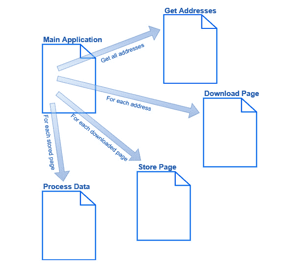
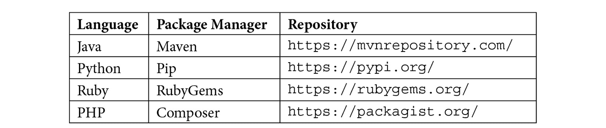
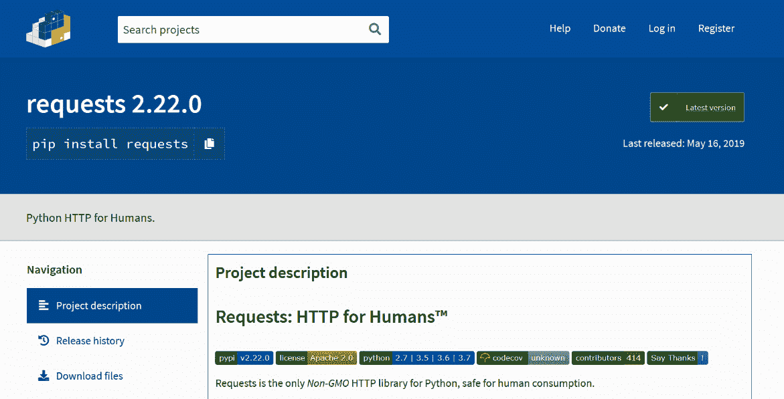
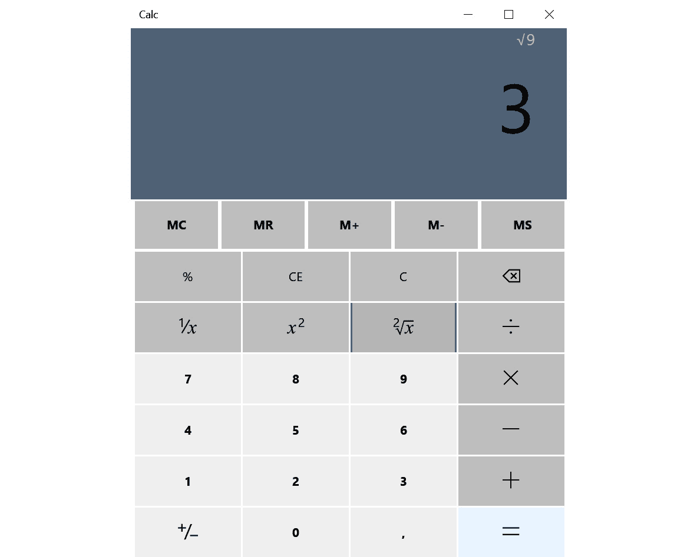
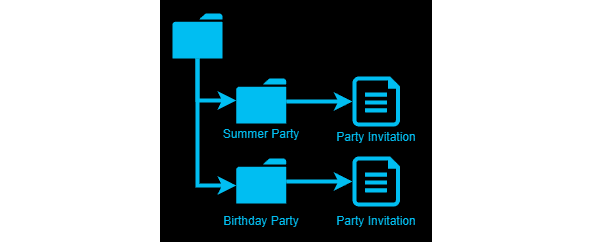
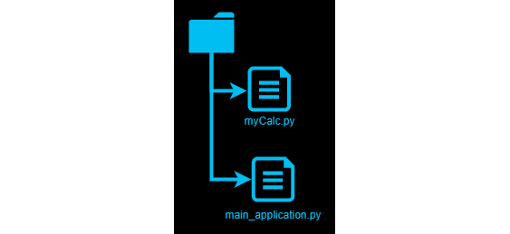

# 第四章：*第四章*：软件项目和我们的代码组织方式

当我们编写软件并且我们的程序增长时，我们需要组织我们的代码，以便在需要维护时易于阅读。一个应用程序可能有数万行或数百万行代码，所以将所有内容放在一个文件中是不可能的。我们需要将代码分成多个文件，但我们如何做到这一点？即使我们将代码放入单独的文件中，我们也会有大量的文件，所以我们需要将它们组织成文件夹。我们如何做到这一点，以便编译器或解释器能够找到它们？当我们需要编辑应用程序的一部分时，我们将知道在哪里寻找？在这一章中，我们将讨论这个问题，并了解我们可以使用的某些模式。

本章将涵盖以下主题：

+   理解代码模块

+   代码项目的概念

+   使用包管理器共享代码

+   深入了解命名空间

+   使用命名空间来避免命名冲突

# 代码模块

如果程序被使用，它们也会更新，如果你是程序的开发者，这意味着你需要编辑源代码来添加功能和修复错误。如果你的代码组织得不好，它将很难阅读和维护，因为你需要更多的时间来找到插入新代码的地方或者那个讨厌的错误可能在哪个地方。

为了使你的代码更容易处理，一个措施是将它分成几个逻辑块。但我们如何决定什么会进入这样的块呢？没有固定的规则来决定如何做这件事，但你所使用的语言可能会给你一些提示，这取决于它希望你怎么结构化代码。最后，最终的决定权在你。

我们编写的代码在逻辑上是相互关联的，所以要做某件事，我们通常需要先做几件其他的事情。这就像你早上醒来，还在床上的时候，突然想起家里没有东西可以做早餐，所以首先你需要去购物。但在你能够去购物之前，你需要做几件其他的事情，比如起床和穿衣服。这些任务都是为了让你能够去购物。从某种意义上说，你可以认为这些事情是相关的，并且按照这种逻辑，它们属于一起。你也可以有不同的看法，比如说你想要早餐，但为了能够得到它，你需要起床，穿衣服，去购物，最后准备早餐。

同样，你的代码中也会有逻辑上属于一起的部分，其中一些事情是为了让你能够做其他事情。在决定如何将代码分成一些逻辑块时，我们需要记住这一点。

除了可读性之外，还有其他原因可以将代码与其他程序部分分开。你可能已经开发了一个你想要在其他程序中重用，甚至分发给别人以便他们也能使用的智能功能。为了能够做到这一点，定义这个智能功能的代码必须与程序的其他部分分开。这意味着它不能与其他代码部分紧密纠缠。如果是这样，那么重用这个程序部分将会很困难。

让我们来看一个例子。想象你正在编写一个应用程序，该应用程序会上线并从几个不同的网站收集数据，然后分析这些数据。这可能是股市价值或来自几个气象服务的温度读数。如果我们创建这个程序，我们需要定义我们的程序将要访问的网站，访问每个网站，下载并存储每个页面，然后遍历所有存储的页面以提取我们需要的资料。

总体来说，我们知道我们需要做什么，以及我们需要按什么顺序做事。我们还知道结果将是我们收集了所需的数据，这样我们就可以开始分析它了。这是好事，因为我们可以将这些事情视为独立的任务，它们应该尽可能独立于彼此。为什么它们独立如此重要？让我们进一步探讨这个应用程序的开发过程，以了解这一点。

如果我们从第一个任务开始，我们应该如何定义要访问的网站呢？我们是要求应用程序的用户通过在用户界面中写下它们来提供给我们地址，还是我们应该有一个文件，我们可以从中读取它们？这两种方法都可行，但我们不想做的是在代码中存储地址，即使这样做是可能的。这样做的原因是我们希望让我们的应用程序的用户能够定义他们要访问的网站。我们不能要求他们更改程序的代码，因为我们不能假设所有我们的用户都是程序员。然而，我们可以给他们一个可以编辑和保存的文本文件，然后我们可以读取这个文件来获取他们的输入。另一个原因是我们要保持灵活性。今天，读取地址可能是最佳选择，但将来，我们可能会发现另一种将地址输入到我们的应用程序的方法。我们不想将解决方案硬编码到我们的程序中，而是使程序尽可能独立于提供我们这些数据的数据源。

下一步我们需要做的是前往之前步骤中定义的每个网站并下载该页面。现在，假设我们已经编写了能够完成这一任务的代码。我们希望保持它与之前步骤的独立性；也就是说，程序的这一部分不应该关心网站地址是如何进入应用程序的。它应该被赋予一个下载该页面并返回页面数据的地址。仅此而已。它不知道这个页面的地址是如何来的，也不知道当它完成任务时页面数据发生了什么。这样，代码的一部分就可以在其他项目中重用，这些项目可能以其他方式接收其地址，并执行与下载页面完全不同的操作。

对于剩余的任务，即存储下载的页面和处理每个页面内的数据，我们努力做到同样的事情：将它们构建为代码的独立部分。以下图表展示了这个概念：



图 4.1 – 一个使用多个独立代码块来完成任务的应用程序

我们现在可以说我们已经有了独立的代码模块。术语*模块*的含义将根据我们使用的语言略有不同。然而，它们都会同意，它是一个独立的代码部分，尽管处理方式可能不同。一些语言表示每个模块将进入一个单独的文件，或者如果是一个大而复杂的模块，则进入多个文件。其他语言将提供在单个文件中定义多个模块的方法。在某些情况下，术语模块几乎不会被使用，即使独立代码部分的概念存在。

将代码视为独立模块的一个好处，正如我们之前所述，是能够在其他应用程序中重用模块。另一个原因是这将使我们更容易更改或替换模块。如果我们的代码部分相互交织并且高度依赖，那么更改代码部分将会更困难，因为我们需要在代码的多个位置进行这些更改，并且我们需要确保我们已经找到了所有需要更改的实例。

当我们将代码分解成这些较小的模块时，我们需要将所有这些内容组合成我们最终的应用程序。为此，我们需要将模块存储在项目中。

# 与软件项目合作

当谈到软件开发时，术语*项目*可以有两种不同的用法：

+   一个用于开发实际程序的协作企业——换句话说，就是一群人共同工作。为此，我们需要一个项目计划、项目负责人等等。

+   我们开发程序所组成的所有文件的容器。

我们将在这里讨论后一种含义——一个包含构成程序的文件容器——因为前一种含义是关于项目管理而不是软件开发。

当我们的代码被分解成定义良好的模块——很可能是几个文件的形式——我们需要一种方法让编译器或解释器找到所有文件，以便它们可以被组装成可执行的机器代码。

创建正确的项目结构通常是通过程序员用来开发软件的工具来完成的。这些工具分为许多类别，但最先进的形式被称为**集成开发环境**（**IDE**）。IDE 的核心部分是用于编写代码的编辑器。它还将帮助我们创建软件项目。编程语言定义了项目应该如何组织。这可以是以不同文件相互关联的形式，例如，一些语言会通过称为软件包的东西来实现。

# 使用软件包共享代码

在软件开发者的文化中，免费共享代码是非常自然的。这使得该行业独一无二，因为程序员经常共享和使用彼此的代码。使用他人的解决方案来解决问题就像分享我的好想法和代码一样自然。通常，重用他人的工作是明智的，因为代码通常是经过良好开发、良好测试和良好维护的。在软件开发中，术语*开源*是众所周知的。这意味着有人有一个应用程序的想法，为它编写代码，然后在线分享它。其他人随后被鼓励帮助这个项目的开发。几个程序员会加入进来，他们一起保持项目的进行。任何感兴趣的人都可以免费使用这段代码。

在这样的项目中开发的代码通常以一个或多个模块的形式存在。如果你想使用这样的模块，你必须找到它，然后你需要下载它。问题是，我们如何找到它，下载它，并确保它被放置在一个位置，以便我们的应用程序可以找到它？

幸运的是，这个问题有一个解决方案：软件包管理器。

## 软件包管理器

软件包管理器是一种软件工具，它将帮助我们查找、下载和安装代码。大多数语言至少会有一个可以帮助我们完成这项任务的软件包管理器。它通过将代码模块，现在称为软件包，存储在中央位置来实现。这个中央存储被称为仓库，或简称 repo。这意味着当你编写一个程序时，你可以访问软件包管理器的网站来搜索可能对你的项目有用的任何软件包。

下面是一些流行语言的软件包管理器列表：



表 4.1

让我们看看我们下载网页的项目示例。您决定下载页面的编码部分感觉有点难以自己编写，所以您搜索您语言对应的包管理器网站，找到一个做您想要的事情的包，然后当给定一个地址时下载网页。

现在，您可以使用包管理器应用程序下载并安装此包，然后从您的代码中调用该包的功能。

假设我们使用 Python。即使我们知道我们可以去 PyPI 网站，我们可能也不确定要搜索什么。相反，我们可以通过 Google 搜索像“Python 下载网页”这样的内容，我们会找到几种如何做到这一点的建议。我们可能会偶然发现几个建议使用名为 **requests** 的东西。

如果我们决定想要尝试 `requests` 包并看看它对我们是否有用，我们可以访问 `pypi.org` 网站，并搜索 requests。然后我们会看到一个像这样的页面：



图 4.2 – pypi.org 上的 requests 项目页面

如果我们在这个页面上滚动，我们会找到安装说明，甚至还有如何使用的示例。还有一个链接到这个项目的网站，在那里我们可以找到文档和更多示例。

安装说明可能看起来像这样：

```py
pip install requests
```

在这里，`pip` 是包管理器。当安装 Python 编程语言时，包管理器 `pip` 也会被安装。我们可以打开命令提示符（如果我们使用的是 Windows）或终端窗口（如果我们使用的是 Mac 或 Linux）并运行此命令。

包管理器将随后访问其在线中央仓库，下载请求的包，在我们的例子中是 `requests`。如果这个包正在使用其他包，我们不需要自己下载它们。包管理器会处理这个问题，并且我们需要的一切以便能够使用此包都将被下载和安装。

既然我们可以下载这个包，我们很快就会遇到另一个问题。我们必须确保，在代码中命名事物时，所有名称都是唯一的。如果不是，程序将无法运行。这可能会很棘手，尤其是在使用他人编写的包时。我们如何知道我们使用的名称尚未被使用？解决方案在命名空间中。

# 使用命名空间避免冲突

当你编写代码时，你将不断地命名事物。问题是，如果你给某个东西起了一个已经被使用的名字怎么办？我们现在知道一个应用程序的代码可以由数千行代码组成，分为数百个文件。你如何确保你给某个东西起的名字没有被占用？我们还了解到我们可以通过代码安装其他人编写的包。我们如何确保他们没有给他们的包起我们已经使用的名字？或者我们如何确保我们安装的包没有使用我们已安装的另一个包正在使用的名字？

如你所见，处理名称可能会很棘手。让我们看一个例子。在*第八章*，“理解函数”，我们将讨论函数是什么以及它是如何工作的。对于这个例子，我们只需要知道函数有一个名称，由几行代码组成。我们使用函数名称来调用它，这将使它内部的代码运行。

在这个例子中，我们正在构建一个计算器应用程序。首先，让我们看看这个应用程序可能的样子：



图 4.3 – 我们的计算器应用程序

当用户点击平方根按钮时（()），我们必须计算当前显示中的数字的平方根。这意味着我们需要将一些代码与点击此按钮时发生的事件连接起来。这段代码需要执行以下步骤：

1.  它需要获取当前显示中的值。

1.  然后，它需要计算该值的平方根。

1.  最后，它需要将结果放入计算器的显示中。

这些指令将在按下平方根按钮时执行，我们将它们放入一个函数中。现在，这个函数需要一个名字。名字`squareroot`相当长，所以你可能决定将其缩短为`sqrt`。

当你到达想要计算平方根的点时，你很可能会使用一个内置函数来帮助我们完成这个任务。大多数语言都会有这样的函数，而且通常，它的名字会是`sqrt`。这是一个问题，因为我们给我们的函数起了一个与语言自带函数相同的名字。我们当然可以改名字。别灰心 – 命名空间将为我们解决这个问题。

## 深入了解命名空间

要理解命名空间是什么，我们可以将我们的计算机上的文件和文件夹想象一下。假设你即将举办两个聚会：一个是夏日聚会，另一个是生日聚会。你为这两个聚会写了两份邀请函，并试图将它们存储在电脑上的一个文件夹中。

你给这两个文件都命名为`Party Invitation`，但在同一个文件夹中你不能有两个同名文件：


图 4.4 – 同一个文件夹中的两个文件不能有相同的名称

而不是重命名一个文件，你可以创建两个文件夹，并将文件分别存储在每个文件夹中。这样，文件仍然可以命名为`Party Invitation`，并且由于它们位于不同的文件夹中，名称冲突不再存在，如下面的图示所示：



图 4.5 – 通过将文件存储在不同的文件夹中来避免命名冲突

总结一下，在计算机上，我们可以有多个同名文件，但文件夹内的文件名必须是唯一的。

许多编程语言使用类似的技巧，称为命名空间。命名空间允许我们在应用程序中多次重用相同的名称，但在命名空间中，所有名称都必须是唯一的。命名空间就像计算机上的文件夹，而我们命名的对象就像文件。

命名空间是如何实现的，这将在不同的语言之间有所不同。让我们来看看一些更流行的语言是如何实现它们的。

## JavaScript 中的命名空间

在 JavaScript 中，当我们定义诸如函数之类的对象时，我们可以通过将我们想要属于命名空间的部分用花括号`{}`包围来创建一个命名空间。

如果我们在名为`myCalc`的命名空间中代表我们的`sqrt`函数，它看起来可能像这样：

```py
var myCalc = {
	sqrt: function() {
     }
}
```

在第一行，我们定义了一个名为`myCalc`的命名空间。我们使用一个开括号来表示命名空间的开始；最后一行的闭括号标志着命名空间的结束。

在括号内，我们找到一个名为`sqrt`的函数。该函数也使用开闭括号来表示其开始和结束的位置。在这个例子中，该函数是空的，所以里面没有内容。

现在，我们可以访问我们自己的函数和内置函数，即使它们都命名为`sqrt`。它可能看起来像这样：

```py
myCalc.sqrt();
Math.sqrt(9);
```

第一行在`myCalc`命名空间中调用了`sqrt`函数。第二行调用了内置的`sqrt`函数。它位于名为`Math`的命名空间中。该函数将接受一个值（我们想要开平方的值），在这里，我们传递了值`9`。

## Python 中的命名空间

在 Python 中，命名空间是由单个模块定义的。Python 中的模块是一个文件，所以文件中的所有内容（即 Python 模块）都在同一个命名空间中。

现在，我们可以创建一个名为`myCalc.py`的文件。`.py`扩展名表示该文件包含 Python 代码。正是在这个文件中我们添加了我们的`sqrt`函数：



图 4.6 – Python 中的项目结构

看看前面的图示。`main_application.py`文件是我们使用`myCalc.py`内部代码的主程序。

在`main_application.py`文件内部，我们现在可以访问内置的`sqrt`函数和我们创建的`sqrt`函数，如下所示：

```py
import math
import myCalc
myCalc.sqrt()
math.sqrt(9)
```

从前面的代码中，我们可以看到以下内容：

1.  在第一行，我们表示我们想要能够使用`math`模块中的内容。记住，Python 使用模块是命名空间的概念，所以`math`既是模块也是命名空间。

1.  第二行对我们包含`sqrt`函数的`myCalc`模块做了同样的事情。

1.  在第三行，我们调用`myCalc`模块中的`sqrt`函数。

1.  在最后一行，我们在`math`模块中调用`sqrt`函数，并将`9`传递给它。

## C++中的命名空间

在 C++中，我们有一个关键字。一个*关键字*是语言保留的单词，具有特殊含义。请参阅*第二章*，*编程语言简介*，以获取对关键字的更详细解释。在这里，我们有一个名为`namespace`的关键字，我们可以用它来定义一个命名空间。它可能看起来像这样：

```py
namespace myCalc{
    void sqrt() {
    }
}
```

在这里，我们首先创建一个名为`myCalc`的命名空间，其中包含一个名为`sqrt`的函数。请注意，就像在 JavaScript 示例中一样，函数有一个开括号和一个闭括号，表示函数的开始和结束，就像那个例子一样，函数是空的。

C++使用特殊语法来访问命名空间内的内容。首先，我们声明我们想要使用的命名空间，然后是两个冒号`::`，然后是我们想要使用该命名空间内的内容。这可以看起来像这样：

```py
myCalc::sqrt();
std::sqrt(9);
```

第一行调用我们之前定义的命名空间中的`sqrt`函数。

第二行调用标准命名空间中的`sqrt`函数，在 C++中称为`std`，并将值`c`传递给它。

## 其他语言中的命名空间

这些只是某些语言中命名空间使用的一些例子。其他语言有自己的变体。例如，在 Java 中，命名空间与包的使用紧密相关。在 C#中，命名空间几乎以与 C++相同的方式实现，但不是使用双冒号访问。相反，它们使用点`.`访问。

现在我们对命名空间有了一些了解，让我们回到我们的计算器应用程序。

## 在我们的计算器应用程序中使用命名空间

我们现在处于想要命名一个`sqrt`函数的阶段，我们已经意识到我们使用的语言也有一个名为`sqrt`的函数。这个内置的`sqrt`函数将计算我们传递给它的任何数字的平方根。我们不想重命名我们的函数；相反，我们想要通过使用命名空间来解决命名冲突。

我们首先需要做的是了解当前语言中命名空间的使用方式。正如我们之前看到的，定义和使用命名空间的方式将在不同语言之间有所不同。

通过在我们的命名空间内添加`sqrt`函数，我们不需要担心与内置的`sqrt`函数或其他可能通过包管理器导入包时获得的函数的命名冲突。所有内容都在不同的命名空间中定义，并且我们需要声明我们想要的函数位于哪个命名空间中。

我们已经知道我们的`sqrt`函数需要做什么：从显示中获取值，计算该值的平方根，然后将结果值放回显示中。

我们将把我们的`sqrt`函数添加到一个命名空间中，以避免与内置版本发生命名冲突。我们还想在函数内部使用内置的`sqrt`函数。我们可以通过指定内置`sqrt`所在的命名空间来实现这一点。

# 摘要

在本章中，重点是组织我们的代码以及如何命名事物，以便我们可以避免命名冲突。

一本书被分成章节是为了使其更容易阅读和导航。同样，我们希望我们的代码也易于阅读和理解。在编程中我们没有章节的概念，但我们有模块。模块是我们应用中代码逻辑相关的一部分；也就是说，以某种方式，它与代码一起工作。模块通常被定义为单独的代码文件。

在更大的项目中，我们可能会拥有大量的模块。因此，我们需要一种方法来组织它们，以便编译器或解释器在所有部件需要组合在一起时可以找到正确的文件。我们通过项目来完成这项工作。我们可以把项目看作是我们所有模块的容器，也是我们应用可能使用的其他资源的容器，例如图像、配置文件等。

编写程序是关于效率，将我们的时间和注意力集中在使程序完成预期任务的重要事情上。我们经常会遇到需要解决我们已知别人之前已经解决的问题的情况。因此，在我们的应用中重用别人的工作是好事，并不被认为是不好的。软件编程社区/行业非常开放和乐于助人，程序员经常从别人那里分享和重用代码。通过这样做，我们可以集中精力在我们应用独特的地方，而不是一遍又一遍地重新发明轮子。

我们可以利用他人编写的代码的一种方法是通过使用通常与语言一起提供的工具，称为包管理器。这些工具将存储我们可以在网上中央位置重复使用的代码。它们还将帮助我们找到我们需要的，并为我们下载、安装和配置它。

然而，随着我们的应用增长，我们使用其他人编写的代码时，我们需要一种避免命名冲突的方法。如果我为我应用中已经使用过的某个东西命名，语言必须有一种方法来区分这两个。这是通过称为命名空间的东西来完成的。我们给某个东西起的名字必须在命名空间内是唯一的。如果我们把我们的应用分成几个命名空间，我们将大大降低命名冲突的风险。

现在，我们终于准备好深入探究编写程序的过程了。在下一章中，我们将探讨任何程序在序列方面的最基本构建模块。
