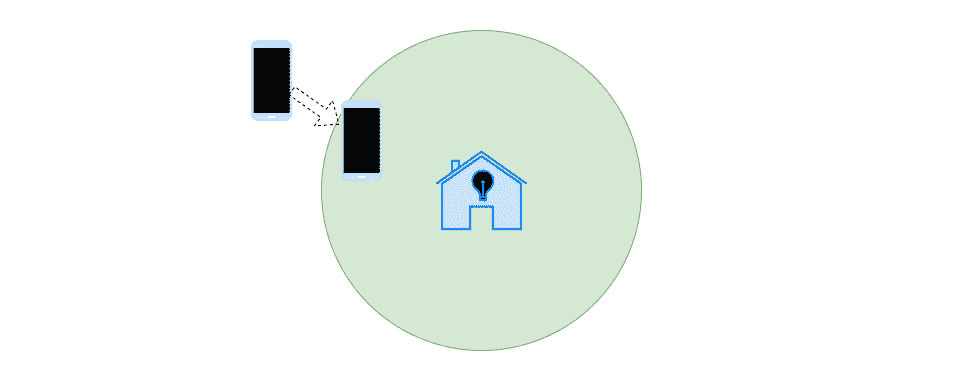
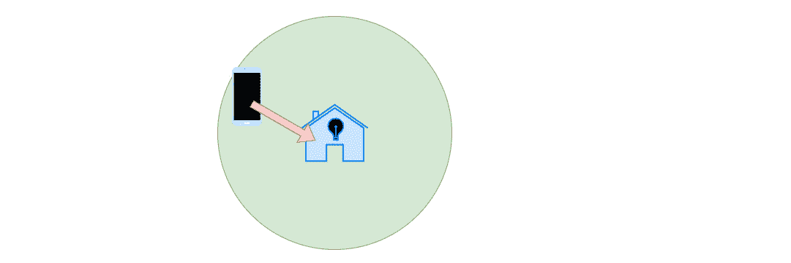
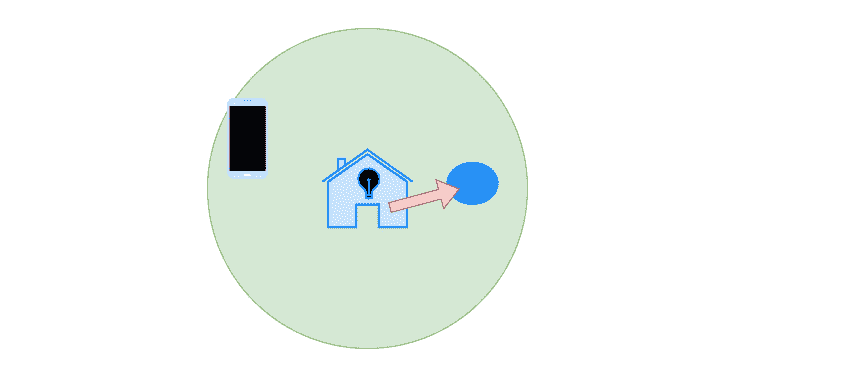
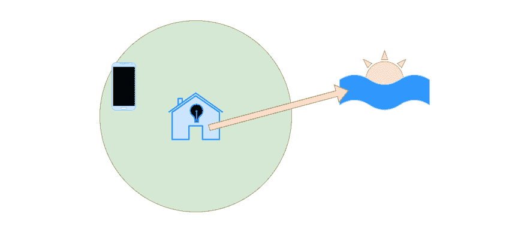
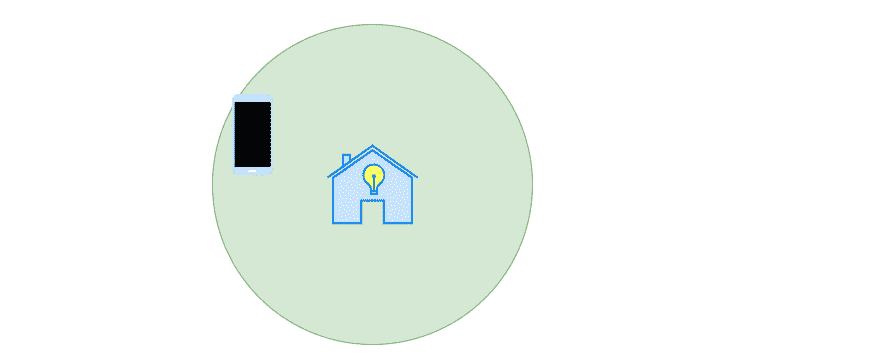
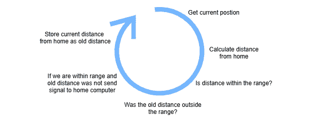
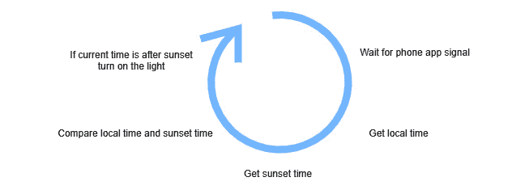
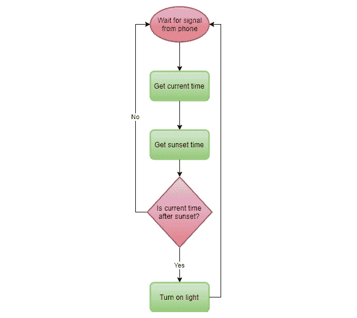

# *第五章：序列 - 计算机程序的基本构建块*

当谈到编程时，最基本的概念是序列。它表示我们做什么以及我们何时依次进行。然而，当我们仔细观察时，我们发现这不仅仅是这样，在本章中，我们将学习它是什么。

我们还将使用序列的概念来决定程序需要执行哪些步骤才能完成其总体任务。由于同时拥有对需要完成的所有事情的概述和查看所有细节可能很困难，我们需要一个概念来帮助我们。例如，考虑程序需要按什么顺序做事，这可能是一个工具。 

当学习如何编程时，许多人面临的一个问题是如何将一个想法转化为行动。你应该从哪里开始？在本章中，我们将学习我们可以使用顺序思维的概念将一个想法分解成更小的任务，然后我们可以处理这些任务。我们还将看到我们可以将同样的概念应用到我们编写的代码中，以确保我们按正确的顺序做事。

在本章中，你将了解以下主题：

+   理解序列的重要性

+   语句是什么以及它是如何定义的

+   不同的语句是如何分隔的

+   如何格式化代码以使其更易于阅读

+   不同的注释类型和记录代码的方法

# 序列的重要性

有一天，当你回到家，你开始渴望一块派，于是你决定自己做一块。你烘焙派的原因并不是因为你喜欢烹饪，而是为了满足你对派的渴望。然而，为了能够得到派，你需要执行几个步骤。首先，你需要一个食谱，然后你需要收集所有的原料。当你收集到它们后，你将按照食谱中的每个步骤进行。最后，当派在烤箱里烤了一段时间并稍微冷却后，你就可以享受你应得的美食了。

你刚刚按顺序完成了一些任务。其中一些任务需要按正确的顺序完成，而其他任务则可以按任何顺序（或者至少可以更轻松地按顺序）完成。你必须先打开烤箱，然后才能烤派，但你在拿出面粉之前拿出黄油并不是必要的。

编程就像烘焙派。我们将有目标，比如我们想要派，为了能够实现这个目标，我们需要做几件事情：在某些情况下，顺序是重要的，而在其他情况下，顺序则不那么重要。

编程全部关于问题解决和将事物分解成更小步骤的艺术。这将在迭代中进行，你首先有一个总体解决方案，然后将这个解决方案分解成越来越小的步骤，直到你达到一个理解每个需要采取的步骤的水平。

这是在你开始学习编程时需要掌握的更困难技能之一。与所有新技能一样，在感到舒适地做这件事之前，你需要大量的练习。一些技巧可以使你更容易获得这项技能。你需要的基本能力是对你试图解决的整个问题的概述，同时关注一个或多个需要解决的子问题的细节。这意味着你需要在保持整个问题整体观的前提下，对细节进行放大和缩小。你可以通过不进行任何编程来练习这一点。玩逻辑谜题游戏，如数独，可以训练你的大脑在关注整体游戏的同时，专注于游戏的各个部分，例如哪些数字可以放入某个单元格。

让我们看看我们如何可以从问题到解决方案在顺序层面上进行。首先，我们需要定义问题。

## 定义问题

你经常在黄昏后回到家，而且你总是忘记在离开家之前打开户外照明。外面太黑了，你害怕在去门的路途中绊倒，而且找到钥匙孔总像是一场赌博。

另一方面，你不想整日开着灯。你也不喜欢那些对动作做出反应的自动灯，因为当邻居的猫经过时，它们会被激活。肯定有更好的解决方案。

## 解决问题的方案

一个解决方案是，如果你能使用你的智能手机的 GPS。如果你在上面有一个持续监控你位置的程序，那么当你从家进入一个给定半径时，它就能以某种方式激活灯光。你很快就会意识到你的解决方案将需要是一个两部分的程序。一部分运行在你的手机上，另一部分运行在你家中的电脑上。运行在你家电脑上的程序会从你的移动应用中接收到信号，表明你现在离家很近。然后它可以与在线服务核对，看看在这一年中，太阳在此时此刻在你的家所在位置是否已经落山。如果是日落之后，程序就可以激活灯光。

我们到目前为止所做的是开始定义一个解决方案。现在我们必须进一步分解这个解决方案。

### 解决方案分解

我们现在对想要实现的目标有了总体了解，同时我们也关注了一些细节。我们决定想要使用手机的 GPS。我们目前还不知道如何实现这一点，但在这个阶段这并不重要。我们知道其他应用程序可以使用 GPS。这意味着我们知道这是可行的，即使我们现在还没有头绪，我们可以在后续过程中学习。我们还决定这将是一个两部分的程序。手机部分除了监控 GPS 外，还需要一种方式来联系我们解决方案的另一部分，即在你家电脑上运行的应用程序。同样，我们不知道如何实现这一点，但我们知道这是可行的，这对现在来说已经足够好了。我们还理解我们需要一种方式来检测我们是否从定义的范围外进入。只有在这种情况下，灯才应该打开。如果我们不这样做，当手机在规定的范围内时，灯将始终是开着的，而我们不希望这样。

家庭应用程序将需要等待来自移动应用程序的信号，然后联系一个可以告诉我们太阳何时落下的服务。在我们的待办事项列表中，我们添加了我们需要找到这样的服务。同样，我们不需要担心如何实现这一点。我们还将找到一种方式让我们的家庭应用程序控制灯光。我们很可能需要一些硬件来完成这一步骤，但那将是我们可以稍后解决的问题。

我们现在有一个需要采取的步骤的顺序列表。这个列表看起来像这样。

下面是移动应用程序的步骤列表：

+   手机是否在预定义的范围内？

+   如果是，它之前是否在范围外，也就是说，我们刚刚进入这个范围？让我们检查：



图 5.1：手机进入预定义的区域

+   如果是，向家庭应用程序发送信号：



图 5.2：手机应用与家庭电脑上运行的应用程序进行联系

下面是家庭应用程序的步骤列表：

1.  等待来自移动应用程序的信号。

1.  当接收到信号时，检查当前时间：

    图 5.3：运行在家庭电脑上的应用程序检查当地时间

1.  检查在线服务以获取当地日落时间：

    图 5.4：运行在家庭电脑上的应用程序联系在线服务以获取当地日落时间

1.  如果时间是在日落之后，打开灯光：



图 5.5：如果时间在日落之后，家庭应用程序会打开灯光

这仍然是对我们需要采取的顺序步骤的一个稍微粗糙的分解。但现在我们已经有了它们，我们可以深入到每个步骤中，并思考我们需要为每个前面的步骤做些什么。

### 手机应用程序的详细分解

让我们逐个步骤地来看，并仔细检查我们需要为每个步骤做些什么。

那么，我们如何知道手机是否在预定义的范围内呢？为了理解这一点，我们首先必须做一些研究。我们需要首先理解的是手机 GPS 是如何知道它所在的位置的。在网上搜索很快就会揭示 GPS 是使用两个坐标：经度和纬度。这两个坐标可以精确地定位地球上的任何位置。这意味着当我们从 GPS 请求当前位置时，我们会得到这些坐标。

当我们有了这些坐标后，我们需要检查我们离家的距离有多远。为此，我们需要知道家的位置，因此手机上的应用程序需要以某种方式存储这个位置，并且它将以经度和纬度的形式存在。

计算两个地理坐标之间的距离不是一项简单的工作，但我们不需要担心，因为这是以前已经多次做过的事情。此外，无论我们使用什么语言，简单的谷歌搜索都会给我们提供许多如何做到这一点的解决方案。我们甚至可能能够使用语言包管理器（参考*第四章*，*软件项目和我们的代码组织方式*，了解什么是包管理器以及它是如何工作的）来找到一个可以进行这种计算的包。

无论我们使用什么解决方案，我们都可以假设我们将使用我们拥有的两个坐标对，即手机的位置和我们的家位置，我们得到的是它们之间的距离。我们还需要决定我们需要离家多近才能激活灯光。这可以是任何距离。

接下来，我们必须检查我们是否是从预定义的范围外进来的。我们需要一种方法来判断我们是进入了预定义的范围，还是我们已经在范围内。我们可以通过跟踪在检查当前位置之前家的距离来做这件事。如果我们之前在范围外而现在在范围内，那么我们知道我们已经足够接近家，可以发送信号打开灯光。

因此，现在我们需要向家庭应用程序发送一个信号。当我们进入范围时，我们需要一种方法让手机应用程序联系家庭电脑。这可以通过几种方式完成，我们目前不需要决定使用哪种技术。

现在，我们可以总结出手机应用程序的顺序。

### 手机应用程序顺序

现在我们已经为手机应用建立了逻辑。我们还知道序列将需要看起来像什么。它看起来可能像这样：

1.  获取当前位置。

1.  计算从家的距离。

1.  这个距离是否在我们定义的足够近以打开灯的范围之内？

1.  我们之前测量的距离，即我们上次检查位置的距离，是否在给定的范围之外？

1.  如果*步骤 3*和*步骤 4*的答案都是是，告诉家用电脑打开灯。如果答案是 否，我们可以回到*步骤 1*。

1.  将从家的距离存储为我们旧的距离。

1.  从*步骤 1*重新开始。

这些步骤在这里进行了说明：



图 5.6：电话应用的序列

这七个步骤将反复进行。当我们执行第一次迭代时，我们需要考虑会发生什么，因为我们不会有旧距离的值。我们可以给它一个初始默认值，这个值远远超出范围，例如，一个负数。

现在我们有一个明确的步骤序列，我们还没有写一行代码。这是好的，因为它将帮助我们开始编写代码，我们可以放大并专注于这些步骤中的每一个，而不会失去对概览的把握。

现在，我们可以将注意力转向家用应用。

### 家用应用的详细分解

起初，家用应用将没有任何事情可做，因为它将只是坐着等待来自手机应用的信号。然而，当它收到那个信号时，它会醒来并开始工作。

当家用应用收到来自手机的消息时，它需要做的第一件事是两件事之一。要么它可以检查当地时间，要么它可以联系日落服务以获取当前的日落时间。这两个操作的顺序不是必要的，因为我们都需要它们，所以我们可以比较它们。

当我们有了当地时间以及日落时间，我们需要比较它们以确定是否是晚上。如果是，打开灯的所有条件都满足，我们会收到一个信号，表明手机在范围内，外面是黑暗的。

现在我们需要打开外面的灯。我们仍然需要弄清楚如何做到这一点。一种方法是可以使用无线控制的 LED 灯。这些灯通常可以通过我们即将创建的应用程序等应用程序进行交互。在购买灯之前，我们应该做一些研究，因为我们需要选择一个可以被我们的应用程序控制的品牌。

### 家用应用序列

家用应用的序列如下：

1.  等待来自手机应用的信号。

1.  当收到信号时，获取当地时间。

1.  联系日落服务以获取当地时间。

1.  将当前时间与日落时间进行比较。

1.  如果是日落之后，打开灯。

1.  返回到步骤 1。

第 2 步和第 3 步可以按任何顺序执行。如果当前时间早于日落时间，应用程序将跳过打开灯光并返回第 1 步。这个顺序在这里表示：



图 5.7：家庭应用程序的顺序

现在我们已经有一个很好的起点，关于如何构建这个应用程序。即使我们仍然对一些事情不太清楚，比如手机应用程序应该如何联系家庭应用程序，家庭应用程序将使用什么服务来检查日落时间以及它将如何与之联系，以及家庭应用程序将如何打开灯光，但不同事情必须执行的顺序现在对我们来说已经很清晰了。

在这一点上，我们已经对我们的应用程序需要做什么有了很好的了解，但我们仍然有许多事情要做。首先，我们需要学习创建此应用程序所需的知识。我们如何从手机 GPS 获取位置？在学习这类事情时，通常一个好的想法是创建一个*玩具项目*，你只需尝试获取坐标并将它们打印到屏幕上。当你弄清楚这一点后，你就可以将这个解决方案应用到你的实际项目中。在单独的项目中这样做是聪明的，因为你可以一次专注于学习一件特别的事情。另一个例子是我们需要实现一种计算两个地理坐标之间距离的方法。在测试不同的解决方案时，应用同样的原则在单独的应用程序中执行。当你得到结果时，你应该找到一个提供这种计算服务的在线服务，以便你可以验证你的结果。在编程中，你永远不会停止学习新事物和技术。总有你从未做过的事情。但不要让这阻止你。

这是计算机程序中序列的一个方面。另一个点是更小层面上发生的事情。在我们编写的代码中，我们执行的每个步骤都需要分解成称为*语句*的东西，而这些语句将按顺序执行。

## 理解语句

在许多编程语言中，我们编写的代码序列由被称为语句的东西组成。语句表达了一些要执行的操作，并由几个内部组件组成。这些被称为表达式。

### 表达式

语句由表达式组成，而表达式由更小的部分组成。让我们参考一个例子：

```py
5 + 4
```

这是一个由三个部分组成的表达式。在这里，我们使用加法运算符`+`进行操作。在运算符的两侧，我们有形式为两个常量值的操作数，`5`和`4`。

一个语句可以由多个表达式组成。看看下面的代码：

```py
result = 5 + 4
```

这里，我们有一个与之前相同的表达式，`5 + 4`，但现在左侧有一个新的表达式：


图 5.8：包含两个表达式（一个加法和一个赋值）的语句

再次，我们有两个操作数，右侧的加法结果`9`，左侧有一个称为*变量*的东西，名为`result`。变量是我们使用我们定义的名称在内存中存储数据的一种方式：


图 5.9：当计算加法的结果时，可以执行赋值表达式

我们将在*第六章*中更多地讨论变量，*使用数据 – 变量*。我们还介绍了一个第二个运算符，`=`。这个运算符被称为赋值运算符。它将右侧的内容存储在左侧：


图 5.10：名为`result`的变量可以表示为一个框；赋值将一个值存储在那个框中

要完成这个陈述，必须按照正确的顺序处理表达式。这被称为运算顺序。

### 运算顺序

要将加法的结果存储在名为`result`的变量中，我们必须首先执行右侧的表达式；即加法，如下所示：

```py
result = 5 + 4
           9
```

当右侧的表达式完成时，我们可以想象我们的语句将看起来像这样：

```py
result = 9
```

现在，这个最终表达式可以执行。`9`的值被分配（存储）在`result`变量中。

一个陈述可以由多个表达式组成。考虑以下内容：

```py
result = 5 + 4 * 2
```

在这里，我们首先必须理解的是运算顺序，即加法和乘法执行的顺序。如果我们先做加法，我们会做`5` `+` `4`，结果是 9，然后 9 乘以`2`，结果是 18。

如果我们首先执行乘法，我们会得到`4`乘以`2`，结果是 8，然后`5 +` 8，结果是 13。所以，顺序很重要。每种编程语言都有一个明确的运算顺序，即操作必须执行的不同顺序。

在这个例子中，顺序将与数学中的顺序相同；乘法将在加法之前执行：

```py
result = 5 + 4 * 2
               8
result = 5 + 8
           13
result = 13
```

如果我们想要覆盖内置的运算顺序，我们可以使用括号，如下所示：

```py
result = (5 + 4) * 2
```

现在先执行加法，因为它是括号内的，所以变量`result`现在将存储 18 的值（9 乘以 2）。

有些陈述由多于一行组成。这些通常被称为复合语句。接下来让我们探索一下这些是什么。

## 复合语句

复合语句是跨越多行的语句。这些复合语句由一个或多个*普通*的单行语句组成。它们也可以由其他复合语句组成，正如我们稍后将要学习的。例如，在我们的打开灯的应用程序中，我们在做某事之前必须满足一些条件。一个条件是，只有当当前时间在日落之后，我们才打开灯。这种逻辑可以用流程图来表示：



图 5.11.家庭应用程序的流程图

如您所见，我们打开灯的部分只有在日落之后才会执行。因此，为了执行这个语句，我们必须满足一个条件。这个条件是一个语句，但这个语句包括打开灯的语句。

在代码中，它可能看起来像这样：

```py
wait_for_phone_signal()
current_time = get_current_time()
sunset_time = get_sunset_time()
if current_time > sunset_time then
    turn_on_light()
end_if
```

上述代码的第一行包含一个单独的语句。它是一个函数调用。我们将在*第八章*中更详细地讨论函数，*理解函数*。我们可以看到它是一个函数，因为它以括号结束。现在，我们可以将这些括号视为表示某物是一个函数的指示。调用函数意味着，在某个地方，有若干行代码被赋予了一个名字。调用函数意味着我们将跳转到那个位置并执行那些行。在这个例子中，函数的内容是不可见的。这个函数将使程序停止，直到手机接收到信号。

第二行的语句由一个操作组成，包含一个操作符和两个操作数。我们认出等号是赋值操作符。这意味着右边的任何内容都将被分配（记住，我们可以看到赋值，因为右边的将存储在左边的项中）到左边。在左边，我们有一个可以包含值的变量。它有一个名为`current_time`的名字。右边的是另一个函数调用。这个函数将获取当前时间并返回它。当这个语句执行后，当前时间将被存储在`current_time`变量中。

第三行类似于第二行。这个陈述也是由一个操作符和两个操作数组成的。右边的操作数再次是一个函数调用。这是将联系在线日落服务的函数，并为我们所在位置返回日落时间的函数。在左边，我们有一个名为`sunset_time`的变量，我们将从函数返回的时间赋值给这个变量。当这个语句执行后，我们将日落时间存储在`sunset_time`变量中。

第 4 行以`if`开始。这是一种特殊的语句，跨越多行。这个例子涵盖了第 4 到 6 行。它包含另一个语句，即第 5 行的语句。第 4 行是一个条件。它检查`current_time`变量中的值是否大于`sunset_time`变量中的值。这可能为真或为假。如果是大于，即语句为真，那么这个复合语句内部的代码将被执行。如果是假的，`current_time`中的值不大于`sunset_time`中的值；该语句内部的代码将不会执行。在这种情况下，复合语句的结束是最后一行：`end_if`。它表示从以`if`开头的行到`end_if`行之间的所有内容都是该语句的一部分。需要注意的是，逻辑上存在一个缺陷，因为这个条件在当前时间是午夜之后将不会工作，但现在我们先忽略这个问题。

第 5 行开启灯的语句再次是一个函数调用。此外，请注意，这一行以一些空格开头。这被称为缩进，我们将在本章后面更详细地讨论它。

我们现在知道，语句由表达式或其他语句组成。为了能够确定一个语句的结束和另一个语句的开始，一种语言将定义它们是如何分隔的。如何实现这将是语言语法的一部分。让我们接下来探索我们如何做到这一点。

## 分隔语句

一种编程语言将通过定义语句结束的位置来分隔语句。如果语言能够确定一个语句的结束位置，它也知道紧随其后的是什么必须是从另一个语句的开始。

语言有不同的方式来定义这一点。如果我们比较不同语言如何终止语句，我们会看到我们有三种主要的方式来实现它。许多语言将通过插入新行来终止语句。这意味着，一般来说，如果不是复合语句，每一行都是一个单独的语句，因为它需要被独特地处理。

另一种流行的终止语句的方式是使用分号`；`。对于使用这种技术的语言，我们可以在单行上有多个语句。语言知道一个语句的结束是在它看到分号的那一刻。

第三个变体是使用句点`.`而不是分号。除此之外，它的工作方式与使用分号时相同，这样我们就可以在单行上有多个语句。

A few languages will use other techniques, such as using a colon instead of a semicolon.

一些以新行终止语句的语言包括以下：

+   BASIC

+   Fortran

+   Python

+   Ruby

+   Visual Basic

一些以分号结束语句的语言包括以下：

+   C

+   C++

+   C#

+   Go（即使编译器会自动插入它们）

+   Java

+   JavaScript

+   Kotlin

+   Pascal

+   PHP

+   Rust

一些使用其他符号来终止语句的语言包括以下：

+   ABAP（句点）

+   COBOL（空白字符，如空格、制表符或换行符；有时，句号）

+   Erlang（句号、逗号和分号）

+   Lua（空白字符，如空格、制表符或换行符）

+   Prolog（逗号、分号和句号）

对于复合语句，我们需要一种方法来定义它们的开始和结束位置。由于复合语句由一个或多个语句组成，许多语言将使用另一种方法来终止它们。

在这里，我们将找到语言使用的主要三种技术。一种是使用花括号 `{}` 来指示复合语句的开始和结束位置。括号之间放置的所有内容都被认为是复合语句的一部分。

在这样的语言中，我们之前代码中看到的复合 `if` 语句应该看起来像这样：

```py
if current_time > sunset_time {
    turn_on_light()
}
```

如你所见，第一行的末尾有一个开括号，最后一行有一个闭括号。

使用这种技术的语言示例包括以下：

+   C

+   C++

+   C#

+   Go

+   Java

+   JavaScript

+   PHP

另一种实现方式是使用结束语句。不同的语言对此会有细微的差别。

这里有一些例子。

在 Ada 编程语言中，一个 `if` 语句看起来是这样的：

```py
if current_time > sunset_time then
    turn_on_light();
end if
```

在 Modula-2 中，同样的语句只是略有不同：

```py
IF current_time > sunset_time THEN
    turn_on_light();
END;
```

Ruby 有另一种与此类似的变体：

```py
if current_time > sunset_time 
    turn_on_light()
end 
```

最后一种变体是使用缩进来完成同样功能的语言。记住，缩进是我们使用空格来推入代码的时候。

如果你查看所有前面的例子，包含 `turn_on_light` 的行总是缩进的。在这些语言中，这仅仅是因为它使代码对我们人类来说更容易阅读。然而，一些语言会使用这种方法来定义复合语句的开始和结束位置。

其中一种语言是 Python。Python 的代码示例应该看起来像这样：

```py
if current_time > sunset_time: 
    turn_on_light()
```

在这里，所有缩进的都包含在复合语句中。为了表明随后出现的内容不是语句的一部分，它应该与 `if` 语句在同一级别上书写，如下所示：

```py
if current_time > sunset_time: 
    turn_on_light()
result = 4 + 5
```

在这里，最后一行不是复合语句的一部分，因为它没有缩进。

如前所述，缩进可以用来使代码更容易阅读，而一些语言会使用它来终止复合语句。让我们继续讨论代码可读性的重要性以及我们如何使用缩进和空行来提高它。

## 通过缩进和使用空行使代码可读

自从我们远离机器代码以来，我们的动机就是希望代码对人类来说更容易阅读和编写。我们在编写代码时应该记住这一点，因为代码不仅仅是对计算机的指令，还需要我们或其他人维护。

正如我们所学的，我们可以使用缩进来使代码的意图对阅读者更加清晰的一个工具是缩进。

### 缩进技术

缩进是我们用来显示某些代码行在代码块中属于一起的技术。这通常用于复合语句。由于复合语句可以由其他语句或其他复合语句构成，因此缩进对于能够看到语句属于哪个代码块变得至关重要：


图 5.12：缩进代码将是一个视觉辅助工具，表明复合语句是如何构建的

即使前面的图中的线条只是线条，我们也能辨认出它们所代表的单个组件。如果我们像图 5.13 中那样给它们上色，我们可以看到这一页由四个语句组成。第一行是一个单行语句，然后我们有绿色线条：这些是复合语句，从第 2 行开始。再次，紫色线条是复合语句，最后我们有一个单行语句组成的一行。

虚线表示复合语句，由单行语句和复合语句组成，如缩进所示。点线也是同样的情况：


图 5.13：虚线表示包含另一个复合语句的复合语句；同样适用于点线

正如您所看到的，如果我们知道如何解释它，缩进将向读者传达大量信息。因此，在编写代码时，我们务必小心地正确处理缩进。在大多数语言中，这种信息只对人类读者有趣。编译器或解释器会忽略缩进。但有些语言，例如 Python，使用缩进来定义复合语句，这使得缩进成为强制性的，并且是语言语法的一部分。

通常，程序员用来编写代码的文本编辑器会帮助进行代码缩进，要么通过自动缩进复合语句内的代码，要么通过提供内置命令，当执行时，将适当地格式化代码。

我们还可以使用另一种格式化技巧来使我们的代码对人类读者更易读。其中一个技巧就是使用空行。

### 空行

空行分隔本书中的段落。原因很明显。没有它们，文本将难以阅读。这些空行不是随机插入的。段落内的文本在逻辑上是相连的。我们可以通过创建一个新的段落来表示文本的焦点变化，即在文本中插入一个空行。

同样的情况也适用于代码。空行是为了人类读者插入的。它用于显示程序员的目的。如果三个语句在逻辑上以某种方式相连，我们可以在最后一个语句后添加一个空行来表示这一点。

以下是一些 Python 代码。了解这段代码的功能并不重要，但请观察缩进和空行的使用：

```py
for n in range(1000,3001):
    str_num = str(n)
    split_str = list(str_num)
    all_even = True
    for x in split_str:
        if int(x) % 2 != 0:
            all_even = False
    if all_even:
        print(n, ",", end = "")
```

在这里，我们可以看到所有代码都在一个单独的复合语句中，除了第一行之外的所有行都进行了缩进。向下看，我们可以看到其他复合语句。每当缩进级别增加时，一个新的复合语句开始，当它减少时，一个结束。

同时也有一些空行。这表明空行前后的行之间存在逻辑联系。

让我们看看第 2 行和第 3 行以及它们是如何连接起来的。在第 2 行，我们准备了一些数据，以便它以正确的形式用于第 3 行的操作。在这里，我们可以看到序列的重要性。第 3 行需要一个特定格式的数字。因此，第 2 行准备了数字，以便在第 3 行使用。

当这两行完成时，程序会稍微改变其焦点。即使我们不了解代码的功能，缩进和空行所携带的信息将给我们提供线索，使代码更容易阅读。

空行也是编译器和解释器会忽略的内容，因此它们是为了我们人类而存在的。正如正确使用文本中的段落至关重要一样，我们必须以有意义的方式使用空行，以帮助我们的代码读者。

另有一个工具我们可以用来使我们的代码更容易被人阅读理解，那就是注释。

## 使用注释使代码可理解

缩进和空行并不总是足以使代码的意图清晰。在这种情况下，我们可以使用注释。注释是一行普通文本，插入到代码中，仅供人类阅读。我们使用它们来解释那些一眼看去并不明显易懂的代码行。

由于编译器或解释器会忽略注释，我们需要一种方式来指示某物是一个注释。我们有两种注释的变体；一种是从行尾开始，称为*行注释*，另一种是跨越多行，通常称为*块注释*。让我们依次了解以下内容。

### 行注释

行注释有一些符号表示注释的开始，并继续到该行的其余部分。这些可以插入到单独的一行或代码的末尾，该代码将执行。

作为语言语法的一部分，用于指示这些注释开始的符号是定义好的。有些是通用的，尽管某些语言可能会使用更不常见的变体。

许多语言中最常用的符号是双斜杠`//`，它由两个没有空格的斜杠组成。即使这个符号由两个字符组成，它也被视为一个单独的符号。

使用此方法进行行注释的语言包括以下内容：

+   C

+   C++

+   C#

+   Go

+   Java

+   JavaScript

+   Kotlin

+   PHP

许多语言使用的另一个常见符号是哈希符号 `#`。尽管这是一个不同的符号，但它的处理方式与双斜杠相同。

哈希符号被以下语言等用于行注释：

+   Perl

+   Python

+   Ruby

一些语言有其他表示注释的方法。在 BASIC 中，缩写为 `'`。

`⍝`。

Ada 和 Lua 是两种使用双破折号 `--` 来表示行注释的语言。

Haskell 也使用这种方法。Haskell 还有另一种处理注释的独特方式，称为 `>`。所有其他行都被视为注释。

Pascal 以及与 Pascal 密切相关的语言，如 Modula-2，使用 `(*` 来表示注释的开始，并用 `*)` 来标记结束。

与 Lisp 相关的语言，如 Common Lisp 和 Clojure，使用分号 `;` 来表示行注释。

使用行注释可能看起来像这样：

```py
result = 4 + 5 //Adds 4 and 5 and stores the sum
```

第一部分是正常执行的代码，但一旦编译器或解释器看到注释符号 `//`，它就会忽略这一行的其余部分。

使用哈希符号作为注释的语言中的相同代码将看起来像这样：

```py
result = 4 + 5 # Adds 4 and 5 and stores the sum
```

这些注释也可以单独一行，如下所示：

```py
// Adds 4 and 5 and stores the sum
result = 4 + 5 
```

或者，注释也可以这样出现：

```py
# Adds 4 and 5 and stores the sum
result = 4 + 5 
```

这种分隔将取决于语言。

有时，我们希望注释跨越多行。而不是在注释的每一行开始处都有行注释符号，我们可以使用块注释。

### 块注释

块注释有一个符号表示注释的开始，另一个符号表示注释的结束。

使用双斜杠符号作为行注释的语言通常会使用 `/*` 来表示块注释的开始，并用 `*/` 来表示结束。包括以下语言在内的这些符号包括：

+   C

+   C++

+   C#

+   Go

+   Java

+   JavaScript

+   PHP

Perl 使用 `=begin` 来表示块注释的开始，并用 `=cut` 来标记结束。

Ruby 有一个类似的概念，使用 `=begin` 和 `=end` 分别标记开始和结束。

Python 没有块注释，而是使用 `'''` 或 `"""` 这样的东西。它们以开始时使用的相同三个字符结束。所以，如果你在开始时使用了单引号，就使用三个单引号来结束注释；否则，使用三个双引号。

如果我们使用 `/*` 和 `*/`，代码中的块注释可能看起来像这样：

```py
/* Program that receives a signal
   from a mobile phone, checks the local time,
   and sunset time and if it is after sunset
   turns on the outside light. */
wait_for_phone_signal()
current_time = get_time()
sunset_time = get_sunset_time()
if current_time > sunset_time then
    turn_on_light()
end_if
```

程序员也可以在注释中使用几个常用的标签来表示某些内容。

### 标签

有时，程序员想要使用标签标记代码中的某个部分，以便容易找到这个位置。这些标签是非正式的，但其中一些是常用的：

+   `BUG`：代码中已知需要修正的错误。

+   `FIXME`：已知需要修正的错误或其他必须修正的内容。

+   `HACK`：标记一个结构不良或编写不优的代码部分，应该重写。

+   `TODO`：标记一个稍后将要插入的位置。

这些标签写在注释中，主要用于使它们可以通过像 Unix grep 工具（一种在文本文件中进行搜索的工具）这样的工具找到。一些编程编辑器甚至会突出显示这些标签中的一些。

注释也可以用来移除代码。

### 注释代码

有时，程序员需要删除几行代码来尝试某事或隔离一个错误。而不是删除这些行，他们可以用行注释或块注释来注释掉这些行。这样，在需要再次使代码生效时，很容易移除注释符号。

如果我们在重写代码部分，这个技术也可以使用。在这种情况下，当我们在构建新代码时，保留旧代码作为参考是一个好主意，这样我们就不会忘记需要做的事情。我们可以将旧代码放在注释中；然而，当我们完成时，我们应该移除旧的注释代码，因为它会在阅读代码时分散我们的注意力。

编译器或解释器将忽略大多数注释，但并非全部。一些注释可能具有特殊的指令意义。

### 指令注释

有一些例子表明，注释可以为语言编译器或解释器提供意义。

一些语言，如 Python，如果我们在一个 Unix 系统上使用它，并在代码文件的第一行使用一个看起来像注释的符号，就可以这样做。这个符号被称为*shebang*，由一个井号符号后跟一个感叹号组成，即`#!`。

这被用作指令，不是给其他人类，而是给 Python 解释器，以便它知道应该使用哪个版本的 Python 来解释这个程序。

Python 还有一个叫做*魔法注释*的东西，它标识了源代码文件所使用的字符编码。它以`# -*- coding:`开始，以`-*-`结束。

一个同时使用指令的 Python 程序可以以两行看起来像这样的代码开始：

```py
#!/usr/bin/env python3
# -*- coding: UTF-8 -*-
```

由于 Python 使用`#`作为行注释的符号，它们可能看起来像是两个普通的注释。在阅读代码时，这可能会有些令人困惑，我们应该意识到这些是给解释器的指令，而不是给人类的。

如您所见，注释可以用几种不同的方式使用。让我们更详细地看看一些典型的用法。

### 利用注释

如何最佳地使用注释是一个有争议的话题，通常你会得到相互矛盾的建议。在我们讨论人们对注释的一些看法之前，让我们先考察一些典型的用法。

#### 规划和审查

注释可以在编写代码之前用来规划代码的结构。当编写应用程序的复杂部分时，有些人喜欢在专注于真实代码之前，用注释来绘制逻辑图。

#### 代码描述

注释的一个日常用途是总结代码部分的功能并解释程序员的意图。你不应该使用注释来用英语重写代码的功能。如果你觉得你需要这样做，那么代码可能过于复杂，应该进行修改。

#### 算法描述

有时，我们会实现需要用文本和图表进行解释的复杂算法。这通常是理解代码所需的基本知识。这些解释有时可能相当广泛。以下是一个示例。这个注释是从 Python 语言本身的一部分取出的。如果我们计算那个模块中注释的行数，我们会看到它们超过了 77%：

![图 5.14：描述 Python 编程语言中 process.py 模块的注释示例]

Python 编程语言

图 5.14：描述 Python 编程语言中 process.py 模块的注释示例

Python 语言是开源的，所以任何人都可以查看或下载它的代码。如果你想看看编程语言的代码是什么样的，你可以在[`github.com/python/cpython`](https://github.com/python/cpython)查看。

**注释争议**

关于如何以及何时使用注释的争论永无止境。有些人认为代码应该使用很少的注释，认为源代码应该以自解释或自文档化的方式编写。这种观点的动机是，如果你了解一种语言，你应该能够通过阅读代码来理解意图。如果你做不到，代码就需要重写。

另一些人可能会争论，代码应该像前图所示那样进行广泛注释。

在这些观点之间，你会发现一些人认为注释本身既不有益也不有害，应该在使用时谨慎，只有在它们提供额外价值时才使用。

因此，总结一下，在本节中，我们了解到注释是解释代码的工具。但它们也用于文档。此外，标签可以用来记录未来需要处理的事情。

# 概述

在本章中，我们讨论了编程中最基本的概念：序列。

顺序思维可以帮助我们组织思想，以便我们可以将它们分解成更小的部分。正如我们在本章中提到的，掌握程序需要做的一切可能很困难，因此我们需要一种方法来专注于细节，同时不失对程序需要做什么的整体了解。

按顺序做事的概念也是任何程序的核心，因为我们写的指令是依次执行的。这很重要，因为我们需要确保这些指令的顺序是正确的。

我们编写的指令由语句组成，我们了解到有些语句简短且简单，而有些则可以跨越多行，由其他语句组成。有些是更小的构建块，被称为表达式。我们现在处于一个抽象级别，可以处理诸如将两个数字相加这样的细节。

将代码分解成越来越小的块，使我们能够思考如何构建我们的解决方案。有时，我们需要记录我们的思考过程，以帮助我们或其他读者了解我们选择这种解决方案的原因。我们了解到注释可以用于此目的。

注释也可以用作代码的文档，以便清楚地了解其功能和使用方法。此外，我们还看到注释可以指向语言编译器或解释器，以向其提供指令。

如我们从前面的章节所知，计算机程序将数据作为其输入，将其存储在内存中，处理这些数据，并以新的数据作为其输出。数据是一个关键概念，因此，在下一章中，我们将学习如何与之交互以及为什么这种类型的数据如此重要。
