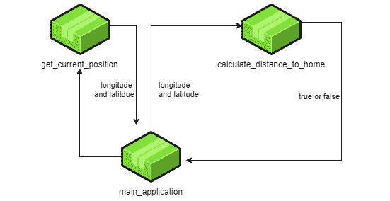

# *第八章：理解函数*

作为程序员，我们始终应该遵循一些有用的概念。一个是编写易于阅读和理解的代码。另一个是避免代码重复。当你作为程序员开始职业生涯时，你会发现自己正在复制粘贴代码，只是在这里或那里做一些小的改动。这是一个坏习惯，因为它抵消了代码易于阅读的第一个概念，因为反复阅读几乎相同的行是乏味的，而且很难发现微小的差异。

一个更好的解决方案是将我们希望多次重用的代码打包成一个函数。函数是我们给代码块命名的一种方式，然后，通过这个名称，代码块可以在我们想要它执行时被反复调用。

在本章中，你将学习以下内容：

+   决定什么放入函数

+   编写函数

+   从函数返回值

+   向函数传递参数

+   与局部和全局变量一起工作

# 决定什么放入函数

函数是我们将代码块打包并给它命名的一种方式。这有几个原因。在*第四章**，软件项目和我们的代码组织方式*中，我们讨论了软件模块，将我们的代码分成小块是明智的，因为它会给我们带来易于阅读、更新和维护的代码。同样的原因也适用于函数，因为它们也将我们的代码打包成更小的单元。我们想要使用函数的另一个原因是我们可以轻松地重用代码的某些部分。

当决定将什么放入函数时，我们可以遵循一条经验法则。函数应该始终只做一件事，并且它的命名应该反映这一点。这意味着如果我们有一个名为 `send_email_and_print_invoice` 的函数，我们就是在做错事。这个函数执行了两个不同的任务，因此应该有两个独立的函数。我们可以用罗伯特·C·马丁（Robert C. Martin）的话来重新表述这个规则，他是关于编写干净代码的优秀书籍的作者：

“函数应该做某事或回答某个问题，但不能两者兼而有之。”

这意味着函数要么应该有一个非常明确的任务并且只做那个任务，不做其他任何事情，要么应该回答一个明确的问题并且只回答那个问题，不做其他任何事情，而且一个函数绝对不应该同时做这两件事。

罗伯特·C·马丁关于函数的另一个引言如下：

“函数的第一规则是它们应该是小的。”

这是一句有趣的话，因为它提出了一些问题。如果我有一个非常明确的问题，我想要将其包装在一个函数中，以便它遵循第一个引号，但问题相当复杂，结果函数最终变成了几百行代码？这不会与第二个引号相矛盾吗？是的，它会，我们需要处理它。我们可以将这个长函数分解成子任务，并将这些子任务移动到单独的函数中。我们如何将函数分解成几个更小的函数可能一开始看起来并不明显，但这是我们在*进一步拆分代码*部分将要看到的内容。

如果我们带着第一个引号来创建一个函数，它只做一件事，如果这是真的，那么将其分解成更小的事情是否会与第二个引号相矛盾，意味着函数做了几件事？不，不一定。想想你经常做的事情，比如制作早餐。这是一件单独的事情，但它可以分解成几个更小的部分，这些部分共同构成了烹饪早餐的任务。你会做咖啡或茶，烤一些面包，煮一个鸡蛋，等等。

观察以下图：


图 8.1 – 使用其他函数来完成其任务的函数

上述图示说明了如何将一个函数（这里称为**函数 A**）分解成几个更小的函数，为了完成其任务，它使用了**函数 B**、**函数 C**和**函数 D**的子任务。将此与以下图示进行比较，其中我们以相同的方式展示制作早餐：


图 8.2 – 将制作早餐的任务分解为子任务

函数是计算机程序的重要构建块；让我们看看我们如何编写它们。因此，在了解一个函数由什么组成之后，让我们看看如何使用它。

# 编写一个函数

让我们看看函数在代码中的样子：

```py
function name()
   code within this function
   more function code
end_function
```

在这里，我们看到一个函数有一个名字，就像一个变量一样。一种语言用于命名函数的约定通常与用于变量的约定相同。如果你不记得那些是什么，你可以在*第六章**，*与数据一起工作 – 变量*，*命名约定*部分找到它们。

在函数名之后，我们找到开括号和闭括号。每次我们提到这个函数时，它们都会跟在名字后面。它们还会有另一个用途，我们将在本章后面看到。

之后，我们看到一个代码块，循环和`if`语句的主体等。这是当函数被调用时将执行的代码。

函数可以通过其名称来调用，我们绝不能忘记括号。调用前面的函数看起来像这样：

```py
name()
```

这个函数内的所有代码现在都会运行。一旦完成，程序执行将返回到调用发生的地方，并继续执行。

以下程序说明了这一点：

```py
function say_hi()
    print "Hi there!"
end_function
print "Before the function"
say_hi()
print "After the function"
```

即使函数的代码在函数的其他部分之上，它也不会执行，直到我们调用函数，所以运行这个程序时的输出将是这样的：

```py
Before the function
Hi there!
After the function
```

我们现在可以像我们喜欢的那样频繁地调用函数，并且每次调用时它内部的代码都会运行。例如，检查以下代码：

```py
function say_hi()
    print "Hi there!"
end_function
print "Before the function"
say_hi()
say_hi()
say_hi()
print "After the function"
```

我们可以看到我们调用了三次函数。这在输出中得到了反映，如下所示：

```py
Before the function
Hi there!
Hi there!
Hi there!
After the function
```

现在我们知道了函数的样子，我们可以尝试编写一个更现实的函数，看看它如何使代码更容易阅读和结构化。

## 将代码移动到函数中

假设我们正在编写一个程序，计算自午夜以来过去了多少秒。

这个代码可能看起来像以下这样：

```py
time_now = now()
time_midnight = Date(time_now.year, time_now.month. time_now.    day)
time_diference = time_now – time_midnight
seconds_since_midnight = time_difference.total_seconds()
```

这段代码首先获取当前的日期和时间。请注意，这是一个完整的日期时间，即年、月、日、小时、分钟和秒。所有这些都被存储在`time_now`变量中。

在第二行，我们创建了一个对象，它将保存上一个午夜的时间和日期。我们使用当前年、月和日。因为我们有当前日期和时间存储在`time_now`变量中，我们可以使用它来获取当前年、月和日。这将把小时、分钟和秒设置为 0，因为我们没有为它们提供值。这个想法是，今天的日期，`hour = 0`、`minute = 0`和`second = 0`就是上一个午夜。

然后，我们取当前的日期和时间，减去午夜的时间和日期。这将给出现在和过去午夜之间的时间差。

最后，我们使用这个差值并将其转换为总秒数。在这种情况下，`time_difference`变量是一个可以保存时间信息的对象，即自午夜以来过去了多少小时、分钟和秒。这如何工作会因语言而异。在这里，这个对象提供了给我们这个时间以总秒数的功能。现在我们有一个名为`seconds_since_midnight`的变量，它包含了自上次午夜以来经过的秒数。

但如果我们想在程序中的多个地方反复这样做，我们最终会得到类似这样的结果：

```py
time_now = now()
time_midnight = Date(time_now.year, time_now.month. time_now.    day)
time_diference = time_now – time_midnight
seconds_since_midnight = time_difference.total_seconds()
do some other stuff
do some more stuff
time_now = now()
time_midnight = Date(time_now.year, time_now.month. time_now.    day)
time_diference = time_now – time_midnight
seconds_since_midnight = time_difference.total_seconds()
```

如我们所见，计算时间的四行代码被重复了。而且我们每次想要得到自午夜以来经过的秒数时都需要这样做。

一个更好的解决方案是将执行计算的代码移动到函数中。它可能看起来像这样：

```py
function calculate_seconds()
   time_now = now()
   time_midnight = Date(time_now.year, time_now.month. time_      now.day)
   time_diference = time_now – time_midnight
   seconds_since_midnight = time_difference.total_seconds()
end_function
```

每次我们需要进行计算时，现在都可以调用函数，我们不再需要重复编写代码。

完整的程序现在看起来是这样的：

```py
function calculate_seconds()
   time_now = now()
   time_midnight = Date(time_now.year, time_now.month. time_      now.day)
   time_diference = time_now – time_midnight
   seconds_since_midnight = time_difference.total_seconds()
end_function
calculate_seconds()
do some other stuff
do some more stuff
calculate_seconds()
```

如我们所见，这要好得多，因为我们只需要编写一次计算时间的代码。但我们确实有一个问题。计算的结果被*困住*在函数内部。通过困住，我的意思是，我们计算了正确的秒数，但获得的价值无法从函数中出来，所以我们无法在函数外部使用这个值。为了解决这个问题，我们需要将结果返回给调用者。让我们看看这是如何工作的。

# 从函数返回值

函数背后的思想是，它不仅可以用作封装代码以便我们可以重复使用，还可以执行某种会产生某种值的事情。在我们的时间计算器示例中，函数已经计算了一个结果，即从午夜开始经过的秒数，我们现在想在调用函数的位置得到这个值。函数具有返回数据的能力，这是我们用来获取值的功能。

在其最简单的形式中，从函数返回值的工作方式如下：

```py
function greet()
    return "Hello my friend"
end_function
result = greet()
print result
```

在这里，我们有一个名为`greet`的函数。它所做的只是返回一个包含问候语`Hello my friend`的字符串。记住，函数内的代码只有在函数实际被调用时才会执行。调用发生在函数下方。考虑以下行被调用时会发生什么：

```py
result = greet()
```

事情就像往常一样进行。赋值运算符（`=`）右侧的内容首先被执行。这是对函数的调用。

现在，程序将跳转到实际的函数，执行其中的代码。函数内部只有这一行：

```py
return "Hello my friend"
```

我们必须理解关于这一行两件事。首先，带有`return`关键字的行将退出函数，即使它后面还有更多的代码。这听起来可能有些奇怪，我们很快就会回到这一点。其次，它将返回`return`一词之后的内容返回给调用函数的位置。

这将带我们回到这一行：

```py
result = greet()
```

我们现在已经完成了对`=`右侧的操作，这返回了`Hello my friend`字符串。这个字符串现在被分配给了`result`变量。

在最后一行，打印了该变量的内容。

现在，这是一个愚蠢的程序，因为函数总是返回相同的东西，但它说明了`return`是如何工作的。我们现在可以在我们的计算午夜以来秒数的函数中使用它，如下所示：

```py
function calculate_seconds()
   time_now = now()
   time_midnight = Date(time_now.year, time_now.month. time_      now.day)
   time_diference = time_now – time_midnight
   seconds_since_midnight = time_difference.total_seconds()
   return seconds_since_midnight
end_function
```

我们通过在末尾添加一行返回`seconds_since_midnight`变量的内容来实现这一点。

由于这个变量是在`return`上方的一行创建的，我们实际上可以删除它，而是立即返回结果，如下所示：

```py
function calculate_seconds()
   time_now = now()
   time_midnight = Date(time_now.year, time_now.month. time_      now.day)
   time_diference = time_now – time_midnight
   return time_difference.total_seconds()
end_function
```

我们现在可以反复调用这个函数，并得到午夜以来的当前秒数，如下所示：

```py
seconds_since_midnight = calculate_seconds()
print "Seconds since midnight: " + seconds_since_midnight
do some other stuff
do some more stuff
seconds_since_midnight = calculate_seconds()
print "Seconds since midnight: " + seconds_since_midnight
```

在这里，我们将从函数返回的内容存储在一个名为`seconds_since_midnight`的变量中。然后我们打印一个与结果一起的文本。输出可能看起来像这样：

```py
Seconds since midnight: 36769
```

这很棒，因为现在我们可以封装一段代码，并且我们可以随时调用它来运行这段代码。我们还可以从函数中获取数据。但还有一件事情缺失。如果我们想向函数发送数据怎么办？我们可以通过函数参数来实现这一点。

# 函数参数

通常，我们希望我们的函数具有一定的灵活性，这样它们每次调用时都不做完全相同的事情。考虑以下两个函数：

```py
function add_2_and_3()
    return 2 + 3
end_function
function add_5_and 9()
    return 5 + 9
end_function
```

这两个函数相加两个数字并返回结果。第一个相加`2`和`3`，第二个做同样的事情，但使用`5`和`9`。现在，这些只是两对数字。如果我们想有一个可以相加任何数字的函数，我们需要创建无数个函数。

但如果我们看看函数做了什么，我们可以看到它们实际上是在做同样的事情。它们相加两个数字并返回结果。唯一改变的是用于加法操作的数字。

我们希望能够传递我们想要相加的数字给函数，以便它可以在计算中使用它们，并且通过这种方式，只有一个可以相加任何两个数字的函数。

我们可以向函数传递数据。我们说函数可以接受参数。对于一个可以相加两个数字的函数，它可以看起来像这样：

```py
function add(number1, number2)
    return number1 + number2
end_function
```

在这里，我们可以看到我们现在已经使用了跟随函数名称的括号。这就是我们可以指定接收我们想要传递给函数的数据的变量。现在我们可以这样使用这个函数：

```py
result = add(73, 8)
print(result)
result = add(2, 3)
print result
result = add(5, 9)
print result
```

当运行此程序时，输出将是这样的：

```py
81
5
14
```

如我们所见，我们现在可以使用一个单独的函数来处理任何两个数字。让我们更仔细地检查一下，以真正理解它是如何工作的。

让我们移除对函数的两次调用，只关注我们第一次调用函数时会发生什么。我们将得到以下代码：

```py
function add(number1, number2)
    return number1 + number2
end_function
result = add(73, 8)
print result
```

当我们调用函数时，我们正在传递值`73`和`8`。这些被称为参数。在接收方，即在`add`函数中，这两个值将被分配给两个变量，`number1`和`number2`。这些被称为函数的参数。我们传递的第一个参数，值`73`，被分配给第一个参数`number1`，而第二个参数，值`8`，将被分配给名为`number2`的参数。

当我们进入函数体时，我们现在有两个变量，并且它们被分配了传递给函数的值。所以这次，变量将分别具有 73 和 8 的值。

当我们用值`2`和`3`调用函数时，`number1`将得到`2`，而`number2`将得到`3`。这意味着函数中的参数将以与传递给函数的参数相同的顺序接收数据：

```py
add(4, 5)
```

在这里，`number1`将得到值`4`，而`number2`将得到值`5`：

```py
add(5, 4)
```

在这里，情况相反，`number1`得到`5`，而`number2`得到`4`。

现在我们可以创建可以接受参数并返回值的函数。让我们把这些放在一起，并在一个更现实的应用中使用它，我们的自动灯光应用。

现在，有一个将两个数字相加的函数是没有意义的，因为我们已经有了执行加法的运算符。这里只用来说明参数的概念。

# 函数在行动

如果我们再次回到我们打开户外灯光的应用程序，并关注运行在手机上的应用程序，我们会看到我们至少需要反复做两件不同的事情。

我们需要获取我们的当前位置，并计算我们到家的距离，这样我们才知道是否是时候打开灯光了。

这些是两个不同的任务，非常适合打包成两个不同的函数，即`get_current_position`和`calculate_distance_to_home`，如图所示：



图 8.3 – main_application 调用两个不同的函数

这个图示显示我们有一个我们称之为`main_application`的块。这是一个函数，它调用一个名为`get_current_position`的函数，该函数将返回经纬度，指示手机的当前位置。有了这些信息，`main_application`现在可以调用另一个函数，这次是调用名为`calculate_distance_to_home`的函数，并将刚刚获得的经纬度传递给它。这个函数将进行一些计算，并返回`true`或`false`，指示我们是否在范围内。

问题在于，我是如何决定将代码分成这些函数的？我们是否真的需要它们，或者这个程序能否在不使用它们的情况下编写？答案是肯定的，它可以，我们现在将看到为什么使用函数而不是将所有代码放在一个地方是一个好主意。

在*第七章**，程序控制结构*中，我们有以下图示：


图 8.4 – 电话应用的流程图

在这里，我们可以看到我们有一个无限循环（记住编程中的无限意味着只要程序在运行）。我们还有一个选择语句，检查我们是否在范围内，如果是，则发送信号。之后，无论是否发送了信号，我们都会回到开始处再次请求我们的当前位置。

现在，想象一下这个应用的代码。它可能看起来像这样：

```py
while true
    some code that connects to the phone GPS
    some code that asks the GPS for the current position
    some code the calculates the distance to our home
    if distance_to_home < range_limit then
        some code that connects to the home computer
        some code that sends a notification to home computer 
    end_if
end_while
```

每一行以代码开头的内容，在真实应用中很可能是由几行代码组成的。

如果我们阅读代码，我们可以看到我们从一个`while`循环开始，只要`true`为真，这个循环就会运行。`true`始终为真，所以这就是我们如何创建一个无限循环，它会一直运行下去。

如果你将程序与*图 8.4*中的流程图进行比较，你会发现逻辑是相同的：

+   顶部的椭圆形是代码中的两行，它连接到 GPS 并与 GPS 通信。

+   随后跟随椭圆形的矩形表示计算距离的代码。

+   钻石形状是`if`语句，而`if`语句中的代码是流程图中的最后一个矩形。

+   将我们带回到顶部的两个箭头是封装其余代码的`while`循环。

看着代码，可能看起来并不那么糟糕，但请记住，这只是一个需要完成的任务的概要。

如果我们现在开始修改它，看看程序实际上可能是什么样子，我们可以将前两行修改成这样：

```py
location = Location
my_latitude = location.get_latitude()
my_longitude = location.get_longitude()
```

第一行创建了一个可以用来与 GPS 通信的某种`位置`对象。请注意，我们将此对象存储在一个名为`location`的变量中，所有字母均为小写。右侧的`Location`（首字母大写*L*）是我们用来创建此对象的东西。要了解这是如何实际完成的，我们需要阅读我们目前正在使用的编程语言的文档。很可能会在类似这样的行中完成。

然后，我们可以使用这个`location`变量来获取当前的纬度和经度。

计算两个地理坐标之间的距离是我们大多数人甚至无法想象应该如何去做的事情。在网上搜索可能会让我们感到害怕。我们可能会得到这样的结果：我们必须使用一种称为*哈弗辛公式*的东西（还有其他方法可以完成这个任务，但在这个例子中，我们将坚持使用这个公式）。然后，我们会得到一些解释公式的类似内容：


在这里，*ϕ*是纬度，*λ*是经度，*R*是地球的半径（平均半径为 6,371 公里）。请注意，所有角度都需要以弧度为单位。

如果你对这些都不理解，不要害怕。很可能是其他人已经看过这个公式，并将其翻译成了你使用的语言的源代码。这是好事，因为我们可以在不了解公式的情况下使用它。不过，我们必须确保使用它所做的计算与其他执行相同任务的工具相匹配。我们很快就会进行这样的测试，但首先，让我们看看这样的实现可能是什么样子。

在这个例子中，我们假装自己在巴黎的*字母和手稿博物馆*，并在同一城市的*维克多·雨果大道*上租了一栋房子。字母和手稿博物馆位于纬度 48.855421 和经度 2.327688。我们在维克多·雨果大道上的假想家园位于纬度 48.870320 和经度 2.286560：

```py
my_latitude = 48.855421
my_longitude = 2.327688
home_latitude = 48.870320
home_longitude = 2.286560
earth_radius = 6371
my_lat_radians = radians(my_latitude)
my_long_radians = radians(my_longitude)
home_lat_radians = radians(home_latitude)
home_long_radians = radians(home_longitude)
lat_distance = home_lat_radians – my_lat_radians
long_distance = home_long_radians – my_long_radians
a = sin(lat_distance / 2)**2 + cos(my_lat_radians) * 
    cos(home_lat_radians) * sin(long_distance / 2)**2
distance = 2 * earth_radius * asin(sqrt(a))
print "The distance is " + distance + " km"
```

哇，这很可怕，但好事是我们不需要理解它就能使用它。我们只需确保它工作。如我们所见，在顶部，我们有博物馆（我们假装我们要参观）的坐标，然后是我们家（我们假装我们要租）的坐标。运行这个程序将给出以下输出：

```py
The distance is 3.4345378351411333 km
```

将这些相同的坐标输入在线地理坐标距离计算器，将给出*图 8.5*中所示的结果：


图 8.5 – 在线地理坐标距离计算器

如我们所见，结果与我们的相符。我们应该通过尝试其他坐标来执行更多测试，无论是在我们的程序中还是在计算器中，以验证结果是否匹配。

太好了，现在即使我们不完全理解它是如何工作的，我们也可以进行这个计算。

我们现在有一个距离，它告诉我们我们离巴黎家有多远。现在我们需要决定在打开灯之前我们需要离家多近。也许 500 米是一个好的距离，因为我们不想太早或太晚打开它；500 米是 0.5 公里，所以这是我们比较距离的值：

```py
if distance < 0.5 then
    some code that connects to the home computer
    some code that sends a notification to home computer 
end_if
```

现在，让我们忽略连接到家用电脑并发送通知的代码，只是把到目前为止我们所拥有的所有东西放在一起：

```py
while true
    location = Location
    my_latitude = location.get_latitude()
    my_longitude = location.get_longitude()
    home_latitude = 48.870320
    home_longitude = 2.286560
    earth_radius = 6371
    my_lat_radians = radians(my_latitude)
    my_long_radians = radians(my_longitude)
    home_lat_radians = radians(home_latitude)
    home_long_radians = radians(home_longitude)
    lat_distance = home_lat_radians – my_lat_radians
    long_distance = home_long_radians – my_long_radians
    a = sin(lat_distance / 2)**2 + cos(my_lat_radians) *    
        cos(home_lat_radians) * sin(long_distance / 2)**2
    distance = 2 * earth_radius * asin(sqrt(a))
    if distance < 0.5 then
        some code that connects to the home computer
        some code that sends a notification to home computer 
    end_if
end_while
```

阅读这段代码很难，也很令人困惑。我们能做什么？函数是答案。让我们看看它是如何工作的。

## 进一步拆分代码

当将长代码拆分成小函数时，我们必须记住一个函数应该做一件事或回答一个问题。

我们可以用来识别代码中单独任务的一个技巧是从头到尾阅读它，当我们感觉到应用程序的焦点从一件事转移到另一件事时，我们可以在代码中插入一个空行。让我们为到目前为止我们所使用的应用程序做这件事：

```py
while true
    location = Location
    my_latitude = location.get_latitude()
    my_longitude = location.get_longitude()
    home_latitude = 48.870320
    home_longitude = 2.286560
    earth_radius = 6371
    my_lat_radians = radians(my_latitude)
    my_long_radians = radians(my_longitude)
    home_lat_radians = radians(home_latitude)
    home_long_radians = radians(home_longitude)
    lat_distance = home_lat_radians – my_lat_radians
    long_distance = home_long_radians – my_long_radians
    a = sin(lat_distance / 2)**2 + cos(my_lat_radians) *    
        cos(home_lat_radians) * sin(long_distance / 2)**2
    distance = 2 * earth_radius * asin(sqrt(a))
    if distance < 0.5 then
        some code that connects to the home computer
        some code that sends a notification to home computer 
    end_if
end_while
```

如我们所见，现在有通过空行分隔的代码块。让我们仔细研究它们。

对于第一行中的`while`，我们无能为力，至少不是现在。它将静置在顶部并确保我们反复执行代码。

在`while`语句的下一行之后，有三行都与确定我们的位置有关。在阅读代码时，我们应该问自己，这一行帮助我们完成什么任务？对于所有这些行，答案将是回答我们在哪里的问题。但当我们遇到以`home_latitude`开头的行时，这不再成立。我们现在在一个执行其他操作的代码块中。代码的焦点已经转移，所以我们插入了一个空白行。

我们现在有两行代码回答了“我们住在哪里？”的问题。它们显然是相关的。但在这两行代码之后，有一行定义了地球的半径。这是一个明显的焦点转移，那么为什么我没有在这里插入一个空白行呢？

如果我们仔细观察这三行，会发现它们都有共同点。它们都有固定值，这些值永远不会改变。我们称这些为常量值。我们稍后会处理它们，但让我们继续前进。

然后，我们来到了一个处理距离计算的较大代码块。这是一个单一的任务。

最后，我们有一个包含向家用电脑发送信号的`if`语句，但我们迄今为止还没有实现。

首先，我们有两个强有力的候选者可以成为函数，那就是我们获取当前位置和距离计算的地方。让我们尝试将它们转换为函数，并从告诉我们我们所在位置的部分开始。

目前，这部分代码看起来是这样的：

```py
    location = Location
    my_latitude = location.get_latitude()
    my_longitude = location.get_longitude()
```

我们可以将这三行移动到一个函数中，如下所示：

```py
function get_current_position()
    location = Location
    my_latitude = location.get_latitude()
    my_longitude = location.get_longitude()
end_function
```

现在，我们必须检查两件事。首先，这个函数需要任何输入数据吗？答案是肯定的。为了完成其任务，它不需要更多的数据。这意味着这个函数将不接受任何参数。

其次，这个函数是否需要将任何数据返回到我们调用函数的位置？对这个问题的答案是肯定的，但有点棘手。

当前经纬度现在是在一个函数内部创建的，这使得它在外部不可访问。这些被称为*局部变量*，我们将在本章末尾详细讨论这个话题。我们之前在计算午夜以来秒数的函数中也遇到了相同的问题。我们当时通过使用`return`关键字返回结果来解决它。我们在这里也需要这样做，但大多数编程语言只允许我们从函数中返回一个单一值，但我们需要返回两个值，即纬度和经度。

我们可以通过将这两个值放入一个数组中来解决这个问题。记住，数组是一系列事物，即使它包含许多值，数组也被视为一个单一的项目。

我们可以修改我们的函数，使其看起来像这样：

```py
function get_current_position()
    location = Location
    my_latitude = location.get_latitude()
    my_longitude = location.get_longitude()
    return [my_latitude, my_longitude]
end_function
```

注意，这两个值都在方括号内。这创建了一个数组，并将`latitude`作为其第一个值，`longitude`作为第二个值。

现在，我们必须调用这个函数，并在我们之前获取位置的代码中接收`location`坐标。现在的`while`循环看起来是这样的：

```py
function get_current_position()
    location = Location
    my_latitude = location.get_latitude()
    my_longitude = location.get_longitude()
    return [my_latitude, my_longitude]
end_function
while true
    position = get_current_position()
    home_latitude = 48.870320
    home_longitude = 2.286560
    earth_radius = 6371
    my_lat_radians = radians(my_latitude)
    my_long_radians = radians(my_longitude)
    home_lat_radians = radians(home_latitude)
    home_long_radians = radians(home_longitude)
    lat_distance = home_lat_radians – my_lat_radians
    long_distance = home_long_radians – my_long_radians
    a = sin(lat_distance / 2)**2 + cos(my_lat_radians) *    
        cos(home_lat_radians) * sin(long_distance / 2)**2
    distance = 2 * earth_radius * asin(sqrt(a))
    if distance < 0.5 then
        some code that connects to the home computer
        some code that sends a notification to home computer 
    end_if
end_while
```

在`while`循环的第一行内部，我们现在正在调用函数。我们将得到包含纬度和经度的数组，并将它们存储在我们称为`position`的变量中。

现在，我们有一个问题，因为我们稍后计算距离时将使用变量`my_latitude`和`my_longitude`。这两个现在只存在于函数内部，所以当我们到达将它们转换为弧度的行时，我们会得到一个错误，说`my_latitude`未定义。这就是编程语言告诉你它不知道`my_latitude`是什么的方式。

这里的问题是，我们将坐标包装在一个名为`position`的数组中。我们可以通过用以下内容替换这两个有问题的行来解决这个问题：

```py
    my_lat_radians = radians(position[0])
    my_long_radians = radians(position[1])
```

记住，我们可以通过使用数组中项目的索引来访问数组中的单个项目。也要记住，索引从 0 开始。

注意

如果你需要关于数组如何工作的提醒，我们已经在*第六章**，在*复合类型*部分中讨论了它们*，即*使用数据 – 变量*。

由于我们将纬度作为数组的第一个元素添加，它可以在索引 0 处找到，经度在索引 1 处。由于我们必须知道函数内部数组是如何创建的，以便知道纬度在经度之前，所以这段代码更难阅读。

另一个可以使我们的代码更容易阅读的选项是将这两个值再次解包到变量中，如下所示：

```py
    position = get_current_position()
    my_latitude = position[0]
    my_longitude = position[1]
```

现在，在调用之后，我们将第一个值插入到名为`my_latitude`的变量中，第二个值插入到名为`my_longitude`的变量中。由于我们选择了后来在计算中使用的相同名称，如果我们使用这个选项，我们根本不需要更改它。

我将选择第三个选项，现在暂时保留数组中的变量，不更改计算代码。我们很快就会看到原因。

现在，我们可以将注意力转向计算代码，并将其转换为函数。这个函数现在看起来是这样的：

```py
function calculate_distance_to_home()
    my_lat_radians = radians(my_latitude)
    my_long_radians = radians(my_longitude)
    home_lat_radians = radians(home_latitude)
    home_long_radians = radians(home_longitude)
    lat_distance = home_lat_radians – my_lat_radians
    long_distance = home_long_radians – my_long_radians
    a = sin(lat_distance / 2)**2 + cos(my_lat_radians) *    
        cos(home_lat_radians) * sin(long_distance / 2)**2
    distance = 2 * earth_radius * asin(sqrt(a))
end_function
```

再次，我们现在将检查这个函数是否需要更多的数据来完成其任务。是的，按照现在的写法，我们遗漏了几件事。这个函数不知道我们的纬度和经度。它也不知道家庭纬度和经度，`earth_radius`对它来说也是未知的。

让我们把注意力转回到定义家庭位置和地球半径的三个地方。谁会需要这些数据？当我们思考这个问题时，答案是，只有我们刚刚创建的函数。这意味着我们可以将这些三行移动到函数中，如下所示：

```py
function calculate_distance_to_home()
    home_latitude = 48.870320
    home_longitude = 2.286560
    earth_radius = 6371
    my_lat_radians = radians(my_latitude)
    my_long_radians = radians(my_longitude)
    home_lat_radians = radians(home_latitude)
    home_long_radians = radians(home_longitude)
    lat_distance = home_lat_radians – my_lat_radians
    long_distance = home_long_radians – my_long_radians
    a = sin(lat_distance / 2)**2 + cos(my_lat_radians) *    
        cos(home_lat_radians) * sin(long_distance / 2)**2
    distance = 2 * earth_radius * asin(sqrt(a))
end_function
```

我们将它们添加到顶部，这样它们在函数稍后需要时就已经定义了。

现在，我们只缺少我们当前位置的纬度和经度。这个函数必须接受它们作为它们的参数。我们现在可以说这个函数接受两个参数，`latitude` 和 `longitude`，作为单独的参数，如下所示：

```py
function calculate_distance_to_home(my_latitude, my_longitude)
```

另一个选项是，我们可以让这个函数接受一个包含值的数组。这符合我们的需求，因为我们知道我们将从我们编写的另一个函数中得到一个数组。所以，让我们使用这个选项。

它看起来会是这样：

```py
function calculate_distance_to_home(current_position)
```

我们现在接受一个数组，我们称它为 `current_position`。我们现在必须在函数内部使用 `my_latitude` 和 `my_longitude` 的行上进行一个更改。我们可以像之前看到的那样做，并按如下方式索引到数组中：

```py
    my_lat_radians = radians(current_position[0])
    my_long_radians = radians(current_position[1])
```

完整的函数现在看起来是这样的：

```py
function calculate_distance_to_home(current_position)
    home_latitude = 48.870320
    home_longitude = 2.286560
    earth_radius = 6371
    my_lat_radians = radians(current_position[0])
    my_long_radians = radians(current_position[1])
    home_lat_radians = radians(home_latitude)
    home_long_radians = radians(home_longitude)
    lat_distance = home_lat_radians – my_lat_radians
    long_distance = home_long_radians – my_long_radians
    a = sin(lat_distance / 2)**2 + cos(my_lat_radians) *    
        cos(home_lat_radians) * sin(long_distance / 2)**2
    distance = 2 * earth_radius * asin(sqrt(a))
end_function
```

## 把它们放在一起

现在我们必须检查这个函数是否需要返回某些内容。它计算距离，我们需要这个值在函数外部，所以这个值需要被返回。

再次，我们有两种选择。我们可以返回变量 `distance` 中包含的值，如下所示：

```py
    distance = 2 * earth_radius * asin(sqrt(a))
    return distance
```

或者，如果不是前面的选项，我们可以使它更短，因为 `distance` 变量只用于保存一行距离。所以，我们不是用它来保存我们想要返回的值，而是可以直接从计算中返回结果，并去掉 `distance` 变量。它看起来会是这样：

```py
    return 2 * earth_radius * asin(sqrt(a))
```

这样更好。函数现在已经完成，看起来是这样的：

```py
function calculate_distance_to_home(current_position)
    home_latitude = 48.870320
    home_longitude = 2.286560
    earth_radius = 6371
    my_lat_radians = radians(current_position[0])
    my_long_radians = radians(current_position[1])
    home_lat_radians = radians(home_latitude)
    home_long_radians = radians(home_longitude)
    lat_distance = home_lat_radians – my_lat_radians
    long_distance = home_long_radians – my_long_radians
    a = sin(lat_distance / 2)**2 + cos(my_lat_radians) *    
        cos(home_lat_radians) * sin(long_distance / 2)**2
    return 2 * earth_radius * asin(sqrt(a))
end_function
```

我们现在需要调用它。我们的 `while` 循环现在更加简洁，其主要职责是调用我们的两个函数。循环现在看起来是这样的：

```py
while true
    position = get_current_position()
    distance = calculate_distance_to_home(position) 
    if distance < 0.5 then
        some code that connects to the home computer
        some code that sends a notification to home computer 
    end_if
end_while
```

我们通过传递 `position` 数组来调用这个新函数，并将得到的距离存储在一个名为 `distance` 的变量中。

现在，这看起来更令人愉快。如果你这么想，你可以把它当作一本书的目录。在第一行，我们调用一个名为 `get_current_position` 的函数。函数的名称被选择来反映它所做的事情。所以，阅读这一行解释了发生了什么。我们现在可以决定我们是否对看到我们获取当前位置时发生的事情感兴趣。如果不感兴趣，我们就可以接受我们得到了当前位置。如果我们想了解它是如何工作的，我们可以去函数那里阅读代码。

我们可以以同样的方式处理下一行。函数的名称告诉我们它做什么，所以我们不需要去读它。我们可以相信它完成了它的任务，并且我们得到了一个距离。

由于使用了函数，代码现在更容易阅读、维护和更新。另一个好处是，复杂的距离计算被隐藏在函数中，如果我们不想看到它，我们就不需要看到它。

我们现在只剩下`if`语句内部的这部分。为了与家用电脑通信，我们可以使用一种叫做*套接字*的东西。套接字的概念相当高级，我们在这里不会深入细节。我们只能说，所有这些代码都将进入它自己的函数，并且我们可以通过使用一个看起来像这样的最终`while`循环在`if`语句内部调用该函数：

```py
while true
    position = get_current_position()
    distance = calculate_distance_to_home(position) 
    if distance < 0.5 then
        notify_home_computer()
    end_if
end_while
```

将其与我们的起始代码进行比较，它看起来像这样：

```py
while true
    location = Location
    my_latitude = location.get_latitude()
    my_longitude = location.get_longitude()
    home_latitude = 48.870320
    home_longitude = 2.286560
    earth_radius = 6371
    my_lat_radians = radians(my_latitude)
    my_long_radians = radians(my_longitude)
    home_lat_radians = radians(home_latitude)
    home_long_radians = radians(home_longitude)
    lat_distance = home_lat_radians – my_lat_radians
    long_distance = home_long_radians – my_long_radians
    a = sin(lat_distance / 2)**2 + cos(my_lat_radians) *    
        cos(home_lat_radians) * sin(long_distance / 2)**2
    distance = 2 * earth_radius * asin(sqrt(a))
    if distance < 0.5 then
        some code that connects to the home computer
        some code that sends a notification to home computer 
    end_if
end_while
```

这是对代码的重大清理，确实非常有帮助，不仅不那么令人恐惧，而且看起来更令人愉悦！

在本节中，我们看到了当我们在一个函数内部创建一个变量时，它对函数外部的所有代码都不可访问。我们现在将进一步讨论局部变量和全局变量。

# 局部变量和全局变量

在函数内部声明（创建）的变量被称为局部变量，并且只能从函数内部访问。在函数外部，它就像变量根本不存在一样。请检查以下代码：

```py
function my_function()
    name = "Lisa"
end_function
my_function()
print name
```

这里，我们在`my_function`函数内部创建并给`name`变量赋值。在函数外部，我们首先调用函数，然后尝试打印名称。程序将在尝试打印名称的行上崩溃并出现错误。原因是`name`变量在这个程序部分是未知的。它只在我们执行函数内部的代码时有效。

这是一个局部变量。因为它是在函数内部创建的，所以它是局部的。

如果我们改变程序，使其看起来像这样，事情将会不同：

```py
name = "Bill"
function my_function()
    name = "Lisa"
end_function
my_function()
print name
```

这里可能很难看出发生了什么。为了理解这一点，我们必须像编译器/解释器在执行它时那样阅读代码：

+   它将从第一行开始，看到我们创建了一个名为`name`的变量，并将`Bill`字符串赋值给它。

+   然后，它将继续并看到函数。它不会运行函数；只是记住它存在。

+   然后，我们调用函数，因此程序的执行将现在跳上去运行函数内部的代码。

+   这里我们找到了一行，我们将`Lisa`字符串赋值给一个名为`name`的变量。因为它已经知道这个变量，它会更改其内容，并将`Lisa`存储在其中，而`Bill`字符串现在消失了。

+   函数的结尾现在到达了，所以执行跳回到它来的地方。

+   在最后一行，变量`name`的内容将被打印出来，它是`Lisa`。

从前面代码的工作原理中，我们看到当我们将变量的声明从函数中移出时，它变成了全局的（用于代码），因此现在它是一个全局变量。全局变量可以从任何位置访问。

一些编程语言不会让我们修改全局变量，就像我们在前面的例子中所做的那样，但取而代之的是，在函数内部对`Lisa`的赋值，它将创建一个新的具有相同名称的变量。

听起来可能全球变量是最佳选择。但实际上正好相反。我们应该始终努力尽可能多地使用局部变量。原因是控制全局变量很困难。

想象一下，你有一个数千行代码的程序，所有变量都是全局的。它们在这里和那里以及各个地方都被改变，然后你发现其中一个变量的值变得不可能。某个地方，有一行代码以错误的方式改变了这个变量。这是我们程序中的一个错误，我们需要找到并修复它。但那行代码在哪里？由于程序的所有部分都可以改变这个变量（以及所有被声明为全局的变量），找到这个位置可能非常困难。也可能是因为这个变量有错误值的原因是其他某个变量也有错误值，而我们发现的错误只是一个副作用。

这样的代码被称为*意大利面代码*。如果你查看图 8.6，它展示了五个函数如何改变四个全局变量，那么这个名称的由来就会变得明显。看看它，并尝试弄清楚是什么被改变了，以及何时被改变的：


图 8.6 – 五个函数改变四个全局变量

通过使用局部变量，我们可以使事情变得更加清晰和易于理解。我们可以通过将数据作为参数传递给函数，并将函数的结果返回到调用它的位置来实现这一点。

我们还应该注意，函数参数被认为是局部变量。这意味着如果我们查看我们之前创建的`calculate_distance_from_home`函数，我们可以看到我们有一个名为`current_position`的参数：

```py
function calculate_distance_to_home(current_position)
```

它将在该函数内被当作局部变量处理。

# 摘要

在本章中，我们看到了函数是一个强大的工具，我们可以用它来组织和结构我们的代码，使其更易于阅读和重用。

我们看到了函数有一个名字，并且可以使用这个名字来调用它们。调用函数会使函数内部的代码执行。这是我们可以在需要时重复多次的操作。

有时候，我们希望函数在操作后产生一个结果值。在这种情况下，我们可以让函数返回一些东西。然后我们可以在调用函数的位置使用那个值。

然后，我们学习了我们还可以将数据传递给函数。这可以通过函数参数来实现。函数通过这些参数接收局部变量，称为参数。

随着函数的引入，我们也有了变量是全局还是局部的概念。我们看到了全局变量可以从程序中的任何位置访问，而局部变量只能在创建它们的函数内部使用。

有时候，事情可能不会按照计划进行，我们会发现我们的程序要么产生了错误的结果，要么简单地崩溃了。在下一章中，我们将看到我们如何识别程序中的错误并处理那些难以预测的错误。
