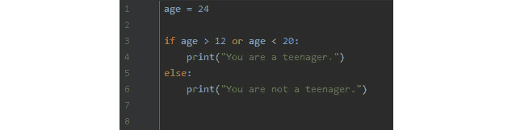
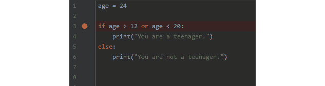
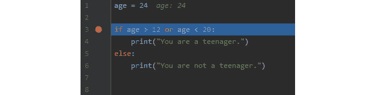
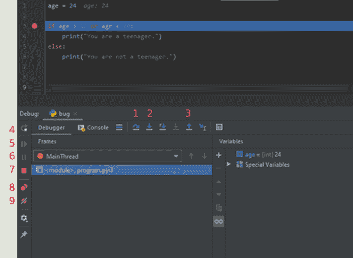
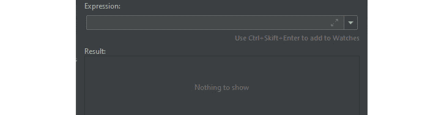
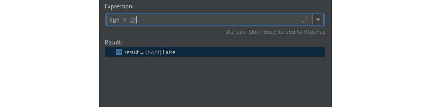
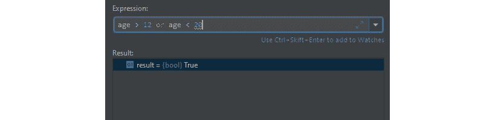
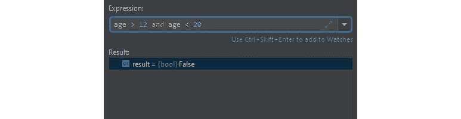
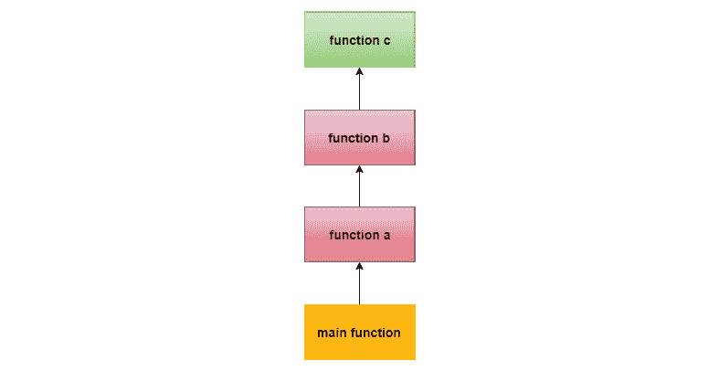

# *第九章：当事情出错时 – 虫子和异常*

编写软件可能很困难，当我们编写它时，我们会犯错误。我们无意中会在我们的应用程序中引入虫子。

其中一些可能很容易找到和修复，但有些可能会让我们在代码中迷失方向，试图理解为什么事情没有按照我们预期的那样工作。

人们花费数天甚至数周时间试图追踪虫子的情况并不少见。为了能够在我们的应用程序中找到虫子，我们需要了解存在哪些类型的虫子以及它们如何影响我们应用程序的运行方式。本章将帮助我们识别它们。

本章中，你将了解以下主题：

+   理解软件虫子

+   使用调试器查找虫子

+   与异常一起工作

+   处理异常

在本章中，我们还将简要讨论变量和数据类型。如果你需要刷新对这些内容的记忆，请回顾*第六章**，与数据一起工作 – 变量*。

# 理解软件虫子

在编写软件时，事情并不总是按照计划进行。我们创建的程序将包含虫子。

用*虫子*这个词来描述程序中的错误、缺陷或故障，其历史远在我们拥有任何计算机之前。自 1870 年代以来，它已被记录为工程术语的一部分。在一封日期为 1878 年的信中，托马斯·爱迪生写给一位同事如下：

"在我的所有发明中，情况都是如此。第一步是直觉，然后是一阵爆发，接着困难出现——这个玩意儿崩溃了，然后就是所谓的“虫子”——这样的小错误和困难就会显现出来，在商业成功或失败确定之前，需要数月的紧张观察、研究和劳动。"

第一款机械弹球游戏，Baffle Ball，在 1931 年宣传时声称是*无虫*的，而在 1944 年，艾萨克·阿西莫夫在短篇小说**捕捉那只兔子**中使用了*虫子*这个词来描述机器人出现的问题。

有一个经常被赋予敬意的故事，讲述的是软件中“虫子”一词的起源，这个故事来自格蕾丝·霍珀。1946 年，她加入了哈佛大学的计算实验室，在那里她继续在 Mark I 和 Mark II 计算机上工作。

Mark II 计算机产生了错误，经过一番搜索，操作员发现原因是一只蛾子被困在继电器中。蛾子被小心地取下并贴在日志簿上。在蛾子下面，写下了以下内容：

"首次发现虫子的实际案例。"

日志簿上的日期是 1947 年 9 月 9 日，这是第一次在计算机科学中使用*虫子*这个词：

![图 9.1 – 1947 年在 Mark II 计算机中发现的蛾子 – 美国海军历史中心在线图书馆照片（公有领域 [PD]）](img/Figure_9.1_B15554.jpg)

图 9.1 – 1947 年在马克 II 计算机中发现的蛾子 – 美国海军历史中心在线图书馆照片（公有领域 [PD]）

实际的虫子（bug）导致我们的程序产生错误输出的可能性几乎不存在。更可能的是，错误的源头是我们自己。

有许多不同类型的虫子。为了理解其中的一些，并看到虫子可能造成的损害，我们将查看两个极其昂贵的软件虫子。

## 美国国家航空航天局的火星气候轨道器

这是有史以来最著名的计算机错误之一。火星气候轨道器是美国国家航空航天局（NASA）于 1998 年 12 月 11 日发射的一颗太空探测器。它的任务是研究火星的气候、大气和表面变化。1999 年 9 月 23 日，与该航天器的所有通信都丢失了。不清楚它是否在火星大气中被摧毁，或者它是否继续存在于太空中。

1999 年 11 月 10 日，火星气候轨道器事故调查委员会发布了第一阶段报告。在报告中，明确指出灾难的原因是 NASA 承包商提供的一块地面软件中的错误。该软件以美国习惯单位（如英寸、英尺和英里）产生结果，而 NASA 的软件期望输入的是国际单位制（公制系统）。

这次错误的成本估计为 1.25 亿美元。

## 莫里斯蠕虫

1988 年，康奈尔大学的一名学生罗伯特·莫里斯发布了一个设计为无害实验的计算机蠕虫。它利用了 Unix 操作系统 sendmail 程序的一些漏洞，这些漏洞从一台计算机传播到另一台计算机。当发现一台新计算机时，程序会检查这台计算机是否已经感染。莫里斯明白这将是一个系统管理员停止传播并帮助系统确定是否已经感染的好方法。为了补偿这一点，莫里斯设计他的蠕虫，使其在 7 次中有 1 次响应“是”的任何计算机上都会感染。

这是导致蠕虫不仅迅速在互联网上传播，而且多次感染同一台计算机，破坏目标机器的大错误。莫里斯蠕虫是已知的第一种互联网蠕虫，清理它造成的混乱的成本估计为 1 亿美元。莫里斯被罚款 10,000 美元，但后来事业有成；他现在是麻省理工学院的教授。带有蠕虫源代码的磁盘在加利福尼亚州的计算机历史博物馆展出。

这两个例子都告诉我们，即使是小小的错误也可能产生巨大的后果。在第一个例子中，一个程序员犯了一个错误，在最终产品中被忽视。这里最大的问题不是引入的错误，而是没有人看到它并在它太晚之前阻止它。

至于第二个例子，这里，我们有一个自己创造了一些东西的人。这个程序的本质是没有人应该知道这个程序。这里的问题是，他没有一个组织支持他，没有其他开发者可以帮助他制定程序应该如何工作的计划。如果你独自一人，没有其他人讨论你的想法，那么考虑一个决策将带来的所有后果是非常困难的。在后一种情况下，如果周围有其他人，他们可能会告诉他，整个想法是糟糕的，从一开始就不应该这样做。

在这里，我们已经看到了两个关于错误的例子，但还有许多其他类型的错误。因此，我们应该做的第一件事是尝试定义什么是错误。

## 定义软件错误

要理解什么是软件错误，我们首先可以看看 Techopedia 的定义：

"软件错误是导致程序崩溃或产生无效输出的问题。这个问题是由逻辑不足或错误引起的。错误可能是一个错误、失误、缺陷或故障，可能导致失败或偏离预期结果。"

从这个定义中我们可以看出，错误是由不正确运行的软件引起的。这可能导致不正确或意外的结果。如果我们向程序提供一些定义良好的数据，比如，我们可以理解这一点。在这里，我们期望得到一个特定的结果。如果结果不是我们期望的，原因可能是我们提供的数据有问题，或者程序本身有问题。比如说，我们，例如，向计算器应用程序提供以下数据：

```py
3 + 4
```

在这里，我们期望以下结果：

```py
7
```

如果我们得到其他任何东西，我们可以说我们的应用程序中存在错误。

定义还说明程序可能会以未预料的方式表现。这就是当我们期望程序做某件事时，但它却做了完全不同的事情。如果我们有一个程序，当室内温度达到一定值时应该降低恒温器，但它却将其调高，那么这就会是一个错误。

为什么我们的软件中会有错误？没有单一的答案。为了理解这一点，我们需要定义不同类型的错误。

# 理解软件错误的类型

我们可以以许多不同的方式对错误进行分类。在这里，我们将探讨一些常见的类型，看看它们是什么，以及它们可能看起来像什么。

## 算术错误

如其名所示，算术错误与算术运算有关。以下几节中概述了一些我们应该注意的事项。

## 零除

其中一个例子就是除以零。这不仅与计算机有关，我们也不能执行除数为零的除法。在数学中，除以零没有意义，因为如果我们做 ，我们会得到 3。如果我们乘以 3 和 2，我们会得到 6。但如果我们做 ，没有数字我们可以乘以零来得到 6。

这可能看起来足够简单，但有时，它仍然会发生，尤其是在我们处理变量时。

假设我们有两个变量，它们在我们的应用程序的某个地方获得值，如下所示：

```py
x = 3
y = 14
```

在程序稍后部分，我们执行一些计算，可能与其他变量一起，可能看起来像这样：

```py
y = y – current_temperature
```

如果`current_temperature`变量现在与`y`有相同的值，在我们的例子中是`14`，我们将结果`0`存储回`y`。

如果我们做了类似这样的事情，我们的应用程序将会崩溃：

```py
result = x / y
```

原因在于我们在除以零。`y`是零可能并不明显，所以这个问题并不容易发现。

## 算术溢出/下溢

在*第六章*，“与数据一起工作 – 变量”部分，我们讨论了整型类型，并且它们可以有固定的大小。这意味着某些整型类型有一个预定义的大小，它描述了它们将使用多少内存。这也给这种类型的变量一个最大值和最小值。只要我们存储在最大值和最小值之间，就不会有问题，但如果我们尝试存储一个比这些值大或小的值会发生什么？让我们看看一个例子。

现在我们假设我们正在使用一种具有名为 byte 的数据类型的编程语言。这种数据类型可以存储介于-128 和 127 之间的值。

我们可以创建这种类型的变量并给它赋值如下：

```py
my_byte = 127
```

现在，如果我们增加这个变量一个值会发生什么？

```py
my_byte = my_byte + 1
```

自然地，我们期望 127 + 1 的结果是 128。但出乎我们的意料，它是-128。

原因在于当我们处于数据类型可以处理的最大值并增加它时，我们会到达它可以处理的最小数字；在这种情况下，-128。如果我们增加它 2 而不是 1，我们会得到-127。

这是一个溢出错误。如果我们处于数据类型可以处理的最小值，并减去一个值，我们会到达这个数据类型可以处理的最大值。这被称为下溢错误。

### 精度丢失

正如我们在*第六章*“与数据一起工作 – 变量”中提到的，浮点数是计算机难以处理的东西，我们总是面临在舍入值时丢失精度的风险。

在某些语言中，这可能会变得明显。

假设我们有以下代码：

```py
x = 1.3
y = 1.1
print x + y
```

这个程序的预期输出当然是这样的：

```py
2.4
```

令我们惊讶的是，一些语言会给出这样的结果：

```py
2.4000000000000004
```

这是计算机显示它在浮点数方面的问题。如果您需要回顾这是如何工作的，请回到 *第六章*，*与数据一起工作 – 变量*，并阅读 *数值类型* 下关于浮点数的部分。

我们可以争论说，0.0000000000000004 的误差并不大，但如果我们正在处理几个这样的结果并将它们相加呢？现在，这个误差会累积，很快我们就会得到一个偏离很大的值。

这三个是我们将在软件中遇到的最常见的算术错误。下一组错误对于我们程序员来说并不那么有趣，因为它们是在我们的逻辑错误时引入的。

## 逻辑错误

逻辑错误通常不会使程序崩溃，但会产生意外的结果。不幸的是，我们有很多机会犯逻辑错误。

例如，我们可能会不小心使用错误的运算符。一个例子是如果我们想检查某人的年龄是否大于 18，但我们这样做：

```py
if age < 18 then
   …
end_if
```

另一个常见的事情是忘记使用小于等于或大于等于。在这里，我们可以写这样：

```py
if age > 18 then
   …
end_if
```

这是不正确的，因为我们实际上想检查年龄是否大于或等于 18，如下所示：

```py
if age >= 18 then
   …
end_if
```

另一个常见的错误是使用一个等号而不是两个。一些语言会允许我们这样做：

```py
if age = 20 then
   …
end_if
```

在这里，我们本想使用等于运算符，==，但反而使用了赋值运算符，=。一些语言会将这解释为将值赋给年龄。这将给我们带来两个问题。首先，我们可能会进入 `if` 语句，即使实际上我们不应该这样做。另一个问题是，现在 `age` 变量中的值将被值 `20` 覆盖。

一直让我感到惊讶的一件事是，正确使用逻辑运算符是多么困难。尽管它们只有两个，但我们经常用其中一个代替另一个。是的，我有时也会这样做。

如果我们打算检查年龄是否在 `12` 到 `20` 之间，我们可能会写这样：

```py
if age > 12 or age < 20 then
   …
end_if
```

然而，我们想要做的是这样：

```py
if age > 12 and age < 20 then
   …
end_if
```

第一个例子总是正确的，因为年龄总是大于 `12` 或小于 `20`。

这些只是逻辑错误的一些例子。由于代码是有效的，意味着程序可以运行，但其行为将是不预期的，因此它们可能很难找到。

当代码编写得无法运行，因为我们违反了语言语法规则时，更容易修正的错误组出现了。让我们更详细地看看这些。

## 语法错误

告诉我们如何在特定语言中编写代码的规则被称为其语法。当我们编写的代码不遵循语法规则时，我们得到的就是所谓的语法错误。

与许多其他错误相比，这些错误相对容易发现，因为编译器或解释器会告诉我们问题所在，并给出关于错误的一些提示。

让我们看看一些语法错误，并调查我们得到哪些消息可以帮助我们修复错误。

这里有一个语法错误。你能找到它吗？

```py
print "Hello
```

在这里，我们试图打印一个字符串，但我们忘记了关闭引号。不同的语言会以不同的方式报告这个错误。正如我们将看到的，我们得到的消息并不总是直接指向真正的错误。

这里提供了四个不同编程语言的例子 – Python、Go、C#和 JavaScript，分别：

```py
SyntaxError: EOL while scanning string literal in line 1 column 12
1:12 syntax error: unexpected newline
Compilation error (line 1, col 12): Newline in constant
error: unknown: Unterminated string constant (1:12)
```

第二个和第三个讨论的是换行符，而第一个和最后一个讨论的是字符串。我们需要了解我们使用的语言返回的消息。所有这些都会指引我们到错误被发现的位置。在不同的格式中，我们被指引到第 1 行，第 12 列。

给定的位置并不总是实际错误所在的地方，而是编译器/解释器发现错误的地方。如果你在给定的位置找不到任何东西，请查看上一行或有时是这一位置上方的一些行。

从前面的章节中我们知道，我们不能用数字作为变量名的第一个字符。但让我们试试，然后做些像这样的事情：

```py
1apple = 1
```

这将给出如下消息：

```py
SyntaxError: invalid syntax in line 1 column 2
1:2 syntax error: unexpected apple at end of statement
Compilation error (line 1, col 2): Identifier expected
error: unknown: Identifier directly after number (1:2)
```

正如我们所见，一些语言将这些错误称为语法错误，而其他语言则会将其称为编译错误等。再次强调，我们需要了解我们使用的语言是如何称呼这些错误的，因为这有助于我们识别它们。

通常，我们的编辑器会在我们运行应用程序之前帮助我们找到语法错误，甚至标记它们。它使用的技术与 MS Word 处理器中的拼写检查器相同 – 在错误下方有一条波浪形红线。

看看下面的截图。在这里，我们可以看到在尝试运行程序之前，编辑器已经标记了一个语法错误：


图 9.2 –  一个编辑器显示编程语言 Python 中的语法错误

语法错误，如前所述，通常很容易找到，因为程序将无法运行，并且我们会被指引到错误发生附近的位置。但当我们遇到逻辑错误时，我们该如何找到错误呢？我们为此有专门的工具，称为调试器。

# 使用调试器查找错误

调试器是一种可以帮助我们看到程序运行时发生了什么的工具。正如我们已经提到的，仅通过运行程序，一些错误可能很难找到和理解。通常，我们会在程序中发现一些奇怪的行为，但可能并不明显是什么原因导致了这种行为。

调试器是一个针对特定编程语言定制的应用程序，可以用来在指定的代码行处暂停应用程序。此时，我们可以检查所有变量的值。

我们也可以恢复程序的执行，或者逐行执行以查看会发生什么。

让我们尝试使用调试器。为此，我们首先需要选择一种语言，然后编写一个小程序，其中包含一个逻辑错误。我们可以选择我们之前查看过的错误之一：

```py
if age > 12 or age < 20 then
   …
end_if
```

记住，在这个例子中，我们意外地使用了`or`而不是`and`。

让我们用 Python 编写这个程序。在以下屏幕截图中，我们可以看到它的样子：


图 9.3 – 包含逻辑错误的 Python 小程序

在第一行，我们声明（记住声明一个变量意味着我们正在创建它）一个名为`age`的变量，并将其值`17`赋给它。

然后是我们的`if`语句，我们在这里检查年龄是否大于`12`或小于`20`。这里的错误是我们使用了`or`。

当运行这个程序时，我们得到预期的输出：

```py
You are a teenager.
```

如果我们现在更改程序，也就是说，我们将另一个值赋给年龄，比如说`24`，然后运行它，它将不会给出预期的结果：

```py
You are a teenager.
```

您可以在以下屏幕截图中看到更改后的程序：



图 9.4 – 具有不同年龄值的相同程序

现在，让我们使用调试器并探索这个错误。我们首先需要做的事情是设置一个断点。

## 断点

断点是我们用来告诉程序运行到这一点，然后暂停并显示程序状态的途径。

在以下屏幕截图中，我们可以看到我们在包含`if`语句的行上有一个断点：



图 9.5 – 在第 3 行设置断点的程序

如果我们现在运行程序，它将在到达这一行时停止。此时，包含断点的行尚未执行。它看起来如下面的屏幕截图所示：



图 9.6 – 调试器已停止在断点上

我们即将执行的行用蓝色线条标记。此外，请注意，这个调试器在第 1 行以灰色显示了`age`的值。这有助于我们了解它当前具有的值。

如果我们稍微放大一点，我们会看到一些其他工具在程序暂停在这一行时出现。我们可以在以下屏幕截图中看到它的样子：



图 9.7 – 调试器工具

在这里我们看到调试器应用程序为我们提供的一些工具。让我们了解它们由什么组成：

+   在右侧，我们看到一个标记为**变量**的部分。在这里，我们可以看到所有当前定义的变量以及它们的值。

+   在这个窗口上方，我们可以看到一些指向不同方向的箭头。它们用于将程序向前推进一步。这里有一些选项。第一个是先向上然后向下的箭头（在先前的截图中被标记为**1**）。这被称为步过。如果我们在这行有函数调用，步过不会跳转到那个函数。相反，它会调用那个函数，运行其中的所有代码，然后当我们返回到当前的位置时再次停止。

+   下一个箭头，指向直下的箭头是进入步骤（标记为**2**）。如果我们在这行有函数，它将跳转到那个函数并允许我们逐步执行它。

+   我们可以忽略接下来的两个箭头，而是查看指向直上的箭头（标记为**3**）。这个被称为退出步骤。如果我们已经进入了一个函数并改变了主意，我们可以使用这个功能。它将运行函数中的所有代码，并在我们返回到原来的位置时再次停止。

+   在最左侧，有一些其他工具可以重新启动程序（标记为**4**），恢复程序的执行（标记为**5**），暂停正在运行的程序（标记为**6**），停止程序（标记为**7**），允许我们查看程序中当前的所有断点（标记为**8**），以及忽略所有断点并继续运行（标记为**9**）。

对于我们的问题，这些工具中没有一个能帮到我们。我们知道程序将进入`if`语句，因为输出如下：

```py
You are a teenager.
```

而另有一个工具可能对我们有帮助。在下面的截图中，我们可以看到它被一个矩形标记出来：


图 9.8 – 评估表达式按钮

这个看起来像小计算器的工具是评估表达式工具。如果我们点击它，我们将看到如下截图所示的窗口：



图 9.9 – 评估表达式窗口

在顶部字段中，我们可以输入一个表达式。这可以帮助我们理解正在发生的事情。我们目前在这一行：

```py
if age > 12 or age < 20:
```

如果我们将这个表达式的某一部分输入到评估表达式工具中，它将显示结果。让我们以这个`if`语句的第一部分为例。将其输入到工具中看起来如下：


图 9.10 – 评估一个表达式

在这里，我们可以看到这个`if`语句的部分是正确的。

如果我们现在对第二部分做同样的操作，我们将看到结果为假，如下截图所示：



图 9.11 – 评估另一个表达式

我们现在可以检查这两条语句的结果，因为我们已经在代码中编写了它们，如下面的屏幕截图所示：



图 9.12 – 评估整个表达式

在这里，我们可以看到整个表达式的结果是 `true`，即使值大于条件的最后一部分，即 `20`。

我们现在可以怀疑罪魁祸首是 `or`。让我们将其更改为 `and` 并看看结果。

在下面的屏幕截图中，我们可以看到结果现在被评估为 `false`，这是我们预期的值：



图 9.13 – 使用 or 而不是 and 评估表达式

我们现在可以停止调试器并更改我们的代码。

这是我们使用调试器帮助我们理解问题的一个例子。我们经常会遇到这样的错误，而问题可能一开始并不明显。作为程序员，我们应该学会使用调试器，了解它提供的功能，以及我们如何使用它。

有时候，我们会有其他类型的错误，尽管语法是正确的，但程序仍然会崩溃。这些被称为异常。我们将继续讨论这些内容。

## 处理异常

**异常**（简称**异常事件**或**异常条件**）是指在程序运行期间发生的错误或意外事件。它是由于软件中的某种条件导致的，使得程序达到了无法继续运行的状态。

我们可能会遇到许多导致异常的原因。一个例子可能是，如果我们的程序需要从文件中读取数据，但文件不在它应该的位置。由于程序有理由从该文件中读取数据，未能这样做将使应用程序处于无法保证其输出正确性的状态。在这种情况下，最好的选择就是停止程序并返回一个错误，希望这个错误能指导我们解决问题，以便我们可以修复它。

没有软件开发者愿意编写一个会崩溃的应用程序。尽管后果可能更严重，取决于程序的性质，但应用程序的用户可能会丢失未保存的工作。

很快，我们将讨论如何处理异常，以便它们不会使我们的程序崩溃。但在我们这样做之前，让我们更深入地了解异常，以便我们了解它们是如何工作的。

让我们来看看我们得到异常的一些常见原因。

## 异常的常见原因

正如我们所见，缺少文件可能是我们遇到异常的一个原因。另一个常见的原因是，当我们试图对一个序列进行索引时，我们使用了一个比序列更大的索引。让我们来看一个例子：

```py
names = ["Anna", "Bob", "Cara", "David"]
```

这里，我们有一个数组（你可以在*第六章**，处理数据 – 变量*，在*复合类型*部分中了解更多关于数组的信息）。它包含四个值；在这种情况下，四个名字。我们可以通过以下方式索引到这个数组以检索单个值：

```py
print names[2]
```

这将给出以下输出：

```py
Cara
```

记住，第一个项目的索引值是 0，而不是 1，所以第三个项目`Cara`的索引是 2。

如果我们使用一个大于我们拥有的项目数量的索引值，会发生什么？

```py
print names[6]
```

在这个位置没有值，所以程序无法为我们获取它。语法是正确的，如果我们有足够的值，它将完美地工作。但这次，它不会，因为我们使用了一个不存在的索引。

程序无法在这个点继续运行，因为它无法猜测它应该做什么。我们给出了一个指令，表示我们想要从这个位置获取一个值。编程语言不能为我们随意生成一个值。在这种情况下，最明智的做法是直接结束程序并等待它给出错误。这个错误可能看起来像这样：

```py
IndexOutOfRangeException: Index was outside the bounds of the array at line 2.
```

这是一个异常。我们可以在输出中看到它，因为它清楚地写着`IndexOutOfBoundException`。

我们使用异常的多少，以及我们需要处理不同问题的不同异常的数量，在语言之间有很大差异。有些语言，如 Java，大量使用异常。另一方面，C++只有少数内置异常。然后，我们有像 Go 这样的语言，根本不使用异常，而是让函数返回一个错误类型，与函数的真实返回值一起。

我们在本章中已经看到的一些错误也会生成异常。如果我们将某个数除以零，就会发生这样的异常。

大多数语言都支持异常。即使编程语言中异常的数量不同，它们的工作方式在大多数情况下都会很相似，无论我们使用什么语言。名称将不同，以及我们拥有的异常类型也会不同，但我们的处理方式将是相同的。

有时，理解我们从异常中获得的输出可能很困难。原因是当我们遇到异常时，还会打印出称为调用栈的东西。

## 异常和调用栈

想象一下，我们有一个程序，并且在这个程序中，我们有一个`main`函数。这个函数正在调用另一个函数，该函数又调用另一个函数，以此类推。我们将有如下所示的内容：



图 9.14 – 一个调用函数的函数，然后又调用另一个函数，以此类推

跟踪我们在函数调用链中的位置被称为调用栈，当程序运行时由编程语言处理。

现在，假设我们在最后一个调用的**function c**函数中遇到了异常。这个函数将立即退出并返回到它被调用的地方。那就是**function b**。这个函数也会在控制权交还给它时立即退出，然后我们会返回到原来的地方。这次，是**function a**。同样，这个函数也会立即终止，然后我们返回到**main**函数。最后发生的事情是这个函数也会结束。由于这是在这个应用程序中首先被调用的函数，整个应用程序将结束。

所有函数都会退出的原因是没有一个函数处理了异常。

现在，我们将不仅会在屏幕上打印出异常信息，还会打印出调用栈。

为了说明这一点，让我们使用一个非常简单的程序，如下所示：

```py
function c()
    result = 10 / 0
end_function
function b()
    c()
end_function
function a()
    b()
end_function
function main()
    a()
end_function
```

这是一个相当愚蠢的程序，但它将说明会发生什么。在底部，我们有一个名为`main`的函数。当我们运行这个程序时，`main`函数将被自动调用。

在`main`函数内部，我们调用名为`function a`的函数。这个函数将调用`function b`，它再调用`function c`。

当我们进入`function c`函数时，`function b`仍在运行并等待`function c`完成。对于`function a`也是一样，它等待`function b`完成。`main`函数等待`function a`完成，所以在这个点上，我们有四个正在运行的功能。

现在，在`function c`函数内部，我们执行了一个除以零的操作，导致抛出了一个异常。

在这一点上，`function c`将立即退出。控制权将交还给`function b`，它将退出，然后将控制权交还给`function a`，它将退出回到`main`函数，最后程序将退出。

我们将得到的输出将类似于以下内容：

```py
Callstack
function c() at line 2
function b() at line 6
function a() at line 10
function main() at line 14
ZeroDivisionError: division by zero
```

如我们所见，所有的函数调用都在那里。如何显示将因语言而异。有些语言会以相反的顺序打印所有函数。这又是一件我们在学习新语言时需要学习的事情。

我们得到所有这些信息的原因是它可以帮助我们找出问题所在。即使错误发生在`function c`中，它发生的原因可能起源于其他地方。让我们假设程序看起来如下所示：

```py
function c(x, y)
    result = x / y
end_function
function b()
    c(10, 0)
end_function
function a()
    b()
end_function
function main()
    a()
end_function
```

现在，`function c`接受两个参数，并使用这些参数进行计算。这发生在从`function b`调用`function c`时。问题出现在我们传递`10`和`0`作为参数调用时。

由于数据起源于`function b`，问题就出在这里。`function c`不知道这两个值的来源。它们可能来自一些用户输入，可能已经从文件中读取，或者可能来自任何其他来源。

为了完全理解这个问题的根源，我们需要从调用栈中获得信息，因为它告诉我们当错误发生时，我们是如何到达`function c`的。

但如果我们不希望程序崩溃呢？没问题。我们可以编写处理异常的代码。让我们看看下一个例子。

# 处理异常

要了解我们如何处理异常，我们首先必须理解问题的根源可能是什么。只有当我们理解了这一点，我们才能采取适当的措施来正确处理它们。

让我们回到我们之前例子中除以两个值的函数。假设这个函数接受两个参数，就像我们之前的例子一样：

```py
function c(x, y)
    result = x / y
end_function
```

我们应该假设这个函数除了打印这一行之外，还做了一些其他的事情。我们可以用一些注释来标记它，如下所示：

```py
function c(x, y)
    // The function does some things ere
    result = x / y
    // And even more things here
    // It might even return a value
end_function
```

我们知道，当这个函数对两个值进行除法运算时，如果`y`被赋予`0`的值，我们可能会遇到异常。

我们首先应该问自己的是，这是处理问题的最佳位置吗？可能是，但更有可能的是，它不是。这个函数接收两个作为参数传递给它。应用程序的多个部分可能会使用这个函数，因此它无法知道发送给它的数据的来源。

然而，我们可以在执行除法之前检查`y`是否等于零。现在让我们这样做。同时，我们可以将函数的名称改为`calculate`，因为它更好地反映了函数的功能：

```py
function calculate(x, y)
    if y == 0 then
	  // y is zero, so we cannot perform the division
    end_if
    // The function does some things ere
    result = x / y
    // And even more things here
    // It might even return a value
end_function
```

但如果我们遇到`y`为零的情况，我们应该怎么办？我们不能继续运行函数，因为那样我们仍然会执行除法操作。我们也不能将`y`改为其他值，因为我们应该将它改为什么？

我们需要一种方式来向函数的调用者发出信号，表明我们无法接受`y`为零的值。

做这件事的一种方法就是让异常发生，并再次移除`if`语句。如果我们这样做，调用者就可以处理错误了。

让我们看看我们如何在调用函数时处理异常。那么，对函数的调用就需要在一个特殊的代码块中，称为`try`语句。它可能看起来像这样：

```py
try
    calculate(10, 0)
catch ZeroDivisionError
   // We will end up here if we get a ZeroDivisionError    // exception
end_catch
```

在这里，我们可以看到对`calculate`函数的调用位于一个`try`块中。

如果一切正常，并且我们在函数中没有抛出任何异常就返回，程序将跳转到`end_catch`之后的行，并继续执行。

但如果我们遇到一个异常，而这个异常是`ZeroDivisionError`类型，我们最终会进入下面的代码块，它以`catch`开始。

异常可以被捕获，但我们需要指定我们想要处理哪种异常。如果我们遇到另一个异常，一个没有匹配`catch`的异常，程序将像以前一样崩溃。

以这种方式调用函数可能是我们的解决方案，但这真的是一个好的解决方案吗？并不。想象一下，`calculate`函数位于一个不同的模块中，该模块位于一个不同的文件中。它甚至可能是由别人编写的。在这种情况下，我们如何知道它将执行除法，并且它将使用我们传递给它的第二个值作为除数？我们很可能对此一无所知，或者我们至少应该假设用户对函数的编写方式一无所知。

因此，我们不能假设他们会在他们的`catch`语句中使用`ZeroDivisionError`异常。相反，我们可以给他们另一个可能更有意义的异常。

让我们修改我们的`calculate`函数，如下所示：

```py
function calculate(x, y)
    if y == 0 then
	  throw ValueError("Second argument cannot be zero")
    end_if
    // The function does some things ere
    result = x / y
    // And even more things here
    // It might even return a value
end_function
```

`throw`将创建另一个异常；这次，一个叫做`ValueError`的异常。我们还在这个异常中传递了一个字符串。如果有人现在调用我们的函数并给我们一个`y`的值为零，他们将得到我们提供的这个异常信息。

当他们调用我们的函数时，他们现在可以检查这个异常：

```py
try
    calculate(10, 0)
catch ValueError
   // We will end up here if we get a ValueError exception
end_catch
```

由于这是`y`的坏值产生的地方，我们更有可能在这里改变它。例如，如果这个值是由程序的用户给出的，我们可以返回一个友好的错误信息，说明他们不能输入零值。

我们可以说这是拥有数据的位置，因此有机会改变它。

如果我们在可能抛出异常的函数调用周围使用`try…catch`块，程序将不再崩溃。在这种情况下，`calculate`函数仍然会在我们抛出`ValueError`异常时立即退出，但由于我们在函数调用后立即捕获它，我们可能能够纠正问题并再次用正确的值调用函数。

异常是在我们无法决定在编写程序时无法预测的条件下的处理条件的一种很好的方式。没有它们，向程序的其它部分发出错误信号将非常困难。我们需要在需要时使用它们，但也要确保适当的关注。异常总是发送一个关于错误的清晰信息，并帮助接收异常的代码的作者理解问题是什么。

# 摘要

在这一章中，我们意识到，作为人类，我们会犯错误，但我们可以回去修复它们。

软件错误是应用程序中的错误，可能有几个原因。根据错误背后的原因，我们在尝试修复它时必须采取不同的方法。

在某些情况下，例如与语法错误一样，我们将会立即被告知错误的起因，甚至会被指引到代码中的正确位置。

其他错误将更难找到。当编程语言语法正确，但逻辑不正确时，程序将以意想不到的方式运行。为了能够找到这些错误，我们可以使用一个名为调试器的工具。它通过允许我们暂停程序执行并查看变量的所有值来帮助我们追踪错误；它甚至允许我们逐行执行。

一个异常事件是指那些本不应该发生的事情仍然发生了。在编程中，这些被称为异常。当它们发生时，如果未得到处理，程序将立即停止执行。幸运的是，我们可以通过插入仅在异常事件发生时才会运行的代码来处理它们，这样我们就可以尝试解决问题。

在下一章中，我们将探讨不同的方法来解决问题，并使用代码创建解决方案。这被称为范式。编程语言将使用这些范式之一。正如我们将看到的，一些语言将使用来自多个范式的概念。
