# *第十章：编程范例*

如果我们查看所有编程语言，我们可以看到它们之间有模式和相似之处，我们可以利用这些来将它们分类到不同的范例中。单词**范例**意味着某物的典型例子或模式，这正是我们在对编程语言进行分组时寻找的东西。

我们想要进行这种分类的原因是因为我们在这些组中的一个中编写程序的方式将与我们使用属于另一组语言的程序的方式有显著差异。

计算机程序几乎总是以某种方式或另一种方式模拟现实世界中的事物。我们使用软件解决现实世界的问题。问题是我们在代码中如何最好地模拟和表示现实世界的事物，以及我们如何最好地构建解决这个现实世界问题的解决方案。

在本章中，你将学习以下主题：

+   理解结构化编程

+   理解面向对象编程

+   理解函数式编程

+   理解逻辑编程

+   理解其他范例

+   理解多范例语言

让我们从我们最熟悉的范例开始：结构化编程。

# 理解结构化编程

结构化编程是我们在本书中讨论的内容。循环、条件和函数定义了使用此范例的程序流程。如果你已经阅读了本书的前几章，那么现在它们都应该很熟悉了。

结构化编程是称为**命令式编程**的范例家族的一个分支。使用命令式编程概念的编程语言使用语句来改变程序的状态。

如果我们查看那个定义，我们必须首先了解语句和程序状态是什么。

## 语句

在这个定义的第一部分，我们将讨论语句。正如在*第五章*中描述的，“序列 – 计算机程序的基本构建块”，在“理解语句”部分，这可以被视为我们向应用程序下达的命令。在自然语言中，我们有一种称为祈使语气的表达方式。祈使语气是一种形成命令的东西，例如“移动！”，“不要迟到！”或“努力工作！”。在命令式编程中，我们用类似祈使语气的东西向计算机下达指令；也就是说，以语句形式表达出的命令。

这是命令式编程定义的前半部分。后半部分讨论的是改变程序的状态。

## 程序状态

如果一个程序能够记住之前发生的事件，那么我们就说它具有状态。程序在变量中存储数据。在任何给定的程序执行点，我们可以查看所有已定义变量中当前的数据。所有这些变量的组合值构成了程序的状态。

如果我们改变一个变量，程序的状态也会改变。当我们谈论命令式编程时，我们的意思是，一旦一个语句改变了变量的内容，它就改变了程序状态。

这就是形成先前事件记忆的方式。当一个事件——在我们的例子中是一个语句——发生并改变一个变量时，它将影响程序的行为。如果我们有一个将发射火箭的应用程序，我们可能有一个负责倒计时的函数。为了跟踪我们目前处于哪个数字，我们需要有一个变量。在倒计时过程中改变这个变量将改变应用程序的状态。当变量达到零时，它将触发向火箭发送启动信号的触发事件。

如果这是命令式编程，那么在结构化编程中有什么不同呢？让我们来比较一下。

## 比较命令式编程和结构化编程

用汇编语言编写的程序使用一种称为 GOTOs 的概念。这是一种用于控制程序流程的技术。要使用它们，我们在代码中插入标签，然后可以指示程序跳转到这样的标签并从那里继续执行。

一段简短的汇编语言代码片段可以说明这一点：

```py
	mov eax,3 	jump exit 	mov eax,123  ; <- not executed!exit:	ret
```

在这里，我们有一个名为`exit`的标签。在第一行，我们将值`3`移动到一个名为`eax`的寄存器（记住，汇编语言中的寄存器就像一个变量）。在第二行，我们无条件地跳转到我们的标签`exit`。无条件跳转意味着我们总是会执行这个跳转。在汇编语言中，也有条件跳转，只有当寄存器的值等于、小于或大于某个值时才会跳转。

由于跳转是无条件的，第三行永远不会执行，因为我们总是会跳过这一行。

在 20 世纪 60 年代和 70 年代出现的许多语言也具有相同的不条件跳转概念。在这里，我们可以找到像 BASIC 和 C 这样的语言。在这些语言中，它不被称为跳转。相反，使用*GOTO*这个术语。编程语言 C++基于 C，因此它也使用 GOTO。用 C++编写的相同程序将看起来像这样：

```py
	int x = 3;
	goto quit;
	x = 123;	   // <- not executed!
quit:
	return x;
```

今天，在大多数情况下，被认为使用 GOTOs 是一种不好的做法，因为代码将难以阅读、理解和维护。几乎很少需要执行 GOTO，因为像 BASIC 和 C 这样的语言支持可以让我们达到相同结果并保持良好的代码质量的结构。

使用这种编程风格最初定义了命令式编程。随着编程语言的发展以及我们获得了其他工具，如循环、`if`语句和函数，就有必要区分这些更现代的语言和较老的风格。尽管这些编程语言使用与汇编语言相同的思想，但这些语句会改变程序的状态。这是因为它们不再依赖于跳转或 GOTO 来完成这个任务。这就是我们得到结构化编程定义的时候。支持结构化编程的语言是使用语句来修改程序状态的语言，并且有函数、循环和`if`语句作为完成这一任务的工具。

我们有时也会听到*过程式*和*模块化*语言的术语。没有必要深入了解这些术语之间的区别，因为这主要是学术性的。我们可以安全地认为这些都是同一件事。

一些支持结构化编程或其相关语言（过程式和命令式编程）的知名语言如下：

+   Ada

+   ALGOL

+   BASIC

+   C

+   C++

+   C#

+   COBOL

+   Fortran

+   Go

+   Java

+   JavaScript

+   Pascal

+   Perl

+   PHP

+   Python

+   Ruby

+   Rust

+   Swift

+   Visual Basic

结构化编程是一种流行的范式，如这份长长的语言列表所证明的那样。在 90 年代，另一种范式获得了流行，并且仍然是当前使用的主要范式之一。它被称为面向对象编程。让我们看看这是怎么回事。

# 理解面向对象编程

面向对象编程的主要思想是以我们人类看待世界的方式对代码进行建模。

即使你没有想过，我们总是在使用抽象对事物进行分类和分组。我们可以谈论车辆，并且我们对这个群体中包含的内容有共同的知识。汽车、自行车、船只和飞机是，而铅笔、鸭子和泳衣则不是。

我可以说，“我需要去镇上。有人能借我一辆车吗？”

你会这样理解，实际的种类不重要，但它必须是我能去镇上的东西。它可能就像一辆车一样，也可能是一块滑板。

将事物分组到这些抽象中使我们的生活更轻松，因为我们不必每次谈论某事时都深入细节。我可以要求一辆车，而不是描述我需要一个能把我从当前位置带到镇上的设备。

在这样的抽象内部，事物可能非常不同，但如果它们有一些关键特征，我们就会理解它们。看看下面的图片。在这里，我们有两个可以归入我们称之为遥控器的东西。

其中一个将控制你的电视，让你换频道和调节音量。另一个将让你锁上和打开你的车：


图 10.1 – 遥控器

尽管他们使用不同的设备，按按钮的结果也会非常不同，但他们共享的行为是在无线远程控制某物。我们把这些设备称为遥控器，以使我们的沟通更加方便。

如果我们能在编写软件时做同样的事情，这就是面向对象出现的地方。它将让我们使用相同的方法。

如果我们要编写一个跟踪仓库库存的程序，并且想以面向对象的方式来做，我们可以看看一个真正的仓库，并像我们看到的那样描述它。

在仓库里，我们有如下一些东西：

+   产品

+   货架

+   一台咖啡机

+   仓库员工

+   窗户里的枯萎花朵

我们的系统需要了解一些这些事物，但不是全部。在先前的列表中，我们可以忽略花朵和咖啡机，但其他三个是将其纳入我们程序的好候选。

如果我们查看这些产品之一，我们会看到它可以是几件事情，从小螺丝和螺栓到某种机器或设备。但从仓库的角度来看，它们具有相同的特征。它们都是我们存储的物品，我们可以使用相同的属性来描述它们。它们有一个名字、重量和制造商；我们有它们的一定数量；等等。

在面向对象编程中，我们试图保留这种描述事物的方式，并以与我们刚才描述的方式不太不同的方式来表示它们。

要理解面向对象编程是如何工作的，我们需要将其分解为一些主要概念，这些概念是我们需要理解的。让我们来看看它们。

## 类和对象

在面向对象编程中，一个类就像一个蓝图或描述，让我们以人的概念为例。我们如何描述一个人？我们可以开始列出一个适用于所有人的事物的清单。它可能看起来像这样。

一个人有以下属性：

+   一个名字

+   一个年龄

+   一个性别

+   身高

+   体重

+   头发颜色

+   眼睛颜色

+   鞋码

+   国籍

+   地址

+   电话号码

列表可以继续。我们现在可以决定这些是适用于所有人的事物。如果我们仔细想想，这些都是关于个人的数据。我们还没有描述任何行为。我们可以再列一个清单，描述一个人可以做的事情。

一个人可以做以下事情：

+   跳跃

+   跑步

+   行走

+   坐下

+   站立

+   睡眠

+   休息

+   工作

+   玩耍

+   跳舞

同样适用于这里——这个列表可以非常长。

如果我们打算在程序中表示一个人，我们不需要所有可用的数据和行为。相反，我们需要以某种方式抽象出一个人，这样我们就可以用对我们感兴趣的东西来表示他们。姓名、年龄和性别可能都是这样的东西，但除非我们正在编写鞋店的程序，否则鞋码很可能不是。让我们专注于数据，并挑选一些可能足够有趣以在应用程序中实现的东西。我们可能会选择以下内容：

+   姓名

+   年龄（很可能是出生日期的形式）

+   性别

+   地址

+   国籍

+   电话号码

+   电子邮件地址

现在，我们将学习如何定义一个蓝图——在面向对象编程中称为类——用于表示人，因为我们有一份适用于所有人的数据列表。

我们给它一个描述性的名字，并列出我们感兴趣的东西。它可能看起来像这样：


图 10.2 – 一个名为 person 的类

前面的图像以简化的方式描述了一个类；即一个有三个部分的矩形。在上部部分，我们有我们给这个类起的名字。在中间部分，我们描述了我们想要用来描述人的数据。最后一部分是用于行为，这是我们很快会回到的地方。

面向对象编程非常关注数据，因此当我们决定一个类的样子时，这通常是我们的起点。进入我们类中的数据通常会决定我们希望它有什么样的行为。这种行为通常决定了我们需要在数据上执行的操作。

我们之前为一个人识别的行为，如跳跃、奔跑和睡眠，可能不是我们需要表示的东西。相反，我们通常会找到会修改数据的东西，比如更改地址。

目前，我们将留空类的第三部分，但我们会稍后回来。

现在，我们有一个人的类和蓝图，但还没有表示任何实际的人。在我们的例子中，一个事物（人）的表示称为*对象*。一个对象始终属于一个类。既然我们有了类，我们就可以从中创建一个对象，每个对象将代表一个人。

如果我们想在应用程序中表示一组人，他们的表示可能如下所示：

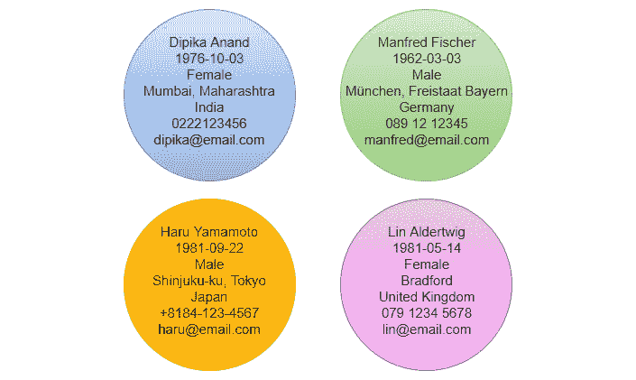

图 10.3 – person 类中的四个对象

正如我们在前面的图中可以看到，所有四个对象都有自己的数据集；姓名、出生日期、性别、地址、国籍、电话号码和电子邮件地址。一个对象中的数据与其他属于同一类的对象中的数据是独立的。如果我们更改一个对象中的地址，它将不会影响任何其他对象。

总结这一点，我们可以说，一个类是对象的一个模型或蓝图。在类中定义的数据通常被称为**成员变量**或**属性**。

### 成员变量

成员变量就像任何其他变量一样，有一个关键的区别：它存在于对象内部。

为了说明这一点，我们可以考虑一个关于人的非常简单的类。它可能看起来像这样：

```py
class Person
	name
	age
end_class
```

在这里，我们定义了一个名为`Person`的类。它里面有两个变量：`name`和`age`。

在这一点上，计算机内存中还没有实际的变量存在，因为这只是一个关于人对象外观的蓝图。为了使它们存在，我们需要从这个类中创建对象，通常被称为实例。

这可以这样完成：

```py
p1 = Person("Dipika", 34)
p2 = Person("Manfred", 58)
```

这创建了两个对象。我们使用变量名`p1`和`p2`来引用它们。有趣的部分是当我们创建这些对象时会发生什么。如果我们仔细看看第一行，我们会看到一系列事件将会发生：

1.  发生的事情是，在计算机内存的某个地方，从`Person`类创建了一个包含两个变量`name`和`age`的对象，如下面的图像所示：

    图 10.4 – 来自人类的对象

1.  下一步是成员变量被初始化，这些初始化数据是在我们创建对象时传递的。这在上面的图像中得到了说明：

    图 10.5 – 对象中的成员变量被初始化

1.  最后一步是`p1`变量现在指向内存中这个对象的位置，如下面的图像所示：


图 10.6 – 对象通过 p1 变量被引用

然后，这个过程被重复用于包含名称`Manfred`的对象。通过这样做，我们得到以下类似的结果：

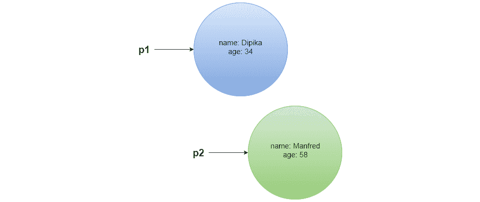

图 10.7 – 来自 Person 类的两个对象

现在我们有了两个对象，我们可以看到我们有两个名为`name`和`age`的变量。每个变量都包含在`p1`对象和`p2`对象中。对于从`Person`类创建的每个对象，我们都会得到这两组变量中的一组。

我们很快就会改变这个类，但就目前来看，我们可以像这样访问这些变量：

```py
p1 = Person("Dipika", 34)
p2 = Person("Manfred", 58)
print p1.name
print p1.age
print p2.name
print p2.age
```

这将给出以下输出：

```py
Dipika
34
Manfred
58
```

面向对象编程指出，成员数据应该封装在其对象内部，并且应该阻止从外部直接访问这些数据。让我们看看为什么这是面向对象中的一个关键概念。

## 理解封装

封装，也称为信息隐藏，是一个概念，其中对象的内部实现被隐藏在对象之外的所有事物中。

封装可以用多种方式来描述。美国计算机工程师詹姆斯·鲁姆巴格和迈克尔·布莱哈这样描述它：

"一个设计目标是把类视为“黑盒”，其外部接口是公开的，但其内部细节对视图隐藏。隐藏内部信息允许在不要求类的任何客户端修改代码的情况下更改类的实现。"

这里的关键点是*接口*。接口是我们用来与对象通信的东西。看看*图 10.1*中的遥控器。我们可以按的按钮是接口。我们用它们与设备内部的内部逻辑进行通信。

遥控器对象是一个*黑盒*，因为我们看不到遥控器的内部，我们也不需要这样做。我们唯一需要理解以能够使用对象的是接口。如果遥控器工作不正常，我们可以把它带给了解其内部工作原理的人，他们可以修理它。如果他们没有改变接口、按钮以及与之相关的功能，我们就不需要改变在修改前后使用遥控器的方式。

我们应该从外部世界隐藏的一件事是数据。不，等等！如果数据被隐藏在一个对象内部，我们如何使用它呢？让我们通过一个例子来看看我们所说的在对象内部隐藏数据是什么意思。

如果你走在街上，遇到另一个人，仅通过观察那个人，你无法看到诸如人的名字、他们早餐吃了什么、他们的年龄以及他们住在哪里等信息。这些数据被封装在对象内部：


图 10.8 – 数据封装在现实世界对象内部

要获取这些信息，我们需要询问那个人。我们说对象通过相互传递消息进行通信。这看起来就像这样：


图 10.9 – 通过发送消息进行通信的两个对象

我们需要修改我们的类，以便数据被隐藏，并且我们有与它通信的方式。

我们可以通过使用`private`关键字来隐藏数据。现在类看起来可能像这样：

```py
class Person
	private name
	private age
end_class
```

通过将`name`和`age`声明为私有，我们不能再从类外部访问它们。这意味着我们打印两个对象的名字和年龄的行将不再工作。

现在的类看起来是无用的，因为我们可以创建一个对象并为其变量赋值，但在此之后我们无法对这些数据进行任何操作，因为它们对我们来说是隐藏的。我们需要创建一个接口，比如遥控器上的按钮，这样我们就可以与这些数据交互。我们将通过类方法来完成这个任务。

## 类方法

类方法实际上就是一个属于类的函数。我们之所以为这些函数使用不同的名称，是为了能够区分一个属于类的函数和一个不属于类的函数。一旦你听到有人提到方法，你就知道这是一个属于类的函数。

在类中我们通常会找到两种流行的方法，被称为*getter*和*setter*。getter 是一个返回私有成员变量值的函数，而 setter 是一个允许我们更改其值的函数。

要使方法在类外可用，我们可以使用`public`关键字。为此，我们可以为我们的类添加 getter 和 setter，然后它看起来就像这样：

```py
class Person
	private name
	private age
	public function get_name()
		return name
	end_function
	public function set_name(new_name)
		name = new_name
	end_function
	public function get_age()
		return age
	end_function
	public function set_age(new_age)
		age = new_age
	end_function
end_class
```

这将使我们能够访问成员变量。现在我们可以创建对象，获取它们内部存储的私有数据，并在需要时更改它们的值。

它看起来可能像这样：

```py
p1 = Person("Dipika", 34)
p2 = Person("Manfred", 58)
print p1.get_name() + " is " + p1.get_age() + " year old"
p1.set_age(35)
print p1.get_name() + " is " + p1.get_age() + " year old"
```

这将产生以下输出：

```py
Dipika is 34 years old
Dipika is 35 years old
```

在这个阶段，一个自然的问题是我们为什么需要费心去有这些 getter 和 setter。为什么我们不能简单地说`name`和`age`是`public`的，并让任何人随意读取和更改它们呢？原因在于，保持数据私有并通过方法控制对它的访问将给我们带来控制权。

如果一个陌生人走到你面前并询问你的名字，你将有一些选择。你可以回答你的真实姓名，你也可以告诉他们这不关他们的事，或者你可以撒谎并告诉他们一个不同的名字。你对自己的私人数据有控制权，正如类可以通过这些方法对其私有数据进行控制一样。

当调用`set_age`方法时，例如，我们可以检查传入的值以确保它在有效范围内。例如，如果年龄是一个负数或高于任何预期的正常人类年龄，我们可以拒绝设置年龄。我们可以使用异常，这在*第九章*中有所介绍，即*当事情出错 – 错误和异常*，在*处理异常*部分。`set_age`方法可能看起来像这样：

```py
public function set_age(new_age)
    if age < 0 or age > 130 then
       throw ValueError("Error. Age must be between 0 and 130")
    end_if
    age = new_age
end_function
```

如果传递给方法的值低于`0`或大于`130`，我们将得到一个异常。

现在，我们可以在之前在*图 10.2*中看到的图中添加一些类方法。在下面的图像中，我们可以看到我们正在使用矩形的下半部分来完成这个任务：

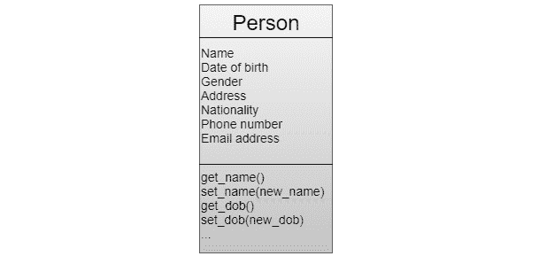

图 10.10 – 具有成员变量和方法的一个类

一个类当然可以拥有除了获取器和设置器之外的其他方法。我们决定我们的类需要哪些方法。例如，我们的`Person`类可以有一个名为`birthday`的方法，通过这个方法我们可以将一个人的年龄增加一岁，如下面的代码片段所示：

```py
class Person
	private name
	private age
	public function birthday()
		age = age + 1
	end_function
	// Getters and setters as before are defined here
end_class
```

我们现在可以这样使用它：

```py
p1 = Person("Dipika", 34)
print p1.get_name() + " is " + p1.get_age() + " year old"
p1.birthday()
print p1.get_name() + " is " + p1.get_age() + " year old"
```

这个程序输出的结果将与之前相同：

```py
Dipika is 34 years old
Dipika is 35 years old
```

如我们所见，面向对象编程的强大之处在于对象是自包含的实体，它们控制着自己的数据。但面向对象编程还有一个强大的功能，那就是代码重用的概念，即继承。

## 继承

如果我问你能否借用你的手机打电话，无论是给你智能手机、2005 年的旧手机，还是提供座机电话的使用，这都无关紧要。它们都有一些共同的特征，其中之一就是能够打电话。我们可以用一系列陈述来定义这一点，如下所示：

+   智能手机是移动电话

+   移动电话是电话

+   电话可以打电话

+   因此，智能手机可以打电话

我们可以说，我们有几个抽象级别，它们之间存在关系。我们称之为“是”关系。我们可以用以下图表来表示这一点：

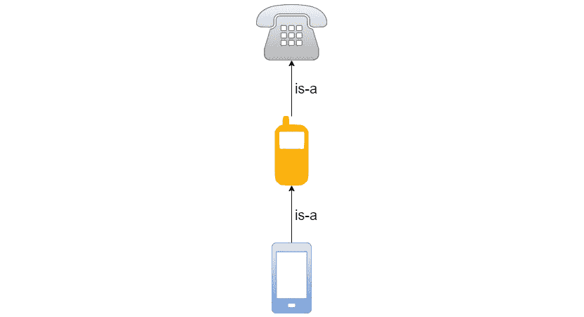

图 10.11 – 电话之间的“是”关系

我们可以说，因为智能手机是移动电话，所以它可以做任何移动电话能做的事情。我们还知道，智能手机可以做老式移动电话做不到的事情，比如允许我们使用 GPS 和地图应用一起导航。

另一方面，移动电话可以做固定电话能做的所有事情；也就是说，可以拨打电话和接听电话。但它还可以做其他事情，比如允许我们发送短信。

我们也可以将这种关系视为一种父子关系。智能手机是移动电话的子类，而移动电话是其父类。这也意味着子类将继承其父类的特性。这就是面向对象编程中继承的工作原理。

一个类可以继承另一个类，通过这种方式，它将继承父类中定义的所有内容，并添加使这个类独特的东西。为了看到这可能是什么样子，我们需要两个类。我们可以有一个`Person`类，就像我们在*图 10.10*中看到的那样定义。它可能看起来像这样：

```py
class Person
	private name
	private date_of_birth
	private gender
	private address
	private nationality
	private phone_number
	private email_address
	public function get_name()
		return name
	end_function
	public function set_name(new_name)
		name = new_name
	end_function

     // Getters and setters for all the other 
     // variables are implemented here
end_class
```

在这个类中，我们将所有成员变量定义为类的私有成员，所有获取器和设置器都定义为公共的。

这里使用的信息适用于所有人，但我们可能需要存储一些人的额外信息。例如，可能是员工。他们是人，因此，我们存储的关于个人的所有信息也将适用于他们，但我们还想存储关于员工的额外数据。这可能包括薪资和部门。然而，我们不想像以下图像所示那样定义它们：

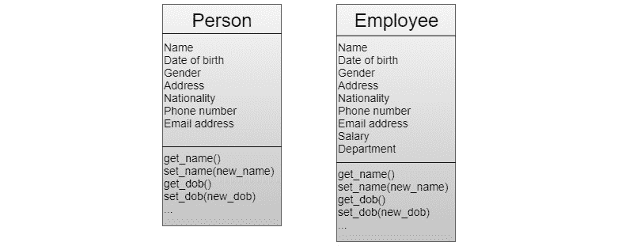

图 10.12 – 未使用继承的两个类

在这里，我们可以看到`Person`类中的所有内容都在`Employee`类中重复出现。唯一的区别是我们添加了`Employee`类将继承自`Person`类，通过这种方式，它们自动获得`Person`中定义的所有内容。这看起来可能像这样：

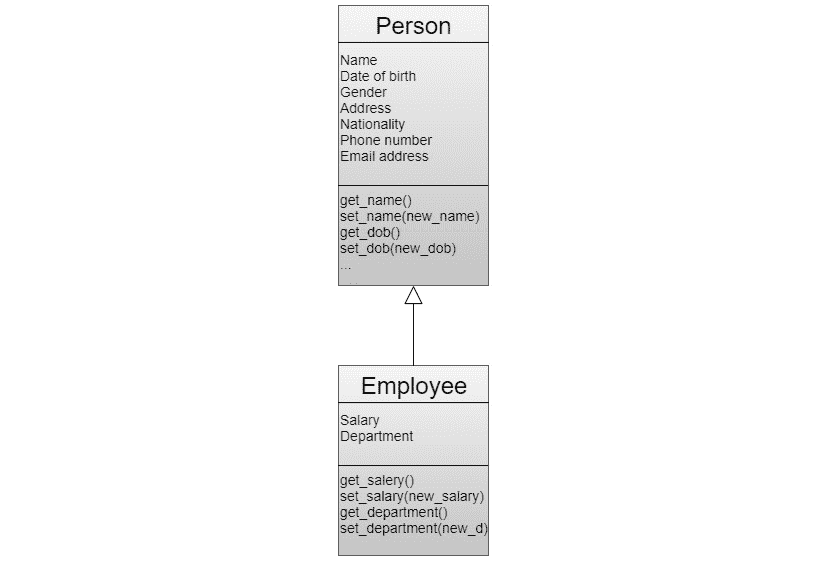

图 10.13 – 员工从 Person 继承

在这里，`Employee`类将继承`Person`类中的所有内容。我们只需要在`Employee`类中定义使这个类独特的东西。正如我们通常用有三个部分的矩形来表示类一样，继承用空心箭头符号来表示，如图所示。

在代码中实现这种继承时，我们不需要对`Person`类做任何修改。因此，`Employee`类将看起来像这样：

```py
class Employee inherit Person
	private salary
	private department
	public function get_salary()
		return salary
	end_function
	public function set_salary(new_salary)
		salary = new_salary
	end_function
	public function get_department()
		return department
	end_function
	public function set_department(new_department)
		department = new_department
	end_function
end_class
```

尽管在这个类中我们只有薪资和部门这两个代码，但从第一行代码我们就可以看出我们继承了`Person`类。

面向对象编程的具体实现方式因语言而异。支持面向对象的语言有时也会对面向对象的使用规则有所不同的规定。一如既往，我们需要学习我们所使用的语言是如何定义面向对象原则的。

以下是一些支持面向对象（完全或作为选项）的流行语言列表：

+   C++

+   C#

+   Java

+   JavaScript

+   Objective-C

+   PHP

+   Python

+   Ruby

+   Scala

+   Swift

面向对象是主要的编程范式之一。它拥有众多粉丝，他们喜欢它并认为这是一种很好的代码结构方式。接下来我们将探讨的下一个范式已经存在很长时间，但在过去几年中其受欢迎程度有所上升：函数式编程。现在，许多程序员认为它是一种更有趣的范式。

# 理解函数式编程

函数式编程是一种越来越受欢迎的范式。它并不新鲜；我们可以追溯到 20 世纪 30 年代提出的 Lambda 演算。在 20 世纪 50 年代，编程语言 Lisp 被开发并实现了这种范式。

正如我们将看到的，这种范式在程序的结构和实现方式上有着非常不同的方法。为了理解这种范式的优势，您需要重新思考您看待编程和代码结构的方式。

我们将从查看函数式编程的定义开始。这个定义本身可能很难理解，因此我们还需要查看其中的一些部分来理解这是关于什么的。

一个定义如下：

*"函数式编程是一种构建计算机程序的方式，它将计算视为数学函数的评估，并避免改变程序的状态和可变数据的使用。"*

让我们从解读这个定义开始。其中“将计算视为数学函数的评估”的部分可能听起来有些吓人。如果我们仔细观察，我们会发现这其实相当直接。让我们看看两个数学函数，看看我们如何使用和理解它们，以便理解函数式编程的定义在说什么。

## 纯函数

我们将从以下简单的函数开始：

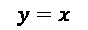

在这里，`x`是我们提供给函数的输入，`y`是结果。这个简单的函数只是表明，无论我们传递什么值给它，它都会返回相同的值。这个函数的示意图如下：

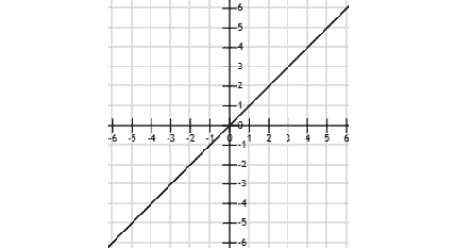

图 10.14 – y = x 的示意图

在这里，我们可以看到如果`x`是`1`，则`y`也是`1`，如果`x`是`-3`，则`y`也是`-3`。关于定义所谈论的内容，我们还需要理解的一个更基本的事实是，相同的输入到`x`将始终产生相同的`y`作为结果。如果我们为`x`输入`5`，我们总是会得到`y`为`5`。

让我们看看另一个函数，看看是否同样成立：

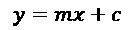

这是一个表示直线的函数。当值为`2`和`3`时，我们将得到以下示意图：

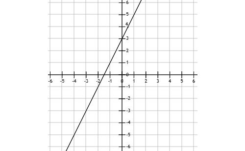

图 10.15 – 当 m = 2 且 c = 3 时，y = mx + c 的示意图

再次强调，从这个例子中我们学到最重要的东西是结果，即当`0`时`3`的值，以及当`-1`时总是`1`。

当从函数式编程的角度谈论数学函数时，这是关键的事实：具有相同输入的函数总是会返回相同的答案。在函数式编程中，这被称为*纯函数*。

但这难道不是任何函数都始终成立的吗？看看下面的函数：

```py
function add(a, b)
    return a + b
end_function
```

让我们称这个函数为：

```py
print add(2, 3)
```

调用函数时，我们总是会得到以下响应：

```py
5
```

我们可以说这是一个纯函数。但是，当我们从`math`模块调用这个函数时会发生什么呢？

```py
print Math.random()
print Math.random()
```

现在，输出可能看起来是这样的：

```py
0.34
0.75
```

使用相同的参数（在我们的情况下没有参数）调用随机函数不会给出相同的答案。这不是一个纯函数。这就是在先前的定义中评估数学函数的含义。

接下来是定义的第二部分，*避免改变程序状态和可变数据的使用*。改变状态是我们从结构化编程中讨论的内容时认识到的。在那里，我们说*结构化编程使用语句来改变程序的状态*。这似乎是功能编程在谈论结构化编程所做事情的绝对反面。我们说程序的状态是由在任何给定时间存储在其所有变量中的数据的组合所定义的。改变一个变量的值将改变程序的状态。

如果一个程序避免改变其状态，这意味着我们无法改变任何变量吗？对这个问题的答案是肯定的，这也是定义的最后一部分：它也避免使用可变数据。可变数据是什么意思？我们将在下一节中看到这一点。

## 可变和不可变数据

可变意味着可能改变，而不可变意味着无法改变。术语*可变数据*意味着我们可以改变的数据。我们知道我们可以在变量中存储数据，并且我们可以随意更改它，如下面的代码块所示：

```py
x = 10
y = 20
x = y
```

在这里，我们首先将值`10`赋给`x`变量，然后将值`20`赋给`y`变量。在最后一行，我们改变`x`的值，使其与`y`相同，即`20`。我们可以这样说，`x`是可变的，因为我们能改变它。但这能证明`x`是可变的吗？在某些语言中是这样的，但在其他语言中，这根本不是真的，即使`x`中的最终值始终是`20`。如果我们不能改变它，`x`如何从`10`变为`20`？这听起来是不可能的。

答案在于语言处理其变量的方式。如果我们只是把变量想象成一个可以存储值并且可以在任何时候用另一个值替换它的盒子，它是可变的，但如果我们把变量想象成指向计算机内存中某个位置的值，事情就会有所不同。

让我们进行一个小型的思维实验。我们可以从两个变量`x`和`y`开始，并再次将它们赋值为`10`和`20`，就像我们之前做的那样：

```py
x = 10
y = 20
```

以下图表说明了如果`x`和`y`引用两个内存位置可能看起来像什么：

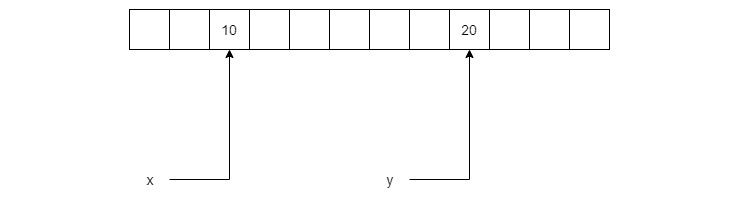

图 10.16 – 两个变量引用两个内存位置

如我们所见，值`10`和`20`并没有存储在变量中。相反，变量是指向这些值在内存中的位置。如果我们改变`x`引用的值从`10`到`20`会发生什么？

它看起来可能像这样：

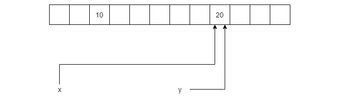

图 10.17 – 指向相同内存位置的变量

现在，让我们考虑如果内存位置上的值可以被改变，如果我们改变其中一个变量会发生什么，例如，如果我们运行这一行代码：

```py
y = 22
```

我们将会有一个类似以下的情况：

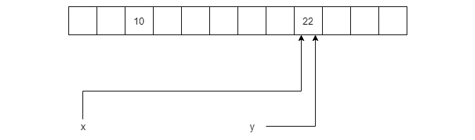

图 10.18 – 改变一个变量引用的值

现在，让我们打印`x`引用的值，如下所示：

```py
print x
```

我们会得到以下结果：

```py
22
```

即使我们没有给`x`赋值`22`，它也会具有那个值，因为我们允许`y`改变两个引用的内存位置的内容。

如果我们改为使内存位置不可变，当我们给`y`赋值`22`时会发生什么？我们会得到如下所示的结果：

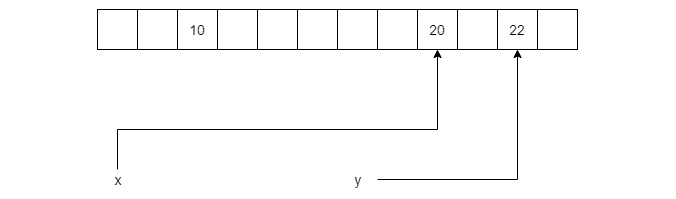

图 10.19 – 给不可变变量赋新值

如我们所见，值根本没有任何变化。相反，`y`现在引用了一个新的内存位置。如果重新声明`y`，我们会得到一个与旧`y`变量同名的新鲜变量。

这就是不可变性的工作方式。变量不会被改变。相反，在内存的另一个位置创建了一个新值。由于我们不能改变任何变量，因此我们也不能改变程序的状态。

但为什么我们的变量是不可变的，而且我们无法改变程序的状态这么重要呢？答案就是副作用。

## 避免副作用

计算机编程中的副作用是指表达式修改了其局部环境之外的变量中的某些值。为了理解这一点，让我们看一个例子：

```py
x = 0
function some_func(value)
    x = x + value
    return x + 3
end_function
```

首先，这个程序非常简单，但它说明了我们需要说明的观点。在这里，我们有一个变量`x`和一个名为`some_func`的函数。变量在函数外部声明，但在函数内部被修改。我们现在可以使用以下表达式：

```py
 x = x + value
```

这是在修改其环境之外的价值，函数体是表达式存在的环境。

这在如果我们使用的语言已经将`x`定义为可变，以便我们可以改变它是正确的。但在一个`x`不可变的语言中，将不会有任何变化。相反，我们会得到一个新的`x`变量，它只存在于函数内部。

如果我们在一个`x`是可变性的语言中这样做，会有什么缺点呢？为了看到这一点，我们可以调用函数两次并打印其结果，如下所示：

```py
print some_func(10)
print some_func(10)
```

输出将如下所示：

```py
13
23
```

这不是一个好的行为，因为用相同的参数调用函数应该始终返回相同的值。在这里，它没有，而且这种情况发生的原因是程序有副作用。这是因为函数返回的结果取决于函数之前的调用发生了什么。

如果我们有一个没有副作用（side effects）的程序，那么程序运行时会发生什么将会非常可预测。如果我们思考之前的小程序，我们会看到要预测函数调用的结果几乎是不可能的，因为结果将取决于之前的调用，以及在这些调用中我们提供的参数数据。

函数式编程的下一个原则被称为声明式编程。让我们看看它到底是什么。

## 命令式编程

要理解命令式编程是什么，我们可以将其与我们已知的事物进行比较，那就是命令式编程。在命令式编程中，我们专注于描述如何完成某事。而在命令式编程中，另一方面，我们的焦点在于我们想要实现的目标。

为了理解这一点，我们将查看一些现实世界的例子。如果你去餐厅，你可以要么是一个命令式客人，要么是一个声明式客人。

命令式客人会下这样的订单：

“请给我一份鳕鱼。首先，在烤箱里烤 10 到 12 分钟。最后，要经常检查，以免烤焦。当鳕鱼在烤箱里时，请煮土豆。为了准备奶油酱，首先，在中号平底锅中用中火融化一些黄油。慢慢加入玉米淀粉，搅拌大约一分钟。在不断地搅拌的同时，慢慢加入打发奶油和牛奶。最后，加入一些帕尔玛干酪。在小火上慢慢煮酱汁，偶尔搅拌。”

如果你是命令式餐厅客人，你可能会这样说：

“请给我一份鳕鱼。”

第一位客人回答了如何做的问题，而第二位客人则关注了是什么。

计算机科学中一个优秀的声明式例子是**SQL**。它是**结构化查询语言**的缩写，用于存储和检索数据库中的数据。如果我们想获取存储在客户表中的所有客户的姓名和姓氏，我们可以编写以下代码：

```py
SELECT firstName, lastName FROM customers;
```

这是一种声明式，因为我们说了我们想要什么——客户的姓名和姓氏——但我们没有说关于如何检索数据的事情。在底层数据库系统中，某些部分必须知道如何完成这件事，但如果我们使用 SQL，我们不需要了解它是如何完成的。

Python 是一种编程语言，我们可以在其中编写命令式和声明式程序。让我们看看两个执行相同任务的程序，一个是以命令式方式，另一个是以声明式方式。

首先是一个用命令式风格编写的简短程序：

```py
strings = ['06', '68', '00', '30']
numbers = []
for value in strings:
    if int(value) != 0:
        numbers.append(int(value))
print(numbers)
```

从前面的代码中，我们可以观察到以下情况：

1.  在第一行，我们定义了一个字符串列表。每个字符串包含一个两位数。小于 10 的值将用 0 作为前缀。

1.  在第二行，我们声明了一个空列表。我们将把第一个列表中的数字从字符串转换为整数值，并存储在这个数组中。

1.  然后，我们将进入一个 `for` 循环。在这个循环的每次迭代中，第一个列表中的一个值将被分配给 `value` 变量。第一次将是 `06`，第二次将是 `68`，依此类推。

1.  然后，我们有一个 `if` 语句。它将值转换为整数并与零进行比较。如果这是假的——也就是说，它不是零——我们将进入 `if` 块。

1.  在这个块内部，我们将把我们将值转换为整数后添加到 `numbers` 列表中。

1.  当我们遍历完第一个列表中的所有值后，我们打印第二个列表的内容，得到以下输出：

    ```py
    [6, 68, 30]
    ```

如你所见，我们为第一个值保留的零前缀现在没有了，因为这些是整数，06 就是 6。另外，那个有双重零的值根本不在列表中，因为它使 `if` 语句为假，并且在这个迭代中跳过了添加值的行。

这个程序的第二个版本是用声明式风格编写的，看起来如下所示：

```py
strings = ['06', '68', '00', '30']
numbers = [int(value) for value in strings if int(value) != 0]
print(numbers)
```

这个程序与上一个程序做的是同样的事情，但它的编写方式非常不同。它使用了一种叫做 *列表推导* 的东西。这是 `numbers =` 后面的部分。如果你仔细看，你可以在这个表达式的中间看到一个 `for` 循环。它看起来就像其他示例中的 `for` 循环。在这个循环之后，我们可以看到一个 `if` 语句，它看起来就像第一个程序中的 `if` 语句。在这个推导中的这个位置的 `if` 语句充当一个过滤器。如果这个表达式评估为真，当前值将被传递到这个表达式的开头。在这里，我们将值转换为整数。这个转换后的值将成为一个名为 `numbers` 的列表的一部分。

这是一种声明式，因为我们没有说明这个值是如何进入新列表的，我们只是说什么会进入列表。

我们将要介绍的函数式编程的最后一个原则被称为一等函数。

## 一等函数

函数式编程使用一等函数的原则。如果一个函数被当作编程语言中的一等公民来对待，那么它就被说成是一等函数。一等公民是可以被修改的、可以作为函数参数传递、可以从函数返回等。

在支持一等函数的编程语言中，我们可以做如下事情：

```py
function formal_greeter(name)
    return "Dear, " + name
end_function
function informal_greeter(name)
    return "Yo, " + name
end_function
function greeter(greeter_func, name)
    greeter_func(name)
end_function
greeter(formal_greeter, "Bob")
greeter(informal_greeter, "Bob")
```

这个程序声明了两个函数，`formal_greeter` 和 `informal_greeter`。两者都接受一个 `name` 作为参数，并将返回带有名称的问候语。

我们有一个名为 `greeter` 的函数。这个函数接受一个函数引用作为其第一个参数和一个名称作为其第二个参数。程序中的最后两行是调用 `greeter` 函数。第一行传递的是正式的 `greeter` 函数的引用，而第二行传递的是非正式的 `greeter` 函数的引用。

`greeter` 函数将使用传递给它的函数，因此这两个调用将产生以下输出：

```py
Dear, Bob
Yo, Bob
```

能够使用这样的函数有几个好处。让我们看看一个例子。在本章的早期，我们讨论了面向对象编程，并定义了一个名为 `Person` 的类。我们看到我们可以从这个类创建几个对象，每个对象代表一个人。

在本章的后面，我们将看到编程语言可以使用多种范式，如果我们使用一种允许我们定义类并将函数作为一等公民使用的范式，我们可以做一些非常有用的事情。

如果我们创建一些具有 `name` 和 `age` 的 `Person` 对象并将它们插入到列表结构中，这可能会看起来像以下这样：

```py
p1 = Person("Dipika", 34)
p2 = Person("Manfred", 58)
p3 = Person("Ahmed", 38)
p4 = Person("Rita", 39)
persons = [p1, p2, p3, p4]
```

我们现在有一个名为 `persons` 的列表中存储了四个 `Person` 对象。如果我们想对这个列表进行排序，我们可以使用语言提供的排序函数。但是有一个问题。排序函数不知道我们想要根据什么来排序；也就是说，是 `name` 还是 `age`。它甚至不知道 `Person` 对象，因为它们是由我们编写的类定义的。它所知道的是如何排序一个列表，但它需要函数的帮助，这个函数可以从 `Person` 类接收两个对象，并在第一个对象大于第二个对象时返回 `true`，否则返回 `false`。我们需要编写这个函数，并在其中定义什么使得一个对象比另一个对象大。我们可以决定是按 `name` 还是 `age` 来排序。

如果我们想要按 `age` 排序对象，我们可以这样做：

```py
function compare(person1, person2)
    return person1.get_age() > person2.get_age()
end_function
sorted_persons = sort(compare, persons)
```

这里，我们有一个名为 `compare` 的函数。它将接受两个 `person` 对象作为其参数。如果第一个人的年龄大于第二个人的年龄，这个函数将返回 `true`。否则，它返回 `false`。

`sort` 函数将其第一个参数作为对这个函数的引用。在执行排序时，它需要比较两个不同的对象以确定它们在排序列表中的顺序。

在我们的例子中，它首先将 `Dipika`（34 岁）和 `Manfred`（58 岁）传递给函数。由于 `Manfred` 的年龄大于 `Dipika` 的年龄，`compare` 函数将返回 `false`。

现在，`sort` 函数将取上轮比赛的胜者 `Manfred`，并将这个对象与 Ahmed 的对象一起传递。这次，`Manfred` 将首先传递，因此他将是函数中的 `person1` 对象，而 Ahmed 将是 `person2`。

这次，第一个对象的年龄大于第二个对象，因此函数返回 `true`。

这就是 `sort` 函数如何使用我们提供的函数来完成其排序列表的任务。如果我们想按名称排序，我们只需要更改 `compare` 函数，使其比较名称而不是年龄。

如果我们打印包含排序列表的 `sorted_persons` 列表，如果我们按年龄排序，我们会得到以下结果：

```py
Dipika, 34
Ahmed, 38
Rita, 39
Manfred, 58
```

如果我们按名称排序，我们会得到以下结果：

```py
Ahmed, 38
Dipika, 34
Manfred, 58
Rita, 39
```

首类函数是一个令人信服的特性，它让我们能够编写更通用的函数，因为我们可以传递另一个函数来完成其部分工作，就像排序函数那样工作。

函数式编程有几个既强大又让我们能够编写更高品质代码的概念。这就是为什么函数式编程一直在不断获得人气，以及为什么许多非函数式编程语言正在借用函数式概念的原因。

以下是一些支持函数式编程的流行语言的列表，这些语言要么将其作为主要范式，要么使用了函数式编程的许多概念：

+   C++（自 C++ 11 版本起）

+   C#

+   Clojure

+   Common Lisp

+   艾拉朗

+   F#

+   Haskell

+   JavaScript

+   Python

+   Ruby

函数式编程不仅是一个非常有趣的范式，而且它还在影响许多已建立的语言，使它们能够吸收函数式概念。下一个范式不像我们之前看到的那些范式那样广泛使用，但它有一些有趣的概念。

# 理解逻辑编程

这种范式基于形式逻辑。用实现这种范式的语言编写的程序由一组逻辑形式的句子组成，这些句子将表达特定问题域的事实和规则。

这可能听起来很复杂和奇怪，但正如我们将看到的，这个范式的核心概念相当简单。考虑以下图示：

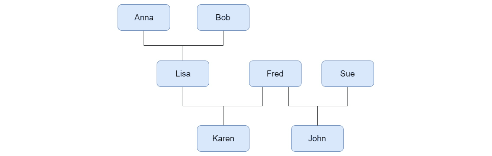

图 10.20 – 一个家谱

在前面的图中，我们可以看到一个家谱。看着它，我们可以看到以下内容：

+   安娜和鲍勃有一个孩子，莉萨。

+   莉萨和弗雷德有一个孩子，卡伦。

+   弗雷德和苏有一个孩子，约翰。

+   卡伦的祖父母是安娜和鲍勃。

在使用逻辑编程的编程语言中，我们可以使用称为*谓词*的东西来定义这个家谱。这看起来可能像这样：

```py
mother(anna,lisa).
mother(lisa,karen).
mother(sue,john).
father(bob,lisa).
father(fred,karen).
father(fred,john).
```

它们可能看起来顺序有些奇怪，但大多数逻辑语言都希望我们将同一类的所有谓词放在一起，所以在这种情况下，我们首先定义所有的母亲，然后是所有的父亲。

在第一行，我们可以看到`Anna`是莉萨的母亲，而在第四行，我们可以看到`Bob`是莉萨的父亲。这些名字被称为*原子*，因为它们代表一个单一值，并且原子只能用小写字母定义。

我们现在可以定义一些规则，这些规则规定了什么使某人成为父母和祖父母。它可能看起来像这样：

```py
grandparent(X,Z) :- parent(X,Y), parent(Y,Z).
parent(X,Y) :- father(X,Y).
parent(X,Y) :- mother(X,Y).
```

在这里，`X`、`Y`和`Z`是变量。变量用首字母大写来定义。我们可以这样读

*对于任何`X`、`Y`、`Z`，*

如果`X`是`Y`的父母，且`Y`是`Z`的父母

然后`X`是`Z`的祖父母

最后两行定义了什么是父母。要么是`X`是`Y`的父亲，要么是`X`是`Y`的母亲。

我们现在可以使用这个来提出如下问题：

```py
grandparent(anna, karen).
```

这个问题将产生以下答案：

```py
yes
```

这对`Anna`是`Karen`的外祖母来说是正确的。

我们还可以询问卡伦的祖父母是谁，如下所示：

```py
grandparent(Q, karen).
```

在这里，`Q`是一个变量，我们将得到以下响应：

```py
bob
anna
```

我们也可以问 Anna 的孙子是谁：

```py
grandparent(anna, Q).
```

这将告诉我们它是`Karen`：

```py
karen
```

当然，在逻辑编程语言中你可以做更多的事情，但这只是逻辑编程可能看起来的一部分。

以下是一些支持逻辑编程的语言列表：

+   ALF

+   Curry

+   Fril

+   Janus

+   Prolog

在逻辑编程中，我们结构代码的方式与其他所有范式非常不同，使其成为一个有趣的*局外人*。

我们现在已经看到了范式领域的领先者。但在我们离开这些范式之前，让我们简单提一下更多的一些，以获得更完整的图景。

# 其他范式

本章中我们讨论的范式是目前最常用的，但还有几个其他的。让我们快速看一下其中的一些。

## 函数级

在函数级编程中，我们根本没有任何变量。相反，程序是由基本函数构建的，结合函数到函数的操作，有时被称为*泛函*或*函数形式*。

实现这种范式的语言是围绕以下层次结构构建的：

+   原子是函数操作的数据。它们只会作为程序的输入或输出出现，永远不会在程序的实际内部找到。

+   函数将原子转换为其他原子。编程语言将定义一组函数，程序员可以使用函数形式创建新的函数。程序本身也是一个函数。

+   函数形式被用来将函数转换为其他函数。程序员可以使用它们来创建新的形式。

## 数组编程

在数组编程中，操作将同时对整个值集进行。这些解决方案通常用于科学和工程应用。

操作被推广到可以应用于标量和数组。在这本书中，我们已经遇到了以变量的形式出现的标量，它们一次只能持有单个值。我们也已经看过数组。如果你需要刷新关于变量和数组的记忆，你可以在*第六章* *处理数据 – 变量*中了解更多。

当*a*和*b*是标量或数组时，*a + b*操作将会有不同的行为。如果它们是标量，结果将是两个值的和。如果它们是数组，结果将是两个数组中存储的所有值的总和。

数组编程可以在牺牲效率的情况下简化编程。这意味着当我们编写代码时，使用这些语言可能更容易，但运行它们可能比用使用其他范式的语言编写的程序花费更长的时间。

## 量子编程

这是我们未来的范式。要能够使用这个范式，我们需要量子计算机。量子计算机利用量子物理学中定义的粒子量子力学特性。这些粒子具有叠加性，这意味着在我们观察它们之前，它们将处于任何可能的位置。量子计算机将通过定义一种称为*量子比特*的东西来利用这一点。普通计算机的比特可以是 0 或 1。量子比特将同时是这两种状态，利用这一特性，量子计算机将能够在极短的时间内计算出任何给定输入的所有可能结果，这比我们今天使用的计算机进行相同计算的时间要短得多。

量子编程本身不是一个范式，但为了能够为量子计算机编写程序，我们需要支持比我们今天使用的操作更多的语言：

![图 10.21 – 瑞士苏黎世 IBM 研究实验室建造的量子计算机的一部分。照片由 IBM 苏黎世实验室提供，cc-by-2.0。（img/Fig_10.21_B15554.jpg）图 10.21 – 瑞士苏黎世 IBM 研究实验室建造的量子计算机的一部分。照片由 IBM 苏黎世实验室提供，cc-by-2.0。尽管我们只是看到量子计算机的第一批缓慢成形，但我们已经定义了可以用于它们的几种语言。它们建立在现有的范式之上，如命令式编程和函数式编程。当我们拥有完全功能化和可访问的量子计算机时，我们将看到利用这些计算机力量的新语言的爆炸式增长。# 多范式语言大多数编程语言不会仅仅坚持一种范式，而是使用多种。这就是为什么它们被称为*多范式语言*。我们可以制作一张表格，列出一些最受欢迎的语言以及它们支持哪些范式：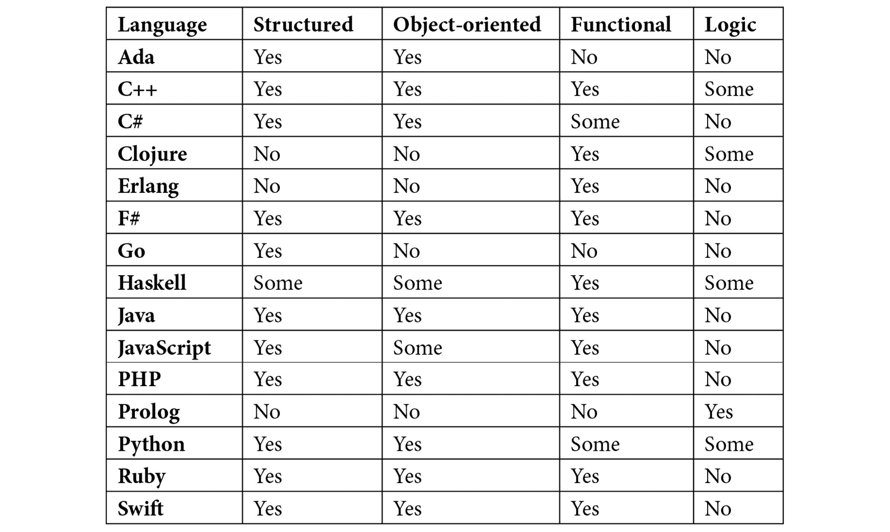

表 10.1

总是可以说一个范式对编程语言的影响有多大。在这里，我研究了本章中我们探讨的主要范式以及语言的文档如何描述自己。

被标记为*Some*的语言已实现该范式的某些概念。在某一范式的列中有*Yes*的语言可能不是该范式的主体，但已实现了许多其特性。

# 摘要

在本章中，我们探讨了最流行的编程范式。

我们首先探讨的前两种，结构化编程和面向对象编程，是过去 35-40 年主导编程的两种范式。

在结构化编程中，程序状态是通过语句修改的，程序流程是通过循环和选择（如 if 语句）控制的。

面向对象编程建立在结构化编程的思想之上，但代码的组织是使用我们人类所熟知的概念，例如将具有相似数据和行为的对象进行分类。这通过类来实现，类作为代表现实世界中事物（如人或银行账户）的对象的蓝图。

函数式编程是我们在本书中介绍的最古老的范式，但在过去十年中却获得了流行。在函数式编程中，我们不希望修改程序的状态，并使用纯函数的概念来实现这一点。使用这种范式编写程序可以减少代码中的错误，并使我们的应用程序更加稳定。

在逻辑编程中，我们定义谓词，这些谓词将定义规则，我们可以使用这些规则来回答逻辑问题。与其他三种范式相比，局部编程的流行度要低得多。

有许多其他范式可供选择，它们通常相当专业化或被一些鲜为人知的语言所使用。

大多数编程语言都是多范式的，即它们使用来自多个范式的概念。

在下一章中，我们将看到，作为程序员，我们的工作并不在编写代码时就结束了。
