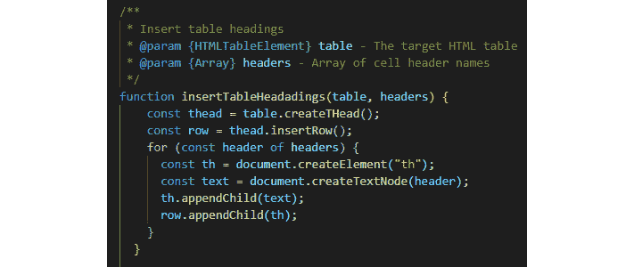
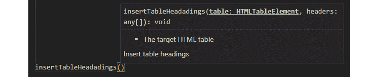
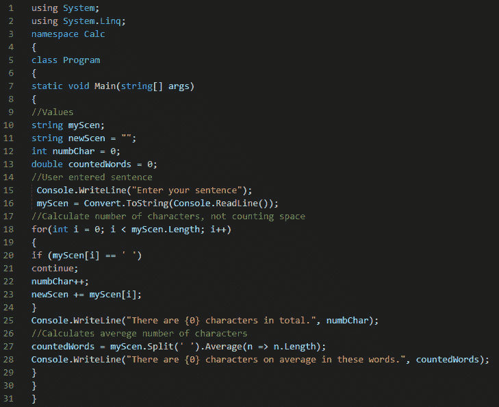
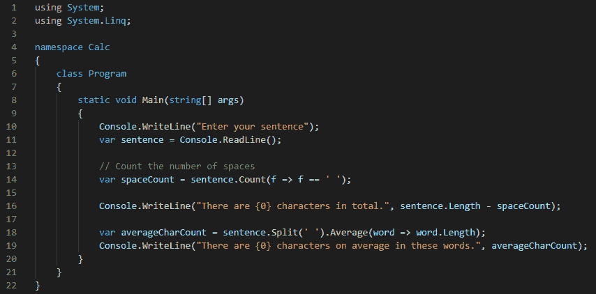
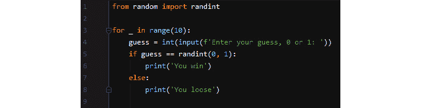
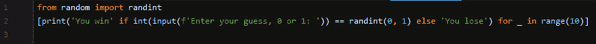
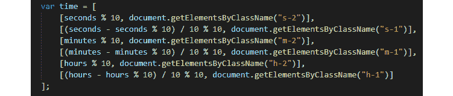
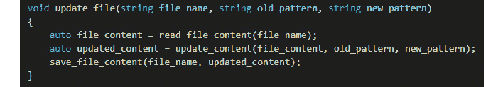
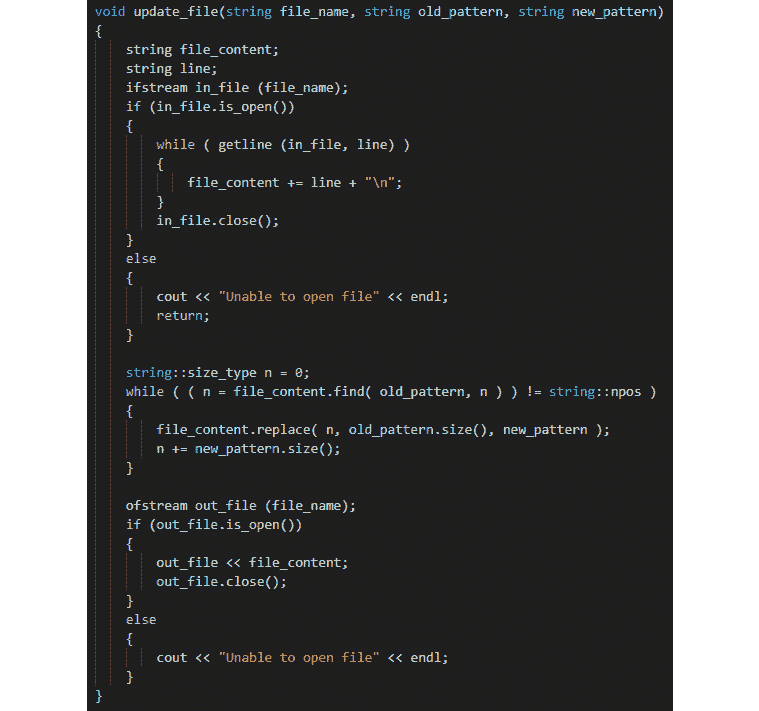
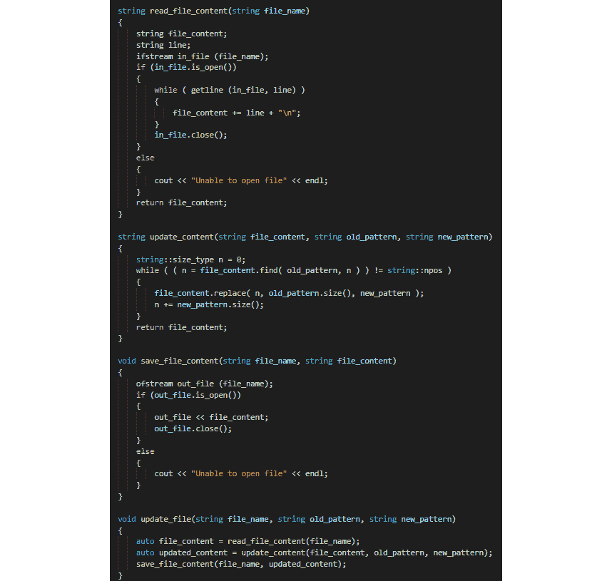

# *第十二章：代码质量*

代码质量有许多方面。我们可以谈论高效的代码，这是运行速度快或不会浪费资源（如内存）的代码。它也可以是易于我们人类阅读和理解的源代码，因此也易于阅读和维护。在本章中，我们将讨论这一点，并查看编写高质量代码的一些最佳实践。

我们还将查看一些示例，如果我们想编写高质量的代码，我们应该尽量避免的事情。

在本章中，我们将学习以下主题：

+   理解代码质量是什么

+   编写可读的代码

+   编写高效的代码

+   理解智能代码并不总是智能

+   理解编写高质量代码的一些最佳实践

在我们学习如何编写高质量的代码之前，我们应该定义代码质量是什么。

# 定义代码质量

当涉及到程序代码时，定义质量的含义是困难的。原因是所有开发者都会对它有自己的看法。一位开发者可能会争辩说，我们应该专注于编写可读的代码，因为它更容易理解和维护，从而减少我们向代码中插入任何错误的机会。另一位开发者可能会争辩说，我们应该专注于编写紧凑的代码；也就是说，尽可能少的代码行。即使代码难以阅读，更少的代码也会给我们更少的在代码中引入错误的机会。

在这里，两位开发者会为同样的事情——代码中的错误更少——而争论，但他们的立场是矛盾的。

让我们用一个小的例子来看看，我们使用 Python 作为我们的语言。我们想要创建一个列表，它包含通过掷两个骰子可以得到的所有可能的组合。

第一个将使用更多的代码，但更容易理解：

```py
two_dice = []
for d1 in range(1, 7):
   for d2 in range(1, 7):
       two_dice.append((d1, d2))
```

在第一行，我们创建一个空列表。

然后，我们有一个用于第一个骰子的`for`循环。`d1`变量在第一次迭代时将获得值`1`，第二次迭代时获得值`2`，依此类推。记住，结束值`7`是它停止的时候，所以这是`7`，而不是`6`，因为它会在达到这个值时停止，给我们的是 1 到 6 的值。

然后，我们将对第二个骰子执行同样的循环。

在最后一行，我们将`d1`和`d2`的值插入到列表中。在追加值时多加一个额外的括号，将它们放入所谓的`d1`和`d2`属于一个组合。

我们可以用一行代码完成同样的事情。它看起来像这样：

```py
two_dice = [(d1, d2) for d1 in range(1, 7) for d2 in range(1,     7)]
```

如我们所见，第二个例子代码更少，但牺牲了可读性。

但谁是对的——是主张可读性的开发者还是主张代码更少的开发者？我们无法说，因为他们都是对的。

我们需要的是一个更好的定义，即代码质量是什么，更重要的是，它应该是可衡量的。

已经做出了许多努力来定义一个衡量代码质量的模型，其中之一是 CISQ 的质量模型。我们将在下一节中看到它是什么。

## CISQ 的质量模型

**信息软件质量联盟**（**CISQ**）已经定义了五条规则，可以用来衡量代码的质量。它最初是针对商业软件而定义的，但后来扩展到也包括嵌入式系统，主要用于**物联网**（**IoT**）应用程序。以下规则如下：

+   **可靠性**：可靠性衡量风险水平和失败的可能性。它还将衡量在代码更新或修改时注入现有代码中的缺陷。衡量可靠性的目标是防止应用程序因严重错误而无法运行的时间。

+   **性能效率**：当应用程序运行时，它执行操作的速度取决于代码的编写和结构。在代码级别上测量效率将有助于提高应用程序的整体响应时间以及我们识别需要高速处理数据的应用程序潜在风险的能力。

+   **安全性**：安全规则将衡量由于不良编码实践而可能发生的潜在安全漏洞的可能性。

+   **可维护性**：当我们谈论代码的可维护性时，我们通常指的是三个方面。我们说代码应该是，即，*可适应的*，这意味着代码可以按照需求进行适应性的改变；*可移植的*，这意味着代码可以在不同的平台上使用，例如不同的操作系统；以及*可转移的*，这意味着代码可以从一个开发团队转移到另一个团队。

这可以应用于，或多或少，所有代码，但我们希望尽可能少地付出努力来完成这三件事。

+   **规模**：规模本身并不是一个质量属性，但代码的规模可能会影响其可维护性。我们拥有的代码越多，就越难导航、理解和遵循其逻辑。

我们现在已经讨论了关于代码的质量方面。但用户视角的质量又如何呢？

## 理解用户质量

CISQ 模型非常关注的是从用户的角度来看的质量。一个应用程序可以符合所有 CISQ 规则，但使用这个应用程序的用户仍然可能认为它的质量很差。

美国软件工程师汤姆·德马克博士提出，*一个产品的质量是它改善世界的程度的一个函数*。

这句话可以解释为，一个应用程序的功能质量和用户满意度比代码的结构质量更重要。

美国计算机科学家杰拉尔德·温伯格曾经说过，*质量是对于某些人的价值*。这表明质量是主观的——一个人可能会将某个应用程序的质量定义为质量，而另一个人可能会认为它是相反的。这种观点将专注于提出以下问题：*谁是我们想要评价我们软件的人？*以及*对他们来说什么是有价值的？*

在这些定义的指导下，我们开始意识到，制作软件远不止是编写代码。即使代码质量很高，如果用户不喜欢我们创造的东西，他们也不会使用它。这就像如果我们用最好的工艺制作了一把椅子，但如果它非常不舒服，没有人会买它。

因此，我们必须了解我们的用户和他们的需求。这样做并不总是容易的，因为我们的潜在用户可能不知道这些需求。在你拥有第一台智能手机之前，你并没有觉得缺少它，因为你不知道它能提供什么。另一方面，如果你在几个小时后失去它，你可能会立刻觉得缺少它。

为了达到在我们理解用户需求之前他们就已经理解的需求，我们需要发挥想象力。我们可以从问一些简单的问题开始。它们可能是，这个应用程序将解决什么问题？谁会从中受益？受益于使用这个应用程序的人是否有共同的模式？这个群体已经使用了什么类型的应用程序？在这些应用程序中使用的功能、模式或想法，我们能否在我们的应用程序中重用，以便使这个群体一开始就对我们的应用程序的工作方式更加熟悉？

当我们有了关于我们未来用户可能是谁的想法时，我们需要关注应用程序内的流程。我们都知道，当我们使用一个程序或任何其他产品时，如果我们不知道该做什么，是多么令人沮丧。我们尝试了一件事又一件，很快，我们就失去了使用它的兴趣。

如果你投入时间和金钱去开发某样东西，你至少应该给你的这个伟大想法每一个成功的机会。

太好了！我们现在对代码质量有了概念，我们也从用户的角度理解了质量方面。我相信你肯定希望你的软件两者兼备，所以让我们把它们结合起来。

## 将它们结合起来

如果我们仔细思考，创造高质量软件的艺术当然既不是用高质量编写代码，也不是编写用户认为有价值的应用程序；它两者都是。

正如我们在前面的章节中看到的，被使用的应用程序将会被更新、修改和扩展。这意味着如果我们要找到需要更改的地方，代码需要被其他程序员（或我们自己）阅读。

所有的一切都将归结为一个关于金钱的问题。我们希望创建的软件能为我们的用户提供额外的价值，并且我们可以销售我们的应用程序。但也许更重要的是，维护应用程序代码的程序员可以高效地工作。如果他们能快速找到错误，他们将花费更少的时间来修复它。

如果代码易于阅读和理解，程序员也有更高的可能性避免在代码中插入新的错误，从而减少修复它们的成本。

许多程序员将面临的一个问题是，他们没有足够的时间来创建他们想要的、易于理解的优质代码。时间紧迫、不完全理解精心编写的代码重要性的经理，以及不耐烦的客户，所有这些因素都可能迫使程序员快速编写代码，从而导致质量下降。这当然是一种非常短期的做法。

你可能会更快地交付软件，但质量会降低，这对用户和未来需要维护代码的程序员来说都是如此。这很可能比一开始就编写高质量的代码成本效益更低。

应当注意的是，如果我们用一个编写得不好的项目开始，这个项目很可能始终会包含低质量的代码，因为回过头来改进所有代码的成本将太高。

如果我们做得好，编写高质量的代码，并交付用户认为高质量的软件，我们就有一切可以赢得胜利。

本章的其余部分将不会关注用户质量。这并不意味着它不是必要的，但这是一本关于编写代码的书，所以让我们看看我们如何以质量和风格来做到这一点。

# 考虑可读性编写代码

你所编写的代码不仅会被计算机执行。它还将被你自己和他人阅读。因此，编写尽可能易于阅读和理解的代码是至关重要的。

我们可以遵循一些简单的规则，以帮助实现可读的代码。

## 聪明地使用注释和文档

在编写代码时，你需要理解你做什么以及你为什么这样做。但是，当你几个月后回到你的代码时，这些想法并不总是那么清晰，你为什么以这种方式编写代码。对复杂的代码行进行注释是记录你的想法的好方法，既是为了你自己的未来，也是为了将来阅读你代码的其他人。

但是，注释也可能使代码的可读性降低。永远不要对明显的事情进行注释——任何程序员，包括你自己，都会理解的事情。

当你看到一行代码并理解到看到这一行的读者需要停下来思考才能理解它的作用时，你应该使用注释。

对函数和方法进行注释通常是个好主意。这些注释通常就在函数或方法之前，或者作为它里面的第一件事。你应该使用什么取决于你使用的语言，以及该语言程序员使用的约定。

在下面的屏幕截图中，我们可以看到一个 JavaScript 函数的例子：



图 12.1 – 记录一个 JavaScript 函数

以下是我们可以从前面的代码中推断出的内容：

+   在此注释的第一行文本中，描述了此函数的整体职责。然后，使用预定义的 `@param` 名称，记录了两个参数的含义。

+   在大括号内，定义了期望的数据类型。如果我们使用的语言是动态类型的，这一点尤为重要。动态类型的语言将接受我们分配给变量的任何类型，而不是只使用我们指定的类型。JavaScript 是动态类型的，因此这将帮助任何使用此函数的程序员。

+   接下来是参数的名称（表格和标题）。

+   然后，在破折号之后，我们将记录此参数的用途。

许多程序员使用的编辑器如果格式正确，都可以使用这种文档。我们在这里可以看到的格式被称为 JSDoc。

在下面的屏幕截图里，我们可以看到当我们编写将要调用此函数的代码时，编辑器可以显示在此注释中找到的信息：



图 12.2 – 显示函数文档数据的编程编辑器

注释并不是我们记录代码的唯一方式。我们也可以通过给事物起好名字，让代码部分自文档化。

## 使用名称作为文档

通过明智地命名变量和函数，名称本身就可以作为文档。看看以下函数：

```py
function download_and_extract_links(url)
    page = download_page(url)
    links = extract_links(page)
    return links
end_function
```

这里，我们有一个将下载网页并提取该页面上找到的所有链接的函数。当我们调用此函数时，我们传递要从中提取链接的页面的地址。该地址存储在 `url` 参数中。

在内部，调用了名为 `download_page` 的函数。正如其名称清楚地描述了该函数的功能，在阅读代码时，我们不需要去那个函数了解它做什么。接收返回数据的变量被称为 `page`，因此我们了解它包含什么数据。

我们可以在下一行看到相同的内容。如果一个函数被命名为 `extract_links`，我们可以假设这就是该函数的功能。我们将获取的数据存储在一个名为 `links` 的变量中，所以我们的假设似乎是正确的。

当阅读此函数时，函数名称几乎就像一个目录。我们了解那里发生了什么，如果我们想了解，我们可以去那里，但不需要这样做只是为了了解它做什么。一本书的目录的想法是，你将了解章节的内容，并了解如何找到它。这里也是同样的道理。如果我们给函数起一个好名字，它们将让我们知道它们做什么。大多数集成开发环境都允许我们点击名称，这意味着如果我们想阅读它，我们会被带到那个函数。

在本章的后面部分，在*限制函数/方法长度*这一节中，我们将学习更多关于如何使用这项技术的知识。

要能够理解什么样的代码是好的，我们必须看到好的和坏的代码。因此，要成为一名优秀的程序员，我们必须阅读代码。

## 阅读他人的代码

作为一名初学者程序员，我们能做的最好的事情就是阅读经验丰富的开发者编写的代码。

一个好的来源是开源项目。经验丰富的程序员开发这些项目，他们的代码在网上对任何人都是可用的。

选择任何项目，最好是使用你正在使用的相同语言。一开始，接近这样的项目可能会感到不知所措，因为可能会有成百上千个文件分布在几个文件夹中。但请慢慢来，在这个文件结构中探索。也许最重要的事情不是理解项目的文件结构，而是看看代码并尝试理解其中的部分。

这将让你了解经验丰富的程序员是如何组织他们的代码的。需要注意的是，并不是所有的高级开发者都会总是做得完美，但大多数时候，你在这里看到的代码会被认为是相对高质量的。

如果你查看初学者编写的代码并与经验丰富的程序员编写的代码进行比较，你会看到差异。现在，参考以下代码：



图 12.3 – 由初学者程序员编写的程序

看看前面的程序。它是用 C#编写的，会要求用户输入一个句子。然后它会计算用户输入的字符数（不计空格），并最终计算并打印句子中单词的平均字符数。

这段代码具有初学者程序员的许多特征。我教授编程已经有 30 年了，这绝对不是我所见过的最糟糕的例子。现在，参考以下代码：



图 12.4 – 前面展示的由经验丰富的程序员编写的相同程序

现在，将本节开头提供的代码与前面截图中的代码进行比较，这是由经验丰富的程序员编写的完全相同的程序。使用这两个程序的用户将无法察觉任何差异。执行这两个程序将产生如下输出：

```py
Enter your sentence
hi there people
There are 13 characters in total.
There are 4.333333333333333 characters on average in these words.
```

从用户的角度来看，我们可以这样说，这两个程序的质量是相同的。

但代码的质量并不完全相同。让我们列出一些差异：

+   第一个版本——由初学者程序员编写的——没有使用任何缩进，这使得代码非常紧凑且难以阅读。

+   第一个版本没有使用任何空白行，而另一个版本中的空白行将代码分成几个部分。

+   在第一个版本中，`newScen`变量被赋值，但它从未被使用，因此可以从程序中删除。

+   在第一个版本中，变量`names`并没有反映它们所存储的内容。在第二个版本中，将`myScen`变量重命名为`sentence`，将`n`重命名为`word`，将`countedWords`重命名为`averageCharCount`。

+   第一个版本使用了一个`for`循环来计算所有非空格字符。在第二个版本中，使用了一种特定语言的构造来在单行上完成相同的事情。

+   第一个版本在`main`方法的开头声明了所有变量。在第二个版本中，它们是在首次使用时声明的。

+   第一个版本使用了一些其他不必要的代码，例如第 16 行的`Convert.ToString`，以及一些注释并没有给代码的读者带来任何新的知识。

即使你不理解代码，仅仅看一眼就能发现第二个版本看起来要愉快得多。

此外，请注意，尽管第二个程序在代码中引入了空白行，但行数从 31 行减少到了 22 行。

作为一名初级程序员，你非常专注于让事情工作，你应该这样做。但是当你到达那里，你的程序正在运行时，你应该回头看看你的代码，并思考如何提高代码质量。也许你不会提出像资深程序员那样的单行解决方案，但至少你可以使用空白行、缩进和有意义的变量名。

要学会编写高质量的代码，你需要接触它，这就是为什么阅读资深开发者编写的代码将帮助你写出更好的代码。不要忘记，当你阅读时，尽量理解你正在阅读的代码。这可能是一个缓慢的过程，但并不像读书——你不需要阅读那里所有的代码。一个好的资源是 Stack Overflow 网站，程序员可以在这里提问，其他程序员会回答他们。访问[`stackoverflow.com/`](https://stackoverflow.com/)并四处看看。你可以过滤问题，这样你只会看到与你感兴趣的编程语言相关的问题。专注于答案，因为回答这些问题的人通常经验丰富，他们的代码通常质量很高。当然，你也可以使用这个网站来提问你自己的编程问题，谁知道呢——很快，你可能也会回答一些问题。

## 重新编写你的代码

正如我们在前面的例子中所看到的，仅仅让程序工作是不够的。当它运行时，我们应该回头看看我们刚刚编写的代码，看看我们是否可以重构它，使其更易于查看和阅读，也许还能为我们要解决的问题想出更好的解决方案。

解决编程任务的绝佳方式是首先提出一个可行的解决方案，然后当你有了它，就着手改进它，使其变得更好。这不仅会导致代码质量更高，你也会从中学习，下次你面对类似问题时，你将从一个更好的初始解决方案开始。

这就是为什么经验丰富的程序员不会从像*图 12.3*中展示的那样开始，而是从更接近*图 12.4*中展示的内容开始。

回到你编写的代码会使你以全新的视角看待它，你将看到你在第一次编写代码时没有看到的东西。

让你的代码经过几次迭代将带来多方面的好处。希望这能给你带来更高质量的代码。你也会更好地理解你的代码试图解决的问题，因为如果你在脑海中处理这个问题并努力寻找解决方案，你将获得对问题本身及其解决方式的更广泛和更深入的理解。

随着你需要了解更多关于你所使用的语言的知识，以便使用该语言提供的正确功能来解决这个问题，你的语言和编程技能也将得到提高。

即使是使用了一种语言多年的程序员也会发现一些他们以前不知道存在的事情。

随着经验的积累，你也会在解决你遇到的问题和编写的代码中识别出模式。当你这样做的时候，重写代码的过程将会更快。你不仅会更快地提出改进的想法，而且你的代码将从更高的起点开始。

在重写代码时，始终将可读性作为你的首要关注点。有时，你可能需要牺牲可读性来使代码更高效或更快，但如果这是你的主要目标，这将在你的代码中得到体现。

当你查看你的代码时，你应该始终问自己最基本的问题：如果别人写了这段代码，我会愿意阅读它吗？

如果答案是“不”，那么就修改它，以便你能回答“是”。

可读的代码是极好的，但代码也应该是高效的。

# 考虑效率编写代码

当我们谈论高效的代码时，我们可以意味着几件不同的事情。让我们看看人们在谈论高效代码时可能意味着的一些事情。

## 移除冗余或不必要的代码

你应该始终确保你移除冗余的代码。冗余的代码是指不影响应用程序输出的代码，但会被执行。

看看下面的代码：

```py
number = 10
for i  = 1 to 1000
  number = number + i
end_for
number = 20
print number
```

在这里，我们创建了一个变量`number`，并将其设置为`10`。

然后，我们有一个`for`循环。这个循环将迭代 999 次。第一次发生这种情况时，`i`变量将具有`1`的值；第二次，它将是`2`，以此类推，直到达到`1000`。然后，我们将退出循环。

每次我们进入循环时，我们将取变量`number`当前具有的任何值，将其与当前的`i`值相加，并将结果存储在`number`变量中。

在我们退出循环之后，我们将值`20`赋给变量`number`，通过这样做，我们将覆盖我们刚刚计算出的值。

这意味着在我们将`20`赋给`number`之前的所有操作都是不必要的。删除这些行不会对程序的输出有任何影响，但当我们运行应用程序时，这个不必要的循环将会运行，从而消耗一些资源并浪费时间。

这样的代码会使代码更难以阅读，因为我们将会花一些时间去弄清楚循环做了什么以及为什么会有这个循环。

移除不必要的代码后，我们现在可以看到如何更有效地使用计算机的硬件。

## 优化内存和处理器使用

很容易在不经意间浪费内存。根据你使用的语言，内存的处理方式会有所不同。

你的编程语言可能也有一些特性，它们会比你的第一个解决方案更有效地使用计算机硬件。让我们看看 Python 中的一个例子。

在这个例子中，我们将使用两种不同的技术来连接字符串。在第一个版本中，我们将使用`+`运算符来连接它们。我们将重复这个操作两百万次，并测量它所需的时间。参考以下代码：

```py
s1 = "aaaabbbb"
s2 = "ccccdddd"
result = ""
for _ in range(2000000):
    result += s1 + s2
```

让我们看看这段代码是如何工作的：

+   在前两行，我们创建了两个变量`s1`和`s2`，它们分别保存我们要连接的两个字符串。

+   在第三行，我们创建了一个名为`result`的变量，它最初是一个空字符串。

+   然后，我们进入循环，这个循环将会迭代两百万次。`for`后面的下划线是因为我们不需要一个变量来保存当前的迭代值（第一次迭代时是 0，第二次迭代时是 1，依此类推）。

+   每次我们进入循环时，我们会取当前`result`变量中的内容，并将其与`s1`和`s2`变量的内容相加。

在第一次迭代之后，`result`将包含以下内容：

```py
aaaabbbbccccdddd
```

在第二次迭代之后，它将包含以下内容：

```py
aaaabbbbccccddddaaaabbbbccccdddd
```

在两百万次迭代之后，结果将是一个包含 3200 万个字符的字符串！

现在，让我们创建一个相同的应用程序，但使用另一种技术来连接字符串。这可能不容易理解，如果你不理解代码，请不要担心。

Python 有一个叫做**字符串连接**的方法。它被设计成以非常高效的方式连接字符串。程序的代码看起来像这样：

```py
s1 = "aaaabbbb"
s2 = "ccccdddd"
result = "".join(s1 + s2 for _ in range(2000000)) 
```

这个程序也将迭代两百万次，将两个字符串连接起来，并生成一个包含 3200 万个字符的字符串。

我们编写的第一个程序在我的电脑上完成大约需要 42 秒。

在同一台机器上，第二个程序将在 0.34 秒内完成。

如此多次将两个字符串相加，当然不是我们经常做的事情，但这两个程序说明了选择一种解决方案而不是另一种解决方案的影响。

不仅是我们刚才看到的语言结构可以改善我们应用程序的性能，选择正确的算法也可以对速度和内存使用产生重大影响。

## 使用高效的算法

算法是解决问题的解决方案。算法将描述完成某事所需的逻辑步骤。让我们看看一个例子。如果我们有一系列数字，我们想要对这个序列进行排序，我们可以使用排序算法。我们有几种算法可供选择，并且所有算法都能完成任务；也就是说，对序列进行排序。

我们之所以有多个算法，是因为它们在速度和内存使用方面或多或少是有效的。编写实现算法的代码有多难也会有所不同。

让我们看看最容易实现的一种排序算法：冒泡排序。它也是最无效的算法之一，正如我们将看到的：

```py
function bubbel_sort(sequence)
    do   
        swapped = false
        for i = 1 to length(sequence) – 2
            if sequence[i] > sequence[i+1] then
                swap(sequence[i], sequence[i+1])
		     swapped = true
            end_if
        end_for
    while swapped
    return sequence
end_function
```

看看代码，看看你是否理解它做了什么。我不会详细讲解它。相反，我们将一步一步地讲解冒泡排序算法。在我们这样做之后，你可以回到代码中，尝试弄清楚这里发生了什么。

我们将要处理的序列看起来是这样的：

```py
sequence = [5, 3, 1, 8, 2]
```

让我们看看冒泡排序的逻辑：

1.  在下面的图像中，你可以看到我们正在处理的序列的图形表示：

    图 12.5 – 要排序的序列

1.  冒泡排序将从比较前两个值开始 – 在我们的例子中，是**5**和**3**，如下面的图像所示：

    图 12.6 – 比较前两个值

    如果它们不是按正确的顺序排列，它们将会被交换。由于它们顺序错误，**3** 将被移动到第一个位置，而**5** 将被移动到第二个位置，结果序列如下：

    

    图 12.7 – 5 和 3 交换位置

1.  接下来，**5** 和 **1** 将会被比较，如果它们不是按顺序排列的，那么它们会被再次交换，如下面的图像所示：

    图 12.8 – 比较 5 和 1

    它们不在正确的顺序中，所以它们会被交换，如下所示：

    

    图 12.9 – 5 和 1 交换位置

1.  现在，**5** 和 **8** 将会被比较，但由于它们是按正确顺序排列的，所以什么也没有做，如下面的图像所示：

    图 12.10 – 5 和 8 顺序正确

1.  然后，**8** 和 **2** 将会被比较，如下所示：


图 12.11 – 比较 8 和 2 的值

它们将按照顺序错误进行交换，如下所示：


图 12.12 – 8 和 2 的值交换位置

我们现在已经到达序列的末尾，如您所见，它并没有排序。但有一个项目是排序好的，那就是值 8。由于这是序列中最大的值，它已经被推到末尾，并且通过这种方式，它已经到达了正确的位置。

这就是算法名称的由来，因为有一个值冒泡到了末尾。

在这一点上，算法将重新开始，比较前两个值，并在必要时进行交换。不过，这次最后一个值 – 在我们的例子中是 8 – 将不会参与比较，因为它已经找到了自己的位置。

第二轮之后，序列将看起来如下：


图 12.13 – 两轮后的序列

5 和 8 现在位于正确的位置（用较粗的边框标记），算法将重新开始。

在第三次运行中，将考虑值**1**、**3**和**2**，在那次运行之后，序列将看起来如下：


图 12.14 – 三轮后的序列

如我们所见，序列现在已排序，但算法将再次遍历剩余的值。它将发现可以不交换任何值就遍历它们，这意味着序列已排序，我们完成了。

冒泡排序效率低下的原因是它需要多次遍历序列。实际上，在最坏的情况下，它可能需要执行与项目数量一样多的遍历。对于如此短的序列，这并不是问题，但对于较长的序列，这将是明显的。

其他排序算法效率更高，但编写代码更困难。这些算法的例子包括快速排序和归并排序。我们在这里不会介绍它们的工作原理，因为它们相对复杂。如果您想了解更多关于这些算法的信息，可以进行网络搜索 – 您将找到许多有用的资源，它们将解释它们的工作原理，并为您提供任何编程语言中现成的代码。

如果我们比较冒泡排序和快速排序，我们将看到差异。在我的电脑上，冒泡排序在 9.8 秒内对 10,000 个值的序列进行了排序。快速排序设法在 0.03 秒内对相同的序列进行了排序。

快速排序和归并排序在大多数情况下表现更好，原因在于它们需要执行的操作更少。还应注意的是，如果序列一开始就是排序或几乎排序好的，冒泡排序可能会打败其他排序算法。如果我们有一个已排序的序列，冒泡排序只需遍历一次就能发现它是排序好的，然后停止。

这只是一个小的例子，但它说明了选择一个高效的算法对你的应用程序性能可能产生的影响。

我们有时会听到人们谈论聪明的代码。那是什么，使用它总是聪明的吗？让我们来看看！

# 聪明的代码就是聪明的吗？

当你是一个初学者程序员时，你会很高兴你的程序能正常运行，你不会太在意你的代码看起来如何或它的性能如何。重要的是你能在屏幕上得到你想要的结果。

但是随着你越来越有经验，学到越来越多，你将开始接受你可能认为的聪明解决方案。对你来说，一个聪明的解决方案可能就是你可以重写 10 行代码，使其现在只需要三行。

你始终应该问自己的问题是，对正在运行的代码所做的更改是否以任何方式改进了它。只有当它们这样做时，新的代码才会被认为比之前更聪明。

想象一下你用 Python 写了一个小游戏。它有一个循环，运行 10 次，每次迭代都会要求用户输入一个数字，要么是`0`要么是`1`。它也会随机选择一个`0`或`1`。如果用户猜对了计算机选择的数字，用户就赢了；否则，用户就输了。代码可能看起来如下：



图 12.15 – 一个简单的 Python 猜数字游戏

这个程序没有检查用户输入除 0 或 1 以外的数字的错误检查器，但除此之外，它运行良好，你感到很高兴。

但然后你觉得是时候用更聪明的代码来编写这个游戏了，结果你得到了以下类似的东西：



图 12.16 – 与之前相同的程序，但只用一行编写

当运行这两个程序时，你不会注意到任何区别。但第二个版本在某种程度上更聪明吗？它确实占用的行数更少，如果我们计算，字符也更少。但我们得到了什么？第二个程序会运行得更快吗？对于这类应用程序来说，这是一个有些不相关的问题，因为程序将花费大部分时间等待用户输入数字。

可读性如何？仅仅因为第二个程序有更少的行和字符，并不意味着它更容易阅读和理解——恰恰相反。即使是经验丰富的程序员，也需要比第一个程序更多的时间来理解第二个程序。

你创建类似第二个例子这样的东西只有一个原因，那就是作为一个练习来使用语言特性，但仅此而已。继续努力让你的小程序尽可能紧凑；你会从中学到很多东西，但当你编写将被用于其他目的的代码时，你应该考虑到可读性。

有时候，小而聪明的技巧确实处于正确的位置。看看以下函数：

```py
function is_legal_age(age)
    if age >= 21 then
         return true
    else
         return false
    end_if
end_function
```

你可以向这个函数传递一个`age`，如果这个年龄等于或大于`21`，它将返回`true`；如果不等于，它将返回`false`。

这个函数是有效的，但我们可以让它更聪明，这次的变化将是一个改进。如果我们考虑函数内部发生的事情，我们会看到`if`语句将比较传递给这个函数的`age`与`21`。如果`if`语句为真，我们返回`true`。如果它是假的，我们返回`false`。这意味着我们返回与条件评估相同的东西，所以为什么不直接返回那个值呢？让我们改变这个函数：

```py
function is_legal_age(age)
    return age >= 21
end_function
```

这是一个聪明的改变，因为我们使代码更加紧凑，更容易阅读，并去除了任何不必要的代码。

在编码时聪明意味着对不同的人有不同的含义。我曾经在一个用 C 语言编写的电信项目中工作。那里有一个错误，我被分配去修复它。但是当我阅读代码时，我感到非常震惊。我试图重新创建它的部分样子：


图 12.17 – 极难阅读的代码

正如你所见，有三个嵌套的`if`语句。在真实例子中，至少有 20 层这样的嵌套`if`语句！

此外，变量名并没有说明它们所持有的数据。我们需要试图弄清楚这些变量将为我们提供什么值，以便进入最内层的`if`语句。

我确实花了将近两周的时间来理解和重写代码，然后我才能开始寻找错误。

现在，你可能想知道为什么我要在这里展示这个例子。这几乎不能被认为是聪明的代码。写这个代码的顾问可能认为这是聪明的。也许想法是变得不可替代，从顾问的角度来看这可能很聪明。但从拥有代码的公司角度来看，这并不聪明。我还可以提到，如果这是顾问方面的策略，它并没有奏效，因为顾问或顾问已经不再在这个公司了。

无论你做什么，永远不要编写这样的代码。相反，你应该记住一些编写高质量代码的最佳实践。

# 代码质量 – 最佳实践

如本章前面所述，我们关注的是代码的质量，而不是我们应用的用户体验的质量。

在编写代码时，有一些事情我们可以记住，以使我们的代码在质量上更**好**。

我们将探讨一些最佳实践，并讨论为什么使用它们是个好主意。

## 限制行长度

长行从来都不是一个好主意。看看任何报纸，想想为什么文本几乎不会在整页宽度上单行运行：


图 12.18 – 一份报纸使用栏来限制行长度。照片由 Wan Chen 在 Unsplash 上拍摄

一个经验法则是，如果一行比屏幕能显示的宽度还要宽，那么它就太宽了。使用你的常识，如果需要，将代码分成几行，但要以一种有意义的方式进行。

看看下面的截图。这里显示的代码只是一条单独的语句，本可以写在一行上，但那行会非常长且难以阅读。相反，它已经被拆分成单独的行，并且换行符出现在自然的位置，使得代码更容易阅读：



图 12.19 – 被拆分成多行的长语句

一些编程编辑器会通过显示一条线来帮助你确定代码行的最大长度，这条线会在需要添加换行符时出现。

不仅应该限制代码行的长度。接下来，我们将看到这也适用于函数和方法的长度的限制。

## 限制函数/方法长度

函数或方法应该只做一件事，并且它们应该是小的。如果你的函数有几百行长，你需要将它们变小。当它们有 50 行长时，你可能需要将它们做得更小。

长函数难以阅读，而且很难跟随逻辑在`if`语句和循环中进进出出。

函数应该有多长并没有固定的规则，但只要可能，我会尽量让我的函数保持在 20 行以下。

重要的是实际的行数并不是关键。相反，你应该专注于编写易于阅读的代码。为了帮助你编写函数和方法，你应该让逻辑引导你。

如果你有一个长函数，仅通过看它，可能就有线索表明它由多个逻辑块组成。可以作为这种指示的可能是代码中的空白行，因为它们通常被用来表示某种逻辑过渡。这些确定的代码段可以是很好的候选者，可以从原始函数中提取出来，并放入一个自己的函数中。然后我们只需从代码之前的位置调用该函数即可。

另一个提示是超过一个级别的缩进代码。每个缩进级别标记一个代码块。看看那里的逻辑，并问问自己你是否可以通过将这些块转换为函数来使代码更干净。

编写高质量的小函数是一种需要练习才能掌握的艺术，但如果你不练习，你就永远无法掌握它。养成总是回顾你所写代码的习惯，并问问自己你刚刚编写的函数或方法是否只做了一件事。

但什么是一件事？马里奥赛车游戏是一件事吗？请求用户输入他们的信用卡号码是一件事吗？增加一个数字是一件事吗？

如果一个函数只有一个任务，那么我们可能能够将这个任务分解成几个子任务。然后我们可以让主任务成为一个函数，并让这个函数为每个子任务调用一个函数。

查看下面的截图。在这里，我们可以看到一个用 C++ 编写的函数。它的任务是搜索文件中的指定字符串模式并将其替换为新模式。它不是执行所有必要的步骤，而是将其分解成子任务，每个子任务都位于一个单独的函数中：



图 12.20 – 使用其他函数完成任务的 C++ 函数示例

从前面的代码中，我们可以观察到以下内容：

1.  首先，我们将调用一个函数，该函数读取指定文件的全部内容，并将其作为字符串返回给我们。

1.  接下来，我们将调用一个函数，该函数将调用一个名为 `update_content` 的函数。为此，我们传递了文件的原内容、我们想要替换的字符串以及我们想要用新字符串替换旧字符串的字符串。

    这个函数将返回文件内容的更新版本。然后，这个更新内容将被保存到与原始文件同名的文件中，从而覆盖旧文件。

如函数名称所描述的那样，函数执行了什么操作，变量名称描述了从这些函数返回了什么，现在阅读这段代码变得非常容易。

阅读这个函数几乎就像阅读一本书的目录。我们可以看到，首先，我们读取了一个文件的内容。很好 – 如果我们相信那个函数只执行完全相同的事情，我们就没有必要去查看那段代码。对于 `update_content` 和 `save_file_content` 也是如此。

这比如果我们将所有内容都放在一个函数中要容易阅读得多。再次查看前面的截图，并与以下截图进行比较：



图 12.21 – 原始的 update_file 函数

当我们看到这两个函数版本时，很容易理解为什么我们想要缩短函数的长度，并让函数和变量名称来做文档。

如果我们查看前面截图中的代码结构，我们可以看到两个空白行。它们将代码分成三个部分，这些部分就是我们移动到三个函数中的部分。第一部分变成了 `read_file_content` 函数。第二部分变成了 `update_content`，而最后一部分变成了 `save_file_content`。

当我们将代码部分移动到单独的函数中时，我们需要稍微修改一下代码，但这通常并不困难，而且完成得相当快。主要逻辑已经在那里了。

所有四个函数的最终版本将看起来像以下这样：



图 12.22 – 主要函数及其三个辅助函数

如果我们愿意，我们可以忽略前三个函数，只阅读最后一个函数，以了解这里发生了什么。

我们还应该考虑避免在控制结构（如条件语句和循环语句）中深层嵌套。

## 避免深层嵌套

有时候，人们会倾向于在函数内部嵌套多个`if`语句或`for`循环。但多层嵌套的`if`语句或`for`循环会使它们难以阅读和理解。

看看下面的代码：

```py
function calculate_pay(age)
    if age > 65 then
        result = 25000
    else
        if age > 20 then
            result = 20000
        else
            result = 15000
        end_if
    end_if
    return result
end_function
```

在这里，我们有一个`if`语句，在其`else`部分，我们有一个带有`else`部分的新`if`语句。这是不必要的复杂，难以理解。我们可以这样重写它：

```py
function calculate_pay(age)
    if age > 65 then
        return 25000
    if age > 20 then
        return 20000
    return 15000
end_function
```

这两个函数将给出相同的结果，但第二个函数将在知道正确数量后立即返回。通过这样做，它减少了行数，避免了嵌套的`if`语句，并使代码更简洁、更容易阅读。

当你有多层嵌套的结构时，你应该问自己是否有更好的方法来做这件事。你可以做的第一件事就是在这里我们所做的，将控制结构依次放置，而不是嵌套在一起。

另一个选项是将逻辑移动到单独的函数中，并调用它们。在某些情况下，这将简化代码并使其更容易阅读。

我们还希望避免重复。为了帮助我们避免这种情况，我们可以使用 DRY 原则。

## 使用 DRY 原则

**DRY**代表**不要重复自己**，由 Andy Hunt 和 Dave Thomas 提出。它陈述如下：

*"系统内每条知识都必须有一个单一、明确、权威的表示。"*

这表示我们不应该重复相同的或类似的代码超过一次。当你将代码复制粘贴到程序中的新位置，可能只有一些细微的变化时，这是一个明显的迹象表明你即将违反这一原则。这应该始终避免。

DRY 的原则可以归结为将代码分成小块可重用的部分。让我们看看一个例子。

假设你有一些数据，并且这些数据存储在字典类型中（你可以在*第六章*，*处理数据 – 变量*，*字典类型*部分中了解更多关于字典类型的信息）。

有时，你可能想将此数据打印到屏幕上，而有时，你可能想将其保存到文件中。你可能会得到如下所示的两个函数：

```py
function show(data)
    print data["name"]
    print data["price"]
    print data["weight"]
    print data["height"]
    print data["width"]
end_function
function save(data)
    data_to_save = data["name"] + "\n" +
                   data["price"] + "\n" +
                   data["weight"] + "\n" +
                   data["height"] + "\n" +
                   data["width"] + "\n"
    save_file("data.txt", data)
end_function
```

第一个函数，`show`，将在屏幕上打印字典中的项目。

第二个函数，`save`，将构建一个包含字典中所有项目的字符串。它在每个项目之间添加一个换行符。`\n`表示换行符，用于表示在此位置应该发生换行。

这两个函数处理相同的数据，但在这里我们可能不会立即意识到我们在重复自己——至少直到我们需要更新字典的时候。假设我们需要向字典中添加一个条目，比如制造商。我们需要对两个函数都进行修改。新的代码将看起来像这样：

```py
function show(data)
    print data["name"]
    print data["manufacturer"]
    print data["price"]
    print data["weight"]
    print data["height"]
    print data["width"]
end_function
function save(data)
    data_to_save = data["name"] + "\n" +
                   data["manufacturer"] + "\n" +
                   data["price"] + "\n" +
                   data["weight"] + "\n" +
                   data["height"] + "\n" +
                   data["width"] + "\n"
    save_file("data.txt", data)
end_function
```

如您所见，制造商的行被添加到了两个函数中。如果我们忘记将其添加到其中一个函数中会发生什么？在某个时候，我们会发现差异，但当我们发现时，我们无法确定是哪个函数添加了`manufacturer`行，还是从另一个函数中删除了它。

让我们将 DRY 原则应用到代码中。如果我们思考一下正在发生的事情，我们会发现`show`函数在`print`中有多个行。我们也知道`print`会在一行上打印一些内容，然后插入换行符，以便下一个`print`从新的一行开始。

但如果我们有一个像`save`函数中那样的打印字符串的`print`会发生什么？它包含所有我们想要换行的地方的新行指示符`\n`，所以打印这个字符串将给出与当前`show`函数相同的结果。

我们可以利用这一点添加一个创建并返回该字符串的函数，然后两个函数都可以调用该函数，如下面的代码所示：

```py
function create_string(data)
    return data["name"] + "\n" +
           data["manufacturer"] + "\n" +
           data["price"] + "\n" +
           data["weight"] + "\n" +
           data["height"] + "\n" +
           data["width"] + "\n"
end_function
function show(data)
    print create_string(data)
end_function
function save(data)
    save_file("data.txt", create_string(data))
end_function
```

这里，我们有`create_data`函数，它创建字符串并将其返回给调用者。它被`show`和`save`函数调用。在`show`中，首先调用`create_string`函数，然后返回的字符串将被打印出来。

在`save`函数中，我们在调用名为`save_file`的函数时，从内部调用了`create_string`函数。返回的字符串将被作为`save_file`函数的第二个参数传递，就像在我们的第一个版本中一样。

这也使得代码更易于阅读和更简洁。

许多语言或软件公司都“丑化”了我们编写代码的方式。这被称为“代码约定”，这是我们接下来要探讨的内容。

## 使用代码约定

大多数编程语言都有代码约定。这些是我们组织文件、缩进代码、格式化注释和使用命名约定的建议，仅举几例。

这些不是规则，而是一种推荐的代码风格，其理念是，如果所有使用该语言的程序员都使用相同的代码约定，他们的代码看起来将大致相同。这意味着，如果您知道这个约定，您将更容易导航代码并阅读它。因此，学习您所使用的每种编程语言的约定是至关重要的。

我们将探讨一些典型的约定，并看看它们在几种语言中的差异。

### 命名规范

命名规范是一组规则，用于格式化源代码中变量、类型、函数和其他实体的名称。

有时，编程语言会附带官方的命名约定。有时，它们不是官方的，但被使用该语言的社区广泛采用。一些公司为该公司编写的代码开发了他们自己的命名约定。

命名约定不关乎你如何命名事物，而是关乎你如何格式化名称。命名约定规定了如何使用大写和小写字符，以及多词名称应该如何格式化。一些不同的风格经常被使用。让我们看看其中的一些。 

#### 驼峰命名法

在驼峰命名法中，多词名称中的每个单词的首字母都大写，除了第一个字母。例如，如果我们想存储外部温度的值，该变量的名称在驼峰命名法中将是 `outsideTemperature`。

驼峰命名法也被称为驼峰式。这个名字指的是大写字母形成的明显驼峰。这种风格的早期使用之一是由瑞典化学家 Jöns Jacob Berzelius，他在 1813 年的《哲学年鉴》第 2 卷中提出，化学元素应该用单字母或双字母符号表示，并且首字母大写。这样就可以写出没有空格的公式，如 *NaCl*。

#### Pascal 大写命名法

Pascal 大写命名法类似于驼峰命名法，唯一的区别在于第一个字母也使用大写字母。因此，Pascal 大写命名法的外部温度变量会被命名为 `OutsideTemperature`。

Pascal 大写命名法得名于编程语言 Pascal。尽管 Pascal 不区分大小写，但这种风格是通过 Pascal 规范流行起来的。

#### 蛇形命名法

在蛇形命名法中，所有字母都小写，单词之间用下划线分隔。外部温度变量在蛇形命名法中写作 `outside_temperature`。

Snake 大写命名法已经使用很长时间了，但没有一个确立的名字。对 *snake_case* 这个名字的早期提及来自 Gavin Kistner，他在 2004 年在 Usenet 的 *comp.lang.ruby* 群组中发表了一篇名为 *Appropriate use of CamelCase* 的帖子。在其中，他说了以下内容：

*"顺便问一下...你叫那种命名法是什么？snake_case？我会这样称呼它，直到有人纠正我。"*

### 缩进约定

在缩进和复合语句表示方面，有几种不同的风格被使用。

对于使用花括号的编程语言，花括子的放置方式是一个永无止境的争论。让我们看看一些变体。

**K&R 风格**

K&R 风格起源于 1978 年的 Kernighan 和 Ritchie 所著的《C 程序设计语言》一书。

遵循此风格时，每个函数的起始花括号都在新的一行，并且与函数标题具有相同的缩进级别。

函数内的块将与其打开语句在同一行上放置起始花括号。

以下截图展示了 K&R 风格的一个示例：


图 12.23 – K&R 括号风格

**1TBS**

**1TBS**是**one true brace style**的缩写，是 K&R 风格的一个变种。唯一的区别是函数的开括号位于函数标题所在的同一行。此外，在 1TBS 中，只包含一行控制结构的括号总是存在的，而在 K&R 风格中并不总是这样使用。以下屏幕截图展示了这种风格的一个示例：


图 12.24 – 1TBS 括号风格

**Java**

在 Java 中，一种常见的做法是使用 K&R 风格，扩展到所有开括号都位于它打开的语句所在的同一行。这适用于控制结构、类和方法。

以下屏幕截图展示了这种风格的一个示例：


图 12.25 – Java 括号风格

**Allman 风格**

Allman 风格，以美国程序员埃里克·奥尔曼的名字命名，将所有开括号放在新的一行上。

支持这种风格的人意味着，当开括号和闭括号处于相同的缩进级别时，更容易看到代码块的开始和结束位置。

以下屏幕截图展示了这种风格的一个示例：


图 12.26 – Allman 括号风格

**Lisp 或 Python 风格**

这种风格可以用于任何使用括号的编程语言，但主要被那些不使用括号而使用缩进级别来标识代码块的语言使用，例如 Lisp 和 Python。在下面的屏幕截图中，我们可以看到一个使用这种风格的 Lisp 程序：


图 12.27 – Lisp 块缩进风格

在下面的屏幕截图中，我们可以看到用 Python 编写的相同程序，使用相同类型的缩进来标记代码块：


图 12.28 – Python 块缩进风格

在 Python 中，缩进级别是语言的一部分。这有时被称为**偏移规则**，这个名字是由英国计算机科学家彼得·J·兰丁提出的，很可能是对足球中的偏移规则的戏仿，与使用括号的编程语言相比，这意味着缩进级别不是由语言决定的。

这些并不是在约定文档中描述的唯一约定。接下来，我们将看看在阅读它们时你很可能会发现的其他一些内容。

### 其他约定

对于一种语言，可能会有其他约定被描述。在约定文档中经常描述的一件事是如何格式化注释。

一些编程语言有工具可以从代码中的注释生成文档。为了使这成为可能，注释必须遵循严格的格式。这些示例包括 Java 的 Javadoc 和 C 和 C++的 Doxygen。

一些语言还支持一种称为**docstrings**的特殊注释类型。它们是注释，但当编译器从可执行代码中移除常规注释时，它们会被保留，以便程序员在程序运行时检查它们。

还可能有关于如何在文件夹和包中组织源代码文件的约定（要了解更多关于包的信息，请参阅*第四章*，*软件项目和我们的代码组织方式*，在*使用包共享代码*部分）。还可能有关于如何命名文件的约定。

代码约定也可以规定我们在缩进代码时使用制表符还是空格。在这里，大多数约定更倾向于使用空格而不是制表符，但也有例外。

你还可能在编码约定文档中找到与编码和编码风格不直接相关的内容。例如，你可能会发现有关源文件编码的建议。文件编码决定了文件中的字符将被如何解释。最常用的两种编码是 ASCII 和 UTF-8。有时，会有关于文件一部分的建议。约定文档可能声明注释或字符串字面量必须使用特定的编码，而不是整个文件。

编码约定文档中经常找到的另一件事是如何使用空白行和空格。例如，在官方 Python 风格指南 Pep 8 中，指出应该在类中的函数和方法之间用一个空白行分隔，并且函数或方法内的代码行之间不应超过一个空白行。

关于如何编写表达式的建议也可能存在。再次强调，Python 风格指南指出，这些行使用推荐的风格：

```py
i = i + 1
submitted += 1
x = x*2 - 1
hypot2 = x*x + y*y
c = (a+b) * (a-b)
```

将其与以下不遵循推荐风格的行进行比较：

```py
i=i+1
submitted +=1
x = x * 2 - 1
hypot2 = x * x + y * y
c = (a + b) * (a - b)
```

我们在这里将要讨论的最后一个约定，也可以在代码约定中找到，是关于如何将长行拆分成多行。

例如，当处理包含二元运算符（如 +, -, *, 和 /）的长行时，我们可以将这些运算符分开，但如果运算符出现在一行的最后一个字符或下一行的第一个字符上，会发生什么呢？

看看这个例子：

```py
full_name = title +
            first_name +
            middle_name +
            last_name
```

现在，将其与这个变体进行比较，其中运算符被移动到下一行：

```py
full_name = title 
            + first_name 
            + middle_name 
            + last_name
```

美国计算机科学家唐纳德·克努特在他的 1984 年出版的《TeXbook》一书中指出：

*"尽管段落内的公式总是在二元运算和关系之后断行，但显示的公式总是在二元运算和关系之前断行。"*

这意味着当一个公式被打印出来时，它总是以第二个例子中所示的形式打印。但这并不是一个普遍的真理。如果你阅读数学文本，你会发现两种形式都有表示，有时甚至还有第三种形式，其中运算符既在行尾又在下一行的开头。

但有时，Knuth 的这个论点被用来推荐运算符开始一行而不是在行尾的形式。

不同的约定是大多数程序员都有看法的一个话题。尽管如此，如果有一个适用于你使用的语言或你正在工作的项目，你应该坚持它，即使它与你认为的编写代码的好方法相矛盾。

# 摘要

在本章中，你已经完成了这段编程之旅，现在你知道了编写高效、易于阅读和维护的高质量代码需要哪些要素。

我们讨论了这样一个事实，即当涉及到软件质量时，我们有两个方面——一个是代码的质量，另一个是从用户的角度来看的质量。

我们随后将注意力转向如何实现代码质量。首先，我们讨论了如何编写可读的代码以及这将如何提高代码的整体质量。

之后，我们探讨了高效代码，即高效使用计算机资源的代码，将如何提高我们代码的质量。

如果我们重视代码质量，智能编码技巧并不总是编写代码的明智方式。我们看到了一些我们应该避免的事情的例子。

最后，我们探讨了我们可以使用的最佳实践，以提升我们编写的代码质量。

有了这些，我们已经到达了本书主要章节的结尾。我希望你和我一样享受这段旅程。我试图从初学者的角度整理出所有相关和重要的事项，我相信你们中的许多人都会从中受益。
