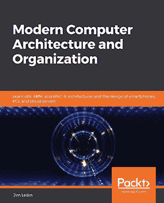
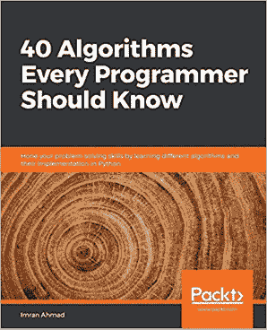

# 你可能还会喜欢的其他书籍

如果你喜欢这本书，你可能对 Packt 出版的以下其他书籍感兴趣：

**现代计算机架构与组织**

现代计算机架构与组织

ISBN: 978-1-83898-439-7

+   掌握晶体管技术和数字电路原理

+   发现计算机处理器的功能元素

+   理解流水线和超标量执行

+   使用浮点数数据格式

+   理解监督模式的目的和操作

+   在低成本 FPGA 上实现完整的 RISC-V 处理器

+   探索虚拟机实现中使用的技巧

+   编写量子计算程序并在量子计算机上运行它

](https://www.packtpub.com/programming/40-algorithms-every-programmer-should-know)

**程序员必知的 40 个算法**

Imran Ahmad

ISBN: 978-1-78980-121-7

+   探索 Python 库中现有的数据结构和算法

+   使用网络分析实现用于欺诈检测的图算法

+   使用机器学习算法对相似的推文进行聚类，并实时处理 Twitter 数据

+   使用监督学习算法预测天气

+   使用神经网络进行目标检测

+   创建一个推荐引擎，为订阅者推荐相关的电影

+   在 Google Cloud Platform (GCP)上使用对称和非对称加密实现万无一失的安全措施

# 留下评论 - 让其他读者了解你的想法

请通过在购买该书的网站上留下评论，与其他人分享你对这本书的看法。如果你从亚马逊购买了这本书，请在本书的亚马逊页面上给我们留下一个诚实的评论。这对其他潜在读者来说至关重要，他们可以通过你的无偏见意见做出购买决定，我们可以了解客户对我们产品的看法，我们的作者也可以看到他们对与 Packt 合作创作的标题的反馈。这只需要你几分钟的时间，但对其他潜在客户、我们的作者和 Packt 来说都很有价值。谢谢！
