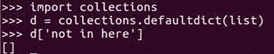

# Python 入门

在本章中，我们将介绍 Python 的基本语法、其内置数据结构、函数、类、其标准库以及 Python 最新版本的新特性。如果您需要快速掌握这门语言，这里就是我们要去的地方。我们将逐步进行，涵盖以下主题：

+   Python 基本语法和块结构

+   内置数据结构和推导式

+   首等函数和类

+   丰富的标准库

+   Python 的新特性

# Python 基本语法和块结构

本节主要提供对 Python 语言结构的初步理解。如果您觉得自己已经对 Python 有了一个坚实的掌握，请随时跳过。

让我们深入到细节。

一个 Python 程序以源代码的形式编写在一个或多个 `.py` 文件中，并包含如下截图所示的语句和表达式：


语句和表达式都告诉 Python 做某事。区别在于表达式可以组合成更复杂的表达式，而语句可以与表达式组合，但不能与其他语句组合。

例如，一个语句看起来是这样的：

```py
if 2 > 1: 

```

一个表达式看起来是这样的：

```py
print ("One is the loneliest number") 

```

Python 源代码文件在 Python 运行时加载后从上到下执行。这意味着对于简单的程序，我们只需在 `.py` 文件中编写一系列语句，然后告诉 Python 运行它们。在先前的例子中，`if` 和 `else` 部分是语句或两个部分的单一语句，如果你愿意这样想的话。其余的都是表达式。对于更复杂的程序，我们需要更结构化的方法。

与大多数编程语言一样，Python 允许我们创建函数和类来组织我们的代码。

如果您不知道函数或类是什么，可以将函数视为可以作为更大程序构建块的微型程序，而类则是函数和数据组合以创建新类型数据的组合。

# 基本构建块

为了组织我们的代码，我们可以将其分为四个基本构建块。我们将分别讨论这些构建块，以了解它们在 Python 代码中的作用和重要性。以下是这些构建块：

+   函数

+   变量

+   表达式

+   类

# 函数

我们将从简要了解函数开始。函数是通过使用 `def` 语句创建的，这是一个使用 `def` 关键字作为其标识组件的语句。正如我之前所说的，Python 从 `.py` 文件顶部开始执行语句，如下面的截图所示：


当 Python 执行一个 `def` 语句时，它创建一个函数作为结果。这意味着在 `def` 语句之前运行的代码看不到该函数，因为它还不存在。`def` 行中括号内的部分称为**参数列表**：

```py
example_function(name, radius): 

```

参数列表是作为输入传递给函数的数据值的内部名称列表。在函数外部，这些值可能具有不同的名称或根本没有名称，但在内部，它们将存储在这些变量中。

在`def`行之后立即缩进的代码块被称为**函数体**，你可以将其视为函数的源代码：

```py
def example_function(name, radius): 
    area = math.pi * radius ** 2 
    return "The area of {} is {}" .format(name, area) 

```

以下截图显示了前面示例的输出：


函数体内的代码是关于从文件顶部到底部运行 Python 代码的规则的例外。这段代码被存储起来，然后在告诉函数运行时执行。

与文件中的代码一样，函数中的代码从上到下逐行或逐个语句或表达式运行。

如果你更熟悉 C++或 Java，你可能想知道函数的*参数类型*和*返回类型*在哪里。在 Python 中，数据类型是每个数据值固有的，因此运行时始终知道我们正在处理哪种类型的数据，以及我们尝试执行的操作是否对该数据类型是有效的操作。因此，在大多数情况下，我们不需要显式的数据类型。

Python 程序员有时会谈论*鸭子类型*，这是对以下说法的引用：

如果它像鸭子一样叫，它可能就是一只鸭子。

他们所说的意思是，如果我们试图对一个数据值执行的操作是有效的，那么它是否正好是我们预期的数据类型并不重要。它可能足够接近。如果它们不起作用，Python 会告诉我们出了什么问题以及在哪里，这通常比仅通过比较数据类型所能确定的信息更有用。

对于我们想要或需要指定数据类型的情况，我们可以使用函数注解和标准库的`typing`模块。

我们将在后续章节中讨论的函数装饰器可以提供一种方便的方式来强制执行这些注解。

# 变量

Python 程序的第二大构建块被称为**变量**。变量基本上就是一个用于存储数据值的盒子。变量有一个名称，我们可以使用该名称来访问变量中存储的数据或用新值替换数据。

在前面的例子中，函数参数是变量，`area`也是如此：

```py
(name, radius):  

```

要设置存储在变量中的数据，我们使用*赋值*语句。赋值是一个语句，所以请记住这意味着它不能与其他任何语句组合。它获得一行源代码，以及它包含的表达式。

赋值语句由等号左侧的变量名和右侧我们想要存储在变量中的值组成，如下面的代码所示：

```py
outer = "Hello world"  

```

如果变量之前不存在，它将被创建。无论变量之前是否存在，值都将存储在变量中。

在函数内部创建的变量只在该函数内部可见，并且每次函数运行时都会创建一个新的。

以下代码提供了一个实际应用的例子：

```py
outer = "Hello world"  
def example_function(param): 
    inner = "Hello function: {}".format(param) 
    print(inner, outer) 
example_function("first") 
example_function("second") 
print(inner) 

```

前一个示例的最后一条语句表明，在函数内部创建的变量对于函数外部的代码是不存在的，如下面的代码输出所示：


这个代码示例还展示了当我们试图让 Python 做不可能的事情时会发生什么。它告诉我们我们做错了什么，并提供了有关问题发生位置和如何到达那里的信息。

# 表达式

Python 程序的主要组成部分的第三个是**表达式**。到目前为止，我们在每个例子中都看到了表达式，因为几乎不可能在 Python 中不使用表达式就做任何事情。

表达式由数据值和在这些数据值上执行的操作组成。非常简单的表达式是一个单一的数据值，没有任何操作，例如，一个单独的数字。更复杂的表达式至少包含一个操作，可能还有更多的数据值，例如，将两个数字相加或计算面积，如下面的代码示例所示：

```py
import math 

def example_function(name: str, radius: float) -> str: 
  area = math.pi * radius ** 2 
  return "The area of {} is {}" .format(name, area)  

print(example_function('Bob', 5)) 

```

所有的表达式都会产生某种类型的结果数据值；例如，将两个数字相加会产生另一个数字作为和，而将两个文本字符串连接起来会产生另一个文本字符串作为连接。使用`name`变量来查找存储的值是一个表达式，运行一个函数也是如此。

如果函数没有明确返回一个值，结果将是一个特殊值，称为**none**。

在我们需要值的地方，我们可以使用任何产生所需值的表达式。无论是简单的数字，如`55`，变量名，值的复杂组合和运算符，函数调用，还是任何其他表达式，这都不重要。至少，从最终结果的角度来看，这并不重要。某些表达式比其他表达式执行时间短，所以速度可能是一个因素。

# 类

在本节中，我们将讨论的最后一种基本构建块是**类**。类这个词是类别或类型的同义词；在这种情况下，它指的是数据值。

类通过描述该类型数据值的内部数据和操作来定义一种新的数据值。这主要是通过定义一组构成类的函数来完成的。一个特殊函数`__init__`用于设置新数据值的内部数据，其余的函数定义了该类型现有数据值的操作：

```py
class Frood: 
    def __init__(self, age): 
        self.age = age 
        print("Frood initialized") 

    def anniversary(self): 
        self.age += 1 
        print("Frood is now {} years old".format(self.age)) 

f1 = Frood(12) 
f2 = Frood(97) 
f1.anniversary() 
f2.anniversary() 
f1.anniversary() 
f2.anniversary() 

```

类的所有函数都接收一个名为 `self` 的参数，如前面类代码示例所示。这个参数是正在操作的数据值。这与 C++ 或 Java 不同，因为尽管那些语言基本上做同样的事情，但参数是隐式的，而不是函数参数列表的显式部分。

类函数，包括 `__init__`，在它们想要操作与之关联的数据值时，应该从 `self` 中存储和检索数据。

类支持 **继承** 和 **多重继承**，但在此书的这一部分我们不会详细讨论。

在前面的例子中，我们创建了一个新的数据类型 `Frood`，然后创建了两个该类型的数据值。然后，我们使用作为类一部分创建的 `anniversary` 函数来修改它们。

类的代码示例输出如下：


这两个实例保持它们内部变量不同的值，如前面输出所示。

# 流程控制语句

Python 有几个流程控制语句，这些语句对于熟悉 C 家族语言的用户来说很熟悉。例如，Python 有循环和 `if`、`elif` 和 `else` 分支（如下面的代码示例所示）：

```py
selector = 5 

if selector < 3: 
    print("less than three") 
elif selector < 6: 
    print("less than six") 
else: 
    print("six or more") 
while selector > 0" 
    print('selector is {}' .format(selector)) 
    selector -=1 

for x in ['a', 'b', 'c', 'd']: 
    print(x) 
for x in range(5): 
    print(x) 

```

Python 也有 `for` 循环语句，但它与 C、C++ 或 Java 中的 `for` 循环不同。`for` 循环不是通过计数数字，而是遍历值。如果我们实际上想用 `for` 循环计数数字，那很容易通过 `range` 迭代器来完成，如下面代码示例的输出截图所示：


在我们结束本节之前，还有最后一件事我应该评论一下，那就是 Python 对表示块结构的 **缩进** 的看法。

# 缩进

大多数其他编程语言都有明确的符号来表示块的开始和结束。然而，在所有这些语言中，缩进块是一种常见的做法，以便人类更容易阅读代码。实际上，不这样做通常被视为程序员是业余水平的标志。这意味着大多数语言中的块结构实际上以两种不同的方式表示：符号和缩进。通过将缩进纳入语法而不需要显式符号，Python 既可以消除这种重复，又确保代码可读。

有了这些，我们就结束了本节。在下一节中，我们将探讨一些 Python 的内置数据结构和数据处理语法。

# Python 的内置数据结构和推导式

现在，让我们来看看 Python 的核心数据结构类型。当然，这些并不是唯一可用的数据结构，因为使用类创建数据结构相对容易。然而，这些数据结构直接构建在 Python 的核心中，并且效率很高，因此熟悉它们是个好主意。

首先要理解的是，数据结构本身也是类似文件柜的数据值——它们是包含许多事物的一个东西。像任何其他数据值一样，它们可以被存储在变量中或用作表达式的一部分。

# 字典

我们将要探讨的第一个数据结构是 Python 的字典。字典由任意数量的键值对组成。键可以用来获取或设置值，或者从字典中完全删除这个键值对。

其他语言中的类似数据结构有时被称为映射或哈希表。

在 Python 中创建字典有几种方法。最简单的是使用字典表达式，它就是一对花括号，包围着我们想要在字典中包含的键值对。每个键值对由键和值之间的冒号标记，每个键值对由逗号分隔，如下面的代码示例所示：

```py
example_dict = {'a' :1, 'b' :2, 'c' :3} 

```

当这个表达式运行时，结果是包含键及其值的字典对象。我们也可以使用`dict`类来创建字典对象：

```py
another_dict = dict() 

```

如果我们不想使用特殊语法来访问字典中存储的某个值，我们可以使用查找表达式。这意味着我们在给出字典的表达式之后放置一对方括号，包含我们想要查找的键。通常情况下，这意味着包含字典的变量的名称，一个开方括号，一个给出键的子表达式，然后是一个闭方括号：

```py
example_dict['b'] 
2 

```

如果我们更喜欢不使用特殊语法，我们也可以使用`dict.get`函数：

```py
example_dict.get('c') 
3 

```

# 列表

我们接下来要探讨的数据类型是**列表**，它可以通过列表表达式来创建。列表表达式就是一对方括号，包围着我们想要存储在列表中的数据值，每个值之间用逗号分隔。并不要求每个值必须是同一类型。以下是一个列表的代码示例：


在前面的例子中，它们是字符串，但它们可以是数字，或者是一个列表，或者任何其他类型的数据混合在一起。我们可以使用查找表达式来检索数据值。

与字典不同，列表的键是整数。这是因为列表不是将键值与数据值关联，而是按顺序存储其数据值。列表中第一个项目的键是`0`。下一个项目的键是`1`，依此类推。我们也可以使用负整数作为键。我们仍然可以得到一个数据值，但它是从列表的末尾而不是从开头计算的，其中`-1`是列表中的最后一个项目。

我们可以使用`list.append`函数在列表末尾添加新项目，或使用其`insert`函数在任何位置添加新项目，如下面的代码所示：


列表会自动增长到足够大，以容纳我们放入其中的所有数据。

# 元组

我们将要查看的下一个数据结构是**元组**。元组表达式是任何由逗号分隔的值表达式序列，如果它出现在语言原本不期望看到逗号的位置。

然而，将括号放在大多数元组表达式周围是常见且明智的，因为它避免了歧义。元组的代码示例如下：


与列表一样，可以使用数字从元组中检索数据值。然而，我们无法向元组添加更多数据，也无法用另一个数据值替换一个数据值。

我们为什么要想要这样的数据结构呢？

好吧，有几个原因。我们可以如下列出：

+   首先，因为它们是常量，元组可以作为良好的字典键或集合成员，但我们会稍后再讨论这一点。

+   第二，它们在概念上扮演着与列表不同的角色。我们倾向于期望列表的每个成员都是相同类型的，例如名字列表或年龄列表。从某种意义上说，列表就像数据库的列。我们倾向于期望元组的每个元素包含不同类型的数据，但它们彼此之间是相关的，例如第一个元素是名字，第二个元素是年龄。继续我们的类比，元组就像数据库的行。

+   第三，元组在计算机处理时通常在时间和内存使用上稍微高效一些。因此，在优化情况下，当它们足以完成任务时，它们比列表更可取。

# 集合

我们将要查看的最后一个数据结构是**集合**。集合是一组没有键的数据值；就像列表，但没有特定的顺序，就像字典。我们可以使用集合表达式创建一个集合，它是一对花括号包围的逗号分隔的值，如下面的代码示例所示：


在集合中定位特定值很快，添加或删除值也是如此，如下面的示例所示：


每个值只能出现在集合中一次。集合支持一系列数学运算，如并集和交集，并且通常比一开始看起来更有用，尽管我们在这里的章节中无法真正证明这一点。

# 推导式

Python 有一种特殊的表达式，称为**推导式**。推导式是创建字典、列表和集合的特殊语法的变体。

让我们看看一些例子。这里我们看到一个列表推导式：

```py
capitals = [x.upper() for x in example_list] 

```

这个表达式的作用是创建一个新列表，包含旧列表中单词的大写版本。

开方括号后的第一部分是一个`x.upper()`表达式。这个表达式描述了如何从旧列表的成员推导出新列表的成员。之后是`for`关键字，然后是我们在第一个表达式中使用的`x`变量的名称。然后，关键字后面跟着`example_list`表达式，它给出了旧列表，最后是闭方括号。代码输出如下：


字典和集合推导式非常相似。如果我们想在推导式中使用现有字典的键和值，我们需要使用`dict.items`函数，并且字典推导式需要指定键和值，用冒号分隔，如本例所示：

```py
squares = {k: v ** 2 for k, v in example_dict.items()} 

```

如以下截图所示，请注意，结果数据类型取决于我们使用了哪种推导式，而不是我们使用了哪种数据结构作为数据源：


我们可以使用列表推导式从字典的值创建数据列表，例如，或者，就像我们在这里做的那样，我们可以使用集合推导式创建集合。

元组略有不同，但只是略有不同。元组推导式看起来就像一个名为**生成器表达式**的不同语法元素。元组推导式的代码示例如下：


Python 的设计者讨厌歧义；因此，如果我们想要元组推导式的等效物，我们就将生成器表达式传递给元组构造函数。

这就是本快速介绍 Python 内置数据结构的全部内容。在下一节中，我们将探讨函数和类的一些有用但可能令人惊讶的特性，这些特性与 C、C++或 Java 有显著不同。

# 一等函数和类

在 Python 中，函数和类是一等对象。短语**一等对象**是一种说法，意味着数据值可以被程序访问、修改、存储和在其他方面被操作。在 Python 中，函数就像文本字符串一样，是一个数据值。类也是如此。

当一个函数定义语句被执行时，它会将生成的函数存储在一个变量中，该变量的名称是在 `def` 语句中指定的，如下面的截图所示：


这个变量并不特殊；它就像任何其他持有值的变量一样。这意味着我们可以在表达式中使用它，将值赋给其他值，或者甚至用不同的值替换原始函数。

函数值本身包含相当多的属性变量，我们可以访问它们。更有用的情况是，大多数时候，我们可以向 `function` 对象添加属性，这样我们就可以将有关函数的定制信息作为函数的一部分存储，并在以后访问这些信息，如下面的代码示例所示：


首类函数使一个常见任务变得简单，那就是为事件分配处理程序。要在 Python 中将 **handler** 函数绑定到事件，我们只需在调用 **binding** 函数时将 `function` 对象作为参数传递，如下所示：


这比 C++ 或 Java 强加给我们的类似操作要灵活得多。作为函数定义语句，类定义语句创建一个类对象并将其存储在一个变量中。这可能会让人一开始感到困惑。类描述了对象的类型，它们怎么能是对象本身呢？

想象一下——一栋房子的蓝图描述了建筑类型，但蓝图本身仍然是一个东西，对吧？类对象也是这样。这意味着，就像函数对象一样，类对象可以被存储在变量中，并且可以像数据值一样被处理。最有趣的是，它们可以用作函数调用的参数。

# `defaultdict` 类

作为为什么这有趣的例子，考虑一下——Python 的标准库包含一个名为 `defaultdict` 的数据结构类，它就像字典一样，但是当我们尝试查找字典中尚未存在的键时，它会创建一个新的值并将其添加到字典中，然后再将其返回给尝试查找的代码，如下所示：



`defaultdict` 类是如何知道如何创建默认值的？

`defaultdict` 类之所以知道如何操作，是因为我们在创建 `defaultdict` 类时给它传递了 `class` 作为参数。因此，如果我们想要一个列表的字典，我们可以给 `defaultdict` 类传递列表类，作为其 *如何设置默认值* 参数。顺便提一下，`defaultdict` 也可以与函数一起工作，作为其 *如何设置默认值* 参数。

`defaultdict`类实际上并不关心这个参数是什么，只要我们传递的对象能够在`defaultdict`类需要新默认值时创建一个新对象。这是我们在上一节中提到的鸭子类型的一个例子。参数是函数、类还是其他任何东西，只要它表现正常即可。如果它表现不正常，我们会被告知出了什么问题以及在哪里。

# 属性

我们之前讨论过，我们可以向函数对象添加属性，这通常很有用。我们也可以用类似的方法处理类，但有一个很大的区别——我们添加到函数中的属性只能被访问该函数对象的代码看到，通常不包括函数本身的代码，但我们添加到类对象中的属性则可以被任何访问类对象或由该类描述的对象类型的代码看到。

这意味着如果我们向类添加一个属性，该类中定义的函数将能够通过`self`参数访问该属性，如下面的代码示例所示：


在向类添加属性时，我们需要小心，因为我们可能会不小心覆盖类的一个属性，从而破坏类。

我们对类的操作能力比函数要强。因此，我们需要更谨慎地使用这种能力。此外，请注意，在这个例子中，我们添加到类中的一个属性是一个函数，该函数随后开始像它从一开始就被定义为类的一部分那样工作。

接下来，让我们简要地浏览一下 Python 标准库的一些亮点。

# 标准库

预先安装在 Python 中的代码库非常广泛，所以我们不会深入细节。这里的目的是让我们了解我们可用的优质工具的广度，这样如果将来需要它们，我们就知道去哪里找。因此，我们将简要地触及许多有用的东西。您可以在[`docs.python.org/3/library/index.html`](https://docs.python.org/3/library/index.html)找到标准库的官方文档。

# 不同类型的包

索引页面包含了一个列表，列出了 Python 标准库中可用的不同包。让我们简要地按顺序浏览它们。

首先，有`Collections`包，它包含更多的数据结构：[`docs.python.org/3/library/collections.html`](https://docs.python.org/3/library/collections.html)。

`Collections` 包包含我们在上一节中提到的 `defaultdict` 类。`Collections` 包还包含一个 `OrderedDict` 参数，它记录了项目插入的顺序，并在迭代时以相同的顺序返回它们。`deque` 类是元组的变体，使用名称来访问元素，还有一个 `PseudoDict` 参数，它提供了对几个其他字典的复合视图。

其中还有一些其他的数据结构。从集合包中缺失的一个常见数据结构是 `PriorityQueue` 参数，但这仅仅是因为它有一个自己的包叫做 `heapq`：

[`docs.python.org/3/library/heapq.html`](https://docs.python.org/3/library/heapq.html)

Python 的 `PriorityQueue` 操作是通过与内置列表一起工作的函数实现的，这些函数根据 **堆** 属性添加和删除项目。

存储和检索数据是程序的一个极其常见的需求，`pickle` 包使得这变得很容易：

[`docs.python.org/3/library/pickle.html`](https://docs.python.org/3/library/pickle.html)

在 `pickle` 包中包含了一些类和函数，它们可以方便地将任意 Python 数据转换为可以存储在文件中、通过网络发送或满足其他需求的字节序列。`pickle` 包还提供了工具来逆转这个过程，将那些字节转换回完整的 Python 数据对象。

此外，在存储数据方面，`sqlite3` 包提供了对 SQLite 数据库管理器的完全访问，使我们能够利用完整的交易性关系数据库：

[`docs.python.org/3/library/sqlite.html`](https://docs.python.org/3/library/sqlite.html)

访问其他数据库系统的第三方包遵循几乎相同的接口，因此如果需要，很容易切换到不同的数据库。

`json` 包也与数据处理相关。它解析或生成事实上的标准 **互联网数据交换**（**IDX**）格式：

[`docs.python.org/3/library/json.html`](https://docs.python.org/3/library/json.html)

`json` 包非常智能，因此它以合理的方式处理 **JSON**（**JavaScript 对象表示法**）对象、数组、字符串、数字、null 值等。

将它们映射到适当的 Python 数据类型，`base64` 包将字节编码为 base64，或将 base64 解码为字节：

[`docs.python.org/3/library/base64.html`](https://docs.python.org/3/library/base64.html)

还有几个类似的包用于 `binhex`、`uu` 编码等。

`html` 和 `xml` 包提供了处理主要互联网标记语言的各种实用工具，包括解析器和文档对象模型：

[`docs.python.org/3/library/html.html`](https://docs.python.org/3/library/html.html)

`urllib` 包为我们提供了方便的方式来从 URL 获取数据或向其发送数据：

[`docs.python.org/3/library/urllib.html`](https://docs.python.org/3/library/urllib.html)

特别是，`urllib.request.url` 打开函数非常实用。

`itertools` 和 `functools` 包提供了一系列与函数式编程范式相关的实用工具：

[`docs.python.org/3/library/itertools.html`](https://docs.python.org/3/library/itertools.html)

特别是，`functools` 包允许我们创建部分应用函数，而 `itertools` 包则允许我们连接迭代器。

`enum` 包包含创建和使用命名枚举的支持：

[`docs.python.org/3/library/enum.html`](https://docs.python.org/3/library/enum.html)

每个枚举都是一个独立的数据类型，就像一个类。

`pathlib` 包包含提供跨平台文件和文件路径操作抽象的类和函数：

[`docs.python.org/3/library/pathlib.html`](https://docs.python.org/3/library/pathlib.html)

`inspect` 包非常有趣且非常有用。它为我们提供了可以用来收集关于数据对象信息的函数，尤其是关于函数和类的信息。如果我们想了解函数、参数的名称，或者想访问对象的文档，或者做任何类似的事情，`inspect` 包将帮助我们实现这些功能：

[`docs.python.org/3/library/inspect.html`](https://docs.python.org/3/library/pathlib.html)

我们刚才提到的包绝不是标准库中所有可用内容的完整列表，但希望它们能让我们对通过安装 Python 所获得的深度和广度有一个大致的了解。强烈建议想要充分利用 Python 的人查看[`www.python.org/`](https://www.python.org/)上的库文档。有一些特别有用的包我们没有提到，那是因为在本书的后面部分有专门的部分介绍它们。

因此，这就带我们结束了对标准库的概述。

# 现代 Python 的新特性

在本节中，我们将探讨 Python 最新版本中的一些变化，特别是我们将关注以下内容：

+   语法上的变化

+   包的变化

+   其他变化

让我们开始吧！

# 语法上的变化

自从 3.5 版本以来，Python 有了三组新的语法版本。这些组中的第一组是引入了用于描述**协程**的关键字。Python 已经支持协程，但关键字使得事情更加清晰，有时也更加简单。我们将在后面的章节中深入讨论协程，所以现在不会进一步讨论这个问题。

新语法中的第二部分是引入`@`符号作为中缀二元运算符。这意味着现在在两个子表达式之间放置一个`@`符号是一个有效的 Python 表达式，就像在子表达式之间放置一个`+`符号一样，如下截图所示：


然而，由于尚无内置数据类型支持`@`符号运算符，我们在这本书中不太可能找到很多用途。`@`符号的预期语义是它应该代表矩阵乘法，并且它被添加以提高实现矩阵和矩阵运算的第三方包之间的互操作性。

新语法的第三部分是对 Python 现有语法进行扩展，以便在调用函数时提供参数值。

以前，可以在值列表之前放置一个星号（`*`）来表示这些值应按列表中出现的顺序分配给参数。以下是一个单个星号的代码示例：


类似地，在两个值之前使用`*`表示字典中具有文本字符串键的值应按名称分配给函数的参数，如下所示：


新语法只是我们现在可以使用多个列表或字典以这种方式使用，并且我们可以使用相同的星号和双星号语法来构建元组、列表、字典和集合。

我们之前提到，虽然 Python 将数据类型附加到数据值而不是变量上，但可以使用函数注解来描述函数参数返回值的预期类型。

# 包中的更改

Python 现在在标准库中包含了一个名为`typing`的包，其中包含支持使用类型提示的类和函数。

Python 还在标准库中包含了一个名为`zipapp`的包。

要进行`打字`，请访问以下网站：

[`docs.python.org/3/library/typing.html`](https://docs.python.org/3/library/typing.html) 要了解`zipapp`，请访问此网站：

[`docs.python.org/3/library/zipapp.html`](https://docs.python.org/3/library/zipapp.html)

`zipapp`包使得构建`.pyz`文件变得简单。`.pyz`文件是一个包含 Python 代码和任意只读数据的存档文件，Python 运行时能够将其作为一个自包含程序执行。一旦程序调试完成并准备分发，将其打包成`.pyz`文件是将程序提供给用户的一种简单而智能的方式。

# Python 包中的其他更改

自 Python 3.5 版本以来，Python 进行了一些底层改进，例如更快地读取`filesystem`目录、自动重试中断的操作系统调用以及一个`math.isclose`函数，用于检查两个数字是否近似相等。

除了对标准库进行的一些更多细微的改进，这些改进与早期的 Python 3 版本完全兼容。

在极少数情况下，如果添加的内容破坏了向后兼容性，则默认情况下不会启用。对于此类更改，如果我们想使用它，我们必须明确标记我们的代码以支持该更改。这些更改将在两个版本之后成为标准，因此 Python 3.5 中的破坏性更改将不会在 Python 3.7 中成为默认设置，Python 3.5 和 3.6 在遇到依赖于更改功能的代码时会发出警告。

在 Python 3.5 中，只有一个这样的更改——迭代协议的一个小而聪明的修改。它不应该对正常工作的代码有任何影响，但从技术上讲，它是一个接口的更改，因此它得到了完整的等待两个版本的处理。

如果您想了解更多关于我提到的这些更改的详细信息，或者如果您想了解 Python 各个版本之间的变化，[`docs.python.org/3/`](https://docs.python.org/3/) 上的文档总是包含一份“新特性”文档，该文档详细介绍了新特性并提供链接到完整文档。

关于 Python 3.6 的“新特性”文档的详细信息，请访问以下链接：

[`docs.python.org/3/whatsnew/3.6.html`](https://docs.python.org/3/whatsnew/3.6.html)

我总是期待阅读 Python 每个版本的“新特性”文档，以了解我刚刚获得的新玩具。

因此，我们现在已经从高层次上了解了 Python 标准库，介绍了其中一些更有用的项目。这标志着我们 Python 入门课程的结束。

# 摘要

在本章中，我们探讨了 Python 编程语言的一些基础知识。我们看到了如何创建和访问这些数据结构，以及如何使用推导式根据现有数据结构创建和转换数据结构。

我们简要地探讨了 Python 具有第一类函数和类意味着什么，以及这如何影响我们作为程序员的可能选择。

我们简要地讨论了 Python 标准库的一些亮点。我们还快速介绍了 Python 编程语言的语法、基本假设和基本工具。

在下一章中，我们将了解如何设置 Python 编程环境，以便我们在课程剩余部分进行工作，并学习如何集成第三方代码。
