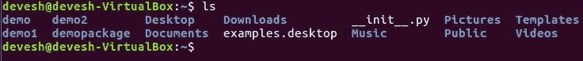
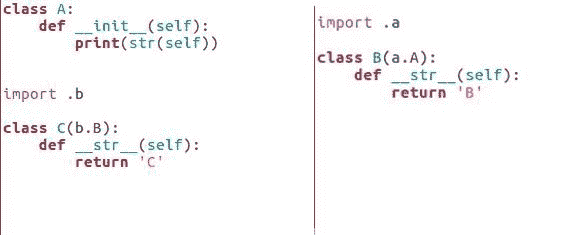

# 第三章：创建包

在上一章中，我们看到了如何安装 Python 和我们可以与 Python 一起使用的第三方代码包。在本章中，我们将看到包在计算机文件系统中的表示。我们将探讨如何在包内部添加代码模块，如何使这些代码模块在包内部相互交互，以及如何访问包含在我们包中的非代码文件中的数据。

到本章结束时，你将很好地了解如何创建自己的 Python 代码包。包将成为程序的基础，并帮助你使代码模块化。

在本章中，我们将涵盖以下主题：

+   创建一个空包

+   向包中添加模块

+   从其他模块访问代码

+   向包中添加静态数据文件

# 创建一个空包

本章的第一部分将处理创建一个简单的空包，目前它不会做任何事情，但当我们完成时，我们将能够将空包导入 Python shell。

简单的 Python 项目可能只包含一个代码模块，但通常是将多个模块组合成一个包。一个包可以包含我们需要的任何数量的模块。包从文件系统上的文件夹开始，这意味着我们可以像创建任何其他文件夹一样创建它们。

如果你更喜欢使用操作系统的文件浏览器来创建文件夹，那也行，但我通常使用命令行。例如，让我们运行一个演示包：

```py
$ mkdir demopackage 

```

这在以下屏幕截图中有显示：


# 将普通文件夹变成包

有两个东西将普通文件夹变成包。以下是对它们的解释：

第一点是*它在哪*，即文件夹的位置。Python 只在特定位置查找包，如果你的文件夹不在正确的位置，Python 将不会注意到它。

`sys.path`变量包含 Python 将查找包的所有位置列表。`sys.path`变量相当稀疏，但用户配置可以使它变得更为广泛，如下面的屏幕截图所示：


注意列表中的第一个条目是一个空字符串。这代表当前工作目录。

对于使用命令行的人来说，当前工作目录只是我们当前所在的文件夹。

我们可以使用`cd`命令来更改当前工作目录：

```py
cd demopackage
cd ..  

```

上一段代码中的`cd..`命令表示返回到上一个目录或父目录。因此，在这种情况下，我进入了`demopackage`并退了出来。

当前工作目录在路径中对于开发来说很方便；这意味着我们可以将当前工作目录设置为我们进行开发的地方，这样我们的所有包都可用，至少在我们也使用命令行启动 Python 时是这样。

将普通文件夹转换为包的第二个原因是存在 `__init__.py` 文件，尽管从 Python 3.3 及更高版本开始，这并非严格必要。一个 `init` 文件将文件夹标记为包，这使得它加载更高效，同时也为我们提供了一个放置与包整体接口相关的信息和代码的地方。

虽然 `__init__.py` 文件通常是空的，仅作为标记，但有一个语言特性，除非我们在文件中添加一些代码，否则将不会得到支持。

这个特性是能够使用 `import*` 语法导入包的所有模块，如下所示：


# 导入所有包模块

如果我们想让 Python 能够使用 `import*` 语法导入所有包的模块，我们必须告诉它所有这些模块的名称。

要这样做，我们需要将模块名称添加到名为 `__all__` 的列表中，如以下代码所示：


如果你系统上没有安装 *emacs*，你可以使用以下命令进行安装：

`**sudo apt install emacs24**` 在前面的屏幕截图中，我使用了 Ubuntu，因此编辑器的背景是白色的，然而在 Windows OS 和 macOS 的情况下，编辑器的背景可能不同。

你可能想知道为什么我们需要手动执行此操作，而不是让 Python 直接扫描文件系统以查找模块文件。

好吧，有几个原因：

+   首先，Python 尽量不假设文件名是否区分大小写。在某些操作系统上，文件名是区分大小写的，而在其他操作系统上则不是。模块名是变量，因此它们最好在源代码中起源，而不是依赖于可能根据代码运行的位置而改变的外部因素。

+   手动执行此操作的第二原因是导入模块会使代码执行。

想象我们有一个播放音轨的包。除了通用代码之外，我们还有许多处理各种系统音频输出的模块。

允许用户使用 `import*` 将他们的包编程接口导入到模块中是相当合理的；然而，我们不想加载所有输出模块，只想加载适合我们正在运行的系统的那个模块。尝试加载其他任何模块很可能会在用户的代码中触发异常。现在 `__all__` 的工作方式，我们可以排除输出模块从 `import*` 中，从而实现两全其美。

好的，在我们继续下一部分之前，即如何将源代码模块添加到包中之前，让我们确保 Python 愿意导入我们的演示包。

# 添加模块到包

现在，让我们看看如何将实际代码添加到包中，并注意一些需要避免的陷阱。

Python 模块的名称与它们作为文件名所对应的对象名称相同，只是没有`.py`后缀。这意味着文件名需要是有效的 Python 变量名，并且它们应该使用在不同操作系统上可靠可用的字母和符号。以下截图展示了这一示例：



因此，模块名称不应以数字开头，因为 Python 变量不允许以数字开头。也不应使用大写字母，因为一些常见的操作系统不区分包含大写字母的文件名和全部小写的文件名。只要我们遵守 Python 变量命名指南并记得使用`.py`后缀，我们就可以随意命名我们的模块。

因此，我们只需选择一个文件名，然后在`package`文件夹中以该名称创建一个文件，并将 Python 代码写入其中。这种简单场景也是常见情况，但还有一种可能性。

# 使用命名空间包进行模块加载

如前所述，从 Python 3.3 开始，可以有一个不包含`init`文件的`package`文件夹。省略`init`文件意味着我们无法支持`import*`或其他我们将在后续发现其中的技巧。但不仅如此。以下截图展示了这一示例的代码：


当缺少`init`文件时，文件夹成为`namespace package`文件夹的一部分。当 Python 导入时，它会将找到的所有具有相同名称的`namespace package`文件夹组合成一个逻辑包，如下面的截图所示：


这种行为意味着在选择模块文件名时，Python 仍然遵循相同的规则，我们可能将文件放置在任何数量的`namespace package`文件夹中，而不是单一的实体`package`文件夹中。

我们能从中得到什么？通常什么也没有！

如我之前提到的，带有`init`的包加载速度更快，在许多情况下，命名空间包的额外抽象并没有给我们带来任何好处。

然而，在某些情况下，我们希望同一包的不同部分被分别分发或管理，在这种情况下，`namespace packages`可以满足这一需求。例如，再次想象我们正在为一个播放音轨的包工作。如果我们为音频编解码器创建一个`namespace package`文件夹，每个编解码器都可以使用`pip`或操作系统的常规包管理工具单独安装和删除。

在一个稍微不同的话题上，现在让我们谈谈包的结构和它应该为外部代码使用提供的接口之间的区别。

# 包结构及接口

为了方便和保持我们作为包开发者的理智，通常最好是将包中的代码拆分成许多不同的模块，所有这些模块都包含一组概念上相关的代码；这就是包的结构。一般来说，每当我们认为可能需要将代码拆分成更多模块时，我们可能应该跟随这种冲动。

另一方面，当外部代码调用我们的包时，最好能够仅通过一个或两个导入语句来利用我们的代码，这些语句引入了少量函数或类。这是包的接口，一般来说，它应该尽可能简单，同时保留完整的功能，如下面的代码示例所示：

```py
from example.foo import Foo
from example.bar import BarFactory
from example.baz import Baz

MAIN_BAZ = BAZ()

__all__ = ['Foo', 'BarFactory', 'MAIN_BAZ']

```

幸运的是，我们可以同时拥有我们的蛋糕并享用它！

我们可以按照自己的意愿将代码拆分，然后将最有用的元素导入到我们的`init`文件中，这样它们就成为包的路由命名空间的一部分。如果`init`文件中只有`import`语句，我们不需要`__all__`变量。

`import*`语句将抓取`init`文件的内容，除了以下划线开头的变量。然而，如果我们定义或导入在`init`文件中不应成为公共接口的一部分的内容，我们可以使用`__all__`变量来缩小范围并控制我们导出的内容。

只需记住，如果我们有一个所有列表，它需要列出包接口的所有部分，无论是模块、类、函数还是变量。

包中其余的模块仍然可以显式导入。我们只是使访问那些最有可能在我们自己的包外部有用的部分变得方便。

现在我们已经很好地了解了如何命名我们的模块，将它们放在哪里以便它们成为我们包的一部分，以及如何为我们的包提供一个方便的接口。接下来，我们将继续探讨如何使包中的模块相互交互。

# 从其他模块访问代码

我们将从理解绝对导入和相对导入之间的区别开始本节，然后继续编写这些导入，最后我们将查看循环依赖。

当我们从包外部导入包的一个模块时，只有一种合理的方式可以工作——我们告诉 Python 我们想要的包和模块，如果它找到了并导入了它，或者如果找不到则抛出异常。简单！

```py
import packagename.modulename  

```

当我们已经在包内部时，情况更为模糊，因为`import name`可能意味着“在这个包内寻找`name`”或“在 Python 搜索路径中寻找`name`。”Python 通过定义`import name`意味着应该搜索 Python 搜索路径中的名为**name**的包或模块来消除这种歧义：

```py
import name  

```

此外，它还为我们提供了一种指定相对`import`的方法，如果我们更愿意让它只查找当前包。我们可以通过在要导入的模块名称前放置一个点来指定相对`import`，如下面的代码所示：

```py
import .name  

```

当 Python 看到这一点时，它将在我们的代码正在运行的模块所在的同一包中寻找名为`name`的模块。

通常，我们只需要从另一个模块中导入一个或两个对象，直接将这些对象导入我们的全局作用域比导入整个模块并访问其内容更方便。Python 允许我们通过在`import`语法上稍作变化来实现这一点：

```py
from .name import Foo  

```

最后，有时在我们导入对象时，我们可能想要将其重命名。我们可以通过使用`as`关键字修改我们的导入语句来实现这一点：

```py
from .name import Foo as Bar 

```

在前面的例子中，即使对象在`name`模块中被称为`Foo`，在我们的当前模块中，它被称为`Bar`。顺便说一下，这个技巧对绝对导入也适用。

在我们继续之前，让我们注意一下 Python 2 在决定在哪里查找导入代码时使用了一个不同的规则。在 Python 2 中，它首先尝试在当前包中找到导入的目标。然后，如果没有找到匹配的模块，它就会在搜索路径上查找。这种方法通常做对了，但偶尔由于含义不明确而引起问题；这也意味着我们无法拥有一些包、子包或模块，它们的名称与标准库或其他已安装包中的任何内容相同。因此，在 Python 3 中改变了这种行为。

# 导入循环依赖

当我们导入一个与同一包共享的模块时，可能会遇到一些问题。有时，我们正在导入的模块也希望导入我们。这种情况被称为**循环依赖**。当我们尝试导入循环依赖时，我们几乎总是会得到一个属性错误异常，如下面的例子所示：


这是因为当我们请求 Python 导入第一个模块时，Python 立即为它创建一个模块对象，并开始执行模块中的代码。

这没有问题，但是，当 Python 到达这个循环中下一个模块的`import`语句时，它会暂停第一个模块中的代码执行，使其未完全初始化。尽管这通常不是问题，因为 Python 会在稍后回来完成初始化。

然而，当第二个模块请求导入第一个模块时，Python 只是将已经分配但尚未完全初始化的模块对象传递给它。当第二个模块尝试访问第一个对象中存储的变量时，其中许多变量尚未创建。因此，会引发一个属性错误。

# 解决由于循环依赖引起的属性错误

解决属性错误有两种常见的方法。第一种通常被认为是最好的。这种方法是通过将某个模块中的部分代码移入一个第三模块，这样其他模块就可以导入它而不会造成循环。在下面的示例中，如果我们把`A`类移入它自己的模块，就不会有循环，一切都会顺利：


解决这个问题的另一种方法是移动造成循环的`import`语句，就像以下截图所示：



如果我们将`import`语句向下移动，就像前面示例中那样，直到它位于其他模块需要的所有变量定义之下，当其他模块导入时，模块将初始化足够，Python 会在稍后回来完成初始化。

# 将静态数据文件添加到包中

如果我们要将静态数据文件添加到包中，我们应该把它们放在哪里？

我们可以在`package`文件夹内的任何方便的地方放置它们，但通常创建一个专门用于存放数据文件的子文件夹是个好主意。这可以将数据文件与源代码分开，并且通常使它们更容易处理。

包的一部分数据文件应假定是只读的。

有许多原因可能导致文件在运行时不可写。因此，如果我们想在代码运行时写入数据，我们需要选择其他地方来存储它。只有不改变文件才适合包含在包中：

```py
ls example/
__init__.py data
ls example/data
datafile.txt
cat example/data/datafile.txt
Hello world of data

```

所以，这么说来，我们想要在我们的包中包含一个数据文件，只需要将其放入我们的包中，然后使用标准库中`util`包的`get_data`函数来访问数据：

```py
from pkgutil import get_data
get_data('example', 'data/datafile.txt')
b'Hello world of data\n'

```

`get_data`函数接受两个参数：

+   我们想要从该包获取数据的包名

+   包内数据文件的相对路径

使用正斜杠分隔路径组件，我们传递这两条信息，它就会返回一个包含文件内容的字节对象给我们。

如果我们想要一个文本字符串而不是字节，这很容易做到。我们只需要将适当的字符串解码器应用到字节对象上，我们就会得到一个 Unicode 文本字符串。即使我们的包已经被压缩成 ZIP 文件或其他方式隐藏起来，这种技术仍然有效，因为它使用了 Python 加载模块源代码相同的底层机制。

如果 Python 能够找到代码，它同样可以找到数据文件。这就是与打包在代码旁边的静态数据一起工作的全部内容。简单且实用。

# 摘要

在本章中，我们学习了如何在文件系统中创建一个 Python 包作为目录，以及如何通过一个`__init__.py`文件来标记它，以便导入高效并且我们可以添加包元数据。我们探讨了如何向包中添加代码模块。我们看到了同一包内的代码模块是如何交互的。

我们学习了如何组合一个 Python 代码包，它可以被用于程序中或分发给其他程序员使用。很快，我们将看到如何将一个包转换成一个完整的程序。在下一章中，我们将稍微退后一步，讨论一些与 Python 代码一起工作的最佳实践。
