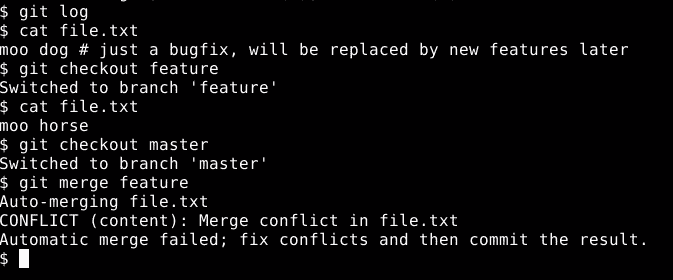

# 基本最佳实践

在上一章中，我们看到了如何组合 Python 代码和数据包。在本章中，我们将探讨一些可以使我们作为 Python 程序员的生活更加简单的事情。我们将转换方向，探讨版本控制，这将帮助我们与其他程序员协作，并在整个项目生命周期中作为撤销缓冲。我们将查看 Python 内置的虚拟环境工具 venv，它允许我们将我们的程序和依赖项彼此分离，以及与系统上安装的软件分离。

您将学习如何为最大效用结构化我们的文档字符串，如何向它们添加富文本格式，以及如何将它们导出为超链接 HTML 文档，以便在网页浏览器中查看。您还将看到通过实际执行我们在文档中包含的示例并确保它们与代码的实际行为一致，我们可以从文档字符串中获得的一个额外的好处。

在本章中，我们将涵盖以下主题：

+   PEP 8 和编写可读的代码

+   使用版本控制

+   使用 venv 创建一个稳定且隔离的工作区域

+   充分利用文档字符串

# PEP 8 和编写可读的代码

在本节中，我们将快速浏览如何格式化我们的代码，以便在稍后日期返回时或当其他人需要处理它时易于阅读。我们将特别关注缩进规则、Python 代码风格指南，以及最终的命名约定。

**Python 增强提案**或**PEPs**是建立 Python 社区标准的文档。大多数 PEP 描述了 Python 或 Python 标准库的新功能，但其中一些较为模糊。PEP 8 就是其中之一；它告诉我们 Python 社区认为什么样的代码是写得好的、可读的代码。

# PEP 8 — Python 代码指南

PEP 8 引入的第一条规则是，PEP 8 中的规则/指南仅在它们使我们的代码更容易阅读时才适用。这意味着我们应该应用 PEP 8 来提高代码的可读性，并使其更简单。例如，如果我们正在处理一个已经使用不同编码风格（即已经易于阅读）的项目，我们应该为新代码使用该项目的风格。如果 PEP 8 规则在某种程度上使代码更难以阅读或在编写代码时使其复杂，我们应该忽略这些规则。正如 Python 的创造者 Guido Van Rossum 所指出的：

*代码* *被阅读的次数比被编写的次数多*。

代码应该始终以促进可读性的方式编写。

如需了解更多关于 PEP 8 规则和指南的信息，您可以参考以下链接：

[`www.python.org/dev/peps/pep-0008/`](https://www.python.org/dev/peps/pep-0008/)

要知道何时忽略特定的指南，您可以参考以下链接中的“A Foolish Consistency is the Hobgoblin of Little Minds”文章：

[`www.python.org/dev/peps/pep-0008/#a-foolish-consistency-is-the-hobgoblin-of-little-minds`](https://www.python.org/dev/peps/pep-0008/#a-foolish-consistency-is-the-hobgoblin-of-little-minds).

# 代码缩进

作为程序员，当我们阅读代码时，我们会查看缩进来告诉我们代码块是如何嵌套的。然而，大多数其他编程语言使用实际的符号来告诉语言解析器一个块从哪里开始和结束。在编码中，在两个不同地方提供相同的信息是任何编程语言的基本最佳实践的一种违反。因此，Python 省略了开始和结束块标记，并使用缩进（如下面的代码截图所示）来通知解析器和程序员：


尽管如此，还是有一个问题出现！

在文本文件中编码缩进有不同的方式。具体如下：

+   使用空格字符

+   制表符字符

+   结合使用两种方式

我们在前面代码图像中看到的代码混合了空格和制表符，这在 Python 2 中是有效的，但这是一个糟糕的想法，而在 Python 3 中，这是一个语法错误。我已经配置了编辑器以彩色突出显示制表符字符，这样我们就可以轻松地看到哪些缩进来自空格，哪些来自制表符，以了解为什么即使允许混合空格和制表符，它也不是一个好的做法。

我们所需要做的只是更改制表符宽度，它将看起来像下面的代码图像：


尽管在前一个代码图像中缩进看起来很好，但现在显然是错误的。如果所有的缩进都来自制表符字符，那么就不会有歧义。所以，即使在 Python 3 中，只使用制表符也是有效的。然而，PEP 8 和 Python 社区的建议是我们始终使用恰好四个空格来表示一个缩进级别。任何半数以上的编辑器都可以在我们按下 Tab 键时为我们插入这些空格。还有更多的建议，我们将在下一小节中快速浏览。

# 格式化建议

下面的代码截图展示了几乎所有的 PEP 8 格式化建议：


我现在将逐一介绍这些建议：

+   PEP 8 建议单行代码不应超过 79 个字符的宽度

虽然这与在标准文本模式界面显示代码是一致的，但在现代宽屏和可调整大小的窗口的世界中，这个规则的主要原因是它有助于阅读。即使在与编程无关的上下文中，布局设计师也更喜欢限制行宽。

+   导入语句应放在文件顶部，首先是标准库导入，然后是第三方导入，最后是同一项目中的其他模块导入

+   每组导入之间应该有一个空行

+   顶级类和函数之间应该有两行空白来分隔。

+   类中的方法应该用一行空白来分隔它们。

+   在函数或方法内部，空白行应该用来表示代码概念分组之间的分隔。

+   不要在括号、方括号或花括号前后插入额外的空格；也不要在逗号或冒号前插入空格。

+   总是在二元运算符（如`+`或`/`）的两侧放置单个空格。

+   不要在同一行上放置多个语句，尽管偶尔可能这样做，但这从来不是一个好主意。

+   注释应该用人类语言编写，使用该语言的正确语法。

如果你要将源代码发布到野外，那么最好使用英语，因为这种语言是大多数 Python 程序员的通用语言。

+   注释也应该在描述的代码部分之前，并且应该缩进到相同的级别。

+   每个公开的模块、类、函数或方法都应该有一个格式正确的文档字符串。

我们将在本章的“充分利用文档字符串”部分中查看格式正确的文档字符串意味着什么。

让我们继续选择变量、函数、方法、类、模块、包等的名称。

# 命名约定

Python 命名约定的主导规则是，对象的命名风格应该清楚地表明对象的使用方式，而不是对象本身是什么。这意味着，例如，一个顶级函数，它被调用以创建新对象，因此表现得像类，应该像类一样命名。

+   **包和模块**：这些应该有合理短的名字，完全由小写字母组成，在模块的情况下，可以使用下划线。

+   **类**：这些应该使用首字母大写和每个新单词开头的首字母大写来命名。这有时也被称为驼峰式命名。例外情况是类，因此它们应该遵循类命名约定，但它们也应该以单词`Error`结尾。

+   **函数**、**方法**、**实例变量**和**全局变量**：这些都应该使用小写字母，单词之间用下划线分隔。如果它们打算作为内部组件而不是公共接口的一部分，那么它们的名称应该以单个下划线开头。

    +   实例方法的第一个参数应该始终命名为`self`。命名的**常量**值应该全部大写，单词之间用下划线分隔。

这就是 PEP 8 和大多数 Python 程序员期望其他人遵循的格式规则。现在，让我们通过讨论版本控制来谈谈细节。

# 使用版本控制

版本控制是现代程序员的基本工具之一。它以某种方式帮助我们处理项目的几乎所有方面。有众多版本控制系统，每个系统本身就是一个主题，因此我们将缩小我们的关注点，讨论如何使用名为 Git 的特定版本控制系统执行一些特别有用的事情。

# 初始化 Git

在安装 Git 之后，我们需要做的第一件事是设置一个文件夹作为我们的`Git 仓库`。这只需要在命令行上执行几个命令，如下所示：


之后，我们将移动到我们希望存储仓库的文件夹中，即执行`git init`和`git add`。一旦我们初始化了仓库，我们就可以使用`git add`命令将我们已创建的任何文件添加到其中。然后，我们使用`git commit -a`命令在代码中创建第一个安全点，如下所示：

```py
git commit -a 

```

# Git 中的更改提交

`git commit -a`提交命令告诉 Git 提交所有已做的更改：


在未来，如果我们向项目中添加新文件，我们也应该使用`git add`来告诉 Git 开始跟踪它们。任何我们想让 Git 记住项目当前状态的时候，我们再次运行`git commit -a`。

# 撤销更改

保存旧项目状态的好处是我们可以回到它们。

例如，假设我们已经在`file.txt`文件中对`moo cow`进行了更改，改为`moo aardvark`，如下面的截图所示：


如果我们想将文件恢复到之前的某个提交状态，撤销自特定提交以来对该文件所做的所有更改，我们只需使用`git log`命令找到该提交的标识符：

```py
git log

```

这将带我们回到我们的提交，如下所示：


然后，我们使用`git checkout`命令撤销我们的更改。要使用`git checkout`命令，我们只需输入提交和文件名，就可以撤销更改，如下所示：


如果我们后来改变主意，我们可以以同样的方式重做更改。在项目层面上撤销更改的能力很棒，但更有用的是对代码进行临时更改，然后在更改完成后决定是否真的想在主代码中保留它们。这正是分支的作用。

# 分支

我们可以使用`git checkout -b`创建一个新的分支，这将自动创建分支并切换到它：


当我们在分支上时，我们做的任何代码更改都与分支相关联，当我们离开分支时，它们就会消失。以下是一个示例。

假设我们想要将 `moo cow` 改为 `moo horse`。为此，我们将运行以下命令以打开 Emacs 并编辑文本文件：

```py
$ emacs file.txt

```

****

我们将在文件中进行我们想要的更改：


然后，我们可以使用 `git commit -a` 命令将文件提交到分支，并添加一条提交信息以跟踪我们所做的更改：


您将看到这些变更的记录，以显示已提交的内容：


然后，您可以使用 `git checkout master` 命令切换回主版本，查看未做任何更改的原始文件，当我们重新进入分支时，那些更改会回来：


这意味着我们可以在自己的开发分支上工作新特性时，仍然可以在主分支上修复 bug。例如，在这里我们可以进入相同的文本文件，将动物改为狗，并留下注释说明我们做了什么：


然后，当我们提交该文件时，我们也会留下一条消息，说明我们刚刚进行了 bug 修复：


和往常一样，我们使用 `git commit -a` 命令提交文件，然后会看到变更记录，如下所示：


当我们最终对某个特性满意时，我们可以将其合并到主分支。

# 代码合并

要从不同的分支合并代码，我们只需在我们要合并到的分支内部使用 `git merge` 命令，并给出我们要合并的分支名称。如果两个分支不能自动合并，Git 会为我们处理：



这通常就是全部，但有时两个分支都有重叠的更改；当这种情况发生时，Git 知道它自己不足以处理合并。

当我们运行 `git merge` 时，它会通知我们存在冲突。然后，我们可以使用 `git mergetool` 来启动合并解决工具：


# 合并工具命令

合并解决工具让我们能够利用我们的更高智能来解决冲突，如下所示：


应将 `moo cow` 改为 `moo horse` 以避免冲突：


在完成必要的更改后，转到文件并退出界面。

一旦完成，我们使用 `git commit` 命令来最终确定我们的更改，如下面的截图所示。


`mergetool` 命令是一个智能命令，它会寻找存在于各种操作系统上的多个不同工具，并从中选择一个它认为最适合您的工具。

在当前情况下，它为我选择了一个名为 `meld` 的工具，这个工具偶然也是用 Python 编写的，用于修复歧义。

# 拉取命令

Git 可以做类似的事情，将其他存储库中的代码合并到我们的存储库中。该命令是 `git pull`，而不是 `git merge`，并且不是分支名称，而是提供不同存储库的 URL 或路径名，如上图所示：


但除此之外，它的功能是一样的。这是一个极其有用的功能，因为它允许我们轻松地与其他本地和全球的程序员协作。

# 使用 venv 创建稳定且独立的作业区域

当我们在处理一个项目时，我们通常希望项目中的非我们自己的代码部分保持不变。我们可能有一个很好的理由在我们的系统上安装 Python 的新版本或更新库，但我们真的不希望这些事情在我们的开发环境中发生变化。更不用说，我们很容易发现自己针对完全不同且不兼容的系统配置进行不同的项目。我们需要为每个项目设置一个独立且可以针对该项目特定需求进行配置的区域。这就是我们所说的虚拟环境。

Python 3.3 及以后的版本内置了 venv 工具，它为我们创建虚拟环境。每个由 venv 创建的虚拟环境都知道它应该使用哪个版本的 Python，并且拥有自己的包库，这意味着对于 Python 代码来说，它基本上与系统其他部分是断开的。

我们可以在系统级别和虚拟环境内部的代码上安装、卸载和更新包，而虚拟环境内部的代码甚至不会注意到。我们可以安装 Python 的新版本，而虚拟环境内部的代码也不会注意到。我们唯一不能在系统级别安全做的事情是卸载虚拟环境基于的 Python 版本。

# 创建虚拟环境

为新项目创建虚拟环境非常简单；我们只需打开命令行，转到我们希望项目文件夹所在的文件夹。然后，我们使用我们想要虚拟环境使用的 Python 版本来运行 venv 工具：


当我们调用 venv 时，我们告诉它我们想要为项目文件夹命名的名称。venv 工具将创建项目文件夹，并用支持虚拟环境的所需文件填充它：


每次我们实际上想在虚拟环境中工作，我们都应该激活它。这将使需要进行的任何更改，以便虚拟环境的内容覆盖系统级别的默认设置。

# 激活虚拟环境

要激活虚拟环境，我们打开命令行并转到包含虚拟环境的文件夹：


然后，执行激活命令。我们使用的具体激活命令取决于操作系统。

在大多数 Unix 风格的系统上，包括 Macintosh，我们使用`$ source bin\activate`命令（如前一个屏幕截图所示）。在 Windows 上，我们运行`Scripts\activate.bat`。

我们正在激活的虚拟环境中操作，pip 自动知道它应该管理该环境的包：


# 虚拟环境中的 pip

初始时，虚拟环境仅包含 Python 标准库和一些实用工具，包括 pip 本身。

然而，我们可以使用`pip`安装项目中将使用的第三方包。当我们查看 pip 时，你学习了它的`--user`命令行选项，该选项将包安装到个人包库而不是系统库中。

当在虚拟环境中安装时，将包安装到个人包库而不是系统库中是永远不必要的，因为虚拟环境已经改变了默认安装位置。

现在一切准备就绪，我们可以开始工作了。我们不应该删除 venv 或 pip 创建的任何文件或文件夹。然而，除了这一点，我们可以根据项目需要自由创建文件和文件夹。创建一个子目录来包含我们的工作代码通常很有用。

现在你已经学会了如何使用简单但有用的 venv 工具来隔离我们的编码项目，以及从我们的开发系统的大部分更改中隔离，让我们转向另一个有用的最佳实践，即文档字符串。

# 充分利用文档字符串

在本节中，我们将探讨如何格式化文档字符串以实现最佳可读性，以及如何将它们转换为结构化和格式化的文档。我们还将探讨如何使文档中的示例可测试，以确保文档始终保持最新。

# PEP 257 和 docutils

PEP 257 记录了 Python 程序员和工具对文档字符串的期望。基本规则相当简单。如下所示：

文档可在[`www.python.org/dev/peps/pep-0257/`](https://www.python.org/dev/peps/pep-0257/)找到。

+   使用三引号来界定文档字符串。三引号是 Python 表达多行文本字符串概念的方式。

+   如果你的文档字符串超过一行，则关闭的三引号应单独占一行。

+   第一行应提供一个关于所记录内容的简短描述，例如“返回点 a 和点 b 之间的距离。”

在第一行之后，我们既可以结束文档字符串，也可以插入一个空白行，然后插入对所记录对象的更深入描述，包括参数、属性、使用语义示例等（参见图表）：


这种布局的原因是许多工具会将文档字符串的第一行显示为弹出窗口、工具提示或以其他方式作为快速参考。当请求详细文档时，空白行之后的文本会被显示出来。文档字符串处理工具对缩进很智能，所以安全并鼓励我们对文档字符串进行缩进，以便它们与它们所描述的代码块的其他部分相匹配。

这些基本规则是我们使文档字符串与 Python 的 `pydoc` 和帮助工具以及 IDE 等交互所必需的，但它们并没有给我们提供创建格式良好的独立文档的方法。这就是 Sphinx 发挥作用的地方。

# Sphinx

Sphinx 是一个工具，可以处理 Python 源代码和独立的文档文件，并以多种格式生成格式良好的文档，尤其是 HTML。Sphinx 与其他 Python 文档工具一样，识别一种名为 `reStructuredText` 的标记语言，这种语言故意设计得易于阅读和提供信息，即使其标记以纯文本形式呈现而不是被解释。

`reStructuredText` 可以在以下链接找到：[`docs.python.org/devguide/documenting.html#reStructuredText-primer`](https://docs.python.org/devguide/documenting.html#reStructuredText-primer)。

reStructuredText 文档在简单的文本编辑器中仍然可读，但当我们通过像 Sphinx 这样的工具处理它们时，最终结果会更加丰富。reStructuredText 语法基于在电子邮件和实时聊天中实际富文本广泛可用之前在互联网上发展起来的约定。

例如，单词通过在每个端点放置一个星号（`*text*`）来强调，并通过将其变成两个星号（`**text**`）来进一步强调。段落通过在它们之间放置一个空白行来标记。

列表、标题等语法在文本模式下都很容易阅读。这些语法在 Python 开发者指南中有很好的描述，但我们将集中讨论一些可以大大增强模块和包文档的标记。我们实际上之前已经看到了这些标记之一。

当我们的文档字符串引用局部变量，例如函数参数时，该引用应该用星号括起来以强调它，并使其与文档的正常文本区分开来。模块、类、函数、方法、属性、异常、全局变量和常量的名称都应该正确标记，以便 Sphinx 可以交叉引用它们并创建到其文档的链接。

所有这些对象类型都共享类似的语法，即我们在冒号之间放置一个类型标识关键字，紧接着是对象名称，用反引号括起来：


正如你在前面的示例中看到的那样，对于类和方法，我们使用了`class`关键字和`meth`关键字。其他可用的关键字包括：`mod`用于模块，`func`用于函数，`attr`用于属性，`data`用于变量，`const`用于常量。

这些 reStructuredText 语法已经足够让我们在文档质量上产生重大差异。因此，我们将在这里停止，并继续讨论如何实际使用 Sphinx 工具。如果它尚未安装，我们可以使用`pip`来安装它，如下面的命令所示：

```py
(sphinx) $ python3 -m pip install sphinx

```

Sphinx 可以做更多的事情，所以值得通过教程来学习

[`www.sphinx-doc.org/en/stable/tutorial.html`](https://www.sphinx-doc.org/en/stable/tutorial.html)。

这相当不错。

然而，对我们自己的目的来说，我们感兴趣的只是将 docstrings 转换为 HTML。因此，我们将在下一小节中详细介绍这个过程。

# 将 docstrings 转换为 HTML

我们将为我们的示例包生成 HTML 文档，它只是一个 docstring 示例。我们首先进入包含我们的包目录的目录。一旦进入，我们运行`sphinx-quickstart`来设置一切。


`sphinx-quickstart`首先询问文档的根路径应该是什么。我发现使用名为`docs`的文件夹效果很好，所以我建议输入`docs`作为根路径：


`sphinx-quickstart`命令将询问更多问题，我们可以按自己的意愿回答，然后最终它将询问我们是否想要启用 autodoc 插件；我们将通过输入 yes（`y`）来启用它：


其余的问题对我们来说并不那么重要。在回答所有问题后，`sphinx-quickstart`命令将如以下截图所示完成：


一旦`sphinx-quickstart`完成，我们将想要运行`sphinx-apidoc -o`与我们的目录一起，以自动生成描述我们的包的 Sphinx 或 Sphinx 源文件：


我们的 docstrings 被提取并整合到这些源文件中。

最后，当我们想要生成 HTML 时，我们可以通过在命令行中运行`make html`来构建它。Sphinx 将翻译其源文件，包括由`sphinx-apidoc`自动生成的文件，并将结果存储在我们通过`sphinx-quickstart`问题中指定的构建目录中。

如果我们编辑源代码并希望更新 HTML 文档，我们通常只需再次运行以下命令即可：

```py
(sphinx) $ make html 

```

如果我们对包结构进行了重大更改，我们还需要再次运行`sphinx-apidoc`命令：

```py
(sphinx) $ sphinx-apidoc -o docs/ example/ 

```

因此，Sphinx 可以用作文档编译器，它将我们的 docstrings 源代码转换为 HTML 编译代码。

# 使用 doctest 测试文档示例

在我们的 docstrings 中包含使用示例很常见，但如果我们不小心，这些示例可能会在代码更改时被遗漏，而错误的文档比没有文档更糟。幸运的是，我们有一个工具可以通过运行我们的文档中的示例来检查文档是否与代码一致。这个工具叫做 **doctest**。

要使 doctest 能够识别我们的示例为可以测试的内容，我们只需要在我们的示例中包含 Python 交互式 shell 提示符。在最简单和最常见的情况下，这意味着在每个语句前放置一个 `>>>` 符号，如下面的截图所示。对于多行语句，我们在续行前加上一个 `...` 符号：


在每个语句之后，我们应该写下该语句的预期结果，其书写方式应与交互式 shell 相同。换句话说，如果我们直接从交互式 shell 复制粘贴，我们就创建了一个 doctest 可以识别的示例。因此，编写 doctest 非常简单。

将 doctest 编写到我们的 docstrings 中，即使我们不知道 doctest 工具的存在，也有相当大的可能性。作为额外的奖励，Sphinx 也能识别 doctest 并适当地格式化它。因此，如果我们打算在我们的 docstrings 中包含代码示例，其方法将在以下部分中解释。

# 使用 doctest 测试示例

要使用 doctest 测试代码示例，我们只需运行以下命令：

```py
$ python3 -m doctest example.py -v

```

我们将得到以下输出：


让 doctest 运行文件中的所有示例并报告它们是否成功非常简单。我们只需从命令行运行 doctest 工具，并告诉它我们感兴趣的文件。命令中的 `-v` 选项会提取额外信息，这不是必需的，但通常很有帮助。

在前面的示例中，我们看到的是错误消息的缺失，而不是任何确认一切工作正常或已测试的信息。

运行 doctests 的其他方法包括一个 Sphinx 插件，sphinx-quickstart 会询问我们是否想要使用。还可以将 doctests 集成到 Python 标准单元测试库的测试套件中，或者使用一个名为 nos 的集成测试运行器来执行它们；在这种情况下，直接使用 doctests 也足够了。

# 当代码示例失败时意味着什么

现在，如果 doctest 失败了，但我们在查看后发现文档和示例实际上是正确的呢？这意味着我们的代码是错误的。信不信由你，这其实是一件好事。我并不是说有错误是好事，但无论我们是否发现了这个错误，它都存在。然而，找到错误并且有一个测试在手，可以让我们检查是否成功修复了它，这绝对是好事。

因此，doctest 将我们的代码和文档联系起来，确保它们保持同步并相互校验。这是一个非常实用的文档字符串技巧。

# 摘要

在本章中，你学习了如何编写可读的代码，使用版本控制来跟踪我们的代码，以及 venv 工具及其创建的隔离虚拟环境。你学习了如何格式化我们的文档字符串以利用自动化工具，例如 IDE 和 Sphinx 文档编译器。你还学习了如何在我们的文档中编写示例，以及如何使用 doctest 工具来检查示例和代码是否同步

在下一章中，你将学习如何将一个包转换成一个可以从命令行运行的程序。
