# 第五章：创建命令行实用工具

在上一章中，我们了解了一些有助于我们长期使用 Python 的最佳实践。在本章中，我们将探讨如何创建 Python 命令行程序以及使这些程序更易于使用和更有用的特性。我们将学习如何在包中创建代码执行入口点，以及如何将包作为程序运行。

我们还将了解如何使程序从其命令行读取数据，以及如何轻松处理从程序命令行参数读取数据。我们还将探讨如何在代码内部实际运行其他程序。

在本章中，我们将涵盖以下主题：

+   通过 Python `-m` 使包可执行

+   使用 `argparse` 处理命令行参数

+   Python 工具用于与用户交互

+   使用 subprocess 执行其他程序

+   使用 shell 脚本或批处理文件来运行我们的程序

# 通过 Python -m 使包可执行

在上一章中，我们通过输入 `python3 -m` 命令后跟要运行的工具名称来运行命令行工具，如 `doctest` 和 `venv`：

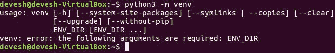

当我们这样做时，我们实际上要求 Python 做什么？

Python 的 `-m` 命令行选项告诉它运行一个模块。它使用与使用模块名称的 `import` 语句相同的机制来查找模块，然后执行它。

然而，`venv` 不是一个模块，而是一个包。那么，当我们使用 `python -m venv` 时发生了什么？我们给了 Python 一个包名，但没有给它一个包内应该运行的模块名。在这种情况下，Python 会查找包中的名为 `__main__` 的模块并运行它：

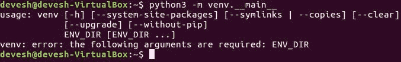

因此，`python -m venv` 与 `python -m venv.__main__` 意义相同。

任何打算包含程序入口点的模块都存在问题，因为简单地导入模块也会运行代码。在最坏的情况下，这可能会很烦人或有麻烦，但当我们使用像 Sphinx 或 doctest 这样的工具时，这些工具需要导入模块来完成工作，但实际上不应该作为程序运行模块代码，这时就变得无法接受了。

幸运的是，有一个简单的解决方案，因为 Python 解释器本身知道它被指示启动运行的模块，并将其标记为这样的模块。所有模块都自动赋予一个名为 `__name__` 的变量，该变量包含模块的名称。也就是说，所有模块都如此，除了程序入口点。

程序入口点始终命名为 `__main__`，即使其文件名完全不同：

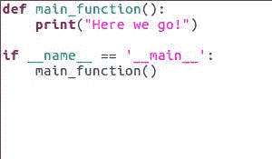

因此，我们可以通过检查这个，`__name__ == '__main__'` 来检查我们的代码是否是程序入口点。如果我们的代码确实是程序入口点，那么我们应该像上面的例子那样运行程序。如果不是，我们将像普通代码一样导入它，不应将程序作为主代码运行。

这区分了包的 `__main__` 模块的导入和运行。因为当我们导入它时，名称变量包含包名 `__main__`，而不仅仅是 `__main__`。在本章接下来的部分，我们将通过构建一个名为 **Pipeline** 的完整实用程序的过程进行操作。

# 管道程序

管道程序将是一个文本模式程序，可以配置为运行一系列其他程序，并将每个程序的数据馈送到下一个程序。在每个部分，我们将进一步开发管道程序。

到目前为止，本章中我们讨论的是如何使程序能够通过 `python -m` 运行，但在前面的章节中，我们看到了如何创建工作环境，如何创建包，以及如何在包的模块中布局代码以提高可读性。

因此，让我们应用这些课程。

在虚拟环境中创建一个文件夹作为包，并命名为 `pipeline`。在 `package` 文件夹中放置一个 `__init__.py` 文件，它可以空着，以及一个 `__main__.py` 文件：

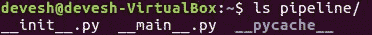

目前，`__main__.py` 文件的内容可以非常简单，如下面的屏幕截图所示：

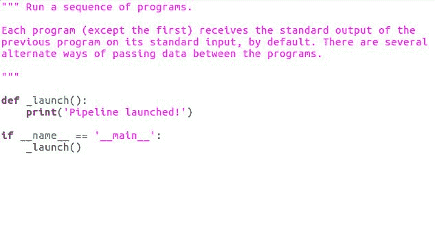

`__main__.py` 文件的内容如下：

+   模块的文档字符串

+   如果模块是程序入口点，则应该调用的函数

+   决定是否调用**启动函数**的 `if` 语句

启动函数没有文档字符串，这是允许的，因为它以名称的第一个字母为下划线标记为非公共的。启动函数目前也没有做什么有趣的事情；它只是使用打印函数告诉我们它已成功执行。

让我们运行它，以便我们可以亲自看到。

1.  打开一个命令行窗口，

1.  前往我们创建包的虚拟环境

1.  激活虚拟环境。

1.  然后，输入以下命令：

```py
      (pipeline) $ python -m pipeline

```

输出如下：

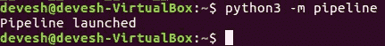

我们应该看到打印出的消息（如前一个屏幕截图所示），然后程序将结束。

# 使用 argparse 处理命令行参数

在本节中，我们将了解如何使程序从其命令行读取数据，这是各种程序中常见的功能。大多数命令行程序以及令人惊讶数量的图形用户界面程序都可以在调用程序的命令之后在命令行中提供额外信息。这些额外信息被称为**参数**，它们作为字符串列表传递给 Python 程序。结果是，将参数列表转换为有用信息涉及相当多的代码，尤其是如果我们希望使程序尽可能方便用户的话。幸运的是，很多代码可以从程序到程序通用，Python 标准库的**argparse**模块为我们处理了大部分工作。

# 创建一个 ArgumentParser 对象

`argparse`模块的主要组件是`ArgumentParser`类。在最小化情况下，使用`argparse`只需要三行代码。我们需要导入它，创建一个参数解析器实例，并调用该实例的`parse_args()`函数：

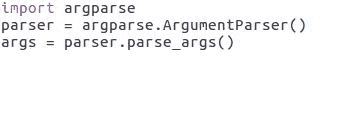

通常情况下，最小化情况下并不很有用。程序唯一会响应的参数是`-h`或`--help`，任一都会打印出自动生成的`如何使用此程序`信息然后退出程序。

要使`ArgumentParser`类更有用，我们可以在其构造函数的`description`参数中提供一个值，如下面的截图所示：

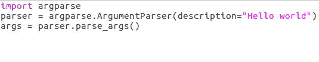

`ArgumentParser`自动生成的帮助信息将解释程序期望的所有参数，但除非我们提供描述，否则它不会说明程序实际应该做什么。

我们可以通过告诉`ArgumentParser`程序名称来改进`ArgumentParser`的行为。如果我们不提供名称，它将尽力做出合理的猜测，但最好还是我们自己提供。我认为`python3 -m`命令（参考以下代码示例）是我自己程序的规范名称，所以我们将使用它作为我们的示例：

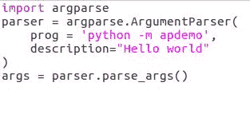

# 设置参数名称

我们通过将字符串传递给`ArgumentParser`构造函数的`prog`参数来设置一个参数的名称。这些更改使程序的帮助输出更美观、更有用，但实际上并没有给程序带来任何新功能。

我们需要开始向解析器添加参数规范，这样它就可以在参数列表中检查它们。

我们通过调用`ArgumentParser`实例的`add_argument`方法来实现这一点：

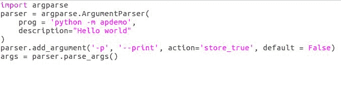

`argparse`模块识别两种类型的参数：

+   可选参数

+   位置参数

正如其名所示，**可选参数**不是必需的，但如果用户选择包含它们，它们就有意义。另一方面，**位置参数**默认是必需的，尽管我们可以修改这种行为。可选参数的名称以 `-` 字符开头。同一个参数可以有多个备选名称。这些名称作为参数传递给 `add_argument` 方法，如前例中所示，其中 `-p` 和 `--print` 是同一个可选参数的备选名称。

当我们将参数添加到解析器时，有几种配置参数的方法，这些方法在库参考中的 `argparse` 文档中有详细说明，可以在 [`docs.python.org/3/`](https://docs.python.org/3/) 查阅。

对于像我们的打印示例这样的选项，重要的配置项是 `action` 和 `default`：

+   `action` 参数告诉 `argparse` 在命令行上找到参数时应该做什么

+   `default` 参数告诉它在命令行上找不到参数时应该做什么

`action` 参数可以是包含已知操作名称的字符串，例如 `store_true`，或者它可以是 `argparse.action` 类的子类：

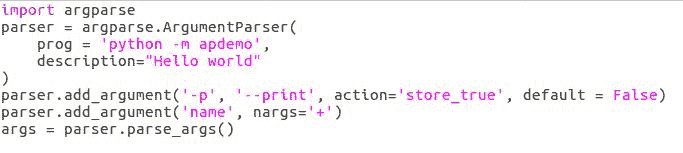

`default` 参数可以是任何任意值，该值将作为参数的值存储。如果我们实际上请求 `parser` 解析参数值时它缺失，那么另一种类型的参数必须只有一个名称，并且不能以 `-` 字符开头。

默认情况下，这些参数收集命令行中作为可选参数添加到解析器的单词，按照它们添加到解析器的顺序。如果我们使用 `nargs` 选项配置参数，我们可以更改参数收集的单词数量。

# nargs

如果我们将 `nargs` 设置为一个数字，那么将为该参数收集这么多单词。我们还可以将 `nargs` 设置为 `*` 表示任意数量的单词或 `+` 表示至少一个单词。我们还可以设置一些其他的 `nargs` 值，但在这里的这部分我们不会讨论它们。

让我们回顾一下我们的 Pipeline 程序。我认为我们希望它理解两个参数——一个告诉它继续进行的 `optional` 参数，即使其中一个程序返回错误代码，以及一个文件名，其中它应该加载和存储管道配置：

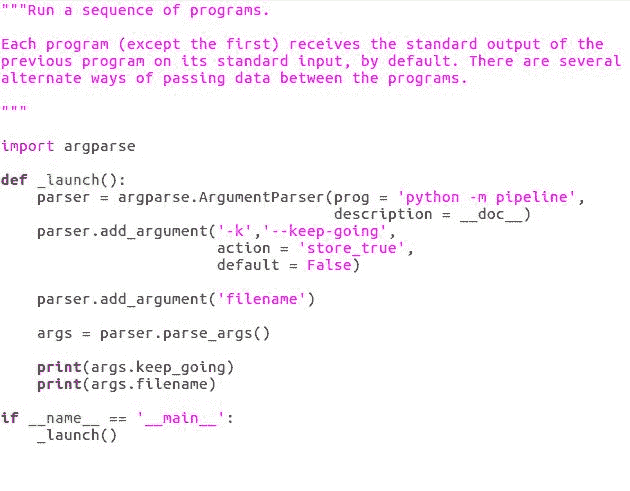

在调用 `parse_args` 之后，我们有一个名为 `args` 的对象，它包含一个设置为 `true` 或 `false` 的 `keep_going` 属性和一个包含字符串的 `filename` 属性。

注意，参数对象的属性是 `keep_going`，而不是 `keep-going`。Python 不允许在属性名称中包含 `-` 字符，而 `argparse` 足够智能，可以自动为我们修复这个问题。

如果我们想要手动设置参数对象属性的名称，我们可以在 `add_argument` 方法中将其作为最佳参数传递我们想要的名称。

# Python 与用户交互的工具

在前面的章节中，我们看到了如何在命令行中从用户那里获取信息，但当我们需要更动态的交互形式时，我们该怎么办？所以，让我们来看看 Python 的一些工具，用于向用户发送信息并从用户那里获取信息。

# Python 的内置函数——`print`和`input`

交互性的基础很简单。我们需要能够告诉用户事情，并且我们需要用户能够告诉我们事情。为了实现这两个目标，Python 提供了两个内置函数。这些是`print`和`input`。

创建一个包含以下代码的`simple.py`文件：

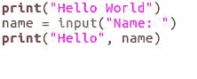

`print`函数接受任意数量的 Python 对象作为参数，并将它们打印到屏幕上。`input`函数接受一个字符串提示作为其参数，将其打印出来，然后读取文本，直到用户按下*Enter*键，并返回用户输入的字符串。

运行以下命令以查看`print`和`input`函数的工作方式：

```py
python3 simple.py  

```

交互性可以简单到这种程度。以下截图显示了前面命令的输出：

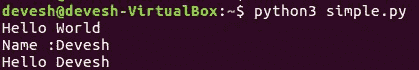

`print`和`input`函数可以做很多事情，但有几个边缘情况它们处理得不是很好。

# `getpass`包

我刚才提到的那些边缘情况之一是我们想要用户输入密码。如果我们使用`input`函数来读取密码，它就会显示在屏幕上，任何人都可以阅读。`getpass`包包含一个名为`getpass`的函数，它的工作方式与`input`类似，但不会显示用户输入的文本。

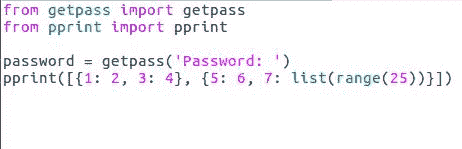

我还想提到的另一个边缘情况是，尽管`print`函数可以打印出任何 Python 对象，但它并不擅长展示复杂的数据结构。

# `pprint`包

来自同名包的`pprint`函数使复杂的数据结构更容易阅读。如果我们想显示字典列表，`pprint`会比`print`函数做得更好。

创建一个包含以下代码的`special.py`文件：

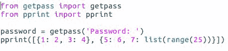

运行以下命令来执行`special.py`文件：

```py
python3 special.py   

```

以下截图是前面命令的输出：

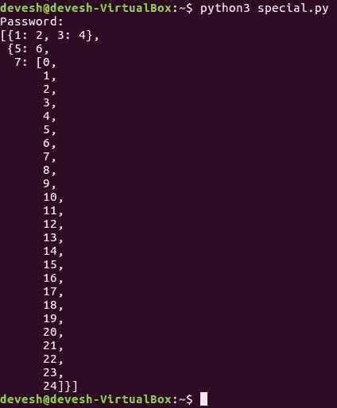

在这四个函数——`print`、`input`、`getpass`和`pprint`——之间，我们可以创建广泛范围的用户界面，但它们都是非常基本的工具。我们将会重新发明很多轮子，浪费时间。幸运的是，得益于 Python 的*batteries included*哲学，我们不必这样做。相反，我们将使用标准库中的`cmd`包来快速构建我们的用户界面。

# `cmd`类

我们所需要做的就是从`cmd`类继承并定义实现用户可以输入的命令的方法。

创建一个包含以下代码的`usecmd.py`文件：

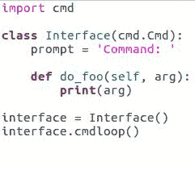

我们将提示属性设置为一个字符串，该字符串将用于提示用户输入命令。运行以下命令以执行`usecmd.py`文件：

```py
$ python3 usecmd.py

```

上述命令的输出如下：

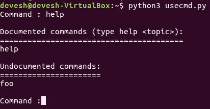

接下来，我们将创建我们的`Interface`类的一个实例（如下面的截图所示），并将其称为`cmdloop`方法。 presto！即时界面：

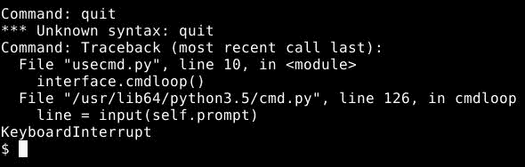

在这个例子中，我们看到`cmd`类负责显示提示、读取命令和调用正确的方法，但这只是它所做的一切。如果我们想在命令处理器方法内部显示数据，我们仍然需要`print`函数。

`cmd`类不是唯一的。它为我们做了很多工作，但如果我们需要，我们仍然可以直接使用`print`和`input`函数。这就是关于 Python 中文本模式交互的所有内容，至少如果我们希望我们的程序能够在不同平台上移植的话。

# 管道用户界面

另有一个名为`curses`的标准库模块，它能够实现更复杂的文本加载操作；然而，由于`curses`模块无法移植到 Windows，我们不会在本章中详细介绍。

相反，让我们看看如何定义我们的**管道**程序的界面：

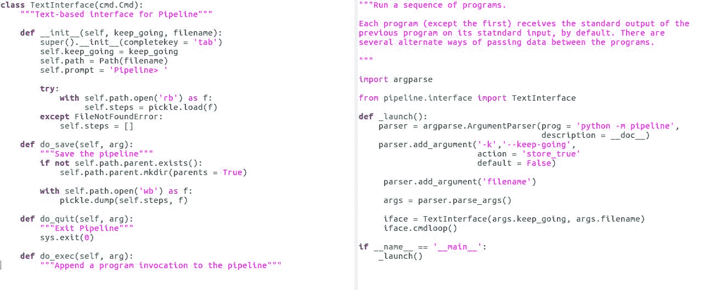

现在我们似乎想要能够将程序添加到管道中，并以各种方式操作程序之间的数据传递：

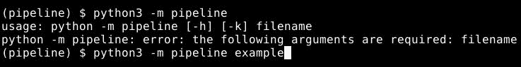

当我们对管道满意时，我们还想能够保存它，并能够实际运行它。最后，我们还想能够使用`quit`命令退出程序。

一个`help`命令也会很有帮助，但幸运的是，`cmd`类将自动使用命令处理函数的`docstrings`来提供这个功能：

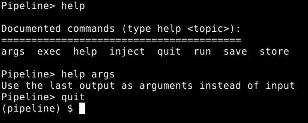

我们在这里只是简单地设置命令处理器，因为我们现在专注于接口实现。所以，我们得到了一个相当不错的用户界面，而我们几乎不需要做太多工作。这就结束了我们对文本模式交互的探讨。现在，让我们关注一下程序控制的一些选项。

# 使用子进程执行其他程序

在本节中，你将学习如何在我们的程序内部执行和控制其他程序，从而让我们能够创建示例程序的精髓。这种能力对于各种系统自动化任务非常有用。创建一个包含以下内容的`echo.py`文件：

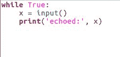

以前让其他程序运行总是一件有点混乱的事情。不同的平台有不同的机制，有方便的机制，也有不同的安全机制。幸运的是，自从 Python 2.4 版本引入 `subprocess` 模块以来，所有这些都发生了变化，该模块抽象了平台之间的差异，并使得一些更安全的范式更容易使用。

# 子进程及其变体

在 `subprocess` 包中有六个对象特别引人注目。其中三个是 `call`、`check_call` 和 `check_output` 函数，它们都是基于相同基本思想的变体：

```py
from subprocess import call, check_call, check_output

```

这三个对象运行程序，等待其终止，然后告诉我们程序做了什么：

+   `call` 函数返回程序的退出代码，这是一个具有程序定义意义的整数，通常用来判断程序是否成功或失败。

+   `check_call` 函数如果程序的退出代码非零，则抛出异常，按照惯例，这意味着程序以错误退出。

+   `check_output` 函数返回程序打印的任何文本，如果程序以非零退出代码退出，则抛出异常。抛出的异常有一个名为 `output` 的属性，包含程序的文本输出。因此，即使程序以错误代码退出，我们仍然可以获取输出（如果我们想要的话）。

`run` 函数与我们刚才提到的 `call` 函数类似：

```py
from subprocess import run  

```

实际上，`run` 函数能够做任何任何人会做的事情，结合在一起。然而，它不一定可以在其他项目中使用，至少目前还不能。

这三个 `call` 函数和 `run` 函数的调用方式在很大程度上是相同的。每个函数都通过一个包含程序名称及其参数的列表传递。我们在屏幕上看到这个 `'ls','-l'` 函数的输出，它并不是来自调用，因为 `'ls','-l'` 在运行时会打印出一些内容。

输入以下语句：

```py
call(['ls', '-l', '/dev/null']) 

```

以下是对前面语句的输出：

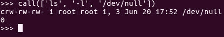

但是返回的退出代码是 `0`，所以这就是你的调用。如果你想要从 `'ls'` 程序中获取打印输出并将其用于我们的程序，我们需要捕获它。

`check_output` 函数有一个值得注意的关键字参数，称为 `universal_newlines`，默认值为 `False`。如果我们将 `universal_newlines` 设置为 `True`，程序文本输出将被解码为 Unicode 字符，使用系统默认的文本编码器，并且新行字符将被标准化。

如果我们将 `universal_newlines` 设置为其默认值 `False`，程序输出将以字节形式返回，我们需要自己进行解码并处理当前系统认为的新行字符序列：

```py
lines = check_output(['ls', '-l', '/dev/'], universal_newlines = True).split('\n')

```

现在输入以下内容并按 *Enter*：

```py
lines 

```

在这个代码示例中，我们确实将 `universal_newlines` 设置为 `True`，然后使用标准换行符 `\n` 来分割它，这给了我们程序输出的行列表：

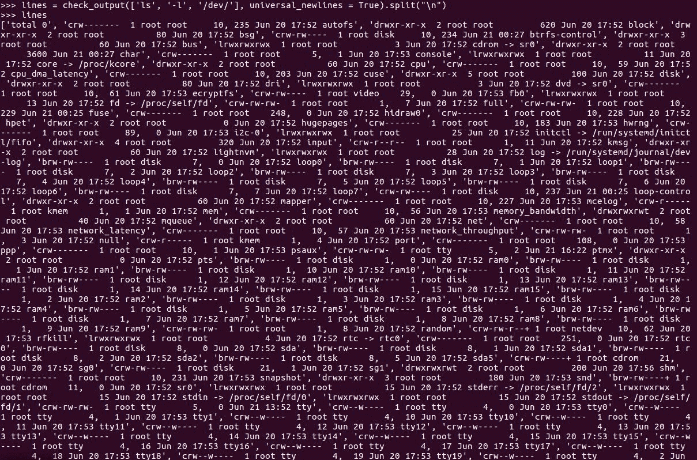

如果我们想要在运行其他程序时更加复杂，我们将想要使用 `Popen` 类的实例——`subprocess` 包中的第四个有趣的东西，它为我们提供了对其他程序执行的大量灵活性和控制。

# 使用 `Popen` 子进程

在增加一点复杂度的代价下，`Popen` 构造函数接受与调用函数相同的程序和命令行参数列表，以及一个非常大的可选关键字参数列表，包括 `universal_newlines`。

我们将关注 `Popen` 构造函数的一个特定用途，这个用途很有用，但超出了我们使用调用函数所能达到的范围。我们将看到如何在我们的代码也在运行的同时在后台运行一个程序，并在两个程序之间发送和接收数据。

# `PIPE` 常量

为了管理这些，我们需要使用 `subprocess` 包中的第六个有趣的东西——`PIPE` 常量。`PIPE` 常量与 `Popen` 构造函数的 `stdin`、`stdout` 或 `stderr` 关键字参数一起使用：

```py
p = Popen(['python3', 'echo.py'], stdin = PIPE, stout = PIPE, bufsize = 0) 

```

这些参数代表其他程序的文本输入、输出和错误报告。我们将它们中的任何一个设置为 `PIPE` 的都将被重定向到我们的程序。在前面的例子中，我们将程序的输入和输出重定向到我们自己，这给了我们与其他程序的双向数据通道。

现在你看到了，我们正在以编程方式与屏幕上最初这个示例中的代码进行交互。然而，由于它设置了一个循环，输入，然后输出。此外，每当有输入时，一旦我们设置了 `PIPE`，我们就可以通过在 Popen 对象的 `stdin` 属性上调用 `write` 方法将数据发送到其他程序：

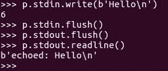

我们可以通过调用 Popen 对象的 `stdout` 属性上的 `read` 方法或其相关方法来读取数据，如前例代码所示。

尽管通过将 `bufsize = 0` 参数传递给 `Popen` 构造函数来禁用了缓冲，但在向 `stdin` 写入后调用 `flush` 方法，以及在从 `stdout` 读取之前调用 `flush` 方法通常是个好主意。我们可以继续发送和接收数据，直到两个程序都在运行。然而，如果我们完成交互并只想等待其他程序终止，我们可以调用 Popen 对象的 `wait` 方法来实现这一点。

# `wait` 方法

`wait` 方法将在其他程序运行完成后返回其退出代码。与 `PIPE`、`stdin` 和 `stdout` 一起工作的许多复杂性都封装在 `Popen` 类的 `communicate` 方法中，该方法接受输入作为参数并返回输出：

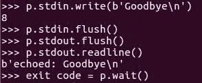

通信简单，但有些受限，因为每个 `Popen` 对象只能调用一次，并且只有在另一个程序完成之后才会返回。这对需要相互通信的两个程序来说并不好，但应该非常适合我们的管道程序，其中每个程序都将前一个程序的输出作为其输入。

# 完成我们的代码示例

我们将创建一系列类来表示管道中的不同步骤，并将这些类集成到界面中。一旦我们完成了这些，程序就具有功能性了，尽管还有很大的改进空间。

我们特别关注以下截图右上角的 `ExecStep` 类，它使用 `Popen` 来实际执行程序并摆脱输出。

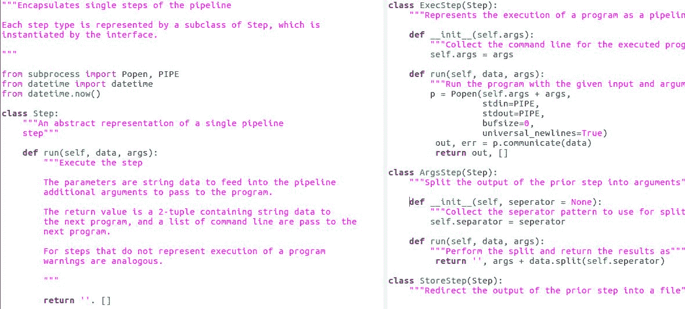

我们现在有了示例程序，所以我们将继续本章的最后部分。

# 设置 shell 脚本或批处理文件以启动程序

在本节中，我们将通过使其易于启动来总结本章的示例程序。只要它安装在了系统的 `PYTHONPATH` 中，或者我们已经激活了包含它的虚拟环境，我们就可以使用 `python -m` 来运行我们的程序，如下所示：

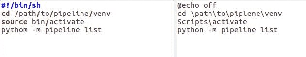

# 为我们的程序创建启动项

一旦程序稳定，我们真正想要的只是能够输入其名称或双击它，然后运行。实现这一点的便捷方式是使用 shell 脚本或批处理文件：

+   在包括 macOS 在内的 Unix 风格操作系统上，shell 脚本是以 `#bang/bin/sh` 开头的文本文件，并且已被标记为可执行

+   在 Windows 上，批处理文件是以 `.bat` 结尾的文件

Shell 脚本和批处理文件都是包含一系列命令行命令的文本文件，每行一个命令。当我们输入脚本或批处理文件的名字时，这些命令会依次执行，就像我们逐个在命令行中输入一样。

同样，如果我们通过图形用户界面触发脚本或批处理文件，命令仍然会像我们逐个在命令行中输入一样执行。考虑以下示例：

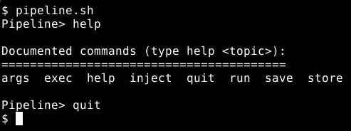

对于我们的目的，这意味着我们可以将启动程序所需的任何命令序列放入 shell 脚本或批处理文件中。之后，我们可以将那个脚本当作程序本身来处理。这就是简单情况的全部。

Shell 脚本能够表示更多的复杂性，但 Python 在这方面是更好的工具。因此，这里的简单情况，就是我们真正需要的所有。

# 概述

在本章的前几节中，你学习了如何将我们的 Python 包转换为程序，从命令行获取数据，与用户交互，以及以子进程运行其他程序。我们看到了如何使我们的 Python 程序像任何其他程序一样，无论是从 GUI 还是命令行都可以轻松观察。我们在构建 Pipeline 程序的用户界面过程中，还了解了几种 Python 的文本模式工具。

在下一章中，我们将探讨如何利用并行处理来充分利用具有多个处理器或核心的计算机。
