# 第六章：并行处理

在上一章中，我们创建了一个文本模式实用程序，并学习了 Python 的几个内置包。在这一章中，我们将看到如何使用前面提到的两个包：高级的 `concurrent.futures` 包和低级的 multiprocessing 包来帮助我们编写并行程序。这两个包都是 Python 标准库的一部分。

我们将详细介绍以下两个主题：

+   使用 `concurrent.futures` 包

+   使用 multiprocessing 包

# 使用 concurrent.futures 包

在本节中，我们专注于 `concurrent.futures`，这是前面提到的两个包中更抽象且更容易使用的包。我们的重点将放在 `concurrent.futures` 的四个主要操作上。然后我们将继续介绍未来对象的使用，并以进程间数据传输机制的影响结束。

有些程序是我们所说的 CPU 密集型，这意味着决定程序完成任务所需时间的主要因素是计算机运行其指令的速度有多快。有趣的是，我们日常使用的许多程序都不是 CPU 密集型。然而，对于那些是 CPU 密集型的，我们通常可以通过将它们分解成单独的进程来加速它们。

这种差异可以如下说明：

在前面的图中，左侧是一个 CPU 密集型程序。它有很多事情要做，用圆圈表示，执行速度取决于 CPU 处理速度的快慢。右侧是一个非 CPU 密集型程序，这意味着，大多数时候，它正在等待执行。

进程可以在不同的 CPU 核心上同时运行，甚至可以在完全独立的 CPU 上运行。这总体上增加了每秒执行的程序指令数，这意味着 CPU 密集型程序比非 CPU 密集型程序运行得更快。

在某些编程语言中，我们可以通过为单个程序运行多个线程来获得相同的好处。然而，如我之前提到的，大多数程序都不是 CPU 密集型，因此 Python 的创建者选择了优化 Python 的线程系统以适应常见情况，这产生了副作用，使得 Python 线程对于提高 CPU 密集型程序的运行速度并不十分有用。

此外，操作系统优化多个进程的执行比优化进程内的多个线程更容易。因此，即使线程是一个可行的选项，对于 CPU 密集型程序来说，多个进程仍然是一个更好的选择。

我们在讨论`subprocess`模块时已经看到了一种非常低级的启动进程和与之通信的方法（请参阅第五章中关于*使用 subprocess 执行其他程序*的部分，*制作命令行工具*）。然而，对于我们的程序被拆分成一组协同工作的进程的情况，Python 为我们提供了一些高级工具包，使事情变得更容易。Python 并行处理工具包中更抽象的一个被称为`concurrent.futures`。

# `concurrent.futures`模块

`concurrent.futures`模块是为那些可以由一个控制进程和几个工作进程组成的程序设计的，其中控制进程将任务分配给工作进程，然后收集和整理结果。以下是一个使用`concurrent.futures`模块的简单 CPU 密集型任务示例：

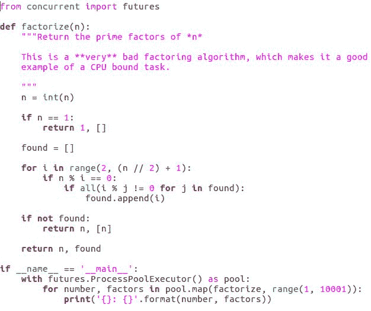

这是一个相当通用的模型，尤其是对于 CPU 密集型程序。因此，`concurrent.futures`模块既易于使用，又非常适用，前面的代码示例也展示了它的简单性。

基本用法是只需导入它，创建一个`ProcessPoolExecutor`对象，然后调用该对象的`map`或`submit`方法将工作发送到工作进程。当我们完全完成`ProcessPoolExecutor`并且知道我们再也不需要它时，我们可以调用它的`shutdown`方法，或者允许`with`语句为我们完成它。`ProcessPoolExecutor`对象将负责创建和与工作进程通信的所有琐碎细节。

在继续使用`map`和`submit`方法之前，让我们更深入地了解`ProcessPoolExecutor`以及它的功能。

# 调用`ProcessPoolExecutor`

当我们调用`ProcessPoolExecutor`的`map`或`submit`方法（我们将在本节后面讨论），我们是在要求它使用给定的参数调用一个函数。但我们希望这个函数调用发生在工作进程中。这有一些可能不那么明显的含义：

+   首先，这意味着函数及其参数需要是**可序列化的**，这另一种说法是 Python 需要知道如何将它们转换成一个字节字符串，它可以发送到工作进程。

对于函数，这基本上意味着任何函数都可以，除非它是另一个函数体内的定义。

对于参数来说，这意味着大多数对象都可以工作，但生成器和一些其他类型的特殊对象则不能传递。

意识到函数及其传递给它的参数在它们被序列化以与工作进程通信时可能会附带我们无意发送的信息是很重要的。

如果我们发送给`ProcessPoolExecutor`对象的对象引用了其他对象，那么这些对象也会被序列化并发送。最终可能会发送我们程序的大部分状态。当请求运行的函数是某个对象的方法时，这一点尤其值得注意。

如果函数是对象的方法，整个对象将被序列化并发送到工作进程，这意味着函数调用将使用原始对象的副本作为其 self 参数，而不是原始对象。

+   第二，函数的返回值将被序列化并返回到控制进程。所有关于传递参数给被调用函数的警告也适用于返回值。

例如，如果函数不能返回生成器对象，并且其返回值包含对多个对象的引用，那么这些对象的副本最终会被发送到控制进程。

+   第三也是最后一点，运行在工作进程中的`concurrent.futures`代码需要能够导入我们的原始代码所加载的模块。

这意味着我们可能需要使用`if __name__ == '__main__'`技巧来防止工作进程陷入运行我们程序完整副本的状态，而他们实际上只想导入模块并找到我们请求运行的函数。

我们已经在我们的例子中看到了`ProcessPoolExecutor`的`map`方法，但让我们更仔细地看看。

# 使用`map`方法

`map`方法将其第一个参数作为函数。我们还可以传递一个或多个区间，这些区间将被用来确定函数每次调用的参数：

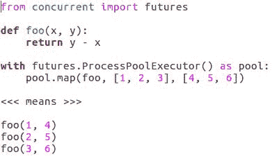

参考前面的代码示例，如果我们要求`pool`将`foo`函数映射到列表`[1, 2, 3]`和`[4, 5, 6]`，结果是`foo`函数将用`1`和`4`作为参数被调用，再次用`2`和`5`作为参数被调用，第三次用`3`和`6`作为参数被调用。

没有任何保证这三个调用发生的顺序。毕竟，它们可能在每个不同的进程中运行，进程调度与墙钟时间的关系部分取决于不可预测的因素。

`map`方法通过等待所有调用完成并生成结果，然后按正确顺序返回这些结果的迭代器来隐藏这个事实。

# 使用`submit`方法

有时候，`map`方法过于简单。如果我们想在每个工作进程生成结果时处理结果，而不是等待所有工作进程完成，怎么办？如果我们决定最终不运行函数，怎么办？如果我们想在工作进程中同时运行不同的函数，怎么办？至于传递关键字参数给函数，我们可以使用`submit`方法做到所有这些以及更多。

每次调用`submit`方法都对应于对作为`submit`方法第一个参数传递的函数的单次调用。我们传递给`submit`的其余参数和关键字参数在发送到工作进程后传递给函数。

让我们看看`submit`方法的一个示例：

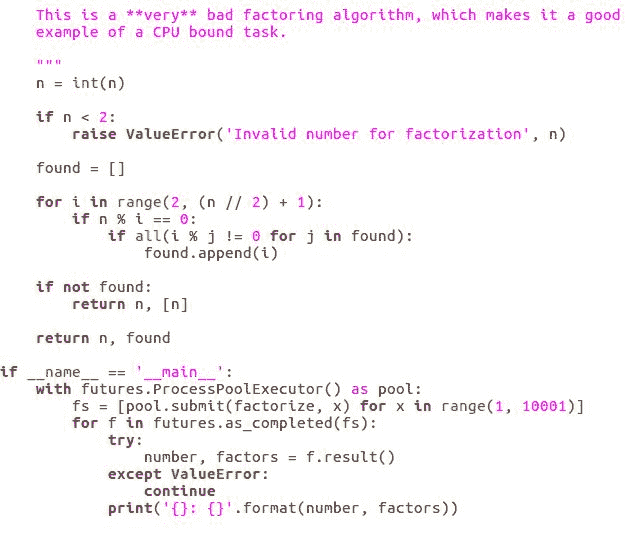

因此，每次我们调用`submit`时，一个工作进程都会用一个参数集调用一个函数。`submit`方法在返回之前不会等待工作进程完成函数的运行。实际上，它甚至不会等待工作进程开始运行函数，因此`submit`不会返回被调用函数的结果。相反，它返回一个`future`对象。

在某种意义上，`future`对象是函数结果的 IOU。如果我们有一个`future`对象，我们可以使用它来检查工作进程是否已经运行完函数以获取函数返回的结果，甚至可以设置一个回调，当函数最终完成运行时将被调用。我们甚至可以使用`future`对象从应该分发给工作进程的作业队列中移除函数调用。

我们最常使用的是`future`对象的`done`和`result`方法。

# `done`和`result`方法

`done`方法在作业完成时返回`true`，如果没有完成则返回`false`。如果作业被取消、引发异常或作业函数已返回，则作业完成，如下面的代码示例所示：

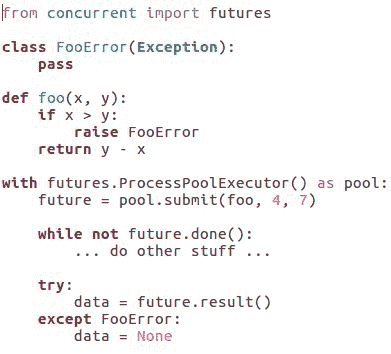

如果作业函数成功完成，`result`方法返回作业函数的返回值。如果作业函数引发异常而不是返回值，工作进程将捕获异常并将其作为作业的结果返回给控制进程。

在前面的代码示例中，调用`result`方法将重新引发异常，因此可以正确处理。

**超时参数**

超时参数是`result`方法中的一个重要参数。如果我们想在作业完成之前调用`result`方法，它将非常有用。

如果在作业函数完成之前调用`result`方法，那么`result`方法将在返回之前等待作业完成。这可能会非常有用，但有时我们不想无限期地等待。如果作业没有很快完成，我们想要继续做其他事情一段时间。

在这种情况下，我们应该将我们愿意等待的秒数传递给`result`方法的`timeout`参数，如下面的代码示例所示：

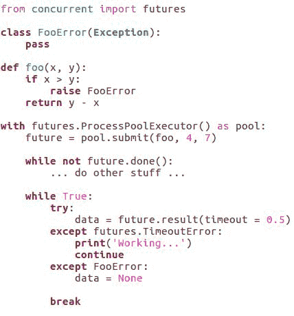

除了`timeout`参数外，我们还将添加一个`TimeoutError`异常。如果在没有产生结果的情况下`timeout`参数到期，将引发超时错误。

# `wait`和`as_completed`函数

`concurrent.futures` 包中有一对函数允许同时等待多个 `future`。它们被称为 `wait` 和 `as_completed`。以下代码示例表示 `wait` 函数：

`wait` 函数等待所有 `futures` 准备好提供结果或直到超时到期。然后，它返回一组已完成和一组未完成的 `futures`。相比之下，`as_completed` 函数返回一个迭代器，它会逐个产生准备提供结果的 `futures`。

在罕见的情况下，`future` 的 `done` 和 `result` 方法以及 `concurrent.futures` 包的 `wait` 和 `as_completed` 函数不足以让程序在适当的时间处理 `futures`。

对于这种情况，可以通过将函数传递给 `future` 的 `add done callback` 方法，让 `future` 在结果可用时调用一个函数。

# 添加完成回调函数

`future` 对象会记住该函数，当 `job` 函数完成时，`callback` 函数将使用 `future` 对象作为其唯一参数被调用。然后，`callback` 函数中的代码可以调用 `future` 的 `result` 方法来获取作业产生的返回值或异常。

`callback` 函数总是在控制过程中被调用，但它可能不会在程序主要部分的同一线程中被调用。

当我们使用 `add done callback` 时，需要小心线程同步问题，这也是尽可能选择 `wait` 或 `as_completed` 函数的一个主要原因。`future` 对象也有一个 `cancel` 方法。

# 取消方法

`cancel` 方法试图告诉系统我们最终不希望发生调用（参考以下代码示例）：

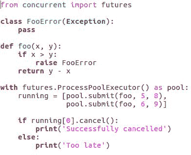

这个代码示例不能保证工作，因为如果工作进程已经开始了一个作业，那么这个作业就不再可取消了。

+   如果与 `future` 对象连接的作业无法取消，`cancel` 方法返回 `false`。

+   如果取消成功，`cancel` 方法返回 `true`。

`concurrent.futures` 模块非常适合将计算任务分配给多个进程，以利用多核和多处理器计算机的 CPU 功率。对于这类任务，通常只需要 `map`、`submit`、`wait` 和 `as_completed` 函数。

# 使用多进程包

在上一节中，我们看到了 `concurrent.futures` 包使得将计算作业分配给工作进程变得非常简单。如果所需的程序不适合 `发送作业并收集结果` 模型，我们可能更倾向于在较低级别的抽象层面上工作。

因此，现在让我们继续看看另一个帮助我们处理不符合该模型的并发程序的包，但这些组件之间只有部分是相互独立的。它们时不时地需要在彼此之间传递信息，而不仅仅是返回到控制进程。我们不能用`concurrent.futures`来做这件事，因为它根本不适合`concurrent.futures`用来描述并行处理的模型。

另一方面，如果我们需要在工作进程开始运行作业后能够取消作业，这又不符合`concurrent.futures`模型。`concurrent.futures`模型功能强大，但其强大之处在于其简单性，因此不难想象它无法处理的场景。

当我们需要构建自己的并行处理模型时，我们可以将`multiprocessing`模块作为基础。

# `multiprocessing`模块中的进程类

`multiprocessing`模块包含一个名为`Process`的类，它表示在单独的进程中运行代码的能力。

使用`Process`类最简单的方法是将其子类化并重写`run`方法，这是其他进程中的代码的入口点，如以下代码示例所示：

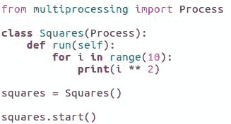

在前面的例子中，我们创建了一种特定类型的进程，用于计算一些平方数。然后，我们创建了一个实例并开始运行它。当我们调用`start`时，`multiprocessing`模块执行了必要的工作，以确保`run`方法在新进程中执行。

顺便说一句，我们在`concurrent.futures`模块部分（使用`concurrent.futures`包）中讨论的所有关于序列化和导入模块的警告也适用于`multiprocessing`模块。当涉及到在进程之间移动数据和导入代码时，它们以相同的方式工作。

到目前为止，我们还没有看到任何我们无法用`concurrent.futures`做得更好的事情，但当我们开始使用**队列**、**管道**和**管理器**时，情况就改变了。让我们详细看看它们。

# 队列

队列是适用于合作进程之间一对一、多对一和多对多通信的通信通道。根据它们的使用方式，这使得它们非常适合在不需要关心哪个工作进程最终执行任务时向工作进程发布任务，以及收集多个工作进程的结果。

任何进程都可以将可序列化的对象放入队列中，任何进程都可以从队列中移除下一个可用的对象。

队列是**先进先出**（**FIFO**）数据结构，这意味着对象是从队列中以它们被添加的相同顺序被移除的。《JoinableQueue》类添加了一个方法，允许进程等待直到其他进程清空队列。好的，让我们更详细地看看`queue`对象：

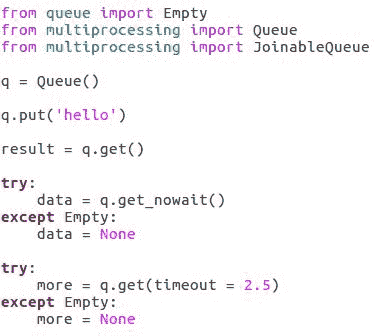

请参阅前面的代码示例；有三个方法主要是有用的：`put`、`get` 和 `get_nowait`。

+   当我们调用 `put` 时，一个对象被放置在队列的后面。

+   当我们调用 `get` 时，一个对象将从队列中移除并返回，除非队列是空的。如果队列是空的，调用 `get` 的进程将等待直到能够移除并返回一个对象，这将在其他进程将对象放入队列之后发生。

+   当我们在另一端调用 `get_nowait` 时，它要么移除并返回队列前面的对象，要么引发一个 `q.empty` 异常。

+   最后，我们可以将 `timeout` 参数传递给 `get` 方法，在这种情况下，它将在那么多的秒内移除并返回一个对象，或者引发 `q.empty`。

我们可以通过将队列对象作为进程初始数据的一部分，或者通过通过现有的队列或管道发送它们，甚至通过将它们存储在管理器中，在进程之间传递队列对象。队列被设计成可以在进程之间共享。继续前进，让我们看看管道。

# 管道

管道是一对一的通信通道。当我们调用管道时，我们得到一对对象，每个对象都作为通信流的一端。如果我们将每一端给一对进程，它们可以通过管道来回发送消息和数据。

管道的每一端都有相同的方法。有趣的方法是 `send`、`recv` 和 `poll`。考虑以下代码示例：

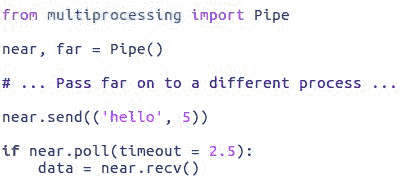

在前面的代码示例中，我们看到这些：

+   `send` 方法接受一个对象作为其参数并将其发送到另一个端点。

+   `recv` 方法等待从另一个端点发送来的数据，然后返回它。

+   `poll` 方法如果可以接收到的对象存在则返回 `true`，如果不存在则返回 `false`。

`poll` 方法可以接受一个 `timeout` 参数。如果我们给它一个超时时间，并且当前没有等待接收的数据，`poll` 函数将等待最多那么多的秒数以等待数据到达，然后返回 `true`。如果在超时到期之前没有数据到达，`poll` 方法将返回 `false`。

如果我们将 `None` 作为 `poll` 方法的 `timeout` 参数传递，它将在返回之前等待数据到达，无论需要多长时间。像队列对象一样，管道端点可以在进程启动时或运行后通过其他队列、管道等发送给其他进程。

通常认为使用队列和管道作为进程之间唯一的连接是最好的，因为这最大化了进程并行工作的能力。

如果有可能以那种方式组织并行程序，那么应该这样做。如果我们发现需要在几个进程之间共享一些变量，我们可以使用 `Manager` 对象来实现。现在让我们看看管理器。

# 管理器

管理器代表一个具有单一任务的特殊进程——跟踪其他进程需要的变量。

访问存储在管理者中的变量比访问进程的局部变量要慢得多，这可能导致尝试同时访问变量的进程相互减慢。另一方面，如果我们确实需要共享变量，至少管理者能够正确且尽可能高效地处理它们。

现在，管理者可以处理许多类型的数据，但我们将关注它们存储 **字典**、**列表** 和 **命名空间** 的能力。

通常，当我们把一个对象发送到另一个进程时，另一个进程实际上得到该对象的一个副本；这意味着如果另一个进程改变了它接收到的对象，我们不会在原始进程中看到这些变化。

管理者让我们能够创建更类似队列的对象，如果我们把对象发送到另一个进程，并且该进程改变了对象，我们确实会在原始进程或任何其他可以访问该对象的进程中看到这些变化。考虑以下代码示例：

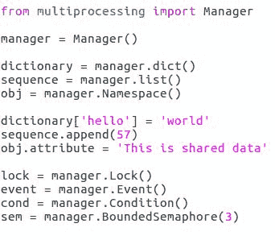

在前面的代码示例中，`manager.dict()` 和 `manager.list()` 方法创建了一些特殊的字典或列表，这些字典或列表可以在进程之间共享。`Namespace` 方法确实以大写 `N` 开头，它创建了一个更通用的共享对象，我们可以在其中设置属性以在进程之间共享。

当我们拥有多个执行流正在访问共享数据时，这正是管理者提供的，我们必须小心保持数据访问的同步。为了帮助做到这一点，管理者还可以创建一些标准的同步原语，例如 **锁**、**事件**、**条件** 和 **信号量**。

# 锁对象

锁对象是同步工具中最简单的。它们有一对方法称为 `acquire` 和 `release`，如下面的代码示例所示：

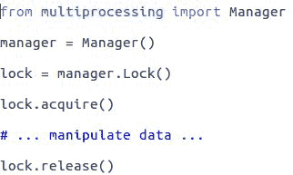

在一个进程调用 `acquire` 后，任何其他调用 `acquire` 的进程都必须等待，直到第一个进程调用 `release`。然后，等待进程中的一个 `acquire` 调用返回，允许该进程继续执行。换句话说，在 `acquire` 调用和 `release` 调用之间的代码可以确信是唯一访问 `lock` 对象所保护数据的代码。

注意，`lock` 对象并不知道它保护什么数据。这取决于我们作为程序员在自己的脑海中定义并尊重这种关联。

# 事件对象

事件对象允许进程在标志为 `true` 时立即继续，或者等待标志变为 `true`。

通过调用 `event.clear` 方法将标志设置为 `false` 或通过调用其 `event.set` 方法将其设置为 `true`，如下面的代码示例所示：

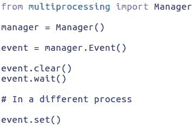

当我们调用 `event.wait` 方法时，如果标志为 `true`，它将立即返回；否则，它将暂停执行，直到另一个进程调用 `set` 并然后返回。

事件对象对于使进程暂停，直到某个特定事件发生非常有用。

# 条件对象

条件对象结合了`lock`和`event`对象的一些特性。像`lock`一样，它们有`acquire`和`release`方法，可以用来保护数据免受同时访问。

然而，`condition`对象还有一个`wait`方法和一个`notify`方法，可以用来等待直到其他进程执行某些操作，并唤醒一个等待的进程，如下面的代码示例所示：

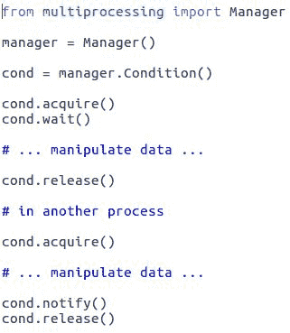

条件对象对于创建同步访问其内容的数据结构以及在它们没有数据返回时等待非常有用。`queue`类的`get`和`put`方法可以使用条件对象来实现。

# `semaphore`对象

`semaphore`对象看起来与`lock`对象非常相似。区别在于，`lock`对象总是确保在给定时间只有一个进程获取了锁，而`semaphore`对象确保不会超过固定数量的进程同时获取它。

这可以通过以下代码示例来查看：

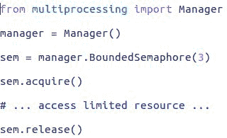

这对于执行诸如限制同时访问硬盘的工作进程数量等操作非常有用。

# 摘要

在本章中，你学习了如何使用`concurrent.futures`模块使一个特别常见的多进程案例变得极其简单。我们还看到了如何使用`multiprocessing`包来定义工作进程执行的操作以及它们如何交互。

因此，现在我们相当了解如何帮助 CPU 密集型程序利用多核和多处理器硬件来运行得更快。尽管如此，大多数程序并不是 CPU 密集型的，它们是 I/O 密集型的，这意味着它们大部分时间都在等待来自各种来源的输入。在这种情况下，并行处理没有帮助，但异步 I/O 可以，这是我们下一章的主题。
