# 协程与异步 I/O

在上一章中，我们探讨了如何使用多个进程来提高我们程序中数据处理的速度。这对于 CPU 密集型程序来说非常好，因为它允许它们使用多个 CPU。

在本章中，我们将探讨这种情况的逆过程；我们将使用单个 CPU 在单个进程中同时处理多个数据处理任务，这对于 I/O 密集型程序来说非常棒。我们将了解一些使用 asyncio 的细节。我们还将讨论 asyncio 的`future`类及其使用方法。然后我们将继续讨论异步协程任务之间的同步和通信。最后，我们将看看如何使用 asyncio 和协程编写一个客户端-服务器程序，以通过网络进行通信。

我们将涵盖以下主题：

+   异步处理与并行处理之间的区别

+   使用 asyncio 事件循环和协程调度器

+   等待数据可用

+   同步多个任务

+   网络通信

# 异步处理与并行处理之间的区别

当我们在第六章中与`concurrent.futures`模块一起工作时，我们看到了一种让两个或更多代码流同时运行的方法。为了参考，请查看我们在上一章中使用的代码示例：

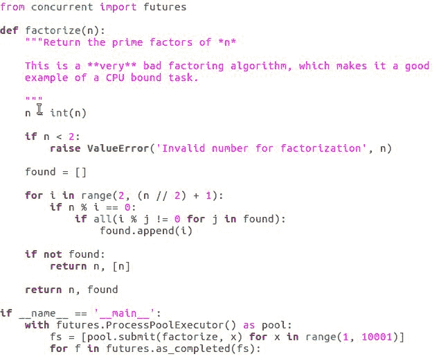

这段代码帮助你创建一个执行器对象。现在，如果你希望并行运行一些代码，你只需告诉执行器去做。执行器会给我们一个未来对象，我们可以在稍后使用它来获取代码的结果，并且它会然后在单独的进程中运行代码。我们的原始代码将在原始进程中继续运行。

我们讨论了如何提高 CPU 密集型程序的性能——将代码分割成多个计算机核心。因此，它是一种在其他许多情况下都方便的技术。

能够告诉计算机“去做这件事，完成后通知我”是非常方便的。

这种能力似乎特别有用的一处是网络服务器程序，其中为每个连接的客户端拥有一个独立的执行流，这使得代码的逻辑和结构更容易理解；以这种方式结构化时，编写无 bug 的服务器更容易。

# 多线程对于服务器来说并不好

有方法可以编写只使用单个执行流的服务器，但如果我们有方法可以编写可能引入更少 bug 的服务器，为什么不呢？问题是资源开销。

当然，运行在计算机上的每个进程都会消耗内存和 CPU 时间；然而，除了内存和 CPU 时间外，进程还需要运行其代码。操作系统还需要消耗一些资源来管理进程。实际上，在进程之间切换所花费的时间是相当大的。

内存开销已经足够；它成为多进程服务器可以同时处理多少客户端的限制因素；其他内部操作系统资源可能限制得更多。

对于计算密集型程序，有一个产生最佳结果的甜点，即程序有一个进程对应一个 CPU 核心。对于 I/O 密集型程序，大多数服务器都是这样的，第一个进程之后的任何进程都只是开销。正如之前提到的，有方法可以编写单进程服务器，可以同时处理多个客户端，并且每个连接客户端的开销都更低。

这些技术允许服务器同时处理比多进程服务器程序能够管理的更多的客户端。即使在不全速运行的情况下，单进程服务器也会让计算机的大部分资源可用于其他用途。

因此，一方面，我们有编写服务器的方法，逻辑结构清晰且不易出错，但浪费资源。另一方面，我们有编写服务器的方法，资源效率高，但容易出错。

我们能否以某种方式获得两个世界的最佳之处？答案是，可以！

幸运的是，Python 的标准 `asyncio` 模块结合了低级技术，允许单个进程通过协作式协程调度器服务多个客户端。参考以下代码示例：

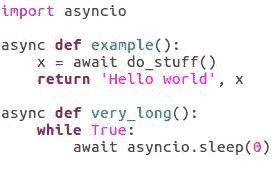

最终结果是，一个编程接口看起来和表现得很像 `concurrent.futures`，但每个代码执行流的开销要低得多。那很好，但什么是协作式协程调度器？就这个话题而言，什么是协程？

# 协作式协程调度器与协程的比较

在我们深入细节之前，让我们定义这两个术语：

+   协程是计算机科学中的一个概念，是一个可以在其中暂停和恢复的函数。每次它暂停时，它会发送数据，每次它恢复时，它会接收数据。

Python 程序可以使用 `async` 和 `await` 关键字定义协程，并且 asyncio 广泛使用它们。

+   协作式协程调度器是一段代码，每次协程暂停时都会拾起执行，并决定下一个要运行的协程。它被称为调度器，因为它跟踪多个执行流，并决定在任何给定时间哪个流可以运行。

它被称为协作式，因为调度器不能在第一个协程仍在运行时从第一个协程切换到另一个协程。它必须等待正在运行的协程自己暂停，然后才能选择另一个协程来运行。

# Python 协程

在 Python 协程中，暂停和恢复点是 `await` 表达式；这就是我们调用其他协程的方式。每次我们想要执行一个函数时，我们都会在另一个协程内部调用一个协程。我们等待我们想要调用的协程。

代码的语义就像它们是从另一个函数内部调用一个函数一样工作。其他协程会一直运行，直到它返回，我们得到返回值。这就是代码的行为方式，但实际上它所做的事情要有趣得多。

# 协程调度器

使用协程调度器，代码的行为如下：

+   发生第一件事是我们正在运行的协程被暂停。我们想要调用的协程被交给调度器，调度器将其放入它需要运行的协程列表中。

+   然后，调度器检查协程是否在等待以及为什么：例如，来自网络的新数据，或者一个被返回的协程；如果是后者，它也将等待的协程添加到列表中。

+   然后，调度器选择需要运行的协程之一并恢复其执行。这意味着如果有一个协程包含一个长时间运行的循环且不包含任何`await`表达式，它将阻止其他协程的运行。它也会阻止程序检查新的传入数据，并防止其他各种输入和输出操作得到服务。

如果我们有一个这样的循环，并且没有理由在其中调用任何其他协程，我们可以在循环体中放置`await asyncio.sleep(0)`语句，这仅仅给调度器一个机会去做它的事情。

由于需要`await`表达式而产生的这种额外的复杂性是协同调度的代价，但鉴于回报是针对 I/O 密集型程序的效率高且逻辑清晰的代码，这通常是很值得的。

# 使用 asyncio 事件循环和协程调度器

到目前为止，你已经学习了 Python 的协程以及关于协同协程调度器的一些知识。现在，让我们尝试使用 Python 协程和 asyncio 编写一些异步代码。我们首先创建一个协程。

# 创建一个协程

创建协程很容易——我们只需要在函数上使用`async`关键字，并在需要调用其他协程时使用`await`，如下面的代码示例所示：

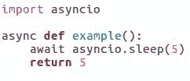

然而，一旦我们有了协程，我们并不能直接调用它来启动它。如果我们尝试调用它，它将立即返回一个`coroutine`对象，如下面的代码示例所示——这并没有什么用处：

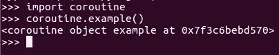

相反，我们需要将协程添加到 asyncio 的调度器中作为一个新的任务。接下来，调度器安排协程执行和处理输入输出事件。

# asyncio 调度器 - 事件循环

`asyncio`包自动创建一个默认的调度器，也称为`event_loop`。

虽然可以创建新的 `event_loop` 对象或替换默认的，但就我们的目的而言，默认的 `event_loop` 调度器将完全足够。我们可以通过调用 asyncio 的 `get_event_loop` 函数来获取它的引用，告诉调度器我们想要它启动一个新任务，如下所示：

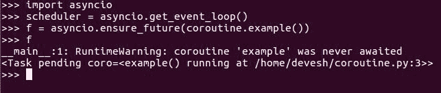

当我们运行前面的协程时，我们调用 asyncio 的 `ensure_future` 函数。默认情况下，这将创建一个任务在默认调度器中。

# ensure_future

我们还可以通过将显式的 `event_loop` 调度器传递给 `ensure_future` 函数的 `loop` 关键字参数来覆盖默认调度器。

```py
f = asyncio.ensure_future(coroutine.example(),  loop = scheduler)

```

注意，我们并没有仅仅将 `coroutine` 函数传递给 `ensure_future`；我们实际上在 `ensure_future` 参数内部调用了它。我们这样做是因为 `ensure_future` 函数实际上并不想引用 `coroutine` 函数。`ensure_future` 函数只对我们在之前看到的 `coroutine` 函数返回的 `coroutine` 对象感兴趣。`ensure_future` 这个名字可能有些奇怪。如果它用于启动任务，为什么叫这个名字呢？

实际上，启动任务基本上只是函数概念上所做事情的一个副作用，即**包装**。如果需要，将函数的参数包装在未来的对象中。碰巧的是，如果协程从未被安排运行，那么为协程的返回值拥有一个未来对象将毫无用处；`ensure_future` 确保了这一点。

`ensure_future` 函数无论在普通代码中还是在协程内部调用，都会向调度器添加一个新任务。这意味着每次我们想要代码在自己的执行流中运行时，我们都可以使用 `ensure_future` 来启动它。

即使在先前的代码示例中，我们添加了一个协程到调度器作为一个新任务，也没有发生任何事情。这是因为调度器本身还没有运行。然而，这是一个容易解决的问题。我们只需要调用 `run_forever` 或 `run_until_complete` 方法之一。最终，我们的协程将实际执行，如下所示：

```py
scheduler.run_until_complete(f)
5

```

# `run_forever`/`run_until_complete` 方法

如其名所示，`run_forever` 使得 `event_loop` 永远运行或至少直到它被显式地通过调用其 `stop` 方法停止。另一方面，`run_until_complete` 方法使得循环继续运行，直到特定的未来对象准备好提供一个值（参考以下代码示例）：

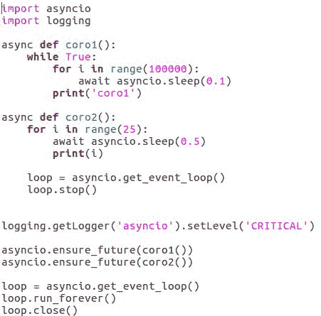

`ensure_future` 的返回值是一个 future 对象，因此你可以轻松地运行调度器，直到特定任务完成。前面的代码示例在同一个调度器中将两个协程作为两个单独的任务同时运行。`coro1()` 协程包含一个无限循环，所以它永远不会完成；然而，`coro2()` 协程不仅完成，还导致 `event_loop` 停止方法（`loop.stop ()`）最终强制 `run_forever` 终止。这将在以下代码示例中显示：

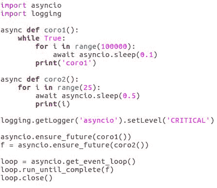

上述例子行为完全相同，只是它使用 `run_until_complete` 自动在 `coro2` 完成后停止调度器，而不是显式调用 `stop`。

代码看起来这样更整洁。所以，作为一个经验法则，可能最好只在出现某种错误，需要从 `event_loop` 中退出时才使用 `stop`。在我们刚刚看到的两个例子中，都有一行代码将日志级别设置为关键。这是因为如果 `event_loop` 在有任务（如 `coro1`）仍在运行时被停止，它会发出错误信息。在这种情况下，我们知道它仍在运行，我们并不关心，所以我们抑制了消息。

通常，最好安排所有运行的任务干净地退出，而不是简单地杀死它们。这就是为什么打印出错误信息。但是，在我们的情况下，没有问题，所以我们只是阻止消息打印。

无论我们如何选择运行和停止 `event_loop`，一旦我们完全完成它，我们应该调用它的 `close` 方法。它会关闭 `event_loop` 管理的任何打开的文件、网络套接字和其他 I/O 通道，并通常自行清理。

# 关闭 event_loop

关闭 `event_loop` 的一个好方法是使用 `contextlib.closing` 上下文管理器，它保证一旦 `with` 块结束，就会调用 `close` 方法。以下代码示例显示了 `event_loop` 的关闭：


即使在错误情况下，当我们完全完成 `event_loop` 时，也应该调用 `close` 方法，但这并不一定意味着应该在 `run_forever` 或 `run_until_complete` 调用完成后立即调用。在那个点上，`event_loop` 仍然处于有效状态，例如添加一些新任务或再次启动循环是完全正常的。

你可能已经注意到了，`asyncio event_loop` 对象基本上与 `concurrent.futures executor` 对象扮演相同的角色。从编程接口的角度来看，这并不是唯一的相似之处。

# 等待数据可用

asyncio 的 future 对象看起来和表现几乎与`concurrent.futures` future 对象相同，但它们不是可互换的。它们在行为上有细微的差异，当然，在它们与底层系统的交互方式上有重大差异，这些系统是完全不同的。尽管如此，每个 future 都是引用可能尚未计算出的值的途径，如果需要，等待该值变得可用的途径。

# asyncio 的 future 对象

future 对象最常用的功能是等待其值确定，然后检索它。对于 asyncio 的 future 对象，这可以通过简单地等待 future 来实现，如下面的代码示例所示：


这将告诉调度器暂停协程，直到 future 的值变得可用，之后 future 的值在协程中作为`await`表达式的结果被设置。

如果 future 表示一个抛出的异常而不是值，那么这个异常将从`await`表达式中再次抛出，如前面的代码示例所示。如果我们不想等待，我们可以调用`done`方法来检查 future 是否已准备好；如果是，我们可以调用`result`方法来检索值。

因此，语法和语义略有不同，但 asyncio 和`concurrent.futures`中 future 的基本思想是相同的。当我们使用 asyncio 时，我们在所有相同的地方使用 future 对象，就像在`concurrent.futures`中一样。

有一种情况，即使使用 future 对象，等待数据也并不简单；这就是当我们应该处理到达的数据流时，如下所示：

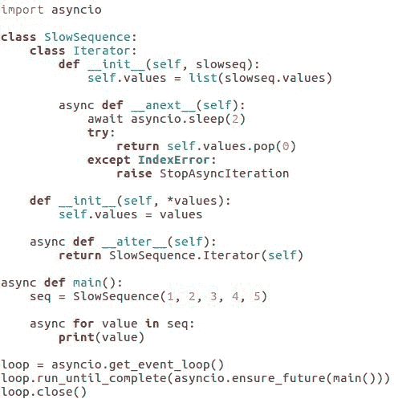

当然，我们可以遍历 future 对象的迭代器并等待每个对象准备好提供它们的值，但这很笨拙，并且存在关于何时停止迭代的问题。

相反，Python 为我们提供了一个异步迭代协议，允许我们将获取下一个值函数作为一个协程来编写或获取。这意味着迭代器可以等待每个值到达，然后简单地返回它。现在我们的循环将正常工作，我们将避免所有关于何时停止的困惑。

# 异步迭代

为什么我们需要为循环语句和单独的异步迭代协议提供特殊的异步迭代？

这是因为异步迭代只适用于协程内部。有一个单独的循环语句和协议可以防止我们陷入模糊的情况，在这种情况下，计算机不确定我们想要它做什么。

# 同步多个任务

在本节中，我们将探讨更多在任务之间共享数据以及同步它们操作的方法。

# 同步原语

`asyncio` 包提供了 `lock`、`semaphore`、`event` 和 `condition` 类，它们与我们在 `concurrent.futures` 上下文中查看的类非常相似。它们提供相同的方法名称并履行相同的角色。重要的区别是，对于 asyncio 的版本，其中一些方法是协程，而另一些则不是，如下所示：

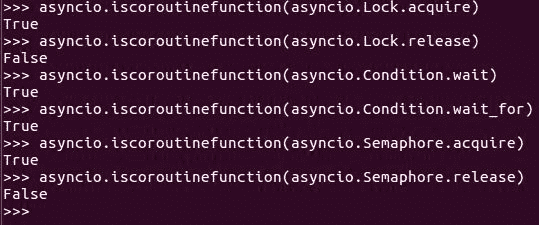

具体来说，在每种情况下，如果存在，`acquire` 和 `wait` 方法都是必须通过 `await` 调用的协程。

这是因为它们需要能够暂停直到某些特定的事情发生，而只有协程可以暂停并将控制权交给调度器。提到锁和其他类后，我想指出，虽然它们有时是必要的，但在 asyncio 中比在 `concurrent.futures` 或其他提供多个执行流系统的场景中需要的频率要低。

这是因为 asyncio 的调度是合作的。只有在执行流和 `await` 表达式之间切换时才有可能，这意味着如果在代码的临界部分没有 `await` 表达式，它就不能被中断。

没有其他任务可以在同一时间修改相同的数据，因为没有其他任务有机会在那时运行任何代码。此外，Lock 和其他类仅在代码的临界部分确实至少使用一次 `await` 时才需要。

我们在上一章讨论 `concurrent.futures` 时已经见过 `as_completed` 和 `wait` 函数。asyncio 的版本是协程，因为它们也需要挂起直到继续执行的时间，但我们在使用它们的方式上并没有太大的区别。

# 等待协程

等待协程仍然会等待一组未来任务以可选的超时结束，并返回一个已准备好的未来任务列表和一个在超时时刻尚未准备好的未来任务列表。`as_completed` 函数仍然接受一个未来任务列表，并按结果可用顺序产生结果的未来任务。然后，我们通过等待从未来任务中提取实际值，我们就准备好了。

如以下代码示例所示，无法预测结果将按何种顺序可用；然而，每次有值可用时，它都会被打印出来：

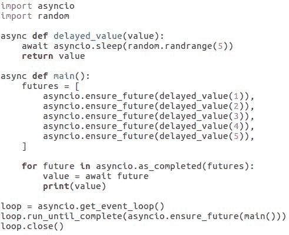

asyncio 提供了一些其他有趣的协程来从未来任务中收集数据，特别是：`wait_for` 和 `gather`。

# `wait_for` 协程

`wait_for` 协程允许我们等待另一个协程完成，但带有超时。以下代码示例中的前两个协程做的是同样的事情，只不过如果 `foo` 在 `5` 秒内没有完成，第二个版本将引发 asyncio 超时错误：

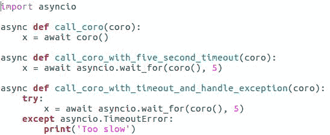

在第三个代码块中，我们仍在做同样的事情，只不过如果 `foo` 超时，我们会打印一条消息。然后，还有 `gather` 协程。

# `gather` 协程

`gather` 协程所做的是，它接受一系列未来，并将它们转换成一个单一的未来，当所有子未来都完成时，这个未来将完成，并且子未来的结果将作为子未来结果列表中的结果，如下面的代码示例所示：

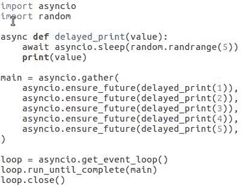

这样的事情有很多用途，但我们可以用它来构建传递给 `run_until_complete` 的未来，这是一件非常棒的事情。

实际上，我们是在告诉 asyncio 它应该运行，直到所有这些未来都完成。未来非常适合在任务之间传递一次性值，而事件对象非常适合发送简单的信号。然而，有时我们想要一个功能齐全的通信通道。幸运的是，asyncio 为我们提供了 `Queue` 类及其一些基于它的变体。

# asyncio 队列类

asyncio 的 `Queue` 具有作为协程的 `put` 和 `get` 方法。因此，我们需要用 `await` 调用它们，并且我们必须已经在协程中调用它们，除非我们实际上使用 `ensure_future` 函数将它们作为单独的任务启动，如下面的 `Queue` 类代码示例所示：

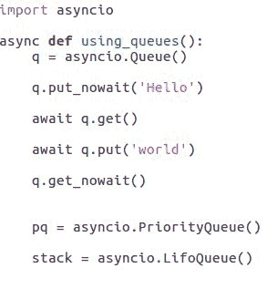

然而，`Queue` 类也有名为 `put_nowait` 和 `get_nowait` 的方法，它们不是协程，可以从任何地方调用。这使得 `Queue` 类对于将新数据传达给协程系统以及协程任务之间的数据传输非常有用。

# 队列类型

asyncio 提供了几种变体的 `Queue` 类型，它们以不同的顺序返回它们存储的值。

当我们调用 `get` 或 `get_nowait` 时，`PriorityQueue` 的实例会根据小于比较返回它们包含的最小对象。所以，如果我们的优先级队列包含 `34`、`2`、`5` 和 `97`，调用它的 get 协程将返回 `2`。下一次，它将返回 `5`，然后是 `34`，最后是 `97`。

另一方面，`LifoQueue` 方法总是返回最近添加的对象。换句话说，它是一个栈数据结构。asyncio 也提供了一个可连接的 `Queue` 类，它增加了一个额外的连接协程和一个名为 `task_done` 的方法。通过一点额外的工作，使用可连接的队列可以让协程暂停并等待直到队列被清空。

# 网络通信

因此，我们已经介绍了 asyncio 的工作原理以及一些可以用来管理多代码流执行的工具。这些都很好，但用 asyncio 做一些实际的 I/O 呢？

人们使用异步 I/O 的主要动机是因为它在编写网络客户端和服务器时很有帮助，尽管这当然不是唯一可能的用途。所以，asyncio 不仅使网络通信高效，而且使它们变得简单。

# 在 asyncio 中创建一个简单的客户端

这里，我们有简单客户端-服务器程序对的代码（参考下面的代码示例）：

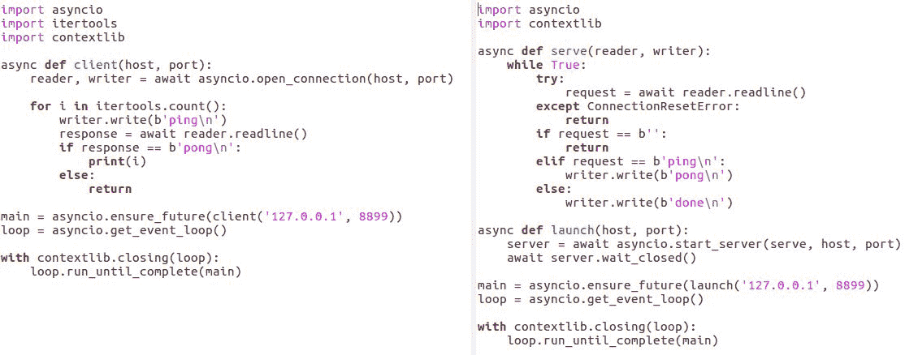

它们不仅一次又一次地读取和写入相同的几个字节，而且还有助于展示通过网络进行通信所需的一切。

关于客户端的信息将很少神秘。

运行以下命令：

```py
python3 client.py

```

它只运行一个任务，该任务使用 asyncio 的高级 API 打开一个连接，然后通过它发送和接收数据。数据只是一串数字，如下所示：


# 在 asyncio 中创建一个简单的服务器

服务器可以同时处理来自许多客户端的连接，因为我们调用的`start_server`协程每次有客户端连接到服务器时都会启动一个新的任务来运行`start_serve`协程。

每个任务负责处理单个客户端的连接，因此服务器协程几乎和客户端协程一样简单。

有一些额外的代码来处理连接重置错误，这是当客户端在服务器试图从它读取数据时突然断开连接时引发的异常，还有一些额外的代码来处理请求是空字符串的类，readline 协程只能在客户端以不那么突然的方式关闭连接时产生。

# 处理客户端断开连接

在这两种情况下，我们希望服务器停止关注特定的客户端，我们可以简单地通过从客户端处理协程中返回来实现。运行协程的任务完成，事情就这样了。

在服务器上启动的协程中，我们调用了另一个名为`wait_closed`的协程。这基本上就是它所说的那样——等待服务器关闭。如果没有这个调用，我们启动的协程将立即终止，由于我们使用了`run_until_complete`，整个程序将在之后立即终止。

这将发生是因为`start_server`启动了一个后台任务然后返回，而不是直接管理服务器，这就是全部。

asyncio 提供了一个更低级的通信 API，但在绝大多数情况下，这个低级 API 是不必要的。asyncio 使网络通信变得简单。

# 摘要

在本章的早期部分，我们学习了关于协程、协程任务之间的数据交换和异步操作的内容。我们查看了一下如何使用 future 等待单个值或异步迭代器，这些迭代器可能内部使用 future 等待一系列值。我们还查看了一些我们可以用来向异步协程任务发送和接收数据并在必要时对它们进行同步的工具。

现在我们已经看到了如何使用这些工具从协程和异步操作中获得回报来编写网络客户端或服务器。在下一章中，我们将探讨 Python 程序源代码中可以重新定义的各个部分以及如何使用它们。
