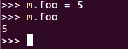
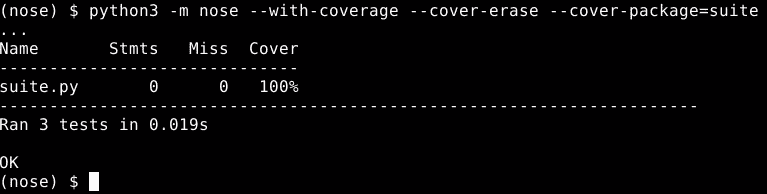
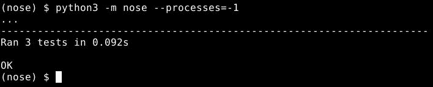

# 第九章：单元测试

在上一章中，我们看到了 Python 中元编程和可编程语法的各种方法。在这一章中，我们将探讨单元测试背后的理念，然后转向我们可以使用的一些测试自动化工具，使我们的测试更容易、更有用。我们将关注单元测试是什么，以及推动它的理念。我们还将讨论 Python 的标准`unittest`包及其工作原理。

最后，你将学习如何使用`unittest.mock`来控制测试代码运行的 环境，以确保测试能够专注于确保一件事情正常工作。

在本章中，我们将涵盖以下主题：

+   理解单元测试的原则

+   使用 unittest 包

+   使用 unittest.mock

+   使用 unittest 的测试发现

+   使用 nose 进行统一的测试发现和报告

# 理解单元测试的原则

测试通常是程序员事后才考虑的事情，因为它往往既费力又令人烦恼。此外，我们通常对自己的工作有很高的信心，测试似乎是不必要的。然而，这也是一个事实，即这种信心往往被误放。源代码是一种复杂而微妙的语言，在编写它时很容易出错，甚至没有注意到。我们从经验中都知道这一点，但这并不使为这种费力、令人烦恼且感觉不必要的事情腾出时间变得容易。以下流程图说明了测试的简单示例：


因此，关于测试的第一个问题是，*我们如何以不感觉像是一种痛苦的浪费时间的方式来进行测试？* 找到克服这种心理障碍的方法是创建一种对许多程序员真正有效的测试方法的第一步。单元测试通过减少运行测试所需的努力，将测试与开发过程集成，并使测试本身变得明显有用来实现这一点。

# 什么是单元测试？

首先，让我们弄清楚什么是单元测试。**单元测试**是一小段测试代码，它测试一个隔离的小块程序代码中的正确行为或单个特定的缺陷。

每个定义部分都有原因。单元测试是源代码，因为单元测试的一个秘密是我们将尽可能多的测试努力放在计算机上，这是它应该属于的地方。

测试代码告诉计算机如何执行测试，这使得我们能够经常且容易地执行测试。单元测试之所以小，是因为大测试几乎不可避免地会测试多个事物。

这可以总结为：

+   简单、简单的代码

+   检查程序的一小部分

+   回答关于程序功能的一个是或否问题

如果我们要测试多个事物，我们应该编写多个测试。

单元测试有两个规则。这些是：

+   单元测试只检查程序代码的一个方面，因为当测试失败时，我们希望它能确切地告诉我们问题是什么。

+   单元测试只涉及程序代码的一个狭窄区域，因为当测试失败时，我们希望它能确切地告诉我们问题所在。

如果我们编写了一组遵循这些规则的测试，它们就被称为**单元测试套件**。

使用适当的工具，我们可以用单个命令运行整个测试套件，这个命令的输出将立即告诉我们代码相对于测试的状态。如果测试失败，它会告诉我们接下来需要做什么。如果测试成功，它给了我们一个理由来增强我们对测试代码的信心。

自动化单元测试的可用性导致了一种称为**测试驱动开发**（**TDD**）的编程范式，如下面的图示所示：


TDD 的基本思想是，由于失败的测试告诉我们下一步该做什么，因此我们不应该在除了想要让失败的测试通过之外的情况下编写程序代码。如果所有当前可用的测试都通过了，而程序还没有完成，我们首先向测试套件中添加另一个测试，然后编写程序代码使其通过。

以这种方式做事可以确保有测试覆盖了大部分或所有源代码，并且测试经常运行，这使得错误和回归很难在不被注意的情况下悄悄进入代码。这也让我们可以将开发过程分解成一系列短期目标，当我们实现这些目标时，会产生明显的成果。

这在心理上是有益的，因为它使编程过程感觉更有成效，而且执行感觉有回报的任务要容易得多。此外，调试往往占据项目所需的大部分时间，而 TDD 减少了处理错误所需的时间。

因此，当正确应用时，单元测试的原则和工具帮助我们产生更好的代码，更快地执行测试，并享受这个过程。这是一个全面的胜利。

到目前为止，我们已经讨论了自动化单元测试和 TDD 的原因和好处。Python 包含了一个自动化单元测试的框架，我们将在下一节中对其进行探讨。

# 使用 unittest 包

在本节中，我们将探讨 Python 的标准`unittest`包。我们将讨论如何构建测试文件，如何编写测试，以及在这些测试中实际发生的情况与应该发生的情况之间的比较。让我们直接进入正题！

# 构建测试文件

unittest 模块包含了一个执行自动化单元测试的框架。大部分功能都是围绕`unittest.TestCase`类构建的，我们将从这个类继承以创建自己的测试。

在以下示例中，我们可以看到`TestCase`的基本功能在实际操作中的表现，以及测试和断言方法：


我们使用从`TestCase`类继承的类定义的任何方法，并且其名称以单词**test**开头，都被假定为单元测试。在先前的例子中，这意味着`test_addition`方法是一个单元测试；然而，如果我们向类中添加另一个名为`connect`的方法，unittest 模块不会将其视为单元测试。

`TestCase`类可以包含多个单元测试，并且应该在那些测试在逻辑上相关且需要相同的运行环境时运行。

# assert 方法

在我们的单元测试`test_addition`方法中，我们使用了一个名为`assertEqual`的方法来实际检查代码的结果是否符合预期。`TestCase`提供了一系列这些 assert 方法，用于测试我们的结果和预期之间的各种关系。这在下述代码示例中显示：


让我们更仔细地看看这些 assert 方法实际上做了什么：

+   我们已经在之前的代码示例中看到了`assertEqual`方法；它检查两个值是否相等，如果不相等则使测试失败。`assertNotEqual`方法执行相反的操作，检查两个值是否相等，如果相等则使测试失败。

+   `assertAlmostEqual`和`assertNotAlmostEqual`方法用于浮点数。

计算机处理浮点数的方式表明，本应完全相等的数字实际上在最低有效位上有所不同。例如，如果我们平方七的平方根，结果不是正好七，所以`assertEqual`会将其视为*不相等*。然而，`assertAlmostEqual`会认识到这两个数字在实用目的上是相同的。

+   `assertGreaterEqual`、`assertLess`和`assertLessEqual`方法检查它们参数之间的顺序关系。

+   `assertIs`和`assertIsNot`方法检查它们的参数是否是相同对象的引用。

+   `assertIsNone`和`assertIsNotNone`方法是`assertIs`和`assertIsNot`方法的特例，并检查它们的单个参数是否实际上是`None`。

+   `assertIsInstance`和`assertIsNotInstance`方法检查第一个参数中的对象是否是其第二个参数中类型的实例。

+   `assertIn`和`assertNotIn`检查第一个参数中的对象是否是第二个参数中容器的一个成员。

+   `assertCountEqual`方法很有趣。如果我们想检查两个序列是否相同，我们可以直接使用`assertEqual`，但`assertCountEqual`是在我们想检查两个序列包含相同的值但不在乎顺序时使用的。

如果任一序列中的任何成员在另一个序列中出现的次数不同，该方法将导致测试失败。因此，如果`a`在第一个序列中出现两次，它必须在第二个序列中也出现两次，但我们不在乎它在哪。

+   最后，我们有`assertRaises`，它的工作方式略有不同，因为它需要捕获运行某些代码时抛出的异常。这是一个非常适合上下文管理器的情况，这就是`assertRaises`的作用。

在`with`语句中使用，如果`with`块内的代码没有抛出预期的异常，`assertRaises`会使测试失败。这看起来可能有些反直觉，但这是正确的。如果预期的异常没有被抛出，测试就会失败。有时抛出异常是正确的行为。例如，将`None`传递给构造函数的末尾应该抛出一个类型错误，如果没有抛出，那就是一个错误。

# 比较单元测试中发生的情况和应该发生的情况

我顺便提了一下，一个`TestCase`类中的所有单元测试都应该共享相同的操作环境。这意味着什么？

这意味着它们中的每一个都期望它们访问的任何外部数据都处于相同的状态。例如，每个测试都访问一个特定的文件，并且每个测试都期望在文件中找到相同的信息。

让我们看看一个代码示例：


在前面的示例中，我们有两个测试，它们都在同一个文本文件中读写。它们都期望在开始运行时包含相同的具体信息。换句话说，它们对它们的操作环境有相同的期望。

当我们有多组具有相同期望且逻辑上相关的测试时，我们应该将它们组合成一个单独的`TestCase`类。然后，我们应该给这个类提供一个`setUp`方法，该方法是负责确保这些共享期望得到满足的，可能还有一个`tearDown`方法，该方法是清理`setup`可能做出的任何更改或测试留下的任何更改。

类的名称本身并不重要；仅仅从`TestCase`继承就足以识别它们。

`setUp`方法在`TestCase`中的每个单元测试之前运行。因此，在我们的代码示例中，它有两个单元测试，`setUp`运行两次。同样，`tearDown`在每个单元测试之后运行。这样，一个测试可能对操作环境所做的更改在下一个测试运行之前就会被清除。

在`TestCase`中的每个单元测试的起始环境都是相同的。因此，这就是 Python 单元测试框架在编写测试方面的基本机制。

要运行测试，我们只需要从命令行调用`unittest`包。我们告诉它我们想要从中运行测试的模块的名称，它会找到该模块中的`TestCase`类，创建它们的实例，运行所有测试，并给我们一个报告，告诉我们哪些测试通过了，哪些失败了。

在本节中，我们看到了如何编写基本的单元测试并运行它们。还有更简单的方式来运行测试，但我们在检查单元测试模拟对象之后会讨论它们。

# 使用 unittest.mock

在本节中，我们将探讨一个单元测试子包，称为**mock**。`mock`包中的工具帮助我们保持测试的隔离性，因此它们不是基于代码的行为来成功或失败，而这些代码本不应该被测试覆盖。

我们讨论了单元测试只与一小部分代码交互的重要性，但当我们有这么多代码与来自整个源树的代码和函数交互时，我们如何安排这种情况？一个答案是我们可以用模拟对象替换那些对象和函数。

# 什么是模拟对象？

模拟对象是一段巧妙的代码；它可以假装成几乎任何类型的对象或函数，但它不会执行原始对象所做的任何事情，而是记录与之交互的内容，以便我们稍后进行检查。让我们暂时玩一下模拟对象，以了解它们：


参考前面的截图。我们可以访问模拟对象的几乎所有属性，而无需事先定义它。结果是另一个模拟对象。同样，我们可以调用几乎任何我们想要的方法，而无需事先定义它，结果是另一个模拟对象，如下所示：


仅此一项就足以让模拟对象替代我们测试代码可能与之交互的大量函数和对象。但是，如果我们花时间预先配置我们的模拟对象，我们还可以更进一步。

# 预配置模拟对象

我们可以将非模拟对象分配给模拟对象的属性，这样当我们访问属性时，我们会得到一个特定的值，而不是一个通用的模拟对象。以下简单的代码示例说明了这一点：



我们还可以将自定义的模拟对象分配给方法，这样我们就可以使模拟方法更像原始方法，但以某种方式，这是由测试控制的。我们通过将返回值参数传递给`mock`构造函数来实现这一点，这告诉模拟对象每次被调用时都应该返回这个值，如下面的代码示例所示：


如果我们希望模拟每次调用时返回不同的值，我们使用构造函数的另一个参数，称为`side_effect`，如下所示：


我们必须知道测试将多少次将模拟对象作为函数调用，这样我们才能为每次调用提供返回值；否则，这不会构成困难。

我们还可以通过传递异常作为`side_effect`或`side_effect`序列的成员来使模拟对象引发异常，如下面的代码示例所示：


这基本上涵盖了如何创建一个模拟对象，在测试运行期间，以受控的方式代替真实对象和代码。然而，为了真正支持测试，我们还需要能够检查模拟对象并确认它是否按预期使用。

# 模拟对象的断言方法

我们已经看到了模拟对象使用的`method_calls`属性，用于跟踪它们的交互，但模拟对象也有它们自己的断言方法，通常比直接访问方法调用列表更容易使用。

最有用的模拟对象断言方法是`assert_called_with`（请参考以下代码示例）：


它检查最近对模拟对象的调用是否使用了指定的参数，以及`assert_any_call`，它检查模拟对象是否曾经使用指定的参数被调用。

因此，我们知道模拟对象的作用，如何创建它们，以及如何检查对它们的操作记录。这足以用模拟对象替换测试函数的参数。

我们甚至可以通过类而不是真实实例来调用方法，从而替换方法的`self`参数：


# unittest.mock 的 patch 函数

然而，当我们测试的代码自动向系统发出请求并访问我们想要用模拟对象替换的内容时，我们该怎么办呢？例如，如果我们正在测试的代码调用了`time.time`，那会怎样？这就是`unittest.mock`中的`patch`函数发挥作用的地方。

`patch`函数是一个上下文管理器，它可以临时用模拟对象替换任何包或模块中的任何对象。一旦退出 with 块，真实对象就会恢复到其位置，如下面的代码示例所示：


需要注意的是，patch 不会替换对目标对象的每个引用，它只替换我们在第一个参数中指定的单个引用。

在前面的示例中，任何通过在`time`模块中查找引用来访问时间函数的代码都将得到我们的模拟对象；然而，如果有任何代码使用了`from time import time`来创建对`time`函数的局部引用，那么这个引用仍然会指向真实的时间函数。如果我们想为有局部引用的代码修补时间函数，我们需要将那个局部引用的路径传递给 patch。

好的，我们现在对模拟对象已经相当熟悉了。这意味着我们知道我们需要的一切来轻松编写强大的测试。我们剩下要做的就是找出如何运行我们的测试套件，这是我们下一个话题。

# 使用 unittest 的测试发现

在本节中，我们将探讨`unittest`包使用单个命令同时运行多个测试的能力。

我们已经看到了如何轻松地运行特定文件中的所有测试，但对于大型项目来说，将所有测试放入单个文件中将会很麻烦。它们需要根据逻辑分组分离到不同的文件中，否则测试套件将变得难以管理。另一方面，如果我们需要手动告诉 unittests 运行测试和一大堆文件，这将是一件痛苦的事情。

幸运的是，我们可以将测试套件拆分成多个文件，同时仍然可以通过简单的命令来运行它们，如下面的代码所示：


我们使用支持测试发现的单元测试工具。这基本上意味着它会查看可用的文件，并自行决定哪些看起来像测试文件；然后它从这些文件中加载测试并运行。

# Unittest 的发现工具

`unittest` 包有一个基本但有用的内置测试发现工具。当我们运行 `python -m unittest discover` 时，它会搜索当前目录中的 Python S，其名称以单词 `test` 开头。此外，它还会递归地对包含 `init.py` 文件的任何子目录执行相同的扫描。一旦收集到所有匹配模块的名称，它就会像我们自己在命令行上指定模块一样运行测试。这可以通过以下代码示例来说明：


# 单元测试发现中的命令行选项

我们可以使用一些命令行选项来调整单元测试发现的行为。第一个，我们在之前的代码示例中看到了，是 `-v` 开关。此开关使得测试报告更加详细。我们在之前的代码中使用它，以便可以看到发现是否正常工作。

我们还可以使用 `-p` 命令行选项（如下面的代码示例所示）来更改用于识别测试文件的模式：


在这里，我们将其修改为将以单词 `one.py` 结尾的文件识别为测试文件。

unittest discover 代码还识别 `-s` 来指定测试搜索应该开始的目录。这如下面的代码示例所示：


注意，通过使套件作为搜索的起始目录，我们阻止了它被识别为包含测试的包。如果这成问题，我们可以通过添加 `-t` 选项来补充 `-s` 选项（参考以下代码示例），这会告诉你在哪里找到此运行的顶层目录：


使用 `-s` 和 `-t` 两个选项，我们能够将测试搜索缩小到特定的子目录，同时仍然在父目录的上下文中运行测试。

在使用单元测试发现代码或任何通过导入模块来检查是否包含测试的其他测试发现时，需要注意一些陷阱。这个陷阱是模块被导入。

大多数情况下，这不会成为问题，但如果一段测试发现代码导入了本应作为程序入口点的模块，它可能会实际运行程序，这不是我们期望的行为。当我们编写入口点时，通过将入口点代码包裹在`if '__name__' == '__main__'`语句中，很容易避免这个问题。

然而，如果我们或其他人跳过了这个检查，而单元测试认为文件看起来像是一个测试文件，运行单元测试发现代码将会得到令人惊讶的结果。这就是关于 unittest 测试发现工具的所有内容。它没有很多功能，但它确实拥有大家需要的功能，而且有很大可能性，对于我们的大多数项目来说，这已经足够了。

对于我们需要从测试发现工具中获得更多功能的情况，我们可以使用`nose`，我们将在下一节中探讨。

# 使用 nose 进行统一的测试发现和报告

注意，`nose`是一个通过`pip`和 Python 包索引提供的第三方工具。它基本上与 unittest 的`discover`命令做相同的工作，但它提供了更多的控制和定制，以及识别更广泛的测试。可以使用以下命令行安装：

```py
python3 -m pip install nose

```

********

# 使用 nose 运行我们的测试

我们将探讨 nose 提供的众多功能中的两个特定功能。这些是：

+   它可以生成一个代码覆盖率报告，告诉我们我们的测试实际上测试了多少代码

+   它可以在多个进程中运行测试，允许它们在多个 CPU 上并行执行

为了获取覆盖率报告，我们首先需要确保覆盖率模块已安装。我们可以使用简单的`pip`命令来完成，如下所示：

```py
python3 -m pip install coverage

```

********

一旦我们有了`coverage`模块，我们只需使用几个 nose 的命令行选项，就可以为我们的测试启用覆盖率报告。

严格来说，只需要`--with-coverage`选项来启用覆盖率报告，如下面的代码示例所示：


然而，如果我们没有包括`--cover-erase`，之前的测试运行中的覆盖率数据将与当前的运行混合，这将使结果更难解释。

# cover-package 选项

有一个与覆盖率相关的命令行选项有时很有用。它是`cover-package`选项；它将代码覆盖率报告限制为仅针对特定包，如下面的代码示例所示：



以这种方式聚焦报告可以使阅读和提取有用信息变得更容易。

# 测试多个工作进程

我们将要探讨的另一个 nose 功能是能够将测试分配给多个工作进程，并将它们分散到可用的 CPU 核心上。要测试多个工作进程，我们只需提供`--processes=`命令行选项，并告诉它要使用多少个进程。如果我们传递`-1`来表示进程数，它将使用检测到的 CPU 核心数，这可能是我们想要的（参考以下代码示例）：



因此，除非我们有特定的理由要这样做，否则我们应该始终只使用`-1`。

如果我们仔细观察前面的代码示例，我们可以看到在多个进程中运行我们的测试套件实际上花费了更长的时间。这是因为执行测试本身涉及到的努力很小，但当涉及到启动工作进程时，情况就不同了。幸运的是，这是一个固定成本，所以当我们开始运行包含更多昂贵测试的大型测试套件时，我们开始看到并行执行的好处。

这只是对 nose 支持的功能类型的一个尝鲜，而且这还不包括我们编写自己的 nose 插件来进一步定制它的情况。这是一个非常强大的系统，所以如果我们发现自己需要测试运行器中的特定功能，一个好的第一步是看看 nose 是否已经具备该功能。

# 摘要

在本章中，我们学习了如何使用`unittest`和`unittest.mock`包来编写自动化测试；我们还学习了测试驱动开发的过程。接下来，我们看到了如何使用`unittest.mock`来控制测试代码运行的环境，以便测试可以保持专注于确保某件事正确工作。在此之后，我们学习了如何使用 Python 内置的单元测试工具运行测试，最后，我们讨论了如何利用 nose 测试运行器的几个功能。

在下一章中，我们将探讨响应式编程范式和 RxPY。
