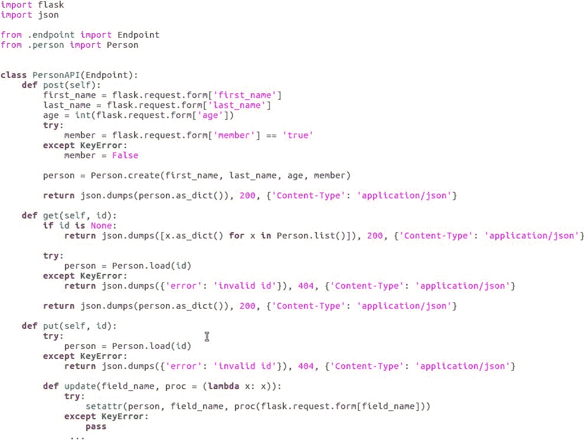

# 微服务

在上一章中，我们探讨了响应式编程和 ReactiveX 框架。在本章中，我们将探讨什么是微服务，为什么我们可能想要将我们的程序结构化为微服务，以及如何使用一些常见的 Python 工具来创建它们。你将学习如何使用 Flask 包快速轻松地构建一个使用 HTTP 和**表示状态传输**（**REST**）来提供其接口的微服务。我们还将探讨使用 nameko 包来创建使用远程过程调用而不是 HTTP 方法进行通信的微服务。

在本章中，我们将涵盖以下主题：

+   微服务与进程隔离的优势

+   使用 Flask 构建高级微服务

+   使用 nameko 构建高级微服务

# 微服务与进程隔离的优势

在本节中，我们将从概念角度探讨微服务。当我们需要一个项目的新功能时，有一种诱惑就是直接将其添加到项目的主程序中并继续下去。有时，这样做是完全合适的，但在许多情况下，实际上更好的做法是将该功能作为一个独立的程序。

# 微服务架构的优势

有几个原因说明为什么一个功能在系统集成不那么紧密时可能更好。其中最重要的原因是**灵活性**、**可伸缩性**和**耐久性**。

理解灵活性优势很容易。模块化程序本质上由许多模块组成，我们可以在未来重用它们。因此，每次我们将代码编写为具有良好定义接口的独立模块时，我们都在进行一项投资，这将使它更容易适应未来的变化。

当我们的模块实际上是单独的进程时，可伸缩性的优势就会发挥作用，允许在多个处理器上运行单独的实例，并在它们之间进行负载均衡。

当模块是进程时，耐久性的优势也发挥作用，因为进程大多可以免受其他进程中出现的问题的影响，也因为一个失败的进程通常可以在不需要关闭整个系统的情况下重新启动。

# 将微服务架构应用于 Web 服务器

灵活性、可伸缩性和耐久性是推动 20 世纪 80 年代微内核操作系统发展的相同优势，但术语微服务（参见图）具体指的是将它们应用于 Web 应用程序：


这意味着我们不会编写一个处理我们 Web 应用程序所有逻辑的服务器程序，而是编写一个或多个服务器，它们处理大部分前端工作，并调用一些不同的专用服务器来处理所有后端工作以及前端剩余的部分。

每个专用服务器都应该尽可能做好一个明确定义的工作，而不关心其他任何事情。这些专用服务器是微服务，采用微服务设计可以给我们带来更好的正常运行时间。正常运行时间让我们能够扩展到利用服务器农场或云托管系统，并帮助我们更快地适应不断变化的网络。

因此，为了总结，当我们的服务器实际上是一组服务器，每个服务器都有明确和狭窄的工作要做，并且只做那件事时，我们正在使用微服务架构。作为额外的优势，我们的微服务之间的接口构成了应用程序编程接口。因此，如果我们达到一个想要向世界公开 API 的位置，我们只需要调整我们的身份验证和授权代码，以及可能的路由器，以允许外部实体访问这些接口的一些接口。

# 使用 Flask 构建高级微服务

因此，我们已经了解了微服务是什么以及为什么将我们的服务器结构化为微服务集合是有帮助的。现在，让我们看看实际操作，并使用 Flask 构建一个功能性的微服务。

微服务可以很容易地分为那些使用 Web 技术（如 HTTP）相互通信的微服务，以及那些使用专用进程间通信或远程过程调用机制进行通信的微服务。

每种框架都有其优势，这取决于项目的具体需求，并且它们在本质上并不容易使用。然而，我将把使用 Web 技术进行通信的微服务称为*高级*，因为它们本质上更接近用户操作的水平。相反，我将把使用专用协议的微服务称为*低级*。在本节中，我们将探讨高级微服务，这些服务通常使用 HTTP 进行通信，并提供基于 REST 的编程接口。

使用无状态协议进行通信使得这些微服务易于负载均衡，也便于在维护时进行替换。对于这类微服务，我们可以使用 Python 的多个生产级 Web 应用程序框架或工具包，但我们将使用 Flask。

# 安装 Flask

Flask 专注于使编写 HTTP 请求处理程序变得容易，实际上并不做其他任何事情。这使得它非常适合编写处理少量特定请求的微服务，同时使用最少的资源。

Flask 不是 Python 标准库的一部分，但可以通过`pip`轻松安装，如下面的命令行所示：

```py
$python3 -m pip install flask

```

如往常一样，您可以在命令中添加`--user`以将 Flask 安装到您的个人 Python 包库中，或者如果您愿意，可以将其安装到虚拟环境中。

# 在 Flask 中创建 RESTful API 的端点

Flask 被设计用来通过**Web Server Gateway Interface**（**WSGI**）与前端 Web 服务器或代理进行接口交互，这是 Python Web 应用程序的标准。然而，在我们的简单演示中，我们只会使用其内置的开发服务器。那么，我们应该构建什么呢？

# 构建一个维护数据库的微服务

让我们构建一个维护有关人员信息的数据库的微服务——首先名字、姓氏、年龄，以及出于兴趣，他们是否是某个特定俱乐部的成员。

我们将使用 HTTP 的`POST`、`GET`、`PUT`和`DELETE`方法，允许微服务的客户端创建、访问、更新和从数据库中删除记录。此外，我们将以 JSON 格式提供数据，但使用正常的 HTTP 表单编码来接收输入。

这些选择都非常正常。唯一稍微不那么常见的选项是，我们还需要将传入的数据格式化为 JSON，我们可以通过在需要数据时调用 Flask 的`request.get_json`函数来满足这一需求。

那么，我们需要哪些样板代码才能让 Flask 微服务启动运行？实际上并不多。以下两个命令行就足以将 Flask 系统设置到位：

```py
import flask 
app = flask.Flask('Demo Flask') 

```

这些行实际上并没有做任何事情，除了对任何请求返回*404 Not Found*错误，但它们会响应。那么，我们如何让 Flask 处理请求呢？让我们看看。

# 让 Flask 处理请求

实际上，有两种方法可以让 Flask 处理请求：一种方法非常简单，另一种则更加灵活且封装得更好。

简单的方法是使用`@app.route`装饰器告诉 Flask，特定的函数将处理给定路径的请求，如下面的代码示例所示：

```py
@app.route('/example') 
def example(): 
  return "This is an example" 

```

除了让函数真正做一些有用的事情之外，这就足够了。

然而，对于我们的微服务，我们希望在同一路径上使用 HTTP 方法来产生不同的结果。我们可以使用`app.route`装饰器和函数中的多个`if`和`else if`块来处理这个问题，但有一个更好的方法，这将在以下代码示例中解释，你可以在下载包中的`endpoint.py`文件中找到：


Flask 支持可插拔视图类，并且特别有一个`MethodView`类，它为每个 HTTP 方法都有一个不同的处理函数，正如你在我们类中的前四个函数定义中可以看到的那样。适当的函数根据使用的 HTTP 方法处理每个请求。

这有一点复杂，因为我们并不总是想使用相同的路径。有时，我们想在路径中有一个对象`id`，有时则不需要。但这只是一个小的复杂问题，因为我们可以在多个不同的路径和方法组合上注册相同的可插拔视图，这正是`endpoint.py`中的`endpoint.register`函数所做的事情，正如你在代码示例中可以看到的那样。

`view`的每个注册都包含对`app.add_url_rule`的一个调用：

+   第一个注册了没有对象`id`的`GET`方法，并在调用`GET`函数时填充用于`id`参数的值。

+   第二个注册了没有`id`和默认值的`POST`方法，因为我们的`POST`函数根本不接受`id`参数。

+   第三个注册了当存在`id`参数时的`GET`、`PUT`和`DELETE`方法。

这些注册涵盖了 REST 单个编程接口端点常见的所有用例。

# 使用 Flask 运行和连接到我们的微服务

现在我们已经准备好了方法分发，那么我们如何组合实际处理人员对象的处理器呢？我们可以使用`service.py`文件中的以下代码来完成：



对于详细的代码，请参阅代码文件。

从前面的代码示例中，我们发现以下内容：

+   我们看到我们的`PersonAPI`类，它为我们在`person`数据库上想要启用的每个操作都有一个函数。

+   对于`POST`和`PUT`函数，我们使用`request.form`对象从请求中获取数据，这是一个类似于字典的对象，包含从请求体中解码的数据。

这看起来似乎不是线程安全的，但实际上它是。Flask 中的所有内容都是多线程和多进程安全的；它只是被一个简化语义层所包装，模拟了一个单线程单进程系统。

+   `POST`函数没有处理缺失数据的代码，除了成员值。这是因为如果我们尝试从`request.form`访问缺失的值，将引发异常，导致 Flask 返回一个*400 Bad Request*错误，这正是这种情况下的正确做法。

+   另一方面，`PUT`函数会自行处理这些异常，因此它可以决定哪些值需要更新，哪些可以保持不变。

+   `GET`函数可能被一个整数`id`或`None`作为`id`参数调用，并需要处理这两种情况。这可以通过一个`if`语句轻松完成。

+   在`id`参数是数字的情况下，`GET`函数应该返回具有该`id`参数的对象的状态。如果`id`是`None`，它应该返回所有对象的列表。

所有方法都返回 JSON 格式的数据，这是通过使用 Python 的内置`json`包和特定的`json.dumps`函数来实现的，该函数将 Python 数据结构转换为 JSON 格式的字符串。

我们还需要提供内容类型头，其值为`application/json`，这是良好的实践。在返回语句中的这两件事之间，我们还提供了 HTTP 状态码。这可以省略，但由于我们在某些地方返回错误代码，所以在不是错误的情况下包含状态码也是有意义的。

# 测试运行微服务

要对我们的微服务进行测试运行，我们需要启动 Flask（使用以下命令）并告诉它为我们提供微服务：

对于 Unix/Linux 和 macOS，运行以下命令：

```py
export FLASK_APP=demo_flaskpython3 -m flask run

```

对于 Windows，运行以下命令：

```py
set FLASK_APP=demo_flaskpython3 -m flask run

```

`demo_flask` 包还包含一个名为 `test.py` 的模块，我们可以将其用作连接到我们的微服务并对其进行测试的客户端。它将添加、删除、列出和修改一些数据库条目，并尝试一个错误的 POST 请求以显示错误处理正在工作。

还有另一个 Flask 示例微服务的一部分我们没有讨论，也不会详细讨论。那就是 `person.py` 文件，它包含一个与 SQLite3 数据库的简单接口，用于实际存储和检索对象。当然，您可以随意查看它，但它与本章的主题并不特别相关，并且生产系统可能应该使用 SQLAlchemy、Redis、CouchDB 等等。

# 使用 nameko 构建高级微服务

在本节中，我们将探讨 **nameko**，它将帮助我们构建一个使用 **高级消息队列协议**（**AMQP**）进行通信的微服务，我们可以安全地将其视为 **远程过程调用**（**RPC**）协议，尽管它实际上只做了其中的一部分。

# 安装 nameko

使用 HTTP 定义我们的微服务接口具有熟悉性和与网络技术的良好集成优势，但将请求和输入数据映射到对我们真正有意义的函数和参数上涉及一定量的开销。

当然，我们可以想出一些抽象来隐藏这个过程的一部分。这正是 nameko 的作者所做的事情，尽管他们使用 AMQP 而不是 HTTP 来传输数据和事件。

安装 nameko 本身很简单。使用我们通常使用的几乎相同的 `pip` 命令，如下所示：

```py
python3 -m pip install nameko

```

上述命令的输出如下：


然而，请注意，nameko 除非我们安装其他一些软件，否则实际上不会工作。更多关于这一点的内容在 *使用 nameko 之前需要了解的事项* 部分有所涉及。

# 使用 nameko 运行和连接微服务

观察我们的 `person` 服务的 nameko 版本，很明显，我们的努力得到了回报。我们的服务由一个具有 `name` 属性的类定义，并且有几个用 `RPC` 装饰的成员函数，如下面的代码示例所示：


成员函数与我们在上一节中使用过的相同的数据库接口类进行接口。以一种非常直接的方式，甚至可以将这两个合并为一个类，这就是我们使用 nameko 的微服务的完整定义。听起来很棒，对吧？确实如此，但每朵云都有银边，我们很快就会看到。

# 使用 nameko 之前需要了解的事项

Nameko 很棒，但在选择 nameko 或任何类似工具之前，我们需要注意一些事情。

首先要注意的是，nameko 不提供完整的 AMQP 基础设施，它只是连接到它。

AMQP 基础设施负责以快速和可靠的方式在连接的程序之间传递消息。

这意味着我们需要一个 Nameko 可以找到的 AMQP 服务器，以及一个微服务用户可以访问的 AMQP 服务器，并且这些服务器需要相互连接。

当然，它们可以是同一个服务器，但不必是。Nameko 推荐使用 RabbitMQ AMQP 服务器，可以从其官方网站下载（[www.rabbitmq.com](http://www.rabbitmq.com)）。安装相对简单，网站上还有详细的说明。

# 与我们的微服务交互

现在我们已经安装并运行了 AMQP 服务器，我们能否连接或服务并操作人员对象？技术上是可以的，但我们需要使用 nameko 来编写客户端。

AMQP 不像 HTTP 那样简单易用，RPC 机制增加了额外的复杂性层。我们不希望直接处理这些原始数据。

与我们的微服务交互有两种方式。让我们更详细地考察它们。

# 使用 nameko shell 手动与微服务交互

我们与微服务交互的第一种方式是手动使用 nameko shell，这是一个增强的 Python shell。首先，我们必须运行微服务，我们将在它的命令窗口中运行以下命令：

```py
nameko run demo_nameko.service

```

然后，我们将启动`nameko` shell，并使用末端的`RPC`对象来访问我们的微服务的功能，如下面的代码示例所示：


这里，看起来我们只是在调用函数，但实际上我们是通过 AMQP 协议与微服务进行通信的。

# 通过创建另一个微服务与微服务交互

我们与微服务交互的第二种方式是创建另一个依赖于它的微服务，如下面的代码示例所示，该示例位于`test.py`文件中：


`TestService`类定期对`person`服务进行测试。它还演示了如何将一个服务链接到另一个服务，以便其中一个能够访问另一个。关键是这一行，它在类上创建了一个`RpcProxy`实例：

```py
person = RpcProxy('person')

```

当服务运行时，它能够通过该对象访问指定远程服务的功能。为了运行我们的测试，我们需要启动`person`微服务和`test`微服务，我们可以使用单个命令完成，如下面的代码所示：

```py
nameko run demo_nameko.service demo_nameko.test

```

你可能已经注意到，我们从`create`函数返回对象`id`，而不是创建一个`person`对象。这是因为我们不能返回`person`对象。

Nameko 函数可以返回任何可以表示为 JSON 的数据，但这不包括任意类的实例。对于传递给微服务函数的参数也是如此；它们需要限制在 JSON 的范围内。

这实际上并不比我们在 Flask 微服务（在上一节中）看到的限制更严格。只是在使用 Flask 时，很明显我们正在以 JSON 格式通过网络发送数据，因此这种限制是显而易见的。在 nameko 中，要求是相同的，但原因更容易被忽视。

# 摘要

在本章的开头，我们探讨了微服务的哲学意义及其优势，并使用 Flask 实现了一个面向 HTTP 的微服务。

我们随后探讨了基于流程的模块化的优势，并了解了将这些原则应用于 Web 应用将如何导致微服务架构。我们研究了使用 Flask 创建 RESTful 微服务所需的细节，并通过构建一个简单的个人管理微服务来应用这些知识。

接下来，我们探讨了使用 nameko 的 RPC 机制来实现微服务，这显著简化了代码，但代价是需要我们设置 AMQP 基础设施，并且与 AMQP 网络外部的系统接口更加困难。

在下一章中，我们将探讨如何将 Python 与编译代码接口，以优化代码中的性能瓶颈，并访问用其他编程语言编写的库。
