# 扩展模块和编译代码

在本章中，我们将讨论如何将编译代码集成到 Python 程序中。我们将探讨编译代码的优缺点，并查看两种将 Python 的管理环境与直接在硬件上运行的代码连接起来的方法。

我们将了解如何使用 `ctypes` 包并将其与 C 动态库的接口绑定，从我们的 Python 代码中调用其函数并接收它们的输出。我们还将探讨一种简单的方法来编写编译代码模块，以便它们可以直接从 Python 中导入和调用。

我们将详细介绍以下主题：

+   编译代码的优点和缺点

+   使用 `ctypes` 访问动态库

+   使用 Cython 与 C 代码接口

# 编译代码的优点和缺点

使用编译代码有许多实际优点。Python 是一种非常高效的编程语言，但它可能无法满足很多人的需求。有时，我们需要与用不同语言编写的代码进行接口。这样做的一个原因可能是在我们需要访问一些用不同语言编写的功能，而这些功能在 Python 中不存在。

只要相关代码是在具有 C 兼容接口的动态库中，使用 Python 的标准 ctypes 包提供的**外部函数接口（FFI**）从 Python 内部调用代码就相对简单，我们将在下一节中讨论这个包。

或者，我们可能需要编写一些**接近金属（CTM**）运行的代码，要么是为了最大化我们项目中已证明是瓶颈的算法的性能，要么是直接与某些硬件接口。在这种情况下，我们需要编译自定义代码并将其链接到 Python 环境。你可以使用一个名为 **Cython** 的工具轻松完成此操作（更多详情请参阅 cython.org），我们将在本章的第三部分中讨论它。

# 编译代码的缺点

虽然使用编译代码通常是非常好的，但可能会有一些显著的缺点。让我们来看看它们：

+   首先要考虑的是，我们在编译代码的这个级别上工作时很容易创建极其奇怪的 bug。`ctypes` 和 Cython 都允许我们在程序的内存中制造混乱，可能产生任何可想象到的 bug 或错误。以下图表展示了一个潜在的底层 bug 示例。你可以想象调试这样的 bug 会有多困难。

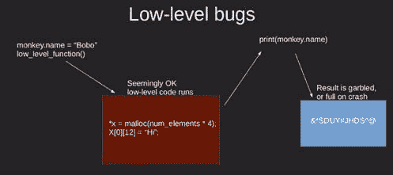

如果我们很幸运，那个错误或 bug 会导致程序直接终止，也就是说，如果它违反了操作系统受保护内存管理器的限制。

我认为我们会很幸运，因为如果这种情况没有发生，那就意味着我们对程序状态的一部分进行了有效的随机更改，谁知道那会带来什么后果。

+   第二个缺点是它使得分发我们的程序变得更加困难。对于一个普通的 Python 程序，我们可以向用户分发单个 `.pyz` 文件，或者上传一系列工具、兼容的源代码包或中立的操作系统 wheel 文件到 **Python 包索引**（**PyPI**）。使用编译代码意味着我们必须担心我们的用户使用的是哪种操作系统和硬件架构，并为我们想要支持的每种组合提供单独的包。

+   第三个缺点仅适用于我们编写自己的编译代码，主要用于那些 Cython 最有用的用例。问题是实际上安装并使编译器工作可能很复杂，尤其是对于不习惯与编译器打交道的人来说。不仅如此，如果我们以源代码的形式分发我们的项目，我们的用户也需要经历同样的麻烦。

在奇怪错误的危险和创建和使用编译代码的项目所带来的烦恼之间，我们应该通常等到我们有充分的理由去采取创建或与编译代码接口的步骤。

现在我们已经很好地掌握了与编译代码接口的好处：它使我们能够访问用其他语言编写的与 C 兼容的库。这段代码让我们能够优化关键算法的性能，并使我们能够直接与硬件或低级驱动程序接口。

同样，我们知道其缺点是什么，即潜在的看似无法解释的错误以及在整个开发和分发过程中普遍较高的烦恼和难度。现在，让我们看看如何将我们获得的一些知识付诸实践。

# 使用 ctypes 访问动态库

在本节中，我们将将我们的重点缩小到 Python 标准库的 `ctypes` 包，它允许我们在 Python 中与动态库交互。

# 定位和链接动态库

很可能，与编译代码交互的最常见需求是当有一个库正好符合我们的需求，但它不是 Python 库。也许它原本是为 C 编写的，或者它有一个 C 接口。

我们不会让这样一个小问题阻止我们。相反，我们将使用 `ctypes` 为库创建一个接口模块。对于基本使用，`ctypes` 非常简单。我们只需要导入它，通过文件名加载动态库，并调用该库中的函数，如下面的代码示例所示：

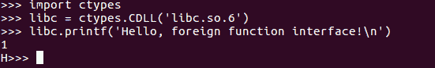

在这个例子中，我们调用的 `CDLL` 构造函数创建了一个代表包含 C 函数的动态库的 Python 对象。当然，由于不同的操作系统有不同的库命名约定，我们在定义库的文件名时需要格外小心。在我们的例子中，`libc.so.6` 属性是当前 Linux 版本上 C 标准库的文件名。

`ctypes` 包含一个名为 `ctypes.util.find_library` 的实用函数，用于帮助解决这个难题。如果我们向 `find_library` 传递一个基本名称，它将尝试找到系统上安装的完整版本名称，如下面的代码示例所示：

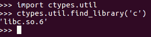

`ctypes.util.find_library` 在 Linux 和 Mac OS X 上非常有用，但在 Windows 上则不那么有用，因为 Windows 动态库以非常不同的方式处理多个版本。

值得注意的是，当我们向 `find_library` 传递 C 字符串时，我们将在 Linux 和 Mac OS X 上找到 C 标准库。在 Windows 上，相同的库被任意地称为 `msvcrt`。

对于跨平台库加载，我们需要能够指定几个库的备用名称；尝试在这些名称上使用 `find_library`（参考以下代码示例），如果 `find_library` 失败，则回退到尝试原始名称。

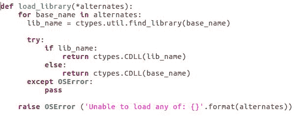

与本书一起提供的 `demo_ctype/libc.py` 文件中有一个 `load_library` 函数，它也演示了这一点。

# 访问库中定义的函数

一旦我们加载了库，我们就能够访问从该库导出的函数，这些函数在 Python 中作为库对象的属性公开。我们在上一节中调用 C 的 `printf` 函数时看到了这一点。

现在，重要的是要知道，C 共享库中没有内容告诉库的用户函数的参数类型是什么，或者返回类型，甚至函数有多少个参数。这些信息在编译库时使用，但不是最终结果的一部分。这意味着我们必须知道函数应该如何使用。例如，C 库中包含一个名为 `qsort` 的快速排序函数，它旨在接受多个参数。让我们看看如果这些参数没有提供会发生什么：

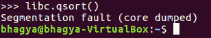

如前述代码示例所示，如果我们省略了参数，`ctypes` 就无法知道我们是否犯了错误，并且没有任何警告的情况下发生不良事件。

# 将属性分配给函数

如果我们计划系统地使用外部函数，或者特别是如果我们打算将其作为我们编写的模块接口的一部分公开，建议告诉 `ctypes` 关于函数签名的信息。我们可以通过将 `argtypes` 和 `restype` 属性分配给函数来实现这一点。

`argtypes` 属性应该是 `ctypes` 包中定义的 C 数据类型列表，而 `restype` 应该是这些包之一，如下面的代码示例所示：

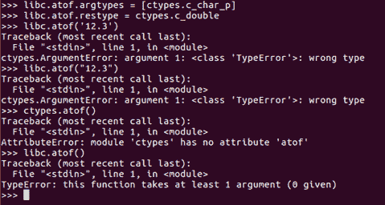

如代码所示，向 `ctypes` 提供这些信息可以显著提高外部函数的错误处理能力。`atof` 函数返回一个双精度浮点数，但如果我们不告诉它，`ctypes` 就不知道这一点。当 `ctypes` 没有信息时，它就假设返回值是整数；这在许多情况下是可行的，但在这个特定的例子中就毫无用处了。

# 使用指针作为函数的参数

C 函数接受指针作为参数并在指针指向的地址填充值是很常见的。自然地，`ctypes` 允许我们通过创建代表内存位置的对象并使用指针将此对象传递给调用函数的接口来处理这种类型的接口。C 的 `scanf` 函数的工作方式可以通过以下代码示例来说明：

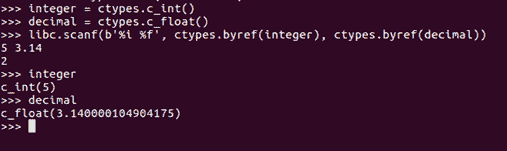

在这个例子中，我们创建了两个 C 风格的变量，分别称为 `integer` 和 `decimal`；然后，我们使用 `scanf` 函数根据用户输入填充它们。`byref` 函数告诉 `ctypes` 我们不是传递变量的值给函数，而是传递其内存地址，这样函数就可以在那里存储某些内容。

# 提供函数签名

C 函数的另一种常见行为是将字节填充到字符缓冲区中。我们可以使用 `ctypes` 的 `create_string_buffer` 函数来分配这样的缓冲区，然后将其结果用作需要字符串缓冲区的函数的参数，如下面的代码示例所示：

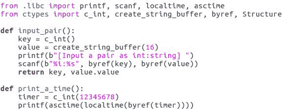

让我们来看看这段代码。这里我们不需要使用 `byref` 函数，因为字符缓冲区本身是按引用提供的。在 C 中没有其他方法可以做到这一点。

这里有一个陷阱：这是几十年来困扰 C 程序员的陷阱之一。我们的字符串缓冲区有特定的长度，但我们传递给它的函数并不知道这个长度。如果它开始向缓冲区写入并超出缓冲区末尾，程序要么崩溃，要么开始表现出异常行为。始终确保您的缓冲区至少足够大，以便写入其中的任何内容。

# 提供数据结构布局

在 C 共享库中不可用的一件事是函数使用的数据结构的布局，如下面的代码示例所示：

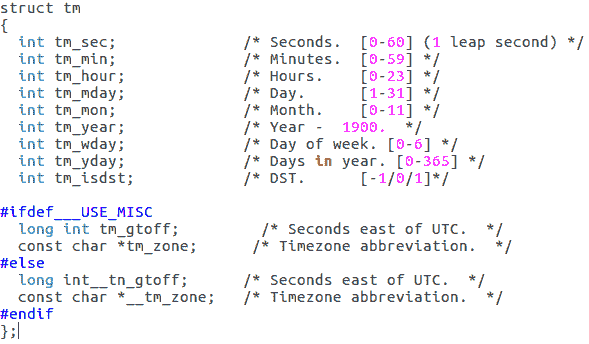

再次，`ctypes` 给我们一种填充缺失信息的方法。用于表示日期和时间信息的 C 的 `tm` 结构看起来如下所示：

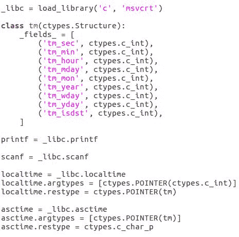

如此例所示，将其翻译成 `ctypes` 是直接的。我们需要创建一个从 `ctypes.Structure` 继承的类，并在该类中创建一个名为 **fields** 的列表，其中包含字段名称和字段类型的元组。

一旦我们掌握了这些，我们就可以创建类的实例，并像在 Python 中预期的那样分配属性。但是，我们也可以将其作为参数直接或通过引用传递给 C 函数，我们还可以将其用作外部函数签名的一部分。

`ctypes` 包提供了对 C 语言几乎所有特性的支持，但我们已经看到了调用库函数和使用其结果最有用的那些。

# 使用 Cython 与 C 代码接口

在本节中，我们将探讨一个名为 Cython 的第三方工具，它是另一个用于弥合 Python 与编译成机器码的软件之间差距的工具。

如果我们想在编译代码中实现项目的一部分，我们可以通过创建包含代码的动态库并使用 `ctypes` 调用它来实现。然而，这是一个绕弯路的方法，我们最终会写很多代码两次：一次是为了我们的编译器，然后再次告诉 `ctypes` 关于函数签名和数据结构等细节。

现在这样做是不高效的，违反了编程最重要的原则之一——*不要重复自己*。有一个工具更适合这种情况，你可能已经猜到了，那就是 Cython。

# 使用 Cython 进行工作

Cython 所做的是将 Python 源代码文件转换为包含对 Python C API 等效调用的 C 源代码文件；然后它将其包装在必要的模板中，以将其转换为 Python 二进制模块。

仅凭这一点就足够有用，但 Cython 还允许我们将调用注入 C 函数和低级数据访问操作到模块中。最终结果是，我们几乎可以像编写 Python 代码一样编写我们的编译代码，同时仍然获得最初促使我们编译它的速度或低级访问。

与直接使用 Python API 相比，这为我们节省了大量工作量。本课程附带的一个 100 行 Python 示例在编译后转换为超过 5,000 行 C 代码。让我们逐个分析这个示例，并在与纯 Python 进行比较时讨论差异。

# Cython 的附加导入方法

Cython 允许除了 Python 包提供的常规导入机制之外，还有两种导入机制。让我们详细了解一下这些机制。

第一种机制称为 `cimport`，它从预先准备好的库中导入编译函数和数据结构的签名，如下面的命令行所示：

```py
from cpython.mem cimport PyMem_Malloc, PyMem_Realloc, PyMem_Free 

```

在这种情况下，由于 Cython 随带了一个所有 Python C API 函数的预准备库，我们能够使用这个机制来报告关于 Python 的低级内存分配和释放函数所需的信息。

第二种额外的导入机制是 `cdef extern from`。当我们还没有编译函数的签名可用时，我们使用这种语法使其在 Cython 代码中可用。

缩进的块可以包含任意数量的函数声明、类型定义、结构定义等，如下面的代码示例所示。请注意，这些不需要完全正确，只要足够接近，使得 Cython 能够生成正确的 C 代码：

```py
cdef extern from "string.h": 
    void *memcpy(void *str1, const void *str2, size_t n) 

```

一个 `cdef extern from` 块引用一个 C 头文件，这个头文件会被自动包含在生成的 C 代码中。虽然我们可以简单地使用正常的 Python 语法来编写 `class` 语句，但在前面加上 `cdef` 可以使我们能够在类的实例预定义变量成员中存储原始数据值，如下面的代码示例所示：

```py
cdef class StatisticalArray: 
    cdef double* values 
    cdef int num_values 
    cdef int max_values 

```

# 在 Cython 中编写扩展模块

在前面的代码示例中，`num_values` 变量只是一个存储表示整数值的位的内存块。它没有将它们转换成 Python 对象所需的任何额外数据。

这在某种程度上是一个坏事情，因为它意味着 Python 不能做任何帮助我们快速编写好代码的智能事情。如果没有让我们这些工具为我们做这些工作的原因，我们不会使用这些工具。

因此，为了解决这个问题，让我们定义一个名为 `StatisticalArray` 的扩展类型（参考以下代码示例），它包含一个指向内存位置的指针和两个整数。这个内存位置应该包含双精度浮点数。这些是原始的机器级值，与 Python 值相比虽然比较原始，但它们非常快，因为它们可以直接输入 CPU 操作。

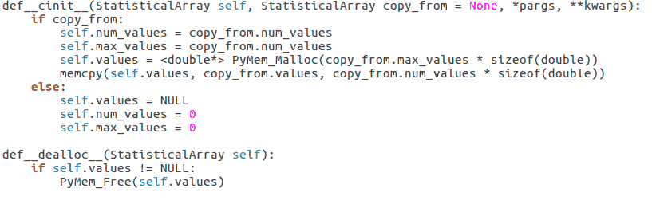

在这个代码示例中，我们有设置和销毁 `StatisticalArray` 类实例的函数。

注意，设置函数被命名为 `__cinit__`，而不是 `__init__`。实际上，Cython 的 `cdef` 类可以同时拥有这两个。`__cinit__` 函数的职责是为类实例设置原始变量，而正常的 `__init__` 函数应该设置它包含的任何正常 Python 变量。

`__cinit__` 函数首先被调用，并且不能保证 `self` 本身就是一个有效的 Python 对象，因此它应该仅限于初始化原始变量。`__cinit__` 接受额外的位置参数和关键字参数的原因是，如果 Python 类从我们的类继承并添加了更多参数到 `__init__` 的签名中，`__cinit__` 函数仍然可以工作。

在过程的另一端，我们有`__dealloc__`函数，它需要释放与类实例关联的任何特殊分配的资源。在前面的例子中，我们在`__cinit__`中分配了一块内存，因此我们需要在`__dealloc__`函数中释放这块内存。

# 提高 Python 代码执行速度的方法

现在我们将定义一些 Python 的常规魔法方法，这将使我们能够遍历存储在我们对象中的值并通过索引访问它们。为此，请参考以下代码示例：

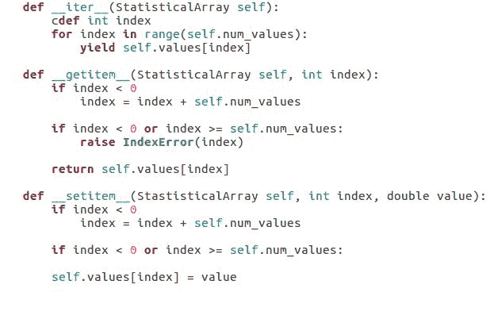

在这个代码示例中需要注意的一点是，与我们在纯 Python 实现中所做的工作相比，变化有多小。唯一的真正区别是我们为每个参数和局部变量提供的类型定义。

我们实际上不必为每个参数和局部变量提供类型定义。类型定义让 Cython 为我们执行的大多数操作生成纯 C 代码，这意味着我们直接使用 CPU 而不是 Python 虚拟机。我们是在用速度换取灵活性。

之前的所有函数都是使用`def`关键字定义的，就像 Python 中的常规模块一样，这些函数的操作就像它们是在常规 Python 模块中定义的一样。

Cython 还给我们提供了两种其他选项。我们不是使用`def`，而是可以使用`cdef`；在这种情况下，函数调用速度更快，但它仅适用于其他 Cython 代码。这对于内部帮助函数等来说非常棒。或者，我们可以使用`cpdef`（如以下代码示例所示）；在这种情况下，函数可以从正常的 Python 代码中访问，但它在从 Cython 代码调用时几乎与`cdef`函数一样快：

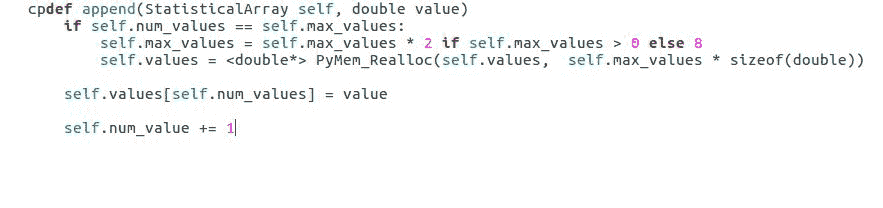

在我们的情况下，我们选择了`cpdef`，因为我们希望向使用我们编译模块的任何 Python 代码公开完整的特性集，但我们还期望在 Cython 代码中使用相同的功能。

# 在 Cython 类中使用 cpdef

在以下代码示例中，您将看到我们为什么将我们的类命名为`StatisticalArray`。我们使用类实例中存储的值实现了几个离散的统计计算。您不必担心`mean`、`variance`和`covariance`实际上做什么，但让我们看看它们是如何实际工作的。

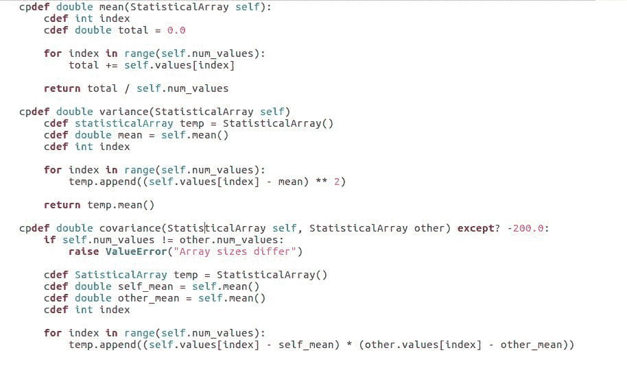

在`mean`函数中，这里我们看到一个循环，它计算数组中存储的值的总和。如果我们在这个 Python 中运行这段代码，每次循环都会涉及几个字典查找和函数调用。Cython 为这个操作生成了四行 C 代码，这转化为只有几个机器代码操作。

这是因为我们告诉 Cython，`index` 变量应该是一个 C 整数，而且 Cython 在处理使用 C 整数变量的循环方面非常聪明，因此我们在 `variance` 和 `covariance` 函数中都能获得类似的收益。再次强调，我们只是使用 Python 语法，并给 Cython 提供额外的信息，以便它可以用来优化生成的代码。

然而，关于 `covariance` 有一个不同寻常的注意事项。在以下截图的第一行末尾，我们看到 `except? -200.0`：

```py
cpdef double covariance(StatisticalArray self, Statistical other) except? -200.0 

```

那是什么？好吧，就像这些函数中的大多数一样，我们给 `covariance` 函数指定了一个显式的 C 返回类型 `double`。这在速度方面是一个很大的提升。但是当调用函数的代码也是 Cython，并且将返回值存储在一个 `cdef` double 变量中时，存在一个缺点。通常，Cython 会使用返回值来指示已引发异常，但当我们改变了返回类型时，它应该如何做呢？因为它无法知道在那个点哪些值是有效的？

好吧，我们会告诉您。添加 `except? -200.0` 表示如果返回值是 `-200`，Cython 会检查是否已引发异常。如果我们省略了 `?`，那么 `-200` 总是意味着存在异常，这会稍微快一点；然而，我们不能走得太远，因为 `-200` 仍然是一个可能的有效返回变量。

注意，我们实际上并没有返回 `-200`；我们只是像平常一样引发一个异常。Cython 会处理其余的部分。以下是一些使用早期函数作为构建块构建的函数的更多示例：

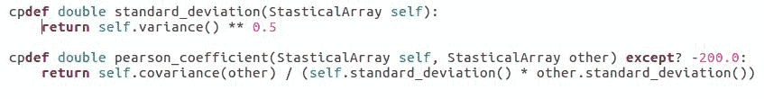

由于我们使用了 `cpdef`，当我们定义 `variance` 和 `covariance` 函数时，从这里调用这些函数所涉及的开销非常小。

# 在 Python 中编译扩展模块

所以，假设我们已经编写了一个有点有用的 Cython 类；现在，我们如何使其对 Python 代码可用？好吧，我们必须编译它。

首先，这意味着我们需要有一个编译器。在 cython.org 的文档中有一个关于此过程的教程条目和附录，如果您系统上还没有编译器，我建议您参考它们。如果您已经有了编译器，安装 Cython 只是一个请求 `pip` 为我们获取它的问题：

```py
python3.5 -m pip install Cython

```

安装可能有点慢，因为它需要在安装过程中进行一些编译；只需耐心等待它完成。

一旦安装了 Cython，我们需要创建一个 `setup.py` 文件来描述如何构建我们的扩展，如下面的代码示例所示。对于基本案例，这个过程非常直接。

我们正在工作的源代码保存在 `statistics.pyx` 中，如下面的代码示例所示。`.pyx` 扩展名是 Cython 源代码文件的标准文件扩展名。

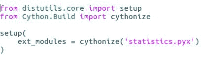

一旦我们这样做，最后一步就变得简单了。一旦`build_ext`命令完成，我们应该在我们的`.pyx`文件旁边有一个编译好的扩展。

现在，我们只需要导入它，并按照以下方式使用：

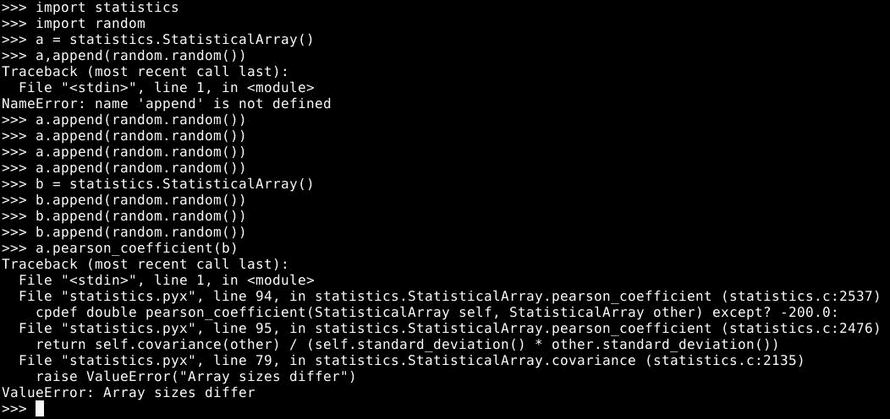

注意，当我们导致编译代码中的异常时，跟踪信息会完全填充，并指向问题的原因和位置。这是 Cython 的一个特性，也是一个很好的优势。

# 摘要

在本章中，我们讨论了使用编译代码的优缺点。我们探讨了使用 Python 的标准`ctypes`包来访问存储在编译的 C 兼容动态库中的函数，这是一种快速获取其他语言编写的功能的方法。

我们还看到了如何使用 Cython 在 Python 的高层和 C 的低层抽象之间操作，而在这个过程中，桥接差距的痛苦出奇地少。我们可以利用这些知识来优化程序中的瓶颈或访问仅在接近硬件操作时才可用的功能。

就这样，我们结束了这门课程。我希望你已经学到了很多，并且对 Python 有了巨大的知识收获。继续学习！
