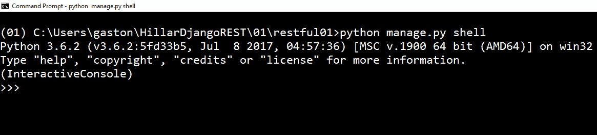
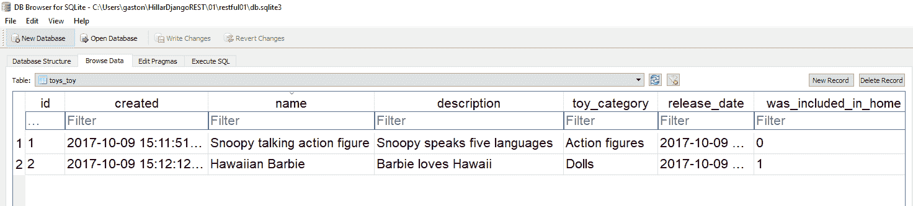

# 第二章：与模型、迁移、序列化和反序列化一起工作

在本章中，我们将定义我们第一个 RESTful Web 服务的要求。我们将开始使用 Django、Django REST 框架、Python、配置、模型、迁移、序列化和反序列化。我们将创建一个在简单 SQLite 数据库上执行**CRUD**（即**创建**、**读取**、**更新**和**删除**）操作的 RESTful Web 服务。我们将：

+   定义我们第一个 RESTful Web 服务的要求

+   创建我们的第一个模型

+   运行我们的初始迁移

+   理解迁移

+   分析数据库

+   理解 Django 表

+   控制序列化和反序列化

+   使用 Django shell 并深入序列化和反序列化

# 定义我们第一个 RESTful Web 服务的要求

想象一个开发团队正在为 iOS 和 Android 开发一个移动应用，并需要一个 RESTful Web 服务来执行与玩具相关的 CRUD 操作。我们肯定不想使用模拟 Web 服务，也不想花费时间选择和配置**ORM**（即**对象关系映射**）。我们希望快速构建一个 RESTful Web 服务，并尽快准备好以便在移动应用中与之交互。

我们真的希望玩具在数据库中持久化，但我们不需要它准备好用于生产。因此，我们可以使用最简单的可能的关系数据库，只要我们不需要花费时间进行复杂的安装或配置。

**Django REST 框架**，也称为**DRF**，将使我们能够轻松完成这项任务，并开始向我们的 RESTful Web 服务的第一版本发送 HTTP 请求。在这种情况下，我们将使用一个非常简单的 SQLite 数据库，它是新 Django REST 框架项目的默认数据库。

首先，我们必须指定我们主要资源：玩具的要求。对于一个玩具实体，我们需要以下属性或字段：

+   一个整数标识符

+   名称

+   可选的描述

+   玩具类别描述，例如动作人偶、娃娃或玩具套装

+   发布日期

+   一个布尔值，表示玩具是否至少一次出现在在线商店的主页上

此外，我们希望在数据库表中添加一个时间戳，记录玩具添加的日期和时间，这将用于持久化玩具信息。

在 RESTful Web 服务中，每个资源都有自己的唯一 URL。在我们的 Web 服务中，每个玩具都将有自己的唯一 URL。

以下表格显示了我们的 Web 服务第一版本必须支持的 HTTP 动词、范围和方法的语义。每个方法由一个 HTTP 动词和一个范围组成。所有方法都对玩具和集合有明确的含义：

| **HTTP 动词** | **范围** | **语义** |
| --- | --- | --- |
| GET | Toy | 获取单个玩具 |
| GET | 玩具集合 | 获取存储在集合中的所有玩具，按名称升序排序 |
| POST | 玩具集合 | 在集合中创建一个新的玩具 |
| PUT | 玩具 | 更新现有的玩具 |
| DELETE | 玩具 | 删除现有的玩具 |

在之前的表中，GET HTTP 动词出现了两次，但有两个不同的作用域：玩具和玩具集合。第一行显示 GET HTTP 动词应用于玩具，即单个资源。第二行显示 GET HTTP 动词应用于玩具集合，即资源集合。

我们希望我们的 Web 服务能够区分 URL 中的集合与单个集合资源。当我们提到集合时，我们将使用斜杠（`/`）作为 URL 的最后一个字符，例如`http://localhost:8000/toys/`。当我们提到集合的单个资源时，我们不会在 URL 的最后一个字符使用斜杠（`/`），例如`http://localhost:8000/toys/5`。

让我们考虑`http://localhost:8000/toys/`是玩具集合的 URL。如果我们向之前的 URL 添加一个数字，我们就可以通过一个 ID 或主键等于指定数值的特定玩具来识别。例如，`http://localhost:8000/toys/42`识别 ID 等于`42`的玩具。

我们必须使用`POST` HTTP 动词和`http://localhost:8000/toys/`请求 URL 来创建一个新的玩具并将其添加到玩具收藏中。在这个例子中，我们的 RESTful Web 服务将使用**JSON**（即**JavaScript 对象表示法**），因此我们必须提供 JSON 键值对，包括字段名称和值来创建新的玩具。请求的结果是，服务器将验证提供的字段值，确保它是一个有效的玩具，并将其持久化到数据库中。服务器将在适当的表中插入一行新的玩具，并返回一个`201 Created`状态码和一个包含最近添加的玩具序列化为 JSON 的 JSON 正文，包括由数据库自动生成的分配给玩具对象的 ID：

```py
POST http://localhost:8000/toys/ 
```

我们必须使用`GET` HTTP 动词和`http://localhost:8000/toys/{id}`请求 URL 来检索 ID 与`{id}`中指定的数值匹配的玩具。例如，如果我们使用请求 URL `http://localhost:8000/toys/25`，服务器将检索 ID 匹配`25`的玩具。请求的结果是，服务器将从数据库中检索具有指定 ID 的玩具并创建适当的 Python 玩具对象。如果找到玩具，服务器将序列化玩具对象为 JSON，返回一个`200 OK`状态码，并返回一个包含序列化玩具对象的 JSON 正文。如果没有找到与指定 ID 匹配的玩具，服务器将只返回一个`404 Not Found`状态：

```py
GET http://localhost:8000/toys/{id} 
```

我们必须使用 `PUT` HTTP 动词和请求 URL `http://localhost:8000/toys/{id}` 来发送一个 HTTP 请求，以检索与 `{id}` 中值匹配的玩具，并用提供的数据创建的玩具替换它。此外，我们必须提供带有字段名称和值的 JSON 键值对，以创建将替换现有玩具的新玩具。请求的结果是，服务器将验证提供的字段值，确保它是一个有效的玩具，并将数据库中与指定 ID 匹配的玩具替换为新玩具。更新操作后，玩具的 ID 将保持不变。服务器将更新适当表中的现有行，并返回一个 `200 OK` 状态码和一个包含最近更新的玩具序列化为 JSON 的 JSON 主体。如果我们没有提供新玩具的所有必要数据，服务器将返回一个 `400 Bad Request` 状态码。如果服务器找不到具有指定 ID 的玩具，服务器将只返回一个 `404 Not Found` 状态：

```py
PUT http://localhost:8000/toys/{id}
```

我们必须使用 `DELETE` HTTP 动词和请求 URL `http://localhost:8000/toys/{id}` 来发送一个 HTTP 请求，以删除与指定在 `{id}` 中的数值匹配的玩具。例如，如果我们使用请求 URL `http://localhost:8000/toys/34`，服务器将删除与 `34` 匹配的玩具。请求的结果是，服务器将从数据库中检索具有指定 ID 的玩具，并在 Python 中创建适当的玩具对象。如果找到玩具，服务器将请求 ORM 删除与该玩具对象关联的玩具行，服务器将返回一个 `204 No Content` 状态码。如果没有找到与指定 ID 匹配的玩具，服务器将只返回一个 `404 Not Found` 状态：

```py
DELETE http://localhost:8000/toys/{id} 
```

# 创建我们的第一个模型

现在，我们将在 Django 中创建一个简单的 `Toy` 模型，我们将使用它来表示和持久化玩具。打开 `toys/models.py` 文件。以下行显示了该文件的初始代码，其中只有一个 `import` 语句和一个注释，表明我们应该创建模型：

```py
from django.db import models 

# Create your models here. 
```

以下行显示了创建 `Toy` 类的新代码，具体来说，是在 `toys/models.py` 文件中的 `Toy` 模型。示例的代码文件包含在 `restful01/toys/models.py` 文件中的 `hillar_django_restful_02_01` 文件夹中：

```py
from django.db import models 

class Toy(models.Model): 
    created = models.DateTimeField(auto_now_add=True) 
    name = models.CharField(max_length=150, blank=False, default='') 
    description = models.CharField(max_length=250, blank=True, default='') 
    toy_category = models.CharField(max_length=200, blank=False, default='') 
    release_date = models.DateTimeField() 
    was_included_in_home = models.BooleanField(default=False) 

    class Meta: 
        ordering = ('name',)
```

`Toy` 类是 `django.db.models.Model` 类的子类，并定义了以下属性：`created`、`name`、`description`、`toy_category`、`release_date` 和 `was_included_in_home`。这些属性中的每一个都代表一个数据库列或字段。

Django 在创建与模型相关的数据库表时自动添加一个名为 `id` 的自增整数主键列。非常重要的一点是，模型将底层的 `id` 列映射到模型的一个名为 `pk` 的属性。

我们指定了许多属性的字段类型、最大长度和默认值。类声明了一个 `Meta` 内部类，它声明了一个 `ordering` 属性并将其值设置为包含 `string` 的元组，其第一个值是 `'name'` 字符串。这样，内部类指示 Django，默认情况下，我们希望按 `name` 属性的升序排序结果。

# 运行我们的初始迁移

现在，有必要为最近编写的新的 `Toy` 模型创建初始迁移。我们还将首次同步 SQLite 数据库。默认情况下，Django 使用流行的自包含和嵌入式 SQLite 数据库，因此我们不需要在初始 ORM 配置中进行更改。在这个例子中，我们将使用这个默认配置。当然，在我们用 Django 构建一个示例网络服务之后，我们将升级到另一个数据库。在这个例子中，我们只会使用 SQLite。

我们只需要在上一章中激活的虚拟环境中运行以下 Python 脚本。确保你在虚拟环境主文件夹中的 `restful01` 文件夹内运行以下命令：

```py
    python manage.py makemigrations toys  
```

以下行显示了运行上一条命令后生成的输出：

```py
    Migrations for 'toys':
      toys/migrations/0001_initial.py:
        - Create model Toy
```

输出表明 `restful01/toys/migrations/0001_initial.py` 文件包含了创建 `Toy` 模型的代码。以下行显示了由 Django 自动生成的此文件的代码。示例代码文件包含在 `hillar_django_restful_02_01` 文件夹中的 `restful01/toys/migrations/0001_initial.py` 文件中：

```py
# -*- coding: utf-8 -*- 
# Generated by Django 1.11.5 on 2017-10-08 05:19 
from __future__ import unicode_literals 

from django.db import migrations, models 

class Migration(migrations.Migration): 

    initial = True 

    dependencies = [ 
    ] 

    operations = [ 
        migrations.CreateModel( 
            name='Toy', 
            fields=[ 
                ('id', models.AutoField(auto_created=True, primary_key=True, serialize=False, verbose_name='ID')), 
                ('created', models.DateTimeField(auto_now_add=True)), 
                ('name', models.CharField(default='', max_length=150)), 
                ('description', models.CharField(blank=True, default='', max_length=250)), 
                ('toy_category', models.CharField(default='', max_length=200)), 
                ('release_date', models.DateTimeField()), 
                ('was_included_in_home', models.BooleanField(default=False)), 
            ], 
            options={ 
                'ordering': ('name',), 
            }, 
        ), 
    ] 
```

# 理解迁移

自动生成的代码定义了一个名为 `Migration` 的 `django.db.migrations.Migration` 类的子类，它定义了一个创建 `Toy` 模型表的操作，并将其包含在 `operations` 属性中。对 `migrations.CreateModel` 方法的调用指定了模型名称、字段以及指令 ORM 创建一个允许底层数据库持久化模型的表的选项。

`fields` 参数是一个包含有关字段名称、字段类型以及基于我们在模型中（即 `Toy` 类中）提供的数据的额外属性的元组列表。这些属性包括字段名称、字段类型和基于我们提供的模型数据的额外属性。

现在，运行以下 Python 脚本来应用所有生成的迁移。确保你在虚拟环境的主文件夹中的 `restful01` 文件夹内运行以下命令：

```py
    python manage.py migrate
```

以下行显示了运行上一条命令后生成的输出：

```py
    Operations to perform:
      Apply all migrations: admin, auth, contenttypes, sessions, toys
    Running migrations:
      Applying contenttypes.0001_initial... OK
      Applying auth.0001_initial... OK
      Applying admin.0001_initial... OK
      Applying admin.0002_logentry_remove_auto_add... OK
      Applying contenttypes.0002_remove_content_type_name... OK
      Applying auth.0002_alter_permission_name_max_length... OK
      Applying auth.0003_alter_user_email_max_length... OK
      Applying auth.0004_alter_user_username_opts... OK
      Applying auth.0005_alter_user_last_login_null... OK
      Applying auth.0006_require_contenttypes_0002... OK
      Applying auth.0007_alter_validators_add_error_messages... OK
      Applying auth.0008_alter_user_username_max_length... OK
      Applying sessions.0001_initial... OK
      Applying toys.0001_initial... OK

```

在我们运行上一条命令后，我们会注意到我们的 `restful01` 项目的根文件夹现在有一个包含 SQLite 数据库的 `db.sqlite3` 文件。我们可以使用 SQLite 命令行或任何其他允许我们轻松检查 SQLite 数据库内容的应用程序来检查 Django 生成的表。

第一次迁移将在运行创建 `Toys` 模型表的代码之前生成 Django 和其安装的应用程序所需的大量表。这些表为用户身份验证、权限、组、日志和迁移管理提供支持。在添加更多功能和安全性到我们的 Web 服务之后，我们将与这些表相关的模型一起工作。

在迁移过程在底层数据库中创建所有这些 Django 表之后，第一次迁移运行创建我们模型所需的表的 Python 代码。因此，运行迁移部分的最后一行显示为 `Applying toys.0001_initial`。

# 分析数据库

在大多数现代 Linux 发行版和 macOS 中，SQLite 已经安装，因此您可以运行 `sqlite3` 命令行实用程序。

在 Windows 中，如果您想使用 `sqlite3.exe` 命令行实用程序，您必须从 SQLite 网页的下载部分下载管理 SQLite 数据库文件的命令行工具包。[`www.sqlite.org/download.html`](http://www.sqlite.org/download.html)。例如，包含版本 3.20.1 的命令行工具的 ZIP 文件是 `sqlite-tools-win32-x86-3200100.zip`。文件名会随着 SQLite 版本而变化。您只需确保您下载的是命令行工具包，而不是提供 SQLite DLLs 的 ZIP 文件。解压缩文件后，您可以将包含命令行工具的文件夹包含在 PATH 环境变量中，或者通过指定其完整路径来访问 `sqlite3.exe` 命令行实用程序。

运行以下命令以列出生成的表。第一个参数 `db.sqlite3` 指定了包含该 SQLite 数据库的文件，第二个参数表示我们想要 `sqlite3` 命令行实用程序针对指定数据库运行的命令：

```py
    sqlite3 db.sqlite3 ".tables" 
```

以下行显示了上一条命令的输出，列出了 Django 在 SQLite 数据库中生成的表列表：

```py
    auth_group                  django_admin_log
    auth_group_permissions      django_content_type
    auth_permission             django_migrations
    auth_user                   django_session
    auth_user_groups            toys_toy
    auth_user_user_permissions  
```

以下命令将在我们向 RESTful Web 服务发送并发送 HTTP 请求后，以及该 Web 服务对 `toys_toy` 表执行 CRUD 操作后，允许您检查 `toys_toy` 表的内容：

```py
    sqlite3 db.sqlite3 "SELECT * FROM toys_toy ORDER BY name;" 
```

您可以使用图形界面工具而不是 SQLite 命令行实用程序来检查 SQLite 数据库的内容。DB Browser for SQLite 是一个有用、免费、多平台的图形界面工具，它允许我们在 Linux、macOS 和 Windows 中轻松检查 SQLite 数据库的内容。您可以从 [`sqlitebrowser.org`](http://sqlitebrowser.org) 阅读有关此工具的更多信息并下载其不同版本。一旦您安装了此工具，您只需打开 `db.sqlite3` 文件，就可以检查数据库结构并浏览不同表的数据。在我们开始使用 Web 服务的第一个版本后，您需要使用此工具检查 `toys_toy` 表的内容。

您还可以使用您最喜欢的 IDE 中包含的数据库工具来检查 SQLite 数据库的内容。

SQLite 数据库引擎和数据库文件名在 `restful01/settings.py` Python 文件中指定。以下行显示了 `DATABASES` 字典的声明，其中包含 Django 所用所有数据库的设置。嵌套字典将名为 `default` 的数据库映射到 `django.db.backends.sqlite3` 数据库引擎和位于 `BASE_DIR` 文件夹（`restful01`）中的 `db.sqlite3` 数据库文件：

```py
DATABASES = { 
    'default': { 
        'ENGINE': 'django.db.backends.sqlite3', 
        'NAME': os.path.join(BASE_DIR, 'db.sqlite3'), 
    } 
} 
```

执行迁移后，SQLite 数据库将具有以下表。Django 使用前缀来标识每个表所属的模块和应用程序。以 `auth_` 前缀开头的表属于 Django 认证模块。以 `toys_` 前缀开头的表属于我们的 `toys` 应用程序。如果我们向 `toys` 应用程序添加更多模型，Django 将创建具有 `toys_` 前缀的新表：

+   `auth_group`: 存储认证组

+   `auth_group_permissions`: 存储认证组的权限

+   `auth_permission`: 存储认证权限

+   `auth_user`: 存储认证用户

+   `auth_user_groups`: 存储认证用户组

+   `auth_user_groups_permissions`: 存储认证用户组的权限

+   `django_admin_log`: 存储 Django 管理员日志

+   `django_content_type`: 存储 Django 内容类型

+   `django_migrations`: 存储 Django 迁移生成的脚本以及它们应用的时间和日期

+   `django_session`: 存储 Django 会话

+   `toys_toy`: 持久化 `Toys` 模型

+   `sqlite_sequence`: 存储具有自增字段的 SQLite 主键的序列

# 理解 Django 生成的表

`toys_toy` 表在数据库中持久化了我们最近创建的 `Toy` 类，具体来说，是 `Toy` 模型。Django 的集成 ORM 根据我们的 `Toy` 模型生成了 `toys_toy` 表。

执行以下命令以检索创建 `toys_toy` 表所用的 SQL：

```py
    sqlite3 db.sqlite3 ".schema toys_toy"
```

以下行显示了上一条命令的输出以及迁移过程执行的 SQL，以创建持久化 `Toy` 模型的 `toys_toy` 表。以下行格式化以便更容易理解 SQL 代码。注意，命令的输出格式不同：

```py
    CREATE TABLE IF NOT EXISTS "toys_toy" 
    (
        "id" integer NOT NULL PRIMARY KEY AUTOINCREMENT,
    "created" datetime NOT NULL, 
    "name" varchar(150) NOT NULL, 
    "description" varchar(250) NOT NULL, 
    "toy_category" varchar(200) NOT NULL, 
    "release_date" datetime NOT NULL, 
        "was_included_in_home" bool NOT NULL
    );

```

`toys_toy` 表具有以下列（也称为字段），以及它们的 SQLite 类型，所有这些列均不可为空：

+   `id`: 整数主键，自增行

+   `created`: 日期时间

+   `name`: varchar(150)

+   `description`: varchar(250)

+   `toy_category`: varchar(200)

+   `release_date`: 日期时间

+   `was_included_in_home`: 布尔值

# 控制、序列化和反序列化

我们的 RESTful 网络服务必须能够将 `Toy` 实例序列化和反序列化为 JSON 表示形式。在 Django REST 框架中，我们只需为 `Toy` 实例创建一个序列化器类来管理对 JSON 的序列化和从 JSON 的反序列化。现在，我们将深入探讨 Django REST 框架中的序列化和反序列化过程。理解其工作原理非常重要，因为它是我们将要构建的所有 RESTful 网络服务最重要的组件之一。

Django REST 框架使用两阶段过程进行序列化。序列化器是模型实例和 Python 基本类型之间的中介。解析器和渲染器作为 Python 基本类型和 HTTP 请求及响应之间的中介。我们将通过创建 `rest_framework.serializers.Serializer` 类的子类来配置我们的中介，以在 `Toy` 模型实例和 Python 基本类型之间声明字段和必要的序列化和反序列化管理方法。

我们将重复一些关于 `Toy` 模型中包含的字段的信息，以便我们理解在 `Serializer` 类的子类中可以配置的所有内容。然而，我们将使用快捷方式，这将在以下示例中减少样板代码。我们将通过使用 `ModelSerializer` 类来编写更少的代码。

现在，转到 `restful01/toys` 文件夹，创建一个名为 `serializers.py` 的新 Python 代码文件。以下行显示了声明新 `ToySerializer` 类的代码。示例的代码文件包含在 `hillar_django_restful_02_01` 文件夹中的 `restful01/toys/serializers.py` 文件中：

```py
from rest_framework import serializers 
from toys.models import Toy 

class ToySerializer(serializers.Serializer): 
    pk = serializers.IntegerField(read_only=True) 
    name = serializers.CharField(max_length=150) 
    description = serializers.CharField(max_length=250) 
    release_date = serializers.DateTimeField() 
    toy_category = serializers.CharField(max_length=200) 
    was_included_in_home = serializers.BooleanField(required=False) 

    def create(self, validated_data): 
        return Toy.objects.create(**validated_data) 

    def update(self, instance, validated_data): 
        instance.name = validated_data.get('name', instance.name)         
        instance.description = validated_data.get('description', instance.description) 
        instance.release_date = validated_data.get('release_date', instance.release_date) 
        instance.toy_category = validated_data.get('toy_category', instance.toy_category) 
        instance.was_included_in_home = validated_data.get('was_included_in_home', instance.was_included_in_home) 
        instance.save() 
        return instance 
```

`ToySerializer` 类声明了代表我们想要序列化的字段的属性。请注意，我们已经省略了在 `Toy` 模型中存在的 `created` 属性。当调用 `ToySerializer` 从 `serializers.Serializer` 超类继承的 `save` 方法时，重写的 `create` 和 `update` 方法定义了如何创建新实例或更新现有实例。实际上，这些方法必须在我们的类中实现，因为它们在其基类 `serializers.Serializer` 中的声明中只引发一个 `NotImplementedError` 异常。

`create` 方法接收 `validated_data` 参数中的验证数据。代码根据接收到的验证数据创建并返回一个新的 `Toy` 实例。

`update` 方法接收一个正在更新的现有 `Toy` 实例和包含在 `instance` 和 `validated_data` 参数中的新验证数据。代码使用从验证数据中检索的更新属性值来更新实例的属性值。最后，代码调用更新后的 `Toy` 实例的 `save` 方法，并返回更新并保存的实例。

# 使用 Django shell 并深入探讨序列化和反序列化

我们可以在虚拟环境中启动默认的 Python 交互式 shell，并在它开始之前使所有 Django 项目模块可用。这样，我们可以检查序列化器是否按预期工作。我们将这样做以了解 Django 中序列化的工作方式。

运行以下命令以启动交互式 shell。请确保你在终端、命令提示符或 Windows Powershell 中的`restful01`文件夹内：

```py
python manage.py shell
```

你会注意到在通常介绍默认 Python 交互式 shell 的行之后，会显示一行说`(InteractiveConsole)`。以下截图显示了在 Windows 命令提示符中启动的 Django shell：



在 Python 交互式 shell 中输入以下代码以导入我们将需要测试`Toy`模型及其序列化器的所有内容。示例的代码文件包含在`hillar_django_restful_02_01`文件夹中，位于`restful01/toy_serializers_test_01.py`文件中：

```py
from datetime import datetime 
from django.utils import timezone 
from django.utils.six import BytesIO 
from rest_framework.renderers import JSONRenderer 
from rest_framework.parsers import JSONParser 
from toys.models import Toy 
from toys.serializers import ToySerializer 
```

输入以下代码以创建两个`Toy`模型的实例并将它们保存。示例的代码文件包含在`hillar_django_restful_02_01`文件夹中，位于`restful01/toy_serializers_test_01.py`文件中：

```py
toy_release_date = timezone.make_aware(datetime.now(), timezone.get_current_timezone()) 
toy1 = Toy(name='Snoopy talking action figure', description='Snoopy speaks five languages', release_date=toy_release_date, toy_category='Action figures', was_included_in_home=False) 
toy1.save() 
toy2 = Toy(name='Hawaiian Barbie', description='Barbie loves Hawaii', release_date=toy_release_date, toy_category='Dolls', was_included_in_home=True) 
toy2.save() 
```

执行上述代码后，我们可以使用之前介绍的命令行或 GUI 工具检查 SQLite 数据库，以检查`toys_toy`表的内容。我们会注意到表中有两行，列出了我们提供给`Toy`实例不同属性的值。以下截图显示了使用 DB Browser for SQLite GUI 实用程序浏览`toys_toy`表数据的结果。我们可以看到插入了两个行。

在交互式 shell 中输入以下代码以检查已保存`Toy`实例的主键或标识符的值，以及它们的`name`和`was_included_in_home_attribute`属性的值。代码还检查`created`属性的值，该属性包括 Django 将每个实例保存到数据库的日期和时间。示例的代码文件包含在`hillar_django_restful_02_01`文件夹中，位于`restful01/toy_serializers_test_01.py`文件中：

```py
print(toy1.pk) 
print(toy1.name) 
print(toy1.created) 
print(toy1.was_included_in_home) 
print(toy2.pk) 
print(toy2.name) 
print(toy2.created) 
print(toy2.was_included_in_home)
```

以下截图显示了之前展示的代码的示例结果：



现在，让我们编写以下代码以序列化第一个`Toy`实例（`toy1`）。示例的代码文件包含在`hillar_django_restful_02_01`文件夹中，位于`restful01/toy_serializers_test_01.py`文件中：

```py
serializer_for_toy1 = ToySerializer(toy1) 
print(serializer_for_toy1.data) 
```

以下行显示了生成的字典，特别是存储在`serializer_for_toy1.data`属性中的`rest_framework.utils.serializer_helpers.ReturnDict`实例。接下来的行显示了易于理解的格式化结果：

```py
    {
    'pk': 1, 
    'name': 'Snoopy talking action figure', 
    'description': 'Snoopy speaks five languages', 
    'release_date': '2017-10-09T12:11:37.090335Z', 
    'toy_category': 'Action figures', 
        'was_included_in_home': False
    }
```

现在，让我们序列化第二个`Toy`实例（`toy2`）。示例的代码文件包含在`hillar_django_restful_02_01`文件夹中，位于`restful01/toy_serializers_test_01.py`文件中：

```py
serializer_for_toy2 = ToySerializer(toy2) 
print(serializer_for_toy2.data)
```

以下几行代码显示了存储在`serializer_for_toy2.data`属性中的生成的字典。下一行显示了以易于理解的方式格式化的结果：

```py
    {
    'pk': 2, 
    'name': 'Hawaiian Barbie', 
    'description': 'Barbie loves Hawaii', 
    'release_date': '2017-10-09T12:11:37.090335Z', 
    'toy_category': 'Dolls', 
        'was_included_in_home': True
    }  
```

我们可以使用`rest_framework.renderers.JSONRenderer`类轻松地将存储在`data`属性中的字典渲染成 JSON 格式。以下几行代码创建了这个类的实例，然后调用`render`方法将存储在`data`属性中的字典渲染成 JSON。示例代码文件位于`hillar_django_restful_02_01`文件夹中的`restful01/toy_serializers_test_01.py`文件中：

```py
json_renderer = JSONRenderer() 
toy1_rendered_into_json = json_renderer.render(serializer_for_toy1.data) 
toy2_rendered_into_json = json_renderer.render(serializer_for_toy2.data) 
print(toy1_rendered_into_json) 
print(toy2_rendered_into_json) 
```

以下几行代码显示了两次调用`render`方法生成的输出。

```py
    b'{"pk":1,"name":"Snoopy talking action figure","description":"Snoopy speaks five languages","release_date":"2017-10-09T12:11:37.090335Z","toy_category":"Action figures","was_included_in_home":false}'
    >>> print(toy2_rendered_into_json)
    b'{"pk":2,"name":"Hawaiian Barbie","description":"Barbie loves Hawaii","release_date":"2017-10-09T12:11:37.090335Z","toy_category":"Dolls","was_included_in_home":true}'  
```

现在，我们将反向操作：从序列化数据到`Toy`实例的集合。以下几行代码从一个 JSON 字符串（序列化数据）生成一个新的`Toy`实例，即代码反序列化和解析数据。示例代码文件位于`hillar_django_restful_02_01`文件夹中的`restful01/toy_serializers_test_01.py`文件中：

```py
json_string_for_new_toy = '{"name":"Clash Royale play set","description":"6 figures from Clash Royale", "release_date":"2017-10-09T12:10:00.776594Z","toy_category":"Playset","was_included_in_home":false}' 
json_bytes_for_new_toy = bytes(json_string_for_new_toy, encoding="UTF-8") 
stream_for_new_toy = BytesIO(json_bytes_for_new_toy) 
parser = JSONParser() 
parsed_new_toy = parser.parse(stream_for_new_toy) 
print(parsed_new_toy) 
```

第一行创建了一个新的字符串，其中包含定义新玩具的 JSON（`json_string_for_new_toy`）。下一行将字符串转换为`bytes`，并将转换结果保存到`json_bytes_for_new_toy`变量中。`django.utils.six.BytesIO`类提供了一个使用内存中的 bytes 缓冲区的缓冲 I/O 实现。代码使用这个类从之前生成的 JSON bytes 和序列化数据`json_bytes_for_new_toy`创建一个流，并将生成的流实例保存到`stream_for_new_toy`变量中。

我们可以使用`rest_framework.parsers.JSONParser`类轻松地将流反序列化和解析成 Python 模型。下一行代码创建了这个类的实例，然后使用`stream_for_new_toy`作为参数调用`parse`方法，将流解析成 Python 原生数据类型，并将结果保存到`parsed_new_toy`变量中。

执行前面的代码后，`parsed_new_toy`变量中保存了一个从流中解析出的 Python 字典。以下几行代码显示了执行前面的代码片段后生成的输出。下一行显示了以易于理解的方式格式化的结果：

```py
  **{** 
    **'name': 'Clash Royale play set',** 
    **'description': '6 figures from Clash Royale',** 
    **'release_date': '2017-10-09T12:10:00.776594Z',** 
    **'toy_category': 'Playset',** 
    **    'was_included_in_home': False** 

      **}** 
```

以下几行代码使用`ToySerializer`类从流中解析的 Python 字典生成一个完全填充的`Toy`实例，命名为`toy3`。示例代码文件位于`hillar_django_restful_02_01`文件夹中的`restful01/toy_serializers_test_01.py`文件中：

```py
new_toy_serializer = ToySerializer(data=parsed_new_toy) 
if new_toy_serializer.is_valid(): 
    toy3 = new_toy_serializer.save() 
    print(toy3.name)
```

首先，代码创建了一个`ToySerializer`类的实例，该实例使用我们从流中之前解析的 Python 字典（`parsed_new_toy`）作为`data`关键字参数传递。然后，代码调用`is_valid`方法来检查数据是否有效。

注意，在创建序列化器时传递`data`关键字参数并尝试访问序列化数据表示之前，我们必须始终调用`is_valid`。

如果该方法返回`true`，我们可以访问`data`属性中的序列化表示，因此代码调用`save`方法以持久化新实例。在这种情况下，它是一个新的`Toy`实例，因此将相应的行插入数据库并返回一个完全填充的`Toy`实例的代码插入到`save`方法中，然后返回一个完全填充的`Toy`实例，保存在`toy3`局部变量中。然后，代码打印完全填充的`Toy`实例的一个属性。在执行上述代码后，我们完全填充了一个新的`Toy`实例：`toy3`。

如前述代码所示，Django REST 框架使得从对象序列化为 JSON 以及从 JSON 反序列化为对象变得容易，这是我们必须执行 CRUD 操作的 RESTful Web 服务的核心需求。

输入以下命令以退出 Django shell，并加载 Django 项目模块以测试序列化和反序列化：

```py
quit() 
```

# 测试你的知识

1.  在 Django REST 框架中，序列化器是：

    1.  视图函数和 Python 基本类型之间的中介

    1.  URL 和视图函数之间的中介

    1.  模型实例和 Python 基本类型之间的中介

1.  如果我们想要创建一个简单的`Toy`模型，我们将使用它来表示和持久化 Django REST 框架中的玩具，我们可以创建：

    1.  一个作为`djangorestframework.models.Model`类子类的`Toy`类

    1.  一个作为`django.db.models.Model`类子类的`Toy`类

    1.  `restframeworkmodels.py`文件中的`Toy`函数

1.  在 Django REST 框架中，解析器和渲染器：

    1.  作为模型实例和 Python 基本类型之间的中介进行处理

    1.  作为 Python 基本类型和 HTTP 请求/响应之间的中介进行处理

    1.  作为视图函数和 Python 基本类型之间的中介进行处理。

1.  以下哪个命令启动了 Django shell？

    1.  `python manage.py shell`

    1.  `python django.py shell`

    1.  `django shell`

1.  如果我们有一个名为`computers`的 Django 应用程序和一个名为`memory`的模型，Django 的 ORM 将创建什么名字的表来在数据库中持久化该模型？

    1.  `computers_memories`

    1.  `memory_computers`

    1.  `computers_memory`

正确答案包含在附录，*解决方案*中。

# 摘要

在本章中，我们设计了一个 RESTful Web 服务来与简单的 SQLite 数据库交互，并使用玩具执行 CRUD 操作。我们定义了我们的 Web 服务的需求，并理解了每个 HTTP 方法执行的任务和不同的范围。

我们创建了一个模型来表示和持久化玩具，并在 Django 中执行迁移以在 SQLite 数据库中创建所需的表。我们分析了 Django 生成的表。我们学习了如何使用 Django REST 框架管理玩具实例的序列化为 JSON 表示以及反向过程。

现在我们已经了解了 Django 和 Django REST framework 中的模型、迁移、序列化和反序列化，我们将创建结合序列化类的 Django 视图，并开始向我们的网络服务发送 HTTP 请求。我们将在第三章，“创建 API 视图”中介绍这些主题。
