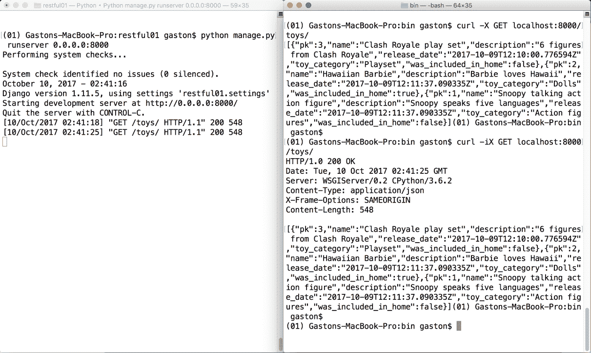
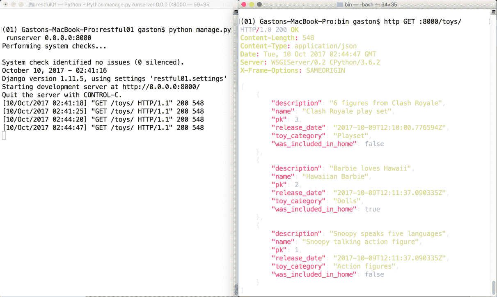
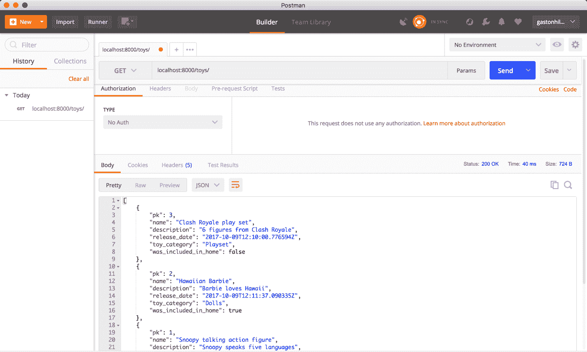
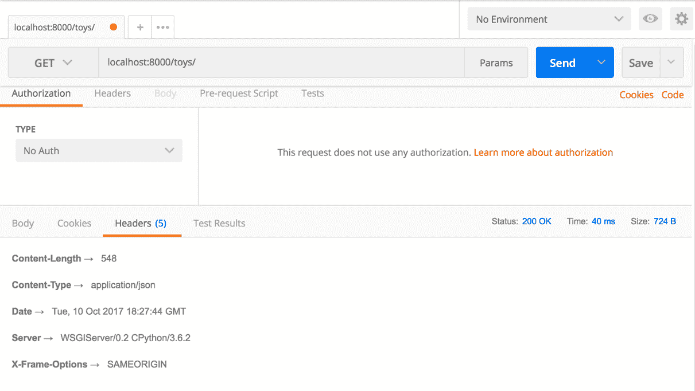
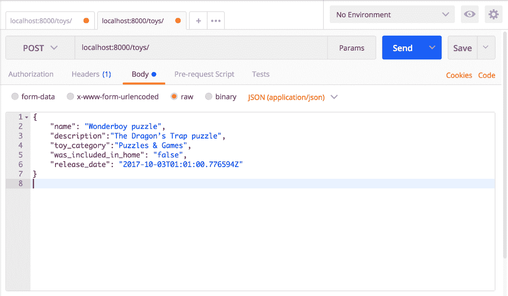
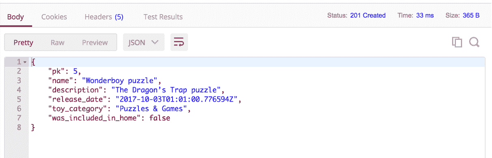
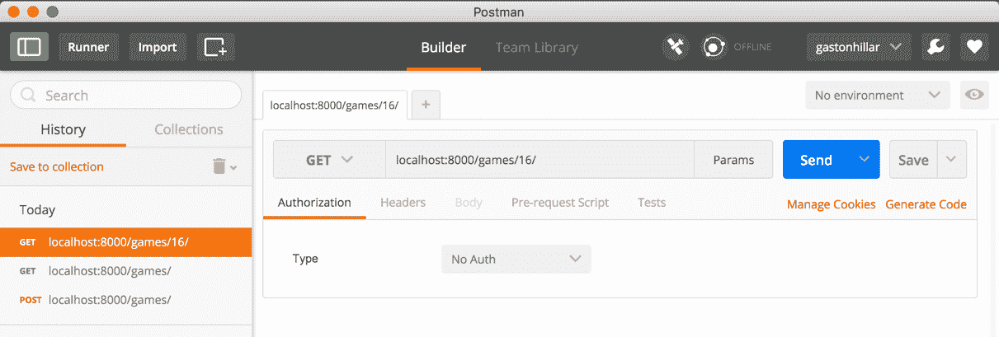

# 第三章：创建 API 视图

在本章中，我们必须运行由 Django 驱动的第一个版本的 RESTful Web 服务。我们将编写 API 视图来处理不同的 HTTP 请求，并使用命令行和 GUI 工具执行 HTTP 请求。我们将分析 Django 和 Django REST framework 如何处理每个 HTTP 请求。我们将了解：

+   创建结合序列化器类的 Django 视图

+   使用 Django 视图和请求方法进行 CRUD 操作

+   启动 Django 的开发服务器

+   使用命令行工具发送针对一组实例的 HTTP GET 请求

+   使用命令行工具发送针对单个实例的 HTTP GET 请求

+   使用命令行工具发送 HTTP GET 请求

+   使用命令行工具发送 HTTP POST 请求

+   使用命令行工具发送 HTTP PUT 请求

+   使用命令行工具发送 HTTP DELETE 请求

+   使用 Postman 发送 HTTP GET 请求

+   使用 Postman 发送 HTTP POST 请求

# 创建结合序列化器类的 Django 视图

我们已经创建了必要的模型及其序列化器。现在是时候编写处理 HTTP 请求并生成 HTTP 响应的必要元素了。现在，我们将创建使用我们之前创建的 `ToySerializer` 类的 Django 视图，以返回我们网络服务将处理的每个 HTTP 请求的实体 JSON 表示。打开 `toys/views.py` 文件。以下行显示了此文件的初始代码，只有一个导入语句和一个注释，表明我们应该创建视图：

```py
from django.shortcuts import render 

# Create your views here. 
```

我们将创建我们的第一个版本的网络服务，并使用函数来尽可能简化代码。在后续的示例中，我们将使用类和更复杂的代码。首先，通过一个简单的示例来理解 Django 和 Django REST framework 的工作方式非常重要。

现在，在 `restful01/toys/views.py` 文件中写下以下行以创建一个 `JSONResponse` 类并声明两个函数：`toy_list` 和 `toy_detail`。示例的代码文件包含在 `hillar_django_restful_03_01` 文件夹中的 `restful01/toys/views.py` 文件中：

```py
from django.shortcuts import render 
from django.http import HttpResponse 
from django.views.decorators.csrf import csrf_exempt 
from rest_framework.renderers import JSONRenderer 
from rest_framework.parsers import JSONParser 
from rest_framework import status 
from toys.models import Toy 
from toys.serializers import ToySerializer 

class JSONResponse(HttpResponse): 
    def __init__(self, data, **kwargs): 
        content = JSONRenderer().render(data) 
        kwargs['content_type'] = 'application/json' 
        super(JSONResponse, self).__init__(content, **kwargs) 

@csrf_exempt 
def toy_list(request): if request.method == 'GET': toys = Toy.objects.all() 
        toys_serializer = ToySerializer(toys, many=True) 
        return JSONResponse(toys_serializer.data) elif request.method == 'POST': toy_data = JSONParser().parse(request) 
        toy_serializer = ToySerializer(data=toy_data) 
        if toy_serializer.is_valid(): 
            toy_serializer.save() 
            return JSONResponse(toy_serializer.data, \
                status=status.HTTP_201_CREATED) 
        return JSONResponse(toy_serializer.errors, \
            status=status.HTTP_400_BAD_REQUEST) 

@csrf_exempt 
def toy_detail(request, pk): 
    try: 
        toy = Toy.objects.get(pk=pk) 
    except Toy.DoesNotExist: 
        return HttpResponse(status=status.HTTP_404_NOT_FOUND) 

    if request.method == 'GET': 
        toy_serializer = ToySerializer(toy) 
        return JSONResponse(toy_serializer.data) 

    elif request.method == 'PUT': 
        toy_data = JSONParser().parse(request) 
        toy_serializer = ToySerializer(toy, data=toy_data) 
        if toy_serializer.is_valid(): 
            toy_serializer.save() 
            return JSONResponse(toy_serializer.data) 
        return JSONResponse(toy_serializer.errors, \
            status=status.HTTP_400_BAD_REQUEST) 

    elif request.method == 'DELETE': 
        toy.delete() 
        return HttpResponse(status=status.HTTP_204_NO_CONTENT) 
```

突出的行显示了评估 `request.method` 属性值的表达式，以确定基于 HTTP 动词要执行的操作。`JSONResponse` 类是 `django.http.HttpResponse` 类的子类。`django.http.HttpResponse` 超类表示具有字符串内容的 HTTP 响应。

`JSONResponse` 类以 JSON 格式渲染其内容。该类仅声明了 `__init__` 方法，该方法创建一个 `rest_framework.renderers.JSONRenderer` 实例并调用其 `render` 方法以将接收到的数据渲染为 JSON 格式，并将返回的字节字符串保存到 `content` 本地变量中。然后，代码将 `'content_type'` 键添加到响应头中，其值为 `'application/json'`。最后，代码使用 JSON 字节字符串和添加到头部的键值对调用基类的初始化器。这样，该类就代表了一个 JSON 响应，我们在两个函数中使用它来轻松地在每个我们的网络服务将处理的 HTTP 请求中返回 JSON 响应。自 Django 1.7 以来，`django.http.JsonResponse` 类已经实现了相同的目标。然而，在这个例子中，我们也创建了我们的类，目的是为了教育目的以及理解 `HttpResponse` 和 `JSONResponse` 之间的区别。

代码在两个函数中使用 `@csrf_exempt` 装饰器以确保视图设置一个 **CSRF**（即 **跨站请求伪造**）cookie。我们这样做是为了使测试这个例子更容易，这个例子并不代表一个生产就绪的 Web 服务。我们将在稍后添加到我们的 RESTful Web 服务中安全功能。当然，理解我们不应该在配置安全性和节流规则之前将 Web 服务投入生产是非常重要的。

注意，前面的代码有很多问题，我们将在接下来的章节中分析并修复。然而，首先，我们需要了解一些基本的事情是如何工作的。

# 通过 Django 视图和请求方法理解 CRUD 操作

当 Django 服务器接收到 HTTP 请求时，Django 创建一个 `HttpRequest` 实例，具体来说是 `django.http.HttpRequest` 对象。此实例包含有关请求的元数据，这些元数据包括 HTTP 动词，如 GET、POST 或 PUT。`method` 属性提供了一个表示请求中使用的 HTTP 动词或方法的字符串。

当 Django 加载将处理请求的适当视图时，它将 `HttpRequest` 实例作为第一个参数传递给 `view` 函数。`view` 函数必须返回一个 `HttpResponse` 实例，具体来说是 `django.http.HttpResponse` 实例。

`toy_list` 函数列出所有玩具或创建一个新的玩具。该函数在 `request` 参数中接收一个 `HttpRequest` 实例。该函数能够处理两种 HTTP 动词：`GET` 和 `POST`。代码检查 `request.method` 属性的值以确定基于 HTTP 动词要执行的代码。

如果 HTTP 动词是 `GET`，表达式 `request.method == 'GET'` 将评估为 `True`，代码必须列出所有玩具。代码将检索数据库中的所有 `Toy` 对象，使用 `ToySerializer` 将它们全部序列化，并返回一个由 `ToySerializer` 序列化器生成数据的 `JSONResponse` 实例。代码使用 `many=True` 参数创建 `ToySerializer` 实例，以指定必须序列化多个实例，而不仅仅是单个实例。在底层，当 `many` 参数值设置为 `True` 时，Django 使用一个 `ListSerializer` 实例。这样，Django 能够序列化对象列表。

如果 HTTP 动词是 `POST`，代码必须根据包含在 HTTP 请求体中的 JSON 数据创建一个新的玩具。首先，代码使用一个 `JSONParser` 实例，并使用 `request` 参数调用其 `parse` 方法，该参数是 `toy_list` 函数作为参数接收的，以解析请求体中提供的作为 `JSON` 数据的玩具数据，并将结果保存到 `toy_data` 本地变量中。然后，代码使用之前检索到的数据创建一个 `ToySerializer` 实例，并调用 `is_valid` 方法来确定 `Toy` 实例是否有效。如果实例有效，代码将调用 `save` 方法将实例持久化到数据库中，并返回一个包含保存数据的 `JSONResponse`，状态等于 `status.HTTP_201_CREATED`，即 `201 Created`。

每当我们需要返回与默认的 `200 OK` 状态不同的特定状态时，使用 `rest_framework.status` 模块中定义的模块变量是一种良好的实践，避免使用硬编码的数值。如果你看到 `status=status.HTTP_201_CREATED`，就像在示例代码中那样，很容易理解状态是一个 HTTP `201 Created` 状态。如果你看到 `status=201`，你必须记住 HTTP 状态代码中的数字 201 代表什么。

`toy_detail` 函数检索、更新或删除现有的玩具。该函数接收一个 `HttpRequest` 实例作为 `request` 参数，以及要检索、更新或删除的玩具的标识符作为 `pk` 参数。该函数能够处理三种 HTTP 动词：`GET`、`PUT` 和 `DELETE`。代码检查 `request.method` 属性的值，以确定根据 HTTP 动词要执行的代码。

无论 HTTP 动词是什么，`toy_detail` 函数都会使用接收到的 `pk` 作为 `pk` 参数调用 `Toy.objects.get` 方法，从数据库中根据指定的标识符检索一个 `Toy` 实例，并将其保存到 `toy` 本地变量中。如果数据库中不存在具有指定标识符的玩具，代码将返回一个状态设置为 `status.HTTP_404_NOT_FOUND` 的 `HttpResponse`，即 `404 Not Found`。

如果 HTTP 动词是 `GET`，代码将使用 `toy` 作为参数创建一个 `ToySerializer` 实例，并以包含默认 HTTP `200 OK` 状态的 `JSONResponse` 返回序列化玩具的数据。代码将检索到的玩具序列化为 JSON 并返回到响应体中。

如果 HTTP 动词是 `PUT`，代码必须根据包含在 HTTP 请求中的 JSON 数据创建一个新的玩具，并使用它来替换现有的玩具。首先，代码使用一个 `JSONParser` 实例，并使用 `request` 作为参数调用其 `parse` 方法来解析请求中提供的作为 JSON 数据的玩具数据，并将结果保存到局部变量 `toy_data` 中。然后，代码使用从数据库中先前检索到的 `Toy` 实例（`toy`）和将替换现有数据（`toy_data`）检索到的数据创建一个 `ToySerializer` 实例。然后，代码调用 `is_valid` 方法来确定 `Toy` 实例是否有效。如果实例有效，代码将调用 `save` 方法以替换的值在数据库中持久化实例，并返回一个包含已保存数据序列化为 JSON 的 `JSONResponse` 和默认 HTTP `200 OK` 状态。如果解析的数据不生成有效的 `Toy` 实例，代码将返回一个状态等于 `status.HTTP_400_BAD_REQUEST` 的 `JSONResponse`，即 `400 Bad Request`。

如果 HTTP 动词是 `DELETE`，代码将调用从数据库中先前检索到的 `Toy` 实例（`toy`）的 `delete` 方法。对 `delete` 方法的调用将擦除我们在上一章中分析的 `toys_toy` 表中的底层行。因此，玩具将不再可用。然后，代码返回一个状态等于 `status` 的 `JSONResponse`，即 `HTTP_204_NO_CONTENT`，也就是 `204 No Content`。

# 将 URL 路由到 Django 视图和函数

现在，我们必须在 `toys` 文件夹中创建一个名为 `urls.py` 的新 Python 文件，具体来说，是 `toys/urls.py` 文件。以下行显示了该文件的代码，它定义了指定请求中必须匹配的正则表达式，以便运行在 `views.py` 文件中先前定义的特定函数。示例代码文件包含在 `hillar_django_restful_03_01` 文件夹中，位于 `restful01/toys/urls.py` 文件中：

```py
from django.conf.urls import url 
from toys import views 

urlpatterns = [ 
    url(r'^toys/$', views.toy_list), 
    url(r'^toys/(?P<pk>[0-9]+)$', views.toy_detail), 
] 
```

`urlpatterns` 列表使得将 URL 路由到视图成为可能。代码使用 `django.conf.urls.url` 函数，将必须匹配的正则表达式和定义在 `views` 模块中的 `view` 函数作为参数调用，为 `urlpatterns` 列表中的每个条目创建一个 `RegexURLPattern` 实例。

现在，我们必须替换 `restful01` 文件夹中 `urls.py` 文件中的代码，具体来说，是 `restful01/urls.py` 文件。该文件定义了根 URL 配置，因此我们必须包含在之前编写的 `toys/urls.py` 文件中声明的 URL 模式。以下行显示了 `restful01/urls.py` 文件的新代码。示例代码文件包含在 `hillar_django_restful_03_01` 文件夹中，在 `restful01/urls.py` 文件中：

```py
from django.conf.urls import url, include 

urlpatterns = [ 
    url(r'^', include('toys.urls')), 
] 
```

# 启动 Django 的开发服务器

现在，我们可以启动 Django 的开发服务器来编写和发送 HTTP 请求到我们的未加密 Web 服务。请记住，我们稍后会增加安全性。

在 Linux 或 macOS 终端，或在已激活我们之前创建的虚拟环境的 Windows 命令提示符或 Powershell 中执行以下命令。确保您位于虚拟环境主文件夹内的 `restful01` 文件夹中：

```py
    python manage.py runserver
```

以下行显示了执行上一个命令后的输出。开发服务器正在端口 `8000` 上监听：

```py
    Performing system checks...

    System check identified no issues (0 silenced).
    October 09, 2017 - 18:42:30
    Django version 1.11.5, using settings 'restful01.settings'
    Starting development server at http://127.0.0.1:8000/
    Quit the server with CTRL-BREAK.
```

使用上一个命令，我们将启动 Django 开发服务器，并且我们只能在我们的开发计算机上访问它。上一个命令在默认 IP 地址上启动开发服务器，即 `127.0.0.1` (`localhost`)。从连接到我们的局域网的其它计算机或设备无法访问此 IP 地址。因此，如果我们想从连接到我们的局域网的其它计算机或设备向我们的 API 发送 HTTP 请求，我们应该使用开发计算机的 IP 地址，`0.0.0.0`（对于 IPv4 配置）或 `::`（对于 IPv6 配置）作为开发服务器的所需 IP 地址。

如果我们为 IPv4 配置指定 `0.0.0.0` 作为所需的 IP 地址，开发服务器将在端口 8000 上监听每个接口。当我们为 IPv6 配置指定 `::` 时，它将产生相同的效果。此外，有必要在我们的防火墙（软件和/或硬件）中打开默认端口 `8000` 并配置端口转发到运行开发服务器的计算机。以下命令以 IPv4 配置启动 Django 的开发服务器，并允许从连接到我们的局域网的其它计算机和设备发出请求：

```py
    python manage.py runserver 0.0.0.0:8000 
```

如果您决定从连接到局域网的其它计算机或设备编写和发送 HTTP 请求，请记住您必须使用开发计算机分配的 IP 地址而不是 `localhost`。例如，如果计算机分配的 IPv4 IP 地址是 `192.168.2.103`，那么您应该使用 `192.168.2.103:8000` 而不是 `localhost:8000`。当然，您也可以使用主机名而不是 IP 地址。

之前解释的配置非常重要，因为移动设备可能是我们 RESTful Web 服务的消费者，我们始终希望在我们的开发环境中测试使用我们的 Web 服务和 API 的应用程序。

# 向一组实例发送 HTTP GET 请求

在第一章，“安装所需的软件和工具”中，我们安装了命令行和 GUI 工具，这些工具将允许我们编写并发送 HTTP 请求到本书中将要构建的 Web 服务。现在，我们将使用 curl 实用程序来发送 HTTP GET 请求，具体来说，是针对玩具集合的 HTTP GET 请求。如果 curl 未包含在路径中，请确保将 curl 替换为该实用程序的完整路径。

确保您让 Django 开发服务器继续运行。不要关闭运行此开发服务器的终端或命令提示符。在 Linux 或 macOS 中打开一个新的终端，或在 Windows 中打开一个命令提示符，并运行以下命令。您输入结束斜杠（`/`）非常重要，因为`/toys`不会匹配`toys/urls.py`文件中指定的任何模式。我们不会使用选项来跟随重定向。因此，我们必须输入`/toys/`，包括结束斜杠（`/`）。

```py
 curl -X GET localhost:8000/toys/
```

之前的命令将编写并发送以下 HTTP 请求：`GET http://localhost:8000/toys/`。这个请求是我们 RESTful Web Service 中最简单的情况，因为它将匹配并运行`views.toy_list`函数，即我们在`toys/views.py`文件中编写的`toy_list`函数。该函数仅接收`request`作为参数，因为 URL 模式不包含任何参数。由于 HTTP 请求的动词是`GET`，`request.method`属性等于`'GET'`，因此该函数将执行检索所有`Toy`对象并生成包含所有这些`Toy`对象的序列化 JSON 响应的代码。

以下行显示了 HTTP 请求的一个示例响应，其中包含 JSON 响应中的三个`Toy`对象：

```py
    [{"pk":3,"name":"Clash Royale play set","description":"6 figures from Clash Royale","release_date":"2017-10-09T12:10:00.776594Z","toy_category":"Playset","was_included_in_home":false},{"pk":2,"name":"Hawaiian Barbie","description":"Barbie loves Hawaii","release_date":"2017-10-09T12:11:37.090335Z","toy_category":"Dolls","was_included_in_home":true},{"pk":1,"name":"Snoopy talking action figure","description":"Snoopy speaks five languages","release_date":"2017-10-09T12:11:37.090335Z","toy_category":"Action figures","was_included_in_home":false}]
```

如我们从之前的响应中可能注意到的，curl 实用程序将 JSON 响应显示为单行，因此阅读起来有点困难。我们可以使用不同的工具，包括一些 Python 脚本，来提供更好的响应格式。然而，我们将使用我们安装在我们虚拟环境中的 HTTPie 命令行工具来完成此目的。

在这种情况下，我们知道响应的`Content-Type`头键的值是`application/json`。然而，如果我们想了解更多关于响应的细节，我们可以使用`-i`选项请求 curl 打印 HTTP 响应头及其键值对。我们可以通过输入`-iX`将`-i`和`-X`选项组合起来。

返回到 Linux 或 macOS 中的终端，或 Windows 中的命令提示符，并运行以下命令：

```py
    curl -iX GET localhost:8000/toys/
```

以下行显示了 HTTP 请求的一个示例响应。前几行显示了 HTTP 响应头，包括状态（`200 OK`）和`Content-Type: application/json`。在 HTTP 响应头之后，我们可以看到 JSON 响应中三个`Toy`对象的详细信息：

```py
    HTTP/1.0 200 OK
    Date: Tue, 10 Oct 2017 00:53:41 GMT
    Server: WSGIServer/0.2 CPython/3.6.2
    Content-Type: application/json
    X-Frame-Options: SAMEORIGIN
    Content-Length: 548

[{"pk":3,"name":"Clash Royale play set","description":"6 figures from Clash Royale","release_date":"2017-10-09T12:10:00.776594Z","toy_category":"Playset","was_included_in_home":false},{"pk":2,"name":"Hawaiian Barbie","description":"Barbie loves Hawaii","release_date":"2017-10-09T12:11:37.090335Z","toy_category":"Dolls","was_included_in_home":true},{"pk":1,"name":"Snoopy talking action figure","description":"Snoopy speaks five languages","release_date":"2017-10-09T12:11:37.090335Z","toy_category":"Action figures","was_included_in_home":false}]
```

在运行这两个请求之后，我们将在运行 Django 开发服务器的窗口中看到以下行。输出表明服务器接收到了两个使用 `GET` 动词和 `/toys/` 作为 URI 的 HTTP 请求。服务器处理了这两个 HTTP 请求，返回了状态码等于 `200`，响应长度等于 `548` 个字符。

响应长度可能不同，因为分配给每个玩具的主键值将对响应长度产生影响。`HTTP/1.1."` 后的第一个数字表示返回的状态码（`200`），第二个数字表示响应长度（`548`）：

```py
    [09/Oct/2017 22:12:37] "GET /toys/ HTTP/1.1" 200 548
    [09/Oct/2017 22:12:40] "GET /toys/ HTTP/1.1" 200 548
```

以下图像显示了 macOS 上并排的两个终端窗口。左侧的终端窗口正在运行 Django 开发服务器，并显示接收和处理的 HTTP 请求。右侧的终端窗口正在运行 `curl` 命令以生成 HTTP 请求。在编写和发送 HTTP 请求时使用类似的配置来检查输出是个好主意。请注意，由于没有使用语法高亮，JSON 输出读起来有点困难：



现在，在 Linux 或 macOS 中打开一个新的终端，或在 Windows 中打开一个新的命令提示符，并激活我们创建的虚拟环境。这样，你将能够访问我们安装在该虚拟环境中的 HTTPie 工具。

我们将使用 `http` 命令轻松地组合并发送 HTTP 请求到 `localhost:8000` 并测试 RESTful Web 服务。HTTPie 支持 curl 类似的本地主机缩写，因此我们可以使用 `:8000` 作为缩写，它展开为 `http://localhost:8000`。运行以下命令，并请记住输入结束斜杠（`/`）：

```py
 http :8000/toys/
```

之前的命令将组合并发送以下 HTTP 请求：`GET http://localhost:8000/toys/`。请求与之前使用 `curl` 命令组合的请求相同。然而，在这种情况下，HTTPie 工具将显示彩色输出，并使用多行来显示 JSON 响应，无需任何额外调整。之前的命令等同于以下指定 `GET` 方法的命令：

```py
http :8000/toys/
```

以下行展示了针对 HTTP 请求的一个示例响应，其中包含了 JSON 响应中的头部信息和三个 `Toy` 对象。与使用 curl 组合 HTTP 请求时生成的结果相比，理解响应确实更容易。HTTPie 会自动格式化接收到的 JSON 数据作为响应，并应用语法高亮，具体来说，包括颜色和格式：

```py
    HTTP/1.0 200 OK
    Content-Length: 548
    Content-Type: application/json
    Date: Tue, 10 Oct 2017 01:26:52 GMT
    Server: WSGIServer/0.2 CPython/3.6.2
    X-Frame-Options: SAMEORIGIN

    [
        {
            "description": "6 figures from Clash Royale",
            "name": "Clash Royale play set",
            "pk": 3,
            "release_date": "2017-10-09T12:10:00.776594Z",
            "toy_category": "Playset",
            "was_included_in_home": false
        },
        {
            "description": "Barbie loves Hawaii",
            "name": "Hawaiian Barbie",
            "pk": 2,
            "release_date": "2017-10-09T12:11:37.090335Z",
            "toy_category": "Dolls",
            "was_included_in_home": true
        },
        {
            "description": "Snoopy speaks five languages",
            "name": "Snoopy talking action figure",
            "pk": 1,
            "release_date": "2017-10-09T12:11:37.090335Z",
            "toy_category": "Action figures",
            "was_included_in_home": false
        }
    ] 
```

我们可以通过将 curl 命令生成的输出与其他工具结合使用来实现相同的结果。然而，HTTPie 为我们提供了与 Django 等构建的 RESTful Web 服务一起工作所需的一切。我们将使用 HTTPie 来组合和发送 HTTP 请求，但我们将始终提供等效的 curl 命令。记住，当你需要多次执行 curl 时，curl 会更快，例如当你准备自动化脚本时。

下图显示了 macOS 上并排的两个终端窗口。左侧的终端窗口正在运行 Django 开发服务器并显示接收和处理的 HTTP 请求。右侧的终端窗口正在运行 HTTPie 命令以生成 HTTP 请求。请注意，与 curl 命令生成的输出相比，JSON 输出更容易阅读：



如果我们不希望在响应中包含头部信息，可以使用 `-b` 选项执行 `http` 命令。例如，以下行执行了相同的 HTTP 请求，但不在响应输出中显示头部信息，因此输出将仅显示 JSON 响应：

```py
    http -b :8000/toys/
```

# 向单个实例发送 HTTP GET 请求

现在，我们将向单个 `Toy` 实例发送 HTTP GET 请求。我们将从之前的列表中选择一个玩具，并编写一个 HTTP 请求来仅检索所选的玩具。例如，在之前的列表中，第一个玩具的 `pk` 值等于 `3`，因为结果是根据玩具的名称按升序排序的。运行以下命令来检索此玩具。使用之前命令中检索到的第一个玩具的 `pk` 值，因为如果执行示例代码或命令多次，或者你对 `toys_toy` 表进行了更改，`pk` 数字可能会有所不同。在这种情况下，你不需要输入结束斜杠（`/`），因为 `/toys/3/` 不会匹配 `toys/urls.py` 文件中 `urlpatterns` 指定的任何模式：

```py
    http :8000/toys/3  
```

以下是对应的 `curl` 命令：

```py
    curl -iX GET localhost:8000/toys/3
```

之前的命令将组合并发送以下 HTTP 请求：`GET http://localhost:8000/toys/3/`。请求在 `/toys/` 后面有一个数字，因此它将匹配 `'^toys/(?P<pk>[0-9]+)$'` 并运行 `views.toy_detail` 函数，即 `toys/views.py` 文件中声明的 `toy_detail` 函数。该函数接收 `request` 和 `pk` 作为参数，因为 URL 模式将 `/toys/` 后面指定的数字传递给 `pk` 参数。

由于请求的 HTTP 动词是 `GET`，因此 `request.method` 属性等于 `'GET'`，因此，`toy_detail` 函数将执行检索与作为参数接收的 `pk` 值匹配的 `Toy` 对象的代码，如果找到，则生成包含此 `Toy` 对象序列化的 JSON 响应。以下行显示了 HTTP 请求的示例响应，其中 JSON 响应中匹配 `pk` 值的 `Toy` 对象：

```py
    HTTP/1.0 200 OK
    Content-Length: 182
    Content-Type: application/json
    Date: Tue, 10 Oct 2017 04:24:35 GMT
    Server: WSGIServer/0.2 CPython/3.6.2
    X-Frame-Options: SAMEORIGIN

    {
    "description": "6 figures from Clash Royale", 
    "name": "Clash Royale play set", 
    "pk": 3, 
    "release_date": "2017-10-09T12:10:00.776594Z", 
    "toy_category": "Playset", 
        "was_included_in_home": false
    }
```

现在，我们将组合并发送一个 HTTP 请求来检索一个不存在的玩具。例如，在之前的列表中，没有 `pk` 值等于 `17500` 的玩具。运行以下命令尝试检索此玩具。确保您使用一个不存在的 `pk` 值。我们必须确保实用工具将标题作为响应的一部分显示，因为响应将没有主体：

```py
    http :8000/toys/17500  
```

以下是对应的 `curl` 命令：

```py
    curl -iX GET localhost:8000/toys/17500
```

之前的命令将组合并发送以下 HTTP 请求：`GET http://localhost:8000/toys/17500`。请求与之前我们分析的那个相同，只是 `pk` 参数的数字不同。服务器将运行 `views.toy_detail` 函数，即 `toys/views.py` 文件中声明的 `toy_detail` 函数。该函数将执行检索与作为参数接收的 `pk` 值匹配的 `Toy` 对象的代码，并且由于没有与指定的 `pk` 值匹配的玩具，将抛出并捕获 `Toy.DoesNotExist` 异常。因此，代码将返回 HTTP `404 Not Found` 状态码。以下行显示了 HTTP 请求的示例标题响应：

```py
    HTTP/1.0 404 Not Found
    Content-Length: 0
    Content-Type: text/html; charset=utf-8
    Date: Tue, 10 Oct 2017 15:54:59 GMT
    Server: WSGIServer/0.2 CPython/3.6.2
    X-Frame-Options: SAMEORIGIN
```

# 制作 HTTP POST 请求

现在，我们将组合并发送一个 HTTP 请求来创建一个新的玩具：

```py
    http POST :8000/toys/ name="PvZ 2 puzzle" description="Plants vs    
    Zombies 2 puzzle" toy_category="Puzzle" was_included_in_home=false 
    release_date="2017-10-08T01:01:00.776594Z"  
```

以下是对应的 `curl` 命令。非常重要的一点是，必须使用 `-H "Content-Type: application/json"` 选项来指示 curl 应将 `-d` 选项之后指定的数据作为 `application/json` 发送，而不是默认的 `application/x-www-form-urlencoded`：

```py
    curl -iX POST -H "Content-Type: application/json" -d '{"name":"PvZ   
    2 puzzle", "description":"Plants vs Zombies 2 puzzle",    
    "toy_category":"Puzzle", "was_included_in_home": "false", 
    "release_date": "2017-10-08T01:01:00.776594Z"}' 
     localhost:8000/toys/  
```

之前的命令将组合并发送以下 HTTP 请求：`POST http://localhost:8000/toys/`，附带以下 JSON 键值对：

```py
{ 
    "name": "PvZ 2 puzzle",  
    "description":"Plants vs Zombies 2 puzzle", 
    "toy_category":"Puzzle", 
    "was_included_in_home": "false", 
    "release_date": "2017-10-08T01:01:00.776594Z" 
} 
```

请求指定 `/toys/`，因此，它将匹配正则表达式 `'^toys/$'` 并运行 `views.toy_list` 函数，即 `toys/views.py` 文件中声明的 `toy_list` 函数。该函数仅接收 `request` 作为参数，因为 URL 模式不包含任何参数。由于请求的 HTTP 方法是 `POST`，因此 `request.method` 属性等于 `'POST'`，因此该函数将执行解析请求中接收到的 JSON 数据的代码。然后，该函数创建一个新的 `Toy`，如果数据有效，则将新的 `Toy` 保存到 SQLite 数据库的 `toys_toy` 表中。如果新的 `Toy` 在数据库中成功持久化，该函数将返回 HTTP `201 Created` 状态码，并在响应体中将最近持久化的 `Toy` 序列化为 JSON。以下行显示了 HTTP 请求的示例响应，其中包含 JSON 响应中的新 `Toy` 对象：

```py
    HTTP/1.0 201 Created
    Content-Length: 171
    Content-Type: application/json
    Date: Tue, 10 Oct 2017 16:27:57 GMT
    Server: WSGIServer/0.2 CPython/3.6.2
    X-Frame-Options: SAMEORIGIN

    {
    "description": "Plants vs Zombies 2 puzzle", 
    "name": "PvZ 2 puzzle", 
    "pk": 4, 
    "release_date": "2017-10-08T01:01:00.776594Z", 
    "toy_category": "Puzzle", 
        "was_included_in_home": false
    }
```

# 发送 HTTP PUT 请求

现在，我们将组合并发送一个 HTTP 请求来更新现有的玩具，具体来说，是之前添加的玩具。我们必须检查之前响应中分配给 `pk` 的值，并将命令中的 `4` 替换为返回的值。例如，如果 `pk` 的值是 `4`，则应使用 `:8000/toys/4` 而不是 `:8000/toys/4`：

```py
http PUT :8000/toys/4 name="PvZ 3 puzzle" description="Plants vs Zombies 3 puzzle" toy_category="Puzzles & Games" was_included_in_home=false release_date="2017-10-08T01:01:00.776594Z" 
```

以下是对应的 `curl` 命令。与之前的 curl 示例一样，非常重要的一点是使用 `-H "Content-Type: application/json"` 选项来指示 `curl` 将 `-d` 选项之后指定的数据作为 `application/json` 发送，而不是默认的 `application/x-www-form-urlencoded`：

```py
curl -iX PUT -H "Content-Type: application/json" -d '{"name":"PvZ 3 puzzle", "description":"Plants vs Zombies 3 puzzle", "toy_category":"Puzzles & Games", "was_included_in_home": "false", "release_date": "2017-10-08T01:01:00.776594Z"}' localhost:8000/toys/4 
```

之前的命令将组合并发送以下 HTTP 请求：`PUT http://localhost:8000/toys/4`，并带有以下 JSON 键值对：

```py
{ 
    "name": "PvZ 3 puzzle",  
    "description":"Plants vs Zombies 3 puzzle", 
    "toy_category":"Puzzles & Games", 
    "was_included_in_home": "false", 
    "release_date": "2017-10-08T01:01:00.776594Z" 
}
```

请求在 `/toys/` 后面有一个数字，因此，它将匹配正则表达式 `'^toys/(?P<pk>[0-9]+)$'` 并运行 `views.toy_detail` 函数，即 `toys/views.py` 文件中声明的 `toy_detail` 函数。该函数接收 `request` 和 `pk` 作为参数，因为 URL 模式将 `/toys/` 后面指定的数字作为 `pk` 参数传递。由于请求的 HTTP 方法是 `PUT`，因此 `request.method` 属性等于 `'PUT'`，因此该函数将执行解析请求中接收到的 JSON 数据的代码。然后，该函数将根据这些数据创建一个 `Toy` 实例并更新数据库中的现有玩具。如果玩具在数据库中成功更新，该函数将返回 HTTP `200 OK` 状态码，并在响应体中将最近更新的 `Toy` 序列化为 JSON。以下行显示了 HTTP 请求的示例响应，其中包含 JSON 响应中的更新后的 `Toy` 对象：

```py
    HTTP/1.0 200 OK
    Content-Length: 180
    Content-Type: application/json
    Date: Tue, 10 Oct 2017 17:06:43 GMT
    Server: WSGIServer/0.2 CPython/3.6.2
    X-Frame-Options: SAMEORIGIN

    {
    "description": "Plants vs Zombies 3 puzzle", 
    "name": "PvZ 3 puzzle", 
    "pk": 4, 
    "release_date": "2017-10-08T01:01:00.776594Z", 
    "toy_category": "Puzzles & Games", 
        "was_included_in_home": false
    }
```

为了成功处理更新现有玩具的 `PUT` HTTP 请求，我们必须为所有必需的字段提供值。我们将编写并发送一个 HTTP 请求来尝试更新一个现有的玩具，我们将无法做到这一点，因为我们只为名称提供了一个值。就像之前的请求一样，我们将使用最后添加的玩具中分配给 `pk` 的值：

```py
    http PUT :8000/toys/4 name="PvZ 4 puzzle"
```

以下是对应的 `curl` 命令：

```py
    curl -iX PUT -H "Content-Type: application/json" -d '{"name":"PvZ 4   
    puzzle"}' localhost:8000/toys/4
```

之前的命令将编写并发送以下 HTTP 请求：`PUT http://localhost:8000/toys/4`，并带有以下 JSON 键值对：

```py
{  
   "name": "PvZ 4 puzzle",  
} 
```

请求将执行我们之前解释的相同代码。由于我们没有为 `Toy` 实例提供所有必需的值，`toy_serializer.is_valid()` 方法将返回 `False`，函数将返回 HTTP `400 Bad Request` 状态码，并将 `toy_serializer.errors` 属性中生成的详细信息序列化为 JSON 放入响应体中。以下行显示了 HTTP 请求的一个示例响应，其中我们的请求在 JSON 响应中没有包含值的必需字段（`description`、`release_date` 和 `toy_category`）：

```py
    HTTP/1.0 400 Bad Request
    Content-Length: 129
    Content-Type: application/json
    Date: Tue, 10 Oct 2017 17:23:46 GMT
    Server: WSGIServer/0.2 CPython/3.6.2
    X-Frame-Options: SAMEORIGIN

    {
        "description": [
            "This field is required."
    ], 
        "release_date": [
            "This field is required."
    ], 
        "toy_category": [
            "This field is required."
        ]
    }
```

当我们希望我们的 API 能够更新现有资源的单个字段，在这种情况下，是一个现有的玩具，我们应该提供一个用于 PATCH 方法的实现。PUT 方法旨在替换整个资源，而 PATCH 方法旨在对现有资源应用一个增量。我们可以在 PUT 方法的处理程序中编写代码来对现有资源应用增量，但使用 PATCH 方法执行此特定任务是一种更好的做法。我们将在稍后使用 PATCH 方法。

# 编写 HTTP DELETE 请求

现在，我们将编写并发送一个 HTTP 请求来删除一个现有的玩具，具体来说，是我们最后添加的玩具。就像我们之前的 HTTP 请求一样，我们必须检查前一个响应中分配给 `pk` 的值，并将命令中的 `4` 替换为返回的值：

```py
    http DELETE :8000/toys/4
```

以下是对应的 `curl` 命令：

```py
    curl -iX DELETE localhost:8000/toys/4
```

之前的命令将组成并发送以下 HTTP 请求：`DELETE http://localhost:8000/toys/4`。请求在`/toys/`之后有一个数字，因此它将匹配正则表达式`'^toys/(?P<pk>[0-9]+)$'`并运行`views.toy_detail`函数，即`toys/views.py`文件中声明的`toy_detail`函数。该函数接收`request`和`pk`作为参数，因为 URL 模式将`/toys/`之后指定的数字传递给`pk`参数。由于请求的 HTTP 动词是`DELETE`，所以`request.method`属性等于`'DELETE'`，因此该函数将执行解析请求中接收到的 JSON 数据的代码。然后，该函数从这个数据创建一个`Toy`实例并删除数据库中的现有玩具。如果玩具在数据库中成功删除，则函数返回 HTTP `204 No Content`状态码。以下行显示了成功删除现有玩具后的 HTTP 请求的示例响应：

```py
    HTTP/1.0 204 No Content
    Content-Length: 0
    Content-Type: text/html; charset=utf-8
    Date: Tue, 10 Oct 2017 17:45:40 GMT
    Server: WSGIServer/0.2 CPython/3.6.2
    X-Frame-Options: SAMEORIGIN 
```

# 使用 Postman 进行 HTTP GET 请求

现在，我们将使用我们在第一章中安装的 GUI 工具之一，即 Postman。我们将使用此 GUI 工具来组成并发送 HTTP 请求到 Web 服务。

第一次运行 Postman 时，您将看到一个模态窗口，提供对最常见操作的快捷方式。请确保您关闭此模态窗口，以便我们可以专注于 Postman 的主 UI。

我们将使用 Postman 中的“构建器”选项卡来轻松地组成并发送各种 HTTP 请求到`localhost:8000`，并使用此 GUI 工具测试 RESTful Web 服务。Postman 不支持 curl-like 的 localhost 简写，因此我们无法在用 HTTPie 组成请求时使用相同的简写。

在“输入请求 URL”文本框左侧的下拉菜单中选择“GET”，并在下拉菜单右侧的文本框中输入`localhost:8000/toys/`。然后，点击发送，Postman 将显示以下信息：

+   状态：`200 OK`。

+   时间：请求处理所需的时间。

+   大小：响应的大致大小（包括主体大小和头部大小）。

+   主体：响应的主体，所有玩具以 JSON 格式格式化，并带有语法高亮。主体的默认视图是“美化”，并且它激活语法高亮。

以下截图显示了 Postman 中 HTTP GET 请求到`localhost:8000/toys/`的 JSON 响应主体。



点击“正文”和“Cookies”选项卡右侧的“头部”选项卡来读取响应头部。以下截图显示了 Postman 为之前响应显示的响应头部布局。请注意，Postman 在响应右侧显示状态，并且不将其包括在头部键值对的第一个行中，就像我们使用 `curl` 和 `http` 命令行工具时那样。



# 使用 Postman 制作 HTTP POST 请求

现在，我们将使用 Postman 中的“构建器”选项卡来编写并发送一个 HTTP POST 请求以创建一个新的玩具。请执行以下步骤：

1.  点击显示上一个请求的选项卡右侧的加号（**+**）按钮。这样，您将创建一个新的选项卡。

1.  在位于右上角的“新建”下拉菜单中选择“请求”。

1.  在“输入请求 URL”文本框左侧的下拉菜单中选择“POST”。

1.  在右侧的下拉菜单中的文本框中输入 `localhost:8000/toys/`。

1.  在“正文”选项卡中，点击“正文”位于“授权”和“头部”右侧，在编写请求的面板中。

1.  激活“原始”单选按钮，并在二进制单选按钮右侧的下拉菜单中选择“JSON (application/json)”。Postman 将自动添加 `Content-type = application/json` 头部，因此您会注意到“头部”选项卡将被重命名为“头部（1）”，这表示我们已为请求头部指定了一个键值对。

1.  在单选按钮下方的文本框中输入以下行：

```py
{ 
    "name": "Wonderboy puzzle",  
    "description":"The Dragon's Trap puzzle", 
    "toy_category":"Puzzles & Games", 
    "was_included_in_home": "false", 
    "release_date": "2017-10-03T01:01:00.776594Z" 
} 
```

以下截图显示了 Postman 中的请求正文：



我们遵循了创建具有 JSON 主体和指定创建新玩具所需键值对的 HTTP POST 请求的必要步骤。点击“发送”，Postman 将显示以下信息：

+   状态：`201 已创建`

+   时间：请求处理所需的时间

+   大小：响应的大致大小（正文大小加头部大小之和）

+   正文：以 JSON 格式格式化并带有语法高亮的最近添加的玩具的响应正文

以下截图显示了 Postman 中 HTTP POST 请求的 JSON 响应正文：



如果我们想使用 Postman 编写并发送一个 HTTP PUT 请求，必须遵循之前解释的步骤，在请求体中提供 JSON 数据。

Postman 包含的一个很好的功能是，我们可以通过浏览 Postman 窗口左侧显示的已保存历史记录，轻松地回顾和再次运行我们已发送的 HTTP 请求。历史记录面板显示了一个列表，其中包含每个我们编写的 HTTP 请求的 HTTP 动词和 URL。我们只需点击所需的 HTTP 请求，然后点击发送即可再次运行它。以下截图显示了历史记录面板中的许多 HTTP 请求和第一个执行的 HTTP GET 请求，以便可以轻松地重新发送：



# 测试你的知识

让我们看看你是否能正确回答以下问题：

1.  在`urls.py`文件中声明的`urlpatterns`列表使得以下操作成为可能：

    1.  将 URL 路由到 Django 模型

    1.  将 URL 路由到 Django 视图

    1.  将 URL 路由到 Python 原始类型

1.  当 Django 服务器接收到 HTTP 请求时，Django 会创建以下哪个类的实例？

    1.  `django.restframework.HttpRequest`

    1.  `django.http.HttpRequest`

    1.  `django.http.Request`

1.  视图函数必须返回以下哪个类的实例？

    1.  `django.http.HttpResponse`

    1.  `django.http.Response`

    1.  `django.restfremework.HttpResponse`

1.  每当你需要返回一个与默认`200 OK`状态不同的特定状态时，使用以下哪个模块中定义的模块变量是一个好习惯？

    1.  `rest_framework.HttpStatus`

    1.  `django.status`

    1.  `rest_framework.status`

1.  如果你想检索一个主键值等于`10`的 Toy 实例并将其保存到 toy 变量中，你应该编写哪一行代码？

    1.  toy = Toy.get_by(pk=10)

    1.  toy = Toy.objects.all(pk=10)

    1.  toy = Toy.objects.get(pk=pk)

正确答案包含在[附录](https://cdp.packtpub.com/django_restful_web_services__/wp-admin/post.php?post=44&action=edit#post_454)，*解决方案*中。

# 摘要

在本章中，我们执行了第一个版本的简单 Django RESTful Web 服务，该服务与 SQLite 数据库交互。我们编写了 API 视图来处理玩具集合和特定玩具上的各种 HTTP 请求。我们使用了以下 HTTP 动词：GET、POST 和 PUT。我们配置了 URL 模式列表，将 URL 路由到视图。

然后，我们启动了 Django 开发服务器，并使用命令行工具（curl 和 HTTPie）向我们的 RESTful Web 服务发送各种 HTTP 请求。我们学习了 Django 和我们的代码如何处理 HTTP 请求。最后，我们使用 Postman，一个图形用户界面工具，来编写并发送其他 HTTP 请求到我们的 RESTful Web 服务。

现在我们已经了解了使用 Django REST framework 和简单的 SQLite 数据库构建 RESTful Web Service 的基础知识，我们将使用一个功能强大的 PostgreSQL 数据库，使用基于类的视图代替函数视图，并且我们将利用 Django REST framework 中包含的先进功能来处理不同的内容类型，而无需编写大量代码。我们将在下一章中介绍这些主题。
