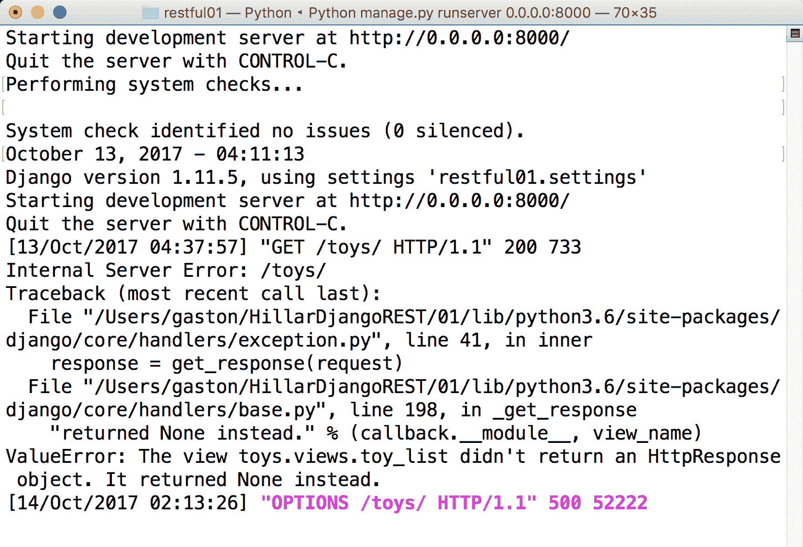
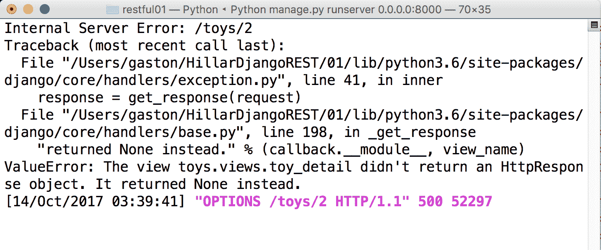

# 第四章：使用 APIView 类的泛化行为

在本章中，我们将改进我们的简单 RESTful Web 服务。我们将使其能够与各种内容类型一起工作，而无需编写大量代码。我们将利用 Django REST framework 中的高级功能和泛化行为，以启用多个解析器和渲染器。我们将了解：

+   利用模型序列化器

+   理解接受和返回的内容类型

+   使用命令行工具发送不支持的 HTTP OPTIONS 请求

+   理解作为包装器的装饰器

+   使用装饰器启用不同的解析器和渲染器

+   利用内容协商类

+   使用命令行工具发送支持的 HTTP OPTIONS 请求

+   与不同内容类型一起工作

+   使用不支持的 HTTP 动词发送 HTTP 请求

# 利用模型序列化器

在 第一章，*安装所需的软件和工具*中，我们创建了玩具模型（`Toy` 类）及其序列化器（`ToySerializer` 类）。当我们编写 `ToySerializer` 类的代码时，我们必须声明许多与 `Toy` 类中使用的相同名称的属性。`ToySerializer` 类是 `rest_framework.serializers.Serializer` 超类的子类；它声明了我们将手动映射到适当类型的属性，并覆盖了 `create` 和 `update` 方法。然而，我们重复了很多已经在玩具模型中包含的代码和信息，例如指定每个字符串字段最大长度的 `types` 和 `max_length` 值。

现在，我们将利用模型序列化器来简化代码并避免重复模型中已经包含的信息。我们将创建一个新的 `ToySerializer` 类版本，它将继承自 `rest_framework.serializers.ModelSerializer` 超类，而不是继承自 `rest_framework.serializers.ModelSerializer` 超类。

`ModelSerializer` 类通过从我们必须指定的相关模型类检索元数据来自动填充一组默认字段和默认验证器。此外，`ModelSerializer` 类为 `create` 和 `update` 方法提供了默认实现。在这种情况下，我们将利用这些默认实现，因为它们将适合提供我们需要的 `create` 和 `update` 方法。

进入 `restful01/toys` 文件夹并打开 `serializers.py` 文件。示例代码文件包含在 `hillar_django_restful_04_01` 文件夹中的 `restful01/toys/serializers.py` 文件中。将此文件中的代码替换为以下声明新版本 `ToySerializer` 类的代码：

```py
from rest_framework import serializers 
from toys.models import Toy 

class ToySerializer(serializers.ModelSerializer): 
    class Meta: 
        model = Toy 
        fields = ('id',  
                  'name',  
                  'description', 
                  'release_date', 
                  'toy_category',  
                  'was_included_in_home')
```

新版本的 `ToySerializer` 类声明了一个 `Meta` 内部类，该类声明了以下两个属性：

+   `model`: 此属性指定与序列化器相关的模型，即 `Toy` 类

+   `fields`：此属性指定了一个包含`string`值的元组，这些值指示我们想要包含在从相关模型（`Toy`类）序列化中的字段名称

新版的`ToySerializer`类不需要重写`create`或`update`方法，因为`ModelSerializer`类提供的通用行为在这种情况下就足够了。`ModelSerializer`超类为这两个方法提供了实现。

通过我们所做的更改，我们从`ToySerializer`类中移除了一大块代码。在新版本中，我们只需在元组中指定相关的模型和所需的字段集。现在，与玩具字段相关的类型和`max_length`值仅包含在`Toy`类中。

如果您有使用 Django Web 框架的先前经验，您会意识到 Django REST 框架中的`Serializer`和`ModelSerializer`类与 Django 中的`Form`和`ModelForm`类相似。

您可以按*Ctrl* + *C*来退出 Django 的开发服务器并执行我们在第三章，*创建 API 视图*，中学到的命令，以重新启动服务器。在这种情况下，我们只编辑了一个文件，如果您没有停止开发服务器，当我们将更改保存到文件时，Django 将检测到这些更改，并自动重新启动服务器。

以下行显示了在您保存编辑后的 Python 文件更改后将会看到的示例输出。这些行表明 Django 已重新启动开发服务器并成功执行了系统检查，没有发现任何问题：

```py
    System check identified no issues (0 silenced).
    October 13, 2017 - 04:11:13
    Django version 1.11.5, using settings 'restful01.settings'
    Starting development server at http://0.0.0.0:8000/
    Quit the server with CONTROL-C. 
```

您可以使用我们在第三章中使用的命令行和 GUI 工具，*创建 API 视图*，来测试我们利用模型序列化器优势的新版 RESTful Web Service。其行为将与上一版本相同。然而，我们确实减少了需要维护的代码量，并去除了重复的数据。

# 理解接受和返回的内容类型

到目前为止，我们的 RESTful Web Service 一直使用 JSON 作为响应体。我们在[第三章](https://cdp.packtpub.com/django_restful_web_services__/wp-admin/post.php?post=61&action=edit#post_56)，*创建 API 视图*，中`toys/views.py`文件编写的代码声明了一个`JSONResponse`类和两个基于函数的视图。这些函数在需要返回 JSON 数据时返回`JSONResponse`，在响应只是一个 HTTP 状态码时返回`django.Http.Response.HttpResponse`实例。无论 HTTP 请求头中指定的接受内容类型如何，视图函数始终在响应体中提供相同的内容：JSON。

运行以下命令以检索所有玩具，并将 `Accept` 请求头键设置为 `text/html`。请记住，我们创建的虚拟环境（[第三章](https://cdp.packtpub.com/django_restful_web_services__/wp-admin/post.php?post=61&action=edit#post_56)，*创建 API 视图*）必须激活，以便运行下一个 `http` 命令：

```py
    http :8000/toys/ Accept:text/html 
```

以下是对应的 `curl` 命令：

```py
 curl -H "Accept: text/html" -iX GET localhost:8000/toys/ 
```

之前的命令将组合并发送以下 HTTP 请求：`GET http://localhost:8000/toys/`。这些命令指定请求头中的 `Accept` 键的值为 `text/html`。这样，HTTP 请求表明它接受 `text/html` 格式的响应。

请求的响应头将包括以下行：

```py
    Content-Type: application/json 
```

现在，运行以下命令以检索所有玩具，并将 `Accept` 请求头键设置为不同的值，即 `text/html`。

运行以下命令以检索所有玩具，并将 `Accept` 请求头键设置为 `application/json`：

```py
   http :8000/toys/ Accept:application/json
```

以下是对应的 `curl` 命令：

```py
 curl -H "Accept: application/json" -iX GET localhost:8000/toys/ 
```

之前的命令将组合并发送以下 HTTP 请求：`GET http://localhost:8000/toys/`。这些命令指定请求头中的 `Accept` 键的值为 `application/json`。这样，HTTP 请求表明它接受 `application/json` 格式的响应。

请求的响应头将包括以下行：

```py
    Content-Type: application/json
```

第一组命令为 `Accept` 请求头键定义了 `text/html` 值。第二组命令为 `Accept` 请求头键定义了 `application/json` 值。然而，它们都产生了相同的结果，并且响应始终是 JSON 格式。视图函数没有考虑到 HTTP 请求中指定的 `Accept` 请求头键的值。无论 `Accept` 请求头键的值是什么，响应始终是 JSON 格式。

我们希望提供对其他格式的支持。然而，我们不想为此编写大量的代码。因此，我们将利用 Django REST 框架中包含的额外功能，这将使我们能够轻松地为我们的 RESTful Web 服务支持额外的格式。

# 使用命令行工具发送不支持的 HTTP OPTIONS 请求

有时，我们不知道在 RESTful Web 服务中，资源或资源集合支持哪些 HTTP 方法或动词。为了解决这个问题，我们可以组合并发送一个使用 `OPTIONS` HTTP 动词和资源或资源集合的 URL 的 HTTP 请求。

如果 RESTful 网络服务为资源或资源集合实现了 `OPTIONS` HTTP 动词，它将在响应头部中构建一个带有 `Allow` 键的响应。此键的值将包括一个以逗号分隔的 HTTP 动词或方法列表，它支持这些动词或方法。此外，响应头部还将包括有关其他支持选项的附加信息，例如它能够从请求中解析的内容类型以及它能够在响应中呈现的内容类型。

例如，如果我们想知道玩具收藏支持哪些 HTTP 动词，我们可以运行以下命令：

```py
    http OPTIONS :8000/toys/
```

注意，该命令将在 Django 开发服务器中生成错误。

下面的命令是等效的 curl 命令：

```py
    curl -iX OPTIONS localhost:8000/toys/
```

之前的命令将组合并发送以下 HTTP 请求：`OPTIONS http://localhost:8000/toys/`。请求指定了 `/toys/`，因此它将匹配 `'^toys/$'` 正则表达式，并运行 `views.toy_list` 函数，即 `toys/views.py` 文件中声明的 `toy_list` 函数。该函数仅在 `request.method` 等于 `'GET'` 或 `'POST'` 时运行代码。在这种情况下，`request.method` 等于 `'OPTIONS'`，因此该函数不会运行任何代码。该函数不会返回预期的 `HttpResponse` 实例。

缺少预期的 `HttpResponse` 实例会在 Django 开发服务器中生成内部服务器错误。开发服务器的控制台输出将显示关于内部服务器错误的详细信息以及类似于下一张截图中的跟踪回溯。最后几行表明存在一个 `ValueError`，因为 `toys_list` 函数没有返回 `HttpResponse` 实例，而是返回了 `None`：



以下行显示了作为 HTTP 请求结果显示的输出头部。由于 Django 的调试模式被激活，响应还包括一个详细的 HTML 文档，其中包含大量关于错误的详细信息。我们收到 HTTP `500 内部服务器错误` 状态码。显然，我们不想在准备好的生产级网络服务中提供所有这些信息，我们将禁用调试模式：

```py
    HTTP/1.0 500 Internal Server Error
    Content-Length: 52222
    Content-Type: text/html
    Date: Tue, 10 Oct 2017 17:46:34 GMT
    Server: WSGIServer/0.2 CPython/3.6.2
    Vary: Cookie
    X-Frame-Options: SAMEORIGIN
```

我们不希望我们的网络服务在接收到 `OPTIONS` 动词的请求时，无论是针对有效资源还是资源集合，都返回 HTTP `500 内部服务器错误状态码`。显然，我们希望提供一个更一致的 Web 服务，并且当接收到带有 `OPTIONS` 动词的请求时，无论是针对玩具资源还是玩具收藏，我们都希望提供一个准确的响应。

如果我们使用`OPTIONS`动词对一个现有的玩具资源进行组合和发送 HTTP 请求，我们将在开发服务器的控制台输出中看到相同的错误，以及一个带有 HTTP `500 Internal Server Error`状态码的类似响应。`views.toy_detail`函数仅在`request.method`等于`'GET'`、`'PUT'`或`'DELETE'`时运行代码。因此，就像上一个案例一样，`toys_detail`函数不会返回`HttpResponse`实例，而是返回`None`。

以下命令将在我们尝试查看 ID 或主键等于`2`的玩具资源提供的选项时产生所解释的错误。确保将`2`替换为配置中现有玩具的主键值：

```py
    http OPTIONS :8000/toys/2
```

以下是对应的 curl 命令：

```py
    curl -iX OPTIONS localhost:8000/toys/2
```

以下截图显示了在运行之前的 HTTP 请求后，开发服务器控制台输出中显示的内部服务器错误详情和跟踪回溯：



# 理解作为包装器的装饰器

现在，我们将对`toys/views.py`文件中的代码进行一些修改，以提供对 RESTful Web Service 中`OPTIONS`动词的支持。具体来说，我们将利用 Django REST framework 提供的装饰器。

我们将使用在`rest_framework.decorators`模块中声明的`@api_view`装饰器。我们将把这个装饰器应用到我们的基于函数的视图上：`toys_list`和`toys_detail`。

`@api_view`装饰器允许我们指定应用该装饰器的函数可以处理哪些 HTTP 动词。如果路由到视图函数的请求包含的 HTTP 动词不在作为`@api_view`装饰器的`http_method_names`参数指定的字符串列表中，默认行为会返回一个带有 HTTP `405 Method Not Allowed`状态码的响应。

这样，我们确保每当 RESTful Web Service 收到一个不在我们函数视图考虑范围内的 HTTP 动词时，我们不会在 Django 中生成意外和不受欢迎的错误。装饰器为不支持的 HTTP 动词或方法生成适当的响应。此外，通过阅读我们的函数视图声明，我们可以轻松理解哪些 HTTP 动词由该函数处理。

在我们使用`@api_view`装饰器时，理解底层发生的事情非常重要。这个装饰器是一个包装器，它将基于函数的视图转换为`rest_framework.views.APIView`类的子类。这个类是 Django REST 框架中所有视图的基类。

在接下来的示例中，我们将使用基于类的视图，并且我们将获得我们已经分析过的基于装饰器的函数视图相同的益处。

此外，装饰器使用我们指定的支持 HTTP 动词的字符串列表来构建具有 `OPTIONS` HTTP 动词的请求的响应。自动生成的响应包括支持的方法、解析器和渲染能力。换句话说，响应包括函数能够理解的数据格式以及函数可以生成用于响应的数据格式。

如前所述，我们当前版本的 RESTful Web 服务只能将 JSON 作为其输出格式。装饰器的使用确保了当 Django 调用我们的视图函数时，我们总是在 `request` 参数中接收到 `rest_framework.request.Request` 类的实例。此外，装饰器处理当我们的函数视图访问 `request.data` 属性并且存在解析问题时抛出的 `ParserError` 异常。

# 使用装饰器启用不同的解析器和渲染器

我们将只修改一个文件。保存更改后，Django 开发服务器将自动重启。然而，您可以选择在完成所有必要的更改后停止 Django 开发服务器并重新启动。

我们将进行必要的更改，使用之前引入的 `@api_view` 装饰器，利用 `APIView` 类提供的通用行为，使 RESTful Web 服务能够与不同的解析器和渲染器一起工作。

现在，前往 `restful01/toys` 文件夹并打开 `views.py` 文件。将此文件中的代码替换为以下行。然而，请注意，已经删除了许多行，例如声明 `JSONResponse` 类的行。示例代码文件包含在 `hillar_django_restful_04_02` 文件夹中，位于 `restful01/toys/views.py` 文件：

```py
from django.shortcuts import render 
from rest_framework import status 
from toys.models import Toy 
from toys.serializers import ToySerializer
from rest_framework.decorators import api_view 
from rest_framework.response import Response 

@api_view(['GET', 'POST']) 
def toy_list(request): 
    if request.method == 'GET': 
        toys = Toy.objects.all() 
        toys_serializer = ToySerializer(toys, many=True) 
        return Response(toys_serializer.data) 

    elif request.method == 'POST': 
        toy_serializer = ToySerializer(data=request.data) 
        if toy_serializer.is_valid(): 
            toy_serializer.save() 
            return Response(toy_serializer.data, status=status.HTTP_201_CREATED) 
        return Response(toy_serializer.errors, status=status.HTTP_400_BAD_REQUEST) 

@api_view(['GET', 'PUT', 'DELETE']) 
def toy_detail(request, pk): 
    try: 
        toy = Toy.objects.get(pk=pk) 
    except Toy.DoesNotExist: 
        return Response(status=status.HTTP_404_NOT_FOUND) 

    if request.method == 'GET': 
        toy_serializer = ToySerializer(toy) 
        return Response(toy_serializer.data) 

    elif request.method == 'PUT': 
        toy_serializer = ToySerializer(toy, data=request.data) 
        if toy_serializer.is_valid(): 
            toy_serializer.save() 
            return Response(toy_serializer.data) 
        return Response(toy_serializer.errors, status=status.HTTP_400_BAD_REQUEST) 

    elif request.method == 'DELETE': 
        toy.delete() 
        return Response(status=status.HTTP_204_NO_CONTENT) 
```

新代码为两个函数 `toy_list` 和 `toy_detail` 应用了 `@api_view` 装饰器。此外，新代码删除了 `JSONResponse` 类并使用了更通用的 `rest_framework.response.Response` 类。

我们不得不从函数中删除对 `rest_framework.parsers.JSONParser` 类的使用，以便能够使用不同的解析器。这样，我们就停止了只与 JSON 一起工作的解析器。在旧版本的代码中，当 `request.method` 属性等于 `'POST'` 时，`toy_list` 函数执行以下两行：

```py
toy_data = JSONParser().parse(request) 
toy_serializer = ToySerializer(data=toy_data) 
```

在新代码中，我们删除了调用 `JSONParser().parse` 方法的第一行，该方法只能解析 JSON 内容。新代码用以下单行替换了之前的两行，该行将 `request.data` 作为 `data` 参数传递以创建一个新的 `ToySerializer` 实例：

```py
toy_serializer = ToySerializer(data=request.data) 
```

在旧版本的代码中，当 `request.method` 属性等于 `'PUT'` 时，`toy_detail` 函数执行以下两行：

```py
toy_data = JSONParser().parse(request) 
toy_serializer = ToySerializer(toy, data=toy_data)
```

我们对 `toy_list` 函数中的代码进行了类似的编辑。我们删除了调用 `JSONParser().parse` 方法的第一行，该方法只能解析 JSON 内容。新代码用以下单行替换了之前的两行，该行将 `toy` 作为第一个参数，将 `request.data` 作为 `data` 参数传递，以创建一个新的 `ToySerializer` 实例：

```py
toy_serializer = ToySerializer(toy, data=request.data) 
```

# 利用内容协商类

`APIView` 类为每个视图定义了默认设置，我们可以通过在设置模块中指定所需的值来覆盖这些设置，即 `restful01/settings.py` 文件。还可能在子类中覆盖类属性。在这种情况下，我们不会在设置模块中进行更改，但我们必须了解 `APIView` 类使用的默认设置。我们添加了 `@api_view` 装饰器，它自动使 `APIView` 使用这些设置。

`DEFAULT_PARSER_CLASSES` 设置键的值指定了一个字符串元组，其值表示我们想要用于解析后端的默认类。以下行显示了默认值：

```py
( 
    'rest_framework.parsers.JSONParser', 
    'rest_framework.parsers.FormParser', 
    'rest_framework.parsers.MultiPartParser' 
) 
```

当我们使用 `@api_view` 装饰器时，RESTful Web 服务将能够通过适当的解析器处理以下任何内容类型。因此，我们将能够使用 `request.data` 属性来检索这些内容类型的键和值：

+   `application/json`: 由 `rest_framework.parsers.JSONParser` 类解析

+   `application/x-www-form-urlencoded`: 由 `rest_framework.parsers.FormParser` 类解析

+   `multipart/form-data`: 由 `rest_framework.parsers.MultiPartParser` 类解析

当我们在函数中访问 `request.data` 属性时，Django REST 框架检查传入请求中的 `Content-Type` 头部的值，并确定适当的解析器来解析请求内容。如果我们使用之前解释的默认值，Django REST 框架将能够解析之前列出的所有内容类型。请注意，请求必须在请求头中指定 `Content-Type` 键的适当值。

`DEFAULT_RENDERER_CLASSES` 设置键的值指定了一个字符串元组，其值表示我们想要用于渲染后端的默认类。以下行显示了默认值：

```py
( 
    'rest_framework.renderers.JSONRenderer', 
    'rest_framework.renderers.BrowsableAPIRenderer', 
) 
```

当我们使用 `@api_view` 装饰器时，RESTful Web 服务将能够通过适当的渲染器渲染以下任何内容类型。我们进行了必要的更改，以便与 `rest_framework.response.Response` 实例一起工作，以便能够处理这些内容类型：

+   `application/json`: 由 `rest_framework.response.JSONRenderer` 类渲染

+   `text/html`: 由 `rest_framework.response.BrowsableAPIRenderer` 类渲染

到目前为止，我们了解了解析器和渲染器的默认设置。这个谜题的另一个部分必须根据传入请求中指定的要求选择适当的渲染器。

默认情况下，`DEFAULT_CONTENT_NEGOTIATION_CLASS` 的值是 `rest_framework.negotiation.DefaultContentNegotiation` 类。当我们使用装饰器时，网络服务将使用这个内容协商类来根据传入请求选择适当的渲染器。这样，当一个请求指定它将接受 `text/html` 时，内容协商类会选择 `rest_framework.renderers.BrowsableAPIRenderer` 来渲染响应并生成 `text/html` 而不是 `application/json`。

在旧版本的代码中，我们在函数中使用了 `JSONResponse` 和 `HttpResponse` 类。新版本用 `rest_framework.response.Response` 类替换了这两个类的使用。这样，代码就利用了内容协商功能。`Response` 类将提供的数据渲染成适当的内容类型，并将其返回给发起请求的客户端。

# 使用命令行工具发送支持的 HTTP OPTIONS 请求

现在，我们将利用我们在代码中所做的所有更改，并将组合并发送 HTTP 请求，使我们的 RESTful 网络服务能够与不同的内容类型一起工作。确保你已经保存了所有更改。如果你停止了 Django 的开发服务器，你将不得不再次启动它，就像我们在第三章 创建 API 视图中学习的那样，在 *启动 Django 开发服务器* 部分中，以启动 Django 开发服务器。

我们想知道玩具集合支持哪些 HTTP 动词，也就是说，我们想利用 `OPTIONS` 动词。运行以下命令。这次，命令不会产生错误。记住，我们之前章节中创建的虚拟环境必须激活，才能运行下一个 `http` 命令：

```py
    http OPTIONS :8000/toys/
```

以下是对应的 `curl` 命令：

```py
 curl -iX OPTIONS localhost:8000/toys/
```

之前的命令将组合并发送以下 HTTP 请求：`OPTIONS http://localhost:8000/toys/`。该请求最终将运行 `views.toy_list` 函数，即 `toys/views.py` 文件中声明的 `toy_list` 函数。我们给这个函数添加了 `@api_view` 装饰器，因此该函数能够确定支持的 HTTP 动词、启用的解析和渲染选项。以下行显示了输出：

```py
 HTTP/1.0 200 OK
    Allow: POST, OPTIONS, GET
    Content-Length: 167
    Content-Type: application/json
    Date: Mon, 16 Oct 2017 04:28:32 GMT
    Server: WSGIServer/0.2 CPython/3.6.2
    Vary: Accept, Cookie
    X-Frame-Options: SAMEORIGIN

    {
        "description": "", 
        "name": "Toy List", 
        "parses": [
            "application/json", 
            "application/x-www-form-urlencoded", 
            "multipart/form-data"
        ], 
        "renders": [
            "application/json", 
            "text/html"
        ]
    }

```

响应头包括一个 `Allow` 键，其值为逗号分隔的 HTTP 动词列表，表示资源集合支持的 HTTP 动词：`POST, OPTIONS, GET`。我们的请求没有指定允许的内容类型，因此函数使用默认的 `application/json` 内容类型渲染响应。

响应体指定资源集合能够解析的`Content-type`，在`"parses"`键的值中，以及资源集合能够渲染的`Content-type`，在`"renders"`键的值中。

运行以下命令以使用`OPTIONS`动词为玩具资源编写并发送 HTTP 请求。别忘了将`2`替换为你配置中现有玩具的主键值：

```py
    http OPTIONS :8000/toys/2
```

以下是与 curl 等效的命令：

```py
    curl -iX OPTIONS localhost:8000/toys/2
```

之前的命令将编写并发送以下 HTTP 请求：`OPTIONS http://localhost:8000/toys/2`。请求最终将运行`views.toy_detail`函数，即`toys/views.py`文件中声明的`toy_detail`函数。我们还向这个函数添加了`@api_view`装饰器，因此它能够确定支持的 HTTP 动词、启用的解析和渲染选项。以下是一些示例输出：

```py
    HTTP/1.0 200 OK
    Allow: DELETE, PUT, OPTIONS, GET
    Content-Length: 169
    Content-Type: application/json
    Date: Mon, 16 Oct 2017 04:30:04 GMT
    Server: WSGIServer/0.2 CPython/3.6.2
    Vary: Accept, Cookie
    X-Frame-Options: SAMEORIGIN

    {
        "description": "", 
        "name": "Toy Detail", 
        "parses": [
            "application/json", 
            "application/x-www-form-urlencoded", 
            "multipart/form-data"
        ], 
        "renders": [
            "application/json", 
            "text/html"
        ]
    }

```

响应头包括一个`Allow`键，其值为以逗号分隔的 HTTP 动词列表，表示资源支持的 HTTP 动词：`DELETE, PUT, OPTIONS, GET`。响应体指定资源能够解析的`Content-type`，在`"parses"`键的值中，以及资源集合能够渲染的`Content-type`，在`"renders"`键的值中。由于一切由装饰器和`APIView`类处理，资源及其资源集合可以解析和渲染相同的内容类型。

# 处理不同的内容类型

在第三章*创建 API 视图*中，当我们编写并发送`POST`和`PUT`命令时，我们必须使用`-H "Content-Type: application/json"`选项来指示 curl 将`-d`选项之后指定的数据作为`application/json`发送。我们必须使用此选项，因为 curl 的默认内容类型是`application/x-www-form-urlencoded`。

现在，我们的 RESTful Web 服务不仅支持 JSON，还可以解析`POST`和`PUT`请求中指定的`application/x-www-form-urlencoded`和`multipart/form-data`数据。因此，我们可以编写并发送一个发送数据为`application/x-www-form-urlencoded`的`POST`命令。

我们将编写并发送一个 HTTP 请求来创建一个新的玩具。在这种情况下，我们将使用 HTTP 的`-f`选项。

此选项将命令行中的数据项序列化为表单字段，并将`Content-Type`头键设置为`application/x-www-form-urlencoded`值。运行下一个命令：

```py
http -f POST :8000/toys/ name="Ken in Rome" description="Ken loves Rome" toy_category="Dolls" was_included_in_home=false release_date="2017-10-09T12:11:37.090335Z" 
```

以下是与创建新玩具等效的 curl 命令。请注意，我们没有使用`-H`选项，curl 将使用默认的`application/x-www-form-urlencoded`发送数据：

```py
curl -iX POST -d '{"name":"Ken in Rome", "description": "Ken loves Rome", "toy_category":"Dolls", "was_included_in_home": "false", "release_date": "2017-10-09T12:11:37.090335Z"}' localhost:8000/toys/ 
```

之前的命令将编写并发送以下 HTTP 请求：`POST http://localhost:8000/toys/`，其中`Content-Type`头键设置为`application/x-www-form-urlencoded`值，并包含以下数据：

```py
name=Ken+in+Rome&description=Ken+loves+Rome&toy_category=Dolls&was_included_in_home=false&release_date=2017-10-09T12%3A11%3A37.090335Z 
```

请求指定 `/toys/`，因此，它将匹配 `'^toys/$'` 正则表达式，Django 将运行 `views.toy_list` 函数，即 `toys/views.py` 文件中声明的更新后的 `toy_detail` 函数。请求的 HTTP 动词是 `POST`，因此，`request.method` 属性等于 `'POST'`。该函数将执行创建 `ToySerializer` 实例的代码，并将 `request.data` 作为 `data` 参数传递以创建新实例。

`rest_framework.parsers.FormParser` 类将解析请求中接收到的数据，代码创建一个新的 `Toy` 对象，如果数据有效，则保存新的 `Toy`。如果新的 `Toy` 实例成功持久化到数据库中，则函数返回 HTTP `201 Created` 状态码，并在响应体中将最近持久化的 `Toy` 序列化为 JSON。以下行显示了 HTTP 请求的示例响应，其中包含 JSON 响应中的新 `Toy` 对象：

```py
HTTP/1.0 201 Created
Allow: GET, OPTIONS, POST
Content-Length: 157
Content-Type: application/json
Date: Mon, 16 Oct 2017 04:40:02 GMT
Server: WSGIServer/0.2 CPython/3.6.2
Vary: Accept, Cookie
X-Frame-Options: SAMEORIGIN
{
    "description": "Ken loves Rome",
    "id": 6,
    "name": "Ken in Rome",
    "release_date": "2017-10-09T12:11:37.090335Z",
    "toy_category": "Dolls",
    "was_included_in_home": false
}
```

# 使用不受支持的 HTTP 动词发送 HTTP 请求

现在，我们将使用不支持玩具资源集合的 HTTP 动词来组合和发送 HTTP 请求。运行以下命令：

```py
http PATCH :8000/toys/
```

以下是对应的 `curl` 命令：

```py
curl -iX PATCH localhost:8000/toys/
```

之前的命令将组合和发送以下 HTTP 请求：`PATCH http://localhost:8000/toys/`。请求将尝试运行 `views.toy_list` 函数，即 `toys/views.py` 文件中声明的 `toy_list` 函数。我们添加到该函数的 `@api_view` 装饰器不包括 `'PATCH'` 在允许的 HTTP 动词的字符串列表中。当在 `APIView` 类中发生这种情况时，默认行为是返回 HTTP `405 Method Not Allowed` 状态码。以下行显示了之前请求的示例输出。JSON 内容提供了一个 `detail` 键，其字符串值指示响应体中不允许 `PATCH` 方法：

```py
    HTTP/1.0 405 Method Not Allowed
    Allow: GET, OPTIONS, POST
    Content-Length: 42
    Content-Type: application/json
    Date: Mon, 16 Oct 2017 04:41:35 GMT
    Server: WSGIServer/0.2 CPython/3.6.2
    Vary: Accept, Cookie
    X-Frame-Options: SAMEORIGIN

    {
        "detail": "Method \"PATCH\" not allowed."
    }
```

# 测试你的知识

让我们看看你是否能正确回答以下问题：

1.  在 `rest_framework.decorators` 模块中声明的 `@api_view` 装饰器允许您：

    1.  指定与基于函数视图相关的模型

    1.  指定应用于基于函数视图的 HTTP 动词可以处理哪些

    1.  指定与基于函数视图相关的序列化器

1.  `@api_view` 装饰器是一个包装器，它将基于函数的视图转换为以下类之一的子类：

    1.  `django.Http.Response.HttpResponse`

    1.  `rest_framework.views.APIView`

    1.  `rest_framework.serializers.Serializer`

1.  在 REST_FRAMEWORK 字典中，以下哪个设置键允许您使用一个表示您想要用于解析后端的默认类的字符串值的元组来覆盖全局设置：

    1.  `'DEFAULT_PARSER_CLASSES'`

    1.  `'GLOBAL_PARSER_CLASSES'`

    1.  `'REST_FRAMEWORK_PARSING_CLASSES'`

1.  当我们使用 `@api_view` 装饰器和其默认设置工作时，以下哪个类能够解析 application/json 内容类型：

    1.  `django.parsers.JSONParser`

    1.  `rest_framework.classes.JSONParser`

    1.  `rest_framework.parsers.JSONParser`

1.  当我们使用 `@api_view` 装饰器和其默认设置工作时，以下哪个类能够解析 application/x-www-form-urlencoded 内容类型：

    1.  `django.parsers.XWWWUrlEncodedParser`

    1.  `rest_framework.classes.XWWWUrlEncodedParser`

    1.  `rest_framework.parsers.FormParser`

正确答案包含在[附录](https://cdp.packtpub.com/django_restful_web_services__/wp-admin/post.php?post=44&action=edit#post_454)，*解决方案*中。

# 摘要

在本章中，我们改进了我们的简单 Django RESTful Web 服务。我们利用了 Django REST 框架中包含的许多特性来删除重复代码并为 Web 服务添加了许多功能。我们只需编辑几行代码就能启用大量功能。

首先，我们利用了模型序列化器。然后，我们了解了接受的和返回的不同内容类型以及向 HTTP OPTIONS 请求提供准确响应的重要性。

我们引入了 `@api_view` 装饰器并对现有代码进行了必要的修改，以启用不同的解析器和渲染器。我们理解了 Django REST 框架内部的工作原理。我们处理了不同的内容类型，并注意到了与之前版本相比 RESTful Web 服务的改进。

现在我们已经了解了使用 Django REST 框架处理不同内容类型是多么容易，我们将探讨其中一个最有趣且强大的特性：可浏览的 API。我们将在第五章中介绍这个主题，*理解和自定义可浏览 API 功能*。
