# 理解和自定义可浏览的 API 功能

在本章中，我们将与 Django REST 框架中包含的最有趣和最强大的特性之一：可浏览的 API 进行工作。这个特性使得我们能够通过任何网页浏览器轻松地与我们的 RESTful 网络服务进行交互。我们将了解：

+   理解渲染文本/HTML 内容的可能性

+   使用网页浏览器与我们的网络服务交互

+   使用可浏览的 API 进行 HTTP GET 请求

+   使用可浏览的 API 进行 HTTP POST 请求

+   使用可浏览的 API 进行 HTTP PUT 请求

+   使用可浏览的 API 进行 HTTP DELETE 请求

+   使用可浏览的 API 进行 HTTP OPTIONS 请求

# 理解渲染文本/HTML 内容的可能性

在第四章 从 APIView 类中使用通用行为 中，我们对简单 RESTful 网络服务进行了许多修改，使其能够与内容协商类一起工作，并提供许多内容渲染器。我们使用了 Django REST 框架的默认配置，该配置包含一个生成 `text/html` 内容的渲染器。

`rest_framework.response.BrowsableAPIRenderer` 类负责渲染 `text/html` 内容。这个类使得我们可以浏览 API。Django REST 框架包含一个特性，当请求指定请求头中的 `Content-Type` 键值为 `text/html` 时，它会为不同的资源生成一个交互式且人性化的 HTML 输出。这个特性被称为可浏览的 API，因为它允许我们使用网页浏览器来导航 API，并轻松地执行不同类型的 HTTP 请求。

当我们需要测试在数据库上执行 CRUD 操作的 RESTful 网络服务时，可浏览的 API 功能非常有用，例如我们在第四章 [从 APIView 类中使用通用行为](https://cdp.packtpub.com/django_restful_web_services__/wp-admin/post.php?post=79&action=edit#post_61) 中开发的服务。

现在，我们将编写并发送 HTTP 请求，这将使 RESTful 网络服务使用 `BrowsableAPIRenderer` 类在响应中提供 `text/html` 内容。这样，在我们跳入网页浏览器并开始使用和自定义这个功能之前，我们将理解可浏览的 API 的工作原理。如果你停止了 Django 的开发服务器，你将需要再次启动它，就像我们在第三章 创建 API 视图 中学习的那样，在 *启动 Django 开发服务器* 部分中，以启动 Django 开发服务器。

运行以下命令以检索所有玩具，将 `Accept` 请求头键设置为 `text/html`。请记住，我们必须激活在前几章中创建的虚拟环境，才能运行下一个 `http` 命令：

```py
 http -v :8000/toys/ "Accept:text/html"
```

以下是对应的 `curl` 命令：

```py
 curl -vH "Accept: text/html" -iX GET localhost:8000/toys/
```

之前的命令将组合并发送以下 HTTP 请求：`GET http://localhost:8000/toys/`。这些命令指定了请求头中`Accept`键的`text/html`值。这样，HTTP 请求表明它接受`text/html`格式的响应。

在这两种情况下，我们都指定了`-v`选项，它提供了详细输出并打印出已发出的请求的详细信息。例如，以下是由`http`命令生成的输出的第一行：

```py
    GET /toys/ HTTP/1.1
    Accept: text/html
    Accept-Encoding: gzip, deflate
    Connection: keep-alive
    Host: localhost:8000
    User-Agent: HTTPie/0.9.3
```

第二行打印出请求头中包含的`Accept`键的值，即`text/html`。对于该请求的响应头将包括以下行：

```py
    Content-Type: text/html; charset=utf-8
```

之前的命令将组合并发送以下 HTTP 请求：`GET http://localhost:8000/toys/`。该请求将最终运行`views.toy_list`函数，即`toys/views.py`文件中声明的`toy_list`函数。内容协商类选择了`BrowsableAPIRenderer`类来在响应中提供`text/html`内容。以下行显示了`http`命令输出的第一行：

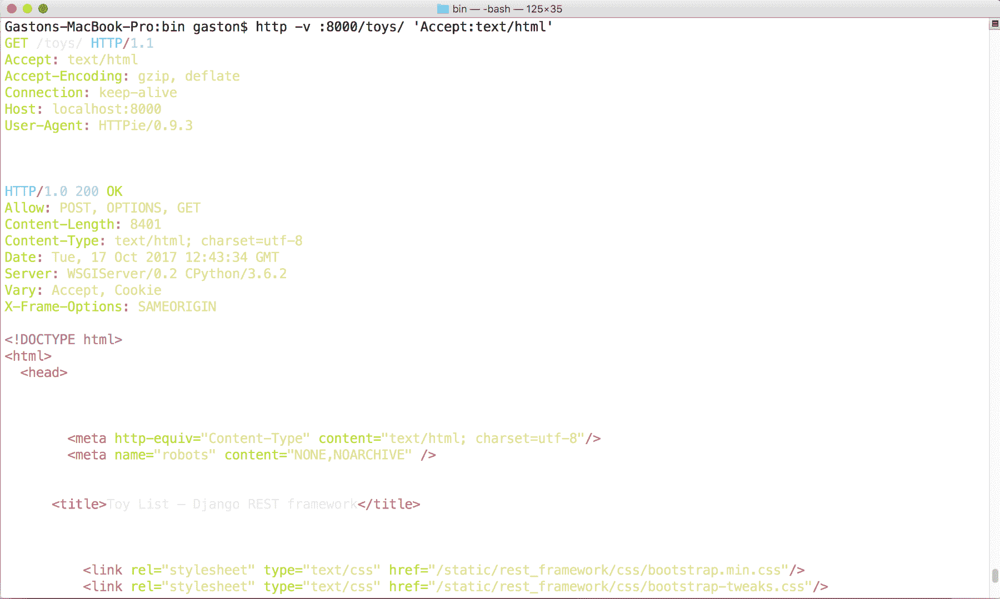

我们可以从之前的输出中轻松地检测到 Django REST 框架为我们之前的请求提供了一个 HTML 网页作为响应。如果我们输入任何资源集合或资源的 URL 到任何网页浏览器中，浏览器将执行一个需要 HTML 响应的 HTTP GET 请求，即`Accept`请求头键将被设置为`text/html`。使用 Django REST 框架构建的 Web 服务将提供一个 HTML 响应，浏览器将渲染网页。

默认情况下，`BrowsableAPIRenderer`类使用 Bootstrap 流行的前端组件库。您可以在[`getbootstrap.com`](http://getbootstrap.com)上了解更多关于 Bootstrap 的信息。网页可能包含以下元素：

+   用于执行对资源或资源集合的其他请求的多种按钮

+   一个显示资源或资源集合内容的 JSON 部分区域

+   允许我们提交数据用于`POST`、`PUT`和`PATCH`请求的表单

Django REST 框架使用模板和主题来渲染可浏览 API 的页面。我们可以自定义许多设置以调整输出以满足我们的特定需求。

# 使用网页浏览器与我们的 Web 服务交互

让我们开始浏览我们的 RESTful Web 服务。打开一个网页浏览器并输入`http://localhost:8000/toys/`。浏览器将组合并发送一个`GET`请求到`http://localhost:8000/toys/`，其中`text/html`是期望的内容类型，返回的 HTML 网页将被渲染。

在幕后，Web 服务将组合并发送一个带有`application/json`作为内容类型和头部信息的 HTTP GET 请求到`http://localhost:8000/toys/`，该请求返回的 JSON 将被渲染为网页内容的一部分。以下截图显示了包含资源集合描述的渲染网页，玩具列表：

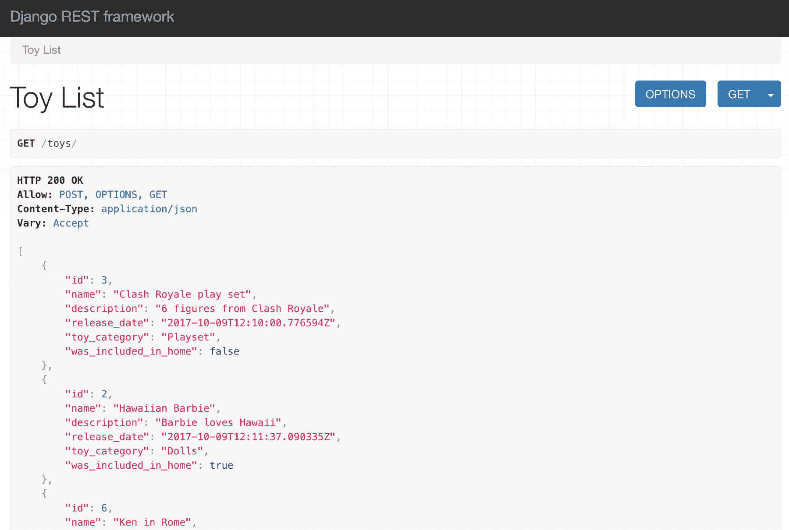

当我们与可浏览 API 一起工作时，Django 会使用有关资源或资源集合允许的方法的信息来渲染适当的按钮，以便我们可以执行相关的请求。在之前的截图中，你会注意到资源描述（玩具列表）的右侧有两个按钮：OPTIONS 和 GET。我们将使用不同的按钮向 RESTful Web Service 发送额外的请求。

如果你决定在运行在另一台计算机或设备上的网络浏览器中浏览 Web 服务，你将不得不使用分配给运行 Django 开发服务器的计算机的 IP 地址，而不是`localhost`。例如，如果 Django 的开发服务器运行在分配了 IPv4 IP 地址`192.168.2.125`的计算机上，那么你应该使用`http://192.168.2.125:8000/toys/`而不是`http://localhost:8000/toys/`。你也可以使用主机名而不是 IPv4 地址或 IPv6 地址。

可浏览 API 最令人愉悦的特性之一是它使得从移动设备测试 RESTful Web Service 变得极其简单。

作为免责声明，我必须说，一旦你学会了如何利用可浏览的 API，你就永远不会想再与一个不提供此类功能的框架一起工作了。

# 使用可浏览 API 进行 HTTP GET 请求

我们刚刚使用可浏览 API 发送了一个 HTTP GET 请求来检索玩具资源集合。现在，我们将使用网页浏览器组合并发送另一个 HTTP GET 请求以获取现有玩具资源。

输入现有玩具资源的 URL，例如`http://localhost:8000/toys/3`。确保将`3`替换为之前渲染的玩具列表中现有玩具的`id`或主键。Django 将组合并发送一个`GET`请求到`http://localhost:8000/toys/3`，渲染的网页将显示其执行结果，即玩具资源的头部和 JSON 数据。以下截图显示了在网页浏览器中输入 URL 后渲染的网页，其中包含资源描述，玩具详情：

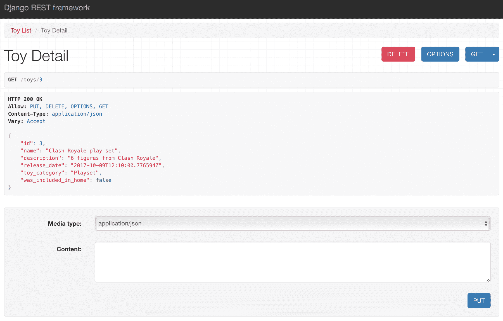

在资源描述的右侧，可浏览的 API 显示一个 GET 下拉按钮。此按钮允许我们再次对 `/toys/3` 发送 `GET` 请求。如果我们点击或轻触向下箭头，我们可以选择 json 选项，可浏览的 API 将显示对 `/toys/3` 发送的 `GET` 请求的原始 JSON 结果，不包含头部。实际上，浏览器将导航到 `http://localhost:8000/toys/3?format=json`，Django REST 框架将显示原始 JSON 结果，因为 `format` 查询参数的值被设置为 `json`。以下截图显示了发出该请求的结果：

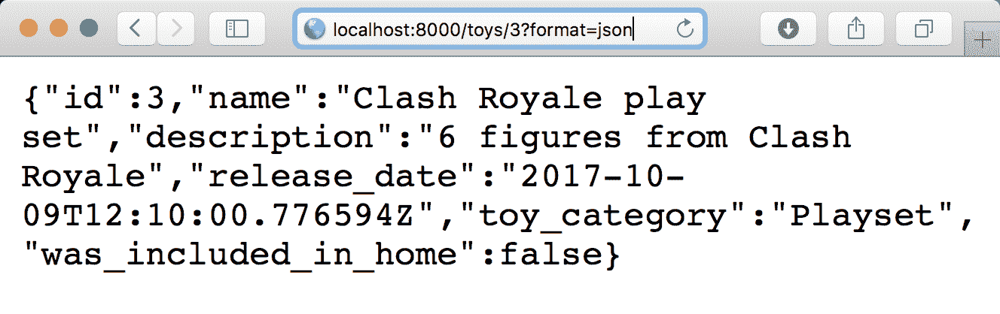

输入一个不存在的玩具资源的 URL，例如 `http://localhost:8000/toys/250`。确保将 `250` 替换为之前渲染的玩具列表中不存在的玩具的 `id` 或主键。Django 将会发送一个 `GET` 请求到 `http://localhost:8000/toys/250`，渲染的网页将显示其执行结果，即带有 `HTTP 404 Not found` 状态码的头部。

以下截图显示了在网页浏览器中输入 URL 后渲染的网页：

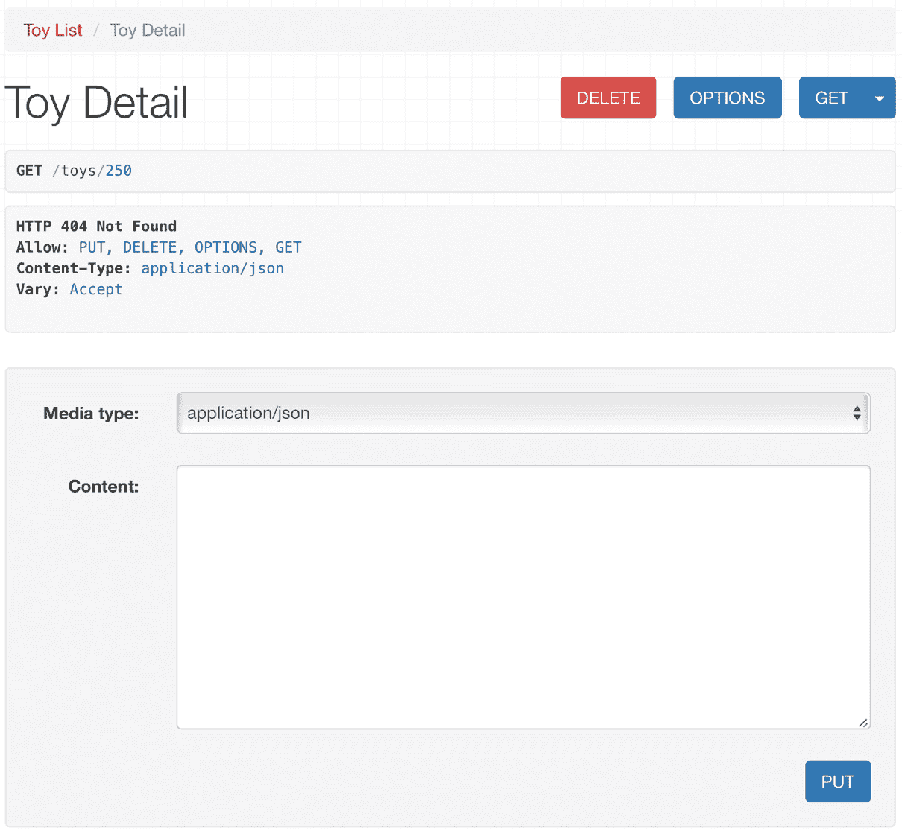

# 使用可浏览的 API 制作 HTTP POST 请求

现在，我们想使用可浏览的 API 来构建并发送一个 HTTP POST 请求到我们的 RESTful Web 服务以创建一个新的玩具。在您的网页浏览器中访问以下 URL，`http://localhost:8000/toys/`。在渲染网页的底部，可浏览的 API 显示以下控件，允许我们构建并发送一个 `POST` 请求到 `/toys/`：

+   媒体类型：此下拉菜单允许我们选择所需的解析器。列表将基于在 Django REST 框架中为我们的 Web 服务配置的受支持解析器生成。

+   内容：此文本区域允许我们输入将与 POST 请求一起发送的正文文本。内容必须与媒体类型下拉菜单中选择的值兼容。

+   POST：此按钮将使用所选的媒体类型和输入的内容，以适当的头部键/值对和内容构建并发送一个 HTTP POST 请求。

以下截图显示了之前解释的控件在渲染网页底部的位置：

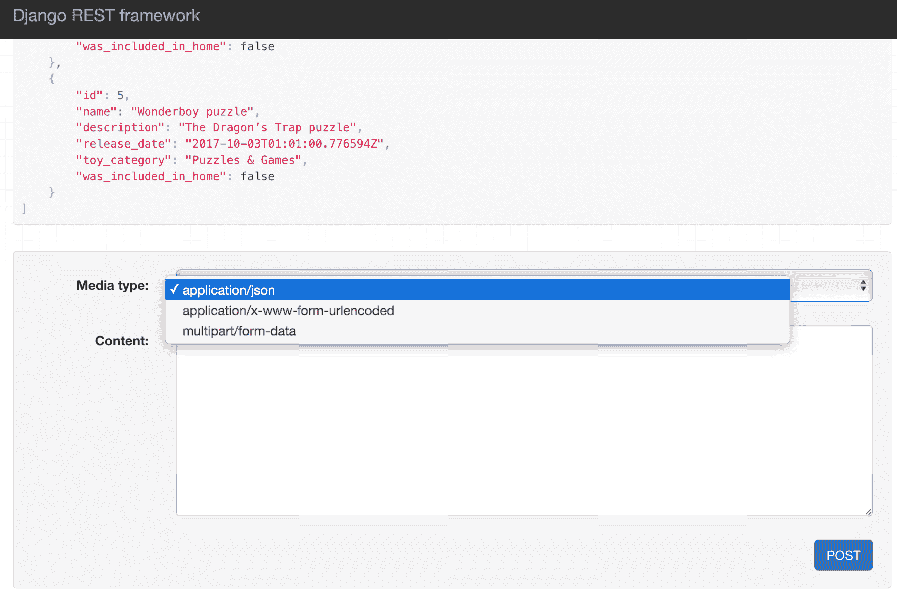

我们已启用 Django REST 框架为我们提供的所有默认解析器，因此媒体类型下拉菜单将提供以下选项：

+   application/json

+   application/x-www-form-urlencoded

+   multipart/form-data

在媒体类型下拉菜单中选择 application/json，并在内容文本区域中输入以下 JSON 内容：

```py
{ 
    "name": "Surfer girl", 
    "description": "Surfer girl doll", 
    "toy_category":"Dolls", 
    "was_included_in_home": "false", 
    "release_date": "2017-10-29T12:11:25.090335Z" 
} 
```

点击或轻触 POST。可浏览的 API 将会以 JSON 格式体，将之前指定的数据发送到 `/toys/` 的 HTTP `POST` 请求，我们将在网页浏览器中看到调用结果。

以下截图显示了一个浏览器在响应中显示了 HTTP 状态码`201 Created`，以及之前解释过的下拉菜单和文本区域，其中包含一个 POST 按钮，允许我们继续组合并发送`POST`请求到`/toys/`：

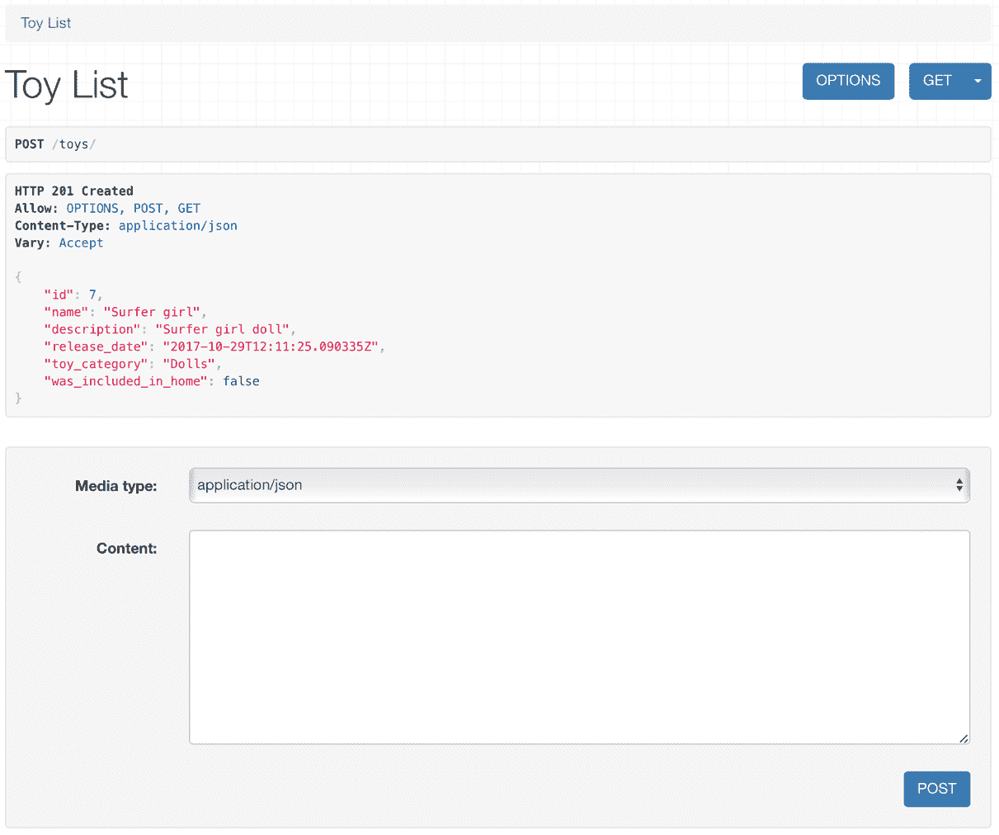

在这种情况下，我们像使用命令行和 GUI 工具组合并发送 HTTP `POST`请求时那样输入了 JSON 键/值对。然而，我们将学习如何配置可浏览的 API，以提供一个带有字段的表单，使在 RESTful Web 服务上执行操作变得更加容易。

# 使用可浏览的 API 进行 HTTP `PUT`请求

现在，我们想使用可浏览的 API 来组合并发送一个 HTTP `PUT`请求到我们的 RESTful Web 服务，用新的玩具替换现有的玩具。首先，访问现有玩具资源的 URL，例如`http://localhost:8000/toys/7`。确保将`7`替换为之前渲染的玩具列表中现有玩具的`id`或主键。将显示 HTTP GET 请求到`/toys/7`的结果的 HTML 网页，以及额外的细节和控件。

在渲染的网页底部，可浏览的 API 显示了用于向`/toys/`发送`POST`请求的控件，随后是用于向`/toys/7`发送`PUT`请求的控件。`PUT`请求的控件与我们之前分析过的`POST`请求的控件相同。`PUT`按钮将使用选定的媒体类型和输入的内容来组合并发送带有适当头部键/值对和内容的 HTTP `PUT`请求。

以下截图显示了在渲染的网页底部用于组合并发送 HTTP `PUT`请求的控件：

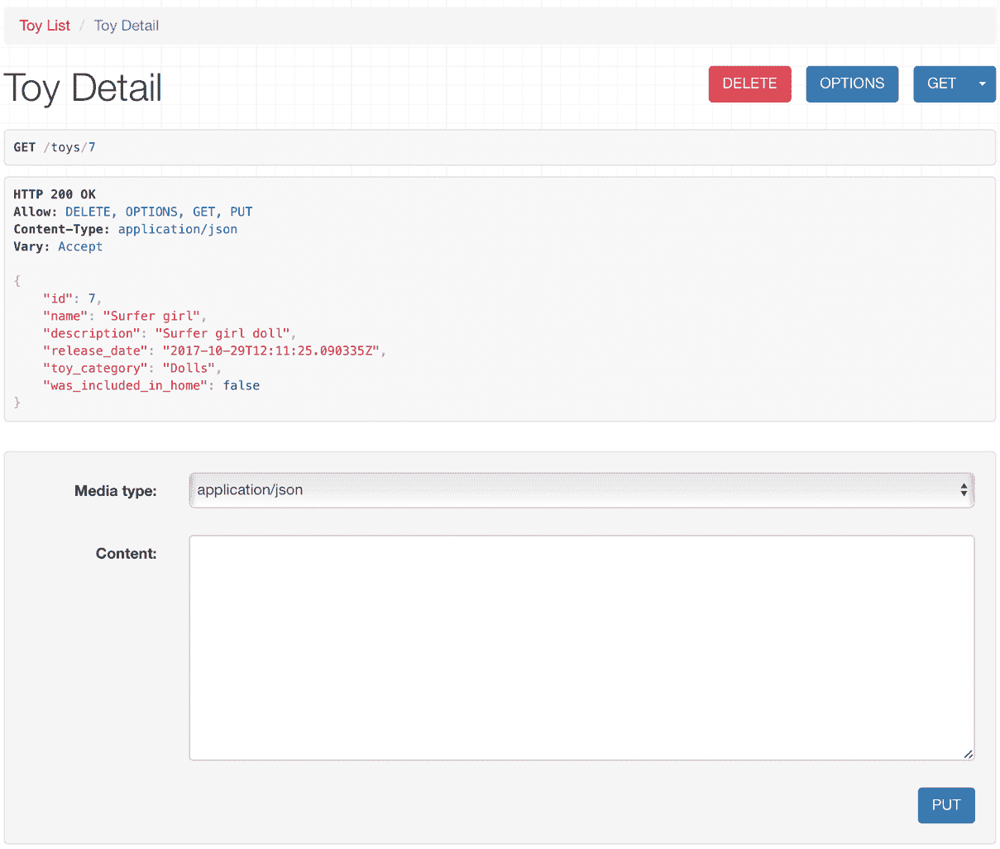

在这个例子中，我们利用了 Django REST 框架中包含的功能来构建 OPTIONS 响应，该响应指示每个资源和资源集合允许哪些 HTTP 动词。因此，可浏览的 API 只为我们提供了组合并发送 POST 和 PUT 方法的可能性。POST 方法应用于资源集合，而 PUT 方法应用于单个资源。可浏览的 API 不提供用于在资源上组合并发送 HTTP `PATCH`方法的控件，因为代码没有指定这个动词被接受为资源。

在媒体类型下拉菜单中选择 application/json，并在内容文本区域中输入以下 JSON 内容。请记住，HTTP `PUT`方法用新的资源替换现有的资源，因此我们必须指定所有字段的值，而不仅仅是想要更新的字段：

```py
{ 
    "name": "Surfer girl", 
    "description": "Surfer girl doll (includes pink surfboard)", 
    "toy_category":"Dolls", 
    "was_included_in_home": "false", 
    "release_date": "2017-10-29T12:11:25.090335Z" 
} 
```

点击或轻触 PUT。可浏览的 API 将组合并发送一个 HTTP `PUT`请求到`/toys/7`，将之前指定的数据作为 JSON 体，我们将在网页浏览器中看到调用结果。以下屏幕截图显示了一个网页浏览器在响应中显示了 HTTP 状态码`200 OK`，以及允许发送新 PUT 请求的控件：

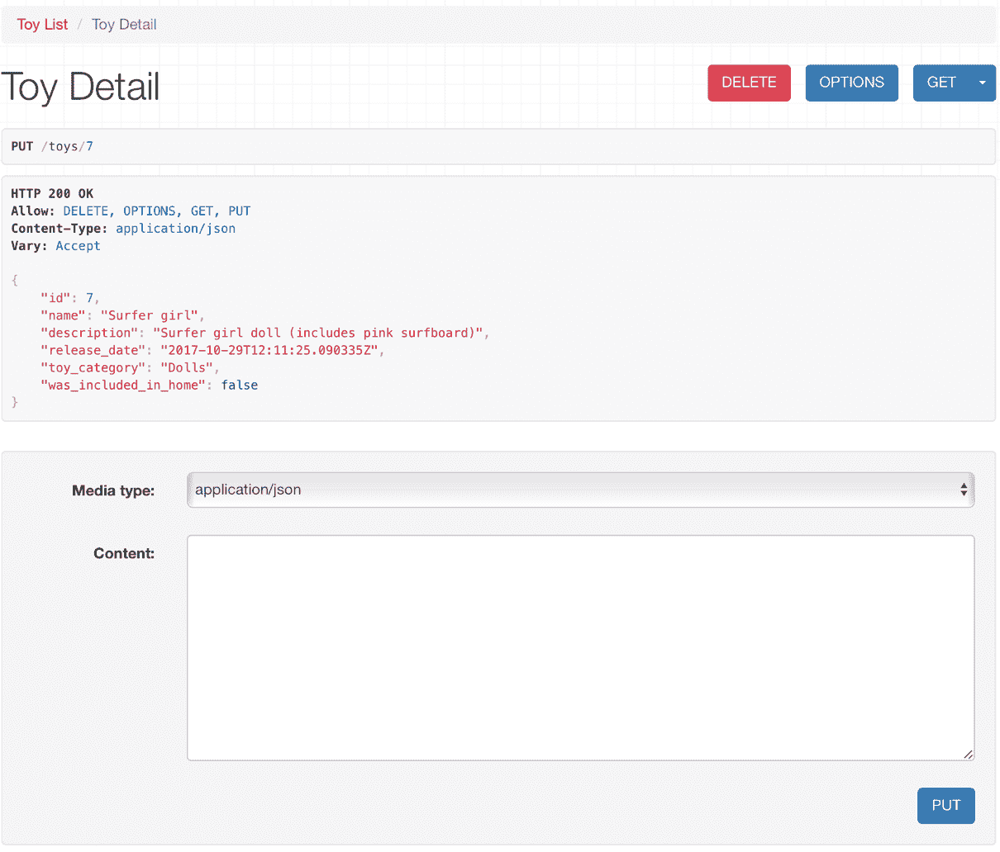

# 使用可浏览的 API 发送 HTTP OPTIONS 请求

现在，我们想使用可浏览的 API 来组合并发送一个 HTTP OPTIONS 请求到我们的 RESTful Web 服务，以检查允许的 HTTP 动词、可用的渲染器和解析器，以及针对一个玩具资源的。首先，访问现有玩具资源的 URL，例如`http://localhost:8000/toys/7`。确保将`7`替换为之前渲染的玩具列表中现有玩具的`id`或主键。将渲染 HTTP GET 请求到`/toys/7`的结果以及额外细节和控件显示的 HTML 网页。

在玩具详情标题的右侧，你会看到一个 OPTIONS 按钮。点击或轻触此按钮。可浏览的 API 将组合并发送一个 HTTP `OPTIONS`请求到`/toys/7`，我们将在网页浏览器中看到调用结果。以下屏幕截图显示了一个网页浏览器在响应中显示了 HTTP 状态码`200 OK`，允许的 HTTP 动词，玩具资源能够作为`renders`键的值渲染的内容类型，以及玩具资源能够作为`parses`键的值解析的内容类型：

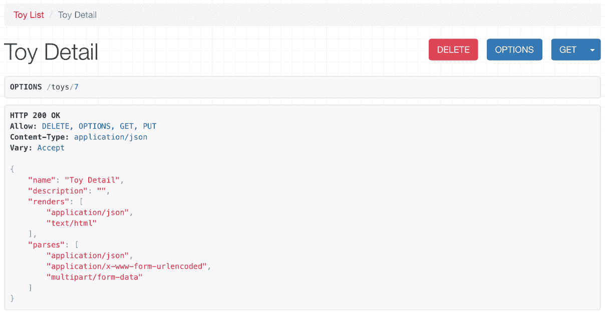

我们也可以组合并发送一个 HTTP OPTIONS 请求到我们的 RESTful Web 服务，以检查玩具资源集合允许的 HTTP 动词、可用的渲染器和解析器。首先，访问玩具资源集合的 URL：`http://localhost:8000/toys/`。将渲染 HTTP GET 请求到`/toys/`的结果以及额外细节和控件显示的 HTML 网页。

在玩具详情标题的右侧，你会看到一个 OPTIONS 按钮。点击或轻触此按钮。可浏览的 API 将组合并发送一个 HTTP `OPTIONS`请求到`/toys/`，将之前指定的数据作为 JSON 体，我们将在网页浏览器中看到调用结果。以下屏幕截图显示了一个网页浏览器在响应中显示了 HTTP 状态码`200 OK`，允许的 HTTP 动词，玩具资源集合能够作为`renders`键的值渲染的内容类型，以及玩具资源集合能够作为`parses`键的值解析的内容类型：

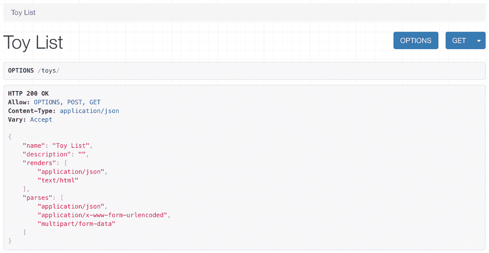

总是检查对特定资源或资源集合的 HTTP OPTIONS 请求返回的所有允许的动词是否编码，这是一个好主意。可浏览的 API 让我们很容易测试所有支持动词的请求是否正常工作。然后，我们可以自动化测试，这是我们在接下来的章节中将学习的内容。

# 使用可浏览 API 发送 HTTP DELETE 请求

现在，我们想使用可浏览 API 来组合并发送一个 HTTP DELETE 请求到我们的 RESTful Web 服务以删除现有的玩具资源。首先，转到现有玩具资源的 URL，例如 `http://localhost:8000/toys/7`。确保你用之前渲染的玩具列表中现有玩具的 `id` 或主键替换 `7`。显示 `/toys/7` 的 HTTP GET 请求结果以及额外细节和控制的 HTML 网页将被渲染。

在“玩具详情”标题的右侧，你会看到一个 DELETE 按钮。点击或轻触此按钮。网页将显示一个模态窗口，请求确认删除玩具资源。在此模态窗口中点击或轻触 DELETE 按钮。

可浏览 API 将组合并发送一个 HTTP `DELETE` 请求到 `/toys/7`，我们将在网页浏览器中看到调用结果。以下截图显示了网页浏览器在响应中显示的 HTTP 状态码 `204 No Content`：

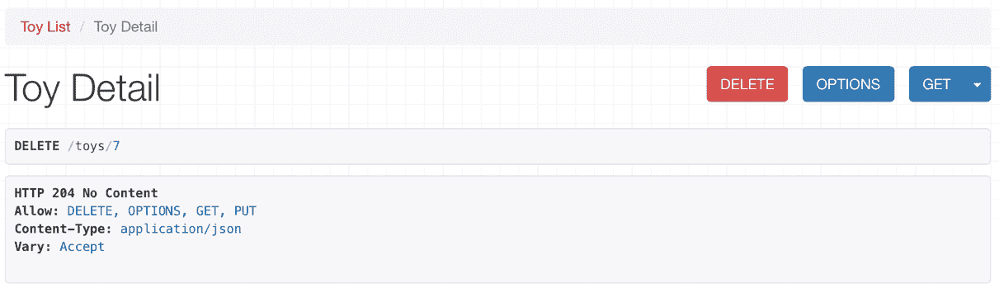

现在，转到玩具资源集合的 URL：`http://localhost:8000/toys/`。显示 `/toys/` 的 HTTP GET 请求结果以及额外细节和控制的 HTML 网页将被渲染。最近删除的玩具已从数据库中删除。因此，列表中不会包括已删除的玩具。以下截图显示了网页浏览器在响应中显示的 HTTP 状态码 `200 OK` 以及没有最近删除玩具的玩具列表：

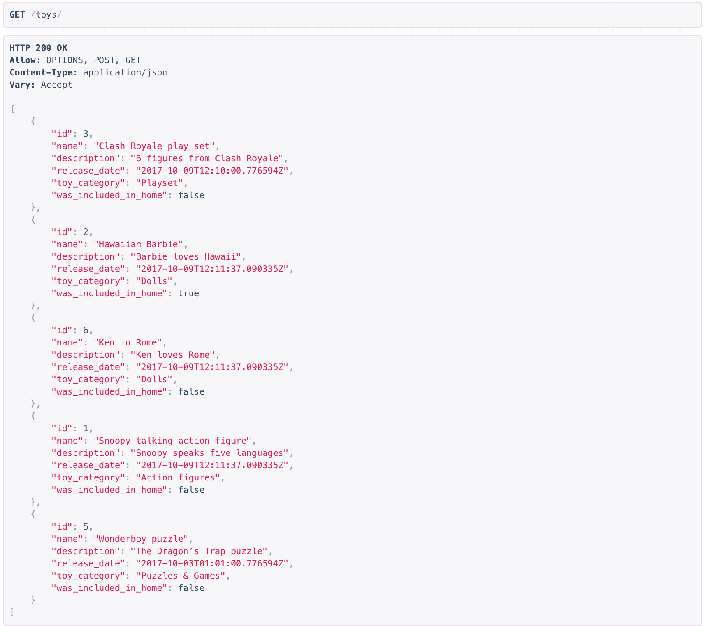

可浏览 API 允许我们通过在网页浏览器上点击或轻触按钮来组合和发送许多 HTTP 请求到我们的 Web 服务。我们可以检查所有操作是否在我们的 RESTful Web 服务中按预期工作。然而，我们必须输入 JSON 内容，并且我们无法点击超链接来导航实体。例如，我们无法点击玩具的 `id` 来执行一个 HTTP GET 请求以检索这个特定的玩具。

我们肯定会改善这种情况，并在创建额外的 RESTful Web 服务时充分利用可浏览 API 中包含的许多附加功能。我们将在接下来的章节中这样做。我们刚刚开始使用可浏览 API。

# 测试你的知识

让我们看看你是否能正确回答以下问题：

1.  以下哪个类负责渲染 `text/html` 内容：

    1.  `rest_framework.response.HtmlRenderer` 类

    1.  `rest_framework.response.TextHtmlAPIRenderer` 类

    1.  `rest_framework.response.BrowsableAPIRenderer` 类

1.  默认情况下，可浏览的 API 使用以下网页组件库：

    1.  `Bootstrap`

    1.  `ReactJS`

    1.  `AngularJS`

1.  当我们在网页浏览器中输入现有资源的 URL 时，可浏览的 API：

    1.  返回仅包含对资源进行 HTTP GET 请求的 JSON 响应的网页

    1.  返回一个包含显示对资源进行 HTTP GET 请求的 JSON 响应部分的网页，以及执行对资源进行其他请求的多个按钮

    1.  返回包含显示对资源进行 HTTP OPTIONS 请求的 JSON 响应部分的网页，以及执行对资源进行其他请求的多个按钮

1.  当我们在网页浏览器中输入非现有资源的 URL 时，可浏览的 API：

    1.  渲染一个显示 `HTTP 404 not found` 标头的网页

    1.  显示一个包含 `HTTP 404 not found` 错误的纯文本消息

    1.  渲染显示最后可用的玩具资源的网页

1.  如果我们输入以下 URL，`http://localhost:8000/toys/10?format=json`，并且存在一个 `id` 等于 `10` 的玩具资源，可浏览的 API 将会显示：

    1.  对 `http://localhost:8000/toys/` 的 HTTP GET 请求的原始 JSON 结果

    1.  对 `http://localhost:8000/toys/10` 的 HTTP GET 请求的原始 JSON 结果

    1.  如果我们输入 `http://localhost:8000/toys/10`，将会渲染的相同网页

正确答案包含在 [附录](https://cdp.packtpub.com/django_restful_web_services__/wp-admin/post.php?post=44&action=edit#post_454)，*解决方案* 中。

# 摘要

在本章中，我们了解了一些 Django REST 框架为我们的 RESTful Web 服务添加的附加功能，即可浏览的 API。我们使用网页浏览器来处理我们用 Django 构建的第一个 Web 服务。

我们学会了使用可浏览的 API 进行 HTTP GET、POST、PUT、OPTIONS 和 DELETE 请求。我们能够轻松地使用网页浏览器测试 CRUD 操作。可浏览的 API 允许我们轻松地与我们的 RESTful Web 服务交互。我们将在接下来的章节中利用更多附加功能。

现在我们已经了解了如何轻松地利用 Django REST 框架的可浏览 API，我们将继续探讨更高级的场景，并开始一个新的 RESTful Web 服务。我们将处理高级关系和序列化。这些主题将在 第六章，*处理高级关系和序列化* 中介绍。
