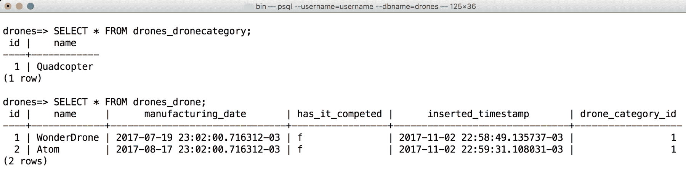
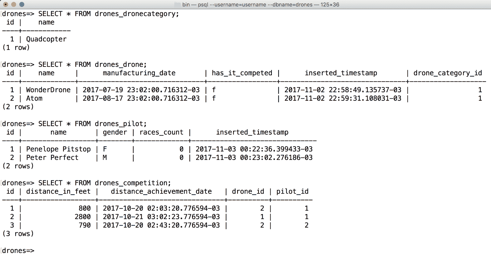

# 与高级关系和序列化协同工作

在本章中，我们将创建一个复杂的 RESTful 网络服务，该服务将在 PostgreSQL 数据库中持久化数据。我们将处理资源之间的不同类型的关系，并利用 Django REST 框架提供的通用类和通用视图来减少样板代码的数量。我们将了解：

+   定义复杂 RESTful 网络服务的要求

+   使用 Django 创建新的应用程序

+   配置新的网络服务

+   使用 models.ForeignKey 定义多对一关系

+   安装 PostgreSQL

+   运行生成关系的迁移

+   分析数据库

+   配置具有关系的序列化和反序列化

+   使用 serializers.HyperlinkedModelSerializer 定义超链接

+   使用基于类的视图协同工作

+   利用通用类和通用视图

+   概化和混合行为

+   与路由和端点协同工作

+   向与具有关系的资源进行交互的请求

# 定义复杂 RESTful 网络服务的要求

到目前为止，我们的 RESTful 网络服务在单个数据库表上执行 CRUD 操作。现在，我们想要使用 Django REST 框架创建一个更复杂的 RESTful 网络服务，以与复杂的数据库模型进行交互。

无人机是一种 **IoT**（即 **物联网**）设备，与许多传感器和执行器交互，包括与发动机、螺旋桨和传感器连接的数字电子速度控制器。无人机也被称为 **无人驾驶空中车辆**（**UAV**）。我们将编写一个 RESTful 网络服务，允许我们为归类到无人机类别的无人机注册竞赛。在我们的上一个 RESTful 网络服务中，我们有玩具归类在玩具类别中，我们使用字符串字段来指定玩具的玩具类别。在这种情况下，我们希望能够轻松检索属于特定无人机类别的所有无人机。因此，我们将有一个无人机与无人机类别之间的关系。

我们必须能够在各种资源和资源集合上执行 CRUD 操作。许多资源与其他资源有关联，因此，我们不会使用简单的模型。我们将学习如何在模型之间建立不同类型的关系。

以下列表列举了我们将使用的资源及其模型名称，我们将使用 Django REST 框架来表示它们：

+   无人机类别（`DroneCategory` 模型）

+   无人机（`Drone` 模型）

+   飞行员（`Pilot` 模型）

+   竞赛（`Competition` 模型）

无人机类别（`DroneCategory` 模型）只需要一个名称。

我们需要一个无人机（`Drone` 模型）所需的数据：

+   一个指向无人机类别（`DroneCategory` 模型）的外键

+   一个名称

+   生产日期

+   一个布尔值，表示无人机是否至少参与了一场竞赛

+   包含无人机被插入数据库的日期和时间的戳记

我们需要一个试点（`Pilot` 模型）所需的数据：

+   一个名称

+   性别值

+   参与的比赛次数的整数值

+   飞行员被插入数据库的日期和时间戳

我们需要以下数据用于比赛（`Competition`模型）：

+   一个指向飞行员（`Pilot`模型）的外键

+   一个指向无人机（`Drone`模型）的外键

+   距离值（以英尺为单位）

+   飞行员控制的无人机达到指定距离值的日期

我们将使用 Django REST 框架提供的各种选项来体现资源之间的关系。这样，我们将能够分析不同的配置，这将使我们能够知道哪种选项最适合我们未来开发的新网络服务的特定要求。

以下表格显示了我们的新 RESTful Web 服务必须支持的 HTTP 动词、作用域和语义。每个方法由一个 HTTP 动词和一个作用域组成。所有方法对所有资源和资源集合都有明确的含义。在这种情况下，我们将为所有资源实现 PATCH HTTP 动词：

| **HTTP 动词** | **作用域** | **语义** |
| --- | --- | --- |
| GET | 无人机类别 | 获取单个无人机类别。无人机类别必须包括属于该无人机类别的每个无人机资源的 URL 列表。 |
| GET | 无人机类别集合 | 获取集合中所有存储的无人机类别，按名称升序排序。每个无人机类别必须包括属于该无人机类别的每个无人机资源的 URL 列表。 |
| POST | 无人机类别集合 | 在集合中创建一个新的无人机类别。 |
| PUT | 无人机类别 | 更新现有的无人机类别。 |
| PATCH | 无人机类别 | 更新现有无人机类别的一个或多个字段。 |
| DELETE | 无人机类别 | 删除现有的无人机类别。 |
| GET | 无人机 | 获取单个无人机。无人机必须包括其无人机类别描述。 |
| GET | 无人机集合 | 获取集合中所有存储的无人机，按名称升序排序。每架无人机必须包括其无人机类别描述。 |
| POST | 无人机集合 | 在集合中创建一个新的无人机。 |
| PUT | 无人机 | 更新现有的无人机。 |
| PATCH | 无人机 | 更新现有无人机的一个或多个字段。 |
| DELETE | 无人机 | 删除现有的无人机。 |
| GET | 飞行员 | 获取单个飞行员。飞行员必须包括按距离降序排序的已注册比赛列表。列表必须包括飞行员及其相关无人机参加的比赛的所有详细信息。 |
| GET | 飞行员集合 | 获取集合中存储的所有飞行员，按姓名升序排列。每个飞行员必须包括注册竞赛的列表，按距离降序排列。列表必须包括飞行员及其相关无人机参与的竞赛的所有详细信息。 |
| POST | 飞行员集合 | 在集合中创建一个新的飞行员。 |
| PUT | 飞行员 | 更新现有飞行员。 |
| PATCH | 飞行员 | 更新现有飞行员的字段。 |
| DELETE | 飞行员 | 删除现有飞行员。 |
| GET | 竞赛 | 获取单个竞赛。竞赛必须包括使无人机达到特定距离的飞行员姓名和无人机名称。 |
| GET | 竞赛集合 | 获取集合中存储的所有竞赛，按距离降序排列。每个竞赛必须包括使无人机达到特定距离的飞行员姓名和无人机名称。 |
| POST | 竞赛集合 | 在集合中创建一个新的竞赛。竞赛必须与现有飞行员和现有无人机相关。 |
| PUT | 竞赛 | 更新现有竞赛。 |
| PATCH | 竞赛 | 更新现有竞赛的一个或多个字段。 |
| DELETE | 竞赛 | 删除现有竞赛。 |

在前一个表中，我们有大量的方法和范围。下表列举了前表中提到的每个范围的 URI，其中`{id}`必须替换为资源的数字`id`或主键：

| **范围** | **URI** |
| --- | --- |
| 无人机类别集合 | `/drone-categories/` |
| 无人机类别 | `/drone-category/{id}` |
| 无人机集合 | `/drones/` |
| 无人机 | `/drone/{id}` |
| 飞行员集合 | `/pilots/` |
| 飞行员 | `/pilot/{id}` |
| 竞赛集合 | `/competitions/` |
| 竞赛 | `/competition/{id}` |

让我们考虑`http://localhost:8000/`是运行在 Django 开发服务器上的 RESTful Web Service 的 URL。我们必须使用以下 HTTP 动词（`GET`）和请求 URL（`http://localhost:8000/competitions/`）来组合和发送 HTTP 请求，以检索集合中存储的所有竞赛。

```py
GET http://localhost:8000/competitions/ 
```

我们的 RESTful Web Service 必须能够更新现有资源的单个字段。为了实现这一点，我们将实现`PATCH`方法。记住，`PUT`方法旨在替换整个资源，而`PATCH`方法旨在应用一个 delta 到现有资源，即更新现有资源的一个或多个字段。

我们肯定希望我们的 RESTful Web Service 支持所有资源和资源集合的`OPTIONS`方法。这样，我们将提供一个一致的 Web 服务。

我们将使用 Django 中包含的 **ORM**（即 **对象关系映射**）。此外，我们将利用 Django REST 框架最新版本中包含的许多功能和可重用元素，以便在不编写大量代码的情况下轻松构建我们的网络服务。

在这种情况下，我们将使用 PostgreSQL 数据库。但是，如果您不想花费时间安装 PostgreSQL，您可以跳过我们在 Django REST 框架 ORM 配置中进行的更改，并继续使用默认的 SQLite 数据库，就像我们在第一个 RESTful 网络服务中做的那样。

# 使用 Django 创建新应用程序

现在，我们将使用 Django 创建一个新的应用程序。我们将遵循我们在 *Creating an app with Django* 部分的 第一章，*安装所需的软件和工具* 中学到的相同步骤。但是，为了避免重复许多步骤，我们将使用我们在该章节中创建的相同 `restful01` 项目。因此，我们只需向现有项目添加一个新应用程序即可。

确保您已退出 Django 的开发服务器。请记住，您只需在运行开发服务器的终端或命令提示符窗口中按 *Ctrl* + *C* 即可。如果您没有运行 Django 的开发服务器，请确保我们之前章节中工作的虚拟环境已激活。然后，进入 `01` 文件夹内的 `restful01` 文件夹（虚拟环境的根文件夹）。以下命令使用默认路径进入此文件夹。如果您为虚拟环境使用了不同的路径，请确保将基本路径替换为适当的路径。

在 Linux 或 macOS 中，输入以下命令：

```py
cd ~/HillarDjangoREST/01/restful01
```

如果您更喜欢命令提示符，请在 Windows 命令行中运行以下命令：

```py
cd /d %USERPROFILE%\HillarDjangoREST\01\restful01
```

如果您更喜欢 Windows PowerShell，请在 Windows PowerShell 中运行以下命令：

```py
cd /d $env:USERPROFILE\HillarDjangoREST\01\restful01

```

然后，运行以下命令在 `restful01` Django 项目中创建一个名为 `drones` 的新 Django 应用程序。该命令不会产生任何输出：

```py
    python manage.py startapp drones
```

之前的命令创建了一个新的 `restful01/drones` 子文件夹，包含以下文件：

+   `views.py`

+   `tests.py`

+   `models.py`

+   `apps.py`

+   `admin.py`

+   `__init__.py`

此外，`restful01/drones` 文件夹将有一个名为 `migrations` 的子文件夹，其中包含一个 `__init__.py` Python 脚本。其结构与我们之前在 *Understanding Django folders, files and configurations* 部分的 第一章*，安装所需的软件和工具* 中分析的结构相同。

# 配置新的网络服务

我们将向现有的 Django 项目中添加一个新的 Django 应用程序。使用您喜欢的编辑器或 IDE 检查 `restful01/drones` 文件夹（Windows 中为 `restful01\drones`）内的 `apps.py` 文件中的 Python 代码。以下行显示了此文件的代码：

```py
from django.apps import AppConfig 

class DronesConfig(AppConfig): 
    name = 'drones'
```

代码将 `DronesConfig` 类声明为 `django.apps.AppConfig` 类的子类，该类代表 Django 应用及其配置。`DronesConfig` 类仅定义了 `name` 类属性，并将其值设置为 `'drones'`。

现在，我们必须将 `drones.apps.DronesConfig` 添加到配置 `restful01` Django 项目的 `restful01/settings.py` 文件中的已安装应用之一。我通过以下方式构建了前面的字符串：应用名称 + `.apps.` + 类名称，即 `drones` + `.apps.` + `DronesConfig`。

我们已经将 `rest_framework` 应用添加到 `restful01/settings.py` 文件中，以便我们可以在其中使用 Django REST 框架。然而，如果你决定按照我们在第一章（Chapter 1）中学习的所有步骤从头开始创建一个新的 Django 项目，请确保不要忘记添加 `rest_framework` 应用。

打开声明 `restful01` 项目 Django 配置的模块级变量的 `restful01/settings.py` 文件。我们将对此 Django 设置文件进行一些修改。定位到将字符串列表分配给 `INSTALLED_APPS` 的行，以声明已安装的应用。

从 `INSTALLED_APPS` 字符串列表中删除以下行。这样，Django 就不会再考虑此应用：

```py
'toys.apps.ToysConfig', 
```

将以下字符串添加到 `INSTALLED_APPS` 字符串列表中，并将更改保存到 `restful01/settings.py` 文件中：

```py
'drones.apps.DronesConfig',
```

以下行显示了声明 `INSTALLED_APPS` 字符串列表的新代码，其中添加的行被突出显示，并带有注释以理解每个添加的字符串的含义。示例代码文件包含在 `hillar_django_restful_06_01` 文件夹中，在 `restful01/settings.py` 文件中：

```py
INSTALLED_APPS = [ 
    'django.contrib.admin', 
    'django.contrib.auth', 
    'django.contrib.contenttypes', 
    'django.contrib.sessions', 
    'django.contrib.messages', 
    'django.contrib.staticfiles', 
    # Django REST framework 
    'rest_framework', 
    # Drones application 
 'drones.apps.DronesConfig', 
] 
```

这样，我们已经将 `drones` 应用添加到了我们最初的名为 `restful01` 的 Django 项目中。

# 使用 models.ForeignKey 定义多对一关系

现在，我们将创建用于表示和持久化无人机类别、无人机、飞行员和比赛及其关系的模型。打开 `drones/models.py` 文件，并用以下代码替换其内容。代码中声明与其它模型相关字段的行被突出显示。示例代码文件包含在 `hillar_django_restful_06_01` 文件夹中，在 `restful01/drones/models.py` 文件中。

```py
from django.db import models 

class DroneCategory(models.Model): 
    name = models.CharField(max_length=250) 

    class Meta: 
        ordering = ('name',) 

    def __str__(self): 
        return self.name 

class Drone(models.Model): 
    name = models.CharField(max_length=250) 
    drone_category = models.ForeignKey( 
        DroneCategory, 
        related_name='drones', 
        on_delete=models.CASCADE) 
    manufacturing_date = models.DateTimeField() 
    has_it_competed = models.BooleanField(default=False) 
    inserted_timestamp = models.DateTimeField(auto_now_add=True) 

    class Meta: 
        ordering = ('name',) 

    def __str__(self): 
        return self.name 

class Pilot(models.Model): 
    MALE = 'M' 
    FEMALE = 'F' 
    GENDER_CHOICES = ( 
        (MALE, 'Male'), 
        (FEMALE, 'Female'), 
    ) 
    name = models.CharField(max_length=150, blank=False, default='') 
    gender = models.CharField( 
        max_length=2, 
        choices=GENDER_CHOICES, 
        default=MALE, 
    ) 
    races_count = models.IntegerField() 
    inserted_timestamp = models.DateTimeField(auto_now_add=True) 

    class Meta: 
        ordering = ('name',) 

    def __str__(self): 
        return self.name 

class Competition(models.Model): 
    pilot = models.ForeignKey( 
        Pilot, 
        related_name='competitions', 
        on_delete=models.CASCADE) 
    drone = models.ForeignKey( 
        Drone, 
        on_delete=models.CASCADE) 
    distance_in_feet = models.IntegerField() 
    distance_achievement_date = models.DateTimeField() 

    class Meta: 
        # Order by distance in descending order 
        ordering = ('-distance_in_feet',)
```

代码声明了以下四个模型，具体来说，是四个继承自 `django.db.models.Model` 类的类：

+   `DroneCategory`

+   `Drone`

+   `Pilot`

+   `Competition`

当 Django 创建与每个模型相关的数据库表时，它会自动添加一个名为 `id` 的自增整数主键列。我们指定了许多属性的字段类型、最大长度和默认值。

每个类声明了一个 `Meta` 内部类，该类声明了一个排序属性。在 `Competition` 类中声明的 `Meta` 内部类将 `'-distance_in_feet'` 作为 `ordering` 元组的值，以字段名前缀的连字符为前缀，按降序对 `distance_in_feet` 进行排序，而不是默认的升序。

`DroneCategory`、`Drone` 和 `Pilot` 类声明了一个 `__str__` 方法，该方法返回 `name` 属性的内容，为这些模型中的每一个提供名称或标题。这样，每当 Django 需要为模型提供人类可读的表示时，它将调用此方法并返回其结果。

`Drone` 模型使用以下行声明了 `drone_category` 字段：

```py
drone_category = models.ForeignKey( 
    DroneCategory,  
    related_name='drones',  
    on_delete=models.CASCADE) 
```

上一行使用 `django.db.models.ForeignKey` 类为 `DroneCategory` 模型提供了一个多对一的关系。为 `related_name` 参数指定的 `'drones'` 值从 `DroneCategory` 模型创建了一个反向关系到 `Drone` 模型。此值表示从相关的 `DroneCategory` 对象到无人机对象的关联名称。

这样，我们将能够轻松访问属于特定无人机类别的所有无人机。每当我们要删除一个无人机类别时，我们希望属于此类别的所有无人机也被删除，因此，我们为 `on_delete` 参数指定了 `models.CASCADE` 值。

`Competition` 模型使用以下行声明了 `pilot` 字段：

```py
pilot = models.ForeignKey( 
    Pilot,  
    related_name='competitions',  
    on_delete=models.CASCADE) 
```

上一行使用 `django.db.models.ForeignKey` 类为 `Pilot` 模型提供了一个多对一的关系。为 `related_name` 参数指定的 `'competitions'` 值从 `Pilot` 模型创建了一个反向关系到 `Competition` 模型。此值表示从相关的飞行员对象到比赛对象的关联名称。

这样，我们将能够轻松访问特定飞行员使用其无人机参与的所有的比赛。每当我们要删除一个飞行员时，我们希望删除该飞行员参与的所有的比赛，因此，我们为 `on_delete` 参数指定了 `models.CASCADE` 值。

`Competition` 模型使用以下行声明了 `drone` 字段：

```py
drone = models.ForeignKey( 
    Drone,  
    on_delete=models.CASCADE) 
```

上一行使用 `django.db.models.ForeignKey` 类为 `Drone` 模型提供了一个多对一的关系。在这种情况下，我们不需要创建反向关系，因此我们不指定 `related_name` 参数的值。每当我们要删除一个无人机时，我们希望删除该无人机参与的所有的比赛，因此，我们为 `on_delete` 参数指定了 `models.CASCADE` 值。

# 安装 PostgreSQL

为了使用此示例，您必须下载并安装 PostgreSQL，如果您尚未在您的开发计算机或开发服务器上运行它。PostgreSQL 在多个平台上可用，并提供 Linux、macOS 和 Windows 等操作系统的版本。您可以从其网页的下载部分下载并安装此关系型数据库管理系统：[`www.postgresql.org`](http://www.postgresql.org)。

与 PostgreSQL 数据库兼容的下一个样本已在 PostgreSQL 版本 9.6.x 和 PostgreSQL 10.x 中进行了测试。请确保您使用这些版本中的任何一个。

EnterpriseDB 和 BigSQL 为 macOS 和 Windows 构建了交互式安装程序。如果您在 macOS 上工作，Postgres.app 提供了一种非常简单的方法来安装和使用 PostgreSQL。您可以在其网页上了解更多关于 Postgres.app 的信息并下载它：[`postgresapp.com`](http://postgresapp.com)。

完成安装过程后，您必须确保 PostgreSQL 的 `bin` 文件夹包含在 PATH 环境变量中。您应该能够从当前的 Linux 或 macOS 终端、Windows 命令提示符或 Windows PowerShell 中执行 psql 命令行实用程序。

如果 `bin` 文件夹未包含在 PATH 中，您将在尝试安装 psycopg2 Python 包时收到错误，指示找不到 `pg_config` 文件。此外，您还必须使用我们将要使用的每个 PostgreSQL 命令行工具的完整路径。

# 运行生成关系的迁移

我们必须为最近编写的新的模型创建初始迁移。我们只需运行以下 Python 脚本，我们还将首次同步数据库。正如我们从之前的 RESTful Web 服务示例中学到的那样，默认情况下，Django 使用 SQLite 数据库。

在这个新示例中，我们将使用 PostgreSQL 数据库。但是，如果您想使用 SQLite，您可以跳过所有与 PostgreSQL、Django 中的配置相关的下一步，直接跳转到迁移生成命令。您还必须使用 SQLite 工具而不是 PostgreSQL 工具来分析数据库。

我们将使用 PostgreSQL 命令行工具创建一个名为 `toys` 的新数据库。如果您已经有一个同名 PostgreSQL 数据库，请确保在所有命令和配置中使用另一个名称。您可以使用任何 PostgreSQL GUI 工具或支持 PostgreSQL 的任何数据库管理工具执行相同的任务。

如果您在 Linux 上开发，必须以 `postgres` 用户身份运行命令。在 Windows 或 macOS 上运行以下命令以创建一个名为 `drones` 的新数据库。请注意，该命令不会产生任何输出，并且您必须在您的路径中具有 PostgreSQL 命令行工具的 `bin` 文件夹：

```py
createdb drones
```

在 Linux 中，运行以下命令以使用 `postgres` 用户：

```py
sudo -u postgres createdb drones  
```

现在，我们将使用 psql 命令行工具运行一些 SQL 语句来创建一个特定的用户，我们将在 Django 中使用该用户，并为其分配必要的角色。在 Windows 或 macOS 中，运行以下命令以启动 psql 工具：

```py
psql  
```

在 macOS 中，如果之前的命令不起作用，你可能需要运行以下命令以使用 `postgres` 用户启动 psql，因为它将取决于你安装和配置 PostgreSQL 的方式：

```py
sudo -u postgres psql  
```

在 Linux 中，运行以下命令以使用 `postgres` 用户启动 psql：

```py
sudo -u psql 
```

然后，运行以下 SQL 语句，最后输入 `\q` 以退出 psql 命令行工具。

将用户名替换为你希望在新的数据库中使用的用户名，将密码替换为你选择的密码。我们将在我们的网络服务的 Django 设置中指定所选的用户名和密码。

如果你已经在 PostgreSQL 中与特定用户一起工作，并且已经为该用户授予了数据库的权限，那么你不需要运行以下步骤：

```py
CREATE ROLE username WITH LOGIN PASSWORD 'password';
GRANT ALL PRIVILEGES ON DATABASE drones TO username;
ALTER USER username CREATEDB;
\q  
```

对于之前的命令，你会看到以下输出：

```py
CREATE ROLE
GRANT
ALTER ROLE  
```

默认 SQLite 数据库引擎和数据库文件名在 `restful01/settings.py` Python 文件中指定。以下行显示了配置数据库的默认行：

```py
DATABASES = { 
    'default': { 
        'ENGINE': 'django.db.backends.sqlite3', 
        'NAME': os.path.join(BASE_DIR, 'db.sqlite3'), 
    } 
} 
```

在本例中，我们将使用 PostgreSQL 而不是 SQLite，因此，我们必须用以下行替换 `DATABASES` 字典的声明。嵌套字典将名为 `default` 的数据库映射到 `django.db.backends.postgresql` 数据库引擎、所需的数据库名称及其设置。在这种情况下，我们将创建一个名为 `drones` 的数据库。确保你在 `'NAME'` 键的值中指定所需的数据库名称，并根据你的 PostgreSQL 配置配置用户、密码、主机和端口。如果你遵循了之前解释的步骤来配置 PostgreSQL 数据库，请使用这些步骤中指定的设置。示例代码文件包含在 `hillar_django_restful_06_01` 文件夹中的 `restful01/settings.py` 文件中：

```py
DATABASES = { 
    'default': { 
        'ENGINE': 'django.db.backends.postgresql', 
        # Replace drones with your desired database name 
        'NAME': 'drones', 
        # Replace username with your desired user name 
        'USER': 'username', 
        # Replace password with your desired password 
        'PASSWORD': 'password', 
        # Replace 127.0.0.1 with the PostgreSQL host 
        'HOST': '127.0.0.1', 
        # Replace 5432 with the PostgreSQL configured port 
        # in case you aren't using the default port 
        'PORT': '5432', 
    } 
}
```

如果你决定继续使用 SQLite，你不需要进行之前的更改，可以直接继续使用默认配置。

我们不希望迁移过程考虑我们与之前网络服务中的玩具相关的模型，因此，我们将对 `restful01` 文件夹中的 `urls.py` 文件中的代码进行更改，特别是 `restful01/urls.py` 文件。该文件定义了根 URL 配置，因此，我们必须删除在 `toys/urls.py` 文件中声明的 URL 模式。以下行显示了 `restful01/urls.py` 文件的新代码。示例代码文件包含在 `hillar_django_restful_06_01` 文件夹中的 `restful01/urls.py` 文件中：

```py
from django.conf.urls import url, include 

urlpatterns = [ 
] 
```

为了使用 PostgreSQL，需要安装一个 Django 将用于与 PostgreSQL 数据库交互的 Python-PostgreSQL 数据库适配器：Psycopg2 包（psycopg2）。

在 macOS 上，我们必须确保 PostgreSQL 的 `bin` 文件夹已包含在 `PATH` 环境变量中。例如，如果 `bin` 文件夹的路径是 `/Applications/Postgres.app/Contents/Versions/latest/bin`，我们必须执行以下命令将此文件夹添加到 `PATH` 环境变量中：

```py
export PATH=$PATH:/Applications/Postgres.app/Contents/Versions/latest/bin  
```

一旦我们确认 PostgreSQL 的 `bin` 文件夹已包含在 `PATH` 环境变量中，我们只需运行以下命令来安装此包。在运行命令之前，请确保已激活虚拟环境：

```py
pip install psycopg2  
```

输出的最后几行将指示 psycopg2 包已成功安装：

```py
Collecting psycopg2
Installing collected packages: psycopg2
Successfully installed psycopg2-2.7.3.2  
```

现在，运行以下 Python 脚本来生成允许我们首次同步 PostgreSQL 数据库的迁移。我们将为 `drones` 应用程序运行迁移：

```py
python manage.py makemigrations drones  
```

以下行显示了运行上一条命令后的输出：

```py
Migrations for 'drones':
drones/migrations/0001_initial.py
- Create model Competition
- Create model Drone
- Create model DroneCategory
- Create model Pilot
- Add field drone_category to drone
- Add field drone to competition
- Add field pilot to competition 
```

输出指示 `restful01/drones/migrations/0001_initial.py` 文件包含创建 `Competition`、`Drone`、`DroneCategory` 和 `Pilot` 模型的代码。以下行显示了由 Django 自动生成的此文件的代码。示例的代码文件包含在 `hillar_django_restful_06_01` 文件夹中的 `restful01/drones/migrations/0001_initial.py` 文件中：

```py
# -*- coding: utf-8 -*- 
# Generated by Django 1.11.5 on 2017-11-02 02:55 
from __future__ import unicode_literals 

from django.db import migrations, models 
import django.db.models.deletion 

class Migration(migrations.Migration): 

    initial = True 

    dependencies = [ 
    ] 

    operations = [ 
        migrations.CreateModel( 
            name='Competition', 
            fields=[ 
                ('id', models.AutoField(auto_created=True, primary_key=True, serialize=False, verbose_name='ID')), 
                ('distance_in_feet', models.IntegerField()), 
                ('distance_achievement_date', models.DateTimeField()), 
            ], 
            options={ 
                'ordering': ('-distance_in_feet',), 
            }, 
        ), 
        migrations.CreateModel( 
            name='Drone', 
            fields=[ 
                ('id', models.AutoField(auto_created=True, primary_key=True, serialize=False, verbose_name='ID')), 
                ('name', models.CharField(max_length=250)), 
                ('manufacturing_date', models.DateTimeField()), 
                ('has_it_competed', models.BooleanField(default=False)), 
                ('inserted_timestamp', models.DateTimeField(auto_now_add=True)), 
            ], 
            options={ 
                'ordering': ('name',), 
            }, 
        ), 
        migrations.CreateModel( 
            name='DroneCategory', 
            fields=[ 
                ('id', models.AutoField(auto_created=True, primary_key=True, serialize=False, verbose_name='ID')), 
                ('name', models.CharField(max_length=250)), 
            ], 
            options={ 
                'ordering': ('name',), 
            }, 
        ), 
        migrations.CreateModel( 
            name='Pilot', 
            fields=[ 
                ('id', models.AutoField(auto_created=True, primary_key=True, serialize=False, verbose_name='ID')), 
                ('name', models.CharField(default='', max_length=50)), 
                ('gender', models.CharField(choices=[('M', 'Male'), ('F', 'Female')], default='M', max_length=2)), 
                ('races_count', models.IntegerField()), 
                ('inserted_timestamp', models.DateTimeField(auto_now_add=True)), 
            ], 
            options={ 
                'ordering': ('name',), 
            }, 
        ), 
        migrations.AddField( 
            model_name='drone', 
            name='drone_category', 
            field=models.ForeignKey(on_delete=django.db.models.deletion.CASCADE, related_name='drones', to='drones.DroneCategory'), 
        ), 
        migrations.AddField( 
            model_name='competition', 
            name='drone', 
            field=models.ForeignKey(on_delete=django.db.models.deletion.CASCADE, to='drones.Drone'), 
        ), 
        migrations.AddField( 
            model_name='competition', 
            name='pilot', 
            field=models.ForeignKey(on_delete=django.db.models.deletion.CASCADE, related_name='competitions', to='drones.Pilot'), 
        ), 
    ] 
```

代码定义了一个名为 `Migration` 的 `django.db.migrations.Migration` 类的子类，该类定义了一个包含许多对 `migrations.CreateModel` 调用的 `operations` 列表。每个 `migrations.CreateModel` 调用将为每个相关模型创建一个表。

注意，Django 已经自动为每个模型添加了一个 `id` 字段。操作以列表中显示的顺序执行。代码创建了 `Competition`、`Drone`、`DroneCategory`、`Pilot`，并最终添加了以下具有外键的字段：

+   将 `drone_category` 字段与 `Drone` 模型通过外键关联到 `DroneCategory` 模型

+   将`drone`字段与`Competition`模型通过外键关联到`Drone`模型

+   将 `pilot` 字段与 `Competition` 模型通过外键关联到 `Pilot` 模型

现在，运行以下 Python 脚本来应用所有生成的迁移：

```py
python manage.py migrate
```

以下行显示了运行上一条命令后的输出：

```py
Operations to perform:
Apply all migrations: admin, auth, contenttypes, drones, sessions
    Running migrations:
      Applying contenttypes.0001_initial... OK
      Applying auth.0001_initial... OK
      Applying admin.0001_initial... OK
      Applying admin.0002_logentry_remove_auto_add... OK
      Applying contenttypes.0002_remove_content_type_name... OK
      Applying auth.0002_alter_permission_name_max_length... OK
      Applying auth.0003_alter_user_email_max_length... OK
      Applying auth.0004_alter_user_username_opts... OK
      Applying auth.0005_alter_user_last_login_null... OK
      Applying auth.0006_require_contenttypes_0002... OK
      Applying auth.0007_alter_validators_add_error_messages... OK
      Applying auth.0008_alter_user_username_max_length... OK
      Applying drones.0001_initial... OK
      Applying sessions.0001_initial... OK

```

# 分析数据库

在运行上一条命令后，我们可以使用 PostgreSQL 命令行工具或任何允许我们轻松检查 PostgreSQL 数据库内容的其他应用程序，以检查 Django 生成的表。**如果您决定继续使用 SQLite，我们已经在之前的章节中学习了如何检查表。**

运行以下命令以列出生成的表：

```py
psql --username=username --dbname=drones --command="\dt"
```

以下行显示了所有生成的表名的输出：

```py
                       List of relations
    Schema |            Name            | Type  |  Owner 
    --------+----------------------------+-------+----------
     public | auth_group                 | table | username
     public | auth_group_permissions     | table | username
     public | auth_permission            | table | username
     public | auth_user                  | table | username
     public | auth_user_groups           | table | username
     public | auth_user_user_permissions | table | username
     public | django_admin_log           | table | username
     public | django_content_type        | table | username
     public | django_migrations          | table | username
     public | django_session             | table | username
     public | drones_competition         | table | username
     public | drones_drone               | table | username
     public | drones_dronecategory       | table | username
     public | drones_pilot               | table | username
    (14 rows)

```

在我们之前的示例中，Django 使用了 `toys_` 前缀来表示我们创建的 `toys` 应用程序相关的表。在这种情况下，应用程序名称是 `drones`，因此 Django 使用 `drones_` 前缀来表示与该应用程序相关的以下四个表：

+   `drones_drone`：此表持久化 `Drone` 模型

+   `drones_dronecategory`：此表持久化 `DroneCategory` 模型

+   `drones_pilot`：此表持久化 `Pilot` 模型

+   `drones_competition`：此表持久化 `Competition` 模型

Django 的集成 ORM 根据我们模型中包含的信息和迁移过程中生成的代码，根据信息生成了这些表和外键。

以下命令将在我们向 RESTful Web 服务发送不同的 HTTP 请求并执行 CRUD 操作到四个表之后，允许您检查这四个表的内容。这些命令假设您在运行命令的同一台计算机上运行 PostgreSQL：

```py
    psql --username=username --dbname=drones --command="SELECT * FROM drones_dronecategory;"
    psql --username=username --dbname=drones --command="SELECT * FROM drones_drone;"
    psql --username=username --dbname=drones --command="SELECT * FROM drones_pilot;"
    psql --username=username --dbname=drones --command="SELECT * FROM drones_competition;"
```

与使用 PostgreSQL 命令行工具相比，您可以使用图形用户界面工具来检查 PostgreSQL 数据库的内容。您还可以使用您喜欢的 IDE 中包含的数据库工具来检查 SQLite 数据库的内容。

如同我们之前的示例中发生的那样，Django 生成了它支持 Web 框架和我们将要使用的身份验证功能所需的额外表。

# 配置具有关系的序列化和反序列化

新的 RESTful Web 服务必须能够将 `DroneCategory`、`Drone`、`Pilot` 和 `Competition` 实例序列化为 JSON 表示形式，反之亦然。在这种情况下，我们必须在创建序列化器类以管理 JSON 序列化和 JSON 反序列化时，特别注意不同模型之间的关系。

在我们之前版本的 RESTful Web 服务中，我们创建了一个 `rest_framework.serializers.ModelSerializer` 类的子类，以使其更容易生成序列化器并减少样板代码。在这种情况下，我们也将声明一个继承自 `ModelSerializer` 的类。其他三个类将继承自 `rest_framework.serializers.HyperlinkedModelSerializer` 类。

`HyperlinkedModelSerializer` 是一种使用超链接关系而不是主键关系来代替的 `ModelSerializer` 类型，因此它使用超链接而不是主键值来表示与其他模型实例的关系。此外，`HyperlinkedModelSerializer` 生成一个名为 `url` 的字段，其值为资源的 URL。与 `ModelSerializer` 一样，`HyperlinkedModelSerializer` 类为 `create` 和 `update` 方法提供了默认实现。

现在，转到`restful01/drones`文件夹，并创建一个名为`serializers.py`的新 Python 代码文件。以下行显示了声明新`DroneCategorySerializer`类的代码。请注意，我们稍后还会向此文件添加更多类。示例代码文件包含在`hillar_django_restful_06_01`文件夹中的`restful01/drones/serializers.py`文件中：

```py
from rest_framework import serializers 
from drones.models import DroneCategory 
from drones.models import Drone 
from drones.models import Pilot 
from drones.models import Competition 
import drones.views 

class DroneCategorySerializer(serializers.HyperlinkedModelSerializer): 
    drones = serializers.HyperlinkedRelatedField( 
        many=True, 
        read_only=True, 
        view_name='drone-detail') 

    class Meta: 
        model = DroneCategory 
        fields = ( 
            'url', 
            'pk', 
            'name', 
            'drones') 
```

`DroneCategorySerializer`类是`HyperlinkedModelSerializer`类的子类。`DroneCategorySerializer`类声明了一个`drones`属性，该属性包含一个`serializers.HyperlinkedRelatedField`实例，其中`many`和`read_only`都设置为`True`。这样，代码定义了一个只读的一对多关系。

代码使用了我们在创建`Drone`模型中的`drone_category`字段作为`models.ForeignKey`实例时指定的`related_name`字符串值`drones`。这样，`drones`字段将为我们提供指向属于该无人机类别的每个无人机的超链接数组。

`view_name`的值是`'drone-detail'`，以指示可浏览 API 功能使用无人机详情视图来渲染超链接，当用户点击或轻触时。这样，我们使可浏览 API 能够允许我们在相关模型之间进行浏览。

`DroneCategorySerializer`类声明了一个`Meta`内部类，该类声明了以下两个属性：

+   `model`：此属性指定与序列化器相关的模型，即`DroneCategory`类。

+   `fields`：此属性指定一个字符串值的元组，其值指示我们想要包含在序列化中的字段名称，即与序列化器相关的模型，即`DroneCategory`类。我们希望包含主键和 URL，因此代码指定了元组的成员`'pk'`和`'url'`。此外，我们还想包含名称和提供指向属于无人机类别的每个无人机的超链接的字段。因此，代码还指定了元组的成员`'name'`和`'drones'`。

在此情况下，无需重写`create`或`update`方法，因为通用的行为将足够。`HyperlinkedModelSerializer`超类为这两个方法提供了实现。

# 使用`serializers.HyperlinkedModelSerializer`定义超链接

现在，将以下代码添加到`serializers.py`文件中，以声明`DroneSerializer`类。示例代码文件包含在`restful01/drones/serializers.py`文件中的`hillar_django_restful_06_01`文件夹中：

```py
class DroneSerializer(serializers.HyperlinkedModelSerializer): 
    # Display the category name 
    drone_category = serializers.SlugRelatedField(queryset=DroneCategory.objects.all(), slug_field='name') 

    class Meta: 
        model = Drone 
        fields = ( 
            'url', 
            'name', 
            'drone_category', 
            'manufacturing_date', 
            'has_it_competed', 
            'inserted_timestamp') 
```

`DroneSerializer`类是`HyperlinkedModelSerializer`类的子类。`DroneSerializer`类声明了一个`drone_category`属性，该属性包含一个`serializers.SlugRelatedField`实例，其`queryset`参数设置为`DroneCategory.objects.all()`，其`slug_field`参数设置为`'name'`。

`SlugRelatedField`是一个读写字段，它通过唯一的 slug 属性（即描述）表示关系的目标。在 Drone 模型中，我们将`drone_category`字段创建为`models.ForeignKey`实例。

我们希望将无人机类别名称作为相关`DroneCategory`的描述（slug 字段），因此我们将`'name'`指定为`slug_field`参数的值。可浏览的 API 必须在表单中的下拉字段中显示相关无人机类别的可能选项，Django 将使用在`queryset`参数中指定的表达式检索所有可能的实例并显示它们的指定 slug 字段。

`DroneSerializer`类声明了一个`Meta`内部类，该类声明了两个属性：

+   `model`: `Drone`类。

+   `fields`。在这种情况下，我们不想包含主键，因此元组中不包含`'pk'`字符串。`drone_category`字段将渲染相关`DroneCategory`的`name`字段。

现在，将以下代码添加到`serializers.py`文件中，以声明`CompetitionSerializer`类。示例代码文件包含在`restful01/drones/serializers.py`文件中的`hillar_django_restful_06_01`文件夹内。

```py
class CompetitionSerializer(serializers.HyperlinkedModelSerializer):
    # Display all the details for the related drone
    drone = DroneSerializer()
    class Meta:
        model = Competition
        fields = (
            'url',
            'pk',
            'distance_in_feet',
            'distance_achievement_date',
            'drone')
```

`CompetitionSerializer`类是`HyperlinkedModelSerializer`类的子类。我们将使用`CompetitionSerializer`类来序列化与`Pilot`相关的`Competition`实例，即在我们序列化`Pilot`时显示特定`Pilot`参加的所有比赛。我们希望显示相关`Drone`的所有详细信息，但不包括相关的`Pilot`，因为`Pilot`将使用此`CompetitionSerializer`序列化器。

`CompetitionSerializer`类声明了一个`drone`属性，该属性包含之前编码的`DroneSerializer`类的实例。我们在`Competition`模型中将`drone`字段创建为`models.ForeignKey`实例，并且我们希望序列化与在`DroneSerializer`类中编码的无人机相同的数据。

`CompetitionSerializer`类声明了一个`Meta`内部类，该类声明了两个属性：`model`和`fields`。`model`属性指定了与序列化器相关的模型，即`Competition`类。如前所述，我们不将`'Pilot'`字段名称包含在`fields`字符串元组中，以避免再次序列化 Pilot。我们将使用`PilotSerializer`作为主序列化器，而将`CompetitionSerializer`作为详细序列化器。

现在，将以下代码添加到`serializers.py`文件中，以声明`PilotSerializer`类。示例代码文件包含在`restful01/drones/serializers.py`文件中的`hillar_django_restful_06_01`文件夹内：

```py
class PilotSerializer(serializers.HyperlinkedModelSerializer): 
    competitions = CompetitionSerializer(many=True, read_only=True) 
    gender = serializers.ChoiceField( 
        choices=Pilot.GENDER_CHOICES) 
    gender_description = serializers.CharField( 
        source='get_gender_display',  
        read_only=True) 

    class Meta: 
        model = Pilot 
        fields = ( 
            'url', 
            'name', 
            'gender', 
            'gender_description', 
            'races_count', 
            'inserted_timestamp', 
            'competitions') 
```

`PilotSerializer` 类是 `HyperlinkedModelSerializer` 类的子类。我们将使用 `PilotSerializer` 类来序列化 `Pilot` 实例，并使用之前编写的 `CompetitionSerializer` 类来序列化与 `Pilot` 相关的所有 `Competition` 实例。

`PilotSerializer` 类声明了一个 `competitions` 属性，该属性包含之前编写的 `CompetitionSerializer` 类的实例。`many` 参数设置为 `True`，因为这是一个一对多关系（一个 `Pilot` 有多个相关的 `Competition` 实例）。

当我们在 `Competition` 模型中将 `Pilot` 字段作为 `models.ForeignKey` 实例创建时，我们指定了 `competitions` 作为 `related_name` 字符串值。这样，`competitions` 字段将通过之前声明的 `CompetitionSerializer` 来渲染属于 `Pilot` 的每个 `Competition`。

`Pilot` 模型将 `gender` 声明为 `models.CharField` 的实例，其 `choices` 属性设置为 `Pilot.GENDER_CHOICES` 字符串元组。`PilotSerializer` 类声明了一个 `gender` 属性，该属性包含一个 `serializers.ChoiceField` 的实例，其 `choices` 参数设置为 `Pilot.GENDER_CHOICES` 字符串元组。

此外，该类声明了一个 `gender_description` 属性，其中 `read_only` 设置为 `True`，`source` 参数设置为 `'get_gender_display'`。`source` 字符串是通过在字段名称 `gender` 前加上 `get_` 前缀，并在后面加上 `_display` 后缀来构建的。这样，只读的 `gender_description` 属性将渲染性别选择的描述，而不是存储的单个字符值。

`PilotSerializer` 类声明了一个 `Meta` 内部类，该类声明了两个属性：`model` 和 `fields`。`model` 属性指定了与序列化器相关的模型，即 `Pilot` 类。我们将使用 `PilotSerializer` 类作为主类，而使用 `CompetitionSerializer` 类作为细节类。与之前的序列化器一样，`fields` 属性指定了一个字符串元组，其值表示我们想要包含在从相关模型序列化中的字段名称。

最后，将以下代码添加到 `serializers.py` 文件中，以声明 `PilotCompetitionSerializer` 类。示例代码文件包含在 `restful01/drones/serializers.py` 文件中的 `hillar_django_restful_06_01` 文件夹中：

```py
class PilotCompetitionSerializer(serializers.ModelSerializer): 
    # Display the pilot's name 
    pilot = serializers.SlugRelatedField(queryset=Pilot.objects.all(), slug_field='name') 
    # Display the drone's name 
    drone = serializers.SlugRelatedField(queryset=Drone.objects.all(), slug_field='name') 

    class Meta: 
        model = Competition 
        fields = ( 
            'url', 
            'pk', 
            'distance_in_feet', 
            'distance_achievement_date', 
            'pilot', 
            'drone') 
```

`PilotCompetitionSerializer` 类是 `ModelSerializer` 类的子类。我们将使用 `CompetitionSerializer` 类来序列化 `Competition` 实例。之前，我们创建了 `CompetitionSerializer` 类来序列化 `Competition` 实例作为 `Pilot` 的细节。每当我们要显示相关的 `Pilot` 名称和相关的 `Drone` 名称时，我们将使用新的 `PilotCompetitionSerializer` 类。

在另一个序列化器类`CompetitionSerializer`中，我们没有包含与`Pilot`相关的任何信息，而是包含了有关无人机的所有详细信息。这个新类是我们声明同一模型的多个序列化器时所具有的灵活性的一个例子。

`PilotCompetitionSerializer`类声明了一个`pilot`属性，该属性包含一个`serializers.SlugRelatedField`实例，其`queryset`参数设置为`Pilot.objects.all()`，其`slug_field`参数设置为`'name'`。我们在`Competition`模型中创建了一个`pilot`字段作为`models.ForeignKey`实例，我们希望将飞行员的名字作为相关`Pilot`的描述（slug 字段）。因此，我们指定了`'name'`作为`slug_field`。当可浏览的 API 需要在表单中的下拉列表中显示相关飞行员的可能选项时，Django 将使用在`queryset`参数中指定的表达式检索所有可能的飞行员并显示它们指定的 slug 字段。

`PilotCompetitionSerializer`类声明了一个`drone`属性，该属性包含一个`serializers.SlugRelatedField`实例，其`queryset`参数设置为`Drone.objects.all()`，其`slug_field`参数设置为`'name'`。我们在`Competition`模型中创建了一个`drone`字段作为`models.ForeignKey`实例，我们希望将无人机名称作为相关`Drone`的描述（slug 字段）。 

我们已经为我们的新 RESTful Web Service 编写了所有必要的序列化器。以下表格总结了我们所拥有的序列化器。请注意，我们为`Competition`模型有两个不同的序列化器：

| **序列化器类名称** | **超类** | **相关模型** |
| --- | --- | --- |
| `DroneCategorySerializer` | `HyperlinkedModelSerializer` | `DroneCategory` |
| `DroneSerializer` | `HyperlinkedModelSerializer` | `Drone` |
| `CompetitionSerializer` | `HyperlinkedModelSerializer` | `Competition` |
| `PilotSerializer` | `HyperlinkedModelSerializer` | `Pilot` |
| `PilotCompetitionSerializer` | `ModelSerializer` | `Competition` |

# 使用基于类的视图

我们将通过编写基于类的视图来编写我们的 RESTful Web Service。我们将利用一组通用视图，这些视图可以作为我们基于类的视图的基础类，以将所需的代码量减少到最小并重用 Django REST 框架中已泛化的行为。

我们将创建`rest_framework.generics`模块中声明的两个以下通用类视图的子类：

+   `ListCreateAPIView`：此类视图实现了`get`方法，用于检索查询集的列表，以及`post`方法，用于创建模型实例

+   `RetrieveUpdateDestroyAPIView`：此类视图实现了`get`、`delete`、`put`和`patch`方法，用于检索、删除、完全更新或部分更新模型实例

这两个通用视图是通过组合在`rest_framework.mixins`模块中声明的 mixin 类中实现的可重用行为来构成的。我们可以创建一个使用多重继承的类，并组合许多这些 mixin 类提供的功能。

以下行显示了`ListCreateAPIView`类的声明，该类由`ListModelMixin`、`CreateModelMixin`和`rest_framework.generics.GenericAPIView`组成：

```py
class ListCreateAPIView(mixins.ListModelMixin, 
                        mixins.CreateModelMixin, 
                        GenericAPIView): 
```

以下行显示了`RetrieveUpdateDestroyAPIView`类的声明，该类由`RetrieveModelMixin`、`UpdateModelMixin`、`DestroyModelMixin`和`rest_framework.generics.GenericAPIView`组成：

```py
class RetrieveUpdateDestroyAPIView(mixins.RetrieveModelMixin, 
                                   mixins.UpdateModelMixin, 
                                   mixins.DestroyModelMixin, 
                                   GenericAPIView): 
```

# 利用通用类和视图集的优势

现在，我们将创建许多 Django 基于类的视图，这些视图将使用之前解释的通用类，并结合序列化器类，为我们的 RESTful 网络服务处理的每个 HTTP 请求返回 JSON 表示形式。

我们只需指定一个查询集，该查询集检索`queryset`属性中的所有对象，并为每个声明的子类指定`serializer_class`属性中的序列化器类。通用类中编码的行为将为我们完成剩余的工作。此外，我们将声明一个`name`属性，使用该字符串名称来识别视图。

前往`restful01/drones`文件夹并打开`views.py`文件。将此文件中的代码替换为以下代码，该代码声明了所需的导入和基于类的视图，用于我们的网络服务。我们稍后将在该文件中添加更多类。示例代码文件包含在`hillar_django_restful_06_01`文件夹中的`restful01/drones/views.py`文件中：

```py
from django.shortcuts import render 
from rest_framework import generics 
from rest_framework.response import Response 
from rest_framework.reverse import reverse 
from drones.models import DroneCategory 
from drones.models import Drone 
from drones.models import Pilot 
from drones.models import Competition 
from drones.serializers import DroneCategorySerializer 
from drones.serializers import DroneSerializer 
from drones.serializers import PilotSerializer 
from drones.serializers import PilotCompetitionSerializer 

class DroneCategoryList(generics.ListCreateAPIView): 
    queryset = DroneCategory.objects.all() 
    serializer_class = DroneCategorySerializer 
    name = 'dronecategory-list' 

class DroneCategoryDetail(generics.RetrieveUpdateDestroyAPIView): 
    queryset = DroneCategory.objects.all() 
    serializer_class = DroneCategorySerializer 
    name = 'dronecategory-detail' 

class DroneList(generics.ListCreateAPIView): 
    queryset = Drone.objects.all() 
    serializer_class = DroneSerializer 
    name = 'drone-list' 

class DroneDetail(generics.RetrieveUpdateDestroyAPIView): 
    queryset = Drone.objects.all() 
    serializer_class = DroneSerializer 
    name = 'drone-detail' 

class PilotList(generics.ListCreateAPIView): 
    queryset = Pilot.objects.all() 
    serializer_class = PilotSerializer 
    name = 'pilot-list' 

class PilotDetail(generics.RetrieveUpdateDestroyAPIView): 
    queryset = Pilot.objects.all() 
    serializer_class = PilotSerializer 
    name = 'pilot-detail' 

class CompetitionList(generics.ListCreateAPIView): 
    queryset = Competition.objects.all() 
    serializer_class = PilotCompetitionSerializer 
    name = 'competition-list' 

class CompetitionDetail(generics.RetrieveUpdateDestroyAPIView): 
    queryset = Competition.objects.all() 
    serializer_class = PilotCompetitionSerializer 
    name = 'competition-detail' 
```

# 通用化和混合行为

之前的类利用了通用行为。每个混合类的超类混合了不同的通用行为。以下表格总结了每个基于类的视图将要处理的 HTTP 动词及其适用的范围。请注意，我们可以在任何范围内执行 `OPTIONS` HTTP 动词：

| **范围** | **基于类的视图名称** | **它将处理的 HTTP 动词** |
| --- | --- | --- |
| 无人机类别集合：`/drone-categories/` | `DroneCategoryList` | GET, POST 和 OPTIONS |
| 无人机类别：`/drone-category/{id}` | `DroneCategoryDetail` | GET, PUT, PATCH, DELETE 和 OPTIONS |
| 无人机集合：`/drones/` | `DroneList` | GET, POST 和 OPTIONS |
| 无人机：`/drone/{id}` | `DroneDetail` | GET, PUT, PATCH, DELETE 和 OPTIONS |
| 飞行员集合：`/pilots/` | `PilotList` | GET, POST 和 OPTIONS |
| 飞行员：`/Pilot/{id}` | `PilotDetail` | GET, PUT, PATCH, DELETE 和 OPTIONS |
| 竞赛集合：`/competitions/` | `CompetitionList` | GET, POST 和 OPTIONS |
| 分数：`/competition/{id}` | `CompetitionDetail` | GET, PUT, PATCH, DELETE 和 OPTIONS |

# 使用路由和端点工作

我们希望为我们的网络服务的根创建一个端点，以便通过可浏览的 API 功能轻松浏览我们的网络服务提供的资源集合和资源，并了解一切是如何工作的。将以下代码添加到`restful01/drones`文件夹中的`views.py`文件中，以将`ApiRoot`类声明为`generics.GenericAPIView`类的子类。示例的代码文件包含在`hillar_django_restful_06_01`文件夹中的`restful01/drones/views.py`文件内：

```py
class ApiRoot(generics.GenericAPIView): 
    name = 'api-root' 
    def get(self, request, *args, **kwargs): 
        return Response({ 
            'drone-categories': reverse(DroneCategoryList.name, request=request), 
            'drones': reverse(DroneList.name, request=request), 
            'pilots': reverse(PilotList.name, request=request), 
            'competitions': reverse(CompetitionList.name, request=request) 
            }) 
```

`ApiRoot`类是`rest_framework.generics.GenericAPIView`类的子类，并声明了`get`方法。`GenericAPIView`类是我们之前分析过的所有其他通用视图的基类。

`ApiRoot`类定义了`get`方法，该方法返回一个包含字符串键/值对的`Response`对象，这些字符串提供了视图及其 URL 的描述性名称，该 URL 是通过`rest_framework.reverse.reverse`函数生成的。此 URL 解析函数返回视图的完全限定 URL。

前往`restful01/drones`文件夹，并创建一个名为`urls.py`的新文件。在这个新文件中编写以下代码。以下行显示了此文件的代码，该代码定义了 URL 模式，该模式指定了请求中必须匹配的正则表达式，以运行在`views.py`文件中定义的基于类的视图的特定方法。

在上一个示例中，我们指定了一个表示视图的函数。在这种情况下，我们为每个合适的基于类的视图调用`as_view`方法。示例的代码文件包含在`restful01/drones/urls.py`文件中的`hillar_django_restful_06_01`文件夹内：

```py
from django.conf.urls import url 
from drones import views 

urlpatterns = [ 
    url(r'^drone-categories/$',  
        views.DroneCategoryList.as_view(),  
        name=views.DroneCategoryList.name), 
    url(r'^drone-categories/(?P<pk>[0-9]+)$',  
        views.DroneCategoryDetail.as_view(), 
        name=views.DroneCategoryDetail.name), 
    url(r'^drones/$',  
        views.DroneList.as_view(), 
        name=views.DroneList.name), 
    url(r'^drones/(?P<pk>[0-9]+)$',  
        views.DroneDetail.as_view(), 
        name=views.DroneDetail.name), 
    url(r'^pilots/$',  
        views.PilotList.as_view(), 
        name=views.PilotList.name), 
    url(r'^pilots/(?P<pk>[0-9]+)$',  
        views.PilotDetail.as_view(), 
        name=views.PilotDetail.name), 
    url(r'^competitions/$',  
        views.CompetitionList.as_view(), 
        name=views.CompetitionList.name), 
    url(r'^competitions/(?P<pk>[0-9]+)$',  
        views.CompetitionDetail.as_view(), 
        name=views.CompetitionDetail.name), 
    url(r'^$', 
        views.ApiRoot.as_view(), 
        name=views.ApiRoot.name), 
    ]
```

现在，我们必须替换`restful01`文件夹中的`urls.py`文件中的代码，特别是`restful01/urls.py`文件。该文件定义了根 URL 配置，因此我们必须包含之前编写的`drones/urls.py`文件中声明的 URL 模式。以下行显示了`restful01/urls.py`文件的新代码。示例的代码文件包含在`hillar_django_restful_06_01`文件夹中的`restful01/urls.py`文件内：

```py
from django.conf.urls import url, include

urlpatterns = [
    url(r'^', include('drones.urls')),
]
```

# 向与具有关系的资源进行交互的请求

现在，我们将使用 HTTP 命令或其 curl 等价物来编写和发送 HTTP 请求到最近编写的 RESTful Web 服务，该服务允许我们处理无人机类别、无人机、飞行员和比赛。我们将使用 JSON 进行需要额外数据的请求。请记住，您可以使用您喜欢的基于 GUI 的工具或通过可浏览的 API 执行相同的任务。

启动 Django 的开发服务器以编写和发送 HTTP 请求到我们新的不安全的 Web 服务。我们肯定会稍后添加安全性。如果你不记得如何启动 Django 的开发服务器，请查看*启动 Django 的开发服务器*部分中的第三章，*创建 API 视图*的说明。

首先，我们将编写并发送一个创建新无人机类别的 HTTP `POST` 请求：

```py
http POST :8000/drone-categories/ name="Quadcopter"
```

以下是对应的 curl 命令：

```py
curl -iX POST -H "Content-Type: application/json" -d '{"name":"Quadcopter"}' localhost:8000/drone-categories/  
```

之前的命令将编写并发送一个带有指定 JSON 键/值对的 `POST` HTTP 请求。请求指定 `/drone-categories/`，因此它将匹配 `'^drone-categories/$'` 正则表达式，并运行 `views.DroneCategoryList` 类视图的 `post` 方法。请记住，该方法定义在 `ListCreateAPIView` 超类中，并最终调用在 `mixins.CreateModelMixin` 中定义的 `create` 方法。

如果新的 `DroneCategory` 实例成功持久化到数据库中，对该方法的调用将返回 `HTTP 201 Created` 状态码，并将最近持久化的 `DroneCategory` 序列化为 JSON 放在响应体中。以下行显示了带有新 `DroneCategory` 对象的 HTTP 请求的示例响应。注意，响应体包括创建的类别的主键 `pk` 和 URL，`url`。`drones` 数组为空，因为没有与最近创建的无人机类别相关的无人机。响应不包括标题，以关注正文：

```py
{
    "drones": [], 
    "name": "Quadcopter", 
    "pk": 1, 
     "url": "http://localhost:8000/drone-categories/1"
}
```

现在，我们将编写并发送 HTTP 请求来创建两个属于我们最近创建的无人机类别：`Quadcopter` 的无人机。我们使用所需无人机类别的名称指定 `drone_category` 值。持久化 `Drone` 模型（`drones_drone` 表）的数据库表将保存与名称值匹配的关联 `DroneCategory` 的主键值：

```py
    http POST :8000/drones/ name="WonderDrone" drone_category="Quadcopter" manufacturing_date="2017-07-20T02:02:00.716312Z" has_it_competed=false 
    http POST :8000/drones/ name="Atom" drone_category="Quadcopter" manufacturing_date="2017-08-18T02:02:00.716312Z" has_it_competed=false

```

以下是对应的 curl 命令：

```py
    curl -iX POST -H "Content-Type: application/json" -d '{"name":"WonderDrone", "drone_category":"Quadcopter", "manufacturing_date": "2017-07-20T02:02:00.716312Z", "has_it_competed": "false"}' localhost:8000/drones/
    curl -iX POST -H "Content-Type: application/json" -d '{"name":"Atom", "drone_category":"Quadcopter", "manufacturing_date": "2017-08-18T02:02:00.716312Z", "has_it_competed": "false"}' localhost:8000/drones/

```

之前的命令将编写并发送两个带有指定 JSON 键/值对的 `POST` HTTP 请求。请求指定 `/toys/`，因此它将匹配 `'^toys/$'` 正则表达式，并运行 `views.DroneList` 类视图的 `post` 方法。

以下行显示了两个带有新 `Drone` 对象的 JSON 响应的示例响应。注意，响应仅包括创建的无人机的 URL，`url`，而不包括主键。`drone_category` 的值是相关 `DroneCategory` 的 `name`：

```py
    {
    "drone_category": "Quadcopter", 
    "has_it_competed": false, 
    "inserted_timestamp": "2017-11-03T01:58:49.135737Z", 
    "manufacturing_date": "2017-07-20T02:02:00.716312Z", 
    "name": "WonderDrone", 
        "url": "http://localhost:8000/drones/1"
    }
    {
    "drone_category": "Quadcopter", 
    "has_it_competed": false, 
    "inserted_timestamp": "2017-11-03T01:59:31.108031Z", 
    "manufacturing_date": "2017-08-18T02:02:00.716312Z", 
    "name": "Atom", 
        "url": "http://localhost:8000/drones/2"
    }  
```

我们可以运行 *分析数据库* 部分中解释的命令来检查 Django 在 PostgreSQL 数据库中创建的表中的插入行。`drones_drone` 表的 `drone_category_id` 列保存与 `drones_drone_category` 表中相关行的主键值。`DroneSerializer` 类使用 `SlugRelatedField` 来显示相关 `DroneCategory` 的 `name` 值。以下屏幕截图使用 psql 命令行工具查询在 PostgreSQL 数据库中运行 HTTP 请求后的 `drones_drone_category` 和 `drones_drone` 表的内容：



现在，我们将组合并发送一个 HTTP 请求来检索包含我们创建的两个无人机的无人机类别。别忘了将`1`替换为配置中名称等于`'Quadcopter'`的无人机类别的主键值：

```py
http :8000/drone-categories/1
```

以下是对应的 curl 命令：

```py
curl -iX GET localhost:8000/drone-categories/1  
```

之前的命令将组合并发送以下 HTTP 请求：`GET http://localhost:8000/drone-categories/1`。请求在`/drone-categories/`之后有一个数字，因此，它将匹配`'^drone-categories/(?P<pk>[0-9]+)$'`正则表达式，并运行`views.DroneCategoryDetail`类视图的`get`方法。

请记住，该方法定义在`RetrieveUpdateDestroyAPIView`超类中，并最终调用在`mixins.RetrieveModelMixin`中定义的`retrieve`方法。以下行显示了 HTTP 请求的示例响应，其中包含`DroneCategory`对象以及 JSON 响应中相关无人机的超链接：

```py
    HTTP/1.0 200 OK
    Allow: GET, PUT, PATCH, DELETE, HEAD, OPTIONS
    Content-Length: 154
    Content-Type: application/json
    Date: Fri, 03 Nov 2017 02:58:33 GMT
    Server: WSGIServer/0.2 CPython/3.6.2
    Vary: Accept, Cookie
    X-Frame-Options: SAMEORIGIN

    {
        "drones": [
    "http://localhost:8000/drones/2", 
            "http://localhost:8000/drones/1"
    ], 
    "name": "Quadcopter", 
    "pk": 1, 
        "url": "http://localhost:8000/drone-categories/1"
    }  
```

`DroneCategorySerializer`类将`drones`属性定义为`HyperlinkedRelatedField`，因此序列化器在`drones`数组中为每个相关`Drone`实例渲染 URL。稍后，我们将通过可浏览的 API 在网页浏览器中显示结果，并且我们能够点击或轻触超链接以查看每个无人机的详细信息。

现在，我们将组合并发送一个 HTTP `POST`请求来创建一个与不存在的无人机类别名称相关的无人机：`'Octocopter'`：

```py
    http POST :8000/drones/ name="Noisy Drone" drone_category="Octocopter" manufacturing_date="2017-10-23T02:03:00.716312Z" has_it_competed=false   
```

以下是对应的`curl`命令：

```py
    curl -iX POST -H "Content-Type: application/json" -d '{"name":"Noisy Drone", "drone_category":"Octocopter", "manufacturing_date": "2017-10-23T02:03:00.716312Z", "has_it_competed": "false"}' localhost:8000/drones/
```

Django 无法检索一个`DroneCategory`实例，其`name`等于指定的值：`Octocopter`。因此，由于之前的请求，我们将在响应头中收到`400 Bad Request`状态码，并在 JSON 体中与`drone_category`键指定的值相关的消息。以下行显示了示例响应：

```py
    HTTP/1.0 400 Bad Request
    Allow: GET, POST, HEAD, OPTIONS
    Content-Length: 66
    Content-Type: application/json
    Date: Fri, 03 Nov 2017 03:15:07 GMT
    Server: WSGIServer/0.2 CPython/3.6.2
    Vary: Accept, Cookie
    X-Frame-Options: SAMEORIGIN

    {
        "drone_category": [
            "Object with name=Octocopter does not exist."
        ]
    }
```

现在，我们将组合并发送 HTTP 请求来创建两个飞行员：

```py
http POST :8000/pilots/ name="Penelope Pitstop" gender="F" races_count=0
http POST :8000/pilots/ name="Peter Perfect" gender="M" races_count=0 
```

以下是对应的 curl 命令：

```py
curl -iX POST -H "Content-Type: application/json" -d '{"name":"Penelope Pitstop", "gender":"F", "races_count": 0}' localhost:8000/pilots/
    curl -iX POST -H "Content-Type: application/json" -d '{"name":"Peter Perfect", "gender":"M", "races_count": 0}' localhost:8000/pilots/  
```

之前的命令将组合并发送两个带有指定 JSON 键/值对的 HTTP `POST`请求。请求指定`/pilots/`，因此，它将匹配`'^Pilots/$'`正则表达式，并运行`views.PilotList`类视图的`post`方法。

以下行显示了两个带有新`Pilot`对象的 HTTP 请求的示例响应。请注意，响应仅包括创建的飞行员的`url`，不包括主键。`gender_description`的值是`gender`字符的选择描述。`competitions`数组为空，因为没有与每个新`Pilot`相关的比赛。响应不包括头信息：

```py
    {
        "url": "http://localhost:8000/pilots/1",
        "name": "Penelope Pitstop",
        "gender": "F",
        "gender_description": "Female",
        "races_count": 0,
    "inserted_timestamp":"2017-11-03T03:22:36.399433Z", 
        "competitions":[]
    }
    {
        "url": "http://localhost:8000/pilots/2",
        "name": "Peter Perfect",
        "gender": "M",
        "gender_description": "Male",
        "races_count": 0,
        "inserted_timestamp": "2017-11-03T03:23:02.276186Z",
        "competitions": []
    }
```

现在，我们将组合并发送多个 HTTP `POST`请求来创建三个比赛：

```py
    http POST :8000/competitions/ distance_in_feet=800 distance_achievement_date="2017-10-20T05:03:20.776594Z" pilot="Penelope Pitstop" drone="Atom"
    http POST :8000/competitions/ distance_in_feet=2800 distance_achievement_date="2017-10-21T06:02:23.776594Z" pilot="Penelope Pitstop" drone="WonderDrone"
    http POST :8000/competitions/ distance_in_feet=790 distance_achievement_date="2017-10-20T05:43:20.776594Z" pilot="Peter Perfect" drone="Atom"  
```

以下是对应的 curl 命令：

```py
    curl -iX POST -H "Content-Type: application/json" -d '{"distance_in_feet":"800", "distance_achievement_date":"2017-10-20T05:03:20.776594Z", "pilot":"Penelope Pitstop", "drone":"Atom"}' localhost:8000/competitions/
    curl -iX POST -H "Content-Type: application/json" -d '{"distance_in_feet":"2800", "distance_achievement_date":"2017-10-21T06:02:23.776594Z", "pilot":"Penelope Pitstop", "drone":"WonderDrone"}' localhost:8000/competitions/
    curl -iX POST -H "Content-Type: application/json" -d '{"distance_in_feet":"790", "distance_achievement_date":"2017-10-20T05:43:20.776594Z", "pilot":"Peter Perfect", "drone":"Atom"}' localhost:8000/competitions/  
```

之前的命令将编写并发送三个带有指定 JSON 键/值对的 HTTP `POST` 请求。请求指定 `/competitions/`，因此它将匹配 `'^competitions/$'` 正则表达式，并运行 `views.CompetitionList` 类视图的 `post` 方法。

以下几行显示了三个 HTTP 请求的样本响应，其中包含 JSON 响应中的新 `Competition` 对象。Django REST 框架使用 `PilotCompetitionSerializer` 类生成 JSON 响应。因此，`drone` 的值是相关 `Drone` 实例的名称，而 `Pilot` 的值是相关 `Pilot` 实例的名称。`PilotCompetitionSerializer` 类为两个字段都使用了 `SlugRelatedField`，因此我们可以将名称指定为 `drone` 和 `pilot` 键的值。响应不包括头部信息：

```py
    {
    "distance_achievement_date": "2017-10-20T05:03:20.776594Z", 
    "distance_in_feet": 800, 
    "drone": "Atom", 
    "pilot": "Penelope Pitstop", 
    "pk": 1, 
        "url": "http://localhost:8000/competitions/1"
    }
    {
    "distance_achievement_date": "2017-10-21T06:02:23.776594Z", 
    "distance_in_feet": 2800, 
    "drone": "WonderDrone", 
    "pilot": "Penelope Pitstop", 
    "pk": 2, 
        "url": "http://localhost:8000/competitions/2"
    }
    {
    "distance_achievement_date": "2017-10-20T05:43:20.776594Z", 
    "distance_in_feet": 790, 
    "drone": "Atom", 
    "pilot": "Peter Perfect", 
    "pk": 3, 
        "url": "http://localhost:8000/competitions/3"
    }
```

我们可以运行在 *分析数据库* 部分中解释的命令来检查 Django 在 PostgreSQL 数据库中创建的表中插入的行。`drones_competition` 表的 `drone_id` 列保存了 `drones_drone` 表中相关行的主键值。此外，`drones_competition` 表的 `pilot_id` 列保存了 `drones_pilot` 表中相关行的主键值。以下屏幕截图使用 `psql` 命令行实用程序在运行 HTTP 请求后查询 PostgreSQL 数据库中 `drones_drone_category`、`drones_drone`、`drones_pilot` 和 `drones_competition` 表的内容：



现在，我们将编写并发送一个 HTTP `GET` 请求来检索参加了两个比赛的特定飞行员，即 ID 或主键等于 `1` 的飞行员资源。不要忘记将 `1` 替换为配置中名称等于 `'Penelope Pitstop'` 的飞行员的主键值：

```py
    http :8000/pilots/1
```

以下是对应的 curl 命令：

```py
    curl -iX GET localhost:8000/Pilots/1
```

之前的命令将编写并发送以下 HTTP 请求：`GET http://localhost:8000/Pilots/1`。请求在 `/pilots/` 后面有一个数字，因此它将匹配 `'^Pilots/(?P<pk>[0-9]+)$'` 正则表达式，并运行 `views.PilotDetail` 基于类的视图的 `get` 方法。

记住，`get` 方法是在 `RetrieveUpdateDestroyAPIView` 超类中定义的，并且最终会调用在 `mixins.RetrieveModelMixin` 中定义的 `retrieve` 方法。以下几行显示了 HTTP 请求的样本响应，其中包含 JSON 响应中的 `Pilot` 对象、相关 `Competition` 对象以及与每个 `Competition` 对象相关的 `Drone` 对象：

```py
    HTTP/1.0 200 OK
    Allow: GET, PUT, PATCH, DELETE, HEAD, OPTIONS
    Content-Length: 909
    Content-Type: application/json
    Date: Fri, 03 Nov 2017 04:40:43 GMT
    Server: WSGIServer/0.2 CPython/3.6.2
    Vary: Accept, Cookie
    X-Frame-Options: SAMEORIGIN

    {
        "competitions": [
            {
    "distance_achievement_date": "2017-10-
                 21T06:02:23.776594Z", 
    "distance_in_feet": 2800, 
                "drone": {
    "drone_category": "Quadcopter", 
    "has_it_competed": false, 
    "inserted_timestamp": "2017-11-
                     03T01:58:49.135737Z", 
    "manufacturing_date": "2017-07-
                     20T02:02:00.716312Z", 
    "name": "WonderDrone", 
                    "url": "http://localhost:8000/drones/1"
    }, 
    "pk": 2, 
                "url": "http://localhost:8000/competitions/2"
    }, 
            {
    "distance_achievement_date": "2017-10-
                  20T05:03:20.776594Z", 
    "distance_in_feet": 800, 
                "drone": {
    "drone_category": "Quadcopter", 
    "has_it_competed": false, 
    "inserted_timestamp": "2017-11-
                      03T01:59:31.108031Z", 
    "manufacturing_date": "2017-08-
                     18T02:02:00.716312Z", 
    "name": "Atom", 
                    "url": "http://localhost:8000/drones/2"
    }, 
    "pk": 1, 
                "url": "http://localhost:8000/competitions/1"
            }
    ], 
    "gender": "F", 
    "gender_description": "Female", 
    "inserted_timestamp": "2017-11-03T03:22:36.399433Z", 
    "name": "Penelope Pitstop", 
    "races_count": 0, 
        "url": "http://localhost:8000/pilots/1"
    }
```

`PilotSerializer`类将`competitions`属性定义为`CompetitionSerializer`实例，其中`many`参数等于`True`。因此，这个序列化器渲染与`Pilot`相关的每个`Competition`。`CompetitionSerializer`类将`drone`属性定义为`DroneSerializer`，因此，这个序列化器渲染与比赛相关的每个无人机。

之后，我们将通过可浏览的 API 在网页浏览器中渲染结果，并且我们可以点击或轻触每个相关资源的超链接。然而，在这种情况下，我们也可以在 JSON 响应体中看到所有这些细节，而无需跟随超链接。

# 测试你的知识

让我们看看你是否能正确回答以下问题。

1.  `django.db.models.ForeignKey`类初始化器的`related_name`参数指定：

    1.  用于从相关对象返回到此对象的关系的名称

    1.  相关模型类的名称

    1.  相关模型主键属性名称

1.  如果我们使用以下行在`Competition`模型中声明`pilot`字段：`pilot = models.ForeignKey(Pilot, related_name='competitions', on_delete=models.CASCADE)`。每当删除一个特定的飞行员时，Django 的 ORM 会做什么？

    1.  这个`Pilot`参与的所有的相关比赛在数据库中将保持不变

    1.  这个`Pilot`参与的所有的相关比赛也将被删除

    1.  所有与比赛相关的相关飞行员也将被删除

1.  `rest_framework.serializers.HyperlinkedModelSerializer`类是`ModelSerializer`的一种类型，它通过以下方式表示与其他模型实例的关系：

    1.  主键值

    1.  外键值

    1.  超链接

1.  在 ModelSerializer 的 Meta 内部类中定义的以下哪个属性指定了正在声明的序列化器相关的模型：

    1.  相关模型

    1.  模型

    1.  主模型

1.  在 ModelSerializer 的 Meta 内部类中定义的以下哪个属性指定了我们想要在序列化中包含的模型相关字段名称的字符串值的元组：

    1.  包含字段

    1.  字段

    1.  序列化字段

正确答案包含在[附录](https://cdp.packtpub.com/django_restful_web_services__/wp-admin/post.php?post=44&action=edit#post_454)，*解决方案*。

# 摘要

在本章中，我们定义了复杂 RESTful Web Service 的需求，其中我们需要处理无人机类别、无人机、飞行员和比赛。我们使用 Django 创建了一个新应用并配置了新的 Web 服务。

我们使用 `models.ForeignKey` 定义了模型之间的多对一关系。我们配置了 Django 以与 PostgreSQL 数据库一起工作。我们执行了迁移，生成了具有相互关系表的数据库。我们分析了生成的数据库，并为模型配置了序列化和反序列化。我们为单个模型声明了两个序列化器，以了解 Django 和 Django REST 框架提供的灵活性。

我们在 `HyperlinkedModelSerializer` 类的帮助下定义了超链接，并使用基于类的视图进行了工作。在这种情况下，我们利用了通用类和通用视图，它们将预定义的行为进行泛化和混合。我们处理了路由和端点，并准备我们的 RESTful Web 服务以与可浏览的 API 一起工作。我们进行了许多不同的 HTTP 请求来创建和检索具有相互关系资源。我们做了所有这些事情，而没有编写大量的代码。

现在我们已经了解了如何使用基于类的视图，并利用通用行为和实现复杂关系，我们将向我们的 RESTful Web 服务添加约束、过滤、搜索、排序和分页功能。我们将在下一章中介绍这些主题。
