# 使用约束、过滤、搜索、排序和分页

在本章中，我们将利用 Django REST 框架中包含的许多功能，为我们的 RESTful Web 服务添加约束、分页、过滤、搜索和排序功能。我们只需几行代码就能添加大量功能。我们将了解：

+   使用资源和关系浏览 API

+   定义唯一约束

+   使用唯一约束进行工作

+   理解分页

+   配置分页类

+   使用分页结果的请求

+   使用自定义分页类进行工作

+   使用自定义分页结果的请求

+   配置过滤后端类

+   添加过滤、搜索和排序

+   使用不同类型的 Django 过滤器进行工作

+   执行过滤结果的请求

+   组合过滤和排序结果的请求

+   执行以搜索开头的请求

+   使用可浏览的 API 测试分页、过滤、搜索和排序

# 使用资源和关系浏览 API

我们将利用我们在第五章理解并自定义可浏览 API 功能中引入的可浏览 API 功能，结合我们的新 Web 服务。让我们开始浏览我们的新 RESTful Web 服务。打开一个网页浏览器，输入 `http://localhost:8000`。浏览器将组合并发送一个带有 `text/html` 作为期望内容类型的 `GET` 请求到 `/`，返回的 HTML 网页将被渲染。

请求最终将执行 `views.py` 文件中 `ApiRoot` 类定义的 `GET` 方法。以下截图显示了带有资源描述 Api Root 的渲染网页：

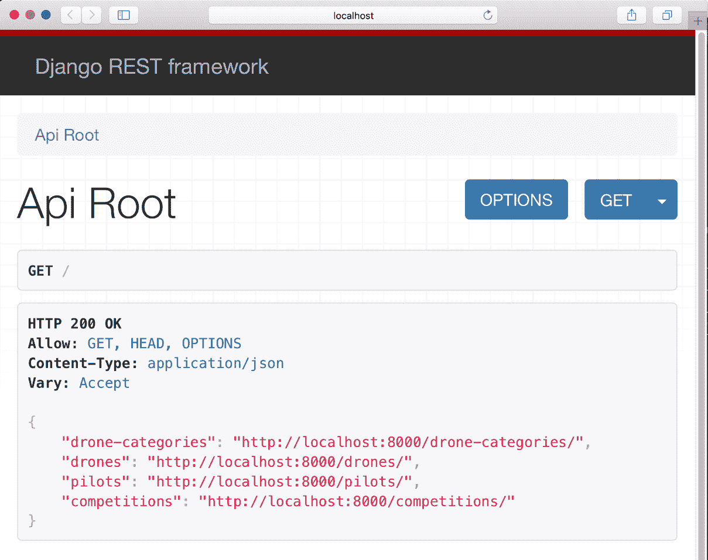

Api Root 渲染以下超链接：

+   `http://localhost:8000/drone-categories/`: 无人机类别的集合

+   `http://localhost:8000/drones/`: 无人机的集合

+   `http://localhost:8000/pilots/`: 飞行员的集合

+   `http://localhost:8000/competitions/`: 竞赛的集合

我们可以轻松通过点击或轻触适当的超链接来访问每个资源集合。一旦我们访问了每个资源集合，我们就可以在可浏览的 API 中对不同的资源执行操作。每次我们访问任何资源集合时，我们都可以使用面包屑导航回到列出所有超链接的 API 根。

我们的新 RESTful Web 服务利用了许多通用视图。这些视图为可浏览的 API 提供了许多功能，这些功能在我们使用基于函数的视图时并未包含，我们将能够使用表单轻松地组合并发送 HTTP `POST` 请求。

点击或轻触无人机类别右侧的 URL，网页浏览器将跳转到 `http://localhost:8000/drone-categories/`。结果，Django 将渲染无人机类别列表的网页。在网页底部，有两个选项卡可以发起 HTTP POST 请求：原始数据和 HTML 表单。默认情况下，HTML 表单选项卡被激活，并显示一个自动生成的表单，其中包含用于输入名称字段值的文本框。我们可以使用这个表单轻松地组合并发送 HTTP POST 请求，而无需像处理可浏览的 API 和我们的前一个 Web 服务时那样处理原始 JSON 数据。以下截图显示了创建新无人机类别的 HTML 表单：

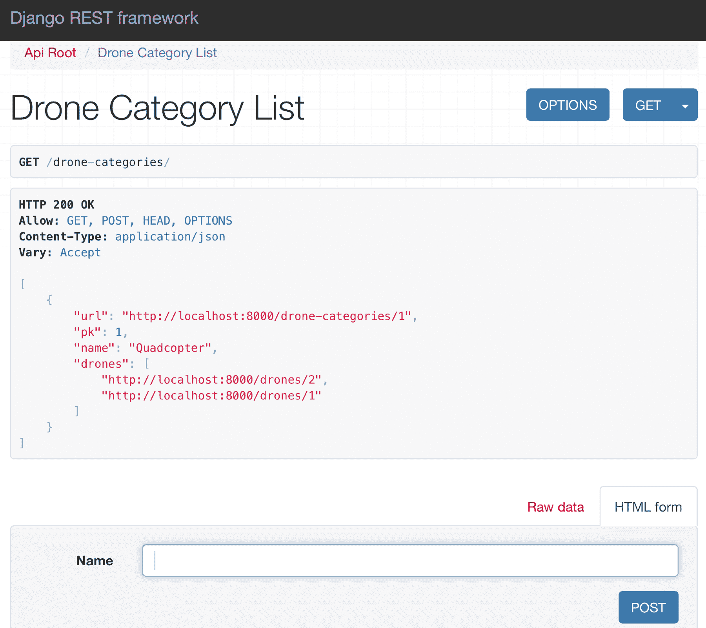

HTML 表单使得通过可浏览的 API 轻松生成请求来测试我们的 RESTful Web 服务变得非常简单。

在名称文本框中输入以下值：`Octocopter`。然后，点击或轻触 POST 以创建一个新的无人机类别。可浏览的 API 将组合并发送一个 HTTP `POST` 请求到 `/drone-categories/`，带有指定数据。然后，我们将在网页浏览器中看到这个请求的结果。以下截图显示了上一个操作渲染的网页结果，响应中有一个 HTTP 状态码为`201 Created`，以及之前解释的带有 POST 按钮的 HTML 表单，该按钮允许我们继续组合并发送 HTTP `POST` 请求到 `/drone-categories/`：

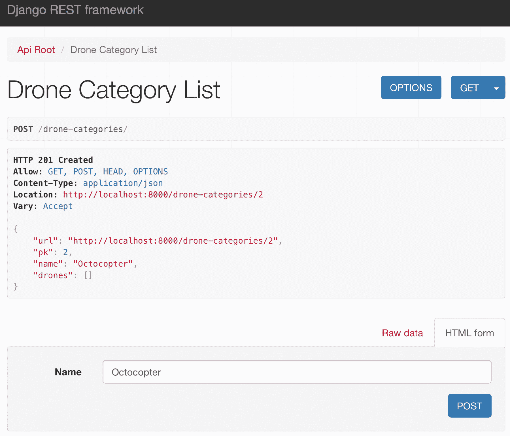

现在，您可以通过点击面包屑中的链接返回 Api 根目录，并使用 HTML 表单创建无人机、飞行员，最后是比赛。例如，转到 Api 根目录，点击或轻触无人机右侧的 URL，网页浏览器将跳转到 `http://localhost:8000/drones/`。结果，Django 将渲染无人机列表的网页。在网页底部，有两个选项卡可以发起 HTTP POST 请求：原始数据和 HTML 表单。默认情况下，HTML 表单选项卡被激活，并显示一个自动生成的表单，其中包含以下字段的适当控件：

+   名称

+   无人机类别

+   制造日期

+   是否已参赛

无人机类别字段提供了一个下拉菜单，包含所有现有的无人机类别，以便我们可以为我们的新无人机选择其中一个。是否已参赛字段提供了一个复选框，因为底层字段是布尔类型。

我们可以使用这个表单轻松地组合并发送一个 HTTP `POST` 请求，而无需像处理可浏览的 API 和我们的前一个 Web 服务时那样处理原始 JSON 数据。以下截图显示了创建新无人机的 HTML 表单：

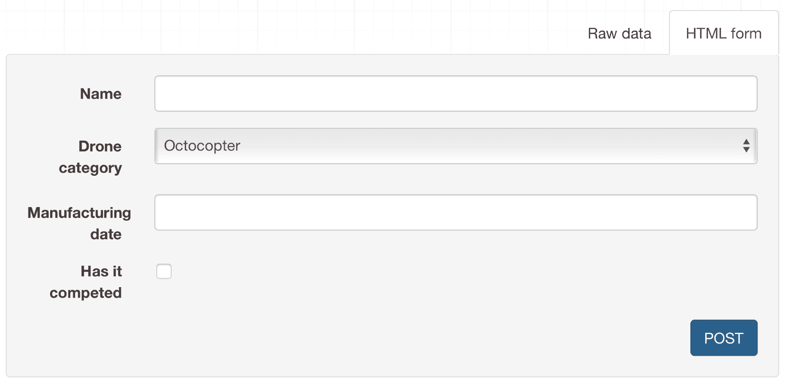

# 定义唯一约束

RESTful Web 服务不使用任何约束，因此可以创建许多具有相同名称的无人机类别。我们不想有太多具有相同名称的无人机类别。每个无人机类别名称必须在持久化无人机类别的数据库表（`drones_dronecategory`表）中是唯一的。我们还想让无人机和飞行员具有唯一的名称。因此，我们将对以下每个字段添加唯一约束的必要更改进行必要的更改：

+   `DroneCategory`模型的名称字段

+   `Drone`模型的名称字段

+   `Pilot`模型的名称字段

我们将通过运行已分析的迁移过程来学习编辑现有模型和向已持久化到表中的字段添加约束的必要步骤，并通过运行迁移过程在底层数据库中传播更改。

确保您退出 Django 的开发服务器。请记住，您只需在终端或命令提示符窗口中按*Ctrl* + *C*即可。我们必须编辑模型并执行迁移，然后再启动 Django 的开发服务器。

现在，我们将编辑现有的声明模型的代码，为用于表示和持久化无人机类别、无人机和飞行员的模型添加对`name`字段的唯一约束。打开`drones/models.py`文件，并用以下代码替换声明`DroneCategory`、`Drone`和`Pilot`类的代码。代码列表中已编辑的行被突出显示。`Competition`类的代码保持不变。示例代码文件包含在`hillar_django_restful_07_01`文件夹中的`restful01/drones/models.py`文件中：

```py
  class DroneCategory(models.Model): 
 name = models.CharField(max_length=250, unique=True) 
     class Meta: 
        ordering = ('name',) 

     def __str__(self): 
         return self.name 

  class Drone(models.Model): 
 name = models.CharField(max_length=250, unique=True)     drone_category = models.ForeignKey( 
         DroneCategory,  
         related_name='drones',  
         on_delete=models.CASCADE) 
      manufacturing_date = models.DateTimeField() 
      has_it_competed = models.BooleanField(default=False) 
      inserted_timestamp = models.DateTimeField(auto_now_add=True) 

    class Meta: 
        ordering = ('name',) 

    def __str__(self): 
        return self.name 

  class Pilot(models.Model): 
    MALE = 'M' 
    FEMALE = 'F' 
    GENDER_CHOICES = ( 
        (MALE, 'Male'), 
        (FEMALE, 'Female'), 
    ) 
 name = models.CharField(max_length=150, blank=False, unique=True)    gender = models.CharField( 
        max_length=2, 
        choices=GENDER_CHOICES, 
        default=MALE, 
    ) 
    races_count = models.IntegerField() 
    inserted_timestamp = models.DateTimeField(auto_now_add=True) 

    class Meta: 
        ordering = ('name',) 

    def __str__(self): 
        return self.name 
```

我们将`unique=True`作为每个调用`models.CharField`初始化器的命名参数之一添加。这样，我们指定字段必须是唯一的，Django 的 ORM 会将此转换为在底层数据库表中创建必要唯一约束的要求。

现在，执行将为我们添加到模型中字段生成的唯一约束的迁移是必要的。这次，迁移过程将同步数据库与我们在模型中做出的更改，因此，该过程将应用一个增量。运行以下 Python 脚本：

```py
    python manage.py makemigrations drones
```

以下行显示了运行上一个命令后生成的输出：

```py
Migrations for 'drones':
drones/migrations/0002_auto_20171104_0246.py
- Alter field name on drone
- Alter field name on dronecategory
- Alter field name on pilot 
```

输出中的行表明`drones/migrations/0002_auto_20171104_0246.py`文件包含了更改`drone`、`dronecategory`和`pilot`上名为`name`的字段的代码。重要的是要注意，迁移过程生成的 Python 文件名包含了日期和时间，因此，当您在开发计算机上运行代码时，名称将不同。

以下行显示了由 Django 自动生成的文件的代码。示例的代码文件包含在 `hillar_django_restful_07_01` 文件夹中的 `restful01/drones/migrations/0002_auto_20171104_0246.py` 文件中：

```py
# -*- coding: utf-8 -*- 
# Generated by Django 1.11.5 on 2017-11-04 02:46 
from __future__ import unicode_literals 

from django.db import migrations, models 

class Migration(migrations.Migration): 

    dependencies = [ 
        ('drones', '0001_initial'), 
    ] 

    operations = [ 
        migrations.AlterField( 
            model_name='drone', 
            name='name', 
            field=models.CharField(max_length=250, unique=True), 
        ), 
        migrations.AlterField( 
            model_name='dronecategory', 
            name='name', 
            field=models.CharField(max_length=250, unique=True), 
        ), 
        migrations.AlterField( 
            model_name='pilot', 
            name='name', 
            field=models.CharField(max_length=50, unique=True), 
        ), 
    ] 
```

代码定义了一个名为 `Migration` 的 `django.db.migrations.Migration` 类的子类，该类定义了一个包含许多 `migrations.AlterField` 实例的 `operations` 列表。每个 `migrations.AlterField` 实例将更改与每个相关模型（`drone`、`dronecategory` 和 `pilot`）相关的表中的字段。

现在，运行以下 Python 脚本来执行所有生成的迁移并在底层数据库表中应用更改：

```py
    python manage.py migrate
```

以下行显示了运行上一个命令后生成的输出。请注意，迁移执行的顺序可能在您的开发计算机中有所不同：

```py
    Operations to perform:
      Apply all migrations: admin, auth, contenttypes, drones, sessions
    Running migrations:
      Applying drones.0002_auto_20171104_0246... OK

```

在我们运行上一个命令后，PostgreSQL 数据库中以下表的 `name` 字段将具有唯一索引：

+   `drones_drone`

+   `drones_dronecategory`

+   `drones_pilot`

我们可以使用 PostgreSQL 命令行工具或任何允许我们轻松检查 PostgreSQL 数据库内容的其他应用程序来检查 Django 更新了哪些表。如果您使用的是 SQLite 或其他数据库，请确保您使用与您使用的数据库相关的命令或工具。

以下截图显示了 SQLPro for Postgres GUI 工具中之前列举的每个表的索引列表。每个表都有一个针对名称字段的新的唯一索引：

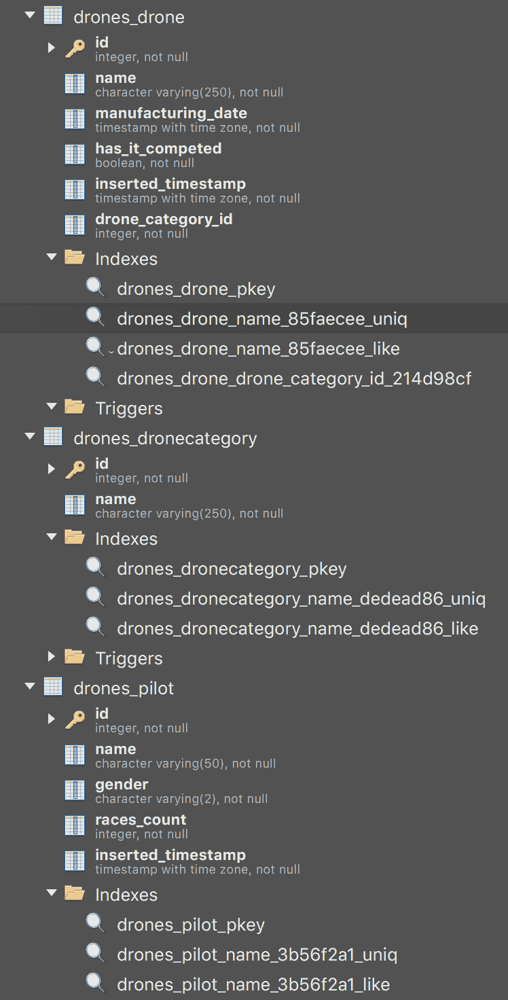

以下是在示例数据库中为新唯一索引生成的名称：

+   `drones_drone` 表的 `drones_drone_name_85faecee_uniq` 唯一索引

+   `drones_dronecategory` 表的 `drones_drone_dronecategory_name_dedead86_uniq` 唯一索引

+   `drones_pilot` 表的 `drones_pilot_name_3b56f2a1_uniq` 唯一索引

# 处理唯一约束

现在，我们可以启动 Django 的开发服务器来编写并发送 HTTP 请求，以了解当唯一约束应用于我们的模型时的工作方式。根据您的需求，执行以下两个命令之一，以在其他设备或连接到您的局域网的计算机上访问 API。请记住，我们在 *启动 Django 的开发服务器* 部分的 第三章 中分析了它们之间的区别：

```py
    python manage.py runserver
    python manage.py runserver 0.0.0.0:8000 
```

在我们运行任何之前的命令后，开发服务器将监听端口 `8000`。

现在，我们将编写并发送一个 HTTP 请求来创建一个名为 `'Quadcopter'` 的无人机类别，如下所示：

```py
    http POST :8000/drone-categories/ name="Quadcopter"
```

以下是对应的 `curl` 命令：

```py
 curl -iX POST -H "Content-Type: application/json" -d  '{"name":"Quadcopter"}' localhost:8000/drone-categories/ 
```

Django 无法持久化名称等于指定值的`DroneCategory`实例，因为它违反了我们刚刚添加到`DroneCategory`模型`name`字段的唯一约束。由于请求的结果，我们将在响应头中收到`400 Bad Request`状态码，并在 JSON 体中收到与`name`字段指定的值相关的消息：“具有此名称的无人机类别已存在。”以下行显示了详细的响应：

```py
    HTTP/1.0 400 Bad Request
    Allow: GET, POST, HEAD, OPTIONS
    Content-Length: 58
    Content-Type: application/json
    Date: Sun, 05 Nov 2017 04:00:42 GMT
    Server: WSGIServer/0.2 CPython/3.6.2
    Vary: Accept, Cookie
    X-Frame-Options: SAMEORIGIN

    {
        "name": [
            "drone category with this name already exists."
        ]
    }
```

我们对无人机类别、无人机或飞行员中的`name`字段进行了必要的更改，以避免重复值。每当指定这些资源中的任何一个的名称时，我们都会引用相同的唯一资源，因为不可能存在重复。

现在，我们将编写并发送一个 HTTP 请求来创建一个具有已存在名称的飞行员：`'Penelope Pitstop'`，如下所示：

```py
    http POST :8000/pilots/ name="Penelope Pitstop" gender="F" 
    races_count=0
```

以下是对应的`curl`命令：

```py
    curl -iX POST -H "Content-Type: application/json" -d    
    '{"name":"Penelope Pitstop", "gender":"F", "races_count": 0}'   
    localhost:8000/pilots/
```

之前的命令将使用指定的 JSON 键值对编写并发送一个 HTTP `POST`请求。请求指定`/pilots/`，因此它将匹配`'^pilots/$'`正则表达式，并运行`views.PilotList`类视图的`post`方法。由于请求，我们将在响应头中收到`400 Bad Request`状态码，并在 JSON 体中收到与`name`字段指定的值相关的消息：“具有此名称的飞行员已存在。”以下行显示了详细的响应：

```py
    HTTP/1.0 400 Bad Request
    Allow: GET, POST, HEAD, OPTIONS
    Content-Length: 49
    Content-Type: application/json
    Date: Sun, 05 Nov 2017 04:13:37 GMT
    Server: WSGIServer/0.2 CPython/3.6.2
    Vary: Accept, Cookie
    X-Frame-Options: SAMEORIGIN

    {
        "name": [
            "pilot with this name already exists."
        ]
    }
```

如果我们借助可浏览 API 中的 HTML 表单生成 HTTP `POST`请求，我们将在表单中名称字段下方看到显示的错误消息，如下一个屏幕截图所示：

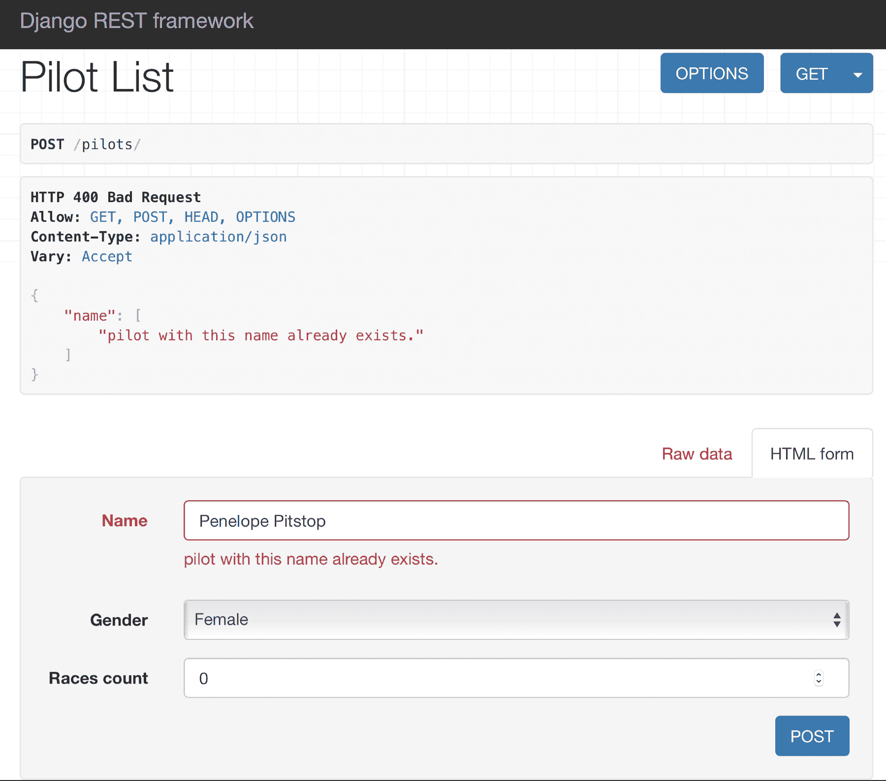

# 理解分页

到目前为止，我们一直在使用只有几行的数据库，因此，我们对 RESTful Web 服务的不同资源集合发出的 HTTP `GET`请求在响应 JSON 体中的数据量方面没有问题。然而，随着数据库表中行数的增加，这种情况发生了变化。

让我们假设我们在`drones_pilots`表中持久化飞行员有 300 行。我们不希望在向`localhost:8000/pilots/`发出 HTTP `GET`请求时检索 300 名飞行员的全部数据。相反，我们只需利用 Django REST 框架中可用的分页功能，使其易于指定我们希望将大量结果集拆分为单个数据页的方式。这样，每个请求将只检索一页数据，而不是整个结果集。例如，我们可以进行必要的配置，以仅检索最多四名飞行员的页面数据。

每当我们启用分页方案时，HTTP `GET`请求必须指定它们想要检索的数据片段，即基于预定义的分页方案的具体页面的详细信息。此外，在响应体中包含有关资源总数、下一页和上一页的数据极为有用。这样，使用 RESTful Web 服务的用户或应用程序就知道需要发出哪些额外请求以检索所需的页面。

我们可以使用页码，客户端可以在 HTTP `GET`请求中请求特定的页码。每一页将包含最大数量的资源。例如，如果我们请求 300 名飞行员的第一页，Web 服务将在响应体中返回前四个飞行员。第二页将返回响应体中第五到第八位的飞行员。

另一种选项是指定偏移量与限制。例如，如果我们请求一个偏移量为 0 且限制为 4 的页面，Web 服务将在响应体中返回前四个飞行员。第二次请求偏移量为 4 且限制为 4 的请求将返回响应体中第五到第八位的飞行员。

目前，我们定义的模型持久化的每个数据库表都有几行。然而，在我们开始在现实生活中的生产环境中使用我们的 Web 服务后，我们将有数百场比赛、飞行员、无人机和无人机类别。因此，我们肯定必须处理大量结果集。在大多数 RESTful Web 服务中，我们通常会有相同的情况，因此，与分页机制一起工作非常重要。

# 配置分页类

Django REST 框架提供了许多选项来启用分页。首先，我们将设置 Django REST 框架中包含的可定制的分页样式之一，以便在数据每一页中包含最多四个资源。

我们的 RESTful Web 服务使用与**mixin**类一起工作的通用视图。这些类已经准备好根据 Django REST 框架配置中的特定设置构建分页响应。因此，我们的 RESTful Web 服务将自动考虑我们配置的分页设置，而无需在代码中进行额外更改。

打开`restful01/restful01/settings.py`文件，该文件声明了定义`restful01`项目 Django 配置的模块级变量。我们将对此 Django 设置文件进行一些更改。示例代码文件包含在`hillar_django_restful_07_01`文件夹中，位于`restful01/restful01/settings.py`文件中。添加以下行，声明一个名为`REST_FRAMEWORK`的字典，其中包含配置全局分页设置的键值对：

```py
 REST_FRAMEWORK = {
    'DEFAULT_PAGINATION_CLASS':
    'rest_framework.pagination.LimitOffsetPagination',
    'PAGE_SIZE': 4
 }
```

保存更改后，Django 的开发服务器将识别编辑并重新启动，启用新的分页设置。新的字典有两个字符串键：`'DEFAULT_PAGINATION_CLASS'` 和 `'PAGE_SIZE'`。`'DEFAULT_PAGINATION_CLASS'` 键的值指定了一个全局设置，即通用视图将使用的默认分页类，用于提供分页响应。在这种情况下，我们将使用 `rest_framework.pagination.LimitOffsetPagination` 类，它提供基于限制/偏移的样式。

这种分页样式使用一个 `limit` 参数，表示要返回的最大项目数，以及一个指定查询起始位置的 `offset`。`PAGE_SIZE` 设置键的值指定了一个全局设置，即 `limit` 的默认值，也称为页面大小。在这种情况下，该值设置为 `4`，因此，单个请求中返回的资源最大数量将是四个。我们可以在执行 HTTP 请求时通过指定 `limit` 查询参数中的所需值来指定不同的限制。我们可以配置类以具有最大的 `limit` 值，以避免不希望的大结果集。这样，我们可以确保用户无法指定一个大的 `limit` 值。然而，我们将在稍后进行此特定配置。

现在，我们将编写并发送多个 HTTP `POST` 请求来创建与我们所创建的两个无人机类别（`Quadcopter` 和 `Octocopter`）相关的九个额外无人机：这样，我们将总共拥有 11 架无人机（两个现有无人机加上九个额外无人机）来测试我们已启用的限制/偏移分页机制：

```py
    http POST :8000/drones/ name="Need for Speed" drone_category="Quadcopter" manufacturing_date="2017-01-20T02:02:00.716312Z" has_it_competed=false 
    http POST :8000/drones/ name="Eclipse" drone_category="Octocopter" manufacturing_date="2017-02-18T02:02:00.716312Z" has_it_competed=false
    http POST :8000/drones/ name="Gossamer Albatross" drone_category="Quadcopter" manufacturing_date="2017-03-20T02:02:00.716312Z" has_it_competed=false 
    http POST :8000/drones/ name="Dassault Falcon 7X" drone_category="Octocopter" manufacturing_date="2017-04-18T02:02:00.716312Z" has_it_competed=false
    http POST :8000/drones/ name="Gulfstream I" drone_category="Quadcopter" manufacturing_date="2017-05-20T02:02:00.716312Z" has_it_competed=false 
    http POST :8000/drones/ name="RV-3" drone_category="Octocopter" manufacturing_date="2017-06-18T02:02:00.716312Z" has_it_competed=false
    http POST :8000/drones/ name="Dusty" drone_category="Quadcopter" manufacturing_date="2017-07-20T02:02:00.716312Z" has_it_competed=false 
    http POST :8000/drones/ name="Ripslinger" drone_category="Octocopter" manufacturing_date="2017-08-18T02:02:00.716312Z" has_it_competed=false
    http POST :8000/drones/ name="Skipper" drone_category="Quadcopter" manufacturing_date="2017-09-20T02:02:00.716312Z" has_it_competed=false  
```

以下是对应的 `curl` 命令：

```py
 curl -iX POST -H "Content-Type: application/json" -d '{"name":"Need for Speed", "drone_category":"Quadcopter", "manufacturing_date": "2017-01-20T02:02:00.716312Z", "has_it_competed": "false"}' localhost:8000/drones/
    curl -iX POST -H "Content-Type: application/json" -d '{"name":"Eclipse", "drone_category":"Octocopter", "manufacturing_date": "2017-02-20T02:02:00.716312Z", "has_it_competed": "false"}' localhost:8000/drones/
    curl -iX POST -H "Content-Type: application/json" -d '{"name":"Gossamer Albatross", "drone_category":"Quadcopter", "manufacturing_date": "2017-03-20T02:02:00.716312Z", "has_it_competed": "false"}' localhost:8000/drones/
    curl -iX POST -H "Content-Type: application/json" -d '{"name":"Dassault Falcon 7X", "drone_category":"Octocopter", "manufacturing_date": "2017-04-20T02:02:00.716312Z", "has_it_competed": "false"}' localhost:8000/drones/
    curl -iX POST -H "Content-Type: application/json" -d '{"name":"Gulfstream I", "drone_category":"Quadcopter", "manufacturing_date": "2017-05-20T02:02:00.716312Z", "has_it_competed": "false"}' localhost:8000/drones/
    curl -iX POST -H "Content-Type: application/json" -d '{"name":"RV-3", "drone_category":"Octocopter", "manufacturing_date": "2017-06-20T02:02:00.716312Z", "has_it_competed": "false"}' localhost:8000/drones/
    curl -iX POST -H "Content-Type: application/json" -d '{"name":"Dusty", "drone_category":"Quadcopter", "manufacturing_date": "2017-07-20T02:02:00.716312Z", "has_it_competed": "false"}' localhost:8000/drones/
    curl -iX POST -H "Content-Type: application/json" -d '{"name":"Ripslinger", "drone_category":"Octocopter", "manufacturing_date": "2017-08-20T02:02:00.716312Z", "has_it_competed": "false"}' localhost:8000/drones/
    curl -iX POST -H "Content-Type: application/json" -d '{"name":"Skipper", "drone_category":"Quadcopter", "manufacturing_date": "2017-09-20T02:02:00.716312Z", "has_it_competed": "false"}' localhost:8000/drones/  
```

之前的命令将编写并发送九个 HTTP `POST` 请求，指定了指定的 JSON 键值对。请求指定 `/drones/`，因此，它们将匹配 `'^drones/$'` 正则表达式，并运行 `views.DroneList` 类视图的 `post` 方法。

# 发送分页结果请求

现在，我们将编写并发送一个 HTTP `GET` 请求来检索所有无人机。新的分页设置将生效，我们只会检索无人机资源集合的第一页：

```py
    http GET :8000/drones/  
```

以下是对应的 `curl` 命令：

```py
    curl -iX GET localhost:8000/drones/
```

之前的命令将编写并发送一个 HTTP `GET` 请求。请求指定`/drones/`，因此，它将匹配`'^drones/$'`正则表达式，并运行`views.DroneList`类视图的`get`方法。在通用视图中执行的方法将使用我们添加的新设置来启用偏移/限制分页，并提供给我们前四个无人机资源。然而，响应体看起来与我们在之前对任何资源集合发出的 HTTP `GET` 请求不同。以下行显示了我们将详细分析的示例响应。别忘了无人机是按名称字段升序排序的：

```py
    HTTP/1.0 200 OK
    Allow: GET, POST, HEAD, OPTIONS
    Content-Length: 958
    Content-Type: application/json
    Date: Mon, 06 Nov 2017 23:08:36 GMT
    Server: WSGIServer/0.2 CPython/3.6.2
    Vary: Accept, Cookie
    X-Frame-Options: SAMEORIGIN

    {
    "count": 11, 
    "next": "http://localhost:8000/drones/?limit=4&offset=4", 
    "previous": null, 
        "results": [
            {
    "drone_category": "Quadcopter", 
    "has_it_competed": false, 
    "inserted_timestamp": "2017-11-03T01:59:31.108031Z", 
    "manufacturing_date": "2017-08-18T02:02:00.716312Z", 
    "name": "Atom", 
                "url": "http://localhost:8000/drones/2"
    }, 
            {
    "drone_category": "Octocopter", 
    "has_it_competed": false, 
    "inserted_timestamp": "2017-11-06T20:25:30.357127Z", 
    "manufacturing_date": "2017-04-18T02:02:00.716312Z", 
    "name": "Dassault Falcon 7X", 
                "url": "http://localhost:8000/drones/6"
    }, 
            {
    "drone_category": "Quadcopter", 
    "has_it_competed": false, 
    "inserted_timestamp": "2017-11-06T20:25:31.049833Z", 
    "manufacturing_date": "2017-07-20T02:02:00.716312Z", 
    "name": "Dusty", 
                "url": "http://localhost:8000/drones/9"
    }, 
            {
    "drone_category": "Octocopter", 
    "has_it_competed": false, 
    "inserted_timestamp": "2017-11-06T20:25:29.909965Z", 
    "manufacturing_date": "2017-02-18T02:02:00.716312Z", 
    "name": "Eclipse", 
                "url": "http://localhost:8000/drones/4"
            }
        ]
    }
```

响应头中有一个`200 OK`状态码，响应体中有以下键：

+   `count`：该值表示查询的无人机总数。

+   `next`：该值提供了一个到下一页的链接。

+   `previous`：该值提供了一个到上一页的链接。在这种情况下，响应包括结果集的第一页，因此，上一页的链接是`null`。

+   `results`：该值提供了一个由请求页面的`Drone`实例组成的 JSON 表示数组的值。在这种情况下，四个无人机属于结果集的第一页。

在之前的 HTTP `GET` 请求中，我们没有指定`limit`或`offset`参数的任何值。我们在全局设置中将`limit`参数的默认值指定为`4`，通用视图使用此配置值并提供给我们第一页。每次我们没有指定任何`offset`值时，默认的`offset`等于`0`，`get`方法将返回第一页。

之前的请求等同于以下指定`offset`值为`0`的 HTTP `GET` 请求。下一个命令的结果将与之前的相同：

```py
    http GET ":8000/drones/?offset=0"
```

以下是对应的`curl`命令：

```py
    curl -iX GET "localhost:8000/drones/?offset=0"
```

之前的请求等同于以下指定`offset`值为`0`和`limit`值为`4`的 HTTP `GET` 请求。下一个命令的结果将与之前的两个命令相同：

```py
    http GET ":8000/drones/?limit=4&offset=0"
```

以下是对应的`curl`命令：

```py
    curl -iX GET "localhost:8000/drones/?limit=4&offset=0"

```

现在，我们将编写并发送一个 HTTP 请求以检索下一页，即无人机的第二页。我们将使用前一个请求的 JSON 响应体中提供的`next`键的值。这个值为我们提供了下一页的 URL：`http://localhost:8000/drones/?limit=4&offset=4`。因此，我们将编写并发送一个 HTTP `GET` 方法到`/drones/`，将限制值设置为`4`，将`offset`值设置为`4`：

```py
    http GET ":8000/drones/?limit=4&offset=4"
```

以下是对应的`curl`命令：

```py
    curl -iX GET "localhost:8000/drones/?limit=4&offset=4"
```

结果将为我们提供四个无人机资源中的第二页，作为响应体中`results`键的值。此外，我们还将看到之前请求中分析的`count`、`previous`和`next`键的值。以下行显示了示例响应：

```py
HTTP/1.0 200 OK
Allow: GET, POST, HEAD, OPTIONS
Content-Length: 1007
Content-Type: application/json
Date: Mon, 06 Nov 2017 23:31:34 GMT
Server: WSGIServer/0.2 CPython/3.6.2
Vary: Accept, Cookie
X-Frame-Options: SAMEORIGIN

{
 "count": 11,
 "next": "http://localhost:8000/drones/?limit=4&offset=8",
 "previous": "http://localhost:8000/drones/?limit=4",
 "results": [
 {
 "drone_category": "Quadcopter",
 "has_it_competed": false,
 "inserted_timestamp": "2017-11-06T20:25:30.127661Z",
 "manufacturing_date": "2017-03-20T02:02:00.716312Z",
 "name": "Gossamer Albatross",
 "url": "http://localhost:8000/drones/5"
 },
 {
 "drone_category": "Quadcopter",
 "has_it_competed": false,
 "inserted_timestamp": "2017-11-06T20:25:30.584031Z",
 "manufacturing_date": "2017-05-20T02:02:00.716312Z",
 "name": "Gulfstream I",
 "url": "http://localhost:8000/drones/7"
 },
 {
 "drone_category": "Quadcopter",
 "has_it_competed": false,
 "inserted_timestamp": "2017-11-06T20:25:29.636153Z",
 "manufacturing_date": "2017-01-20T02:02:00.716312Z",
 "name": "Need for Speed",
 "url": "http://localhost:8000/drones/3"
 },
 {
 "drone_category": "Octocopter",
 "has_it_competed": false,
 "inserted_timestamp": "2017-11-06T20:25:30.819695Z",
 "manufacturing_date": "2017-06-18T02:02:00.716312Z",
 "name": "RV-3",
 "url": "http://localhost:8000/drones/8"
 }
 ]
}
```

在这种情况下，结果集是第二页，因此，我们有一个`previous`键的值：`http://localhost:8000/drones/?limit=4`。

在之前的 HTTP 请求中，我们指定了`limit`和`offset`参数的值。然而，由于我们在全局设置中将`limit`的默认值设置为`4`，接下来的请求将产生与之前请求相同的结果：

```py
    http GET ":8000/drones/?offset=4"
```

以下是对应的`curl`命令：

```py
    curl -iX GET "localhost:8000/drones/?offset=4"
```

现在，我们将编写并发送一个 HTTP 请求以检索下一页，即无人机的第三页和最后一页。我们将使用之前请求的 JSON 响应体中提供的`next`键的值。此值为我们提供了下一页的 URL，即`http://localhost:8000/drones/?limit=4&offset=8`。因此，我们将编写并发送一个 HTTP `GET`方法到`/drones/`，将限制值设置为`4`，将`offset`值设置为`8`：

```py
    http GET ":8000/drones/?limit=4&offset=8"
```

以下是对应的`curl`命令：

```py
    curl -iX GET "localhost:8000/drones/?limit=4&offset=8"
```

结果将为我们提供三个无人机资源中的第三页和最后一页，作为响应体中`results`键的值。此外，我们还将看到之前请求中分析的`count`、`previous`和`next`键的值。以下行显示了示例响应：

```py
    HTTP/1.0 200 OK
    Allow: GET, POST, HEAD, OPTIONS
    Content-Length: 747
    Content-Type: application/json
    Date: Tue, 07 Nov 2017 02:59:42 GMT
    Server: WSGIServer/0.2 CPython/3.6.2
    Vary: Accept, Cookie
    X-Frame-Options: SAMEORIGIN

    {
    "count": 11, 
    "next": null, 
    "previous": "http://localhost:8000/drones/?limit=4&offset=4", 
        "results": [
            {
    "drone_category": "Octocopter", 
    "has_it_competed": false, 
    "inserted_timestamp": "2017-11-06T20:25:31.279172Z", 
    "manufacturing_date": "2017-08-18T02:02:00.716312Z", 
    "name": "Ripslinger", 
                "url": "http://localhost:8000/drones/10"
    }, 
            {
    "drone_category": "Quadcopter", 
    "has_it_competed": false, 
    "inserted_timestamp": "2017-11-06T20:25:31.511881Z", 
    "manufacturing_date": "2017-09-20T02:02:00.716312Z", 
    "name": "Skipper", 
                "url": "http://localhost:8000/drones/11"
    }, 
            {
    "drone_category": "Quadcopter", 
    "has_it_competed": false, 
    "inserted_timestamp": "2017-11-03T01:58:49.135737Z", 
    "manufacturing_date": "2017-07-20T02:02:00.716312Z", 
    "name": "WonderDrone", 
                "url": "http://localhost:8000/drones/1"
            }
        ]
    }  
```

在这种情况下，结果集是最后一页，因此，`next`键的值为`null`。

# 使用自定义分页类进行工作

我们启用了分页来限制结果集的大小。然而，任何客户端或用户都可以指定一个大的`limit`值，例如`10000`，并生成一个巨大的结果集。为了指定接受`limit`查询参数的最大数值，有必要创建一个自定义的 Django REST 框架提供的 limit/offset 分页方案的版本。

我们对全局配置进行了更改，使用`rest_framework.pagination.LimitOffsetPagination`类来处理分页响应。这个类声明了一个`max_limit`类属性，其默认值等于`None`，这意味着`limit`值没有上限。我们将在`max_limit`类属性中指定`limit`查询参数的上限值。

确保您退出 Django 的开发服务器。请记住，您只需在终端或运行它的命令提示符中按*Ctrl* + *C*即可。

前往`restful01/drones`文件夹，并创建一个名为`custompagination.py`的新文件。在这个新文件中编写以下代码。以下行显示了此文件的代码，该代码声明了新的`LimitOffsetPaginationWithUpperBound`类。示例的代码文件包含在`hillar_django_restful_07_02`文件夹中的`restful01/drones/custompagination.py`文件中：

```py
from rest_framework.pagination import LimitOffsetPagination 
class LimitOffsetPaginationWithUpperBound(LimitOffsetPagination):
    # Set the maximum limit value to 8 
       max_limit = 8
```

上一行声明了`LimitOffsetPaginationWithUpperBound`类为`rest_framework.pagination.LimitOffsetPagination`类的子类。这个新类覆盖了分配给`max_limit`类属性的值，将其设置为`8`。

打开`restful01/restful01/settings.py`文件，并将指定`REST_FRAMEWORK`字典中`DEFAULT_PAGINATION_CLASS`键值的行替换为高亮行。以下行显示了新的`REST_FRAMEWORK`字典声明。示例的代码文件包含在`hillar_django_restful_07_02`文件夹中的`restful01/restful01/settings.py`文件中：

```py
 REST_FRAMEWORK = { 
    'DEFAULT_PAGINATION_CLASS': 
 'drones.custompagination.LimitOffsetPaginationWithUpperBound', 
    'PAGE_SIZE': 4 
 } 
```

这样，所有通用视图都将使用最近声明的`drones.custompagination.LimitOffsetPaginationWithUpperBound`类，该类提供了我们已分析的带有`limit`值上限为`8`的限制/偏移分页方案。

如果任何请求指定的限制值高于 8，则该类将使用最大限制值，即`8`，并且 RESTful Web 服务永远不会在分页响应中返回超过八个资源。

配置最大限制是一个好习惯，可以避免生成可能对运行 RESTful Web 服务的服务器产生重要负载的大量数据响应。请注意，我们将在接下来的章节中学习如何限制我们 RESTful Web 服务资源的使用。分页只是漫长故事的开端。

# 发送使用自定义分页结果的请求

启动 Django 的开发服务器。如果你不记得如何启动 Django 的开发服务器，请查看*启动 Django 开发服务器*部分中的第三章，*创建 API 视图*中的说明。

现在，我们将编写并发送一个 HTTP `GET`请求，以检索具有`limit`查询参数值为`500`的无人机的第一页。这个值高于我们设定的最大限制：

```py
    http GET ":8000/drones/?limit=500"  
```

以下是对应的`curl`命令：

```py
    curl -iX GET "localhost:8000/drones/?limit=500"
```

`views.DroneList`类视图的`get`方法中的代码将使用我们添加的新设置来启用自定义的偏移/限制分页，并且结果将提供给我们前八个无人机资源，因为限制查询的最大值被设置为`8`。指定的`limit`查询参数值大于`8`，因此，将使用最大值`8`，而不是请求中指示的值。

与通用视图一起工作的关键优势是，我们可以通过几行代码轻松自定义由这些视图组成的混入中定义的方法的行为。在这种情况下，我们利用了 Django REST 框架中可用的分页功能来指定我们希望如何将大型结果集拆分为单独的数据页。然后，我们仅用几行代码自定义了分页结果，以使限制/偏移分页方案符合我们的特定要求。

# 配置过滤器后端类

到目前为止，我们一直使用整个查询集作为结果集。例如，每次我们请求无人机资源集合时，RESTful Web 服务都会处理整个资源集合并使用我们在模型中配置的默认排序。现在，我们希望我们的 RESTful Web 服务能够提供过滤、搜索和排序功能。

非常重要的是要理解，我们必须小心配置可用于过滤、搜索和排序的字段。配置将对数据库执行的查询产生影响，因此，我们必须确保我们有适当的数据库优化，考虑到将要执行的查询。具体的数据库优化超出了本书的范围，但您在配置这些功能时绝对必须考虑它们。

确保您已退出 Django 的开发服务器。请记住，您只需在终端或命令提示符窗口中按*Ctrl* + *C*即可。

运行以下命令在我们的虚拟环境中安装`django-filter`包。此包将使我们能够使用许多字段过滤功能，我们可以在 Django REST 框架中轻松自定义这些功能。确保虚拟环境已激活，并运行以下命令：

```py
    pip install django-filter
```

输出的最后几行将指示`django-filter`包已成功安装：

```py
     Collecting django-filter
     Downloading django_filter-1.1.0-py2.py3-none-any.whl
     Installing collected packages: django-filter
     Successfully installed django-filter-1.1.0
```

我们将使用以下三个类：

+   `rest_framework.filters.OrderingFilter`：此类允许客户端通过单个查询参数控制结果的排序方式。我们可以指定哪些字段可以进行排序。

+   `django_filters.rest_framework.DjangoFilterBackend`：此类提供字段过滤功能。我们可以指定我们想要能够过滤的字段集，并且`django-filter`包中定义的过滤后端将创建一个新的`django_filters.rest_framework.FilterSet`类并将其关联到基于类的视图。我们还可以创建自己的`rest_framework.filters.FilterSet`类，具有更多自定义设置，并编写自己的代码将其与基于类的视图关联。

+   `rest_framework.filters.SearchFilter`：此类提供基于单个查询参数的搜索功能，其行为基于 Django 管理员的搜索功能。我们可以指定我们想要包含在搜索功能中的字段集，客户端可以通过对这些字段进行搜索的查询来过滤项目。当我们要使请求能够通过单个查询在多个字段上进行搜索时，这很有用。

可以通过在元组中包含之前枚举的任何类来配置过滤器后端，并将其分配给通用视图类的 `filter_backends` 类属性。在我们的 RESTful Web 服务中，我们希望所有基于类的视图都使用相同的过滤器后端，因此我们将对全局配置进行修改。

打开声明 `restful01/restful01/settings.py` 文件中 Django `restful01` 项目的配置的模块级变量文件。我们将对此 Django 设置文件进行一些修改。添加高亮显示的行，声明 `'DEFAULT_FILTER_BACKENDS'` 键并将其值设置为包含我们已分析的三种类的字符串元组。以下行显示了新的 `REST_FRAMEWORK` 字典声明。示例代码文件包含在 `hillar_django_restful_07_03` 文件夹中的 `restful01/restful01/settings.py` 文件中：

```py
  REST_FRAMEWORK = { 
    'DEFAULT_PAGINATION_CLASS': 
    'drones.custompagination.LimitOffsetPaginationWithUpperBound', 
    'PAGE_SIZE': 4, 
 'DEFAULT_FILTER_BACKENDS': (
        'django_filters.rest_framework.DjangoFilterBackend', 
        'rest_framework.filters.OrderingFilter', 
        'rest_framework.filters.SearchFilter', 
        ),  } 
```

定位到将字符串列表赋值给 `INSTALLED_APPS` 的行，以声明已安装的应用程序。将以下字符串添加到 `INSTALLED_APPS` 字符串列表中，并将更改保存到 `settings.py` 文件中：

```py
  'django_filters',
```

以下行显示了新的代码，声明了带有高亮显示的添加行和注释的 `INSTALLED_APPS` 字符串列表。示例代码文件包含在 `hillar_django_restful_07_03` 文件夹中的 `restful01/restful01/settings.py` 文件中：

```py
  INSTALLED_APPS = [ 
     'django.contrib.admin', 
     'django.contrib.auth', 
     'django.contrib.contenttypes', 
     'django.contrib.sessions', 
     'django.contrib.messages', 
     'django.contrib.staticfiles', 
     # Django REST Framework 
     'rest_framework', 
     # Drones application 
     'drones.apps.DronesConfig', 
     # Django Filters, 
 'django_filters', ]
```

这样，我们就将 `django_filters` 应用程序添加到了名为 `restful01` 的 Django 项目中。

默认查询参数名称是 `search` 用于搜索功能，`ordering` 用于排序功能。我们可以通过在 `SEARCH_PARAM` 和 `ORDERING_PARAM` 设置中设置所需的字符串来指定其他名称。在这种情况下，我们将使用默认值。

# 添加过滤、搜索和排序

现在，我们将添加必要的代码来配置我们想要包含在每个基于类的视图中的过滤、搜索和排序功能，这些视图检索每个资源集合的内容。因此，我们将修改 `views.py` 文件中所有带有 `List` 后缀的类：`DroneCategoryList`、`DroneList`、`PilotList` 和 `CompetitionList`。

我们将在这些类中声明以下三个类属性：

+   `filter_fields`: 此属性指定了一个字符串元组，其值表示我们想要能够进行过滤的字段名称。在底层，Django REST 框架将自动创建一个`rest_framework.filters.FilterSet`类，并将其关联到我们声明此属性的基于类的视图中。我们将能够对字符串元组中包含的字段名称进行过滤。

+   `search_fields`: 此属性指定了一个字符串元组，其值表示我们想要包含在搜索功能中的文本类型字段名称。在所有用法中，我们都会想要执行以起始字符匹配。为了做到这一点，我们将包括`'^'`作为字段名称的前缀，以表示我们想要将搜索行为限制为以起始字符匹配。

+   `ordering_fields`: 此属性指定了一个字符串元组，其值表示 HTTP 请求可以指定的字段名称，以对结果进行排序。如果请求没有指定排序字段，则响应将使用与基于类的视图相关联的模型中指定的默认排序字段。

打开`restful01/drones/views.py`文件。在声明导入的最后一行之后，在`DroneCategoryList`类声明之前添加以下代码。示例的代码文件包含在`hillar_django_restful_07_03`文件夹中的`restful01/drones/views.py`文件中：

```py
from rest_framework import filters 
from django_filters import AllValuesFilter, DateTimeFilter, NumberFilter 
```

将以下突出显示的行添加到`views.py`文件中声明的`DroneList`类。下面的行显示了定义类的新的代码。示例的代码文件包含在`restful01/drones/views.py`文件中的`hillar_django_restful_07_03`文件夹中：

```py
class DroneCategoryList(generics.ListCreateAPIView): 
    queryset = DroneCategory.objects.all() 
    serializer_class = DroneCategorySerializer 
    name = 'dronecategory-list' 
 filter_fields = ( 
        'name', 
        ) 
    search_fields = ( 
        '^name', 
        ) 
    ordering_fields = ( 
        'name', 
        ) 
```

`DroneList`类的更改易于理解。我们将能够通过`name`字段进行过滤、搜索和排序。

将以下突出显示的行添加到`views.py`文件中声明的`DroneList`类。下面的行显示了定义类的新的代码。示例的代码文件包含在`restful01/drones/views.py`文件中的`hillar_django_restful_07_03`文件夹中：

```py
class DroneList(generics.ListCreateAPIView): 
    queryset = Drone.objects.all() 
    serializer_class = DroneSerializer 
    name = 'drone-list' 
 filter_fields = ( 
        'name',  
        'drone_category',  
        'manufacturing_date',  
        'has_it_competed',  
        ) 
    search_fields = ( 
        '^name', 
        ) 
    ordering_fields = ( 
        'name', 
        'manufacturing_date', 
        ) 
```

在`DroneList`类中，我们在`filter_fields`属性中指定了许多字段名称。我们在字符串元组中包含了`'drone_category'`，因此，我们将能够将此字段的 ID 值包含在过滤器中。

我们将利用其他相关模型选项，这将允许我们稍后通过相关模型的字段进行过滤。这样，我们将了解可用的不同自定义选项。

`ordering_fields`属性指定了字符串元组中的两个字段名称，因此，我们将能够通过`name`或`manufacturing_date`对结果进行排序。不要忘记，在启用按字段排序时，我们必须考虑数据库优化。

将以下突出显示的行添加到 `views.py` 文件中声明的 `PilotList` 类。下面的行显示了定义类的新的代码。示例代码文件包含在 `hillar_django_restful_07_03` 文件夹中的 `restful01/drones/views.py` 文件中：

```py
class PilotList(generics.ListCreateAPIView): 
    queryset = Pilot.objects.all() 
    serializer_class = PilotSerializer 
    name = 'pilot-list' 
 filter_fields = ( 
        'name',  
        'gender', 
        'races_count', 
        ) 
    search_fields = ( 
        '^name', 
        ) 
    ordering_fields = ( 
        'name', 
        'races_count' 
        )
```

`ordering_fields` 属性指定了字符串元组的两个字段名称，因此我们可以通过 `name` 或 `races_count` 对结果进行排序。

# 与不同类型的 Django 过滤器一起工作

现在，我们将创建一个自定义过滤器，并将其应用于 `Competition` 模型。我们将编写新的 `CompetitionFilter` 类，具体来说，是 `rest_framework.filters.FilterSet` 类的子类。

打开 `restful01/drones/views.py` 文件。在 `CompetitionList` 类声明之前添加以下代码。示例代码文件包含在 `hillar_django_restful_07_03` 文件夹中的 `restful01/drones/views.py` 文件中：

```py
class CompetitionFilter(filters.FilterSet): 
    from_achievement_date = DateTimeFilter( 
        name='distance_achievement_date', lookup_expr='gte') 
    to_achievement_date = DateTimeFilter( 
        name='distance_achievement_date', lookup_expr='lte') 
    min_distance_in_feet = NumberFilter( 
        name='distance_in_feet', lookup_expr='gte') 
    max_distance_in_feet = NumberFilter( 
        name='distance_in_feet', lookup_expr='lte') 
    drone_name = AllValuesFilter( 
        name='drone__name') 
    pilot_name = AllValuesFilter( 
        name='pilot__name') 

    class Meta: 
        model = Competition 
        fields = ( 
            'distance_in_feet', 
            'from_achievement_date', 
            'to_achievement_date', 
            'min_distance_in_feet', 
            'max_distance_in_feet', 
            # drone__name will be accessed as drone_name 
            'drone_name', 
            # pilot__name will be accessed as pilot_name 
            'pilot_name', 
            )
```

`CompetitionFilter` 类声明了以下类属性：

+   `from_achievement_date`: 此属性是一个 `django_filters.DateTimeFilter` 实例，允许请求过滤那些 `achievement_date` 日期时间值大于或等于指定日期时间的比赛。`name` 参数指定的值表示应用日期时间过滤的字段，即 `'distance_achievement_date'`，而 `lookup_expr` 参数的值表示查找表达式，即 `'gte'`，表示大于或等于。

+   `to_achievement_date`: 此属性是一个 `django_filters.DateTimeFilter` 实例，允许请求过滤那些 `achievement_date` 日期时间值小于或等于指定日期时间的比赛。`name` 参数指定的值表示应用日期时间过滤的字段，即 `'distance_achivement_date'`，而 `lookup_expr` 参数的值表示查找表达式，即 `'lte'`，表示小于或等于。

+   `min_distance_in_feet`: 此属性是一个 `django_filters.NumberFilter` 实例，允许请求过滤那些 `distance_in_feet` 数值大于或等于指定数值的比赛。`name` 参数的值表示应用数值过滤的字段，即 `'distance_in_feet'`，而 `lookup_expr` 参数的值表示查找表达式，即 `'gte'`，表示大于或等于。

+   `max_distance_in_feet`: 此属性是一个 `django_filters.NumberFilter` 实例，允许请求过滤那些 `distance_in_feet` 数值小于或等于指定数值的比赛。`name` 参数的值表示应用数值过滤的字段，即 `'distance_in_feet'`，而 `lookup_expr` 参数的值表示查找表达式，即 `'lte'`，表示小于或等于。

+   `drone_name`: 这个属性是一个 `django_filters.AllValuesFilter` 实例，允许请求通过匹配指定的字符串值来过滤无人机名字的竞赛。`name` 参数的值表示应用过滤器的字段，即 `'drone__name'`。注意 `drone` 和 `name` 之间有一个双下划线（`__`），你可以将其读作 `drone` 模型的 `name` 字段，或者简单地用点替换双下划线并读作 `drone.name`。该名称使用 Django 的双下划线语法。然而，我们不希望请求使用 `drone__name` 来指定无人机名字的过滤器。因此，该实例存储在名为 `drone_name` 的类属性中，`player` 和 `name` 之间只有一个下划线，使其更易于用户使用。我们将进行配置，使可浏览的 API 显示一个下拉菜单，显示所有可能的无人机名字值，以便用作过滤器。下拉菜单将只包括已注册竞赛的无人机名字。

+   `pilot_name`: 这个属性是一个 `django_filters.AllValuesFilter` 实例，允许请求通过匹配指定的字符串值来过滤飞行员名字的竞赛。`name` 参数的值表示应用过滤器的字段，即 `'pilot__name'`。该名称使用 Django 的双下划线语法。正如 `drone_name` 的情况一样，我们不希望请求使用 `pilot__name` 来指定飞行员名字的过滤器，因此，我们将实例存储在名为 `pilot_name` 的类属性中，`pilot` 和 `name` 之间只有一个下划线。可浏览的 API 将显示一个下拉菜单，显示所有可能的飞行员名字值，以便用作过滤器。下拉菜单将只包括已注册竞赛的飞行员名字，因为我们使用了 `AllValuesFilter` 类。

`CompetitionFilter` 类定义了一个 `Meta` 内部类，声明了以下两个属性：

+   `model`: 这个属性指定了与过滤器集相关的模型，即 `Competition` 类。

+   `fields`: 这个属性指定了一个字符串元组，其值表示我们想要包含在相关模型过滤器中的字段名和过滤器名。我们包括了 `'distance_in_feet'` 和所有之前解释过的过滤器名称。字符串 `'distance_in_feet'` 指的是具有此名称的字段。我们希望应用默认的数值过滤器，它将在底层构建，以便请求可以通过 `distance_in_feet` 字段的精确匹配来过滤。这样，请求将有大量的选项来过滤竞赛。

现在，将以下突出显示的行添加到 `views.py` 文件中声明的 `CompetitionList` 类。下面的行显示了定义类的新的代码。示例代码文件位于 `restful01/drones/views.py` 文件中的 `hillar_django_restful_07_03` 文件夹中：

```py
  class CompetitionList(generics.ListCreateAPIView): 
    queryset = Competition.objects.all() 
    serializer_class = PilotCompetitionSerializer 
    name = 'competition-list' 
 filter_class = CompetitionFilter 
    ordering_fields = ( 
        'distance_in_feet', 
        'distance_achievement_date', 
        ) 
```

`filter_class`属性指定了`CompetitionFilter`作为其值，即声明了我们想要用于此类视图的定制过滤器的`FilterSet`子类。在这种情况下，代码没有为`filter_class`属性指定字符串元组，因为我们已经定义了自己的`FilterSet`子类。

字符串元组`ordering_fields`指定了请求将能够用于排序比赛的两个字段名称。

# 发送过滤结果请求

现在我们可以启动 Django 的开发服务器，以编写并发送 HTTP 请求来了解如何使用之前编写的筛选器。根据您的需求，执行以下两个命令之一，以在其他连接到您的局域网（LAN）的设备或计算机上访问 API。请记住，我们在第三章的*启动 Django 开发服务器*部分分析了它们之间的区别：

```py
    python manage.py runserver
    python manage.py runserver 0.0.0.0:8000
```

在我们运行任何之前的命令后，开发服务器将开始监听端口`8000`。

现在，我们将编写并发送一个 HTTP 请求，以检索所有名称等于`Quadcopter`的无人机类别，如下所示：

```py
    http ":8000/drone-categories/?name=Quadcopter"  
```

以下是对应的`curl`命令：

```py
    curl -iX GET "localhost:8000/drone-categories/?name=Quadcopter"  
```

以下行显示了包含单个匹配指定`name`字符串的`name`的无人机类别和属于该类别的无人机链接列表的示例响应。以下行显示了没有头部的 JSON 响应体。请注意，结果已分页：

```py
    {
    "count": 1, 
    "next": null, 
    "previous": null, 
        "results": [
            {
                "drones": [
    "http://localhost:8000/drones/2", 
    "http://localhost:8000/drones/9", 
    "http://localhost:8000/drones/5", 
    "http://localhost:8000/drones/7", 
    "http://localhost:8000/drones/3", 
    "http://localhost:8000/drones/11", 
                    "http://localhost:8000/drones/1"
    ], 
    "name": "Quadcopter", 
    "pk": 1, 
                "url": "http://localhost:8000/drone-categories/1"
            }
        ]
    }  
```

# 编写筛选和排序结果的请求

我们将编写并发送一个 HTTP 请求，以检索所有相关无人机类别 ID 等于`1`且`has_it_competed`字段值为`False`的无人机。结果必须按`name`降序排序，因此，我们将`-name`作为`ordering`查询参数的值。

字段名称前的连字符（`-`）表示排序功能必须使用降序而不是默认的升序。

确保将`1`替换为之前检索到的名为`Quadcopter`的无人机类别的`pk`值。`has_it_competed`字段是一个布尔字段，因此，在指定布尔字段在筛选器中的期望值时，我们必须使用 Python 有效的布尔值（`True`和`False`）。

```py
    http ":8000/drones/?
    drone_category=1&has_it_competed=False&ordering=-name"
```

以下是对应的`curl`命令：

```py
    curl -iX GET "localhost:8000/drones/?
    drone_category=1&has_it_competed=False&ordering=-name" 
```

以下行显示了包含按名称降序排序的七个匹配指定筛选器条件的无人机中的前四个的示例响应。请注意，筛选器和排序已与之前配置的分页结合使用。以下行仅显示 JSON 响应体，没有头部：

```py
    {
    "count": 7, 
    "next": "http://localhost:8000/drones/? 

     drone_category=1&has_it_competed=False&limit=4&offset=4&ordering=-
     name", 
    "previous": null, 
        "results": [
            {
    "drone_category": "Quadcopter", 
    "has_it_competed": false, 
    "inserted_timestamp": "2017-11-03T01:58:49.135737Z", 
    "manufacturing_date": "2017-07-20T02:02:00.716312Z", 
    "name": "WonderDrone", 
                "url": "http://localhost:8000/drones/1"
    }, 
            {
    "drone_category": "Quadcopter", 
    "has_it_competed": false, 
    "inserted_timestamp": "2017-11-06T20:25:31.511881Z", 
    "manufacturing_date": "2017-09-20T02:02:00.716312Z", 
    "name": "Skipper", 
                "url": "http://localhost:8000/drones/11"
    }, 
            {
    "drone_category": "Quadcopter", 
    "has_it_competed": false, 
    "inserted_timestamp": "2017-11-06T20:25:29.636153Z", 
    "manufacturing_date": "2017-01-20T02:02:00.716312Z", 
    "name": "Need for Speed", 
                "url": "http://localhost:8000/drones/3"
    }, 
            {
    "drone_category": "Quadcopter", 
    "has_it_competed": false, 
    "inserted_timestamp": "2017-11-06T20:25:30.584031Z", 
    "manufacturing_date": "2017-05-20T02:02:00.716312Z", 
    "name": "Gulfstream I", 
                "url": "http://localhost:8000/drones/7"
            }
        ]
    }
```

注意，响应提供了`next`键的值，`http://localhost:8000/drones/?drone_category=1&has_it_competed=False&limit=4&offset=4&ordering=-name`。此 URL 包含了分页、过滤和排序查询参数的组合。

在`DroneList`类中，我们将`'drone_category'`作为字符串元组`filter_fields`中的一个字符串包含在内。因此，我们必须在过滤器中使用无人机类别 ID。

现在，我们将使用与比赛相关的无人机名称的过滤器。如前所述，我们的`CompetitionFilter`类为我们提供了一个过滤器，用于在`drone_name`查询参数中过滤相关无人机的名称。

我们将过滤器与另一个与比赛相关的飞行员名称的过滤器结合起来。请记住，该类还为我们提供了一个过滤器，用于在`pilot_name`查询参数中过滤相关飞行员的名称。我们将在标准中指定两个条件，并且过滤器通过`AND`运算符组合。因此，必须满足这两个条件。飞行员的名称必须等于`'Penelope Pitstop'`，无人机的名称必须等于`'WonderDrone'`。以下命令生成了一个具有解释过滤器的请求：

```py
 http ":8000/competitions/?   
  pilot_name=Penelope+Pitstop&drone_name=WonderDrone"
```

以下是对应的`curl`命令：

```py
 curl -iX GET "localhost:8000/competitions/?  
  pilot_name=Penelope+Pitstop&drone_name=WonderDrone"

```

以下几行显示了与过滤器中指定的标准匹配的比赛的示例响应。以下几行仅显示 JSON 响应体，不包含头部信息：

```py
 { 
    "count": 1,  
    "next": null,  
    "previous": null,  
    "results": [ 
        { 
            "distance_achievement_date": "2017-10-21T06:02:23.776594Z",  
            "distance_in_feet": 2800,  
            "drone": "WonderDrone",  
            "pilot": "Penelope Pitstop",  
            "pk": 2,  
            "url": "http://localhost:8000/competitions/2" 
        } 
    ] 
 } 
```

现在，我们将编写并发送一个 HTTP 请求来检索所有符合以下标准的比赛。此外，我们希望结果按`distance_achievement_date`降序排列：

1.  `distance_achievement_date`在`2017-10-18`和`2017-10-21`之间

1.  `distance_in_feet`的值在`700`和`900`之间

以下命令将完成工作：

```py
http ":8000/competitions/?  min_distance_in_feet=700&max_distance_in_feet=9000&from_achievement_date=2017-10-18&to_achievement_date=2017-10-22&ordering=-achievement_date"  
```

以下是对应的`curl`命令：

```py
curl -iX GET "localhost:8000/competitions/?min_distance_in_feet=700&max_distance_in_feet=9000&from_achievement_date=2017-10-18&to_achievement_date=2017-10-22&ordering=-achievement_date"
```

之前分析的`CompetitionFilter`类允许我们创建一个像之前的请求一样，利用自定义过滤器的请求。以下几行显示了与过滤器中指定的标准匹配的两个比赛的示例响应。我们通过请求中指定的`ordering`字段覆盖了模型中指定的默认排序。以下几行仅显示 JSON 响应体，不包含头部信息：

```py
    {
    "count": 2, 
    "next": null, 
    "previous": null, 
        "results": [
            {
    "distance_achievement_date":
             "2017-10-20T05:03:20.776594Z", 
    "distance_in_feet": 800, 
    "drone": "Atom", 
    "pilot": "Penelope Pitstop", 
    "pk": 1, 
                "url": "http://localhost:8000/competitions/1"
    }, 
            {
    "distance_achievement_date":
                "2017-10-20T05:43:20.776594Z", 
    "distance_in_feet": 790, 
    "drone": "Atom", 
    "pilot": "Peter Perfect", 
    "pk": 3, 
                "url": "http://localhost:8000/competitions/3"
            }
        ]
    }
```

# 执行以...开头的搜索请求

现在，我们将利用配置为检查值是否以指定字符开头的搜索。我们将编写并发送一个 HTTP 请求来检索所有`name`以`'G'`开头的飞行员。

下一个请求使用我们配置的搜索功能，将搜索行为限制为对`Drone`模型的`name`字段进行以...开头的匹配：

```py
    http ":8000/drones/?search=G"
```

以下是对应的`curl`命令：

```py
    curl -iX GET "localhost:8000/drones/?search=G"
```

以下行显示了与指定搜索条件匹配的两个无人机的示例响应，即那些`name`以`'G'`开头的无人机。以下行仅显示 JSON 响应体，不包括头部信息：

```py
    {
    "count": 2, 
    "next": null, 
    "previous": null, 
        "results": [
            {
    "drone_category": "Quadcopter", 
    "has_it_competed": false, 
    "inserted_timestamp": "2017-11-06T20:25:30.127661Z", 
    "manufacturing_date": "2017-03-20T02:02:00.716312Z", 
    "name": "Gossamer Albatross", 
                "url": "http://localhost:8000/drones/5"
    }, 
            {
    "drone_category": "Quadcopter", 
    "has_it_competed": false, 
    "inserted_timestamp": "2017-11-06T20:25:30.584031Z", 
    "manufacturing_date": "2017-05-20T02:02:00.716312Z", 
    "name": "Gulfstream I", 
                "url": "http://localhost:8000/drones/7"
            }
        ]
    }
```

# 使用可浏览 API 测试分页、过滤、搜索和排序

我们启用了分页功能，并添加了过滤、搜索和排序功能到我们的 RESTful Web 服务中。所有这些新功能都会影响在使用可浏览 API 时每个网页的渲染方式。

我们可以使用网络浏览器通过几点击或轻触轻松测试分页、过滤、搜索和排序功能。

打开网络浏览器并访问`http://localhost:8000/drones/`。如果您使用另一台计算机或设备运行浏览器，请将`localhost`替换为运行 Django 开发服务器的计算机的 IP 地址。可浏览 API 将组合并发送一个`GET`请求到`/drones/`，并显示其执行结果，即头部信息和 JSON 无人机列表。

我们已经配置了分页，因此渲染的网页将包括与我们使用的基分页类相关联的默认分页模板，并在网页右上角显示可用的页码。以下截图显示了在网页浏览器中输入 URL 后渲染的网页，其中包含资源描述、无人机列表和用 limit/offset 分页方案生成的三个页面：

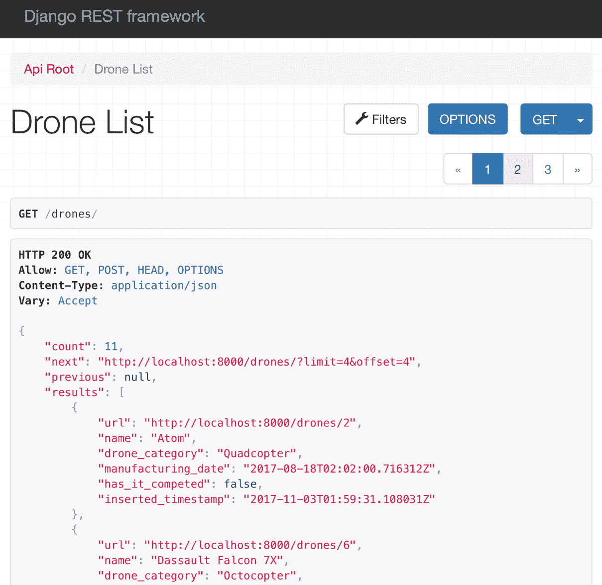

现在，访问`http://localhost:8000/competitions/`。可浏览 API 将组合并发送一个`GET`请求到`/competitions/`，并显示其执行结果，即头部信息和 JSON 竞赛列表。网页将在资源描述“竞赛列表”的右侧和“OPTIONS”按钮的左侧包含一个“过滤”按钮。

点击或轻触“过滤”，可浏览 API 将渲染带有每个可应用过滤器的适当控制器的 Filter 模型。此外，模型将在“排序”下方渲染不同的排序选项。以下截图显示了竞赛的 Filters 模型：

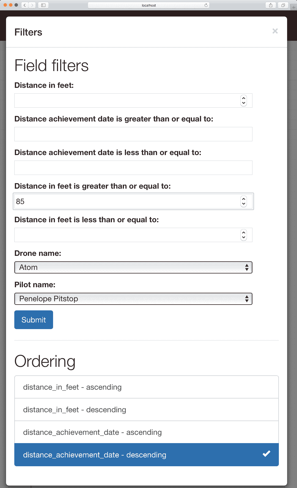

无人机名称和飞行员名称的下拉菜单仅提供参与竞赛的相关无人机名称和飞行员名称，因为我们为两个过滤器都使用了`AllValuesFilter`类。我们可以轻松输入每个所需过滤器想要应用的所有值，然后点击或轻触提交。然后，再次点击“过滤”，选择排序选项，并点击提交。可浏览 API 将组合并发送必要的 HTTP 请求来应用我们指定的过滤和排序，并将渲染一个包含请求执行结果的第一个页面的网页。

下一个截图显示了执行一个请求的结果，其过滤器是由之前解释的模型组成的：

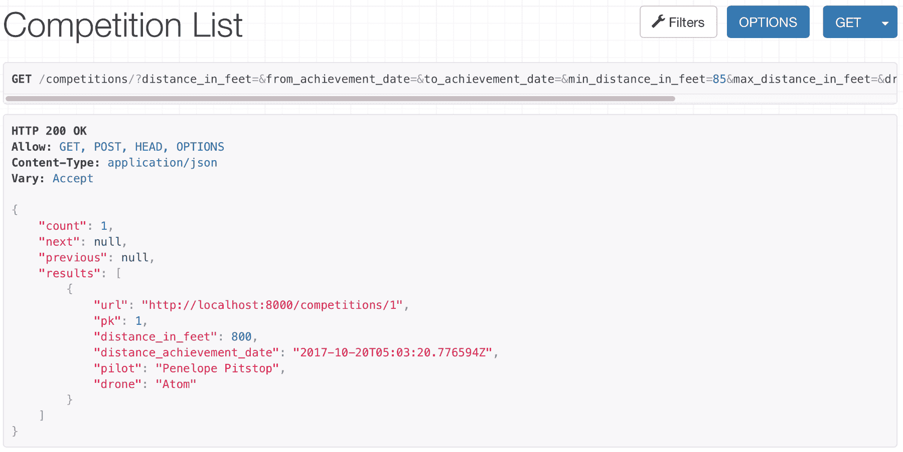

以下是对 HTTP `GET`请求的参数。请注意，可浏览的 API 生成了查询参数，但未指定在先前模式中未指定值的过滤器值。当查询参数未指定值时，它们将被忽略：

```py
http://localhost:8000/competitions/?distance_in_feet=&drone_name=Atom&format=json&from_achievement_date=&max_distance_in_feet=&min_distance_in_feet=85&pilot_name=Penelope+Pitstop&to_achievement_date= 
```

如同我们每次必须测试我们 RESTful Web Service 中包含的不同功能一样，可浏览的 API 在需要检查过滤器和排序时也非常有用。

# 测试你的知识

让我们看看你是否能正确回答以下问题：

1.  `django_filters.rest_framework.DjangoFilterBackend`类提供：

    1.  通过单个查询参数控制结果的排序

    1.  基于 Django 管理员的搜索功能的单查询参数搜索能力

    1.  字段过滤功能

1.  `rest_framework.filters.SearchFilter`类提供：

    1.  通过单个查询参数控制结果的排序

    1.  基于 Django 管理员的搜索功能的单查询参数搜索能力

    1.  字段过滤功能

1.  如果我们要创建一个唯一约束，需要在`models.CharField`初始化器中将哪个命名参数添加进去？

    1.  `unique=True`

    1.  `unique_constraint=True`

    1.  `force_unique=True`

1.  以下哪个类属性指定了一个字符串元组，其值表示我们想要在继承自`generics.ListCreateAPIView`的类视图中能够过滤的字段名称：

    1.  `filters`

    1.  `filtering_fields`

    1.  `filter_fields`

1.  以下哪个类属性指定了一个字符串元组，其值表示 HTTP 请求可以指定以对类视图进行排序的字段名称，该视图继承自`generics.ListCreateAPIView`：

    1.  `order_by`

    1.  `ordering_fields`

    1.  `order_fields`

正确答案包含在[附录](https://cdp.packtpub.com/django_restful_web_services__/wp-admin/post.php?post=44&action=edit#post_454)，*解决方案*中。

# 摘要

在本章中，我们使用了可浏览的 API 功能，通过资源和关系在 API 中进行导航。我们添加了唯一约束，以改善我们 RESTful Web Service 中模型的一致性。

我们理解了分页结果的重要性，并使用 Django REST 框架配置和测试了一个全局限制/偏移分页方案。然后，我们创建了自己的自定义分页类，以确保请求不能在单页中获取大量元素。

我们配置了过滤器后端类，并在模型中添加了代码以向基于类的视图添加过滤、搜索和排序功能。我们创建了一个自定义过滤器，并进行了过滤、搜索和排序结果的请求，我们理解了底层是如何工作的。最后，我们使用可浏览的 API 测试了分页、过滤和排序。

现在我们已经通过唯一约束、分页结果、过滤、搜索和排序功能改进了我们的 RESTful Web 服务，我们将通过认证和权限来保护 API。我们将在下一章中介绍这些主题。

# 使用认证和权限保护 API

在本章中，我们将了解 Django REST 框架中认证和权限之间的区别。我们将通过添加认证方案要求和指定权限策略来开始保护我们的 RESTful Web 服务。我们将了解以下内容：

+   理解 Django、Django REST 框架和 RESTful Web 服务中的认证和权限

+   认证类

+   与模型相关的安全性和权限数据

+   通过自定义权限类处理对象级权限

+   保存有关发起请求的用户的信息

+   设置权限策略

+   为 Django 创建超级用户

+   为 Django 创建用户

+   发送认证请求

+   使用所需的认证浏览受保护的 API

+   使用基于令牌的认证

+   生成和使用令牌

# 理解 Django、Django REST 框架和 RESTful Web 服务中的认证和权限

目前，我们的示例 RESTful Web 服务处理所有传入的请求，而不需要任何类型的认证，也就是说，任何用户都可以执行请求。Django REST 框架允许我们轻松使用各种认证方案来识别发起请求的用户或签名请求的令牌。然后，我们可以使用这些凭据来应用权限和节流策略，这将决定请求是否必须被允许。

我们已经知道配置是如何与 Django REST 框架一起工作的。我们可以应用全局设置，并在必要时在适当的基于类的视图中覆盖它。因此，我们可以在全局设置中设置默认的认证方案，并在需要时为特定场景覆盖它们。

这些设置允许我们声明一个类列表，指定用于所有传入 HTTP 请求的认证方案。Django REST 框架将使用列表中指定的所有类来认证请求，然后在基于类的视图运行相应的方法之前。

我们可以指定一个类。然而，在必须使用多个类的情况下，了解其行为非常重要。列表中第一个成功生成认证的类将负责为`request`对象设置以下两个属性的值：

+   `user`：此属性代表用户模型实例。在我们的示例中，我们将使用 Django User 类的一个实例，具体是`django.contrib.auth.User`类。

+   `auth`：此属性提供了认证方案所需的额外认证数据，例如认证令牌。

在成功认证之后，我们就能在我们的基于类的视图中使用`request.user`属性，这些视图接收`request`参数。这样，我们就能检索到生成请求的`user`的额外信息。

# 了解认证类

Django REST 框架在`rest_framework.authentication`模块中提供了以下三个认证类。它们都是`BaseAuthentication`类的子类：

+   `BasicAuthentication`：此类提供基于用户名和密码的 HTTP 基本认证。

+   `SessionAuthentication`：此类与 Django 的会话框架一起用于认证。

+   `TokenAuthentication`：此类提供了一种基于令牌的简单认证。请求必须包含为用户生成的令牌，并将其作为`Authorization` HTTP 头键的值，令牌前缀为`'Token '`字符串。

当然，在生产环境中，我们必须确保 RESTful Web 服务仅通过 HTTPS 提供，并使用最新的 TLS 版本。我们不应在生产环境中使用 HTTP 基本认证或简单的基于令牌的认证。

之前的类是 Django REST 框架自带的。许多第三方库提供了许多额外的认证类。我们将在本章的后面部分使用一些这些库。

确保你已退出 Django 的开发服务器。记住，你只需在终端中按*Ctrl* + *C*，或者前往开发服务器正在运行的命令提示符窗口。我们必须编辑模型，然后执行迁移，再次启动 Django 的开发服务器之前。

我们将对 HTTP 基本认证和 Django 的会话框架进行必要的修改以实现认证。因此，我们将`BasicAuthentication`和`SessionAuthentication`类添加到全局认证类列表中。

打开声明`restful01`项目 Django 配置的模块级变量的`restful01/restful01/settings.py`文件。我们将对此 Django 设置文件进行一些修改。将突出显示的行添加到`REST_FRAMEWORK`字典中。以下行显示了`REST_FRAMEWORK`字典的新声明。示例的代码文件包含在`hillar_django_restful_08_01`文件夹中的`restful01/restful01/settings.py`文件中：

```py
REST_FRAMEWORK = { 
    'DEFAULT_PAGINATION_CLASS': 
    'drones.custompagination.LimitOffsetPaginationWithUpperBound', 
    'PAGE_SIZE': 4, 
    'DEFAULT_FILTER_BACKENDS': ( 
        'django_filters.rest_framework.DjangoFilterBackend', 
        'rest_framework.filters.OrderingFilter', 
        'rest_framework.filters.SearchFilter', 
        ), 
 'DEFAULT_AUTHENTICATION_CLASSES': (
        'rest_framework.authentication.BasicAuthentication', 
        'rest_framework.authentication.SessionAuthentication', 
        ) } 
```

我们在`REST_FRAMEWORK`字典中添加了`DEFAULT_AUTHENTICATION_CLASSES`设置键。这个新键指定了一个全局设置，其值是一个字符串元组，表示我们想要用于身份验证的类：`BasicAuthentication`和`SessionAuthentication`。

# 将安全性和权限相关数据包含到模型中

我们希望每架无人机都有一个所有者。只有经过身份验证的用户才能创建无人机，并且它将自动成为这架新无人机的所有者。我们希望只有无人机的所有者才能更新或删除无人机。因此，既是身份验证用户又是无人机所有者的人将能够对其拥有的无人机资源执行`PATCH`、`PUT`和`DELETE`方法。

任何不是特定无人机资源所有者的经过身份验证的用户将只有对该无人机的只读访问权限。此外，未经身份验证的请求也将只有对无人机的只读访问权限。

我们将身份验证与特定权限结合起来。权限使用`request.user`和`request.auth`属性中包含的认证信息来确定请求是否应该被授予或拒绝访问。权限允许我们控制哪些类型的用户将被授予或拒绝访问我们 RESTful Web 服务的不同功能、方法、资源或资源集合。

我们将使用 Django REST 框架中的权限功能，只允许经过身份验证的用户创建新的无人机并自动成为其所有者。我们将在模型中进行必要的更改，使无人机有一个用户作为其所有者。我们将利用框架中包含的现成权限类与自定义权限类相结合，来定义之前解释的无人机及其在我们 Web 服务中支持的 HTTP 动词的权限策略。

在这个案例中，我们将专注于安全和权限，并将节流规则留到下一章。请记住，节流规则还决定了特定请求是否必须授权。然而，我们将在稍后处理节流规则，并将它们与身份验证和权限结合起来。

打开`restful01/drones/models.py`文件，并用以下代码替换声明`Drone`类的代码。代码列表中的新行被突出显示。示例的代码文件包含在`hillar_django_restful_08_01`文件夹中的`restful01/drones/models.py`文件中：

```py
class Drone(models.Model): 
    name = models.CharField(max_length=250, unique=True) 
    drone_category = models.ForeignKey( 
        DroneCategory,  
        related_name='drones',  
        on_delete=models.CASCADE) 
    manufacturing_date = models.DateTimeField() 
    has_it_competed = models.BooleanField(default=False) 
    inserted_timestamp = models.DateTimeField(auto_now_add=True) 
 owner = models.ForeignKey( 
        'auth.User',  
        related_name='drones', 
        on_delete=models.CASCADE) 

    class Meta: 
        ordering = ('name',) 

    def __str__(self): 
        return self.name
```

突出的行声明了`Drone`模型的新`owner`字段。这个新字段使用`django.db.models.ForeignKey`类来提供与`django.contrib.auth.User`模型的多个到一的关系。

这个`User`模型为 Django 认证系统持久化用户。现在，我们正在使用这个认证系统为我们自己的 RESTful Web 服务。为`related_name`参数指定的`'drones'`值创建了一个从`User`到`Drone`模型的反向关系。请记住，这个值表示从相关`User`对象回指到`Drone`对象时使用的名称。这样，我们将能够访问特定用户拥有的所有无人机。

每当我们删除一个`User`时，我们希望删除该用户拥有的所有无人机，因此我们为`on_delete`参数指定了`models.CASCADE`值。

打开`restful01/drones/serializers.py`文件，在声明导入的最后一行之后、`DroneCategorySerializer`类声明之前添加以下代码。示例代码文件包含在`hillar_django_restful_08_01`文件夹中，位于`restful01/drones/serializers.py`文件内：

```py
from django.contrib.auth.models import User 

class UserDroneSerializer(serializers.HyperlinkedModelSerializer): 
    class Meta: 
        model = Drone 
        fields = ( 
            'url', 
            'name') 

class UserSerializer(serializers.HyperlinkedModelSerializer): 
    drones = UserDroneSerializer( 
        many=True,  
        read_only=True) 

    class Meta: 
        model = User 
        fields = ( 
            'url',  
            'pk', 
            'username', 
            'drone')
```

我们不想为与用户相关的无人机使用`DroneSerializer`序列化类，因为我们想序列化更少的字段，因此我们创建了`UserDroneSerializer`类。这个类是`HyperlinkedModelSerializer`类的子类。这个新的序列化器允许我们序列化与`User`相关的无人机。`UserDroneSerializer`类定义了一个`Meta`内部类，声明以下两个属性：

+   `model`：此属性指定与序列化器相关的模型，即`Drone`类。

+   `fields`：此属性指定了一个字符串值的元组，这些值指示我们想要包含在从相关模型序列化中的字段名称。我们只想包含 URL 和无人机名称，因此代码将`'url'`和`'name'`作为元组的成员。

`UserSerializer`是`HyperlinkedModelSerializer`类的子类。这个新的序列化器类声明了一个`drones`属性，它是之前解释过的`UserDroneSerializer`类的实例，`many`和`read_only`参数等于`True`，因为这是一个一对一关系，并且是只读的。代码指定了`drones`名称，我们在将`owner`字段作为`models.ForeignKey`实例添加到`Drone`模型时，将其指定为`related_name`参数的字符串值。这样，`drones`字段将为我们提供每个属于用户的无人机的 URL 和名称数组。

现在，我们将向现有的`DroneSerializer`类添加一个`owner`字段。打开`restful01/drones/serializers.py`文件，将声明`DroneSerializer`类的代码替换为以下代码。新行在代码列表中突出显示。示例代码文件包含在`hillar_django_restful_08_01`文件夹中，`restful01/drones/serializers.py`文件中。

```py
class DroneSerializer(serializers.HyperlinkedModelSerializer): 
    # Display the category name 
    drone_category = serializers.SlugRelatedField(queryset=DroneCategory.objects.all(), slug_field='name') 
 # Display the owner's username (read-only) 
    owner = serializers.ReadOnlyField(source='owner.username') 
    class Meta: 
        model = Drone 
        fields = ( 
            'url', 
            'name', 
            'drone_category', 
 'owner',            'manufacturing_date', 
            'has_it_competed', 
            'inserted_timestamp',) 
```

`DroneSerializer`类的新版本声明了一个`owner`属性，它是一个`serializers.ReadOnlyField`的实例，其`source`参数等于`'owner.username'`。这样，序列化器将序列化存储在`owner`字段中的相关`django.contrib.auth.User`实例的`username`字段的值。

代码使用`ReadOnlyField`类，因为所有者会在认证用户创建新无人机时自动填充。使用 HTTP `POST`方法调用创建无人机后，将无法更改所有者。这样，`owner`字段将渲染创建相关无人机的用户名。此外，我们在`Meta`内部类的`fields`字符串元组中添加了`'owner'`。

我们对`Drone`模型及其序列化器（`DroneSerializer`类）进行了必要的更改，以便无人机拥有所有者。

# 通过自定义权限类进行对象级权限操作

`rest_framework.permissions.BasePermission`类是所有自定义权限类应该继承以与 Django REST 框架一起工作的基类。我们想确保只有无人机所有者才能更新或删除现有的无人机。

进入`restful01/drones`文件夹，创建一个名为`custompermission.py`的新文件。在这个新文件中写下以下代码。以下行显示了该文件中声明的`IsCurrentUserOwnerOrReadOnly`类，该类作为`BasePermission`类的子类。示例代码文件包含在`hillar_django_restful_08_01`文件夹中的`restful01/drones/custompermission.py`文件中：

```py
from rest_framework import permissions 

class IsCurrentUserOwnerOrReadOnly(permissions.BasePermission): 
    def has_object_permission(self, request, view, obj): 
        if request.method in permissions.SAFE_METHODS: 
            # The method is a safe method 
            return True 
        else: 
            # The method isn't a safe method 
            # Only owners are granted permissions for unsafe methods 
            return obj.owner == request.user 
```

前面的行声明了`IsCurrentUserOwnerOrReadOnly`类，并覆盖了在`BasePermission`超类中定义的`has_object_permission`方法，该方法返回一个表示是否应授予权限的`bool`值。

字符串元组`permissions.SAFE_METHODS`包括三个被认为是安全的 HTTP 方法或动词，因为它们是只读的，并且不会对相关资源或资源集合产生更改：`'GET'`、`'HEAD'`和`'OPTIONS'`。`has_object_permission`方法中的代码检查`request.method`属性中指定的 HTTP 动词是否是`permission.SAFE_METHODS`中指定的三个安全方法之一。如果此表达式评估为`True`，则`has_object_permission`方法返回`True`并授予请求权限。

如果`request.method`属性中指定的 HTTP 动词不是三种安全方法中的任何一种，则代码返回`True`，并且只有在接收到的`obj`对象（`obj.owner`）的`owner`属性与发起请求的用户（`request.user`）匹配时才授予权限。发起请求的用户始终是认证用户。这样，只有相关资源的所有者才会被授予包含非安全 HTTP 动词的请求的权限。

我们将使用新的`IsCurrentUserOwnerOrReadOnly`自定义权限类来确保只有无人机所有者才能更改现有的无人机。我们将此权限类与`rest_framework.permissions.IsAuthenticatedOrReadOnly`结合使用，后者在请求不属于认证用户时只允许对资源进行只读访问。这样，每当匿名用户执行请求时，他将对资源只有只读访问权限。

# 保存请求用户的详细信息

当用户向无人机资源集合执行 HTTP `POST`请求以创建新的无人机资源时，我们希望使发起请求的认证用户成为新无人机的所有者。为了实现这一点，我们将在`views.py`文件中声明的`DroneList`类中覆盖`perform_create`方法。

打开`restful01/drones/views.py`文件，将声明`DroneList`类的代码替换为以下代码。代码列表中的新行被突出显示。示例的代码文件包含在`hillar_django_restful_08_01`文件夹中，位于`restful01/drones/views.py`文件中：

```py
class DroneList(generics.ListCreateAPIView): 
    queryset = Drone.objects.all() 
    serializer_class = DroneSerializer 
    name = 'drone-list' 
    filter_fields = ( 
        'name',  
        'drone_category',  
        'manufacturing_date',  
        'has_it_competed',  
        ) 
    search_fields = ( 
        '^name', 
        ) 
    ordering_fields = ( 
        'name', 
        'manufacturing_date', 
        ) 

 def perform_create(self, serializer): 
        serializer.save(owner=self.request.user) 
```

`generics.ListCreateAPIView`类从`CreateModelMixin`类和其他类继承。`DroneList`类从`rest_framework.mixins.CreateModelMixin`类继承`perform_create`方法。

覆盖`perform_create`方法的代码通过在调用`serializer.save`方法时设置`owner`参数的值，向`create`方法提供了额外的`owner`字段。代码将`owner`参数设置为`self.request.user`的值，即发起请求的认证用户。这样，每当创建并持久化新的`Drone`时，它将保存与请求关联的`User`作为其所有者。

# 设置权限策略

我们将为与`Drone`模型一起工作的基于类的视图配置权限策略。我们将覆盖`DroneDetail`和`DroneList`类的`permission_classes`类属性的值。

我们将在两个类中添加相同的代码行。我们将包括`IsAuthenticatedOrReadOnly`类和我们最近声明的`IsCurrentUserOwnerOrReadOnly`权限类在`permission_classes`元组中。

打开`restful01/drones/views.py`文件，在声明导入的最后一行之后、`DroneCategorySerializer`类声明之前添加以下行：

```py
from rest_framework import permissions 
from drones import custompermission 
```

在同一`views.py`文件中将声明`DroneDetail`类的代码替换为以下代码。新行在代码列表中突出显示。示例的代码文件包含在`hillar_django_restful_08_01`文件夹中，在`restful01/drones/views.py`文件中：

```py
class DroneDetail(generics.RetrieveUpdateDestroyAPIView): 
    queryset = Drone.objects.all() 
    serializer_class = DroneSerializer 
    name = 'drone-detail' 
 permission_classes = ( 
        permissions.IsAuthenticatedOrReadOnly, 
        custompermission.IsCurrentUserOwnerOrReadOnly, 
        )
```

在同一`views.py`文件中将声明`DroneList`类的代码替换为以下代码。新行在代码列表中突出显示。示例的代码文件包含在`hillar_django_restful_08_01`文件夹中，在`restful01/drones/views.py`文件中：

```py
class DroneList(generics.ListCreateAPIView): 
    queryset = Drone.objects.all() 
    serializer_class = DroneSerializer 
    name = 'drone-list' 
    filter_fields = ( 
        'name',  
        'drone_category',  
        'manufacturing_date',  
        'has_it_competed',  
        ) 
    search_fields = ( 
        '^name', 
        ) 
    ordering_fields = ( 
        'name', 
        'manufacturing_date', 
        ) 
 permission_classes = ( 
        permissions.IsAuthenticatedOrReadOnly, 
        custompermission.IsCurrentUserOwnerOrReadOnly, 
        )

    def perform_create(self, serializer): 
        serializer.save(owner=self.request.user) 
```

# 创建 Django 的超级用户

现在，我们将运行必要的命令来创建 Django 的`superuser`，这将允许我们验证我们的请求。我们将在稍后创建其他用户。

确保您位于包含`manage.py`文件的`restful01`文件夹中，该文件位于已激活的虚拟环境中。执行以下命令以执行`manage.py`脚本的`createsuperuser`子命令，以便我们可以创建`superuser`：

```py
    python manage.py createsuperuser
```

命令将要求您输入用于`superuser`的想要使用的用户名。输入所需的用户名并按*Enter*键。在这个例子中，我们将使用`djangosuper`作为用户名。您将看到类似以下的一行：

```py
    Username (leave blank to use 'gaston'):
```

然后，命令将要求您输入电子邮件地址。输入电子邮件地址并按*Enter*键。您可以输入`djangosuper@example.com`：

```py
    Email address:
```

最后，命令将要求您输入新超级用户的密码。输入您想要的密码并按*Enter*键。在我们的测试中，我们将使用`passwordforsuper`作为示例。当然，这个密码并不是一个强大的密码的最佳例子。然而，在我们的测试中，这个密码易于输入和阅读：

```py
    Password:
```

命令将要求您再次输入密码。输入它并按*Enter*键。如果输入的两个密码匹配，则将创建超级用户：

```py
    Password (again): 
    Superuser created successfully.
```

我们的数据库在`drones_drone`表中有很多行。我们为`Drone`模型添加了一个新的`owner`字段，并在执行迁移后，这个必需的字段将被添加到`drones_drone`表中。我们必须为所有现有无人机指定一个默认所有者，以便在不删除这些无人机的情况下添加这个新必需字段。我们将使用 Django 包含的其中一个功能来解决这个问题。

首先，我们必须知道我们创建的超级用户的`id`值，以便将其用作现有无人机的默认所有者。然后，我们将使用此值让 Django 知道哪个是现有无人机的默认所有者。

我们创建了第一个用户，因此，`id`将等于`1`。但是，我们将检查确定`id`值的程序，以防您创建其他用户，并且您想将任何其他用户指定为默认所有者。

你可以使用任何与 PostgreSQL 兼容的工具检查 `auth_user` 表中 `username` 字段与 `'djangosuper'` 匹配的行。另一个选项是运行以下命令，从 `auth_user` 表中检索用户名为 `'djangosuper'` 的行的 ID。如果你指定了不同的名称，请确保使用适当的名称。此外，在命令中将用户名替换为你创建 PostgreSQL 数据库时使用的用户名，将密码替换为你为该数据库用户选择的密码。你是在执行第六章 中解释的步骤时指定这些信息的，该章节是 *Running migrations that generate relationships* 部分，标题为 *使用高级关系和序列化*。

命令假设你在执行命令的同一台计算机上运行 PostgreSQL：

```py
    psql --username=username --dbname=drones --command="SELECT id FROM 
    auth_user WHERE username = 'djangosuper';"

```

以下行显示了 `id` 字段的值为 `1` 的输出：

```py
    id 
    ----
      1
    (1 row)
```

现在，运行以下 Python 脚本来生成迁移，这将允许我们同步数据库与我们添加到 `Drone` 模型的新字段：

```py
    python manage.py makemigrations drones
```

Django 将向我们解释，我们无法在不提供默认值的情况下添加不可为空的字段，并要求我们选择以下消息的选项：

```py
 You are trying to add a non-nullable field 'owner' to drone without a   
  default; we can't do that (the database needs something to populate 
   existing rows).
    Please select a fix:
     1) Provide a one-off default now (will be set on all existing rows 
     with a null value for this column)
     2) Quit, and let me add a default in models.py
       Select an option:
```

输入 `1` 并按 *Enter*。这样，我们将选择第一个选项，为所有现有的 `drones_drone` 行设置一次性默认值。

Django 将要求我们提供要为 `drones_drone` 表的 `owner` 字段设置的默认值：

```py
    Please enter the default value now, as valid Python
    The datetime and django.utils.timezone modules are available, so 
     you can do e.g. timezone.now
    Type 'exit' to exit this prompt
    >>>
```

输入之前检索到的 `id` 值：`1`。然后，按 *Enter*。以下行显示了运行前面的命令后生成的输出：

```py
    Migrations for 'drones':
      drones/migrations/0003_drone_owner.py
        - Add field owner to drone
```

输出指示 `restful01/drones/migrations/0003_drone_owner.py` 文件包含将名为 `owner` 的字段添加到 `drone` 表的代码。以下行显示了由 Django 自动生成的此文件的代码。示例的代码文件包含在 `hillar_django_restful_08_01` 文件夹中的 `restful01/drones/migrations/0003_drone_owner.py` 文件中：

```py
# -*- coding: utf-8 -*-
# Generated by Django 1.11.5 on 2017-11-09 22:04
from __future__ import unicode_literals
from django.conf import settings
from django.db import migrations, models
import django.db.models.deletion

class Migration(migrations.Migration):

    dependencies = [
        migrations.swappable_dependency(settings.AUTH_USER_MODEL),
        ('drones', '0002_auto_20171104_0246'),
    ]

    operations = [
        migrations.AddField(
            model_name='drone',
            name='owner',
            field=models.ForeignKey(default=1, on_delete=django.db.models.deletion.CASCADE, related_name='drones', to=settings.AUTH_USER_MODEL),
            preserve_default=False,
        ),
    ]

```

代码将 `Migration` 类声明为 `django.db.migrations.Migration` 类的子类。`Migration` 类定义了一个包含 `migrations.AddField` 实例的 `operations` 列表，该实例将添加 `owner` 字段到与 `drone` 模型相关的表中。

现在，运行以下 Python 脚本来应用所有生成的迁移并执行数据库表中的更改：

```py
    python manage.py migrate
```

以下行显示了运行前面的命令后生成的输出：

```py
Operations to perform: Apply all migrations: admin, auth, contenttypes, drones, sessions Running migrations: Applying drones.0003_drone_owner... OK
```

在我们运行前面的命令后，PostgreSQL 数据库中的 `drones_drone` 表将有一个新的 `owner_id` 字段。`drones_drone` 表中现有的行将使用我们指示 Django 为新的 `owner_id` 字段使用的默认值：`1`。这样，名为 `'djangosuper'` 的超级用户将成为所有现有无人机的所有者。

我们可以使用 PostgreSQL 命令行或任何其他允许我们轻松检查 PostgreSQL 数据库内容的程序来浏览 Django 更新的 `drones_drone` 表。

以下截图显示了左侧 `drones_drone` 表的新结构及其右侧的所有行：

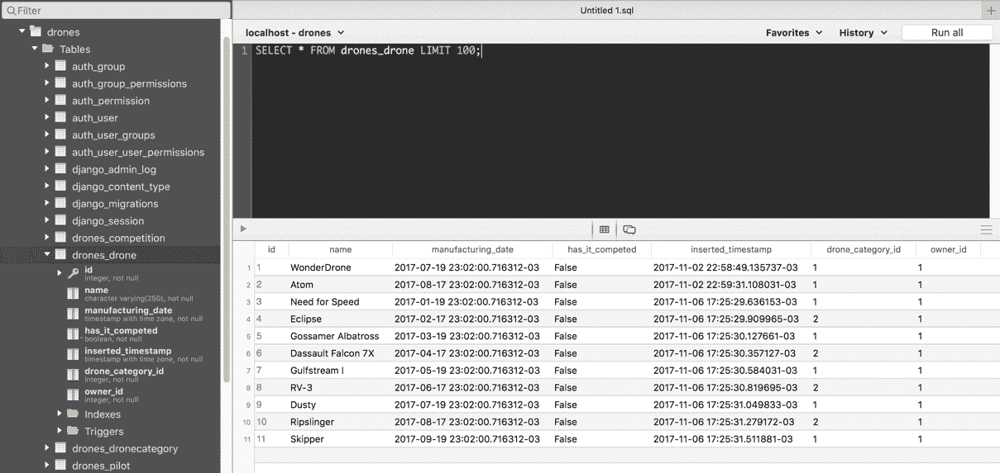

# 为 Django 创建用户

现在，我们将使用 Django 的交互式 shell 来为 Django 创建一个新用户。运行以下命令以启动 Django 的交互式 shell。确保你在终端、命令提示符或 Windows Powershell 窗口中位于已激活虚拟环境的 `restful01` 文件夹内：

```py
    python manage.py shell
```

您会注意到，在介绍默认 Python 交互式 shell 的常规行之后，会显示一条说 **(**InteractiveConsole**)** 的行。在 shell 中输入以下代码以创建另一个非超级用户。我们将使用此用户和超级用户来测试我们的权限策略更改。示例代码文件包含在 `hillar_django_restful_08_01` 文件夹中的 `scripts/create_user.py` 文件中。您可以将 `user01` 替换为您想要的用户名，`user01@example.com` 替换为电子邮件，`user01password` 替换为您想要为此用户使用的密码。请注意，我们将在以下部分中使用这些凭据。请确保您始终使用自己的凭据替换凭据：

```py
from django.contrib.auth.models import User

user = User.objects.create_user('user01', 'user01@example.com', 'user01password')
user.save()
```

最后，输入以下命令以退出交互式控制台：

```py
quit()
```

您也可以通过按 *Ctrl + D* 来达到相同的目的。现在，我们为 Django 创建了一个名为 `user01` 的新用户。

# 发送认证请求

现在，我们可以启动 Django 的开发服务器，以编写和发送认证的 HTTP 请求，了解配置的认证类与权限策略是如何协同工作的。根据您的需求执行以下两个命令之一以访问连接到您的局域网的其他设备或计算机上的 API。请记住，我们在 *启动 Django 的开发服务器* 部分的 第三章 中分析了它们之间的区别：

```py
    python manage.py runserver
    python manage.py runserver 0.0.0.0:8000
```

在运行之前的任何命令后，开发服务器将在端口 `8000` 上开始监听。

我们将发送一个不带认证凭据的 HTTP `POST` 请求，尝试创建一个新的无人机：

```py
http POST :8000/drones/ name="Python Drone" drone_category="Quadcopter" manufacturing_date="2017-07-16T02:03:00.716312Z" has_it_competed=false
```

以下是对应的 `curl` 命令：

```py
    curl -iX POST -H "Content-Type: application/json" -d   
   '{"name":"Python Drone", "drone_category":"Quadcopter", 
    "manufacturing_date": "2017-07-16T02:03:00.716312Z",  
    "has_it_competed": "false"}' localhost:8000/drones/
```

我们将在响应头中收到 `HTTP 401 未授权` 状态码和一个 `detail` 消息，表明我们没有在 JSON 主体中提供认证凭据。以下行显示了示例响应：

```py
HTTP/1.0 401 Unauthorized
Allow: GET, POST, HEAD, OPTIONS
Content-Length: 58
Content-Type: application/json
Date: Tue, 19 Dec 2017 19:52:44 GMT
Server: WSGIServer/0.2 CPython/3.6.2
Vary: Accept, Cookie
WWW-Authenticate: Basic realm="api"
X-Frame-Options: SAMEORIGIN

{
    "detail": "Authentication credentials were not provided."
}
```

在我们做出的更改之后，如果我们想要创建一个新的无人机，即向 `/drones/` 发送 HTTP `POST` 请求，我们需要通过使用 HTTP 身份验证提供身份验证凭据。现在，我们将使用具有身份验证凭据（即超级用户名和密码）创建新无人机的 HTTP 请求进行组合和发送。请记住将 `djangosuper` 替换为您用于超级用户的名字，将 `passwordforsuper` 替换为您为该用户配置的密码：

```py
http -a "djangosuper":"passwordforsuper" POST :8000/drones/ name="Python Drone" drone_category="Quadcopter" manufacturing_date="2017-07-16T02:03:00.716312Z" has_it_competed=false
```

以下是对应的 `curl` 命令：

```py
    curl --user "djangosuper":"passwordforsuper" -iX POST -H "Content-
    Type: application/json" -d '{"name":"Python Drone", 
    "drone_category":"Quadcopter", "manufacturing_date": "2017-07-
     16T02:03:00.716312Z", "has_it_competed": "false"}' 
     localhost:8000/drones/
```

以 `djangosuper` 为所有者的新 `Drone` 已成功创建并持久化到数据库中，因为请求已通过身份验证。作为请求的结果，我们将在响应头中收到 `HTTP 201 Created` 状态码，并在响应体中将最近持久化的 `Drone` 序列化为 JSON。以下行显示了 HTTP 请求的示例响应，其中新的 `Drone` 对象在 JSON 响应体中。请注意，JSON 响应体包括 `owner` 键和创建无人机的用户名作为其值：`djangosuper`：

```py
HTTP/1.0 201 Created
Allow: GET, POST, HEAD, OPTIONS
Content-Length: 219
Content-Type: application/json
Date: Fri, 10 Nov 2017 02:55:07 GMT
Location: http://localhost:8000/drones/12
Server: WSGIServer/0.2 CPython/3.6.2
Vary: Accept, Cookie
X-Frame-Options: SAMEORIGIN

{
    "drone_category": "Quadcopter",
    "has_it_competed": false,
    "inserted_timestamp": "2017-11-10T02:55:07.361574Z",
    "manufacturing_date": "2017-07-16T02:03:00.716312Z",
    "name": "Python Drone",
    "owner": "djangosuper",
    "url": "http://localhost:8000/drones/12"
} 
```

现在，我们将尝试使用 HTTP `PATCH` 请求更新之前创建的无人机的 `has_it_competed` 字段值。然而，我们将使用在 Django 中创建的另一个用户来对 HTTP `PATCH` 请求进行身份验证。这个用户不是无人机的所有者，因此请求不应成功。

在下一个命令中将 `user01` 和 `user01password` 替换为您为该用户配置的名称和密码。此外，将 `12` 替换为您在配置中为之前创建的无人机生成的 ID：

```py
http -a "user01":"user01password" PATCH :8000/drones/12 has_it_competed=true
```

以下是对应的 `curl` 命令：

```py
curl --user "user01":"user01password" -iX PATCH -H "Content-Type: application/json" -d '{"has_it_competed": "true"}' localhost:8000/drones/12
```

我们将在响应头中收到 `HTTP 403 Forbidden` 状态码，并在 JSON 主体中收到一个详细消息，表明我们没有权限执行该操作。我们想要更新的无人机的所有者是 `djangosuper`，而此请求的身份验证凭据使用的是不同的用户：`user01`。因此，操作被我们创建的 `IsCurrentUserOwnerOrReadOnly` 定制权限类中的 `has_object_permission` 方法拒绝。以下行显示了示例响应：

```py
    HTTP/1.0 403 Forbidden
    Allow: GET, PUT, PATCH, DELETE, HEAD, OPTIONS
    Content-Length: 63
    Content-Type: application/json
    Date: Fri, 10 Nov 2017 03:34:43 GMT
    Server: WSGIServer/0.2 CPython/3.6.2
    Vary: Accept, Cookie
    X-Frame-Options: SAMEORIGIN

    {
        "detail": "You do not have permission to perform this action."
    }

```

不是无人机所有者的用户不能对无人机进行更改。然而，他必须能够以只读方式访问无人机。因此，我们必须能够使用具有相同身份验证凭据的 HTTP `GET` 请求组合和检索之前的无人机详细信息。这将有效，因为 `GET` 是安全方法之一，并且非所有者用户被允许读取资源。在下一个命令中将 `user01` 和 `user01password` 替换为您为该用户配置的名称和密码。此外，将 `12` 替换为您在配置中为之前创建的无人机生成的 ID：

```py
    http -a "user01":"user01password" GET :8000/drones/12
```

以下是对应的 `curl` 命令：

```py
    curl --user "user01":"user01password" -iX GET 
    localhost:8000/drones/12
```

响应将在头部返回 `HTTP 200 OK` 状态代码，并在响应体中将请求的 `Drone` 序列化为 JSON 格式。

# 使用 Postman 制作经过身份验证的 HTTP PATCH 请求

现在，我们将使用我们在 *第一章* 中安装的图形界面工具之一，即 Postman。我们将使用此图形界面工具来编写并发送带有适当身份验证凭据的 HTTP `PATCH` 请求到 Web 服务。在前面的章节中，每当我们在 Postman 中工作时，我们都没有指定身份验证凭据。

我们将使用 Postman 中的“构建器”标签来编写并发送一个 HTTP `PATCH` 请求，以更新之前创建的无人机的 `has_it_competed` 字段。按照以下步骤操作：

1.  如果您之前使用 Postman 发送过请求，请点击标签右侧的加号（**+**）按钮。这样，您将创建一个新的标签。

1.  在“输入请求 URL”文本框左侧的下拉菜单中选择 PATCH。

1.  在下拉菜单右侧的文本框中输入 `http://localhost:8000/drones/12`。将 `12` 替换为您在配置中为之前创建的无人机生成的 ID。

1.  点击文本框下方的“授权”标签。

1.  在类型下拉菜单中选择基本身份验证。

1.  在用户名文本框中输入您用于创建 `djangosuper` 的名称。

1.  在密码文本框中输入您为该用户使用的密码，而不是 `passwordforsuper`。以下截图显示了 Postman 中为 HTTP `PATCH` 请求配置的基本身份验证：

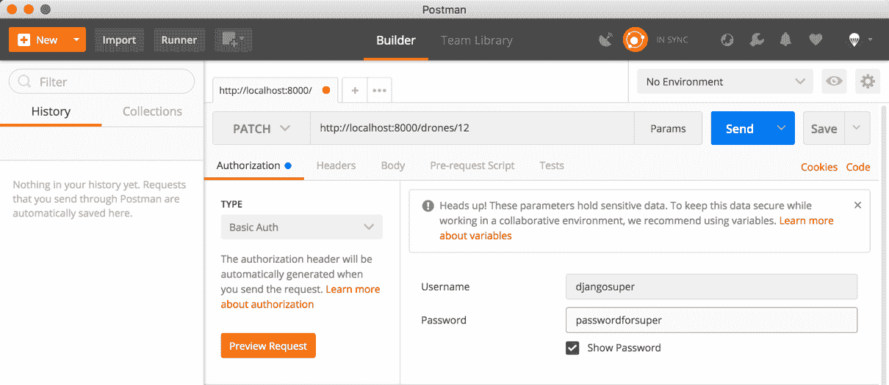

1.  在请求面板中，点击授权和头部标签右侧的“Body”。

1.  激活原始单选按钮，并在二进制单选按钮右侧的下拉菜单中选择 JSON（application/json）。Postman 将自动添加 Content-type = application/json 头部，因此您会注意到头部标签将被重命名为头部（1），这表示我们已为请求头部指定了一个键/值对。

1.  在“Body”标签下的单选按钮下方的文本框中输入以下行：

```py
   { 
       "has_it_competed": "true" 
   }
```

以下截图显示了 Postman 中的请求体：

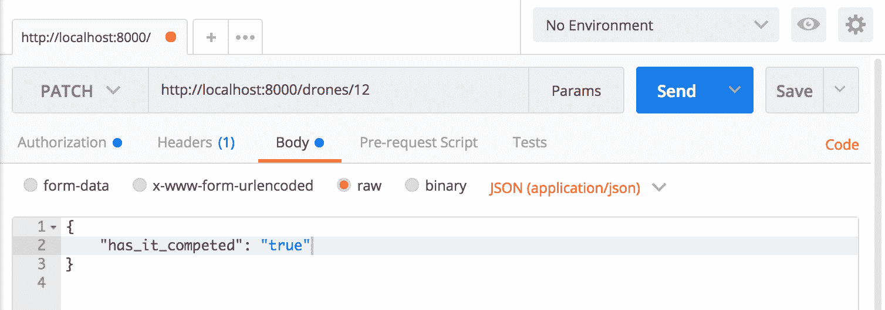

我们遵循了必要的步骤，使用 JSON 正文创建了一个 HTTP `PATCH` 请求，该正文指定了更新现有无人机 `was_included_in_home` 字段所需的关键/值对，并带有必要的 HTTP 身份验证凭据。点击发送，Postman 将显示以下信息：

+   状态：`200 OK`

+   时间：请求处理所需的时间

+   大小：响应的大致大小（正文大小加头部大小）

+   正文：带有语法高亮的最近更新的无人机格式的响应体

以下截图显示了 Postman 中 HTTP `PATCH` 请求的 JSON 响应体。在这种情况下，请求更新了现有的无人机，因为我们使用拥有该无人机所有权的用户进行了请求认证：

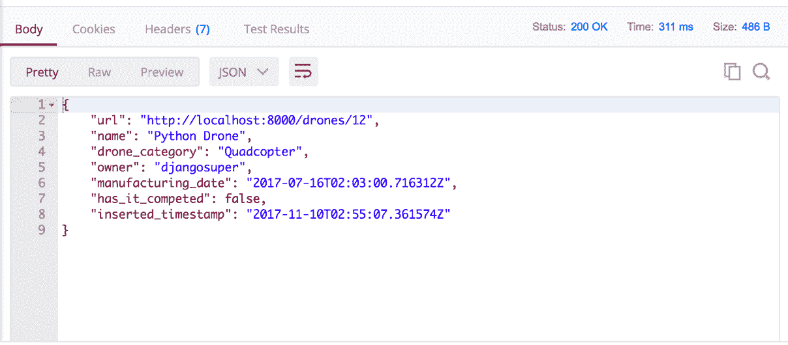

# 使用所需的身份验证浏览受保护的 API

我们希望可浏览的 API 显示登录和注销视图。为了实现这一点，我们必须在 `restful01/restful01` 文件夹中的 `urls.py` 文件中添加一行，具体来说，在 `restful01/restful01/urls.py` 文件中。该文件定义了根 URL 配置，我们希望包含 Django REST 框架提供的 URL 模式，这些模式提供了登录和注销视图。

以下行显示了 `restful01/restful01/urls.py` 文件的新代码。新行已被突出显示。示例代码文件包含在 `hillar_django_restful_08_01` 文件夹中的 `restful01/restful01/urls.py` 文件中：

```py
from django.conf.urls import url, include

urlpatterns = [
    url(r'^', include('drones.urls')),
 url(r'^api-auth/', include('rest_framework.urls')) ]
```

打开网页浏览器并访问 `http://localhost:8000/`。如果你使用另一台计算机或设备来运行浏览器，请将 localhost 替换为运行 Django 开发服务器的计算机的 IP 地址。可浏览的 API 将会向 `/` 发送一个 `GET` 请求，并显示其执行结果，即 API 根目录。你会在右上角注意到有一个登录超链接。

点击或轻触登录，浏览器将显示 Django REST 框架的登录页面。在用户名文本框中输入你创建 `djangosuper` 时使用的名称，在密码文本框中输入你为该用户使用的密码（而不是 `passwordforsuper`），然后点击登录。

现在，你将使用 `djangosuper` 登录，并且你通过可浏览的 API 创建和发送的所有请求都将使用此用户。你将被重定向回 API 根目录，并且你会注意到登录超链接已被用户名（djangosuper）替换，并且出现一个下拉菜单，允许你注销。以下截图显示了以 `djangosuper` 登录后的 API 根目录：

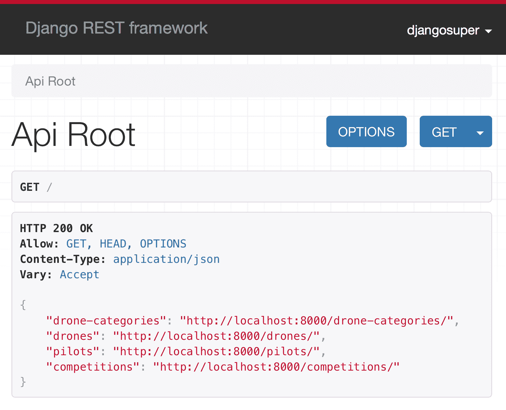

点击或轻触已登录的用户名（djangosuper）并从下拉菜单中选择注销。我们将以不同的用户登录。

点击或轻触登录，浏览器将显示 Django REST 框架的登录页面。在用户名文本框中输入你创建 `user01` 时使用的名称，在密码文本框中输入你为该用户使用的密码（而不是 `user01password`），然后点击登录。

现在，你将使用 `user01` 登录，并且你通过可浏览的 API 创建和发送的所有请求都将使用此用户。你将被重定向回 API 根目录，并且你会注意到登录超链接已被用户名（user01）替换。

访问`http://localhost:8000/drones/12`。将`12`替换为您在配置中为之前创建的无人机生成的 ID。可浏览的 API 将渲染包含对`localhost:8000/drones/12`的`GET`请求结果的网页。

点击或轻触“选项”按钮，可浏览的 API 将渲染对`http://localhost:8000/drones/12`的 HTTP `OPTIONS`请求的结果，并在“无人机详情”标题的右侧包含“删除”按钮。

点击或轻触“删除”。网页浏览器将显示一个确认模态。在模态中点击或轻触“删除”按钮。由于 HTTP `DELETE`请求的结果，网页浏览器将在响应头中显示`HTTP 403 Forbidden`状态码，并在 JSON 体中显示一条详细消息，指出我们没有权限执行该操作。我们想要删除的无人机的所有者是`djangosuper`，而此请求的认证凭证使用的是不同的用户，具体为`user01`。因此，操作被`IsCurrentUserOwnerOrReadOnly`类中的`has_object_permission`方法拒绝。以下截图显示了 HTTP `DELETE`请求的示例响应：

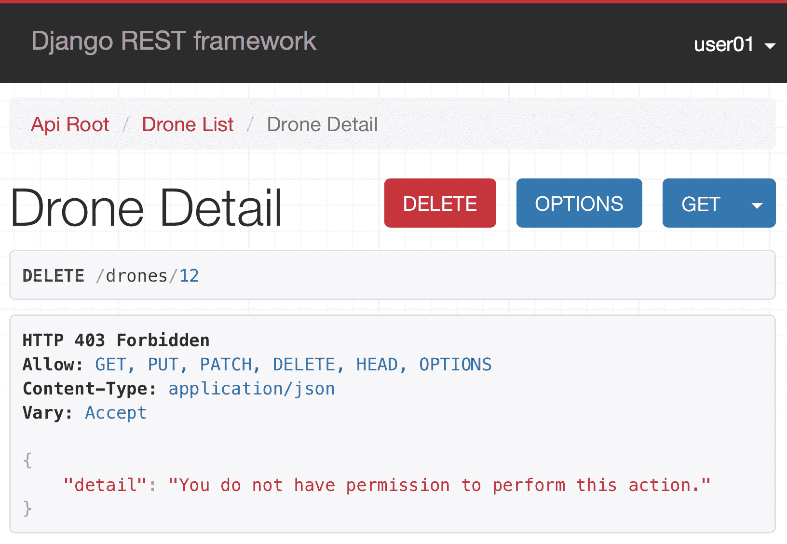

可浏览的 API 使得向我们的 RESTful Web 服务发送认证请求变得容易。

# 使用基于令牌的认证

现在，我们将进行更改以使用基于令牌的认证来检索、更新或删除飞行员。只有拥有令牌的用户才能对飞行员执行这些操作。因此，我们将为飞行员设置特定的认证。在未认证的请求中仍然可以看到飞行员的名字。

基于令牌的认证需要一个名为`Token`的新模型。确保您已退出 Django 的开发服务器。请记住，您只需在终端或命令提示符窗口中按*Ctrl* + *C*即可。

当然，在生产环境中，我们必须确保 RESTful Web 服务仅通过 HTTPS 提供，并使用最新的 TLS 版本。我们不应在生产环境中使用基于令牌的认证通过纯 HTTP。

打开声明`restful01`项目 Django 配置的模块级变量的`restful01/restful01/settings.py`文件。找到将字符串列表分配给`INSTALLED_APPS`的行以声明已安装的应用程序。将以下字符串添加到`INSTALLED_APPS`字符串列表中，并将更改保存到`settings.py`文件中：

```py
'rest_framework.authtoken' 
```

以下行显示了声明`INSTALLED_APPS`字符串列表的新代码，其中添加的行被突出显示，并带有注释以了解每个添加的字符串的含义。示例代码文件包含在`hillar_django_restful_08_02`文件夹中的`restful01/restful01/settings.py`文件中：

```py
INSTALLED_APPS = [ 
    'django.contrib.admin', 
    'django.contrib.auth', 
    'django.contrib.contenttypes', 
    'django.contrib.sessions', 
    'django.contrib.messages', 
    'django.contrib.staticfiles', 
    # Django REST framework 
    'rest_framework', 
    # Drones application 
    'drones.apps.DronesConfig', 
    # Django Filters, 
    'django_filters', 
    # Token authentication 
 'rest_framework.authtoken',
]
```

这样，我们就已将`rest_framework.authtoken`应用程序添加到名为`restful01`的 Django 项目中。

现在，运行以下 Python 脚本来执行为最近添加的 `authtoken` 应用程序所需的全部迁移，并在底层数据库表中应用这些更改。这样，我们将安装该应用：

```py
    python manage.py migrate
```

以下行显示了运行上一条命令后生成的输出。请注意，迁移执行的顺序可能在你的开发计算机中有所不同：

```py
    Operations to perform:
      Apply all migrations: admin, auth, authtoken, contenttypes, 
      drones, sessions
      Running migrations:
      Applying authtoken.0001_initial... OK
      Applying authtoken.0002_auto_20160226_1747... OK
```

在运行上一条命令后，我们将在 PostgreSQL 数据库中有一个新的 `authtoken_token` 表。此表将持久化生成的令牌，并有一个指向 `auth_user` 表的外键。

我们将为与 `Pilot` 模型一起工作的基于类的视图配置身份验证和权限策略。我们将覆盖 `PilotDetail` 和 `PilotList` 类的 `authentication_classes` 和 `permission_classes` 类属性值。

我们将在两个类中添加相同的代码行。我们将包括 `TokenAuthentication` 身份验证类在 `authentication_classes` 元组中，以及 `IsAuthenticated` 权限类在 `permission_classes` 元组中。

打开 `restful01/drones/views.py` 文件，在声明导入的最后一行之后、`DroneCategorySerializer` 类声明之前添加以下行。示例代码文件包含在 `hillar_django_restful_08_02` 文件夹中的 `restful01/drones/views.py` 文件里：

```py
from rest_framework.permissions import IsAuthenticated 
from rest_framework.authentication import TokenAuthentication
```

在相同的 `views.py` 文件中，用以下代码替换声明 `PilotDetail` 类的代码。代码列表中的新行被突出显示。示例代码文件包含在 `hillar_django_restful_08_02` 文件夹中的 `restful01/drones/views.py` 文件里：

```py
class PilotDetail(generics.RetrieveUpdateDestroyAPIView): 
    queryset = Pilot.objects.all() 
    serializer_class = PilotSerializer 
    name = 'pilot-detail' 
 authentication_classes = (
        TokenAuthentication,
        )
    permission_classes = (
        IsAuthenticated,
        )
```

在相同的 `views.py` 文件中，用以下代码替换声明 `PilotList` 类的代码。代码列表中的新行被突出显示。示例代码文件包含在 `hillar_django_restful_08_02` 文件夹中的 `restful01/drones/views.py` 文件里：

```py
class PilotList(generics.ListCreateAPIView): 
    queryset = Pilot.objects.all() 
    serializer_class = PilotSerializer 
    name = 'pilot-list' 
    filter_fields = ( 
        'name',  
        'gender', 
        'races_count', 
        ) 
    search_fields = ( 
        '^name', 
        ) 
    ordering_fields = ( 
        'name', 
        'races_count' 
        ) 
 authentication_classes = (
        TokenAuthentication,
        )
    permission_classes = (
        IsAuthenticated,
        )
```

# 生成和使用令牌

现在，我们将在虚拟环境中启动默认的 Python 交互式 shell，并使所有 Django 项目模块可用，以便编写生成现有用户令牌的代码。我们将这样做以了解令牌生成的工作原理。

运行以下命令以启动交互式 shell。确保你在终端、命令提示符或 Windows Powershell 中的 `restful01` 文件夹内：

```py
   python manage.py shell
```

你会注意到在介绍默认 Python 交互式 shell 的常规行之后，会显示一行写着（InteractiveConsole）的文本。在 Python 交互式 shell 中输入以下代码以导入我们检索 `User` 实例和生成新令牌所需的所有内容。示例代码文件包含在 `hillar_django_restful_08_02` 文件夹中的 `restful01/tokens_test_01.py` 文件里。

```py
from rest_framework.authtoken.models import Token 
from django.contrib.auth.models import User 
```

输入以下代码以检索用户名为`user01`的`User`模型实例，并创建一个与该用户相关的新`Token`实例。最后一行打印出保存在`token`变量中的生成的`Token`实例的`key`属性值。在下一行中将`user01`替换为您为该用户配置的名称。示例代码文件包含在`hillar_django_restful_08_02`文件夹中的`restful01/tokens_test_01.py`文件中：

```py
# Replace user01 with the name you configured for this user 
user = User.objects.get(username="user01") 
token = Token.objects.create(user=user) 
print(token.key) 
```

以下行显示了使用`token.key`字符串值的上一段代码的示例输出。复制运行代码时生成的输出，因为我们将会使用这个令牌来认证请求。请注意，您系统生成的令牌将不同：

```py
    ebebe08f5d7fe5997f9ed1761923ec5d3e461dc3
```

最后，输入以下命令以退出交互式控制台：

```py
 quit()
```

现在，我们有一个名为`user01`的 Django 用户的令牌。

现在，我们可以启动 Django 的开发服务器，以编写和发送 HTTP 请求来检索飞行员，以了解配置的令牌认证类与权限策略是如何协同工作的。根据您的需求，执行以下两个命令之一以访问连接到您的局域网的其他设备或计算机上的 API。请记住，我们在第三章的“启动 Django 开发服务器”部分中分析了它们之间的区别：

```py
    python manage.py runserver
    python manage.py runserver 0.0.0.0:8000
```

在我们运行上述任何命令之后，开发服务器将开始监听端口`8000`。

我们将编写并发送一个不带认证凭据的 HTTP `GET`请求，尝试检索`pilots`集合的第一页：

```py
    http :8000/pilots/
```

以下是对应的`curl`命令：

```py
    curl -iX GET localhost:8000/pilots/
```

我们将在响应头中收到`HTTP 401 Unauthorized`状态码和一个详细消息，表明我们没有在 JSON 体中提供认证凭据。此外，`WWW-Authenticate`头部的值指定了必须应用于访问资源集合的认证方法：`Token`。以下行显示了示例响应：

```py
HTTP/1.0 401 Unauthorized
Allow: GET, POST, HEAD, OPTIONS
Content-Length: 58
Content-Type: application/json
Date: Sat, 18 Nov 2017 02:28:31 GMT
Server: WSGIServer/0.2 CPython/3.6.2
Vary: Accept
WWW-Authenticate: Token
X-Frame-Options: SAMEORIGIN

{
    "detail": "Authentication credentials were not provided."
}
```

在我们做出的更改之后，如果我们想检索飞行员集合，即向`/pilots/`发送 HTTP `GET`请求，我们需要使用基于令牌的认证提供认证凭据。现在，我们将编写并发送一个带有认证凭据的 HTTP 请求来检索飞行员集合，即使用令牌。请记住将`PASTE-TOKEN-HERE`替换为之前生成的令牌：

```py
    http :8000/pilots/ "Authorization: Token PASTE-TOKEN-HERE"
```

以下是对应的`curl`命令：

```py
  curl -iX GET http://localhost:8000/pilots/ -H "Authorization: Token 
  PASTE-TOKEN-HERE"
```

作为请求的结果，我们将在响应头中收到`HTTP 200 OK`状态码，以及序列化为 JSON 的飞行员集合的第一页在响应体中。以下截图显示了具有适当令牌的请求的示例响应的第一行：

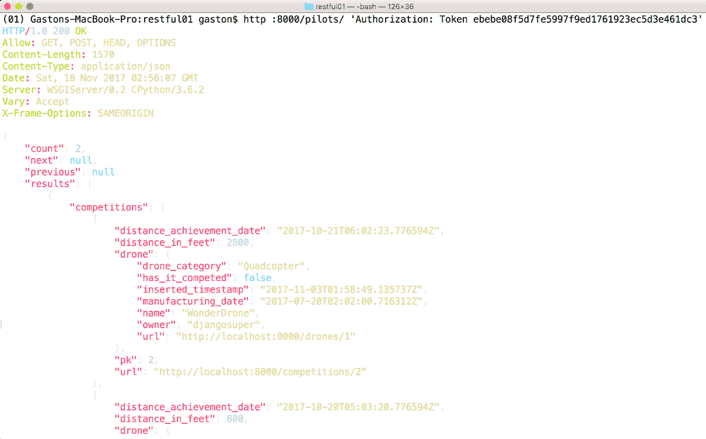

Django REST 框架提供的基于令牌的认证非常简单，并且需要定制才能使其适用于生产环境。令牌永远不会过期，没有设置可以指定令牌的默认过期时间。

# 测试你的知识

让我们看看你是否能正确回答以下问题。

1.  字符串的 `permissions.SAFE_METHODS` 元组包括以下被认为是安全的 HTTP 方法或动词：

    1.  `'GET'`, `'HEAD'`, 和 `'OPTIONS'`

    1.  `'POST'`, `'PATCH'`, 和 `'OPTIONS'`

    1.  `'GET'`, `'PUT'`, 和 `'OPTIONS'`

1.  以下哪个设置键在 `REST_FRAMEWORK` 字典中指定了全局设置，该设置是一个字符串值的元组，表示我们想要用于认证的类？

    1.  `'GLOBAL_AUTHENTICATION_CLASSES'`

    1.  `'DEFAULT_AUTHENTICATION_CLASSES'`

    1.  `'REST_FRAMEWORK_AUTHENTICATION_CLASSES'`

1.  以下哪个模型持久化 Django 用户？

    1.  `Django.contrib.auth.DjangoUser`

    1.  `Django.contrib.auth.User`

    1.  `Django.rest-framework.User`

1.  以下哪个类是所有自定义权限类应该继承以与 Django REST 框架一起工作的基类？

    1.  `Django.contrib.auth.MainPermission`

    1.  `rest_framework.permissions.MainPermission`

    1.  `rest_framework.permissions.BasePermission`

1.  为了为基于类的视图配置权限策略，我们必须覆盖以下哪个类属性？

    1.  `permission_classes`

    1.  `permission_policies_classes`

    1.  `rest_framework_permission_classes`

正确答案包含在 [附录](https://cdp.packtpub.com/django_restful_web_services__/wp-admin/post.php?post=44&action=edit#post_454)，*解决方案* 中。

# 摘要

在本章中，我们学习了 Django、Django REST 框架和 RESTful Web 服务中认证和权限之间的区别。我们分析了 Django REST 框架中包含的内置认证类。

我们遵循了必要的步骤，将安全性和权限相关的数据包含到模型中。我们通过自定义权限类处理对象级权限，并保存有关发起请求的用户的信息。我们了解到有三种 HTTP 方法或动词被认为是安全的。

我们为与 `Drone` 模型一起工作的基于类的视图配置了权限策略。然后，我们为 Django 创建了一个超级用户和另一个用户，以编写和发送经过身份验证的请求，并了解我们配置的权限策略是如何工作的。

我们使用了命令行工具和图形用户界面工具来编写和发送经过身份验证的请求。然后，我们使用可浏览的 API 功能浏览受保护的 RESTful Web 服务。最后，我们使用 Django REST 框架提供的简单基于令牌的身份验证来了解另一种请求认证的方式。

现在我们已经通过身份验证和权限策略改进了我们的 RESTful Web Service，是时候将这些策略与节流规则和版本控制相结合了。我们将在下一章中介绍这些主题。

# 应用节流规则和版本控制管理

在本章中，我们将使用节流规则来限制我们对 RESTful Web Service 的使用。我们不希望我们的 RESTful Web Service 资源耗尽之前处理请求，因此，我们将分析节流规则的重要性。我们将利用 Django REST 框架中包含的功能来管理我们 Web 服务的不同版本。我们将了解：

+   理解节流规则的重要性

+   学习 Django REST 框架中不同节流类的目的

+   在 Django REST 框架中配置节流策略

+   运行测试以检查节流策略是否按预期工作

+   理解版本控制类

+   配置版本控制方案

+   运行测试以检查版本控制是否按预期工作

# 理解节流规则的重要性

在第八章，“使用身份验证和权限保护 API”，我们确保在处理请求之前对某些请求进行了身份验证。我们利用了许多身份验证方案来识别发起请求的用户。节流规则还决定请求是否需要授权。我们将与它们结合使用身份验证。

到目前为止，我们还没有对我们的 RESTful Web Service 的使用设置任何限制。由于这种配置，未经身份验证和已身份验证的用户都可以随意组合并发送尽可能多的请求。我们唯一限制的是 Django REST 框架中可用的分页功能配置过程中的结果集大小。因此，大型结果集被分割成单独的数据页。然而，用户可能会发送成千上万的请求进行处理，而没有任何限制。当然，运行我们的 RESTful Web Service 或底层数据库的服务器或虚拟机可能会因为大量请求而超载，因为我们没有设置限制。

节流控制用户对我们 RESTful Web Service 发起请求的速率。Django REST 框架使得配置节流规则变得简单。我们将使用节流规则来配置以下对我们 RESTful Web Service 使用的限制：

+   未经身份验证的用户每小时最多 3 个请求

+   已身份验证的用户每小时最多 10 个请求

+   与相关视图相关的每小时最多 20 个请求

+   与相关视图相关的每小时最多 15 个请求

# 学习 Django REST 框架中不同节流类的目的

Django REST 框架在`rest_framework.throttling`模块中提供了三个节流类。它们都是`SimpleRateThrottle`类的子类，该类继承自`BaseThrottle`类。

这三个类允许我们指定节流规则，这些规则指示在特定时间段内和确定范围内允许的最大请求数。每个类负责计算和验证每个周期内的最大请求数。这些类提供不同的机制来确定先前的请求信息，通过将其与新的请求进行比较来指定范围。Django REST 框架在缓存中存储分析每个节流规则所需的数据。因此，这些类覆盖了继承的`get_cache_key`方法，该方法确定用于计算和验证的范围。

以下为三种节流类别：

+   `AnonRateThrottle`：此类限制匿名用户可以发起的请求速率，因此，其规则适用于未认证用户。唯一的缓存键是传入请求的 IP 地址。因此，来自同一 IP 地址的所有请求将累积该 IP 的总请求数。

+   `UserRateThrottle`：此类限制特定用户可以发起的请求速率，并适用于已认证和未认证的用户。显然，当请求已认证时，认证的用户 ID 是唯一的缓存键。当请求未认证且来自匿名用户时，唯一的缓存键是传入请求的 IP 地址。

+   `ScopedRateThrottle`：此类在需要以不同速率限制对 RESTful Web Service 的特定功能访问时非常有用。该类使用分配给`throttle_scope`属性的值来限制对具有相同值的部分的请求。

之前的类是 Django REST 框架自带的。许多第三方库提供了许多额外的节流类。

确保您退出 Django 的开发服务器。请记住，您只需在终端或命令提示符窗口中按*Ctrl* + *C*即可。我们将对之前章节中设置的不同的认证机制进行必要的更改，以应用节流规则。因此，我们将向全局节流类列表中添加`AnonRateThrottle`和`UserRateThrottle`类。

`DEFAULT_THROTTLE_CLASSES` 设置键的值指定了一个全局设置，它是一个字符串的元组，其值指示我们想要用于节流规则的默认类。我们将指定`AnonRateThrottle`和`UserRateThrottle`类。

`DEFAULT_THROTTLE_RATES` 设置键指定了一个包含默认节流速率的字典。下一个列表指定了键、我们将分配的值及其含义：

+   `'anon'`: 我们将指定 `'3/hour'` 作为此键的值，这意味着我们希望匿名用户每小时最多有 3 个请求。`AnonRateThrottle` 类将应用此限制规则。

+   `'user'`: 我们将指定 `'10/hour'` 作为此键的值，这意味着我们希望认证用户每小时最多有 10 个请求。`UserRateThrottle` 类将应用此限制规则。

+   `'drones'`: 我们将指定 `'20/hour'` 作为此键的值，这意味着我们希望与无人机相关的视图每小时最多有 20 个请求。`ScopedRateThrottle` 类将应用此限制规则。

+   `'pilots'`: 我们将指定 `'15/hour'` 作为此键的值，这意味着我们希望与无人机相关的视图每小时最多有 15 个请求。`ScopedRateThrottle` 类将应用此限制规则。

每个键的最大速率值是一个字符串，指定了周期内请求的数量，格式如下：`'number_of_requests/period'`，其中 `period` 可以是以下任何一个：

+   `d`: 天

+   `day`: 天

+   `h`: 小时

+   `hour`: 小时

+   `m`: 分钟

+   `min`: 分钟

+   `s`: 秒

+   `sec`: 秒

在这个情况下，我们将始终处理每小时的最大请求数量，因此，值将在最大请求数量后使用 `/hour`。

打开声明 Django 项目 `restful01` 配置的模块级变量的 `restful01/restful01/settings.py` 文件。我们将对此 Django 设置文件进行一些修改。将高亮行添加到 `REST_FRAMEWORK` 字典中。以下行显示了 `REST_FRAMEWORK` 字典的新声明。示例代码文件包含在 `restful01/restful01/settings.py` 文件中的 `hillar_django_restful_09_01` 文件夹中：

```py
REST_FRAMEWORK = { 
    'DEFAULT_PAGINATION_CLASS': 
    'drones.custompagination.LimitOffsetPaginationWithUpperBound', 
    'PAGE_SIZE': 4, 
    'DEFAULT_FILTER_BACKENDS': ( 
        'django_filters.rest_framework.DjangoFilterBackend', 
        'rest_framework.filters.OrderingFilter', 
        'rest_framework.filters.SearchFilter', 
        ), 
    'DEFAULT_AUTHENTICATION_CLASSES': ( 
        'rest_framework.authentication.BasicAuthentication', 
        'rest_framework.authentication.SessionAuthentication', 
        ), 
    'DEFAULT_THROTTLE_CLASSES': ( 
        'rest_framework.throttling.AnonRateThrottle', 
        'rest_framework.throttling.UserRateThrottle', 
    ), 
    'DEFAULT_THROTTLE_RATES': { 
        'anon': '3/hour', 
        'user': '10/hour', 
        'drones': '20/hour', 
        'pilots': '15/hour', 
    } 
} 
```

我们为 `DEFAULT_THROTTLE_CLASSES` 和 `DEFAULT_THROTTLE_RATES` 设置键添加了值，以配置默认限制类和期望的速率。

# 在 Django REST 框架中配置限制策略

现在，我们将为与无人机相关的基于类视图（`DroneList` 和 `DroneDetail`）配置限制策略：我们将覆盖以下类属性值：

+   `throttle_classes`: 此类属性指定了一个包含将管理类限制规则的类名的元组。在这种情况下，我们将指定 `ScopedRateThrottle` 类作为元组的唯一成员。

+   `throttle_scope`: 此类属性指定了 `ScopedRateThrottle` 类将使用的限制作用域名称，以累计请求数量并限制请求速率。

这样，我们将使这些基于类的视图与 `ScopedRateThrottle` 类一起工作，并将配置此类将考虑的每个与无人机相关的基于类视图的限制作用域。

打开 `restful01/drones/views.py` 文件，在声明导入的最后一行之后、`DroneCategoryList` 类声明之前添加以下行：

```py
from rest_framework.throttling import ScopedRateThrottle  
```

在同一 `views.py` 文件中，用以下代码替换声明 `DroneDetail` 类的代码。代码列表中的新行被突出显示。示例的代码文件包含在 `hillar_django_restful_09_01` 文件夹中，位于 `restful01/drones/views.py` 文件：

```py
class DroneDetail(generics.RetrieveUpdateDestroyAPIView): 
    throttle_scope = 'drones' 
    throttle_classes = (ScopedRateThrottle,) 
    queryset = Drone.objects.all() 
    serializer_class = DroneSerializer 
    name = 'drone-detail' 
    permission_classes = ( 
        permissions.IsAuthenticatedOrReadOnly, 
        custompermission.IsCurrentUserOwnerOrReadOnly, 
        )
```

在同一 `views.py` 文件中，用以下代码替换声明 `DroneList` 类的代码。代码列表中的新行被突出显示。示例的代码文件包含在 `hillar_django_restful_09_01` 文件夹中，位于 `restful01/drones/views.py` 文件：

```py
class DroneList(generics.ListCreateAPIView): 
    throttle_scope = 'drones' 
    throttle_classes = (ScopedRateThrottle,) 
    queryset = Drone.objects.all() 
    serializer_class = DroneSerializer 
    name = 'drone-list' 
    filter_fields = ( 
        'name',  
        'drone_category',  
        'manufacturing_date',  
        'has_it_competed',  
        ) 
    search_fields = ( 
        '^name', 
        ) 
    ordering_fields = ( 
        'name', 
        'manufacturing_date', 
        ) 
    permission_classes = ( 
        permissions.IsAuthenticatedOrReadOnly, 
        custompermission.IsCurrentUserOwnerOrReadOnly, 
        ) 

    def perform_create(self, serializer): 
        serializer.save(owner=self.request.user) 
```

我们在两个类中添加了相同的行。我们将 `'drones'` 分配给 `throttle_scope` 类属性，并将 `ScopedRateThrottle` 包含在定义 `throttle_classes` 值的元组中。这样，两个基于类的视图将使用为 `'drones'` 范围指定的设置和 `ScopeRateThrottle` 类进行节流。我们在 `REST_FRAMEWORK` 字典中添加了 `'drones'` 键到 `DEFAULT_THROTTLE_RATES` 键，因此 `'drones'` 范围被配置为每小时最多服务 20 个请求。

现在，我们将为与飞行员相关的基于类的视图配置节流策略：`PilotList` 和 `PilotDetail`。我们还将覆盖 `throttle_scope` 和 `throttle_classes` 类属性的值。

在同一 `views.py` 文件中，用以下代码替换声明 `PilotDetail` 类的代码。代码列表中的新行被突出显示。示例的代码文件包含在 `hillar_django_restful_09_01` 文件夹中，位于 `restful01/drones/views.py` 文件：

```py
class PilotDetail(generics.RetrieveUpdateDestroyAPIView): 
    throttle_scope = 'pilots' 
    throttle_classes = (ScopedRateThrottle,) 
    queryset = Pilot.objects.all() 
    serializer_class = PilotSerializer 
    name = 'pilot-detail' 
    authentication_classes = ( 
        TokenAuthentication, 
        ) 
    permission_classes = ( 
        IsAuthenticated, 
        ) 
```

在同一 `views.py` 文件中，用以下代码替换声明 `PilotList` 类的代码。代码列表中的新行被突出显示。示例的代码文件包含在 `hillar_django_restful_09_01` 文件夹中，位于 `restful01/drones/views.py` 文件：

```py
class PilotList(generics.ListCreateAPIView): 
    throttle_scope = 'pilots' 
    throttle_classes = (ScopedRateThrottle,) 
    queryset = Pilot.objects.all() 
    serializer_class = PilotSerializer 
    name = 'pilot-list' 
    filter_fields = ( 
        'name',  
        'gender', 
        'races_count', 
        ) 
    search_fields = ( 
        '^name', 
        ) 
    ordering_fields = ( 
        'name', 
        'races_count' 
        ) 
    authentication_classes = ( 
        TokenAuthentication, 
        ) 
    permission_classes = ( 
        IsAuthenticated, 
        ) 
```

我们在两个类中添加了相同的行。我们将 `'pilots'` 分配给 `throttle_scope` 类属性，并将 `ScopedRateThrottle` 包含在定义 `throttle_classes` 值的元组中。这样，两个基于类的视图将使用为 `'pilots'` 范围指定的设置和 `ScopeRateThrottle` 类进行节流。我们在 `REST_FRAMEWORK` 字典中添加了 `'pilots'` 键到 `DEFAULT_THROTTLE_RATES` 键，因此 `'pilots'` 范围被配置为每小时最多服务 15 个请求。

我们编辑的所有基于类的视图将不会考虑应用了默认类（我们用于节流的默认类）的全局设置：`AnonRateThrottle` 和 `UserRateThrottle`。这些基于类的视图将使用我们为它们指定的配置。

# 运行测试以检查节流策略是否按预期工作

在 Django 运行基于类的视图的主体之前，它会对在节流类设置中指定的每个节流类进行检查。在无人机和飞行员相关的视图中，我们编写了覆盖默认设置的代码。

如果单个节流检查失败，代码将引发 `Throttled` 异常，Django 不会执行视图的主体。缓存负责存储用于节流检查的先前请求信息。

现在，我们可以启动 Django 的开发服务器，以编写并发送 HTTP 请求，以了解配置的节流规则与所有之前的配置相结合是如何工作的。根据您的需求执行以下两个命令之一，以访问连接到您的局域网的其他设备或计算机上的 API。请记住，我们在 *启动 Django 的开发服务器* 部分的 第三章 *创建 API 视图* 中分析了它们之间的区别。

```py
    python manage.py runserver
    python manage.py runserver 0.0.0.0:8000
```

在我们运行任何之前的命令之后，开发服务器将在端口 `8000` 上开始监听。

现在，我们将四次编写并发送以下不带认证凭据的 HTTP `GET` 请求，以获取比赛的首页：

```py
    http :8000/competitions/
```

我们还可以使用 macOS 或 Linux 的 shell 功能，使用 bash shell 在单行中运行之前的命令四次。该命令与 Windows 的 Cygwin 终端兼容。我们必须考虑到我们将依次看到所有结果，并且我们需要滚动以了解每次执行的情况：

```py
    for i in {1..4}; do http :8000/competitions/; done;
```

以下行允许您在 Windows PowerShell 中使用单行命令运行该命令四次：

```py
    1..4 | foreach { http :8000/competitions/ }
```

以下是我们必须执行四次的等价 curl 命令：

```py
    curl -iX GET localhost:8000/competitions/
```

以下是在 macOS 或 Linux 的 bash shell 或 Windows 的 Cygwin 终端中，使用单行执行四次等价的 curl 命令：

```py
    for i in {1..4}; do curl -iX GET localhost:8000/competitions/; done;
```

以下是在 Windows PowerShell 中执行四次等价的 curl 命令的单行：

```py
    1..4 | foreach { curl -iX GET localhost:8000/competitions/ }
```

Django REST 框架不会处理第 4 次请求。`AnonRateThrottle` 类被配置为默认节流类之一，其节流设置指定每小时最多 3 个请求。因此，我们将在响应头中收到 HTTP `429 Too many requests` 状态码，以及一条消息，表明请求已被节流，以及服务器将能够处理额外请求的时间。响应头中的 `Retry-After` 键的值提供了我们必须等待直到下一次请求的秒数：`2347`。以下行显示了一个示例响应。请注意，秒数可能因您的配置而异：

```py
    HTTP/1.0 429 Too Many Requests
    Allow: GET, POST, HEAD, OPTIONS
    Content-Length: 71
    Content-Type: application/json
    Date: Thu, 30 Nov 2017 03:07:28 GMT
    Retry-After: 2347
    Server: WSGIServer/0.2 CPython/3.6.2
    Vary: Accept, Cookie
    X-Frame-Options: SAMEORIGIN

    {
        "detail": "Request was throttled. Expected available in 2347 seconds."
    }
```

现在，我们将编写并发送以下带有身份验证凭据的 HTTP `GET` 请求，以获取比赛的第一页，共执行四次。我们将使用上一章中创建的超级用户。请记住将 `djangosuper` 替换为您用于超级用户的名称，将 `passwordforsuper` 替换为您为该用户配置的密码，如下所示：

```py
    http -a "djangosuper":"passwordforsuper" :8000/competitions/
```

在 Linux、macOS 或 Cygwin 终端中，我们可以使用以下单行运行之前的命令四次：

```py
    for i in {1..4}; do http -a "djangosuper":"passwordforsuper" :8000/competitions/; done;
```

以下行允许您在 Windows PowerShell 中使用单行运行该命令四次。

```py
    1..4 | foreach { http -a "djangosuper":"passwordforsuper" :8000/competitions/ }

```

以下是我们必须执行四次的等效 curl 命令：

```py
    curl --user 'djangosuper':'passwordforsuper' -iX GET localhost:8000/competitions/

```

以下是在 Linux、macOS 或 Cygwin 终端中使用单行执行四次等效 curl 命令：

```py
    for i in {1..4}; do curl --user "djangosuper":"passwordforsuper" -iX GET localhost:8000/competitions/; done;

```

以下是在 Windows PowerShell 中使用单行执行四次等效 curl 命令：

```py
    1..4 | foreach { curl --user "djangosuper":"passwordforsuper" -iX GET localhost:8000/competitions/ }

```

在这种情况下，Django 将处理第 4 个请求，因为我们已经使用相同的用户编写并发送了 4 个认证请求。`UserRateThrottle` 类被配置为默认限制类之一，其限制设置指定每小时 10 个请求。在我们累积每小时最大请求数之前，我们还有 6 个请求。

如果我们再发送相同的请求 7 次，我们将累积 11 个请求，并且会在响应头中收到一个 HTTP `429 Too many requests` 状态码，这是一个表示请求被限制，并且服务器将在最后一次执行后能够处理额外请求的时间的消息。

现在，我们将编写并发送以下不带身份验证凭据的 HTTP `GET` 请求，以获取无人机集合的第一页，共执行 20 次：

```py
    http :8000/drones/
```

我们可以使用 macOS 或 Linux 的 shell 功能，使用 bash shell 在单行中运行之前的命令 20 次。该命令与 Windows 的 Cygwin 终端兼容：

```py
    for i in {1..20}; do http :8000/drones/; done;
```

以下行允许您在 Windows PowerShell 中使用单行运行该命令 20 次：

```py
    1..21 | foreach { http :8000/drones/ }

```

以下是我们必须执行 20 次的等效 curl 命令：

```py
    curl -iX GET localhost:8000/drones/
```

以下是在 macOS 或 Linux 的 bash shell 中，或在 Windows 的 Cygwin 终端中执行 20 次的单行等效 curl 命令：

```py
    for i in {1..21}; do curl -iX GET localhost:8000/drones/; done;
```

以下是在 Windows PowerShell 中使用单行执行 20 次等效 curl 命令：

```py
    1..20 | foreach { curl -iX GET localhost:8000/drones/ }
```

Django REST 框架将处理 20 个请求。`DroneList` 类的 `throttle_scope` 类属性设置为 `'drones'`，并使用 `ScopedRateThrottle` 类在指定的作用域中累积请求。`'drones'` 作用域配置为每小时最多接受 20 个请求，因此，如果我们使用相同的非认证用户发送另一个请求，并且这个请求累积在相同的作用域中，请求将被限制。

现在，我们将编写并发送一个 HTTP `GET` 请求来检索无人机的详细信息。确保您将任何现有无人机 ID 值替换为之前请求结果中列出的 `1`：

```py
    http :8000/drones/1
```

以下是对应的 curl 命令：

```py
    curl -iX GET localhost:8000/drones/1
```

Django REST 框架不会处理这个请求。请求最终被路由到 `DroneDetail` 类。`DroneDetail` 类的 `throttle_scope` 类属性设置为 `'drones'`，并使用 `ScopedRateThrottle` 类在指定的范围内累积请求。因此，`DroneList` 和 `DroneDetail` 类在相同的范围内累积。来自同一非认证用户的新的请求成为 `'drones'` 范围内的第 21 个请求，该范围配置为每小时接受最多 20 个请求，因此，我们将在响应头中收到 HTTP `429 Too many requests` 状态码和一个消息，表明请求已被限制，以及服务器将能够处理额外请求的时间。响应头中 `Retry-After` 键的值提供了我们必须等待的秒数：`3138`。以下行显示了示例响应。请注意，秒数可能因您的配置而异：

```py
    HTTP/1.0 429 Too Many Requests
    Allow: GET, PUT, PATCH, DELETE, HEAD, OPTIONS
    Content-Length: 71
    Content-Type: application/json
    Date: Mon, 04 Dec 2017 03:55:14 GMT
    Retry-After: 3138
    Server: WSGIServer/0.2 CPython/3.6.2
    Vary: Accept, Cookie
    X-Frame-Options: SAMEORIGIN

    {
        "detail": "Request was throttled. Expected available in 3138 seconds."
    }
```

限制规则对于确保用户不会滥用我们的 RESTful 网络服务以及保持对用于处理传入请求的资源控制至关重要。我们绝不应该在没有明确的限制规则配置的情况下将 RESTful 网络服务投入生产。

# 理解版本控制类

有时，我们不得不同时保持许多不同版本的 RESTful 网络服务活跃。例如，我们可能需要让我们的 RESTful 网络服务的第 1 版和第 2 版都能接受和处理请求。有许多版本控制方案使得能够提供多个版本的 Web 服务成为可能。

Django REST 框架在 `rest_framework.versioning` 模块中提供了五个类。它们都是 `BaseVersioning` 类的子类。这五个类允许我们使用特定的版本控制方案。

我们可以使用这些类之一，结合对 URL 配置和其他代码片段的更改，以支持所选的版本控制方案。每个类都负责根据实现的方案确定版本，并确保指定的版本号基于允许的版本设置是有效的。这些类提供了不同的机制来确定版本号。以下是有五个版本控制类：

+   `AcceptHeaderVersioning`: 这个类配置了一个版本化方案，要求每个请求将所需的版本作为媒体类型的一个附加值指定为头部中`Accept`键的值。例如，如果请求将`'application/json; version=1.2'`指定为头部中`Accept`键的值，`AcceptHeaderVersioning`类将设置`request.version`属性为`'1.2'`。这个方案被称为媒体类型版本化、内容协商版本化或接受头版本化。

+   `HostNameVersioning`: 这个类配置了一个版本化方案，要求每个请求在 URL 中的主机名中指定所需的版本作为值。例如，如果请求指定`v2.myrestfulservice.com/drones/`作为 URL，这意味着请求想要与 RESTful Web 服务的第 2 个版本一起工作。这个方案被称为主机名版本化或域名版本化。

+   `URLPathVersioning`: 这个类配置了一个版本化方案，要求每个请求在 URL 路径中指定所需的版本作为值。例如，如果请求指定`v2/myrestfulservice.com/drones/`作为 URL，这意味着请求想要与 RESTful Web 服务的第 2 个版本一起工作。这个方案被称为 URI 版本化或 URL 路径版本化。

+   `NamespaceVersioning`: 这个类配置了与`URLPathVersioning`类中解释的版本化方案。与其他类相比，唯一的区别在于 Django REST 框架应用程序中的配置不同。在这种情况下，使用 URL 命名空间是必要的。

+   `QueryParameterVersioning`: 这个类配置了一个版本化方案，要求每个请求将所需的版本作为查询参数指定。例如，如果请求指定`myrestfulservice.com/?version=1.2`，`QueryParameterVersioning`类将设置`request.version`属性为`'1.2'`。这个方案被称为查询参数版本化或请求参数版本化。

之前的类是 Django REST 框架自带的。我们也可以编写自己的定制版本化方案。每个版本化方案都有其优势和权衡。在这种情况下，我们将使用`NamespaceVersioning`类来提供一个与第一个版本相比只有微小变化的 RESTful Web 服务的新版本。然而，仔细分析你是否真的需要使用任何版本化方案是必要的。然后，你需要根据你的具体需求确定最合适的一个。当然，如果可能的话，我们应始终避免使用任何版本化方案，因为它们会增加我们的 RESTful Web 服务的复杂性。

# 配置版本化方案

让我们假设我们必须为以下两个版本的 RESTful Web 服务提供服务：

+   **版本 1**：我们迄今为止开发的版本。然而，我们想确保客户端明白他们正在使用版本 1，因此，我们希望在每个 HTTP 请求的 URL 中包含版本号的引用。

+   **版本 2**：这个版本必须允许客户端使用 `vehicles` 名称而不是 `drones` 来引用无人机资源集合。此外，无人机类别资源集合必须使用 `vehicle-categories` 名称而不是 `drone-categories` 来访问。我们还想确保客户端明白他们正在使用版本 2，因此，我们希望在每个 HTTP 请求的 URL 中包含版本号的引用。

第二版和第一版之间的差异将是最小的，因为我们希望保持示例简单。在这种情况下，我们将利用之前解释的 `NamespaceVersioning` 类来配置 `URL 路径版本控制方案`。

确保您已退出 Django 的开发服务器。请记住，您只需在运行它的终端或命令提示符窗口中按 *Ctrl + C* 即可。

我们将对配置 `NameSpaceVersioning` 类作为我们 RESTful Web 服务默认版本控制类的必要更改。打开声明 `restful01` 项目 Django 配置的模块级变量的 `restful01/restful01/settings.py` 文件。我们将对这个 Django 设置文件进行一些更改。将高亮行添加到 `REST_FRAMEWORK` 字典中。以下行显示了 `REST_FRAMEWORK` 字典的新声明。示例的代码文件包含在 `restful01/restful01/settings.py` 文件中的 `hillar_django_restful_09_02` 文件夹中：

```py
REST_FRAMEWORK = { 
    'DEFAULT_PAGINATION_CLASS': 
    'drones.custompagination.LimitOffsetPaginationWithUpperBound', 
    'PAGE_SIZE': 4, 
    'DEFAULT_FILTER_BACKENDS': ( 
        'django_filters.rest_framework.DjangoFilterBackend', 
        'rest_framework.filters.OrderingFilter', 
        'rest_framework.filters.SearchFilter', 
        ), 
    'DEFAULT_AUTHENTICATION_CLASSES': ( 
        'rest_framework.authentication.BasicAuthentication', 
        'rest_framework.authentication.SessionAuthentication', 
        ), 
    'DEFAULT_THROTTLE_CLASSES': ( 
        'rest_framework.throttling.AnonRateThrottle', 
        'rest_framework.throttling.UserRateThrottle', 
    ), 
    'DEFAULT_THROTTLE_RATES': { 
        'anon': '3/hour', 
        'user': '10/hour', 
        'drones': '20/hour', 
        'pilots': '15/hour', 
    } 
    'DEFAULT_VERSIONING_CLASS':  
        'rest_framework.versioning.NamespaceVersioning', 
} 
```

我们为 `DEFAULT_VERSIONING_CLASS` 设置键添加了一个值来配置我们想要使用的默认版本控制类。就像我们每次为设置键添加值时一样，新的配置将作为全局设置应用于所有视图，如果需要，我们可以在特定类中覆盖它。

在 `restful01/drones` 文件夹内（Windows 中为 `restful01\drones`）创建一个名为 `v2` 的新子文件夹。这个新文件夹将成为我们 RESTful Web 服务第二版所需特定代码的基准。

前往最近创建的 `restful01/drones/v2` 文件夹，并创建一个名为 `views.py` 的新文件。在这个新文件中编写以下代码。以下行显示了创建 `ApiRootVersion2` 类的代码，该类被声明为 `generics.GenericAPIView` 类的子类。示例的代码文件包含在 `restful01/drones/v2/views.py` 文件中的 `hillar_django_restful_09_02` 文件夹中。

```py
from rest_framework import generics 
from rest_framework.response import Response 
from rest_framework.reverse import reverse 
from drones import views 

class ApiRootVersion2(generics.GenericAPIView): 
    name = 'api-root' 
    def get(self, request, *args, **kwargs): 
        return Response({ 
            'vehicle-categories': reverse(views.DroneCategoryList.name, request=request), 
            'vehicles': reverse(views.DroneList.name, request=request), 
            'pilots': reverse(views.PilotList.name, request=request), 
            'competitions': reverse(views.CompetitionList.name, request=request) 
            }) 
```

`ApiRootVersion2` 类是 `rest_framework.generics.GenericAPIView` 类的子类，并声明了 `get` 方法。正如我们在 *第六章 中所学到的，*使用高级关系和序列化*，`GenericAPIView` 类是我们一直在使用的所有通用视图的基类。当请求与版本 2 一起工作时，我们将使 Django REST 框架使用此类而不是 `ApiRoot` 类。

`ApiRootVersion2` 类定义了返回一个包含字符串键/值对的 `Response` 对象的 `get` 方法，这些字符串提供了视图及其 URL 的描述性名称，该 URL 是使用 `rest_framework.reverse.reverse` 函数生成的。此 URL 解析器函数返回视图的完全限定 URL。每次我们调用 `reverse` 函数时，我们都会包括 `request` 参数的 `request` 值。这样做非常重要，以确保 `NameSpaceVersioning` 类可以按预期工作以配置版本化方案。

在此情况下，响应定义了名为 `'vehicle-categories'` 和 `'vehicles'` 的键，而不是在 `views.py` 文件中包含的 `'drone-cagories'` 和 `'drones'` 键，这些键将用于版本 1 的 `ApiRoot` 类。

现在，前往最近创建的 `restful01/drones/v2` 文件夹，并创建一个名为 `urls.py` 的新文件。在这个新文件中写下以下代码。以下行显示了此文件的 `urlpatterns` 数组的代码。与第一个版本不同的行被突出显示。示例的代码文件包含在 `hillar_django_restful_09_02` 文件夹中的 `restful01/drones/v2/urls.py` 文件中。

```py
from django.conf.urls import url 
from drones import views 
from drones.v2 import views as views_v2 

urlpatterns = [ 
    url(r'^vehicle-categories/$',  
        views.DroneCategoryList.as_view(),  
        name=views.DroneCategoryList.name), 
    url(r'^vehicle-categories/(?P<pk>[0-9]+)$',  
        views.DroneCategoryDetail.as_view(), 
        name=views.DroneCategoryDetail.name), 
    url(r'^vehicles/$',  
        views.DroneList.as_view(), 
        name=views.DroneList.name), 
    url(r'^vehicles/(?P<pk>[0-9]+)$',  
        views.DroneDetail.as_view(), 
        name=views.DroneDetail.name), 
    url(r'^pilots/$',  
        views.PilotList.as_view(), 
        name=views.PilotList.name), 
    url(r'^pilots/(?P<pk>[0-9]+)$',  
        views.PilotDetail.as_view(), 
        name=views.PilotDetail.name), 
    url(r'^competitions/$',  
        views.CompetitionList.as_view(), 
        name=views.CompetitionList.name), 
    url(r'^competitions/(?P<pk>[0-9]+)$',  
        views.CompetitionDetail.as_view(), 
        name=views.CompetitionDetail.name), 
    url(r'^$', 
        views_v2.ApiRootVersion2.as_view(), 
        name=views_v2.ApiRootVersion2.name), 
] 
```

之前的代码定义了 URL 模式，这些模式指定了请求中必须匹配的正则表达式，以便运行在 `views.py` 文件原始版本中定义的基于类的视图的特定方法。我们希望版本 2 使用 `vehicle-categories` 和 `vehicles` 而不是 `drone-categories` 和 `drones`。然而，我们不会在序列化器中做任何更改，因此我们只会更改客户端必须使用的 URL 来进行与无人机类别和无人机相关的请求。

现在，我们必须替换 `restful01/restful01` 文件夹中的 `urls.py` 文件中的代码，特别是 `restful01/restful01/urls.py` 文件。该文件定义了根 URL 配置，因此我们必须包含在 `restful01/drones/urls.py` 和 `restful01/drones/v2/urls.py` 中声明的两个版本的 URL 模式。以下行显示了 `restful01/restful01/urls.py` 文件的新代码。示例的代码文件包含在 `hillar_django_restful_09_02` 文件夹中的 `restful01/restful01/urls.py` 文件中。

```py
from django.conf.urls import url, include 

urlpatterns = [ 
    url(r'^v1/', include('drones.urls', namespace='v1')), 
    url(r'^v1/api-auth/', include('rest_framework.urls', namespace='rest_framework_v1')), 
    url(r'^v2/', include('drones.v2.urls', namespace='v2')), 
    url(r'^v2/api-auth/', include('rest_framework.urls', namespace='rest_framework_v2')), 
] 
```

每当一个 URL 以`v1/`开头时，将使用为先前版本定义的 URL 模式，并将`namespace`设置为`'v1'`。每当一个 URL 以`v2/`开头时，将使用为版本 2 定义的 URL 模式，并将`namespace`设置为`'v2'`。我们希望可浏览的 API 显示两个版本的登录和注销视图，因此，我们包含了必要的代码，以包含每个版本中`rest_framework.urls`中包含的定义，并使用不同的命名空间。这样，我们将能够通过可浏览的 API 和配置的认证轻松测试两个版本。

# 运行测试以检查版本控制是否按预期工作

现在，我们可以启动 Django 的开发服务器来编写并发送 HTTP 请求，以了解配置的版本控制方案是如何工作的。根据您的需求执行以下两个命令之一，以在其他连接到您的局域网的设备或计算机上访问 API。请记住，我们在*启动 Django 开发服务器*部分的第三章中分析了它们之间的区别。

```py
    python manage.py runserver
    python manage.py runserver 0.0.0.0:8000
```

在我们运行任何之前的命令后，开发服务器将开始监听端口`8000`。

现在，我们将通过使用我们 RESTful Web 服务的第一个版本来编写并发送一个 HTTP `GET`请求，以检索无人机类别的第一页：

```py
    http :8000/v1/drone-categories/
```

以下是对应的 curl 命令：

```py
    curl -iX GET localhost:8000/v1/drone-categories/
```

之前的命令将编写并发送以下 HTTP 请求：`GET http://localhost:8000/v1/drone-categories/`。请求 URL 在域名和端口号（`http://localhost:8000/`）之后以`v1/`开头，因此，它将匹配`'^v1/'`正则表达式，并将测试`restful01/drones/urls.py`文件中定义的正则表达式，并将使用等于`'v1'`的命名空间。然后，没有版本前缀的 URL（`'v1/'`）将匹配`'drone-categories/$'`正则表达式，并运行`views.DroneCategoryList`类视图的`get`方法。

`NamespaceVersioning`类确保渲染的 URL 在响应中包含适当的版本前缀。以下行显示了一个 HTTP 请求的示例响应，包括无人机类别的第一页。注意，每个类别的无人机列表的 URL 都包含版本前缀。此外，每个无人机类别的`url`键的值也包含版本前缀。

```py
    HTTP/1.0 200 OK
    Allow: GET, POST, HEAD, OPTIONS
    Content-Length: 670
    Content-Type: application/json
    Date: Sun, 03 Dec 2017 19:34:13 GMT
    Server: WSGIServer/0.2 CPython/3.6.2
    Vary: Accept, Cookie
    X-Frame-Options: SAMEORIGIN

    {
    "count": 2, 
    "next": null, 
    "previous": null, 
        "results": [
            {
                "drones": [
    "http://localhost:8000/v1/drones/6", 
    "http://localhost:8000/v1/drones/4", 
    "http://localhost:8000/v1/drones/8", 
                    "http://localhost:8000/v1/drones/10"
    ], 
    "name": "Octocopter", 
    "pk": 2, 
                "url": "http://localhost:8000/v1/drone-categories/2"
    }, 
            {
                "drones": [
    "http://localhost:8000/v1/drones/2", 
    "http://localhost:8000/v1/drones/9", 
    "http://localhost:8000/v1/drones/5", 
    "http://localhost:8000/v1/drones/7", 
    "http://localhost:8000/v1/drones/3", 
    "http://localhost:8000/v1/drones/12", 
    "http://localhost:8000/v1/drones/11", 
                    "http://localhost:8000/v1/drones/1"
    ], 
    "name": "Quadcopter", 
    "pk": 1, 
                "url": "http://localhost:8000/v1/drone-categories/1"
            }
        ]
    }  
```

现在，我们将通过使用我们 RESTful Web 服务的第二个版本来编写并发送一个 HTTP `GET`请求，以检索车辆类别的第一页：

```py
    http :8000/v2/vehicle-categories/
```

以下是对应的 curl 命令：

```py
    curl -iX GET localhost:8000/v2/vehicle-categories/
```

之前的命令将构造并发送以下 HTTP 请求：`GET http://localhost:8000/v2/vehicle-categories/`。请求 URL 在域名和端口号（`http://localhost:8000/`）之后以 `v2/` 开头，因此它将匹配 `'^v2/'` 正则表达式，并将测试位于 `restful01/drones/v2/urls.py` 文件中定义的正则表达式，并使用 `'v2'` 作为命名空间。然后，没有版本前缀的 URL (`'v2/'`) 将匹配 `'vehicle-categories/$'` 正则表达式，并运行 `views.DroneCategoryList` 类视图的 `get` 方法。

如前一个请求发生的情况一样，`NamespaceVersioning` 类确保渲染的 URL 包含适当的版本前缀。以下行显示了 HTTP 请求的示例响应，包含第一页和唯一的车辆类别。我们没有对新的版本中的序列化器进行更改，因此每个类别将渲染一个名为 `drones` 的列表。然而，每个类别的无人机列表的 URL 包含版本前缀，并且它们使用包含 `vehicle` 的适当 URL 而不是无人机。此外，每个车辆类别的 `url` 键的值包含版本前缀。

```py
    HTTP/1.0 200 OK
    Allow: GET, POST, HEAD, OPTIONS
    Content-Length: 698
    Content-Type: application/json
    Date: Sun, 03 Dec 2017 19:34:29 GMT
    Server: WSGIServer/0.2 CPython/3.6.2
    Vary: Accept, Cookie
    X-Frame-Options: SAMEORIGIN

    {
    "count": 2, 
    "next": null, 
    "previous": null, 
        "results": [
            {
                "drones": [
    "http://localhost:8000/v2/vehicles/6", 
    "http://localhost:8000/v2/vehicles/4", 
    "http://localhost:8000/v2/vehicles/8", 
                    "http://localhost:8000/v2/vehicles/10"
    ], 
    "name": "Octocopter", 
    "pk": 2, 
                "url": "http://localhost:8000/v2/vehicle-categories/2"
    }, 
            {
                "drones": [
    "http://localhost:8000/v2/vehicles/2", 
    "http://localhost:8000/v2/vehicles/9", 
    "http://localhost:8000/v2/vehicles/5", 
    "http://localhost:8000/v2/vehicles/7", 
    "http://localhost:8000/v2/vehicles/3", 
    "http://localhost:8000/v2/vehicles/12", 
    "http://localhost:8000/v2/vehicles/11", 
                    "http://localhost:8000/v2/vehicles/1"
    ], 
    "name": "Quadcopter", 
    "pk": 1, 
                "url": "http://localhost:8000/v2/vehicle-categories/1"
            }
        ]
    }
```

打开一个网页浏览器并输入 `http://localhost:8000/v1`。浏览器将构造并发送一个带有 `text/html` 作为期望内容类型的 `GET` 请求到 `/v1`，返回的 HTML 网页将被渲染。该请求最终将执行位于 `restful01/drones/views.py` 文件中的 `ApiRoot` 类定义的 `get` 方法。以下截图显示了带有资源描述的渲染网页：Api Root。第一版本的 Api Root 使用了第一版本的适当 URL，因此所有 URL 都以 `http://localhost:8000/v1/` 开头。

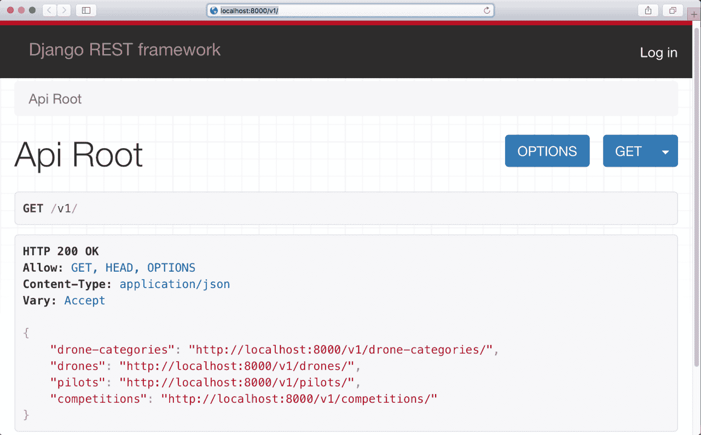

现在，前往 `http://localhost:8000/v2`。浏览器将构造并发送一个带有 `text/html` 作为期望内容类型的 `GET` 请求到 `/v2`，返回的 HTML 网页将被渲染。该请求最终将执行位于 `restful01/drones/v2/views.py` 文件中的 `ApiRootVersion2` 类定义的 `get` 方法。以下截图显示了带有资源描述的渲染网页：Api Root Version2。第一版本的 Api Root 使用了第二版本的适当 URL，因此所有 URL 都以 `http://localhost:8000/v2/` 开头。您可以检查与第一版本渲染的 Api Root 的差异。

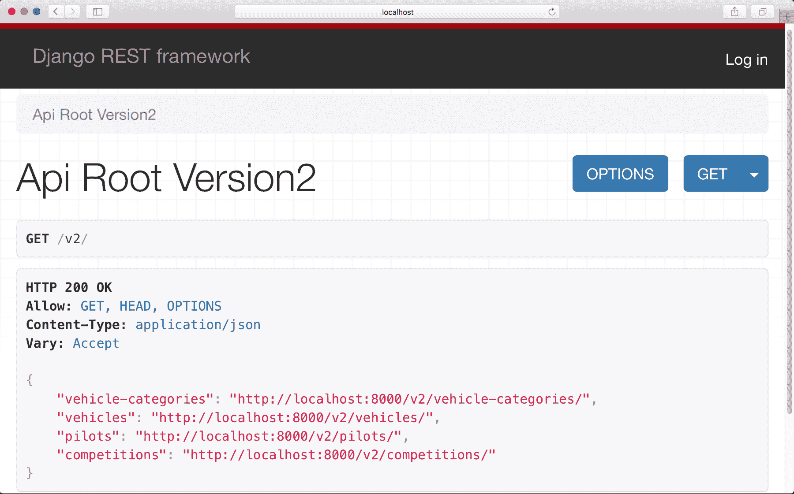

这个新的 Api Root 版本渲染了以下超链接：

+   `http://localhost:8000/v2/vehicle-categories/`: 车辆类别的集合

+   `http://localhost:8000/v2/vehicles/`: 车辆集合

+   `http://localhost:8000/v2/pilots/`: 飞行员集合

+   `http://localhost:8000/v2/competitions/`: 竞赛集合

我们可以使用我们配置的两个版本提供的所有可浏览 API 功能。

开发和维护多个版本的 RESTful Web Service 是一项极其复杂的任务，需要大量的规划。我们必须考虑到 Django REST 框架提供的不同版本方案，以简化我们的工作。然而，始终非常重要，避免使事情比必要的更复杂。我们应该尽可能保持任何版本方案简单，并确保我们继续在 URL 中提供易于识别的资源及其集合的 RESTful Web 服务。

# 测试你的知识

让我们看看你是否能正确回答以下问题：

1.  `rest_framework.throttling.UserRateThrottle`类：

    1.  限制特定用户可以发起的请求数量，并适用于*已认证和未认证的用户*

    1.  限制特定用户可以发起的请求数量，并仅适用于*已认证的用户*

    1.  限制特定用户可以发起的请求数量，并仅适用于*未认证的用户*

1.  在`REST_FRAMEWORK`字典中，以下哪个设置键指定了全局设置，该设置是一个字符串值的元组，表示我们想要用于速率限制规则的类：

    1.  `'DEFAULT_THROTTLE_CLASSES'`

    1.  `'GLOBAL_THROTTLE_CLASSES'`

    1.  `'REST_FRAMEWORK_THROTTLE_CLASSES'`

1.  在`REST_FRAMEWORK`字典中，以下哪个设置键指定了一个包含默认速率限制的字典：

    1.  `'GLOBAL_THROTTLE_RATES'`

    1.  `'DEFAULT_THROTTLE_RATES'`

    1.  `'REST_FRAMEWORK_THROTTLE_RATES'`

1.  `rest_framework.throttling.ScopedRateThrottle`类：

    1.  限制匿名用户可以发起的请求数量

    1.  限制特定用户可以发起的请求数量

    1.  限制与`throttle_scope`属性分配的值标识的 RESTful Web Service 特定部分的请求数量

1.  `rest_framework.versioning.NamespaceVersioning`类配置了一个称为的版本方案：

    1.  查询参数版本或请求参数版本

    1.  媒体类型版本、内容协商版本或接受头版本

    1.  URI 版本或 URL 路径版本

正确答案包含在[附录](https://cdp.packtpub.com/django_restful_web_services__/wp-admin/post.php?post=44&action=edit#post_454)，*解决方案*中。

# 摘要

在本章中，我们了解了速率限制规则的重要性以及我们如何将它们与 Django、Django REST 框架和 RESTful Web 服务的身份验证和权限相结合。我们分析了 Django REST 框架中包含的速率限制类。

我们遵循了必要的步骤在 Django REST 框架中配置了许多速率限制策略。我们处理了全局和范围相关的设置。然后，我们使用命令行工具组合并发送了许多请求来测试速率限制规则的工作情况。

我们理解了版本控制类，并配置了一个 URL 路径版本控制方案，以便我们能够处理我们 RESTful Web 服务的两个版本。我们使用了命令行工具和可浏览的 API 来了解这两个版本之间的差异。

现在我们能够将节流规则、身份验证和权限策略与版本控制方案相结合，是时候探索 Django REST 框架和第三方包提供的其他功能，以改进我们的 RESTful Web 服务并自动化测试。我们将在下一章中介绍这些主题。
