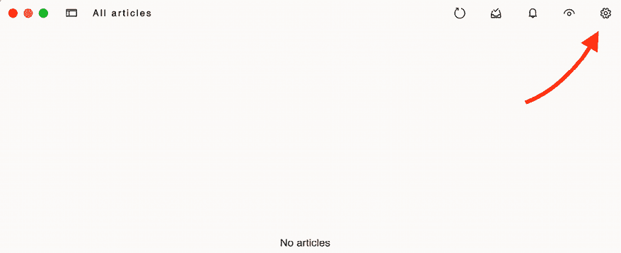

# 3

# 扩展您的博客应用程序

上一章介绍了表单的基础知识以及评论系统的创建。您还学习了如何使用 Django 发送电子邮件。在本章中，您将通过添加博客平台上常用的其他功能来扩展您的博客应用程序，例如标签、推荐相似帖子、为读者提供 RSS 订阅源以及允许他们搜索帖子。通过构建这些功能，您将学习到 Django 的新组件和功能。

本章将涵盖以下主题：

+   使用`django-taggit`实现标签功能

+   通过相似度检索帖子

+   创建用于显示最新帖子及评论最多帖子的自定义模板标签和过滤器

+   向网站添加网站地图

+   为博客帖子创建订阅源

+   安装 PostgreSQL

+   使用固定值将数据导入和导出到数据库

+   使用 Django 和 PostgreSQL 实现全文搜索引擎

# 功能概述

*图 3.1*展示了本章将要构建的视图、模板和功能表示：


图 3.1：第三章内置功能图

在本章中，我们将构建添加标签到帖子的功能。我们将扩展`post_list`视图以按标签过滤帖子。在`post_detail`视图中加载单个帖子时，我们将根据共同标签检索相似帖子。我们还将创建自定义模板标签以显示包含帖子总数、最新发布的帖子以及评论最多的帖子的侧边栏。

我们将添加支持使用 Markdown 语法编写帖子并将内容转换为 HTML。我们将使用`PostSitemap`类为博客创建一个网站地图，并在`LatestPostsFeed`类中实现一个 RSS 订阅源。最后，我们将通过`post_search`视图实现一个搜索引擎，并使用 PostgreSQL 全文搜索功能。

本章的源代码可以在[`github.com/PacktPublishing/Django-5-by-example/tree/main/Chapter03`](https://github.com/PacktPublishing/Django-5-by-example/tree/main/Chapter03)找到。

本章中使用的所有 Python 包都包含在章节源代码中的`requirements.txt`文件中。您可以在以下部分中按照说明安装每个 Python 包，或者您可以使用命令`python -m pip install -r requirements.txt`一次性安装所有依赖项。

# 使用`django-taggit`实现标签功能

在博客中，一个非常常见的功能是使用标签对帖子进行分类。标签允许您以非层次结构的方式使用简单的关键词对内容进行分类。标签只是一个可以分配给帖子的标签或关键词。我们将通过将第三方 Django 标签应用程序集成到项目中来创建一个标签系统。

`django-taggit`是一个可重用的应用程序，它主要提供您一个`Tag`模型和一个管理器，以便轻松地将标签添加到任何模型。您可以在[`github.com/jazzband/django-taggit`](https://github.com/jazzband/django-taggit)查看其源代码。

让我们在我们的博客中添加标签功能。首先，您需要通过运行以下命令使用`pip`安装`django-taggit`：

```py
python -m pip install django-taggit==5.0.1 
```

然后，打开`mysite`项目的`settings.py`文件，并将`taggit`添加到您的`INSTALLED_APPS`设置中，如下所示：

```py
INSTALLED_APPS = [
    'django.contrib.admin',
    'django.contrib.auth',
    'django.contrib.contenttypes',
    'django.contrib.sessions',
    'django.contrib.messages',
    'django.contrib.staticfiles',
    **'taggit'****,**
'blog.apps.BlogConfig',
] 
```

将 Django 包放在顶部，第三方包放在中间，本地应用放在`INSTALLED_APPS`的末尾是一种良好的实践。

打开您的`blog`应用的`models.py`文件，并使用以下代码将`django-taggit`提供的`TaggableManager`管理器添加到`Post`模型中：

```py
**from** **taggit.managers** **import** **TaggableManager**
class Post(models.Model):
    # ...
**tags = TaggableManager()** 
```

`tags`管理器将允许您向`Post`对象添加、检索和删除标签。

以下模式显示了`django-taggit`定义的数据模型，用于创建标签并存储相关的标签对象：


图 3.2：django-taggit 的标签模型

`Tag`模型用于存储标签。它包含一个`name`和一个`slug`字段。

`TaggedItem`模型用于存储相关的标签对象。它有一个指向相关`Tag`对象的`ForeignKey`字段。它包含一个指向`ContentType`对象的`ForeignKey`和一个用于存储相关标签对象`id`的`IntegerField`。`content_type`和`object_id`字段结合形成与项目中任何模型之间的通用关系。这允许您在标签实例和应用程序中的任何其他模型实例之间创建关系。您将在*第七章*，*跟踪用户行为*中了解通用关系。

在 shell 提示符中运行以下命令以为您模型的更改创建迁移：

```py
python manage.py makemigrations blog 
```

您应该得到以下输出：

```py
Migrations for 'blog':
  blog/migrations/0004_post_tags.py
    - Add field tags to post 
```

现在，运行以下命令以创建`django-taggit`模型所需的数据库表，并同步您的模型更改：

```py
python manage.py migrate 
```

您将看到以下输出，表明迁移已应用：

```py
Applying taggit.0001_initial... OK
Applying taggit.0002_auto_20150616_2121... OK
Applying taggit.0003_taggeditem_add_unique_index... OK
Applying taggit.0004_alter_taggeditem_content_type_alter_taggeditem_tag... OK
Applying taggit.0005_auto_20220424_2025... OK
Applying taggit.0006_rename_taggeditem_content_type_object_id_taggit_tagg_content_8fc721_idx... OK
Applying blog.0004_post_tags... OK 
```

数据库现在与`taggit`模型同步，我们可以开始使用`django-taggit`的功能了。

现在我们来探索如何使用`tags`管理器。

在系统 shell 提示符中运行以下命令以打开 Django shell：

```py
python manage.py shell 
```

运行以下代码以检索一篇帖子（ID 为`1`的帖子）：

```py
>>> from blog.models import Post
>>> post = Post.objects.get(id=1) 
```

然后，向其添加一些标签并检索其标签以检查它们是否已成功添加：

```py
>>> post.tags.add('music', 'jazz', 'django')
>>> post.tags.all()
<QuerySet [<Tag: jazz>, <Tag: music>, <Tag: django>]> 
```

最后，删除一个标签并再次检查标签列表：

```py
>>> post.tags.remove('django')
>>> post.tags.all()
<QuerySet [<Tag: jazz>, <Tag: music>]> 
```

使用我们定义的管理器添加、检索或删除模型中的标签非常简单。

使用以下命令从 shell 提示符启动开发服务器：

```py
python manage.py runserver 
```

在您的浏览器中打开[`127.0.0.1:8000/admin/taggit/tag/`](http://127.0.0.1:8000/admin/taggit/tag/)。

您将看到包含`taggit`应用程序的`Tag`对象列表的管理页面。


图 3.3：Django 管理站点上的标签更改列表视图

点击**jazz**标签。您将看到以下内容：


图 3.4：Django 管理站点上的标签编辑视图

导航到`http://127.0.0.1:8000/admin/blog/post/1/change/`以编辑 ID 为 1 的帖子。

您将看到帖子现在包括一个新的**标签**字段，如下所示，您可以在其中轻松编辑标签：


图 3.5：帖子对象的关联标签字段

现在，您需要编辑您的博客帖子以显示标签。

打开`blog/post/list.html`模板，并添加以下以粗体显示的 HTML 代码：

```py

My Blog

  <h1>My Blog</h1>
  
    <h2>
<a href="{{ post.get_absolute_url }}">
        {{ post.title }}
      </a>
</h2>
**<****p****class****=****"tags"****>****Tags: {{ post.tags.all|join:", " }}****</****p****>**
<p class="date">
      Published {{ post.publish }} by {{ post.author }}
    </p>
    {{ post.body|truncatewords:30|linebreaks }}
  
  
 
```

`join`模板过滤器与 Python 的字符串`join()`方法类似。您可以使用特定的字符或字符串将一系列项目连接成一个字符串。例如，一个如`['music', 'jazz', 'piano']`的标签列表通过`join()`分隔符`','`连接后，被转换成一个单独的字符串`'music, jazz, piano'`。

在您的浏览器中打开`http://127.0.0.1:8000/blog/`。您应该能够看到每个帖子标题下的标签列表：


图 3.6：帖子列表项，包括相关标签

接下来，我们将编辑`post_list`视图，让用户列出带有特定标签的所有帖子。

打开您的`blog`应用的`views.py`文件，从`django-taggit`导入`Tag`模型，并将`post_list`视图修改为可选地通过标签过滤帖子，如下所示。新代码以粗体显示：

```py
**from** **taggit.models** **import** **Tag**
def post_list(request**, tag_slug=****None**):
    post_list = Post.published.all()
    **tag =** **None**
**if** **tag_slug:**
 **tag = get_object_or_404(Tag, slug=tag_slug)**
 **post_list = post_list.****filter****(tags__in=[tag])**
# Pagination with 3 posts per page
    paginator = Paginator(post_list, 3)
    page_number = request.GET.get('page', 1)
    try:
        posts = paginator.page(page_number)
    except PageNotAnInteger:
        # If page_number is not an integer get the first page
        posts = paginator.page(1)
    except EmptyPage:
        # If page_number is out of range get last page of results
        posts = paginator.page(paginator.num_pages)
    return render(
 request,
 'blog/post/list.html',
 {
 'posts': posts**,**
 **'****tag'****: tag**
        }
    ) 
```

`post_list`视图现在的工作方式如下：

1.  它接受一个可选的`tag_slug`参数，默认值为`None`。此参数将被传递到 URL 中。

1.  在视图中，我们构建初始的查询集，检索所有已发布的帖子，如果提供了一个标签缩写，我们使用`get_object_or_404()`快捷方式获取具有给定缩写的`Tag`对象。

1.  然后，我们通过包含给定标签的帖子过滤帖子列表。由于这是一个多对多关系，我们必须通过给定列表中的标签过滤帖子，在这个例子中，列表中只有一个元素。我们使用`__in`字段查找。当多个模型对象与多个其他模型对象相关联时，会发生多对多关系。在我们的应用中，一个帖子可以有多个标签，一个标签可以与多个帖子相关联。您将在*第六章*，*在您的网站上共享内容*中学习如何创建多对多关系。您可以在[`docs.djangoproject.com/en/5.0/topics/db/examples/many_to_many/`](https://docs.djangoproject.com/en/5.0/topics/db/examples/many_to_many/)了解更多关于多对多关系的信息。

1.  最后，`render()`函数现在将新的`tag`变量传递给模板。

请记住，查询集是懒加载的。检索帖子的查询集只有在您在渲染模板时遍历`post_list`时才会被评估。

打开你的 `blog` 应用程序的 `urls.py` 文件，注释掉基于类的 `PostListView` URL 模式，并取消注释 `post_list` 视图，如下所示：

```py
**path(****''****, views.post_list, name=****'post_list'****),**
**#** path('', views.PostListView.as_view(), name='post_list'), 
```

将以下额外的 URL 模式添加到按标签列出文章的功能中：

```py
path(
    'tag/<slug:tag_slug>/', views.post_list, name='post_list_by_tag'
    ), 
```

如您所见，这两种模式都指向同一个视图，但它们有不同的名称。第一个模式将调用没有任何可选参数的 `post_list` 视图，而第二个模式将调用带有 `tag_slug` 参数的视图。您使用 `slug` 路径转换器将参数匹配为小写字母、ASCII 字母或数字，以及连字符和下划线字符。

`blog` 应用的 `urls.py` 文件现在应该看起来像这样：

```py
from django.urls import path
from . import views
app_name = 'blog'
urlpatterns = [
    # Post views
    path('', views.post_list, name='post_list'),
    # path('', views.PostListView.as_view(), name='post_list'),
    path(
        'tag/<slug:tag_slug>/', views.post_list, name='post_list_by_tag'
 ),
    path(
        '<int:year>/<int:month>/<int:day>/<slug:post>/',
        views.post_detail,
        name='post_detail'
 ),
    path('<int:post_id>/share/', views.post_share, name='post_share'),
    path(
        '<int:post_id>/comment/', views.post_comment, name='post_comment'
 ),
] 
```

由于你正在使用 `post_list` 视图，编辑 `blog/post/list.html` 模板并修改分页以使用 `posts` 对象：

```py
 
```

将以下加粗的行添加到 `blog/post/list.html` 模板中：

```py

My Blog

  <h1>My Blog</h1>
 ****
**<****h2****>****Posts tagged with "{{ tag.name }}"****</****h2****>**
 ****
  
    <h2>
<a href="{{ post.get_absolute_url }}">
        {{ post.title }}
      </a>
</h2>
<p class="tags">Tags: {{ post.tags.all|join:", " }}</p>
<p class="date">
      Published {{ post.publish }} by {{ post.author }}
    </p>
    {{ post.body|truncatewords:30|linebreaks }}
  
  
 
```

如果用户正在访问博客，他们将看到所有文章的列表。如果他们通过特定标签的文章进行过滤，他们将看到他们正在过滤的标签。

现在，编辑 `blog/post/list.html` 模板并更改显示标签的方式，如下。新行被加粗：

```py

My Blog

  <h1>My Blog</h1>
  
    <h2>Posts tagged with "{{ tag.name }}"</h2>
  
  
    <h2>
<a href="{{ post.get_absolute_url }}">
        {{ post.title }}
      </a>
</h2>
<p class="tags">
      Tags:
 ****
**<****a****href****=****"">**
 **{{ tag.name }}**
**</****a****>****, **
 ****
</p>
<p class="date">
      Published {{ post.publish }} by {{ post.author }}
    </p>
    {{ post.body|truncatewords:30|linebreaks }}
  
  
 
```

在前面的代码中，我们遍历显示自定义链接到 URL 的文章的所有标签，以通过该标签过滤文章。我们使用 `` 构建该 URL，使用 URL 名称和 `slug` 标签作为其参数。您使用逗号分隔标签。

在你的浏览器中打开 `http://127.0.0.1:8000/blog/tag/jazz/`。你会看到按该标签过滤的文章列表，如下所示：


图 3.7：按标签“jazz”过滤的文章

# 通过相似性检索文章

现在我们已经实现了博客文章的标签功能，你可以用标签做很多有趣的事情。标签允许你以非层次结构的方式对文章进行分类。关于类似主题的文章将具有几个共同的标签。我们将构建一个功能来显示具有共享标签数量的相似文章。这样，当用户阅读一篇文章时，我们可以建议他们阅读其他相关的文章。

为了检索特定文章的相似文章，你需要执行以下步骤：

1.  获取当前文章的所有标签。

1.  获取所有带有任何这些标签的文章。

1.  从该列表中排除当前文章，以避免推荐相同的文章。

1.  按与当前文章共享的标签数量对结果进行排序。

1.  如果有两个或更多文章具有相同数量的标签，建议最新的文章。

1.  限制查询到您想要推荐的帖子数量。

这些步骤被转换为一个复杂的 QuerySet。让我们编辑 `post_detail` 视图以包含基于相似性的文章建议。

打开你的 `blog` 应用程序的 `views.py` 文件，并在其顶部添加以下导入：

```py
from django.db.models import Count 
```

这是 Django ORM 的`Count`聚合函数。此函数将允许您执行标签的聚合计数。`django.db.models`包括以下聚合函数：

+   `Avg`：平均值

+   `Max`：最大值

+   `Min`：最小值

+   `Count`：对象总数

您可以在[`docs.djangoproject.com/en/5.0/topics/db/aggregation/`](https://docs.djangoproject.com/en/5.0/topics/db/aggregation/)了解有关聚合的信息。

打开您的`blog`应用的`views.py`文件，并将以下行添加到`post_detail`视图中。新行以粗体突出显示：

```py
def post_detail(request, year, month, day, post):
    post = get_object_or_404(
        Post,
        status=Post.Status.PUBLISHED,
        slug=post,
        publish__year=year,
        publish__month=month,
        publish__day=day
    )
    # List of active comments for this post
    comments = post.comments.filter(active=True)
    # Form for users to comment
    form = CommentForm()
**# List of similar posts**
 **post_tags_ids = post.tags.values_list(****'id'****, flat=****True****)**
 **similar_posts = Post.published.****filter****(**
 **tags__in=post_tags_ids**
 **).exclude(****id****=post.****id****)**
 **similar_posts = similar_posts.annotate(**
 **same_tags=Count(****'tags'****)**
 **).order_by(****'-same_tags'****,** **'-publish'****)[:****4****]**
return render(
        request,
        'blog/post/detail.html',
        {
            'post': post,
            'comments': comments,
            'form': form**,**
**'similar_posts'****: similar_posts**
        }
    ) 
```

以下代码如下：

1.  您检索当前帖子标签的 Python ID 列表。`values_list()`查询集返回给定字段的值组成的元组。您传递`flat=True`给它以获取单个值，例如`[1, 2, 3, ...]`，而不是一个元组，如`[(1,), (2,), (3,) ...]`。

1.  您将获得包含以下任何标签的所有帖子，但不包括当前帖子本身。

1.  您使用`Count`聚合函数生成一个计算字段——`same_tags`——它包含与查询的所有标签共享的标签数量。

1.  您按共享标签的数量（降序）和`publish`排序结果，以显示具有相同共享标签数量的帖子中的最新帖子。您截取结果以检索前四个帖子。

1.  您将`similar_posts`对象传递到`render()`函数的上下文字典中。

现在，编辑`blog/post/detail.html`模板，并添加以下以粗体突出显示的代码：

```py

{{ post.title }}

  <h1>{{ post.title }}</h1>
<p class="date">
    Published {{ post.publish }} by {{ post.author }}
  </p>
  {{ post.body|linebreaks }}
  <p>
<a href="">
      Share this post
    </a>
</p>
**<****h2****>****Similar posts****</****h2****>**
 ****
**<****p****>**
**<****a****href****=****"{{ post.get_absolute_url }}"****>****{{ post.title }}****</****a****>**
**</****p****>**
 ****
 **There are no similar posts yet.**
 ****
  
    <h2>
      {{ total_comments }} comment{{ total_comments|pluralize }}
    </h2>
  
  
    <div class="comment">
<p class="info">
        Comment {{ forloop.counter }} by {{ comment.name }}
        {{ comment.created }}
      </p>
      {{ comment.body|linebreaks }}
    </div>
  
    <p>There are no comments yet.</p>
  
  
 
```

帖子详情页面应该看起来像这样：


图 3.8：帖子详情页面，包括类似帖子列表

在浏览器中打开`http://127.0.0.1:8000/admin/blog/post/`，编辑一个没有标签的帖子，并添加`music`和`jazz`标签，如下所示：


图 3.9：将“jazz”和“music”标签添加到帖子中

编辑另一个帖子并添加`jazz`标签，如下所示：


图 3.10：将“jazz”标签添加到帖子中

第一篇帖子的帖子详情页面现在应该看起来像这样：


图 3.11：帖子详情页面，包括类似帖子列表

页面**相似帖子**部分推荐的帖子根据与原始帖子共享的标签数量降序排列。

现在，我们能够成功地向读者推荐类似帖子。`django-taggit`还包括一个`similar_objects()`管理器，您可以使用它通过共享标签检索对象。您可以在[`django-taggit.readthedocs.io/en/latest/api.html`](https://django-taggit.readthedocs.io/en/latest/api.html)查看所有`django-taggit`管理器。

您也可以像在`blog/post/list.html`模板中做的那样，以相同的方式将标签列表添加到您的帖子详情模板中。

# 创建自定义模板标签和过滤器

Django 提供了各种内置模板标签，例如``或``。你在*第一章*，*构建博客应用程序*和*第二章*，*使用高级功能增强你的博客*中使用了不同的模板标签。你可以在[`docs.djangoproject.com/en/5.0/ref/templates/builtins/`](https://docs.djangoproject.com/en/5.0/ref/templates/builtins/)找到内置模板标签和过滤器的完整参考。

Django 还允许你创建自己的模板标签来执行自定义操作。当你需要向模板添加核心 Django 模板标签集未涵盖的功能时，自定义模板标签非常有用。这可以是一个执行 QuerySet 或任何你想要在模板间重用的服务器端处理的标签。例如，我们可以构建一个模板标签来显示博客上最新发布的帖子列表。我们可以将这个列表包含在侧边栏中，使其始终可见，无论处理请求的是哪个视图。

## 实现自定义模板标签

Django 提供了以下辅助函数，这些函数允许你轻松创建模板标签：

+   `simple_tag`: 处理给定数据并返回一个字符串

+   `inclusion_tag`: 处理给定数据并返回一个渲染的模板

模板标签必须位于 Django 应用程序内部。

在你的`blog`应用程序目录中，创建一个新的目录，命名为`templatetags`，并向其中添加一个空的`__init__.py`文件。在同一个文件夹中创建另一个文件，命名为`blog_tags.py`。博客应用程序的文件结构应该如下所示：

```py
blog/
    __init__.py
    models.py
    ...
    **templatetags/**
**__init__.py**
**blog_tags.py** 
```

你命名文件的方式很重要，因为你将使用这个模块的名称来在模板中加载标签。

## 创建一个简单的模板标签

让我们从创建一个简单的标签来检索博客上已发布的总帖子数开始。

编辑你刚刚创建的`templatetags/blog_tags.py`文件，并添加以下代码：

```py
from django import template
from ..models import Post
register = template.Library()
@register.simple_tag
def total_posts():
    return Post.published.count() 
```

我们已经创建了一个简单的模板标签，它返回博客上发布的帖子数量。

每个包含模板标签的模块都需要定义一个名为`register`的变量，以使其成为一个有效的标签库。这个变量是`template.Library`的一个实例，它用于注册应用程序的模板标签和过滤器。

在前面的代码中，我们定义了一个名为`total_posts`的标签，它使用了一个简单的 Python 函数。我们向函数添加了`@register.simple_tag`装饰器，以将其注册为一个简单标签。Django 将使用函数的名称作为标签名称。

如果你想用不同的名称注册它，你可以通过指定一个`name`属性来实现，例如`@register.simple_tag(name='my_tag')`。

在添加新的模板标签模块后，你需要重新启动 Django 开发服务器，以便在模板中使用新的标签和过滤器。

在使用自定义模板标签之前，我们必须使用``标签使它们对模板可用。如前所述，我们需要使用包含我们的模板标签和过滤器的 Python 模块的名称。

编辑`blog/templates/base.html`模板，并在其顶部添加``以加载你的模板标签模块。然后，使用你创建的标签显示你的总帖子数，如下所示。新的行以粗体显示：

```py
****

<!DOCTYPE html>
<html>
<head>
<title></title>
<link href="" rel="stylesheet">
</head>
<body>
<div id="content">
    
    
  </div>
<div id="sidebar">
<h2>My blog</h2>
<p>
      This is my blog.
      **I've written  posts so far.**
</p>
</div>
</body>
</html> 
```

你需要重新启动服务器以跟踪项目中新添加的文件。使用*Ctrl* + *C*停止开发服务器，然后使用以下命令重新运行它：

```py
python manage.py runserver 
```

在你的浏览器中打开`http://127.0.0.1:8000/blog/`。你应该在网站的侧边栏中看到帖子的总数，如下所示：


图 3.12：包含在侧边栏中的总帖子数

如果你看到以下错误信息，那么很可能你没有重新启动开发服务器：


图 3.13：当模板标签库未注册时的错误信息

模板标签允许你在任何视图中处理任何数据并将其添加到任何模板中。你可以执行查询集或处理任何数据以在模板中显示结果。

## 创建包含模板标签

我们将创建另一个标签以在博客侧边栏中显示最新帖子。这次，我们将实现一个包含模板标签。使用包含模板标签，你可以渲染一个模板，该模板使用模板标签返回的上下文变量。

编辑`templatetags/blog_tags.py`文件，并添加以下代码：

```py
@register.inclusion_tag('blog/post/latest_posts.html')
def show_latest_posts(count=5):
    latest_posts = Post.published.order_by('-publish')[:count]
    return {'latest_posts': latest_posts} 
```

在前面的代码中，我们使用`@register.inclusion_tag`装饰器注册了模板标签。我们使用`blog/post/latest_posts.html`指定了将使用返回值渲染的模板。模板标签将接受一个可选的`count`参数，默认值为`5`。此参数允许我们指定要显示的帖子数。我们使用此变量来限制查询`Post.published.order_by('-publish')[:count]`的结果。

注意，该函数返回一个包含变量的字典而不是一个简单的值。包含标签必须返回一个包含值的字典，该字典用作渲染指定模板的上下文。我们刚刚创建的模板标签允许我们指定要显示的帖子可选数量，格式为``。

现在，在`blog/post/`目录下创建一个新的模板文件，并将其命名为`latest_posts.html`。

编辑新的`blog/post/latest_posts.html`模板，并添加以下代码到其中：

```py
<ul>
  
    <li>
<a href="{{ post.get_absolute_url }}">{{ post.title }}</a>
</li>
  
</ul> 
```

在前面的代码中，你使用由你的模板标签返回的`latest_posts`变量添加了一个无序列表。现在，编辑`blog/base.html`模板，并添加新的模板标签以显示最后三篇帖子，如下所示。新的行以粗体显示：

```py


<!DOCTYPE html>
<html>
<head>
<title></title>
<link href="" rel="stylesheet">
</head>
<body>
<div id="content">
    
    
  </div>
<div id="sidebar">
<h2>My blog</h2>
<p>
      This is my blog.
      I've written  posts so far.
    </p>
**<****h3****>****Latest posts****</****h3****>**
 ****
</div>
</body>
</html> 
```

调用模板标签时，传递要显示的帖子数，并使用给定上下文在适当位置渲染模板。

接下来，返回你的浏览器并刷新页面。侧边栏现在应该看起来像这样：


图 3.14：博客侧边栏，包括最新发布的帖子

## 创建一个返回 QuerySet 的模板标签

最后，我们将创建一个简单的模板标签，它返回一个值。我们将结果存储在一个可重用的变量中，而不是直接输出。我们将创建一个标签来显示最多评论的帖子。

编辑`templatetags/blog_tags.py`文件，并添加以下导入和模板标签：

```py
from django.db.models import Count
@register.simple_tag
def get_most_commented_posts(count=5):
    return Post.published.annotate(
        total_comments=Count('comments')
    ).order_by('-total_comments')[:count] 
```

在前面的模板标签中，你使用`annotate()`函数构建一个 QuerySet，以聚合每个帖子的总评论数。你使用`Count`聚合函数将评论数存储在每个`Post`对象的计算字段`total_comments`中。你按计算字段降序排列 QuerySet。你还提供了一个可选的`count`变量来限制返回的对象总数。

除了`Count`之外，Django 还提供了聚合函数`Avg`、`Max`、`Min`和`Sum`。你可以在[`docs.djangoproject.com/en/5.0/topics/db/aggregation/`](https://docs.djangoproject.com/en/5.0/topics/db/aggregation/)了解更多关于聚合函数的信息。

接下来，编辑`blog/base.html`模板，并添加以下加粗显示的代码：

```py


<!DOCTYPE html>
<html>
<head>
<title></title>
<link href="" rel="stylesheet">
</head>
<body>
<div id="content">
    
    
  </div>
<div id="sidebar">
<h2>My blog</h2>
<p>
      This is my blog.
      I've written  posts so far.
    </p>
<h3>Latest posts</h3>
    
**<****h3****>****Most commented posts****</****h3****>**
 ****
**<****ul****>**
 ****
**<****li****>**
**<****a****href****=****"{{ post.get_absolute_url }}"****>****{{ post.title }}****</****a****>**
**</****li****>**
 ****
**</****ul****>**
</div>
</body>
</html> 
```

在前面的代码中，我们使用`as`参数和变量名来存储结果，创建一个自定义变量。对于模板标签，我们使用``将模板标签的结果存储在一个名为`most_commented_posts`的新变量中。然后，我们使用 HTML 无序列表元素显示返回的帖子。

现在打开你的浏览器并刷新页面，查看最终结果。它应该看起来像以下这样：


图 3.15：帖子列表视图，包括包含最新和最多评论帖子的完整侧边栏

你现在对如何构建自定义模板标签有了清晰的认识。你可以在[`docs.djangoproject.com/en/5.0/howto/custom-template-tags/`](https://docs.djangoproject.com/en/5.0/howto/custom-template-tags/)了解更多相关信息。

## 实现自定义模板过滤器

Django 提供了一系列内置的模板过滤器，允许你在模板中更改变量。这些是 Python 函数，它们接受一个或两个参数，即应用过滤器的变量的值，以及一个可选的参数。它们返回一个可以显示或由另一个过滤器处理的值。

过滤器的编写方式为`{{ variable|my_filter }}`。带有参数的过滤器编写方式为`{{ variable|my_filter:"foo" }}`。例如，您可以使用`capfirst`过滤器将值的第一个字符转换为大写，如`{{ value|capfirst }}`。如果`value`是`django`，输出将是`Django`。您可以将任意数量的过滤器应用于变量，例如`{{ variable|filter1|filter2 }}`，每个过滤器都将应用于前一个过滤器生成的输出。

您可以在[`docs.djangoproject.com/en/5.0/ref/templates/builtins/#built-in-filter-reference`](https://docs.djangoproject.com/en/5.0/ref/templates/builtins/#built-in-filter-reference)找到 Django 内置模板过滤器的列表。

## 创建支持 Markdown 语法的模板过滤器

我们将创建一个自定义过滤器，使您能够在博客帖子中使用 Markdown 语法，然后在模板中将帖子主体转换为 HTML。

Markdown 是一种非常简单易用的纯文本格式化语法，旨在转换为 HTML。您可以使用简单的 Markdown 语法编写帖子，并自动将其转换为 HTML 代码。学习 Markdown 语法比学习 HTML 容易得多。通过使用 Markdown，您可以轻松地让其他非技术贡献者为您撰写博客帖子。您可以在[`daringfireball.net/projects/markdown/basics`](https://daringfireball.net/projects/markdown/basics)上学习 Markdown 格式的基础知识。

首先，在 shell 提示符中使用以下命令通过`pip`安装 Python 的`markdown`模块：

```py
python -m pip install markdown==3.6 
```

然后，编辑`templatetags/blog_tags.py`文件，并包含以下代码：

```py
import markdown
from django.utils.safestring import mark_safe
@register.filter(name='markdown')
def markdown_format(text):
    return mark_safe(markdown.markdown(text)) 
```

我们以与模板标签相同的方式注册模板过滤器。为了避免函数名与`markdown`模块之间的名称冲突，我们将函数命名为`markdown_format`，并将过滤器命名为`markdown`，以便在模板中使用，例如`{{ variable|markdown }}`。

Django 会转义由过滤器生成的 HTML 代码；HTML 实体的字符被替换为其 HTML 编码字符。例如，`<p>`被转换为`&lt;p&gt;`（小于符号，p 字符，大于符号）。

我们使用 Django 提供的`mark_safe`函数将结果标记为安全的 HTML，以便在模板中渲染。默认情况下，Django 不会信任任何 HTML 代码，并在将其放入输出之前将其转义。唯一的例外是标记为安全的变量。这种行为阻止 Django 输出可能危险的 HTML，并允许您为返回安全的 HTML 创建例外。

在 Django 中，默认情况下，HTML 内容会被转义以提高安全性。请谨慎使用`mark_safe`，仅对您控制的内容使用。避免在由非工作人员用户提交的任何内容上使用`mark_safe`，以防止安全漏洞。

编辑`blog/post/detail.html`模板，并添加以下加粗的新代码：

```py

****
{{ post.title }}

  <h1>{{ post.title }}</h1>
<p class="date">
    Published {{ post.publish }} by {{ post.author }}
  </p>
  {{ post.body**|markdown** }}
  <p>
<a href="">
      Share this post
    </a>
</p>
<h2>Similar posts</h2>
  
    <p>
<a href="{{ post.get_absolute_url }}">{{ post.title }}</a>
</p>
  
    There are no similar posts yet.
  
  
    <h2>
      {{ total_comments }} comment{{ total_comments|pluralize }}
    </h2>
  
  
    <div class="comment">
<p class="info">
        Comment {{ forloop.counter }} by {{ comment.name }}
        {{ comment.created }}
      </p>
      {{ comment.body|linebreaks }}
    </div>
  
    <p>There are no comments yet.</p>
  
  
 
```

我们已将 `{{ post.body }}` 模板变量的 `linebreaks` 过滤器替换为 `markdown` 过滤器。此过滤器不仅将换行符转换为 `<p>` 标签；它还将 Markdown 格式转换为 HTML。

在数据库中以 Markdown 格式存储文本，而不是 HTML，是一种明智的安全策略。Markdown 限制了注入恶意内容的能力。这种方法确保任何文本格式化仅在渲染模板时安全地转换为 HTML。

编辑 `blog/post/list.html` 模板并添加以下以粗体显示的新代码：

```py

****
My Blog

  <h1>My Blog</h1>
  
    <h2>Posts tagged with "{{ tag.name }}"</h2>
  
  
    <h2>
<a href="{{ post.get_absolute_url }}">
        {{ post.title }}
      </a>
</h2>
<p class="tags">
      Tags:
      
        <a href="">
          {{ tag.name }}
        </a>
        , 
      
    </p>
<p class="date">
      Published {{ post.publish }} by {{ post.author }}
    </p>
    {{ post.body**|markdown|truncatewords_html:30** }}
  
  
 
```

我们已将新的 `markdown` 过滤器添加到 `{{ post.body }}` 模板变量中。此过滤器将 Markdown 内容转换为 HTML。

因此，我们将之前的 `truncatewords` 过滤器替换为 `truncatewords_html` 过滤器。此过滤器在特定数量的单词后截断字符串，避免未关闭的 HTML 标签。

现在，在浏览器中打开 `http://127.0.0.1:8000/admin/blog/post/add/` 并创建一个具有以下正文的新的帖子：

```py
This is a post formatted with markdown
--------------------------------------
*This is emphasized* and **this is more emphasized**.
Here is a list:
* One
* Two
* Three
And a [link to the Django website](https://www.djangoproject.com/). 
```

表格应看起来像这样：


图 3.16：Markdown 内容渲染为 HTML 的帖子

在浏览器中打开 `http://127.0.0.1:8000/blog/` 并查看新帖子是如何渲染的。您应该看到以下输出：


图 3.17：Markdown 内容渲染为 HTML 的帖子

如您在 *图 3.17* 中所见，自定义模板过滤器对于自定义格式化非常有用。您可以在 [`docs.djangoproject.com/en/5.0/howto/custom-template-tags/#writing-custom-template-filters`](https://docs.djangoproject.com/en/5.0/howto/custom-template-tags/#writing-custom-template-filters) 找到有关自定义过滤器的更多信息。

# 向网站添加站点地图

Django 内置了站点地图框架，允许您动态地为您的网站生成站点地图。站点地图是一个 XML 文件，它告诉搜索引擎您的网站页面、它们的关联性以及它们更新的频率。使用站点地图将使您的网站在搜索引擎排名中更加可见，因为它有助于爬虫索引您的网站内容。

Django 站点地图框架依赖于 `django.contrib.sites`，这允许您将对象关联到与您的项目一起运行的具体网站。当您想使用单个 Django 项目运行多个网站时，这非常有用。为了安装站点地图框架，我们需要在您的项目中激活 `sites` 和 `sitemap` 应用程序。我们将为博客构建一个包含所有已发布帖子链接的站点地图。

编辑项目的 `settings.py` 文件，并将 `django.contrib.sites` 和 `django.contrib.sitemaps` 添加到 `INSTALLED_APPS` 设置中。同时，定义一个新的站点 ID 设置，如下所示。新代码以粗体显示：

```py
# ...
**SITE_ID =** **1**
# Application definition
INSTALLED_APPS = [
    'django.contrib.admin',
    'django.contrib.auth',
    'django.contrib.contenttypes',
    'django.contrib.sessions',
    'django.contrib.messages',
    **'django.contrib.sites'****,**
**'django.contrib.sitemaps'****,**
'django.contrib.staticfiles',
    'taggit',
    'blog.apps.BlogConfig',
] 
```

现在，从 shell 提示符运行以下命令以在数据库中创建 Django 站点应用程序的表：

```py
python manage.py migrate 
```

您应该看到包含以下行的输出：

```py
Applying sites.0001_initial... OK
Applying sites.0002_alter_domain_unique... OK 
```

`sites` 应用程序现在已与数据库同步。

接下来，在您的 `blog` 应用程序目录内创建一个新文件，并将其命名为 `sitemaps.py`。打开文件，并向其中添加以下代码：

```py
from django.contrib.sitemaps import Sitemap
from .models import Post
class PostSitemap(Sitemap):
    changefreq = 'weekly'
    priority = 0.9
def items(self):
        return Post.published.all()
    def lastmod(self, obj):
        return obj.updated 
```

我们通过继承 `sitemaps` 模块的 `Sitemap` 类定义了一个自定义 sitemap。`changefreq` 和 `priority` 属性表示您的帖子页面的更改频率及其在网站中的相关性（最大值为 `1`）。

`items()` 方法返回包含在此 sitemap 中的对象的 QuerySet。默认情况下，Django 会为每个对象调用 `get_absolute_url()` 方法以检索其 URL。请记住，我们在 *第二章*，*通过高级功能增强您的博客* 中实现了此方法，以定义帖子的规范 URL。如果您想为每个对象指定 URL，您可以在您的 sitemap 类中添加一个 `location` 方法。

`lastmod` 方法接收 `items()` 返回的每个对象，并返回对象最后修改的时间。

`changefreq` 和 `priority` 属性可以是方法或属性。您可以在官方 Django 文档中查看完整的 sitemap 参考，文档位于 [`docs.djangoproject.com/en/5.0/ref/contrib/sitemaps/`](https://docs.djangoproject.com/en/5.0/ref/contrib/sitemaps/)。

我们已创建 sitemap。现在我们只需要为它创建一个 URL。

编辑 `mysite` 项目的 `main` `urls.py` 文件，并添加 sitemap，如下所示。新行以粗体显示：

```py
from django.contrib import admin
**from** **django.contrib.sitemaps.views** **import** **sitemap**
from django.urls import include, path
**from** **blog.sitemaps** **import** **PostSitemap**
**sitemaps = {**
**'posts'****: PostSitemap,**
**}**
urlpatterns = [
    path('admin/', admin.site.urls),
    path('blog/', include('blog.urls', namespace='blog')),
 **path(**
**'sitemap.xml'****,**
 **sitemap,**
 **{****'sitemaps'****: sitemaps},**
 **name=****'django.contrib.sitemaps.views.sitemap'**
 **)**
] 
```

在前面的代码中，我们包含了所需的导入并定义了一个 `sitemaps` 字典。可以为网站定义多个 sitemap。我们定义了一个匹配 `sitemap.xml` 模式的 URL 模式，并使用了 Django 提供的 `sitemap` 视图。`sitemaps` 字典被传递给 `sitemap` 视图。

从 shell 提示符启动开发服务器，使用以下命令：

```py
python manage.py runserver 
```

在浏览器中打开 `http://127.0.0.1:8000/sitemap.xml`。您将看到包括所有已发布帖子的 XML 输出，如下所示：

```py
<urlset xmlns="http://www.sitemaps.org/schemas/sitemap/0.9" xmlns:xhtml="http://www.w3.org/1999/xhtml">
<url>
<loc>http://example.com/blog/2024/1/2/markdown-post/</loc>
<lastmod>2024-01-02</lastmod>
<changefreq>weekly</changefreq>
<priority>0.9</priority>
</url>
<url>
<loc>http://example.com/blog/2024/1/2/notes-on-duke-ellington/</loc>
<lastmod>2024-01-02</lastmod>
<changefreq>weekly</changefreqa>
<priority>0.9</priority>
</url>
<url>
<loc>http://example.com/blog/2024/1/2/who-was-miles-davis/</loc>
<lastmod>2024-01-02</lastmod>
<changefreq>weekly</changefreq>
<priority>0.9</priority>
</url>
<url>
<loc>http://example.com/blog/2024/1/1/who-was-django-reinhardt/</loc>
<lastmod>2024-01-01</lastmod>
<changefreq>weekly</changefreq>
<priority>0.9</priority>
</url>
<url>
<loc>http://example.com/blog/2024/1/1/another-post/</loc>
<lastmod>2024-01-01</lastmod>
<changefreq>weekly</changefreq>
<priority>0.9</priority>
</url>
</urlset> 
```

通过调用其 `get_absolute_url()` 方法构建每个 `Post` 对象的 URL。

`lastmod` 属性对应于您在 sitemap 中指定的帖子 `updated` 日期字段，`changefreq` 和 `priority` 属性也来自 `PostSitemap` 类。

用于构建 URL 的域是 `example.com`。此域名来自数据库中存储的 `Site` 对象。当您将网站的框架与数据库同步时，创建了此默认对象。您可以在 [`docs.djangoproject.com/en/5.0/ref/contrib/sites/`](https://docs.djangoproject.com/en/5.0/ref/contrib/sites/) 了解更多关于 `sites` 框架的信息。

在浏览器中打开 `http://127.0.0.1:8000/admin/sites/site/`。您应该看到类似以下的内容：


图 3.18：网站的框架中 Site 模型的 Django 管理列表视图

*图 3.18* 包含了网站框架的列表显示管理视图。在这里，您可以设置网站框架及其依赖的应用程序要使用的域名或主机。要生成本地环境中的 URL，将域名更改为`localhost:8000`，如图*图 3.19*所示，并保存它：


图 3.19：网站框架的网站模型 Django 管理编辑视图

再次在浏览器中打开`http://127.0.0.1:8000/sitemap.xml`。现在在您的网站地图中显示的 URL 将使用新的主机名，看起来像`http://localhost:8000/blog/2024/1/22/markdown-post/`。链接现在在您的本地环境中可访问。在生产环境中，您将必须使用您网站的域名来生成绝对 URL。

# 创建博客帖子的源

Django 有一个内置的聚合源框架，您可以使用它以创建网站框架类似的方式动态生成 RSS 或 Atom 源。一个网络源是一种数据格式（通常是 XML），它为用户提供最新更新的内容。用户可以使用源聚合器订阅源，这是一种用于读取源和获取新内容通知的软件。

在您的`blog`应用程序目录中创建一个新文件，并将其命名为`feeds.py`。向其中添加以下行：

```py
import markdown
from django.contrib.syndication.views import Feed
from django.template.defaultfilters import truncatewords_html
from django.urls import reverse_lazy
from .models import Post
class LatestPostsFeed(Feed):
    title = 'My blog'
    link = reverse_lazy('blog:post_list')
    description = 'New posts of my blog.'
def items(self):
        return Post.published.all()[:5]
    def item_title(self, item):
        return item.title
    def item_description(self, item):
        return truncatewords_html(markdown.markdown(item.body), 30)
    def item_pubdate(self, item):
        return item.publish 
```

在前面的代码中，我们通过继承聚合框架的`Feed`类来定义了一个源。`title`、`link`和`description`属性分别对应于 RSS 元素中的`<title>`、`<link>`和`<description>`。

我们使用`reverse_lazy()`生成`link`属性的 URL。`reverse()`方法允许您通过名称构建 URL 并传递可选参数。我们在*第二章*，*通过高级功能增强您的博客*中使用了`reverse()`。

`reverse_lazy()`实用函数是`reverse()`的延迟评估版本。它允许在项目的 URL 配置加载之前使用 URL 反转。

`items()`方法检索要包含在源中的对象。我们检索最后五篇发布的帖子以包含在源中。

`item_title()`、`item_description()`和`item_pubdate()`方法将接收`items()`返回的每个对象，并为每个项目返回标题、描述和发布日期。

在`item_description()`方法中，我们使用`markdown()`函数将 Markdown 内容转换为 HTML，并使用`truncatewords_html()`模板过滤器函数在 30 个单词后截断帖子的描述，以避免未关闭的 HTML 标签。

现在，编辑`blog/urls.py`文件，导入`LatestPostsFeed`类，并在新的 URL 模式中实例化源，如下所示。新行以粗体显示：

```py
from django.urls import path
from . import views
**from** **.feeds** **import** **LatestPostsFeed**
app_name = 'blog'
urlpatterns = [
    # Post views
    path('', views.post_list, name='post_list'),
    # path('', views.PostListView.as_view(), name='post_list'),
    path(
        'tag/<slug:tag_slug>/', views.post_list, name='post_list_by_tag'
 ),
    path(
        '<int:year>/<int:month>/<int:day>/<slug:post>/',
        views.post_detail,
        name='post_detail'
 ),
    path('<int:post_id>/share/', views.post_share, name='post_share'),
    path(
        '<int:post_id>/comment/', views.post_comment, name='post_comment'
 ),
    **path(****'feed/'****, LatestPostsFeed(), name=****'post_feed'****),**
] 
```

在您的浏览器中导航到`http://127.0.0.1:8000/blog/feed/`。现在您应该能看到 RSS 源，包括最后五篇博客帖子：

```py
<?xml version="1.0" encoding="utf-8"?>
<rss xmlns:atom="http://www.w3.org/2005/Atom" version="2.0">
<channel>
<title>My blog</title>
<link>http://localhost:8000/blog/</link>
<description>New posts of my blog.</description>
<atom:link href="http://localhost:8000/blog/feed/" rel="self"/>
<language>en-us</language>
<lastBuildDate>Tue, 02 Jan 2024 16:30:00 +0000</lastBuildDate>
<item>
<title>Markdown post</title>
<link>http://localhost:8000/blog/2024/1/2/markdown-post/</link>
<description>This is a post formatted with ...</description>
<guid>http://localhost:8000/blog/2024/1/2/markdown-post/</guid>
</item>
    ...
  </channel>
</rss> 
```

如果您使用 Chrome，您将看到 XML 代码。如果您使用 Safari，它将要求您安装 RSS 源阅读器。

让我们安装一个 RSS 桌面客户端，以便使用用户友好的界面查看 RSS 源。我们将使用 Fluent Reader，这是一个多平台 RSS 阅读器。

从[`github.com/yang991178/fluent-reader/releases`](https://github.com/yang991178/fluent-reader/releases)下载适用于 Linux、macOS 或 Windows 的 Fluent Reader。

安装 Fluent Reader 并打开它。您将看到以下屏幕：



图 3.20：没有 RSS 源信息的 Fluent Reader

点击窗口右上角的设置图标。您将看到一个屏幕，可以添加 RSS 源，如下所示：


图 3.21：在 Fluent Reader 中添加 RSS 源

在**添加源**字段中输入`http://127.0.0.1:8000/blog/feed/`并点击**添加**按钮。

您将在表单下方看到一个新的条目，其中包含博客的 RSS 源，如下所示：


图 3.22：Fluent Reader 中的 RSS 源

现在，回到 Fluent Reader 的主屏幕。您应该能够看到包含在博客 RSS 源中的文章，如下所示：


图 3.23：Fluent Reader 中的博客 RSS 源

点击一篇文章以查看描述：


图 3.24：Fluent Reader 中的文章描述

点击窗口右上角第三个图标以加载文章页面的全部内容：


图 3.25：Fluent Reader 中文章的完整内容

最后一步是将 RSS 订阅链接添加到博客的侧边栏。

打开`blog/base.html`模板并添加以下加粗的代码：

```py


<!DOCTYPE html>
<html>
<head>
<title></title>
<link href="" rel="stylesheet">
</head>
<body>
<div id="content">
    
    
  </div>
<div id="sidebar">
<h2>My blog</h2>
<p>
      This is my blog.
      I've written  posts so far.
    </p>
**<****p****>**
**<****a****href****=****"">**
 **Subscribe to my RSS feed**
**</****a****>**
**</****p****>**
<h3>Latest posts</h3>
    
    <h3>Most commented posts</h3>
    
    <ul>
      
        <li>
<a href="{{ post.get_absolute_url }}">{{ post.title }}</a>
</li>
      
    </ul>
</div>
</body>
</html> 
```

现在在您的浏览器中打开`http://127.0.0.1:8000/blog/`并查看侧边栏。新的链接将用户带到博客的源：


图 3.26：侧边栏中添加的 RSS 订阅链接

您可以在[`docs.djangoproject.com/en/5.0/ref/contrib/syndication/`](https://docs.djangoproject.com/en/5.0/ref/contrib/syndication/)了解更多关于 Django 聚合订阅框架的信息。

# 向博客添加全文搜索

接下来，我们将向博客添加搜索功能。在数据库中使用用户输入搜索数据是 Web 应用的常见任务。Django ORM 允许您使用例如`contains`过滤器（或其不区分大小写的版本`icontains`）执行简单的匹配操作。您可以使用以下查询来查找正文包含单词`framework`的文章：

```py
from blog.models import Post
Post.objects.filter(body__contains='framework') 
```

但是，如果您想执行复杂的搜索查询，通过相似度检索结果，或者根据它们在文本中出现的频率或不同字段的重要性（例如，标题中出现的术语与正文中出现的术语的相关性）来加权术语，您将需要使用全文搜索引擎。当考虑大量文本块时，仅使用字符串上的操作构建查询是不够的。全文搜索在尝试匹配搜索条件时会检查实际单词与存储内容之间的对比。

Django 提供了一个基于 PostgreSQL 数据库全文搜索功能的强大搜索功能。`django.contrib.postgres`模块提供了 PostgreSQL 提供的功能，这些功能是 Django 支持的其他数据库所不具备的。您可以在[`www.postgresql.org/docs/16/textsearch.html`](https://www.postgresql.org/docs/16/textsearch.html)了解 PostgreSQL 的全文搜索支持。

虽然 Django 是一个数据库无关的 Web 框架，但它提供了一个模块，支持 PostgreSQL 提供的部分丰富功能集，而 Django 支持的其他数据库则没有提供。

我们目前为`mysite`项目使用 SQLite 数据库。SQLite 对全文搜索的支持有限，Django 默认也不支持。然而，PostgreSQL 非常适合全文搜索，我们可以使用`django.contrib.postgres`模块来利用 PostgreSQL 的全文搜索功能。我们将把数据从 SQLite 迁移到 PostgreSQL，以利用其全文搜索特性。

SQLite 对于开发目的来说是足够的。然而，对于生产环境，您将需要一个更强大的数据库，例如 PostgreSQL、MariaDB、MySQL 或 Oracle。

PostgreSQL 提供了一个 Docker 镜像，使得部署具有标准配置的 PostgreSQL 服务器变得非常容易。

## 安装 Docker

Docker 是一个流行的开源容器化平台。它使开发者能够将应用程序打包到容器中，简化了构建、运行、管理和分发应用程序的过程。

首先，下载并安装适用于您操作系统的 Docker。您可以在[`docs.docker.com/get-docker/`](https://docs.docker.com/get-docker/)找到关于在 Linux、macOS 和 Windows 上下载和安装 Docker 的说明。安装包括 Docker 桌面和 Docker 命令行界面工具。

## 安装 PostgreSQL

在您的 Linux、macOS 或 Windows 机器上安装 Docker 后，您可以轻松地拉取 PostgreSQL Docker 镜像。从 shell 中运行以下命令：

```py
docker pull postgres:16.2 
```

这将下载 PostgreSQL Docker 镜像到您的本地机器。您可以在[`hub.docker.com/_/postgres`](https://hub.docker.com/_/postgres)找到有关官方 PostgreSQL Docker 镜像的信息。您可以在[`www.postgresql.org/download/`](https://www.postgresql.org/download/)找到其他 PostgreSQL 软件包和安装程序。

在 shell 中执行以下命令以启动 PostgreSQL Docker 容器：

```py
docker run --name=blog_db -e POSRGRES_DB=blog -e POSTGRES_USER=blog -e POSTGRES_PASSWORD=xxxxx -p 5432:5432 -d postgres:16.2 
```

将 `xxxxx` 替换为你数据库用户的所需密码。

此命令启动一个 PostgreSQL 实例。`--name` 选项用于为容器分配一个名称，在本例中为 `blog_db`。`-e` 选项用于定义实例的环境变量。我们设置了以下环境变量：

+   `POSTGRES_DB`：PostgreSQL 数据库的名称。如果未定义，则使用 `POSTGRES_USER` 的值作为数据库名称。

+   `POSTGRES_USER`：与 `POSTGRES_PASSWORD` 一起使用来定义用户名和密码。用户以超级用户权限创建。

+   `POSTGRES_PASSWORD`：设置 PostgreSQL 的超级用户密码。

`-p` 选项用于将 PostgreSQL 运行的 `5432` 端口发布到同一主机接口端口。这允许外部应用程序访问数据库。`-d` 选项用于 *分离模式*，它将在后台运行 Docker 容器。

打开 Docker Desktop 应用程序。你应该看到新容器正在运行，如图 *3.27* 所示：


图 3.27：在 Docker Desktop 中运行的 PostgreSQL 实例

你将看到新创建的 `blog_db` 容器，状态为 **运行中**。在 **操作** 下，你可以停止或重启服务。你也可以删除容器。请注意，删除容器也将删除数据库及其包含的所有数据。你将在 *第十七章*，*上线* 中学习如何使用 Docker 在本地文件系统中持久化 PostgreSQL 数据。

你还需要安装 Python 的 `psycopg` PostgreSQL 适配器。在 shell 提示符中运行以下命令来安装它：

```py
python -m pip install psycopg==3.1.18 
```

接下来，我们将将 SQLite 数据库中的现有数据迁移到新的 PostgreSQL 实例。

## 导出现有数据

在切换 Django 项目的数据库之前，我们需要从 SQLite 数据库中导出现有数据。我们将导出数据，将项目的数据库切换到 PostgreSQL，并将数据导入到新数据库中。

Django 提供了一种简单的方法来将数据库中的数据加载和导出到称为 **fixtures** 的文件中。Django 支持使用 JSON、XML 或 YAML 格式的 fixtures。我们将创建一个包含数据库中所有数据的 fixtures。

`dumpdata` 命令将数据从数据库导出到标准输出，默认情况下以 JSON 格式序列化。结果数据结构包括有关模型及其字段的信息，以便 Django 能够将其加载到数据库中。

你可以通过提供应用程序名称给命令，或者指定使用 `app.Model` 格式的单个模型来输出数据来限制输出到应用程序的模型。你也可以使用 `--format` 标志来指定格式。默认情况下，`dumpdata` 将序列化数据输出到标准输出。然而，你可以使用 `--output` 标志来指定输出文件。`--indent` 标志允许你指定缩进。有关 `dumpdata` 参数的更多信息，请运行 `python manage.py dumpdata --help`。

从 shell 提示符执行以下命令：

```py
python manage.py dumpdata --indent=2 --output=mysite_data.json 
```

所有现有数据已以 JSON 格式导出到一个名为 `mysite_data.json` 的新文件中。你可以查看文件内容以查看包括所有不同模型的数据对象的 JSON 结构。如果你在运行命令时遇到编码错误，请包含 `-Xutf8` 标志如下以激活 Python UTF-8 模式：

```py
python -Xutf8 manage.py dumpdata --indent=2 --output=mysite_data.json 
```

我们现在将切换 Django 项目的数据库，然后我们将数据导入到新的数据库中。

## 切换项目中的数据库

现在你将把 PostgreSQL 数据库配置添加到你的项目设置中。

编辑你的项目中的 `settings.py` 文件并修改 `DATABASES` 设置以使其看起来如下。新的代码被加粗：

```py
DATABASES = {
    'default': {
        'ENGINE': 'django.db.backends.**postgresql**',
        'NAME': **config(****'DB_NAME'****),**
**'USER'****: config(****'DB_USER'****),**
**'PASSWORD'****: config(****'DB_PASSWORD'****),**
**'HOST'****: config(****'DB_HOST'****),**
    }
} 
```

数据库引擎现在是 `postgresql`。数据库凭据现在通过 `python-decouple` 从环境变量中加载。

让我们向环境变量添加值。编辑你的项目中的 `.env` 文件并添加以下加粗的行：

```py
EMAIL_HOST_USER=your_account@gmail.com
EMAIL_HOST_PASSWORD=xxxxxxxxxxxx
DEFAULT_FROM_EMAIL=My Blog <your_account@gmail.com>
**DB_NAME=blog**
**DB_USER=blog**
**DB_PASSWORD=xxxxx**
**DB_HOST=localhost** 
```

将 `xxxxxx` 替换为你启动 PostgreSQL 容器时使用的密码。新的数据库是空的。

执行以下命令将所有数据库迁移应用到新的 PostgreSQL 数据库：

```py
python manage.py migrate 
```

你将看到一个输出，包括所有已应用的迁移，如下所示：

```py
Operations to perform:
  Apply all migrations: admin, auth, blog, contenttypes, sessions, sites, taggit
Running migrations:
  Applying contenttypes.0001_initial... OK
  Applying auth.0001_initial... OK
  Applying admin.0001_initial... OK
  Applying admin.0002_logentry_remove_auto_add... OK
  Applying admin.0003_logentry_add_action_flag_choices... OK
  Applying contenttypes.0002_remove_content_type_name... OK
  Applying auth.0002_alter_permission_name_max_length... OK
  Applying auth.0003_alter_user_email_max_length... OK
  Applying auth.0004_alter_user_username_opts... OK
  Applying auth.0005_alter_user_last_login_null... OK
  Applying auth.0006_require_contenttypes_0002... OK
  Applying auth.0007_alter_validators_add_error_messages... OK
  Applying auth.0008_alter_user_username_max_length... OK
  Applying auth.0009_alter_user_last_name_max_length... OK
  Applying auth.0010_alter_group_name_max_length... OK
  Applying auth.0011_update_proxy_permissions... OK
  Applying auth.0012_alter_user_first_name_max_length... OK
  Applying taggit.0001_initial... OK
  Applying taggit.0002_auto_20150616_2121... OK
  Applying taggit.0003_taggeditem_add_unique_index... OK
  Applying taggit.0004_alter_taggeditem_content_type_alter_taggeditem_tag... OK
  Applying taggit.0005_auto_20220424_2025... OK
  Applying taggit.0006_rename_taggeditem_content_type_object_id_taggit_tagg_content_8fc721_idx... OK
  Applying blog.0001_initial... OK
  Applying blog.0002_alter_post_slug... OK
  Applying blog.0003_comment... OK
  Applying blog.0004_post_tags... OK
  Applying sessions.0001_initial... OK
  Applying sites.0001_initial... OK
  Applying sites.0002_alter_domain_unique... OK 
```

PostgreSQL 数据库现在与你的数据模型同步，你可以运行指向新数据库的 Django 项目。让我们通过加载之前从 SQLite 导出的数据来使数据库达到相同的状态。

## 将数据加载到新的数据库中

我们将把之前生成的数据固定文件加载到我们的新 PostgreSQL 数据库中。

运行以下命令将之前导出的数据加载到 PostgreSQL 数据库中：

```py
python manage.py loaddata mysite_data.json 
```

你将看到以下输出：

```py
Installed 104 object(s) from 1 fixture(s) 
```

对象的数量可能会根据数据库中创建的用户、帖子、评论和其他对象而有所不同。

从 shell 提示符使用以下命令启动开发服务器：

```py
python manage.py runserver 
```

在你的浏览器中打开 `http://127.0.0.1:8000/admin/blog/post/` 以验证所有帖子是否已加载到新的数据库中。你应该看到所有帖子，如下所示：


图 3.28：管理网站上帖子列表

## 简单搜索查询

在我们的项目中启用了 PostgreSQL 后，我们可以通过利用 PostgreSQL 的全文搜索功能来构建一个强大的搜索引擎。我们将从基本的搜索查找开始，并逐步引入更复杂的功能，例如词干提取、排名或查询加权，以构建一个全面的全文搜索引擎。

编辑您项目的`settings.py`文件，并将`django.contrib.postgres`添加到`INSTALLED_APPS`设置中，如下所示：

```py
INSTALLED_APPS = [
    'django.contrib.admin',
    'django.contrib.auth',
    'django.contrib.contenttypes',
    'django.contrib.sessions',
    'django.contrib.messages',
    'django.contrib.sites',
    'django.contrib.sitemaps',
    'django.contrib.staticfiles',
 **'django.contrib.postgres'****,**
'taggit',
    'blog.apps.BlogConfig',
] 
```

在系统 shell 提示符中运行以下命令以打开 Django shell：

```py
python manage.py shell 
```

现在，您可以使用`search`查询集查找对单个字段进行搜索。

在 Python shell 中运行以下代码：

```py
>>> from blog.models import Post
>>> Post.objects.filter(title__search='django')
<QuerySet [<Post: Who was Django Reinhardt?>]> 
```

此查询使用 PostgreSQL 为`title`字段创建一个搜索向量，并从术语`django`创建一个搜索查询。结果是通过将查询与向量匹配来获得的。

## 对多个字段进行搜索

您可能想要对多个字段进行搜索。在这种情况下，您需要定义一个`SearchVector`对象。让我们构建一个允许您对`Post`模型的`title`和`body`字段进行搜索的向量。

在 Python shell 中运行以下代码：

```py
>>> from django.contrib.postgres.search import SearchVector
>>> from blog.models import Post
>>>
>>> Post.objects.annotate(
...     search=SearchVector('title', 'body'),
... ).filter(search='django')
<QuerySet [<Post: Markdown post>, <Post: Who was Django Reinhardt?>]> 
```

使用`annotate`和定义包含两个字段的`SearchVector`，您提供了一个功能，可以将查询与帖子的`title`和`body`进行匹配。

全文搜索是一个密集的过程。如果您要搜索超过几百行，您应该定义一个与您使用的搜索向量匹配的功能索引。Django 为您的模型提供了一个`SearchVectorField`字段。您可以在[`docs.djangoproject.com/en/5.0/ref/contrib/postgres/search/#performance`](https://docs.djangoproject.com/en/5.0/ref/contrib/postgres/search/#performance)了解更多信息。

## 构建搜索视图

现在，您将创建一个自定义视图，允许用户搜索帖子。首先，您需要一个搜索表单。编辑`blog`应用的`forms.py`文件，并添加以下表单：

```py
class SearchForm(forms.Form):
    query = forms.CharField() 
```

您将使用`query`字段让用户输入搜索词。编辑`blog`应用的`views.py`文件，并向其中添加以下代码：

```py
# ...
**from** **django.contrib.postgres.search** **import** **SearchVector**
from .forms import CommentForm, EmailPostForm**, SearchForm**
# ...
**def****post_search****(****request****):**
**form = SearchForm()**
**query =** **None**
**results = []**
**if****'query'****in** **request.GET:**
**form = SearchForm(request.GET)**
**if** **form.is_valid():**
**query = form.cleaned_data[****'query'****]**
**results = (**
 **Post.published.annotate(**
**search=SearchVector(****'title'****,** **'body'****),**
**)**
 **.****filter****(search=query)**
 **)**
**return** **render(**
**request,**
**'blog/post/search.html'****,**
**{**
**'form'****: form,**
**'query'****: query,**
**'results'****: results**
**}**
 **)** 
```

在前面的视图中，首先，我们实例化`SearchForm`表单。为了检查表单是否已提交，我们在`request.GET`字典中查找`query`参数。我们使用`GET`方法而不是`POST`方法发送表单，以便生成的 URL 包含`query`参数，便于分享。当表单提交时，我们使用提交的`GET`数据实例化它，并验证表单数据是否有效。如果表单有效，我们使用由`title`和`body`字段构建的`SearchVector`实例来搜索已发布的帖子。

搜索视图现在已准备就绪。我们需要创建一个模板来显示当用户进行搜索时的表单和结果。

在`templates/blog/post/`目录内创建一个新文件，命名为`search.html`，并向其中添加以下代码：

```py


Search

  
    <h1>Posts containing "{{ query }}"</h1>
<h3>
      
        Found {{ total_results }} result{{ total_results|pluralize }}
      
    </h3>
    
      <h4>
<a href="{{ post.get_absolute_url }}">
          {{ post.title }}
        </a>
</h4>
      {{ post.body|markdown|truncatewords_html:12 }}
    
      <p>There are no results for your query.</p>
    
    <p><a href="">Search again</a></p>
  
    <h1>Search for posts</h1>
<form method="get">
      {{ form.as_p }}
      <input type="submit" value="Search">
</form>
  
 
```

与搜索视图一样，我们通过`query`参数的存在来区分表单是否已提交。在查询提交之前，我们显示表单和提交按钮。当搜索表单提交时，我们显示执行查询、结果总数以及与搜索查询匹配的帖子列表。

最后，编辑`blog`应用的`urls.py`文件并添加以下加粗的 URL 模式：

```py
urlpatterns = [
    # Post views
    path('', views.post_list, name='post_list'),
    # path('', views.PostListView.as_view(), name='post_list'),
    path(
        'tag/<slug:tag_slug>/', views.post_list, name='post_list_by_tag'
 ),
    path(
        '<int:year>/<int:month>/<int:day>/<slug:post>/',
        views.post_detail,
        name='post_detail'
 ),
    path('<int:post_id>/share/', views.post_share, name='post_share'),
    path(
        '<int:post_id>/comment/', views.post_comment, name='post_comment'
 ),
    path('feed/', LatestPostsFeed(), name='post_feed'),
    **path(****'search/'****, views.post_search, name=****'post_search'****),**
] 
```

接下来，在浏览器中打开`http://127.0.0.1:8000/blog/search/`。您应该看到以下搜索表单：


图 3.29：带有查询字段的表单，用于搜索帖子

输入一个查询并点击**搜索**按钮。您将看到搜索查询的结果，如下所示：


图 3.30：对“jazz”术语的搜索结果

恭喜！您已经为您的博客创建了一个基本的搜索引擎。

## 词干提取和排名结果

词干提取是将单词还原为其词干、词根或基本形式的过程。搜索引擎使用词干提取来将索引词还原为词干，以便能够匹配屈折或派生词。例如，“music”、“musical”和“musicality”这些词可以被搜索引擎视为相似词。词干提取过程将每个搜索标记规范化为一个词素，这是一个词汇意义的单位，是构成一系列通过屈折相关联的词的基础。当创建搜索查询时，“music”、“musical”和“musicality”将转换为“music”。

Django 提供了一个`SearchQuery`类，用于将术语转换为搜索查询对象。默认情况下，术语会通过词干提取算法进行传递，这有助于您获得更好的匹配。

PostgreSQL 搜索引擎还会移除停用词，例如“a”、“the”、“on”和“of”。停用词是语言中常用词的集合。在创建搜索查询时，由于它们出现得太频繁，因此被认为与搜索不相关，所以会被移除。您可以在[`github.com/postgres/postgres/blob/master/src/backend/snowball/stopwords/english.stop`](https://github.com/postgres/postgres/blob/master/src/backend/snowball/stopwords/english.stop)找到 PostgreSQL 用于英语语言的停用词列表。

我们还希望按相关性对结果进行排序。PostgreSQL 提供了一个排名函数，它根据查询术语出现的频率以及它们之间的接近程度来排序结果。

编辑`blog`应用的`views.py`文件并添加以下导入：

```py
from django.contrib.postgres.search import (
 SearchVector,
    SearchQuery,
    SearchRank
) 
```

然后，按照以下方式编辑`post_search`视图。新代码加粗显示：

```py
def post_search(request):
    form = SearchForm()
    query = None
    results = []
    if 'query' in request.GET:
        form = SearchForm(request.GET)
        if form.is_valid():
            query = form.cleaned_data['query']
            **search_vector = SearchVector(****'title'****,** **'body'****)**
**search_query = SearchQuery(query)**
            results = (
                Post.published.annotate(
                    search=**search_vector,**
**rank=SearchRank(search_vector, search_query)**
                )
                .filter(search=**search_query**)
 **.order_by(****'-rank'****)**
            )
    return render(
 request,
 'blog/post/search.html',
 {
 'form': form,
 'query': query,
 'results': results
 }
    ) 
```

在前面的代码中，我们创建了一个`SearchQuery`对象，通过它过滤结果，并使用`SearchRank`按相关性排序结果。

您可以在浏览器中打开`http://127.0.0.1:8000/blog/search/`并测试不同的搜索以测试词干提取和排名。以下是一个按帖子标题和正文中单词`django`出现次数进行排名的示例：


图 3.31：搜索术语“django”的结果

## 在不同语言中执行词干提取和移除停用词

我们可以设置`SearchVector`和`SearchQuery`以在任意语言中执行词干提取并移除停用词。我们可以向`SearchVector`和`SearchQuery`传递一个`config`属性来使用不同的搜索配置。这允许我们使用不同的语言解析器和词典。以下示例在西班牙语中执行词干提取并移除停用词：

```py
search_vector = SearchVector('title', 'body'**, config=****'spanish'**)
search_query = SearchQuery(query**, config=****'spanish'**)
results = (
    Post.published.annotate(
        search=search_vector,
        rank=SearchRank(search_vector, search_query)
    )
    .filter(search=search_query)
    .order_by('-rank')
) 
```

你可以在[`github.com/postgres/postgres/blob/master/src/backend/snowball/stopwords/spanish.stop`](https://github.com/postgres/postgres/blob/master/src/backend/snowball/stopwords/spanish.stop)找到 PostgreSQL 使用的西班牙语停用词词典。

## 查询加权

我们可以增强特定的向量，以便在按相关性排序结果时赋予它们更高的权重。例如，我们可以使用此方法为标题匹配而非内容匹配的帖子赋予更高的相关性。

编辑`blog`应用的`views.py`文件，并按如下方式修改`post_search`视图。新代码以粗体显示：

```py
def post_search(request):
    form = SearchForm()
    query = None
    results = []
    if 'query' in request.GET:
        form = SearchForm(request.GET)
        if form.is_valid():
            query = form.cleaned_data['query']
            search_vector = SearchVector(
                'title'**, weight=****'A'**
 **) + SearchVector(****'body'****, weight=****'B'****)**
            search_query = SearchQuery(query)
            results = (
                Post.published.annotate(
                    search=search_vector,
                    rank=SearchRank(search_vector, search_query)
                )
                .filter(**rank__gte=****0.3**)
                .order_by('-rank')
            )
    return render(
 request,
 'blog/post/search.html',
 {
 'form': form,
 'query': query,
 'results': results
 }
    ) 
```

在前面的代码中，我们为使用`title`和`body`字段构建的搜索向量应用了不同的权重。默认权重是`D`、`C`、`B`和`A`，分别对应数字`0.1`、`0.2`、`0.4`和`1.0`。我们将`title`搜索向量（`A`）的权重设置为`1.0`，将`body`向量（`B`）的权重设置为`0.4`。标题匹配将优于正文内容匹配。我们过滤结果，只显示排名高于`0.3`的结果。

## 使用三元组相似度搜索

另一种搜索方法是三元组相似度。三元组是三个连续字符的组合。你可以通过计算两个字符串共享的三元组数量来衡量它们的相似度。这种方法在衡量许多语言的单词相似度方面非常有效。

要在 PostgreSQL 中使用三元组，你首先需要安装`pg_trgm`数据库扩展。Django 提供了创建 PostgreSQL 扩展的数据库迁移操作。让我们添加一个迁移，在数据库中创建该扩展。

首先，在 shell 提示符中执行以下命令以创建一个空迁移：

```py
python manage.py makemigrations --name=trigram_ext --empty blog 
```

这将创建一个空的迁移文件用于`blog`应用。你将看到以下输出：

```py
Migrations for 'blog':
  blog/migrations/0005_trigram_ext.py 
```

编辑文件`blog/migrations/0005_trigram_ext.py`，并添加以下以粗体显示的行：

```py
**from** **django.contrib.postgres.operations** **import** **TrigramExtension**
from django.db import migrations
class Migration(migrations.Migration):
    dependencies = [
        ('blog', '0004_post_tags'),
    ]
    operations = [
        **TrigramExtension()**
    ] 
```

你已经将`TrigramExtension`操作添加到数据库迁移中。此操作执行 SQL 语句`CREATE EXTENSION pg_trgm`以在 PostgreSQL 中创建扩展。

你可以在[`docs.djangoproject.com/en/5.0/ref/contrib/postgres/operations/`](https://docs.djangoproject.com/en/5.0/ref/contrib/postgres/operations/)找到更多关于数据库迁移操作的信息。

现在执行以下命令来执行迁移：

```py
python manage.py migrate blog 
```

你将看到以下输出：

```py
Running migrations:
  Applying blog.0005_trigram_ext... OK 
```

数据库中已创建 `pg_trgm` 扩展。让我们修改 `post_search` 以搜索三字母组合。

编辑您的 `blog` 应用程序的 `views.py` 文件并添加以下导入：

```py
from django.contrib.postgres.search import TrigramSimilarity 
```

然后，按照以下方式修改 `post_search` 视图。新代码以粗体突出显示：

```py
def post_search(request):
    form = SearchForm()
    query = None
    results = []
    if 'query' in request.GET:
        form = SearchForm(request.GET)
        if form.is_valid():
            query = form.cleaned_data['query']
            results = (
                Post.published.annotate(
                    **similarity=TrigramSimilarity(****'title'****, query),**
                )
                .filter(**similarity__gt=****0.1**)
                .order_by(**'-similarity'**)
            )
    return render(
 request,
 'blog/post/search.html',
 {
 'form': form,
 'query': query,
 'results': results
 }
    ) 
```

在您的浏览器中打开 `http://127.0.0.1:8000/blog/search/` 并测试不同的三字母组合搜索。以下示例显示了在 `django` 术语中的假设错误，显示了 `yango` 的搜索结果：


图 3.32：术语“yango”的搜索结果

我们已经将一个强大的搜索引擎添加到了博客应用程序中。

您可以在 [`docs.djangoproject.com/en/5.0/ref/contrib/postgres/search/`](https://docs.djangoproject.com/en/5.0/ref/contrib/postgres/search/) 找到有关 Django 和 PostgreSQL 全文搜索的更多信息。

# 摘要

在本章中，您通过将第三方应用程序集成到项目中实现了标签系统。您使用复杂的查询集生成了帖子推荐。您还学习了如何创建自定义 Django 模板标签和过滤器，以向模板提供自定义功能。您还创建了一个搜索引擎网站地图以供搜索引擎抓取您的网站，以及一个 RSS 订阅源供用户订阅您的博客。然后，您使用 PostgreSQL 的全文搜索引擎为您的博客构建了一个搜索引擎。

在下一章中，您将学习如何使用 Django 认证框架构建社交网站，以及如何实现用户账户功能和自定义用户资料。

# 使用 AI 扩展您的项目

完成博客应用程序后，您可能有很多想法来为您的博客添加新的功能。本节旨在通过 ChatGPT 的帮助，为您提供将新功能纳入项目的见解。ChatGPT 是由 OpenAI 创建的复杂 AI **大型语言模型**（**LLM**），它根据收到的提示生成类似人类的响应。在本节中，您将面临一个扩展项目的任务，并附有 ChatGPT 的示例提示以协助您。

在 [`chat.openai.com/`](https://chat.openai.com/) 与 ChatGPT 互动。在完成本书中的每个 Django 项目后，您将在 *第七章*，*跟踪用户行为*，*第十一章*，*为您的商店添加国际化*，以及 *第十七章*，*上线* 中找到类似的指导。

让我们借助 ChatGPT 进一步丰富你的博客。你的博客目前允许通过标签过滤帖子。将这些标签添加到我们的站点地图中可以显著提高博客的 SEO 优化。使用提供的提示[`github.com/PacktPublishing/Django-5-by-example/blob/main/Chapter03/prompts/task.md`](https://github.com/PacktPublishing/Django-5-by-example/blob/main/Chapter03/prompts/task.md)将标签页面添加到站点地图。这个挑战是完善你的项目并深化你对 Django 理解的好机会，同时学习如何与 ChatGPT 交互。

ChatGPT 准备协助解决代码问题。只需分享你的代码以及你遇到的所有错误，ChatGPT 可以帮助你识别和解决这些问题。

# 其他资源

以下资源提供了与本章涵盖主题相关的额外信息：

+   本章源代码：[`github.com/PacktPublishing/Django-5-by-example/tree/main/Chapter03`](https://github.com/PacktPublishing/Django-5-by-example/tree/main/Chapter03)

+   `django-taggit`：[`github.com/jazzband/django-taggit`](https://github.com/jazzband/django-taggit)

+   `django-taggit` ORM 管理器：[`django-taggit.readthedocs.io/en/latest/api.html`](https://django-taggit.readthedocs.io/en/latest/api.html)

+   多对多关系：[`docs.djangoproject.com/en/5.0/topics/db/examples/many_to_many/`](https://docs.djangoproject.com/en/5.0/topics/db/examples/many_to_many/)

+   Django 聚合函数：[`docs.djangoproject.com/en/5.0/topics/db/aggregation/`](https://docs.djangoproject.com/en/5.0/topics/db/aggregation/)

+   内置模板标签和过滤器：[`docs.djangoproject.com/en/5.0/ref/templates/builtins/`](https://docs.djangoproject.com/en/5.0/ref/templates/builtins/)

+   编写自定义模板标签：[`docs.djangoproject.com/en/5.0/howto/custom-template-tags/`](https://docs.djangoproject.com/en/5.0/howto/custom-template-tags/)

+   Markdown 格式参考：[`daringfireball.net/projects/markdown/basics`](https://daringfireball.net/projects/markdown/basics )

+   Django 站点地图框架：[`docs.djangoproject.com/en/5.0/ref/contrib/sitemaps/`](https://docs.djangoproject.com/en/5.0/ref/contrib/sitemaps/)

+   Django 站点框架：[`docs.djangoproject.com/en/5.0/ref/contrib/sites/`](https://docs.djangoproject.com/en/5.0/ref/contrib/sites/)

+   Django 聚合框架：[`docs.djangoproject.com/en/5.0/ref/contrib/syndication/`](https://docs.djangoproject.com/en/5.0/ref/contrib/syndication/)

+   Docker 下载和安装说明：[`docs.docker.com/get-docker/`](https://docs.docker.com/get-docker/)

+   PostgreSQL Docker 镜像：[`hub.docker.com/_/postgres`](https://hub.docker.com/_/postgres)

+   PostgreSQL 下载：[`www.postgresql.org/download/`](https://www.postgresql.org/download/)

+   PostgreSQL 全文搜索功能：[`www.postgresql.org/docs/16/textsearch.html`](https://www.postgresql.org/docs/16/textsearch.html)

+   数据库迁移操作：[`docs.djangoproject.com/en/5.0/ref/contrib/postgres/operations/`](https://docs.djangoproject.com/en/5.0/ref/contrib/postgres/operations/).

+   Django 对 PostgreSQL 全文搜索的支持 – [`docs.djangoproject.com/en/5.0/ref/contrib/postgres/search/`](https://docs.djangoproject.com/en/5.0/ref/contrib/postgres/search/)

+   ChatGPT 界面 – [`chat.openai.com/`](https://chat.openai.com/)

+   添加标签页面到网站地图的 ChatGPT 示例提示 – [`github.com/PacktPublishing/Django-5-by-example/blob/main/Chapter03/prompts/task.md`](https://github.com/PacktPublishing/Django-5-by-example/blob/main/Chapter03/prompts/task.md)
