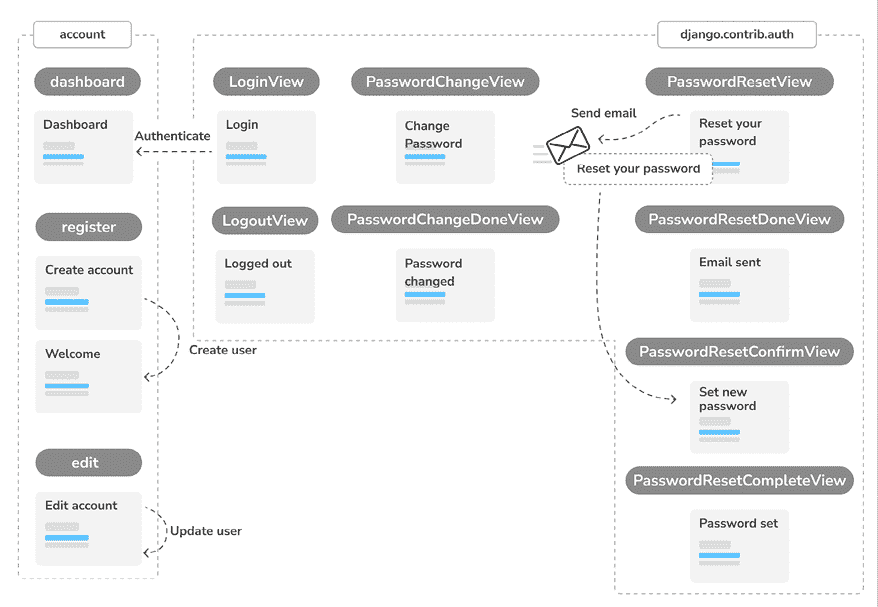
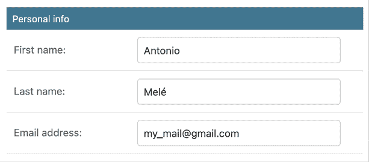
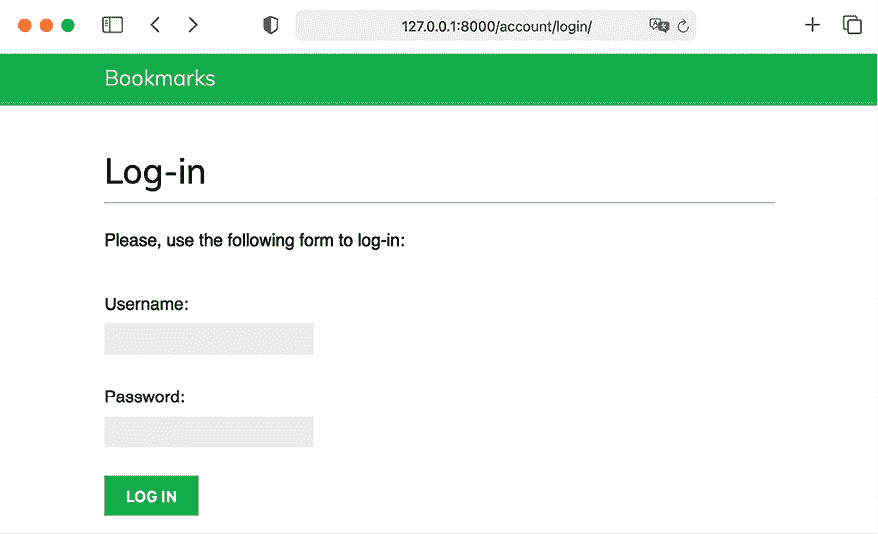
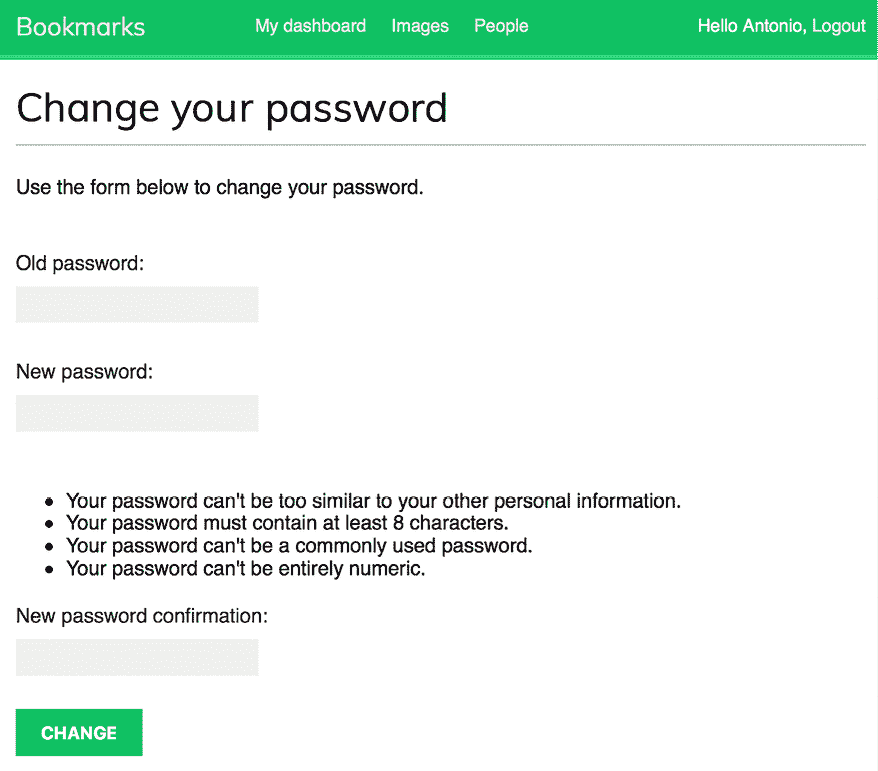
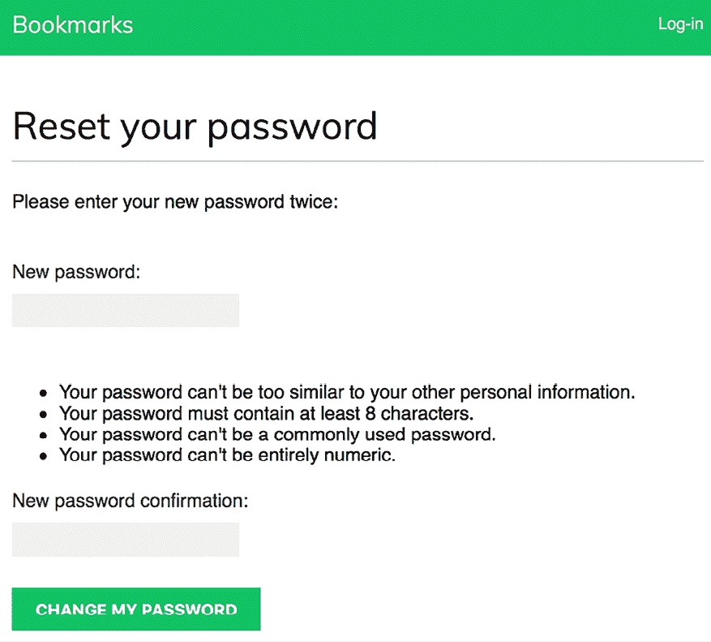
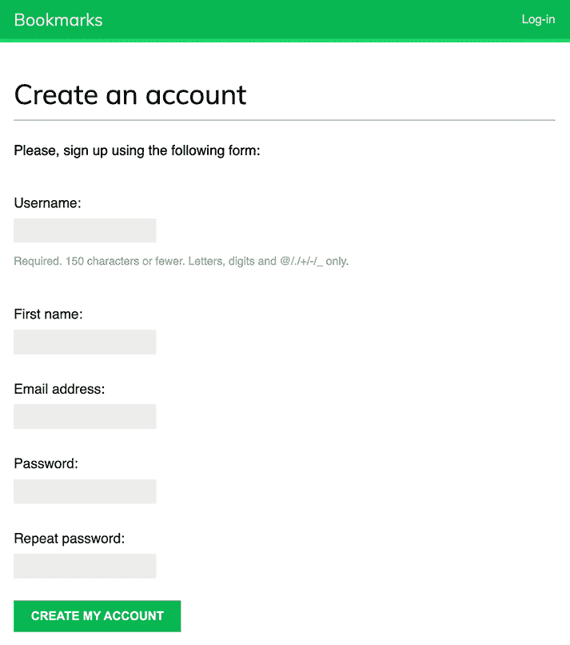
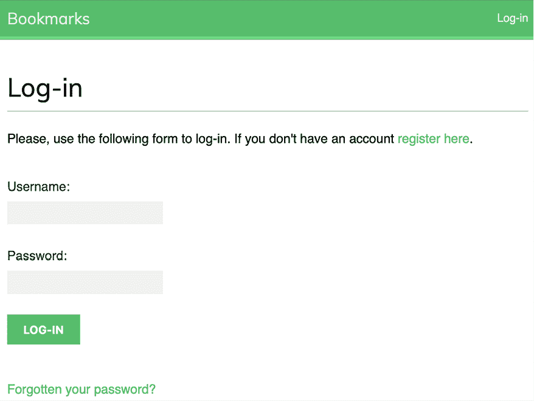
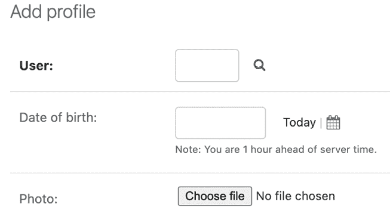
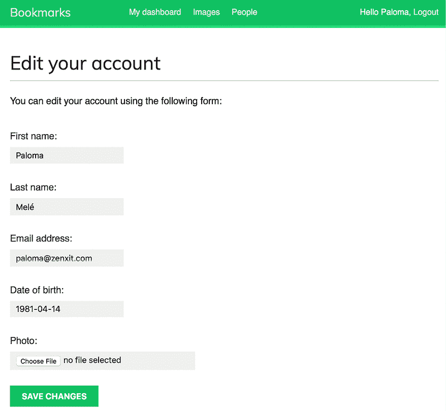

# 4

# 构建一个社交网站

在上一章中，你学习了如何实现标签系统以及如何推荐相似帖子。你实现了自定义模板标签和过滤器。你还学习了如何为你的网站创建网站地图和源，并使用 PostgreSQL 构建了一个全文搜索引擎。

在本章中，你将学习如何开发用户账户功能以创建一个社交网站，包括用户注册、密码管理、个人资料编辑和认证。我们将在接下来的几章中实现这个网站的社会功能，让用户分享图片并相互互动。用户将能够将任何互联网上的图片添加到书签并与其他用户分享。他们还将能够看到他们关注的用户在平台上的活动，以及他们喜欢/不喜欢他们分享的图片。

本章将涵盖以下主题：

+   创建登录视图

+   使用 Django 认证框架

+   为 Django 登录、注销、密码更改和密码重置视图创建模板

+   创建用户注册视图

+   使用自定义个人资料模型扩展用户模型

+   配置项目以支持媒体文件上传

# 功能概述

*图 4.1*展示了本章将要构建的视图、模板和功能：



图 4.1：第四章中构建的功能图

在本章中，你将创建一个新的项目，并使用 Django 在`django.contrib.auth`包中提供的登录、注销、密码更改和密码恢复视图。你将为认证视图创建模板，并创建一个`dashboard`视图，用户在成功认证后可以访问。你将使用`register`视图实现用户注册。最后，你将通过自定义`Profile`模型扩展用户模型，并创建`edit`视图以允许用户编辑他们的个人资料。

本章的源代码可以在[`github.com/PacktPublishing/Django-5-by-example/tree/main/Chapter04`](https://github.com/PacktPublishing/Django-5-by-example/tree/main/Chapter04)找到。

本章中使用的所有 Python 包都包含在章节源代码中的`requirements.txt`文件中。你可以按照以下章节中的说明安装每个 Python 包，或者你可以使用命令`python -m pip install -r requirements.txt`一次性安装所有需求。

# 创建一个社交网站项目

我们将创建一个社交应用程序，允许用户分享他们在互联网上找到的图片。这个项目是相关的，因为它将帮助你了解如何将社交功能集成到你的网站中，以及如何使用 Django 和 JavaScript 实现高级功能。

对于我们的图片分享网站，我们需要构建以下元素：

+   一个用户注册、登录、编辑个人资料、更改或重置密码的认证系统

+   社交认证，使用 Google 等服务登录

+   显示共享图片的功能以及一个系统，允许用户从任何网站分享图片

+   一个活动流，允许用户查看他们关注的用户上传的内容

+   一个关注系统，允许用户在网站上相互关注

本章将解决列表上的第一个问题。其余的问题将在第五章到第七章中介绍。

## 开始社交网站项目

我们将首先为项目设置虚拟环境并创建初始项目结构。

打开终端并使用以下命令为您的项目创建虚拟环境：

```py
mkdir env
python -m venv env/bookmarks 
```

如果您使用的是 Linux 或 macOS，请运行以下命令以激活您的虚拟环境：

```py
source env/bookmarks/bin/activate 
```

如果您使用的是 Windows，请使用以下命令代替：

```py
.\env\bookmarks\Scripts\activate 
```

壳提示将显示您的活动虚拟环境，如下所示：

```py
(bookmarks)laptop:~ zenx$ 
```

使用以下命令在您的虚拟环境中安装 Django：

```py
python -m pip install Django~=5.0.4 
```

运行以下命令以创建一个新的项目：

```py
django-admin startproject bookmarks 
```

初始项目结构已创建。使用以下命令进入您的项目目录并创建一个名为 `account` 的新应用程序：

```py
cd bookmarks/
django-admin startapp account 
```

请记住，您应该通过将应用程序的名称添加到 `settings.py` 文件中的 `INSTALLED_APPS` 设置中来将新应用程序添加到您的项目中。

编辑 `settings.py` 并在 `INSTALLED_APPS` 列表中添加以下加粗行，在所有其他已安装的应用程序之前：

```py
INSTALLED_APPS = [
**'account.apps.AccountConfig'****,**
'django.contrib.admin',
    'django.contrib.auth',
    'django.contrib.contenttypes',
    'django.contrib.sessions',
    'django.contrib.messages',
    'django.contrib.staticfiles',
] 
```

Django 按照在 `INSTALLED_APPS` 设置中出现的顺序在应用程序模板目录中查找模板。`django.contrib.admin` 应用包含标准认证模板，我们将在 `account` 应用中覆盖这些模板。通常，我们将自己的应用程序放在列表的末尾。在这种情况下，我们将应用程序放在 `INSTALLED_APPS` 设置的第一位，以确保我们的自定义认证模板将被使用，而不是 `django.contrib.admin` 中包含的认证模板。

运行以下命令以将数据库与 `INSTALLED_APPS` 设置中包含的默认应用程序的模型同步：

```py
python manage.py migrate 
```

您将看到所有初始 Django 数据库迁移都将应用。对应于已安装应用程序的 Django 模型的数据库表已创建。接下来，我们将使用 Django 认证框架将认证系统构建到我们的项目中。

# 使用 Django 认证框架

Django 内置了认证框架，可以处理用户认证、会话、权限和用户组。认证系统包括用于常见用户操作的视图，如登录、登出、密码更改和密码重置。

认证框架位于`django.contrib.auth`，并被其他 Django `contrib`包使用。请记住，我们在*第一章*，*构建博客应用*中已经使用了认证框架来为博客应用创建一个超级用户，以便访问管理站点。

当我们使用`startproject`命令创建一个新的 Django 项目时，认证框架包含在我们项目的默认设置中。它由`django.contrib.auth`应用和位于我们项目`MIDDLEWARE`设置中的以下两个中间件类组成：

+   `AuthenticationMiddleware`：使用会话将用户与请求关联

+   `SessionMiddleware`：处理请求之间的当前会话

中间件是具有在请求或响应阶段全局执行的方法的类。您将在本书的多个地方使用中间件类，您将在*第十七章*，*上线*中学习如何创建自定义中间件。

认证框架还包括以下模型，这些模型在`django.contrib.auth.models`中定义：

+   `User`：一个具有基本字段的用户模型；此模型的主要字段是`username`、`password`、`email`、`first_name`、`last_name`和`is_active`

+   `Group`：一个用于对用户进行分类的用户组模型

+   `Permission`：为用户或组执行某些操作的标志

该框架还包括默认的认证视图和表单，您将在稍后使用。

## 创建登录视图

我们将使用 Django 认证框架开始本节，允许用户登录网站。我们将创建一个视图，执行以下操作以登录用户：

1.  向用户展示登录表单

1.  获取用户在提交表单时提供的用户名和密码

1.  将用户与数据库中存储的数据进行认证

1.  检查用户是否活跃

1.  将用户登录到网站并启动一个认证会话

我们将首先创建登录表单。

在`account`应用目录中创建一个新的`forms.py`文件，并向其中添加以下行：

```py
from django import forms
class LoginForm(forms.Form):
    username = forms.CharField()
    password = forms.CharField(widget=forms.PasswordInput) 
```

此表单将用于对数据库中的用户进行认证。`PasswordInput`小部件用于渲染`password` HTML 元素。这将包括`type="password"`在 HTML 中，以便浏览器将其视为密码输入。

编辑`account`应用的`views.py`文件，并向其中添加以下代码：

```py
from django.contrib.auth import authenticate, login
from django.http import HttpResponse
from django.shortcuts import render
from .forms import LoginForm
def user_login(request):
    if request.method == 'POST':
        form = LoginForm(request.POST)
        if form.is_valid():
            cd = form.cleaned_data
            user = authenticate(
                request,
                username=cd['username'],
                password=cd['password']
            )
            if user is not None:
                if user.is_active:
                    login(request, user)
                    return HttpResponse('Authenticated successfully')
                else:
                    return HttpResponse('Disabled account')
            else:
                return HttpResponse('Invalid login')
    else:
        form = LoginForm()
    return render(request, 'account/login.html', {'form': form}) 
```

这是基本登录视图所执行的操作：

当使用`GET`请求调用`user_login`视图时，将使用`form = LoginForm()`实例化一个新的登录表单。然后，该表单被传递到模板中。

当用户通过`POST`提交表单时，将执行以下操作：

使用`form = LoginForm(request.POST)`使用提交的数据实例化表单。

使用`form.is_valid()`对表单进行验证。如果它无效，表单错误将在模板中稍后显示（例如，如果用户没有填写其中一个字段）。

如果提交的数据有效，则使用`authenticate()`方法对数据库中的用户进行认证。此方法接受`request`对象、`username`和`password`参数，如果用户成功认证，则返回`User`对象，否则返回`None`。如果用户未成功认证，则返回一个包含**无效登录**消息的原始`HttpResponse`。

如果用户成功认证，通过访问`is_active`属性检查用户状态。这是 Django 用户模型的一个属性。如果用户不是活跃的，则返回一个包含**账户已禁用**消息的`HttpResponse`。

如果用户是活跃的，用户将登录到网站。通过调用`login()`方法将用户设置在会话中。返回一个**认证成功**的消息。

注意`authenticate()`和`login()`之间的区别：`authenticate()`验证用户的凭据，并在验证通过后返回代表已验证用户的`User`对象。相比之下，`login()`通过将已验证的`User`对象纳入当前会话上下文中，将用户设置在当前会话中。

现在，我们将为这个视图创建一个 URL 模式：

在`account`应用程序目录中创建一个新的`urls.py`文件，并向其中添加以下代码：

```py
from django.urls import path
from . import views
urlpatterns = [
    path('login/', views.user_login, name='login'),
] 
```

编辑位于你的`bookmarks`项目目录中的主`urls.py`文件，导入`include`，并添加`account`应用程序的 URL 模式，如下所示。新的代码以粗体显示：

```py
from django.contrib import admin
from django.urls import **include,** path
urlpatterns = [
    path('admin/', admin.site.urls),
    **path(****'account/'****, include(****'account.urls'****)),**
] 
```

现在可以通过 URL 访问登录视图。

让我们为这个视图创建一个模板。由于项目中还没有模板，我们将首先创建一个基础模板，该模板将被登录模板扩展：

在`account`应用程序目录内创建以下文件和目录：

```py
templates/
    account/
        login.html
    base.html 
```

编辑`base.html`模板，并向其中添加以下代码：

```py

<!DOCTYPE html>
<html>
<head>
<title></title>
<link href="" rel="stylesheet">
</head>
<body>
<div id="header">
<span class="logo">Bookmarks</span>
</div>
<div id="content">
    
    
  </div>
</body>
</html> 
```

这将是网站的基模板。就像你在上一个项目中做的那样，在主模板中包含 CSS 样式。你可以在本章的代码中找到这些静态文件。将章节源代码中的`account`应用程序的`static/`目录复制到你的项目中的相同位置，以便你可以使用静态文件。你可以在这个目录的[`github.com/PacktPublishing/Django-5-by-Example/tree/master/Chapter04/bookmarks/account/static`](https://github.com/PacktPublishing/Django-5-by-Example/tree/master/Chapter04/bookmarks/account/static)找到目录内容。

基模板定义了一个`title`块和一个`content`块，这些块可以通过扩展它的模板填充内容。

让我们填写登录表单的模板。

打开`account/login.html`模板，并向其中添加以下代码：

```py

Log-in

  <h1>Log-in</h1>
<p>Please, use the following form to log-in:</p>
<form method="post">
    {{ form.as_p }}
    
    <p><input type="submit" value="Log in"></p>
</form>
 
```

此模板包括在视图中实例化的表单。由于您的表单将通过`POST`提交，因此您将包括``模板标签以进行**跨站请求伪造**（**CSRF**）保护。您在*第二章*，*通过高级功能增强您的博客*中学习了 CSRF 保护。

数据库中还没有用户。您需要首先创建一个超级用户，以便访问管理站点来管理其他用户。

在 shell 提示符中执行以下命令：

```py
python manage.py createsuperuser 
```

您将看到以下输出。按照以下方式输入您想要的用户名、电子邮件和密码：

```py
Username (leave blank to use 'admin'): admin
Email address: admin@admin.com
Password: ********
Password (again): ******** 
```

然后，您将看到以下成功消息：

```py
Superuser created successfully. 
```

使用以下命令运行开发服务器：

```py
python manage.py runserver 
```

在您的浏览器中打开`http://127.0.0.1:8000/admin/`。使用您刚刚创建的用户凭据访问管理站点。您将看到 Django 管理站点，包括 Django 认证框架的`User`和`Group`模型。

它看起来如下：


图 4.2：包括用户和组的 Django 管理站点索引页面

在**用户**行中，点击**添加**链接。

使用管理站点创建新用户如下：


图 4.3：Django 管理站点的添加用户表单

输入用户详细信息并点击**保存**按钮以将新用户保存到数据库中。

然后，在**个人信息**中，按照以下方式填写**名字**、**姓氏**和**电子邮件地址**字段，然后点击**保存**按钮以保存更改：



图 4.4：Django 管理站点的用户编辑表单

在您的浏览器中打开`http://127.0.0.1:8000/account/login/`。您应该看到渲染的模板，包括登录表单：



图 4.5：用户登录页面

输入无效凭据并提交表单。您应该得到以下**无效登录**响应：


图 4.6：无效登录的纯文本响应

输入有效凭据；您将得到以下**认证成功**响应：


图 4.7：成功的认证纯文本响应

现在，您已经学会了如何认证用户并创建自己的认证视图。您可以构建自己的认证视图，但 Django 提供了现成的认证视图，您可以利用它们。

## 使用 Django 的内置认证视图

Django 在认证框架中包含了几种表单和视图，您可以直接使用。我们创建的登录视图是一个很好的练习，可以帮助您理解 Django 中用户认证的过程。然而，在大多数情况下，您可以使用默认的 Django 认证视图。

Django 提供了以下基于类的视图来处理认证。所有这些视图都位于`django.contrib.auth.views`：

+   `LoginView`: 处理登录表单并登录用户

+   `LogoutView`: 注销用户

Django 提供了以下视图来处理密码更改：

+   `PasswordChangeView`: 处理更改用户密码的表单

+   `PasswordChangeDoneView`: 用户在成功更改密码后将被重定向到的成功视图

Django 还包括以下视图，以允许用户重置他们的密码：

+   `PasswordResetView`: 允许用户重置密码。它生成一个一次性使用的链接并发送到用户的电子邮件账户

+   `PasswordResetDoneView`: 告诉用户已向他们发送了一封电子邮件——包括重置密码的链接

+   `PasswordResetConfirmView`: 允许用户设置新密码

+   `PasswordResetCompleteView`: 用户成功重置密码后将被重定向到的成功视图

这些视图在构建任何带有用户账户的 Web 应用时可以为您节省大量时间。这些视图使用默认值，这些值可以被覆盖，例如要渲染的模板的位置或视图使用的表单。

您可以在[`docs.djangoproject.com/en/5.0/topics/auth/default/#all-authentication-views`](https://docs.djangoproject.com/en/5.0/topics/auth/default/#all-authentication-views)了解更多关于内置认证视图的信息。

## 登录和注销视图

要了解如何使用 Django 的认证视图，我们将用 Django 的内置等价视图替换我们的自定义登录视图，并集成一个注销视图。

编辑`account`应用的`urls.py`文件，并添加以下加粗代码：

```py
**from** **django.contrib.auth** **import** **views** **as** **auth_views**
from django.urls import path
from . import views
urlpatterns = [
**# previous login url**
**#** path('login/', views.user_login, name='login'),
**# login / logout urls**
 **path(****'login/'****, auth_views.LoginView.as_view(), name=****'login'****),**
 **path(****'logout/'****, auth_views.LogoutView.as_view(), name=****'logout'****),**
] 
```

在前面的代码中，我们已注释掉我们之前创建的`user_login`视图的 URL 模式。现在我们将使用 Django 认证框架的`LoginView`视图。我们还添加了一个`LogoutView`视图的 URL 模式。

在`account`应用的`templates/`目录内创建一个新的目录，命名为`registration`。这是 Django 认证视图默认期望您的认证模板所在的路径。

`django.contrib.admin`模块包括用于管理站点的认证模板，如登录模板。通过在配置项目时将`account`应用放置在`INSTALLED_APPS`设置的顶部，我们确保 Django 将使用我们的认证模板而不是任何其他应用中定义的模板。

在`templates/registration/`目录内创建一个新的文件，命名为`login.html`，并将以下代码添加到其中：

```py

Log-in

  <h1>Log-in</h1>
  
    <p>
      Your username and password didn't match.
      Please try again.
    </p>
  
    <p>Please, use the following form to log-in:</p>
  
  <div class="login-form">
<form action="" method="post">
      {{ form.as_p }}
      
      <input type="hidden" name="next" value="{{ next }}" />
<p><input type="submit" value="Log-in"></p>
</form>
</div>
 
```

这个登录模板与我们之前创建的模板非常相似。Django 默认使用位于`django.contrib.auth.forms`的`AuthenticationForm`表单。此表单尝试验证用户，如果登录失败，则引发验证错误。我们在模板中使用``来检查提供的凭据是否错误。

我们添加了一个隐藏的 HTML `<input>`元素来提交名为`next`的变量的值。如果你在请求中传递一个名为`next`的参数，这个变量就会提供给登录视图，例如，通过访问`http://127.0.0.1:8000/account/login/?next=/account/`。

`next`参数必须是一个 URL。如果提供了此参数，Django 登录视图将在登录成功后将用户重定向到指定的 URL。

现在，在`templates/registration/`目录内创建一个名为`logged_out.html`的模板，并使其看起来像这样：

```py

Logged out

  <h1>Logged out</h1>
<p>
    You have been successfully logged out.
    You can <a href="">log-in again</a>.
  </p>
 
```

这是用户登出后 Django 将显示的模板。

我们为登录和注销视图添加了 URL 模式和模板。现在，用户可以使用 Django 的认证视图登录和注销。

现在，我们将创建一个新的视图来在用户登录账户时显示仪表板。

编辑`account`应用的`views.py`文件，并向其中添加以下代码：

```py
from django.contrib.auth.decorators import login_required
@login_required
def dashboard(request):
    return render(
 request,
 'account/dashboard.html',
 {'section': 'dashboard'}
 ) 
```

我们创建了`dashboard`视图，并将其应用于认证框架的`login_required`装饰器。`login_required`装饰器检查当前用户是否已认证。

如果用户已认证，它将执行装饰过的视图；如果用户未认证，它将重定向用户到登录 URL，并将最初请求的 URL 作为名为`next`的`GET`参数。

通过这样做，登录视图将用户重定向到他们成功登录后尝试访问的 URL。记住，我们在登录模板中添加了一个名为`next`的隐藏`<input>` HTML 元素来达到这个目的。

我们还定义了一个`section`变量。我们将使用这个变量来突出显示网站主菜单中的当前部分。

接下来，我们需要为仪表板视图创建一个模板。

在`templates/account/`目录内创建一个新文件，并将其命名为`dashboard.html`。向其中添加以下代码：

```py

Dashboard

  <h1>Dashboard</h1>
<p>Welcome to your dashboard.</p>
 
```

编辑`account`应用的`urls.py`文件，并为视图添加以下 URL 模式。新的代码以粗体显示：

```py
urlpatterns = [
    # previous login url
# path('login/', views.user_login, name='login'),
# login / logout urls
    path('login/', auth_views.LoginView.as_view(), name='login'),
    path('logout/', auth_views.LogoutView.as_view(), name='logout'),
 **path(****''****, views.dashboard, name=****'dashboard'****),**
] 
```

编辑项目的`settings.py`文件，并向其中添加以下代码：

```py
LOGIN_REDIRECT_URL = 'dashboard'
LOGIN_URL = 'login'
LOGOUT_URL = 'logout' 
```

我们定义了以下设置：

+   `LOGIN_REDIRECT_URL`：告诉 Django 在请求中没有`next`参数时，登录成功后要将用户重定向到哪个 URL

+   `LOGIN_URL`：重定向用户登录的 URL（例如，使用`login_required`装饰器的视图）

+   `LOGOUT_URL`：重定向用户注销的 URL

我们在 URL 模式中使用了之前定义的 URL 的`name`属性。也可以使用硬编码的 URL 而不是 URL 名称来设置这些参数。

让我们总结一下到目前为止我们所做的工作：

+   我们将内置的 Django 认证登录和注销视图添加到了项目中。

+   我们为两个视图创建了自定义模板，并定义了一个简单的仪表板视图，用于用户登录后重定向。

+   最后，我们为 Django 添加了默认使用这些 URL 的设置。

现在，我们将向基本模板添加一个指向登录 URL 的链接和一个注销按钮。为了做到这一点，我们必须确定当前用户是否已登录，以便为每种情况显示适当的操作。当前用户由认证中间件设置在`HttpRequest`对象中。你可以通过`request.user`访问它。即使用户未认证，`request`对象也包含一个`User`对象。检查当前用户是否认证的最佳方式是通过访问只读属性`is_authenticated`。

通过添加以下加粗的行来编辑`templates/base.html`模板：

```py

<!DOCTYPE html>
<html>
<head>
<title></title>
<link href="" rel="stylesheet">
</head>
<body>
<div id="header">
<span class="logo">Bookmarks</span>
 ****
**<****ul****class****=****"menu"****>**
**<****li** ******class****=****"selected"****>**
**<****a****href****=****"">****My dashboard****</****a****>**
**</****li****>**
**<****li** ******class****=****"selected"****>**
**<****a****href****=****"#"****>****Images****</****a****>**
**</****li****>**
**<****li** ******class****=****"selected"****>**
**<****a****href****=****"#"****>****People****</****a****>**
**</****li****>**
**</****ul****>**
 ****
**<****span****class****=****"user"****>**
 ****
 **Hello {{ request.user.first_name|default:request.user.username }},**
**<****form****action****=****""** **method****=****"post"****>**
**<****button****type****=****"submit"****>****Logout****</****button****>**
 ****
**</****form****>**
 ****
**<****a****href****=****"">****Log-in****</****a****>**
 ****
**</****span****>**
</div>
<div id="content">
    
    
  </div>
</body>
</html> 
```

网站的菜单只对认证用户显示。检查`section`变量以向当前部分的菜单`<li>`列表项添加`selected`类属性。这样做，与当前部分对应的菜单项将通过 CSS 突出显示。如果用户已认证，将显示用户的姓名和一个注销按钮；否则，将显示一个登录链接。如果用户的姓名为空，则使用`request.user.first_name|default:request.user.username`显示用户名。请注意，对于注销操作，我们使用方法为`POST`的表单和一个提交表单的按钮。这是因为`LogoutView`需要`POST`请求。

在你的浏览器中打开`http://127.0.0.1:8000/account/login/`。你应该看到**登录**页面。输入有效的用户名和密码，然后点击**登录**按钮。你应该看到以下屏幕：


图 4.8：仪表板页面

**我的仪表板**菜单项通过 CSS 突出显示，因为它有一个`selected`类。由于用户已认证，用户的姓名现在显示在页眉的右侧。点击**注销**按钮。你应该看到以下页面：


图 4.9：注销页面

在这个页面上，你可以看到用户已经注销，因此，网站菜单没有显示。页眉右侧现在显示的是**登录**链接。

如果你看到的是 Django 管理网站的**注销**页面而不是你自己的**注销**页面，请检查你项目的`INSTALLED_APPS`设置，并确保`django.contrib.admin`在`account`应用之后。这两个应用都包含位于相同相对路径的注销模板。Django 模板加载器会遍历`INSTALLED_APPS`列表中的不同应用，并使用它找到的第一个模板。

## 修改密码视图

我们需要用户在登录网站后能够更改他们的密码。我们将集成 Django 认证视图来更改密码。

打开 `account` 应用的 `urls.py` 文件，并添加以下加粗的 URL 模式：

```py
urlpatterns = [
    # previous login url
# path('login/', views.user_login, name='login'),
# login / logout urls
    path('login/', auth_views.LoginView.as_view(), name='login'),
    path('logout/', auth_views.LogoutView.as_view(), name='logout'),
**# change password urls**
 **path(**
**'password-change/'****,**
 **auth_views.PasswordChangeView.as_view(),**
 **name=****'password_change'**
 **),**
 **path(**
**'password-change/done/'****,**
 **auth_views.PasswordChangeDoneView.as_view(),**
 **name=****'password_change_done'**
 **),**
    path('', views.dashboard, name='dashboard'),
] 
```

`PasswordChangeView` 视图将处理更改密码的表单，而 `PasswordChangeDoneView` 视图将在用户成功更改密码后显示成功消息。让我们为每个视图创建一个模板。

在 `account` 应用的 `templates/registration/` 目录内添加一个新文件，并将其命名为 `password_change_form.html`。向其中添加以下代码：

```py

Change your password

  <h1>Change your password</h1>
<p>Use the form below to change your password.</p>
<form method="post">
    {{ form.as_p }}
    <p><input type="submit" value="Change"></p>
    
  </form>
 
```

`password_change_form.html` 模板包含了更改密码的表单。

现在，在同一个目录下创建另一个文件，并将其命名为 `password_change_done.html`。向其中添加以下代码：

```py

Password changed

  <h1>Password changed</h1>
<p>Your password has been successfully changed.</p>
 
```

`password_change_done.html` 模板仅包含当用户成功更改密码时显示的成功消息。

在浏览器中打开 `http://127.0.0.1:8000/account/password-change/`。如果您未登录，浏览器将重定向到 **登录** 页面。成功认证后，您将看到以下更改密码页面：



图 4.10：更改密码表单

使用您当前密码和新密码填写表单，然后点击 **更改** 按钮。您将看到以下成功页面：


图 4.11：成功更改密码页面

使用新密码注销并重新登录，以验证一切是否按预期工作。

## 重置密码视图

如果用户忘记密码，他们应该能够恢复账户。我们将实现密码重置功能。这将使用户能够通过接收包含安全链接的密码重置电子邮件来恢复对账户的访问，该链接使用唯一的令牌生成，允许他们创建新密码。

编辑 `account` 应用的 `urls.py` 文件，并添加以下加粗的 URL 模式：

```py
urlpatterns = [
    # previous login url
# path('login/', views.user_login, name='login'),
# login / logout urls
    path('login/', auth_views.LoginView.as_view(), name='login'),
    path('logout/', auth_views.LogoutView.as_view(), name='logout'),

    # change password urls
    path(
        'password-change/',
        auth_views.PasswordChangeView.as_view(),
        name='password_change'
 ),
    path(
        'password-change/done/',
        auth_views.PasswordChangeDoneView.as_view(),
        name='password_change_done'
 ),
**# reset password urls**
 **path(**
**'password-reset/'****,**
 **auth_views.PasswordResetView.as_view(),**
 **name=****'password_reset'**
 **),**
 **path(**
**'password-reset/done/'****,**
 **auth_views.PasswordResetDoneView.as_view(),**
 **name=****'password_reset_done'**
 **),**
 **path(**
**'****password-reset/<uidb64>/<token>/'****,**
 **auth_views.PasswordResetConfirmView.as_view(),**
 **name=****'password_reset_confirm'**
 **),**
 **path(****'password-reset/complete/'****,**
 **auth_views.PasswordResetCompleteView.as_view(),**
 **name=****'password_reset_complete'**
 **),**
    path('', views.dashboard, name='dashboard'),
] 
```

在 `account` 应用的 `templates/registration/` 目录中添加一个新文件，并将其命名为 `password_reset_form.html`。向其中添加以下代码：

```py

Reset your password

  <h1>Forgotten your password?</h1>
<p>Enter your e-mail address to obtain a new password.</p>
<form method="post">
    {{ form.as_p }}
    <p><input type="submit" value="Send e-mail"></p>
    
  </form>
 
```

现在，在同一个目录下创建另一个文件，并将其命名为 `password_reset_email.html`。向其中添加以下代码：

```py
Someone asked for password reset for email {{ email }}. Follow the link below:
{{ protocol }}://{{ domain }}
Your username, in case you've forgotten: {{ user.get_username }} 
```

`password_reset_email.html` 模板将用于渲染发送给用户以重置密码的电子邮件。它包含一个由视图生成的重置令牌。

在同一个目录下创建另一个文件，并将其命名为 `password_reset_done.html`。向其中添加以下代码：

```py

Reset your password

  <h1>Reset your password</h1>
<p>We've emailed you instructions for setting your password.</p>
<p>If you don't receive an email, please make sure you've entered the address you registered with.</p>
 
```

在同一个目录中创建另一个模板，并将其命名为 `password_reset_confirm.html`。向其中添加以下代码：

```py

Reset your password

  <h1>Reset your password</h1>
  
    <p>Please enter your new password twice:</p>
<form method="post">
      {{ form.as_p }}
      
      <p><input type="submit" value="Change my password" /></p>
</form>
  
    <p>The password reset link was invalid, possibly because it has already been used. Please request a new password reset.</p>
  
 
```

在此模板中，我们通过检查 `validlink` 变量来确认重置密码链接的有效性。`PasswordResetConfirmView` 视图检查 URL 中提供的令牌的有效性，并将 `validlink` 变量传递给模板。如果链接有效，则显示用户密码重置表单。用户只有拥有有效的重置密码链接才能设置新密码。

创建另一个模板，并将其命名为 `password_reset_complete.html`。将以下代码输入其中：

```py

Password reset

  <h1>Password set</h1>
<p>Your password has been set. You can <a href="">log in now</a></p>
 
```

最后，编辑 `account` 应用程序的 `registration/login.html` 模板，并添加以下加粗的行：

```py

Log-in

  <h1>Log-in</h1>
  
    <p>
      Your username and password didn't match.
      Please try again.
    </p>
  
    <p>Please, use the following form to log-in:</p>
  
  <div class="login-form">
<form action="" method="post">
      {{ form.as_p }}
      
      <input type="hidden" name="next" value="{{ next }}" />
<p><input type="submit" value="Log-in"></p>
</form>
**<****p****>**
**<****a****href****=****"">**
 **Forgotten your password?**
**</****a****>**
**</****p****>**
</div>
 
```

现在，在你的浏览器中打开 `http://127.0.0.1:8000/account/login/`。登录页面现在应该包含一个指向重置密码页面的链接，如下所示：


图 4.12：登录页面，包括重置密码页面的链接

点击 **忘记密码？** 链接。你应该看到以下页面：


图 4.13：恢复密码表单

在这一点上，我们需要将一个 **简单邮件传输协议**（**SMTP**）配置添加到你的项目中的 `settings.py` 文件，以便 Django 能够发送电子邮件。你已经在 *第二章*，*通过高级功能增强你的博客* 中学习了如何将电子邮件设置添加到你的项目中。然而，在开发过程中，你可以配置 Django 将电子邮件写入标准输出而不是通过 SMTP 服务器发送。Django 提供了一个电子邮件后端，可以将电子邮件写入控制台。

编辑你的项目中的 `settings.py` 文件，并向其中添加以下行：

```py
EMAIL_BACKEND = 'django.core.mail.backends.console.EmailBackend' 
```

`EMAIL_BACKEND` 设置指示将用于发送电子邮件的类。

返回浏览器，输入现有用户的电子邮件地址，然后点击 **发送电子邮件** 按钮。你应该看到以下页面：


图 4.14：发送重置密码电子邮件的页面

查看运行开发服务器的 shell 提示符。你会看到生成的电子邮件，如下所示：

```py
Content-Type: text/plain; charset="utf-8"
MIME-Version: 1.0
Content-Transfer-Encoding: 7bit
Subject: Password reset on 127.0.0.1:8000
From: webmaster@localhost
To: test@gmail.com
Date: Mon, 10 Jan 2024 19:05:18 -0000
Message-ID: <162896791878.58862.14771487060402279558@MBP-amele.local>
Someone asked for password reset for email test@gmail.com. Follow the link below:
http://127.0.0.1:8000/account/password-reset/MQ/ardx0u-b4973cfa2c70d652a190e79054bc479a/
Your username, in case you've forgotten: test 
```

该电子邮件使用你之前创建的 `password_reset_email.html` 模板进行渲染。重置密码的 URL 包含 Django 动态生成的令牌。

从电子邮件中复制 URL，它应该类似于 `http://127.0.0.1:8000/account/password-reset/MQ/ardx0u-b4973cfa2c70d652a190e79054bc479a/`，并在浏览器中打开它。你应该看到以下页面：



图 4.15：重置密码表单

设置新密码的页面使用 `password_reset_confirm.html` 模板。填写新密码并点击 **更改我的密码** 按钮。

Django 将创建一个新的哈希密码并将其保存在数据库中。你将看到以下成功页面：


图 4.16：密码重置成功的页面

现在，你可以使用新密码重新登录用户账户。

每个用于设置新密码的令牌只能使用一次。如果你再次打开你收到的链接，你会收到一个消息，说明令牌无效。

我们现在已将 Django 认证框架的视图集成到项目中。这些视图适用于大多数情况。然而，如果你需要不同的行为，你可以创建自己的视图。

Django 为认证视图提供了 URL 模式，这些模式与我们刚刚创建的模式等效。我们将用 Django 提供的 URL 模式替换认证 URL 模式。

将你添加到`account`应用`urls.py`文件中的认证 URL 模式注释掉，并包含`django.contrib.auth.urls`，如下所示。新的代码以粗体突出显示：

```py
from django.urls import **include,** path
from django.contrib.auth import views as auth_views
from . import views
urlpatterns = [
    # previous login view
# path('login/', views.user_login, name='login'),
**#** path('login/', auth_views.LoginView.as_view(), name='login'),
**#** path('logout/', auth_views.LogoutView.as_view(), name='logout'),
# change password urls
**#** path(
**#**     'password-change/',
**#**     auth_views.PasswordChangeView.as_view(),
**#**     name='password_change'
**#** ),
**#** path(
**#**     'password-change/done/',
**#**     auth_views.PasswordChangeDoneView.as_view(),
**#**     name='password_change_done'
**#** ),
# reset password urls
**#** path(
**#**     'password-reset/',
**#**     auth_views.PasswordResetView.as_view(),
**#**     name='password_reset'
**#** ),
**#** path(
**#**     'password-reset/done/',
**#**     auth_views.PasswordResetDoneView.as_view(),
**#**     name='password_reset_done'
**#** ),
**#** path(
**#**     'password-reset/<uidb64>/<token>/',
**#**     auth_views.PasswordResetConfirmView.as_view(),
**#**     name='password_reset_confirm'
**#** ),
**#** path(
**#**     'password-reset/complete/',
**#**     auth_views.PasswordResetCompleteView.as_view(),
**#**     name='password_reset_complete'
**#** ),
**path(****''****, include(****'django.contrib.auth.urls'****)),**
    path('', views.dashboard, name='dashboard'),
] 
```

你可以在[`github.com/django/django/blob/stable/5.0.x/django/contrib/auth/urls.py`](https://github.com/django/django/blob/stable/5.0.x/django/contrib/auth/urls.py)中看到包含的认证 URL 模式。

我们现在已将所有必要的认证视图添加到我们的项目中。接下来，我们将实现用户注册。

# 用户注册和用户资料

网站用户现在可以登录、登出、更改密码和重置密码。然而，我们需要构建一个视图，允许访客创建用户账户。他们应该能够在我们的网站上注册并创建个人资料。一旦注册，用户将能够使用他们的凭证登录我们的网站。

## 用户注册

让我们创建一个简单的视图，允许在您的网站上注册用户。最初，你必须创建一个表单，让用户输入用户名、他们的真实姓名和密码。

编辑位于`account`应用目录内的`forms.py`文件，并添加以下以粗体突出显示的行：

```py
from django import forms
**from** **django.contrib.auth** **import** **get_user_model**
class LoginForm(forms.Form):
    username = forms.CharField()
    password = forms.CharField(widget=forms.PasswordInput)
**class****UserRegistrationForm****(forms.ModelForm):**
 **password = forms.CharField(**
 **label=****'Password'****,**
 **widget=forms.PasswordInput**
 **)**
 **password2 = forms.CharField(**
 **label=****'Repeat password'****,**
 **widget=forms.PasswordInput**
 **)**
**class****Meta****:**
 **model = get_user_model()**
 **fields = [****'username'****,** **'first_name'****,** **'email'****]** 
```

我们为用户模型创建了一个表单。此表单包括用户模型的`username`、`first_name`和`email`字段。我们通过使用`auth`应用提供的`get_user_model()`函数动态检索用户模型。这检索了用户模型，它可能是一个自定义模型而不是默认的`auth` `User`模型，因为 Django 允许你定义自定义用户模型。这些字段将根据其对应模型字段的验证进行验证。例如，如果用户选择了一个已存在的用户名，他们将收到一个验证错误，因为`username`是一个定义为`unique=True`的字段。

为了保持代码的通用性，使用`get_user_model()`方法检索用户模型，并在定义模型与其的关系时使用`AUTH_USER_MODEL`设置来引用它，而不是直接引用`auth`用户模型。您可以在[`docs.djangoproject.com/en/5.0/topics/auth/customizing/#django.contrib.auth.get_user_model`](https://docs.djangoproject.com/en/5.0/topics/auth/customizing/#django.contrib.auth.get_user_model)了解更多信息。

我们还添加了两个额外的字段——`password`和`password2`——供用户设置密码并重复它。让我们添加字段验证来检查两个密码是否相同。

编辑`account`应用的`forms.py`文件，并在`UserRegistrationForm`类中添加以下`clean_password2()`方法。新的代码已加粗：

```py
class UserRegistrationForm(forms.ModelForm):
    password = forms.CharField(
        label='Password',
        widget=forms.PasswordInput
    )
    password2 = forms.CharField(
        label='Repeat password',
        widget=forms.PasswordInput
    )
    class Meta:
        model = get_user_model()
        fields = ['username', 'first_name', 'email']
**def****clean_password2****(****self****):**
 **cd = self.cleaned_data**
**if** **cd[****'password'****] != cd[****'password2'****]:**
**raise** **forms.ValidationError(****"Passwords don't match."****)**
**return** **cd[****'password2'****]** 
```

我们定义了一个`clean_password2()`方法来比较第二个密码与第一个密码，如果密码不匹配则引发验证错误。该方法在调用其`is_valid()`方法验证表单时执行。您可以为任何表单字段提供一个`clean_<fieldname>()`方法来清理值或为特定字段引发表单验证错误。表单还包括一个通用的`clean()`方法来验证整个表单，这对于验证相互依赖的字段非常有用。在这种情况下，我们使用特定字段的`clean_password2()`验证而不是覆盖表单的`clean()`方法。这避免了覆盖`ModelForm`从模型中设置的约束（例如，验证用户名是否唯一）获取的其他特定字段检查。

Django 还提供了一个位于`django.contrib.auth.forms`中的`UserCreationForm`表单，与我们创建的非常相似。

编辑`account`应用的`views.py`文件，并添加以下加粗的代码：

```py
from django.contrib.auth import authenticate, login
from django.contrib.auth.decorators import login_required
from django.http import HttpResponse
from django.shortcuts import render
from .forms import LoginForm**, UserRegistrationForm**
# ...
**def****register****(****request****):**
**if** **request.method ==** **'POST'****:**
 **user_form = UserRegistrationForm(request.POST)**
**if** **user_form.is_valid():**
**# Create a new user object but avoid saving it yet**
 **new_user = user_form.save(commit=****False****)**
**# Set the chosen password**
 **new_user.set_password(**
 **user_form.cleaned_data[****'password'****]**
 **)**
**# Save the User object**
 **new_user.save()**
**return** **render(**
**request,**
**'account/register_done.html'****,**
**{****'new_user'****: new_user}**
**)**
**else****:**
 **user_form = UserRegistrationForm()**
**return** **render(**
 **request,**
**'account/register.html'****,**
 **{****'user_form'****: user_form}**
 **)** 
```

创建用户账户的视图相当简单。出于安全考虑，我们不是保存用户输入的原始密码，而是使用用户模型的`set_password()`方法。该方法在将密码存储到数据库之前处理密码散列。

Django 不会存储明文密码；它存储的是散列密码。散列是将给定的密钥转换成另一个值的过程。散列函数用于根据数学算法生成一个固定长度的值。通过使用安全的算法散列密码，Django 确保存储在数据库中的用户密码需要大量的计算时间才能破解。

默认情况下，Django 使用`PBKDF2`散列算法和 SHA256 散列来存储所有密码。然而，Django 不仅支持检查使用`PBKDF2`散列的现有密码，还支持检查使用其他算法散列的存储密码，例如`PBKDF2SHA1`、`argon2`、`bcrypt`和`scrypt`。

`PASSWORD_HASHERS`设置定义了 Django 项目支持的密码哈希器。以下是默认的`PASSWORD_HASHERS`列表：

```py
PASSWORD_HASHERS = [
    'django.contrib.auth.hashers.PBKDF2PasswordHasher',
    'django.contrib.auth.hashers.PBKDF2SHA1PasswordHasher',
    'django.contrib.auth.hashers.Argon2PasswordHasher',
    'django.contrib.auth.hashers.BCryptSHA256PasswordHasher',
    'django.contrib.auth.hashers.ScryptPasswordHasher',
] 
```

Django 使用列表中的第一个条目（在本例中为`PBKDF2PasswordHasher`）来哈希所有密码。其余的哈希器可以被 Django 用来检查现有密码。

`scrypt`哈希器是在 Django 4.0 中引入的。它更安全，并且比`PBKDF2`推荐。然而，`PBKDF2`仍然是默认的哈希器，因为`scrypt`需要 OpenSSL 1.1+和更多的内存。

您可以在[`docs.djangoproject.com/en/5.0/topics/auth/passwords/`](https://docs.djangoproject.com/en/5.0/topics/auth/passwords/)了解更多关于 Django 如何存储密码以及包含的密码哈希器的信息。

现在，编辑`account`应用的`urls.py`文件并添加以下加粗的 URL 模式：

```py
urlpatterns = [
    # ...
    path('', include('django.contrib.auth.urls')),
    path('', views.dashboard, name='dashboard'),
    **path(****'register/'****, views.register, name=****'register'****),**
] 
```

最后，在`account`应用的`templates/account/`模板目录中创建一个新的模板，命名为`register.html`，并使其看起来如下：

```py

Create an account

  <h1>Create an account</h1>
<p>Please, sign up using the following form:</p>
<form method="post">
    {{ user_form.as_p }}
    
    <p><input type="submit" value="Create my account"></p>
</form>
 
```

在同一目录下创建一个额外的模板文件，并将其命名为`register_done.html`。向其中添加以下代码：

```py

Welcome

  <h1>Welcome {{ new_user.first_name }}!</h1>
<p>
    Your account has been successfully created.
    Now you can <a href="">log in</a>.
  </p>
 
```

在您的浏览器中打开 `http://127.0.0.1:8000/account/register/`。您将看到您创建的注册页面：



图 4.17：账户创建表单

填写新用户的详细信息并点击**创建我的账户**按钮。

如果所有字段都是有效的，用户将被创建，您将看到以下成功消息：


图 4.18：账户成功创建页面

点击**登录**链接并输入您的用户名和密码以验证您是否可以访问您新创建的账户。

让我们在登录模板中添加一个注册链接。编辑`registration/login.html`模板并找到以下行：

```py
<p>Please, use the following form to log-in:</p> 
```

用以下行替换它：

```py
<p>
  Please, use the following form to log-in.
  **If you don't have an account** **<****a****href****=****""****>****register here****</****a****>****.**
</p> 
```

在您的浏览器中打开 `http://127.0.0.1:8000/account/login/`。页面现在应该如下所示：



图 4.19：包含注册链接的登录页面

我们现在已将注册页面从**登录**页面中可访问。

## 扩展用户模型

虽然 Django 认证框架提供的用户模型对于大多数典型场景来说是足够的，但它确实有一组有限的预定义字段。如果您想捕获与您的应用程序相关的额外细节，您可能需要扩展默认的用户模型。例如，默认用户模型包含`first_name`和`last_name`字段，这种结构可能不符合各种国家的命名惯例。此外，您可能还想存储更多的用户详情或构建一个更全面的用户资料。

扩展用户模型的一个简单方法是通过创建一个包含与 Django 用户模型一对一关系的个人资料模型，以及任何额外的字段。一对一关系类似于具有`unique=True`参数的`ForeignKey`字段。关系的另一侧是与相关模型的一个隐式一对一关系，而不是多个元素的经理。从关系的每一侧，你可以访问一个相关的单个对象。

编辑你的`account`应用的`models.py`文件并添加以下以粗体突出显示的代码：

```py
from django.db import models
**from** **django.conf** **import** **settings**
**class****Profile****(models.Model):**
 **user = models.OneToOneField(**
 **settings.AUTH_USER_MODEL,**
 **on_delete=models.CASCADE**
 **)**
 **date_of_birth = models.DateField(blank=****True****, null=****True****)**
 **photo = models.ImageField(**
 **upload_to=****'users/%Y/%m/%d/'****,**
 **blank=****True**
 **)**
**def****__str__****(****self****):**
**return****f'Profile of** **{self.user.username}****'** 
```

我们的用户个人资料将包括用户的出生日期和用户的图片。

一对一的字段`user`将被用来将个人资料与用户关联。我们使用`AUTH_USER_MODEL`来引用用户模型，而不是直接指向`auth.User`模型。这使得我们的代码更加通用，因为它可以与自定义定义的用户模型一起操作。通过`on_delete=models.CASCADE`，我们强制在删除`User`对象时删除相关的`Profile`对象。

`date_of_birth`字段是一个`DateField`。我们通过`blank=True`使此字段为可选，并通过`null=True`允许`null`值。

`photo`字段是一个`ImageField`。我们通过`blank=True`使此字段为可选。`ImageField`字段管理图像文件的存储。它验证提供的文件是否为有效的图像，将图像文件存储在由`upload_to`参数指定的目录中，并将文件的相对路径存储在相关的数据库字段中。默认情况下，`ImageField`字段在数据库中转换为`VARCHAR(100)`列。如果值留空，将存储一个空字符串。

## 安装 Pillow 和托管媒体文件

我们需要安装 Pillow 库来管理图像。Pillow 是 Python 中图像处理的既定标准库。它支持多种图像格式，并提供强大的图像处理功能。Pillow 是 Django 处理带有`ImageField`的图像所必需的。

通过在 shell 提示符下运行以下命令来安装 Pillow：

```py
python -m pip install Pillow==10.3.0 
```

编辑项目的`settings.py`文件并添加以下行：

```py
MEDIA_URL = 'media/'
MEDIA_ROOT = BASE_DIR / 'media' 
```

这将使 Django 能够管理文件上传并托管媒体文件。`MEDIA_URL`是用于托管用户上传的媒体文件的基准 URL。`MEDIA_ROOT`是它们所在的本地路径。文件路径和 URL 是动态构建的，通过在它们前面添加项目路径或媒体 URL 来实现可移植性。

现在，编辑`bookmarks`项目的`urls.py`主文件并修改代码，如下所示。新的行以粗体突出显示：

```py
**from** **django.conf** **import** **settings**
**from** **django.conf.urls.static** **import** **static**
from django.contrib import admin
from django.urls import path, include
urlpatterns = [
    path('admin/', admin.site.urls),
    path('account/', include('account.urls')),
]
**if** **settings.DEBUG:**
 **urlpatterns += static(**
 **settings.MEDIA_URL,**
 **document_root=settings.MEDIA_ROOT**
 **)** 
```

我们已经添加了`static()`辅助函数，在开发期间（即当`DEBUG`设置设置为`True`时）通过 Django 开发服务器托管媒体文件。

`static()`辅助函数适合开发，但不适合生产使用。Django 在服务静态文件方面非常低效。永远不要在生产环境中使用 Django 来服务静态文件。您将在第十七章*上线*中学习如何在生产环境中服务静态文件。

## 为个人资料模型创建迁移

让我们为新的`Profile`模型创建数据库表。打开 shell 并运行以下命令以创建新模型的数据库迁移：

```py
python manage.py makemigrations 
```

您将得到以下输出：

```py
Migrations for 'account':
  account/migrations/0001_initial.py
    - Create model Profile 
```

接下来，使用以下命令在 shell 提示符中同步数据库：

```py
python manage.py migrate 
```

您将看到包括以下行的输出：

```py
Applying account.0001_initial... OK 
```

编辑`account`应用的`admin.py`文件，并在管理网站上通过添加加粗的代码来注册`Profile`模型：

```py
from django.contrib import admin
**from** **.models** **import** **Profile**
**@admin.register(****Profile****)**
**class****ProfileAdmin****(admin.ModelAdmin):**
 **list_display = [****'user'****,** **'date_of_birth'****,** **'photo'****]**
 **raw_id_fields = [****'user'****]** 
```

使用以下命令从 shell 提示符运行开发服务器：

```py
python manage.py runserver 
```

在您的浏览器中打开`http://127.0.0.1:8000/admin/`。现在，您应该能够在您项目的管理网站上看到`Profile`模型，如下所示：


图 4.20：管理网站索引页面上的 ACCOUNT 块

点击**个人资料**行的**添加**链接。您将看到以下表单以添加新的个人资料：



图 4.21：添加个人资料表单

手动为数据库中现有的每个用户创建一个`Profile`对象。

接下来，我们将允许用户在网站上编辑他们的个人资料。

编辑`account`应用的`forms.py`文件，并添加以下加粗的行：

```py
# ...
**from** **.models** **import** **Profile**
# ...
**class****UserEditForm****(forms.ModelForm):**
**class****Meta****:**
 **model = get_user_model()**
 **fields = [****'first_name'****,** **'last_name'****,** **'email'****]**
**class****ProfileEditForm****(forms.ModelForm):**
**class****Meta****:**
 **model = Profile**
 **fields = [****'date_of_birth'****,** **'photo'****]** 
```

这些表单如下所示：

+   `UserEditForm`：这将允许用户编辑他们的名字、姓氏和电子邮件，这些是内置 Django 用户模型的属性。

+   `ProfileEditForm`：这将允许用户编辑保存在自定义`Profile`模型中的个人资料数据。用户将能够编辑他们的出生日期并上传个人资料图片。

编辑`account`应用的`views.py`文件，并添加以下加粗的行：

```py
# ...
**from** **.models** **import** **Profile**
# ...
def register(request):
    if request.method == 'POST':
        user_form = UserRegistrationForm(request.POST)
        if user_form.is_valid():
            # Create a new user object but avoid saving it yet
            new_user = user_form.save(commit=False)
            # Set the chosen password
            new_user.set_password(
                user_form.cleaned_data['password']
            )
            # Save the User object
            new_user.save()
            **# Create the user profile**
**Profile.objects.create(user=new_user)**
return render(
 request,
 'account/register_done.html',
 {'new_user': new_user}
 )
    else:
        user_form = UserRegistrationForm()
    return render(
        request,
        'account/register.html',
        {'user_form': user_form}
    ) 
```

当用户在网站上注册时，将自动创建相应的`Profile`对象，并将其与创建的`User`对象关联。然而，通过管理网站创建的用户不会自动获得关联的`Profile`对象。有个人资料和无个人资料的用户（例如，工作人员用户）可以共存。

如果您想强制为所有用户创建个人资料，您可以使用 Django 信号在创建用户时触发`Profile`对象的创建。您将在第七章*跟踪用户行为*中学习有关信号的内容，在那里您将在*使用 AI 扩展您的项目*部分进行练习以实现此功能。

现在，我们将允许用户编辑他们的个人资料。

编辑`account`应用的`views.py`文件，并添加以下加粗的代码：

```py
from django.contrib.auth import authenticate, login
from django.contrib.auth.decorators import login_required
from django.http import HttpResponse
from django.shortcuts import render
from .forms import **(**
    LoginForm,
 UserRegistrationForm**,**
**UserEditForm,**
**ProfileEditForm**
**)**
from .models import Profile
# ...
**@login_required**
**def****edit****(****request****):**
**if** **request.method ==** **'POST'****:**
 **user_form = UserEditForm(**
 **instance=request.user,**
 **data=request.POST**
 **)**
 **profile_form = ProfileEditForm(**
 **instance=request.user.profile,**
 **data=request.POST,**
 **files=request.FILES**
 **)**
**if** **user_form.is_valid()** **and** **profile_form.is_valid():**
 **user_form.save()**
 **profile_form.save()**
**else****:**
 **user_form = UserEditForm(instance=request.user)**
 **profile_form = ProfileEditForm(instance=request.user.profile)**
**return** **render(**
 **request,**
**'account/edit.html'****,**
 **{**
**'user_form'****: user_form,**
**'profile_form'****: profile_form**
 **}**
 **)** 
```

我们添加了新的`edit`视图，允许用户编辑他们的个人信息。我们为该视图添加了`login_required`装饰器，因为只有经过身份验证的用户才能编辑他们的个人资料。对于这个视图，我们使用了两个模型表单：`UserEditForm`用于存储内置用户模型的数据，`ProfileEditForm`用于存储在自定义`Profile`模型中的额外个人信息。为了验证提交的数据，我们调用两个表单的`is_valid()`方法。如果两个表单都包含有效数据，我们通过调用`save()`方法来保存两个表单，以更新数据库中相应的对象。

将以下 URL 模式添加到`account`应用的`urls.py`文件中：

```py
urlpatterns = [
    #...
    path('', include('django.contrib.auth.urls')),
    path('', views.dashboard, name='dashboard'),
    path('register/', views.register, name='register'),
    **path(****'edit/'****, views.edit, name=****'edit'****),**
] 
```

最后，在`templates/account/`目录中为这个视图创建一个模板，命名为`edit.html`。向其中添加以下代码：

```py

Edit your account

  <h1>Edit your account</h1>
<p>You can edit your account using the following form:</p>
<form method="post" enctype="multipart/form-data">
    {{ user_form.as_p }}
    {{ profile_form.as_p }}
    
    <p><input type="submit" value="Save changes"></p>
</form>
 
```

在前面的代码中，我们已将`enctype="multipart/form-data"`添加到`<form>`HTML 元素中，以启用文件上传。我们使用 HTML 表单提交`user_form`和`profile_form`表单。

打开 URL `http://127.0.0.1:8000/account/register/`并注册一个新用户。然后，使用新用户登录并打开 URL `http://127.0.0.1:8000/account/edit/`。您应该看到以下页面：



图 4.22：个人资料编辑表单

您现在可以添加个人资料信息并保存更改。

我们将编辑仪表板模板，以包括编辑个人资料和更改密码页面的链接。

打开`templates/account/dashboard.html`模板，并添加以下加粗的行：

```py

Dashboard

  <h1>Dashboard</h1>
<p>
    Welcome to your dashboard. **You can** **<****a****href****=****"">****edit your profile****</****a****>** **or** **<****a****href****=****"">****change your password****</****a****>****.**
</p>
 
```

用户现在可以从仪表板访问表单来编辑他们的个人资料。在您的浏览器中打开`http://127.0.0.1:8000/account/`并测试编辑用户个人资料的链接。仪表板现在应该看起来像这样：


图 4.23：仪表板页面内容，包括编辑个人资料和更改密码的链接

### 使用自定义用户模型

Django 还提供了一种用自定义模型替换用户模型的方法。`User`类应该继承自 Django 的`AbstractUser`类，它提供了一个默认用户作为抽象模型的完整实现。您可以在[`docs.djangoproject.com/en/5.0/topics/auth/customizing/#substituting-a-custom-user-model`](https://docs.djangoproject.com/en/5.0/topics/auth/customizing/#substituting-a-custom-user-model)了解更多关于此方法的信息。

使用自定义用户模型将为您提供更多灵活性，但它也可能导致与直接与 Django 的`auth`用户模型交互的可插拔应用程序的集成更加困难。

# 摘要

在本章中，你学习了如何为你的网站构建认证系统。你实现了用户注册、登录、登出、编辑密码和重置密码所需的所有必要视图。你还构建了一个模型来存储自定义用户资料。

在下一章中，你将通过 Django 消息框架提供对用户行为的反馈来提高用户体验。你还将扩展认证方法的范围，使用户能够通过电子邮件地址进行认证，并通过 Google 集成社交认证。你还将学习如何使用 Django Extensions 通过 HTTPS 提供开发服务器，并自定义认证管道以自动创建用户资料。

# 额外资源

以下资源提供了与本章所涵盖主题相关的额外信息：

+   本章的源代码：[`github.com/PacktPublishing/Django-5-by-example/tree/main/Chapter04`](https://github.com/PacktPublishing/Django-5-by-example/tree/main/Chapter04)

+   内置认证视图：[`docs.djangoproject.com/en/5.0/topics/auth/default/#all-authentication-views`](https://docs.djangoproject.com/en/5.0/topics/auth/default/#all-authentication-views)

+   认证 URL 模式：[`github.com/django/django/blob/stable/3.0.x/django/contrib/auth/urls.py`](https://github.com/django/django/blob/stable/3.0.x/django/contrib/auth/urls.py)

+   Django 如何管理密码和可用的密码哈希器：[`docs.djangoproject.com/en/5.0/topics/auth/passwords/`](https://docs.djangoproject.com/en/5.0/topics/auth/passwords/)

+   通用用户模型和`get_user_model()`方法：[`docs.djangoproject.com/en/5.0/topics/auth/customizing/#django.contrib.auth.get_user_model`](https://docs.djangoproject.com/en/5.0/topics/auth/customizing/#django.contrib.auth.get_user_model)

+   使用自定义用户模型：[`docs.djangoproject.com/en/5.0/topics/auth/customizing/#substituting-a-custom-user-model`](https://docs.djangoproject.com/en/5.0/topics/auth/customizing/#substituting-a-custom-user-model)

# 加入我们的 Discord！

与其他用户、Django 开发专家以及作者本人一起阅读此书。提问、为其他读者提供解决方案、通过 Ask Me Anything 会议与作者聊天，以及更多。扫描二维码或访问链接加入社区。

[`packt.link/Django5ByExample`](https://packt.link/Django5ByExample)


