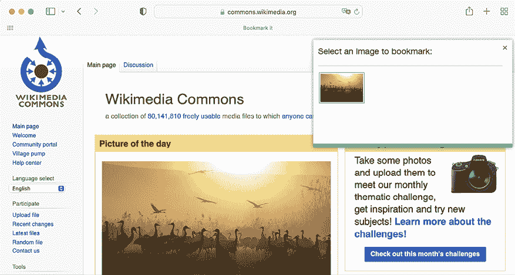

# 6

# 在您的网站上分享内容

在上一章中，您使用 Django 消息框架向您的网站添加了成功和错误消息。您还创建了一个电子邮件认证后端，并使用 Google 添加了社交认证到您的网站。您学习了如何使用 Django Extensions 在本地机器上以 HTTPS 运行开发服务器。您还自定义了社交认证管道，以自动为新用户创建用户资料。

在本章中，您将学习如何创建一个 JavaScript 书签工具，以便在您的网站上分享来自其他网站的内容，并且您将在项目中使用 JavaScript 和 Django 实现异步浏览器请求。

本章将涵盖以下主题：

+   创建多对多关系

+   自定义表单的行为

+   在 Django 中使用 JavaScript

+   构建 JavaScript 书签工具

+   使用`easy-thumbnails`生成图片缩略图

+   使用 JavaScript 和 Django 实现异步 HTTP 请求

+   构建无限滚动分页

在本章中，您将创建一个图片收藏系统。您将创建具有多对多关系的模型，并自定义表单的行为。您将学习如何生成图片缩略图，以及如何使用 JavaScript 和 Django 构建异步浏览器功能。

# 功能概述

*图 6.1*展示了本章将要构建的视图、模板和功能：


图 6.1：第六章构建的功能图

在本章中，您将实现一个**“收藏它”**按钮，允许用户从任何网站收藏图片。您将使用 JavaScript 在网站顶部显示一个图片选择器，让用户选择要收藏的图片。您将实现`image_create`视图和表单，从图片的原始来源检索图片并将其存储在您的网站上。您将构建`image_detail`视图来显示单个图片，并使用`easy-thumbnails`包自动生成图片缩略图。您还将实现`image_like`视图，允许用户对图片进行*点赞/取消点赞*。此视图将处理使用 JavaScript 执行的异步 HTTP 请求，并以 JSON 格式返回响应。最后，您将创建`image_list`视图来显示所有收藏的图片，并使用 JavaScript 和 Django 分页实现无限滚动。

本章的源代码可以在[`github.com/PacktPublishing/Django-5-by-example/tree/main/Chapter06`](https://github.com/PacktPublishing/Django-5-by-example/tree/main/Chapter06)找到。

本章中使用的所有 Python 包都包含在章节源代码中的`requirements.txt`文件中。您可以在以下部分按照说明安装每个 Python 包，或者使用`python -m pip install -r requirements.txt`命令一次性安装所有依赖。

# 创建一个图片收藏网站

现在，我们将学习如何允许用户将他们在其他网站上找到的图片书签并分享到我们的网站上。为了构建这个功能，我们需要以下元素：

+   一个数据模型来存储图片和相关信息。

+   一个表单和一个视图来处理图片上传。

+   可以在任何网站上执行的 JavaScript 书签代码。此代码将在页面中查找图片，并允许用户选择他们想要书签的图片。

首先，在您的`bookmarks`项目目录内创建一个新的应用程序，通过在 shell 提示符中运行以下命令：

```py
django-admin startapp images 
```

将新应用程序添加到项目`settings.py`文件中的`INSTALLED_APPS`设置中，如下所示：

```py
INSTALLED_APPS = [
    # ...
**'images.apps.ImagesConfig'****,**
] 
```

我们已经在项目中激活了`images`应用程序。

## 构建图片模型

编辑`images`应用程序的`models.py`文件，并向其中添加以下代码：

```py
from django.conf import settings
from django.db import models
class Image(models.Model):
    user = models.ForeignKey(
        settings.AUTH_USER_MODEL,
        related_name='images_created',
        on_delete=models.CASCADE
    )
    title = models.CharField(max_length=200)
    slug = models.SlugField(max_length=200, blank=True)
    url = models.URLField(max_length=2000)
    image = models.ImageField(upload_to='images/%Y/%m/%d/')
    description = models.TextField(blank=True)
    created = models.DateTimeField(auto_now_add=True)
    class Meta:
        indexes = [
            models.Index(fields=['-created']),
        ]
        ordering = ['-created']
    def __str__(self):
        return self.title 
```

这是我们将在平台上存储图片所使用的模型。让我们看看这个模型的字段：

+   `user`: 这表示书签此图片的`User`对象。这是一个外键字段，因为它指定了一个多对一的关系：一个用户可以发布多个图片，但每张图片都由单个用户发布。我们为`on_delete`参数使用了`CASCADE`，以便在删除用户时删除相关图片。

+   `title`: 图片的标题。

+   `slug`: 一个仅包含字母、数字、下划线或连字符的短标签，用于构建美观且 SEO 友好的 URL。

+   `url`: 此图片的原始 URL。我们使用`max_length`来定义最大长度为`2000`个字符。

+   `image`: 图片文件。

+   `description`: 图片的可选描述。

+   `created`: 表示对象在数据库中创建的日期和时间的日期和时间。我们添加了`auto_now_add`来自动设置对象创建时的当前日期和时间。

在模型的`Meta`类中，我们为`created`字段定义了一个降序数据库索引。我们还添加了`ordering`属性来告诉 Django 默认按`created`字段排序结果。我们通过在字段名前使用连字符来表示降序，例如`-created`，这样新的图片将首先显示。

数据库索引可以提高查询性能。考虑为那些您经常使用`filter()`、`exclude()`或`order_by()`查询的字段创建索引。`ForeignKey`字段或具有`unique=True`的字段意味着创建索引。您可以在[`docs.djangoproject.com/en/5.0/ref/models/options/#django.db.models.Options.indexes`](https://docs.djangoproject.com/en/5.0/ref/models/options/#django.db.models.Options.indexes)了解更多关于数据库索引的信息。

我们将覆盖`Image`模型的`save()`方法，以便根据`title`字段的值自动生成`slug`字段。以下代码中，新行以粗体突出显示。导入`slugify()`函数并添加到`Image`模型的`save()`方法中，如下所示：

```py
**from** **django.utils.text** **import** **slugify**
class Image(models.Model):
    # ...
**def****save****(****self, *args, **kwargs****):**
**if****not** **self.slug:**
 **self.slug = slugify(self.title)**
**super****().save(*args, **kwargs)** 
```

当一个`Image`对象被保存时，如果`slug`字段没有值，则会使用`slugify()`函数自动从图像的`title`字段生成一个 slug。然后对象被保存。通过从标题自动生成 slug，用户在分享我们网站上的图像时无需提供 slug。

## 创建多对多关系

接下来，我们将向`Image`模型添加另一个字段以存储喜欢图像的用户。在这种情况下，我们需要一个多对多关系，因为一个用户可能喜欢多个图像，每个图像也可能被多个用户喜欢。

将以下字段添加到`Image`模型中：

```py
users_like = models.ManyToManyField(
    settings.AUTH_USER_MODEL,
    related_name='images_liked',
    blank=True
) 
```

当我们定义一个`ManyToManyField`字段时，Django 会使用两个模型的键创建一个中间连接表。*图 6.2*显示了将为这种关系创建的数据库表：


图 6.2：多对多关系的中间数据库表

Django 创建了一个名为`images_image_users_like`的中间表，它引用了`images_image`表（`Image`模型）和`auth_user`表（`User`模型）。`ManyToManyField`字段可以在两个相关模型中的任何一个中定义。

与`ForeignKey`字段一样，`ManyToManyField`的`related_name`属性允许您从相关对象命名回此关系。`ManyToManyField`字段提供了一个多对多管理器，允许您检索相关对象，例如`image.users_like.all()`，或从`user`对象中获取它们，例如`user.images_liked.all()`。

您可以在[`docs.djangoproject.com/en/5.0/topics/db/examples/many_to_many/`](https://docs.djangoproject.com/en/5.0/topics/db/examples/many_to_many/)了解更多关于多对多关系的信息。

打开 shell 提示符并运行以下命令以创建初始迁移：

```py
python manage.py makemigrations images 
```

输出应类似于以下内容：

```py
Migrations for 'images':
  images/migrations/0001_initial.py
    - Create model Image
    - Create index images_imag_created_d57897_idx on field(s) -created of model image 
```

现在运行以下命令以应用您的迁移：

```py
python manage.py migrate images 
```

您将得到包含以下行的输出：

```py
Applying images.0001_initial... OK 
```

`Image`模型现在已同步到数据库。

## 在管理站点注册图像模型

编辑`images`应用的`admin.py`文件，并将`Image`模型注册到管理站点，如下所示：

```py
from django.contrib import admin
**from** **.models** **import** **Image**
**@admin.register(****Image****)**
**class****ImageAdmin****(admin.ModelAdmin):**
 **list_display = [****'title'****,** **'slug'****,** **'image'****,** **'created'****]**
 **list_filter = [****'created'****]** 
```

使用以下命令启动开发服务器：

```py
python manage.py runserver_plus --cert-file cert.crt 
```

在浏览器中打开`https://127.0.0.1:8000/admin/`，您将看到管理站点中的`Image`模型，如下所示：


图 6.3：Django 管理站点索引页面上的图像块

您已完成了存储图像的模型。现在您将学习如何实现一个表单，通过 URL 检索图像并使用`Image`模型存储它们。

# 发布来自其他网站的内容

我们将允许用户从外部网站书签图片并在我们的网站上分享。用户将提供图片的 URL、标题和可选描述。我们将创建一个表单和一个视图来下载图片，并在数据库中创建一个新的`Image`对象。

让我们先构建一个表单来提交新的图片。

在`images`应用程序目录内创建一个新的`forms.py`文件，并将以下代码添加到其中：

```py
from django import forms
from .models import Image
class ImageCreateForm(forms.ModelForm):
    class Meta:
        model = Image
        fields = ['title', 'url', 'description']
        widgets = {
            'url': forms.HiddenInput,
        } 
```

我们已从`Image`模型定义了一个`ModelForm`表单，仅包括`title`、`url`和`description`字段。用户不会直接在表单中输入图片 URL。相反，我们将为他们提供一个 JavaScript 工具，从外部网站选择图片，表单将接收图片的 URL 作为参数。我们已覆盖了`url`字段的默认小部件，以使用`HiddenInput`小部件。此小部件渲染为具有`type="hidden"`属性的 HTML `input`元素。我们使用此小部件是因为我们不希望此字段对用户可见。

## 清理表单字段

为了验证提供的图片 URL 是否有效，我们将检查文件名是否以`.jpg`、`.jpeg`或`.png`扩展名结尾，以允许仅共享 JPEG 和 PNG 文件。在上一章中，我们使用了`clean_<fieldname>()`约定来实现字段验证。当我们在表单实例上调用`is_valid()`时，如果字段存在，该方法将针对每个字段执行。在`clean`方法中，您可以更改字段的值或为字段引发任何验证错误。

在`images`应用程序的`forms.py`文件中，向`ImageCreateForm`类添加以下方法：

```py
def clean_url(self):
    url = self.cleaned_data['url']
    valid_extensions = ['jpg', 'jpeg', 'png']
    extension = url.rsplit('.', 1)[1].lower()
    if extension not in valid_extensions:
        raise forms.ValidationError(
            'The given URL does not match valid image extensions.'
 )
    return url 
```

在前面的代码中，我们定义了一个`clean_url()`方法来清理`url`字段。代码如下：

1.  通过访问表单实例的`cleaned_data`字典来检索`url`字段的值。

1.  将 URL 分割以检查文件是否有有效的扩展名。如果扩展名无效，将引发`ValidationError`，并且表单实例不会被验证。

除了验证给定的 URL 之外，我们还需要下载图片文件并将其保存。例如，我们可以使用处理表单的视图来下载图片文件。相反，让我们通过覆盖模型表单的`save()`方法来采取更通用的方法，在表单保存时执行此任务。

## 安装 Requests 库

当用户将图片书签时，我们需要通过其 URL 下载图片文件。我们将为此目的使用 Requests Python 库。Requests 是 Python 中最流行的 HTTP 库。它抽象了处理 HTTP 请求的复杂性，并为消费 HTTP 服务提供了一个非常简单的接口。您可以在[`requests.readthedocs.io/en/master/`](https://requests.readthedocs.io/en/master/)找到 Requests 库的文档。

打开 shell，使用以下命令安装 Requests 库：

```py
python -m pip install requests==2.31.0 
```

我们现在将覆盖`ImageCreateForm`的`save()`方法，并使用 Requests 库通过 URL 检索图像。

## 覆盖 ModelForm 的 save()方法

如您所知，`ModelForm`提供了一个`save()`方法，用于将当前模型实例保存到数据库并返回该对象。此方法接收一个布尔`commit`参数，允许您指定对象是否必须持久化到数据库。如果`commit`为`False`，则`save()`方法将返回一个模型实例，但不会将其保存到数据库中。我们将覆盖表单的`save()`方法，以通过给定的 URL 检索图像文件并将其保存到文件系统中。

在`forms.py`文件的顶部添加以下导入：

```py
import requests
from django.core.files.base import ContentFile
from django.utils.text import slugify 
```

然后，向`ImageCreateForm`表单添加以下`save()`方法：

```py
def save(self, force_insert=False, force_update=False, commit=True):
    image = super().save(commit=False)
    image_url = self.cleaned_data['url']
    name = slugify(image.title)
    extension = image_url.rsplit('.', 1)[1].lower()
    image_name = f'{name}.{extension}'
# download image from the given URL
    response = requests.get(image_url)
    image.image.save(
        image_name,
        ContentFile(response.content),
        save=False
 )
    if commit:
        image.save()
    return image 
```

我们已经覆盖了`save()`方法，保留了`ModelForm`所需的参数。前面的代码可以这样解释：

1.  通过调用表单的`save()`方法并传递`commit=False`来创建一个新的`image`实例。

1.  从表单的`cleaned_data`字典中检索图像的 URL。

1.  通过将图像标题的 slug 与图像的原始文件扩展名组合来生成图像名称。

1.  使用 Requests Python 库通过发送使用图像 URL 的 HTTP `GET`请求来下载图像。响应存储在`response`对象中。

1.  调用`image`字段的`save()`方法，传递一个使用下载的文件内容实例化的`ContentFile`对象。这样，文件就被保存到项目的媒体目录中。传递`save=False`参数以防止对象被保存到数据库中。

1.  为了保持与模型表单原始`save()`方法相同的行为，只有当`commit`参数为`True`时，表单才会保存到数据库。

我们需要一个视图来创建表单的实例并处理其提交。

编辑`images`应用的`views.py`文件，并向其中添加以下代码。新代码以粗体显示：

```py
**from** **django.contrib** **import** **messages**
**from** **django.contrib.auth.decorators** **import** **login_required**
from django.shortcuts import **redirect,** render
**from** **.forms** **import** **ImageCreateForm**
**@login_required**
**def****image_create****(****request****):**
**if** **request.method ==** **'POST'****:**
**# form is sent**
 **form = ImageCreateForm(data=request.POST)**
**if** **form.is_valid():**
**# form data is valid**
 **cd = form.cleaned_data**
 **new_image = form.save(commit=****False****)**
**# assign current user to the item**
 **new_image.user = request.user**
 **new_image.save()**
 **messages.success(request,** **'Image added successfully'****)**
**# redirect to new created item detail view**
**return** **redirect(new_image.get_absolute_url())**
**else****:**
**# build form with data provided by the bookmarklet via GET**
 **form = ImageCreateForm(data=request.GET)**
**return** **render(**
 **request,**
**'images/image/create.html'****,**
 **{****'section'****:** **'images'****,** **'form'****: form}**
 **)** 
```

在前面的代码中，我们创建了一个视图来在网站上存储图像。我们向`image_create`视图添加了`login_required`装饰器，以防止未经认证的用户访问。这个视图的工作方式如下：

1.  为了创建表单的实例，必须通过`GET` HTTP 请求提供初始数据。这些数据将包括来自外部网站的图像的`url`和`title`属性。这两个参数将由我们稍后创建的 JavaScript 书签工具在`GET`请求中设置。目前，我们可以假设这些数据将在请求中可用。

1.  当表单通过`POST` HTTP 请求提交时，它通过`form.is_valid()`进行验证。如果表单数据有效，则通过`form.save(commit=False)`保存表单来创建一个新的`image`实例。由于`commit=False`，新实例不会被保存到数据库中。

1.  使用`new_image.user = request.user`将当前执行请求的用户与新的`image`实例关联起来。这样我们就能知道谁上传了每张图片。

1.  `Image`对象被保存到数据库中。

1.  最后，使用 Django 消息框架创建一个成功消息，并将用户重定向到新图像的规范 URL。我们尚未实现`Image`模型的`get_absolute_url()`方法；我们将在稍后完成。

在`images`应用程序内创建一个新的`urls.py`文件并向其中添加以下代码：

```py
from django.urls import path
from . import views
app_name = 'images'
urlpatterns = [
    path('create/', views.image_create, name='create'),
] 
```

编辑`bookmarks`项目的主体`urls.py`文件以包含`images`应用程序的模式，如下所示。新的代码以粗体显示：

```py
urlpatterns = [
    path('admin/', admin.site.urls),
    path('account/', include('account.urls')),
    path(
        'social-auth/',
        include('social_django.urls', namespace='social')
    ),
 **path(****'images/'****, include(****'images.urls'****, namespace=****'images'****)),**
] 
```

最后，我们需要创建一个模板来渲染表单。在`images`应用程序目录内创建以下目录结构：

```py
templates/
  images/
    image/
      create.html 
```

编辑新的`create.html`模板并向其中添加以下代码：

```py

Bookmark an image

  <h1>Bookmark an image</h1>

<form method="post">
    {{ form.as_p }}
    
    <input type="submit" value="Bookmark it!">
</form>
 
```

在 shell 提示符中使用以下命令运行开发服务器：

```py
python manage.py runserver_plus --cert-file cert.crt 
```

在你的浏览器中打开`https://127.0.0.1:8000/images/create/?title=...&url=...`，包括`title`和`url` GET 参数，在后者中提供一个现有的 JPEG 图像 URL。例如，你可以使用以下 URL：`https://127.0.0.1:8000/images/create/?title=%20Django%20and%20Duke&url=https://upload.wikimedia.org/wikipedia/commons/8/85/Django_Reinhardt_and_Duke_Ellington_%28Gottlieb%29.jpg`。

你将看到带有图像预览的表单，如下所示：


图 6.4：书签图像的页面

添加描述并点击**书签它**按钮。一个新的`Image`对象将被保存在你的数据库中。然而，你将得到一个错误，表明`Image`模型没有`get_absolute_url()`方法，如下所示：


图 6.5：显示`Image`对象没有`get_absolute_url`属性的错误

目前不必担心这个错误；我们将在稍后实现`Image`模型中的`get_absolute_url`方法。

在你的浏览器中打开`https://127.0.0.1:8000/admin/images/image/`并验证新的`Image`对象是否已保存，如下所示：


图 6.6：显示创建的`Image`对象的网站管理器图像列表页面

## 使用 JavaScript 构建书签小工具

书签小工具是一种存储在网页浏览器中的书签，其中包含用于扩展浏览器功能的 JavaScript 代码。当你点击浏览器书签栏或收藏夹中的书签时，JavaScript 代码将在浏览器中显示的网站上执行。这对于构建与其他网站交互的工具非常有用。

一些在线服务，如 Pinterest，实现了他们自己的书签小工具，让用户可以从其他网站在他们的平台上分享内容。Pinterest 书签小工具作为浏览器扩展实现，可在[`help.pinterest.com/en/article/save-pins-with-the-pinterest-browser-button`](https://help.pinterest.com/en/article/save-pins-with-the-pinterest-browser-button)找到。**Pinterest 保存**扩展允许用户通过在浏览器中单击一次即可将图片或网站保存到他们的 Pinterest 账户。


图 6.7：Pinterest 保存扩展

让我们以类似的方式为您的网站创建一个书签小工具。为此，我们将使用 JavaScript。

这是用户如何将书签小工具添加到他们的浏览器并使用它的方法：

1.  用户将来自您网站的链接拖动到浏览器书签栏。链接在其`href`属性中包含 JavaScript 代码。此代码将被存储在书签中。

1.  用户导航到任何网站并点击书签栏或收藏夹中的书签。书签的 JavaScript 代码将被执行。

由于 JavaScript 代码将被存储为书签，因此用户将其添加到书签栏后，我们将无法更新它。这是一个重要的缺点，您可以通过实现启动脚本来解决。用户将启动脚本保存为书签，启动脚本将从 URL 加载实际的 JavaScript 书签小工具。通过这样做，您将能够随时更新书签小工具的代码。这是我们构建书签小工具将采取的方法。让我们开始吧！

在`images/templates/`下创建一个新的模板，并将其命名为`bookmarklet_launcher.js`。这将是一个启动脚本。将以下 JavaScript 代码添加到新文件中：

```py
(function(){
  if(!window.bookmarklet) {
    bookmarklet_js = document.body.appendChild(document.createElement('script'));
    bookmarklet_js.src = '//127.0.0.1:8000/static/js/bookmarklet.js?r='+Math.floor(Math.random()*9999999999999999);
    window.bookmarklet = true;
  }
  else {
    bookmarkletLaunch();
  }
})(); 
```

上述脚本通过使用`if(!window.bookmarklet)`检查`bookmarklet`窗口变量的值来检查书签小工具是否已被加载：

+   如果`window.bookmarklet`未定义或没有真值（在布尔上下文中被视为`true`），将通过在浏览器中加载的 HTML 文档的主体中添加一个`<script>`元素来加载一个 JavaScript 文件。使用`src`属性加载`bookmarklet.js`脚本的 URL，该 URL 使用`Math.random()*9999999999999999`生成的随机 16 位整数参数。使用随机数，我们防止浏览器从浏览器缓存中加载文件。如果书签小工具 JavaScript 已被先前加载，不同的参数值将迫使浏览器再次从源 URL 加载脚本。这样，我们确保书签小工具始终运行最新的 JavaScript 代码。

+   如果`window.bookmarklet`已定义并且具有真值，则执行`bookmarkletLaunch()`函数。我们将在`bookmarklet.js`脚本中将`bookmarkletLaunch()`定义为全局函数。

通过检查 `bookmarklet` 窗口变量，我们防止用户反复点击书签时书签 JavaScript 代码被加载多次。

你创建了书签启动器代码。实际的书签代码将位于 `bookmarklet.js` 静态文件中。使用启动器代码允许你在任何时间更新书签代码，而无需要求用户更改他们之前添加到浏览器中的书签。

让我们向仪表板页面添加书签启动器，以便用户可以将其添加到浏览器书签栏中。

编辑 `account/dashboard.html` 模板，使其看起来如下。新行以粗体突出显示：

```py

Dashboard

  <h1>Dashboard</h1>
 ****
**<****p****>****Welcome to your dashboard. You have bookmarked {{ total_images_created }} image{{ total_images_created|pluralize }}.****</****p****>**
 ****
**<****p****>****Drag the following button to your bookmarks toolbar to bookmark images from other websites →** **<****a****href****=****"****javascript:"** **class****=****"button"****>****Bookmark it****</****a****></****p****>**
**<****p****>****You can also** **<****a****href****=****"">****edit your profile****</****a****>** **or** **<****a****href****=****"">****change your password****</****a****>****.****</****p****>**
 
```

确保不要将模板标签拆分到多行；Django 不支持多行标签。

仪表板现在显示用户书签的总图像数。我们添加了一个 `` 模板标签来创建一个变量，该变量包含当前用户书签的总图像数。我们包含了一个带有 `href` 属性的链接，该属性包含书签启动器脚本。此 JavaScript 代码是从 `bookmarklet_launcher.js` 模板加载的。

在你的浏览器中打开 `https://127.0.0.1:8000/account/`。你应该看到以下页面：


图 6.8：仪表板页面，包括书签的总图像数和书签按钮

现在在 `images` 应用程序目录内创建以下目录和文件：

```py
static/
  js/
    bookmarklet.js 
```

你将在与本章代码一起提供的 `images` 应用程序目录中找到 `static/css/` 目录。将 `css/` 目录复制到你的代码的 `static/` 目录中。你可以在 [`github.com/PacktPublishing/Django-5-by-Example/tree/main/Chapter06/bookmarks/images/static`](https://github.com/PacktPublishing/Django-5-by-Example/tree/main/Chapter06/bookmarks/images/static) 找到目录的内容。

`css/bookmarklet.css` 文件提供了 JavaScript 书签的样式。现在 `static/` 目录应包含以下文件结构：

```py
 css/
    bookmarklet.css
  js/
    bookmarklet.js 
```

编辑 `bookmarklet.js` 静态文件，并向其中添加以下 JavaScript 代码：

```py
const siteUrl = '//127.0.0.1:8000/';
const styleUrl = siteUrl + 'static/css/bookmarklet.css';
const minWidth = 250;
const minHeight = 250; 
```

你已声明了四个不同的常量，这些常量将被书签使用。这些常量是：

+   `siteUrl` 和 `staticUrl`：网站的基准 URL 和静态文件的基准 URL。

+   `minWidth` 和 `minHeight`：书签将从网站收集的图像的最小宽度和高度（以像素为单位）。书签将识别至少有 `250px` 宽度和 `250px` 高度的图像。

编辑 `bookmarklet.js` 静态文件，并向其中添加以下以粗体突出显示的代码：

```py
const siteUrl = '//127.0.0.1:8000/';
const styleUrl = siteUrl + 'static/css/bookmarklet.css';
const minWidth = 250;
const minHeight = 250;
**// load CSS**
**var head = document.getElementsByTagName(****'****head'****)[****0****];**
**var link = document.createElement(****'link'****);**
**link.rel =** **'stylesheet'****;**
**link.****type** **=** **'text/css'****;**
**link.href = styleUrl +** **'?r='** **+ Math.floor(Math.random()*****9999999999999999****);**
**head.appendChild(link);** 
```

本节加载书签脚本的 CSS 样式表。我们使用 JavaScript 来操作**文档对象模型**（**DOM**）。DOM 代表内存中的 HTML 文档，并在加载网页时由浏览器创建。DOM 被构建为一个对象树，这些对象构成了 HTML 文档的结构和内容。

之前的代码生成一个与以下 JavaScript 代码等效的对象，并将其附加到 HTML 页面的`<head>`元素中：

```py
<link rel="stylesheet" type="text/css" href= "//127.0.0.1:8000/static/css/bookmarklet.css?r=1234567890123456"> 
```

让我们回顾一下这是如何完成的：

1.  使用`document.getElementsByTagName()`检索网站的`<head>`元素。此函数检索页面给定标签的所有 HTML 元素。通过使用`[0]`，我们访问找到的第一个实例。我们访问第一个元素，因为所有 HTML 文档都应该有一个单独的`<head>`元素。

1.  使用`document.createElement('link')`创建一个`<link>`元素。

1.  `<link>`元素的`rel`和`type`属性被设置。这相当于 HTML `<link rel="stylesheet" type="text/css">`。

1.  `<link>`元素的`href`属性被设置为`bookmarklet.css`样式表的 URL。使用 16 位随机数作为 URL 参数，以防止浏览器从缓存中加载文件。

1.  使用`head.appendChild(link)`将新的`<link>`元素添加到 HTML 页面的`<head>`元素中。

现在我们将创建一个 HTML 元素，在网站中显示一个在书签脚本执行时使用的`<div>`容器。这个 HTML 容器将用于显示网站上找到的所有图片，并让用户选择他们想要分享的图片。它将使用在`bookmarklet.css`样式表中定义的 CSS 样式。

编辑`bookmarklet.js`静态文件，并添加以下加粗的代码：

```py
const siteUrl = '//127.0.0.1:8000/';
const styleUrl = siteUrl + 'static/css/bookmarklet.css';
const minWidth = 250;
const minHeight = 250;
// load CSS
var head = document.getElementsByTagName('head')[0];
var link = document.createElement('link');
link.rel = 'stylesheet';
link.type = 'text/css';
link.href = styleUrl + '?r=' + Math.floor(Math.random()*9999999999999999);
head.appendChild(link);
**// load HTML**
**var body = document.getElementsByTagName(****'body'****)[****0****];**
**boxHtml = `**
 **<div** **id****=****"bookmarklet"****>**
 **<a href=****"#"****id****=****"close"****>&times;</a>**
 **<h1>Select an image to bookmark:</h1>**
 **<div** **class****=****"images"****></div>**
 **</div>`;**
**body.innerHTML += boxHtml;** 
```

通过这段代码，检索 DOM 的`<body>`元素，并通过修改其属性`innerHTML`向其中添加新的 HTML。在页面主体中添加一个新的`<div>`元素。该`<div>`容器包含以下元素：

+   一个使用`<a href="#" id="close">&times;</a>`定义的关闭容器链接。

+   使用`<h1>Select an image to bookmark:</h1>`定义的标题。

+   一个使用`<div class="images"></div>`定义的`<div>`元素，用于列出网站上找到的图片。此容器最初为空，并将填充网站上找到的图片。

包括之前加载的 CSS 样式在内的 HTML 容器将看起来像*图 6.9*：


图 6.9：图片选择容器

现在让我们实现一个启动书签脚本的函数。编辑`bookmarklet.js`静态文件，并在底部添加以下代码：

```py
function bookmarkletLaunch() {
  bookmarklet = document.getElementById('bookmarklet');
  var imagesFound = bookmarklet.querySelector('.images');
  // clear images found
  imagesFound.innerHTML = '';
  // display bookmarklet
  bookmarklet.style.display = 'block';
  // close event
  bookmarklet.querySelector('#close')
             .addEventListener('click', function(){
               bookmarklet.style.display = 'none'
             });
}
// launch the bookmkarklet
bookmarkletLaunch(); 
```

这是`bookmarkletLaunch()`函数。在定义此函数之前，已加载书签脚本的 CSS，并将 HTML 容器添加到页面的 DOM 中。`bookmarkletLaunch()`函数的工作方式如下：

1.  通过使用`document.getElementById()`获取具有 ID `bookmarklet`的 DOM 元素来检索书签脚本的主体容器。

1.  使用 `bookmarklet` 元素来检索具有类 `images` 的子元素。`querySelector()` 方法允许您使用 CSS 选择器检索 DOM 元素。选择器允许您找到应用了一组 CSS 规则的 DOM 元素。您可以在 [`developer.mozilla.org/en-US/docs/Web/CSS/CSS_Selectors`](https://developer.mozilla.org/en-US/docs/Web/CSS/CSS_Selectors) 找到 CSS 选择器的列表，您可以在 [`developer.mozilla.org/en-US/docs/Web/API/Document_object_model/Locating_DOM_elements_using_selectors`](https://developer.mozilla.org/en-US/docs/Web/API/Document_object_model/Locating_DOM_elements_using_selectors) 上阅读有关如何使用选择器定位 DOM 元素的相关信息。

1.  通过将 `innerHTML` 属性设置为空字符串来清除 `images` 容器，并通过将 `display` CSS 属性设置为 `block` 来显示书签工具。

1.  使用 `#close` 选择器来查找具有 ID `close` 的 DOM 元素。使用 `addEventListener()` 方法将 `click` 事件附加到该元素上。当用户点击该元素时，通过将 `display` 属性设置为 `none` 来隐藏书签工具的主要容器。

1.  `bookmarkletLaunch()` 函数在其定义之后执行。

在加载了书签工具的 CSS 样式和 HTML 容器之后，您需要在当前网站的 DOM 中找到图像元素。具有最小所需尺寸的图像必须添加到书签工具的 HTML 容器中。编辑 `bookmarklet.js` 静态文件，并将以下加粗的代码添加到 `bookmarklet()` 函数的底部：

```py
function bookmarkletLaunch() {
  bookmarklet = document.getElementById('bookmarklet');
  var imagesFound = bookmarklet.querySelector('.images');
  // clear images found
  imagesFound.innerHTML = '';
  // display bookmarklet
  bookmarklet.style.display = 'block';
  // close event
  bookmarklet.querySelector('#close')
             .addEventListener('click', function(){
               bookmarklet.style.display = 'none'
             });
**// find images in the DOM with the minimum dimensions**
 **images =** **document****.****querySelectorAll****(****'img[src$=".jpg"], img[src$=".jpeg"], img[src$=".png"]'****);**
 **images.****forEach****(****image** **=>** **{**
**if****(image.****naturalWidth** **>= minWidth**
 **&& image.****naturalHeight** **>= minHeight)**
 **{**
**var** **imageFound =** **document****.****createElement****(****'img'****);**
 **imageFound.****src** **= image.****src****;**
 **imagesFound.****append****(imageFound);**
 **}**
 **})**
**}**
**// launch the bookmkarklet**
**bookmarkletLaunch****();** 
```

上述代码使用 `img[src$=".jpg"]`、`img[src$=".jpeg"]` 和 `img[src$=".png"]` 选择器来查找所有 `` DOM 元素，其 `src` 属性分别以 `.jpg`、`.jpeg` 或 `.png` 结尾。使用这些选择器与 `document.querySelectorAll()` 结合，您可以在网站上找到所有显示的 JPEG 和 PNG 格式的图像。使用 `forEach()` 方法遍历结果。由于我们不认为小图像相关，因此会过滤掉它们。只有大于 `minWidth` 和 `minHeight` 变量指定的尺寸的图像才用于结果。对于每个找到的图像，创建一个新的 `` 元素，其中 `src` 源 URL 属性从原始图像复制并添加到 `imagesFound` 容器中。

由于安全原因，您的浏览器将阻止您在通过 HTTPS 提供的网站上使用 HTTP 运行书签工具。这就是我们为什么继续使用 `RunServerPlus` 来通过自动生成的 TLS/SSL 证书运行开发服务器的原因。记住，您在 *第五章，实现社交认证* 中学习了如何通过 HTTPS 运行开发服务器。

在生产环境中，需要一个有效的 TLS/SSL 证书。当您拥有域名时，您可以申请一个受信任的**认证机构**（**CA**）为其颁发 TLS/SSL 证书，以便浏览器可以验证其身份。如果您想为真实域名获取一个受信任的证书，您可以使用*Let’s Encrypt*服务。*Let’s Encrypt*是一个非营利性 CA，它简化了免费获取和更新受信任的 TLS/SSL 证书。您可以在[`letsencrypt.org`](https://letsencrypt.org)找到更多信息。

从壳式提示符中运行以下命令来启动开发服务器：

```py
python manage.py runserver_plus --cert-file cert.crt 
```

在您的浏览器中打开`https://127.0.0.1:8000/account/`。使用现有用户登录，然后按照以下步骤点击并拖动**BOOKMARK IT**按钮到浏览器的书签栏：


图 6.10：将**BOOKMARK IT**按钮添加到书签栏

在您的浏览器中打开您选择的网站，并点击书签栏中的**Bookmark it**快捷书签。您会看到网站上出现一个新的白色覆盖层，显示所有尺寸大于 250×250 像素的 JPEG 和 PNG 图像。

*图 6.11* 展示了在[`amazon.com/`](https://amazon.com/)上运行的快捷书签：


图 6.11：在 amazon.com 上加载的快捷书签

如果 HTML 容器没有出现，请检查`RunServer`壳式控制台日志。如果您看到 MIME 类型错误，那么很可能是您的 MIME 映射文件不正确或需要更新。您可以通过在`settings.py`文件中添加以下行来为 JavaScript 和 CSS 文件应用正确的映射：

```py
if DEBUG:
    import mimetypes
    mimetypes.add_type('application/javascript', '.js', True)
    mimetypes.add_type('text/css', '.css', True) 
```

HTML 容器包括可以保存的图像。我们现在将实现用户点击所需图像以保存它的功能。

编辑`js/bookmarklet.js`静态文件，并在`bookmarklet()`函数底部添加以下代码：

```py
function bookmarkletLaunch() {
  bookmarklet = document.getElementById('bookmarklet');
  var imagesFound = bookmarklet.querySelector('.images');
  // clear images found
  imagesFound.innerHTML = '';
  // display bookmarklet
  bookmarklet.style.display = 'block';
  // close event
  bookmarklet.querySelector('#close')
             .addEventListener('click', function(){
               bookmarklet.style.display = 'none'
             });
  // find images in the DOM with the minimum dimensions
  images = document.querySelectorAll('img[src$=".jpg"], img[src$=".jpeg"], img[src$=".png"]');
  images.forEach(image => {
    if(image.naturalWidth >= minWidth
       && image.naturalHeight >= minHeight)
    {
      var imageFound = document.createElement('img');
      imageFound.src = image.src;
      imagesFound.append(imageFound);
    }
  })
**// select image event**
 **imagesFound.****querySelectorAll****(****'img'****).****forEach****(****image** **=>** **{**
 **image.****addEventListener****(****'click'****,** **function****(****event****){**
 **imageSelected = event.****target****;**
 **bookmarklet.****style****.****display** **=** **'none'****;**
**window****.****open****(siteUrl +** **'images/create/?url='**
 **+** **encodeURIComponent****(imageSelected.****src****)**
 **+** **'&title='**
 **+** **encodeURIComponent****(****document****.****title****),**
**'_blank'****);**
 **})**
 **})**
}
// launch the bookmkarklet
bookmarkletLaunch(); 
```

上述代码的工作原理如下：

1.  将`click()`事件附加到`imagesFound`容器内的每个图像元素上。

1.  当用户点击任何图像时，点击的图像元素被存储在变量`imageSelected`中。

1.  然后通过将`display`属性设置为`none`来隐藏快捷书签。

1.  会打开一个新的浏览器窗口，其中包含用于在网站上保存新图像的 URL。网站`<title>`元素的内容通过`title` `GET`参数传递到 URL 中，而选定的图像 URL 通过`url`参数传递。

使用您的浏览器打开一个新的 URL，例如，[`commons.wikimedia.org/`](https://commons.wikimedia.org/)，如下所示：


图 6.12：维基媒体共享资源网站

*图 6.12*至*6.15*图像：*以色列北部的胡拉谷中的一群鹤（Grus grus）*，作者 Tomere（许可：Creative Commons Attribution-Share Alike 4.0 国际：https://creativecommons.org/licenses/by-sa/4.0/deed.en）

点击**收藏它**书签工具以显示图片选择覆盖层。您将看到如下所示的图片选择覆盖层：



图 6.13：在外部网站上加载的书签工具

如果您点击图片，您将被重定向到图片创建页面，传递网站的标题和所选图片的 URL 作为`GET`参数。页面将如下所示：


图 6.14：收藏图片的表单

恭喜！这是您的第一个 JavaScript 书签工具，它已完全集成到您的 Django 项目中。接下来，我们将为图片创建详细视图并实现图片的规范 URL。

# 创建图片的详细视图

现在，让我们创建一个简单的详细视图来显示网站上已收藏的图片。打开`images`应用的`views.py`文件，并向其中添加以下代码：

```py
from django.shortcuts import get_object_or_404
from .models import Image
def image_detail(request, id, slug):
    image = get_object_or_404(Image, id=id, slug=slug)
    return render(
 request,
 'images/image/detail.html',
 {'section': 'images', 'image': image}
    ) 
```

这是一个简单的视图来显示图片。编辑`images`应用的`urls.py`文件，并添加以下加粗的 URL 模式：

```py
urlpatterns = [
    path('create/', views.image_create, name='create'),
 **path(**
**'detail/<int:id>/<slug:slug>/'****,**
 **views.image_detail,**
 **name=****'detail'**
**),**
] 
```

编辑`images`应用的`models.py`文件，并将`get_absolute_url()`方法添加到`Image`模型中，如下所示：

```py
**from** **django.urls** **import** **reverse**
class Image(models.Model):
    # ...
**def****get_absolute_url****(****self****):**
**return** **reverse(****'images:detail'****, args=[self.****id****, self.slug])** 
```

记住，为对象提供规范 URL 的常见模式是在模型中定义`get_absolute_url()`方法。

最后，在`/templates/images/image/`模板目录内为`images`应用创建一个模板，命名为`detail.html`。向其中添加以下代码：

```py

{{ image.title }}

  <h1>{{ image.title }}</h1>

  
    <div class="image-info">
<div>
<span class="count">
          {{ total_likes }} like{{ total_likes|pluralize }}
        </span>
</div>
      {{ image.description|linebreaks }}
    </div>
<div class="image-likes">
      
        <div>
          
            
          
          <p>{{ user.first_name }}</p>
</div>
      
        Nobody likes this image yet.
      
    </div>
  
 
```

这是显示已收藏图片详细视图的模板。我们使用了``标签来创建`total_likes`变量，该变量包含一个查询集的结果，该查询集统计了所有用户的点赞数。通过这样做，我们避免了两次评估同一个查询集（第一次用于显示点赞总数，第二次用于使用`pluralize`模板过滤器）。我们还包含了图片描述，并添加了一个``循环来遍历`image.users_like.all`，以显示所有喜欢这张图片的用户。

当您需要在模板中重复查询时，请使用``模板标签来防止额外的数据库查询。

现在，在您的浏览器中打开一个外部 URL，并使用书签工具收藏一张新图片。发布图片后，您将被重定向到图片详细页面。页面将包含以下成功消息：


图 6.15：图片书签的图片详细页面

太好了！您完成了书签工具的功能。接下来，您将学习如何为图片创建缩略图。

# 使用 easy-thumbnails 创建图片缩略图

我们在详细页面上显示原始图像，但不同图像的尺寸可能差异很大。某些图像的文件大小可能非常大，加载它们可能需要很长时间。以统一方式显示优化图像的最佳方法是生成缩略图。缩略图是较大图像的小型图像表示。缩略图在浏览器中加载更快，并且是统一非常不同尺寸图像的绝佳方式。我们将使用名为`easy-thumbnails`的 Django 应用程序为用户书签的图像生成缩略图。

打开终端，使用以下命令安装`easy-thumbnails`：

```py
python -m pip install easy-thumbnails==2.8.5 
```

编辑`bookmarks`项目的`settings.py`文件，并将`easy_thumbnails`添加到`INSTALLED_APPS`设置中，如下所示：

```py
INSTALLED_APPS = [
    # ...
**'****easy_thumbnails'****,**
] 
```

然后，运行以下命令以将应用程序与数据库同步：

```py
python manage.py migrate 
```

您将看到包括以下行的输出：

```py
Applying easy_thumbnails.0001_initial... OK
Applying easy_thumbnails.0002_thumbnaildimensions... OK 
```

`easy-thumbnails`应用程序提供了多种定义图像缩略图的方式。该应用程序提供了一个``模板标签，用于在模板中生成缩略图，以及一个自定义的`ImageField`，如果您想在模型中定义缩略图。让我们使用模板标签方法。

编辑`images/image/detail.html`模板并考虑以下行：

```py
 
```

以下行应替换前面的行：

```py
****
**<****a****href****=****"****{{ image.image.url }}****"****>**

**</****a****>** 
```

我们定义了一个宽度为`300`像素且高度灵活的缩略图，通过使用值`0`来保持宽高比。用户第一次加载此页面时，将创建一个缩略图图像。缩略图存储在原始文件相同的目录中。位置由`MEDIA_ROOT`设置和`Image`模型的`image`字段的`upload_to`属性定义。生成的缩略图将在以下请求中提供。

从 shell 提示符运行以下命令来启动开发服务器：

```py
python manage.py runserver_plus --cert-file cert.crt 
```

访问现有图像的详细页面。缩略图将被生成并在网站上显示。右键单击图像，在新浏览器标签页中打开，如下所示：


图 6.16：在新浏览器标签页中打开图像

在浏览器中检查生成的图像的 URL。它应该如下所示：


图 6.17：生成的图像的 URL

原始文件名后面跟着创建缩略图所使用的设置的其他详细信息。对于 JPEG 图像，您将看到一个类似`filename.jpg.300x0_q85.jpg`的文件名，其中`300x0`表示生成缩略图时使用的尺寸参数，而`85`是库生成缩略图时使用的默认 JPEG 质量值。

您可以使用不同的质量值，使用`quality`参数。要设置最高的 JPEG 质量，您可以使用值`100`，如下所示：``。更高的质量将意味着更大的文件大小。

`easy-thumbnails` 应用程序提供了几个选项来自定义您的缩略图，包括裁剪算法和可以应用的不同效果。如果您在生成缩略图时遇到任何问题，可以将 `THUMBNAIL_DEBUG = True` 添加到 `settings.py` 文件中以获取调试信息。您可以在 [`easy-thumbnails.readthedocs.io/`](https://easy-thumbnails.readthedocs.io/) 阅读有关 `easy-thumbnails` 的完整文档。

# 使用 JavaScript 添加异步操作

我们打算在图片详情页添加一个 **like** 按钮，让用户点击它来喜欢一张图片。当用户点击 *like* 按钮时，我们将使用 JavaScript 向网页服务器发送 HTTP 请求。这将执行 *like* 操作而不会重新加载整个页面。为了实现这个功能，我们将实现一个允许用户喜欢/不喜欢图片的视图。

JavaScript 的 **Fetch API** 是从网页浏览器向网页服务器发送异步 HTTP 请求的内置方式。通过使用 Fetch API，您可以在不刷新整个页面的情况下发送和检索来自网页服务器的数据。Fetch API 作为浏览器内置的 `XMLHttpRequest` (XHR) 对象的现代替代品推出，该对象用于在不重新加载页面的情况下发送 HTTP 请求。用于在不重新加载页面的情况下异步发送和检索来自网页服务器数据的网页开发技术也被称为 **AJAX**，代表 **Asynchronous JavaScript and XML**。AJAX 这个名字具有误导性，因为 AJAX 请求不仅可以交换 XML 格式的数据，还可以交换 JSON、HTML 和纯文本等格式的数据。您可能会在互联网上找到对 Fetch API 和 AJAX 的混淆性引用。

您可以在 [`developer.mozilla.org/en-US/docs/Web/API/Fetch_API/Using_Fetch`](https://developer.mozilla.org/en-US/docs/Web/API/Fetch_API/Using_Fetch) 找到有关 Fetch API 的信息。

我们将首先实现执行 *like* 和 *unlike* 操作的视图，然后我们将向相关的模板添加 JavaScript 代码以执行异步 HTTP 请求。

编辑 `images` 应用程序的 `views.py` 文件，并向其中添加以下代码：

```py
from django.http import JsonResponse
from django.views.decorators.http import require_POST
@login_required
@require_POST
def image_like(request):
    image_id = request.POST.get('id')
    action = request.POST.get('action')
    if image_id and action:
        try:
            image = Image.objects.get(id=image_id)
            if action == 'like':
                image.users_like.add(request.user)
            else:
                image.users_like.remove(request.user)
            return JsonResponse({'status': 'ok'})
        except Image.DoesNotExist:
            pass
return JsonResponse({'status': 'error'}) 
```

我们为新的视图使用了两个装饰器。`login_required` 装饰器阻止未登录的用户访问此视图。`require_POST` 装饰器如果 HTTP 请求不是通过 `POST` 执行，则返回一个 `HttpResponseNotAllowed` 对象（状态码 `405`）。这样，您只为这个视图允许 `POST` 请求。

Django 还提供了一个 `require_GET` 装饰器，仅允许 `GET` 请求，以及一个 `require_http_methods` 装饰器，您可以将允许的方法列表作为参数传递。

此视图期望以下 `POST` 参数：

+   `image_id`：用户执行操作时 `Image` 对象的 ID

+   `action`：用户想要执行的操作，应该是一个值为 `like` 或 `unlike` 的字符串

我们使用了 Django 为 `Image` 模型的 `users_like` 多对多字段提供的管理器，以便使用 `add()` 或 `remove()` 方法添加或删除关系中的对象。如果调用 `add()` 方法时传递的对象已经在相关对象集中存在，则不会重复。如果调用 `remove()` 方法时传递的对象不在相关对象集中，则不会发生任何操作。多对多管理器的另一个有用方法是 `clear()`，它从相关对象集中删除所有对象。

为了生成视图响应，我们使用了 Django 提供的 `JsonResponse` 类，它返回一个带有 `application/json` 内容类型的 HTTP 响应，将给定的对象转换为 JSON 输出。

编辑 `images` 应用程序的 `urls.py` 文件，并添加以下加粗的 URL 模式：

```py
urlpatterns = [
    path('create/', views.image_create, name='create'),
    path(
        'detail/<int:id>/<slug:slug>/',
        views.image_detail,
        name='detail'
 ),
 **path(****'like/'****, views.image_like, name=****'like'****),**
**]** 
```

## 在 DOM 上加载 JavaScript

我们需要在图像详情模板中添加 JavaScript 代码。为了在我们的模板中使用 JavaScript，我们首先在项目的 `base.html` 模板中添加一个基本包装器。

编辑 `account` 应用程序的 `base.html` 模板，并在关闭 `</body>` HTML 标签之前包含以下加粗的代码：

```py
<!DOCTYPE html>
<html>
<head>
 ...
</head>
<body>
  ...
**<****script****>**
**document****.****addEventListener****(****'DOMContentLoaded'****,** **(****event****) =>** **{**
**// DOM loaded**
 ****
 ****
 **})**
**</****script****>**
</body>
</html> 
```

我们添加了一个 `<script>` 标签来包含 JavaScript 代码。`document.addEventListener()` 方法用于定义当给定事件触发时将被调用的函数。我们传递事件名称 `DOMContentLoaded`，它在初始 HTML 文档完全加载并且 DOM 层次结构已完全构建时触发。通过使用此事件，我们确保在交互任何 HTML 元素和操作 DOM 之前，DOM 已完全构建。函数内的代码仅在 DOM 准备就绪后执行。

在文档就绪处理程序内部，我们包含了一个名为 `domready` 的 Django 模板块。任何扩展 `base.html` 模板的模板都可以使用此块来包含在 DOM 准备就绪时执行的特定 JavaScript 代码。

不要被 JavaScript 代码和 Django 模板标签搞混。Django 模板语言在服务器端渲染以生成 HTML 文档，而 JavaScript 在客户端的浏览器中执行。在某些情况下，使用 Django 动态生成 JavaScript 代码是有用的，以便使用 QuerySets 或服务器端计算的结果在 JavaScript 中定义变量。

本章的示例在 Django 模板中包含 JavaScript 代码。向模板添加 JavaScript 代码的首选方法是加载 `.js` 文件，这些文件作为静态文件提供，特别是如果你使用的是大型脚本。

## JavaScript 中 HTTP 请求的跨站请求伪造

在*第二章*，*使用高级功能增强你的博客*中，你学习了**跨站请求伪造**（**CSRF**）。当 CSRF 保护激活时，Django 会在所有`POST`请求中查找 CSRF 令牌。当你提交表单时，你可以使用``模板标签将令牌与表单一起发送。在 JavaScript 中执行的 HTTP 请求必须在每个`POST`请求中传递 CSRF 令牌。

Django 允许你在 HTTP 请求中设置一个自定义的`X-CSRFToken`头，其值为 CSRF 令牌。

要在从 JavaScript 发起的 HTTP 请求中包含令牌，我们需要从`csrftoken`cookie 中检索 CSRF 令牌，该 cookie 由 Django 在 CSRF 保护激活时设置。为了处理 cookie，我们将使用 JavaScript Cookie。JavaScript Cookie 是一个用于处理 cookie 的轻量级 JavaScript API。您可以在[`github.com/js-cookie/js-cookie`](https://github.com/js-cookie/js-cookie)了解更多信息。

编辑`account`应用的`base.html`模板，并在`<body>`元素的底部添加以下加粗代码：

```py
<!DOCTYPE html>
<html>
<head>
 ...
</head>
<body>
  ...
 **<script src=****"//cdn.jsdelivr.net/npm/js-cookie@3.0.5/dist/js.cookie.min.js"****></script>**
  <script>
 **const csrftoken = Cookies.get(****'csrftoken'****);**
    document.addEventListener('DOMContentLoaded', (event) => {
      // DOM loaded
      
      
    })
  </script>
</body>
</html> 
```

我们已经实现了以下功能：

1.  JavaScript Cookie 插件是从公共**内容分发网络**（**CDN**）加载的。

1.  使用`Cookies.get()`检索`csrftoken`cookie 的值，并将其存储在 JavaScript 常量`csrftoken`中。

我们必须在所有使用不安全 HTTP 方法（如`POST`或`PUT`）的 JavaScript fetch 请求中包含 CSRF 令牌。在发送 HTTP `POST`请求时，我们将在自定义 HTTP 头`X-CSRFToken`中包含`csrftoken`常量。

你可以在[`docs.djangoproject.com/en/5.0/ref/csrf/#ajax`](https://docs.djangoproject.com/en/5.0/ref/csrf/#ajax)找到有关 Django CSRF 保护和 AJAX 的更多信息。

接下来，我们将实现用户喜欢/取消喜欢图像的 HTML 和 JavaScript 代码。

## 使用 JavaScript 执行 HTTP 请求

编辑`images/image/detail.html`模板，并添加以下加粗代码：

```py

{{ image.title }}

  <h1>{{ image.title }}</h1>
  
  <a href="{{ image.image.url }}">

</a>
  
    <div class="image-info">
<div>
<span class="count">
**<****span****class****=****"total"****>****{{ total_likes }}****</****span****>**
        like{{ total_likes|pluralize }}
        </span>
**<****a****href****=****"****#"****data-id****=****"{{ image.id }}"****data-action****=****"unlike"**
**class****=****"like button"****>**
 ****
 **Like**
 ****
 **Unlike**
 ****
**</****a****>**
</div>
      {{ image.description|linebreaks }}
    </div>
<div class="image-likes">
      
        <div>
          
            
          
          <p>{{ user.first_name }}</p>
</div>
      
        Nobody likes this image yet.
      
    </div>
  
 
```

在前面的代码中，我们向``模板标签添加了另一个变量来存储`image.users_like.all`查询的结果，以防止查询多次对数据库执行。该变量用于检查当前用户是否在这个列表中，使用``和``。然后，使用相同的变量遍历喜欢该图像的用户，使用``。

我们已将喜欢该图像的用户总数添加到该页面，并为用户添加了喜欢/取消喜欢图像的链接。相关的对象集`users_like`用于检查`request.user`是否包含在相关对象集中，根据用户与该图像的当前关系显示**喜欢**或**取消喜欢**文本。我们已向`<a>`HTML 链接元素添加以下属性：

+   `data-id`：显示的图像的 ID。

+   `data-action`：用户点击链接时要执行的操作。这可以是 `like` 或 `unlike`。

任何以 `data-` 开头的名称的 HTML 元素属性都是数据属性。数据属性用于存储应用程序的定制数据。

我们将在 HTTP 请求中将 `data-id` 和 `data-action` 属性的值发送到 `image_like` 视图。当用户点击 **like/unlike** 链接时，我们将在浏览器中执行以下操作：

1.  向 `image_like` 视图发送 HTTP `POST` 请求，并将图像 `id` 和 `action` 参数传递给它。

1.  如果 HTTP 请求成功，更新 `<a>` HTML 元素的 `data-action` 属性以使用相反的操作（`like` / `unlike`），并相应地修改其显示文本。

1.  更新页面上显示的点赞总数。

在 `images/image/detail.html` 模板的底部添加以下 `domready` 块：

```py

  const url = '';
  var options = {
    method: 'POST',
    headers: {'X-CSRFToken': csrftoken},
    mode: 'same-origin'
  }
  document.querySelector('a.like')
          .addEventListener('click', function(e){
    e.preventDefault();
    var likeButton = this;
  });
 
```

上述代码的工作原理如下：

1.  使用 `` 模板标签构建 `images:like` URL。生成的 URL 存储在 `url` JavaScript 常量中。

1.  创建了一个 `options` 对象，其中包含将传递给 Fetch API 的 HTTP 请求的选项。这些是：

    +   `method`：要使用的 HTTP 方法。在这种情况下，它是 `POST`。

    +   `headers`：要包含在请求中的附加 HTTP 头。我们包含具有 `csrftoken` 常量值的 `X-CSRFToken` 头。

    +   `mode`：HTTP 请求的模式。我们使用 `same-origin` 来表示请求是针对同一源的。您可以在 [`developer.mozilla.org/en-US/docs/Web/API/Request/mode`](https://developer.mozilla.org/en-US/docs/Web/API/Request/mode) 找到有关模式的更多信息。

1.  使用 `a.like` 选择器通过 `document.querySelector()` 查找所有具有 `like` 类的 HTML 文档 `<a>` 元素。

1.  为使用选择器指定的元素定义了 `click` 事件的事件监听器。每次用户点击 **like/unlike** 链接时，都会执行此函数。

1.  在处理函数内部，使用 `e.preventDefault()` 来避免 `<a>` 元素的默认行为。这将阻止链接元素的默认行为，停止事件传播，并防止链接跟随 URL。

1.  `likeButton` 变量用于存储对 `this` 的引用，即触发事件的元素。

现在我们需要使用 Fetch API 发送 HTTP 请求。编辑 `images/image/detail.html` 模板的 `domready` 块，并添加以下加粗的代码：

```py

  const url = '';
  var options = {
    method: 'POST',
    headers: {'X-CSRFToken': csrftoken},
    mode: 'same-origin'
  }
  document.querySelector('a.like')
          .addEventListener('click', function(e){
    e.preventDefault();
    var likeButton = this;
 **// add request body**
 **var formData = new FormData();**
 **formData.append(****'id'****, likeButton.dataset.****id****);**
 **formData.append(****'action'****, likeButton.dataset.action);**
 **options[****'body'****] = formData;**
 **// send HTTP request**
 **fetch(url, options)**
 **.then(response => response.json())**
 **.then(data => {**
**if** **(data[****'****status'****] ===** **'ok'****)**
 **{**
 **}**
 **})**
  });
 
```

新代码的工作原理如下：

1.  创建一个 `FormData` 对象来构建一组表示表单字段及其值的键/值对。该对象存储在 `formData` 变量中。

1.  `image_like` Django 视图所期望的 `id` 和 `action` 参数被添加到 `formData` 对象中。这些参数的值是从点击的 `likeButton` 元素中检索的。使用 `dataset.id` 和 `dataset.action` 访问 `data-id` 和 `data-action` 属性。

1.  在用于 HTTP 请求的 `options` 对象中添加了一个新的 `body` 键，其值是 `formData` 对象。

1.  通过调用 `fetch()` 函数使用 Fetch API。将之前定义的 `url` 变量作为请求的 URL 传递，并将 `options` 对象作为请求的选项传递。

1.  `fetch()` 函数返回一个解析为 `Response` 对象的承诺，`Response` 对象是 HTTP 响应的表示。使用 `.then()` 方法定义承诺的处理程序。为了提取 JSON 主体内容，我们使用 `response.json()`。你可以在 [`developer.mozilla.org/en-US/docs/Web/API/Response`](https://developer.mozilla.org/en-US/docs/Web/API/Response) 上了解更多关于 `Response` 对象的信息。

1.  `.then()` 方法再次被用来定义一个处理程序，用于处理提取到 JSON 的数据。在这个处理程序中，使用接收到的数据的 `status` 属性来检查其值是否为 `ok`。

你添加了发送 HTTP 请求和处理响应的功能。在请求成功后，你需要将按钮及其相关操作更改为相反的：从 **点赞** 到 **取消点赞**，或从 **取消点赞** 到 **点赞**。通过这样做，用户可以撤销他们的操作。

编辑 `images/image/detail.html` 模板的 `domready` 块，并添加以下加粗的代码：

```py

  var url = '';
  var options = {
    method: 'POST',
    headers: {'X-CSRFToken': csrftoken},
    mode: 'same-origin'
  }
  document.querySelector('a.like')
          .addEventListener('click', function(e){
    e.preventDefault();
    var likeButton = this;
    // add request body
    var formData = new FormData();
    formData.append('id', likeButton.dataset.id);
    formData.append('action', likeButton.dataset.action);
    options['body'] = formData;
    // send HTTP request
    fetch(url, options)
    .then(response => response.json())
    .then(data => {
      if (data['status'] === 'ok')
      {
 **var previousAction = likeButton.dataset.action;**
 **// toggle button text** **and** **data-action**
 **var action = previousAction ===** **'like'** **?** **'unlike'** **:** **'like'****;**
 **likeButton.dataset.action = action;**
 **likeButton.innerHTML = action;**
 **// update like count**
 **var likeCount = document.querySelector(****'span.count .total'****);**
 **var totalLikes = parseInt(likeCount.innerHTML);**
 **likeCount.innerHTML = previousAction ===** **'like'** **? totalLikes +** **1** **: totalLikes -** **1****;**
      }
    })
  });
 
```

上述代码的工作原理如下：

1.  从链接的 `data-action` 属性中检索按钮的先前操作，并将其存储在 `previousAction` 变量中。

1.  切换链接的 `data-action` 属性和链接文本。这允许用户撤销他们的操作。

1.  通过使用选择器 `span.count.total` 从 DOM 中检索总点赞数，并使用 `parseInt()` 将其解析为整数。根据执行的操作（**点赞** 或 **取消点赞**）增加或减少总点赞数。

在你的浏览器中打开你上传的图片的详细页面。你应该能够看到以下初始点赞数和 **点赞** 按钮，如下所示：


图 6.18：图片详细模板中的点赞数和 **点赞** 按钮

点击 **点赞** 按钮。你会注意到总点赞数增加一个，按钮文本变为 **取消点赞**，如下所示：


图 6.19：点击 **点赞** 按钮后的点赞数和按钮

如果你点击 **取消点赞** 按钮，将执行操作，然后按钮的文本变回 **点赞**，总计数相应地更改。

在编写 JavaScript 时，尤其是在执行 AJAX 请求时，建议使用一个用于调试 JavaScript 和 HTTP 请求的工具。大多数现代浏览器都包含用于调试 JavaScript 的开发者工具。通常，您可以在网站上任何地方右键单击以打开上下文菜单，然后点击**检查**或**检查元素**来访问您浏览器的网页开发者工具。

在下一节中，您将学习如何使用 JavaScript 和 Django 的异步 HTTP 请求来实现无限滚动分页。

## 为图像列表添加无限滚动分页

接下来，我们需要列出网站上所有已标记的图片。我们将使用 JavaScript 请求来构建无限滚动功能。无限滚动是通过在用户滚动到页面底部时自动加载下一组结果来实现的。

让我们实现一个图像列表视图，该视图将处理标准浏览器请求和来自 JavaScript 的请求。当用户最初加载图像列表页面时，我们将显示第一页的图像。当他们滚动到页面底部时，我们将使用 JavaScript 检索下一页的项目并将其附加到主页的底部。

相同的视图将处理标准和 AJAX 无限滚动分页。编辑`images`应用的`views.py`文件，并添加以下加粗的代码：

```py
**from** **django.core.paginator** **import** **EmptyPage, PageNotAnInteger, Paginator**
**from** **django.http** **import** **HttpResponse**
# ...
**@login_required**
**def****image_list****(****request****):**
 **images = Image.objects.****all****()**
 **paginator = Paginator(images,** **8****)**
 **page = request.GET.get(****'page'****)**
 **images_only = request.GET.get(****'images_only'****)**
**try****:**
 **images = paginator.page(page)**
**except** **PageNotAnInteger:**
**# If page is not an integer deliver the first page**
 **images = paginator.page(****1****)**
**except** **EmptyPage:**
**if** **images_only:**
**# If AJAX request and page out of range**
**# return an empty page**
**return** **HttpResponse(****''****)**
**# If page out of range return last page of results**
 **images = paginator.page(paginator.num_pages)**
**if** **images_only:**
**return** **render(**
**request,**
**'images/image/list_images.html'****,**
 **{****'section'****:** **'images'****,** **'****images'****: images}**
 **)**
**return** **render(**
**request,**
**'images/image/list.html'****,**
 **{****'section'****:** **'images'****,** **'images'****: images}**
 **)** 
```

在这个视图中，创建了一个 QuerySet 来从数据库中检索所有图片。然后，创建了一个`Paginator`对象来对结果进行分页，每页检索八张图片。通过检索`page` HTTP `GET`参数来获取请求的页面编号。通过检索`images_only` HTTP `GET`参数来了解是否需要渲染整个页面或仅渲染新图片。

当浏览器请求时，我们将渲染整个页面。然而，对于 Fetch API 请求，我们只会渲染包含新图片的 HTML，因为我们将会将它们附加到现有的 HTML 页面上。

如果请求的页面超出了范围，将会触发`EmptyPage`异常。如果这种情况发生，并且只需要渲染图片，将返回一个空的`HttpResponse`。这将允许您在到达最后一页时在客户端停止 AJAX 分页。结果使用两个不同的模板进行渲染：

+   对于包含`images_only`参数的 JavaScript HTTP 请求，将渲染`list_images.html`模板。此模板将仅包含请求页面的图片。

+   对于浏览器请求，将渲染`list.html`模板。此模板将扩展`base.html`模板以显示整个页面，并将包含`list_images.html`模板以包含图像列表。

编辑`images`应用的`urls.py`文件，并添加以下加粗的 URL 模式：

```py
urlpatterns = [
    path('create/', views.image_create, name='create'),
    path(
        'detail/<int:id>/<slug:slug>/',
        views.image_detail,
        name='detail'
 ),
    path('like/', views.image_like, name='like'),
 **path(****''****, views.image_list, name=****'list'****),**
] 
```

最后，您需要创建这里提到的模板。在 `images/image/` 模板目录内，创建一个新的模板并命名为 `list_images.html`。向其中添加以下代码：

```py


  <div class="image">
<a href="{{ image.get_absolute_url }}">
      
      <a href="{{ image.get_absolute_url }}">

</a>
</a>
<div class="info">
<a href="{{ image.get_absolute_url }}" class="title">
        {{ image.title }}
      </a>
</div>
</div>
 
```

上述模板显示了图片列表。您将使用它来返回 AJAX 请求的结果。在此代码中，您遍历图片并为每张图片生成一个正方形缩略图。您将缩略图的大小标准化为 `300x300` 像素。您还使用了 `smart` 裁剪选项。此选项表示图像必须通过从边缘移除具有最少熵的部分，逐步裁剪到请求的大小。

在同一目录下创建另一个模板，并将其命名为 `images/image/list.html`。向其中添加以下代码：

```py

Images bookmarked

  <h1>Images bookmarked</h1>
<div id="image-list">
    
  </div>
 
```

列表模板扩展了 `base.html` 模板。为了避免代码重复，您包括 `images/image/list_images.html` 模板以显示图片。`images/image/list.html` 模板将包含在页面滚动到页面底部时加载额外页面的 JavaScript 代码。

编辑 `images/image/list.html` 模板，并添加以下加粗的代码：

```py

Images bookmarked

  <h1>Images bookmarked</h1>
<div id="image-list">
    
  </div>

****
 **var page = 1;**
 **var emptyPage = false;**
 **var blockRequest = false;**
**window.addEventListener('scroll', function(e) {**
 **var margin = document.body.clientHeight - window.innerHeight - 200;**
 **if(window.pageYOffset > margin && !emptyPage && !blockRequest) {**
 **blockRequest = true;**
 **page += 1;**
 **fetch('?images_only=1&page=' + page)**
 **.then(response => response.text())**
 **.then(html => {**
 **if (html === '') {**
 **emptyPage = true;**
 **}**
 **else {**
 **var imageList = document.getElementById('image-list');**
 **imageList.insertAdjacentHTML('beforeEnd', html);**
 **blockRequest = false;**
 **}**
 **})**
 **}**
 **});**
 **// Launch scroll event**
 **const scrollEvent = new Event('scroll');**
 **window.dispatchEvent(scrollEvent);**
**** 
```

上述代码提供了无限滚动功能。您需要在 `base.html` 模板中定义的 `domready` 块中包含 JavaScript 代码。代码如下：

1.  您定义以下变量：

    +   `page`：存储当前页码。

    +   `empty_page`：允许您知道用户是否在最后一页，并检索空页面。一旦您收到空页面，您将停止发送额外的 HTTP 请求，因为您将假设没有更多结果。

    +   `block_request`：在 HTTP 请求进行时阻止您发送额外的请求。

1.  您使用 `window.addEventListener()` 捕获 `scroll` 事件并为它定义一个处理函数。

1.  您计算 `margin` 变量以获取总文档高度与窗口内部高度之间的差值，因为那是用户可以滚动的剩余内容的高度。您从结果中减去 `200` 的值，以便当用户距离页面底部小于 200 像素时加载下一页。

1.  在发送 HTTP 请求之前，您需要检查以下内容：

    +   `window.pageYOffset` 的值高于计算出的边距。

    +   用户没有到达结果页的最后一页（`emptyPage` 必须为 `false`）。

    +   没有其他正在进行的 HTTP 请求（`blockRequest` 必须为 `false`）。

1.  如果满足上述条件，您将 `blockRequest` 设置为 `true` 以防止 `scroll` 事件触发额外的 HTTP 请求，并将 `page` 计数器增加 `1` 以获取下一页。

1.  您使用 `fetch()` 发送 HTTP `GET` 请求，设置 URL 参数 `image_only=1` 以获取图片的 HTML 而不是整个 HTML 页面，以及 `page` 用于请求的页面编号。

1.  使用 `response.text()` 从 HTTP 响应中提取正文内容，并相应地处理返回的 HTML：

    +   **如果响应没有内容**：你到达了结果的末尾，没有更多的页面可以加载。你将`emptyPage`设置为`true`以防止额外的 HTTP 请求。

    +   **如果响应包含数据**：你将数据追加到具有`image-list` ID 的 HTML 元素中。页面内容垂直扩展，当用户接近页面底部时追加结果。通过将`blockRequest`设置为`false`来移除对额外 HTTP 请求的锁定。

1.  在事件监听器下方，当页面加载时，你模拟一个初始的`scroll`事件。你通过创建一个新的`Event`对象来创建事件，然后使用`window.dispatchEvent()`来触发它。这样做可以确保如果初始内容适合窗口且没有滚动，事件将被触发。

在你的浏览器中打开`https://127.0.0.1:8000/images/`。你会看到你迄今为止已书签的图片列表。它应该看起来像这样：


图 6.20：具有无限滚动分页的图片列表页面

*图 6.19* 图片归属：

+   *奇克·科里亚* 由 ataelw 提供（许可：Creative Commons Attribution 2.0 Generic：https://creativecommons.org/licenses/by/2.0/）

+   *阿尔·贾雷奥 - 杜塞尔多夫 1981* 由 Eddi Laumanns（别名 RX-Guru）提供（许可：Creative Commons Attribution 3.0 Unported：https://creativecommons.org/licenses/by/3.0/）

+   *阿尔·贾雷奥* 由 Kingkongphoto 和 www.celebrity-photos.com 提供（许可：Creative Commons Attribution-ShareAlike 2.0 Generic：https://creativecommons.org/licenses/by-sa/2.0/）

滚动到页面底部以加载额外的页面。确保你已经使用书签工具书签了超过八张图片，因为这是你每页显示的图片数量。

你可以使用浏览器开发者工具来跟踪 AJAX 请求。通常，你可以在网站上任何地方右键点击以打开上下文菜单，然后点击**Inspect**或**Inspect Element**来访问浏览器的网络开发者工具。寻找网络请求的面板。

重新加载页面并滚动到页面底部以加载新页面。你会看到第一页的请求和额外的页面 AJAX 请求，如*图 6.21*所示：


图 6.21：浏览器开发者工具中注册的 HTTP 请求

在你运行 Django 的 shell 中，你也会看到请求，如下所示：

```py
[04/Jan/2024 08:14:20] "GET /images/ HTTP/1.1" 200
[04/Jan/2024 08:14:25] "GET /images/?images_only=1&page=2 HTTP/1.1" 200
[04/Jan/2024 08:14:26] "GET /images/?images_only=1&page=3 HTTP/1.1" 200
[04/Jan/2024 08:14:26] "GET /images/?images_only=1&page=4 HTTP/1.1" 200 
```

最后，编辑`account`应用的`base.html`模板，并添加粗体显示的`images`项目的 URL：

```py
<ul class="menu">
  ...
  <li class="selected">
<a href=**""**>Images</a>
</li>
  ...
</ul> 
```

现在，你可以从主菜单访问图片列表。

# 摘要

在本章中，你创建了具有多对多关系的模型，并学习了如何自定义表单的行为。你构建了一个 JavaScript 书签工具来分享来自其他网站的图片到你的网站上。本章还涵盖了使用`easy-thumbnails`应用程序创建图片缩略图的方法。

最后，你使用 JavaScript Fetch API 实现了 AJAX 视图，并添加了无限滚动分页到图片列表视图。

在下一章中，你将学习如何构建关注系统和活动流。你将使用泛型关系、信号和反规范化。你还将学习如何使用 Django 和 Redis 来统计图片查看次数并生成图片排名。

# 其他资源

以下资源提供了与本章所涵盖主题相关的额外信息：

+   本章的源代码：[`github.com/PacktPublishing/Django-5-by-example/tree/main/Chapter06`](https://github.com/PacktPublishing/Django-5-by-example/tree/main/Chapter06)

+   数据库索引：[`docs.djangoproject.com/en/5.0/ref/models/options/#django.db.models.Options.indexes`](https://docs.djangoproject.com/en/5.0/ref/models/options/#django.db.models.Options.indexes)

+   多对多关系：[`docs.djangoproject.com/en/5.0/topics/db/examples/many_to_many/`](https://docs.djangoproject.com/en/5.0/topics/db/examples/many_to_many/)

+   Python 的 Requests HTTP 库：[`docs.djangoproject.com/en/5.0/topics/db/examples/many_to_many/`](https://docs.djangoproject.com/en/5.0/topics/db/examples/many_to_many/)

+   Pinterest 保存扩展：[`help.pinterest.com/en/article/save-pins-with-the-pinterest-browser-button`](https://help.pinterest.com/en/article/save-pins-with-the-pinterest-browser-button)

+   账户应用的静态内容：[`github.com/PacktPublishing/Django-5-by-Example/tree/main/Chapter06/bookmarks/images/static`](https://github.com/PacktPublishing/Django-5-by-Example/tree/main/Chapter06/bookmarks/images/static)

+   CSS 选择器：[`developer.mozilla.org/en-US/docs/Web/CSS/CSS_Selectors`](https://developer.mozilla.org/en-US/docs/Web/CSS/CSS_Selectors)

+   使用 CSS 选择器定位 DOM 元素：[`developer.mozilla.org/en-US/docs/Web/API/Document_object_model/Locating_DOM_elements_using_selectors`](https://developer.mozilla.org/en-US/docs/Web/API/Document_object_model/Locating_DOM_elements_using_selectors)

+   Let’s Encrypt 免费自动化证书颁发机构：[`letsencrypt.org`](https://letsencrypt.org)

+   Django `easy-thumbnails` 应用程序：[`easy-thumbnails.readthedocs.io/`](https://easy-thumbnails.readthedocs.io/)

+   JavaScript Fetch API 使用：[`developer.mozilla.org/en-US/docs/Web/API/Fetch_API/Using_Fetch`](https://developer.mozilla.org/en-US/docs/Web/API/Fetch_API/Using_Fetch)

+   JavaScript Cookie 库：[`github.com/js-cookie/js-cookie`](https://github.com/js-cookie/js-cookie)

+   Django 的 CSRF 保护与 AJAX：[`docs.djangoproject.com/en/5.0/ref/csrf/#ajax`](https://docs.djangoproject.com/en/5.0/ref/csrf/#ajax)

+   JavaScript Fetch API 请求模式：[`developer.mozilla.org/en-US/docs/Web/API/Request/mode`](https://developer.mozilla.org/en-US/docs/Web/API/Request/mode)

+   JavaScript Fetch API 响应：[`developer.mozilla.org/en-US/docs/Web/API/Response`](https://developer.mozilla.org/en-US/docs/Web/API/Response)
