# 7

# 跟踪用户行为

在上一章中，你构建了一个 JavaScript 书签工具来分享你平台上其他网站的内容。你还在项目中实现了 JavaScript 的异步操作并创建了一个无限滚动。

在本章中，你将学习如何构建一个关注系统并创建用户活动流。你还将了解 Django 信号的工作原理，并将 Redis 的快速 I/O 存储集成到你的项目中以存储项目视图。

本章将涵盖以下内容：

+   构建关注系统

+   使用中间模型创建多对多关系

+   创建活动流应用程序

+   向模型添加通用关系

+   优化相关对象的查询集

+   使用信号进行去规范化计数

+   使用 Django 调试工具栏获取相关调试信息

+   使用 Redis 统计图片查看次数

+   使用 Redis 创建最受欢迎图片的排名

# 功能概述

*图 7.1*展示了本章将要构建的视图、模板和功能表示：

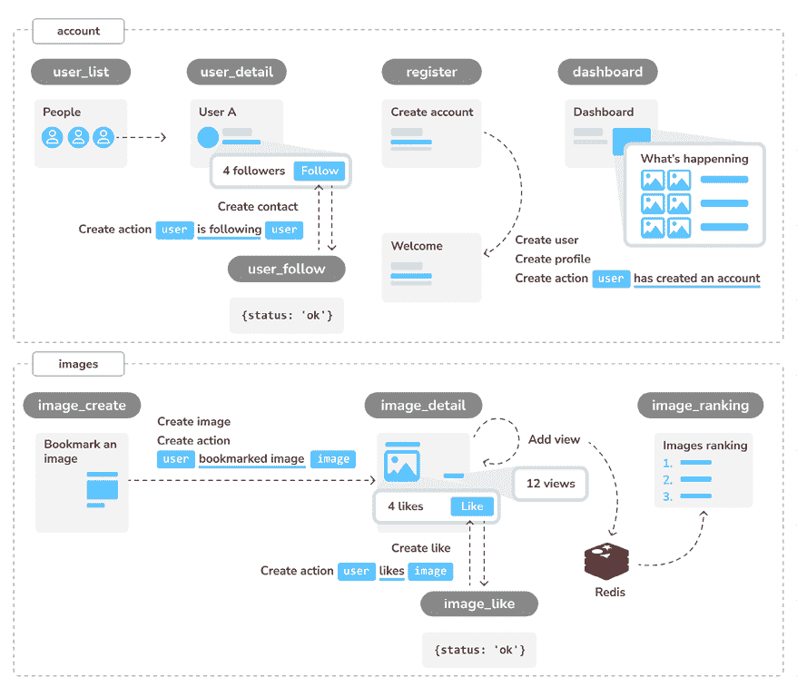

图 7.1：第七章构建的功能图

在本章中，你将构建`user_list`视图以列出所有用户和`user_detail`视图以显示单个用户资料。你将使用`user_follow`视图通过 JavaScript 实现关注系统，并存储用户关注。你将创建一个存储用户行为的系统，并实现创建账户、关注用户、创建图片和喜欢图片的操作。你将使用这个系统在`dashboard`视图中显示最新的行为流。你还将使用 Redis 在每次加载`image_detail`视图时存储一个*视图*，并创建`image_ranking`视图以显示最受欢迎图片的排名。

本章的源代码可以在[`github.com/PacktPublishing/Django-5-by-example/tree/main/Chapter07`](https://github.com/PacktPublishing/Django-5-by-example/tree/main/Chapter07)找到。

本章中使用的所有 Python 包都包含在章节源代码中的`requirements.txt`文件中。你可以按照以下章节中的说明安装每个 Python 包，或者你可以使用命令`python -m pip install -r requirements.txt`一次性安装所有需求。

# 构建关注系统

让我们在项目中构建一个关注系统。这意味着你的用户将能够相互关注并跟踪其他用户在平台上分享的内容。用户之间的关系是*多对多*关系；这意味着一个用户可以关注多个用户，反过来，他们也可以被多个用户关注。

## 使用中间模型创建多对多关系

在前面的章节中，你通过向相关模型之一添加`ManyToManyField`并让 Django 创建关系数据库表来创建多对多关系。这在大多数情况下是合适的，但有时你可能需要为关系创建一个中间模型。当你想在关系上存储额外的信息时，例如关系创建的日期或描述关系性质的字段，创建中间模型是必要的。

让我们创建一个中间模型来建立用户之间的关系。使用中间模型的原因有两个：

+   你正在使用 Django 提供的`User`模型，并且想要避免修改它

+   你想要存储关系创建的时间

编辑`account`应用的`models.py`文件，并向其中添加以下代码：

```py
class Contact(models.Model):
    user_from = models.ForeignKey(
        settings.AUTH_USER_MODEL,
        related_name='rel_from_set',
        on_delete=models.CASCADE
    )
    user_to = models.ForeignKey(
        settings.AUTH_USER_MODEL,
        related_name='rel_to_set',
        on_delete=models.CASCADE
    )
    created = models.DateTimeField(auto_now_add=True)
    class Meta:
        indexes = [
            models.Index(fields=['-created']),
        ]
        ordering = ['-created']
    def __str__(self):
        return f'{self.user_from} follows {self.user_to}' 
```

上述代码展示了你将用于用户关系的`Contact`模型。它包含以下字段：

+   `user_from`: 创建关系的用户的`ForeignKey`

+   `user_to`: 被关注的用户的`ForeignKey`

+   `created`: 一个带有`auto_now_add=True`的`DateTimeField`字段，用于存储关系创建的时间

在`ForeignKey`字段上会自动创建数据库索引。在模型的`Meta`类中，我们为`created`字段定义了一个降序数据库索引。我们还添加了`ordering`属性来告诉 Django 默认按`created`字段排序结果。我们通过在字段名前使用连字符来表示降序，例如`-created`。

*图 7.2*展示了中间`Contact`模型及其对应的数据库表：

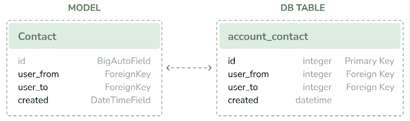

图 7.2：中间`Contact`模型及其数据库表

使用 ORM，你可以创建一个用户`user1`关注另一个用户`user2`的关系，如下所示：

```py
user1 = User.objects.get(id=1)
user2 = User.objects.get(id=2)
Contact.objects.create(user_from=user1, user_to=user2) 
```

相关管理器`rel_from_set`和`rel_to_set`将返回`Contact`模型的 QuerySet。为了从`User`模型访问关系的另一端，最好在`User`中包含一个`ManyToManyField`，如下所示：

```py
following = models.ManyToManyField(
    'self',
    through=Contact,
    related_name='followers',
    symmetrical=False
) 
```

在前面的示例中，你通过在`ManyToManyField`中添加`through=Contact`来告诉 Django 使用你的自定义中间模型来处理关系。这是一个从`User`模型到自身的多对多关系；你在`ManyToManyField`中引用`'self'`来创建与同一模型的关系。

当你在多对多关系中需要额外的字段时，为关系的每一侧创建一个带有`ForeignKey`的自定义模型。你可以使用中间模型来管理关系，或者你可以在相关模型之一中添加一个`ManyToManyField`字段，并通过将其包含在`through`参数中来告诉 Django 使用你的中间模型。

如果 `User` 模型是应用程序的一部分，你可以将前面的字段添加到模型中。然而，你不能直接修改 `User` 类，因为它属于 `django.contrib.auth` 应用。让我们采取稍微不同的方法，通过动态地将此字段添加到 `User` 模型中。

编辑 `account` 应用的 `models.py` 文件，并添加以下加粗的行：

```py
**from** **django.contrib.auth** **import** **get_user_model**
# ...
**# Add the following field to User dynamically**
**user_model = get_user_model()**
**user_model.add_to_class(**
**'following'****,**
 **models.ManyToManyField(**
**'self'****,**
 **through=Contact,**
 **related_name=****'followers'****,**
 **symmetrical=****False**
 **)**
**)** 
```

在前面的代码中，你使用 Django 提供的通用函数 `get_user_model()` 获取用户模型。你使用 Django 模型的 `add_to_class()` 方法来猴子补丁 `User` 模型。

请注意，使用 `add_to_class()` 不是向模型中添加字段的推荐方式。然而，你可以利用它在这个案例中的使用，避免创建自定义用户模型，同时保留 Django 内置 `User` 模型的所有优点。

你还简化了使用 Django ORM 通过 `user.followers.all()` 和 `user.following.all()` 获取相关对象的方式。你使用中间的 `Contact` 模型，避免了涉及额外数据库连接的复杂查询，就像你在自定义 `Profile` 模型中定义关系时那样。这个多对多关系的表将使用 `Contact` 模型创建。因此，动态添加的 `ManyToManyField` 不会对 Django `User` 模型产生任何数据库更改。

请记住，在大多数情况下，最好是向之前创建的 `Profile` 模型中添加字段，而不是对 `User` 模型进行猴子补丁。理想情况下，你不应该修改现有的 Django `User` 模型。Django 允许你使用自定义用户模型。如果你想使用自定义用户模型，请查看[`docs.djangoproject.com/en/5.0/topics/auth/customizing/#specifying-a-custom-user-model`](https://docs.djangoproject.com/en/5.0/topics/auth/customizing/#specifying-a-custom-user-model)上的文档。

当你开始一个新的项目时，强烈建议你创建一个自定义用户模型，即使默认的 `User` 模型对你来说已经足够。这是因为你获得了自定义模型的选择权。

注意，该关系包括 `symmetrical=False`。当你在一个模型中定义一个与自身建立关系的 `ManyToManyField` 时，Django 会强制该关系是对称的。在这种情况下，你设置 `symmetrical=False` 来定义一个非对称关系（如果我理解正确，这并不意味着你自动跟随我）。

当你使用中间模型进行多对多关系时，一些相关管理器的功能被禁用，例如 `add()`、`create()` 或 `remove()`。你需要创建或删除中间模型的实例。

运行以下命令以生成 `account` 应用程序的初始迁移：

```py
python manage.py makemigrations account 
```

你将获得如下所示的输出：

```py
Migrations for 'account':
  account/migrations/0002_contact.py
    - Create model Contact 
```

现在，运行以下命令以将应用程序与数据库同步：

```py
python manage.py migrate account 
```

你应该会看到一个包含以下行的输出：

```py
Applying account.0002_contact... OK 
```

`Contact` 模型现在已同步到数据库，你可以创建用户之间的关系。然而，你的网站还没有提供浏览用户或查看特定用户资料的方法。让我们为 `User` 模型构建列表和详细视图。

## 创建用户资料的列表和详细视图

打开 `account` 应用程序的 `views.py` 文件，并添加以下以粗体显示的代码：

```py
from django.contrib.auth import authenticate, **get_user_model,** login
from django.shortcuts import **get_object_or_404,** render
# ...
**User = get_user_model()**
**@login_required**
**def****user_list****(****request****):**
 **users = User.objects.****filter****(is_active=****True****)**
**return** **render(**
**request,**
**'account/user/list.html'****,**
**{****'section'****:** **'people'****,** **'users'****: users}**
 **)**
**@login_required**
**def****user_detail****(****request, username****):**
 **user = get_object_or_404(User, username=username, is_active=****True****)**
**return** **render(**
 **request,**
**'account/user/detail.html'****,**
 **{****'section'****:** **'people'****,** **'user'****: user}**
 **)** 
```

这些是针对 `User` 对象的简单列表和详细视图。我们通过使用 `get_user_model()` 函数动态检索 `User` 模型。`user_list` 视图获取所有活跃用户。Django 的 `User` 模型包含一个 `is_active` 标志，用于指定用户账户是否被视为活跃。你可以通过 `is_active=True` 过滤查询，以返回仅活跃用户。此视图返回所有结果，但你可以通过添加分页来改进它，就像你在 `image_list` 视图中做的那样。

`user_detail` 视图使用 `get_object_or_404()` 快捷方式检索具有给定用户名的活跃用户。如果找不到具有给定用户名的活跃用户，视图将返回 HTTP `404` 响应。

编辑 `account` 应用程序的 `urls.py` 文件，并为每个视图添加一个 URL 模式，如下所示。新的代码以粗体显示：

```py
urlpatterns = [
    # ...
    path('', include('django.contrib.auth.urls')),
    path('', views.dashboard, name='dashboard'),
    path('register/', views.register, name='register'),
    path('edit/', views.edit, name='edit'),
 **path(****'users/'****, views.user_list, name=****'user_list'****),**
 **path(****'users/<username>/'****, views.user_detail, name=****'user_detail'****),**
] 
```

你将使用 `user_detail` URL 模式来生成用户的规范 URL。你已经在模型中定义了一个 `get_absolute_url()` 方法，用于返回每个对象的规范 URL。另一种指定模型 URL 的方法是在项目中添加 `ABSOLUTE_URL_OVERRIDES` 设置。

通过在 `user_detail` URL 模式中使用用户名而不是用户 ID，你提高了可用性和安全性。与顺序 ID 不同，用户名通过隐藏你的数据结构来阻止枚举攻击。这使得攻击者更难预测 URL 并制定攻击向量。

编辑你项目的 `settings.py` 文件，并添加以下以粗体显示的代码：

```py
**from** **django.urls** **import** **reverse_lazy**
# ...
**ABSOLUTE_URL_OVERRIDES = {**
**'auth.user'****:** **lambda** **u: reverse_lazy(****'user_detail'****, args=[u.username])**
**}** 
```

Django 会动态地将 `get_absolute_url()` 方法添加到任何出现在 `ABSOLUTE_URL_OVERRIDES` 设置中的模型。此方法返回设置中指定的给定模型的对应 URL。在上面的代码部分中，你为 `auth.user` 对象生成了给定用户的 `user_detail` URL。现在，你可以在 `User` 实例上使用 `get_absolute_url()` 来检索其对应的 URL。

使用以下命令打开 Python 命令行界面：

```py
python manage.py shell 
```

然后运行以下代码进行测试：

```py
>>> from django.contrib.auth.models import User
>>> user = User.objects.latest('id')
>>> str(user.get_absolute_url())
'/account/users/ellington/' 
```

返回的 URL 符合预期的格式，`/account/users/<username>/`。

你需要为刚刚创建的视图创建模板。将以下目录和文件添加到 `account` 应用程序的 `templates/account/` 目录中：

```py
/user/
    detail.html
    list.html 
```

编辑 `account/user/list.html` 模板，并向其中添加以下代码：

```py


People

  <h1>People</h1>
<div id="people-list">
    
      <div class="user">
<a href="{{ user.get_absolute_url }}">

</a>
<div class="info">
<a href="{{ user.get_absolute_url }}" class="title">
            {{ user.get_full_name }}
          </a>
</div>
</div>
    
  </div>
 
```

上述模板允许你列出网站上所有活跃用户。你遍历给定的用户，并使用来自`easy-thumbnails`的``模板标签生成个人头像缩略图。

注意，用户需要有一个个人头像。为了给没有个人头像的用户使用默认头像，你可以在代码中添加一个`if`/`else`语句来检查用户是否有个人照片，例如` {# photo thumbnail #}  {# default image #} `。

打开你的项目的`base.html`模板，并在以下菜单项的`href`属性中包含`user_list` URL。新的代码已加粗：

```py
<ul class="menu">
  ...
  <li class="selected">
<a href="**"**>People</a>
</li>
</ul> 
```

使用以下命令启动开发服务器：

```py
python manage.py runserver 
```

在你的浏览器中打开`http://127.0.0.1:8000/account/users/`。你应该会看到一个类似以下用户列表：

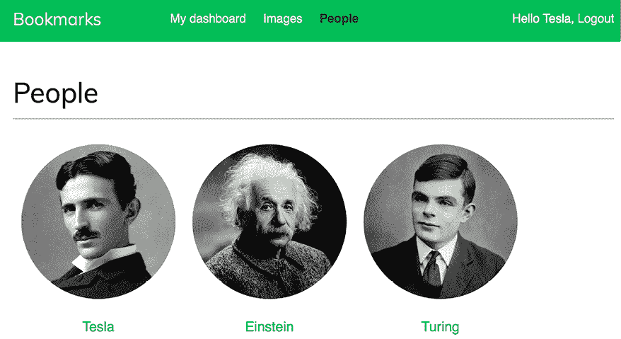

图 7.3：带有个人头像缩略图的用户列表页面

记住，如果你在生成缩略图时遇到任何困难，你可以在`settings.py`文件中添加`THUMBNAIL_DEBUG = True`来在 shell 中获得调试信息。

编辑`account`应用的`account/user/detail.html`模板，并向其中添加以下代码：

```py


{{ user.get_full_name }}

  <h1>{{ user.get_full_name }}</h1>
<div class="profile-info">

</div>
  
    <span class="count">
<span class="total">{{ total_followers }}</span>
      follower{{ total_followers|pluralize }}
    </span>
<a href="#" data-id="{{ user.id }}" data-action="unfollow" class="follow button">
      
        Follow
      
        Unfollow
      
    </a>
<div id="image-list" class="image-container">
      
    </div>
  
 
```

确保不要将模板标签拆分成多行；Django 不支持多行标签。

在`detail`模板中，显示用户个人资料，并使用``模板标签来显示个人头像。同时展示关注者总数，并提供一个关注或取消关注用户的链接。此链接将用于关注/取消关注特定用户。`<a>` HTML 元素的`data-id`和`data-action`属性包含用户 ID 和当链接元素被点击时执行的初始操作——`follow`或`unfollow`。初始操作（`follow`或`unfollow`）取决于请求页面的用户是否已经是该用户的关注者。用户标记的图片通过包含`images/image/list_images.html`模板来显示。

再次打开你的浏览器，点击一个标记了一些图片的用户。用户页面将如下所示：

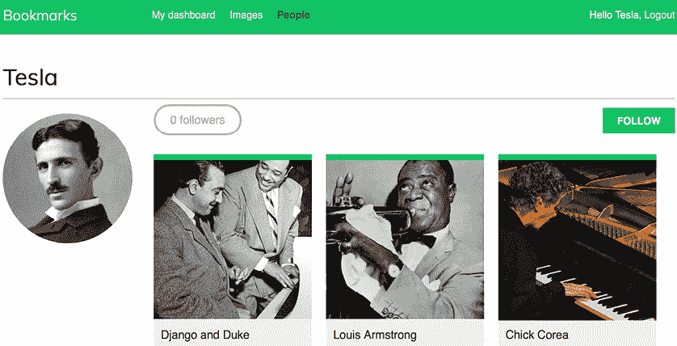

图 7.4：用户详情页面

上述图片是 ataelw 创作的* Chick Corea*，采用 Creative Commons Attribution 2.0 通用许可：[`creativecommons.org/licenses/by/2.0/`](https://creativecommons.org/licenses/by/2.0/)。

## 使用 JavaScript 添加用户关注/取消关注操作

让我们添加关注/取消关注用户的功能。我们将创建一个新的视图来关注/取消关注用户，并使用 JavaScript 实现异步 HTTP 请求以执行关注/取消关注操作。

编辑`account`应用的`views.py`文件，并添加以下加粗代码：

```py
from django.http import HttpResponse**, JsonResponse**
**from** **django.views.decorators.http** **import** **require_POST**
from .models import **Contact,** Profile
# ...
**@require_POST**
**@login_required**
**def****user_follow****(****request****):**
 **user_id = request.POST.get(****'id'****)**
 **action = request.POST.get(****'action'****)**
**if** **user_id** **and** **action:**
**try****:**
 **user = User.objects.get(****id****=user_id)**
**if** **action ==** **'follow'****:**
 **Contact.objects.get_or_create(**
 **user_from=request.user,**
 **user_to=user**
 **)**
**else****:**
 **Contact.objects.****filter****(**
 **user_from=request.user,**
 **user_to=user**
 **).delete()**
**return** **JsonResponse({****'status'****:****'ok'****})**
**except** **User.DoesNotExist:**
**return** **JsonResponse({****'status'****:****'error'****})**
**return** **JsonResponse({****'status'****:****'error'****})** 
```

`user_follow` 视图与你在 *第六章* 中创建的 `image_like` 视图非常相似，*在您的网站上分享内容*。由于你正在使用用于用户多对多关系的自定义中间模型，因此 `ManyToManyField` 的自动管理器的默认 `add()` 和 `remove()` 方法不可用。相反，使用中间 `Contact` 模型来创建或删除用户关系。

编辑 `account` 应用程序的 `urls.py` 文件，并添加以下以粗体显示的 URL 模式：

```py
urlpatterns = [
    path('', include('django.contrib.auth.urls')),
    path('', views.dashboard, name='dashboard'),
    path('register/', views.register, name='register'),
    path('edit/', views.edit, name='edit'),
    path('users/', views.user_list, name='user_list'),
    **path(****'****users/follow/'****, views.user_follow, name=****'user_follow'****),**
    path('users/<username>/', views.user_detail, name='user_detail'),
] 
```

确保将前面的模式放在 `user_detail` URL 模式之前。否则，任何对 `/users/follow/` 的请求都将匹配 `user_detail` 模式的正则表达式，并且将执行该视图。记住，在每次 HTTP 请求中，Django 都会按照出现的顺序将请求的 URL 与每个模式进行比较，并在第一个匹配项处停止。

编辑 `account` 应用程序的 `user/detail.html` 模板，并向其中添加以下代码：

```py

  const url = '';
  var options = {
    method: 'POST',
    headers: {'X-CSRFToken': csrftoken},
    mode: 'same-origin'
  }
  document.querySelector('a.follow')
          .addEventListener('click', function(e){
    e.preventDefault();
    var followButton = this;
    // add request body
var formData = new FormData();
    formData.append('id', followButton.dataset.id);
    formData.append('action', followButton.dataset.action);
    options['body'] = formData;
    // send HTTP request
fetch(url, options)
    .then(response => response.json())
    .then(data => {
      if (data['status'] === 'ok')
      {
        var previousAction = followButton.dataset.action;
        // toggle button text and data-action
var action = previousAction === 'follow' ? 'unfollow' : 'follow';
        followButton.dataset.action = action;
        followButton.innerHTML = action;
        // update follower count
var followerCount = document.querySelector('span.count .total');
        var totalFollowers = parseInt(followerCount.innerHTML);
        followerCount.innerHTML = previousAction === 'follow' ? totalFollowers + 1 : totalFollowers - 1;
      }
    })
  });
 
```

前面的模板块包含执行关注或取消关注特定用户的异步 HTTP 请求的 JavaScript 代码，以及切换关注/取消关注链接。

使用 Fetch API 执行 AJAX 请求，并根据其前一个值设置 `data-action` 属性和 HTML `<a>` 元素的文本。当操作完成后，页面上显示的关注者总数也会更新。

打开现有用户的用户详情页面，并点击 **关注** 链接来测试你刚刚构建的功能。你会在以下图像的左侧看到，关注者数量已经增加：


图 7.5：关注者数量和关注/取消关注按钮

关注系统现在已经完成，用户可以相互关注。接下来，我们将构建一个活动流，为每个用户创建基于他们关注的人的相关内容。

# 创建活动流应用程序

许多社交网站向用户展示活动流，以便他们可以跟踪其他用户在平台上的行为。活动流是用户或一组用户最近执行的活动列表。例如，Facebook 的新闻源就是一个活动流。示例操作可以是 *用户 X 收藏了图片 Y* 或 *用户 X 现在正在关注用户 Y*。

你将构建一个活动流应用程序，以便每个用户都可以看到他们关注的用户的最近互动。为此，你需要一个模型来保存用户在网站上执行的操作，以及一个简单的方法来向流中添加操作。

在你的项目中使用以下命令创建一个名为 `actions` 的新应用程序：

```py
python manage.py startapp actions 
```

将新应用程序添加到项目中的 `settings.py` 文件中的 `INSTALLED_APPS` 以激活该应用程序。新行以粗体显示：

```py
INSTALLED_APPS = [
    # ...
**'actions.apps.ActionsConfig'****,**
] 
```

编辑 `actions` 应用程序的 `models.py` 文件，并向其中添加以下代码：

```py
**from** **django.conf** **import** **settings**
from django.db import models
**class****Action****(models.Model):**
 **user = models.ForeignKey(**
 **settings.AUTH_USER_MODEL,**
 **related_name=****'actions'****,**
 **on_delete=models.CASCADE**
 **)**
 **verb = models.CharField(max_length=****255****)**
 **created = models.DateTimeField(auto_now_add=****True****)**
**class****Meta****:**
 **indexes = [**
 **models.Index(fields=[****'-created'****]),**
 **]**
 **ordering = [****'-created'****]** 
```

上述代码显示了将用于存储用户活动的`Action`模型。该模型的字段如下：

+   `user`: 执行该操作的用户；这是一个指向`AUTH_USER_MODEL`的`ForeignKey`，默认情况下是 Django 的`User`模型。

+   `verb`: 描述用户所执行操作的动词。

+   `created`: 该操作创建的日期和时间。我们使用`auto_now_add=True`来自动将此字段设置为对象在数据库中首次保存时的当前日期和时间。

在模型的`Meta`类中，我们为`created`字段定义了一个降序数据库索引。我们还添加了`ordering`属性，告诉 Django 默认按`created`字段降序排序结果。

使用这个基本模型，您只能存储诸如“用户 X 做了某事”之类的操作。您需要一个额外的`ForeignKey`字段来保存涉及`target`对象的操作，例如“用户 X 收藏了图像 Y”或“用户 X 现在正在关注用户 Y”。如您所知，一个普通的`ForeignKey`只能指向一个模型。相反，您将需要一个方法，使操作的`target`对象成为现有模型的一个实例。这正是 Django 的`contenttypes`框架将帮助您完成的。

## 使用`contenttypes`框架

Django 在`django.contrib.contenttypes`位置包含一个`contenttypes`框架。此应用程序可以跟踪您项目中安装的所有模型，并提供一个通用接口与您的模型交互。

当您使用`startproject`命令创建新项目时，`django.contrib.contenttypes`应用程序默认包含在`INSTALLED_APPS`设置中。它被其他`contrib`包使用，例如认证框架和管理应用程序。

`contenttypes`应用程序包含一个`ContentType`模型。该模型的实例代表您应用程序的实际模型，并且当您的项目中新安装模型时，会自动创建新的`ContentType`实例。`ContentType`模型具有以下字段：

+   `app_label`: 这表示模型所属的应用程序名称。这自动从模型`Meta`选项的`app_label`属性中获取。例如，您的`Image`模型属于`images`应用程序。

+   `model`: 模型类名称。

+   `name`: 这是一个属性，表示模型的可读名称，自动从模型`Meta`选项的`verbose_name`属性中生成。

让我们看看您如何与`ContentType`对象交互。使用以下命令打开 shell：

```py
python manage.py shell 
```

您可以通过使用`app_label`和`model`属性进行查询来获取与特定模型对应的`ContentType`对象，如下所示：

```py
>>> from django.contrib.contenttypes.models import ContentType
>>> image_type = ContentType.objects.get(app_label='images', model='image')
>>> image_type
<ContentType: images | image> 
```

您还可以通过调用其`model_class()`方法从`ContentType`对象中检索模型类：

```py
>>> image_type.model_class()
<class 'images.models.Image'> 
```

获取特定模型类的`ContentType`对象也很常见，如下所示：

```py
>>> from images.models import Image
>>> ContentType.objects.get_for_model(Image)
<ContentType: images | image> 
```

这些只是使用`contenttypes`的一些示例。Django 提供了更多与之交互的方式。您可以在[`docs.djangoproject.com/en/5.0/ref/contrib/contenttypes/`](https://docs.djangoproject.com/en/5.0/ref/contrib/contenttypes/)找到`contenttypes`框架的官方文档。

## 将泛型关系添加到您的模型中

在泛型关系中，`ContentType`对象扮演着指向用于关系的模型的角色。您需要在模型中设置泛型关系时使用三个字段：

+   一个指向`ContentType`的`ForeignKey`字段：这将告诉您关系的模型是什么

+   存储相关对象主键的字段：这通常将是一个`PositiveIntegerField`，以匹配 Django 的自动主键字段

+   使用前两个字段定义和管理泛型关系的字段：`contenttypes`框架为此目的提供了一个`GenericForeignKey`字段

编辑`actions`应用程序的`models.py`文件，并向其中添加以下加粗的代码：

```py
from django.conf import settings
**from** **django.contrib.contenttypes.fields** **import** **GenericForeignKey**
**from** **django.contrib.contenttypes.models** **import** **ContentType**
from django.db import models
class Action(models.Model):
    user = models.ForeignKey(
        settings.AUTH_USER_MODEL,
        related_name='actions',
        on_delete=models.CASCADE
    )
    verb = models.CharField(max_length=255)
    created = models.DateTimeField(auto_now_add=True)
 **target_ct = models.ForeignKey(**
 **ContentType,**
 **blank=****True****,**
 **null=****True****,**
 **related_name=****'target_obj'****,**
 **on_delete=models.CASCADE**
 **)**
 **target_id = models.PositiveIntegerField(null=****True****, blank=****True****)**
 **target = GenericForeignKey(****'target_ct'****,** **'target_id'****)**
class Meta:
        indexes = [
            models.Index(fields=['-created']),
 **models.Index(fields=[****'target_ct'****,** **'target_id'****]),**
        ]
        ordering = ['-created'] 
```

我们已向`Action`模型添加了以下字段：

+   `target_ct`: 指向`ContentType`模型的`ForeignKey`字段

+   `target_id`: 存储相关对象主键的`PositiveIntegerField`

+   `target`: 一个基于前两个字段组合的指向相关对象的`GenericForeignKey`字段

我们还添加了一个包含`target_ct`和`target_id`字段的多个字段索引。

Django 不会在数据库中创建`GenericForeignKey`字段。唯一映射到数据库字段的是`target_ct`和`target_id`字段。这两个字段都有`blank=True`和`null=True`属性，这样在保存`Action`对象时不需要`target`对象。

您可以通过使用泛型关系而不是外键来使您的应用程序更加灵活。泛型关系允许您以非排他方式关联模型，使单个模型能够关联到多个其他模型。

*图 7.6*显示了`Action`模型，包括与`contenttypes` Django contrib 包的`ContentType`模型的关联：

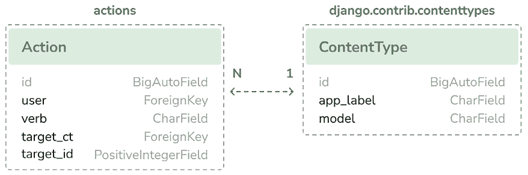

图 7.6：Action 模型和 ContentType 模型

运行以下命令为此应用程序创建初始迁移：

```py
python manage.py makemigrations actions 
```

您应该看到以下输出：

```py
Migrations for 'actions':
  actions/migrations/0001_initial.py
    - Create model Action
    - Create index actions_act_created_64f10d_idx on field(s) -created of model action
    - Create index actions_act_target__f20513_idx on field(s) target_ct, target_id of model action 
```

然后，运行下一个命令以将应用程序与数据库同步：

```py
python manage.py migrate 
```

命令的输出应指示新迁移已应用，如下所示：

```py
Applying actions.0001_initial... OK 
```

让我们将`Action`模型添加到管理网站。编辑`actions`应用程序的`admin.py`文件，并向其中添加以下代码：

```py
from django.contrib import admin
**from** **.models** **import** **Action**
**@admin.register(****Action****)**
**class****ActionAdmin****(admin.ModelAdmin):**
 **list_display = [****'user'****,** **'verb'****,** **'target'****,** **'created'****]**
 **list_filter = [****'created'****]**
 **search_fields = [****'verb'****]** 
```

您已在管理网站上注册了`Action`模型。

使用以下命令启动开发服务器：

```py
python manage.py runserver 
```

在您的浏览器中打开`http://127.0.0.1:8000/admin/actions/action/add/`。您应该看到创建新`Action`对象的页面，如下所示：

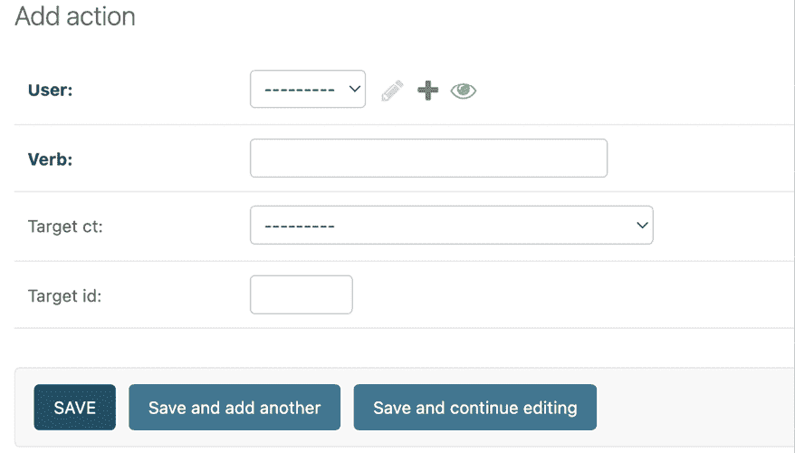

图 7.7：Django 管理网站上的添加操作页面

如您在前面的屏幕截图中所注意到的，只有映射到实际数据库字段的`target_ct`和`target_id`字段被显示。`GenericForeignKey`字段在表单中不出现。`target_ct`字段允许您选择您 Django 项目中注册的任何模型。您可以使用`target_ct`字段中的`limit_choices_to`属性将内容类型限制为有限的一组模型；`limit_choices_to`属性允许您将`ForeignKey`字段的内容限制为特定的值集。

在`actions`应用目录内创建一个新文件，并将其命名为`utils.py`。您需要定义一个快捷函数，这将允许您以简单的方式创建新的`Action`对象。编辑新的`utils.py`文件，并向其中添加以下代码：

```py
from django.contrib.contenttypes.models import ContentType
from .models import Action
def create_action(user, verb, target=None):
    action = Action(user=user, verb=verb, target=target)
    action.save() 
```

`create_action()`函数允许您创建可选包含`target`对象的操作。您可以在代码的任何位置使用此函数作为快捷方式将新操作添加到活动流中。

## 避免在活动流中重复操作

有时，您的用户可能会多次点击**喜欢**或**不喜欢**按钮，或者在短时间内多次执行相同的操作。这很容易导致存储和显示重复操作。为了避免这种情况，让我们改进`create_action()`函数以跳过明显的重复操作。

按照以下方式编辑`actions`应用的`utils.py`文件：

```py
**import** **datetime**
from django.contrib.contenttypes.models import ContentType
**from** **django.utils** **import** **timezone**
from .models import Action
def create_action(user, verb, target=None):
**# check for any similar action made in the last minute**
 **now = timezone.now()**
 **last_minute = now - datetime.timedelta(seconds=****60****)**
 **similar_actions = Action.objects.****filter****(**
 **user_id=user.****id****,**
 **verb= verb,**
 **created__gte=last_minute**
 **)**
**if** **target:**
 **target_ct = ContentType.objects.get_for_model(target)**
 **similar_actions = similar_actions.****filter****(**
 **target_ct=target_ct,**
 **target_id=target.****id**
**)**
**if****not** **similar_actions:**
**# no existing actions found**
        action = Action(user=user, verb=verb, target=target)
        action.save()
**return****True**
**return****False** 
```

您已将`create_action()`函数更改为避免保存重复操作并返回一个布尔值来告诉您操作是否已保存。这就是您避免重复的方法：

1.  首先，您使用 Django 提供的`timezone.now()`方法获取当前时间。此方法与`datetime.datetime.now()`执行相同，但返回一个时区感知对象。Django 提供了一个名为`USE_TZ`的设置来启用或禁用时区支持。使用`startproject`命令创建的默认`settings.py`文件包括`USE_TZ=True`。

1.  您使用`last_minute`变量来存储一分钟前的日期时间，并检索用户从那时起执行的任何相同操作。

1.  如果在过去一分钟内不存在相同的操作，您将创建一个`Action`对象。如果创建了`Action`对象，则返回`True`，否则返回`False`。

## 将用户操作添加到活动流

是时候向您的视图添加一些操作来为您的用户构建活动流了。您将为以下每个交互存储一个操作：

+   用户收藏图片

+   用户喜欢图片

+   用户创建账户

+   用户开始关注另一个用户

编辑`images`应用的`views.py`文件并添加以下导入：

```py
from actions.utils import create_action 
```

在`image_create`视图中，在保存图片后添加`create_action()`，如下所示。新行以粗体突出显示：

```py
@login_required
def image_create(request):
    if request.method == 'POST':
        # form is sent
        form = ImageCreateForm(data=request.POST)
        if form.is_valid():
            # form data is valid
            cd = form.cleaned_data
            new_image = form.save(commit=False)
            # assign current user to the item
            new_image.user = request.user
            new_image.save()
 **create_action(request.user,** **'bookmarked image'****, new_image)**
            messages.success(request, 'Image added successfully')
            # redirect to new created image detail view
return redirect(new_image.get_absolute_url())
    else:
        # build form with data provided by the bookmarklet via GET
        form = ImageCreateForm(data=request.GET)
    return render(
 request,
 'images/image/create.html',
 {'section': 'images', 'form': form}
    ) 
```

在`image_like`视图中，在将用户添加到`users_like`关系后添加`create_action()`，如下所示。新行以粗体突出显示：

```py
@login_required
@require_POST
def image_like(request):
    image_id = request.POST.get('id')
    action = request.POST.get('action')
    if image_id and action:
        try:
            image = Image.objects.get(id=image_id)
            if action == 'like':
                image.users_like.add(request.user)
 **create_action(request.user,** **'likes'****, image)**
else:
                image.users_like.remove(request.user)
            return JsonResponse({'status':'ok'})
        except Image.DoesNotExist:
            pass
return JsonResponse({'status':'error'}) 
```

现在，编辑 `account` 应用程序的 `views.py` 文件并添加以下导入：

```py
from actions.utils import create_action 
```

在 `register` 视图中，在创建 `Profile` 对象后添加 `create_action()`，如下所示。新行以粗体突出显示：

```py
def register(request):
    if request.method == 'POST':
        user_form = UserRegistrationForm(request.POST)
        if user_form.is_valid():
            # Create a new user object but avoid saving it yet
            new_user = user_form.save(commit=False)
            # Set the chosen password
            new_user.set_password(
                user_form.cleaned_data['password']
            )
            # Save the User object
            new_user.save()
            # Create the user profile
            Profile.objects.create(user=new_user)
 **create_action(new_user,** **'has created an account'****)**
return render(
 request,
 'account/register_done.html',
 {'new_user': new_user}
 )
    else:
        user_form = UserRegistrationForm()
    return render(
 request,
 'account/register.html',
 {'user_form': user_form}
 ) 
```

在 `user_follow` 视图中，添加 `create_action()`，如下所示。新行以粗体突出显示：

```py
@require_POST
@login_required
def user_follow(request):
    user_id = request.POST.get('id')
    action = request.POST.get('action')
    if user_id and action:
        try:
            user = User.objects.get(id=user_id)
            if action == 'follow':
                Contact.objects.get_or_create(
                    user_from=request.user,
                    user_to=user
                )
 **create_action(request.user,** **'****is following'****, user)**
else:
                Contact.objects.filter(
                    user_from=request.user,
                    user_to=user
                ).delete()
            return JsonResponse({'status':'ok'})
        except User.DoesNotExist:
            return JsonResponse({'status':'error'})
    return JsonResponse({'status':'error'}) 
```

如前述代码所示，由于 `Action` 模型和辅助函数，将新操作保存到活动流中非常简单。

## 显示活动流

最后，您需要一种方式来显示每个用户的活动流。您将在用户的仪表板上包含活动流。编辑 `account` 应用程序的 `views.py` 文件。导入 `Action` 模型并修改 `dashboard` 视图，如下所示。新代码以粗体突出显示：

```py
**from** **actions.models** **import** **Action**
# ...
@login_required
def dashboard(request):
    # Display all actions by default
 **actions = Action.objects.exclude(user=request.user)**
 **following_ids = request.user.following.values_list(**
**'id'****, flat=****True**
**)**
**if** **following_ids:**
**# If user is following others, retrieve only their actions**
 **actions = actions.****filter****(user_id__in=following_ids)**
 **actions = actions[:****10****]**
return render(
 request,
 'account/dashboard.html',
 {'section': 'dashboard'**,** **'actions'****: actions}**
    ) 
```

在前面的视图中，您从数据库中检索所有操作，但不包括当前用户执行的操作。默认情况下，您检索平台上所有用户执行的最新操作。

如果用户正在关注其他用户，您将查询限制为仅检索他们关注的用户执行的操作。最后，您将结果限制为返回的前 10 个操作。您不使用 `order_by()` 在 QuerySet 中，因为您依赖于在 `Action` 模型的 `Meta` 选项中提供的默认排序。最近的操作将首先显示，因为您在 `Action` 模型中设置了 `ordering = ['-created']`。

## 优化涉及相关对象的 QuerySets

每次检索 `Action` 对象时，您通常会访问其相关的 `User` 对象和用户的 `Profile` 对象。Django ORM 提供了一种简单的方法来同时检索相关对象，从而避免对数据库进行额外的查询。

### 使用 select_related()

Django 提供了一个名为 `select_related()` 的 QuerySet 方法，允许您检索一对多关系中的相关对象。这相当于一个单一、更复杂的 QuerySet，但在访问相关对象时可以避免额外的查询。

`select_related` 方法用于 `ForeignKey` 和 `OneToOne` 字段。它通过执行 SQL `JOIN` 并在 `SELECT` 语句中包含相关对象的字段来实现。

要利用 `select_related()`，请编辑账户应用程序 `views.py` 文件中前面的代码行，添加 `select_related`，包括您将使用的字段，如下所示。编辑 `account` 应用程序的 `views.py` 文件。新代码以粗体突出显示：

```py
@login_required
def dashboard(request):
    # Display all actions by default
    actions = Action.objects.exclude(user=request.user)
    following_ids = request.user.following.values_list(
        'id', flat=True
 )
    if following_ids:
        # If user is following others, retrieve only their actions
        actions = actions.filter(user_id__in=following_ids)
    actions = actions**.select_related(**
**'user'****,** **'user__profile'**
**)**[:10]
    return render(
 request,
 'account/dashboard.html',
 {'section': 'dashboard', 'actions': actions}
    ) 
```

您使用 `user__profile` 在单个 SQL 查询中连接 `Profile` 表。如果您不对 `select_related()` 传递任何参数，它将检索所有 `ForeignKey` 关系的对象。始终将 `select_related()` 限制在之后将访问的关系上。

谨慎使用 `select_related()` 可以显著提高执行时间。

### 使用 prefetch_related()

`select_related()`可以帮助你提高检索一对多关系中的相关对象的性能。然而，`select_related()`不适用于多对多或多对一关系（`ManyToMany`或反向`ForeignKey`字段）。Django 提供了一个不同的查询集方法`prefetch_related`，它除了支持`select_related()`的关系外，还适用于多对多和多对一关系。`prefetch_related()`方法为每个关系执行单独的查找，并使用 Python 连接结果。此方法还支持`GenericRelation`和`GenericForeignKey`的预取。

编辑`account`应用程序的`views.py`文件，并为`target`的`GenericForeignKey`字段添加`prefetch_related()`以完成你的查询，如下所示。新的代码以粗体显示：

```py
@login_required
def dashboard(request):
    # Display all actions by default
    actions = Action.objects.exclude(user=request.user)
    following_ids = request.user.following.values_list(
        'id', flat=True
 )
    if following_ids:
        # If user is following others, retrieve only their actions
        actions = actions.filter(user_id__in=following_ids)
    actions = actions.select_related(
        'user', 'user__profile'
 ) **.prefetch_related(****'target'****)**[:10]
    return render(
 request,
 'account/dashboard.html',
 {'section': 'dashboard', 'actions': actions}
    ) 
```

此查询现在已优化以检索用户动作，包括相关对象。

## 创建动作模板

现在让我们创建一个模板来显示特定的`Action`对象。在`actions`应用程序目录内创建一个新的目录，并将其命名为`templates`。向其中添加以下文件结构：

```py
actions/
    action/
        detail.html 
```

编辑`actions/action/detail.html`模板文件，并添加以下行：

```py


<div class="action">
<div class="images">
    
      {% thumbnail user.profile.photo "80x80" crop="100%" as im %}
      <a href="{{ user.get_absolute_url }}">

</a>
    
    
      
        
          {% thumbnail target.image "80x80" crop="100%" as im %}
          <a href="{{ target.get_absolute_url }}">

</a>
        
      
    
  </div>
<div class="info">
<p>
<span class="date">{{ action.created|timesince }} ago</span>
<br />
<a href="{{ user.get_absolute_url }}">
        {{ user.first_name }}
      </a>
      {{ action.verb }}
      
        
          <a href="{{ target.get_absolute_url }}">{{ target }}</a>
        
      
    </p>
</div>
</div>
 
```

这是用来显示`Action`对象的模板。首先，你使用``模板标签来检索执行动作的用户和相关的`Profile`对象。然后，如果`Action`对象有一个相关的`target`对象，就显示`target`对象的图片。最后，显示执行动作的用户、动词以及如果有，`target`对象的链接。

编辑`account/dashboard.html`模板的`account`应用程序，并将以下以粗体显示的代码追加到`content`块的底部：

```py

Dashboard

  ...
**<****h2****>****What's happening****</****h2****>**
**<****div****id****=****"action-list"****>**
 ****
 ****
 ****
**</****div****>**
 
```

在你的浏览器中打开`http://127.0.0.1:8000/account/`。以现有用户身份登录并执行几个动作，以便它们被存储在数据库中。然后，使用另一个用户登录，关注前面的用户，并查看仪表板页面上的生成的动作流。

它应该看起来像以下这样：

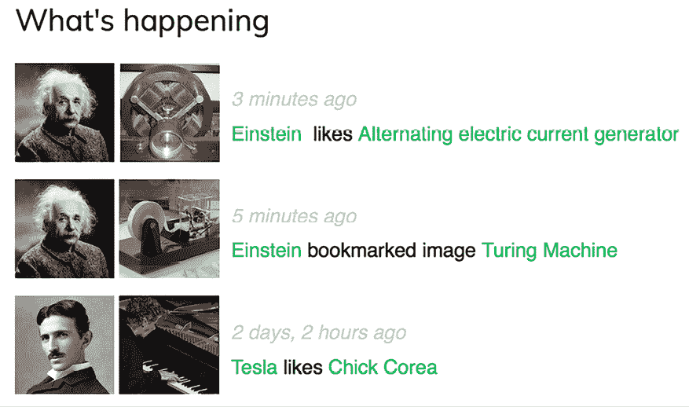

图 7.8：当前用户的动态流

*图 7.8* 图片归属：*

*特斯拉的感应电机* 由 Ctac 提供（许可 – Creative Commons Attribution Share-Alike 3.0 Unported: [`creativecommons.org/licenses/by-sa/3.0/`](https://creativecommons.org/licenses/by-sa/3.0/))

*图灵机模型 Davey 2012* 由 Rocky Acosta 提供（许可 – Creative Commons Attribution 3.0 Unported: [`creativecommons.org/licenses/by/3.0/`](https://creativecommons.org/licenses/by/3.0/))

* Chick Corea* 由 ataelw 提供（许可 – Creative Commons Attribution 2.0 Generic: [`creativecommons.org/licenses/by/2.0/`](https://creativecommons.org/licenses/by/2.0/))

你刚刚为你的用户创建了一个完整的活动流，并且可以轻松地向其中添加新的用户操作。你还可以通过实现用于 `image_list` 视图的相同 AJAX 分页器来向活动流添加无限滚动功能。接下来，你将学习如何使用 Django 信号来反规范化操作计数。

# 使用信号进行反规范化计数

有一些情况下，你可能想要对你的数据进行反规范化。反规范化是以一种使数据冗余的方式，从而优化读取性能。例如，你可能会将相关数据复制到对象中，以避免在检索相关数据时对数据库进行昂贵的读取查询。你必须小心处理反规范化，并且只有在真正需要时才开始使用它。你将发现反规范化的最大问题是难以保持反规范化数据更新。

让我们看看如何通过反规范化计数来改进查询的示例。你将对 `Image` 模型的数据进行反规范化，并使用 Django 信号来保持数据更新。

## 与信号一起工作

Django 内置了一个信号调度器，允许接收器函数在特定动作发生时得到通知。当需要你的代码在每次其他动作发生时执行某些操作时，信号非常有用。信号允许你解耦逻辑：你可以捕获某个动作，无论触发该动作的应用或代码是什么，都可以实现当该动作发生时执行的逻辑。例如，你可以构建一个信号接收器函数，每次 `User` 对象被保存时都会执行。你也可以创建自己的信号，以便在事件发生时通知其他人。

Django 在 `django.db.models.signals` 中提供了几个针对模型的信号。以下是一些信号：

+   `pre_save` 和 `post_save` 在调用模型的 `save()` 方法之前或之后发送

+   `pre_delete` 和 `post_delete` 在调用模型或 QuerySet 的 `delete()` 方法之前或之后发送

+   当模型上的 `ManyToManyField` 发生变化时，会发送 `m2m_changed`

这些只是 Django 提供的信号的一个子集。你可以在 [`docs.djangoproject.com/en/5.0/ref/signals/`](https://docs.djangoproject.com/en/5.0/ref/signals/) 找到所有内置信号的列表。

假设你想要按受欢迎程度检索图像。你可以使用 Django 聚合函数来检索按用户点赞数排序的图像。记住，你在 *第三章*，*扩展你的博客应用* 中使用了 Django 聚合函数。以下代码示例将根据点赞数检索图像：

```py
from django.db.models import Count
from images.models import Image
images_by_popularity = Image.objects.annotate(
    total_likes=Count('users_like')
).order_by('-total_likes') 
```

然而，按总点赞数对图像进行排序在性能上比按存储总计数的字段进行排序更昂贵。你可以在 `Image` 模型中添加一个字段来反规范化总点赞数，以提升涉及此字段的查询性能。问题是如何保持此字段更新。

编辑 `images` 应用程序的 `models.py` 文件，并将以下 `total_likes` 字段添加到 `Image` 模型中。新的代码以粗体显示：

```py
class Image(models.Model):
    # ...
 **total_likes = models.PositiveIntegerField(default=****0****)**
class Meta:
        indexes = [
            models.Index(fields=['-created']),
 **models.Index(fields=[****'-total_likes'****]),**
        ]
        ordering = ['-created'] 
```

`total_likes` 字段将允许你存储喜欢每个图像的用户总数。当你想通过它们过滤或排序查询集时，反规范化计数是有用的。我们为 `total_likes` 字段添加了一个降序的数据库索引，因为我们计划按总喜欢数降序检索图像。

在对字段进行反规范化之前，你必须考虑几种提高性能的方法。在开始反规范化你的数据之前，考虑数据库索引、查询优化和缓存。

运行以下命令以创建向数据库表添加新字段的迁移：

```py
python manage.py makemigrations images 
```

你应该看到以下输出：

```py
Migrations for 'images':
  images/migrations/0002_image_total_likes_and_more.py
    - Add field total_likes to image
    - Create index images_imag_total_l_0bcd7e_idx on field(s) -total_likes of model image 
```

然后，运行以下命令以应用迁移：

```py
python manage.py migrate images 
```

输出应包括以下行：

```py
Applying images.0002_image_total_likes_and_more... OK 
```

你需要将一个接收器函数附加到 `m2m_changed` 信号。

在 `images` 应用程序目录内创建一个新文件，并命名为 `signals.py`。向其中添加以下代码：

```py
from django.db.models.signals import m2m_changed
from django.dispatch import receiver
from .models import Image
@receiver(m2m_changed, sender=Image.users_like.through)
def users_like_changed(sender, instance, **kwargs):
    instance.total_likes = instance.users_like.count()
    instance.save() 
```

首先，使用 `receiver()` 装饰器将 `users_like_changed` 函数注册为一个接收器函数，并将其附加到 `m2m_changed` 信号上。然后，将函数连接到 `Image.users_like.through`，这样只有在 `m2m_changed` 信号由这个发送者触发时，函数才会被调用。注册接收器函数的另一种方法是使用 `Signal` 对象的 `connect()` 方法。

Django 信号是同步和阻塞的。不要将信号与异步任务混淆。然而，你可以将两者结合起来，当你的代码被信号通知时启动异步任务。你将在 *第八章*，*构建在线商店* 中学习如何使用 Celery 创建异步任务。

你必须将你的接收器函数连接到一个信号，以便在信号发送时被调用。注册你的信号推荐的方法是导入它们到你的应用程序配置类的 `ready()` 方法中。Django 提供了一个应用程序注册器，允许你配置和检查你的应用程序。

## 应用程序配置类

Django 允许你为你的应用程序指定配置类。当你使用 `startapp` 命令创建一个应用程序时，Django 会将一个 `apps.py` 文件添加到应用程序目录中，包括一个继承自 `AppConfig` 类的基本应用程序配置。

应用程序配置类允许你存储元数据和应用程序的配置，并提供应用程序的检查。你可以在 [`docs.djangoproject.com/en/5.0/ref/applications/`](https://docs.djangoproject.com/en/5.0/ref/applications/) 找到更多关于应用程序配置的信息。

为了注册你的信号接收器函数，当你使用`receiver()`装饰器时，你只需要在应用配置类的`ready()`方法中导入应用中的`signals`模块。该方法在应用注册表完全填充后立即调用。任何其他的应用初始化也应该包含在这个方法中。

编辑`images`应用的`apps.py`文件，并添加以下加粗的代码：

```py
from django.apps import AppConfig
class ImagesConfig(AppConfig):
    default_auto_field = 'django.db.models.BigAutoField'
    name = 'images'
**def****ready****(****self****):**
**# import signal handlers**
**import** **images.signals** 
```

你在这个应用的`ready()`方法中导入信号，以便在`images`应用加载时导入。

使用以下命令运行开发服务器：

```py
python manage.py runserver 
```

打开你的浏览器查看图片详情页面，并点击**点赞**按钮。

前往管理站点，导航到编辑图片的 URL，例如`http://127.0.0.1:8000/admin/images/image/1/change/`，并查看`total_likes`属性。你应该看到`total_likes`属性已更新为喜欢该图片的用户总数，如下所示：

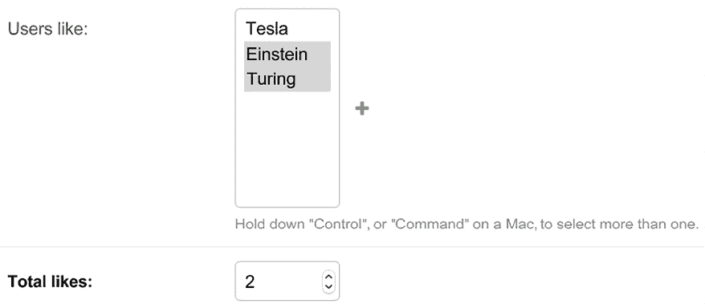

图 7.9：管理站点上的图片编辑页面，包括总点赞数的反规范化

现在，你可以使用`total_likes`属性按受欢迎程度排序图片或显示该值，避免使用复杂的查询来计算它。

考虑以下查询以按点赞数降序获取图片：

```py
from django.db.models import Count
images_by_popularity = Image.objects.annotate(
    likes=Count('users_like')
).order_by('-likes') 
```

之前的查询现在可以写成以下形式：

```py
images_by_popularity = Image.objects.order_by('-total_likes') 
```

这得益于对图片总点赞数的反规范化，从而产生了更经济的 SQL 查询。你也已经学会了如何使用 Django 信号。

使用信号时要谨慎，因为它们会使控制流难以理解。在许多情况下，如果你知道哪些接收器需要被通知，你可以避免使用信号。

你需要为其余的`Image`对象设置初始计数，以匹配数据库的当前状态。

使用以下命令打开 shell：

```py
python manage.py shell 
```

在 shell 中执行以下代码：

```py
>>> from images.models import Image
>>> for image in Image.objects.all():
...    image.total_likes = image.users_like.count()
...    image.save() 
```

你已经手动更新了数据库中现有图片的点赞数。从现在起，`users_like_changed`信号接收器函数将处理在多对多相关对象更改时更新`total_likes`字段。

接下来，你将学习如何使用 Django 调试工具栏来获取有关请求的相关调试信息，包括执行时间、执行的 SQL 查询、渲染的模板、注册的信号等等。

# 使用 Django 调试工具栏

到目前为止，你已经开始熟悉 Django 的调试页面了。在前面的章节中，你已经多次看到了独特的黄色和灰色 Django 调试页面。

例如，在*第二章*，*使用高级功能增强您的博客*，在*处理分页错误*部分，调试页面显示了在实现对象分页时未处理的异常的相关信息。

Django 调试页面提供了有用的调试信息。然而，有一个 Django 应用程序包含更详细的调试信息，在开发过程中非常有帮助。

Django Debug Toolbar 是一个外部 Django 应用程序，允许你查看当前请求/响应周期相关的调试信息。这些信息被分为多个面板，显示不同的信息，包括请求/响应数据、使用的 Python 包版本、执行时间、设置、头部、SQL 查询、使用的模板、缓存、信号和日志。

你可以在[`django-debug-toolbar.readthedocs.io/`](https://django-debug-toolbar.readthedocs.io/)找到 Django Debug Toolbar 的文档。

## 安装 Django Debug Toolbar

使用以下命令通过`pip`安装`django-debug-toolbar`：

```py
python -m pip install django-debug-toolbar==4.3.0 
```

编辑你项目的`settings.py`文件，并将`debug_toolbar`添加到`INSTALLED_APPS`设置中，如下所示。新行加粗：

```py
INSTALLED_APPS = [
    # ...
**'debug_toolbar'****,**
# ...
] 
```

在同一文件中，将以下加粗的行添加到`MIDDLEWARE`设置中：

```py
MIDDLEWARE = [
**'debug_toolbar.middleware.DebugToolbarMiddleware'****,**
'django.middleware.security.SecurityMiddleware',
    'django.contrib.sessions.middleware.SessionMiddleware',
    'django.middleware.common.CommonMiddleware',
    'django.middleware.csrf.CsrfViewMiddleware',
    'django.contrib.auth.middleware.AuthenticationMiddleware',
    'django.contrib.messages.middleware.MessageMiddleware',
    'django.middleware.clickjacking.XFrameOptionsMiddleware',
] 
```

Django Debug Toolbar 主要作为中间件实现。`MIDDLEWARE`的顺序很重要。`DebugToolbarMiddleware`必须放在任何其他中间件之前，除了那些编码响应内容的中间件，例如`GZipMiddleware`，如果存在，则应该放在最前面。

在`settings.py`文件的末尾添加以下行：

```py
INTERNAL_IPS = [
    '127.0.0.1',
] 
```

Django Debug Toolbar 只有在你的 IP 地址与`INTERNAL_IPS`设置中的条目匹配时才会显示。为了防止在生产环境中显示调试信息，Django Debug Toolbar 会检查`DEBUG`设置是否为`True`。

编辑你项目的`urls.py`主文件，并将以下加粗的 URL 模式添加到`urlpatterns`中：

```py
urlpatterns = [
    path('admin/', admin.site.urls),
    path('account/', include('account.urls')),
    path(
        'social-auth/',
        include('social_django.urls', namespace='social')
    ),
    path('images/', include('images.urls', namespace='images')),
 **path(****'__debug__/'****, include(****'debug_toolbar.urls'****)),**
] 
```

Django Debug Toolbar 现在已安装到你的项目中。让我们试试它！

使用以下命令运行开发服务器：

```py
python manage.py runserver 
```

使用你的浏览器打开`http://127.0.0.1:8000/images/`。你现在应该看到一个可折叠的侧边栏在右侧。它应该看起来如下：

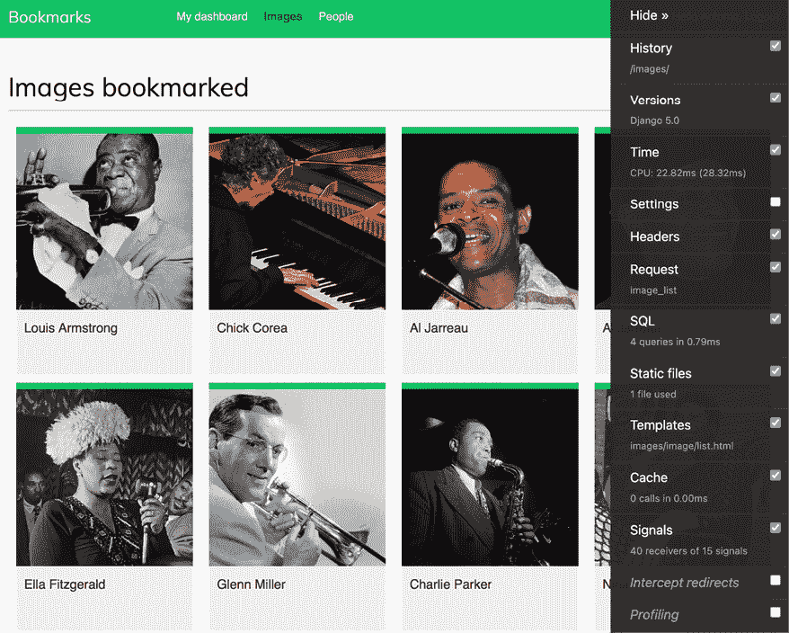

图 7.10：Django Debug Toolbar 侧边栏

*图 7.10* 图片归属：

* Chick Corea* 由 ataelw 创作（许可 – Creative Commons Attribution 2.0 Generic: [`creativecommons.org/licenses/by/2.0/`](https://creativecommons.org/licenses/by/2.0/))

*Al Jarreau Düsseldorf 1981* 由 Eddi Laumanns 即 RX-Guru 创作（许可 – Creative Commons Attribution 3.0 Unported: [`creativecommons.org/licenses/by/3.0/`](https://creativecommons.org/licenses/by/3.0/))

*Al Jarreau* 由 Kingkongphoto 和 www.celebrity-photos.com 创作（许可 – Creative Commons Attribution-ShareAlike 2.0 Generic: [`creativecommons.org/licenses/by-sa/2.0/`](https://creativecommons.org/licenses/by-sa/2.0/))

如果调试工具栏没有出现，检查 RunServer shell 控制台日志。如果你看到一个 MIME 类型错误，这很可能是你的 MIME 映射文件不正确或需要更新。

您可以通过在`settings.py`文件中添加以下行来应用 JavaScript 和 CSS 文件的正确映射：

```py
if DEBUG:
    import mimetypes
    mimetypes.add_type('application/javascript', '.js', True)
    mimetypes.add_type('text/css', '.css', True) 
```

## Django 调试工具栏面板

Django 调试工具栏包含多个面板，用于组织请求/响应周期的调试信息。侧边栏包含每个面板的链接，您可以使用任何面板的复选框来激活或停用它。更改将应用于下一个请求。当我们对特定面板不感兴趣，但计算对请求的负载太大时，这很有用。

在侧边栏菜单中点击**时间**。您将看到以下面板：

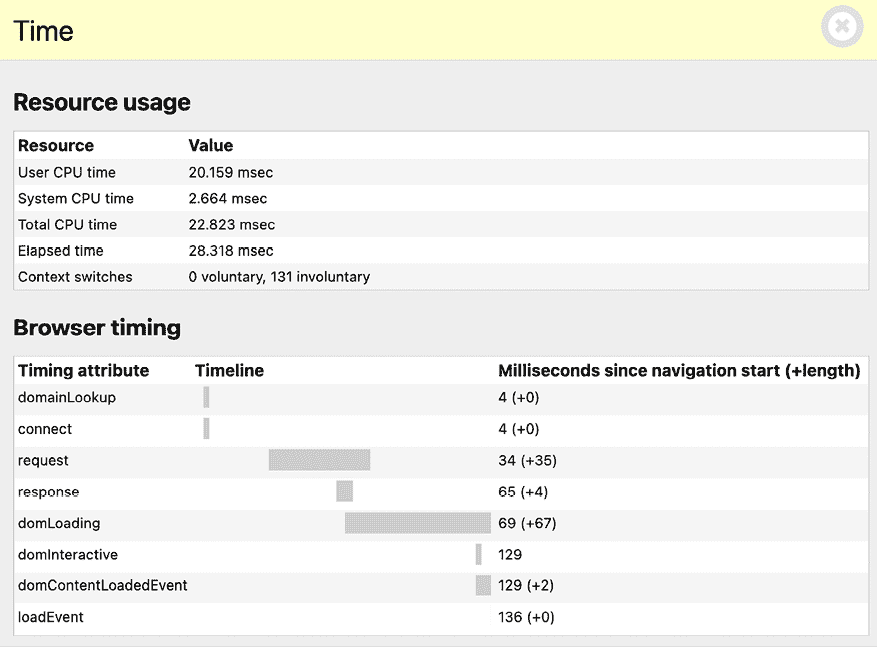

图 7.11：时间面板 – Django 调试工具栏

**时间**面板包括请求/响应周期不同阶段的计时器。它还显示了 CPU、经过的时间和上下文切换次数。如果您使用的是 Windows，您将无法看到**时间**面板。在 Windows 中，只有总时间可用，并在工具栏中显示。

在侧边栏菜单中点击**SQL**。您将看到以下面板：

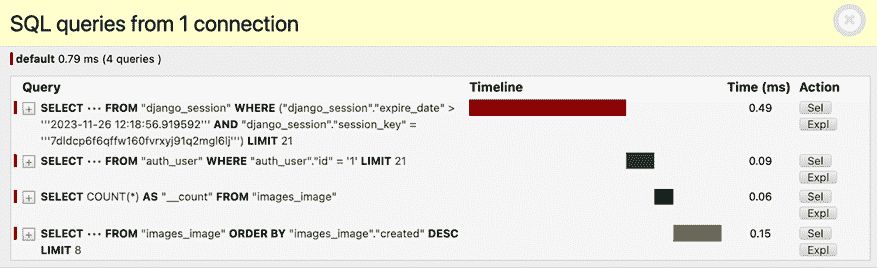

图 7.12：SQL 面板 – Django 调试工具栏

在这里，您可以查看已执行的不同 SQL 查询。这些信息可以帮助您识别不必要的查询、可重用的重复查询或可优化的长时间运行查询。根据您的发现，您可以在视图中改进查询集，如果需要，在模型字段上创建新的索引，或在需要时缓存信息。在本章中，您学习了如何使用`select_related()`和`prefetch_related()`优化涉及关系的查询。您将在第十四章“渲染和缓存内容”中学习如何缓存数据。

在侧边栏菜单中点击**模板**。您将看到以下面板：

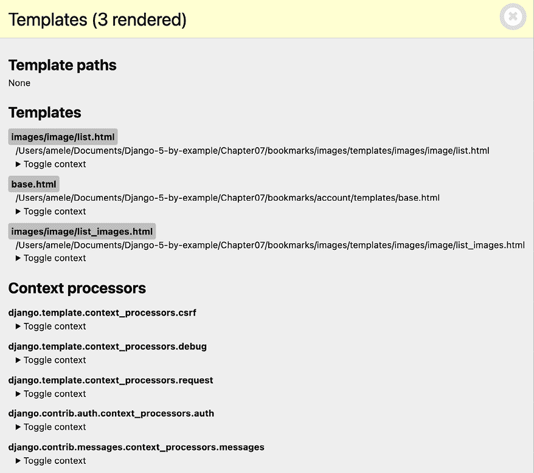

图 7.13：模板面板 – Django 调试工具栏

此面板显示了渲染内容时使用的不同模板、模板路径以及使用的上下文。您还可以看到使用的不同上下文处理器。您将在第八章“构建在线商店”中了解上下文处理器。

在侧边栏菜单中点击**信号**。您将看到以下面板：

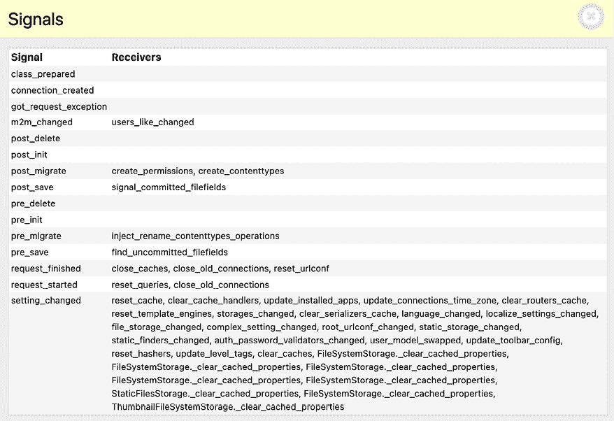

图 7.14：信号面板 – Django 调试工具栏

在此面板中，您可以查看在您的项目中注册的所有信号以及附加到每个信号的接收器函数。例如，您可以找到之前创建的`users_like_changed`接收器函数，它附加到`m2m_changed`信号。其他信号和接收器是不同 Django 应用程序的一部分。

我们已经审查了 Django 调试工具栏附带的一些面板。除了内置面板外，您还可以找到额外的第三方面板，您可以从[`django-debug-toolbar.readthedocs.io/en/latest/panels.html#third-party-panels`](https://django-debug-toolbar.readthedocs.io/en/latest/panels.html#third-party-panels)下载并使用。

## Django 调试工具栏命令

除了请求/响应调试面板之外，Django Debug Toolbar 还提供了一个管理命令来调试 ORM 调用的 SQL。管理命令 `debugsqlshell` 复制 Django `shell` 命令，但它输出使用 Django ORM 执行的查询的 SQL 语句。

使用以下命令打开 shell：

```py
python manage.py debugsqlshell 
```

执行以下代码：

```py
>>> from images.models import Image
>>> Image.objects.get(id=1) 
```

您将看到以下输出：

```py
SELECT "images_image"."id",
       "images_image"."user_id",
       "images_image"."title",
       "images_image"."slug",
       "images_image"."url",
       "images_image"."image",
       "images_image"."description",
       "images_image"."created",
       "images_image"."total_likes"
FROM "images_image"
WHERE "images_image"."id" = 1
LIMIT 21 [0.44ms]
<Image: Django and Duke> 
```

您可以使用此命令在将它们添加到视图之前测试 ORM 查询。您可以检查每个 ORM 调用的结果 SQL 语句和执行时间。

在下一节中，您将学习如何使用 Redis 来统计图片浏览量，Redis 是一个内存数据库，它提供了低延迟和高吞吐量的数据访问。

# 使用 Redis 统计图片浏览量

Redis 是一个高级的键/值数据库，允许您保存不同类型的数据。它还具有极快的 I/O 操作。Redis 将所有内容存储在内存中，但可以通过定期将数据集转储到磁盘或通过将每个命令添加到日志中来持久化数据。与其它键/值存储相比，Redis 非常灵活：它提供了一套强大的命令，并支持多种数据结构，如字符串、散列、列表、集合、有序集合，甚至 `bitmap` 或 `HyperLogLog` 方法。

虽然 SQL 最适合于模式定义的持久数据存储，但 Redis 在处理快速变化的数据、易失性存储或需要快速缓存时提供了许多优势。让我们看看 Redis 如何用于在您的项目中构建新的功能。

您可以在 Redis 的主页 [`redis.io/`](https://redis.io/) 上找到更多关于 Redis 的信息。

Redis 提供了一个 Docker 镜像，使得使用标准配置部署 Redis 服务器变得非常容易。

## 安装 Redis

要安装 Redis Docker 镜像，请确保您的机器上已安装 Docker。您在 *第三章*，*扩展您的博客应用程序* 中学习了如何安装 Docker。

从 shell 中运行以下命令：

```py
docker pull redis:7.2.4 
```

这将下载 Redis Docker 镜像到您的本地机器。您可以在 [`hub.docker.com/_/redis`](https://hub.docker.com/_/redis) 找到有关官方 Redis Docker 镜像的信息。您可以在 [`redis.io/download/`](https://redis.io/download/) 找到其他安装 Redis 的替代方法。

在 shell 中执行以下命令以启动 Redis Docker 容器：

```py
docker run -it --rm --name redis -p 6379:6379 redis:7.2.4 
```

使用此命令，我们在 Docker 容器中运行 Redis。`-it` 选项告诉 Docker 直接进入容器进行交互式输入。`--rm` 选项告诉 Docker 在容器退出时自动清理容器并删除文件系统。`--name` 选项用于给容器分配一个名称。`-p` 选项用于将 Redis 运行的 `6379` 端口发布到同一主机的接口端口。`6379` 是 Redis 的默认端口。

您应该看到以下行结束的输出：

```py
# Server initialized
* Ready to accept connections 
```

保持 Redis 服务器在端口`6379`上运行，并打开另一个 shell。使用以下命令启动 Redis 客户端：

```py
docker exec -it redis sh 
```

您将看到一行带有井号：

```py
# 
```

使用以下命令启动 Redis 客户端：

```py
# redis-cli 
```

您将看到 Redis 客户端 shell 提示符，如下所示：

```py
127.0.0.1:6379> 
```

Redis 客户端允许您直接从 shell 中执行 Redis 命令。让我们尝试一些命令。在 Redis shell 中输入`SET`命令以在键中存储一个值：

```py
127.0.0.1:6379> SET name "Peter"
OK 
```

前面的命令在 Redis 数据库中创建了一个具有字符串值`"Peter"`的`name`键。`OK`输出表示键已成功保存。

接下来，使用`GET`命令检索值，如下所示：

```py
127.0.0.1:6379> GET name
"Peter" 
```

您还可以使用`EXISTS`命令检查键是否存在。如果给定的键存在，则该命令返回`1`，否则返回`0`：

```py
127.0.0.1:6379> EXISTS name
(integer) 1 
```

您可以使用`EXPIRE`命令设置一个键的过期时间，该命令允许您以秒为单位设置生存时间。另一个选项是使用`EXPIREAT`命令，它期望一个 Unix 时间戳。键过期对于将 Redis 用作缓存或存储易失性数据很有用：

```py
127.0.0.1:6379> GET name
"Peter"
127.0.0.1:6379> EXPIRE name 2
(integer) 1 
```

等待超过两秒钟，然后再次尝试获取相同的键：

```py
127.0.0.1:6379> GET name
(nil) 
```

`(nil)`响应是一个空响应，表示没有找到任何键。您还可以使用`DEL`命令删除任何键，如下所示：

```py
127.0.0.1:6379> SET total 1
OK
127.0.0.1:6379> DEL total
(integer) 1
127.0.0.1:6379> GET total
(nil) 
```

这些只是基本的关键操作命令。您可以在[`redis.io/commands/`](https://redis.io/commands/)找到所有 Redis 命令，在[`redis.io/docs/manual/data-types/`](https://redis.io/docs/manual/data-types/)找到所有 Redis 数据类型。

## 使用 Python 与 Redis 结合使用

您将需要 Redis 的 Python 绑定。使用以下命令通过`pip`安装`redis-py`：

```py
python -m pip install redis==5.0.4 
```

您可以在[`redis-py.readthedocs.io/`](https://redis-py.readthedocs.io/)找到`redis-py`的文档。

`redis-py`包与 Redis 交互，提供了一个遵循 Redis 命令语法的 Python 接口。使用以下命令打开 Python shell：

```py
python manage.py shell 
```

执行以下代码：

```py
>>> import redis
>>> r = redis.Redis(host='localhost', port=6379, db=0) 
```

前面的代码与 Redis 数据库建立了连接。在 Redis 中，数据库通过整数索引而不是数据库名称来标识。默认情况下，客户端连接到数据库`0`。可用的 Redis 数据库数量设置为`16`，但您可以在`redis.conf`配置文件中更改此设置。

接下来，使用 Python shell 设置一个键：

```py
>>> r.set('foo', 'bar')
True 
```

命令返回`True`，表示键已成功创建。现在您可以使用`get()`命令检索键：

```py
>>> r.get('foo')
b'bar' 
```

如您从前面的代码中注意到的，Redis 的方法遵循 Redis 命令语法。

让我们将 Redis 集成到您的项目中。编辑`bookmarks`项目的`settings.py`文件，并向其中添加以下设置：

```py
REDIS_HOST = 'localhost'
REDIS_PORT = 6379
REDIS_DB = 0 
```

这些是您将用于项目的 Redis 服务器和数据库的设置。

## 在 Redis 中存储图像视图

让我们找到一种方法来存储图像被查看的总次数。如果你使用 Django ORM 实现此功能，每次显示图像时都会涉及一个 SQL `UPDATE`查询。

如果你使用 Redis，你只需在内存中增加一个计数器的值，这将带来更好的性能和更低的开销。

编辑`images`应用的`views.py`文件，并在现有的`import`语句之后添加以下代码：

```py
import redis
from django.conf import settings
# connect to redis
r = redis.Redis(
    host=settings.REDIS_HOST,
    port=settings.REDIS_PORT,
    db=settings.REDIS_DB
) 
```

使用前面的代码，你建立了 Redis 连接，以便在视图中使用它。编辑`images`应用的`views.py`文件，并修改`image_detail`视图，如下所示。新代码加粗显示：

```py
def image_detail(request, id, slug):
    image = get_object_or_404(Image, id=id, slug=slug)
    # increment total image views by 1
 **total_views = r.incr(****f'image:****{image.****id****}****:views'****)**
return render(
        request,
        'images/image/detail.html',
        {
            'section': 'images',
            'image': image**,**
**'total_views'****: total_views**
        }
    ) 
```

在此视图中，你使用`incr`命令，该命令将给定键的值增加`1`。如果键不存在，`incr`命令将创建它。`incr()`方法返回执行操作后的键的最终值。你将值存储在`total_views`变量中，并将其传递到模板上下文中。你使用类似于`object-type:id:field`（例如，`image:33:id`）的表示法构建 Redis 键。

Redis 键的命名约定是使用冒号作为命名空间键的分隔符。这样做后，键名特别冗长，相关的键在其名称中共享部分相同的模式。

编辑`images`应用的`images/image/detail.html`模板，并添加以下加粗显示的代码：

```py
...
<div class="image-info">
  <div>
    <span class="count">
      <span class="total">{{ total_likes }}</span>
      like{{ total_likes|pluralize }}
    </span>
 **<span** **class****=****"count"****>**
 **{{ total_views }} view{{ total_views|pluralize }}**
 **</span>**
    <a href="#" data-id="{{ image.id }}" data-action="unlike"
class="like button">
      
        Like
      
        Unlike
      
    </a>
  </div>
  {{ image.description|linebreaks }}
</div>
... 
```

使用以下命令运行开发服务器：

```py
python manage.py runserver 
```

在你的浏览器中打开一个图像详情页面，并多次刷新它。你会看到每次处理查看时，显示的总查看次数都会增加`1`。看看以下示例：

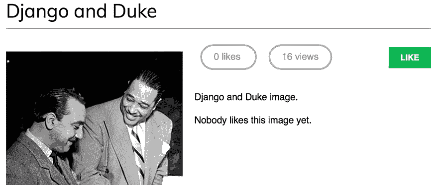

图 7.15：图像详情页面，包括点赞和查看次数

太好了！你已经成功将 Redis 集成到你的项目中，用于计算图像查看次数。在下一节中，你将学习如何使用 Redis 构建查看次数最多的图像的排名。

## 在 Redis 中存储排名

我们现在将使用 Redis 创建一个更复杂的东西。我们将使用 Redis 来存储平台上查看次数最多的图像的排名。我们将使用 Redis 有序集来完成此操作。有序集是一个非重复的字符串集合，其中每个成员都与一个分数相关联。项目按其分数排序。

编辑`images`应用的`views.py`文件，并在`image_detail`视图中添加以下加粗显示的代码：

```py
def image_detail(request, id, slug):
    image = get_object_or_404(Image, id=id, slug=slug)
    # increment total image views by 1
    total_views = r.incr(f'image:{image.id}:views')
**# increment image ranking by 1**
 **r.zincrby(****'image_ranking'****,** **1****, image.****id****)**
return render(
        request,
        'images/image/detail.html',
        {
            'section': 'images',
            'image': image,
            'total_views': total_views
        }
    ) 
```

你使用`zincrby()`命令将图像查看次数存储在带有`image:ranking`键的有序集中。你将存储图像`id`和相关的分数`1`，这将添加到有序集中该元素的累计分数。这将允许你跟踪所有图像查看次数的全局情况，并按查看次数的总量对有序集进行排序。

现在，创建一个新的视图来显示最常查看的图像排名。将以下代码添加到 `images` 应用程序的 `views.py` 文件中：

```py
@login_required
def image_ranking(request):
    # get image ranking dictionary
    image_ranking = r.zrange(
        'image_ranking', 0, -1,
        desc=True
 )[:10]
    image_ranking_ids = [int(id) for id in image_ranking]
    # get most viewed images
    most_viewed = list(
        Image.objects.filter(
            id__in=image_ranking_ids
        )
    )
    most_viewed.sort(key=lambda x: image_ranking_ids.index(x.id))
    return render(
        request,
        'images/image/ranking.html',
        {'section': 'images', 'most_viewed': most_viewed}
    ) 
```

`image_ranking` 视图的工作方式如下：

1.  你使用 `zrange()` 命令来获取有序集合中的元素。此命令期望一个自定义范围，根据最低和最高分数。通过使用 `0` 作为最低分数和 `-1` 作为最高分数，你告诉 Redis 返回有序集合中的所有元素。你还指定 `desc=True` 以按降序分数检索元素。最后，使用 `[:10]` 切片结果以获取分数最高的前 10 个元素。

1.  你构建一个返回的图像 ID 列表，并将其存储在 `image_ranking_ids` 变量中，作为整数列表。你检索这些 ID 的 `Image` 对象，并使用 `list()` 函数强制执行查询。强制执行 QuerySet 的查询很重要，因为你会对其使用 `sort()` 方法（在此点，你需要一个对象列表而不是 QuerySet）。

1.  你通过图像排名中图像出现的索引对 `Image` 对象进行排序。现在你可以在模板中使用 `most_viewed` 列表来显示最常查看的 10 张图像。

在 `images` 应用程序的 `images/image/` 模板目录中创建一个新的 `ranking.html` 模板，并将其中的以下代码添加到其中：

```py

Images ranking

  <h1>Images ranking</h1>
<ol>
    
      <li>
<a href="{{ image.get_absolute_url }}">
          {{ image.title }}
        </a>
</li>
    
  </ol>
 
```

模板非常简单。你遍历 `most_viewed` 列表中的 `Image` 对象，并显示它们的名称，包括指向图像详情页面的链接。

最后，你需要为新的视图创建一个 URL 模式。编辑 `images` 应用程序的 `urls.py` 文件，并添加以下加粗的 URL 模式：

```py
urlpatterns = [
    path('create/', views.image_create, name='create'),
    path('detail/<int:id>/<slug:slug>/',
         views.image_detail, name='detail'),
    path('like/', views.image_like, name='like'),
    path('', views.image_list, name='list'),
 **path(****'ranking/'****, views.image_ranking, name=****'ranking'****),**
] 
```

运行开发服务器，在您的网页浏览器中访问您的网站，并对不同图像多次加载图像详情页面。然后，从浏览器访问 `http://127.0.0.1:8000/images/ranking/`。您应该能够看到一个图像排名，如下所示：

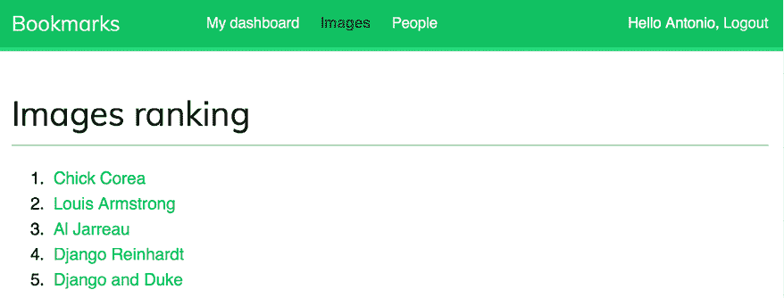

图 7.16：使用从 Redis 获取的数据构建的排名页面

太棒了！你刚刚使用 Redis 创建了一个排名。

## 下一步使用 Redis

Redis 不是一个 SQL 数据库的替代品，但它确实提供了适合某些任务的快速内存存储。将其添加到你的堆栈中，并在真正需要时使用它。以下是一些 Redis 可能有用的场景：

+   **计数**：如你所见，使用 Redis 管理计数器非常容易。你可以使用 `incr()` 和 `incrby()` 来计数。

+   **存储最新项**：你可以使用 `lpush()` 和 `rpush()` 在列表的开始/结束处添加项。使用 `lpop()`/`rpop()` 移除并返回第一个/最后一个元素。你可以使用 `ltrim()` 来修剪列表的长度，以保持其长度。

+   **队列**：除了 `push` 和 `pop` 命令外，Redis 还提供了阻塞队列命令。

+   **缓存**：使用 `expire()` 和 `expireat()` 可以让您将 Redis 用作缓存。您还可以找到适用于 Django 的第三方 Redis 缓存后端。

+   **发布/订阅**：Redis 提供了订阅/取消订阅和向频道发送消息的命令。

+   **排名和排行榜**：Redis 的带分数的有序集合使得创建排行榜变得非常容易。

+   **实时跟踪**：Redis 的快速 I/O 使其非常适合实时场景。

# 摘要

在本章中，您使用多对多关系和一个中间模型构建了一个关注系统。您还使用通用关系创建了一个活动流，并优化了 QuerySets 以检索相关对象。然后本章向您介绍了 Django 信号，并创建了一个信号接收器函数以去规范化相关对象计数。我们介绍了应用程序配置类，您使用它们来加载您的信号处理程序。您还向您的项目中添加了 Django Debug Toolbar。您还学习了如何在 Django 项目中安装和配置 Redis。最后，您在项目中使用 Redis 存储项目视图，并使用 Redis 构建了一个图像排名。

在下一章中，您将学习如何构建在线商店。您将创建产品目录并使用会话构建购物车。您将学习如何创建自定义上下文处理器。您还将使用 Celery 和 RabbitMQ 管理客户订单并发送异步通知。

# 使用 AI 扩展您的项目

在本节中，您将面临一个扩展您项目的任务，并附有 ChatGPT 的示例提示以协助您。要参与 ChatGPT，请访问 [`chat.openai.com/`](https://chat.openai.com/)。如果您是第一次与 ChatGPT 互动，您可以回顾第三章，“扩展您的博客应用”中的“使用 AI 扩展您的项目”部分。

在这个项目示例中，您学习了如何使用 Django 信号并成功实现了信号接收器，以便在点赞计数发生变化时更新图像的总点赞数。现在，让我们利用 ChatGPT 探索实现一个信号接收器的实现，该接收器在创建 `User` 对象时自动生成相关的 `Profile` 对象。您可以使用提供的提示 [`github.com/PacktPublishing/Django-5-by-example/blob/main/Chapter07/prompts/task.md`](https://github.com/PacktPublishing/Django-5-by-example/blob/main/Chapter07/prompts/task.md)。

在成功实现信号接收器后，您可以移除之前在 `account` 应用程序的 `register` 视图中和社交认证管道中包含的手动创建个人资料步骤。现在，接收器函数已附加到 `User` 模型的 `post_save` 信号，新用户将自动创建个人资料。

如果你在理解书中某个特定概念或主题时遇到困难，请向 ChatGPT 提供额外的示例或以不同的方式解释该概念。这种个性化的方法可以加强你的学习，并确保你掌握复杂主题。

# 其他资源

以下资源提供了与本章涵盖主题相关的额外信息：

+   本章源代码：[`github.com/PacktPublishing/Django-5-by-example/tree/main/Chapter07`](https://github.com/PacktPublishing/Django-5-by-example/tree/main/Chapter07)

+   自定义用户模型：[`docs.djangoproject.com/en/5.0/topics/auth/customizing/#specifying-a-custom-user-model`](https://docs.djangoproject.com/en/5.0/topics/auth/customizing/#specifying-a-custom-user-model)

+   `contenttypes` 框架：[`docs.djangoproject.com/en/5.0/ref/contrib/contenttypes/`](https://docs.djangoproject.com/en/5.0/ref/contrib/contenttypes/)

+   内置 Django 信号：[`docs.djangoproject.com/en/5.0/ref/signals/`](https://docs.djangoproject.com/en/5.0/ref/signals/)

+   应用配置类：[`docs.djangoproject.com/en/5.0/ref/applications/`](https://docs.djangoproject.com/en/5.0/ref/applications/)

+   Django Debug Toolbar 文档：[`django-debug-toolbar.readthedocs.io/`](https://django-debug-toolbar.readthedocs.io/)

+   Django Debug Toolbar 第三方面板：[`django-debug-toolbar.readthedocs.io/en/latest/panels.html#third-party-panels`](https://django-debug-toolbar.readthedocs.io/en/latest/panels.html#third-party-panels)

+   Redis 内存数据存储：[`redis.io/`](https://redis.io/)

+   官方 Redis Docker 镜像：[`hub.docker.com/_/redis`](https://hub.docker.com/_/redis).

+   Redis 下载选项：[`redis.io/download/`](https://redis.io/download/)

+   Redis 命令：[`redis.io/commands/`](https://redis.io/commands/)

+   Redis 数据类型：[`redis.io/docs/manual/data-types/`](https://redis.io/docs/manual/data-types/)

+   `redis-py` 文档：[`redis-py.readthedocs.io/`](https://redis-py.readthedocs.io/)
