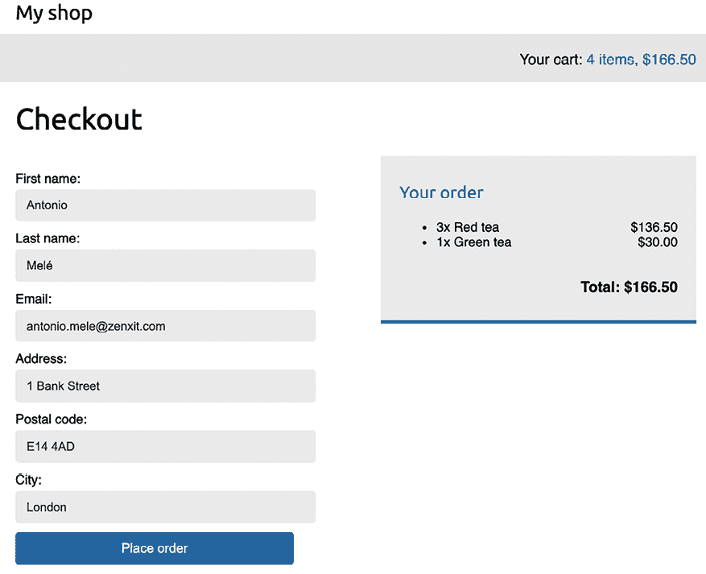
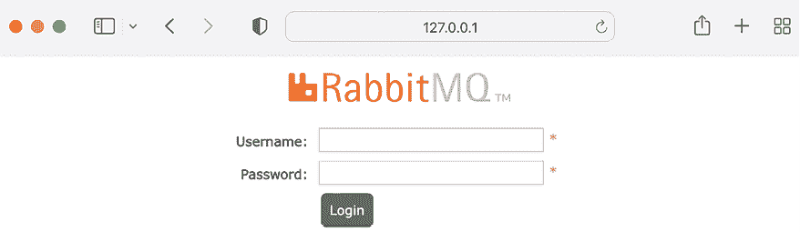

# 8

# 构建在线商店

在上一章中，你创建了一个关注系统并构建了用户活动流。你还学习了 Django 信号的工作原理，并将 Redis 集成到你的项目中以统计图片浏览量。

在本章中，你将启动一个新的 Django 项目，该项目包含一个功能齐全的在线商店。本章和接下来的两章将向你展示如何构建电子商务平台的基本功能。你的在线商店将使客户能够浏览产品，将它们添加到购物车，应用折扣代码，完成结账流程，使用信用卡支付，并获得发票。你还将实现一个推荐引擎向你的客户推荐产品，并使用国际化将你的网站提供多种语言。 

在本章中，你将学习如何：

+   创建产品目录

+   使用 Django 会话构建购物车

+   创建自定义模板上下文处理器

+   管理客户订单

+   在你的项目中配置 Celery 使用 RabbitMQ 作为消息代理

+   使用 Celery 向客户发送异步通知

+   使用 Flower 监控 Celery

# 功能概述

*图 8.1*展示了本章将要构建的视图、模板和主要功能：


图 8.1：第八章中构建的功能图

在本章中，你将实现`product_list`视图以列出所有产品，以及`product_detail`视图以显示单个产品。你将在`product_list`视图中使用`category_slug`参数允许按类别过滤产品。你将使用会话实现购物车，并构建`cart_detail`视图以显示购物车项目。你将创建`cart_add`视图以向购物车添加产品并更新数量，以及`cart_remove`视图以从购物车中删除产品。你将实现`cart`模板上下文处理器以在网站页眉上显示购物车项目数量和总成本。你还将创建`order_create`视图以放置订单，并使用 Celery 实现`order_created`异步任务，在客户下单时向他们发送电子邮件确认。本章将为你提供在应用程序中实现用户会话的知识，并展示如何处理异步任务。这两者都是非常常见的用例，你可以将它们应用到几乎任何项目中。

本章的源代码可以在[`github.com/PacktPublishing/Django-5-by-example/tree/main/Chapter08`](https://github.com/PacktPublishing/Django-5-by-example/tree/main/Chapter08)找到。

本章中使用的所有 Python 模块都包含在本章源代码中的`requirements.txt`文件中。你可以按照以下说明安装每个 Python 模块，或者你可以使用命令`python -m pip install -r requirements.txt`一次性安装所有需求。

# 创建在线商店项目

让我们从一个新的 Django 项目开始，构建一个在线商店。您的用户将能够浏览产品目录并将产品添加到购物车。最后，他们可以结账并下单。本章将涵盖以下在线商店的功能：

+   创建产品目录模型，将它们添加到管理站点，并构建基本视图以显示目录

+   使用 Django 会话构建购物车系统，允许用户在浏览网站时保留所选产品

+   创建表单和功能，以便在网站上放置订单

+   当用户下单时，发送异步电子邮件确认给用户

打开 shell 并使用以下命令在`env/`目录内为该项目创建一个新的虚拟环境：

```py
python -m venv env/myshop 
```

如果您使用 Linux 或 macOS，请运行以下命令以激活您的虚拟环境：

```py
source env/myshop/bin/activate 
```

如果您使用 Windows，请使用以下命令代替：

```py
.\env\myshop\Scripts\activate 
```

壳提示将显示您的活动虚拟环境，如下所示：

```py
(myshop)laptop:~ zenx$ 
```

使用以下命令在虚拟环境中安装 Django：

```py
python -m pip install Django~=5.0.4 
```

通过打开 shell 并运行以下命令来启动一个名为`myshop`的新项目，其中包含一个名为`shop`的应用程序：

```py
django-admin startproject myshop 
```

初始项目结构已创建。使用以下命令进入您的项目目录并创建一个名为`shop`的新应用程序：

```py
cd myshop/
django-admin startapp shop 
```

编辑`settings.py`并在`INSTALLED_APPS`列表中添加以下加粗的行：

```py
INSTALLED_APPS = [
    'django.contrib.admin',
    'django.contrib.auth',
    'django.contrib.contenttypes',
    'django.contrib.sessions',
    'django.contrib.messages',
    'django.contrib.staticfiles',
**'shop.apps.ShopConfig'****,**
] 
```

您的应用程序现在已为此项目激活。让我们定义产品目录的模型。

## 创建产品目录模型

您的商店目录将由组织成不同类别的产品组成。每个产品将有一个名称、可选的描述、可选的图片、价格和其可用性。

编辑您刚刚创建的`shop`应用程序的`models.py`文件，并添加以下代码：

```py
from django.db import models
**class****Category****(models.Model):**
 **name = models.CharField(max_length=****200****)**
 **slug = models.SlugField(max_length=****200****, unique=****True****)**
**class****Meta****:**
 **ordering = [****'name'****]**
 **indexes = [**
 **models.Index(fields=[****'name'****]),**
 **]**
 **verbose_name =** **'category'**
 **verbose_name_plural =** **'categories'**
**def****__str__****(****self****):**
**return** **self.name**
**class****Product****(models.Model):**
 **category = models.ForeignKey(**
 **Category,**
 **related_name=****'products'****,**
 **on_delete=models.CASCADE**
 **)**
 **name = models.CharField(max_length=****200****)**
 **slug = models.SlugField(max_length=****200****)**
 **image = models.ImageField(**
 **upload_to=****'products/%Y/%m/%d'****,**
 **blank=****True**
 **)**
 **description = models.TextField(blank=****True****)**
 **price = models.DecimalField(max_digits=****10****, decimal_places=****2****)**
 **available = models.BooleanField(default=****True****)**
 **created = models.DateTimeField(auto_now_add=****True****)**
 **updated = models.DateTimeField(auto_now=****True****)**
**class****Meta****:**
 **ordering = [****'name'****]**
 **indexes = [**
 **models.Index(fields=[****'id'****,** **'slug'****]),**
 **models.Index(fields=[****'name'****]),**
 **models.Index(fields=[****'-created'****]),**
 **]**
**def****__str__****(****self****):**
**return** **self.name** 
```

这些是`Category`和`Product`模型。`Category`模型由一个`name`字段和一个唯一的`slug`字段组成（`unique`意味着创建一个索引）。在`Category`模型的`Meta`类中，我们为`name`字段定义了一个索引。

`Product`模型字段如下：

+   `category`：到`Category`模型的`ForeignKey`。这是一个一对一的关系：一个产品属于一个类别，一个类别包含多个产品。

+   `name`：产品的名称。

+   `slug`：用于构建美观 URL 的此产品的 slug。

+   `image`：可选的产品图片。

+   `description`：产品的可选描述。

+   `price`：此字段使用 Python 的`decimal.Decimal`类型来存储一个固定精度的十进制数。最大数字数（包括小数点）是通过`max_digits`属性设置的，小数位数是通过`decimal_places`属性设置的。

+   `available`：一个布尔值，表示产品是否可用。它将用于在目录中启用/禁用产品。

+   `created`：此字段存储对象的创建时间。

+   `updated`：此字段存储对象最后更新的时间。

对于 `price` 字段，我们使用 `DecimalField` 而不是 `FloatField` 来避免四舍五入问题。

总是使用 `DecimalField` 来存储货币金额。`FloatField` 在内部使用 Python 的 `float` 类型，而 `DecimalField` 使用 Python 的 `Decimal` 类型。通过使用 `Decimal` 类型，你可以避免 `float` 四舍五入的问题。

在 `Product` 模型的 `Meta` 类中，我们为 `id` 和 `slug` 字段定义了一个多字段索引。这两个字段一起索引以提高使用这两个字段的查询性能。

我们计划通过 `id` 和 `slug` 两个字段查询产品。我们为 `name` 字段添加了一个索引，并为 `created` 字段添加了一个索引。我们在字段名前使用了一个连字符来定义降序索引。

*图 8.2* 展示了你创建的两个数据模型：


图 8.2：产品目录的模型

在 *图 8.2* 中，你可以看到数据模型的不同字段以及 `Category` 和 `Product` 模型之间的一对多关系。

这些模型将导致 *图 8.3* 中显示的以下数据库表：


图 8.3：产品目录模型的数据表

两个表之间的一对多关系是通过 `shop_product` 表中的 `category_id` 字段定义的，该字段用于存储每个 `Product` 对象相关联的 `Category` 的 ID。

让我们为 `shop` 应用程序创建初始的数据库迁移。由于你将在模型中处理图像，你需要安装 Pillow 库。记住，在 *第四章*，*构建社交网站* 中，你学习了如何安装 Pillow 库来管理图像。打开 shell 并使用以下命令安装 `Pillow`：

```py
python -m pip install Pillow==10.3.0 
```

现在运行下一个命令来为你的项目创建初始迁移：

```py
python manage.py makemigrations 
```

你将看到以下输出：

```py
Migrations for 'shop':
  shop/migrations/0001_initial.py
    - Create model Category
    - Create model Product 
```

运行下一个命令来同步数据库：

```py
python manage.py migrate 
```

你将看到包含以下行的输出：

```py
Applying shop.0001_initial... OK 
```

数据库现在与你的模型同步了。

## 在管理站点注册目录模型

让我们添加你的模型到管理站点，这样你可以轻松地管理类别和产品。编辑 `shop` 应用的 `admin.py` 文件，并向其中添加以下代码：

```py
from django.contrib import admin
**from** **.models** **import** **Category, Product**
**@admin.register(****Category****)**
**class****CategoryAdmin****(admin.ModelAdmin):**
 **list_display = [****'name'****,** **'slug'****]**
 **prepopulated_fields = {****'****slug'****: (****'name'****,)}**
**@admin.register(****Product****)**
**class****ProductAdmin****(admin.ModelAdmin):**
 **list_display = [**
**'name'****,**
**'slug'****,**
**'price'****,**
**'available'****,**
**'****created'****,**
**'updated'**
 **]**
 **list_filter = [****'available'****,** **'created'****,** **'updated'****]**
 **list_editable = [****'price'****,** **'available'****]**
 **prepopulated_fields = {****'slug'****: (****'name'****,)}** 
```

记住，你使用 `prepopulated_fields` 属性来指定值自动使用其他字段的值来设置的字段。正如你之前看到的，这对于生成 slugs 很方便。

您在`ProductAdmin`类中使用`list_editable`属性来设置可以从管理网站的列表显示页面编辑的字段。这将允许您一次性编辑多行。`list_editable`中的任何字段也必须在`list_display`属性中列出，因为只有显示的字段可以编辑。

现在使用以下命令为您网站创建一个超级用户：

```py
python manage.py createsuperuser 
```

输入所需的用户名、电子邮件和密码。使用以下命令运行开发服务器：

```py
python manage.py runserver 
```

在您的浏览器中打开`http://127.0.0.1:8000/admin/shop/product/add/`并使用您刚刚创建的用户登录。使用管理界面添加一个新的类别和产品。**添加产品**表单应如下所示：


图 8.4：产品创建表单

点击**保存**按钮。此时，管理页面的产品更改列表页面将看起来如下：


图 8.5：产品更改列表页面

## 构建目录视图

为了显示产品目录，您需要创建一个视图来列出所有产品或根据给定的类别过滤产品。编辑`shop`应用的`views.py`文件，并添加以下加粗代码：

```py
from django.shortcuts import **get_object_or_404,** render
**from** **.models** **import** **Category, Product**
**def****product_list****(****request, category_slug=****None****):**
 **category =** **None**
 **categories = Category.objects.****all****()**
 **products = Product.objects.****filter****(available=****True****)**
**if** **category_slug:**
 **category = get_object_or_404(Category,** **slug=category_slug)**
 **products = products.****filter****(category=category)**
**return** **render(**
**request,**
**'shop/product/list.html'****,**
**{**
**'category'****: category,**
**'categories'****: categories,**
**'****products'****: products**
**}**
 **)** 
```

在前面的代码中，您使用`available=True`过滤`QuerySet`以仅检索可用的产品。您使用可选的`category_slug`参数以可选方式根据给定的类别过滤产品。

您还需要一个视图来检索和显示单个产品。将以下视图添加到`views.py`文件中：

```py
def product_detail(request, id, slug):
    product = get_object_or_404(
        Product, id=id, slug=slug, available=True
 )
    return render(
 request,
 shop/product/detail.html',
 {'product': product}
    ) 
```

`product_detail`视图期望`id`和`slug`参数以便检索`Product`实例。由于它是一个唯一属性，您可以通过 ID 直接获取此实例。然而，您在 URL 中包含 slug 以构建对产品友好的 SEO URL。

在构建产品列表和详细视图之后，您必须为它们定义 URL 模式。在`shop`应用目录内创建一个新文件，并将其命名为`urls.py`。向其中添加以下代码：

```py
from django.urls import path
from . import views
app_name = 'shop'
urlpatterns = [
    path('', views.product_list, name='product_list'),
    path(
        '<slug:category_slug>/',
        views.product_list,
        name='product_list_by_category'
    ),
    path(
        '<int:id>/<slug:slug>/',
        views.product_detail,
        name='product_detail'
    ),
] 
```

这些是您产品目录的 URL 模式。您为`product_list`视图定义了两个不同的 URL 模式：一个名为`product_list`的模式，它调用不带任何参数的`product_list`视图，以及一个名为`product_list_by_category`的模式，它为视图提供一个`category_slug`参数以根据给定的类别过滤产品。您还添加了一个`product_detail`视图的模式，该模式将`id`和`slug`参数传递给视图以检索特定产品。

编辑`myshop`项目的`urls.py`文件，使其看起来如下所示：

```py
from django.contrib import admin
from django.urls import **include,** path
urlpatterns = [
    path('admin/', admin.site.urls),
    **path(****''****, include(****'shop.urls'****, namespace=****'shop'****)),**
] 
```

在项目的 URL 主模式中，您在名为`shop`的自定义命名空间下包含`shop`应用的 URL。

接下来，编辑`shop`应用的`models.py`文件，导入`reverse()`函数，并为`Category`和`Product`模型添加一个`get_absolute_url()`方法，如下所示。新的代码已加粗：

```py
from django.db import models
**from** **django.urls** **import** **reverse**
class Category(models.Model):
    # ...
**def****get_absolute_url****(****self****):**
**return** **reverse(**
**'shop:product_list_by_category'****, args=[self.slug]**
 **)**
class Product(models.Model):
    # ...
**def****get_absolute_url****(****self****):**
**return** **reverse(****'shop:product_detail'****, args=[self.****id****, self.slug])** 
```

正如您所知，`get_absolute_url()` 是检索给定对象 URL 的约定。在这里，您使用在 `urls.py` 文件中刚刚定义的 URL 模式。

## 创建目录模板

现在您需要在产品列表和详情视图创建模板。在 `shop` 应用程序目录内创建以下目录和文件结构：

```py
templates/
    shop/
        base.html
        product/
            list.html
            detail.html 
```

您需要定义一个基本模板，然后在产品列表和详情模板中扩展它。编辑 `shop/base.html` 模板，并向其中添加以下代码：

```py

<!DOCTYPE html>
<html>
<head>
<meta charset="utf-8" />
<title>My shop</title>
<link href="" rel="stylesheet">
</head>
<body>
<div id="header">
<a href="/" class="logo">My shop</a>
</div>
<div id="subheader">
<div class="cart">
        Your cart is empty.
      </div>
</div>
<div id="content">
      
      
    </div>
</body>
</html> 
```

这是您将用于商店的基本模板。为了包含模板使用的 CSS 样式和图像，您需要复制本章附带的静态文件，这些文件位于 `shop` 应用程序的 `static/` 目录中。将它们复制到项目中的同一位置。您可以在 [`github.com/PacktPublishing/Django-5-by-Example/tree/main/Chapter08/myshop/shop/static`](https://github.com/PacktPublishing/Django-5-by-Example/tree/main/Chapter08/myshop/shop/static) 找到目录的内容。

编辑 `shop/product/list.html` 模板，并向其中添加以下代码：

```py



  {{ category.name }}Products


  <div id="sidebar">
<h3>Categories</h3>
<ul>
<li class="selected">
<a href="">All</a>
</li>
      
        <li class="selected"
        >
<a href="{{ c.get_absolute_url }}">{{ c.name }}</a>
</li>
      
    </ul>
</div>
<div id="main" class="product-list">
<h1>{{ category.name }}Products
    </h1>
    
      <div class="item">
<a href="{{ product.get_absolute_url }}">

</a>
<a href="{{ product.get_absolute_url }}">{{ product.name }}</a>
<br>
        ${{ product.price }}
      </div>
    
  </div>
 
```

确保没有模板标签被拆分到多行。

这是产品列表模板。它扩展了 `shop/base.html` 模板，并使用 `categories` 上下文变量在侧边栏中显示所有类别，以及 `products` 来显示当前页面的产品。相同的模板用于列出所有可用的产品和按类别过滤的产品。由于 `Product` 模型的 `image` 字段可能为空，您需要为没有图像的产品提供一个默认图像。该图像位于您的静态文件目录中，相对路径为 `img/no_image.png`。

由于您正在使用 `ImageField` 存储产品图像，您需要开发服务器来提供上传的图像文件。

编辑 `myshop` 的 `settings.py` 文件，并添加以下设置：

```py
MEDIA_URL = 'media/'
MEDIA_ROOT = BASE_DIR / 'media' 
```

`MEDIA_URL` 是为用户上传的媒体文件提供服务的基准 URL。`MEDIA_ROOT` 是这些文件所在的本地路径，您通过动态地将 `BASE_DIR` 变量前置来构建它。

为了让 Django 使用开发服务器提供上传的媒体文件，编辑 `myshop` 的主 `urls.py` 文件，并添加以下加粗代码：

```py
**from** **django.conf** **import** **settings**
**from** **django.conf.urls.static** **import** **static**
from django.contrib import admin
from django.urls import include, path
urlpatterns = [
    path('admin/', admin.site.urls),
    path('', include('shop.urls', namespace='shop')),
]
**if** **settings.DEBUG:**
 **urlpatterns += static(**
 **settings.MEDIA_URL, document_root=settings.MEDIA_ROOT**
 **)** 
```

请记住，您只在开发期间以这种方式提供静态文件。在生产环境中，您永远不应该使用 Django 提供静态文件；Django 开发服务器以低效的方式提供静态文件。第十七章，“上线”，将教您如何在生产环境中提供静态文件。

使用以下命令运行开发服务器：

```py
python manage.py runserver 
```

使用管理站点添加一些产品到您的商店，并在浏览器中打开 `http://127.0.0.1:8000/`。您将看到产品列表页面，其外观将类似于以下：


图 8.6：产品列表页面

本章图片的版权：

+   *绿茶*：由 Jia Ye 在 Unsplash 上的照片

+   *红茶*：由 Manki Kim 在 Unsplash 上的照片

+   *茶粉*：由 Phuong Nguyen 在 Unsplash 上的照片

如果您使用管理站点创建产品而没有为其上传图片，将显示默认的`no_image.png`图片：


图 8.7：显示默认图片的产品列表，这些产品没有图片

编辑`shop/product/detail.html`模板，并向其中添加以下代码：

```py



  {{ product.name }}


  <div class="product-detail">

<h1>{{ product.name }}</h1>
<h2>
<a href="{{ product.category.get_absolute_url }}">
        {{ product.category }}
      </a>
</h2>
<p class="price">${{ product.price }}</p>
    {{ product.description|linebreaks }}
  </div>
 
```

在前面的代码中，您在相关类别对象上调用`get_absolute_url()`方法来显示属于同一类别的可用产品。

现在，在您的浏览器中打开`http://127.0.0.1:8000/`，并点击任何产品以查看产品详情页面。它看起来如下所示：


图 8.8：产品详情页面

您现在已创建了一个基本的产品目录。接下来，您将实现一个购物车，允许用户在浏览在线商店时添加任何产品。

# 构建购物车

在构建产品目录之后，下一步是创建购物车，以便用户可以选择他们想要购买的产品。购物车允许用户选择产品并设置他们想要订购的数量，然后在浏览网站期间暂时存储此信息，直到他们最终下订单。购物车必须保持在会话中，以便在用户访问期间保持购物车项目。

您将使用 Django 的会话框架来持久化购物车。购物车将保持在会话中，直到完成或用户结账购物车。您还需要为购物车及其项目构建额外的 Django 模型。

## 使用 Django 会话

Django 提供了一个支持匿名和用户会话的会话框架。会话框架允许您为每个访客存储任意数据。会话数据存储在服务器端，除非您使用基于 cookie 的会话引擎，否则 cookie 包含会话 ID。会话中间件管理 cookie 的发送和接收。默认会话引擎将会话数据存储在数据库中，但您可以选择其他会话引擎。

要使用会话，您必须确保项目的`MIDDLEWARE`设置包含`django.contrib.sessions.middleware.SessionMiddleware`。此中间件管理会话。当您使用`startproject`命令创建新项目时，它默认添加到`MIDDLEWARE`设置中。

会话中间件使当前会话在`request`对象中可用。您可以使用`request.session`访问当前会话，将其视为 Python 字典来存储和检索会话数据。默认情况下，`session`字典接受任何可以序列化为 JSON 的 Python 对象。您可以这样在会话中设置变量：

```py
request.session['foo'] = 'bar' 
```

您可以按照以下方式检索会话键：

```py
request.session.get('foo') 
```

您可以按照以下方式删除之前存储在会话中的键：

```py
del request.session['foo'] 
```

当用户登录到网站时，他们的匿名会话会丢失，并为认证用户创建一个新的会话。如果您在匿名会话中存储了在用户登录后需要保留的项目，您必须将旧会话数据复制到新会话中。您可以通过在 Django 认证系统的`login()`函数登录用户之前检索会话数据，并在之后将其存储在会话中来实现这一点。

## 会话设置

您可以使用几个设置来配置项目的会话。其中最重要的是`SESSION_ENGINE`。此设置允许您设置会话存储的位置。默认情况下，Django 使用`django.contrib.sessions`应用程序的`Session`模型在数据库中存储会话。

Django 为存储会话数据提供了以下选项：

+   **数据库会话**：会话数据存储在数据库中。这是默认的会话引擎。

+   **基于文件的会话**：会话数据存储在文件系统中。

+   **缓存会话**：会话数据存储在缓存后端中。您可以使用`CACHES`设置指定缓存后端。在缓存系统中存储会话数据提供了最佳性能。

+   **缓存数据库会话**：会话数据存储在写入缓存和数据库中。如果数据不在缓存中，则只使用数据库进行读取。

+   **基于 cookie 的会话**：会话数据存储在发送到浏览器的 cookie 中。

为了更好的性能，请使用基于缓存的会话引擎。Django 默认支持 Memcached，您可以在 Redis 和其他缓存系统中找到第三方缓存后端。

您可以使用特定的设置来自定义会话。以下是一些重要的与会话相关的设置：

+   `SESSION_COOKIE_AGE`：会话 cookie 的持续时间（以秒为单位）。默认值为`1209600`（两周）。

+   `SESSION_COOKIE_DOMAIN`：用于会话 cookie 的域名。将其设置为`mydomain.com`以启用跨域 cookie，或使用`None`以使用标准域名 cookie。

+   `SESSION_COOKIE_HTTPONLY`：是否在会话 cookie 上使用`HttpOnly`标志。如果设置为`True`，客户端 JavaScript 将无法访问会话 cookie。默认值为`True`，以提高对用户会话劫持的安全性。

+   `SESSION_COOKIE_SECURE`：一个布尔值，表示只有在连接是 HTTPS 连接时才发送 cookie。默认值为`False`。

+   `SESSION_EXPIRE_AT_BROWSER_CLOSE`：一个布尔值，表示会话必须在浏览器关闭时过期。默认值为`False`。

+   `SESSION_SAVE_EVERY_REQUEST`：一个布尔值，如果为`True`，则在每个请求上都将会话保存到数据库中。每次保存时，会话过期时间也会更新。默认值为`False`。

您可以在[`docs.djangoproject.com/en/5.0/ref/settings/#sessions`](https://docs.djangoproject.com/en/5.0/ref/settings/#sessions)中查看所有会话设置及其默认值。

## 会话过期

您可以选择使用浏览器长度会话或使用`SESSION_EXPIRE_AT_BROWSER_CLOSE`设置来使用持久会话。默认情况下，此设置为`False`，强制会话持续时间等于`SESSION_COOKIE_AGE`设置中存储的值。如果您将`SESSION_EXPIRE_AT_BROWSER_CLOSE`设置为`True`，则当用户关闭浏览器时，会话将过期，并且`SESSION_COOKIE_AGE`设置将没有任何效果。

您可以使用`request.session`的`set_expiry()`方法来覆盖当前会话的持续时间。

## 在会话中存储购物车

您需要创建一个简单的结构，可以序列化为 JSON，以便在会话中存储购物车项目。购物车必须包含以下数据，对于其中包含的每个项目：

+   `Product`实例的 ID

+   为产品选择数量

+   产品的单价

由于产品价格可能不同，让我们在将产品添加到购物车时，将产品的价格与其本身一起存储。这样做，无论产品价格之后是否更改，用户添加到购物车时都使用产品的当前价格。这意味着当客户端将项目添加到购物车时，该项目的价格在会话中保持不变，直到结账完成或会话结束。

接下来，您必须构建创建购物车并将其与会话关联的功能。这必须按照以下方式工作：

+   当需要购物车时，您需要检查是否设置了自定义会话密钥。如果会话中没有设置购物车，您将创建一个新的购物车并将其保存在购物车会话密钥中。

+   对于后续请求，您将执行相同的检查，并从购物车会话密钥中获取购物车项目。您从会话中检索购物车项目及其相关的`Product`对象从数据库中。

编辑您项目的`settings.py`文件，并添加以下设置：

```py
CART_SESSION_ID = 'cart' 
```

这是您将要用来在用户会话中存储购物车的密钥。由于 Django 会话是按访客管理的，因此您可以为所有会话使用相同的购物车会话密钥。

让我们创建一个用于管理购物车的应用程序。打开终端，在项目目录中创建一个新的应用程序，运行以下命令：

```py
python manage.py startapp cart 
```

然后，编辑您项目的`settings.py`文件，并将新应用程序添加到`INSTALLED_APPS`设置中，以下行以粗体突出显示：

```py
INSTALLED_APPS = [
    # ...
**'****cart.apps.CartConfig'****,**
'shop.apps.ShopConfig',
] 
```

在`cart`应用程序目录内创建一个新文件，并将其命名为`cart.py`。将以下代码添加到其中：

```py
from decimal import Decimal
from django.conf import settings
from shop.models import Product
class Cart:
    def __init__(self, request):
        """
        Initialize the cart.
        """
        self.session = request.session
        cart = self.session.get(settings.CART_SESSION_ID)
        if not cart:
            # save an empty cart in the session
            cart = self.session[settings.CART_SESSION_ID] = {}
        self.cart = cart 
```

这是一个允许您管理购物车的`Cart`类。您需要将购物车初始化为一个`request`对象。您使用`self.session = request.session`来存储当前会话，以便其他`Cart`类的方法可以访问它。

首先，您尝试使用`self.session.get(settings.CART_SESSION_ID)`从当前会话中获取购物车。如果没有购物车存在于会话中，您通过在会话中设置空字典来创建一个空购物车。

您将使用产品 ID 作为键来构建您的`cart`字典，对于每个产品键，一个包含数量和价格的字典将作为值。通过这种方式，您可以保证产品不会添加到购物车中超过一次。这样，您也可以简化检索购物车项目。

让我们创建一个方法来向购物车添加产品或更新它们的数量。将以下`add()`和`save()`方法添加到`Cart`类中：

```py
class Cart:
    # ...
**def****add****(****self, product, quantity=****1****, override_quantity=****False****):**
**"""**
 **Add a product to the cart or update its quantity.**
 **"""**
 **product_id =** **str****(product.****id****)**
**if** **product_id** **not****in** **self.cart:**
 **self.cart[product_id] = {**
**'quantity'****:** **0****,**
**'price'****:** **str****(product.price)**
 **}**
**if** **override_quantity:**
 **self.cart[product_id][****'quantity'****] = quantity**
**else****:**
 **self.cart[product_id][****'quantity'****] += quantity**
 **self.save()**
**def****save****(****self****):**
**# mark the session as "modified" to make sure it gets saved**
 **self.session.modified =** **True** 
```

`add()`方法接受以下参数作为输入：

+   `product`：要添加或更新到购物车中的`product`实例。

+   `quantity`：一个可选的整数，表示产品数量。默认为`1`。

+   `override_quantity`：一个布尔值，表示是否需要用给定的数量覆盖数量（`True`）或是否需要将新数量添加到现有数量（`False`）。

您使用产品 ID 作为购物车内容字典中的键。您将产品 ID 转换为字符串，因为 Django 使用 JSON 序列化会话数据，而 JSON 只允许字符串键名。产品 ID 是键，您持久化的值是一个包含产品数量和价格的字典。将产品的价格从十进制转换为字符串以进行序列化。最后，您调用`save()`方法来保存会话中的购物车。

`save()`方法使用`session.modified = True`标记会话为已修改。这告诉 Django 会话已更改，需要保存。

您还需要一个从购物车中删除产品的方法。将以下方法添加到`Cart`类中：

```py
class Cart:
    # ...
**def****remove****(****self, product****):**
**"""**
 **Remove a product from the cart.**
 **"""**
 **product_id =** **str****(product.****id****)**
**if** **product_id** **in** **self.cart:**
**del** **self.cart[product_id]**
 **self.save()** 
```

`remove()`方法从`cart`字典中删除指定的产品，并调用`save()`方法来更新会话中的购物车。

您将不得不遍历购物车中的项目并访问相关的`Product`实例。为此，您可以在类中定义一个`__iter__()`方法。将以下方法添加到`Cart`类中：

```py
class Cart:
    # ...
**def****__iter__****(****self****):**
**"""**
 **Iterate over the items in the cart and get the products**
 **from the database.**
 **"""**
 **product_ids = self.cart.keys()**
**# get the product objects and add them to the cart**
 **products = Product.objects.****filter****(id__in=product_ids)**
 **cart = self.cart.copy()**
**for** **product** **in** **products:**
 **cart[****str****(product.****id****)][****'product'****] = product**
**for** **item** **in** **cart.values():**
 **item[****'price'****] = Decimal(item[****'price'****])**
 **item[****'total_price'****] = item[****'price'****] * item[****'quantity'****]**
**yield** **item** 
```

在`__iter__()`方法中，您检索购物车中存在的`Product`实例以将它们包含在购物车商品中。您将当前购物车复制到`cart`变量中，并将`Product`实例添加到其中。最后，您遍历购物车商品，将每个商品的价格转换回十进制，并为每个商品添加一个`total_price`属性。此`__iter__()`方法将允许您轻松地在视图和模板中遍历购物车中的商品。

您还需要一种方法来返回购物车中商品的总数。当`len()`函数在一个对象上执行时，Python 会调用其`__len__()`方法来获取其长度。接下来，您将定义一个自定义的`__len__()`方法来返回存储在购物车中的商品总数。

将以下`__len__()`方法添加到`Cart`类中：

```py
class Cart:
    # ...
**def****__len__****(****self****):**
**"""**
 **Count all items in the cart.**
 **"""**
**return****sum****(item[****'quantity'****]** **for** **item** **in** **self.cart.values())** 
```

您返回购物车中所有商品数量的总和。

添加以下方法以计算购物车中商品的总成本：

```py
class Cart:
    # ...
**def****get_total_price****(****self****):**
**return****sum****(**
**Decimal(item[****'price'****]) * item[****'quantity'****]**
**for** **item** **in** **self.cart.values()**
 **)** 
```

最后，添加一个清除购物车会话的方法：

```py
class Cart:
    # ...
**def****clear****(****self****):**
**# remove cart from session**
**del** **self.session[settings.CART_SESSION_ID]**
 **self.save()** 
```

您的`Cart`类现在已准备好管理购物车。

## 创建购物车视图

现在您有一个`Cart`类来管理购物车，您需要创建添加、更新或从其中删除商品的视图。您需要创建以下视图：

+   一个视图，用于添加或更新购物车中的商品，可以处理当前和新数量

+   一个用于从购物车中删除商品的视图

+   一个用于显示购物车商品和总计的视图

### 添加商品到购物车

要添加商品到购物车，您需要一个允许用户选择数量的表单。在`cart`应用目录内创建一个`forms.py`文件，并将以下代码添加到其中：

```py
from django import forms
PRODUCT_QUANTITY_CHOICES = [(i, str(i)) for i in range(1, 21)]
class CartAddProductForm(forms.Form):
    quantity = forms.TypedChoiceField(
        choices=PRODUCT_QUANTITY_CHOICES,
        coerce=int
    )
    override = forms.BooleanField(
        required=False,
        initial=False,
        widget=forms.HiddenInput
    ) 
```

您将使用此表单添加产品到购物车。您的`CartAddProductForm`类包含以下两个字段：

+   `数量`: 这允许用户在 1 到 20 之间选择数量。您使用带有`coerce=int`的`TypedChoiceField`字段将输入转换为整数。

+   `覆盖`: 这允许您指示是否需要将数量添加到购物车中此产品的任何现有数量（`False`）或是否需要用给定的数量覆盖现有数量（`True`）。您使用`HiddenInput`小部件为此字段，因为您不希望将其显示给用户。

让我们创建一个用于添加商品的视图。编辑`cart`应用的`views.py`文件，并添加以下加粗代码：

```py
from django.shortcuts import **get_object_or_404, redirect,** render
**from** **django.views.decorators.http** **import** **require_POST**
**from** **shop.models** **import** **Product**
**from** **.cart** **import** **Cart**
**from** **.forms** **import** **CartAddProductForm**
**@require_POST**
**def****cart_add****(****request, product_id****):**
 **cart = Cart(request)**
 **product = get_object_or_404(Product,** **id****=product_id)**
 **form = CartAddProductForm(request.POST)**
**if** **form.is_valid():**
 **cd = form.cleaned_data**
 **cart.add(**
 **product=product,**
 **quantity=cd[****'quantity'****],**
 **override_quantity=cd[****'override'****]**
 **)**
**return** **redirect(****'cart:cart_detail'****)** 
```

这是用于添加产品到购物车或更新现有产品数量的视图。您使用`require_POST`装饰器仅允许`POST`请求。视图接收产品 ID 作为参数。您使用给定的 ID 检索`Product`实例并验证`CartAddProductForm`。如果表单有效，您将添加或更新购物车中的产品。视图将重定向到`cart_detail` URL，该 URL 将显示购物车的商品。您将很快创建`cart_detail`视图。

您还需要一个视图来从购物车中删除项目。将以下代码添加到`cart`应用程序的`views.py`文件中：

```py
@require_POST
def cart_remove(request, product_id):
    cart = Cart(request)
    product = get_object_or_404(Product, id=product_id)
    cart.remove(product)
    return redirect('cart:cart_detail') 
```

`cart_remove`视图接收产品 ID 作为参数。您使用`require_POST`装饰器只允许`POST`请求。您使用给定的 ID 检索`Product`实例并将其从购物车中删除。然后，您将用户重定向到`cart_detail` URL。

最后，您需要一个视图来显示购物车及其项目。将以下视图添加到`cart`应用程序的`views.py`文件中：

```py
def cart_detail(request):
    cart = Cart(request)
    return render(request, 'cart/detail.html', {'cart': cart}) 
```

`cart_detail`视图获取当前购物车以显示它。

您已创建了添加项目到购物车、更新数量、从购物车中删除项目和显示购物车内容等的视图。让我们为这些视图添加 URL 模式。在`cart`应用程序目录内创建一个新文件，并将其命名为`urls.py`。向其中添加以下 URL 模式：

```py
from django.urls import path
from . import views
app_name = 'cart'
urlpatterns = [
    path('', views.cart_detail, name='cart_detail'),
    path('add/<int:product_id>/', views.cart_add, name='cart_add'),
    path(
        'remove/<int:product_id>/',
        views.cart_remove,
        name='cart_remove'
 ),
] 
```

编辑`myshop`项目的主体`urls.py`文件，并添加以下突出显示的 URL 模式以包含购物车 URL：

```py
urlpatterns = [
    path('admin/', admin.site.urls),
 **path(****'cart/'****, include(****'cart.urls'****, namespace=****'cart'****)),**
    path('', include('shop.urls', namespace='shop')),
] 
```

确保在`shop.urls`模式之前包含此 URL 模式，因为它比后者更严格。

### 构建一个模板来显示购物车

`cart_add`和`cart_remove`视图不渲染任何模板，但您需要为`cart_detail`视图创建一个模板来显示购物车项目和总计。

在`cart`应用程序目录内创建以下文件结构：

```py
templates/
    cart/
        detail.html 
```

编辑`cart/detail.html`模板，并向其中添加以下代码：

```py



  Your shopping cart


  <h1>Your shopping cart</h1>
<table class="cart">
<thead>
<tr>
<th>Image</th>
<th>Product</th>
<th>Quantity</th>
<th>Remove</th>
<th>Unit price</th>
<th>Price</th>
</tr>
</thead>
<tbody>
      
        
          <tr>
<td>
<a href="{{ product.get_absolute_url }}">

</a>
</td>
<td>{{ product.name }}</td>
<td>{{ item.quantity }}</td>
<td>
<form action="" method="post">
<input type="submit" value="Remove">
                
              </form>
</td>
<td class="num">${{ item.price }}</td>
<td class="num">${{ item.total_price }}</td>
</tr>
        
      
      <tr class="total">
<td>Total</td>
<td colspan="4"></td>
<td class="num">${{ cart.get_total_price }}</td>
</tr>
</tbody>
</table>
<p class="text-right">
<a href="" class="button
    light">Continue shopping</a>
<a href="#" class="button">Checkout</a>
</p>
 
```

确保没有模板标签被拆分到多行中。

这是用于显示购物车内容的模板。它包含一个表格，其中存储了当前购物车中的项目。您允许用户通过提交到`cart_add`视图的表单来更改所选产品的数量。您还允许用户通过为每个项目提供一个**删除**按钮来从购物车中删除项目。最后，您使用一个具有指向包含产品 ID 的`cart_remove` URL 的`action`属性的 HTML 表单。

### 添加产品到购物车

现在您需要在产品详情页添加一个**添加到购物车**按钮。编辑`shop`应用程序的`views.py`文件，并将`CartAddProductForm`添加到`product_detail`视图中，如下所示：

```py
**from** **cart.forms** **import** **CartAddProductForm**
# ...
def product_detail(request, id, slug):
    product = get_object_or_404(
        Product, id=id, slug=slug, available=True
 )
 **cart_product_form = CartAddProductForm()**
return render(
        request,
        'shop/product/detail.html',
        {'product': product**,** **'cart_product_form'****: cart_product_form**}
    ) 
```

编辑`shop/product/detail.html`模板，并将以下表单添加到产品价格处，如下所示。新行以粗体突出显示：

```py
...
<p class="price">${{ product.price }}</p>
**<****form****action****=****""** **method****=****"post"****>**
 **{{ cart_product_form }}**
 ****
**<****input****type****=****"submit"****value****=****"Add to cart"****>**
**</****form****>**
{{ product.description|linebreaks }}
... 
```

使用以下命令运行开发服务器：

```py
python manage.py runserver 
```

现在在您的浏览器中打开`http://127.0.0.1:8000/`并导航到产品详情页。它将包含一个表单，在将产品添加到购物车之前选择数量。页面看起来如下所示：


图 8.9：产品详情页，包括添加到购物车按钮

选择数量并点击**加入购物车**按钮。表单通过`POST`提交到`cart_add`视图。视图将产品添加到会话中的购物车，包括其当前价格和所选数量。然后，它将用户重定向到购物车详情页面，其外观将类似于*图 8.10*：


图 8.10：购物车详情页面

### 更新购物车中的产品数量

当用户看到购物车时，他们可能在下单前想要更改产品数量。您将允许用户从购物车详情页面更改数量。

编辑`cart`应用程序的`views.py`文件，并将以下加粗行添加到`cart_detail`视图中：

```py
def cart_detail(request):
    cart = Cart(request)
**for** **item** **in** **cart:**
 **item[****'update_quantity_form'****] = CartAddProductForm(**
 **initial={****'quantity'****: item[****'quantity'****],** **'override'****:** **True****}**
 **)**
return render(request, 'cart/detail.html', {'cart': cart}) 
```

您为购物车中的每个项目创建一个`CartAddProductForm`实例，以便更改产品数量。您使用当前项目数量初始化表单，并将`override`字段设置为`True`，这样当您将表单提交给`cart_add`视图时，当前数量将被新数量替换。

现在编辑`cart/detail.html`模板中的`cart`应用程序，并找到以下行：

```py
<td>{{ item.quantity }}</td> 
```

将前面的行替换为以下代码：

```py
<td>
**<****form****action****=****""** **method****=****"post"****>**
 **{{ item.update_quantity_form.quantity }}**
 **{{ item.update_quantity_form.override }}**
**<****input****type****=****"submit"****value****=****"Update"****>**
 ****
**</****form****>**
</td> 
```

使用以下命令运行开发服务器：

```py
python manage.py runserver 
```

在您的浏览器中打开`http://127.0.0.1:8000/cart/`。

您将看到一个用于编辑每个购物车项目数量的表单，如下所示：


图 8.11：购物车详情页面，包括更新产品数量的表单

更改项目数量并点击**更新**按钮以测试新功能。您也可以通过点击**删除**按钮从购物车中移除项目。

## 为当前购物车创建上下文处理器

您可能已经注意到，即使在购物车包含项目时，网站标题中也会显示消息**您的购物车为空**。您应该显示购物车中的项目总数和总成本。由于这需要在所有页面上显示，您需要构建一个上下文处理器，以便将当前购物车包含在请求上下文中，无论处理请求的视图是什么。

### 上下文处理器

上下文处理器是一个 Python 函数，它接受`request`对象作为参数，并返回一个字典，该字典被添加到请求上下文中。当您需要将某些内容全局提供给所有模板时，上下文处理器非常有用。

默认情况下，当您使用`startproject`命令创建新项目时，您的项目在`TEMPLATES`设置中的`context_processors`选项中包含以下模板上下文处理器：

+   `django.template.context_processors.debug`：此操作在上下文中设置布尔`debug`和`sql_queries`变量，代表在请求中执行的 SQL 查询列表。

+   `django.template.context_processors.request`: 这将在上下文中设置`request`变量。

+   `django.contrib.auth.context_processors.auth`: 这将在请求中设置`user`变量。

+   `django.contrib.messages.context_processors.messages`: 这将在上下文中设置一个`messages`变量，包含使用消息框架生成的所有消息。

Django 还启用了`django.template.context_processors.csrf`以避免**跨站请求伪造**（**CSRF**）攻击。此上下文处理器在设置中不存在，但它始终启用，出于安全原因无法关闭。

您可以在[`docs.djangoproject.com/en/5.0/ref/templates/api/#built-in-template-context-processors`](https://docs.djangoproject.com/en/5.0/ref/templates/api/#built-in-template-context-processors)查看所有内置的上下文处理器的列表。

### 在请求上下文中设置购物车

让我们创建一个上下文处理器来设置请求上下文中的当前购物车。有了它，您将能够在任何模板中访问购物车。

在`cart`应用程序目录内创建一个新文件，并将其命名为`context_processors.py`。上下文处理器可以存在于代码的任何位置，但在这里创建它们将有助于保持代码的整洁。将以下代码添加到文件中：

```py
from .cart import Cart
def cart(request):
    return {'cart': Cart(request)} 
```

在您的上下文处理器中，您使用`request`对象实例化购物车，并将其作为名为`cart`的变量提供给模板。

编辑您项目的`settings.py`文件，并将`cart.context_processors.cart`添加到`TEMPLATES`设置中的`context_processors`选项中，如下所示。新行以粗体突出显示：

```py
TEMPLATES = [
    {
        'BACKEND': 'django.template.backends.django.DjangoTemplates',
        'DIRS': [],
        'APP_DIRS': True,
        'OPTIONS': {
            'context_processors': [
                'django.template.context_processors.debug',
                'django.template.context_processors.request',
                'django.contrib.auth.context_processors.auth',
                'django.contrib.messages.context_processors.messages',
**'cart.context_processors.cart'****,**
            ],
        },
    },
] 
```

每次使用 Django 的`RequestContext`渲染模板时，都会执行`cart`上下文处理器。`cart`变量将设置在模板的上下文中。您可以在[`docs.djangoproject.com/en/5.0/ref/templates/api/#django.template.RequestContext`](https://docs.djangoproject.com/en/5.0/ref/templates/api/#django.template.RequestContext)中了解更多关于`RequestContext`的信息。

上下文处理器在所有使用`RequestContext`的请求中执行。如果您不需要在所有模板中使用功能，尤其是如果它涉及数据库查询，您可能想创建一个自定义模板标签而不是上下文处理器。

接下来，编辑`shop/base.html`模板，这是`shop`应用程序的一部分，并找到以下行：

```py
<div class="cart">
  Your cart is empty.
</div> 
```

将前面的行替换为以下代码：

```py
<div class="cart">
 ****
 ****
 **Your cart:**
**<****a****href****=****"">**
 **{{ total_items }} item{{ total_items|pluralize }},**
 **${{ cart.get_total_price }}**
**</****a****>**
 ****
 **Your cart is empty.**
 ****
 ****
</div> 
```

使用以下命令重新启动开发服务器：

```py
python manage.py runserver 
```

在您的浏览器中打开`http://127.0.0.1:8000/`并添加一些产品到购物车。

在网站页眉中，您现在可以看到购物车中的项目总数和总金额，如下所示：


图 8.12：显示购物车中当前项目的网站页眉

恭喜！您已完成了购物车功能。这是您的在线商店项目中的一个重要里程碑。接下来，您将创建注册客户订单的功能，这是任何电子商务平台的基础元素之一。

# 注册客户订单

当购物车结账时，您需要在数据库中保存一个订单。订单将包含有关客户和他们购买的产品信息。

使用以下命令创建用于管理客户订单的新应用：

```py
python manage.py startapp orders 
```

编辑您项目的`settings.py`文件，并将新应用添加到`INSTALLED_APPS`设置中，如下所示：

```py
INSTALLED_APPS = [
    # ...
'cart.apps.CartConfig',
**'orders.apps.OrdersConfig'****,**
'shop.apps.ShopConfig',
] 
```

您已激活`orders`应用。

## 创建订单模型

您需要一个模型来存储订单详情，以及第二个模型来存储购买的项目，包括它们的单价和数量。编辑`orders`应用的`models.py`文件，并向其中添加以下代码：

```py
from django.db import models
class Order(models.Model):
    first_name = models.CharField(max_length=50)
    last_name = models.CharField(max_length=50)
    email = models.EmailField()
    address = models.CharField(max_length=250)
    postal_code = models.CharField(max_length=20)
    city = models.CharField(max_length=100)
    created = models.DateTimeField(auto_now_add=True)
    updated = models.DateTimeField(auto_now=True)
    paid = models.BooleanField(default=False)
    class Meta:
        ordering = ['-created']
        indexes = [
            models.Index(fields=['-created']),
        ]
    def __str__(self):
        return f'Order {self.id}'
def get_total_cost(self):
        return sum(item.get_cost() for item in self.items.all())
class OrderItem(models.Model):
    order = models.ForeignKey(
        Order,
        related_name='items',
        on_delete=models.CASCADE
)
    product = models.ForeignKey(
        'shop.Product',
        related_name='order_items',
        on_delete=models.CASCADE
    )
    price = models.DecimalField(
        max_digits=10,
        decimal_places=2
 )
    quantity = models.PositiveIntegerField(default=1)
    def __str__(self):
        return str(self.id)
    def get_cost(self):
        return self.price * self.quantity 
```

订单模型包含几个字段以存储客户信息，以及一个默认为`False`的`paid`布尔字段。稍后，您将使用此字段来区分已付款和未付款的订单。我们还定义了一个`get_total_cost()`方法来获取此订单中购买项目的总成本。

`OrderItem`模型允许您存储每个项目的产品、数量和支付的金额。我们定义了一个`get_cost()`方法，通过将项目价格乘以数量来返回项目的成本。在`product`字段中，我们使用字符串`'shop.Product'`，格式为`app.Model`，这是指向相关模型的另一种方式，也是一种避免循环导入的好方法。

运行以下命令为`orders`应用创建初始迁移：

```py
python manage.py makemigrations 
```

您将看到类似以下输出的内容：

```py
Migrations for 'orders':
  orders/migrations/0001_initial.py
    - Create model Order
    - Create model OrderItem 
```

运行以下命令以应用新的迁移：

```py
python manage.py migrate 
```

您将看到以下输出：

```py
Applying orders.0001_initial... OK 
```

您的订单模型现在已同步到数据库中。

## 将订单模型包含在管理站点中

让我们将订单模型添加到管理站点。编辑`orders`应用的`admin.py`文件，并添加以下加粗代码：

```py
from django.contrib import admin
**from** **.models** **import** **Order, OrderItem**
**class****OrderItemInline****(admin.TabularInline):**
 **model = OrderItem**
 **raw_id_fields = [****'product'****]**
**@admin.register(****Order****)**
**class****OrderAdmin****(admin.ModelAdmin):**
 **list_display = [**
**'id'****,**
**'first_name'****,**
**'last_name'****,**
**'email'****,**
**'address'****,**
**'postal_code'****,**
**'city'****,**
**'paid'****,**
**'created'****,**
**'updated'**
**]**
 **list_filter = [****'paid'****,** **'created'****,** **'updated'****]**
 **inlines = [OrderItemInline]** 
```

您使用`ModelInline`类为`OrderItem`模型，将其作为*内联*包含在`OrderAdmin`类中。内联允许您将模型包含在其相关模型相同的编辑页面上。

使用以下命令运行开发服务器：

```py
python manage.py runserver 
```

在您的浏览器中打开`http://127.0.0.1:8000/admin/orders/order/add/`。您将看到以下页面：


图 8.13：包含 OrderItemInline 的添加订单表单

## 创建客户订单

您将使用创建的订单模型来持久化购物车中包含的项目，当用户最终下订单时。创建新订单的步骤如下：

1.  向用户展示一个订单表单以填写他们的数据。

1.  使用输入的数据创建一个新的`Order`实例，并为购物车中的每个项目创建一个相关的`OrderItem`实例。

1.  清空购物车的所有内容并将用户重定向到成功页面。

首先，您需要一个表单来输入订单详情。在`orders`应用目录内创建一个新文件，命名为`forms.py`。向其中添加以下代码：

```py
from django import forms
from .models import Order
class OrderCreateForm(forms.ModelForm):
    class Meta:
        model = Order
        fields = [
            'first_name',
            'last_name',
            'email',
            'address',
            'postal_code',
            'city'
 ] 
```

这是您将要用来创建新`Order`对象的表单。现在您需要一个视图来处理表单并创建新订单。编辑`orders`应用的`views.py`文件并添加以下加粗的代码：

```py
**from** **cart.cart** **import** **Cart**
from django.shortcuts import render
**from** **.forms** **import** **OrderCreateForm**
**from** **.models** **import** **OrderItem**
**def****order_create****(****request****):**
 **cart = Cart(request)**
**if** **request.method ==** **'POST'****:**
 **form = OrderCreateForm(request.POST)**
**if** **form.is_valid():**
 **order = form.save()**
**for** **item** **in** **cart:**
 **OrderItem.objects.create(**
 **order=order,**
 **product=item[****'product'****],**
 **price=item[****'price'****],**
 **quantity=item[****'quantity'****]**
 **)**
**# clear the cart**
 **cart.clear()**
**return** **render(**
 **request,** **'orders/order/created.html'****, {****'order'****: order}**
 **)**
**else****:**
 **form = OrderCreateForm()**
**return** **render(**
 **request,**
**'orders/order/create.html'****,**
 **{****'cart'****: cart,** **'form'****: form}**
 **)** 
```

在`order_create`视图中，您使用`cart = Cart(request)`从会话中获取当前购物车。根据请求方法，您执行以下任务：

+   **GET 请求**：实例化`OrderCreateForm`表单并渲染`orders/order/create.html`模板。

+   **POST 请求**：验证请求中发送的数据。如果数据有效，您将使用`order = form.save()`在数据库中创建一个新的订单。您遍历购物车项目并为每个项目创建一个`OrderItem`。最后，您清除购物车的所有内容并渲染模板`orders/order/created.html`。

在`orders`应用目录内创建一个新文件，命名为`urls.py`。向其中添加以下代码：

```py
from django.urls import path
from . import views
app_name = 'orders'
urlpatterns = [
    path('create/', views.order_create, name='order_create'),
] 
```

这是`order_create`视图的 URL 模式。

编辑`myshop`的`urls.py`文件并包含以下模式。请记住将其放在`shop.urls`模式之前，如下所示。新行已加粗：

```py
urlpatterns = [
    path('admin/', admin.site.urls),
    path('cart/', include('cart.urls', namespace='cart')),
 **path(****'orders/'****, include(****'orders.urls'****, namespace=****'orders'****)),**
    path('', include('shop.urls', namespace='shop')),
] 
```

编辑`cart/detail.html`模板的`cart`应用并找到以下行：

```py
<a href="#" class="button">Checkout</a> 
```

将`order_create` URL 添加到`href` HTML 属性中，如下所示：

```py
<a href="****" class="button">
  Checkout
</a> 
```

用户现在可以从购物车详情页面导航到订单表单。

您还需要定义创建订单的模板。在`orders`应用目录内创建以下文件结构：

```py
templates/
    orders/
        order/
            create.html
            created.html 
```

编辑`orders/order/create.html`模板并添加以下代码：

```py


  Checkout


  <h1>Checkout</h1>
<div class="order-info">
<h3>Your order</h3>
<ul>
      
        <li>
          {{ item.quantity }}x {{ item.product.name }}
          <span>${{ item.total_price }}</span>
</li>
      
    </ul>
<p>Total: ${{ cart.get_total_price }}</p>
</div>
<form method="post" class="order-form">
    {{ form.as_p }}
    <p><input type="submit" value="Place order"></p>
    
  </form>
 
```

此模板显示购物车项目，包括总计和下订单的表单。

编辑`orders/order/created.html`模板并添加以下代码：

```py


  Thank you


  <h1>Thank you</h1>
<p>Your order has been successfully completed. Your order number is
  <strong>{{ order.id }}</strong>.</p>
 
```

这是订单成功创建时渲染的模板。

启动 Web 开发服务器以加载新文件。在浏览器中打开`http://127.0.0.1:8000/`，向购物车添加几个产品，然后继续到结账页面。您将看到以下表单：



图 8.14：订单创建页面，包括图表结账表单和订单详情

使用有效数据填写表单并点击**下订单**按钮。订单将被创建，您将看到如下成功页面：


图 8.15：显示订单号的订单创建模板

订单已注册，购物车已清空。

您可能已经注意到，当订单完成时，在页眉中会显示消息**您的购物车为空**。这是因为购物车已被清空。我们可以轻松避免在模板上下文中包含`order`对象的视图显示此消息。

编辑`shop`应用的`shop/base.html`模板，并替换以下加粗的行：

```py
...
<div class="cart">
  
    
      Your cart:
      <a href="">
        {{ total_items }} item{{ total_items|pluralize }},
        ${{ cart.get_total_price }}
      </a>
 ****
      Your cart is empty.
    
  
</div>
... 
```

当创建订单时，将不再显示消息**您的购物车为空**。

现在打开管理站点`http://127.0.0.1:8000/admin/orders/order/`。您会看到订单已成功创建，如下所示：


图 8.16：管理站点中的订单变更列表部分，包括创建的订单

您已经实现了订单系统。现在您将学习如何创建异步任务，在用户下单时向用户发送确认邮件。

# 创建异步任务

当收到 HTTP 请求时，您需要尽可能快地返回响应给用户。记住，在*第七章*，*跟踪用户行为*中，您使用了 Django 调试工具栏来检查请求/响应周期的不同阶段的时间和 SQL 查询的执行时间。

在请求/响应周期中执行的所有任务都会累计到总响应时间。长时间运行的任务可能会严重减慢服务器响应。我们如何在完成耗时任务的同时，仍然快速返回响应给用户？我们可以通过异步执行来实现。

## 与异步任务一起工作

我们可以通过在后台执行某些任务来从请求/响应周期中卸载工作。例如，一个视频分享平台允许用户上传视频，但需要很长时间来转码上传的视频。当用户上传视频时，网站可能会返回一个响应，告知他们转码将很快开始，并异步开始转码视频。另一个例子是向用户发送电子邮件。如果您的网站从一个视图中发送电子邮件通知，**简单邮件传输协议**（**SMTP**）连接可能会失败或减慢响应。通过异步发送电子邮件，您可以避免阻塞代码执行。

异步执行对于数据密集型、资源密集型、耗时或可能需要重试策略的过程特别相关。

## 工作者、消息队列和消息代理

当您的 Web 服务器处理请求并返回响应时，您需要一个名为**worker**的第二个基于任务的服务器来处理异步任务。一个或多个工作者可以在后台运行并执行任务。这些工作者可以访问数据库、处理文件、发送电子邮件等。工作者甚至可以排队未来的任务，同时保持主 Web 服务器空闲以处理 HTTP 请求。

为了告诉工作者执行哪些任务，我们需要发送**消息**。我们通过向**消息队列**添加消息与代理进行通信，这基本上是一个**先进先出**（**FIFO**）的数据结构。当代理可用时，它从队列中取出第一条消息并开始执行相应的任务。完成后，代理从队列中取出下一条消息并执行相应的任务。当消息队列为空时，代理处于空闲状态。当使用多个代理时，每个代理在可用时按顺序取第一条可用的消息。队列确保每个代理一次只获取一个任务，并且没有任务被多个工作者处理。

*图 8.17* 展示了消息队列的工作方式：


图 8.17：使用消息队列和工作者进行异步执行

生产者向队列发送消息，工作者（们）基于“先到先得”的原则消费消息；添加到消息队列中的第一条消息是工作者（们）首先处理的消息。

为了管理消息队列，我们需要一个**消息代理**。消息代理用于将消息转换为正式的消息协议，并为多个接收者管理消息队列。它提供可靠的存储和保证的消息传递。消息代理允许我们创建消息队列、路由消息、在工作者之间分配消息等。

要在项目中实现异步任务，你将使用 Celery 来管理任务队列，并将 RabbitMQ 作为 Celery 使用的消息代理。这两项技术将在下一节中介绍。

### 使用 Django 与 Celery 和 RabbitMQ

Celery 是一个分布式任务队列，可以处理大量消息。我们将使用 Celery 在 Django 应用程序中定义异步任务，作为 Python 函数。我们将运行 Celery 工作者，他们将监听消息代理以获取要处理的新消息。

使用 Celery，你不仅可以轻松创建异步任务并让它们尽快由工作者执行，还可以安排它们在特定时间运行。你可以在[`docs.celeryq.dev/en/stable/index.html`](https://docs.celeryq.dev/en/stable/index.html)找到 Celery 的文档。

Celery 通过消息进行通信，并需要一个消息代理在客户端和工作者之间进行调解。对于 Celery 的消息代理有几种选择，包括 Redis 这样的键/值存储，或者 RabbitMQ 这样的实际消息代理。

RabbitMQ 是最广泛部署的消息代理。它支持多种消息协议，例如**高级消息队列协议**（**AMQP**），并且是 Celery 推荐的消息工作者。RabbitMQ 轻量级，易于部署，可以配置以实现可伸缩性和高可用性。

*图 8.18*展示了我们将如何使用 Django、Celery 和 RabbitMQ 来执行异步任务：


图 8.18：使用 Django、RabbitMQ 和 Celery 的异步任务架构

#### 安装 Celery

让我们安装 Celery 并将其集成到项目中。使用以下命令通过`pip`安装 Celery：

```py
python -m pip install celery==5.4.0 
```

您可以在[`docs.celeryq.dev/en/stable/getting-started/introduction.html`](https://docs.celeryq.dev/en/stable/getting-started/introduction.html)找到 Celery 的简介。

#### 安装 RabbitMQ

RabbitMQ 社区提供了一个 Docker 镜像，使得使用标准配置部署 RabbitMQ 服务器变得非常简单。记住，您在*第三章*，*扩展您的博客应用*中学习了如何安装 Docker。

在您的机器上安装 Docker 后，您可以通过在 shell 中运行以下命令轻松拉取 RabbitMQ Docker 镜像：

```py
docker pull rabbitmq:3.13.1-management 
```

这将下载 RabbitMQ Docker 镜像到您的本地机器。您可以在[`hub.docker.com/_/rabbitmq`](https://hub.docker.com/_/rabbitmq)找到有关官方 RabbitMQ Docker 镜像的信息。

如果您想在您的机器上本地安装 RabbitMQ 而不是使用 Docker，您可以在[`www.rabbitmq.com/download.html`](https://www.rabbitmq.com/download.html)找到不同操作系统的详细安装指南。

在 shell 中执行以下命令以使用 Docker 启动 RabbitMQ 服务器：

```py
docker run -it --rm --name rabbitmq -p 5672:5672 -p 15672:15672 rabbitmq:3.13.1-management 
```

使用此命令，我们告诉 RabbitMQ 在端口`5672`上运行，并且我们在端口`15672`上运行其基于 Web 的管理用户界面。

您将看到包含以下行的输出：

```py
Starting broker...
...
completed with 4 plugins.
Server startup complete; 4 plugins started. 
```

RabbitMQ 正在端口`5672`上运行，并准备好接收消息。

#### 访问 RabbitMQ 的管理界面

在浏览器中打开`http://127.0.0.1:15672/`。您将看到 RabbitMQ 管理 UI 的登录屏幕。它看起来像这样：



图 8.19：RabbitMQ 管理 UI 登录屏幕

将用户名和密码都输入为`guest`，然后点击**登录**。您将看到以下屏幕：


图 8.20：RabbitMQ 管理 UI 仪表板

这是 RabbitMQ 的默认管理员用户。在此屏幕上，您可以监控 RabbitMQ 的当前活动。您可以看到有一个节点正在运行，没有注册连接或队列。

如果您在生产环境中使用 RabbitMQ，您需要创建一个新的管理员用户并删除默认的`guest`用户。您可以在管理 UI 的**管理员**部分完成此操作。

现在我们将向项目中添加 Celery。然后，我们将运行 Celery 并测试与 RabbitMQ 的连接。

#### 将 Celery 添加到您的项目中

你必须为 Celery 实例提供配置。在 `myshop` 的 `settings.py` 文件旁边创建一个新文件，并将其命名为 `celery.py`。此文件将包含你项目的 Celery 配置。向其中添加以下代码：

```py
import os
from celery import Celery
# set the default Django settings module for the 'celery' program.
os.environ.setdefault('DJANGO_SETTINGS_MODULE', 'myshop.settings')
app = Celery('myshop')
app.config_from_object('django.conf:settings', namespace='CELERY')
app.autodiscover_tasks() 
```

在此代码中，你需要执行以下操作：

+   你为 Celery 命令行程序设置了 `DJANGO_SETTINGS_MODULE` 变量。

+   使用 `app = Celery('myshop')` 创建应用程序的一个实例。

+   你可以使用 `config_from_object()` 方法从你的项目设置中加载任何自定义配置。`namespace` 属性指定了 Celery 相关设置在 `settings.py` 文件中的前缀。通过设置 `CELERY` 命名空间，所有 Celery 设置都需要在它们的名称中包含 `CELERY_` 前缀（例如，`CELERY_BROKER_URL`）。

+   最后，你告诉 Celery 自动发现应用程序中的异步任务。Celery 将在添加到 `INSTALLED_APPS` 的每个应用程序目录中查找 `tasks.py` 文件，以便加载其中定义的异步任务。

你需要在项目的 `__init__.py` 文件中导入 `celery` 模块，以确保在 Django 启动时加载它。

编辑 `myshop/__init__.py` 文件，并向其中添加以下代码：

```py
# import celery
from .celery import app as celery_app
__all__ = ['celery_app'] 
```

你已经将 Celery 添加到 Django 项目中，现在你可以开始使用它了。

#### 运行 Celery 工作进程

Celery 工作进程是一个处理诸如发送/接收队列消息、注册任务、终止挂起任务、跟踪状态等功能的过程。工作进程实例可以从任意数量的消息队列中消费。

在另一个 shell 中，从你的项目目录启动一个 Celery 工作进程，使用以下命令：

```py
celery -A myshop worker -l info 
```

Celery 工作进程现在正在运行并准备处理任务。让我们检查 Celery 和 RabbitMQ 之间是否存在连接。

在你的浏览器中打开 `http://127.0.0.1:15672/` 以访问 RabbitMQ 管理界面。你现在将看到 **排队消息** 下的一个图表和 **消息速率** 下的另一个图表，如图 *8.21* 所示：


图 8.21：显示连接和队列的 RabbitMQ 管理仪表板

显然，目前没有排队消息，因为我们还没有向消息队列发送任何消息。**消息速率**下的图表应该每五秒更新一次；你可以在屏幕右上角看到刷新率。这次，**连接**和**队列**应该显示一个大于零的数字。

现在我们可以开始编写异步任务了。

`CELERY_ALWAYS_EAGER` 设置允许你以同步方式在本地执行任务，而不是将它们发送到队列。这对于运行单元测试或在本地环境中执行应用程序而不运行 Celery 非常有用。

#### 向你的应用程序添加异步任务

让我们在在线商店中每次下单时都向用户发送确认邮件。我们将通过 Python 函数实现发送邮件，并将其作为 Celery 任务注册。然后，我们将将其添加到`order_create`视图以异步执行任务。

当执行`order_create`视图时，Celery 会将消息发送到由 RabbitMQ 管理的消息队列，然后一个 Celery 代理将执行我们用 Python 函数定义的异步任务。

Celery 方便任务发现的习惯做法是在应用目录中的`tasks`模块中定义您的应用异步任务。

在`orders`应用内部创建一个新文件，并将其命名为`tasks.py`。这是 Celery 寻找异步任务的地方。向其中添加以下代码：

```py
from celery import shared_task
from django.core.mail import send_mail
from .models import Order
@shared_task
def order_created(order_id):
    """
    Task to send an e-mail notification when an order is
    successfully created.
    """
    order = Order.objects.get(id=order_id)
    subject = f'Order nr. {order.id}'
    message = (
        f'Dear {order.first_name},\n\n'
f'You have successfully placed an order.'
f'Your order ID is {order.id}.'
    )
    mail_sent = send_mail(
        subject, message, 'admin@myshop.com', [order.email]
    )
    return mail_sent 
```

我们通过使用`@shared_task`装饰器定义了`order_created`任务。如您所见，Celery 任务只是一个带有`@shared_task`装饰器的 Python 函数。`order_created`任务函数接收一个`order_id`参数。始终建议只向任务函数传递 ID，并在任务执行时从数据库检索对象。这样做可以避免访问过时信息，因为数据库中的数据可能在任务排队期间已更改。我们使用了 Django 提供的`send_mail()`函数向下单用户发送电子邮件通知。

您在*第二章*中学习了如何配置 Django 以使用您的 SMTP 服务器，即*增强您的博客高级功能*。如果您不想设置电子邮件设置，您可以通过向`settings.py`文件添加以下设置来告诉 Django 将电子邮件写入控制台：

```py
EMAIL_BACKEND = 'django.core.mail.backends.console.EmailBackend' 
```

不仅对于耗时过程，对于执行时间不那么多但可能遇到连接失败或需要重试策略的其他过程，也应使用异步任务。

现在您需要将任务添加到`order_create`视图中。编辑`orders`应用的`views.py`文件，导入任务，并在清空购物车后调用`order_created`异步任务，如下所示：

```py
# ...
**from** **.tasks** **import** **order_created**
def order_create(request):
    # ...
if request.method == 'POST':
        # ...
if form.is_valid():
            # ...
            cart.clear()
**# launch asynchronous task**
 **order_created.delay(order.****id****)**
# ... 
```

您通过调用任务的`delay()`方法来异步执行它。任务将被添加到消息队列，并由 Celery 工作进程尽快执行。

确保 RabbitMQ 正在运行。然后，停止 Celery 工作进程，并使用以下命令重新启动：

```py
celery -A myshop worker -l info 
```

Celery 工作进程已注册了任务。在另一个 shell 中，从项目目录使用以下命令启动开发服务器：

```py
python manage.py runserver 
```

在您的浏览器中打开`http://127.0.0.1:8000/`，将一些产品添加到您的购物车，并完成订单。在您启动 Celery 工作进程的 shell 中，您将看到类似以下输出的内容：

```py
[2024-01-02 20:25:19,569: INFO/MainProcess] Task orders.tasks.order_created[a94dc22e-372b-4339-bff7-52bc83161c5c] received
...
[2024-01-02 20:25:19,605: INFO/ForkPoolWorker-8] Task orders.tasks.order_created[a94dc22e-372b-4339-bff7-52bc83161c5c] succeeded in 0.015824042027816176s: 1 
```

`order_created`任务已执行，并已发送订单的电子邮件通知。如果您使用的是`console.EmailBackend`电子邮件后端，则不会发送电子邮件，但您应该在控制台输出中看到电子邮件的渲染文本。

### 使用 Flower 监控 Celery

除了 RabbitMQ 管理 UI 之外，您还可以使用其他工具来监控使用 Celery 执行的后台异步任务。Flower 是一个用于监控 Celery 的有用基于 Web 的工具。您可以在[`flower.readthedocs.io/`](https://flower.readthedocs.io/)找到 Flower 的文档。

使用以下命令安装 Flower：

```py
python -m pip install flower==2.0.1 
```

安装完成后，您可以通过在项目目录的新 shell 中运行以下命令来启动 Flower：

```py
celery -A myshop flower 
```

在浏览器中打开`http://localhost:5555/`。您将能够看到活动的 Celery 工作进程和异步任务统计信息。屏幕应如下所示：


图 8.22：Flower 仪表板

您将看到一个名为**celery@**且状态为**在线**的活动工作进程。

点击工作进程的名称，然后点击**队列**标签。您将看到以下屏幕：


图 8.23：Flower – Worker Celery 任务队列

在这里，您可以查看名为**celery**的活动队列。这是连接到消息代理的活动队列消费者。

点击**任务**标签。您将看到以下屏幕：


图 8.24：Flower – Worker Celery 任务

在这里，您可以查看已处理的任务以及它们被执行次数。您应该看到`order_created`任务及其被执行的总次数。这个数字可能会根据您放置的订单数量而变化。

在浏览器中打开`http://localhost:8000/`。将一些商品添加到购物车，然后完成结账流程。

在浏览器中打开`http://localhost:5555/`。Flower 已将任务注册为已处理。现在您应该在**已处理**下看到`1`，在**成功**下也看到`1`：


图 8.25：Flower – Celery 工作进程

在**任务**下，您可以查看 Celery 注册的每个任务的详细信息：


图 8.26：Flower – Celery 任务

Flower 绝不应该在没有安全措施的情况下公开部署到生产环境中。让我们给 Flower 实例添加身份验证。使用*Ctrl + C*停止 Flower，然后通过执行以下命令以`--basic-auth`选项重新启动它：

```py
celery -A myshop flower --basic-auth=user:pwd 
```

将`user`和`pwd`替换为您想要的用户名和密码。在浏览器中打开`http://localhost:5555/`。浏览器现在将提示您输入凭据，如图 8.27 所示：


图 8.27：访问 Flower 所需的基本身份验证

Flower 提供其他认证选项，例如 Google、GitHub 或 Okta OAuth。您可以在 [`flower.readthedocs.io/en/latest/auth.html`](https://flower.readthedocs.io/en/latest/auth.html) 了解更多关于 Flower 的认证方法。

# 摘要

在本章中，您创建了一个基本的电子商务应用程序。您制作了产品目录，并使用会话构建了购物车。您实现了一个自定义上下文处理器，以便将购物车提供给所有模板，并创建了一个订单提交表单。您还学习了如何使用 Celery 和 RabbitMQ 实现异步任务。完成本章后，您现在理解了使用 Django 构建电子商务平台的基础元素，包括管理产品、处理订单和处理异步任务。您现在也能够开发能够高效处理用户交易并无缝扩展以处理复杂后台操作的项目。

在下一章中，您将了解如何将支付网关集成到您的商店中，向管理站点添加自定义操作，以 CSV 格式导出数据，以及动态生成 PDF 文件。

# 其他资源

以下资源提供了与本章所涵盖主题相关的额外信息：

+   本章的源代码 – [`github.com/PacktPublishing/Django-5-by-example/tree/main/Chapter08`](https://github.com/PacktPublishing/Django-5-by-example/tree/main/Chapter08)

+   项目的静态文件 – [`github.com/PacktPublishing/Django-5-by-Example/tree/main/Chapter08/myshop/shop/static`](https://github.com/PacktPublishing/Django-5-by-Example/tree/main/Chapter08/myshop/shop/static )

+   Django 会话设置 – [`docs.djangoproject.com/en/5.0/ref/settings/#sessions`](https://docs.djangoproject.com/en/5.0/ref/settings/#sessions)

+   Django 内置上下文处理器 – [`docs.djangoproject.com/en/5.0/ref/templates/api/#built-in-template-context-processors`](https://docs.djangoproject.com/en/5.0/ref/templates/api/#built-in-template-context-processors)

+   关于 `RequestContext` 的信息 – [`docs.djangoproject.com/en/5.0/ref/templates/api/#django.template.RequestContext`](https://docs.djangoproject.com/en/5.0/ref/templates/api/#django.template.RequestContext)

+   Celery 文档 – [`docs.celeryq.dev/en/stable/index.html`](https://docs.celeryq.dev/en/stable/index.html)

+   Celery 简介 – [`docs.celeryq.dev/en/stable/getting-started/introduction.html`](https://docs.celeryq.dev/en/stable/getting-started/introduction.html)

+   官方 RabbitMQ Docker 镜像 – [`hub.docker.com/_/rabbitmq`](https://hub.docker.com/_/rabbitmq)

+   RabbitMQ 安装说明 – [`www.rabbitmq.com/download.html`](https://www.rabbitmq.com/download.html)

+   Flower 文档 – [`flower.readthedocs.io/`](https://flower.readthedocs.io/)

+   花朵认证方法 – [`flower.readthedocs.io/en/latest/auth.html`](https://flower.readthedocs.io/en/latest/auth.html)

# 加入我们的 Discord 社群！

与其他用户、Django 开发专家以及作者本人一起阅读这本书。提问、为其他读者提供解决方案、通过 Ask Me Anything 会话与作者聊天，还有更多。扫描二维码或访问链接加入社区。

[`packt.link/Django5ByExample`](https://packt.link/Django5ByExample)


