# 10

# 扩展你的店铺

在上一章中，你学习了如何将支付网关集成到你的店铺中。你还学习了如何生成 CSV 和 PDF 文件。

在本章中，你将为你的店铺添加一个优惠券系统并创建一个产品推荐引擎。

本章将涵盖以下内容：

+   创建优惠券系统

+   将优惠券应用于购物车

+   将优惠券应用于订单

+   为 Stripe 结账创建优惠券

+   存储通常一起购买的产品

+   使用 Redis 构建产品推荐引擎

# 功能概述

*图 10.1* 展示了本章将要构建的视图、模板和功能：

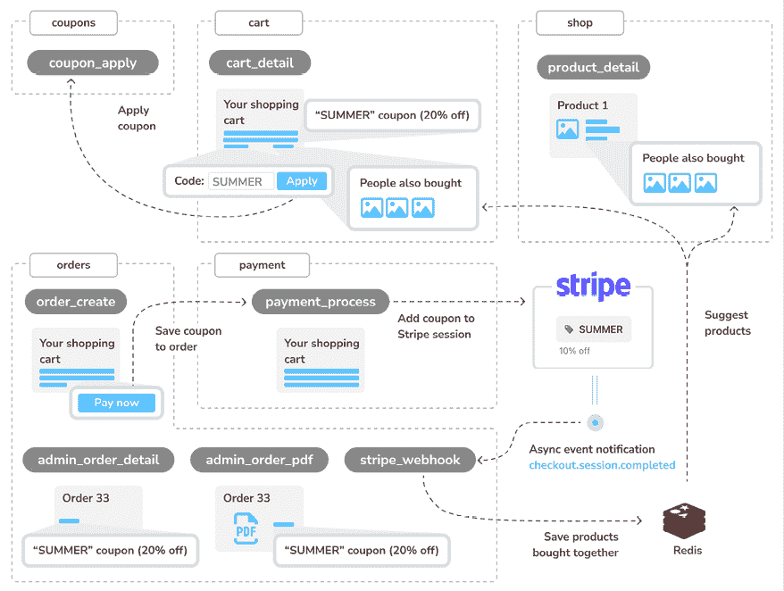

图 10.1：第十章构建的功能图

在本章中，你将构建一个新的 `coupons` 应用程序，并创建 `coupon_apply` 视图以将折扣优惠券应用于购物车会话。你将把应用的折扣添加到 `cart` 应用程序的 `cart_detail` 视图模板中。当使用 `orders` 应用的 `order_create` 视图创建订单时，你将把优惠券保存到创建的订单中。然后，当你创建 `payment` 应用的 `payment_process` 视图中的 Stripe 会话时，你将在将用户重定向到 Stripe 完成支付之前，将优惠券添加到 Stripe 结账会话中。你将把应用的折扣添加到 `order` 应用的管理员视图 `admin_order_detail` 和 `admin_order_pdf` 的模板中。除了优惠券系统，你还将实现一个推荐系统。当 `stripe_webhook` 视图接收到 `checkout.session.completed` Stripe 事件时，你将把一起购买的产品保存到 Redis 中。你将通过从 Redis 中检索经常一起购买的项目，将产品推荐添加到 `product_detail` 和 `cart_detail` 视图中。

本章的源代码可以在 [`github.com/PacktPublishing/Django-5-by-example/tree/main/Chapter10`](https://github.com/PacktPublishing/Django-5-by-example/tree/main/Chapter10) 找到。

本章中使用的所有 Python 包都包含在章节源代码的 `requirements.txt` 文件中。你可以按照以下部分的说明安装每个 Python 包，或者你可以使用命令 `python -m pip install -r requirements.txt` 一次性安装所有依赖。

# 创建优惠券系统

许多在线商店会给顾客发放优惠券，顾客可以用这些优惠券在购买时享受折扣。在线优惠券通常由一个给用户的代码组成，并在特定时间段内有效。

你将为你店铺创建一个优惠券系统。你的优惠券将在特定时间段内对顾客有效。优惠券在可兑换次数上没有限制，并将应用于购物车总价值。

为了实现这个功能，您需要创建一个模型来存储优惠券代码、有效时间范围和要应用的折扣。

使用以下命令在 `myshop` 项目中创建一个新的应用程序：

```py
python manage.py startapp coupons 
```

编辑 `myshop` 的 `settings.py` 文件，并将应用程序添加到 `INSTALLED_APPS` 设置中，如下所示：

```py
INSTALLED_APPS = [
    # ...
**'coupons.apps.CouponsConfig'****,**
] 
```

新的应用程序现在已在您的 Django 项目中生效。

## 构建优惠券模型

让我们从创建 `Coupon` 模型开始。编辑 `coupons` 应用程序的 `models.py` 文件，并向其中添加以下代码：

```py
from django.core.validators import MaxValueValidator, MinValueValidator
from django.db import models
class Coupon(models.Model):
    code = models.CharField(max_length=50, unique=True)
    valid_from = models.DateTimeField()
    valid_to = models.DateTimeField()
    discount = models.IntegerField(
        validators=[MinValueValidator(0), MaxValueValidator(100)],
        help_text='Percentage value (0 to 100)'
 )
    active = models.BooleanField()
    def __str__(self):
        return self.code 
```

这是您将要用来存储优惠券的模型。`Coupon` 模型包含以下字段：

+   `code`：用户必须输入以将优惠券应用到他们的购买中的代码。

+   `valid_from`：表示优惠券何时生效的日期时间值。

+   `valid_to`：表示优惠券何时失效的日期时间值。

+   `discount`：要应用的折扣率（这是一个百分比，因此其值从 `0` 到 `100`）。您可以使用验证器来限制该字段的最低和最高接受值。

+   `active`：一个布尔值，表示优惠券是否激活。

运行以下命令为 `coupons` 应用程序生成初始迁移：

```py
python manage.py makemigrations 
```

输出应包括以下行：

```py
Migrations for 'coupons':
  coupons/migrations/0001_initial.py
    - Create model Coupon 
```

然后，执行以下命令以应用迁移：

```py
python manage.py migrate 
```

您应该看到包含以下行的输出：

```py
Applying coupons.0001_initial... OK 
```

迁移现在已应用到数据库。让我们将 `Coupon` 模型添加到管理站点。编辑 `coupons` 应用程序的 `admin.py` 文件，并向其中添加以下代码：

```py
from django.contrib import admin
from .models import Coupon
@admin.register(Coupon)
class CouponAdmin(admin.ModelAdmin):
    list_display = [
        'code',
        'valid_from',
        'valid_to',
        'discount',
        'active'
 ]
    list_filter = ['active', 'valid_from', 'valid_to']
    search_fields = ['code'] 
```

`Coupon` 模型现在已在管理站点注册。请确保您的本地服务器正在以下命令下运行：

```py
python manage.py runserver 
```

在您的浏览器中打开 `http://127.0.0.1:8000/admin/coupons/coupon/add/`。

您应该看到以下表单：

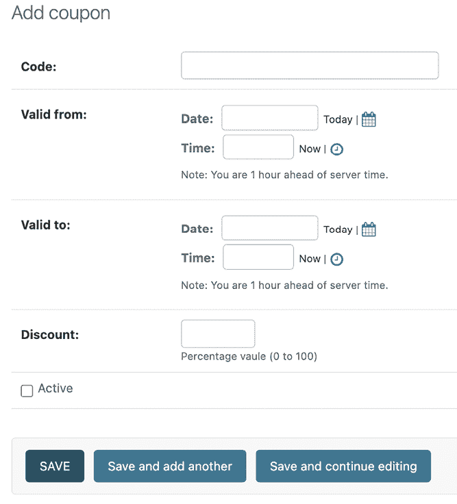

图 10.2：Django 管理站点上的添加优惠券表单

填写表单以创建一个适用于当前日期的新优惠券。确保您勾选了**激活**复选框，并点击**保存**按钮。*图 10.3*展示了创建优惠券的示例：

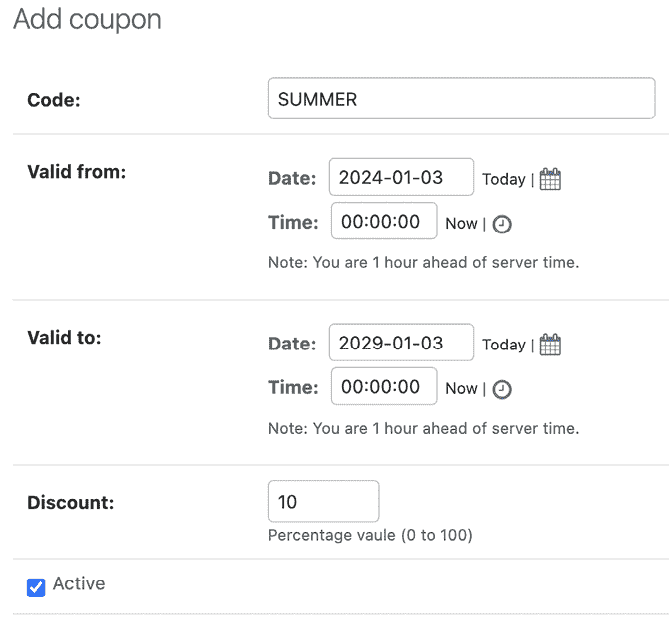

图 10.3：带有示例数据的添加优惠券表单

创建优惠券后，管理站点上的优惠券更改列表页面将类似于*图 10.4*：

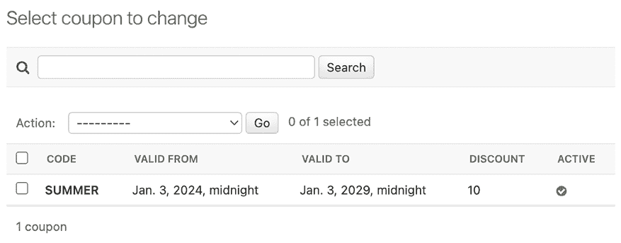

图 10.4：Django 管理站点上的优惠券更改列表页面

接下来，我们将实现将优惠券应用到购物车的功能。

## 将优惠券应用到购物车

您可以存储新的优惠券并对现有优惠券进行查询。现在您需要一种让客户能够将优惠券应用到他们的购买中的方法。应用优惠券的功能如下：

1.  用户将产品添加到购物车。

1.  用户可以在购物车详情页面上显示的表单中输入优惠券代码。

1.  当用户输入优惠券代码并提交表单时，您将寻找具有给定代码且当前有效的现有优惠券。您必须检查优惠券代码是否与用户输入的一致，`active` 属性是否为 `True`，以及当前日期时间是否在 `valid_from` 和 `valid_to` 值之间。

1.  如果找到优惠券，您将其保存到用户的会话中，并显示包含折扣的购物车以及更新的总金额。

1.  当用户下单时，您将优惠券保存到指定的订单中。

在 `coupons` 应用程序目录内创建一个新文件，命名为 `forms.py`。向其中添加以下代码：

```py
from django import forms
class CouponApplyForm(forms.Form):
    code = forms.CharField() 
```

这是用户输入优惠券代码将使用的表单。编辑 `coupons` 应用程序内的 `views.py` 文件，并向其中添加以下代码：

```py
from django.shortcuts import redirect
from django.utils import timezone
from django.views.decorators.http import require_POST
from .forms import CouponApplyForm
from .models import Coupon
@require_POST
def coupon_apply(request):
    now = timezone.now()
    form = CouponApplyForm(request.POST)
    if form.is_valid():
        code = form.cleaned_data['code']
        try:
            coupon = Coupon.objects.get(
                code__iexact=code,
                valid_from__lte=now,
                valid_to__gte=now,
                active=True
            )
            request.session['coupon_id'] = coupon.id
except Coupon.DoesNotExist:
            request.session['coupon_id'] = None
return redirect('cart:cart_detail') 
```

`coupon_apply` 视图验证优惠券并将其存储在用户的会话中。您将 `require_POST` 装饰器应用到这个视图中以限制它只接受 `POST` 请求。在视图中，您执行以下任务：

1.  使用提交的数据实例化 `CouponApplyForm` 表单，并检查表单是否有效。

1.  如果表单有效，您从表单的 `cleaned_data` 字典中获取用户输入的 `code`。您尝试检索具有给定代码的 `Coupon` 对象。您使用 `iexact` 字段查找来执行不区分大小写的精确匹配。优惠券必须当前处于活动状态（`active=True`）且对当前日期时间有效。您使用 Django 的 `timezone.now()` 函数来获取当前时区的日期时间，并通过执行 `lte`（小于等于）和 `gte`（大于等于）字段查找来分别与 `valid_from` 和 `valid_to` 字段进行比较。

1.  您将优惠券 ID 存储在用户的会话中。

1.  您将用户重定向到 `cart_detail` URL 以显示应用了优惠券的购物车。

您需要一个 `coupon_apply` 视图的 URL 模式。在 `coupons` 应用程序目录内创建一个新文件，命名为 `urls.py`。向其中添加以下代码：

```py
from django.urls import path
from . import views
app_name = 'coupons'
urlpatterns = [
    path('apply/', views.coupon_apply, name='apply'),
] 
```

然后，编辑 `myshop` 项目的主体 `urls.py` 并包含以下加粗的 `coupons` URL 模式：

```py
urlpatterns = [
    path('admin/', admin.site.urls),
    path('cart/', include('cart.urls', namespace='cart')),
    path('orders/', include('orders.urls', namespace='orders')),
    path('payment/', include('payment.urls', namespace='payment')),
 **path(****'coupons/'****, include(****'coupons.urls'****, namespace=****'coupons'****)),**
    path('', include('shop.urls', namespace='shop')),
] 
```

记得在 `shop.urls` 模式之前放置此模式。

现在，编辑 `cart` 应用程序的 `cart.py` 文件。包含以下导入：

```py
from coupons.models import Coupon 
```

将以下加粗代码添加到 `Cart` 类的 `__init__()` 方法末尾以从当前会话初始化优惠券：

```py
class Cart:
    def __init__(self, request):
        """
        Initialize the cart.
        """
        self.session = request.session
        cart = self.session.get(settings.CART_SESSION_ID)
        if not cart:
            # save an empty cart in the session
            cart = self.session[settings.CART_SESSION_ID] = {}
        self.cart = cart
**# store current applied coupon**
 **self.coupon_id = self.session.get(****'coupon_id'****)** 
```

在此代码中，您尝试从当前会话中获取 `coupon_id` 会话键并将其值存储在 `Cart` 对象中。向 `Cart` 对象添加以下加粗的方法：

```py
class Cart:
    # ...
 **@property**
**def****coupon****(****self****):**
**if** **self.coupon_id:**
**try****:**
**return** **Coupon.objects.get(****id****=self.coupon_id)**
**except** **Coupon.DoesNotExist:**
**pass**
**return****None**
**def****get_discount****(****self****):**
**if** **self.coupon:**
**return** **(**
 **self.coupon.discount / Decimal(****100****)**
 **) * self.get_total_price()**
**return** **Decimal(****0****)**
**def****get_total_price_after_discount****(****self****):**
**return** **self.get_total_price() - self.get_discount()** 
```

这些方法如下：

+   `coupon()`: 您将此方法定义为 `property`。如果购物车包含 `coupon_id` 属性，则返回具有给定 ID 的 `Coupon` 对象。

+   `get_discount()`: 如果购物车包含优惠券，您将检索其折扣率并返回从购物车总金额中扣除的金额。

+   `get_total_price_after_discount()`: 您返回扣除`get_discount()`方法返回的金额后的购物车总金额。

`Cart`类现在已准备好处理当前会话中应用的优惠券并应用相应的折扣。

让我们将优惠券系统包含到购物车详情视图中。编辑`cart`应用的`views.py`文件，并在文件顶部添加以下导入：

```py
from coupons.forms import CouponApplyForm 
```

在下面，编辑`cart_detail`视图并按照以下方式添加新表单：

```py
def cart_detail(request):
    cart = Cart(request)
    for item in cart:
        item['update_quantity_form'] = CartAddProductForm(
            initial={'quantity': item['quantity'], 'override': True}
        )
 **coupon_apply_form = CouponApplyForm()**
return render(
        request,
        'cart/detail.html',
        {
            'cart': cart**,**
**'coupon_apply_form'****: coupon_apply_form**
        }
    ) 
```

编辑`cart`应用的`cart/detail.html`模板，并定位到以下行：

```py
<tr class="total">
  <td>Total</td>
  <td colspan="4"></td>
  <td class="num">${{ cart.get_total_price }}</td>
</tr> 
```

用以下代码替换它们：

```py
****
**<****tr****class****=****"subtotal"****>**
**<****td****>****Subtotal****</****td****>**
**<****td****colspan****=****"4"****></****td****>**
**<****td****class****=****"num"****>****${{ cart.get_total_price|floatformat:2 }}****</****td****>**
**</****tr****>**
**<****tr****>**
**<****td****>**
 **"{{ cart.coupon.code }}" coupon**
 **({{ cart.coupon.discount }}% off)**
**</****td****>**
**<****td****colspan****=****"4"****></****td****>**
**<****td****class****=****"num neg"****>**
 **- ${{ cart.get_discount|floatformat:2 }}**
**</****td****>**
**</****tr****>**
****
<tr class="total">
<td>Total</td>
<td colspan="4"></td>
<td class="num">
    ${{ cart.**get_total_price_after_discount|floatformat:2** }}
  </td>
</tr> 
```

这是显示可选优惠券及其折扣率的代码。如果购物车包含优惠券，您将显示第一行，包括购物车的总金额作为小计。然后，您使用第二行来显示当前应用于购物车的优惠券。最后，通过调用`cart`对象的`get_total_price_after_discount()`方法来显示包括任何折扣在内的总价。

在同一文件中，在`</table>` HTML 标签之后包含以下代码：

```py
<p>Apply a coupon:</p>
<form action="" method="post">
  {{ coupon_apply_form }}
  <input type="submit" value="Apply">
  
</form> 
```

这将显示输入优惠券代码并将其应用于当前购物车的表单。

在您的浏览器中打开`http://127.0.0.1:8000/`并添加一个产品到购物车。您会看到购物车页面现在包括一个应用优惠券的表单：

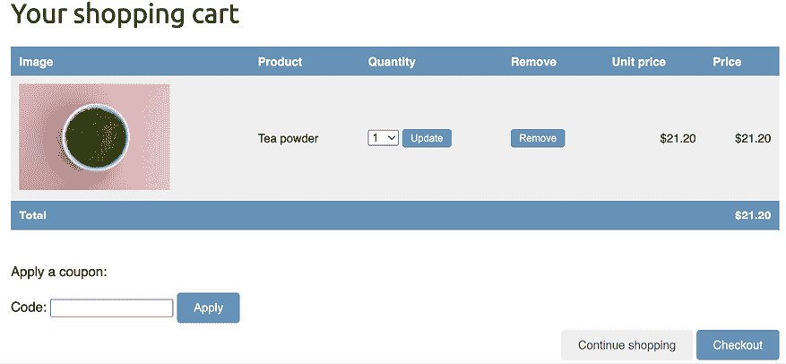

图 10.5：包含应用优惠券表单的购物车详情页面

*茶叶粉末*的图片：由 Phuong Nguyen 在 Unsplash 上拍摄

在**代码**字段中，输入您使用管理网站创建的优惠券代码：

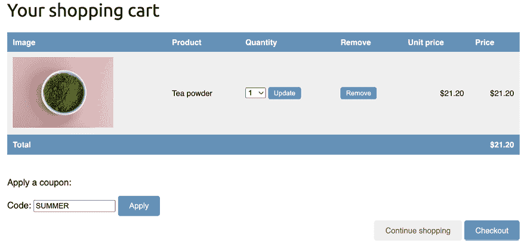

图 10.6：包含优惠券代码的表单的购物车详情页面

点击**应用**按钮。优惠券将被应用，购物车将显示如下优惠券折扣：

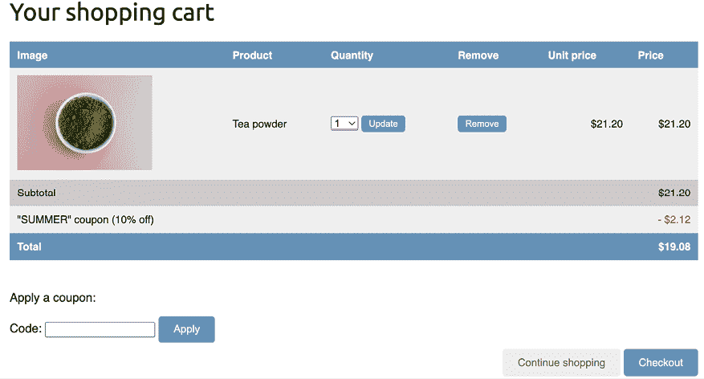

图 10.7：包含已应用优惠券的购物车详情页面

让我们将优惠券添加到购买过程的下一步。编辑`orders`应用的`orders/order/create.html`模板，并定位到以下行：

```py
<ul>
  
    <li>
      {{ item.quantity }}x {{ item.product.name }}
      <span>${{ item.total_price }}</span>
</li>
  
</ul> 
```

用以下代码替换它们：

```py
<ul>
  
    <li>
      {{ item.quantity }}x {{ item.product.name }}
      <span>${{ item.total_price|floatformat:2 }}</span>
</li>
  
 ****
**<****li****>**
 **"{{ cart.coupon.code }}" ({{ cart.coupon.discount }}% off)**
**<****span****class****=****"neg"****>****- ${{ cart.get_discount|floatformat:2 }}****</****span****>**
**</****li****>**
 ****
</ul> 
```

订单摘要现在应包括已应用的优惠券（如果有的话）。现在找到以下行：

```py
<p>Total: ${{ cart.get_total_price }}</p> 
```

用以下代码替换：

```py
<p>Total: ${{ cart.**get_total_price_after_discount|floatformat:2** }}</p> 
```

通过这样做，总价也将通过应用优惠券的折扣来计算。

在您的浏览器中打开`http://127.0.0.1:8000/orders/create/`。您应该看到订单摘要包括已应用的优惠券，如下所示：

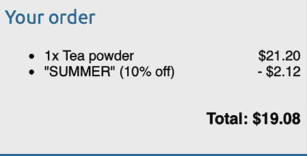

图 10.8：包含应用至购物车的优惠券的订单摘要

用户现在可以将优惠券应用于他们的购物车。然而，您仍然需要在用户结账时创建优惠券信息的订单中存储优惠券信息。

## 应用优惠券到订单

您将存储应用于每个订单的优惠券。首先，您需要修改 `Order` 模型以存储相关的 `Coupon` 对象（如果有的话）。

编辑 `orders` 应用的 `models.py` 文件，并向其中添加以下导入：

```py
from decimal import Decimal
from django.core.validators import MaxValueValidator, MinValueValidator
from coupons.models import Coupon 
```

然后，将以下字段添加到 `Order` 模型中：

```py
class Order(models.Model):
    # ...
**coupon = models.ForeignKey(**
 **Coupon,**
 **related_name=****'orders'****,**
 **null=****True****,**
 **blank=****True****,**
 **on_delete=models.SET_NULL**
 **)**
 **discount = models.IntegerField(**
 **default=****0****,**
 **validators=[MinValueValidator(****0****), MaxValueValidator(****100****)]**
 **)** 
```

这些字段允许您存储订单的可选优惠券及其应用的折扣百分比。折扣存储在相关的 `Coupon` 对象中，但您可以将它包含在 `Order` 模型中以保留它，以防优惠券被修改或删除。您将 `on_delete` 设置为 `models.SET_NULL`，这样如果优惠券被删除，`coupon` 字段将被设置为 `Null`，但折扣将被保留。

您需要创建一个迁移以包含 `Order` 模型的新的字段。从命令行运行以下命令：

```py
python manage.py makemigrations 
```

您应该看到以下输出：

```py
Migrations for 'orders':
  orders/migrations/0003_order_coupon_order_discount.py
    - Add field coupon to order
    - Add field discount to order 
```

使用以下命令应用新的迁移：

```py
python manage.py migrate orders 
```

您应该看到以下确认信息，表明新迁移已被应用：

```py
Applying orders.0003_order_coupon_order_discount... OK 
```

`Order` 模型字段更改现在已与数据库同步。

编辑 `models.py` 文件，并为 `Order` 模型添加两个新方法，`get_total_cost_before_discount()` 和 `get_discount()`，如下所示。新代码加粗显示：

```py
class Order(models.Model):
    # ...
**def****get_total_cost_before_discount****(****self****):**
**return****sum****(item.get_cost()** **for** **item** **in** **self.items.****all****())**
**def****get_discount****(****self****):**
 **total_cost = self.get_total_cost_before_discount()**
**if** **self.discount:**
**return** **total_cost * (self.discount / Decimal(****100****))**
**return** **Decimal(****0****)** 
```

然后，按照以下方式编辑 `Order` 模型的 `get_total_cost()` 方法。新代码加粗显示：

```py
 def get_total_cost(self):
 **total_cost = self.get_total_cost_before_discount()**
**return** **total_cost - self.get_discount()** 
```

`Order` 模型的 `get_total_cost()` 方法现在将考虑应用的折扣，如果有的话。

编辑 `orders` 应用的 `views.py` 文件，并修改 `order_create` 视图以在创建新订单时保存相关的优惠券及其折扣。将以下加粗代码添加到 `order_create` 视图中：

```py
def order_create(request):
    cart = Cart(request)
    if request.method == 'POST':
        form = OrderCreateForm(request.POST)
        if form.is_valid():
            order = form.save(**commit=****False**)
            **if** **cart.coupon:**
 **order.coupon = cart.coupon**
 **order.discount = cart.coupon.discount**
 **order.save()**
for item in cart:
                OrderItem.objects.create(
                    order=order,
                    product=item['product'],
                    price=item['price'],
                    quantity=item['quantity']
                )
            # clear the cart
            cart.clear()
            # launch asynchronous task
            order_created.delay(order.id)
            # set the order in the session
            request.session['order_id'] = order.id
# redirect for payment
return redirect('payment:process')
    else:
        form = OrderCreateForm()
    return render(
        request,
        'orders/order/create.html',
        {'cart': cart, 'form': form}
    ) 
```

在新代码中，您使用 `OrderCreateForm` 表单的 `save()` 方法创建一个 `Order` 对象。您通过使用 `commit=False` 来避免将其保存到数据库中。如果购物车包含优惠券，您将存储相关的优惠券及其应用的折扣。然后，您将 `order` 对象保存到数据库中。

编辑 `payment/process.html` 模板，并定位以下行：

```py
<tr class="total">
<td>Total</td>
<td colspan="4"></td>
<td class="num">${{ order.get_total_cost }}</td>
</tr> 
```

将它们替换为以下代码。新行加粗显示：

```py
****
**<****tr****class****=****"subtotal"****>**
**<****td****>****Subtotal****</****td****>**
**<****td****colspan****=****"3"****></****td****>**
**<****td****class****=****"num"****>**
 **${{ order.get_total_cost_before_discount|floatformat:2 }}**
**</****td****>**
**</****tr****>**
**<****tr****>**
**<****td****>**
 **"{{ order.coupon.code }}" coupon**
 **({{ order.discount }}% off)**
**</****td****>**
**<****td****colspan****=****"3"****></****td****>**
**<****td****class****=****"****num neg"****>**
 **- ${{ order.get_discount|floatformat:2 }}**
**</****td****>**
**</****tr****>**
****
<tr class="total">
<td>Total</td>
<td colspan="3"></td>
<td class="num">
    ${{ order.get_total_cost**|floatformat:2** }}
  </td>
</tr> 
```

我们在付款前已更新订单摘要。

确保使用以下命令开发服务器正在运行：

```py
python manage.py runserver 
```

确保 Docker 正在运行，并在另一个 shell 中执行以下命令以使用 Docker 启动 RabbitMQ 服务器：

```py
docker run -it --rm --name rabbitmq -p 5672:5672 -p 15672:15672 rabbitmq:3.13.1-management 
```

在另一个 shell 中，使用以下命令从您的项目目录启动 Celery 工作进程：

```py
celery -A myshop worker -l info 
```

打开另一个 shell 并执行以下命令以将 Stripe 事件转发到您的本地 webhook URL：

```py
stripe listen --forward-to localhost:8000/payment/webhook/ 
```

在您的浏览器中打开 `http://127.0.0.1:8000/` 并使用您创建的优惠券创建一个订单。在验证购物车中的项目后，在 **订单摘要** 页面上，您将看到应用于订单的优惠券：

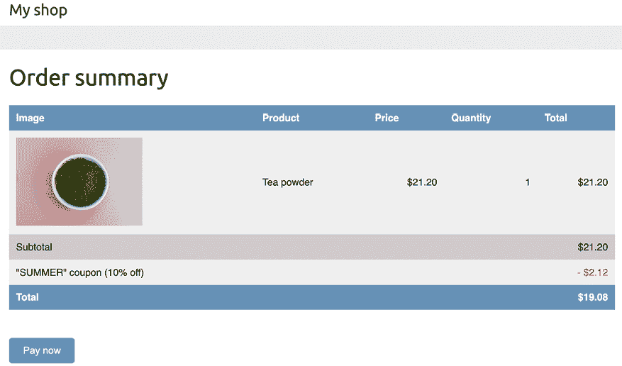

图 10.9：订单摘要页面，包括应用于订单的折扣券

如果您点击 **立即支付**，您将看到 Stripe 并未意识到应用的折扣，如图 *图 10.10* 所示：

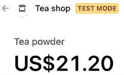

图 10.10：Stripe Checkout 页面的商品详情，包括无折扣券

Stripe 显示需要支付的全额，没有任何扣除。这是因为我们没有将折扣传递给 Stripe。请记住，在 `payment_process` 视图中，我们将订单项作为 `line_items` 传递给 Stripe，包括每个订单项的成本和数量。

## 为 Stripe Checkout 创建折扣券

Stripe 允许您定义折扣券并将它们链接到一次性付款。您可以在 [`stripe.com/docs/payments/checkout/discounts`](https://stripe.com/docs/payments/checkout/discounts) 找到有关为 Stripe Checkout 创建折扣的更多信息。

让我们编辑 `payment_process` 视图以创建 Stripe Checkout 的折扣券。编辑 `payment` 应用程序的 `views.py` 文件，并将以下加粗代码添加到 `payment_process` 视图中：

```py
def payment_process(request):
    order_id = request.session.get('order_id')
    order = get_object_or_404(Order, id=order_id)
    if request.method == 'POST':
        success_url = request.build_absolute_uri(
            reverse('payment:completed')
        )
        cancel_url = request.build_absolute_uri(
            reverse('payment:canceled')
        )
        # Stripe checkout session data
        session_data = {
            'mode': 'payment',
            'client_reference_id': order.id,
            'success_url': success_url,
            'cancel_url': cancel_url,
            'line_items': []
        }
        # add order items to the Stripe checkout session
for item in order.items.all():
            session_data['line_items'].append(
                {
                    'price_data': {
                        'unit_amount': int(item.price * Decimal('100')),
                        'currency': 'usd',
                        'product_data': {
                            'name': item.product.name,
                        },
                    },
                    'quantity': item.quantity,
                }
            )
**# Stripe coupon**
**if** **order.coupon:**
 **stripe_coupon = stripe.Coupon.create(**
 **name=order.coupon.code,**
 **percent_off=order.discount,**
 **duration=****'once'**
 **)**
 **session_data[****'discounts'****] = [{****'coupon'****: stripe_coupon.****id****}]**
# create Stripe checkout session
        session = stripe.checkout.Session.create(**session_data)
        # redirect to Stripe payment form
return redirect(session.url, code=303)
    else:
        return render(request, 'payment/process.html', locals()) 
```

在新代码中，您检查订单是否有相关的折扣券。如果是这样，您使用 Stripe SDK 通过 `stripe.Coupon.create()` 创建 Stripe 折扣券。您使用以下属性为折扣券：

+   `name`: 使用与 `order` 对象相关的折扣券的 `code`。

+   `percent_off`: 发行的 `order` 对象的 `discount`。

+   `duration`: 使用值 `once`。这表示向 Stripe 指明这是一个一次性付款的折扣券。

创建折扣券后，其 `id` 被添加到用于创建 Stripe Checkout 会话的 `session_data` 字典中。这使折扣券与结账会话相关联。

在您的浏览器中打开 `http://127.0.0.1:8000/` 并使用您创建的折扣券完成购买。当重定向到 Stripe Checkout 页面时，您将看到应用的折扣券：

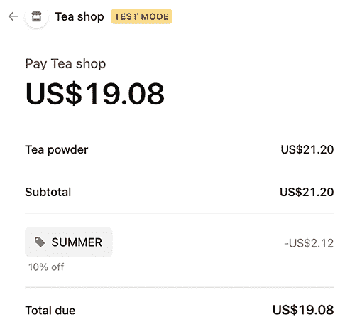

图 10.11：Stripe Checkout 页面的商品详情，包括名为 SUMMER 的折扣券

Stripe Checkout 页面现在包括订单折扣，应付总额现在包括使用折扣扣除的金额。

完成购买后，在您的浏览器中打开 `http://127.0.0.1:8000/admin/orders/order/`。点击使用折扣券的 `order` 对象。编辑表单将显示应用的折扣，如图 *图 10.12* 所示：

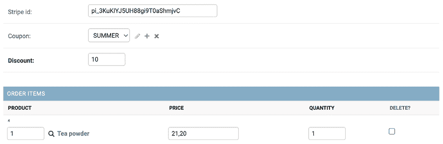

图 10.12：订单编辑表单，包括应用的折扣券和折扣

您已成功存储订单折扣并处理了带折扣的支付。接下来，您将向管理站点的订单详情视图和订单的 PDF 发票添加折扣券。

## 将折扣券添加到管理站点上的订单和 PDF 发票

让我们在管理站点的订单详情页面上添加折扣券。编辑 `orders` 应用的 `admin/orders/order/detail.html` 模板，并添加以下加粗代码：

```py
...
<table style="width:100%">
...
<tbody>
    
      <tr class="row">
<td>{{ item.product.name }}</td>
<td class="num">${{ item.price }}</td>
<td class="num">{{ item.quantity }}</td>
<td class="num">${{ item.get_cost }}</td>
</tr>
    
 ****
**<****tr****class****=****"subtotal"****>**
**<****td****colspan****=****"3"****>****Subtotal****</****td****>**
**<****td****class****=****"num"****>**
 **${{ order.get_total_cost_before_discount|floatformat:2 }}**
**</****td****>**
**</****tr****>**
**<****tr****>**
**<****td****colspan****=****"3"****>**
 **"{{ order.coupon.code }}" coupon**
 **({{ order.discount }}% off)**
**</****td****>**
**<****td****class****=****"num neg"****>**
 **- ${{ order.get_discount|floatformat:2 }}**
**</****td****>**
**</****tr****>**
 ****
<tr class="total">
<td colspan="3">Total</td>
<td class="num">
        ${{ order.get_total_cost**|floatformat:2** }}
      </td>
</tr>
</tbody>
</table>
... 
```

使用浏览器访问`http://127.0.0.1:8000/admin/orders/order/`，并点击最新订单的**查看**链接。现在，**购买的商品**表将包括使用的优惠券，如图*图 10.13*所示：

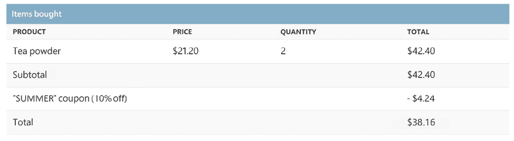

图 10.13：管理网站上包含使用的优惠券的产品详情页

现在，让我们修改订单发票模板以包含用于订单的优惠券。编辑`orders/order/pdf.html`模板的`orders`应用程序，并添加以下加粗显示的代码：

```py
...
<table>
<thead>
<tr>
<th>Product</th>
<th>Price</th>
<th>Quantity</th>
<th>Cost</th>
</tr>
</thead>
<tbody>
    
      <tr class="row">
<td>{{ item.product.name }}</td>
<td class="num">${{ item.price }}</td>
<td class="num">{{ item.quantity }}</td>
<td class="num">${{ item.get_cost }}</td>
</tr>
    
 ****
**<****tr****class****=****"subtotal"****>**
**<****td****colspan****=****"3"****>****Subtotal****</****td****>**
**<****td****class****=****"num"****>**
 **${{ order.get_total_cost_before_discount|floatformat:2 }}**
**</****td****>**
**</****tr****>**
**<****tr****>**
**<****td****colspan****=****"3"****>**
 **"{{ order.coupon.code }}" coupon**
 **({{ order.discount }}% off)**
**</****td****>**
**<****td****class****=****"num neg"****>**
 **- ${{ order.get_discount|floatformat:2 }}**
**</****td****>**
**</****tr****>**
 ****
<tr class="total">
<td colspan="3">Total</td>
<td class="num">${{ order.get_total_cost**|floatformat:2** }}</td>
</tr>
</tbody>
</table>
... 
```

使用浏览器访问`http://127.0.0.1:8000/admin/orders/order/`，并点击最新订单的**PDF**链接。现在，**购买的商品**表将包括使用的优惠券，如图*图 10.14*所示：

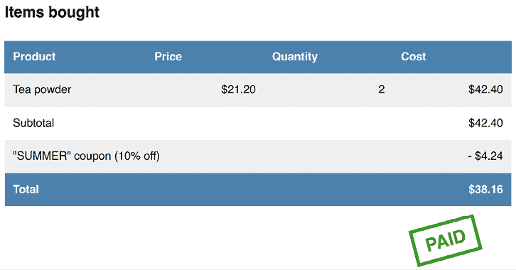

图 10.14：包含使用的优惠券的 PDF 订单发票

您已成功将优惠券系统添加到您的商店。接下来，您将构建一个产品推荐引擎。

# 构建推荐引擎

推荐引擎是一个预测用户会对某项物品给予的偏好或评分的系统。系统根据用户的行为和对其的了解选择与用户相关的物品。如今，推荐系统被广泛应用于许多在线服务中。它们通过从大量对用户无关的数据中筛选出他们可能感兴趣的内容来帮助用户。提供良好的推荐可以增强用户参与度。电子商务网站通过提高每用户的平均收入来从提供相关产品推荐中受益。

您将创建一个简单而强大的推荐引擎，建议通常一起购买的产品。您将根据历史销售数据来建议产品，从而识别通常一起购买的产品。您将在两种不同的场景中建议互补产品：

+   **产品详情页**：您将显示通常与给定产品一起购买的产品列表。这将以*购买此产品的用户还购买了 X、Y 和 Z*的形式显示。您需要一个数据结构，以便存储每个产品与显示的产品一起购买次数。

+   **购物车详情页**：基于用户添加到购物车的产品，您将建议通常与这些产品一起购买的产品。在这种情况下，您计算以获得相关产品的分数需要汇总。

您将使用 Redis 来存储通常一起购买的产品。请记住，您已经在*第七章*，*跟踪用户行为*中使用了 Redis。如果您还没有安装 Redis，可以在该章节中找到安装说明。

## 基于以往购买推荐产品

我们将根据经常一起购买的项目向用户推荐产品。为此，我们将使用 Redis 排序集。记住，你在 *第七章*，*跟踪用户行为* 中使用了排序集来创建网站上最常查看的图像的排名。

*图 10.15* 展示了一个排序集的表示，其中集合成员是与分数关联的字符串：

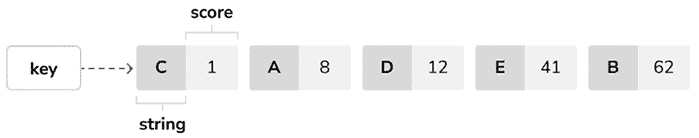

图 10.15：Redis 排序集表示

我们将存储一个键在 Redis 中，用于该网站上购买的每个产品。产品键将包含一个带有分数的 Redis 排序集。每次完成新的购买后，我们将为一起购买的产品增加分数 1。排序集将允许你为一起购买的产品分配分数。我们将使用产品与另一个产品一起购买次数作为该项目的分数。

请记住，使用以下命令在你的环境中安装 `redis-py`：

```py
python -m pip install redis==5.0.4 
```

编辑你的项目中的 `settings.py` 文件，并向其中添加以下设置：

```py
# Redis settings
REDIS_HOST = 'localhost'
REDIS_PORT = 6379
REDIS_DB = 1 
```

这些是建立与 Redis 服务器连接所需的设置。在 `shop` 应用程序目录内创建一个新文件，并将其命名为 `recommender.py`。向其中添加以下代码：

```py
import redis
from django.conf import settings
from .models import Product
# connect to redis
r = redis.Redis(
    host=settings.REDIS_HOST,
    port=settings.REDIS_PORT,
    db=settings.REDIS_DB
)
class Recommender:
    def get_product_key(self, id):
        return f'product:{id}:purchased_with'
def products_bought(self, products):
        product_ids = [p.id for p in products]
        for product_id in product_ids:
            for with_id in product_ids:
                # get the other products bought with each product
if product_id != with_id:
                    # increment score for product purchased together
                    r.zincrby(
                        self.get_product_key(product_id), 1, with_id
                    ) 
```

这是 `Recommender` 类，它将允许你存储产品购买并检索给定产品或产品的产品建议。

`get_product_key()` 方法接收一个 `Product` 对象的 ID，并构建存储相关产品的 Redis 排序集的键，其格式如下：`product:[id]:purchased_with`。

`products_bought()` 方法接收一个列表，其中包含一起购买（即属于同一订单）的 `Product` 对象。

在此方法中，你执行以下任务：

1.  你获取给定 `Product` 对象的产品 ID。

1.  你遍历产品 ID。对于每个 ID，你再次遍历产品 ID 并跳过相同的 ID，以便你得到与每个产品一起购买的产品。

1.  使用 `get_product_id()` 方法获取每个购买产品的 Redis 产品键。对于 ID 为 `33` 的产品，此方法返回键 `product:33:purchased_with`。这是包含与该产品一起购买的产品 ID 的排序集的键。

1.  使用 Redis 的 `ZINCRBY` 操作，通过增量增加排序集中每个产品 ID 的分数 1。分数表示另一个产品与给定产品一起购买了多少次。

*图 10.16* 展示了五个不同产品（ID 从 1 到 5）和五种不同产品组合的购买订单的示例：

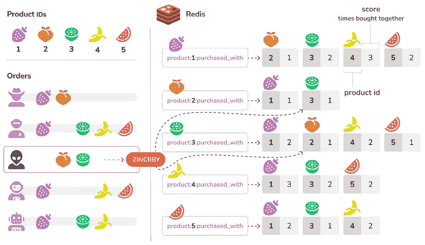

图 10.16：具有相应 ID 和购买订单组合的五个产品

在图中，您可以看到为每个产品在 Redis 中创建的有序集合，键为 `product:<id>:purchased_with`，其中 `<id>` 是产品的唯一标识符。有序集合的成员是与主要产品一起购买的产品 ID。每个成员的分数反映了联合购买的总数。图显示了 `ZINCRBY` Redis 操作，用于将一起购买的产品分数增加 1。

现在，您有一个存储和评分一起购买的产品的方法。接下来，您需要一个方法来检索给定产品列表中一起购买的产品。将以下 `suggest_products_for()` 方法添加到 `Recommender` 类中：

```py
def suggest_products_for(self, products, max_results=6):
    product_ids = [p.id for p in products]
    if len(products) == 1:
        # only 1 product
        suggestions = r.zrange(
            self.get_product_key(product_ids[0]), 0, -1, desc=True
 )[:max_results]
    else:
        # generate a temporary key
        flat_ids = ''.join([str(id) for id in product_ids])
        tmp_key = f'tmp_{flat_ids}'
# multiple products, combine scores of all products
# store the resulting sorted set in a temporary key
        keys = [self.get_product_key(id) for id in product_ids]
        r.zunionstore(tmp_key, keys)
        # remove ids for the products the recommendation is for
        r.zrem(tmp_key, *product_ids)
        # get the product ids by their score, descendant sort
        suggestions = r.zrange(
            tmp_key, 0, -1, desc=True
 )[:max_results]
        # remove the temporary key
        r.delete(tmp_key)
    suggested_products_ids = [int(id) for id in suggestions]
    # get suggested products and sort by order of appearance
    suggested_products = list(
        Product.objects.filter(id__in=suggested_products_ids)
    )
    suggested_products.sort(
        key=lambda x: suggested_products_ids.index(x.id)
    )
    return suggested_products 
```

`suggest_products_for()` 方法接收以下参数：

+   `products`：这是一个要获取推荐的 `Product` 对象列表。它可以包含一个或多个产品。

+   `max_results`：这是一个表示要返回的最大推荐数量的整数。

在此方法中，您执行以下操作：

1.  您可以获取给定 `Product` 对象的产品 ID。

1.  如果只提供了一个产品，您将检索与给定产品一起购买的产品 ID，按它们一起购买的总次数排序。为此，您使用 Redis 的 `ZRANGE` 命令。您将结果数量限制在 `max_results` 属性指定的数量（默认为 `6`）。您可以在 [`redis.io/commands/zrange/`](https://redis.io/commands/zrange/) 了解更多关于 `ZRANGE` 命令的信息。

1.  如果提供了多个产品，您将使用产品的 ID 生成一个临时 Redis 键。

1.  使用 Redis `ZUNIONSTORE` 命令合并给定产品中每个有序集合包含的项目分数，并求和。`ZUNIONSTORE` 命令对给定键的有序集合执行并集操作，并将元素分数的聚合总和存储在一个新的 Redis 键中。您可以在 [`redis.io/commands/zunionstore/`](https://redis.io/commands/zunionstore/) 了解更多关于此命令的信息。您将聚合分数保存到临时键中。

1.  由于您正在聚合分数，您可能会获得您正在获取推荐的产品。您可以使用 `ZREM` 命令从生成的有序集合中删除它们。您可以在 [`redis.io/commands/zrem/`](https://redis.io/commands/zrem/) 了解更多关于 `ZREM` 命令的信息。

1.  您使用 `ZRANGE` 命令从临时键中检索产品 ID，并按它们的分数排序。您将结果数量限制在 `max_results` 属性指定的数量。

1.  然后，您使用执行 Redis `DEL` 命令的 `redis-py delete()` 方法删除临时键。您可以在 [`redis.io/commands/del/`](https://redis.io/commands/del/) 了解更多关于 `DEL` 命令的信息。

1.  最后，你获取具有给定 ID 的 `Product` 对象，并按排序集合成员的顺序排列产品。

*图 10.17* 展示了一个示例会话，其中已将两个产品添加到购物车，并执行了 Redis 操作以获取相关产品推荐：

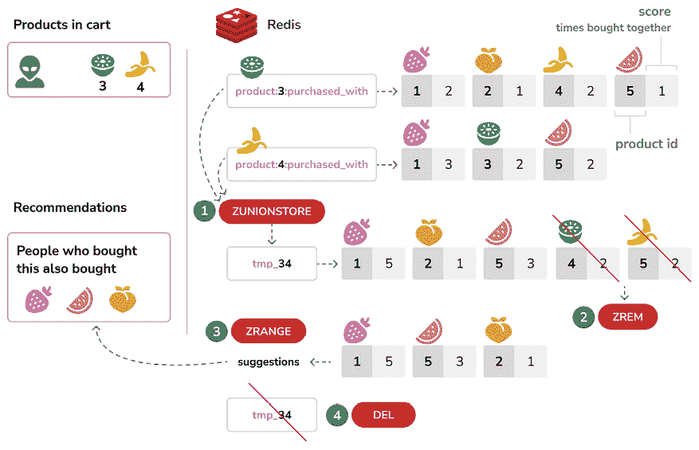

图 10.17：产品推荐系统

在图中，你可以看到生成购物车中项目产品推荐的四个步骤：

1.  `ZUNIONSTORE` Redis 命令用于聚合经常与购物车中的产品一起购买的产品评分。此操作的排序集合存储在以购物车产品 ID 命名的新 Redis 键中，对于 ID `3` 和 `4`，键名为 `tmp_34`。

1.  使用 `ZREM` 命令从排序集中删除正在购买的产品，以避免推荐已经在购物车中的产品。

1.  使用 `ZRANGE` 命令按分数返回 `tmp_34` 排序集合成员。

1.  最后，使用 `DEL` 命令删除 Redis 键 `tmp_34`。

为了实际应用，我们还要添加一个清除推荐的方法。将以下方法添加到 `Recommender` 类中：

```py
def clear_purchases(self):
    for id in Product.objects.values_list('id', flat=True):
        r.delete(self.get_product_key(id)) 
```

让我们尝试推荐引擎。确保你在数据库中包含几个 `Product` 对象，并使用以下命令初始化 Redis Docker 容器：

```py
docker run -it --rm --name redis -p 6379:6379 redis:7.2.4 
```

打开另一个 shell 并运行以下命令以打开 Python shell：

```py
python manage.py shell 
```

确保你的数据库中至少有四种不同的产品。通过名称检索四种不同的产品：

```py
>>> from shop.models import Product
>>> black_tea = Product.objects.get(name='Black tea')
>>> red_tea = Product.objects.get(name='Red tea')
>>> green_tea = Product.objects.get(name='Green tea')
>>> tea_powder = Product.objects.get(name='Tea powder') 
```

然后，向推荐引擎添加一些测试购买：

```py
>>> from shop.recommender import Recommender
>>> r = Recommender()
>>> r.products_bought([black_tea, red_tea])
>>> r.products_bought([black_tea, green_tea])
>>> r.products_bought([red_tea, black_tea, tea_powder])
>>> r.products_bought([green_tea, tea_powder])
>>> r.products_bought([black_tea, tea_powder])
>>> r.products_bought([red_tea, green_tea]) 
```

你已存储以下评分：

```py
black_tea:  red_tea (2), tea_powder (2), green_tea (1)
red_tea:    black_tea (2), tea_powder (1), green_tea (1)
green_tea:  black_tea (1), tea_powder (1), red_tea(1)
tea_powder: black_tea (2), red_tea (1), green_tea (1) 
```

这表示与每个产品一起购买的产品，包括它们一起购买了多少次。

让我们检索单个产品的产品推荐：

```py
>>> r.suggest_products_for([black_tea])
[<Product: Tea powder>, <Product: Red tea>, <Product: Green tea>]
>>> r.suggest_products_for([red_tea])
[<Product: Black tea>, <Product: Tea powder>, <Product: Green tea>]
>>> r.suggest_products_for([green_tea])
[<Product: Black tea>, <Product: Tea powder>, <Product: Red tea>]
>>> r.suggest_products_for([tea_powder])
[<Product: Black tea>, <Product: Red tea>, <Product: Green tea>] 
```

你可以看到推荐产品的顺序是基于它们的评分。让我们获取具有聚合评分的多个产品的推荐：

```py
>>> r.suggest_products_for([black_tea, red_tea])
[<Product: Tea powder>, <Product: Green tea>]
>>> r.suggest_products_for([green_tea, red_tea])
[<Product: Black tea>, <Product: Tea powder>]
>>> r.suggest_products_for([tea_powder, black_tea])
[<Product: Red tea>, <Product: Green tea>] 
```

你可以看到建议产品的顺序与聚合评分相匹配。例如，为 `black_tea` 和 `red_tea` 建议的产品是 `tea_powder` (`2+1`) 和 `green_tea` (`1+1`)。

你已验证你的推荐算法按预期工作。

让我们存储每次支付确认时一起购买的产品。编辑 `payment` 应用程序的 `webhooks.py` 文件，并添加以下加粗代码：

```py
# ...
**from** **shop.models** **import** **Product**
**from** **shop.recommender** **import** **Recommender**
@csrf_exempt
def stripe_webhook(request):
    # ...
if event.type == 'checkout.session.completed':
        session = event.data.object
if (
            session.mode == 'payment'
and session.payment_status == 'paid'
        ):
            try:
                order = Order.objects.get(
                    id=session.client_reference_id
                )
            except Order.DoesNotExist:
                return HttpResponse(status=404)
            # mark order as paid
            order.paid = True
# store Stripe payment ID
            order.stripe_id = session.payment_intent
            order.save()
            **# save items bought for product recommendations**
 **product_ids = order.items.values_list(****'product_id'****)**
 **products = Product.objects.****filter****(id__in=product_ids)**
 **r = Recommender()**
 **r.products_bought(products)**
# launch asynchronous task
            payment_completed.delay(order.id)
    return HttpResponse(status=200) 
```

在新代码中，当确认新的订单支付时，你检索与订单项目关联的 `Product` 对象。然后，你创建 `Recommender` 类的实例并调用 `products_bought()` 方法将一起购买的产品存储在 Redis 中。

你现在存储了在订单支付时一起购买的相关产品。现在让我们在你的网站上显示产品推荐。

编辑`shop`应用的`views.py`文件，添加功能以在`product_detail`视图中检索最多四个推荐产品，如下所示：

```py
**from** **.recommender** **import** **Recommender**
def product_detail(request, id, slug):
    product = get_object_or_404(
        Product, id=id, slug=slug, available=True
 )
    cart_product_form = CartAddProductForm()
 **r = Recommender()**
 **recommended_products = r.suggest_products_for([product],** **4****)**
return render(
        request,
        'shop/product/detail.html',
        {
            'product': product,
            'cart_product_form': cart_product_form**,**
 **'recommended_products'****: recommended_products**
        }
    ) 
```

编辑`shop`应用的`shop/product/detail.html`模板，并在`{{ product.description|linebreaks }}`之后添加以下代码：

```py

  <div class="recommendations">
<h3>People who bought this also bought</h3>
    
      <div class="item">
<a href="{{ p.get_absolute_url }}">

</a>
<p><a href="{{ p.get_absolute_url }}">{{ p.name }}</a></p>
</div>
    
  </div>
 
```

运行开发服务器，并在浏览器中打开`http://127.0.0.1:8000/`。点击任何产品查看其详细信息。你应该看到推荐产品显示在产品下方，如图*图 10.18*所示：

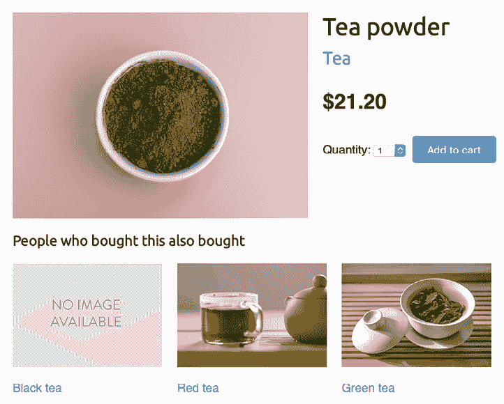

图 10.18：产品详情页面，包括推荐产品

本章中的图片：

+   *绿茶*：由 Jia Ye 在 Unsplash 上的照片

+   *红茶*：由 Manki Kim 在 Unsplash 上的照片

+   *茶粉*：由 Phuong Nguyen 在 Unsplash 上的照片

你还将包括购物车中的产品推荐。这些推荐将基于用户添加到购物车中的产品。

编辑`cart`应用内的`views.py`，导入`Recommender`类，并编辑`cart_detail`视图，使其看起来如下：

```py
**from** **shop.recommender** **import** **Recommender**
def cart_detail(request):
    cart = Cart(request)
    for item in cart:
        item['update_quantity_form'] = CartAddProductForm(
            initial={'quantity': item['quantity'], 'override': True}
        )
    coupon_apply_form = CouponApplyForm()
 **r = Recommender()**
 **cart_products = [item[****'product'****]** **for** **item** **in** **cart]**
**if****(cart_products):**
 **recommended_products = r.suggest_products_for(**
 **cart_products, max_results=****4**
**)**
**else****:**
 **recommended_products = []**
return render(
        request,
        'cart/detail.html',
        {
            'cart': cart,
            'coupon_apply_form': coupon_apply_form**,**
 **'recommended_products'****: recommended_products})**
        }
    ) 
```

编辑`cart`应用的`cart/detail.html`模板，并在`</table>`HTML 标签之后添加以下代码：

```py

  <div class="recommendations cart">
<h3>People who bought this also bought</h3>
    
      <div class="item">
<a href="{{ p.get_absolute_url }}">

</a>
<p><a href="{{ p.get_absolute_url }}">{{ p.name }}</a></p>
</div>
    
  </div>
 
```

在浏览器中打开`http://127.0.0.1:8000/en/`，并添加几个产品到购物车。当你导航到`http://127.0.0.1:8000/en/cart/`时，你应该看到购物车中商品的聚合推荐，如下所示：

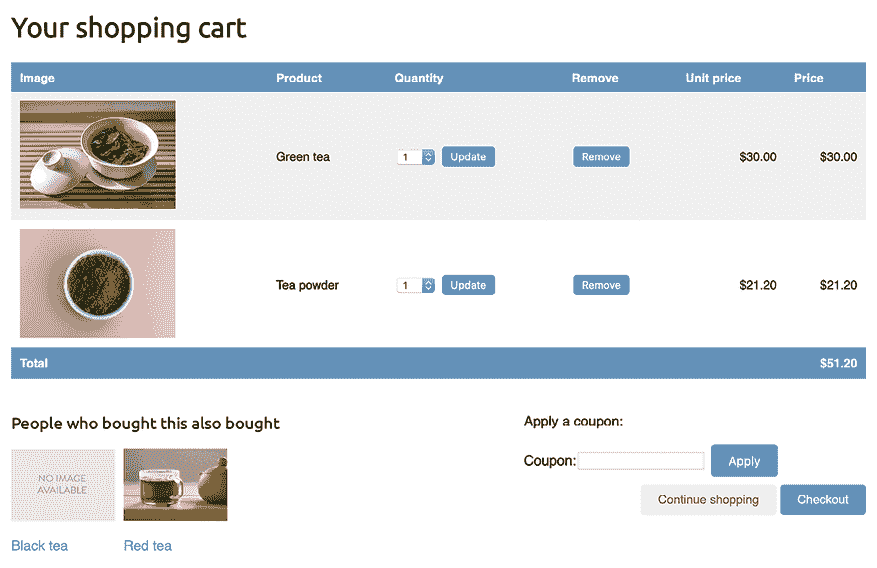

图 10.19：购物车详情页面，包括推荐产品

恭喜！你已经使用 Django 和 Redis 构建了一个完整的推荐引擎。

# 摘要

在本章中，你使用 Django 会话创建了一个优惠券系统，并将其与 Stripe 集成。你还使用 Redis 构建了一个推荐引擎，以推荐通常一起购买的产品。

下一章将为你揭示 Django 项目的国际化本地化。你将学习如何翻译代码以及如何使用 Rosetta 管理翻译。你将实现翻译的 URL 并构建语言选择器。你还将使用`django-parler`实现模型翻译，并使用`django-localflavor`验证本地化表单字段。

# 其他资源

以下资源提供了与本章涵盖主题相关的额外信息：

+   本章的源代码：[`github.com/PacktPublishing/Django-5-by-example/tree/main/Chapter10`](https://github.com/PacktPublishing/Django-5-by-example/tree/main/Chapter10)

+   Stripe Checkout 的折扣：[`stripe.com/docs/payments/checkout/discounts`](https://stripe.com/docs/payments/checkout/discounts)

+   Redis 的`ZRANGE`命令：[`redis.io/commands/zrange/`](https://redis.io/commands/zrange/)

+   Redis 的`ZUNIONSTORE`命令：[`redis.io/commands/zunionstore/`](https://redis.io/commands/zunionstore/)

+   Redis 的 `ZREM` 命令：[`redis.io/commands/zrem/`](https://redis.io/commands/zrem/)

+   Redis 的 `DEL` 命令：[`redis.io/commands/del/`](https://redis.io/commands/del/)
