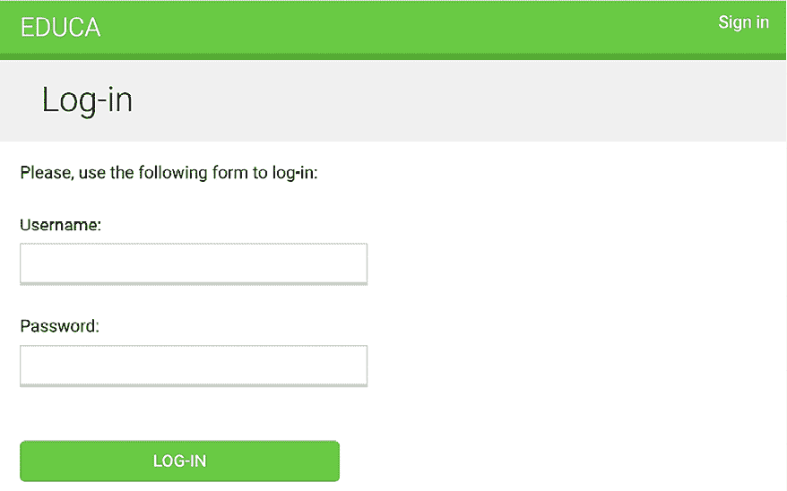

# 第十二章：构建在线学习平台

在上一章中，您学习了 Django 项目的国际化本地化基础，使您的项目适应用户的本地格式和语言。

在本章中，您将启动一个新的 Django 项目，该项目将包含一个带有您自己的**内容管理系统**（**CMS**）的在线学习平台。在线学习平台是需要高级内容处理工具的应用程序的绝佳例子。您将学习如何创建灵活的数据模型，以适应多种数据类型，并了解如何实现可应用于您未来 Django 项目的自定义模型功能。

在本章中，您将学习如何：

+   为 CMS 创建模型

+   为您的模型创建数据并应用它们

+   使用模型继承创建多态内容的数据模型

+   创建自定义模型字段

+   排序课程内容和模块

+   为 CMS 构建认证视图

# 功能概述

在前面的章节中，开头的图表代表了视图、模板和端到端功能。然而，在本章中，焦点转向了实现模型继承和创建自定义模型字段，这些内容不易在我们的常规图表中捕捉到。相反，您将在本章中看到具体的图表来阐述这些概念。

本章的源代码可以在[`github.com/PacktPublishing/Django-5-by-example/tree/main/Chapter12`](https://github.com/PacktPublishing/Django-5-by-example/tree/main/Chapter12)找到。

本章中使用的所有 Python 模块都包含在本章源代码中的`requirements.txt`文件中。您可以按照以下说明安装每个 Python 模块，或者可以使用以下命令一次性安装所有需求：`python -m pip install -r requirements.txt`。

# 设置在线学习项目

您的最终实践项目将是一个在线学习平台。首先，在`env/`目录下使用以下命令为您的新项目创建一个虚拟环境：

```py
python -m venv env/educa 
```

如果您使用的是 Linux 或 macOS，请运行以下命令以激活您的虚拟环境：

```py
source env/educa/bin/activate 
```

如果您使用的是 Windows，请使用以下命令代替：

```py
.\env\educa\Scripts\activate 
```

使用以下命令在您的虚拟环境中安装 Django：

```py
python -m pip install Django~=5.0.4 
```

您将在项目中管理图像上传，因此您还需要使用以下命令安装`Pillow`：

```py
python -m pip install Pillow==10.3.0 
```

使用以下命令创建一个新的项目：

```py
django-admin startproject educa 
```

进入新的`educa`目录，并使用以下命令创建一个新的应用程序：

```py
cd educa
django-admin startapp courses 
```

编辑`educa`项目的`settings.py`文件，并将`courses`添加到`INSTALLED_APPS`设置中，如下所示。新行以粗体突出显示：

```py
INSTALLED_APPS = [
    **'courses.apps.CoursesConfig'****,**
'django.contrib.admin',
    'django.contrib.auth',
    'django.contrib.contenttypes',
    'django.contrib.sessions',
    'django.contrib.messages',
    'django.contrib.staticfiles',
] 
```

`courses`应用程序现在对项目是激活的。接下来，我们将准备我们的项目以提供媒体文件，并为课程和课程内容定义模型。

# 服务器端媒体文件

在创建课程和课程内容的模型之前，我们将准备项目以服务媒体文件。课程讲师将能够使用我们将构建的 CMS 将媒体文件上传到课程内容。因此，我们将配置项目以服务媒体文件。

编辑项目的 `settings.py` 文件并添加以下行：

```py
MEDIA_URL = 'media/'
MEDIA_ROOT = BASE_DIR / 'media' 
```

这将使 Django 能够管理文件上传并服务媒体文件。`MEDIA_URL` 是用于服务用户上传的媒体文件的基 URL。`MEDIA_ROOT` 是它们所在的本地路径。文件路径和 URL 是通过在它们前面添加项目路径或媒体 URL 来动态构建的，以实现可移植性。

现在，编辑 `educa` 项目的 `urls.py` 主文件并修改代码，如下。新行以粗体显示：

```py
**from** **django.conf** **import** **settings**
**from** **django.conf.urls.static** **import** **static**
from django.contrib import admin
from django.urls import path
urlpatterns = [
    path('admin/', admin.site.urls),
]
**if** **settings.DEBUG:**
 **urlpatterns += static(**
 **settings.MEDIA_URL, document_root=settings.MEDIA_ROOT**
 **)** 
```

我们已将 `static()` 辅助函数添加到开发期间使用 Django 开发服务器服务媒体文件（即，当 `DEBUG` 设置为 `True` 时）。

记住，`static()` 辅助函数适用于开发，但不适用于生产使用。Django 在服务静态文件方面效率低下。永远不要在生产环境中使用 Django 开发服务器来服务静态文件。你将在第十七章“上线”中学习如何在生产环境中服务静态文件。

项目现在已准备好服务媒体文件。让我们为课程和课程内容创建模型。

# 构建课程模型

你的在线学习平台将提供各种主题的课程。每个课程将被划分为可配置数量的模块，每个模块将包含可配置数量的内容。内容将包括各种类型：文本、文件、图片或视频。以下示例显示了你的课程目录的数据结构：

```py
Subject 1
  Course 1
    Module 1
      Content 1 (image)
      Content 2 (text)
    Module 2
      Content 3 (text)
      Content 4 (file)
      Content 5 (video)
      ... 
```

让我们构建课程模型。编辑 `courses` 应用的 `models.py` 文件并向其中添加以下代码：

```py
**from** **django.contrib.auth.models** **import** **User**
from django.db import models
**class****Subject****(models.Model):**
 **title = models.CharField(max_length=****200****)**
 **slug = models.SlugField(max_length=****200****, unique=****True****)**
**class****Meta****:**
 **ordering = [****'title'****]**
**def****__str__****(****self****):**
**return** **self.title**
**class****Course****(models.Model):**
 **owner = models.ForeignKey(**
 **User,**
 **related_name=****'****courses_created'****,**
 **on_delete=models.CASCADE**
 **)**
 **subject = models.ForeignKey(**
 **Subject,**
 **related_name=****'courses'****,**
 **on_delete=models.CASCADE**
 **)**
 **title = models.CharField(max_length=****200****)**
 **slug = models.SlugField(max_length=****200****, unique=****True****)**
 **overview = models.TextField()**
 **created = models.DateTimeField(auto_now_add=****True****)**
**class****Meta****:**
 **ordering = [****'-created'****]**
**def****__str__****(****self****):**
**return** **self.title**
**class****Module****(models.Model):**
 **course = models.ForeignKey(**
 **Course, related_name=****'modules'****, on_delete=models.CASCADE**
 **)**
 **title = models.CharField(max_length=****200****)**
 **description = models.TextField(blank=****True****)**
**def****__str__****(****self****):**
**return** **self.title** 
```

这些是初始的 `Subject`、`Course` 和 `Module` 模型。`Course` 模型的字段如下：

+   `owner`：创建此课程的讲师。

+   `subject`：此课程所属的主题。它是一个指向 `Subject` 模型的 `ForeignKey` 字段。

+   `title`：课程的标题。

+   `slug`：课程的缩略名。这将在稍后的 URL 中使用。

+   `overview`：一个用于存储课程概述的 `TextField` 列。

+   `created`：课程创建的日期和时间。由于 `auto_now_add=True`，Django 将在创建新对象时自动设置它。

每个课程被划分为几个模块。因此，`Module` 模型包含一个指向 `Course` 模型的 `ForeignKey` 字段。

打开 shell 并运行以下命令以创建此应用的初始迁移：

```py
python manage.py makemigrations 
```

你将看到以下输出：

```py
Migrations for 'courses':
  courses/migrations/0001_initial.py:
    - Create model Course
    - Create model Module
    - Create model Subject
    - Add field subject to course 
```

然后，运行以下命令将所有迁移应用到数据库中：

```py
python manage.py migrate 
```

你应该会看到包括 Django 在内的所有应用的迁移输出，输出将包含以下行：

```py
Applying courses.0001_initial... OK 
```

你的 `courses` 应用程序的模型已与数据库同步。接下来，我们将把课程模型添加到管理站点。

## 在管理站点注册模型

让我们在管理站点注册课程模型，这样我们就可以轻松地管理数据。编辑 `courses` 应用程序目录内的 `admin.py` 文件，并向其中添加以下代码：

```py
from django.contrib import admin
**from** **.models** **import** **Subject, Course, Module**
**@admin.register(****Subject****)**
**class****SubjectAdmin****(admin.ModelAdmin):**
 **list_display = [****'title'****,** **'slug'****]**
 **prepopulated_fields = {****'slug'****: (****'title'****,)}**
**class****ModuleInline****(admin.StackedInline):**
 **model = Module**
**@admin.register(****Course****)**
**class****CourseAdmin****(admin.ModelAdmin):**
 **list_display = [****'title'****,** **'subject'****,** **'created'****]**
 **list_filter = [****'created'****,** **'subject'****]**
 **search_fields = [****'title'****,** **'overview'****]**
 **prepopulated_fields = {****'slug'****: (****'title'****,)}**
 **inlines = [ModuleInline]** 
```

`courses` 应用程序的模型现在已在管理站点注册。记住，你使用 `@admin.register()` 装饰器在管理站点注册模型。

在下一节中，你将学习如何创建初始数据来填充你的模型。

## 使用固定值提供模型初始数据

有时，你可能希望预先用硬编码的数据填充你的数据库。这对于在项目设置中自动包含初始数据非常有用，而不是手动添加。Django 提供了一种简单的方法来从数据库中加载数据和转储数据到称为 **固定值** 的文件。Django 支持固定值在 JSON、XML 或 YAML 格式。固定值的结构紧密类似于模型的 API 表示，这使得在内部数据库格式和外部应用程序之间转换数据变得简单。你将创建一个固定值来包含几个初始的 `Subject` 对象。

首先，使用以下命令创建一个超级用户：

```py
python manage.py createsuperuser 
```

然后，使用以下命令运行开发服务器：

```py
python manage.py runserver 
```

在你的浏览器中打开 `http://127.0.0.1:8000/admin/courses/subject/`。使用管理站点创建几个主题。更改列表页面应如下所示：


图 12.1：管理站点上的主题更改列表视图

从 shell 中运行以下命令：

```py
python manage.py dumpdata courses --indent=2 
```

你将看到类似以下输出：

```py
[
{
  "model": "courses.subject",
  "pk": 1,
  "fields": {
    "title": "Mathematics",
    "slug": "mathematics"
  }
},
{
  "model": "courses.subject",
  "pk": 2,
  "fields": {
    "title": "Music",
    "slug": "music"
  }
},
{
  "model": "courses.subject",
  "pk": 3,
  "fields": {
    "title": "Physics",
    "slug": "physics"
  }
},
{
  "model": "courses.subject",
  "pk": 4,
  "fields": {
    "title": "Programming",
    "slug": "programming"
  }
}
] 
```

`dumpdata` 命令将数据从数据库转储到标准输出，默认情况下以 JSON 格式序列化。结果数据结构包括有关模型及其字段的信息，以便 Django 能够将其加载到数据库中。

你可以通过提供应用程序名称给命令或指定使用 `app.Model` 格式输出数据的单个模型来限制输出到应用程序的模型。

你也可以使用 `--format` 标志指定格式。默认情况下，`dumpdata` 将序列化数据输出到标准输出。但是，你可以使用 `--output` 标志指示输出文件，这允许你存储输出。`--indent` 标志允许你指定缩进。有关 `dumpdata` 参数的更多信息，请运行 `python manage.py dumpdata --help`。

使用以下命令将此转储保存到 `courses` 应用程序中的新 `fixtures/` 目录的固定值文件中：

```py
mkdir courses/fixtures
python manage.py dumpdata courses --indent=2 --output=courses/fixtures/subjects.json 
```

运行开发服务器并使用管理站点删除你创建的主题，如图 *12.2* 所示：


图 12.2：删除所有现有主题

删除所有主题后，使用以下命令将固定数据加载到数据库中：

```py
python manage.py loaddata subjects.json 
```

固定数据中包含的所有`Subject`对象再次被加载到数据库中：


图 12.3：固定数据中的主题现在已加载到数据库中

默认情况下，Django 在每个应用程序的`fixtures/`目录中查找文件，但你可以为`loaddata`命令指定固定文件的完整路径。你还可以使用`FIXTURE_DIRS`设置告诉 Django 查找固定数据的附加目录。

固定数据不仅对设置初始数据有用，还可以为你的应用程序提供样本数据或测试所需的数据。你还可以使用固定数据为生产环境填充必要的数据。

你可以在[`docs.djangoproject.com/en/5.0/topics/testing/tools/#fixture-loading`](https://docs.djangoproject.com/en/5.0/topics/testing/tools/#fixture-loading)了解如何使用固定数据（fixtures）进行测试。

如果你想在模型迁移中加载固定数据，请查看 Django 关于数据迁移的文档。你可以在[`docs.djangoproject.com/en/5.0/topics/migrations/#data-migrations`](https://docs.djangoproject.com/en/5.0/topics/migrations/#data-migrations)找到迁移数据的文档。

你已经创建了用于管理课程主题、课程和课程模块的模型。接下来，你将创建用于管理不同类型模块内容的模型。

# 创建多态内容模型

你计划向课程模块添加不同类型的内容，如文本、图片、文件和视频。**多态性**是提供单一接口以访问不同类型的实体。你需要一个灵活的数据模型，允许你通过单一接口存储各种内容。在*第七章*，*跟踪用户行为*中，你了解到使用通用关系创建可以指向任何模型对象的键外键（foreign keys）的便利性。你将创建一个`Content`模型来表示模块的内容，并定义一个通用关系以将任何对象与内容对象关联起来。

编辑`courses`应用程序的`models.py`文件并添加以下导入：

```py
from django.contrib.contenttypes.fields import GenericForeignKey
from django.contrib.contenttypes.models import ContentType 
```

然后，将以下代码添加到文件末尾：

```py
class Content(models.Model):
    module = models.ForeignKey(
        Module,
        related_name='contents',
        on_delete=models.CASCADE
    )
    content_type = models.ForeignKey(
        ContentType,
        on_delete=models.CASCADE
    )
    object_id = models.PositiveIntegerField()
    item = GenericForeignKey('content_type', 'object_id') 
```

这是`内容`模型。一个模块包含多个内容，因此你需要定义一个指向`Module`模型的`ForeignKey`字段。你也可以设置一个通用关系来关联不同模型中的对象，这些模型代表不同类型的内容。记住，你需要三个不同的字段来设置一个通用关系。在你的`Content`模型中，这些字段是：

+   `content_type`：一个指向`ContentType`模型的`ForeignKey`字段

+   `object_id`：一个用于存储相关对象主键的`PositiveIntegerField`

+   `item`：一个结合前两个字段的`GenericForeignKey`字段，指向相关对象

只有`content_type`和`object_id`字段在这个模型的数据库表中对应有列。`item`字段允许你直接检索或设置相关对象，其功能建立在其他两个字段之上。

你将为每种内容类型使用一个不同的模型；文本、图片、视频和文档。你的`Content`模型将共享一些公共字段，但它们在存储的具体数据上会有所不同。例如，对于文本内容，你将存储实际的文本，但对于视频内容，你将存储视频 URL。为了实现这一点，你需要使用模型继承。在我们构建`Content`模型之前，我们将深入了解 Django 为模型继承提供的选项。

## 使用模型继承

Django 支持模型继承。它的工作方式与 Python 中的标准类继承类似。如果你不熟悉类继承，它涉及到定义一个新的类，该类从现有的类继承方法和属性。这有助于代码重用，并可以简化相关类的创建。你可以在[`docs.python.org/3/tutorial/classes.html#inheritance`](https://docs.python.org/3/tutorial/classes.html#inheritance)了解更多关于类继承的信息。

Django 提供了以下三种选项来使用模型继承：

+   **抽象模型**：当你想在几个模型中放入一些公共信息时很有用

+   **多表模型继承**：适用于每个模型在继承层次中都被视为一个完整的模型

+   **代理模型**：当你需要更改模型的行为时很有用，例如，通过包含额外的方法、更改默认管理器或使用不同的元选项

让我们逐一深入了解每个选项。

### 抽象模型

抽象模型是一个基类，在其中你定义你想要包含在所有子模型中的字段。Django 不会为抽象模型创建任何数据库表。为每个子模型创建数据库表，包括从抽象类继承的字段和在子模型中定义的字段。

要将模型标记为抽象，你需要在它的`Meta`类中包含`abstract=True`。Django 将识别它是一个抽象模型，并且不会为它创建数据库表。要创建子模型，你只需将抽象模型子类化即可。

以下示例展示了一个抽象的`BaseContent`模型和一个子`Text`模型：

```py
from django.db import models
class BaseContent(models.Model):
    title = models.CharField(max_length=100)
    created = models.DateTimeField(auto_now_add=True)
    class Meta:
        abstract = True
class Text(BaseContent):
    body = models.TextField() 
```

在这种情况下，Django 只为`Text`模型创建一个表，包括`title`、`created`和`body`字段。

*图 12.4*展示了提供的代码示例中的模型和相关数据库表：


图 12.4：使用抽象模型进行继承的示例模型和数据库表

接下来，我们将学习关于不同模型继承方法的知识，其中将创建多个数据库表。

### 多表模型继承

在多表继承中，每个模型对应一个数据库表。Django 为子模型与其父模型之间的关系创建一个`OneToOneField`字段。要使用多表继承，你必须继承一个现有的模型。Django 将为原始模型和子模型都创建数据库表。以下示例显示了多表继承：

```py
from django.db import models
class BaseContent(models.Model):
    title = models.CharField(max_length=100)
    created = models.DateTimeField(auto_now_add=True)
class Text(BaseContent):
    body = models.TextField() 
```

Django 将在`Text`模型中包含一个自动生成的`OneToOneField`字段，该字段指向`BaseContent`模型。这个字段的名称是`basecontent_ptr`，其中`ptr`代表*指针*。为每个模型创建一个数据库表。

*图 12.5*显示了提供的多表模型继承代码示例中的模型及其相关的数据库表：


图 12.5：多表模型继承的示例模型和数据库表

接下来，我们将学习另一种模型继承方法，其中多个模型作为单个数据库表的代理。

### 代理模型

代理模型改变了模型的行为。这两个模型都在原始模型的数据库表上操作。这允许你为不同的模型定制行为，而无需创建新的数据库表，创建针对不同目的定制的同一模型的多个版本。要创建代理模型，请在模型的`Meta`类中添加`proxy=True`。以下示例说明了如何创建代理模型：

```py
from django.db import models
from django.utils import timezone
class BaseContent(models.Model):
    title = models.CharField(max_length=100)
    created = models.DateTimeField(auto_now_add=True)
class OrderedContent(BaseContent):
    class Meta:
        proxy = True
        ordering = ['created']
    def created_delta(self):
        return timezone.now() - self.created 
```

在这里，你定义一个`OrderedContent`模型，它是`Content`模型的代理模型。此模型为 QuerySets 提供默认排序，并额外提供`created_delta()`方法。这两个模型，`Content`和`OrderedContent`，在同一个数据库表上操作，对象可以通过 ORM 通过任一模型访问。

*图 12.6*显示了提供的代理模型继承代码示例中的模型及其相关的数据库表：


图 12.6：使用代理模型进行继承的示例模型和数据库表

你现在已经熟悉了三种模型继承类型。有关模型继承的更多信息，你可以访问[`docs.djangoproject.com/en/5.0/topics/db/models/#model-inheritance`](https://docs.djangoproject.com/en/5.0/topics/db/models/#model-inheritance)。现在，我们将通过使用基抽象模型来开发各种内容类型的模型来实际应用模型继承。

## 创建内容模型

让我们使用模型继承来实现多态模型。你将创建一个通用的数据模型，它能够通过统一的接口存储各种内容。对于这种情况，理想的方案是创建一个抽象基模型，然后由模型扩展——每个模型都设计用来存储特定类型的数据：文本、图像、视频和文件。这种灵活的方法将为你提供在需要多态性的场景中所需的工具。

你的`courses`应用程序的`Content`模型包含一个通用关系，用于将其与不同类型的内容关联起来。你将为每种类型的内容创建不同的模型。所有`Content`模型都将有一些共同的字段，以及用于存储自定义数据的附加字段。你将创建一个抽象模型，为所有`Content`模型提供常用字段。

编辑`courses`应用程序的`models.py`文件，并向其中添加以下代码：

```py
class ItemBase(models.Model):
    owner = models.ForeignKey(User,
        related_name='%(class)s_related',
        on_delete=models.CASCADE
    )
    title = models.CharField(max_length=250)
    created = models.DateTimeField(auto_now_add=True)
    updated = models.DateTimeField(auto_now=True)
    class Meta:
        abstract = True
def __str__(self):
        return self.title
class Text(ItemBase):
    content = models.TextField()
class File(ItemBase):
    file = models.FileField(upload_to='files')
class Image(ItemBase):
    file = models.FileField(upload_to='images')
class Video(ItemBase):
    url = models.URLField() 
```

在此代码中，你定义了一个名为`ItemBase`的抽象模型。因此，你在其`Meta`类中设置`abstract=True`。

在此模型中，你定义了`owner`、`title`、`created`和`updated`字段。这些常用字段将用于所有类型的内容。

`owner`字段允许你存储创建内容的用户。由于此字段定义在抽象类中，因此你需要为每个子模型指定不同的`related_name`。Django 允许你在`related_name`属性中指定模型类名的占位符为`%(class)s`。通过这样做，每个子模型的`related_name`将自动生成。由于你使用`'%(class)s_related'`作为`related_name`，子模型的反向关系分别为`text_related`、`file_related`、`image_related`和`video_related`。

你已经定义了四个不同的继承自`ItemBase`抽象模型的`Content`模型。它们如下所示：

+   `Text`：用于存储文本内容

+   `File`：用于存储文件，例如 PDF 文件

+   `Image`：用于存储图像文件

+   `Video`：用于存储视频；你使用`URLField`字段提供视频 URL 以便嵌入

每个子模型都包含在`ItemBase`类中定义的字段，以及它自己的字段。将分别为`Text`、`File`、`Image`和`Video`模型创建数据库表。由于`ItemBase`是一个抽象模型，因此不会与它关联任何数据库表。

*图 12.7*显示了`Content`模型及其相关的数据库表：


图 12.7：内容模型及其相关的数据库表

编辑你之前创建的`Content`模型，并修改其`content_type`字段，如下所示：

```py
content_type = models.ForeignKey(
        ContentType,
        on_delete=models.CASCADE,
 **limit_choices_to={**
**'model__in'****:(****'text'****,** **'video'****,** **'image'****,** **'file'****)**
 **}**
    ) 
```

你可以通过添加`limit_choices_to`参数来限制可用于通用关系的`ContentType`对象。你使用`model__in`字段查找来过滤查询，使其仅针对具有`model`属性为`'text'`、`'video'`、`'image'`或`'file'`的`ContentType`对象。

让我们创建一个迁移来包含你已添加的新模型。从命令行运行以下命令：

```py
python manage.py makemigrations 
```

你将看到以下输出：

```py
Migrations for 'courses':
  courses/migrations/0002_video_text_image_file_content.py
    - Create model Video
    - Create model Text
    - Create model Image
    - Create model File
    - Create model Content 
```

然后，运行以下命令以应用新的迁移：

```py
python manage.py migrate 
```

你看到的输出应以以下行结束：

```py
Applying courses.0002_video_text_image_file_content... OK 
```

你已经创建了适合向课程模块添加各种内容的模型。然而，在你的模型中仍有一些不足：课程模块和内容应该遵循特定的顺序。你需要一个字段，以便你可以轻松地对它们进行排序。

## 创建自定义模型字段

Django 附带了一套完整的模型字段集合，您可以使用它们来构建模型。然而，您也可以创建自己的模型字段来存储自定义数据或修改现有字段的操作。自定义字段允许您存储独特的数据类型，实现自定义验证，封装与字段相关的复杂数据逻辑，或使用自定义小部件定义特定的渲染表单。

您需要一个允许您为对象定义排序的字段。使用现有的 Django 字段为对象指定排序的一个简单方法是向您的模型中添加一个`PositiveIntegerField`。使用整数，您可以轻松指定对象的排序。您可以创建一个自定义排序字段，它继承自`PositiveIntegerField`并提供额外的行为。

您将在排序字段中构建两个相关功能：

+   **在没有提供特定排序时自动分配排序值**：当保存没有特定排序的新对象时，您的字段应自动分配最后一个现有排序对象的下一个数字。如果有两个对象分别具有排序`1`和`2`，当保存第三个对象时，如果没有提供特定排序，应自动将其分配为排序`3`。

+   **根据其他字段排序对象**：课程模块将根据所属课程进行排序，模块内容将根据所属模块进行排序。

在`courses`应用程序目录内创建一个新的`fields.py`文件，并将以下代码添加到其中：

```py
from django.core.exceptions import ObjectDoesNotExist
from django.db import models
class OrderField(models.PositiveIntegerField):
    def __init__(self, for_fields=None, *args, **kwargs):
        self.for_fields = for_fields
        super().__init__(*args, **kwargs)
    def pre_save(self, model_instance, add):
        if getattr(model_instance, self.attname) is None:
            # no current value
try:
                qs = self.model.objects.all()
                if self.for_fields:
                    # filter by objects with the same field values
# for the fields in "for_fields"
                    query = {
                        field: getattr(model_instance, field)
                        for field in self.for_fields
                    }
                    qs = qs.filter(**query)
                # get the order of the last item
                last_item = qs.latest(self.attname)
                value = getattr(last_item, self.attname) + 1
except ObjectDoesNotExist:
                value = 0
setattr(model_instance, self.attname, value)
            return value
        else:
            return super().pre_save(model_instance, add) 
```

这是自定义的`OrderField`。它继承自 Django 提供的`PositiveIntegerField`字段。您的`OrderField`字段接受一个可选的`for_fields`参数，允许您指示用于排序数据的字段。

您的字段覆盖了`PositiveIntegerField`字段的`pre_save()`方法，该方法在将字段保存到数据库之前执行。在此方法中，您执行以下操作：

1.  您检查模型实例中此字段是否已存在值。您使用`self.attname`，这是在模型中赋予字段的属性名。如果该属性值不同于`None`，您将按照以下方式计算应赋予它的排序：

    1.  您构建一个 QuerySet 来检索该字段模型的所有对象。您通过访问`self.model`来检索该字段所属的模型类。

    1.  如果字段在`for_fields`属性中有任何字段名，您将通过`for_fields`中模型字段的当前值来过滤 QuerySet。通过这样做，您根据给定的字段计算排序。

    1.  您从数据库中检索具有最高排序的对象`last_item = qs.latest(self.attname)`。如果没有找到对象，您假设此对象是第一个，并将其分配为排序`0`。

    1.  如果找到对象，您将`1`添加到找到的最高排序。

    1.  你使用`setattr()`将计算出的顺序分配给模型实例的字段值，并返回它。

1.  如果模型实例当前字段有值，则使用该值而不是计算它。

当你创建自定义模型字段时，使它们通用。避免硬编码依赖于特定模型或字段的依赖数据。你的字段应该适用于任何模型。

你可以在[`docs.djangoproject.com/en/5.0/howto/custom-model-fields/`](https://docs.djangoproject.com/en/5.0/howto/custom-model-fields/)找到有关编写自定义模型字段的更多信息。

接下来，我们将使用我们创建的自定义字段。

## 为模块和内容对象添加排序

让我们将新字段添加到你的模型中。编辑`courses`应用的`models.py`文件，并将`OrderField`类和一个字段导入到`Module`模型中，如下所示：

```py
**from** **.fields** **import** **OrderField**
class Module(models.Model):
    # ...
 **order = OrderField(blank=****True****, for_fields=[****'course'****])** 
```

你将新字段命名为`order`，并通过设置`for_fields=['course']`指定排序是根据课程计算的。这意味着新模块的顺序将通过将`1`添加到相同`Course`对象的最后一个模块来分配。

现在，你可以编辑`Module`模型的`__str__()`方法，以包含其顺序，如下所示：

```py
class Module(models.Model):
    # ...
def __str__(self):
**return****f'****{self.order}****.** **{self.title}****'** 
```

模块内容也需要遵循特定的顺序。将`OrderField`字段添加到`Content`模型中，如下所示：

```py
class Content(models.Model):
    # ...
 **order = OrderField(blank=****True****, for_fields=[****'module'****])** 
```

这次，你指定顺序是根据`module`字段计算的。

最后，让我们为两个模型添加默认排序。将以下`Meta`类添加到`Module`和`Content`模型中：

```py
class Module(models.Model):
    # ...
**class****Meta****:**
 **ordering = [****'order'****]**
class Content(models.Model):
    # ...
**class****Meta****:**
 **ordering = [****'order'****]** 
```

`Module`和`Content`模型现在应该如下所示：

```py
class Module(models.Model):
    course = models.ForeignKey(
        Course, related_name='modules', on_delete=models.CASCADE
    )
    title = models.CharField(max_length=200)
    description = models.TextField(blank=True)
    order = OrderField(blank=True, for_fields=['course'])
    class Meta:
        ordering = ['order']
    def __str__(self):
        return f'{self.order}. {self.title}'
class Content(models.Model):
    module = models.ForeignKey(
        Module,
        related_name='contents',
        on_delete=models.CASCADE
    )
    content_type = models.ForeignKey(
        ContentType,
        on_delete=models.CASCADE,
        limit_choices_to={
            'model__in':('text', 'video', 'image', 'file')
        }
    )
    object_id = models.PositiveIntegerField()
    item = GenericForeignKey('content_type', 'object_id')
    order = OrderField(blank=True, for_fields=['module'])
    class Meta:
            ordering = ['order'] 
```

让我们创建一个新的模型迁移，以反映新的`order`字段。打开 shell 并运行以下命令：

```py
python manage.py makemigrations courses 
```

你将看到以下输出：

```py
It is impossible to add a non-nullable field 'order' to content without specifying a default. This is because the database needs something to populate existing rows.
Please select a fix:
 1) Provide a one-off default now (will be set on all existing rows with a null value for this column)
 2) Quit and manually define a default value in models.py.
Select an option: 
```

Django 告诉你，你必须为数据库中现有行的新的`order`字段提供一个默认值。如果字段包含`null=True`，它接受空值，并且 Django 会自动创建迁移而不是请求默认值。你可以在创建迁移之前指定默认值或取消迁移，并在`models.py`文件中将`default`属性添加到`order`字段。

输入`1`并按*Enter*为现有记录提供一个默认值。你将看到以下输出：

```py
Please enter the default value as valid Python.
The datetime and django.utils.timezone modules are available, so it is possible to provide e.g. timezone.now as a value.
Type 'exit' to exit this prompt
>>> 
```

输入`0`，以便这是现有记录的默认值，然后按*Enter*。Django 也会要求你为`Module`模型提供一个默认值。选择第一个选项，再次输入`0`作为默认值。最后，你将看到以下类似的输出：

```py
Migrations for 'courses':
courses/migrations/0003_alter_content_options_alter_module_options_and_more.py
    - Change Meta options on content
    - Change Meta options on module
    - Add field order to content
    - Add field order to module 
```

然后，使用以下命令应用新的迁移：

```py
python manage.py migrate 
```

命令的输出将通知你迁移已成功应用，如下所示：

```py
Applying courses.0003_alter_content_options_alter_module_options_and_more... OK 
```

让我们来测试你的新字段。使用以下命令打开 shell：

```py
python manage.py shell 
```

创建一个新的课程，如下所示：

```py
>>> from django.contrib.auth.models import User
>>> from courses.models import Subject, Course, Module
>>> user = User.objects.last()
>>> subject = Subject.objects.last()
>>> c1 = Course.objects.create(subject=subject, owner=user, title='Course 1', slug='course1') 
```

您已在数据库中创建了一个课程。现在，您将向课程中添加模块并查看它们的顺序是如何自动计算的。您创建一个初始模块并检查其顺序：

```py
>>> m1 = Module.objects.create(course=c1, title='Module 1')
>>> m1.order
0 
```

`OrderField` 将其值设置为 `0`，因为这是为给定课程创建的第一个 `Module` 对象。您可以为同一课程创建第二个模块：

```py
>>> m2 = Module.objects.create(course=c1, title='Module 2')
>>> m2.order
1 
```

`OrderField` 计算下一个订单值，为现有对象的最高订单号加 `1`。让我们创建第三个模块，强制指定一个顺序：

```py
>>> m3 = Module.objects.create(course=c1, title='Module 3', order=5)
>>> m3.order
5 
```

如果在创建或保存对象时提供了自定义顺序，`OrderField` 将使用该值而不是计算顺序。

让我们添加第四个模块：

```py
>>> m4 = Module.objects.create(course=c1, title='Module 4')
>>> m4.order
6 
```

此模块的顺序已自动设置。您的 `OrderField` 字段不保证所有顺序值都是连续的。然而，它尊重现有的顺序值，并始终根据最高的现有顺序分配下一个顺序。

让我们创建第二个课程并向其中添加一个模块：

```py
>>> c2 = Course.objects.create(subject=subject, title='Course 2', slug='course2', owner=user)
>>> m5 = Module.objects.create(course=c2, title='Module 1')
>>> m5.order
0 
```

为了计算新模块的顺序，该字段仅考虑属于同一课程的现有模块。由于这是第二个课程的第一个模块，因此生成的顺序是 `0`。这是因为您在 `Module` 模型的 `order` 字段中指定了 `for_fields=['course']`。

恭喜！您已成功创建了第一个自定义模型字段。接下来，您将创建一个用于 CMS 的认证系统。

# 添加认证视图

现在您已经创建了一个多态数据模型，您将构建一个 CMS 来管理课程及其内容。第一步是为 CMS 添加一个认证系统。

## 添加认证系统

您将使用 Django 的认证框架为用户创建对电子学习平台的认证。您在 *第四章，构建社交网站* 中学习了如何使用 Django 认证视图。

教师和学生都将成为 Django 的 `User` 模型的实例，因此他们可以使用 `django.contrib.auth` 的认证视图登录到网站。

编辑 `educa` 项目的 `urls.py` 主文件，并包含 Django 认证框架的 `login` 和 `logout` 视图：

```py
from django.conf import settings
from django.conf.urls.static import static
from django.contrib import admin
**from** **django.contrib.auth** **import** **views** **as** **auth_views**
from django.urls import path
urlpatterns = [
 **path(**
**'accounts/login/'****, auth_views.LoginView.as_view(), name=****'login'**
 **),**
 **path(**
**'accounts/logout/'****,**
 **auth_views.LogoutView.as_view(),**
 **name=****'logout'**
 **),**
    path('admin/', admin.site.urls),
]
if settings.DEBUG:
    urlpatterns += static(
        settings.MEDIA_URL, document_root=settings.MEDIA_ROOT
    ) 
```

接下来，我们将为 Django 认证视图创建认证模板。

## 创建认证模板

在 `courses` 应用程序目录内创建以下文件结构：

```py
templates/
    base.html
    registration/
        login.html
        logged_out.html 
```

在构建认证模板之前，您需要为您的项目准备基础模板。编辑 `base.html` 模板文件并向其中添加以下内容：

```py

<!DOCTYPE html>
<html>
<head>
<meta charset="utf-8" />
<title>Educa</title>
<link href="" rel="stylesheet">
</head>
<body>
<div id="header">
<a href="/" class="logo">Educa</a>
<ul class="menu">
        
          <li>
<form action="" method="post">
<button type="submit">Sign out</button>
</form>
</li>
        
          <li><a href="">Sign in</a></li>
        
      </ul>
</div>
<div id="content">
      
      
    </div>
<script>
 document.addEventListener('DOMContentLoaded', (event) => {
 // DOM loaded
        
        
      })
 </script>
</body>
</html> 
```

这是将被其他模板扩展的基础模板。在这个模板中，您定义以下块：

+   `title`：其他模板添加自定义标题的块。

+   `content`：内容的主要块。所有扩展基础模板的模板都应该向此块添加内容。

+   `domready`：位于`DOMContentLoaded`事件的 JavaScript 事件监听器内部。这允许你在**文档对象模型**（**DOM**）加载完成后执行代码。

此模板中使用的 CSS 样式位于本章附带代码中`courses`应用的`static/`目录中。将`static/`目录复制到你的项目相同目录下以使用它们。你可以在[`github.com/PacktPublishing/Django-5-by-Example/tree/main/Chapter12/educa/courses/static`](https://github.com/PacktPublishing/Django-5-by-Example/tree/main/Chapter12/educa/courses/static)找到目录内容。

编辑`registration/login.html`模板，并向其中添加以下代码：

```py

Log-in

  <h1>Log-in</h1>
<div class="module">
    
      <p>Your username and password didn't match. Please try again.</p>
    
      <p>Please, use the following form to log-in:</p>
    
    <div class="login-form">
<form action="" method="post">
        {{ form.as_p }}
        
        <input type="hidden" name="next" value="{{ next }}" />
<p><input type="submit" value="Log-in"></p>
</form>
</div>
</div>
 
```

这是一个 Django 的`login`视图的标准登录模板。

编辑`registration/logged_out.html`模板，并向其中添加以下代码：

```py

Logged out

  <h1>Logged out</h1>
<div class="module">
<p>
      You have been successfully logged out.
      You can <a href="">log-in again</a>.
     </p>
</div>
 
```

这是用户注销后显示的模板。使用以下命令运行开发服务器：

```py
python manage.py runserver 
```

在你的浏览器中打开`http://127.0.0.1:8000/accounts/login/`。你应该能看到登录页面：



图 12.8：账户登录页面

使用超级用户凭据登录。你将被重定向到`http://127.0.0.1:8000/accounts/profile/`，这是`auth`模块的默认重定向 URL。你将得到 HTTP `404`响应，因为给定的 URL 尚不存在。成功登录后重定向用户的 URL 定义在设置`LOGIN_REDIRECT_URL`中。你将在第十四章“渲染和缓存内容”中定义一个自定义重定向 URL。

再次在浏览器中打开`http://127.0.0.1:8000/accounts/login/`。现在，你应该在页面头部看到**注销**按钮。点击**注销**按钮。现在你应该看到**注销**页面，如图 12.9 所示：


图 12.9：账户注销页面

你已成功为 CMS 创建了一个认证系统。

# 摘要

在本章中，你学习了如何使用数据固定为模型提供初始数据。通过使用模型继承，你创建了一个灵活的系统来管理课程模块的不同类型的内容。你还实现了订单对象的自定义模型字段，并为电子学习平台创建了一个认证系统。

在下一章中，你将使用基于类的视图实现 CMS 功能来管理课程内容。你将使用 Django 的组和权限系统来限制对视图的访问，并实现表单集来编辑课程内容。你还将创建一个拖放功能，使用 JavaScript 和 Django 重新排序课程模块及其内容。

# 其他资源

以下资源提供了与本章涵盖的主题相关的额外信息：

+   本章源代码：[`github.com/PacktPublishing/Django-5-by-example/tree/main/Chapter12`](https://github.com/PacktPublishing/Django-5-by-example/tree/main/Chapter12)

+   使用 Django 固定文件进行测试：[`docs.djangoproject.com/en/5.0/topics/testing/tools/#fixture-loading`](https://docs.djangoproject.com/en/5.0/topics/testing/tools/#fixture-loading)

+   数据迁移：[`docs.djangoproject.com/en/5.0/topics/migrations/#data-migrations`](https://docs.djangoproject.com/en/5.0/topics/migrations/#data-migrations)

+   Python 中的类继承：[`docs.python.org/3/tutorial/classes.html#inheritance`](https://docs.python.org/3/tutorial/classes.html#inheritance )

+   Django 模型继承：[`docs.djangoproject.com/en/5.0/topics/db/models/#model-inheritance`](https://docs.djangoproject.com/en/5.0/topics/db/models/#model-inheritance)

+   创建自定义模型字段：[`docs.djangoproject.com/en/5.0/howto/custom-model-fields/`](https://docs.djangoproject.com/en/5.0/howto/custom-model-fields/)

+   e-learning 项目的静态目录：[`github.com/PacktPublishing/Django-5-by-Example/tree/main/Chapter12/educa/courses/static`](https://github.com/PacktPublishing/Django-5-by-Example/tree/main/Chapter12/educa/courses/static )

# 加入我们的 Discord！

与其他用户、Django 开发专家以及作者本人一起阅读本书。提问、为其他读者提供解决方案、通过 Ask Me Anything 会话与作者聊天，等等。扫描二维码或访问链接加入社区。

[`packt.link/Django5ByExample`](https://packt.link/Django5ByExample)


