# 14

# 渲染和缓存内容

在上一章中，你使用了模型继承和通用关系来创建灵活的课程内容模型。你实现了一个自定义模型字段，并使用基于类的视图构建了一个课程管理系统。最后，你使用异步 HTTP 请求创建了一个 JavaScript 拖放功能，以对课程模块及其内容进行排序。

在本章中，你将构建创建学生注册系统和管理课程中学生注册的功能。你将实现不同类型课程内容的渲染，并学习如何使用 Django 缓存框架缓存数据。

在电子学习平台上渲染多种内容类型至关重要，在这些平台上，课程通常由灵活的模块结构组成，这些模块包括文本、图片、视频和文档的混合。在这种情况下，缓存也变得至关重要。由于课程内容通常在较长时间内保持不变——几天、几周甚至几个月——缓存有助于节省计算资源，并减少每次学生访问相同材料时查询数据库的需要。通过缓存数据，你不仅可以节省系统资源，而且还能在向大量学生提供内容时提高性能。

在本章中，你将：

+   创建用于显示课程信息的公共视图

+   构建学生注册系统

+   管理课程中的学生注册

+   渲染课程模块的多样化内容

+   安装和配置 Memcached

+   使用 Django 缓存框架缓存内容

+   使用 Memcached 和 Redis 缓存后端

+   在 Django 管理站点监控您的 Redis 服务器

# 功能概述

*图 14.1* 展示了本章将构建的视图、模板和功能：

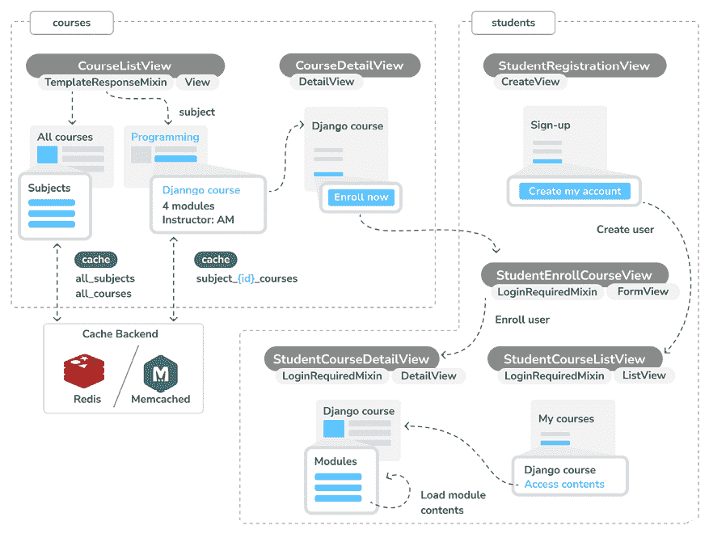

图 14.1：第十四章构建的功能图

在本章中，你将实现`CourseListView`公共视图以列出课程和`CourseDetailView`以显示课程的详细信息。你将实现`StudentRegistrationView`以允许学生创建用户账户，以及`StudentCourseListView`以让学生注册课程。你将为学生创建`StudentCourseListView`以查看他们已注册的课程列表，以及`StudentCourseDetailView`以访问课程的所有内容，这些内容按不同的课程模块组织。你还将使用 Django 缓存框架在你的视图中添加缓存，首先使用 Memcached 后端，然后替换为 Redis 缓存后端。

本章的源代码可在[`github.com/PacktPublishing/Django-5-by-example/tree/main/Chapter14`](https://github.com/PacktPublishing/Django-5-by-example/tree/main/Chapter14)找到。

本章中使用的所有 Python 模块都包含在本章源代码附带的`requirements.txt`文件中。你可以按照以下说明安装每个 Python 模块，或者你可以使用`python -m pip install -r requirements.txt`命令一次性安装所有依赖。

# 显示课程目录

你可能急于进行渲染和缓存，但在进行这些操作之前，我们还有一些事情需要设置。让我们从课程目录开始。对于你的课程目录，你必须构建以下功能：

+   列出所有可用的课程，可选地按主题过滤。

+   显示单个课程概要

这将允许学生看到平台上所有可用的课程，并报名参加他们感兴趣的。编辑`courses`应用的`views.py`文件，并添加以下代码：

```py
from django.db.models import Count
from .models import Subject
class CourseListView(TemplateResponseMixin, View):
    model = Course
    template_name = 'courses/course/list.html'
def get(self, request, subject=None):
        subjects = Subject.objects.annotate(
            total_courses=Count('courses')
        )
        courses = Course.objects.annotate(
            total_modules=Count('modules')
        )
        if subject:
            subject = get_object_or_404(Subject, slug=subject)
            courses = courses.filter(subject=subject)
        return self.render_to_response(
            {
                'subjects': subjects,
                'subject': subject,
                'courses': courses
            }
        ) 
```

这是`CourseListView`视图。它继承自`TemplateResponseMixin`和`View`。在这个视图中，执行以下任务：

1.  使用 ORM 的`annotate()`方法和`Count()`聚合函数检索所有主题，包括每个主题的课程总数。

1.  检索所有可用的课程，包括每个课程包含的模块总数。

1.  如果提供了主题 slug URL 参数，检索相应的`subject`对象，并将查询限制为属于给定主题的课程。

1.  使用`TemplateResponseMixin`提供的`render_to_response()`方法将对象渲染到模板中，并返回一个 HTTP 响应。

让我们创建一个用于显示单个课程概要的详细视图。将以下代码添加到`views.py`文件中：

```py
from django.views.generic.detail import DetailView
class CourseDetailView(DetailView):
    model = Course
    template_name = 'courses/course/detail.html' 
```

这个视图继承自 Django 提供的通用`DetailView`。你指定`model`和`template_name`属性。Django 的`DetailView`期望一个主键(`pk`)或 slug URL 参数来检索给定模型的单个对象。视图渲染在`template_name`中指定的模板，包括模板上下文变量`object`中的`Course`对象。

编辑`educa`项目的主体`urls.py`文件，并向其中添加以下 URL 模式：

```py
**from** **courses.views** **import** **CourseListView**
urlpatterns = [
    # ...
 **path(****''****, CourseListView.as_view(), name=****'course_list'****),**
] 
```

你将`course_list` URL 模式添加到项目的主体`urls.py`文件中，因为你想在 URL `http://127.0.0.1:8000/`上显示课程列表，并且`courses`应用的其它所有 URL 都有`/course/`前缀。

编辑`courses`应用的`urls.py`文件，并添加以下 URL 模式：

```py
path(
    'subject/<slug:subject>/',
    views.CourseListView.as_view(),
    name='course_list_subject'
),
path(
    '<slug:slug>/',
    views.CourseDetailView.as_view(),
    name='course_detail'
), 
```

你定义以下 URL 模式：

+   `course_list_subject`：用于显示某个主题的所有课程

+   `course_detail`：用于显示单个课程概要

让我们为`CourseListView`和`CourseDetailView`视图构建模板。

在`courses`应用的`templates/courses/`目录内创建以下文件结构：

```py
course/
    list.html
    detail.html 
```

编辑`courses/course/list.html`模板，并编写以下代码：

```py


  
    {{ subject.title }} courses
  
    All courses
  


  <h1>
    
      {{ subject.title }} courses
    
      All courses
    
  </h1>
<div class="contents">
<h3>Subjects</h3>
<ul id="modules">
<li class="selected">
<a href="">All</a>
</li>
      
        <li class="selected">
<a href="">
            {{ s.title }}
            <br>
<span>
              {{ s.total_courses }} course{{ s.total_courses|pluralize }}
            </span>
</a>
</li>
      
    </ul>
</div>
<div class="module">
    
      
        <h3>
<a href="">
            {{ course.title }}
          </a>
</h3>
<p>
<a href="">{{ subject }}</a>.
            {{ course.total_modules }} modules.
            Instructor: {{ course.owner.get_full_name }}
        </p>
      
    
  </div>
 
```

确保没有模板标签被拆分成多行。

这是列出可用课程的模板。你创建一个 HTML 列表来显示所有的`Subject`对象，并为每个对象构建一个指向`course_list_subject` URL 的链接。你还包括每个科目的课程总数，并使用`pluralize`模板过滤器在数量不是`1`时给单词**course**添加复数后缀，以显示*0 门课程*、*1 门课程*、*2 门课程*等。如果你选择了科目，你还会添加一个`selected` HTML 类来突出显示当前科目。你遍历每个`Course`对象，显示模块总数和讲师姓名。

运行开发服务器，并在浏览器中打开`http://127.0.0.1:8000/`。你应该看到一个类似于以下页面的页面：

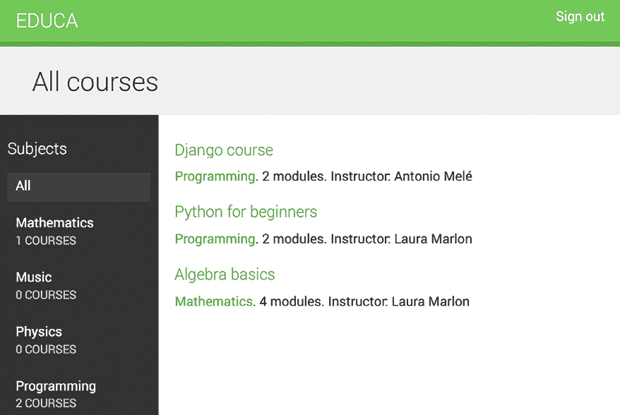

图 14.2：课程列表页面

左侧边栏包含所有科目，包括每个科目的课程总数。你可以点击任何科目来过滤显示的课程。

编辑`courses/course/detail.html`模板，并向其中添加以下代码：

```py


  {{ object.title }}


  
    <h1>
      {{ object.title }}
    </h1>
<div class="module">
<h2>Overview</h2>
<p>
<a href="">
        {{ subject.title }}</a>.
        {{ object.modules.count }} modules.
        Instructor: {{ object.owner.get_full_name }}
      </p>
      {{ object.overview|linebreaks }}
    </div>
  
 
```

此模板显示单个课程的概览和详细信息。在浏览器中打开`http://127.0.0.1:8000/`，并点击其中一个课程。你应该看到一个具有以下结构的页面：

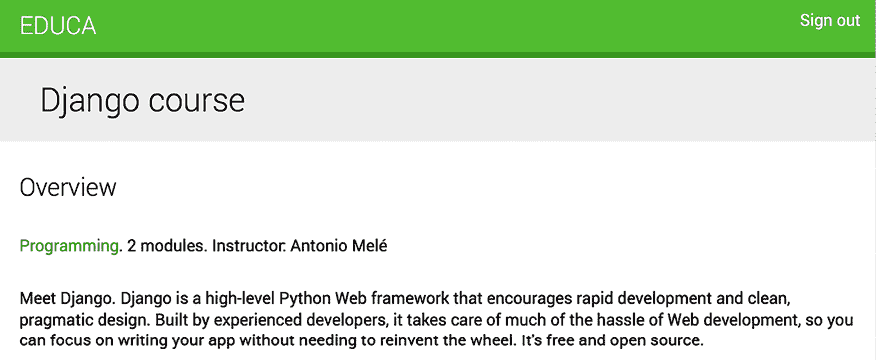

图 14.3：课程概览页面

你已经创建了一个用于显示课程的公共区域。接下来，你需要允许用户注册为学生并选课。

# 添加学生注册

我们需要实现学生注册以允许选课和访问内容。使用以下命令创建一个新的应用程序：

```py
python manage.py startapp students 
```

编辑`educa`项目的`settings.py`文件，并将新应用程序添加到`INSTALLED_APPS`设置中，如下所示：

```py
INSTALLED_APPS = [
    # ...
**'students.apps.StudentsConfig'****,**
] 
```

## 创建学生注册视图

编辑`students`应用程序的`views.py`文件，并写入以下代码：

```py
from django.contrib.auth import authenticate, login
from django.contrib.auth.forms import UserCreationForm
from django.urls import reverse_lazy
from django.views.generic.edit import CreateView
class StudentRegistrationView(CreateView):
    template_name = 'students/student/registration.html'
    form_class = UserCreationForm
    success_url = reverse_lazy('student_course_list')
    def form_valid(self, form):
        result = super().form_valid(form)
        cd = form.cleaned_data
        user = authenticate(
            username=cd['username'], password=cd['password1']
        )
        login(self.request, user)
        return result 
```

这是允许学生在你的网站上注册的视图。你使用通用的`CreateView`，它提供了创建模型对象的功能。此视图需要以下属性：

+   `template_name`：渲染此视图的模板路径。

+   `form_class`：用于创建对象的表单，必须是`ModelForm`。你使用 Django 的`UserCreationForm`作为注册表单来创建`User`对象。

+   `success_url`：当表单成功提交时，将用户重定向到的 URL。为此，你需要反转名为`student_course_list`的 URL，我们将在*访问课程内容*部分创建它，用于列出学生已注册的课程。

当有效的表单数据被提交时，会执行`form_valid()`方法。它必须返回一个 HTTP 响应。你需要覆盖这个方法，在用户成功注册后登录用户。

在`students`应用目录内创建一个新文件，命名为`urls.py`。将以下代码添加到该文件中：

```py
from django.urls import path
from . import views
urlpatterns = [
    path(
        'register/',
        views.StudentRegistrationView.as_view(),
        name='student_registration'
    ),
] 
```

然后，编辑`educa`项目的主体`urls.py`文件，并通过添加以下模式到你的 URL 配置中，包含`students`应用的 URL：

```py
urlpatterns = [
    # ...
 **path(****'students/'****, include(****'students.urls'****)),**
] 
```

在`students`应用目录内创建以下文件结构：

```py
templates/
    students/
        student/
            registration.html 
```

编辑`students/student/registration.html`模板，并向其中添加以下代码：

```py


  Sign up


  <h1>
    Sign up
  </h1>
<div class="module">
<p>Enter your details to create an account:</p>
<form method="post">
      {{ form.as_p }}
      
      <p><input type="submit" value="Create my account"></p>
</form>
</div>
 
```

运行开发服务器并在浏览器中打开`http://127.0.0.1:8000/students/register/`。你应该看到一个类似于以下注册表单的界面：

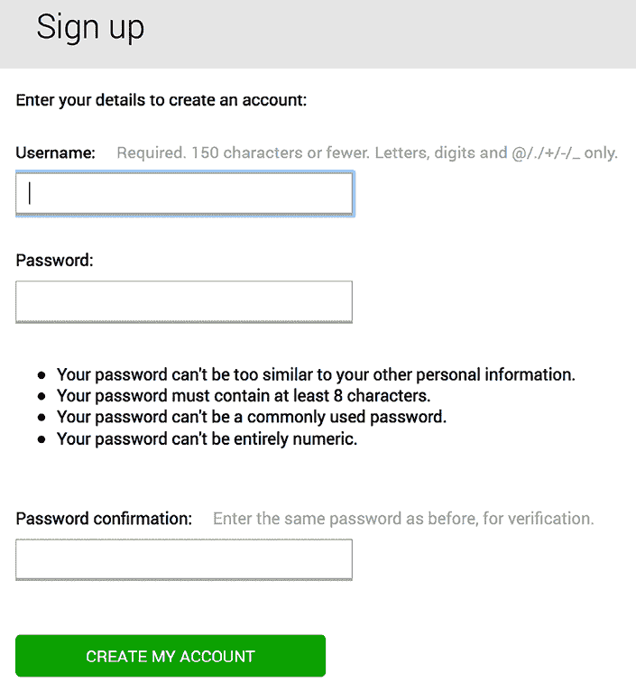

图 14.4：学生注册表单

注意，在`StudentRegistrationView`视图的`success_url`属性中指定的`student_course_list` URL 尚不存在。如果你提交表单，Django 将找不到在成功注册后重定向你的 URL。如前所述，你将在*访问课程内容*部分创建此 URL。

## 报名参加课程

用户创建账户后，应该能够报名参加课程。为了存储报名信息，您需要在`Course`和`User`模型之间创建一个多对多关系。

编辑`courses`应用的`models.py`文件，并将以下字段添加到`Course`模型中：

```py
students = models.ManyToManyField(
    User,
    related_name='courses_joined',
    blank=True
) 
```

从 shell 中执行以下命令以创建此更改的迁移：

```py
python manage.py makemigrations 
```

你将看到类似于以下的输出：

```py
Migrations for 'courses':
  courses/migrations/0004_course_students.py
    - Add field students to course 
```

然后，执行以下命令以应用挂起的迁移：

```py
python manage.py migrate 
```

你应该看到一些输出，以以下行结束：

```py
Applying courses.0004_course_students... OK 
```

现在，你可以将学生与他们报名的课程关联起来。让我们创建学生报名课程的函数。

在`students`应用目录内创建一个新文件，命名为`forms.py`。将以下代码添加到该文件中：

```py
from django import forms
from courses.models import Course
class CourseEnrollForm(forms.Form):
    course = forms.ModelChoiceField(
        queryset=Course.objects.none(),
        widget=forms.HiddenInput
    )
    def __init__ (self, form):
        super(CourseEnrollForm, self).__init__(*args, **kwargs)
        self.fields['course'].queryset = Course.objects.all() 
```

此表单将用于将学生报名到课程。`course`字段是用户将要报名的课程；因此，它是`ModelChoiceField`。你使用`HiddenInput`小部件，因为这个字段不打算对用户可见。最初，你将查询集定义为`Course.objects.none()`。使用`none()`创建一个空的查询集，它不会返回任何对象，并且重要的是，它不会查询数据库。这避免了在表单初始化期间不必要的数据库负载。你将在表单的`__init__()`方法中填充实际的查询集。这种动态设置允许你根据不同的情况调整表单，例如根据特定标准过滤可用的课程。总体而言，这种方法为你提供了更大的灵活性来管理表单数据，确保数据是根据表单使用的上下文来获取的。这种方法也与 Django 处理表单查询集的最佳实践相一致。

您将在 `CourseDetailView` 视图中使用此表单来显示一个报名按钮。编辑 `students` 应用程序的 `views.py` 文件，并添加以下代码：

```py
from django.contrib.auth.mixins import LoginRequiredMixin
from django.views.generic.edit import FormView
from .forms import CourseEnrollForm
class StudentEnrollCourseView(LoginRequiredMixin, FormView):
    course = None
    form_class = CourseEnrollForm
    def form_valid(self, form):
        self.course = form.cleaned_data['course']
        self.course.students.add(self.request.user)
        return super().form_valid(form)
    def get_success_url(self):
        return reverse_lazy(
            'student_course_detail', args=[self.course.id]
        ) 
```

这是 `StudentEnrollCourseView` 视图。它处理学生的课程报名。视图从 `LoginRequiredMixin` 混合继承，因此只有登录用户可以访问该视图。它还从 Django 的 `FormView` 视图继承，因为它处理表单提交。您使用 `CourseEnrollForm` 表单作为 `form_class` 属性，并为存储提供的 `Course` 对象定义一个 `course` 属性。当表单有效时，当前用户将被添加到该课程的已报名学生中。

`get_success_url()` 方法返回用户在表单成功提交后将被重定向到的 URL。此方法等同于 `success_url` 属性。然后，你反转名为 `student_course_detail` 的 URL。

编辑 `students` 应用程序的 `urls.py` 文件，并向其中添加以下 URL 模式：

```py
path(
    'enroll-course/',
    views.StudentEnrollCourseView.as_view(),
    name='student_enroll_course'
), 
```

让我们在课程概览页面上添加报名按钮表单。编辑 `courses` 应用程序的 `views.py` 文件，并修改 `CourseDetailView` 以使其看起来如下：

```py
**from** **students.forms** **import** **CourseEnrollForm**
class CourseDetailView(DetailView):
    model = Course
    template_name = 'courses/course/detail.html'
**def****get_context_data****(****self, **kwargs****):**
 **context =** **super****().get_context_data(**kwargs)**
 **context[****'enroll_form'****] = CourseEnrollForm(**
 **initial={****'course'****:self.****object****}**
 **)**
**return** **context** 
```

您使用 `get_context_data()` 方法将报名表单包含在渲染模板的上下文中。您初始化表单的隐藏 `course` 字段，使其使用当前的 `Course` 对象，以便可以直接提交。

编辑 `courses/course/detail.html` 模板，并找到以下行：

```py
{{ object.overview|linebreaks }} 
```

将其替换为以下代码：

```py
{{ object.overview|linebreaks }}
****
 **<form action=****""** **method=****"post"****>**
 **{{ enroll_form }}**
 ****
 **<****input****type****=****"submit"** **value=****"Enroll now"****>**
 **</form>**
****
 **<a href=****""****class****=****"button"****>**
 **Register to enroll**
 **</a>**
**** 
```

这是报名课程的按钮。如果用户已认证，将显示报名按钮，包括指向 `student_enroll_course` URL 的隐藏表单。如果用户未认证，将显示一个注册平台的链接。

确保开发服务器正在运行，在您的浏览器中打开 `http://127.0.0.1:8000/`，并点击一个课程。如果您已登录，您应该在课程概览下方看到一个 **立即报名** 按钮如下所示：

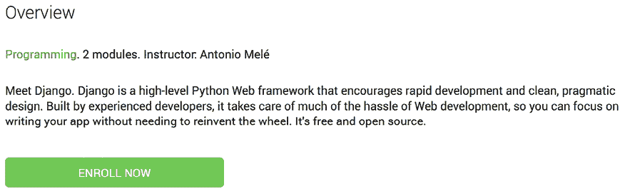

图 14.5：课程概览页面，包括一个 **立即报名** 按钮

如果您未登录，您将看到一个 **注册报名** 按钮。

# 渲染课程内容

一旦学生报名参加了课程，他们需要一个中心位置来访问他们已报名的所有课程。我们需要编译学生已报名的课程列表，并提供访问每个课程内容的方式。然后，我们需要实现一个系统来渲染各种类型的内容，如文本、图片、视频和文档，这些内容构成了课程模块。让我们构建必要的视图和模板，以便用户访问课程内容。

## 访问课程内容

你需要一个用于显示学生所选修的课程视图和一个用于访问实际课程内容的视图。编辑`students`应用的`views.py`文件，并向其中添加以下代码：

```py
from django.views.generic.list import ListView
from courses.models import Course
class StudentCourseListView(LoginRequiredMixin, ListView):
    model = Course
    template_name = 'students/course/list.html'
def get_queryset(self):
        qs = super().get_queryset()
        return qs.filter(students__in=[self.request.user]) 
```

这是一个用于查看学生所选修课程的视图。它继承自`LoginRequiredMixin`以确保只有登录用户才能访问该视图。它还继承自通用`ListView`以显示`Course`对象的列表。你重写了`get_queryset()`方法以检索学生所选修的课程；通过过滤学生`ManyToManyField`字段来实现这一点。

然后，将以下代码添加到`students`应用的`views.py`文件中：

```py
from django.views.generic.detail import DetailView
class StudentCourseDetailView(LoginRequiredMixin, DetailView):
    model = Course
    template_name = 'students/course/detail.html'
def get_queryset(self):
        qs = super().get_queryset()
        return qs.filter(students__in=[self.request.user])
    def get_context_data(self, **kwargs):
        context = super().get_context_data(**kwargs)
        # get course object
        course = self.get_object()
        if 'module_id' in self.kwargs:
            # get current module
            context['module'] = course.modules.get(
                id=self.kwargs['module_id']
            )
        else:
            # get first module
            context['module'] = course.modules.all()[0]
        return context 
```

这是`StudentCourseDetailView`视图。你重写了`get_queryset()`方法以限制基本查询集只包含学生所选修的课程。你还重写了`get_context_data()`方法，如果提供了`module_id` URL 参数，则在上下文中设置一个课程模块。否则，你设置课程的第一模块。这样，已注册的学生将能够在课程内导航模块。

编辑`students`应用的`urls.py`文件，并向其中添加以下 URL 模式：

```py
path(
    'courses/',
    views.StudentCourseListView.as_view(),
    name='student_course_list'
),
path(
    'course/<pk>/',
    views.StudentCourseDetailView.as_view(),
    name='student_course_detail'
),
path(
    'course/<pk>/<module_id>/',
    views.StudentCourseDetailView.as_view(),
    name='student_course_detail_module'
), 
```

在`students`应用的`templates/students/`目录内创建以下文件结构：

```py
course/
    detail.html
    list.html 
```

编辑`students/course/list.html`模板，并向其中添加以下代码：

```py

My courses

  <h1>My courses</h1>
<div class="module">
    
      <div class="course-info">
<h3>{{ course.title }}</h3>
<p><a href="">
        Access contents</a></p>
</div>
    
      <p>
        You are not enrolled in any courses yet.
        <a href="">Browse courses</a>
        to enroll in a course.
      </p>
    
  </div>
 
```

此模板显示学生所选修的课程。记住，当新学生成功注册到平台时，他们将被重定向到`student_course_list` URL。让我们在学生登录平台时也将他们重定向到这个 URL。

编辑`educa`项目的`settings.py`文件，并向其中添加以下代码：

```py
from django.urls import reverse_lazy
LOGIN_REDIRECT_URL = reverse_lazy('student_course_list') 
```

这是`auth`模块在请求中不存在`next`参数时，在登录成功后重定向学生的设置。登录成功后，学生将被重定向到`student_course_list` URL 以查看他们所选修的课程。

编辑`students/course/detail.html`模板，并向其中添加以下代码：

```py


  {{ object.title }}


  <h1>
    {{ module.title }}
  </h1>
<div class="contents">
<h3>Modules</h3>
<ul id="modules">
      
        <li data-id="{{ m.id }}" class="selected">
<a href="">
<span>
              Module <span class="order">{{ m.order|add:1 }}</span>
</span>
<br>
            {{ m.title }}
          </a>
</li>
      
        <li>No modules yet.</li>
      
    </ul>
</div>
<div class="module">
    
      
        <h2>{{ item.title }}</h2>
        {{ item.render }}
      
    
  </div>
 
```

确保没有模板标签被拆分到多行。这是已注册学生访问课程内容的模板。首先，你构建一个包含所有课程模块并突出当前模块的 HTML 列表。然后，你遍历当前模块的内容，并使用`{{ item.render }}`访问每个内容项以显示它。你将在下一个步骤中将`render()`方法添加到内容模型中。此方法将负责正确渲染内容。

现在，你可以访问`http://127.0.0.1:8000/students/register/`，注册一个新的学生账户，并选修任何课程。

## 渲染不同类型的内容

要显示课程内容，你需要渲染你创建的不同内容类型：*文本*、*图片*、*视频*和*文件*。

编辑`courses`应用程序的`models.py`文件，并将以下`render()`方法添加到`ItemBase`模型中：

```py
**from** **django.template.loader** **import** **render_to_string**
class ItemBase(models.Model):
    # ...
**def****render****(****self****):**
**return** **render_to_string(**
**f'courses/content/****{self._meta.model_name}****.html'****,**
 **{****'item'****: self}**
 **)** 
```

此方法使用`render_to_string()`函数来渲染模板并返回渲染后的内容作为字符串。每种内容都使用以内容模型命名的模板进行渲染。`self._meta.model_name`用于动态生成每个内容模型适当的模板名称。`render()`方法提供了一个渲染不同内容的通用接口。

在`courses`应用程序的`templates/courses/`目录内创建以下文件结构：

```py
content/
    text.html
    file.html
    image.html
    video.html 
```

编辑`courses/content/text.html`模板并写入以下代码：

```py
{{ item.content|linebreaks }} 
```

这是渲染文本内容的模板。`linebreaks`模板过滤器将纯文本中的换行符替换为 HTML 换行符。

编辑`courses/content/file.html`模板并添加以下内容：

```py
<p>
<a href="{{ item.file.url }}" class="button">Download file</a>
</p> 
```

这是渲染文件的模板。它生成一个下载文件的链接。

编辑`courses/content/image.html`模板并写入：

```py
<p>

</p> 
```

这是渲染图像的模板。

你还必须创建一个用于渲染`Video`对象的模板。你将使用`django-embed-video`来嵌入视频内容。`django-embed-video`是一个第三方 Django 应用程序，它允许你通过简单地提供它们的公共 URL，在模板中嵌入来自 YouTube 或 Vimeo 等来源的视频。

使用以下命令安装该包：

```py
python -m pip install django-embed-video==1.4.9 
```

编辑你的项目中的`settings.py`文件，并将应用程序添加到`INSTALLED_APPS`设置中，如下所示：

```py
INSTALLED_APPS = [
    # ...
**'embed_video'****,**
] 
```

你可以在[`django-embed-video.readthedocs.io/en/latest/`](https://django-embed-video.readthedocs.io/en/latest/)找到`django-embed-video`应用程序的文档。

编辑`courses/content/video.html`模板并写入以下代码：

```py

 
```

这是渲染视频的模板。

现在，运行开发服务器，并在浏览器中访问`http://127.0.0.1:8000/course/mine/`。使用属于`Instructors`组的用户访问网站，并向课程添加多个内容。要包含视频内容，只需复制任何 YouTube URL，例如`https://www.youtube.com/watch?v=bgV39DlmZ2U`，并将其包含在表单的`url`字段中。

在课程中添加内容后，打开`http://127.0.0.1:8000/`，点击课程，然后点击**立即报名**按钮。你应该已经报名并重定向到`student_course_detail` URL。*图 14.6*显示了示例课程内容页面：

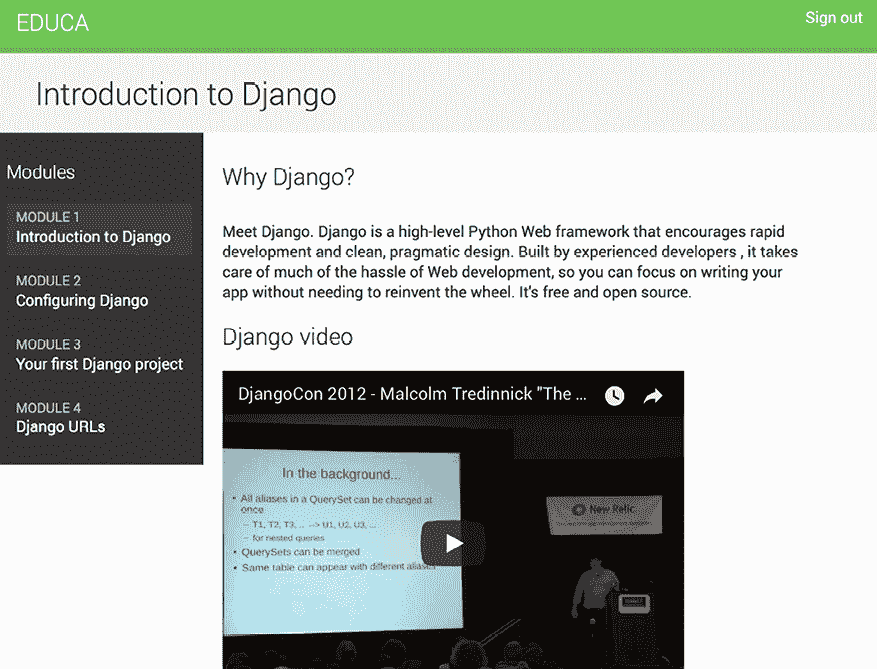

图 14.6：课程内容页面

太棒了！你已经为具有不同类型内容的课程创建了一个通用渲染接口。

# 使用缓存框架

处理对您的 Web 应用的 HTTP 请求通常涉及数据库访问、数据处理和模板渲染。与仅提供静态网站相比，这要昂贵得多。当您的网站开始获得越来越多的流量时，某些请求的开销可能会很大。这就是缓存变得至关重要的地方。通过在 HTTP 请求中缓存查询、计算结果或渲染内容，您将避免在后续需要返回相同数据的请求中进行昂贵的操作。这转化为更短的响应时间和服务器端更少的处理。

Django 包含一个强大的缓存系统，允许您以不同粒度级别缓存数据。您可以缓存单个查询、特定视图的输出、渲染模板内容的一部分，或整个站点。项目默认存储在缓存系统中，但您可以在缓存数据时指定超时时间。

这就是当您的应用程序处理 HTTP 请求时通常如何使用缓存框架：

1.  尝试在缓存中找到所需数据。

1.  如果找到，则返回缓存数据。

1.  如果未找到，请执行以下步骤：

    1.  执行生成数据所需的数据库查询或处理。

    1.  将生成的数据保存到缓存中。

    1.  返回数据。

您可以在[`docs.djangoproject.com/en/5.0/topics/cache/`](https://docs.djangoproject.com/en/5.0/topics/cache/)上阅读有关 Django 缓存系统的详细信息。

## 可用的缓存后端

Django 附带以下缓存后端：

+   `backends.memcached.PyMemcacheCache`或`backends.memcached.PyLibMCCache`：Memcached 后端。Memcached 是一个快速高效的基于内存的缓存服务器。要使用哪个后端取决于您选择的 Memcached Python 绑定。

+   `backends.redis.RedisCache`：Redis 缓存后端。此后端是在 Django 4.0 中添加的。

+   `backends.db.DatabaseCache`：使用数据库作为缓存系统。

+   `backends.filebased.FileBasedCache`：使用文件存储系统。它将每个缓存值序列化并存储为单独的文件。

+   `backends.locmem.LocMemCache`：本地内存缓存后端。这是默认的缓存后端。

+   `backends.dummy.DummyCache`：一个仅用于开发的虚拟缓存后端。它实现了缓存接口，但实际上并不缓存任何内容。此缓存是按进程和线程安全的。

为了获得最佳性能，使用基于内存的缓存后端，如 Memcached 或 Redis，因为访问内存比访问数据库或文件中的数据要快。

# 安装 Memcached

Memcached 是一个流行的、高性能的基于内存的缓存服务器。我们将使用 Memcached 和`PyMemcacheCache` Memcached 后端。

## 安装 Memcached Docker 镜像

从 shell 运行以下命令以拉取 Memcached Docker 镜像：

```py
docker pull memcached:1.6.26 
```

这将下载 Memcached Docker 镜像到您的本地机器。您可以在 [`hub.docker.com/_/memcached`](https://hub.docker.com/_/memcached) 找到有关官方 Memcached Docker 镜像的更多信息。如果您不想使用 Docker，您也可以从 [`memcached.org/downloads`](https://memcached.org/downloads) 下载 Memcached。

使用以下命令运行 Memcached Docker 容器：

```py
docker run -it --rm --name memcached -p 11211:11211 memcached:1.6.26 -m 64 
```

Memcached 默认在端口 `11211` 上运行。`-p` 选项用于将 `11211` 端口发布到同一主机接口端口。`-m` 选项用于将容器的内存限制为 `64` MB。Memcached 在内存中运行，并分配指定数量的 RAM。当分配的 RAM 满时，Memcached 开始删除最旧的数据以存储新数据。如果您想在分离模式下运行命令（在终端的背景中），可以使用 `-d` 选项。

您可以在 [`memcached.org`](https://memcached.org) 找到有关 Memcached 的更多信息。

## 安装 Memcached Python 绑定

安装 Memcached 后，您必须安装一个 Memcached Python 绑定。我们将安装 `pymemcache`，这是一个快速、纯 Python 的 Memcached 客户端。在 shell 中运行以下命令：

```py
python -m pip install pymemcache==4.0.0 
```

您可以在 [`github.com/pinterest/pymemcache`](https://github.com/pinterest/pymemcache) 上阅读有关 `pymemcache` 库的更多信息。

# Django 缓存设置

Django 提供以下缓存设置：

+   `CACHES`: 包含项目中所有可用缓存的字典。

+   `CACHE_MIDDLEWARE_ALIAS`: 用于存储的缓存别名。

+   `CACHE_MIDDLEWARE_KEY_PREFIX`: 缓存键的前缀。如果您在多个站点之间共享相同的缓存，设置前缀以避免键冲突。

+   `CACHE_MIDDLEWARE_SECONDS`: 缓存页面的默认秒数。

可以使用 `CACHES` 设置配置项目的缓存系统。此设置允许您指定多个缓存的配置。`CACHES` 字典中包含的每个缓存都可以指定以下数据：

+   `BACKEND`: 要使用的缓存后端。

+   `KEY_FUNCTION`: 包含一个点分隔路径的字符串，指向一个可调用的函数，该函数接受前缀、版本和键作为参数，并返回最终的缓存键。

+   `KEY_PREFIX`: 所有缓存键的字符串前缀，以避免冲突。

+   `LOCATION`: 缓存的位置。根据缓存后端，这可能是一个目录、一个主机和端口，或者内存后端的一个名称。

+   `OPTIONS`: 传递给缓存后端的任何附加参数。

+   `TIMEOUT`: 存储缓存键的默认超时时间，以秒为单位。默认为 300 秒，即 5 分钟。如果设置为 `None`，则缓存键不会过期。

+   `VERSION`: 缓存键的默认版本号。对于缓存版本控制很有用。

您可以在 [`docs.djangoproject.com/en/5.0/ref/settings/#caches`](https://docs.djangoproject.com/en/5.0/ref/settings/#caches) 找到有关 `CACHES` 设置的更多信息。

## 将 Memcached 添加到您的项目中

让我们为您的项目配置缓存。编辑`educa`项目的`settings.py`文件，并向其中添加以下代码：

```py
CACHES = {
    'default': {
        'BACKEND': 'django.core.cache.backends.memcached.PyMemcacheCache',
        'LOCATION': '127.0.0.1:11211',
    }
} 
```

您正在使用`PyMemcacheCache`后端。您使用`address:port`表示法指定其位置。如果您有多个 Memcached 实例，您可以使用列表来指定`LOCATION`。

您已为项目设置了 Memcached。让我们开始缓存数据！

# 缓存级别

Django 提供了以下级别的缓存，按粒度升序排列：

+   **低级缓存 API**：提供最高粒度。允许您缓存特定的查询或计算。

+   **模板缓存**：允许您缓存模板片段。

+   **视图级缓存**：为单个视图提供缓存。

+   **站点级缓存**：最高级别的缓存。它缓存了您的整个站点。

在实施缓存之前，先考虑您的缓存策略。首先关注那些不是按用户计算的昂贵查询或计算。

在接下来的章节中，我们将探讨如何在我们的项目中使用这些缓存级别。

让我们从学习如何在 Python 代码中使用低级缓存 API 开始。

## 使用低级缓存 API

低级缓存 API 允许您以任何粒度将对象存储在缓存中。它位于`django.core.cache`。您可以像这样导入它：

```py
from django.core.cache import cache 
```

这使用的是默认缓存。它与`caches['default']`等价。通过其别名也可以访问特定的缓存：

```py
from django.core.cache import caches
my_cache = caches['alias'] 
```

让我们看看缓存 API 是如何工作的。使用以下命令打开 Django shell：

```py
python manage.py shell 
```

执行以下代码：

```py
>>> from django.core.cache import cache
>>> cache.set('musician', 'Django Reinhardt', 20) 
```

您访问默认缓存后端，并使用`set(key, value, timeout)`将名为`'musician'`的键存储一个值为字符串`'Django Reinhardt'`的值，持续 20 秒。如果您没有指定超时，Django 将使用在`CACHES`设置中指定的缓存后端的默认超时。现在，执行以下代码：

```py
>>> cache.get('musician')
'Django Reinhardt' 
```

您从缓存中检索键。等待 20 秒后，执行相同的代码：

```py
>>> cache.get('musician') 
```

这次没有返回值。`'musician'`缓存键已过期，`get()`方法返回`None`，因为该键不再在缓存中。

总是避免在缓存键中存储`None`值，因为您将无法区分实际值和缓存未命中。

让我们使用以下代码缓存一个查询集：

```py
>>> from courses.models import Subject
>>> subjects = Subject.objects.all()
>>> cache.set('my_subjects', subjects) 
```

您对`Subject`模型执行查询集，并将返回的对象存储在`'my_subjects'`键中。让我们检索缓存的数据：

```py
>>> cache.get('my_subjects')
<QuerySet [<Subject: Mathematics>, <Subject: Music>, <Subject: Physics>, <Subject: Programming>]> 
```

您将在视图中缓存一些查询。编辑`courses`应用的`views.py`文件，并添加以下导入：

```py
from django.core.cache import cache 
```

在`CourseListView`的`get()`方法中找到以下行：

```py
subjects = Subject.objects.annotate(
    total_courses=Count('courses')
) 
```

将以下行替换为以下内容：

```py
**subjects = cache.get(****'****all_subjects'****)**
**if****not** **subjects:**
    subjects = Subject.objects.annotate(
        total_courses=Count('courses')
    )
 **cache.****set****(****'all_subjects'****, subjects)** 
```

在此代码中，你尝试使用`cache.get()`从缓存中获取`all_subjects`键。如果给定的键未找到，则返回`None`。如果没有找到键（尚未缓存或已缓存但已超时），则执行查询以检索所有`Subject`对象及其课程数量，并使用`cache.set()`将结果缓存。

## 使用 Django Debug Toolbar 检查缓存请求

让我们添加 Django Debug Toolbar 到项目中以检查缓存查询。你已经在*第七章*，*跟踪用户行为*中学习了如何使用 Django Debug Toolbar。

首先，使用以下命令安装 Django Debug Toolbar：

```py
python -m pip install django-debug-toolbar==4.3.0 
```

编辑你项目的`settings.py`文件，并将`debug_toolbar`添加到`INSTALLED_APPS`设置中，如下所示。新行以粗体突出显示：

```py
INSTALLED_APPS = [
    # ...
**'debug_toolbar'****,**
] 
```

在同一文件中，将以下以粗体突出显示的行添加到`MIDDLEWARE`设置中：

```py
MIDDLEWARE = [
**'debug_toolbar.middleware.DebugToolbarMiddleware'****,**
'django.middleware.security.SecurityMiddleware',
    'django.contrib.sessions.middleware.SessionMiddleware',
    'django.middleware.common.CommonMiddleware',
    'django.middleware.csrf.CsrfViewMiddleware',
    'django.contrib.auth.middleware.AuthenticationMiddleware',
    'django.contrib.messages.middleware.MessageMiddleware',
    'django.middleware.clickjacking.XFrameOptionsMiddleware',
] 
```

记住，`DebugToolbarMiddleware`必须放在任何其他中间件之前，除了那些编码响应内容的中间件，例如`GZipMiddleware`，如果存在，则应该放在最前面。

在`settings.py`文件的末尾添加以下行：

```py
INTERNAL_IPS = [
    '127.0.0.1',
] 
```

Django Debug Toolbar 只有在你的 IP 地址与`INTERNAL_IPS`设置中的条目匹配时才会显示。

编辑项目的主体`urls.py`文件，并将以下 URL 模式添加到`urlpatterns`中：

```py
path('__debug__/', include('debug_toolbar.urls')), 
```

运行开发服务器，并在浏览器中打开`http://127.0.0.1:8000/`。

你现在应该在页面的右侧看到 Django Debug Toolbar。点击侧边栏菜单中的**Cache**。你会看到以下面板：

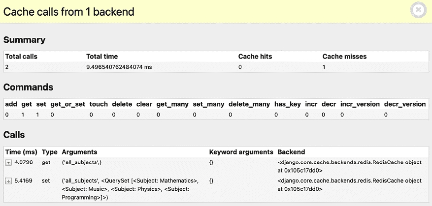

图 14.7：Django Debug Toolbar 的缓存面板，包括在缓存未命中时对`CourseListView`的缓存请求

在**总调用次数**下，你应该看到**2**。第一次执行`CourseListView`视图时，有两个缓存请求。在**命令**下，你会看到`get`命令执行了一次，同样`set`命令也执行了一次。`get`命令对应于检索`all_subjects`缓存键的调用。这是在**调用**下显示的第一个调用。第一次执行视图时，由于还没有缓存数据，因此发生缓存未命中。这就是为什么在**缓存未命中**下有**1**的原因。然后，使用`set`命令将`subjects` QuerySet 的结果存储在缓存中，使用`all_subjects`缓存键。这是在**调用**下显示的第二个调用。

在 Django Debug Toolbar 的**SQL**菜单项中，你会看到在此请求中执行的 SQL 查询总数。这包括检索所有主题并随后存储在缓存中的查询：

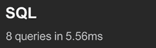

图 14.8：在缓存未命中时对`CourseListView`执行的 SQL 查询

在浏览器中重新加载页面，并点击侧边栏菜单中的**Cache**：

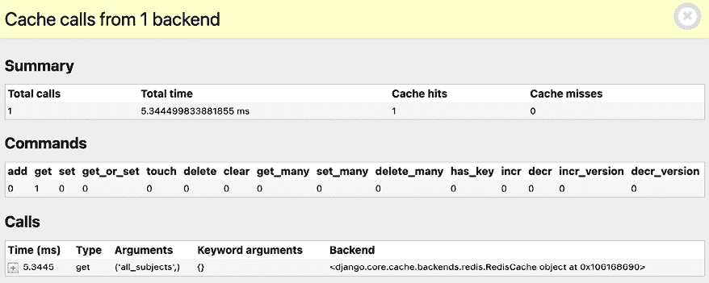

图 14.9：Django Debug Toolbar 的缓存面板，包括对`CourseListView`视图的缓存请求（缓存命中）

现在，只有一个缓存请求。在**总调用次数**下，你应该看到**1**，在**命令**下，你可以看到缓存请求对应于一个`get`命令。在这种情况下，由于数据已在缓存中找到，因此这是一个缓存命中（见**缓存命中**）而不是缓存未命中。在**调用**下，你可以看到检索`all_subjects`缓存键的`get`请求。

检查调试工具栏的**SQL**菜单项。你应该看到这个请求中有一个 SQL 查询更少。你节省了一个 SQL 查询，因为视图在缓存中找到了数据，不需要从数据库中检索它：

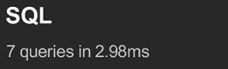

图 14.10：在缓存命中时为 CourseListView 执行的 SQL 查询

在这个例子中，对于单个请求，从缓存中检索项目所需的时间比额外 SQL 查询节省的时间要多。然而，当你有大量用户访问你的网站时，你会发现通过从缓存中检索数据而不是直接访问数据库，可以实现显著的时间节省，并且你将能够为更多并发用户提供服务。

对同一 URL 的连续请求将从缓存中检索数据。由于我们在`CourseListView`视图中使用`cache.set('all_subjects', subjects)`缓存数据时没有指定超时，将使用默认超时（默认为 300 秒，即 5 分钟）。当超时到达时，下一个请求到 URL 将生成缓存未命中，查询集将被执行，数据将被缓存另外 5 分钟。你可以在`CACHES`设置的`TIMEOUT`元素中定义不同的默认超时。

## 基于动态数据的低级缓存

通常，你将想要缓存基于动态数据的内容。在这些情况下，你必须构建包含所有必要信息以唯一标识缓存数据的动态键。

编辑`courses`应用的`views.py`文件，并修改`CourseListView`视图，使其看起来像这样：

```py
class CourseListView(TemplateResponseMixin, View):
    model = Course
    template_name = 'courses/course/list.html'
def get(self, request, subject=None):
        subjects = cache.get('all_subjects')
        if not subjects:
            subjects = Subject.objects.annotate(
                total_courses=Count('courses')
            )
            cache.set('all_subjects', subjects)
        **all_courses** = Course.objects.annotate(
            total_modules=Count('modules')
        )
        if subject:
            subject = get_object_or_404(Subject, slug=subject)
 **key =** **f'subject_****{subject.****id****}****_courses'**
 **courses = cache.get(key)**
**if****not** **courses:**
 **courses = all_courses.****filter****(subject=subject)**
 **cache.****set****(key, courses)**
**else****:**
 **courses = cache.get(****'all_courses'****)**
**if****not** **courses:**
 **courses = all_courses**
 **cache.****set****(****'all_courses'****, courses)**
return self.render_to_response(
            {
                'subjects': subjects,
                'subject': subject,
                'courses': courses
            }
        ) 
```

在这种情况下，你也缓存了所有课程和按主题筛选的课程。如果没有给出主题，你使用`all_courses`缓存键来存储所有课程。如果有主题，你使用`f'subject_{subject.id}_courses'`动态构建键。

重要的是要注意，你不能使用缓存的查询集来构建其他查询集，因为你所缓存的是查询集的结果。所以你不能这样做：

```py
courses = cache.get('all_courses')
courses.filter(subject=subject) 
```

相反，你必须创建基础查询集 `Course.objects.annotate(total_modules=Count('modules'))`，这个查询集在强制执行之前不会执行，并且使用它通过 `all_courses.filter(subject=subject)` 进一步限制查询集，以处理数据未在缓存中找到的情况。

## 缓存模板片段

缓存模板片段是一种高级方法。您需要在模板中使用 `` 加载缓存模板标签。然后，您将能够使用 `` 模板标签来缓存特定的模板片段。您通常按如下方式使用模板标签：

```py

    ...
 
```

`` 模板标签有两个必需的参数：以秒为单位的超时时间和片段的名称。如果您需要根据动态数据缓存内容，可以通过将额外的参数传递给 `` 模板标签来唯一地标识片段。

编辑 `students` 应用的 `/students/course/detail.html` 文件。在 `` 标签之后添加以下代码：

```py
 
```

然后，找到以下行：

```py

  
    <h2>{{ item.title }}</h2>
    {{ item.render }}
  
 
```

将它们替换为以下内容：

```py
****
  
    
      <h2>{{ item.title }}</h2>
      {{ item.render }}
    
  
**** 
```

您使用名称 `module_contents` 缓存此模板片段，并将当前的 `Module` 对象传递给它。这样，您可以唯一地标识片段。这很重要，以避免缓存模块的内容，并在请求不同模块时提供错误的内容。

如果 `USE_I18N` 设置为 `True`，则按站点中间件缓存将尊重活动语言。如果您使用 `` 模板标签，您必须使用模板中可用的翻译特定变量之一来实现相同的结果，例如 ``。

## 缓存视图

您可以使用位于 `django.views.decorators.cache` 的 `cache_page` 装饰器来缓存单个视图的输出。该装饰器需要一个 `timeout` 参数（以秒为单位）。

让我们在您的视图中使用它。编辑 `students` 应用的 `urls.py` 文件并添加以下导入：

```py
from django.views.decorators.cache import cache_page 
```

然后，将 `cache_page` 装饰器应用于 `student_course_detail` 和 `student_course_detail_module` URL 模式，如下所示：

```py
path(
    'course/<pk>/',
 **cache_page(****60** ***** **15****)(**views.StudentCourseDetailView.as_view()**)**,
    name='student_course_detail'
),
path(
    'course/<pk>/<module_id>/',
 **cache_page(****60** ***** **15****)(**views.StudentCourseDetailView.as_view()**)**,
    name='student_course_detail_module'
), 
```

现在，`StudentCourseDetailView` 返回的完整内容被缓存了 15 分钟。

按视图缓存使用 URL 来构建缓存键。指向同一视图的多个 URL 将分别缓存。

## 使用按站点缓存

这是最高级别的缓存。它允许您缓存整个站点。要允许按站点缓存，编辑您项目的 `settings.py` 文件并将 `UpdateCacheMiddleware` 和 `FetchFromCacheMiddleware` 类添加到 `MIDDLEWARE` 设置中，如下所示：

```py
MIDDLEWARE = [
    'debug_toolbar.middleware.DebugToolbarMiddleware',
    'django.middleware.security.SecurityMiddleware',
    'django.contrib.sessions.middleware.SessionMiddleware',
**'django.middleware.cache.UpdateCacheMiddleware'****,**
'django.middleware.common.CommonMiddleware',
**'django.middleware.cache.FetchFromCacheMiddleware'****,**
'django.middleware.csrf.CsrfViewMiddleware',
    'django.contrib.auth.middleware.AuthenticationMiddleware',
    'django.contrib.messages.middleware.MessageMiddleware',
    'django.middleware.clickjacking.XFrameOptionsMiddleware',
] 
```

请记住，中间件在请求阶段按给定顺序执行，在响应阶段按相反顺序执行。`UpdateCacheMiddleware` 被放置在 `CommonMiddleware` 之前，因为它在响应时间执行，此时中间件按相反顺序执行。`FetchFromCacheMiddleware` 故意放置在 `CommonMiddleware` 之后，因为它需要访问后者设置的请求数据集。

接下来，将以下设置添加到 `settings.py` 文件中：

```py
CACHE_MIDDLEWARE_ALIAS = 'default'
CACHE_MIDDLEWARE_SECONDS = 60 * 15 # 15 minutes
CACHE_MIDDLEWARE_KEY_PREFIX = 'educa' 
```

在这些设置中，你使用缓存中间件的默认缓存，并将全局缓存超时设置为 `15` 分钟。你还指定了所有缓存键的前缀，以避免在为多个项目使用相同的 Memcached 后端时发生冲突。现在，你的网站将为所有 `GET` 请求缓存和返回缓存内容。

你可以使用 Django Debug Toolbar 访问不同的页面并检查缓存请求。对于许多网站来说，按站点缓存不可行，因为它会影响所有视图，甚至是你可能不想缓存的视图，比如管理视图，你希望数据从数据库返回以反映最新的更改。

在这个项目中，最佳做法是缓存用于向学生显示课程内容的模板或视图，同时对于讲师的内容管理视图不进行任何缓存。

让我们停用按站点缓存。编辑你项目的 `settings.py` 文件，并在 `MIDDLEWARE` 设置中注释掉 `UpdateCacheMiddleware` 和 `FetchFromCacheMiddleware` 类，如下所示：

```py
MIDDLEWARE = [
    'debug_toolbar.middleware.DebugToolbarMiddleware',
    'django.middleware.security.SecurityMiddleware',
    'django.contrib.sessions.middleware.SessionMiddleware',
    **#** 'django.middleware.cache.UpdateCacheMiddleware',
'django.middleware.common.CommonMiddleware',
    **#** 'django.middleware.cache.FetchFromCacheMiddleware',
'django.middleware.csrf.CsrfViewMiddleware',
    'django.contrib.auth.middleware.AuthenticationMiddleware',
    'django.contrib.messages.middleware.MessageMiddleware',
    'django.middleware.clickjacking.XFrameOptionsMiddleware',
] 
```

你已经看到了 Django 提供的不同缓存方法的概述。你应该始终明智地定义你的缓存策略，考虑到昂贵的 QuerySets 或计算，不会频繁更改的数据，以及将被许多用户并发访问的数据。

# 使用 Redis 缓存后端

Django 还提供了 Redis 缓存后端。让我们更改设置，将 Redis 作为项目缓存后端而不是 Memcached。记住，你已经在 *第七章*，*跟踪用户行为* 和 *第十章*，*扩展你的商店* 中使用了 Redis。

使用以下命令在你的环境中安装 `redis-py`：

```py
python -m pip install redis==5.0.4 
```

然后，编辑 `educa` 项目的 `settings.py` 文件并修改 `CACHES` 设置，如下所示：

```py
CACHES = {
    'default': {
        'BACKEND': **'django.core.cache.backends.redis.RedisCache'****,**
'LOCATION': **'redis://127.0.0.1:6379'****,**
    }
} 
```

项目现在将使用 `RedisCache` 缓存后端。位置格式定义为 `redis://[host]:[port]`。你使用 `127.0.0.1` 指向本地主机，`6379` 是 Redis 的默认端口。

你可以在 [`docs.djangoproject.com/en/5.0/topics/cache/#redis`](https://docs.djangoproject.com/en/5.0/topics/cache/#redis) 上阅读更多关于 Redis 缓存后端的信息。

使用以下命令初始化 Redis Docker 容器：

```py
docker run -it --rm --name redis -p 6379:6379 redis:7.2.4 
```

如果你想在后台（分离模式）运行命令，可以使用 `-d` 选项。

运行开发服务器并在浏览器中打开 `http://127.0.0.1:8000/`。检查 Django Debug Toolbar 的 **缓存** 面板中的缓存请求。你现在正在使用 Redis 作为项目缓存后端而不是 Memcached。

## 使用 Django Redisboard 监控 Redis

你可以使用 Django Redisboard 监控你的 Redis 服务器。Django Redisboard 将 Redis 统计数据添加到 Django 管理站点。你可以在 [`github.com/ionelmc/django-redisboard`](https://github.com/ionelmc/django-redisboard) 上找到有关 Django Redisboard 的更多信息。

使用以下命令在你的环境中安装 `django-redisboard`：

```py
python -m pip install django-redisboard==8.4.0 
```

编辑你的项目中的 `settings.py` 文件，并将应用程序添加到 `INSTALLED_APPS` 设置中，如下所示：

```py
INSTALLED_APPS = [
    # ...
**'redisboard'****,**
] 
```

从你的项目目录运行以下命令以运行 Django Redisboard 迁移：

```py
python manage.py migrate redisboard 
```

在浏览器中运行开发服务器并打开 `http://127.0.0.1:8000/admin/redisboard/redisserver/add/` 以添加要监控的 Redis 服务器。对于 **标签**，输入 `redis`，对于 **URL**，输入 `redis://localhost:6379/0`，如 *图 14.11* 所示：

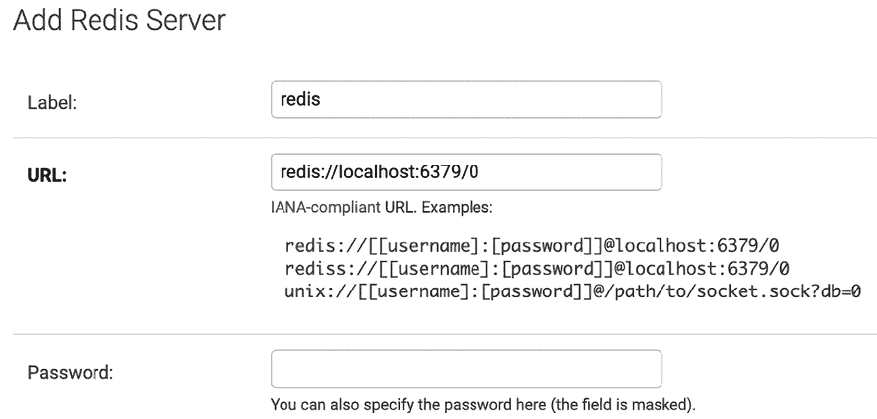

图 14.11：在管理网站上为 Django Redisboard 添加 Redis 服务器的表单

我们将监控运行在本地的 Redis 实例，该实例在端口 `6379` 上运行并使用编号为 `0` 的 Redis 数据库。点击 **保存**。信息将被保存到数据库中，你将能够在 Django 管理网站上看到 Redis 配置和指标：

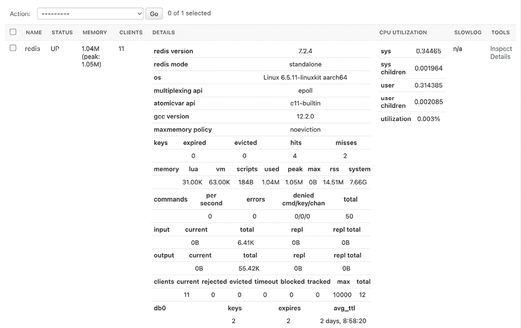

图 14.12：Django Redisboard 在管理网站上的 Redis 监控

恭喜！你已经成功实现了项目的缓存功能。

# 摘要

在本章中，你实现了课程目录的公共视图。你为学生们构建了一个注册和选修课程的系统。你还创建了为课程模块渲染不同类型内容的功能。最后，你学习了如何使用 Django 缓存框架，并在你的项目中使用了 Memcached 和 Redis 缓存后端。

在下一章中，你将使用 Django REST 框架为你的项目构建一个 RESTful API，并使用 Python Requests 库来消费它。

# 其他资源

以下资源提供了与本章所涵盖主题相关的额外信息：

+   本章的源代码：[`github.com/PacktPublishing/Django-5-by-example/tree/main/Chapter14`](https://github.com/PacktPublishing/Django-5-by-example/tree/main/Chapter14 )

+   `django-embed-video` 文档：[`django-embed-video.readthedocs.io/en/latest/`](https://django-embed-video.readthedocs.io/en/latest/)

+   Django 的缓存框架文档：[`docs.djangoproject.com/en/5.0/topics/cache/`](https://docs.djangoproject.com/en/5.0/topics/cache/)

+   Memcached Docker 镜像：[`hub.docker.com/_/memcached`](https://hub.docker.com/_/memcached)

+   Memcached 下载：[`memcached.org/downloads`](https://memcached.org/downloads)

+   Memcached 官方网站：[`memcached.org`](https://memcached.org)

+   Django 的 `CACHES` 设置文档：[`docs.djangoproject.com/en/5.0/ref/settings/#caches`](https://docs.djangoproject.com/en/5.0/ref/settings/#caches).

+   `pymemcache` 的源代码：[`github.com/pinterest/pymemcache`](https://github.com/pinterest/pymemcache)

+   Django Redis 缓存后端：[`docs.djangoproject.com/en/5.0/topics/cache/#redis`](https://docs.djangoproject.com/en/5.0/topics/cache/#redis)

+   官方 Redis Docker 镜像：[`hub.docker.com/_/redis`](https://hub.docker.com/_/redis)

+   Redis 下载选项：[`redis.io/download/`](https://redis.io/download/)

+   Django Redisboard 源代码：[`github.com/ionelmc/django-redisboard`](https://github.com/ionelmc/django-redisboard)
