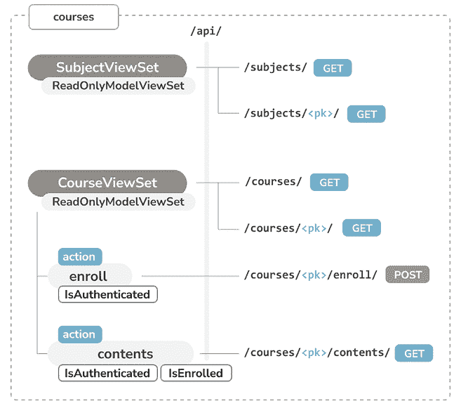
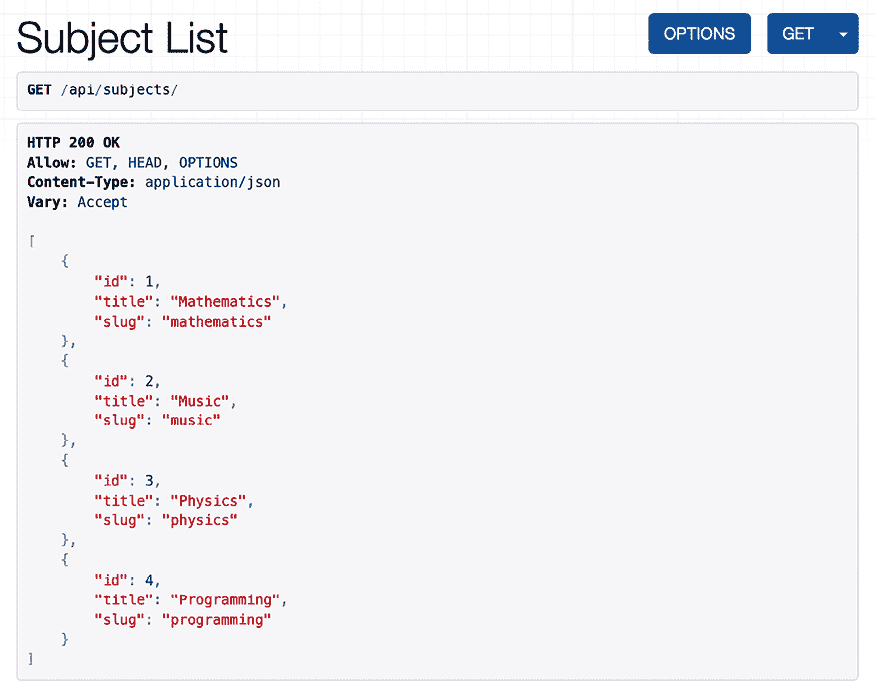
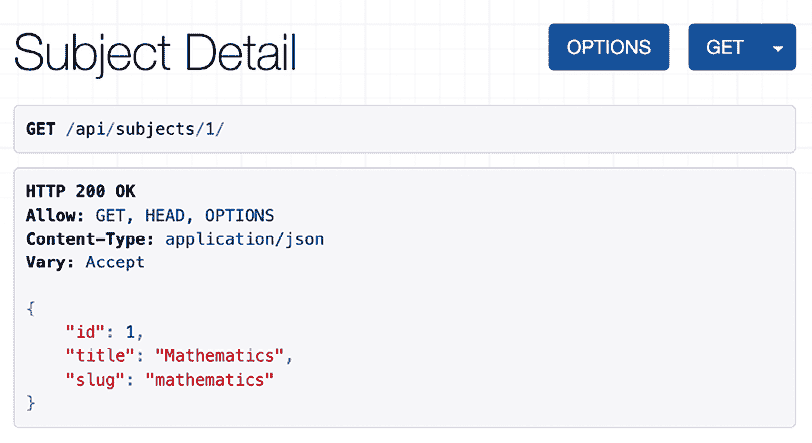
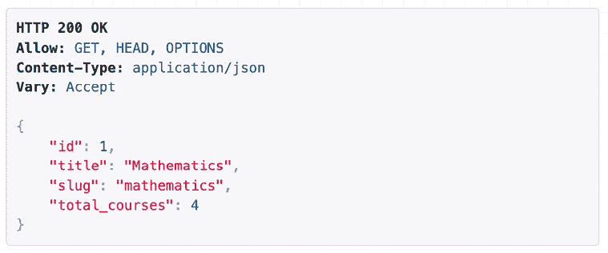
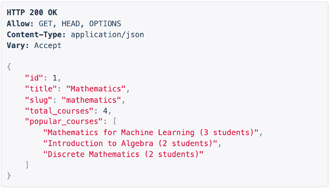
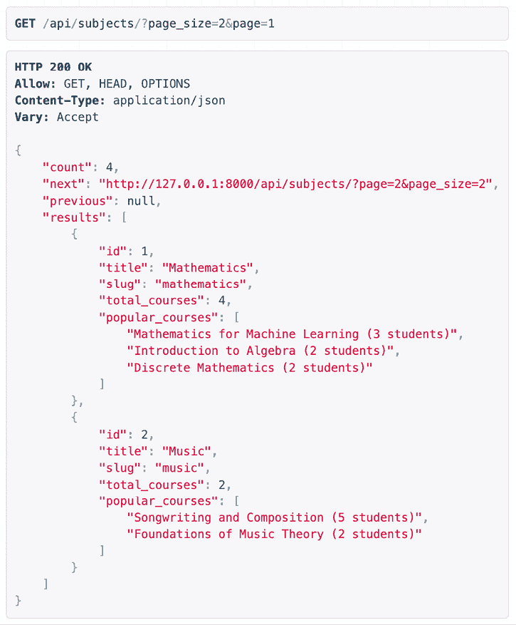
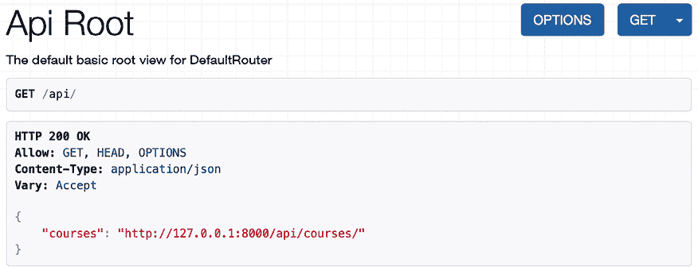

# 第十五章：构建 API

在上一章中，您构建了一个学生课程注册和报名的系统。您创建了用于显示课程内容的视图，并学习了如何使用 Django 的缓存框架。

在本章中，您将为您的在线学习平台创建一个 RESTful API。API 是一种常见的可编程接口，可以在多个平台如网站、移动应用程序、插件等上使用。例如，您可以为您的在线学习平台创建一个 API，使其被移动应用程序消费。如果您向第三方提供 API，他们就能够以编程方式消费信息和操作您的应用程序。API 允许开发者自动化平台上的操作，并将您的服务与其他应用程序或在线服务集成。您将为您的在线学习平台构建一个功能齐全的 API。

在本章中，您将：

+   安装 Django REST 框架

+   为您的模型创建序列化器

+   构建 RESTful API

+   实现序列化方法字段

+   创建嵌套序列化器

+   实现视图集视图和路由器

+   构建 API 视图

+   处理 API 认证

+   将权限添加到 API 视图

+   创建自定义权限

+   使用 Requests 库消费 API

# 功能概述

*图 15.1* 展示了本章将要构建的视图和 API 端点的表示：



图 15.1：第十五章中要构建的 API 视图和端点的示意图

在本章中，您将创建两组不同的 API 视图，`SubjectViewSet` 和 `CourseViewSet`。前者将包括主题的列表和详情视图。后者将包括课程的列表和详情视图。您还将实现 `CourseViewSet` 中的 `enroll` 动作，以便将学生报名到课程中。此动作仅对经过身份验证的用户可用，使用 `IsAuthenticated` 权限。您将在 `CourseViewSet` 中创建 `contents` 动作以访问课程内容。要访问课程内容，用户必须经过身份验证并已报名参加指定的课程。您将实现自定义的 `IsEnrolled` 权限，以限制对内容的访问仅限于已报名课程的用户。

如果您不熟悉 API 端点，您只需知道它们是 API 中接受并响应请求的特定位置。每个端点对应一个可能接受一个或多个 HTTP 方法（如 `GET`、`POST`、`PUT` 或 `DELETE`）的 URL。

本章的源代码可以在 [`github.com/PacktPublishing/Django-5-by-example/tree/main/Chapter15`](https://github.com/PacktPublishing/Django-5-by-example/tree/main/Chapter15) 找到。

本章中使用的所有 Python 模块都包含在本章源代码的 `requirements.txt` 文件中。您可以根据以下说明安装每个 Python 模块，或者您可以使用命令 `python -m pip install -r requirements.txt` 一次性安装所有依赖。

# 构建 RESTful API

在构建 API 时，您有多种方式可以构建其端点和操作，但遵循 REST 原则是被鼓励的。

**REST** 架构来自 **表征状态转移**。RESTful API 是基于资源的；您的模型代表资源，HTTP 方法如 `GET`、`POST`、`PUT` 或 `DELETE` 用于检索、创建、更新或删除对象。HTTP 响应代码也用于此上下文中。不同的 HTTP 响应代码被返回以指示 HTTP 请求的结果，例如，`2XX` 响应代码表示成功，`4XX` 表示错误，等等。

在 RESTful API 中交换数据的常见格式是 JSON 和 XML。您将为您的项目构建一个使用 JSON 序列化的 RESTful API。您的 API 将提供以下功能：

+   获取科目

+   获取可用课程

+   获取课程内容

+   注册课程

您可以使用 Django 通过创建自定义视图从头开始构建 API。然而，有几个第三方模块可以简化为您的项目创建 API；其中最受欢迎的是 **Django REST 框架**（**DRF**）。

DRF 为您的项目构建 RESTful API 提供了一套全面的工具。以下是我们将用于构建我们的 API 的最相关组件之一：

+   **序列化器**：将数据转换为其他程序可以理解的标准格式，或者通过将数据转换为程序可以处理的格式来 *反序列化* 数据。

+   **解析器和渲染器**：在将序列化数据返回为 HTTP 响应之前，适当地渲染（或格式化）数据。同样，解析传入的数据以确保其处于正确的形式。

+   **API 视图**：用于实现应用程序逻辑。

+   **URLs**：用于定义可用的 API 端点。

+   **身份验证和权限**：用于定义 API 的身份验证方法和每个视图所需的权限。

我们将首先安装 DRF，然后我们将学习更多关于这些组件以构建我们的第一个 API。

## 安装 Django REST framework

您可以在 [`www.django-rest-framework.org/`](https://www.django-rest-framework.org/) 找到有关 **DRF** 的所有信息。

打开终端并使用以下命令安装框架：

```py
python -m pip install djangorestframework==3.15.1 
```

编辑 `educa` 项目的 `settings.py` 文件，并将 `rest_framework` 添加到 `INSTALLED_APPS` 设置中，以激活应用程序，如下所示：

```py
INSTALLED_APPS = [
    # ...
**'rest_framework'****,**
] 
```

然后，将以下代码添加到 `settings.py` 文件中：

```py
REST_FRAMEWORK = {
    'DEFAULT_PERMISSION_CLASSES': [
        'rest_framework.permissions.DjangoModelPermissionsOrAnonReadOnly'
    ]
} 
```

您可以使用 `REST_FRAMEWORK` 设置为您的 API 提供特定的配置。DRF 提供了广泛的设置来配置默认行为。`DEFAULT_PERMISSION_CLASSES` 设置指定了读取、创建、更新或删除对象的默认权限。您将 `DjangoModelPermissionsOrAnonReadOnly` 设置为唯一的默认权限类。此类依赖于 Django 的权限系统，允许用户创建、更新或删除对象，同时为匿名用户提供只读访问。您将在 *添加权限到视图* 部分中了解更多关于权限的内容。

要获取 DRF 的完整设置列表，您可以访问 [`www.django-rest-framework.org/api-guide/settings/`](https://www.django-rest-framework.org/api-guide/settings/)。

## 定义序列化器

在设置 DRF 后，您需要指定数据序列化的方式。输出数据必须以特定格式序列化，输入数据在处理之前将进行反序列化。该框架提供了以下类来为单个对象构建序列化器：

+   `Serializer`：为常规 Python 类实例提供序列化

+   `ModelSerializer`：为模型实例提供序列化

+   `HyperlinkedModelSerializer`：与 `ModelSerializer` 相同，但它使用链接而不是主键来表示对象关系

让我们构建我们的第一个序列化器。在 `courses` 应用程序目录内创建以下文件结构：

```py
api/
    __init__.py
    serializers.py 
```

您将在 `api` 目录内构建所有 API 功能，以保持一切井井有条。编辑 `api/serializers.py` 文件并添加以下代码：

```py
from rest_framework import serializers
from courses.models import Subject
class SubjectSerializer(serializers.ModelSerializer):
    class Meta:
        model = Subject
        fields = ['id', 'title', 'slug'] 
```

这是 `Subject` 模型的序列化器。序列化器定义的方式与 Django 的 `Form` 和 `ModelForm` 类类似。`Meta` 类允许您指定要序列化的模型以及要包含在序列化中的字段。如果不设置 `fields` 属性，则所有模型字段都将被包含。

让我们尝试序列化器。打开命令行，使用以下命令启动 Django 命令行：

```py
python manage.py shell 
```

运行以下代码：

```py
>>> from courses.models import Subject
>>> from courses.api.serializers import SubjectSerializer
>>> subject = Subject.objects.latest('id')
>>> serializer = SubjectSerializer(subject)
>>> serializer.data
{'id': 4, 'title': 'Programming', 'slug': 'programming'} 
```

在本例中，您获取一个 `Subject` 对象，创建 `SubjectSerializer` 的实例，并访问序列化数据。您可以看到模型数据被转换为 Python 原生数据类型。

您可以在 [`www.django-rest-framework.org/api-guide/serializers/`](https://www.django-rest-framework.org/api-guide/serializers/) 上了解更多关于序列化器的信息。

## 理解解析器和渲染器

在将序列化数据返回为 HTTP 响应之前，必须以特定格式渲染序列化数据。同样，在接收到 HTTP 请求时，您必须解析传入的数据并在操作之前对其进行反序列化。DRF 包括渲染器和解析器来处理这些操作。

让我们看看如何解析传入的数据。在 Python 命令行中执行以下代码：

```py
>>> from io import BytesIO
>>> from rest_framework.parsers import JSONParser
>>> data = b'{"id":4,"title":"Programming","slug":"programming"}'
>>> JSONParser().parse(BytesIO(data))
{'id': 4, 'title': 'Programming', 'slug': 'programming'} 
```

给定一个 JSON 字符串输入，您可以使用 DRF 提供的 `JSONParser` 类将其转换为 Python 对象。

DRF 还包括允许您格式化 API 响应的`Renderer`类。框架通过检查请求的`Accept`头，确定响应的预期内容类型，通过内容协商来决定使用哪个渲染器。可选地，渲染器也可以由 URL 的格式后缀确定。例如，URL `http://127.0.0.1:8000/api/data.json`可能是一个触发`JSONRenderer`以返回 JSON 响应的端点。

返回到 shell 并执行以下代码以从上一个序列化器示例中渲染`serializer`对象：

```py
>>> from rest_framework.renderers import JSONRenderer
>>> JSONRenderer().render(serializer.data) 
```

您将看到以下输出：

```py
b'{"id":4,"title":"Programming","slug":"programming"}' 
```

您使用`JSONRenderer`将序列化数据渲染成 JSON。默认情况下，DRF 使用两个不同的渲染器：`JSONRenderer`和`BrowsableAPIRenderer`。后者提供了一个网页界面，可以轻松浏览您的 API。您可以使用`REST_FRAMEWORK`设置的`DEFAULT_RENDERER_CLASSES`选项更改默认的渲染器类。

您可以在[`www.django-rest-framework.org/api-guide/renderers/`](https://www.django-rest-framework.org/api-guide/renderers/)和[`www.django-rest-framework.org/api-guide/parsers/`](https://www.django-rest-framework.org/api-guide/parsers/)找到有关渲染器和解析器的更多信息。

接下来，您将学习如何构建 API 视图并使用序列化器在视图中。

## 构建列表和详细视图

DRF 附带了一系列通用的视图和混入，您可以使用它们来构建您的 API 视图。自第二章“增强您的博客和添加社交功能”以来，您一直在使用通用视图，并在第十三章“创建内容管理系统”中学习了混入。

基础视图和混入提供了检索、创建、更新或删除模型对象的功能。您可以在[`www.django-rest-framework.org/api-guide/generic-views/`](https://www.django-rest-framework.org/api-guide/generic-views/)查看 DRF 提供的所有通用混入和视图。

让我们创建列表和详细视图来检索`Subject`对象。在`courses/api/`目录内创建一个新文件，命名为`views.py`。向其中添加以下代码：

```py
from rest_framework import generics
from courses.api.serializers import SubjectSerializer
from courses.models import Subject
class SubjectListView(generics.ListAPIView):
    queryset = Subject.objects.all()
    serializer_class = SubjectSerializer
class SubjectDetailView(generics.RetrieveAPIView):
    queryset = Subject.objects.all()
    serializer_class = SubjectSerializer 
```

在此代码中，您使用了 DRF 的通用`ListAPIView`和`RetrieveAPIView`视图。这两个视图都有以下属性：

+   `queryset`：用于检索对象的基 QuerySet

+   `serializer_class`：用于序列化对象的类

让我们为您的视图添加 URL 模式。在`courses/api/`目录内创建一个新文件，命名为`urls.py`，并使其看起来如下：

```py
from django.urls import path
from . import views
app_name = 'courses'
urlpatterns = [
    path(
        'subjects/',
        views.SubjectListView.as_view(),
        name='subject_list'
    ),
    path(
        'subjects/<pk>/',
        views.SubjectDetailView.as_view(),
        name='subject_detail'
    ),
] 
```

在`SubjectDetailView`视图的 URL 模式中，您包括一个`pk` URL 参数，用于检索具有给定`Subject`模型主键的对象，即`id`字段。编辑`educa`项目的主体`urls.py`文件，并包含 API 模式，如下所示：

```py
urlpatterns = [
    # ...
 **path(****'api/'****, include(****'courses.api.urls'****, namespace=****'api'****)),**
] 
```

您使用`api`命名空间为您的 API URL。我们的初始 API 端点已准备好使用。

# 消费 API

通过通过 URL 提供我们的视图，我们已经创建了我们的第一个 API 端点。现在让我们尝试自己的 API。确保您的服务器正在以下命令下运行：

```py
python manage.py runserver 
```

我们将使用`curl`来消费 API。`curl`是一个命令行工具，允许您在服务器之间传输数据。如果您使用 Linux、macOS 或 Windows 10/11，`curl`很可能已经包含在您的系统中。但是，您可以从[`curl.se/download.html`](https://curl.se/download.html)下载`curl`。

打开 shell，使用`curl`检索 URL `http://127.0.0.1:8000/api/subjects/`，如下所示：

```py
curl http://127.0.0.1:8000/api/subjects/ 
```

您将获得以下类似的响应：

```py
[
    {
        "id":1,
        "title":"Mathematics",
        "slug":"mathematics"
    },
    {
        "id":2,
        "title":"Music",
        "slug":"music"
    },
    {
        "id":3,
        "title":"Physics",
        "slug":"physics"
    },
    {
        "id":4,
        "title":"Programming",
        "slug":"programming"
    }
] 
```

要获得更易读、缩进良好的 JSON 响应，您可以使用带有`json_pp`工具的`curl`，如下所示：

```py
curl http://127.0.0.1:8000/api/subjects/ | json_pp 
```

HTTP 响应包含 JSON 格式的`Subject`对象列表。

除了`curl`之外，您还可以使用任何其他工具发送自定义 HTTP 请求，包括 Postman 浏览器扩展，您可以在[`www.getpostman.com/`](https://www.getpostman.com/)获取。

在您的浏览器中打开`http://127.0.0.1:8000/api/subjects/`。您将看到 DRF 的可浏览 API，如下所示：



图 15.2：REST 框架可浏览 API 中的主题列表页面

这个 HTML 界面是由`BrowsableAPIRenderer`渲染器提供的。它显示结果标题和内容，并允许您执行请求。您还可以通过在 URL 中包含其 ID 来访问`Subject`对象的 API 详情视图。

在您的浏览器中打开`http://127.0.0.1:8000/api/subjects/1/`。您将看到一个单独的主题对象以 JSON 格式呈现。



图 15.3：REST 框架可浏览 API 中的主题详情页面

这是`SubjectDetailView`的响应。让我们学习如何丰富每个主题返回的内容。在下一节中，我们将深入探讨如何通过添加额外的字段和方法来扩展序列化器。

# 扩展序列化器

您已经学习了如何序列化您的模型对象；然而，通常，您可能希望通过添加额外的相关数据或计算字段来丰富响应。让我们看看扩展序列化器的一些选项。

## 向序列化器中添加额外的字段

让我们编辑主题视图，包括每个主题可用的课程数量。您将使用 Django 聚合函数来注释每个主题的相关课程数量。

编辑`courses`应用的`api/views.py`文件，并添加以下加粗显示的代码：

```py
**from** **django.db.models** **import** **Count**
# ...
class SubjectListView(generics.ListAPIView):
    queryset = Subject.objects.**annotate(total_courses=Count(****'courses'****))**
    serializer_class = SubjectSerializer
class SubjectDetailView(generics.RetrieveAPIView):
    queryset = Subject.objects.**annotate(total_courses=Count(****'courses'****))**
    serializer_class = SubjectSerializer 
```

您现在正在使用`SubjectListView`和`SubjectDetailView`的 QuerySet，它使用`Count`聚合函数来注释相关课程的数量。

编辑`courses`应用的`api/serializers.py`文件，并添加以下加粗显示的代码：

```py
from rest_framework import serializers
from courses.models import Subject
class SubjectSerializer(serializers.ModelSerializer):
 **total_courses = seralizers.IntegerField()**
class Meta:
        model = Subject
        fields = ['id', 'title', 'slug'**,** **'total_courses'**] 
```

您已将 `total_courses` 字段添加到 `SubjectSerializer` 类中。该字段是一个 `IntegerField`，用于表示整数。该字段将自动从正在序列化的对象的 `total_courses` 属性获取其值。通过使用 `annotate()`，我们将 `total_courses` 属性添加到 `QuerySet` 的结果对象中。

在浏览器中打开 `http://127.0.0.1:8000/api/subjects/1/`。现在序列化的 JSON 对象包括 `total_courses` 属性，如图 *15.4* 所示：



图 15.4：主题详细页面，包括 total_courses 属性

您已成功将 `total_courses` 属性添加到主题列表和详细视图中。现在，让我们看看如何使用自定义序列化方法添加其他属性。

## 实现序列化方法字段

DRF 提供 `SerializerMethodField`，允许您实现通过调用序列化类的方法来获取值的只读字段。当您想在序列化对象中包含一些自定义格式化的数据或执行不是模型实例直接部分的复杂计算时，这特别有用。

我们将创建一个方法，用于序列化一个主题的前 3 个热门课程。我们将根据注册学生的数量对课程进行排名。编辑 `courses` 应用程序的 `api/serializers.py` 文件，并添加以下加粗代码：

```py
**from** **django.db.models** **import** **Count**
from rest_framework import serializers
from courses.models import Subject
class SubjectSerializer(serializers.ModelSerializer):
    total_courses = serializers.IntegerField()
 **popular_courses = seralizers.SerializerMethodField()**
**def****get_popular_courses****(****self, obj****):**
 **courses = obj.courses.annotate(**
 **total_students=Count(****'students'****)**
 **).order_by(****'****total_students'****)[:****3****]**
**return** **[**
**f'****{c.title}** **(****{c.total_students}****)'****for** **c** **in** **courses**
 **]**
class Meta:
        model = Subject
        fields = [
            'id',
            'title',
            'slug',
            'total_courses'**,**
**'popular_courses'**
        ] 
```

在新代码中，您将新的 `popular_courses` 序列化方法字段添加到 `SubjectSerializer`。该字段从 `get_popular_courses()` 方法获取其值。您可以使用 `method_field` 参数提供要调用的序列化方法名称。如果不包含，则默认为 `get_<field_name>`。

在浏览器中打开 `http://127.0.0.1:8000/api/subjects/1/`。现在序列化的 JSON 对象包括 `total_courses` 属性，如图 *15.5* 所示：



图 15.5：主题详细页面，包括热门课程属性

您已成功实现了一个 `SerializerMethodField`。请注意，现在，为 `SubjectListView` 返回的每个结果都会生成一个额外的 SQL 查询。接下来，您将学习如何通过向 `SubjectListView` 添加分页来控制返回的结果数量。

# 向视图中添加分页

DRF 包含内置的分页功能，用于控制 API 响应中发送的对象数量。当您网站的内容开始增长时，您可能会拥有大量的主题和课程。分页在处理大量数据集时可以特别有用，以改善性能和用户体验。

让我们更新 `SubjectListView` 视图以包括分页。首先，我们将定义一个分页类。

在 `courses/api/` 目录中创建一个新文件，并将其命名为 `pagination.py`。向其中添加以下代码：

```py
from rest_framework.pagination import PageNumberPagination
class StandardPagination(PageNumberPagination):
    page_size = 10
    page_size_query_param = 'page_size'
    max_page_size = 50 
```

在这个类中，我们继承自`PageNumberPagination`。这个类提供了基于页码的分页支持。我们设置了以下属性：

+   `page_size`：确定当请求中没有提供页面大小时，默认页面大小（每页返回的项目数）

+   `page_size_query_params`：定义用于页面大小的查询参数的名称

+   `max_page_size`：指示允许的最大请求页面大小

现在，编辑`courses`应用的`api/views.py`文件，并添加以下加粗的行：

```py
from django.db.models import Count
from rest_framework import generics
from courses.models import Subject
**from** **courses.api.pagination** **import** **StandardPagination**
from courses.api.serializers import SubjectSerializer
class SubjectListView(generics.ListAPIView):
    queryset = Subject.objects.annotate(total_courses=Count('courses'))
    serializer_class = SubjectSerializer
 **pagination_class = StandardPagination**
# ... 
```

您现在可以分页`SubjectListView`返回的对象。在浏览器中打开`http://127.0.0.1:8000/api/subjects/`。您会看到由于分页，视图返回的 JSON 结构现在不同。您将看到以下结构：

```py
{
"count": 4,
"next": null,
"previous": null,
"results": [
{
"id": 1,
"title": "Mathematics",
            ...
        },
        ...
    ]
} 
```

以下项现在包含在返回的 JSON 中：

+   `count`：结果总数。

+   `next`：获取下一页的 URL。当没有下一页时，值为`null`。

+   `previous`：获取上一页的 URL。当没有上一页时，值为`null`。

+   `results`：本页返回的序列化对象列表。

在浏览器中打开`http://127.0.0.1:8000/api/subjects/?page_size=2&page=1`。这将按每页两个项目分页结果并检索第一页的结果，如*图 15.6*所示：



图 15.6：主题列表分页的第一页结果，页面大小为 2

我们已经根据页码实现了分页，但 DRF 还提供了一个类来实现基于 limit/offset 和游标的分页。您可以在[`www.django-rest-framework.org/api-guide/pagination/`](https://www.django-rest-framework.org/api-guide/pagination/)上了解更多关于分页的信息。

您已为主题视图创建了 API 端点。接下来，您将向 API 中添加课程端点。

# 构建课程序列化器

我们将创建`Course`模型的序列化器。编辑`courses`应用的`api/serializers.py`文件，并添加以下加粗的代码：

```py
# ...
from courses.models import **Course,** Subject
**class****CourseSerializer****(serializers.ModelSerializer):**
**class****Meta****:**
 **model = Course**
 **fields = [**
**'id'****,**
**'subject'****,**
**'****title'****,**
**'slug'****,**
**'overview'****,**
**'created'****,**
**'owner'****,**
**'modules'**
 **]** 
```

让我们看看`Course`对象是如何序列化的。打开 shell 并执行以下命令：

```py
python manage.py shell 
```

运行以下代码：

```py
>>> from rest_framework.renderers import JSONRenderer
>>> from courses.models import Course
>>> from courses.api.serializers import CourseSerializer
>>> course = Course.objects.latest('id')
>>> serializer = CourseSerializer(course)
>>> JSONRenderer().render(serializer.data) 
```

您将获得一个包含您在`CourseSerializer`中包含的字段的 JSON 对象。您可以看到，`modules`管理器的相关对象被序列化为一个主键列表，如下所示：

```py
"modules": [6, 7, 9, 10] 
```

这些是相关`Module`对象的 ID。接下来，您将学习不同的方法来序列化相关对象。

## 序列化关系

DRF 提供了不同类型的关联字段来表示模型关系。这适用于`ForeignKey`、`ManyToManyField`和`OneToOneField`关系，以及通用模型关系。

我们将使用`StringRelatedField`来更改相关`Module`对象的序列化方式。`StringRelatedField`使用其`__str__()`方法表示相关对象。

编辑`courses`应用的`api/serializers.py`文件，并添加以下加粗代码：

```py
# ...
class CourseSerializer(serializers.ModelSerializer):
 **modules = serializers.StringRelatedField(many=****True****, read_only=****True****)**
class Meta:
        # ... 
```

在新代码中，你定义了`modules`字段，该字段为相关的`Module`对象提供序列化。你使用`many=True`来表示你正在序列化多个相关对象。`read_only`参数表示该字段为只读，不应包含在任何创建或更新对象的输入中。

打开 shell 并再次创建`CourseSerializer`的实例。使用`JSONRenderer`渲染序列化器的`data`属性。这次，列出的模块使用它们的`__str__()`方法进行序列化，如下所示：

```py
"modules": ["0\. Installing Django", "1\. Configuring Django"] 
```

注意，DRF 不优化查询集。当序列化课程列表时，将为每个课程结果生成一个 SQL 查询来检索相关的`Module`对象。你可以通过在查询集中使用`prefetch_related()`来减少额外的 SQL 请求的数量，例如`Course.objects.prefetch_related('modules')`。我们将在*创建视图集和路由器*部分中稍后介绍这一点。

你可以在[`www.django-rest-framework.org/api-guide/relations/`](https://www.django-rest-framework.org/api-guide/relations/)了解更多关于序列化关系的信息。

让我们进一步前进，并定义使用嵌套序列化器的相关对象的序列化。

# 创建嵌套序列化器

如果我们想要包含关于每个模块的更多信息，我们需要序列化`Module`对象并将它们嵌套。修改`courses`应用的`api/serializers.py`文件的先前代码，使其看起来如下所示：

```py
from django.db.models import Count
from rest_framework import serializers
from courses.models import Course, **Module,** Subject
**class****ModuleSerializer****(serializers.ModelSerializer):**
**class****Meta****:**
 **model = Module**
 **fields = [****'order'****,** **'title'****,** **'description'****]**
class CourseSerializer(serializers.ModelSerializer):
    modules = **ModuleSerializer**(many=True, read_only=True)
    class Meta:
        # ... 
```

在新代码中，你定义了`ModuleSerializer`来为`Module`模型提供序列化。然后，你修改了`CourseSerializer`的`modules`属性以嵌套`ModuleSerializer`序列化器。你保持`many=True`以表示你正在序列化多个对象，并保持`read_only=True`以保持该字段为只读。

打开 shell 并再次创建`CourseSerializer`的实例。使用`JSONRenderer`渲染序列化器的`data`属性。这次，列出的模块使用嵌套的`ModuleSerializer`序列化器进行序列化，如下所示：

```py
"modules": [
{
"order": 0,
"title": "Introduction to overview",
"description": "A brief overview about the Web Framework."
},
{
"order": 1,
"title": "Configuring Django",
"description": "How to install Django."
},
    ...
] 
```

# 创建视图集和路由器

视图集允许你定义你的 API 交互，并让 DRF 使用`Router`对象动态构建 URL。通过使用视图集，你可以避免为多个视图重复逻辑。视图集包括以下标准操作的动作：

+   创建操作：`create()`

+   查询操作：`list()`和`retrieve()`

+   更新操作：`update()`和`partial_update()`

+   删除操作：`destroy()`

让我们为`Course`模型创建一个视图集。编辑`api/views.py`文件，并添加以下加粗代码：

```py
from django.db.models import Count
from rest_framework import generics
**from** **rest_framework** **import** **viewsets**
from courses.api.pagination import StandardPagination
from courses.api.serializers import **CourseSerializer,** SubjectSerializer
from courses.models import **Course,** Subject
**class****CourseViewSet****(viewsets.ReadOnlyModelViewSet):**
 **queryset = Course.objects.prefetch_related(****'modules'****)**
 **serializer_class = CourseSerializer**
 **pagination_class = StandardPagination** 
```

新的 `CourseViewSet` 类继承自 `ReadOnlyModelViewSet`，它提供了只读操作 `list()` 和 `retrieve()`，分别用于列出对象或检索单个对象。您指定用于检索对象的基查询集。您使用 `prefetch_related('modules')` 以高效方式获取相关的 `Module` 对象。这将避免在序列化每个课程的嵌套模块时进行额外的 SQL 查询。在此类中，您还定义了用于 ViewSet 的序列化和分页类。

编辑 `api/urls.py` 文件，并为您的 ViewSet 创建一个路由器，如下所示：

```py
from django.urls import **include,** path
**from** **rest_framework** **import** **routers**
from . import views
app_name = 'courses'
**router = routers.DefaultRouter()**
**router.register(****'****courses'****, views.CourseViewSet)**
urlpatterns = [
    # ...
**path(****''****, include(router.urls)),**
] 
```

您创建一个 `DefaultRouter` 对象，并使用 `courses` 前缀注册 `CourseViewSet`。路由器负责为您的 `ViewSet` 自动生成 URL。

在浏览器中打开 `http://127.0.0.1:8000/api/`。您将看到路由器在其基本 URL 中列出了 `courses` ViewSet，如图 *图 15.7* 所示：



图 15.7：REST 框架可浏览 API 的 API 根页面

您可以通过访问 `http://127.0.0.1:8000/api/courses/` 来获取课程列表，如图 *图 15.8* 所示：

![img/B21088_15_08.png]

图 15.8：REST 框架可浏览 API 中的课程列表页面

让我们将 `SubjectListView` 和 `SubjectDetailView` 视图转换为单个 ViewSet。编辑 `api/views.py` 文件，并删除或注释掉 `SubjectListView` 和 `SubjectDetailView` 类。然后，添加以下加粗的代码：

```py
# ...
**class****SubjectViewSet****(viewsets.ReadOnlyModelViewSet):**
 **queryset = Subject.objects.annotate(total_courses=Count(****'courses'****))**
 **serializer_class = SubjectSerializer**
 **pagination_class = StandardPagination** 
```

编辑 `api/urls.py` 文件，并删除或注释掉以下 URL，因为您不再需要它们：

```py
**#** path(
**# **    subjects/',
**# **    views.SubjectListView.as_view(),
**# **    name=subject_list'
**#** ),
**#** path(
**# **    subjects/<pk>/ ',
**# **     views.SubjectDetailView.as_view(),
**# **     name='subject_detail'
**#**), 
```

在同一文件中，添加以下加粗的代码：

```py
from django.urls import include, path
from rest_framework import routers
from . import views
app_name = 'courses'
router = routers.DefaultRouter()
router.register('courses', views.CourseViewSet)
**router.register(****'subjects'****, views.SubjectViewSet)**
urlpatterns = [
    path('', include(router.urls)),
] 
```

在浏览器中打开 `http://127.0.0.1:8000/api/`。您将看到路由器现在包括了 `courses` 和 `subjects` ViewSets 的 URL，如图 *图 15.9* 所示：

![img/B21088_15_09.png]

图 15.9：REST 框架可浏览 API 的 API 根页面

您可以在 [`www.django-rest-framework.org/api-guide/viewsets/`](https://www.django-rest-framework.org/api-guide/viewsets/) 上了解更多关于 ViewSets 的信息。您还可以在 [`www.django-rest-framework.org/api-guide/routers/`](https://www.django-rest-framework.org/api-guide/routers/) 上找到有关路由器的更多信息。

通用 API 视图和 ViewSets 对于基于您的模型和序列化器构建 REST API 非常有用。然而，您可能还需要实现自己的视图并添加自定义逻辑。让我们学习如何创建一个自定义 API 视图。

# 构建自定义 API 视图

DRF 提供了一个 `APIView` 类，它基于 Django 的 `View` 类构建 API 功能。`APIView` 类与 `View` 不同，因为它使用 DRF 的自定义 `Request` 和 `Response` 对象，并处理 `APIException` 异常以返回适当的 HTTP 响应。它还内置了身份验证和授权系统来管理对视图的访问。

您将创建一个用户注册课程的视图。编辑`courses`应用的`api/views.py`文件，并添加以下加粗代码：

```py
from django.db.models import Count
**from** **django.shortcuts** **import** **get_object_or_404**
from rest_framework import generics
from rest_framework import viewsets
**from** **rest_framework.response** **import** **Response**
**from** **rest_framework.views** **import** **APIView**
from courses.api.pagination import StandardPagination
from courses.api.serializers import CourseSerializer, SubjectSerializer
from courses.models import Course, Subject
# ...
**class****CourseEnrollView****(****APIView****):**
**def****post****(****self, request, pk,** **format****=****None****):**
 **course = get_object_or_404(Course, pk=pk)**
 **course.students.add(request.user)**
**return** **Response({****'enrolled'****:** **True****})** 
```

`CourseEnrollView`视图处理用户在课程中的注册。前面的代码如下：

1.  您创建一个自定义视图，该视图继承自`APIView`。

1.  您为`POST`操作定义一个`post()`方法。此视图不允许其他 HTTP 方法。

1.  您期望一个包含课程 ID 的`pk` URL 参数。您通过给定的`pk`参数检索课程，如果未找到则引发`404`异常。

1.  您将当前用户添加到`Course`对象的`students`多对多关系，并返回一个成功的响应。

编辑`api/urls.py`文件，并将以下 URL 模式添加到`CourseEnrollView`视图：

```py
path(
    'courses/<pk>/enroll/',
    views.CourseEnrollView.as_view(),
    name='course_enroll'
), 
```

理论上，您现在可以执行一个`POST`请求来注册当前用户到课程中。然而，您需要能够识别用户并防止未经认证的用户访问此视图。让我们看看 API 认证和权限是如何工作的。

# 处理认证

DRF 提供了认证类来识别执行请求的用户。如果认证成功，框架将在`request.user`中设置认证的`User`对象。如果没有用户认证，则设置 Django 的`AnonymousUser`实例。

DRF 提供了以下认证后端：

+   `BasicAuthentication`：这是 HTTP 基本认证。用户名和密码由客户端通过`Authorization` HTTP 头发送，并使用 Base64 编码。您可以在[`en.wikipedia.org/wiki/Basic_access_authentication`](https://en.wikipedia.org/wiki/Basic_access_authentication)了解更多信息。

+   `TokenAuthentication`：这是基于令牌的认证。使用`Token`模型来存储用户令牌。用户将令牌包含在`Authorization` HTTP 头中进行认证。

+   `SessionAuthentication`：这使用 Django 的会话后端进行认证。此后端对于从您的网站前端向 API 执行认证的 AJAX 请求很有用。

+   `RemoteUserAuthentication`：这允许您将认证委托给您的 Web 服务器，该服务器设置一个`REMOTE_USER`环境变量。

您可以通过继承 DRF 提供的`BaseAuthentication`类并重写`authenticate()`方法来构建自定义认证后端。

## 实现基本认证

您可以按视图设置认证，或使用`DEFAULT_AUTHENTICATION_CLASSES`设置全局设置认证。

认证仅识别执行请求的用户。它不会允许或拒绝对视图的访问。您必须使用权限来限制对视图的访问。

您可以在[`www.django-rest-framework.org/api-guide/authentication/`](https://www.django-rest-framework.org/api-guide/authentication/)找到有关认证的所有信息。

让我们在视图中添加`BasicAuthentication`。编辑`courses`应用的`api/views.py`文件，并将`authentication_classes`属性添加到`CourseEnrollView`中，如下所示：

```py
# ...
**from** **rest_framework.authentication** **import** **BasicAuthentication**
class CourseEnrollView(APIView):
 **authentication_classes = [BasicAuthentication]**
# ... 
```

用户将通过 HTTP 请求的`Authorization`头中设置的凭证来识别。

# 向视图中添加权限

DRF 包含一个权限系统来限制对视图的访问。DRF 的一些内置权限包括：

+   `AllowAny`: 无限制访问，无论用户是否已认证。

+   `IsAuthenticated`: 仅允许认证用户访问。

+   `IsAuthenticatedOrReadOnly`: 完全访问认证用户。匿名用户仅允许执行读取方法，如`GET`、`HEAD`或`OPTIONS`。

+   `DjangoModelPermissions`: 与`django.contrib.auth`相关的权限。视图需要一个`queryset`属性。只有被分配了模型权限的认证用户才被授予权限。

+   `DjangoObjectPermissions`: 基于对象的 Django 权限。

如果用户被拒绝权限，他们通常会收到以下 HTTP 错误代码之一：

+   `HTTP 401`: 未授权

+   `HTTP 403`: 权限被拒绝

您可以在[`www.django-rest-framework.org/api-guide/permissions/`](https://www.django-rest-framework.org/api-guide/permissions/)上阅读有关权限的更多信息。

编辑`courses`应用的`api/views.py`文件，并将`permission_classes`属性添加到`CourseEnrollView`中，如下所示：

```py
# ...
from rest_framework.authentication import BasicAuthentication
**from** **rest_framework.permissions** **import** **IsAuthenticated**
class CourseEnrollView(APIView):
    authentication_classes = [BasicAuthentication]
 **permission_classes = [IsAuthenticated]**
# ... 
```

您包含了`IsAuthenticated`权限。这将阻止匿名用户访问视图。现在，您可以向新的 API 方法发送一个`POST`请求。

确保开发服务器正在运行。打开 shell 并运行以下命令：

```py
curl -i -X POST http://127.0.0.1:8000/api/courses/1/enroll/ 
```

您将得到以下响应：

```py
HTTP/1.1 401 Unauthorized
...
{"detail": "Authentication credentials were not provided."} 
```

如预期，您得到了`401` HTTP 代码，因为您尚未认证。让我们使用基本认证，使用您的其中一个用户。运行以下命令，将`student:password`替换为现有用户的凭证：

```py
curl -i -X POST -u student:password http://127.0.0.1:8000/api/courses/1/enroll/ 
```

您将得到以下响应：

```py
HTTP/1.1 200 OK
...
{"enrolled": true} 
```

您可以访问管理站点并检查用户是否已注册课程。

# 向 ViewSets 添加额外操作

您可以向`ViewSets`添加额外的操作。让我们将`CourseEnrollView`视图改为自定义`ViewSet`操作。编辑`api/views.py`文件，并将`CourseViewSet`类修改如下：

```py
# ...
**from** **rest_framework.decorators** **import** **action**
class CourseViewSet(viewsets.ReadOnlyModelViewSet):
    queryset = Course.objects.prefetch_related('modules')
    serializer_class = CourseSerializer
 **@action(**
**detail=****True****,**
**methods=[****'post'****],**
**authentication_classes=[BasicAuthentication],**
**permission_classes=[IsAuthenticated]**
**)**
**def****enroll****(****self, request, *args, **kwargs****):**
 **course = self.get_object()**
 **course.students.add(request.user)**
**return** **Response({****'enrolled'****:** **True****})** 
```

在前面的代码中，您添加了一个自定义的`enroll()`方法，代表此`ViewSet`的附加操作。前面的代码如下：

1.  您使用框架的`action`装饰器，并设置参数`detail=True`来指定这是一个针对单个对象执行的操作。

1.  该装饰器允许您为操作添加自定义属性。您指定仅允许此视图的`post()`方法，并设置认证和权限类。

1.  您使用`self.get_object()`来检索`Course`对象。

1.  您将当前用户添加到`students`多对多关系，并返回一个自定义成功响应。

编辑`api/urls.py`文件，删除或注释掉以下 URL，因为您不再需要它：

```py
path(
    'courses/<pk>/enroll/',
    views.CourseEnrollView.as_view(),
    name='course_enroll'
), 
```

然后，编辑`api/views.py`文件，删除或注释掉`CourseEnrollView`类。

注册课程的 URL 现在由路由器自动生成。URL 保持不变，因为它是通过使用动作名称`enroll`动态构建的。

学生注册课程后，需要访问课程内容。接下来，您将学习如何确保只有注册的学生才能访问课程。

# 创建自定义权限

您希望学生能够访问他们注册的课程内容。只有注册了课程的学生才能访问其内容。最佳方式是使用自定义权限类。DRF 提供了一个`BasePermission`类，允许您定义以下方法：

+   `has_permission()`：视图级别的权限检查

+   `has_object_permission()`：实例级别的权限检查

这些方法应返回`True`以授予访问权限，否则返回`False`。

在`courses/api/`目录内创建一个新文件，并将其命名为`permissions.py`。向其中添加以下代码：

```py
from rest_framework.permissions import BasePermission
class IsEnrolled(BasePermission):
    def has_object_permission(self, request, view, obj):
        return obj.students.filter(id=request.user.id).exists() 
```

您通过继承`BasePermission`类并重写`has_object_permission()`方法来创建子类。您检查执行请求的用户是否存在于`Course`对象的`students`关系中。您将使用`IsEnrolled`权限。

# 序列化课程内容

您需要序列化课程内容。`Content`模型包含一个通用的外键，允许您关联不同内容模型的对象。然而，在前一章中，您为所有内容模型添加了一个通用的`render()`方法。您可以使用此方法向 API 提供渲染后的内容。

编辑`courses`应用的`api/serializers.py`文件，并向其中添加以下代码：

```py
from courses.models import **Content,** Course, Module, Subject
**class****ItemRelatedField****(serializers.RelatedField):**
**def****to_representation****(****self, value****):**
**return** **value.render()**
**class****ContentSerializer****(serializers.ModelSerializer):**
**item = ItemRelatedField(read_only=****True****)**
**class****Meta****:**
**model = Content**
**fields = [****'order'****,** **'item'****]** 
```

在此代码中，您通过继承 DRF 提供的`RelatedField`序列化器字段并重写`to_representation()`方法来定义一个自定义字段。您为`Content`模型定义了`ContentSerializer`序列化器，并使用自定义字段为`item`通用外键。

您需要一个替代序列化器，用于`Module`模型及其内容，以及扩展的`Course`序列化器。编辑`api/serializers.py`文件，并向其中添加以下代码：

```py
class ModuleWithContentsSerializer(serializers.ModelSerializer):
    contents = ContentSerializer(many=True)
    class Meta:
        model = Module
        fields = ['order', 'title', 'description', 'contents']
class CourseWithContentsSerializer(serializers.ModelSerializer):
    modules = ModuleWithContentsSerializer(many=True)
    class Meta:
        model = Course
        fields = [
            'id',
            'subject',
            'title',
            'slug',
            'overview',
            'created',
            'owner',
            'modules'
        ] 
```

让我们创建一个视图，模拟`retrieve()`操作的行为，但包括课程内容。编辑`api/views.py`文件，并向`CourseViewSet`类中添加以下方法：

```py
# ...
**from** **courses.api.permissions** **import** **IsEnrolled**
**from** **courses.api.serializers** **import** **CourseWithContentsSerializer**
class CourseViewSet(viewsets.ReadOnlyModelViewSet):
    # ...
 **@action(**
**detail=****True****,**
**methods=[****'get'****],**
**serializer_class=CourseWithContentsSerializer,**
**authentication_classes=[BasicAuthentication],**
**permission_classes=[IsAuthenticated, IsEnrolled]**
**)**
**def****contents****(****self, request, *args, **kwargs****):**
**return** **self.retrieve(request, *args, **kwargs)** 
```

此方法的描述如下：

1.  您使用带有参数`detail=True`的`action`装饰器来指定对单个对象执行的操作。

1.  您指定仅允许对此操作使用`GET`方法。

1.  您使用包含渲染后的课程内容的新的`CourseWithContentsSerializer`序列化器类。

1.  你使用`IsAuthenticated`和你的自定义`IsEnrolled`权限。通过这样做，你确保只有注册了课程的用户才能访问其内容。

1.  你使用现有的`retrieve()`操作来返回`Course`对象。

在你的浏览器中打开`http://127.0.0.1:8000/api/courses/1/contents/`。如果你使用正确的凭据访问视图，你会看到每个课程模块都包括课程内容的渲染 HTML，如下所示：

```py
{
"order": 0,
"title": "Introduction to Django",
"description": "Brief introduction to the Django Web Framework.",
"contents": [
{
"order": 0,
"item": "<p>Meet Django. Django is a high-level
            Python Web framework
            ...</p>"
},
{
"order": 1,
"item": "\n<iframe width=\"480\" height=\"360\"
            src=\"http://www.youtube.com/embed/bgV39DlmZ2U?
            wmode=opaque\"
            frameborder=\"0\" allowfullscreen></iframe>\n"
}
]
} 
```

你已经构建了一个简单的 API，允许其他服务以编程方式访问课程应用程序。DRF 还允许你使用`ModelViewSet`类处理创建和编辑对象。我们已经涵盖了 DRF 的主要方面，但你将在其广泛的文档中找到有关其功能的更多信息，文档位于[`www.django-rest-framework.org/`](https://www.django-rest-framework.org/)。

# 消费 RESTful API

现在你已经实现了 API，你可以从其他应用程序以编程方式消费它。你可以使用应用程序的前端 JavaScript Fetch API 与 API 交互，类似于你在*第六章*中构建的功能，*在您的网站上共享内容*。你也可以从用 Python 或任何其他编程语言构建的应用程序中消费 API。

你将创建一个简单的 Python 应用程序，该程序使用 RESTful API 检索所有可用的课程，然后为学生注册所有这些课程。你将学习如何使用 HTTP 基本认证对 API 进行身份验证，并执行`GET`和`POST`请求。

我们将使用 Python Requests 库来消费 API。我们在*第六章*，*在您的网站上共享内容*中使用了 Requests 来通过 URL 检索图像。Requests 抽象了处理 HTTP 请求的复杂性，并提供了一个非常简单的接口来消费 HTTP 服务。你可以在[`requests.readthedocs.io/en/master/`](https://requests.readthedocs.io/en/master/)找到 Requests 库的文档。

打开 shell，使用以下命令安装 Requests 库：

```py
python -m pip install requests==2.31.0 
```

在`educa`项目目录旁边创建一个新的目录，并将其命名为`api_examples`。在`api_examples/`目录中创建一个新的文件，并将其命名为`enroll_all.py`。现在的文件结构应该如下所示：

```py
api_examples/
    enroll_all.py
educa/
    ... 
```

编辑`enroll_all.py`文件，并向其中添加以下代码：

```py
import requests
base_url = 'http://127.0.0.1:8000/api/'
url = f'{base_url}courses/'
available_courses = []
while url is not None:
    print(f'Loading courses from {url}')
    r = requests.get(url)
    response = r.json()
    url = response['next']
    courses = response['results']
    available_courses += [course['title'] for course in courses]
print(f'Available courses: {", ".join(available_courses)}') 
```

在此代码中，你执行以下操作：

1.  你导入 Requests 库并定义 API 的基础 URL 和课程列表 API 端点的 URL。

1.  你定义了一个空的`available_courses`列表。

1.  你使用`while`语句遍历所有结果页面。

1.  你使用`requests.get()`通过向 URL `http://127.0.0.1:8000/api/courses/` 发送`GET`请求来从 API 检索数据。此 API 端点是公开可访问的，因此不需要任何身份验证。

1.  你使用响应对象的`json()`方法来解码 API 返回的 JSON 数据。

1.  你将`next`属性存储在`url`变量中，以便在`while`语句中检索下一页的结果。

1.  你将每个课程的`title`属性添加到`available_courses`列表中。

1.  当`url`变量为`None`时，你将转到结果列表的最新页面，并且不会检索任何额外的页面。

1.  你打印可用的课程列表。

使用以下命令从`educa`项目目录启动开发服务器：

```py
python manage.py runserver 
```

在另一个 shell 中，从`api_examples/`目录运行以下命令：

```py
python enroll_all.py 
```

你将看到如下列有所有课程标题的输出：

```py
Available courses: Introduction to Django, Python for beginners, Algebra basics 
```

这是向你的 API 发出的第一个自动化调用。

编辑`enroll_all.py`文件，并添加以下加粗的行：

```py
import requests
**username =** **''**
**password =** **''**
base_url = 'http://127.0.0.1:8000/api/'
url = f'{base_url}courses/'
available_courses = []
while url is not None:
    print(f'Loading courses from {url}')
    r = requests.get(url)
    response = r.json()
    url = response['next']
    courses = response['results']
    available_courses += [course['title'] for course in courses]
print(f'Available courses: {", ".join(available_courses)}')
**for** **course** **in** **courses:**
 **course_id = course[****'id'****]**
 **course_title = course[****'title'****]**
 **r = requests.post(**
**f'****{base_url}****courses/****{course_id}****/enroll/'****,**
 **auth=(username, password)**
 **)**
**if** **r.status_code ==** **200****:**
**# successful request**
**print****(****f'Successfully enrolled in** **{course_title}****'****)** 
```

将`username`和`password`变量的值替换为现有用户的凭据，或者从环境变量中加载这些值。你可以使用我们在第二章“增强博客和添加社交功能”中的*使用环境变量*部分所用的`python-decouple`，从环境变量中加载凭据。

使用新代码，你将执行以下操作：

1.  你定义你想要注册到课程的学生的用户名和密码。

1.  你遍历从 API 检索到的可用课程。

1.  你将课程 ID 属性存储在`course_id`变量中，将`title`属性存储在`course_title`变量中。

1.  你使用`requests.post()`向 URL `http://127.0.0.1:8000/api/courses/[id]/enroll/`发送每个课程的`POST`请求。这个 URL 对应于`CourseEnrollView` API 视图，它允许你将用户注册到课程中。你使用`course_id`变量为每个课程构建 URL。`CourseEnrollView`视图需要身份验证。它使用`IsAuthenticated`权限和`BasicAuthentication`身份验证类。Requests 库支持开箱即用的 HTTP 基本身份验证。你使用`auth`参数传递一个包含用户名和密码的元组以使用 HTTP 基本身份验证来验证用户。

1.  如果响应的状态码是`200 OK`，你将打印一条消息，表明用户已成功注册到课程中。

你可以使用不同的身份验证方式与 Requests 一起使用。你可以在[`requests.readthedocs.io/en/master/user/authentication/`](https://requests.readthedocs.io/en/master/user/authentication/)找到关于使用 Requests 进行身份验证的更多信息。

从`api_examples/`目录运行以下命令：

```py
python enroll_all.py 
```

你现在将看到如下输出：

```py
Available courses: Introduction to Django, Python for beginners, Algebra basics
Successfully enrolled in Introduction to Django
Successfully enrolled in Python for beginners
Successfully enrolled in Algebra basics 
```

太好了！你已经使用 API 成功地将用户注册到所有可用的课程中。你将在平台上看到每个课程的`Successfully enrolled`消息。正如你所看到的，从任何其他应用程序中消费 API 非常简单。

# 摘要

在本章中，你学习了如何使用 DRF 为你的项目构建 RESTful API。你为模型创建了序列化和视图，并构建了自定义 API 视图。你还为 API 添加了身份验证，并使用权限限制了 API 视图的访问。接下来，你发现了如何创建自定义权限，并实现了 `ViewSets` 和路由器。最后，你使用 Requests 库从外部 Python 脚本中消费 API。

下一章将教你如何使用 Django Channels 构建聊天服务器。你将使用 WebSockets 实现异步通信，并使用 Redis 设置通道层。

# 其他资源

以下资源提供了与本章涵盖主题相关的附加信息：

+   本章的源代码：[`github.com/PacktPublishing/Django-5-by-example/tree/main/Chapter15`](https://github.com/PacktPublishing/Django-5-by-example/tree/main/Chapter15)

+   REST 框架网站：[`www.django-rest-framework.org/`](https://www.django-rest-framework.org/)

+   REST 框架设置：[`www.django-rest-framework.org/api-guide/settings/`](https://www.django-rest-framework.org/api-guide/settings/)

+   REST 框架序列化器：[`www.django-rest-framework.org/api-guide/serializers/`](https://www.django-rest-framework.org/api-guide/serializers/)

+   REST 框架渲染器：[`www.django-rest-framework.org/api-guide/renderers/`](https://www.django-rest-framework.org/api-guide/renderers/)

+   REST 框架解析器：[`www.django-rest-framework.org/api-guide/parsers/`](https://www.django-rest-framework.org/api-guide/parsers/)

+   REST 框架通用混入和视图 - [`www.django-rest-framework.org/api-guide/generic-views/`](https://www.django-rest-framework.org/api-guide/generic-views/)

+   下载 `curl`：[`curl.se/download.html`](https://curl.se/download.html)

+   Postman API 平台：[`www.getpostman.com/`](https://www.getpostman.com/)

+   REST 框架分页：[`www.django-rest-framework.org/api-guide/pagination/`](https://www.django-rest-framework.org/api-guide/pagination/)

+   REST 框架序列化器关系：[`www.django-rest-framework.org/api-guide/relations/`](https://www.django-rest-framework.org/api-guide/relations/)

+   HTTP 基本身份验证：[`en.wikipedia.org/wiki/Basic_access_authentication`](https://en.wikipedia.org/wiki/Basic_access_authentication)

+   REST 框架身份验证：[`www.django-rest-framework.org/api-guide/authentication/`](https://www.django-rest-framework.org/api-guide/authentication/)

+   REST 框架权限：[`www.django-rest-framework.org/api-guide/permissions/`](https://www.django-rest-framework.org/api-guide/permissions/)

+   REST 框架 `ViewSets`：[`www.django-rest-framework.org/api-guide/viewsets/`](https://www.django-rest-framework.org/api-guide/viewsets/)

+   REST 框架路由器：[`www.django-rest-framework.org/api-guide/routers/`](https://www.django-rest-framework.org/api-guide/routers/)

+   Python Requests 库文档：[`requests.readthedocs.io/en/master/`](https://requests.readthedocs.io/en/master/)

+   使用 Requests 库进行身份验证：[`requests.readthedocs.io/en/master/user/authentication/`](https://requests.readthedocs.io/en/master/user/authentication/)
