# 第十六章：构建聊天服务器

在上一章中，您为项目创建了一个 RESTful API，为您的应用程序提供了一个可编程的接口。

在本章中，您将使用 Django Channels 开发一个面向学生的聊天服务器，使学生能够在课程聊天室中进行实时消息交流。您将学习如何通过 Django Channels 的异步编程构建实时应用程序。通过通过 **异步服务器网关接口** (**ASGI**) 提供您的 Django 项目，并实现异步通信，您将提高服务器的响应性和可扩展性。此外，您将把聊天消息持久化到数据库中，构建一个全面的聊天历史，丰富聊天应用的用户体验和功能。

在本章中，您将：

+   将 Channels 添加到您的项目中

+   构建 WebSocket 消费者和适当的路由

+   实现 WebSocket 客户端

+   启用带有 Redis 的通道层

+   使您的消费者完全异步

+   将聊天消息持久化到数据库中

# 功能概述

*图 16.1* 展示了本章将构建的视图、模板和功能：

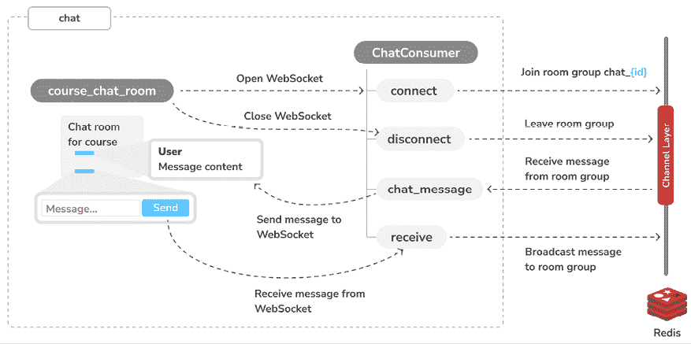

图 16.1：本章构建的功能图

在本章中，您将在 `chat` 应用程序中实现 `course_chat_room` 视图。此视图将提供显示给定课程聊天室的模板。当用户加入聊天室时，将显示最新的聊天消息。您将使用 JavaScript 在浏览器中建立 WebSocket 连接，并构建 `ChatConsumer` WebSocket 消费者来处理 WebSocket 连接和交换消息。您将使用 Redis 实现允许向聊天室中的所有用户广播消息的通道层。

本章的源代码可以在 [`github.com/PacktPublishing/Django-5-by-example/tree/main/Chapter16`](https://github.com/PacktPublishing/Django-5-by-example/tree/main/Chapter16) 找到。

本章中使用的所有 Python 模块都包含在本章源代码的 `requirements.txt` 文件中。您可以根据以下说明安装每个 Python 模块，或者使用命令 `python -m pip install -r requirements.txt` 一次性安装所有依赖。

# 创建一个聊天应用

您将实现一个聊天服务器，为每个课程提供聊天室，以便学生可以访问课程聊天室并实时交换消息。您将使用 Channels 来构建此功能。Channels 是一个 Django 应用程序，它扩展了 Django 以处理需要长时间运行连接的协议，例如 WebSockets、聊天机器人或 MQTT（一种轻量级的发布/订阅消息传输，常用于 **物联网** (**IoT**) 项目）。

使用 Channels，您可以在项目中轻松实现实时或异步功能，除了您标准的 HTTP 同步视图。您将首先向项目中添加一个新的应用程序。新的应用程序将包含聊天服务器的逻辑。

您可以在[`channels.readthedocs.io/`](https://channels.readthedocs.io/)找到 Django Channels 的文档。

让我们开始实现聊天服务器。从项目的`educa`目录运行以下命令以创建新的应用程序文件结构：

```py
django-admin startapp chat 
```

编辑`educa`项目的`settings.py`文件，通过编辑`INSTALLED_APPS`设置来激活项目中的`chat`应用程序，如下所示：

```py
INSTALLED_APPS = [
    # ...
**'chat.apps.ChatConfig'****,**
] 
```

新的`chat`应用程序现在已在您的项目中激活。接下来，您将构建一个用于课程聊天室的视图。

## 实现聊天室视图

您将为每个课程提供不同的聊天室。您需要创建一个视图，让学生能够加入指定课程的聊天室。只有注册了课程的学生的才能访问课程聊天室。

编辑新`chat`应用程序的`views.py`文件，并向其中添加以下代码：

```py
**from** **django.contrib.auth.decorators** **import** **login_required**
**from** **django.http** **import** **HttpResponseForbidden**
from django.shortcuts import render
**from** **courses.models** **import** **Course**
**@login_required**
**def****course_chat_room****(****request, course_id****):**
**try****:**
**# retrieve course with given id joined by the current user**
 **course = request.user.courses_joined.get(****id****=course_id)**
**except** **Course.DoesNotExist:**
**# user is not a student of the course or course does not exist**
**return** **HttpResponseForbidden()**
**return** **render(request,** **'chat/room.html'****, {****'course'****: course})** 
```

这是`course_chat_room`视图。在这个视图中，您使用`@login_required`装饰器来阻止任何未经认证的用户访问视图。视图的工作方式如下：

1.  视图接收一个必需的`course_id`参数，用于检索具有给定`id`的课程。

1.  用户注册的课程通过`courses_joined`关系检索，并从这些课程子集中获取具有给定`id`的课程。如果具有给定`id`的课程不存在或用户未注册，则返回`HttpResponseForbidden`响应，这相当于 HTTP 状态`403`的响应。

1.  如果具有给定`id`的课程存在且用户已注册，则渲染`chat/room.html`模板，并将`course`对象传递到模板上下文中。

您需要为这个视图添加一个 URL 模式。在`chat`应用程序目录内创建一个新文件，命名为`urls.py`。向其中添加以下代码：

```py
from django.urls import path
from . import views
app_name = 'chat'
urlpatterns = [
    path(
        'room/<int:course_id>/',
        views.course_chat_room,
        name='course_chat_room'),
] 
```

这是`chat`应用程序的初始 URL 模式文件。您定义了`course_chat_room` URL 模式，包括带有`int`前缀的`course_id`参数，因为您只期望这里是一个整数值。

在项目的主体 URL 模式中包含`chat`应用程序的新 URL 模式。编辑`educa`项目的主体`urls.py`文件，并向其中添加以下行：

```py
urlpatterns = [
    # ...
 **path(****'chat/'****, include(****'chat.urls'****, namespace=****'chat'****)),**
] 
```

`chat`应用程序的 URL 模式已添加到项目的`chat/`路径下。

您需要为`course_chat_room`视图创建一个模板。此模板将包含一个用于可视化聊天中交换的消息的区域，以及一个带有提交按钮的文本输入框，用于向聊天发送文本消息。

在`chat`应用程序目录内创建以下文件结构：

```py
templates/
    chat/
        room.html 
```

编辑 `chat/room.html` 模板，并向其中添加以下代码：

```py

Chat room for "{{ course.title }}"

  <div id="chat">
</div>
<div id="chat-input">
<input id="chat-message-input" type="text">
<input id="chat-message-submit" type="submit" value="Send">
</div>




 
```

这是课程聊天室的模板。在这个模板中，你执行以下操作：

1.  你扩展了项目的 `base.html` 模板，并填充其 `content` 块。

1.  你定义了一个带有 `chat` ID 的 `<div>` HTML 元素，你将使用它来显示用户和其他学生发送的聊天消息。

1.  你还定义了一个带有 `text` 输入和提交按钮的第二个 `<div>` 元素，这将允许用户发送消息。

1.  你添加了 `base.html` 模板中定义的 `include_js` 和 `domready` 块，你将在稍后实现它们，以建立与 WebSocket 的连接并发送或接收消息。

运行开发服务器，并在你的浏览器中打开 `http://127.0.0.1:8000/chat/room/1/`，将 `1` 替换为数据库中现有课程的 `id`。

使用注册了课程的登录用户访问聊天室。你将看到以下屏幕：

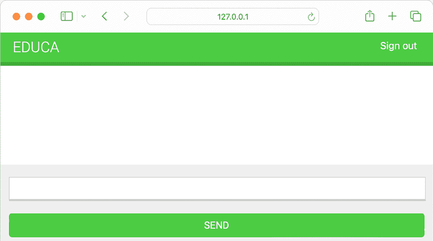

图 16.2：课程聊天室页面

这是学生将在其中讨论课程主题的课程聊天室屏幕。

你已经创建了课程聊天室的基视图。现在你需要处理学生之间的消息。下一节将介绍使用 Channels 的异步支持来实现实时通信。

# 实时 Django 与 Channels

你正在构建一个聊天服务器，为每个课程提供学生聊天室。注册了课程的学生的将能够访问课程聊天室并交换消息。此功能需要服务器和客户端之间的实时通信。

标准的 HTTP 请求/响应模型在这里不适用，因为你需要浏览器在新消息到达时立即接收通知。你可以通过使用 AJAX 轮询或长轮询结合将消息存储在你的数据库或 Redis 中来实现此功能。然而，使用标准的同步 Web 应用程序实现实时通信没有高效的方法。

你需要异步通信，这允许实时交互，其中服务器可以在新消息到达时立即将更新推送到客户端，而无需客户端定期请求更新。异步通信还带来其他优势，例如降低延迟、提高负载下的性能，以及更好的整体用户体验。你将使用 ASGI 通过异步通信构建聊天服务器。

## 使用 ASGI 的异步应用程序

Django 通常使用**Web 服务器网关接口**（**WSGI**）进行部署，这是 Python 应用程序处理 HTTP 请求的标准接口。然而，为了与异步应用程序一起工作，你需要使用另一个名为 ASGI 的接口，它可以处理 WebSocket 请求。ASGI 是异步 Web 服务器和应用程序的 Python 标准。通过使用 ASGI，我们将使 Django 能够独立并实时地处理每条消息，为学生创造一个流畅和实时的聊天体验。

你可以在[`asgi.readthedocs.io/en/latest/introduction.html`](https://asgi.readthedocs.io/en/latest/introduction.html)找到 ASGI 的介绍。

Django 自带通过 ASGI 运行异步 Python 的支持。自 Django 3.1 以来，就支持编写异步视图，而 Django 4.1 引入了基于类的视图的异步处理程序。Django 5.0 在生成响应之前添加了对异步视图中的断开事件的处理。它还向认证框架添加了异步函数，提供了异步信号分发的支持，并将异步支持添加到多个内置装饰器中。

Channels 建立在 Django 中可用的原生 ASGI 支持之上，并为处理需要长时间运行连接的协议（如 WebSockets、IoT 协议和聊天协议）提供了额外的功能。

WebSockets 通过在服务器和客户端之间建立一个持久、开放、双向的**传输控制协议**（**TCP**）连接来提供全双工通信。你不需要向服务器发送 HTTP 请求，而是与服务器建立连接；一旦通道打开，就可以在两个方向上交换消息，而不需要每次都建立新的连接。你将使用 WebSockets 来实现你的聊天服务器。

你可以在[`en.wikipedia.org/wiki/WebSocket`](https://en.wikipedia.org/wiki/WebSocket)上了解更多关于 WebSockets 的信息。

你可以在[`docs.djangoproject.com/en/5.0/howto/deployment/asgi/`](https://docs.djangoproject.com/en/5.0/howto/deployment/asgi/)找到有关使用 ASGI 部署 Django 的更多信息。

你可以在[`docs.djangoproject.com/en/5.0/topics/async/`](https://docs.djangoproject.com/en/5.0/topics/async/)找到有关 Django 支持编写异步视图的更多信息，以及 Django 对异步类视图的支持[`docs.djangoproject.com/en/5.0/topics/class-based-views/#async-class-based-views`](https://docs.djangoproject.com/en/5.0/topics/class-based-views/#async-class-based-views)。

接下来，我们将学习如何使用 Channels 改变 Django 的请求/响应周期。

## 使用 Channels 的请求/响应周期

理解标准同步请求周期与 Channels 实现之间的差异非常重要。以下图示展示了同步 Django 设置的请求周期：

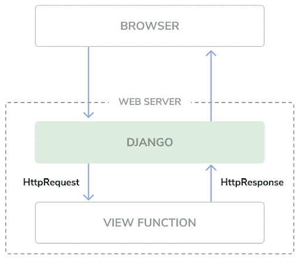

图 16.3：Django 请求/响应周期

当浏览器向 Web 服务器发送 HTTP 请求时，Django 处理请求并将 `HttpRequest` 对象传递给相应的视图。视图处理请求并返回一个 `HttpResponse` 对象，该对象作为 HTTP 响应发送回浏览器。没有机制在不需要相关 HTTP 请求的情况下保持打开的连接或向浏览器发送数据。

以下架构显示了使用 WebSocket 的 Django 项目使用 Channels 的请求周期：

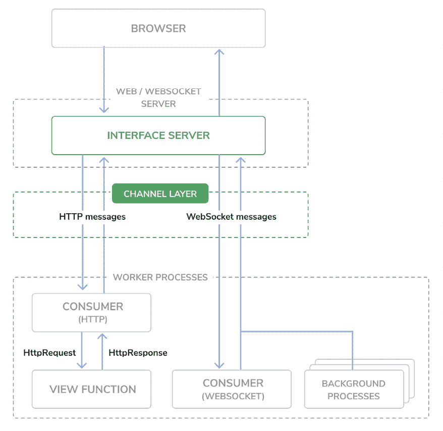

图 16.4：Django Channels 请求/响应周期

Channels 用跨通道发送的消息替换了 Django 的请求/响应周期。HTTP 请求仍然通过 Django 路由到视图函数，但它们通过通道进行路由。这允许处理 WebSocket 消息，其中您有生产者和消费者在通道层之间交换消息。Channels 保留了 Django 的同步架构，允许您在编写同步代码和异步代码之间进行选择，或者两者结合。

您现有的同步视图将与我们将使用 Daphne 实现的 WebSocket 功能共存，并且您将同时处理 HTTP 和 WebSocket 请求。

接下来，您将安装 Channels 并将其添加到项目中。

# 安装 Channels 和 Daphne

您将向项目中添加 Channels 并为其设置所需的基本 ASGI 应用程序路由，以便管理 HTTP 请求。

使用以下命令在您的虚拟环境中安装 Channels：

```py
python -m pip install -U 'channels[daphne]==4.1.0' 
```

这将同时安装 Channels 和 Daphne ASGI 应用程序服务器。处理异步请求需要一个 ASGI 服务器，我们选择 Daphne，因为它简单且兼容，并且与 Channels 一起打包。

编辑 `educa` 项目的 `settings.py` 文件，并将 `daphne` 添加到 `INSTALLED_APPS` 设置的开头，如下所示：

```py
INSTALLED_APPS = [
**'daphne'****,**
# ...
] 
```

当 `daphne` 被添加到 `INSTALLED_APPS` 设置中时，它将接管 `runserver` 命令，替换标准的 Django 开发服务器。这将允许您在开发期间处理异步请求。除了处理同步请求的 URL 路由到 Django 视图外，Daphne 还管理 WebSocket 消费者的路由。您可以在 [`github.com/django/daphne`](https://github.com/django/daphne) 找到有关 Daphne 的更多信息。

Channels 预期您定义一个单一的根应用程序，该应用程序将执行所有请求。您可以通过将 `ASGI_APPLICATION` 设置添加到项目中来定义根应用程序。这与指向项目基本 URL 模式的 `ROOT_URLCONF` 设置类似。您可以在项目的任何位置放置根应用程序，但建议将其放在项目级别的文件中。您可以直接将根路由配置添加到 `asgi.py` 文件中，其中将定义 ASGI 应用程序。

在`educa`项目目录中编辑`asgi.py`文件，并添加以下粗体显示的代码：

```py
import os
**from** **channels.routing** **import** **ProtocolTypeRouter**
from django.core.asgi import get_asgi_application
os.environ.setdefault('DJANGO_SETTINGS_MODULE', 'educa.settings')
**django_asgi_app** = get_asgi_application()
**application = ProtocolTypeRouter({**
**'http'****: django_asgi_app,**
**})** 
```

在前面的代码中，你定义了当通过 ASGI 服务 Django 项目时将被执行的主要 ASGI 应用程序。你使用 Channels 提供的`ProtocolTypeRouter`类作为路由系统的主入口点。`ProtocolTypeRouter`接受一个映射通信类型（如`http`或`websocket`）到 ASGI 应用程序的字典。你使用 HTTP 协议的默认应用程序实例化这个类。稍后，你将添加 WebSocket 的协议。

将以下行添加到你的项目`settings.py`文件中：

```py
ASGI_APPLICATION = 'educa.asgi.application' 
```

`ASGI_APPLICATION`设置被 Channels 用于定位根路由配置。

使用以下命令启动开发服务器：

```py
python manage.py runserver 
```

你将看到类似以下输出的内容：

```py
Watching for file changes with StatReloader
Performing system checks...
System check identified no issues (0 silenced).
April 14, 2024 - 08:02:57
Django version 5.0.4, using settings 'educa.settings'
Starting ASGI/Daphne version 4.1.0 development server at http://127.0.0.1:8000/
Quit the server with CONTROL-C. 
```

检查输出是否包含以下行`Starting ASGI/Daphne version 4.1.0 development server`。这一行确认你正在使用 Daphne 开发服务器，它能够管理同步和异步请求，而不是标准的 Django 开发服务器。HTTP 请求的行为与之前相同，但它们将通过通道路由。

现在 Channels 已安装到你的项目中，你可以构建课程的聊天服务器。为了实现你项目的聊天服务器，你需要采取以下步骤：

1.  **设置消费者**：消费者是能够以与传统 HTTP 视图非常相似的方式处理 WebSocket 的独立代码块。你将构建一个消费者来读取和写入通信通道的消息。

1.  **配置路由**：Channels 提供了路由类，允许你组合和堆叠你的消费者。你将为你的聊天消费者配置 URL 路由。

1.  **实现 WebSocket 客户端**：当学生访问聊天室时，你将从浏览器连接到 WebSocket，并使用 JavaScript 发送或接收消息。

1.  **启用通道层**：通道层允许你在应用程序的不同实例之间进行通信。它们是构建分布式实时应用程序的有用部分。你将使用 Redis 设置一个通道层。

让我们从编写自己的消费者开始，以处理连接到 WebSocket、接收和发送消息以及断开连接。

# 编写消费者

消费者是对异步应用程序中 Django 视图的等效。如前所述，它们以与传统视图处理 HTTP 请求非常相似的方式处理 WebSocket。消费者是能够处理消息、通知和其他内容的 ASGI 应用程序。与 Django 视图不同，消费者是为长时间运行的通信而构建的。通过允许你组合和堆叠消费者的路由类，URL 被映射到消费者。

让我们实现一个基本的消费者，它可以接受 WebSocket 连接，并将从 WebSocket 接收到的每条消息回显给它。此初始功能将允许学生向消费者发送消息，并接收回发送的消息。

在`chat`应用程序目录内创建一个新文件，并将其命名为`consumers.py`。将以下代码添加到其中：

```py
import json
from channels.generic.websocket import WebsocketConsumer
class ChatConsumer(WebsocketConsumer):
    def connect(self):
        # accept connection
        self.accept()
    def disconnect(self, close_code):
        pass
# receive message from WebSocket
def receive(self, text_data):
        text_data_json = json.loads(text_data)
        message = text_data_json['message']
        # send message to WebSocket
        self.send(text_data=json.dumps({'message': message})) 
```

这是`ChatConsumer`消费者。此类从 Channels 的`WebsocketConsumer`类继承，以实现基本的 WebSocket 消费者。在此消费者中，您实现了以下方法：

+   `connect()`: 当接收到新的连接时调用。您可以使用`self.accept()`接受任何连接。您也可以通过调用`self.close()`拒绝连接。

+   `disconnect()`: 当套接字关闭时调用。您使用`pass`，因为当客户端关闭连接时，您不需要实现任何操作。

+   `receive()`: 当从 WebSocket 接收到数据时调用。您期望接收到的数据是`text_data`（这也可以是`binary_data`，用于二进制数据）。您将接收到的文本数据视为 JSON。因此，您使用`json.loads()`将接收到的 JSON 数据加载到 Python 字典中。您访问`message`键，您期望它在接收到的 JSON 结构中存在。为了回显消息，您使用`self.send()`将消息发送回 WebSocket，并通过`json.dumps()`将其再次转换为 JSON 格式。

您的`ChatConsumer`消费者初始版本接受任何 WebSocket 连接，并将接收到的每条消息回显到 WebSocket 客户端。请注意，消费者尚未向其他客户端广播消息。您将通过实现通道层来构建此功能。

首先，让我们通过将其添加到项目的 URL 中，来公开我们的消费者。

# 路由

您需要定义一个 URL，以便将连接路由到您已实现的`ChatConsumer`消费者。Channels 提供了路由类，允许您组合和堆叠消费者，根据连接的内容进行分发。您可以将它们视为 Django 异步应用的 URL 路由系统。

在`chat`应用程序目录内创建一个新文件，并将其命名为`routing.py`。将以下代码添加到其中：

```py
from django.urls import re_path
from . import consumers
websocket_urlpatterns = [
    re_path(
        r'ws/chat/room/(?P<course_id>\d+)/$',
        consumers.ChatConsumer.as_asgi()
    ),
] 
```

在此代码中，您将一个 URL 模式映射到您在`chat/consumers.py`文件中定义的`ChatConsumer`类。有一些细节值得审查：

+   您使用 Django 的`re_path()`来定义带有正则表达式的路径，而不是`path()`。如果内部路由器被额外的中间件包装，Channels 的 URL 路由可能与`path()`路由不正确地工作，因此这种方法有助于避免任何问题。

+   URL 包含一个名为`course_id`的整数参数。此参数将在消费者的作用域内可用，并允许您识别用户连接到的课程聊天室。

+   你调用`consumer`类的`as_asgi()`方法，以获取一个 ASGI 应用程序，该应用程序将为每个用户连接实例化消费者实例。这种行为类似于 Django 的`as_view()`方法对于基于类的视图。

将 WebSocket URL 以`/ws/`开头是一种良好的实践，以区分用于标准同步 HTTP 请求的 URL。这也简化了生产设置，当 HTTP 服务器根据路径路由请求时。

编辑位于`settings.py`文件旁边的全局`asgi.py`文件，使其看起来像这样：

```py
import os
**from** **channels.auth** **import** **AuthMiddlewareStack**
from channels.routing import ProtocolTypeRouter**, URLRouter**
from django.core.asgi import get_asgi_application
os.environ.setdefault('DJANGO_SETTINGS_MODULE', 'educa.settings')
django_asgi_app = get_asgi_application()
**from** **chat.routing** **import** **websocket_urlpatterns**
application = ProtocolTypeRouter({
    'http': django_asgi_app,
    **'websocket'****: AuthMiddlewareStack(**
 **URLRouter(websocket_urlpatterns)**
 **),**
}) 
```

在此代码中，你添加了：

+   为`websocket`协议创建一个新的路由。你使用`URLRouter`将`websocket`连接映射到`chat.routing`模块中定义的`websocket_urlpatterns`列表中的 URL 模式。

+   `AuthMiddlewareStack`作为一个 URL 路由器的包装函数。由 Channels 提供的`AuthMiddlewareStack`类支持标准的 Django 认证，其中用户详细信息存储在会话中。稍后，你将在消费者作用域内访问用户实例以识别发送消息的用户。

注意，`websocket_urlpatterns`的导入位于`get_asgi_application()`函数调用下方。这是为了确保在导入可能导入 ORM 模型的代码之前，应用程序注册已填充。

现在我们已经有一个通过 URL 可用的功能 WebSocket 消费者，我们可以实现 WebSocket 客户端。

# 实现 WebSocket 客户端

到目前为止，你已经创建了`course_chat_room`视图及其对应的模板，以便学生访问课程聊天室。你已经实现了聊天服务器的 WebSocket 消费者并将其与 URL 路由绑定。现在，你需要构建一个 WebSocket 客户端以与课程聊天室模板中的 WebSocket 建立连接，并能够发送/接收消息。

你将使用 JavaScript 实现 WebSocket 客户端，以在浏览器中打开并维护连接，并且你将使用 JavaScript 与**文档对象模型**（**DOM**）交互。

你将执行以下与 WebSocket 客户端相关的任务：

1.  当页面加载时，打开与服务器的 WebSocket 连接。

1.  当通过 WebSocket 接收到数据时，向 HTML 容器添加消息。

1.  将监听器附加到提交按钮上，以便在用户点击**发送**按钮或按下*Enter*键时通过 WebSocket 发送消息。

让我们从打开 WebSocket 连接开始。

编辑`chat/room.html`模板的`chat`应用程序，并修改`include_js`和`domready`块，如下所示：

```py

 **{{ course.id|json_script:"course-id" }}**


 **const courseId = JSON.parse(**
 **document.getElementById('course-id').textContent**
 **);**
 **const url = 'ws://' + window.location.host +**
 **'/ws/chat/room/' + courseId + '/';**
 **const chatSocket = new WebSocket(url);**
 
```

在 `include_js` 块中，您使用 `json_script` 模板过滤器安全地使用 `course.id` 的值与 JavaScript 一起使用。Django 提供的 `json_script` 模板过滤器将 Python 对象作为 JSON 输出，并用 `<script>` 标签包裹，这样您就可以安全地与 JavaScript 一起使用。代码 `{{ course.id|json_script:"course-id" }}` 被渲染为 `<script id="course-id" type="application/json">6</script>`。然后，在 `domready` 块中，通过使用 `JSON.parse()` 解析具有 `id="course-id"` 的元素的文本内容来检索此值。这是在 JavaScript 中安全使用 Python 对象的方法。

`json_script` 模板过滤器安全地将 Python 对象编码为 JSON，并安全地将其嵌入到 `<script>` HTML 标签中，通过转义潜在的有害字符来防止 **跨站脚本攻击**（**XSS**）。

您可以在 [`docs.djangoproject.com/en/5.0/ref/templates/builtins/#json-script`](https://docs.djangoproject.com/en/5.0/ref/templates/builtins/#json-script) 找到有关 `json_script` 模板过滤器的更多信息。

在 `domready` 块中，您定义一个使用 WebSocket 协议的 URL，它看起来像 `ws://`（或者对于安全的 WebSocket，像 `https://` 一样，使用 `wss://`）。您使用浏览器当前的位置构建 URL，您可以从 `window.location.host` 获取它。其余的 URL 使用您在 `chat` 应用的 `routing.py` 文件中定义的聊天室 URL 模式路径构建。

您直接写入 URL 而不是使用解析器构建它，因为 Channels 不提供反转 URL 的方法。您使用当前课程的 `ID` 生成当前课程的 URL，并将 URL 存储在名为 `url` 的新常量中。

然后您使用 `new` `WebSocket(url)` 打开到存储的 URL 的 WebSocket 连接。您将实例化的 WebSocket 客户端对象分配给新的常量 `chatSocket`。

您已创建 WebSocket 消费者，为其添加了路由，并实现了一个基本的 WebSocket 客户端。让我们尝试您的聊天初始版本。

使用以下命令启动开发服务器：

```py
python manage.py runserver 
```

在您的浏览器中打开 URL `http://127.0.0.1:8000/chat/room/1/`，将 `1` 替换为数据库中现有课程的 `id`。查看控制台输出。除了对页面及其静态文件的 HTTP `GET` 请求外，您应该看到两行，包括 `WebSocket HANDSHAKING` 和 `WebSocket CONNECT`，如下所示输出：

```py
HTTP GET /chat/room/1/ 200 [0.02, 127.0.0.1:57141]
WebSocket HANDSHAKING /ws/chat/room/1/ [127.0.0.1:57144]
WebSocket CONNECT /ws/chat/room/1/ [127.0.0.1:57144] 
```

Daphne 服务器使用标准 TCP 套接字监听传入的套接字连接。握手是 HTTP 到 WebSocket 的桥梁。在握手过程中，连接的详细信息被协商，任何一方都可以在完成前关闭连接。请记住，您在 `ChatConsumer` 类的 `connect()` 方法中使用 `self.accept()` 接受任何连接，该类在 `chat` 应用的 `consumers.py` 文件中实现。连接被接受，因此您在控制台看到 `WebSocket CONNECT` 消息。

如果您使用浏览器开发者工具跟踪网络连接，您还可以看到已建立的 WebSocket 连接的信息。

它应该看起来像*图 16.5*：

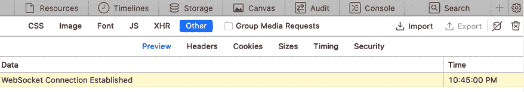

图 16.5：浏览器开发者工具显示已建立 WebSocket 连接

现在您已经可以连接到 WebSocket，是时候与之交互了。您将实现处理常见事件的方法，例如接收消息和关闭连接。编辑`chat/room.html`模板的`chat`应用程序并修改`domready`块，如下所示：

```py

  const courseId = JSON.parse(
    document.getElementById('course-id').textContent
  );
  const url = 'ws://' + window.location.host +
              '/ws/chat/room/' + courseId + '/';
  const chatSocket = new WebSocket(url);
 **chatSocket.****onmessage =** **function****(event) {**
 **const data =** **JSON****.****parse****(event.data);**
**const** **chat =** **document****.****getElementById****(****'chat'****);**
 **chat.innerHTML +=** **'<div class="message">'** **+**
 **data.message +** **'****</div>'****;**
 **chat.scrollTop = chat.scrollHeight;**
 **};**
 **chatSocket.onclose =** **function****(event) {**
**console****.****error****(****'Chat socket closed unexpectedly'****);**
 **};**
 
```

在此代码中，您为 WebSocket 客户端定义以下事件：

+   `onmessage`：当通过 WebSocket 接收到数据时触发。您解析消息，您期望其以 JSON 格式，并访问其`message`属性。然后您将一个新的`<div>`元素与接收到的消息附加到具有`chat` ID 的 HTML 元素。这将向聊天记录添加新消息，同时保留已添加到日志的所有先前消息。您将聊天记录的`<div>`滚动到最底部以确保新消息可见。您通过滚动到聊天记录的总可滚动高度来实现这一点，这可以通过访问其`scrollHeight`属性来获得。

+   `onclose`：当 WebSocket 连接关闭时触发。您不期望关闭连接，因此如果发生这种情况，您将错误`Chat socket closed unexpectedly`写入控制台日志。

您已实现了在接收到新消息时显示消息的动作。您还需要实现向套接字发送消息的功能。

编辑`chat/room.html`模板的`chat`应用程序，并将以下 JavaScript 代码添加到`domready`块的底部：

```py
const input = document.getElementById('chat-message-input');
const submitButton = document.getElementById('chat-message-submit');
submitButton.addEventListener('click', function(event) {
  const message = input.value;
  if(message) {
    // send message in JSON format
    chatSocket.send(JSON.stringify({'message': message}));
    // clear input
    input.value = '';
    input.focus();
  }
}); 
```

在此代码中，您为提交按钮的`click`事件定义了一个事件监听器，您通过其 ID `chat-message-submit`选择该按钮。当按钮被点击时，您执行以下操作：

1.  您从具有 ID `chat-message-input`的文本输入元素的值中读取用户输入的消息。

1.  您使用`if(message)`检查消息是否有内容。

1.  如果用户已输入消息，您可以使用`JSON.stringify()`形成如`{'message': '用户输入的字符串'}`这样的 JSON 内容。

1.  您通过调用`chatSocket`客户端的`send()`方法将 JSON 内容通过 WebSocket 发送。

1.  您通过将文本输入的值设置为空字符串`input.value = ''`来清除文本输入的内容。

1.  您使用`input.focus()`将焦点返回到文本输入，以便用户可以立即写入新消息。

用户现在可以使用文本输入和点击提交按钮来发送消息。

为了提高用户体验，当页面加载时，你将焦点放在文本输入框上，使用户可以立即开始输入，而无需先点击它。你还将捕获键盘按键事件以识别*Enter*键，并在提交按钮上触发`click`事件。用户可以通过点击按钮或按*Enter*键来发送消息。

编辑`chat`应用程序的`chat/room.html`模板，并将以下 JavaScript 代码添加到`domready`块的底部：

```py
input.addEventListener('keypress', function(event) {
    if (event.key === 'Enter') {
      // cancel the default action, if needed
      event.preventDefault();
      // trigger click event on button
      submitButton.click();
    }
  });

input.focus(); 
```

在此代码中，你还定义了一个用于`input`元素的`keypress`事件函数。对于用户按下的任何键，你执行以下操作：

1.  你检查其键是否为*Enter*。

1.  如果按下*Enter*键：

    1.  你可以通过`event.preventDefault()`来阻止此键的默认行为。

    1.  然后你在提交按钮上触发`click`事件，将消息发送到 WebSocket。

在事件处理器外部，在`domready`块的 JavaScript 主代码中，你使用`input.focus()`将焦点放在文本输入框上。这样做的话，当 DOM 加载完成后，焦点将设置在`input`元素上，以便用户可以输入信息。

`chat/room.html`模板的`domready`块现在应该如下所示：

```py

  const courseId = JSON.parse(
    document.getElementById('course-id').textContent
  );
  const url = 'ws://' + window.location.host +
              '/ws/chat/room/' + courseId + '/';
  const chatSocket = new WebSocket(url);
  chatSocket.onmessage = function(event) {
    const data = JSON.parse(event.data);
    const chat = document.getElementById('chat');
    chat.innerHTML += '<div class="message">' +
                      data.message + '</div>';
    chat.scrollTop = chat.scrollHeight;
  };
  chatSocket.onclose = function(event) {
    console.error('Chat socket closed unexpectedly');
  };
  const input = document.getElementById('chat-message-input');
  const submitButton = document.getElementById('chat-message-submit');
  submitButton.addEventListener('click', function(event) {
    const message = input.value;
    if(message) {
      // send message in JSON format
      chatSocket.send(JSON.stringify({'message': message}));
      // clear input
      input.value = '';
      input.focus();
    }
  });
  input.addEventListener('keypress', function(event) {
    if (event.key === 'Enter') {
      // cancel the default action, if needed
      event.preventDefault();
      // trigger click event on button
      submitButton.click();
    }
  });

  input.focus();
 
```

在你的浏览器中打开 URL `http://127.0.0.1:8000/chat/room/1/`，将`1`替换为数据库中现有课程的`id`。对于已登录并注册该课程的用户，在输入框中输入一些文本，然后点击**发送**按钮或按*Enter*键。

你将看到你的消息出现在聊天记录中：

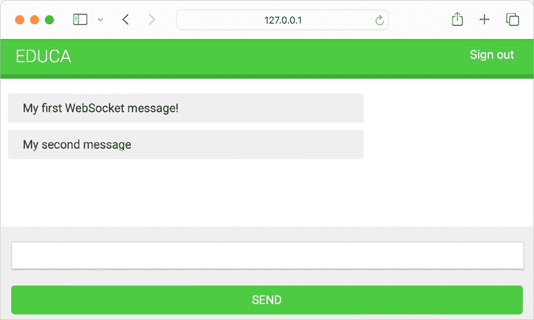

图 16.6：聊天室页面，包括通过 WebSocket 发送的消息

太好了！消息已经通过 WebSocket 发送，`ChatConsumer`消费者已经收到消息并通过 WebSocket 将其发送回来。`chatSocket`客户端收到消息事件并触发`onmessage`函数，将消息添加到聊天记录中。

你已经使用 WebSocket 消费者和 WebSocket 客户端实现了功能，以建立客户端/服务器通信并可以发送或接收事件。然而，聊天服务器无法向其他客户端广播消息。如果你打开第二个浏览器标签页并输入一条消息，该消息将不会出现在第一个标签页上。为了在消费者之间建立通信，你必须启用通道层。

# 启用通道层

通道层允许你在应用程序的不同实例之间进行通信。通道层是允许多个消费者实例相互通信以及与 Django 的其他部分通信的传输机制。

在你的聊天服务器中，你计划为同一课程聊天室创建多个 `ChatConsumer` 消费者实例。每个加入聊天室的学生将在他们的浏览器中实例化 WebSocket 客户端，这将与 WebSocket 消费者实例建立连接。你需要一个公共通道层来在消费者之间分配消息。

## 通道和组

通道层提供了两个抽象来管理通信：通道和组：

+   **通道**：你可以将通道想象成一个可以发送或接收消息的收件箱，或者是一个任务队列。每个通道都有一个名称。消息可以通过知道通道名称的任何人发送到通道，然后传递给在该通道上监听的消费者。

+   **组**：多个通道可以被组合成一个组。每个组都有一个名称。任何人都可以通过知道组名称来向组中添加或移除通道。使用组名称，你还可以向组中的所有通道发送消息。

你将通过使用通道组来实现聊天服务器。通过为每个课程聊天室创建一个通道组，`ChatConsumer` 实例将能够相互通信。

让我们向我们的项目中添加一个通道层。

## 使用 Redis 设置通道层

虽然 Channels 支持其他类型的通道层，但 Redis 是通道层的首选选项。Redis 作为通道层的通信存储。记住，你已经在 *第七章*，*跟踪用户行为*，*第十章*，*扩展你的商店* 和 *第十四章*，*渲染和缓存内容* 中使用了 Redis。

如果你还没有安装 Redis，你可以在 *第七章*，*跟踪用户行为* 中找到安装说明。

要使用 Redis 作为通道层，你必须安装 `channels-redis` 包。使用以下命令在你的虚拟环境中安装 `channels-redis`：

```py
python -m pip install channels-redis==4.2.0 
```

编辑 `educa` 项目的 `settings.py` 文件，并向其中添加以下代码：

```py
CHANNEL_LAYERS = {
    'default': {
        'BACKEND': 'channels_redis.core.RedisChannelLayer',
        'CONFIG': {
            'hosts': [('127.0.0.1', 6379)],
        },
    },
} 
```

`CHANNEL_LAYERS` 设置定义了项目可用的通道层的配置。你使用 `channels-redis` 提供的 `RedisChannelLayer` 后端定义一个默认的通道层，并指定 Redis 运行的主机 `127.0.0.1` 和端口 `6379`。

让我们尝试通道层。使用以下命令初始化 Redis Docker 容器：

```py
docker run -it --rm --name redis -p 6379:6379 redis:7.2.4 
```

如果你想在后台（分离模式）运行命令，你可以使用 `-d` 选项。

使用以下命令从项目目录中打开 Django shell：

```py
python manage.py shell 
```

为了验证通道层可以与 Redis 通信，编写以下代码向名为 `test_channel` 的测试通道发送消息并接收它：

```py
>>> import channels.layers
>>> from asgiref.sync import async_to_sync
>>> channel_layer = channels.layers.get_channel_layer()
>>> async_to_sync(channel_layer.send)('test_channel', {'message': 'hello'})
>>> async_to_sync(channel_layer.receive)('test_channel') 
```

你应该得到以下输出：

```py
{'message': 'hello'} 
```

在前面的代码中，你通过通道层向一个测试通道发送消息，然后从通道层检索它。通道层正在成功与 Redis 通信。

接下来，我们将向我们的项目中添加通道层。

## 更新消费者以广播消息

让我们编辑 `ChatConsumer` 消费者，使用我们用 Redis 实现的通道层。对于每个课程聊天室，你将使用一个通道组。因此，你将使用课程 `id` 来构建组名。`ChatConsumer` 实例将知道组名，并且能够相互通信。

编辑 `chat` 应用的 `consumers.py` 文件，导入 `async_to_sync()` 函数，并修改 `ChatConsumer` 类的 `connect()` 方法，如下所示：

```py
import json
**from** **asgiref.sync** **import** **async_to_sync**
from channels.generic.websocket import WebsocketConsumer
class ChatConsumer(WebsocketConsumer):
    def connect(self):
 **self.****id** **= self.scope[****'url_route'****][****'kwargs'****][****'course_id'****]**
 **self.room_group_name =** **f'chat_****{self.****id****}****'**
**# join room group**
 **async_to_sync(self.channel_layer.group_add)(**
 **self.room_group_name, self.channel_name**
 **)**
# accept connection
        self.accept()
    # ... 
```

在此代码中，你导入 `async_to_sync()` 辅助函数来包装对异步通道层方法的调用。`ChatConsumer` 是一个同步的 `WebsocketConsumer` 消费者，但它需要调用通道层的异步方法。

在新的 `connect()` 方法中，你执行以下任务：

1.  你从作用域中检索课程 `id`，以了解聊天室关联的课程。你通过访问 `self.scope['url_route']['kwargs']['course_id']` 来从 URL 中检索 `course_id` 参数。每个消费者都有一个包含其连接信息、通过 URL 传递的参数以及（如果有）认证用户的作用域。

1.  你使用与组对应的课程的 `id` 来构建组名。记住，你将为每个课程聊天室有一个通道组。你将组名存储在消费者的 `room_group_name` 属性中。

1.  你通过将当前通道添加到组中来加入组。你从消费者的 `channel_name` 属性中获取通道名称。你使用通道层的 `group_add` 方法将通道添加到组中。你使用 `async_to_sync()` 包装器来使用通道层的异步方法。

1.  你保留 `self.accept()` 调用来接受 WebSocket 连接。

当 `ChatConsumer` 消费者接收到新的 WebSocket 连接时，它将其通道添加到其作用域内与课程关联的组中。消费者现在能够接收发送到该组的任何消息。

在相同的 `consumers.py` 文件中，修改 `ChatConsumer` 类的 `disconnect()` 方法，如下所示：

```py
 class ChatConsumer(WebsocketConsumer):
    # ...
def disconnect(self, close_code):
**# leave room group**
 **async_to_sync(self.channel_layer.group_discard)(**
 **self.room_group_name, self.channel_name**
 **)**
# ... 
```

当连接关闭时，你调用通道层的 `group_discard()` 方法来离开组。你使用 `async_to_sync()` 包装器来使用通道层的异步方法。

在相同的 `consumers.py` 文件中，修改 `ChatConsumer` 类的 `receive()` 方法，如下所示：

```py
class ChatConsumer(WebsocketConsumer):
    # ...
# receive message from WebSocket
def receive(self, text_data):
        text_data_json = json.loads(text_data)
        message = text_data_json['message']
**# send message to room group**
 **async_to_sync(self.channel_layer.group_send)(**
 **self.room_group_name,**
 **{**
**'type'****:** **'chat_message'****,**
**'message'****: message,**
 **}**
 **)** 
```

当你从 WebSocket 连接接收到消息时，而不是将消息发送到关联的通道，你将消息发送到组。你通过调用通道层的 `group_send()` 方法来完成此操作。你使用 `async_to_sync()` 包装器来使用通道层的异步方法。你将以下信息传递给发送到组的事件：

+   `type`：事件类型。这是一个特殊键，对应于接收事件的消费者应该调用的方法名称。你可以在消费者中实现一个与消息类型相同名称的方法，这样每次接收到具有该特定类型的消息时，它都会被执行。

+   `message`：你实际发送的消息。

在相同的 `consumers.py` 文件中，在 `ChatConsumer` 类中添加一个新的 `chat_message()` 方法，如下所示：

```py
class ChatConsumer(WebsocketConsumer):
    # ...
**# receive message from room group**
**def****chat_message****(****self, event****):**
**# send message to WebSocket**
 **self.send(text_data=json.dumps(event))** 
```

你将此方法命名为 `chat_message()` 以匹配从 WebSocket 接收消息时发送到通道组的 `type` 键。当向组发送类型为 `chat_message` 的消息时，所有订阅该组的消费者将接收到消息并执行 `chat_message()` 方法。在 `chat_message()` 方法中，你将接收到的消息事件发送到 WebSocket。

完整的 `consumers.py` 文件现在应该看起来像这样：

```py
import json
from asgiref.sync import async_to_sync
from channels.generic.websocket import WebsocketConsumer
class ChatConsumer(WebsocketConsumer):
    def connect(self):
        self.id = self.scope['url_route']['kwargs']['course_id']
        self.room_group_name = f'chat_{self.id}'
# join room group
        async_to_sync(self.channel_layer.group_add)(
            self.room_group_name, self.channel_name
        )
        # accept connection
        self.accept()
    def disconnect(self, close_code):
        # leave room group
        async_to_sync(self.channel_layer.group_discard)(
            self.room_group_name, self.channel_name
        )
    # receive message from WebSocket
def receive(self, text_data):
        text_data_json = json.loads(text_data)
        message = text_data_json['message']
        # send message to room group
        async_to_sync(self.channel_layer.group_send)(
            self.room_group_name,
            {
                'type': 'chat_message',
                'message': message,
            }
        )
    # receive message from room group
def chat_message(self, event):
        # send message to WebSocket
        self.send(text_data=json.dumps(event)) 
```

你已经在 `ChatConsumer` 中实现了通道层，允许消费者广播消息并相互通信。

使用以下命令运行开发服务器：

```py
python manage.py runserver 
```

在你的浏览器中打开 URL `http://127.0.0.1:8000/chat/room/1/`，将 `1` 替换为数据库中现有课程的 `id`。写一条消息并发送。然后，打开第二个浏览器窗口并访问相同的 URL。从每个浏览器窗口发送一条消息。

结果应该看起来像这样：

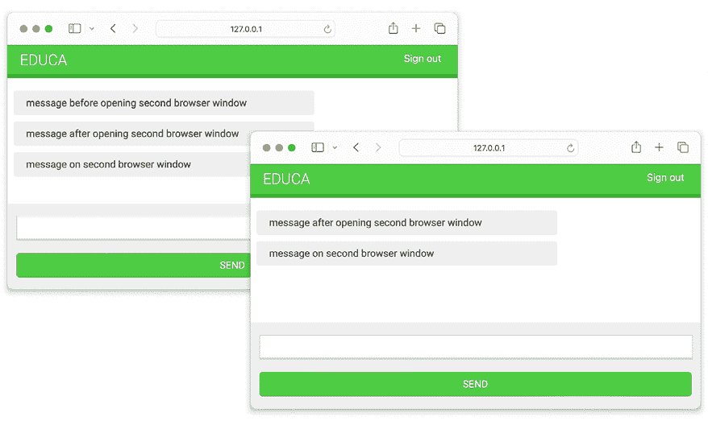

图 16.7：来自不同浏览器窗口发送的消息的聊天室页面

你会看到第一条消息只在第一个浏览器窗口中显示。当你打开第二个浏览器窗口时，来自任何浏览器窗口的消息都会在两个窗口中显示。当你打开一个新的浏览器窗口并访问聊天室 URL 时，浏览器中的 JavaScript WebSocket 客户端和服务器中的 WebSocket 消费者之间将建立一个新的 WebSocket 连接。每个通道都被添加到与课程 ID 关联的组中，并通过 URL 传递给消费者。消息被发送到组，并由所有消费者接收。

接下来，我们将通过添加额外的上下文来丰富消息。

## 给消息添加上下文

现在聊天室中的所有用户都可以互相发送消息，你可能想要显示谁发送了哪条消息以及发送的时间。让我们给消息添加一些上下文。

编辑 `chat` 应用程序的 `consumers.py` 文件并实现以下更改：

```py
import json
from asgiref.sync import async_to_sync
from channels.generic.websocket import WebsocketConsumer
**from** **django.utils** **import** **timezone**
class ChatConsumer(WebsocketConsumer):
    def connect(self):
 **self.user = self.scope[****'user'****]**
        self.id = self.scope['url_route']['kwargs']['course_id']
        self.room_group_name = f'chat_{self.id}'
# join room group
        async_to_sync(self.channel_layer.group_add)(
            self.room_group_name, self.channel_name
        )
        # accept connection
        self.accept()
    def disconnect(self, close_code):
        # leave room group
        async_to_sync(self.channel_layer.group_discard)(
            self.room_group_name, self.channel_name
        )
    # receive message from WebSocket
def receive(self, text_data):
        text_data_json = json.loads(text_data)
        message = text_data_json['message']
 **now = timezone.now()**
# send message to room group
        async_to_sync(self.channel_layer.group_send)(
            self.room_group_name,
            {
                'type': 'chat_message',
                'message': message,
**'user'****: self.user.username,**
**'datetime'****: now.isoformat(),**
            }
        )
    # receive message from room group
def chat_message(self, event):
        # send message to WebSocket
        self.send(text_data=json.dumps(event)) 
```

你现在导入 Django 提供的 `timezone` 模块。在消费者的 `connect()` 方法中，你使用 `self.scope['user']` 从作用域中检索当前用户，并将它们存储在消费者新的 `user` 属性中。

当消费者通过 WebSocket 接收到消息时，它使用 `timezone.now()` 获取当前时间，并将当前 `user` 和 `datetime` 以 ISO 8601 格式以及消息一起传递给发送到通道组的消息。

编辑`chat/room.html`模板的`chat`应用，并将以下加粗的行添加到`include_js`块中：

```py

  {{ course.id|json_script:"course-id" }}
 **{{ request.user.username|json_script:****"request-user"** **}}**
 
```

使用`json_script`模板，你安全地打印出请求用户的用户名，以便与 JavaScript 一起使用。

在`chat/room.html`模板的`domready`块中，添加以下加粗的行：

```py

  const courseId = JSON.parse(
    document.getElementById('course-id').textContent
  );
**const** **requestUser =** **JSON****.****parse****(**
**document****.****getElementById****(****'request-user'****).textContent**
 **);**
  # ...
 
```

在新代码中，你安全地解析具有 ID `request-user`的元素的数据，并将其存储在`requestUser`常量中。

然后，在`domready`块中，找到以下行：

```py
const data = JSON.parse(event.data);
const chat = document.getElementById('chat');
chat.innerHTML += '<div class="message">' +
                  data.message + '</div>';
chat.scrollTop = chat.scrollHeight; 
```

将这些行替换为以下代码：

```py
const data = JSON.parse(event.data);
const chat = document.getElementById('chat');
**const dateOptions = {hour: 'numeric', minute: 'numeric', hour12: true};**
**const datetime = new Date(data.datetime).toLocaleString('en', dateOptions);**
**const isMe = data.user === requestUser;**
**const source = isMe ? 'me' : 'other';**
**const name = isMe ? 'Me' : data.user;**
chat.innerHTML += '<div class="message **' + source + '**">' +
 **'****<****strong****>****' + name + '****</****strong****>** **' +**
 **'****<****span****class****=****"date"****>****' + datetime + '****</****span****><****br****>****' +**
                  data.message + '</div>';
chat.scrollTop = chat.scrollHeight; 
```

在此代码中，你实现了以下更改：

1.  你将接收到的`datetime`转换为 JavaScript 的`Date`对象，并使用特定的区域设置进行格式化。

1.  你将接收到的消息中的用户名与两个不同的常量作为辅助工具来识别用户。

1.  如果发送消息的用户是当前用户，则常量`source`获取值`me`，否则获取`other`。

1.  如果发送消息的用户是当前用户，则常量`name`获取值`Me`，否则获取发送消息用户的名称。你用它来显示发送消息用户的名称。

1.  你使用`source`值作为主`<div>`消息元素的`class`，以区分当前用户发送的消息和其他用户发送的消息。基于`class`属性应用不同的 CSS 样式。这些 CSS 样式在`css/base.css`静态文件中声明。

1.  你在附加到聊天记录的消息中使用用户名和`datetime`。

在你的浏览器中打开 URL `http://127.0.0.1:8000/chat/room/1/`，将`1`替换为数据库中现有课程的`id`。使用已登录并注册该课程的用户，写一条消息并发送。

然后，在隐身模式下打开第二个浏览器窗口，以防止使用相同的会话。使用不同用户登录，该用户也注册了同一课程，并发送一条消息。

你将能够使用两个不同的用户交换消息，并看到用户和时间，明确区分用户发送的消息和其他用户发送的消息。两个用户之间的对话应该看起来类似于以下的一个：

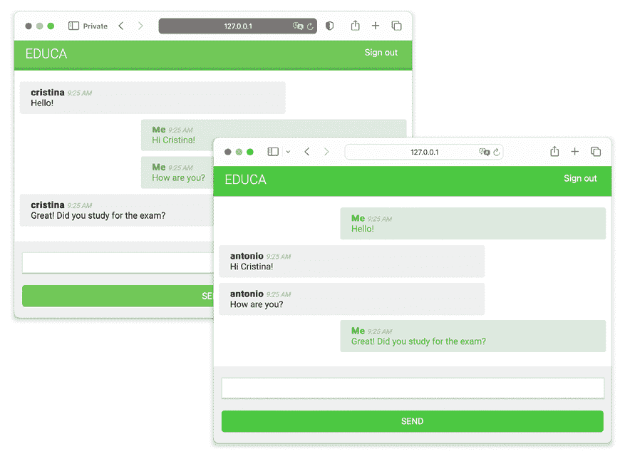

图 16.8：包含来自两个不同用户会话的消息的聊天室页面

太好了！你已经使用 Channels 构建了一个功能性的实时聊天应用。接下来，你将学习如何通过使其完全异步来改进聊天消费者。

# 将消费者修改为完全异步

你实现的 `ChatConsumer` 类继承自同步基类 `WebsocketConsumer`。同步消费者以这种方式操作，即每个请求必须按顺序依次处理。同步消费者便于访问 Django 模型并调用常规同步 I/O 函数。然而，异步消费者由于能够执行非阻塞操作，可以在等待第一个操作完成之前转移到另一个任务，因此性能更佳。它们在处理请求时不需要额外的线程，从而减少了等待时间并增加了同时处理更多用户和请求的能力。

既然你已经使用了异步通道层函数，你可以无缝地重写 `ChatConsumer` 类以使其异步。

编辑 `chat` 应用程序的 `consumers.py` 文件并实现以下更改：

```py
import json
**from** **channels.generic.websocket** **import** **AsyncWebsocketConsumer**
from django.utils import timezone
class ChatConsumer(**AsyncWebsocketConsumer**):
    **async** def connect(self):
        self.user = self.scope['user']
        self.id = self.scope['url_route']['kwargs']['course_id']
        self.room_group_name = 'chat_%s' % self.id
# join room group
**await** **self.channel_layer.group_add(**
            self.room_group_name, self.channel_name
        **)**
# accept connection
**await** self.accept()
    **async** def disconnect(self, close_code):
        # leave room group
**await** **self.channel_layer.group_discard(**
            self.room_group_name, self.channel_name
        **)**
# receive message from WebSocket
**async** def receive(self, text_data):
        text_data_json = json.loads(text_data)
        message = text_data_json['message']
        now = timezone.now()
        # send message to room group
**await** **self.channel_layer.group_send(**
            self.room_group_name,
            {
                'type': 'chat_message',
                'message': message,
                'user': self.user.username,
                'datetime': now.isoformat(),
            }
        **)**
# receive message from room group
**async** def chat_message(self, event):
        # send message to WebSocket
**await** self.send(text_data=json.dumps(event)) 
```

你实现了以下更改：

1.  `ChatConsumer` 消费者现在继承自 `AsyncWebsocketConsumer` 类以实现异步调用。

1.  你将所有方法的定义从 `def` 改为了 `async def`。

1.  你使用 `await` 调用执行 I/O 操作的异步函数。

1.  当你在通道层上调用方法时，不再使用 `async_to_sync()` 辅助函数。

再次用两个不同的浏览器窗口打开 URL `http://127.0.0.1:8000/chat/room/1/` 并验证聊天服务器是否仍然正常工作。聊天服务器现在是完全异步的！

接下来，我们将通过在数据库中存储消息来实现聊天历史。

# 将消息持久化到数据库

让我们通过添加消息持久化来增强聊天应用程序。我们将开发将消息存储在数据库中的功能，这样我们就可以在用户加入聊天室时向他们展示聊天历史。这个特性对于实时应用至关重要，在这些应用中，显示当前和以前生成数据都是必要的。例如，考虑一个股票交易应用：用户登录时，应看到不仅当前的股票价值，还应从股市开盘以来的历史价值。

为了实现聊天历史功能，我们将遵循以下步骤：

1.  我们将创建 Django 模型以存储聊天消息并将其添加到管理站点。

1.  我们将修改 WebSocket 消费者以持久化消息。

1.  我们将检索聊天历史，以便在用户进入聊天室时显示最新消息。

让我们从创建消息模型开始。

## 创建聊天消息模型

编辑 `chat` 应用程序的 `models.py` 文件并添加以下加粗的行：

```py
**from** **django.conf** **import** **settings**
from django.db import models
**class****Message****(models.Model):**
 **user = models.ForeignKey(**
 **settings.AUTH_USER_MODEL,**
 **on_delete=models.PROTECT,**
 **related_name=****'chat_messages'**
 **)**
 **course = models.ForeignKey(**
**'courses.Course'****,**
 **on_delete=models.PROTECT,**
 **related_name=****'chat_messages'**
 **)**
 **content = models.TextField()**
 **sent_on = models.DateTimeField(auto_now_add=****True****)**
**def****__str__****(****self****):**
**return****f'****{self.user}** **on** **{self.course}** **at** **{self.sent_on}****'** 
```

这是持久化聊天消息的数据模型。让我们看看 `Message` 模型的字段：

+   `用户`: 写入消息的`User`对象。这是一个外键字段，因为它指定了一个多对一的关系：一个用户可以发送多条消息，但每条消息都是由单个用户发送的。通过为`on_delete`参数使用`PROTECT`，如果存在相关消息，则无法删除`User`对象。

+   `课程`: 与`Course`对象的关系。每条消息都属于一个课程聊天室。通过为`on_delete`参数使用`PROTECT`，如果存在相关消息，则无法删除`Course`对象。

+   `内容`: 用于存储消息内容的`TextField`。

+   `发送时间`: 用于存储消息对象首次保存的日期和时间的`DateTimeField`。

在 shell 提示符中运行以下命令以生成`chat`应用的数据库迁移：

```py
python manage.py makemigrations chat 
```

你应该得到以下输出：

```py
Migrations for 'chat':
    chat/migrations/0001_initial.py
        - Create model Message 
```

使用以下命令将新创建的迁移应用到你的数据库中：

```py
python manage.py migrate 
```

你将得到一个以以下行结束的输出：

```py
Applying chat.0001_initial... OK 
```

数据库现在与新的模型同步。让我们将`Message`模型添加到管理网站。

## 将消息模型添加到管理网站

编辑`chat`应用的`admin.py`文件，并将`Message`模型注册到管理网站，如下所示。新代码加粗：

```py
from django.contrib import admin
**from** **chat.models** **import** **Message**
**@admin.register(****Message****)**
**class****MessageAdmin****(admin.ModelAdmin):**
**list_display = [****'sent_on'****,** **'user'****,** **'course'****,** **'content'****]**
**list_filter = [****'sent_on'****,** **'course'****]**
**search_fields = [****'content'****]**
**raw_id_fields = [****'user'****,** **'content'****]** 
```

运行开发服务器，并在浏览器中打开`http://127.0.0.1:8000/admin/`。你应该在管理网站上看到**聊天**块和**消息**部分：

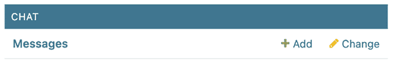

图 16.9：管理网站上的聊天应用和消息部分

我们将继续通过用户发送消息时将消息保存到数据库。

## 在数据库中存储消息

我们将修改 WebSocket 消费者以持久化通过 WebSocket 接收到的每条消息。编辑`chat`应用的`consumers.py`文件，并添加以下加粗的代码：

```py
import json
from channels.generic.websocket import AsyncWebsocketConsumer
from django.utils import timezone
**from** **chat.models** **import** **Message**
class ChatConsumer(AsyncWebsocketConsumer):
    # ...
 **async****def****persist_message****(****self, message****):**
**# send message to WebSocket**
**await** **Message.objects.acreate(**
 **user=self.user, course_id=self.id, content=message**
 **)**
# receive message from WebSocket
async def receive(self, text_data):
        text_data_json = json.loads(text_data)
        message = text_data_json['message']
        now = timezone.now()
        # send message to room group
await self.channel_layer.group_send(
            self.room_group_name,
            {
                'type': 'chat_message',
                'message': message,
                'user': self.user.username,
                'datetime': now.isoformat(),
 },
 )
**# persist message**
**await** **self.persist_message(message)**
    # ... 
```

在此代码中，我们将异步的`persist_message()`方法添加到`ChatConsumer`类中。此方法接受一个`message`参数，并在数据库中创建一个包含给定消息、相关认证的`user`和属于聊天室组的`Course`对象`id`的`Message`对象。由于`ChatConsumer`是完全异步的，我们使用`acreate()` QuerySet 方法，这是`create()`的异步版本。你可以在[`docs.djangoproject.com/en/5.0/topics/db/queries/#asynchronous-queries`](https://docs.djangoproject.com/en/5.0/topics/db/queries/#asynchronous-queries)了解更多关于如何使用 Django ORM 编写异步查询的信息。

我们在消费者通过 WebSocket 接收消息时执行的`receive()`方法中异步调用`persist_message()`方法。

运行开发服务器，并在浏览器中打开`http://127.0.0.1:8000/chat/room/1/`，将`1`替换为数据库中现有课程的`id`。使用已登录并注册该课程的用户，写一条消息并发送。

然后，在隐身模式下打开第二个浏览器窗口，以防止使用相同的会话。使用不同的用户登录，该用户也注册了相同的课程，并发送一些消息。

*图 16.10* 展示了两个不同用户发送的消息示例：

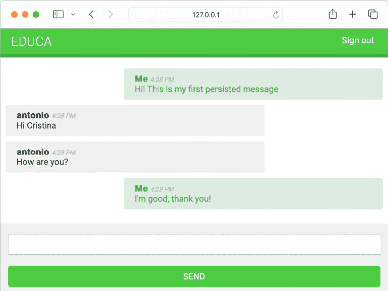

图 16.10：显示两个不同用户发送的消息的聊天室示例

在您的浏览器中打开`http://127.0.0.1:8000/admin/chat/message/`。发送的消息应出现在管理网站上，如图 16.11 所示：

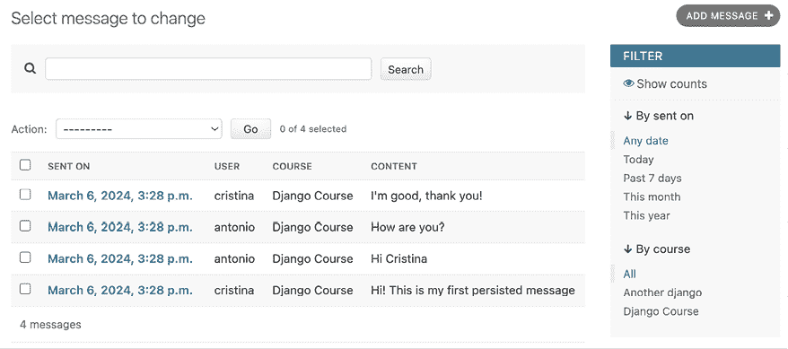

图 16.11：数据库中存储的消息的行政列表显示视图

所有消息现在都已持久化存储在数据库中。

注意，消息可能包含恶意代码，例如 JavaScript 片段。在我们的模板中，我们不将消息标记为安全，以提供对恶意内容的初步保护。然而，为了进一步增强安全性，考虑在将消息存储到数据库之前对其进行清理。清理内容的一个可靠选项是`nh3`包。您可以在[`nh3.readthedocs.io/en/latest/`](https://nh3.readthedocs.io/en/latest/)了解更多关于`nh3`的信息。此外，`django-nh3`是一个 Django 集成，它提供了自定义的`nh3`模型字段和表单字段。更多信息可在[`github.com/marksweb/django-nh3`](https://github.com/marksweb/django-nh3)找到。

现在您已经将完整的聊天历史存储在数据库中，让我们学习如何在用户加入聊天室时向他们展示聊天历史中的最新消息。

## 显示聊天历史

当用户加入课程聊天室时，我们将显示聊天历史的最新五条消息。这将确保用户能够立即获得正在进行对话的上下文。

编辑`chat`应用程序的`views.py`文件，并在`course_chat_room`视图中添加以下加粗的代码：

```py
@login_required
def course_chat_room(request, course_id):
    try:
        # retrieve course with given id joined by the current user
        course = request.user.courses_joined.get(id=course_id)
    except Course.DoesNotExist:
        # user is not a student of the course or course does not exist
return HttpResponseForbidden()
**# retrieve chat history**
 **latest_messages = course.chat_messages.select_related(**
**'user'**
**).order_by(****'-id'****)[:****5****]**
 **latest_messages =** **reversed****(latest_messages)**
return render(
        request,
        'chat/room.html',
        {'course': course**,** **'latest_messages'****: latest_messages**}
    ) 
```

我们检索与课程相关的聊天消息，并使用`select_related()`在同一查询中获取相关用户。这将防止在访问用户名以显示在每个消息旁边时生成额外的 SQL 查询。Django 的 ORM 不支持负索引，所以我们以倒序检索前五条消息，并利用`reversed()`函数将它们重新排序成时间顺序。

现在，我们将聊天历史添加到聊天室模板中。编辑`chat/room.html`模板，并添加以下加粗的行：

```py
# ...

  <div id="chat">
 ****
**<****div****class****=****"****message meother"****>**
**<****strong****>****{{ message.user.username }}****</****strong****>**
**<****span****class****=****"date"****>**
 **{{ message.sent_on|date:"Y.m.d H:i A" }}**
**</****span****>**
**<****br****>**
 **{{ message.content }}**
**</****div****>**
 ****
</div>
<div id="chat-input">
<input id="chat-message-input" type="text">
<input id="chat-message-submit" type="submit" value="Send">
</div>

# ... 
```

在您的浏览器中打开`http://127.0.0.1:8000/chat/room/1/`，将`1`替换为数据库中现有课程的`id`。您现在应该看到最新消息，如图 16.12 所示：

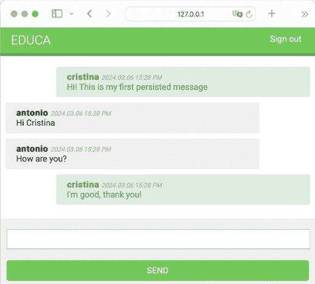

图 16.12：聊天室最初显示最新消息

用户现在可以在加入聊天室后看到最新的消息。接下来，我们将在菜单中添加一个链接，以便用户可以进入课程聊天室。

# 将聊天应用程序集成到现有视图中

聊天服务器现已完全实现，注册课程的学生可以相互交流。让我们为每个课程添加一个学生加入聊天室的超链接。

编辑 `students/course/detail.html` 模板中的 `students` 应用程序，并在 `<div class="contents">` 元素的底部添加以下 `<h3>` HTML 元素代码：

```py
<div class="contents">
  ...
**<****h3****>**
**<****a****href****=****"">**
 **Course chat room**
**</****a****>**
**</****h3****>**
</div> 
```

打开浏览器并访问学生已注册的任何课程以查看课程内容。现在侧边栏将包含一个指向课程聊天室的 **课程聊天室** 链接。如果您点击它，您将进入聊天室：

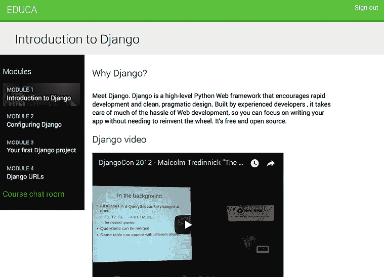

图 16.13：课程详情页面，包括指向课程聊天室的链接

恭喜！您已成功使用 Django Channels 构建了您的第一个异步应用程序。

# 摘要

在本章中，您学习了如何使用 Channels 创建聊天服务器。您实现了 WebSocket 消费者和客户端。通过启用通过 Redis 的通道层进行通信，并将消费者修改为完全异步，您提高了应用程序的响应性和可扩展性。此外，您实现了聊天消息持久化，提供了稳健且用户友好的体验，并随着时间的推移维护用户的聊天历史。您在本章中学到的技能将帮助您在未来的任何异步实时功能实现中。

下一章将教您如何使用 NGINX、uWSGI 和 Daphne 以及 Docker Compose 为您的 Django 项目构建生产环境。您还将学习如何实现跨整个应用程序的请求/响应处理的自定义中间件，以及如何开发自定义管理命令，这些命令使您能够自动化任务并通过命令行执行它们。

# 其他资源

以下资源提供了与本章涵盖主题相关的额外信息：

+   本章源代码：[`github.com/PacktPublishing/Django-5-by-example/tree/main/Chapter16`](https://github.com/PacktPublishing/Django-5-by-example/tree/main/Chapter16)

+   ASGI 简介：[`asgi.readthedocs.io/en/latest/introduction.html`](https://asgi.readthedocs.io/en/latest/introduction.html)

+   Django 对异步视图的支持：[`docs.djangoproject.com/en/5.0/topics/async/`](https://docs.djangoproject.com/en/5.0/topics/async/)

+   Django 对异步类视图的支持：[`docs.djangoproject.com/en/5.0/topics/class-based-views/#async-class-based-views`](https://docs.djangoproject.com/en/5.0/topics/class-based-views/#async-class-based-views)

+   Daphne ASGI 服务器：[`github.com/django/daphne`](https://github.com/django/daphne)

+   Django Channels 文档：[`channels.readthedocs.io/`](https://channels.readthedocs.io/)

+   使用 ASGI 部署 Django：[`docs.djangoproject.com/en/5.0/howto/deployment/asgi/`](https://docs.djangoproject.com/en/5.0/howto/deployment/asgi/)

+   WebSocket 简介：[`en.wikipedia.org/wiki/WebSocket`](https://en.wikipedia.org/wiki/WebSocket).

+   `json_script` 模板过滤器使用：[`docs.djangoproject.com/en/5.0/ref/templates/builtins/#json-script`](https://docs.djangoproject.com/en/5.0/ref/templates/builtins/#json-script)

+   Django ORM 异步查询：[`docs.djangoproject.com/en/5.0/topics/db/queries/#asynchronous-queries`](https://docs.djangoproject.com/en/5.0/topics/db/queries/#asynchronous-queries)

+   `nh3` 文档：[`nh3.readthedocs.io/en/latest/`](https://nh3.readthedocs.io/en/latest/)

+   `django-nh3` 项目：[`github.com/marksweb/django-nh3`](https://github.com/marksweb/django-nh3)
