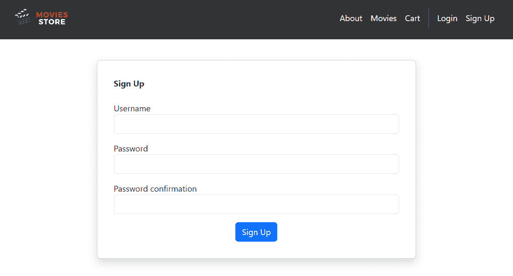

# <st c="0">1</st>

# <st c="2">安装 Python 和 Django，并介绍电影商店应用程序</st>

<st c="76">欢迎来到</st> *<st c="88">《Django 5 快速入门》</st>*<st c="114">！本书专注于关键任务和概念，以帮助您快速学习和构建</st> **<st c="192">Django</st>** <st c="198">应用程序。</st> <st c="221">本书面向那些不需要 Django 的所有细节，只需了解真正需要知道的部分。</st> <st c="345">本书结束时，您将能够自信地创建自己的</st> <st c="413">Django 项目。</st>

<st c="429">那么，Django 是什么呢？</st> <st c="449">Django</st> <st c="455">是一个免费的、开源的 Web 框架，用于构建现代</st> **<st c="513">Python</st>** <st c="519">Web 应用程序。</st> <st c="538">Django 通过抽象化构建网站时涉及的大量重复性挑战，如连接数据库、处理安全、启用用户认证、创建 URL 路由、通过模板和表单在页面上显示内容、支持多个数据库后端以及设置管理界面，帮助您快速构建 Web 应用程序。</st>

<st c="899">这种减少重复性任务的做法使得开发者能够专注于构建 Web 应用程序的功能，而不是为标准 Web 应用程序功能重新发明轮子。</st> <st c="1060">。</st>

<st c="1082">Django 是最受欢迎的框架之一，被像</st> *<st c="1183">Instagram</st>*<st c="1192">、</st> *<st c="1194">Pinterest</st>*<st c="1203">、</st> *<st c="1205">Mozilla</st>*<st c="1212">和</st> *<st c="1218">国家地理</st>*<st c="1237">这样的知名公司所使用。</st> <st c="1299">它也足够简单，可以用于初创公司和构建个人项目。</st>

<st c="1317">还有其他流行的框架，例如 Python 中的 Flask 和 JavaScript 中的 Express（有关 Express 的更多信息，请参阅 Greg Lim 的《<st c="1442">Node.js、Express 与 MongoDB 开发入门</st>》：<st c="1490">[`www.amazon.com/dp/B07TWDNMHJ/`](https://www.amazon.com/dp/B07TWDNMHJ/)）。</st> <st c="1541">。</st> <st c="1545">然而，这些框架只为简单的 Web 页面提供所需的最小功能，开发者必须进行更多基础工作，例如自行安装和配置第三方包以实现基本的网站功能。</st> <st c="1771">。</st>

<st c="1793">在本章中，我们将熟悉我们将要构建的应用程序，使用 Django 5，并通过安装和设置所需的一切来为开发项目做好准备。</st> <st c="1988">本章结束时，您将成功创建自己的</st> <st c="2055">开发环境。</st>

<st c="2079">在本章中，我们将介绍以下主题：</st> <st c="2121">。</st>

+   <st c="2138">介绍和</st> <st c="2155">安装 Python</st>

+   <st c="2172">介绍和</st> <st c="2189">安装 Django</st>

+   <st c="2206">创建和运行一个</st> <st c="2230">Django 项目</st>

+   <st c="2244">理解电影</st> <st c="2270">存储应用程序</st>

+   <st c="2287">介绍 Django</st> <st c="2307">MVT 架构</st>

# <st c="2323">技术要求</st>

<st c="2346">在本章中，我们将使用</st> **<st c="2376">Python 3.10+</st>**<st c="2388">。</st>

<st c="2389">本章的代码位于</st> <st c="2427">以下位置</st> [<st c="2430">https://github.com/PacktPublishing/Django-5-for-the-Impatient-Second-Edition/tree/main/Chapter01/moviesstore</st>](https://github.com/PacktPublishing/Django-5-for-the-Impatient-Second-Edition/tree/main/Chapter01/moviesstore)<st c="2538">。</st>

<st c="2539">本章的 CiA 视频可以在</st> <st c="2584">以下位置找到</st> [<st c="2587">https://packt.link/ygUpr</st>](https://packt.link/ygUpr)

# <st c="2611">介绍和安装 Python</st>

<st c="2645">Python 是一种高级编程语言（</st>[<st c="2691">https://www.python.org/</st>](https://www.python.org/)<st c="2715">），由 Guido</st> <st c="2754">van Rossum 在 20 世纪 80 年代末期创建。</st> <st c="2766">Python 的名字来源于创建者对英国喜剧团体 Monty Python 的喜爱，而不是像人们普遍认为的那样是“蛇”。</st> <st c="2816">The name Python comes from the creator’s affection</st> <st c="2816">for the British comedy group Monty Python and not the “snake,” as is</st> <st c="2886">commonly believed.</st>

<st c="2904">Python 拥有开源许可，这意味着开发者可以免费修改、使用和重新分发其代码，无需支付</st> <st c="3035">原始作者的费用。</st>

<st c="3051">Python 被描述为一种友好且易于学习的编程语言。</st> <st c="3130">Python 可以用于开发各种应用程序，包括网站开发、数据分析、人工智能、科学计算</st> <st c="3279">以及自动化。</st>

<st c="3294">目前，让我们</st> <st c="3310">检查是否已安装 Python，以及安装的版本</st> <st c="3374">是什么。</st>

<st c="3382">如果您使用的是 Mac，请打开您的终端。</st> <st c="3427">如果您使用的是 Windows，请打开命令提示符。</st> <st c="3474">为了方便起见，我们将把终端和命令提示符统称为</st> *<st c="3548">终端</st> <st c="3556">全书。</st>

<st c="3577">为了使用 Django 5，我们需要</st> <st c="3594">检查是否至少安装了 Python 3.10。</st> <st c="3663">要这样做，请转到您的终端并运行以下命令：</st> <st c="3705">以下命令：</st>

+   <st c="3724">对于 macOS，</st> <st c="3736">运行以下命令：</st>

    ```py
    <st c="3745">python3 --version</st>
    ```

+   <st c="3763">对于 Windows，</st> <st c="3777">运行以下命令：</st>

    ```py
    <st c="3786">python --version</st>
    ```

<st c="3803">这显示了您已安装的 Python 版本。</st> <st c="3857">请确保版本至少为</st> *<st c="3896">3.10</st>*<st c="3900">。如果不是，请访问</st> [<st c="3960">https://www.python.org/downloads/</st>](https://www.python.org/downloads/) <st c="3993">并安装适用于您的操作系统的版本。</st> <st c="4034">对于 Windows，您必须选择</st> **<st c="4067">将 python.exe 添加到 PATH</st>** <st c="4089">选项（以确保可以从命令提示符或</st> *<st c="4196">终端</st>*<st c="4204">中的任何目录访问 Python 解释器），如图</st> *<st c="4220">图 1</st>**<st c="4228">.1</st>*<st c="4230">:</st>


<st c="4687">图 1.1 – 在 Windows 上安装 Python</st>

<st c="4728">安装后，再次运行该命令以检查已安装的 Python 版本。</st>

<st c="4816">输出应反映 Python 的最新版本，例如 Python 3.12.2（撰写本文时），如图</st> *<st c="4933">图 1</st>**<st c="4941">.2</st>*<st c="4943">:</st>


<st c="5077">图 1.2 – 检查 Windows 上的 Python 版本</st>

<st c="5128">既然我们已经安装了 Python</st> <st c="5152">，接下来我们将介绍并</st> <st c="5197">安装 Django。</st>

# <st c="5215">介绍和安装 Django</st>

<st c="5249">Django 是一个高级</st> <st c="5273">Python Web 框架，它鼓励快速开发和简洁、实用的设计（</st>[<st c="5357">https://www.djangoproject.com/</st>](https://www.djangoproject.com/)<st c="5388">）。</st> <st c="5392">Django 使构建更好的 Web 应用更加快速，并且代码更少。</st>

<st c="5472">安装 Django 有几种方法；在这本书中，我们将使用</st> `<st c="5527">pip</st>` <st c="5530">来安装 Django。</st> `<st c="5682">pip</st>` <st c="5685">如果您从</st> [<st c="5743">https://www.python.org/</st>](https://www.python.org/)<st c="5766">.</st>

<st c="5767">首先，通过转到终端并运行以下命令来检查您是否已安装</st> `<st c="5798">pip</st>` <st c="5801">：</st>

+   <st c="5872">对于 macOS，</st> <st c="5884">运行以下命令：</st>

    ```py
    <st c="5893">pip3</st>
    ```

+   <st c="5898">对于 Windows，</st> <st c="5912">运行以下命令：</st>

    ```py
    <st c="5921">pip</st>
    ```

<st c="5925">如果您已安装</st> `<st c="5938">pip</st>` <st c="5941">，输出应显示一个</st> `<st c="5989">pip</st>` <st c="5992">命令列表，如图</st> *<st c="6015">图 1</st>**<st c="6023">.3</st>*<st c="6025">:</st>


<st c="6164">图 1.3 – 检查 Windows 上是否已安装 pip</st>

接下来，要安装 Django，运行以下命令：<st c="6221">Next, to install Django, run the</st> <st c="6255">following commands:</st>

+   对于 macOS，<st c="6274">For macOS,</st> <st c="6286">run this:</st>

    ```py
    <st c="6295">pip3 install django==5.0</st>
    ```

+   对于 Windows，<st c="6320">For Windows,</st> <st c="6334">run this:</st>

    ```py
    <st c="6343">pip install django==5.0</st>
    ```

上述命令 <st c="6367">The preceding command</st> <st c="6389">will retrieve the Django 5.0 code version and install it on your machine.</st> <st c="6464">Note that there may be newer versions available when you’re reading this book.</st> <st c="6543">However, we recommend continuing to use Django 5.0 to ensure that the code in this book will function correctly.</st> <st c="6656">After installation, close and reopen</st> <st c="6693">your Terminal.</st>

要检查您是否已安装 Django，运行以下命令。<st c="6707">To check whether you have installed Django, run the</st> <st c="6760">following commands.</st>

+   对于 macOS，<st c="6779">For macOS,</st> <st c="6791">run this:</st>

    ```py
    <st c="6800">python3 -m django</st>
    ```

+   对于 Windows，<st c="6818">For Windows,</st> <st c="6832">run this:</st>

    ```py
    <st c="6841">python -m django</st>
    ```

现在，输出将显示你可以使用的所有 Django 命令，如图 <st c="6938">图 1</st>**<st c="6946">.4</st>*<st c="6948">：</st>


图 1.4 – macOS 上的 Django 模块命令 <st c="7513">Figure 1.4 – The Django module commands on macOS</st>

在本书的过程中，你将逐步被介绍一些先前的命令。<st c="7561">Over the course of the</st> <st c="7584">book, you will progressively be introduced to some of the</st> <st c="7643">preceding commands.</st>

注意 <st c="7662">Note

通常也使用 **<st c="7667">虚拟环境</st>** <st c="7693">（例如，</st> **<st c="7727">venv</st>** <st c="7731">模块）来管理您的 Python 和 Django</st> <st c="7772">项目及其依赖关系。</st> <st c="7800">目前，我们将不使用 venv 来快速开始 Django。</st> <st c="7864">我们将在本书末尾学习如何使用和配置 venv。</st>

我们已经有了创建 Django 项目所需的所有工具。<st c="7932">We have all the tools we need to create a Django project.</st> <st c="7991">Now, let’s move on to</st> <st c="8013">doing that.</st>

# 创建和运行 Django 项目 <st c="8024">Creating and running a Django project</st>

现在我们已经安装了 Django，我们准备好创建我们的 Django 项目。<st c="8062">Now that we have Django</st> <st c="8086">installed, we are ready to create our</st> <st c="8125">Django project.</st>

有几种方法可以创建 Django 项目。<st c="8140">There are several ways to</st> <st c="8166">create Django projects.</st> <st c="8191">In this book, we will use</st> `<st c="8217">django-admin</st>`<st c="8229">.</st> **<st c="8231">django-admin</st>** <st c="8243">是 Django 的</st> <st c="8256">命令行实用程序，用于管理任务。</st> <st c="8303">它</st> <st c="8305">提供了各种命令，帮助您创建、管理、交互 Django 项目、应用程序和其他</st> <st c="8419">相关组件。</st>

在终端中，导航到您想要创建项目的文件夹，并运行以下命令：<st c="8438">In the Terminal, navigate to the folder where you want to create your project and run the</st> <st c="8529">following command:</st>

```py
 django-admin startproject moviesstore
```

<st c="8585">这将创建一个</st> `<st c="8605">moviesstore</st>` <st c="8616">文件夹在你的当前目录中。</st> <st c="8651">这个文件夹包含我们的 Django 应用程序代码。</st> <st c="8701">我们将在稍后讨论其内容。</st> <st c="8737">现在，让我们在我们的 Django 本地</st> <st c="8794">Web 服务器上运行我们的第一个网站。</st>

<st c="8805">在终端中，运行</st> `<st c="8831">cd</st>` <st c="8833">命令以进入</st> <st c="8850">创建的文件夹：</st>

```py
 cd moviesstore
```

<st c="8889">然后，运行以下命令：</st>

+   <st c="8922">对于 macOS，</st> <st c="8934">运行以下命令：</st>

    ```py
    <st c="8943">python3 manage.py runserver</st>
    ```

+   <st c="8971">对于 Windows，</st> <st c="8985">运行以下命令：</st>

    ```py
    <st c="8994">python manage.py runserver</st>
    ```

<st c="9021">当你运行上述命令时，你将在你的机器上启动本地 Web 服务器（用于本地开发目的）。</st> <st c="9145">将会有一个 URL 链接——</st> `<st c="9172">http://127.0.0.1:8000/</st>` <st c="9194">(相当于</st> `<st c="9210">http://localhost:8000</st>`<st c="9231">)。</st> <st c="9235">在浏览器中打开此链接，你将看到默认的着陆页面，如图</st> *<st c="9319">图 1</st>**<st c="9327">.5</st>*<st c="9329">所示：</st>


<st c="9780">图 1.5 – Django 项目的着陆页面</st>

<st c="9831">这意味着</st> <st c="9843">你的本地 Web 服务器正在运行并服务着陆页面。</st> <st c="9904">有时，你需要停止服务器以运行其他 Python 命令。</st> <st c="9911">要停止本地服务器，请在</st> *<st c="10026">Ctrl</st>* <st c="10030">+</st> *<st c="10033">C</st>* <st c="10034">在</st> <st c="10038">终端中按下。</st>

<st c="10051">我们已经成功执行了我们的</st> <st c="10067">第一个 Django 项目。</st> <st c="10103">现在，是时候介绍本书中将开发的程序了。</st>

# <st c="10177">理解电影商店应用程序</st>

<st c="10220">在编程文献中，使用运行示例是一种常见的做法。</st> <st c="10306">运行示例</st> <st c="10326">作为说明方法论、过程、工具或技术原理的手段。</st> <st c="10420">在这本书中，我们将定义一个</st> *<st c="10451">电影商店</st>* <st c="10463">运行示例。</st> <st c="10481">我们将全书回顾这个运行示例，以实际方式解释许多 Django 概念和元素。</st>

<st c="10609">“</st> *<st c="10614">电影商店</st>* ” <st c="10626">将是一个基于 Web 的平台，用户可以访问有关电影的信息，并可以下订单来</st> <st c="10724">购买它们。</st>

<st c="10738">现在，让我们概述这个特定应用程序的应用范围：</st> <st c="10791">。</st>

+   **主页**将展示一个**欢迎信息**。

+   **关于页面**将提供关于**电影商店**的详细信息。

+   **电影页面**将展示可用的电影信息，并包括一个按名称搜索电影的过滤器。此外，用户可以点击特定的电影来查看其详细信息并**发表评论**。

+   **购物车页面**将展示添加到购物车中的电影以及需要支付的总价。<st c="11208">用户</st>还可以从购物车中删除电影并继续购买。

+   **注册页面**将提供一个允许用户**注册账户**的表单。

+   **登录页面**将提供一个允许用户**登录应用程序**的表单。

+   **订单页面**将显示已登录用户**下过的订单**。

+   **管理员面板**将包括管理商店信息的部分，包括创建、更新、删除和**列出信息**。

**电影商店**将使用 Django（Python）、SQLite 数据库和 Bootstrap（一个 CSS 框架）开发。关于这些组件的更多细节将在接下来的章节中介绍。

在**图 1.6**中，你可以找到一个概述应用程序范围和设计的类图。<st c="11934">用户</st>类展示了其关联的数据（例如 id、用户名、电子邮件和密码），并且能够**下订单**。每个**订单**由一个或多个**商品**组成，这些商品与单个**电影**相关联。每个**电影**将拥有其各自的数据（包括 id、名称、价格、描述和图片）。最后，**用户**有创建**评论**为**电影**的能力。


<st c="12664">图 1.6 – 电影商店类图</st>

<st c="12707">本书不会深入探讨类图的复杂性；因此，我们不会详细说明图中的额外细节（您可以参考以下链接获取有关类图的更多信息：</st> [<st c="12917">https://www.visual-paradigm.com/guide/uml-unified-modeling-language/uml-class-diagram-tutorial/</st>](https://www.visual-paradigm.com/guide/uml-unified-modeling-language/uml-class-diagram-tutorial/)<st c="13012">）。</st> <st c="13016">随着您阅读本书的深入，您会注意到代码与这张图之间的关联。</st> <st c="13111">作为一份蓝图，这张图指导着我们应用程序的构建。</st>

<st c="13191">注意</st>

<st c="13196">在开始编码之前创建类图有助于理解应用程序的范围并识别关键数据点。</st> <st c="13330">此外，它有助于理解应用程序中各个元素之间的相互关系。</st> <st c="13437">此图可以与团队成员或同事分享以获取反馈，并根据需要做出调整。</st> <st c="13549">由于其作为图的特点，修改可以迅速实施。</st> <st c="13623">请查看书中以下陈述</st> *<st c="13790">《构建微服务》</st> * <st c="13812">由</st> *<st c="13816">纽曼</st> *<st c="13822">，</st> *<st c="13824">S.</st>* <st c="13826">（2015）:</st> “</st>*<st c="13836">我倾向于在变更成本和错误成本尽可能低的地方进行大量思考：</st>* *<st c="13957">白板。</st>*<st c="13972">”</st>

<st c="13974">基于之前的范围，我们将构建一个</st> *<st c="14019">电影商店</st> * <st c="14031">应用程序，允许用户查看和搜索电影，如图 *<st c="14101">图 1</st>**<st c="14109">.7</st>*<st c="14111">：</st>


<st c="14189">图 1.7 – 带搜索功能的电影页面</st>

<st c="14243">用户将能够注册，如图 *<st c="14287">图 1</st>**<st c="14295">.8</st>*<st c="14297">：</st>



<st c="14399">图 1.8 – 注册页面</st>

<st c="14428">用户将能够</st> <st c="14447">登录，将电影添加到购物车，并进行购买，如图 *<st c="14515">图 1</st>**<st c="14523">.9</st>*<st c="14525">：</st>


<st c="14692">图 1.9 – 购物车页面</st>

<st c="14727">用户</st> <st c="14733">还将能够列出、创建、编辑和删除电影评论，如图 <st c="14813">图 1</st>**<st c="14821">.10</st>**<st c="14824"> 所示：</st>


<st c="15002">图 1.10 – 一个带有其评论的具体电影页面</st>

<st c="15054">本书中还将开发并解释许多其他功能。</st> <st c="15081">现在，让我们看看我们将用于构建 *<st c="15192">电影</st> * *<st c="15199">商店</st> * <st c="15204">应用程序</st> 的架构。</st>

# <st c="15217">介绍 Django MVT 架构</st>

<st c="15257">设计和管理网络应用程序有各种方法和途径。</st> <st c="15342">其中一种方法是将所有代码合并到一个文件中，以构建整个网络应用程序。</st> <st c="15377">然而，在包含数千行代码的此类文件中查找错误可能极具挑战性。</st> <st c="15447">另一种策略是将代码分散到不同的文件和目录中。</st> <st c="15567">此外，一些方法将应用程序分割成多个较小的应用程序，这些应用程序分散在多个服务器上，尽管管理这些服务器的分布也带来了一组自己的挑战。</st> <st c="15655">此外，一些方法将应用程序分割成多个较小的应用程序，这些应用程序分散在多个服务器上，尽管管理这些服务器的分布也带来了一组自己的挑战。</st> <st c="15850">管理这些服务器的分布也带来了一组自己的挑战。</st>

<st c="15864">有效地组织代码会带来挑战。</st> <st c="15919">这就是为什么开发人员和计算机科学家创建了软件架构模式。</st> **<st c="16012">软件架构模式</st>** <st c="16043">提供了结构化框架或布局来解决常见的软件设计问题。</st> <st c="16125">通过利用这些模式，初创公司和经验不足的开发者可以避免在每个新项目中重新发明解决方案。</st> <st c="16249">存在各种架构模式，包括**<st c="16297">模型-视图-控制器</st>** <st c="16318">(**<st c="16320">MVC</st>**<st c="16323">)**，**<st c="16327">模型-视图-模板</st>** <st c="16346">(**<st c="16348">MVT</st>**<st c="16351">)**，层、面向服务、和微服务。</st> <st c="16400">每种模式都有自己的</st> <st c="16428">优缺点。</st> <st c="16454">许多</st> <st c="16458">框架，如 Django，在构建其应用程序时遵循特定的模式。</st>

<st c="16550">在 Django 的情况下，Django 是基于 MVT 模式的。</st> <st c="16583">这种模式与 MVC 类似，但在每个组件的责任上有所不同：</st>

+   **<st c="16709">模型</st>**<st c="16716">：模型表示</st> <st c="16739">数据结构。</st> <st c="16760">在 Django 中，模型是定义数据结构和它与数据库交互方式的 Python 类。</st> <st c="16875">模型处理</st> <st c="16888">查询数据库、执行</st> **<st c="16935">CRUD</st>** <st c="16939">（</st>**<st c="16941">创建、读取、更新、删除</st>**<st c="16969">）操作以及执行数据验证等任务。</st> <st c="17015">在 *<st c="17034">电影商店</st>** <st c="17046">应用程序的情况下，*<st c="17052">电影</st>**<st c="17057">、*<st c="17059">评论</st>**<st c="17065">、*<st c="17067">订单</st>** <st c="17072">以及我们类图中的其他类将被编码为</st> <st c="17135">Django 模型</st>。</st>

+   **<st c="17149">视图</st>**<st c="17155">：Django 中的视图负责处理用户请求并返回适当的</st> <st c="17244">响应。</st> <st c="17256">视图通常接收来自客户端的 HTTP 请求，使用模型从数据库中获取数据，并渲染模板以生成 HTML 响应。</st> <st c="17400">在 Django 中，视图是接受 HTTP 请求并返回 HTTP 响应的 Python 函数或类。</st> <st c="17502">在 *<st c="17521">电影商店</st>** <st c="17533">应用程序的情况下，我们将创建视图和函数来处理电影、账户和购物车等。</st> <st c="17616">。</st>

+   **<st c="17629">模板</st>**<st c="17639">：模板用于动态生成 HTML。</st> <st c="17652">它们包含应用程序的用户界面，并定义了视图中的数据应该如何显示给用户。</st> <st c="17691">在 *<st c="17825">电影商店</st>** <st c="17837">应用程序的情况下，我们将创建一个允许用户登录的模板，一个列出电影的模板，以及一个显示购物车的模板等。</st> <st c="17967">。</st>

MVT 模式提供了诸如代码分离增强、促进多个团队成员之间的协作、简化错误识别、提高代码重用性和改进可维护性等好处。</st> *<st c="18201">图 1</st>**<st c="18209">.11</st>** <st c="18212">展示了我们将在这本书中开发的 *<st c="18258">电影商店</st>**<st c="18270">的软件架构。</st> <st c="18316">虽然现在可能看起来令人不知所措，但到本书结束时，你将理解这个架构的复杂性。</st> <st c="18435">我们将在最后几章中更深入地探讨架构。</st>


图 1.11 – 电影商店软件架构图

<st c="18986">让我们简要分析</st> <st c="19009">这个</st> <st c="19014">架构：</st>

+   位于左侧的是客户端，它们是我们应用程序的用户，使用移动或桌面设备上的浏览器。</st> <st c="19155">这些客户端通过</st> **<st c="19220">超文本传输协议</st>** <st c="19247">(</st>**<st c="19249">HTTP</st>**<st c="19253">)与应用程序建立连接，为用户提供与我们的</st> <st c="19307">Web 应用程序交互的手段。</st>

+   <st c="19323">在右侧，我们有服务器，它托管我们的</st> <st c="19379">应用程序代码。</st>

+   <st c="19396">所有客户端交互首先传递给一个名为</st> `<st c="19468">urls.py</st>`<st c="19475">的项目级别 URL 文件。</st> 该文件位于名为</st> `<st c="19532">moviesstore/</st>`<st c="19544">的主项目文件夹中。</st> URLs 将在</st> *<st c="19571">第二章</st>*<st c="19580">中探讨。</st> 此项目文件夹还包含一个</st> `<st c="19618">templates/</st>` <st c="19628">文件夹，我们将在此设计一个可重用的基础模板。</st> <st c="19686">基础模板将在</st> *<st c="19721">第三章</st>*<st c="19730">中探讨。</st>

+   <st c="19731">项目级别的 URL 文件将交互传递给应用级别的 URL 文件。</st> <st c="19808">对于这个项目，我们将设计和实现四个 Django 应用——</st> *<st c="19874">主页</st>*<st c="19878">,</st> *<st c="19880">电影</st>*<st c="19886">,</st> *<st c="19888">购物车</st>*<st c="19892">，以及</st> *<st c="19898">账户</st>*<st c="19906">。Django 应用将在</st> *<st c="19940">第二章</st>*<st c="19949">中探讨。</st>

+   <st c="19950">每个应用级别的 URL 文件将交互传递给一个</st> `<st c="20003">views.py</st>` <st c="20011">文件。</st> <st c="20018">视图将在</st> *<st c="20044">第二章</st>*<st c="20053">中探讨。</st>

+   <st c="20054">视图如果需要，会与模型通信，并将信息传递给模板，最终将 HTML、CSS 和 JS 代码作为 HTML、CSS 和 JS 代码发送到客户端。</st> <st c="20208">模板将在</st> *<st c="20238">第二章</st>*<st c="20247">中探讨，而模型将在</st> *<st c="20280">第五章</st>*<st c="20289">中探讨。</st>

<st c="20290">在</st> *<st c="20294">图 1</st>**<st c="20302">.11</st>*<st c="20305">中，</st> **<st c="20311">模型</st>**<st c="20316">，**<st c="20318">视图</st>**<st c="20322">，和</st> **<st c="20328">模板</st>** <st c="20336">层以灰色突出显示，代表了 Django 中常用的架构模式，本书将使用这一模式。</st> <st c="20476">我们</st> <st c="20479">有四个模型对应于我们在类图中定义的类（如前所述在</st> *<st c="20578">图 1</st>**<st c="20586">.6</st>*<st c="20588">中所示）。</st> <st c="20592">用户模型没有出现在这个图中，因为我们将会重用内置的 Django</st> <st c="20679">用户模型。</st>

<st c="20690">因此，如前所述，使用 Django 实现 Web 应用有不同的方法。</st> <st c="20801">甚至有不同方式来实现 Django MVT 架构。</st> <st c="20871">在接下来的章节中，我们将看到采用 MVT 架构的优势，如图</st> *<st c="20974">图 1</st>**<st c="20982">.11</st>*<st c="20985">所示。</st>

# <st c="20986">总结</st>

<st c="20994">在本章中，我们学习了如何安装和使用 Python，</st> `<st c="21054">pip</st>`<st c="21057">，以及 Django。</st> <st c="21071">我们还学习了如何创建一个新的 Django 项目并运行 Django 本地 Web 服务器。</st> <st c="21157">然后，我们解释了</st> *<st c="21193">电影商店</st>* <st c="21205">项目的范围。</st> <st c="21215">我们还通过一个类图展示了应用程序数据和其关系。</st> <st c="21303">此外，我们还展示了一个架构图，显示了</st> *<st c="21406">电影商店</st>*<st c="21418">的主要组件和元素。这些图表将作为蓝图，在接下来的章节中用于规范</st> *<st c="21475">电影商店</st>* <st c="21487">项目。</st>

<st c="21521">在下一章中，我们将深入了解 Django 为我们创建的项目文件夹，以便更好地理解它，并创建我们的第一个</st> <st c="21667">Django 应用。</st>
