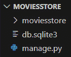
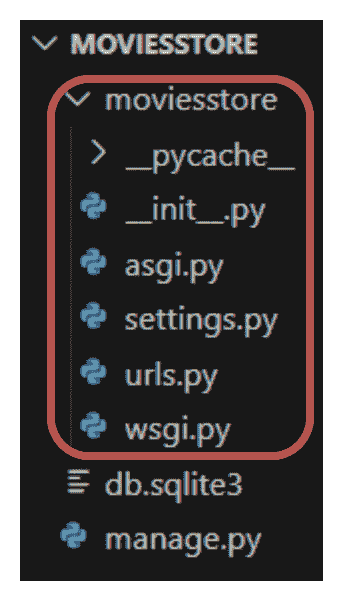
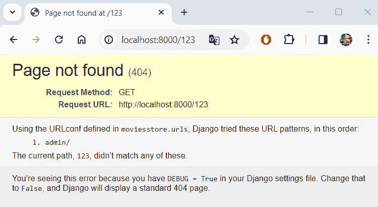
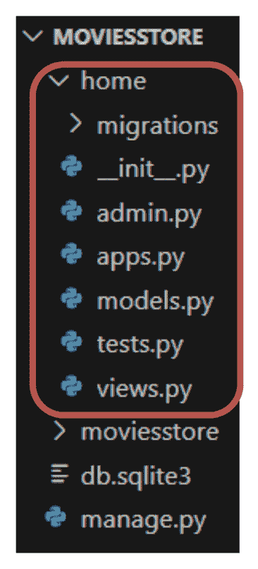
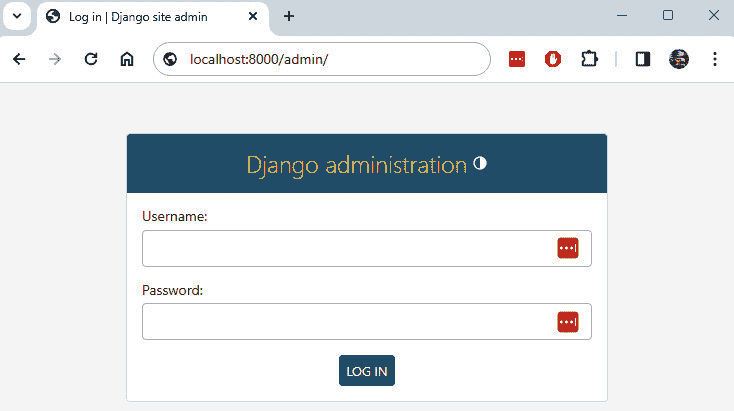
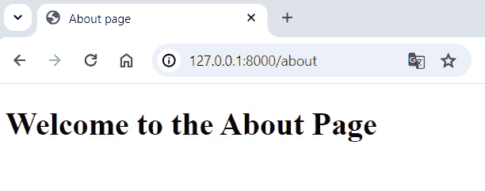

# 第三章：理解项目结构和创建我们的第一个应用

Django 项目包含一个预定义的结构，其中包含一些关键文件夹和文件。在本章中，我们将讨论 Django 项目结构以及如何使用这些文件夹和文件来配置我们的 Web 应用。此外，Django 项目由一个或多个应用组成。我们将学习如何创建一个由“主页”和“关于”部分组成的“主页”应用，以及如何在我们的 Django 项目中注册它。

在本章中，我们将涵盖以下主题：

+   理解项目结构

+   创建我们的第一个应用

+   创建一个主页

+   创建一个关于页面

完成所有这些主题后，您将了解如何创建 Django 应用和 Web 页面。

# 技术要求

在本章中，我们将使用 Python 3.10+。此外，我们将在本书中使用**《Visual Studio (VS) Code》**编辑器，您可以从[`code.visualstudio.com/`](https://code.visualstudio.com/)下载。

本章的代码位于[`github.com/PacktPublishing/Django-5-for-the-Impatient-Second-Edition/tree/main/Chapter02/moviesstore`](https://github.com/PacktPublishing/Django-5-for-the-Impatient-Second-Edition/tree/main/Chapter02/moviesstore)。

本章的 CiA 视频可以在[`packt.link/rzU25`](https://packt.link/rzU25)找到。

# 理解项目结构

让我们看看为我们创建的第一章项目文件，在*《创建和运行 Django 项目》*部分。图 2.1.1 中展示了这些元素：



图 2.1 – MOVIESSTORE 目录结构

让我们了解这些元素中的每一个。

## MOVIESSTORE 文件夹

<st c="1568">正如您</st> <st c="1580">在</st> <st c="1584">*<st c="1587">图 2</st>**<st c="1595">.1</st>*<st c="1597">中看到的，有一个文件夹与我们在 VS Code 中最初打开的文件夹同名 –</st> `<st c="1684">moviesstore</st>`<st c="1695">。 The</st> `<st c="1701">moviesstore</st>` <st c="1712">文件夹包含一组用于配置 Django 项目的文件。</st> *<st c="1777">图 2</st>**<st c="1785">.2</st>* <st c="1787">显示了</st> `<st c="1813">moviesstore</st>` <st c="1824">文件夹的内容：</st>



<st c="1952">图 2.2 – moviesstore 文件夹内容结构</st>

<st c="2005">让我们简要地看看</st> <st c="2027">moviesstore</st> <st c="2035">文件夹下的所有</st> <st c="2055">元素：</st>

+   `<st c="2074">__pycache__</st>`<st c="2086">: 这个文件夹</st> <st c="2100">在生成我们的项目时存储编译后的字节码。</st> <st c="2156">您可以基本上忽略这个文件夹。</st> <st c="2192">它的目的是通过缓存编译代码来使您的项目启动稍微快一点，这些代码可以</st> <st c="2301">被轻松执行。</st>

+   `<st c="2318">__init__.py</st>`<st c="2330">: 这个文件指示 Python 将这个目录视为一个 Python 包。</st> <st c="2422">我们可以忽略</st> <st c="2436">这个文件。</st>

+   `<st c="2446">asgi.py</st>`<st c="2454">: Django 作为一个 Web 框架，需要 Web 服务器来运行。</st> <st c="2519">由于大多数 Web 服务器本身不支持 Python，我们需要一个接口来实现这种通信。</st> <st c="2631">Django 目前支持两个接口 –</st> `<st c="2766">asgi.py</st>` <st c="2773">文件包含一个入口点，用于 ASGI 兼容的 Web 服务器异步地为您</st> <st c="2849">项目提供服务。</st>

+   `<st c="2872">settings.py</st>`<st c="2884">: The</st> `<st c="2891">settings.py</st>` <st c="2902">文件是一个重要的文件，它控制着我们的项目设置。</st> <st c="2967">它包含几个属性；让我们分析一些</st> <st c="3018">它们：</st>

    +   `<st c="3026">BASE_DIR</st>`<st c="3035">: 确定项目</st> <st c="3083">在您的机器上的位置。</st>

    +   `<st c="3095">SECRET_KEY</st>`<st c="3106">: 这是一个特定 Django 项目的密钥。</st> <st c="3163">它用于提供加密签名，应设置为唯一、不可预测的值。</st> <st c="3259">在生产环境中，它应该被一个安全</st> <st c="3326">生成的密钥所替换。</st>

    +   `<st c="3340">DEBUG</st>`<st c="3346">: 我们网站可以运行在调试模式或非调试模式。</st> <st c="3388">在调试模式下，我们可以获得有关错误的详细信息，这在开发我们的应用程序时非常有用。</st> <st c="3497">例如，如果我们尝试在浏览器中运行</st> `<st c="3528">http://localhost:8000/123</st>` <st c="3553">，我们将看到一个</st> **<st c="3584">页面未找到 (404)</st>** <st c="3604">错误（见</st> *<st c="3616">图 2.3</st>*<st c="3626">）：</st>



<st c="4091">图 2.3 – 访问无效的应用程序路由</st>

+   `<st c="4142">INSTALLED_APPS</st>`<st c="4157">: 这个</st> <st c="4164">设置指定了</st> <st c="4186">所有启用在此项目中的 Django 应用程序的列表。</st> <st c="4254">列表中的每个字符串都代表一个 Django 应用的 Python 路径。</st> <st c="4330">默认情况下，Django 包含了几个内置应用程序，例如 admin、auth、contenttypes 和 sessions。</st> <st c="4438">在本章的后面，我们将看到如何创建我们自己的应用程序以及如何将它们包含在这个配置中。</st>

+   `<st c="4553">MIDDLEWARE</st>`<st c="4564">: Django 中的中间件拦截并管理请求和响应处理流程。</st> <st c="4653">列出的中间件由 Django 提供，并处理请求/响应处理的各个方面，包括安全、会话管理、身份验证等。</st>

+   `<st c="4822">ROOT_URLCONF</st>`<st c="4835">: 指定 Django 项目的根 URL 配置的 Python 路径。</st>

+   `<st c="4917">TEMPLATES</st>`<st c="4927">: 定义 Django 模板系统的配置。</st> <st c="4986">它包括有关系统应查找模板源文件和其他特定</st> <st c="5120">模板设置的信息。</st>

+   <st c="5138">在</st> `<st c="5174">settings.py</st>`<st c="5185">》中还有一些其他属性，例如</st> `<st c="5195">DATABASES</st>`<st c="5204">》、《st c="5206">LANGUAGE_CODE</st>`<st c="5219">》和`<st c="5225">TIME_ZONE</st>`<st c="5234">》，但我们专注于前面列表中更重要的属性。</st> <st c="5307">我们将在稍后重新访问此文件，并查看它在开发我们的网站时有多相关。</st>

+   `<st c="5391">urls.py</st>`<st c="5399">: 此文件包含此 Django 项目的 URL 声明。</st> <st c="5467">它可以链接特定的 URL 路径到函数、类或其他 URL 文件以生成响应，或者根据浏览器或 URL 请求渲染页面。</st> <st c="5627">我们将在稍后添加路径到该文件，并更好地理解它是如何工作的。</st>

+   `<st c="5699">wsgi.py</st>`<st c="5707">：此文件包含一个 WSGI 兼容的 Web 服务器用于服务项目的入口点。</st> <st c="5799">默认情况下，当我们使用</st> <st c="5802">`python manage.py runserver`</st> <st c="5839">命令运行服务器时，它使用 WSGI 配置。</st>

## <st c="5910">manage.py</st>

<st c="5920">The</st> `<st c="5925">manage.py</st>` <st c="5934">file</st> <st c="5940">seen</st> <st c="5945">in</st> *<st c="5948">图 2.1</st>**<st c="5956">和</st> *<st c="5963">图 2.2</st>**<st c="5971">是本书中将广泛使用的关键元素。</st> <st c="6046">此文件提供了一种命令行工具，允许您与 Django 项目交互并执行一些管理操作。</st> <st c="6177">例如，我们之前在</st> *<st c="6230">第一章</st>*<st c="6239">的</st> *<st c="6248">创建和运行 Django</st>* *<st c="6278">项目</st>* <st c="6285">部分</st>中运行了以下命令：</st>

```py
 python manage.py runserver
```

<st c="6321">该命令的目的是启动本地 Web 服务器。</st> <st c="6384">我们将稍后展示更多管理</st> <st c="6428">功能，例如创建新应用的一个命令 –</st> `<st c="6474">python</st>` `<st c="6481">manage.py startapp</st>`<st c="6499">。</st>

## <st c="6500">db.sqlite3</st>

<st c="6511">The</st> `<st c="6516">db.sqlite3</st>` <st c="6526">file is the</st> <st c="6538">default SQLite database</st> <st c="6562">file that Django uses for development purposes.</st> `<st c="6840">db.sqlite3</st>` <st c="6850">文件）。</st> <st c="6858">目前我们不会使用此文件；然而，我们将在</st> *<st c="6924">第五章</st>*<st c="6933">中讨论它。</st>

<st c="6934">我们已经了解了 Django 项目结构和其主要元素。</st> <st c="7017">现在，让我们创建我们的第一个</st> <st c="7045">Django 应用。</st>

# <st c="7056">创建我们的第一个应用</st>

<st c="7079">一个</st> **<st c="7082">Django 应用</st>** <st c="7092">是一个包含特定功能或服务于 Django 项目中特定目的的自包含</st> <st c="7113">代码包。</st>

<st c="7223">一个 Django 项目可以包含一个或多个应用，这些应用协同工作以支持一个 Web 应用程序。</st> <st c="7324">Django 使用项目和应用的概念来保持代码整洁</st> <st c="7388">和可读性。</st>

<st c="7401">例如，在一个电影评论网站如</st> *<st c="7446">烂番茄</st>*<st c="7461">上，如图</st> *<st c="7475">图 2</st>**<st c="7483">.4</st>**<st c="7485">所示，我们可以有一个用于列出电影的 app，一个用于列出新闻的 app，一个用于支付的 app，一个用于用户认证的 app，等等：</st>


<st c="9111">图 2.4 – Rotten Tomatoes 网站</st>

<st c="7793">Django 中的应用就像网站的一部分。</st> <st c="7839">你可以用一个单一的应用创建整个网站，但将其拆分成不同的应用，每个应用代表一个</st> <st c="7966">明确的功能。</st>

<st c="7981">我们的</st> *<st c="7986">电影商店</st>* <st c="7998">网站将从一个应用开始。</st> <st c="8029">随着我们的进展，我们将添加更多。</st> <st c="8068">要添加应用，在终端中，通过按</st> *<st c="8128">Cmd</st>*<st c="8131">+</st> *<st c="8134">C</st>*<st c="8135">停止服务器。导航到顶级</st> `<st c="8157">moviesstore</st>` <st c="8168">文件夹（包含</st> `<st c="8203">manage.py</st>` <st c="8212">文件的文件夹）并在终端中运行以下命令：</st>

<st c="8257">对于 macOS，运行以下命令：</st>

```py
 python3 manage.py startapp home
```

<st c="8327">对于 Windows，运行以下命令：</st>

```py
 python manage.py startapp home
```

<st c="8398">将在项目中添加一个新的文件夹，</st> `<st c="8413">home</st>`<st c="8417">（见</st> *<st c="8453">图 2</st>**<st c="8461">.5</st>*<st c="8463">）。</st> <st c="8467">随着我们在本书中的进展，我们将解释</st> <st c="8511">文件夹内的文件。</st>



<st c="8683">图 2.5 – 包含主页应用的 MOVIESSTORE 项目结构</st>

<st c="8753">尽管我们的新</st> `<st c="8771">主页</st>` <st c="8775">应用存在于我们的 Django 项目中，但 Django 不会识别它，直到我们明确添加它。</st> <st c="8865">为此，我们需要在</st> `<st c="8900">settings.py</st>`<st c="8911">中指定它。所以，前往</st> `<st c="8923">/moviesstore/settings.py</st>`<st c="8947">，在</st> `<st c="8955">INSTALLED_APPS</st>`<st c="8969">下，你会看到已经存在六个内置应用</st> <st c="9006">。</st>

<st c="9020">添加应用名称，如下所示高亮显示（每次创建新应用时都应这样做）：</st>

```py
 …
INSTALLED_APPS = [
    'django.contrib.admin',
    'django.contrib.auth',
    'django.contrib.contenttypes',
    'django.contrib.sessions',
    'django.contrib.messages',
    'django.contrib.staticfiles', <st c="9306">'home',</st> ]
…
```

<st c="9317">我们已经成功</st> <st c="9339">创建了我们的第一个应用，并将其包含在我们的 Django 设置项目中。</st> <st c="9409">现在，我们将在该应用内部创建和提供两个页面。</st>

# <st c="9473">创建主页</st>

<st c="9494">在 Django 中创建一个简单的</st> <st c="9512">页面或部分通常涉及</st> <st c="9556">三个步骤：</st>

1.  <st c="9568">配置</st> <st c="9579">一个 URL。</st>

1.  <st c="9585">定义一个视图函数</st> <st c="9609">或类。</st>

1.  <st c="9618">创建</st> <st c="9626">一个模板。</st>

<st c="9637">让我们看看如何应用这些步骤来创建一个简单的“主页”，它将向</st> <st c="9744">最终用户</st> <st c="9749">显示“欢迎”信息。</st>

## <st c="9760">配置 URL</st>

**<st c="9779">Django URL</st>** <st c="9791">(**<st c="9793">统一资源定位符</st>**)是用于将传入的 HTTP 请求映射到处理这些请求的适当视图函数或类的模式。</st> <st c="9824">它们定义了 Django 项目的路由机制，指定了不同 URL 应调用哪些视图。</st> <st c="9942">它们定义了 Django 项目的路由机制，指定了不同 URL 应调用哪些视图。</st>

<st c="10060">位于</st> `<st c="10111">/moviesstore/urls.py</st>` <st c="10131">的主 URL 配置文件目前包含以下代码：</st> <st c="10155">以下代码：</st>

```py
 …
from django.contrib import admin
from django.urls import path
urlpatterns = [
    path('admin/', admin.site.urls),
]
```

<st c="10284">当用户在浏览器中输入 URL（与我们的 Django 应用相关）时，请求首先通过</st> `<st c="10396">/moviesstore/urls.py</st>` <st c="10416">文件，它将尝试匹配</st> `<st c="10450">path</st>` <st c="10454">对象在</st> `<st c="10465">urlpatterns</st>` <st c="10476">中 – 例如，如果用户在浏览器中输入</st> `<st c="10509">http://localhost:8000/admin</st>` <st c="10536">，URL 将匹配</st> `<st c="10578">admin/</st>` <st c="10584">路径。</st> <st c="10591">服务器将随后响应 Django 管理页面（如图**<st c="10660">图 2</st>**<st c="10668">.6**<st c="10670">所示），我们将在稍后探讨：</st>



<st c="10799">图 2.6 – /admin 路由 – 管理页面</st>

<st c="10845">相反，如果用户输入</st> `<st c="10875">localhost:8000/hello</st>`<st c="10895">，Django 将返回一个</st> `<st c="10918">404 not found</st>` <st c="10931">页面，因为</st> <st c="10945">URL 配置文件中没有匹配的路径</st> <st c="10976">。</st>

### <st c="11007">创建主页的路径</st>

<st c="11041">创建页面自定义路径有两种方法：</st> <st c="11056">以下方法：</st>

+   <st c="11096">在项目级别的 URL 文件中创建路径（</st><st c="11144">在</st> `<st c="11148">/moviesstore/urls.py</st>`<st c="11168">）</st>

+   <st c="11170">在应用级别的</st> `<st c="11191">urls.py</st>` <st c="11198">文件中创建路径，该文件定义在应用级别（</st><st c="11231">在</st> `<st c="11235">/home/urls.py</st>`<st c="11248">）</st>

<st c="11251">本书中我们将使用第二种选项，因为它允许我们保持 URL 的分离和有序。</st> <st c="11341">。</st>

<st c="11355">在</st> `<st c="11359">/home/</st>`<st c="11365">中，创建一个名为</st> `<st c="11392">urls.py</st>`<st c="11399">的新文件。此文件将包含与主页应用 URL 相关的路径。</st> <st c="11471">目前，请用以下内容填充它：</st> <st c="11496">以下内容：</st>

```py
 from django.urls import path
from . import views
urlpatterns = [
    path('', views.index, name='home.index'),
]
```

<st c="11619">让我们解释一下</st> `<st c="11638">之前的代码：</st>

+   <st c="11652">我们导入</st> `<st c="11667">path</st>` <st c="11671">函数，该函数用于在 Django 中定义 URL 模式</st> <st c="11719">。</st>

+   <st c="11729">我们导入</st> `<st c="11744">views</st>` <st c="11749">文件。</st> <st c="11756">在下一节中，我们将在</st> `<st c="11798">views</st>` <st c="11829">文件中实现一个</st> `<st c="11824">index</st>` <st c="11829">函数。</st> <st c="11836">该函数将渲染一个包含“</st><st c="11890">欢迎”消息的模板。</st>

+   <st c="11908">我们定义了</st> `<st c="11923">urlpatterns</st>` <st c="11934">的 home 应用。</st> <st c="11953">在这种情况下，在</st> `<st c="11978">urlpatterns</st>` <st c="11989">列表中，我们添加了一个带有</st> <st c="12026">三个参数</st> 的新路径对象：

    +   <st c="12042">第一个参数,</st> `<st c="12063">''</st>`<st c="12065">, 代表 URL 模式本身。</st> <st c="12102">在这种情况下，它是一个空字符串，表示根 URL。</st> <st c="12163">这意味着当访问应用程序的根 URL（</st>`<st c="12229">localhost:8000/</st>`<st c="12245">）时，它将匹配</st> <st c="12263">此路径。</st>

    +   <st c="12273">第二个参数,</st> `<st c="12295">views.index</st>`<st c="12306">, 指的是将处理 HTTP 请求的视图函数。</st> <st c="12371">在这里，</st> `<st c="12377">views.index</st>` <st c="12388">表示</st> `<st c="12408">index</st>` <st c="12413">函数位于</st> `<st c="12430">views</st>` <st c="12435">文件中，负责处理</st> <st c="12471">请求。</st>

    +   <st c="12483">第三个参数,</st> `<st c="12504">name='home.index'</st>`<st c="12521">, 是 URL 模式的名称。</st> <st c="12555">此名称用于唯一标识 URL 模式，并可以在</st> <st c="12635">Django 项目的其他部分中引用，例如模板或其他</st> <st c="12697">URL 模式。</st>

<st c="12710">现在，让我们继续定义</st> `<st c="12744">views.index</st>` <st c="12755">函数代码。</st>

### <st c="12770">定义视图函数</st>

**<st c="12795">Django 视图</st>** <st c="12808">是 Python</st> <st c="12820">函数或类，它们接收网络请求并返回网络响应。</st> <st c="12893">它们包含处理 HTTP 请求并生成适当 HTTP 响应的逻辑，通常是用于在用户</st> <st c="13049">的网页浏览器中渲染的 HTML 内容。</st>

<st c="13061">我们的 home 应用已经包含一个</st> `<st c="13094">views.py</st>` <st c="13102">文件；让我们利用它并做一些简单的修改。</st> <st c="13168">在</st> `<st c="13171">/home/views.py</st>`<st c="13185">中，添加以下</st> <st c="13205">在</st> **<st c="13208">粗体</st>**<st c="13212">中：</st>

```py
 from django.shortcuts import render <st c="13251">def index(request):</st>
 <st c="13270">return render(request, 'home/index.html')</st>
```

<st c="13312">让我们解释一下</st> <st c="13331">之前的代码：</st>

+   <st c="13345">默认情况下，</st> `<st c="13362">views</st>` <st c="13367">文件导入</st> `<st c="13385">render</st>` <st c="13391">函数，该函数用于渲染模板并返回包含</st> `<st c="13473">渲染内容</st>` 的 HTTP 响应。

+   我们定义一个`<index>`函数。该函数接受一个参数，`<request>`，它代表服务器接收到的 HTTP 请求。

+   最后，`<index>`函数返回一个渲染的模板。`<render>`函数将`<request>`作为第一个参数，第二个参数（`<'home/index.html'>`）表示要渲染的模板文件的路径。在下一节中，我们将创建该模板。

我们现在已经将`''`路径与适当的`<views.index>`函数连接起来，但我们缺少`<views.index>`函数和`<home/index.html>`模板之间的连接。所以，让我们实现模板。

### 创建一个模板

**Django 模板**是包含 HTML 和**Django 模板语言**（**DTL**）语法的文本文件，它描述了网页的结构。Django 模板允许你通过在 HTML 标记中插入变量、循环、条件和其他逻辑来动态生成 HTML 内容。

我们的“主页”应用不包括存储模板的位置，所以让我们创建它。在`<home>`中，创建一个`<templates>`文件夹。然后，在`<home/templates>`中，创建一个`<home>`文件夹。

现在，在`<home/templates/home>`中，创建一个新文件，`<index.html>`。这将是我们“主页”的完整 HTML 页面。目前，用以下内容填充它：

```py
 <!DOCTYPE html>
<html>
<head>
  <title>Home page</title>
</head>
<body>
  <h1>Welcome to the Home Page</h1>
</body>
</html>
```

该文件包含一个简单的 HTML 代码，带有“欢迎”消息。

注意

<st c="14928">我们建议将您的应用程序模板存储在以下目录结构下</st> – `<st c="15004">app_name/templates/app_name/my_template.html</st>`<st c="15048">。有时，不同的应用程序可能包含具有相同名称的模板，这可能导致模板解析中的潜在名称冲突。</st> <st c="15187">通过使用之前的策略，您可以在不同的 Django 应用程序中定义具有相同名称的模板，而不会出现任何潜在的</st> <st c="15310">名称冲突。</st>

<st c="15324">我们已经完成了 URL、视图函数和模板之间的连接。</st> <st c="15404">然而，Django</st> <st c="15420">不知道如何使用我们的</st> `<st c="15448">/home/urls.py</st>` <st c="15461">文件。</st> <st c="15468">所以，让我们将此文件连接到我们的主要 URL 配置文件，然后我们将完成</st> <st c="15564">拼图。</st>

### <st c="15575">将项目级 URL 文件与应用程序级 URL 文件连接</st>

<st c="15638">在</st> `<st c="15642">/moviesstore/urls.py</st>`<st c="15662">中，添加以下</st> <st c="15668">在</st> **<st c="15685">粗体</st>**<st c="15689">：</st>

```py
 …
from django.contrib import admin
from django.urls import path<st c="15754">, include</st> urlpatterns = [
    path('admin/', admin.site.urls), <st c="15813">path('', include('home.urls')),</st> ]
```

<st c="15846">让我们解释一下</st> <st c="15864">之前的代码：</st>

+   <st c="15878">我们修改代码以导入</st> `<st c="15917">include</st>` <st c="15924">函数，该函数用于包含来自其他 URL</st> <st c="15980">配置文件的 URL。</st>

+   <st c="16000">我们将一个新的路径对象添加到</st> `<st c="16033">urlpatterns</st>` <st c="16044">列表中。</st> <st c="16051">空字符串</st> `<st c="16069">''</st>`<st c="16071">表示包含来自</st> `<st c="16126">home.urls</st>` <st c="16135">文件》的 URL 的基本 URL。</st>

<st c="16141">现在，保存这些文件，运行服务器，然后返回到</st> `<st c="16196">http://localhost:8000</st>`<st c="16217">；你应该</st> <st c="16231">看到显示的主页（</st>*<st c="16260">图 2</st>**<st c="16269">.7</st>*<st c="16271">）：</st>


<st c="16324">图 2.7 – 主页</st>

<st c="16350">注意</st>

<st c="16355">当我们对文件进行更改并保存时，Django 会观察文件更改并使用它们重新加载服务器。</st> <st c="16467">因此，每次代码更改时，我们不必手动重新启动服务器。</st>

<st c="16556">现在我们的“主页”已经启动并运行，让我们重复这个过程来创建“</st><st c="16646">关于”页面。</st>

# <st c="16659">创建关于页面</st>

<st c="16682">现在我们学习了如何</st> <st c="16710">创建一个简单的页面，让我们重复这个过程</st> <st c="16757">来创建关于页面。</st> <st c="16783">我们将遵循以下</st> <st c="16804">三个步骤：</st>

1.  <st c="16816">配置</st> <st c="16831">关于 URL。</st>

1.  <st c="16841">定义</st> <st c="16853">关于函数。</st>

1.  <st c="16868">创建关于模板。</st>

<st c="16895">让我们开始。</st>

## <st c="16908">配置关于页面的 URL</st>

<st c="16934">在</st> `<st c="16938">/home/urls.py</st>`<st c="16951">中，添加以下路径</st> <st c="16960">（以下内容加粗）</st> **<st c="16979">bold</st>**<st c="16983">：</st>

```py
 from django.urls import path
from . import views
urlpatterns = [
    path('', views.index, name='home.index'),
 <st c="17093">path('about', views.about, name='home.about'),</st> ]
```

<st c="17141">因此，如果 URL 与</st> `<st c="17166">/about</st>` <st c="17172">路径匹配，它将执行</st> `<st c="17199">about</st>` <st c="17204">函数，该函数定义在</st> `<st c="17229">views</st>` <st c="17234">文件中。</st>

## <st c="17240">定义关于函数</st>

<st c="17264">在</st> `<st c="17268">/home/views.py</st>`<st c="17282">中，添加以下内容</st> <st c="17288">（以下内容加粗）</st> **<st c="17305">bold</st>**<st c="17309">：</st>

```py
 from django.shortcuts import render
def index(request):
    return render(request, 'home/index.html') <st c="17410">def about(request):</st>
<st c="17476">about</st> function is similar to the <st c="17509">index</st> function. This function renders the <st c="17551">'home/about.html'</st> template, which will be implemented next.
			<st c="17610">Creating about template</st>
			<st c="17634">Now, in</st> `<st c="17643">/home/templates/home/</st>`<st c="17664">, create a</st> <st c="17675">new file,</st> `<st c="17685">about.html</st>`<st c="17695">. This file contains the HTML for the about page.</st> <st c="17745">For now, fill it in with</st> <st c="17770">the following:</st>

```

<!DOCTYPE html>

<html>

<head>

<title>关于页面</title>

</head>

<body>

<h1>欢迎使用关于页面</h1>

</body>

</html>

```py

			<st c="17906">Save the files, and when you navigate to</st> `<st c="17948">localhost:8000/about</st>`<st c="17968">, it will show the about page (</st>*<st c="17999">Figure 2</st>**<st c="18008">.8</st>*<st c="18010">):</st>
			

			<st c="18090">Figure 2.8 – The about page</st>
			<st c="18117">Note</st>
			<st c="18122">When we executed the command to create the home app, some folders and files were automatically created for us.</st> <st c="18234">For the home app, we won’t use many of them.</st> <st c="18279">So, you can optionally delete the following folders and files to keep your application clean and simple –</st> `<st c="18385">migrations/</st>`<st c="18396">,</st> `<st c="18398">admin.py</st>`<st c="18406">,</st> `<st c="18408">models.py</st>`<st c="18417">,</st> <st c="18419">and</st> `<st c="18423">tests.py</st>`<st c="18431">.</st>
			<st c="18432">We quickly created our second page, “about.” Now, we hope you have a better understanding of how URLs, views, and</st> <st c="18547">templates connect.</st>
			<st c="18565">Summary</st>
			<st c="18573">In this chapter, we discussed the Django project structure.</st> <st c="18634">We analyzed some of the most important project folders, files, and their functionalities.</st> <st c="18724">We saw how a web project can be composed of several applications, and we learned how to create a Django app.</st> <st c="18833">We also learned how URLs, views, and templates connect to create web pages.</st> <st c="18909">We created a couple of pages and loaded them into our local web server.</st> <st c="18981">In the next chapter, we will see how to improve the look and feel of our Django applications by using base templates and a</st> <st c="19104">CSS framework.</st>

```
