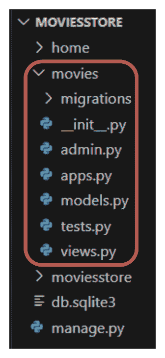
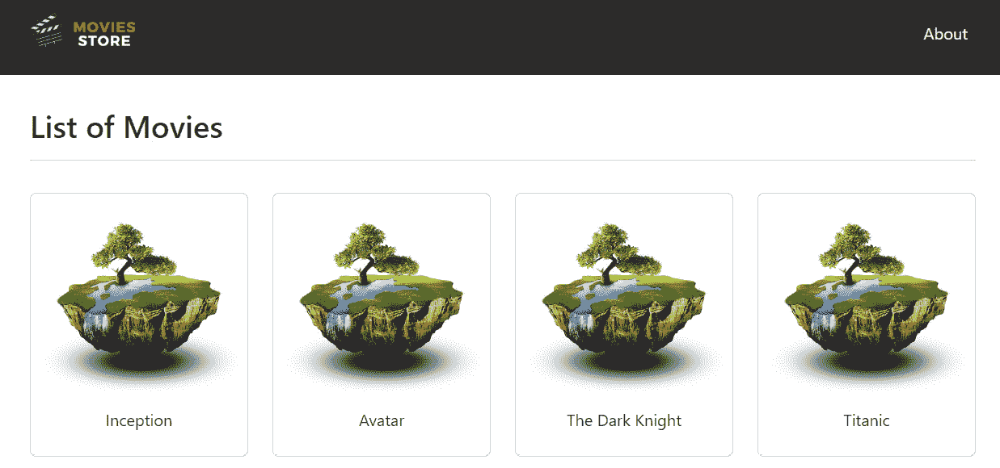
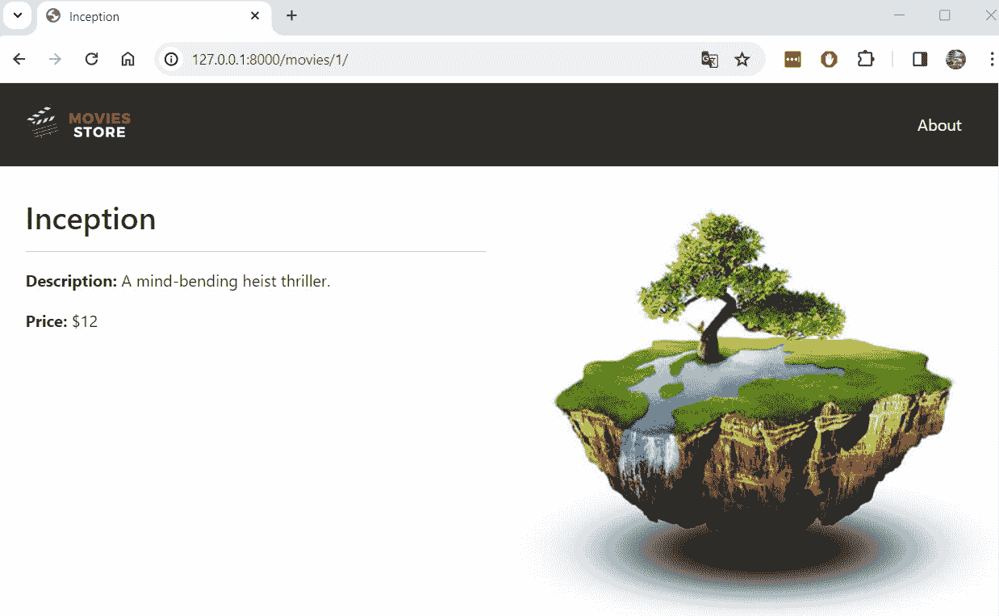
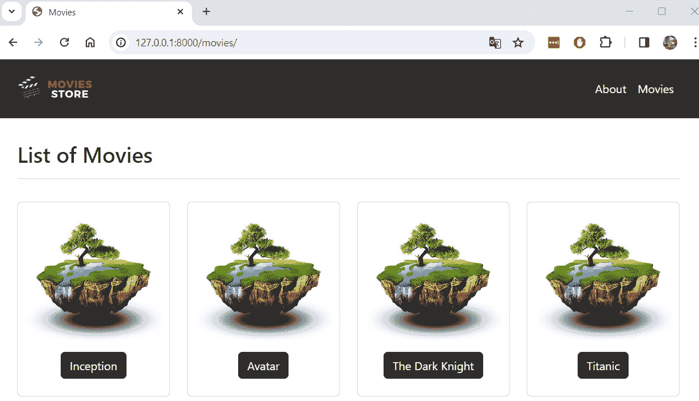

# 4

# 使用虚拟数据创建电影应用

目前，我们的项目包含一个包含几个显示静态信息的部分的应用程序。Web 应用程序更复杂。在本章中，我们将学习如何开发更复杂的应用程序，例如电影应用。电影应用将用于列出电影，并允许用户点击它们在单独的页面上显示其数据。目前，我们将使用虚拟数据来模拟电影数据。

在本章中，我们将介绍以下主题：

+   创建电影应用

+   使用虚拟数据列出电影

+   列出单个电影

+   在基础模板中添加链接

最后，我们将了解如何创建更复杂的多吉安应用以及如何在那些应用中管理信息。

# 技术要求

在本章中，我们将使用 Python 3.10+。此外，我们将在本书中使用**<st c="855">VS Code</st>**编辑器，您可以从[`code.visualstudio.com/`](https://code.visualstudio.com/)下载。

本章的代码位于[`github.com/PacktPublishing/Django-5-for-the-Impatient-Second-Edition/tree/main/Chapter04/moviesstore`](https://github.com/PacktPublishing/Django-5-for-the-Impatient-Second-Edition/tree/main/Chapter04/moviesstore)。

本章的 CiA 视频可以在[`packt.link/WmJR1`](https://packt.link/WmJR1)找到

# 创建电影应用

目前，我们有一个包含在**<st c="1268">Home</st>**和**<st c="1277">About</st>**页面之间导航逻辑的首页应用。现在，我们将开始设计和实现电影逻辑。我们更喜欢将此逻辑与首页应用分离。因此，让我们创建一个新的 Django 应用。我们将遵循以下步骤：（i）创建电影应用，（ii）将电影应用添加到设置中，（iii）将电影 URL 文件包含在项目级别的 URL 文件中。

## 创建电影应用

导航到顶级`<st c="1664">moviesstore</st>`文件夹（包含`<st c="1710">manage.py</st>`文件的文件夹）并在终端中运行以下命令：

对于 macOS，运行以下命令：

```py
 python3 manage.py startapp movies
```

对于 Windows，运行以下命令：

```py
 python manage.py startapp movies
```

*<st c="1909">图 4</st>**<st c="1918">.1</st>* <st c="1920">显示了新的项目结构。</st> <st c="1954">请确认它与您当前的</st> <st c="1990">文件夹结构相匹配。</st>



<st c="2150">图 4.1 – 包含电影应用的 MOVIESSTORE 项目结构</st>

## <st c="2222">将电影应用添加到设置中</st>

<st c="2256">请记住，对于</st> <st c="2274">每个新创建的应用，我们必须在</st> `<st c="2326">settings.py</st>` <st c="2337">文件中注册它。</st> <st c="2344">在</st> `<st c="2347">/moviesstore/settings.py</st>`<st c="2371">中，在</st> `<st c="2379">INSTALLED_APPS</st>`<st c="2393">下，添加以下内容（加粗）：</st>

```py
 …
INSTALLED_APPS = [
    'django.contrib.admin',
    'django.contrib.auth',
    'django.contrib.contenttypes',
    'django.contrib.sessions',
    'django.contrib.messages',
    'django.contrib.staticfiles',
    'home', <st c="2612">'movies',</st> ]
…
```

## <st c="2625">在项目级别的 URL 文件中包含电影 URL 文件</st>

<st c="2685">在</st> `<st c="2689">/moviesstore/urls.py</st>`<st c="2709">中，添加以下内容（加粗）：</st>

```py
 …
from django.contrib import admin
from django.urls import path, include
urlpatterns = [
    path('admin/', admin.site.urls),
    path('', include('home.urls')), <st c="2891">path('movies/', include('movies.urls')),</st> ]
```

<st c="2933">类似于包含</st> `<st c="2965">home.urls</st>` <st c="2974">文件，我们包含</st> `<st c="2996">movies.urls</st>` <st c="3007">文件，该文件将包含与电影应用相关的 URL。</st> <st c="3074">在</st> `<st c="3102">movies.urls</st>` <st c="3113">文件中定义的所有 URL 都将包含一个</st> `<st c="3134">movies/</st>` <st c="3141">前缀（如前所述路径中定义的）。</st> <st c="3184">我们将在稍后创建</st> `<st c="3203">movies.urls</st>` <st c="3214">文件。</st>

<st c="3226">现在我们已经创建并包含了电影应用，我们准备编写此应用的功能。</st> <st c="3335">让我们从列出电影开始。</st>

# <st c="3365">使用虚拟数据列出电影</st>

<st c="3396">列出电影涉及一系列步骤，类似于</st> <st c="3449">我们在实现</st> `<st c="3592">views</st>` `<st c="3597">index</st>` <st c="3603">函数时遵循的步骤，以及</st> <st c="3634">创建一个</st> `<st c="3642">movies</st>` <st c="3642">索引模板。</st>

## <st c="3657">配置电影 URL</st>

<st c="3684">在</st> `<st c="3688">/movies/</st>`<st c="3696">中，创建一个名为</st> `<st c="3707">urls.py</st>`<st c="3730">的新文件。此文件将包含关于电影应用 URL 的路径。</st> <st c="3802">目前，请用以下内容填充它：</st> <st c="3827">以下内容：</st>

```py
 from django.urls import path
from . import views
urlpatterns = [
    path('', views.index, name='movies.index'),
]
```

<st c="3952">我们定义了一个</st> `<st c="3966">''</st>` <st c="3968">路径，但请记住，项目级别的 URL 文件为该文件定义了一个</st> `<st c="4031">/movies</st>` <st c="4038">前缀。</st> <st c="4061">因此，如果一个 URL 与</st> `<st c="4086">/movies</st>` <st c="4093">路径匹配，它将执行在</st> `<st c="4120">views</st>` <st c="4125">文件中定义的</st> `<st c="4150">index</st>` <st c="4155">函数。</st> <st c="4162">我们将接下来实现</st> `<st c="4184">index</st>` <st c="4189">函数。</st>

## 定义视图索引函数

在 `<st c="4242">/movies/views.py</st>`<st c="4258"> 文件中，添加以下内容（加粗）：

```py
 from django.shortcuts import render <st c="4323">movies = [</st>
 <st c="4333">{</st>
 <st c="4335">'id': 1, 'name': 'Inception', 'price': 12,</st>
 <st c="4378">'description': 'A mind-bending heist thriller.'</st>
 <st c="4426">},</st>
 <st c="4429">{</st>
 <st c="4431">'id': 2, 'name': 'Avatar', 'price': 13,</st>
 <st c="4471">'description': 'A journey to a distant world and</st>
 <st c="4520">the battle for resources.'</st>
 <st c="4547">},</st>
 <st c="4550">{</st>
 <st c="4552">'id': 3, 'name': 'The Dark Knight', 'price': 14,</st>
 <st c="4601">'description': 'Gothams vigilante faces the Joker.'</st>
 <st c="4653">},</st>
 <st c="4656">{</st>
 <st c="4658">'id': 4, 'name': 'Titanic', 'price': 11,</st>
 <st c="4699">'description': 'A love story set against the</st>
 <st c="4744">backdrop of the sinking Titanic.',</st>
 <st c="4779">},</st>
<st c="4782">]</st>
<st c="4784">def index(request):</st>
 <st c="4803">template_data = {}</st>
 <st c="4822">template_data['title'] = 'Movies'</st>
 <st c="4856">template_data['movies'] = movies</st>
 <st c="4889">return render(request, 'movies/index.html',</st>
 <st c="4933">{'template_data': template_data})</st>
```

让我们解释一下之前的代码：

+   我们定义了一个名为 `<st c="5030">movies</st>`<st c="5036"> 的变量。这个变量是一个字典列表，其中每个字典代表一部特定电影的信息。</st> <st c="5150">例如，在索引 `<st c="5172">0</st>`<st c="5173"> 处，我们有 id=1 的电影（即 `<st c="5208">Inception</st>` <st c="5217">电影）。</st> 我们有四部虚拟电影。</st> <st c="5253">我们将在后续章节中从 SQLite 数据库中检索电影数据。</st>

+   我们还有一个 `<st c="5342">index</st>` <st c="5347">函数。</st> <st c="5358">此函数将渲染 `<st c="5388">movies/index.html</st>` <st c="5405">模板，但首先，它将页面标题和电影完整列表传递给该模板。</st>

## 创建电影索引模板

在 `<st c="5532">/movies/</st>`<st c="5544"> 目录下，创建一个 `<st c="5555">templates</st>` <st c="5564">文件夹。</st> 然后，在 `<st c="5582">/movies/templates/</st>`<st c="5600"> 目录下，创建一个 `<st c="5611">movies</st>` <st c="5617">文件夹。</st>

现在，在 `<st c="5634">/movies/templates/movies/</st>`<st c="5659"> 目录下，创建一个新文件，`<st c="5680">index.html</st>`<st c="5690">。目前，请用以下内容填充它：</st>

```py
 


<div class="p-3">
  <div class="container">
    <div class="row mt-3">
      <div class="col mx-auto mb-3">
        <h2>List of Movies</h2>
        <hr />
      </div>
    </div>
    <div class="row">
      
      <div class="col-md-4 col-lg-3 mb-2">
        <div class="p-2 card align-items-center pt-4">
          
          <div class="card-body text-center">
            {{ movie.name }}
          </div>
        </div>
      </div>
      
    </div>
  </div>
</div>

```

让我们解释一下之前的代码：

+   我们扩展了 `<st c="6327">base.html</st>` <st c="6336">模板。</st>

+   我们定义了一个带有文本 `<st c="6389">List</st>` `<st c="6394">of Movies</st>`<st c="6403"> 的标题元素。</st>

+   我们使用 DTL `<st c="6420">for</st>` <st c="6423">模板</st> <st c="6432">标签遍历每部电影，并显示电影名称。</st> <st c="6499">目前，我们为所有电影显示默认图片；我们将在后续章节中上传并显示每部电影的正确图片。</st>

注意

我们以 Bootstrap 卡片组件为基础来设计电影显示的方式。</st> <st c="6725">您可以在以下链接中找到更多信息：</st> [<st c="6761">https://getbootstrap.com/docs/5.3/components/card/</st>](https://getbootstrap.com/docs/5.3/components/card/)<st c="6811">。</st>

<st c="6812">现在，保存这些文件，运行</st> <st c="6844">服务器，并访问</st> [<st c="6862">http://localhost:8000/movies</st>](http://localhost:8000/movies)<st c="6890">；你应该看到新的</st> **<st c="6916">电影列表</st>** <st c="6930">页面（</st>*<st c="6937">图 4</st>**<st c="6946">.2</st>*<st c="6948">）。</st>



<st c="7015">图 4.2 – 电影列表页面</st>

<st c="7051">我们现在能够看到所有电影的详细信息。</st> <st c="7111">现在，让我们实现一个列出</st> <st c="7156">单个电影的功能。</st>

# <st c="7174">列出单个电影</st>

<st c="7200">要列出单个</st> <st c="7219">电影，我们将遵循以下步骤：（i）配置单个电影 URL，（ii）定义</st> `<st c="7314">views</st>` `<st c="7319">show</st>` <st c="7324">函数，（iii）创建电影</st> `<st c="7359">show</st>` <st c="7363">模板，以及（iv）在电影页面上添加单个电影链接。</st>

## <st c="7432">配置单个电影 URL

<st c="7467">在</st> `<st c="7471">/movies/urls.py</st>`<st c="7486">中，添加以下加粗路径：</st>

```py
 from django.urls import path
from . import views
urlpatterns = [
    path('', views.index, name='movies.index'), <st c="7624">path('<int:id>/', views.show, name='movies.show'),</st> ]
```

<st c="7676">此路径与之前定义的路径略有不同。</st> <st c="7743">`<st c="7747"><int:id></st>` <st c="7755">部分表示此路径期望从 URL 传递一个整数值，并且该整数值将与名为</st> `<st c="7905">id</st>`<st c="7907">的变量相关联，该变量将用于标识要显示的电影数据。</st> <st c="7966">例如，如果我们访问</st> `<st c="7992">movies/1</st>`<st c="8000">，应用程序将显示</st> `<st c="8058">id=1</st>`<st c="8062">的电影数据。</st> 最后，该路径将执行在</st> `<st c="8129">views</st>` <st c="8134">文件中定义的</st> `<st c="8100">show</st>` <st c="8104">函数。</st> <st c="8141">您可以在以下位置了解更多关于 Django URL 的信息：</st> [<st c="8184">https://docs.djangoproject.com/en/5.0/topics/http/urls/</st>](https://docs.djangoproject.com/en/5.0/topics/http/urls/)<st c="8239">。</st>

## <st c="8240">定义视图 show 函数</st>

<st c="8273">在</st> `<st c="8277">/movies/views.py</st>`<st c="8293">中，在文件末尾添加以下加粗内容：</st>

```py
 … <st c="8346">def show(request, id):</st>
 <st c="8368">movie = movies[id - 1]</st>
 <st c="8391">template_data = {}</st>
 <st c="8410">template_data['title'] = movie['name']</st>
 <st c="8449">template_data['movie'] = movie</st>
 <st c="8480">return render(request, 'movies/show.html',</st>
 <st c="8523">{'template_data': template_data})</st>
```

<st c="8557">让我们解释一下</st> <st c="8576">之前的代码：</st>

+   <st c="8590">我们定义了</st> `<st c="8605">show</st>` <st c="8609">函数。</st> <st c="8620">此函数接受两个参数：</st> `<st c="8656">request</st>` <st c="8663">和</st> `<st c="8668">id</st>` <st c="8670">(</st>`<st c="8672">id</st>` <st c="8674">是从</st> <st c="8693">URL 中收集的。</st>

+   <st c="8702">然后，我们使用该 ID 提取电影数据。</st> <st c="8749">我们减去一个单位，因为我们用</st> `<st c="8801">id=1</st>` <st c="8805">存储电影，在电影列表索引</st> `<st c="8831">0</st>`<st c="8832">中，电影</st> `<st c="8849">id=2</st>` <st c="8853">在电影列表索引</st> `<st c="8879">1</st>`<st c="8880">中，以此类推。</st>

+   <st c="8892">最后，我们将电影名称和单个电影传递给</st> <st c="8913">`movies/show.html`</st> <st c="8973">模板。</st>

## <st c="8983">创建电影展示模板</st>

<st c="9015">在</st> `<st c="9019">/movies/templates/movies/</st>`<st c="9044">中，创建一个新文件，</st> `<st c="9065">show.html</st>`<st c="9074">。目前，用以下内容填充它：</st> <st c="9101">以下内容：</st>

```py
 


<div class="p-3">
  <div class="container">
    <div class="row mt-3">
      <div class="col-md-6 mx-auto mb-3">
        <h2>{{ template_data.movie.name }}</h2>
        <hr />
        <p><b>Description:</b> {{
          template_data.movie.description }}</p>
        <p><b>Price:</b> ${{
          template_data.movie.price }}</p>
      </div>
      <div class="col-md-6 mx-auto mb-3 text-center">
        
      </div>
    </div>
  </div>
</div>

```

<st c="9611">前面的代码显示了</st> <st c="9638">单个</st> <st c="9654">电影信息。</st>

## <st c="9672">在电影页面上添加单个电影链接</st>

<st c="9721">在</st> `<st c="9725">/movies/templates/movies/index.html</st>`<st c="9760">中，添加以下内容，并加粗：</st>

```py
 …
      
      <div class="col-md-4 col-lg-3 mb-2">
        <div class="p-2 card align-items-center pt-4">
          
          <div class="card-body text-center"> <st c="10020"><a href=""</st>
 <st c="10065">class="btn bg-dark text-white"></st> {{ movie.name }} <st c="10115"></a></st> </div>
        </div>
      </div>
      
      …
```

<st c="10155">我们为每个电影名称添加了一个链接到每个单个电影页面。</st> <st c="10224">我们使用了</st> `<st c="10236">url</st>` <st c="10239">模板标签来链接到指定的 URL 模式名称（</st>`<st c="10296">movie.show</st>`<st c="10307">）。</st> <st c="10311">但我们还指定了一个要传递给 URL 的参数（</st>`<st c="10370">id=movie.id</st>`<st c="10382">）。</st> <st c="10386">在这种情况下，它将</st> `<st c="10417">id</st>` <st c="10419">参数设置为</st> `<st c="10437">id</st>` <st c="10439">属性</st> `<st c="10457">movie</st>` <st c="10462">对象。</st> <st c="10471">这对于需要动态部分的 URL 很有用，例如特定电影的详细信息。</st>

<st c="10560">现在，保存这些文件，运行服务器，并转到</st> `<st c="10610">http://localhost:8000/movies</st>`<st c="10638">。你会看到每个电影名称都变成了可以点击的按钮。</st> <st c="10715">点击电影名称，你将被重定向到单个电影页面（</st>*<st c="10795">图 4</st>**<st c="10804">.3</st>*<st c="10806">）。</st>



<st c="10946">图 4.3 – 单个电影页面</st>

<st c="10980">我们可以列出所有电影并导航到单个电影；然而，我们还没有在电影部分添加链接。</st> <st c="11095">让我们在下一段中实现这个链接。</st> <st c="11128">下一节。</st>

# <st c="11141">在基本模板中添加链接</st>

<st c="11176">最后，让我们在基本模板中添加电影链接</st> <st c="11211">。</st> <st c="11234">在</st> `<st c="11237">/moviesstore/templates/base.html</st>`<st c="11269">中，在标题部分，添加以下内容，并加粗：</st>

```py
 …
        <div class="collapse navbar-collapse"
                   id="navbarNavAltMarkup">
          <div class="navbar-nav ms-auto navbar-ml">
            <a class="nav-link" href=
              "">About</a> <st c="11489"><a class="nav-link" href=</st>
 <st c="11514">"">Movies</a></st> </div>
        </div>
        …
```

<st c="11567">现在，保存这些文件，运行服务器，并访问</st> `<st c="11617">http://localhost:8000/movies</st>`<st c="11645">。你将在页眉中看到新的</st> **<st c="11668">电影</st>** <st c="11674">菜单选项（</st>*<st c="11702">图 4</st>**<st c="11711">.4</st>*<st c="11713">）。</st>



<st c="11829">图 4.4 – 电影页面更新</st>

# <st c="11861">摘要</st>

<st c="11869">在本章中，我们回顾了如何创建 Django 应用程序。</st> <st c="11927">我们创建了一个允许列出电影和单个电影的</st> <st c="12001">电影应用程序。</st> <st c="12095">我们学习了如何通过 URL 传递信息，如何创建虚拟数据，如何使用</st> `<st c="12098">for</st>` <st c="12098">模板标签，以及如何链接不同的页面。</st> <st c="12146">我们希望这为我们的项目下一部分的学习打下坚实的基础，在那里我们将探讨更高级的主题，例如模型，以使我们的</st> <st c="12305">网站数据库驱动。</st>
