# 第六章：<st c="0">5</st>

# <st c="2">与模型一起工作</st>

<st c="21">在大多数 Web 应用程序中，将数据存储在数据库中是一种常见的做法。</st> <st c="96">在 Django 项目中，这涉及到与 Django 模型一起工作。</st> <st c="157">在本章中，我们将创建一个数据库模型（例如，电影）并且 Django 会为我们把这个模型转换成数据库表。</st> <st c="291">我们还将探索一个强大的内置管理界面，它提供了一种可视化的方式来管理 Django 项目的所有方面，例如用户和管理模型数据的变化。</st> <st c="456">。</st>

<st c="467">在本章中，我们将涵盖以下主题：</st> <st c="503">以下主题：</st>

+   <st c="520">创建我们的</st> <st c="534">第一个模型</st>

+   <st c="545">安装 Pillow</st>

+   <st c="563">管理迁移</st>

+   <st c="583">访问 Django</st> <st c="605">管理界面</st>

+   <st c="620">配置</st> <st c="633">图像上传</st>

+   <st c="645">服务</st> <st c="654">存储的图像</st>

+   <st c="667">将电影模型</st> <st c="689">添加到管理界面</st>

# <st c="697">技术要求</st>

<st c="720">在本章中，我们将使用 Python 3.10+。</st> <st c="769">此外，我们还将使用</st> **<st c="804">VS Code</st>** <st c="811">编辑器，您可以从</st> <st c="856">以下链接</st> [<st c="861">https://code.visualstudio.com/</st>](https://code.visualstudio.com/)<st c="891">下载。</st>

<st c="892">本章的代码位于</st> <st c="930">以下链接</st> [<st c="933">https://github.com/PacktPublishing/Django-5-for-the-Impatient-Second-Edition/tree/main/Chapter05/moviesstore</st>](https://github.com/PacktPublishing/Django-5-for-the-Impatient-Second-Edition/tree/main/Chapter05/moviesstore)<st c="1041">。</st>

<st c="1042">本章的 CiA 视频可以在</st> <st c="1087">以下链接</st> [<st c="1090">https://packt.link/HEeUM</st>](https://packt.link/HEeUM)

# <st c="1114">创建我们的第一个模型</st>

<st c="1139">一个</st> **<st c="1142">Django 模型</st>** <st c="1154">是一个 Python 类，它代表了一个数据库表。</st> <st c="1207">模型用于定义将存储在数据库中的数据的结构和行为。</st> <st c="1309">每个模型类通常对应一个数据库表，并且类的每个实例代表该表中的一行。</st> <st c="1448">有关 Django 模型的更多信息</st> <st c="1484">可以在以下位置找到：</st> [<st c="1504">https://docs.djangoproject.com/en/5.0/topics/db/models/.</st>](https://docs.djangoproject.com/en/5.0/topics/db/models/)

<st c="1560">我们可以创建如电影、评论和订单等模型，Django 会为我们将这些模型转换为数据库表</st> <st c="1668">。</st>

<st c="1675">以下是 Django</st> <st c="1695">模型基础：</st>

+   <st c="1709">每个模型都是一个类，它</st> <st c="1737">扩展了</st> `<st c="1745">django.db.models.Model</st>`

+   <st c="1767">每个模型属性代表一个</st> <st c="1802">数据库列</st>

+   <st c="1817">有了这些，Django 为我们提供了一组有用的方法来</st> **<st c="1887">创建、更新、读取和删除</st>** <st c="1919">(**<st c="1921">CRUD</st>**<st c="1925">**)数据库中的模型信息</st>

## <st c="1961">创建一个 Movie 模型</st>

<st c="1984">我们的第一个模型将是 Movie。</st> <st c="2018">我们可以在每个项目应用中创建模型。</st> <st c="2068">Movie 似乎与</st> `<st c="2106">movies</st>` <st c="2112">应用更相关，所以我们将</st> `<st c="2140">Movie</st>` <st c="2145">模型创建在那里。</st> <st c="2159">在</st> `<st c="2162">/movies</st>`<st c="2169">`，我们有</st> `<st c="2174">models.py</st>` <st c="2192">文件，我们在其中为</st> `<st c="2234">movies</st>` <st c="2240">应用创建模型。</st> <st c="2246">打开该文件，并放置以下代码行：</st> <st c="2291">:</st>

```py
 from django.db import models
class Movie(models.Model):
    id = models.AutoField(primary_key=True)
    name = models.CharField(max_length=255)
    price = models.IntegerField()
    description = models.TextField()
    image = models.ImageField(upload_to='movie_images/')
    def __str__(self):
        return str(self.id) + ' - ' + self.name
```

<st c="2610">让我们解释一下</st> <st c="2629">之前的代码：</st>

+   <st c="2643">首先，我们导入</st> <st c="2660">的</st> `<st c="2665">models</st>` <st c="2671">模块，它提供了定义数据库模型所需的各类类和实用工具。</st>

+   <st c="2754">接下来，我们定义一个名为</st> `<st c="2792">Movie</st>`<st c="2797">的 Python 类，它继承自</st> `<st c="2819">models.Model</st>`<st c="2831">。这意味着</st> `<st c="2849">Movie</st>` <st c="2854">是一个 Django</st> <st c="2867">模型类。</st>

+   <st c="2879">在</st> `<st c="2891">Movie</st>` <st c="2896">类内部，我们定义了</st> <st c="2914">几个字段：</st>

    +   `<st c="2929">id</st>`<st c="2932">: 这是一个</st> `<st c="2946">AutoField</st>` <st c="2955">值，它会自动为数据库中添加的每个新记录增加其值。</st> <st c="3052">`<st c="3056">primary_key=True</st>` <st c="3072">`参数指定该字段是表的唯一主键，唯一标识</st> <st c="3164">每条记录。</st>

    +   `<st c="3176">name</st>`<st c="3181">: 这是一个</st> `<st c="3194">CharField</st>` <st c="3203">值，表示一个最大长度为 255 个字符的字符串字段。</st> <st c="3282">它存储电影的名称。</st>

    +   `<st c="3314">price</st>`<st c="3320">: 这是一个</st> `<st c="3334">IntegerField</st>` <st c="3346">值，用于存储整数值。</st> <st c="3381">它代表电影的票价。</st>

    +   `<st c="3418">description</st>`<st c="3430">: 这是一个</st> `<st c="3443">TextField</st>` <st c="3452">值，表示一个没有指定最大长度的文本字段。</st> <st c="3522">它存储电影的文本描述。</st>

    +   `<st c="3567">图像</st>`<st c="3573">：这是一个</st> `<st c="3587">ImageField</st>` <st c="3597">值，用于存储图像文件。</st> <st c="3629">`<st c="3633">upload_to</st>` <st c="3642">参数指定了上传的图像将被存储的目录。</st> <st c="3715">在这种情况下，上传的图像将被存储在 Django 项目媒体目录下的`<st c="3767">movie_images/</st>` <st c="3780">目录中。</st> <st c="3841">媒体目录用于存储用户上传的文件，如图像、文档或其他媒体文件。</st> <st c="3948">此目录在您的 Django 项目设置中指定（我们将在本章后面配置它）。</st>

+   `<st c="4055">__str__</st>`<st c="4063">：这是 Python 类中的一个特殊方法，它返回对象的字符串表示形式。</st> <st c="4160">它将电影的`<st c="4188">id</st>` <st c="4190">值（转换为字符串）与一个连字符和电影名称连接起来。</st> <st c="4259">此方法将在我们稍后在 Django 管理面板中显示电影时非常有用。</st>

<st c="4341">注意</st>

<st c="4346">Django 提供了许多其他模型</st> <st c="4379">字段来支持常见类型，如日期、整数和电子邮件。</st> <st c="4449">要了解各种类型及其使用方法，请参阅 Django 文档中的</st> `<st c="4536">模型</st>` <st c="4541">字段参考（</st>[<st c="4587">https://docs.djangoproject.com/en/5.0/ref/models/fields/</st>](https://docs.djangoproject.com/en/5.0/ref/models/fields/)<st c="4644">）。</st>

# <st c="4647">安装 Pillow</st>

<st c="4665">因为我们使用</st> <st c="4686">图像，所以我们需要</st> <st c="4701">安装 Pillow（</st>[<st c="4721">https://pypi.org/project/pillow/</st>](https://pypi.org/project/pillow/)<st c="4754">），这将为我们的</st> <st c="4806">Python 解释器添加图像处理功能。</st>

<st c="4825">在终端中，停止服务器并执行</st> <st c="4866">以下操作：</st>

+   <st c="4880">对于 macOS，运行以下命令：</st>

    ```py
    <st c="4918">pip3 install pillow</st>
    ```

+   <st c="4938">对于 Windows，运行以下命令：</st>

    ```py
    <st c="4978">pip install pillow</st>
    ```

<st c="4997">现在 Pillow 已经安装，让我们学习如何管理</st> <st c="5060">Django 迁移。</st>

# <st c="5078">管理迁移</st>

**<st c="5098">Django 迁移</st>** <st c="5116">是 Django 的一个功能，允许</st> <st c="5151">您管理数据库模式的变化——也就是说，随着您的 Django</st> <st c="5311">项目的发展，对数据库表结构和其中数据的变化——随着时间的推移进行管理。</st>

<st c="5327">在 Django 中定义模型时，你实际上是在定义数据库表的结构。</st> <st c="5429">然而，随着项目的增长和变化，你可能需要修改这些模型，例如添加新字段、删除字段或修改现有字段。</st> <st c="5599">Django 迁移提供了一种以受控和一致的方式将更改传播到数据库模式的方法（作为一个版本</st> <st c="5734">控制系统）。</st>

<st c="5750">要使用迁移，我们必须应用</st> <st c="5789">默认迁移，创建自定义迁移，并应用</st> <st c="5850">自定义迁移。</st>

## <st c="5868">应用默认迁移</st>

<st c="5900">当前，当你在终端中运行服务器时，请注意一条消息</st> <st c="5926">：</st>

```py
 You have 18 unapplied migration(s). Your project may not work properly until you apply the migrations for app(s): admin, auth, contenttypes, sessions. Run 'python manage.py migrate' to apply them.
```

<st c="6164">根据消息说明，停止服务器并执行以下操作（请确保位于包含</st> `<st c="6266">moviesstore</st>` <st c="6277">文件夹的</st> `<st c="6303">manage.py</st>` <st c="6312">文件）：</st>

+   <st c="6319">对于 macOS，运行以下命令：</st>

    ```py
    <st c="6357">python3 manage.py migrate</st>
    ```

+   <st c="6383">对于 Windows，运行以下命令：</st>

    ```py
    <st c="6423">python manage.py migrate</st>
    ```

<st c="6448"></st> `<st c="6453">migrate</st>` <st c="6460">命令根据 Django 的默认设置创建初始数据库。</st> <st c="6533">请注意，项目根目录中有一个</st> `<st c="6554">db.sqlite3</st>` <st c="6564">文件。</st> <st c="6598">此文件代表我们的 SQLite 数据库。</st> <st c="6640">它是在我们第一次运行</st> `<st c="6675">migrate</st>` <st c="6682">或</st> `<st c="6686">runserver</st>`<st c="6695">时创建的。</st>

<st c="6696">在前一个例子中，</st> `<st c="6723">migrate</st>` <st c="6730">命令应用了 18 个默认迁移（如图</st> *<st c="6782">图 5</st>**<st c="6790">.1</st>*<st c="6792">所示）。</st> <st c="6796">这些迁移是由一些默认 Django 应用程序定义的 –</st> `<st c="6856">admin</st>`<st c="6861">、</st> `<st c="6863">auth</st>`<st c="6867">、</st> `<st c="6869">contenttypes</st>`<st c="6881">和</st> `<st c="6887">sessions</st>`<st c="6895">。这些应用程序在</st> `<st c="6926">INSTALLED_APPS</st>` <st c="6940">变量中加载，位于</st> `<st c="6957">moviesstore/settings.py</st>` <st c="6980">文件中。</st>

<st c="6986">因此，</st> `<st c="6995">migrate</st>` <st c="7002">命令运行所有已安装应用程序的迁移。</st> <st c="7058">请注意</st> `<st c="7068">INSTALLED_APPS</st>` <st c="7082">还加载了</st> `<st c="7098">movies</st>` <st c="7104">应用程序。</st> <st c="7110">然而，没有为</st> `<st c="7154">movies</st>` <st c="7160">应用程序应用迁移。</st> <st c="7166">这是因为我们没有为</st> `<st c="7226">movies</st>` <st c="7232">应用程序生成迁移：</st>

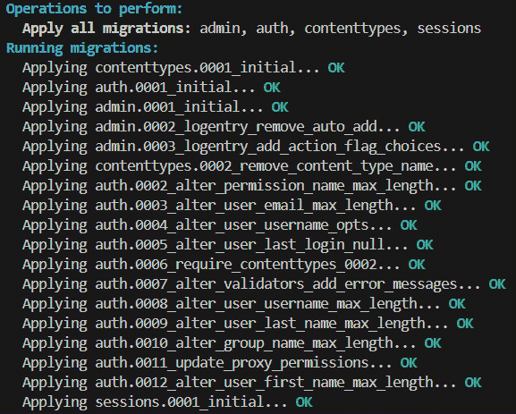

<st c="7850">图 5.1 – 应用默认 Django 迁移</st>

## <st c="7897">创建自定义迁移</st>

<st c="7924">目前，我们在</st> `<st c="7949">movies</st>` <st c="7952">应用中定义了一个</st> `<st c="7952">电影</st>` <st c="7957">模型。</st> <st c="7987">基于该模型，我们可以创建自己的迁移。</st> <st c="8042">要为</st> `<st c="8075">movies</st>` <st c="8081">应用创建迁移，我们需要在</st> `<st c="8106">makemigrations</st>` <st c="8120">命令中</st> `<st c="8132">终端</st>` 中运行：</st>

+   <st c="8145">对于 macOS，运行以下命令：</st>

    ```py
    <st c="8183">python3 manage.py makemigrations</st>
    ```

+   <st c="8216">对于 Windows，运行以下命令：</st>

    ```py
    <st c="8256">python manage.py makemigrations</st>
    ```

<st c="8288">上一个命令基于我们在 Django 应用中定义的模型创建迁移文件（见</st> *<st c="8397">图 5</st>**<st c="8405">.2</st>*<st c="8407">）：</st>

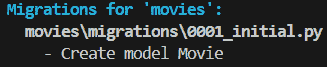

<st c="8462">图 5.2 – 执行 makemigrations 命令</st>

<st c="8511">迁移存储在相应的应用级</st> `<st c="8569">迁移</st>` <st c="8579">文件夹中。</st> <st c="8588">目前，我们只在</st> `<st c="8622">电影</st>` <st c="8627">模型中定义了</st> `<st c="8645">movies</st>` <st c="8651">应用。</st> <st c="8657">因此，此命令在</st> `<st c="8711">电影</st>` <st c="8716">模型中生成迁移文件，位于</st> `<st c="8734">movies/migrations/</st>` <st c="8752">文件夹中（见</st> *<st c="8765">图 5</st>**<st c="8773">.3</st>*<st c="8775">）：</st>

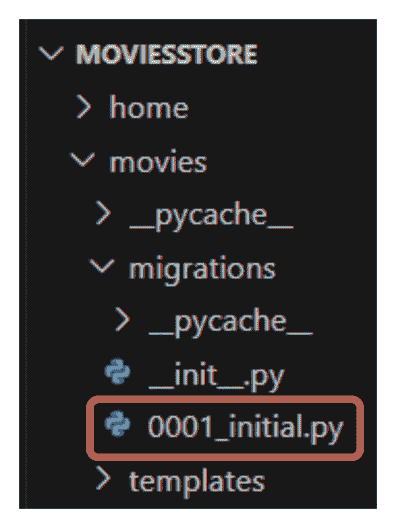

<st c="8883">图 5.3 – 为电影应用生成的迁移</st>

<st c="8935">如果我们更改</st> `<st c="8953">电影</st>` <st c="8958">模型或创建新的模型，我们需要再次执行</st> `<st c="9010">makemigrations</st>` <st c="9024">命令。</st> <st c="9040">此命令将创建新的迁移文件，这些文件将作为我们</st> <st c="9121">数据库模式</st> <st c="9129">的版本控制。</st>

<st c="9145">请注意，迁移文件已创建，但数据库尚未</st> <st c="9217">更新。</st>

## <st c="9229">应用自定义迁移</st>

<st c="9256">运行</st> `<st c="9271">makemigrations</st>`<st c="9285">后，通常需要运行</st> <st c="9305">migrate</st> <st c="9320">命令将迁移应用到数据库并做出相应的更改。</st> <st c="9399">现在，在</st> <st c="9429">终端</st> 中执行以下操作：</st>

+   <st c="9442">对于 macOS，运行以下命令：</st>

    ```py
    <st c="9480">python3 manage.py migrate</st>
    ```

+   <st c="9506">对于 Windows，运行以下命令：</st>

    ```py
    <st c="9546">python manage.py migrate</st>
    ```

<st c="9571">如图</st> *<st c="9584">图 5</st>**<st c="9592">.4</st>*<st c="9594">所示，我们应用了</st> `<st c="9611">movies</st>` <st c="9617">应用的迁移：</st>

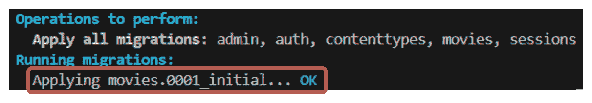

<st c="9778">图 5.4 – 应用电影应用迁移</st>

<st c="9825">总之，每次你修改模型文件时，你必须做以下操作：</st> <st c="9897">以下操作：</st>

+   <st c="9911">对于 macOS，运行以下命令：</st> <st c="9931">以下命令：</st>

    ```py
    <st c="9949">python3 manage.py makemigrations</st>
    <st c="9982">python3 manage.py migrate</st>
    ```

+   <st c="10008">对于 Windows，运行以下命令：</st> <st c="10030">以下命令：</st>

    ```py
    <st c="10048">python manage.py makemigrations</st>
    <st c="10080">python manage.py migrate</st>
    ```

<st c="10105">但我们如何访问我们的数据库</st> <st c="10139">并查看里面的内容？</st> <st c="10164">为此，我们使用 Django 中的一个强大工具，即管理界面。</st> <st c="10235">我们将在下一节中讨论这一点。</st>

# <st c="10274">访问 Django 管理界面</st>

<st c="10311">要访问</st> <st c="10322">我们的数据库，我们必须进入 Django 管理界面。</st> <st c="10383">请记住，在</st> `<st c="10409">admin</st>` <st c="10414">路径</st> <st c="10420">中</st> `<st c="10423">/moviesstore/urls.py</st>`

```py
 …
urlpatterns = [ <st c="10461">path('admin/', admin.site.urls),</st> path('', include('home.urls')),
    path('movies/', include('movies.urls')),
]
```

<st c="10568">如果你访问</st> `<st c="10582">localhost:8000/admin</st>`<st c="10602">，你将被带到管理站点，如图</st> *<st c="10651">图 5</st>**<st c="10659">.5</st>*<st c="10661">所示：</st>

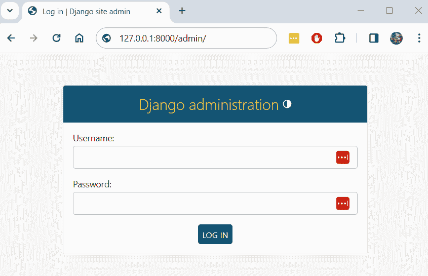

<st c="10768">图 5.5 – 管理页面</st>

<st c="10791">Django 有一个强大的内置管理界面，它以可视化的方式管理 Django 项目的所有方面 – 例如，用户、电影，等等。</st> <st c="10940">更多。</st>

<st c="10949">我们用什么用户名和密码登录到管理界面？</st> <st c="10968">为此，我们必须在终端中创建一个超级用户。</st> <st c="11019">对于此，我们必须在终端中创建一个超级用户。</st> <st c="11062">以下操作：</st>

## <st c="11075">创建超级用户</st>

<st c="11096">让我们创建一个超级用户</st> <st c="11121">以访问管理面板。</st> <st c="11149">在终端中，停止服务器并执行以下操作：</st> <st c="11189">以下操作：</st>

+   <st c="11203">对于 macOS，运行以下命令：</st> <st c="11223">以下命令：</st>

    ```py
    <st c="11241">python3 manage.py createsuperuser</st>
    ```

+   <st c="11275">对于 Windows，运行以下命令：</st> <st c="11297">以下命令：</st>

    ```py
    <st c="11315">python manage.py createsuperuser</st>
    ```

<st c="11348">然后，你将被要求指定用户名、电子邮件和密码。</st> <st c="11416">请注意，任何人都可以访问你网站上的管理路径，所以请确保你的密码是安全的。</st> <st c="11526">创建超级用户后，你应该从终端收到如下消息：</st> <st c="11540">以下消息：</st> <st c="11596">终端</st>

```py
 Superuser created successfully.
```

## <st c="11641">恢复超级用户密码</st>

<st c="11675">如果你稍后想更改密码，你可以运行以下命令：</st> <st c="11711">以下命令：</st> <st c="11735">以下命令：</st>

+   <st c="11754">以下是 macOS 的命令</st> <st c="11774">以下命令：</st>

    ```py
    <st c="11784">python3 manage.py changepassword <username></st>
    ```

+   <st c="11828">这是 Windows 的命令</st> <st c="11848">以下命令：</st>

    ```py
    <st c="11860">python manage.py changepassword <username></st>
    ```

## <st c="11903">访问管理面板</st>

<st c="11929">现在，再次启动服务器并使用您刚刚创建的用户名登录到管理员</st> <st c="11977">，如图</st> *<st c="12026">图 5</st>**<st c="12034">.6</st>*<st c="12036">所示：</st>

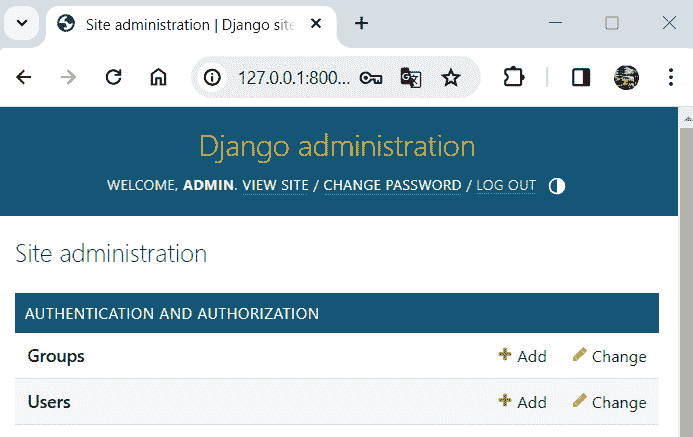

<st c="12280">图 5.6 – 网站管理页面</st>

<st c="12317">在</st> **<st c="12324">用户</st>**<st c="12329">下，您将看到您刚刚创建的用户，如图</st> *<st c="12384">图 5</st>**<st c="12392">.7</st>*<st c="12394">所示：</st>

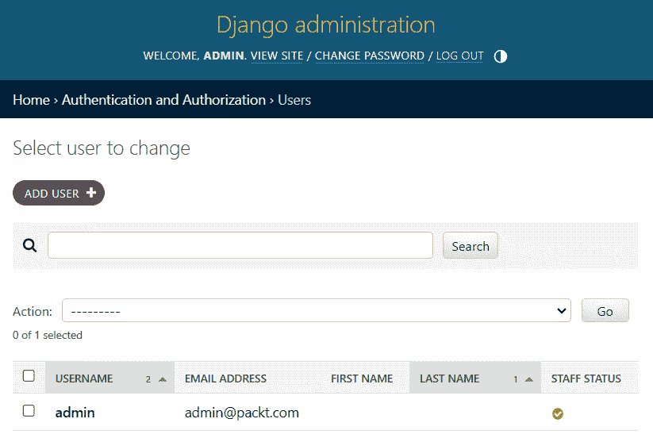

<st c="12681">图 5.7 – 用户管理页面</st>

<st c="12714">您可以在此处添加</st> <st c="12727">额外的用户账户</st> <st c="12761">以供您的团队使用。</st>

<st c="12771">目前，我们的</st> `<st c="12787">电影</st>` <st c="12792">模型在管理界面中未显示。</st> <st c="12825">我们需要明确告诉 Django 在管理界面中显示什么。</st> <st c="12882">在我们将</st> `<st c="12900">电影</st>` <st c="12905">模型添加到管理界面之前，让我们配置我们的项目，以便可以上传图像。</st>

# <st c="12981">配置图片上传</st>

<st c="13006">我们必须配置</st> <st c="13027">我们在添加图像时要存储的位置。</st> <st c="13080">首先，在</st> `<st c="13090">/moviesstore/settings.py</st>`<st c="13114">中，在文件末尾添加以下粗体内容：</st>

```py
 … <st c="13167">MEDIA_ROOT = os.path.join(BASE_DIR, 'media')</st>
<st c="13211">MEDIA_URL = '/media/'</st>
```

<st c="13233">让我们解释一下</st> <st c="13252">之前的代码：</st>

+   `<st c="13266">MEDIA_ROOT</st>`<st c="13277">: 这个变量指定了上传媒体文件将存储的文件系统路径。</st> <st c="13384">在此处，</st> `<st c="13390">BASE_DIR</st>` <st c="13398">是一个变量，代表 Django 项目的基目录，而</st> `<st c="13475">'media'</st>` <st c="13482">是位于</st> `<st c="13510">BASE_DIR</st>` <st c="13518">中的子目录，其中将存储媒体文件。</st> <st c="13553">因此，</st> `<st c="13557">MEDIA_ROOT</st>` <st c="13567">将被设置为类似</st> `<st c="13595">/your_project_folder/media</st>`<st c="13621">的路径。</st>

+   `<st c="13622">MEDIA_URL</st>`<st c="13632">: 这个变量指定了将用于从网络服务器提供媒体文件的 URL 前缀。</st> <st c="13734">在此代码中，它被设置为</st> `<st c="13760">'/media/'</st>`<st c="13769">，这意味着上传到 Django 应用程序的媒体文件将通过以</st> `<st c="13873">/media/</st>`<st c="13880">开头的 URL 进行访问。</st> 例如，如果你上传一个名为</st> `<st c="13924">example.jpg</st>`<st c="13935">的图片，它可能可以通过以下 URL</st> <st c="13969">访问</st> <st c="13974">http://localhost:8000/media/example.jpg</st><st c="14013">。</st>

<st c="14014">这样，服务器已经配置好了图像上传。</st> <st c="14056">因此，让我们学习如何提供</st> <st c="14104">这些图像。</st>

# <st c="14117">服务存储的图像</st>

<st c="14143">接下来，为了使服务器能够服务存储的图像，我们必须修改</st> `<st c="14221">/moviesstore/urls.py</st>` <st c="14241">文件，并添加以下</st> <st c="14269">粗体内容：</st>

```py
 … <st c="14279">from django.conf.urls.static import static</st>
<st c="14321">from django.conf import settings</st> urlpatterns = [
    path('admin/', admin.site.urls),
    path('', include('home.urls')),
    path('movies/', include('movies.urls')),
] <st c="14479">urlpatterns += static(settings.MEDIA_URL,</st>
<st c="14611">MEDIA_ROOT</st> directory when the <st c="14641">MEDIA_URL</st> URL prefix is accessed.
			<st c="14674">Note</st>
			<st c="14679">It’s important to stop the server and run the server again to apply the</st> <st c="14752">previous changes.</st>
			<st c="14769">Now that the image configuration is done, let’s add movies to the</st> <st c="14836">admin panel.</st>
			<st c="14848">Adding a movie model to the admin panel</st>
			<st c="14888">We are now ready to create movies from the admin panel and store the images in our Django project.</st> <st c="14988">We will add the</st> `<st c="15004">Movie</st>` <st c="15009">model to the admin panel, and we will</st> <st c="15048">create movies.</st>
			<st c="15062">Adding the Movie model to the admin panel</st>
			<st c="15104">To add the</st> `<st c="15116">Movie</st>` <st c="15121">model to the admin panel, go back to</st> `<st c="15159">/movies/admin.py</st>` <st c="15175">and</st> <st c="15180">register our model</st> <st c="15198">by adding the following</st> <st c="15223">in</st> **<st c="15226">bold</st>**<st c="15230">:</st>

```

from django.contrib import admin <st c="15266">from .models import Movie</st>

<st c="15392">/admin</st>. 现在，<st c="15404">电影</st> 模型将显示（如图</st> *<st c="15445">图 5</st>**<st c="15453">.8</st>）：

            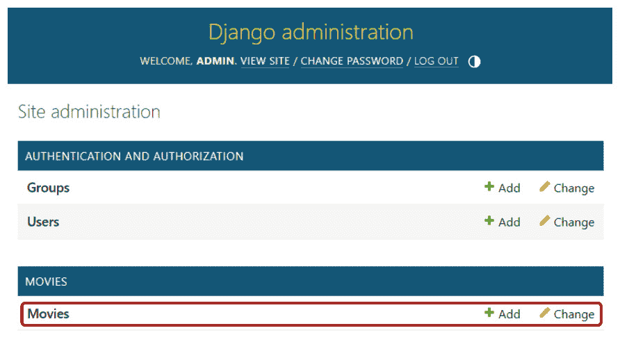

            <st c="15629">图 5.8 – 可用电影的管理页面</st>

            <st c="15674">通过点击</st> **<st c="15713">+添加</st>**<st c="15717">来尝试添加一个</st> `<st c="15688">电影</st>` <st c="15693">对象。您将被带到</st> **<st c="15746">添加电影</st>** <st c="15755">表单，如图</st> *<st c="15774">图 5</st>**<st c="15782">.9</st>*<st c="15784">所示：</st>

            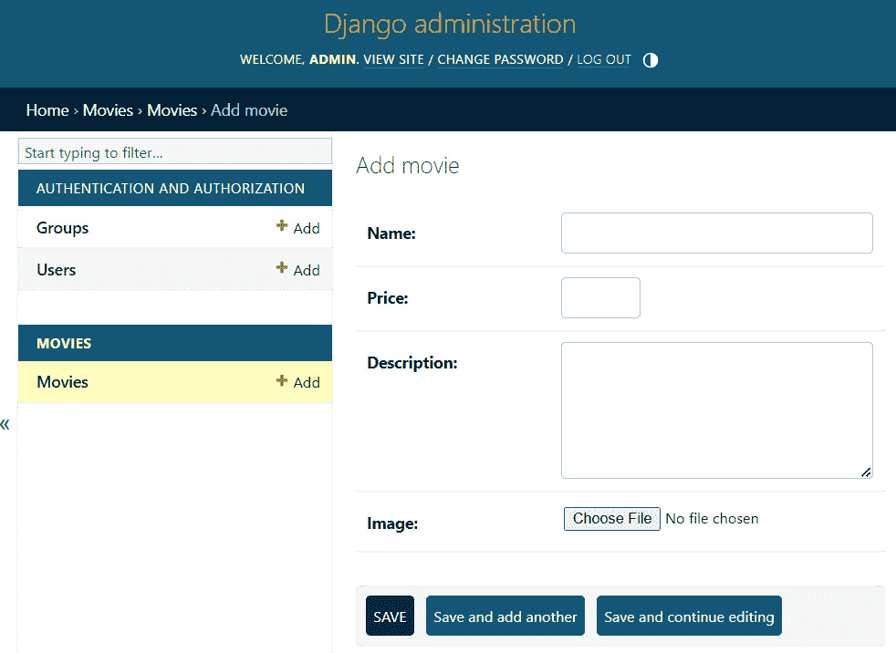

            <st c="16083">图 5.9 – 添加电影表单</st>

            <st c="16114">尝试添加一个电影并点击</st> **<st c="16142">保存</st>**<st c="16146">。您的电影对象将被保存到数据库中，并在管理页面中显示，如图</st> *<st c="16241">图 5</st>**<st c="16249">.10</st>*<st c="16252">所示：</st>

            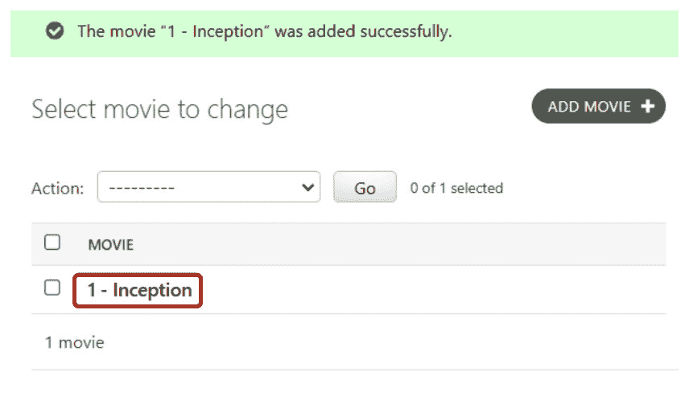

            <st c="16399">图 5.10 – 电影管理页面</st>

            <st c="16430">请注意，管理面板将电影信息显示为电影 ID 与短横线结合以及电影名称的组合。</st> <st c="16558">这是因为我们定义了</st> `<st c="16588">Movie</st>` <st c="16593">模型</st> 的 `<st c="16602">__str__</st>` <st c="16609">方法以这种方式工作。</st>

            <st c="16635">您还可以在</st> `<st c="16672">/moviesstore/media/movie_images/<image file>.jpg</st>`<st c="16720">中看到电影</st> <st c="16722">图像。</st> *<st c="16722">图 5</st>**<st c="16730">.11</st> <st c="16733">显示了存储在</st> <st c="16756">inception.jpg</st> <st c="16769">之前的文件夹中的图像：</st>

            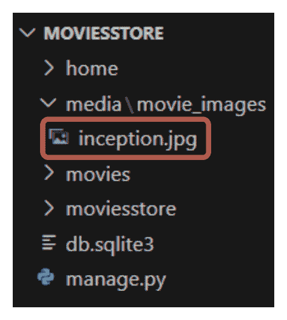

            <st c="16917">图 5.11 – 存储的电影图像位置</st>

            <st c="16962">每次您上传电影图像时，它将被存储在之前的文件夹中。</st> <st c="17040">通过这样，我们已经配置了我们的项目，使其能够存储和</st> <st c="17067">服务图像。</st>

            <st c="17118">总结</st>

            <st c="17126">在 Django 中处理数据库时，模型是必不可少的。</st> <st c="17186">在本章中，我们学习了 Django 模型的基础知识，并创建了一个</st> `<st c="17268">电影</st>` <st c="17273">模型。</st> <st c="17281">我们还学习了如何使用 Django 管理界面以及如何创建电影。</st> <st c="17361">在下一章中，我们将学习如何从我们的数据库中提取并显示存储在我们的网站上的电影。</st>

```py

```
