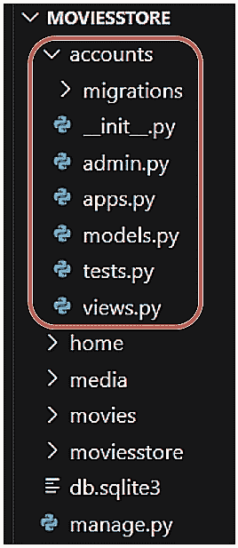
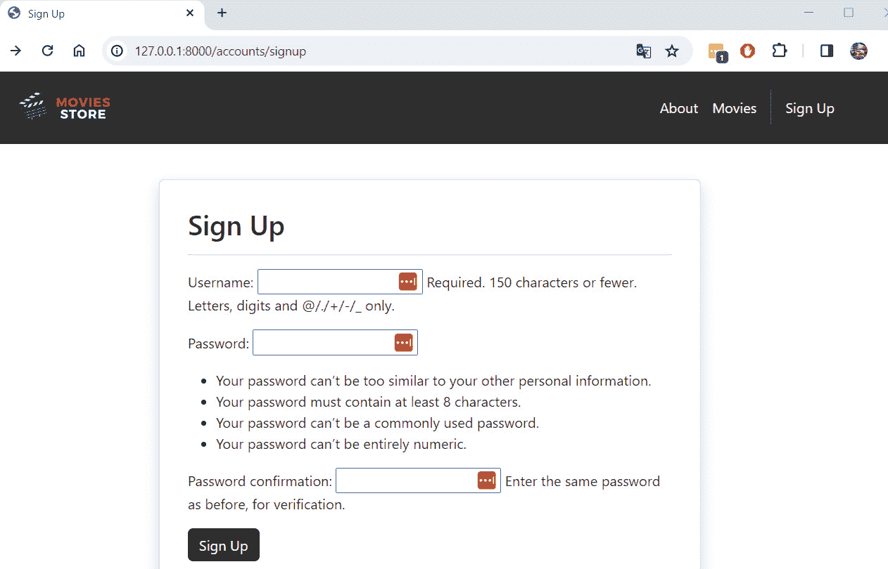
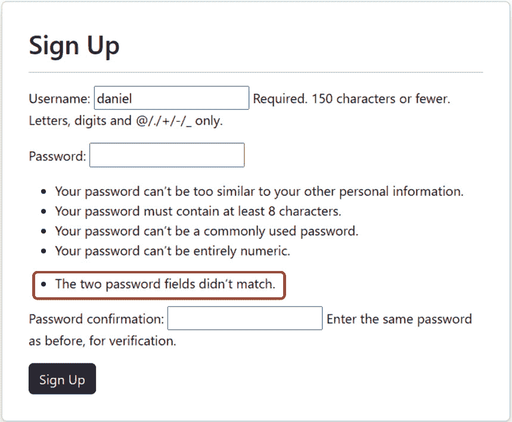
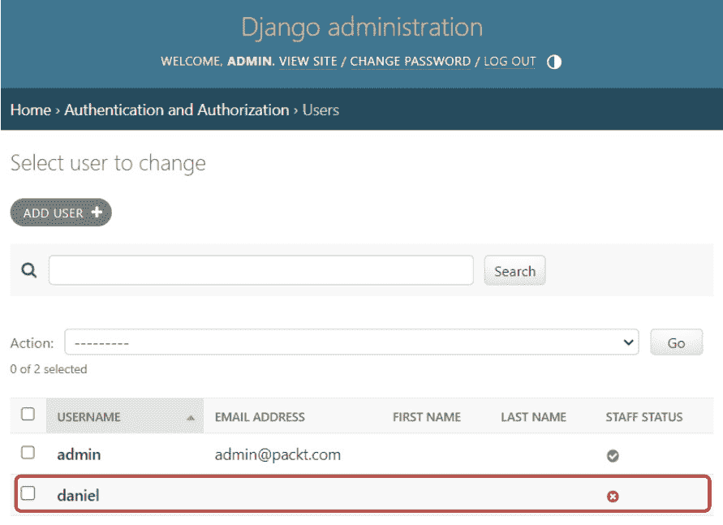
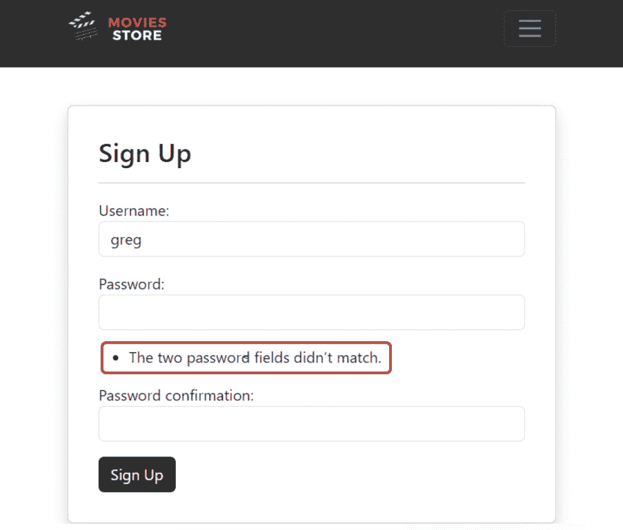
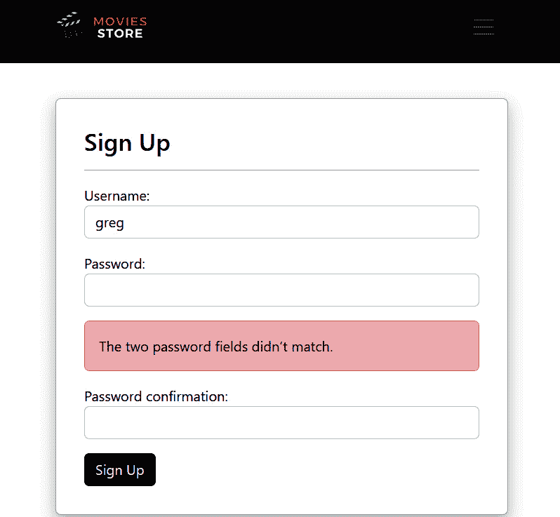
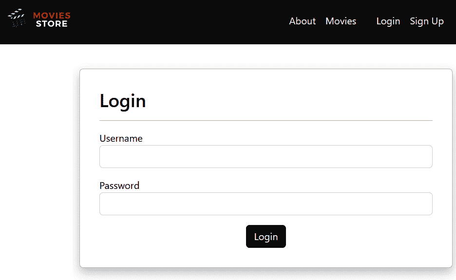

# 第九章：<st c="0">8</st>

# <st c="2">实现用户注册和登录</st>

<st c="36">我们应用的下个部分将涉及用户认证，在这里我们允许用户注册和登录。</st> <st c="140">实现用户认证是众所周知的困难。</st> <st c="191">幸运的是，我们可以使用 Django 强大的内置认证系统来处理可能出现的许多安全陷阱，如果我们从头开始创建自己的用户认证</st> <st c="373">的话。</st>

<st c="386">在本章中，我们将涵盖以下主题：</st>

+   <st c="439">创建一个</st> <st c="452">账户应用</st>

+   <st c="464">创建一个基本的</st> <st c="482">注册页面</st>

+   <st c="493">改进注册页面以处理</st> `<st c="528">POST</st>` <st c="532">操作</st>

+   <st c="540">自定义</st> `<st c="553">UserCreationForm</st>`

+   <st c="569">创建一个</st> <st c="581">登录页面</st>

+   <st c="591">实现登出功能</st>

<st c="629">在本章结束时，您将了解如何实现认证系统并处理常见的</st> <st c="732">认证操作。</st>

# <st c="755">技术要求</st>

<st c="778">在本章中，我们将使用 Python 3.10+。</st> <st c="822">此外，我们将在本书中使用 VS Code 编辑器，您可以从</st> <st c="904">这里</st> [<st c="909">https://code.visualstudio.com/</st>](https://code.visualstudio.com/)<st c="939">下载。</st>

<st c="940">本章的代码位于</st> <st c="978">此处</st> [<st c="981">https://github.com/PacktPublishing/Django-5-for-the-Impatient-Second-Edition/tree/main/Chapter08/moviesstore</st>](https://github.com/PacktPublishing/Django-5-for-the-Impatient-Second-Edition/tree/main/Chapter08/moviesstore)<st c="1089">。</st>

<st c="1090">本章的 CiA 视频可以在</st> <st c="1135">这里</st> [<st c="1138">https://packt.link/XmYIk</st>](https://packt.link/XmYIk)

# <st c="1162">创建一个账户应用</st>

<st c="1187">完整的用户认证系统包括一系列功能，如注册、登录、登出和一些验证。</st> <st c="1321">这些功能似乎都不属于我们的</st> *<st c="1373">主页</st>* <st c="1377">应用或</st> *<st c="1385">电影</st>* <st c="1391">应用，因此让我们在新的应用中分离它们。</st> <st c="1438">这个新应用将被</st> <st c="1459">命名为</st> `<st c="1466">accounts</st>`<st c="1474">。</st>

<st c="1475">我们将遵循以下步骤来创建和配置新应用：</st>

1.  <st c="1539">创建一个</st> <st c="1550">账户应用。</st>

1.  <st c="1563">将账户应用添加到</st> <st c="1592">设置文件中。</st>

1.  <st c="1606">在项目级别的 URL 文件中包含一个账户 URL 文件。</st>

<st c="1666">在接下来的几个部分中，我们将详细讨论这些步骤。</st>

## <st c="1739">创建一个账户应用</st>

<st c="1764">导航到最顶层的</st> `<st c="1785">moviesstore</st>` <st c="1796">文件夹（包含</st> `<st c="1831">manage.py</st>` <st c="1840">文件的文件夹）并在终端中运行以下命令：</st>

+   <st c="1885">对于 macOS，运行以下命令：</st>

    ```py
    <st c="1923">python3 manage.py startapp accounts</st>
    ```

+   <st c="1959">对于 Windows，运行以下命令：</st>

    ```py
    <st c="1999">python manage.py startapp accounts</st>
    ```

*<st c="2034">图 8</st>**<st c="2043">.1</st>* <st c="2045">显示了新的项目结构。</st> <st c="2079">请确认它与您的当前</st> <st c="2115">文件夹结构相匹配。</st>



<st c="2293">图 8.1 – 包含 accounts 应用的 MOVIESSTORE 项目结构</st>

<st c="2367">现在，让我们将</st> <st c="2383">accounts 应用添加到</st> <st c="2407">设置文件中。</st>

## <st c="2421">将 accounts 应用添加到设置文件中</st>

<st c="2466">记住</st> <st c="2476">我们必须在</st> `<st c="2528">settings.py</st>` <st c="2539">文件中注册每个新创建的应用。</st>

<st c="2545">在</st> `<st c="2549">/moviesstore/settings.py</st>`<st c="2573">中，在</st> `<st c="2581">INSTALLED_APPS</st>`<st c="2595">下，添加以下加粗的</st> <st c="2620">行</st> <st c="2623">：</st>

```py
 …
INSTALLED_APPS = [
    'django.contrib.admin',
    'django.contrib.auth',
    'django.contrib.contenttypes',
    'django.contrib.sessions',
    'django.contrib.messages',
    'django.contrib.staticfiles',
    'home',
    'movies', <st c="2830">'accounts',</st> ]
…
```

<st c="2845">现在，让我们将</st> <st c="2857">accounts URL 文件包含到</st> <st c="2890">我们的项目中。</st>

## <st c="2902">将 accounts URL 文件包含到项目级别的 URL 文件中</st>

<st c="2964">在</st> `<st c="2968">/moviesstore/urls.py</st>`<st c="2988">中，添加以下加粗的</st> <st c="2994">行：</st>

```py
 …
urlpatterns = [
    path('admin/', admin.site.urls),
    path('', include('home.urls')),
    path('movies/', include('movies.urls')), <st c="3153">path('accounts/', include('accounts.urls')),</st> ]
…
```

<st c="3201">在</st> `<st c="3230">accounts.urls</st>` <st c="3243">文件中定义的所有</st> `<st c="3265">accounts/</st>` <st c="3274">前缀（如前一个路径中定义的）</st> <st c="3317">都将包含。</st> <st c="3336">稍后我们将创建</st> `<st c="3336">accounts.urls</st>` <st c="3349">文件。</st>

<st c="3361">现在我们已经创建了 accounts 应用，让我们创建第一个功能，即注册页面。</st>

# <st c="3460">创建基本的注册页面</st>

<st c="3488">注册页面具有复杂的功能。</st> <st c="3534">我们需要考虑许多可能的场景。</st> <st c="3584">现在，让我们实现一个基本的注册页面。</st> <st c="3630">我们将在接下来的章节中重构和改进这个功能。</st>

<st c="3703">为了实现一个基本的注册页面，我们将遵循以下</st> <st c="3757">步骤：</st>

1.  <st c="3773">配置一个</st> <st c="3786">注册 URL。</st>

1.  <st c="3797">定义一个</st> `<st c="3807">注册</st>` <st c="3813">函数。</st>

1.  <st c="3823">创建一个</st> <st c="3843">accounts 注册模板。</st>

1.  <st c="3859">将注册链接添加到</st> <st c="3885">基本模板中。</st>

<st c="3899">接下来，让我们详细看看这些步骤。</st>

## <st c="3941">配置注册 URL</st>

<st c="3966">在</st> `<st c="3970">/accounts/</st>`<st c="3980">中，创建一个名为</st> `<st c="4007">urls.py</st>`<st c="4014">的新文件。这个文件将包含与账户应用 URL 相关的路径。</st> <st c="4090">目前，用以下代码填充它：</st>

```py
 from django.urls import path
from . import views
urlpatterns = [
    path('signup', views.signup, name='accounts.signup'),
]
```

<st c="4255">我们定义了一个</st> `<st c="4269">/signup</st>` <st c="4276">路径，但请记住，项目级别的 URL 文件为这个</st> `<st c="4364">urls.py</st>` <st c="4371">文件定义了一个</st> `<st c="4338">/accounts</st>` <st c="4347">前缀。</st> <st c="4378">所以，如果一个 URL 与</st> `<st c="4403">/accounts/signup</st>` <st c="4419">路径匹配，它将执行在</st> `<st c="4477">views</st>` <st c="4482">文件中定义的</st> `<st c="4446">signup</st>` <st c="4452">函数。</st> <st c="4489">接下来，我们将实现</st> `<st c="4517">signup</st>` <st c="4523">函数。</st>

## <st c="4533">定义注册函数</st>

<st c="4562">在</st> `<st c="4566">/accounts/views.py</st>`<st c="4584">中，添加以下加粗的行：</st>

```py
 from django.shortcuts import render <st c="4664">from django.contrib.auth.forms import UserCreationForm</st>
<st c="4718">def signup(request):</st>
 <st c="4739">template_data = {}</st>
 <st c="4758">template_data['title'] = 'Sign Up'</st>
 <st c="4793">if request.method == 'GET':</st>
 <st c="4821">template_data['form'] = UserCreationForm()</st>
 <st c="4864">return render(request, 'accounts/signup.html',</st>
 <st c="4911">{'template_data': template_data})</st>
```

<st c="4945">让我们解释</st> <st c="4960">代码：</st>

+   <st c="4969">我们导入了</st> `<st c="4982">UserCreationForm</st>`<st c="4998">，这是 Django 提供的一个内置表单类。</st> <st c="5051">它旨在简化用户注册表单的创建，特别是用于创建新用户账户。</st> <st c="5163">在 Django 中，我们可以创建自己的 HTML 表单，使用这些 Django 表单的一些，或者甚至自定义 Django 表单。</st> <st c="5276">在这本书中，我们将学习和使用这三种方法。</st>

+   <st c="5338">我们创建了我们的</st> `<st c="5354">template_data</st>` <st c="5367">变量，并给它</st> <st c="5393">分配了一个标题。</st>

+   <st c="5401">然后，我们检查当前的 HTTP 请求方法是否是</st> `<st c="5462">GET</st>`<st c="5465">。如果它是一个</st> `<st c="5478">GET</st>` <st c="5481">请求，这意味着用户通过</st> `<st c="5555">localhost:8000/accounts/signup</st>` <st c="5585">URL 导航到注册表单，在这种情况下，我们只需将</st> `<st c="5635">UserCreationForm</st>` <st c="5651">的一个实例发送到模板。</st> <st c="5669">最后，我们渲染了</st> `<st c="5694">accounts/signup.html</st>` <st c="5714">模板。</st>

<st c="5724">现在，让我们继续创建</st> <st c="5761">注册模板。</st>

## <st c="5777">创建账户注册模板</st>

<st c="5811">在</st> `<st c="5815">/accounts/</st>`<st c="5825">中，创建</st> <st c="5833">一个</st> `<st c="5836">templates</st>` <st c="5845">文件夹。</st> <st c="5854">然后，在</st> `<st c="5863">/accounts/templates/</st>`<st c="5883">中，创建一个</st> `<st c="5895">accounts</st>` <st c="5903">文件夹。</st>

`<st c="5911">现在，在</st>` `<st c="5920">/accounts/templates/accounts/</st>` `<st c="5949">，创建一个新文件，</st>` `<st c="5963">文件名为</st>` `<st c="5970">signup.html</st>` `<st c="5981">。目前，请用以下内容填充它：</st>`

```py
 

<div class="p-3 mt-4">
  <div class="container">
    <div class="row justify-content-center">
      <div class="col-md-8">
        <div class="card shadow p-3 mb-4 rounded">
          <div class="card-body">
            <h2>Sign Up</h2>
            <hr />
            <form method="POST">
              
              {{ template_data.form.as_p }}
              <button type="submit"
                class="btn bg-dark text-white">Sign Up
              </button>
            </form>
          </div>
        </div>
      </div>
    </div>
  </div>
</div>

```

`<st c="6482">让我们</st>` `<st c="6488">解释</st>` `<st c="6497">这段代码：</st>`

+   `<st c="6507">我们扩展了</st>` `<st c="6522">base.html</st>` `<st c="6531">模板。</st>`

+   `<st c="6541">我们定义了一个文本为</st>` `<st c="6584">注册</st>` `<st c="6591">的标题元素。</st>`

+   `<st c="6592">我们定义</st>` `<st c="6603">表单</st>` `<st c="6607">的方法为</st>` `<st c="6627">POST</st>` `<st c="6631">。这意味着当表单提交时，数据将通过 HTTP</st>` `<st c="6740">POST</st>` `<st c="6745">方法发送到当前服务器 URL。</st>`

+   在表单内部，我们使用 DTL `<st c="6785">csrf_token</st>` `<st c="6795">模板标签。</st>` `<st c="6810">它生成一个</st> **<st c="6825">跨站请求伪造</st>** `<st c="6851">(</st>**<st c="6853">CSRF</st>**<st c="6857">) 令牌，这</st>` `<st c="6873">有助于防止 CSRF 攻击。</st>` `<st c="6901">它确保表单提交来自渲染表单的同一站点。</st>` `<st c="6995">你应该为你的所有</st>` `<st c="7032">Django 表单</st>` `<st c="7036">使用此标签。</st>`

+   `<st c="7045">在表单内部，我们渲染</st>` `<st c="7073">template_data.form</st>` `<st c="7091">，它代表从视图函数传递过来的</st>` `<st c="7114">UserCreationForm</st>` `<st c="7130">实例。</st>` `<st c="7171">.as_p</st>` `<st c="7176">将表单字段渲染为 HTML 段落（</st>` `<st c="7221"><p></st>` `<st c="7225">），每个表单字段都包裹在其自己的段落中。</st>` `<st c="7280">默认情况下，</st>` `<st c="7292">UserCreationForm</st>` `<st c="7308">包含三个表单字段——</st>` `<st c="7338">用户名</st>` `<st c="7346">、</st>` `<st c="7348">密码</st>` `<st c="7356">和</st>` `<st c="7362">密码确认</st>` `<st c="7383">。</st>`

+   在表单内部，我们包含一个`<st c="7415">submit</st>` `<st c="7421">按钮。</st>` `<st c="7430">此按钮将使用 HTTP</st>` `<st c="7488">POST</st>` `<st c="7492">方法将用户重定向到当前 URL。</st>` `<st c="7501">目前，我们的注册视图函数仅指定了</st>` `<st c="7568">GET</st>` `<st c="7571">方法的逻辑。</st>` `<st c="7580">稍后，我们将实现</st>` `<st c="7623">POST</st>` `<st c="7627">方法的逻辑。</st>`

`<st c="7635">注意</st>`

`<st c="7640">除了</st>` `<st c="7656">form.as_p</st>` `<st c="7665">之外，还有其他选项可以用来使用不同的 HTML 标签渲染表单元素。</st>` `<st c="7742">你可以在以下位置找到更多信息：</st>` `<st c="7778">https://docs.djangoproject.com/en/5.0/ref/forms/api/#output-styles</st>` `[<st c="7778">https://docs.djangoproject.com/en/5.0/ref/forms/api/#output-styles</st>](https://docs.djangoproject.com/en/5.0/ref/forms/api/#output-styles)<st c="7844">。</st>`

现在，让我们通过添加注册链接到基础模板来完成。

## 添加注册链接到基础模板

在 `<st c="7961">/moviesstore/templates/base.html</st>` 中，在标题部分，添加以下粗体行：

```py
 …
        <div class="collapse navbar-collapse"
                    id="navbarNavAltMarkup">
          <div class="navbar-nav ms-auto navbar-ml">
            <a class="nav-link"
              href="">About</a>
            <a class="nav-link" href=
              "">Movies</a> <st c="8291"><div class="vr bg-white mx-2 d-none</st>
 <st c="8326">d-lg-block"></div></st>
 <st c="8345"><a class="nav-link"</st>
 <st c="8365">href=""></st>
 <st c="8401">Sign Up</st>
 <st c="8409"></a></st> </div>
        </div>
        …
```

现在，保存这些文件，运行服务器，并访问 [<st c="8479">http://localhost:8000/accounts/signup</st>](http://localhost:8000/accounts/signup)；你应该能看到新的 *<st c="8542">注册</st>* 页面（<st c="8555">图 8</st>**<st c="8564">.2</st>**）。



图 8.2 – 注册页面

注意，如果你尝试完成并提交表单，它将显示错误。这是因为我们还没有完成 `<st c="9195">注册</st>` 函数。

# 改进注册页面以处理 POST 操作

当用户提交注册表单时，我们必须处理请求并在管理员中创建一个用户。为了实现这一点，我们将修改 `<st c="9399">注册</st>` 函数。

在 `<st c="9415">/accounts/views.py</st>` 中，添加以下粗体行：

```py
 from django.shortcuts import render
from django.contrib.auth.forms import UserCreationForm <st c="9572">from django.shortcuts import redirect</st> def signup(request):
    template_data = {}
    template_data['title'] = 'Sign Up'
    if request.method == 'GET':
        template_data['form'] = UserCreationForm()
        return render(request, 'accounts/signup.html',
            {'template_data': template_data}) **<st c="9837">elif request.method == 'POST':</st>**
 **<st c="9867">form = UserCreationForm(request.POST)</st>**
 **<st c="9905">if form.is_valid():</st>**
 **<st c="9925">form.save()</st>**
 **<st c="9937">return redirect('home.index')</st>**
 **<st c="9967">else:</st>**
 **<st c="9973">template_data['form'] = form</st>**
 **<st c="10002">return render(request, 'accounts/signup.html',</st>**
 **<st c="10049">{'template_data': template_data})</st>**
```

**<st c="10083">让我们解释</st> <st c="10097">这段代码：</st>

+   我们导入 `<st c="10123">redirect</st>` 函数，该函数用于在应用程序内部重定向用户到不同的 URL。

+   我们添加一个 `<st c="10230">elif</st>` 部分。该部分检查 HTTP 请求方法是否为 `<st c="10299">POST</st>`，表示表单已被提交。

+   在 `<st c="10361">elif</st>` 部分内部，我们创建一个 `<st c="10404">UserCreationForm</st>` 类的实例，将请求的 `<st c="10464">POST</st>` 参数（<st c="10481">request.POST</st>`）传递给表单字段以填充数据。这使用提交的数据初始化表单。<st c="10526">这将使用提交的数据初始化表单。</st>

+   `<st c="10581">if form.is_valid()</st>` 检查提交的表单数据是否有效，根据 `<st c="10698">UserCreationForm</st>` 类中定义的验证规则。这些验证包括两个密码字段匹配，密码不是常见的，用户名是唯一的，以及其他一些验证。

    +   <st c="10853">如果表单数据有效，</st> `<st c="10881">form.save()</st>` <st c="10892">将用户数据保存到数据库。</st> <st c="10930">这意味着使用提供的用户名和密码创建一个新的用户账户。</st> <st c="11010">此外，我们根据 URL</st> `<st c="11044">模式名称</st>` <st c="11048">将用户重定向到</st> `<st c="11044">主页</st>`。</st>

    +   <st c="11084">如果表单数据无效，则执行</st> `<st c="11120">else</st>` <st c="11124">部分，并将表单（包括错误）传递到模板中，再次渲染</st> `<st c="11221">accounts/signup.html</st>` <st c="11241">模板。</st>

<st c="11257">现在，运行服务器，并前往</st> [<st c="11289">http://localhost:8000/accounts/signup</st>](http://localhost:8000/accounts/signup)<st c="11326">。首先，尝试使用两个不匹配的密码注册用户（</st>*<st c="11395">图 8</st>**<st c="11404">.3</st>*<st c="11406">）。</st>



<st c="11843">图 8.3 – 出错的注册页面</st>

<st c="11884">然后，尝试使用适当的信息注册</st> <st c="11907">一个用户，你应该会被重定向到</st> *<st c="11975">主页</st>* <st c="11979">。</st> <st c="11986">然后，前往</st> [<st c="11998">http://127.0.0.1:8000/admin/</st>](http://127.0.0.1:8000/admin/)<st c="12026">，导航到</st> *<st c="12044">用户</st>* <st c="12049">部分，你应该能在数据库中看到新注册的用户（</st>*<st c="12119">图 8</st>**<st c="12128">.4</st>*<st c="12130">）。</st>



<st c="12355">图 8.4 – 用户管理页面</st>

<st c="12388">我们现在</st> <st c="12400">可以注册用户。</st> <st c="12416">现在，让我们</st> <st c="12427">自定义</st> `<st c="12437">UserCreationForm</st>`<st c="12453">。</st>

# <st c="12454">自定义 UserCreationForm</st>

`<st c="12483">UserCreationForm</st>` <st c="12500">当前</st> <st c="12511">显示了相当多的附加帮助文本（默认包含），这使我们的表单显得杂乱。</st> <st c="12604">为了解决这个问题，我们可以自定义</st> `<st c="12637">UserCreationForm</st>` <st c="12653">（这是一个很大的主题）。</st> <st c="12689">在这里，我们将对</st> <st c="12771">注册页面</st> <st c="12771">进行一些简单的修改，以改善其外观和感觉。</st>

<st c="12783">为了</st> <st c="12787">实施这些修改，我们将遵循</st> <st c="12833">以下步骤：</st>

1.  <st c="12845">创建</st> `<st c="12853">CustomUserCreationForm</st>`<st c="12875">。</st>

1.  <st c="12876">更新</st> `<st c="12888">注册</st>` <st c="12894">函数以</st> <st c="12907">使用</st> `<st c="12911">CustomUserCreationForm</st>`<st c="12933">。</st>

1.  <st c="12934">自定义错误</st> <st c="12960">显示方式。</st>

<st c="12974">我们将在接下来的</st> <st c="12983">几个小节中详细说明这些步骤。</st>

## <st c="13051">创建 CustomUserCreationForm</st>

<st c="13083">在</st> `<st c="13087">/accounts/</st>`<st c="13097"> 中，创建一个名为</st> <st c="13108">new file called</st> `<st c="13124">forms.py</st>`<st c="13132"> 的新文件。这个文件将包含 *<st c="13181">accounts</st>* <st c="13189">应用的自定义表单。</st> <st c="13195">目前，用以下代码填充它：</st>

```py
 from django.contrib.auth.forms import UserCreationForm
class CustomUserCreationForm(UserCreationForm):
    def __init__(self, *args, **kwargs):
        super(CustomUserCreationForm, self).__init__
            (*args, **kwargs)
        for fieldname in ['username', 'password1',
        'password2']:
            self.fields[fieldname].help_text = None
            self.fields[fieldname].widget.attrs.update(
                {'class': 'form-control'}
            )
```

<st c="13611">让我们解释</st> <st c="13626">这段代码：</st>

+   <st c="13635">我们从 Django 的</st> `<st c="13650">UserCreationForm</st>` <st c="13666">类中导入。</st>

+   <st c="13708">我们创建一个名为</st> `<st c="13737">CustomUserCreationForm</st>`<st c="13759"> 的新类，它继承自</st> `<st c="13781">UserCreationForm</st>`<st c="13797">，使其成为 Django 内置用户</st> <st c="13846">创建表单的子类。</st>

+   <st c="13860">我们定义类构造函数（即</st> `<st c="13898">__init__</st>` <st c="13906">方法）。</st> <st c="13916">构造函数通过</st> `<st c="14007">super</st>` <st c="14012">方法调用父类的构造函数（</st>`<st c="13975">UserCreationForm</st>`<st c="13992">）。</st>

+   <st c="14020">然后，我们</st> <st c="14029">遍历由</st> `<st c="14069">UserCreationForm</st>`<st c="14085"> 提供的字段。这些是</st> `<st c="14097">'username'</st>`<st c="14107">,</st> `<st c="14109">'password1'</st>`<st c="14120"> 和</st> `<st c="14126">'password2'</st>`<st c="14137">。对于循环中指定的每个字段，我们将</st> `<st c="14188">help_text</st>` <st c="14197">属性设置为</st> `<st c="14211">None</st>`<st c="14215">，这将移除与这些字段关联的任何帮助文本。</st> <st c="14275">最后，对于循环中指定的每个字段，我们添加 CSS</st> `<st c="14337">form-control</st>` <st c="14349">类到字段的控件中。</st> <st c="14379">这是一个 Bootstrap 类，它改善了字段的视觉效果。</st>

<st c="14451">接下来，让我们在我们的</st> `<st c="14498">signup</st>` <st c="14504">函数中使用</st> `<st c="14468">CustomUserCreationForm</st>` <st c="14490">。</st>

## <st c="14514">将注册功能更新为使用 CustomUserCreationForm</st>

<st c="14573">让我们使用这个新表单来改善注册页面的视觉效果。</st>

在 `<st c="14645">/accounts/views.py</st>`<st c="14667"> 中，添加以下加粗的行：</st>

```py
 from django.shortcuts import render <st c="14747">from .forms import CustomUserCreationForm</st> from django.shortcuts import redirect
def signup(request):
    template_data = {}
    template_data['title'] = 'Sign Up'
    if request.method == 'GET':
        template_data['form'] = <st c="14954">CustomUserCreationForm</st>()
        return render(request, 'accounts/signup.html',
            {'template_data': template_data})
    elif request.method == 'POST':
        form = <st c="15099">CustomUserCreationForm</st>(request.POST)
        if form.is_valid():
            form.save()
            return redirect('home.index')
        else:
            template_data['form'] = form
            return render(request, 'accounts/signup.html',
                {'template_data': template_data})
```

<st c="15314">在更新的代码中，我们移除了对</st> `<st c="15361">UserCreationForm</st>` <st c="15377">的导入，并添加了对</st> `<st c="15402">CustomUserCreationForm</st>`<st c="15424">的导入。</st> 然后，我们将对</st> `<st c="15457">UserCreationForm()</st>` <st c="15475">的调用替换为对</st> `<st c="15494">CustomUserCreationForm()</st>`<st c="15518">的调用。</st>

<st c="15519">现在，保存这些文件，运行服务器，前往</st> [<st c="15565">http://localhost:8000/accounts/signup</st>](http://localhost:8000/accounts/signup)<st c="15602">，并尝试使用两个不匹配的密码注册一个用户（</st>*<st c="15668">图 8</st>**<st c="15677">.5</st>*<st c="15679">）；你会看到外观和感觉</st> <st c="15719">已经得到了改善。</st>



<st c="15798">图 8.5 – 带有错误的改进注册页面</st>

<st c="15847">我们可以改进</st> <st c="15863">错误显示的方式。</st> <st c="15893">所以，让我们在下一节中自定义它。</st>

## <st c="15938">自定义错误显示方式</st>

<st c="15979">让我们自定义 Django 表单显示错误的方式。</st> <st c="15999">在</st> `<st c="16036">/accounts/forms.py</st>`<st c="16054">中，添加以下加粗的行：</st> <st c="16089">（加粗）：</st>

```py
 from django.contrib.auth.forms import UserCreationForm <st c="16153">from django.forms.utils import ErrorList</st>
<st c="16193">from django.utils.safestring import mark_safe</st>
<st c="16239">class CustomErrorList(ErrorList):</st>
 <st c="16273">def __str__(self):</st>
 <st c="16292">if not self:</st>
 <st c="16305">return ''</st>
 <st c="16315">return mark_safe(''.join([</st>
 <st c="16342">f'<div class="alert alert-danger" role="alert"></st>
 <st c="16390">{e}</div>' for e in self]))</st> class CustomUserCreationForm(UserCreationForm):
    …
```

<st c="16468">让我们解释</st> <st c="16482">一下代码：</st>

+   <st c="16492">我们导入</st> `<st c="16507">ErrorList</st>` <st c="16516">类，这是一个默认类，用于存储和显示与</st> <st c="16617">表单字段相关的验证错误消息。</st>

+   <st c="16629">我们导入</st> `<st c="16644">mark_safe</st>` <st c="16653">函数，该函数用于将字符串标记为适合 HTML 渲染，表示它不包含任何有害内容，应该原样渲染，无需转义。</st> <st c="16807">（无需转义直接渲染）。</st>

+   <st c="16824">我们定义了一个名为</st> `<st c="16853">CustomErrorList</st>`<st c="16868">的新类，它扩展了 Django 的</st> `<st c="16893">ErrorList</st>` <st c="16902">类。</st> <st c="16910">这将是我们定义自定义错误外观和感觉的类。</st>

+   <st c="16974">我们重写了</st> `<st c="16991">__str__()</st>` <st c="17000">方法，这是基类</st> `<st c="17020">ErrorList</st>` <st c="17029">的方法。</st> <st c="17037">如果错误列表为空（即没有错误），它返回一个空字符串，表示不应生成任何 HTML。</st> <st c="17166">否则，它定义了一个自定义 HTML 代码，该代码使用</st> `<st c="17217"><div></st>` <st c="17222">元素和 Bootstrap CSS 类来改进错误显示的方式。</st> <st c="17303">它还使用了</st> `<st c="17320">mark_safe</st>` <st c="17329">函数来渲染代码，保持原样。</st>

<st c="17364">现在我们已经定义了这个</st> `<st c="17395">CustomErrorList</st>` <st c="17410">类，我们只需要指定给我们的表单我们将使用它。</st>

<st c="17475">在</st> `<st c="17479">/accounts/views.py</st>`<st c="17497">中，添加以下</st> <st c="17517">粗体内容：</st>

```py
 from django.shortcuts import render
from .forms import CustomUserCreationForm<st c="17603">, CustomErrorList</st> from django.shortcuts import redirect
def signup(request):
    template_data = {}
    template_data['title'] = 'Sign Up'
    if request.method == 'GET':
        template_data['form'] = CustomUserCreationForm()
        return render(request, 'accounts/signup.html',
            {'template_data': template_data})
    elif request.method == 'POST':
        form = CustomUserCreationForm(request.POST<st c="17965">,</st>
 <st c="17966">error_class=CustomErrorList</st>)
        ...
```

<st c="18000">我们导入了</st> <st c="18013">我们的</st> `<st c="18017">CustomErrorList</st>` <st c="18032">类，并将此类作为参数传递给</st> `<st c="18083">CustomUserCreationForm</st>`<st c="18105">。这次，如果在提交注册表单时发现错误，表单将使用我们的</st> `<st c="18193">CustomErrorList</st>` <st c="18208">类，并使用我们的自定义 HTML 和</st> <st c="18263">CSS 代码显示错误。</st>

<st c="18272">现在，保存这些文件，运行服务器，转到</st> [<st c="18318">http://localhost:8000/accounts/signup</st>](http://localhost:8000/accounts/signup)<st c="18355">，并尝试使用两个不匹配的密码注册用户（</st>*<st c="18421">图 8</st>**<st c="18430">.6</st>*<st c="18432">）；你会看到外观和感觉</st> <st c="18472">已经改进。</st>



<st c="18581">图 8.6 – 改进错误样式的注册页面</st>

<st c="18639">我们已经改进了我们的错误的外观和感觉。</st> <st c="18657">现在，让我们实现一个</st> <st c="18713">登录页面。</st>

# <st c="18724">创建登录页面</st>

<st c="18746">让我们</st> <st c="18753">实现登录页面。</st> <st c="18779">这次，我们不会使用 Django 表单；我们将创建自己的 HTML 表单（为了学习一种新方法）。</st> <st c="18877">让我们按照以下步骤进行：</st>

1.  <st c="18910">配置登录 URL。</st>

1.  <st c="18933">定义</st> `<st c="18945">登录</st>` <st c="18950">函数。</st>

1.  <st c="18960">创建一个账户</st> <st c="18980">登录模板。</st>

1.  <st c="18995">在基础模板中添加一个链接。</st>

1.  <st c="19028">将已注册用户重定向到</st> <st c="19063">登录页面。</st>

<st c="19074">我们将在下一章的几个小节中深入探讨创建登录页面的这些步骤。</st>

## <st c="19159">配置登录 URL</st>

<st c="19183">在</st> `<st c="19187">/accounts/urls.py</st>`<st c="19204">中，添加</st> <st c="19210">以下路径</st> <st c="19229">的粗体内容：</st>

```py
 from django.urls import path
from . import views
urlpatterns = [
    path('signup', views.signup, name='accounts.signup'), <st c="19357">path('login/', views.login, name='accounts.login'),</st> ]
```

<st c="19410">因此，如果 URL 与</st> `<st c="19435">/accounts/login</st>` <st c="19450">路径匹配，它将执行在</st> `<st c="19477">views</st>` <st c="19507">文件中定义的</st> `<st c="19482">登录</st>` <st c="19512">函数。</st>

<st c="19518">现在我们有了新的路径，让我们定义</st> `<st c="19567">登录</st>` <st c="19572">函数。</st>

## <st c="19582">定义登录函数</st>

<st c="19606">在</st> `<st c="19610">/accounts/views.py</st>`<st c="19628">中，添加以下加粗的行：</st>

```py
 from django.shortcuts import render <st c="19708">from django.contrib.auth import login as auth_login, authenticate</st> from .forms import CustomUserCreationForm, CustomErrorList
from django.shortcuts import redirect <st c="19871">def login(request):</st>
 <st c="19890">template_data = {}</st>
 <st c="19909">template_data['title'] = 'Login'</st>
 <st c="19942">if request.method == 'GET':</st>
 <st c="19970">return render(request, 'accounts/login.html',</st>
 <st c="20016">{'template_data': template_data})</st>
 <st c="20050">elif request.method == 'POST':</st>
 <st c="20081">user = authenticate(</st>
 <st c="20102">request,</st>
 <st c="20111">username = request.POST['username'],</st>
 <st c="20148">password = request.POST['password']</st>
 <st c="20184">)</st>
 <st c="20186">if user is None:</st>
 <st c="20203">template_data['error'] =</st>
 <st c="20228">'The username or password is incorrect.'</st>
 <st c="20269">return render(request, 'accounts/login.html',</st>
 <st c="20315">{'template_data': template_data})</st>
 <st c="20349">else:</st>
 <st c="20355">auth_login(request, user)</st>
 <st c="20381">return redirect('home.index')</st> def signup(request):
    …
```

<st c="20434">让我们</st> <st c="20441">解释</st> <st c="20449">代码：</st>

+   <st c="20458">我们导入</st> `<st c="20469">login</st>` <st c="20474">和</st> `<st c="20479">authenticate</st>`<st c="20491">。这些用于用户认证。</st> <st c="20533">我们导入</st> `<st c="20543">login</st>` <st c="20548">并使用别名（</st>`<st c="20564">auth_login</st>`<st c="20575">）以避免与</st> `<st c="20606">login</st>` <st c="20611">函数名混淆。</st>

+   <st c="20626">我们创建</st> `<st c="20641">login</st>` <st c="20646">函数。</st> <st c="20657">此函数定义</st> `<st c="20679">template_data</st>` <st c="20692">并检查</st> `<st c="20697">request.method</st>`<st c="20718">。</st>

+   <st c="20719">对于</st> `<st c="20724">GET</st>` <st c="20727">请求，函数渲染</st> `<st c="20763">accounts/login.html</st>` <st c="20782">模板。</st>

+   <st c="20792">对于</st> `<st c="20797">POST</st>` <st c="20801">请求，函数尝试使用提供的</st> `<st c="20878">username</st>` <st c="20886">和</st> `<st c="20891">password</st>`<st c="20899">进行用户认证。如果认证失败，它将再次渲染带有错误信息的登录模板。</st> <st c="20985">如果认证成功，它将登录用户并将</st> <st c="21037">他们重定向到</st> *<st c="21059">主页</st>* <st c="21063">。</st>

<st c="21069">现在，让我们创建需要</st> `<st c="21119">login</st>` <st c="21124">函数的模板。</st>

## <st c="21134">创建账户登录模板</st>

<st c="21167">在</st> `<st c="21171">/accounts/templates/accounts/</st>`<st c="21200">中，创建一个新文件，</st> `<st c="21221">login.html</st>`<st c="21231">。此文件</st> <st c="21243">包含登录页面的 HTML。</st> <st c="21281">目前，用以下内容填充</st> <st c="21295">它：</st>

```py
 

<div class="p-3 mt-4">
  <div class="container">
    <div class="row justify-content-center">
      <div class="col-md-8">
        <div class="card shadow p-3 mb-4 rounded">
          <div class="card-body">
            <h2>Login</h2>
            <hr />
            
            <div class="alert alert-danger" role="alert">
              {{ template_data.error }}
            </div>
            
            <form method="POST">
              
              <p>
                <label for="username">Username</label>
                <input id="username" type="text"
                       name="username" required
                       autocomplete="username"
                       class="form-control">
              </p>
              <p>
                <label for="password">Password</label>
                <input id="password" type="password"
                       name="password" required
                       autocomplete="current-password"
                       class="form-control">
              </p>
              <div class="text-center">
                <button type="submit"
                  class="btn bg-dark text-white">Login
                </button>
              </div>
            </form>
          </div>
        </div>
      </div>
    </div>
  </div>
</div>

```

<st c="22215">让我们</st> <st c="22222">解释</st> <st c="22230">代码：</st>

+   <st c="22239">我们扩展</st> `<st c="22254">base.html</st>` <st c="22263">模板并定义一个包含文本</st> `<st c="22311">Login</st>`<st c="22316">的标题元素。</st>

+   <st c="22322">我们检查是否有错误，如果有，</st> <st c="22370">则显示它。</st>

+   <st c="22381">我们创建一个具有</st> `<st c="22412">POST</st>` <st c="22416">方法</st> 和</st> `<st c="22432">csrf_token</st>` <st c="22442">令牌</st> 的 HTML 表单。</st> <st c="22450">此表单包含两个输入，一个用于用户名，另一个用于密码。</st> <st c="22532">它还包含一个</st> <st c="22551">提交按钮。</st>

<st c="22565">让我们继续，将登录链接添加到</st> <st c="22613">基本模板。</st>

## <st c="22627">将链接添加到基本模板</st>

<st c="22664">让我们</st> <st c="22671">在基本模板中添加登录链接。</st> <st c="22712">在</st> `<st c="22715">/moviesstore/templates/base.html</st>`<st c="22747">中，在标题部分，添加以下加粗的</st> <st c="22803">行：</st>

```py
 …
          <div class="navbar-nav ms-auto navbar-ml">
            <a class="nav-link"
              href="">About</a>
            <a class="nav-link"
              href="">Movies</a>
            <div class=
              "vr bg-white mx-2 d-none d-lg-block"></div> <st c="23035"><a class="nav-link"</st>
 <st c="23054">href="">Login</a></st> <a class="nav-link"
              href="">Sign Up
            </a>
          </div>
          …
```

<st c="23175">现在，保存</st> <st c="23185">这些文件，运行服务器，并访问</st> [<st c="23225">http://localhost:8000/accounts/login</st>](http://localhost:8000/accounts/login)<st c="23261">；您将看到新的</st> **<st c="23285">登录</st>** <st c="23290">页面（</st>*<st c="23297">图 8</st>**<st c="23306">.7</st>*<st c="23308">）。</st>



<st c="23367">图 8.7 – 登录页面</st>

<st c="23394">现在我们有了登录页面，让我们在用户创建</st> <st c="23473">账户时将其重定向到该页面。</st>

## <st c="23484">将注册用户重定向到登录页面</st>

<st c="23532">让我们通过将刚刚注册的用户重定向到</st> `<st c="23625">/accounts/views.py</st>`<st c="23643">，添加以下加粗的</st> <st c="23663">内容来结束本节：</st>

```py
 …
def signup(request):
    template_data = {}
    template_data['title'] = 'Sign Up'
    if request.method == 'GET':
        template_data['form'] = CustomUserCreationForm()
        return render(request, 'accounts/signup.html',
            {'template_data': template_data})
    elif request.method == 'POST':
        form = CustomUserCreationForm(request.POST,
            error_class=CustomErrorList)
        if form.is_valid():
            form.save()
            return redirect(<st c="24058">'accounts.login</st>')
            …
```

<st c="24079">我们刚刚修改了重定向到</st> **<st c="24120">登录</st>** <st c="24125">页面的操作。</st> <st c="24132">尝试创建一个新用户，他们应该被重定向到</st> **<st c="24195">登录</st>** <st c="24200">页面。</st>

<st c="24206">让我们通过实现</st> <st c="24253">登出功能</st>来结束这一章。

# <st c="24274">实现登出功能</st>

<st c="24310">我们将</st> <st c="24317">按照以下</st> <st c="24328">步骤进行：</st>

1.  <st c="24344">配置一个</st> <st c="24357">登出 URL。</st>

1.  <st c="24368">定义</st> `<st c="24380">登出</st>` <st c="24386">函数。</st>

1.  <st c="24396">在</st> <st c="24403">基本模板中</st> <st c="24415">添加一个</st>链接。

<st c="24429">我们将在接下来的章节中执行这些步骤。</st>

## <st c="24483">配置登出 URL</st>

<st c="24508">在</st> `<st c="24512">/accounts/urls.py</st>`<st c="24529">中，添加</st> <st c="24534">以下加粗的</st> <st c="24552">路径：</st>

```py
 from django.urls import path
from . import views
urlpatterns = [
    path('signup', views.signup, name='accounts.signup'),
    path('login/', views.login, name='accounts.login'), <st c="24732">path('logout/', views.logout, name='accounts.logout'),</st> ]
```

<st c="24788">现在，如果 URL 与</st> `<st c="24814">/accounts/logout</st>` <st c="24830">路径匹配，它将执行在</st> `<st c="24857">views</st>` <st c="24863">文件中定义的</st> `<st c="24888">登出</st>` <st c="24893">函数。</st>

## <st c="24899">定义登出函数</st>

<st c="24928">在</st> `<st c="24932">/accounts/views.py</st>`<st c="24950">中，添加</st> <st c="24956">以下加粗的</st> <st c="24985">行：</st>

```py
 from django.shortcuts import render
from django.contrib.auth import login as auth_login, authenticate<st c="25095">, logout as auth_logout</st> from .forms import CustomUserCreationForm, CustomErrorList
from django.shortcuts import redirect <st c="25216">from django.contrib.auth.decorators import login_required</st>
<st c="25273">@login_required</st>
<st c="25289">def logout(request):</st>
 <st c="25310">auth_logout(request)</st>
 <st c="25331">return redirect('home.index')</st> def login(request):
    …
```

<st c="25383">让我们解释</st> <st c="25397">以下代码：</st>

+   <st c="25407">我们导入</st> `<st c="25422">登出</st>` <st c="25428">函数作为</st> `<st c="25441">auth_logout</st>`<st c="25452">。这用于登出用户。</st>

+   <st c="25485">我们导入了</st> `<st c="25496">login_required</st>`<st c="25510">，这是一个装饰器，用于确保只有经过身份验证的用户才能访问特定的视图函数。</st> <st c="25609">Django</st> **<st c="25618">装饰器</st>** <st c="25627">是一个函数，它</st> <st c="25646">包装另一个函数或方法以修改其行为。</st> <st c="25704">装饰器通常用于诸如认证、权限</st> <st c="25781">和日志记录等。</st>

+   <st c="25793">我们创建了一个</st> `<st c="25808">注销</st>` <st c="25814">函数，该函数使用了</st> `<st c="25840">login_required</st>` <st c="25854">装饰器。</st> <st c="25866">这意味着只有经过身份验证的用户才能访问</st> <st c="25918">此函数。</st>

+   <st c="25932">`<st c="25937">注销</st>` <st c="25943">函数调用</st> `<st c="25959">auth_logout</st>`<st c="25970">，该函数用于注销当前用户。</st> <st c="26015">然后，该函数将用户重定向到</st> *<st c="26060">主页</st>* <st c="26064">。</st>

<st c="26070">接下来，让我们将注销链接添加到</st> <st c="26110">基本模板。</st>

## <st c="26124">将链接添加到基本模板</st>

<st c="26161">在</st> `<st c="26165">/moviesstore/templates/base.html</st>`<st c="26197">中，在标题部分，添加以下</st> <st c="26239">行，这些行是</st> <st c="26255">粗体：</st>

```py
 …
            <a class="nav-link"
              href="">About</a>
            <a class="nav-link"
              href="">Movies</a>
            <div class=
              "vr bg-white mx-2 d-none d-lg-block"></div> <st c="26444"></st>
 <st c="26474"><a class="nav-link"</st>
 <st c="26494">href="">Logout ({{</st>
 <st c="26540">user.username }})</a></st>
 <st c="26562"></st> <a class="nav-link"
              href="">Login</a>
            <a class="nav-link"
              href="">Sign Up
            </a> <st c="26706"></st> …
```

<st c="26718">我们使用了一个</st> <st c="26727">Django 模板标签，该标签检查用户是否经过身份验证（已登录）。</st> <st c="26806">这种验证来自 Django 的认证系统。</st> <st c="26865">如果用户经过身份验证，我们显示</st> *<st c="26910">注销</st>* <st c="26916">选项（包括用户名）。</st> <st c="26955">否则，我们显示</st> *<st c="26981">登录</st>* <st c="26986">和</st> *<st c="26991">注册</st>* *<st c="26996">选项。</st>

<st c="27007">现在，保存这些文件，运行服务器，并访问</st> [<st c="27057">http://localhost:8000/</st>](http://localhost:8000/)<st c="27079">；您将看到导航栏选项如何根据用户是否登录而改变（</st>*<st c="27163">图 8</st>**<st c="27172">.8</st>*<st c="27174">）。</st>


<st c="27300">图 8.8 – 更新后的主页</st>

<st c="27350">我们已经完成了</st> <st c="27372">用户注册、登录和</st> <st c="27397">注销系统。</st>

# <st c="27411">总结</st>

<st c="27419">在本章中，我们实现了一个完整的认证系统。</st> <st c="27486">现在，用户可以注册、登录和注销。</st> <st c="27531">我们还学习了如何利用一些 Django 表单，如何创建我们自己的 HTML 表单，以及如何处理验证</st> <st c="27655">和错误。</st>

<st c="27666">在下一章中，我们将实现一个电影</st> <st c="27714">评论系统。</st>**
